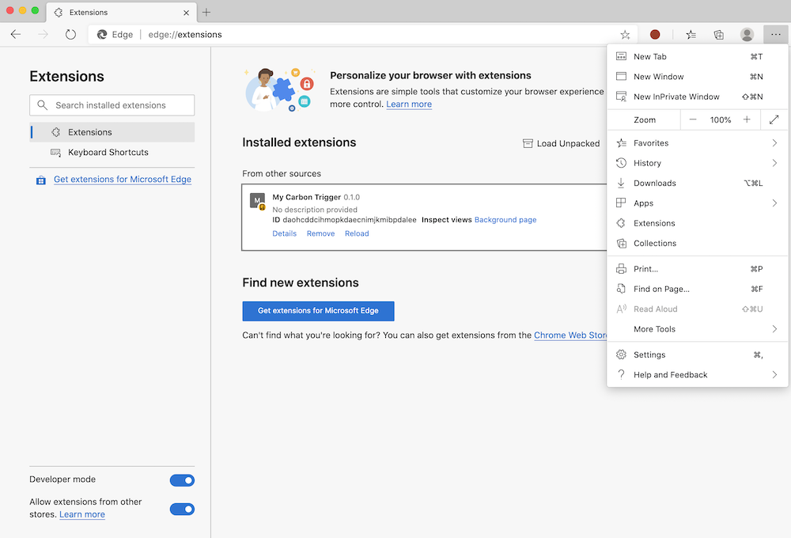
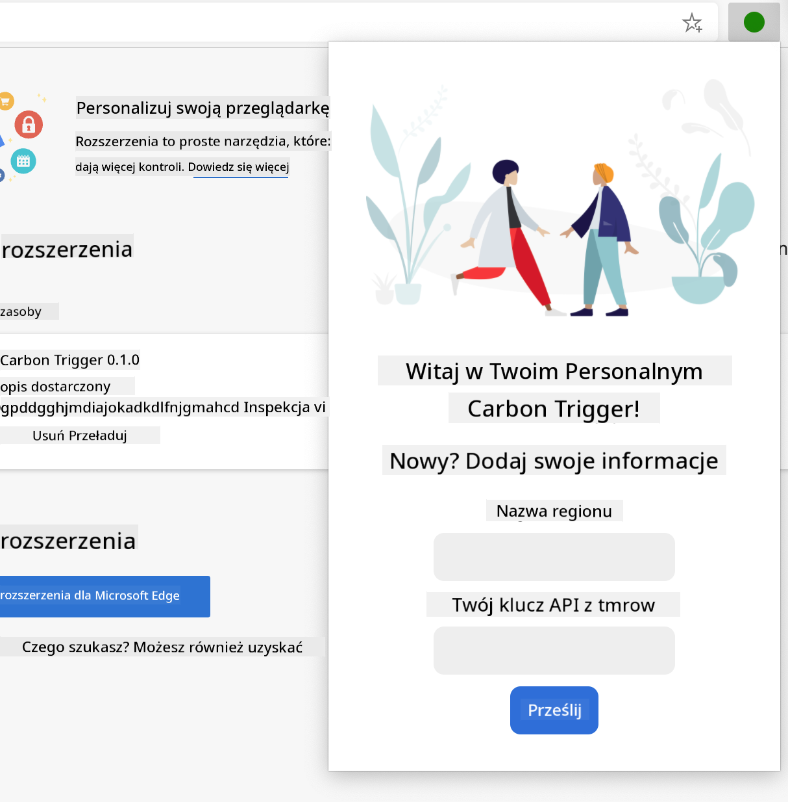
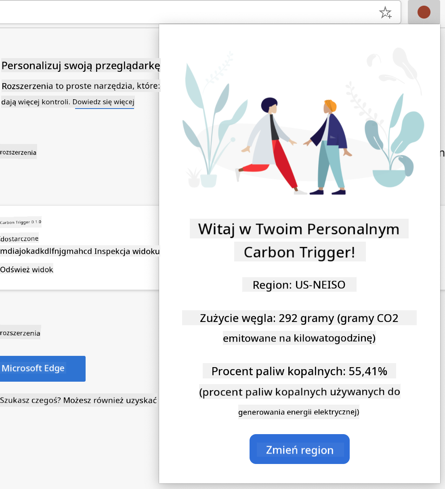

<!--
CO_OP_TRANSLATOR_METADATA:
{
  "original_hash": "2326d04e194a10aa760b51f5e5a1f61d",
  "translation_date": "2025-08-29T16:26:23+00:00",
  "source_file": "5-browser-extension/1-about-browsers/README.md",
  "language_code": "pl"
}
-->
# Projekt Rozszerzenia Przeglądarki, Część 1: Wszystko o Przeglądarkach


> Sketchnote autorstwa [Wassim Chegham](https://dev.to/wassimchegham/ever-wondered-what-happens-when-you-type-in-a-url-in-an-address-bar-in-a-browser-3dob)

## Quiz Przed Lekcją

[Quiz przed lekcją](https://ff-quizzes.netlify.app/web/quiz/23)

### Wprowadzenie

Rozszerzenia przeglądarki dodają dodatkowe funkcje do przeglądarki. Zanim jednak zaczniesz tworzyć własne, warto dowiedzieć się, jak działają przeglądarki.

### O przeglądarkach

W tej serii lekcji nauczysz się, jak stworzyć rozszerzenie przeglądarki, które będzie działać w przeglądarkach Chrome, Firefox i Edge. W tej części dowiesz się, jak działają przeglądarki i jak zaprojektować elementy rozszerzenia przeglądarki.

Czym właściwie jest przeglądarka? To aplikacja, która pozwala użytkownikowi końcowemu uzyskać dostęp do treści z serwera i wyświetlić je na stronach internetowych.

✅ Trochę historii: pierwsza przeglądarka nazywała się „WorldWideWeb” i została stworzona przez Sir Timothy'ego Berners-Lee w 1990 roku.


> Niektóre z pierwszych przeglądarek, via [Karen McGrane](https://www.slideshare.net/KMcGrane/week-4-ixd-history-personal-computing)

Kiedy użytkownik łączy się z internetem za pomocą adresu URL (Uniform Resource Locator), zazwyczaj korzystając z protokołu Hypertext Transfer Protocol przez adres `http` lub `https`, przeglądarka komunikuje się z serwerem internetowym i pobiera stronę internetową.

W tym momencie silnik renderujący przeglądarki wyświetla stronę na urządzeniu użytkownika, którym może być telefon komórkowy, komputer stacjonarny lub laptop.

Przeglądarki mają również możliwość buforowania treści, dzięki czemu nie muszą ich pobierać z serwera za każdym razem. Mogą zapisywać historię przeglądania użytkownika, przechowywać „ciasteczka”, czyli małe fragmenty danych zawierające informacje o aktywności użytkownika, i wiele więcej.

Ważne jest, aby pamiętać, że przeglądarki nie są takie same! Każda z nich ma swoje mocne i słabe strony, a profesjonalny twórca stron internetowych musi wiedzieć, jak sprawić, by strony działały dobrze w różnych przeglądarkach. Obejmuje to obsługę małych ekranów, takich jak telefony komórkowe, a także użytkowników, którzy są offline.

Bardzo przydatną stroną, którą warto dodać do zakładek w swojej ulubionej przeglądarce, jest [caniuse.com](https://www.caniuse.com). Podczas tworzenia stron internetowych warto korzystać z list obsługiwanych technologii na tej stronie, aby jak najlepiej wspierać swoich użytkowników.

✅ Jak sprawdzić, które przeglądarki są najpopularniejsze wśród użytkowników Twojej strony? Sprawdź swoje statystyki - możesz zainstalować różne pakiety analityczne w ramach procesu tworzenia stron internetowych, które pokażą Ci, z jakich przeglądarek korzystają użytkownicy.

## Rozszerzenia przeglądarki

Dlaczego warto tworzyć rozszerzenia przeglądarki? To przydatne narzędzie, które można dodać do przeglądarki, aby szybko uzyskać dostęp do często powtarzanych zadań. Na przykład, jeśli często sprawdzasz kolory na różnych stronach internetowych, możesz zainstalować rozszerzenie przeglądarki do wybierania kolorów. Jeśli masz problem z zapamiętywaniem haseł, możesz użyć rozszerzenia do zarządzania hasłami.

Tworzenie rozszerzeń przeglądarki to także świetna zabawa. Zazwyczaj zarządzają one ograniczoną liczbą zadań, które wykonują bardzo dobrze.

✅ Jakie są Twoje ulubione rozszerzenia przeglądarki? Jakie zadania wykonują?

### Instalowanie rozszerzeń

Zanim zaczniesz tworzyć, przyjrzyj się procesowi budowania i wdrażania rozszerzenia przeglądarki. Chociaż każda przeglądarka nieco różni się w sposobie zarządzania tym zadaniem, proces jest podobny w Chrome i Firefox do tego przykładu w Edge:



> Uwaga: Upewnij się, że włączyłeś tryb deweloperski i zezwoliłeś na rozszerzenia z innych sklepów.

W zasadzie proces wygląda następująco:

- zbuduj swoje rozszerzenie za pomocą `npm run build` 
- przejdź w przeglądarce do panelu rozszerzeń, korzystając z przycisku „Ustawienia i więcej” (ikona `...`) w prawym górnym rogu
- jeśli to nowa instalacja, wybierz `load unpacked`, aby załadować nowe rozszerzenie z folderu build (w naszym przypadku to `/dist`) 
- lub kliknij `reload`, jeśli przeładowujesz już zainstalowane rozszerzenie

✅ Te instrukcje dotyczą rozszerzeń, które tworzysz samodzielnie; aby zainstalować rozszerzenia dostępne w sklepie rozszerzeń przeglądarki, przejdź do tych [sklepów](https://microsoftedge.microsoft.com/addons/Microsoft-Edge-Extensions-Home) i zainstaluj wybrane rozszerzenie.

### Rozpocznij

Stworzysz rozszerzenie przeglądarki, które wyświetla ślad węglowy Twojego regionu, pokazując zużycie energii i źródło tej energii. Rozszerzenie będzie zawierało formularz, który zbiera klucz API, aby uzyskać dostęp do API CO2 Signal.

**Potrzebujesz:**

- [klucz API](https://www.co2signal.com/); wpisz swój adres e-mail w polu na tej stronie, a klucz zostanie wysłany do Ciebie
- [kod dla Twojego regionu](http://api.electricitymap.org/v3/zones) odpowiadający [Electricity Map](https://www.electricitymap.org/map) (na przykład w Bostonie używam 'US-NEISO').
- [kod startowy](../../../../5-browser-extension/start). Pobierz folder `start`; będziesz uzupełniać kod w tym folderze.
- [NPM](https://www.npmjs.com) - NPM to narzędzie do zarządzania pakietami; zainstaluj je lokalnie, a pakiety wymienione w pliku `package.json` zostaną zainstalowane do użycia w Twoim projekcie

✅ Dowiedz się więcej o zarządzaniu pakietami w tym [świetnym module na Learn](https://docs.microsoft.com/learn/modules/create-nodejs-project-dependencies/?WT.mc_id=academic-77807-sagibbon)

Poświęć chwilę, aby przejrzeć bazę kodu:

dist
    -|manifest.json (ustawienia domyślne tutaj)
    -|index.html (znaczniki HTML front-end tutaj)
    -|background.js (JS w tle tutaj)
    -|main.js (zbudowany JS)
src
    -|index.js (Twój kod JS tutaj)

✅ Gdy masz już klucz API i kod regionu, zapisz je gdzieś w notatce do późniejszego wykorzystania.

### Tworzenie HTML dla rozszerzenia

To rozszerzenie ma dwa widoki. Jeden do zbierania klucza API i kodu regionu:



I drugi do wyświetlania zużycia węgla w regionie:



Zacznijmy od stworzenia HTML dla formularza i stylizowania go za pomocą CSS.

W folderze `/dist` stworzysz formularz i obszar wyników. W pliku `index.html` wypełnij wyznaczony obszar formularza:

```HTML
<form class="form-data" autocomplete="on">
	<div>
		<h2>New? Add your Information</h2>
	</div>
	<div>
		<label for="region">Region Name</label>
		<input type="text" id="region" required class="region-name" />
	</div>
	<div>
		<label for="api">Your API Key from tmrow</label>
		<input type="text" id="api" required class="api-key" />
	</div>
	<button class="search-btn">Submit</button>
</form>	
```
To jest formularz, w którym zapisane informacje będą wprowadzane i przechowywane w pamięci lokalnej.

Następnie utwórz obszar wyników; pod ostatnim tagiem formularza dodaj kilka divów:

```HTML
<div class="result">
	<div class="loading">loading...</div>
	<div class="errors"></div>
	<div class="data"></div>
	<div class="result-container">
		<p><strong>Region: </strong><span class="my-region"></span></p>
		<p><strong>Carbon Usage: </strong><span class="carbon-usage"></span></p>
		<p><strong>Fossil Fuel Percentage: </strong><span class="fossil-fuel"></span></p>
	</div>
	<button class="clear-btn">Change region</button>
</div>
```
Na tym etapie możesz spróbować zbudować projekt. Upewnij się, że zainstalowałeś zależności pakietów tego rozszerzenia:

```
npm install
```

To polecenie użyje npm, Menedżera Pakietów Node, do zainstalowania webpacka dla procesu budowania Twojego rozszerzenia. Webpack to narzędzie do bundlowania, które obsługuje kompilację kodu. Wynik tego procesu możesz zobaczyć w `/dist/main.js` - zobaczysz, że kod został zbundlowany.

Na razie rozszerzenie powinno się zbudować i, jeśli wdrożysz je w Edge jako rozszerzenie, zobaczysz ładnie wyświetlony formularz.

Gratulacje, zrobiłeś pierwsze kroki w kierunku stworzenia rozszerzenia przeglądarki. W kolejnych lekcjach uczynisz je bardziej funkcjonalnym i użytecznym.

---

## 🚀 Wyzwanie

Przejrzyj sklep z rozszerzeniami przeglądarki i zainstaluj jedno z nich. Możesz zbadać jego pliki w interesujący sposób. Co odkrywasz?

## Quiz Po Lekcji

[Quiz po lekcji](https://ff-quizzes.netlify.app/web/quiz/24)

## Przegląd i Samodzielna Nauka

W tej lekcji dowiedziałeś się trochę o historii przeglądarek internetowych; wykorzystaj tę okazję, aby dowiedzieć się więcej o tym, jak wynalazcy World Wide Web wyobrażali sobie jego użycie, czytając więcej o jego historii. Przydatne strony to:

[Historia przeglądarek internetowych](https://www.mozilla.org/firefox/browsers/browser-history/)

[Historia internetu](https://webfoundation.org/about/vision/history-of-the-web/)

[Wywiad z Timem Berners-Lee](https://www.theguardian.com/technology/2019/mar/12/tim-berners-lee-on-30-years-of-the-web-if-we-dream-a-little-we-can-get-the-web-we-want)

## Zadanie

[Zmień styl swojego rozszerzenia](assignment.md)

---

**Zastrzeżenie**:  
Ten dokument został przetłumaczony za pomocą usługi tłumaczenia AI [Co-op Translator](https://github.com/Azure/co-op-translator). Chociaż dokładamy wszelkich starań, aby zapewnić poprawność tłumaczenia, prosimy pamiętać, że automatyczne tłumaczenia mogą zawierać błędy lub nieścisłości. Oryginalny dokument w jego rodzimym języku powinien być uznawany za wiarygodne źródło. W przypadku informacji o kluczowym znaczeniu zaleca się skorzystanie z profesjonalnego tłumaczenia przez człowieka. Nie ponosimy odpowiedzialności za jakiekolwiek nieporozumienia lub błędne interpretacje wynikające z użycia tego tłumaczenia.