<!--
CO_OP_TRANSLATOR_METADATA:
{
  "original_hash": "00aa85715e1efd4930c17a23e3012e69",
  "translation_date": "2026-01-06T19:27:20+00:00",
  "source_file": "5-browser-extension/1-about-browsers/README.md",
  "language_code": "pl"
}
-->
# Projekt rozszerzenia przeglądarki część 1: Wszystko o przeglądarkach

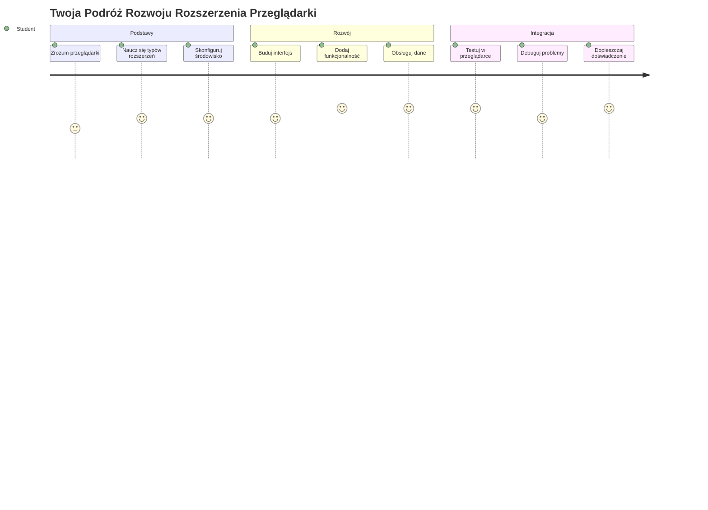
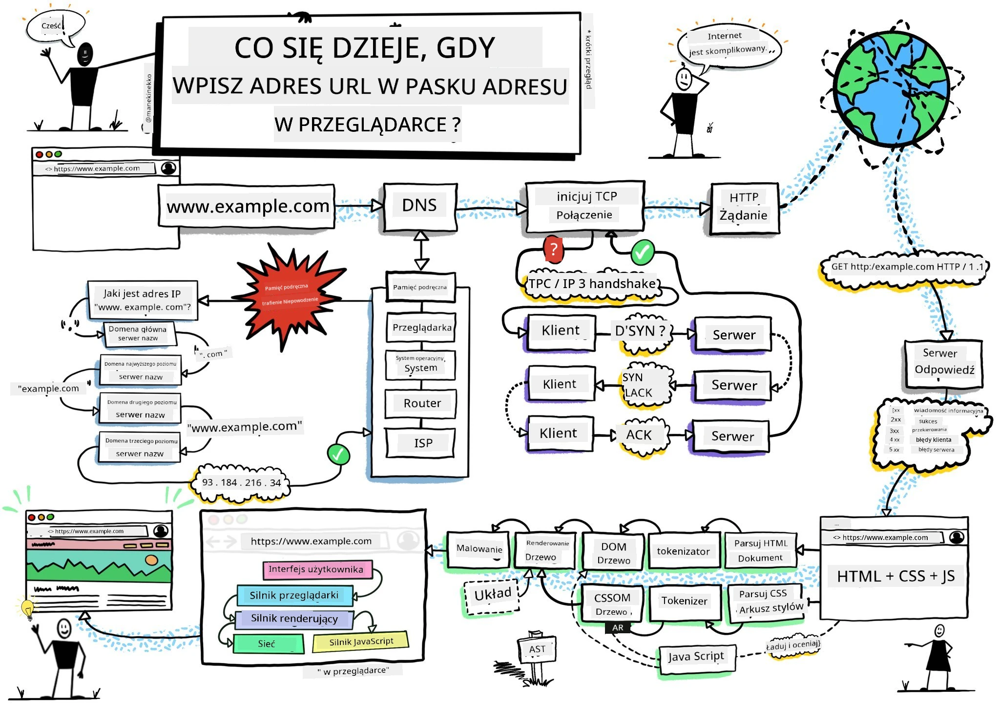
> Sketchnote autorstwa [Wassim Chegham](https://dev.to/wassimchegham/ever-wondered-what-happens-when-you-type-in-a-url-in-an-address-bar-in-a-browser-3dob)

## Quiz przed wykładem

[Quiz przed wykładem](https://ff-quizzes.netlify.app/web/quiz/23)

### Wprowadzenie

Rozszerzenia przeglądarki to mini-aplikacje, które ulepszają Twoje doświadczenie podczas przeglądania sieci. Podobnie jak oryginalna wizja Tima Berners-Lee dotycząca interaktywnego internetu, rozszerzenia poszerzają możliwości przeglądarki poza proste przeglądanie dokumentów. Od menedżerów haseł, które chronią Twoje konta, po wybieraki kolorów ułatwiające projektantom dobieranie idealnych odcieni, rozszerzenia rozwiązują codzienne problemy związane z przeglądaniem.

Zanim stworzymy Twoje pierwsze rozszerzenie, zrozummy, jak działają przeglądarki. Podobnie jak Alexander Graham Bell musiał poznać transmisję dźwięku przed wynalezieniem telefonu, znajomość podstaw przeglądarek pomoże Ci tworzyć rozszerzenia, które płynnie integrują się z istniejącymi systemami przeglądarek.

Pod koniec tej lekcji zrozumiesz architekturę przeglądarek i rozpoczniesz tworzenie swojego pierwszego rozszerzenia.

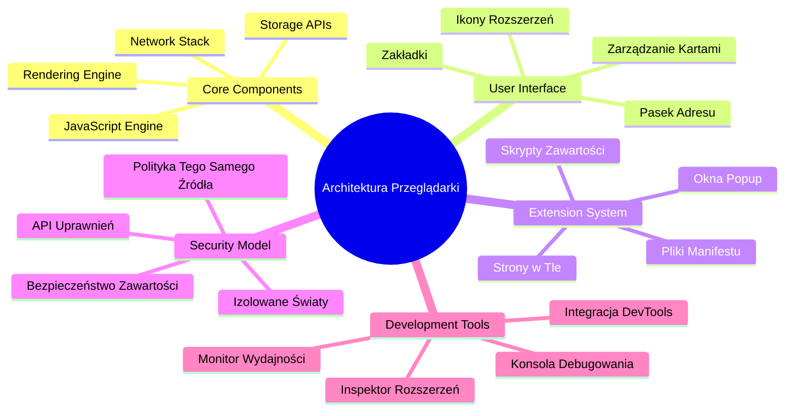
## Zrozumienie przeglądarek internetowych

Przeglądarka internetowa to w zasadzie zaawansowany interpreter dokumentów. Gdy wpisujesz "google.com" w pasek adresu, przeglądarka wykonuje złożony szereg operacji – żąda treści z serwerów na całym świecie, następnie analizuje i renderuje ten kod na interaktywne strony internetowe, które widzisz.

Proces ten odzwierciedla sposób, w jaki pierwsza przeglądarka internetowa, WorldWideWeb, została zaprojektowana przez Tima Berners-Lee w 1990 roku, aby uczynić dokumenty z hiperłączami dostępnymi dla wszystkich.

✅ **Trochę historii**: Pierwsza przeglądarka nazywała się „WorldWideWeb” i została stworzona przez Sir Timothy’ego Berners-Lee w 1990 roku.

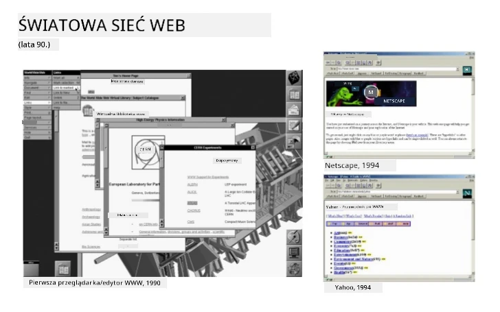
> Niektóre wczesne przeglądarki, za [Karen McGrane](https://www.slideshare.net/KMcGrane/week-4-ixd-history-personal-computing)

### Jak przeglądarki przetwarzają zawartość sieci

Proces od wpisania adresu URL do zobaczenia strony internetowej obejmuje kilka zsynchronizowanych kroków, które następują w ciągu sekund:

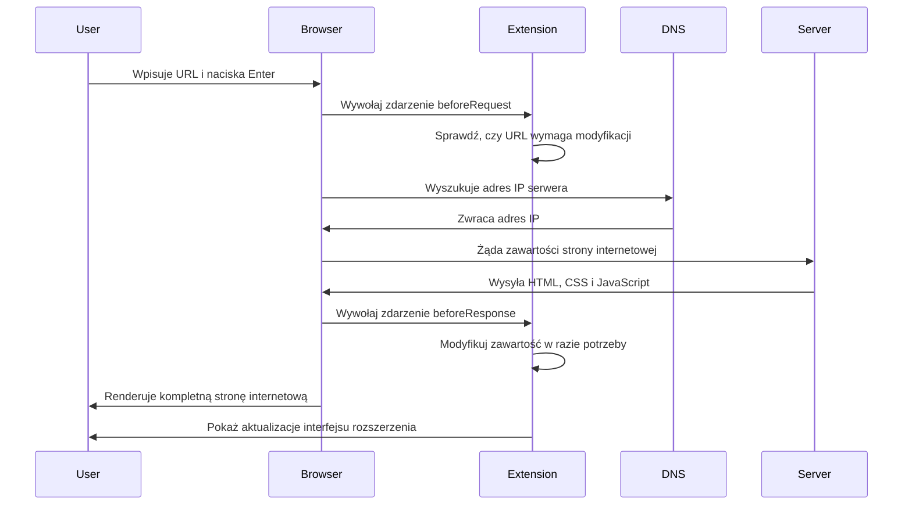
**Oto, co osiąga ten proces:**
- **Przekształca** czytelny dla człowieka adres URL w adres IP serwera poprzez zapytanie DNS
- **Nawiązuje** bezpieczne połączenie z serwerem WWW za pomocą protokołów HTTP lub HTTPS
- **Żąda** konkretnej zawartości strony internetowej z serwera
- **Otrzymuje** kod HTML, style CSS i kod JavaScript z serwera
- **Renderuje** całą zawartość na interaktywną stronę internetową, którą widzisz

### Kluczowe funkcje przeglądarki

Nowoczesne przeglądarki oferują wiele funkcji, które deweloperzy rozszerzeń mogą wykorzystać:

| Funkcja | Cel | Możliwości dla rozszerzeń |
|---------|---------|------------------------|
| **Silnik renderujący** | Wyświetla HTML, CSS i JavaScript | Modyfikacja zawartości, wstrzykiwanie stylów |
| **Silnik JavaScript** | Wykonuje kod JavaScript | Skrypty niestandardowe, interakcje z API |
| **Pamięć lokalna** | Przechowuje dane lokalnie | Preferencje użytkownika, dane w cache |
| **Stos sieciowy** | Obsługuje żądania sieciowe | Monitorowanie żądań, analiza danych |
| **Model bezpieczeństwa** | Chroni użytkowników przed złośliwą zawartością | Filtrowanie treści, ulepszenia bezpieczeństwa |

**Zrozumienie tych funkcji pomaga Ci:**
- **Określić**, gdzie Twoje rozszerzenie może wnieść największą wartość
- **Wybrać** odpowiednie API przeglądarki dla funkcji Twojego rozszerzenia
- **Projektować** rozszerzenia, które działają efektywnie z systemami przeglądarki
- **Zapewnić**, że Twoje rozszerzenie przestrzega najlepszych praktyk bezpieczeństwa przeglądarek

### Rozważania przy tworzeniu rozszerzeń międzyprzeglądarkowych

Różne przeglądarki implementują standardy z drobnymi różnicami, podobnie jak różne języki programowania mogą inaczej obsługiwać ten sam algorytm. Chrome, Firefox i Safari mają unikalne cechy, które deweloperzy muszą uwzględnić podczas tworzenia rozszerzeń.

> 💡 **Profesjonalna wskazówka**: Korzystaj z [caniuse.com](https://www.caniuse.com), aby sprawdzić, które technologie sieciowe są obsługiwane w różnych przeglądarkach. To nieocenione przy planowaniu funkcji rozszerzenia!

**Kluczowe kwestie przy tworzeniu rozszerzeń:**
- **Testuj** rozszerzenie we wszystkich przeglądarkach Chrome, Firefox oraz Edge
- **Dostosowuj** się do różnych API przeglądarek i formatów manifestu
- **Radź sobie** z różnymi charakterystykami wydajności i ograniczeniami
- **Zaproponuj** rozwiązania zapasowe dla funkcji specyficznych dla danej przeglądarki, które mogą nie być dostępne

✅ **Analiza danych**: Możesz określić, które przeglądarki preferują Twoi użytkownicy przez instalację pakietów analitycznych w swoich projektach sieciowych. Dane te pomagają ustalić priorytety wsparcia przeglądarek.

## Zrozumienie rozszerzeń przeglądarki

Rozszerzenia przeglądarki rozwiązują typowe problemy podczas przeglądania dzięki dodaniu funkcji bezpośrednio do interfejsu przeglądarki. Zamiast wymagać oddzielnych aplikacji lub skomplikowanych procesów, rozszerzenia zapewniają natychmiastowy dostęp do narzędzi i funkcji.

Ten koncept odzwierciedla wizję pionierów komputerów, takich jak Douglas Engelbart, którzy przewidywali rozszerzanie zdolności człowieka przy pomocy technologii – rozszerzenia powiększają podstawową funkcjonalność Twojej przeglądarki.

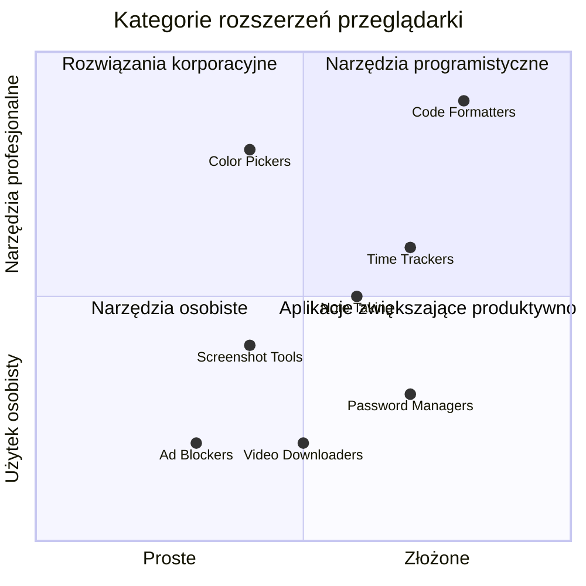
**Popularne kategorie rozszerzeń i ich korzyści:**
- **Narzędzia produktywności**: Menedżery zadań, aplikacje do notatek i timery pomagające zachować porządek
- **Ulepszenia bezpieczeństwa**: Menedżery haseł, bloker reklam i narzędzia prywatności chroniące Twoje dane
- **Narzędzia dla deweloperów**: Formatery kodu, wybieraki kolorów i narzędzia debugujące usprawniające rozwój
- **Ulepszenie zawartości**: Tryby czytania, pobieracze wideo i narzędzia do zrzutów ekranu poprawiające przeglądanie

✅ **Pytanie refleksyjne**: Jakie są Twoje ulubione rozszerzenia przeglądarki? Jakie wykonywane przez nie konkretne zadania i w jaki sposób poprawiają Twoje przeglądanie?

### 🔄 **Sprawdzenie pedagogiczne**
**Zrozumienie architektury przeglądarki**: Zanim przejdziesz do tworzenia rozszerzeń, upewnij się, że potrafisz:
- ✅ Wyjaśnić, jak przeglądarki przetwarzają żądania sieciowe i renderują zawartość
- ✅ Zidentyfikować główne komponenty architektury przeglądarki
- ✅ Zrozumieć, jak rozszerzenia integrują się z funkcjonalnością przeglądarki
- ✅ Rozpoznać model bezpieczeństwa chroniący użytkowników

**Szybki test samooceny**: Czy potrafisz śledzić drogę od wpisania adresu URL do zobaczenia strony?
1. **Zapytanie DNS** zamienia URL na adres IP
2. **Żądanie HTTP** pobiera treść z serwera
3. **Analiza** przetwarza HTML, CSS i JavaScript
4. **Renderowanie** wyświetla ostateczną stronę internetową
5. **Rozszerzenia** mogą modyfikować zawartość na kilku etapach

## Instalowanie i zarządzanie rozszerzeniami

Zrozumienie procesu instalacji rozszerzenia pomaga przewidzieć, jak doświadczenie użytkownika będzie wyglądać podczas instalacji Twojego rozszerzenia. Proces instalacji jest ustandaryzowany we wszystkich nowoczesnych przeglądarkach, z drobnymi różnicami w designie interfejsu.

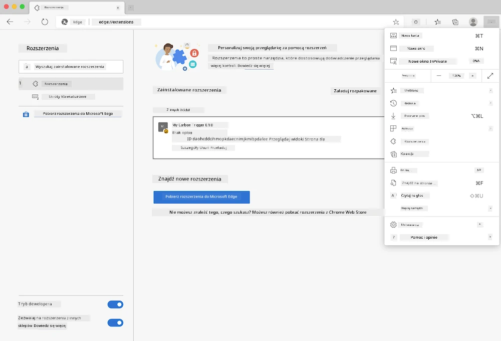

> **Ważne**: Upewnij się, że włączyłeś tryb dewelopera i zezwoliłeś na rozszerzenia z innych sklepów podczas testowania swoich własnych rozszerzeń.

### Proces instalacji rozszerzenia podczas tworzenia

Podczas tworzenia i testowania własnych rozszerzeń stosuj ten schemat:

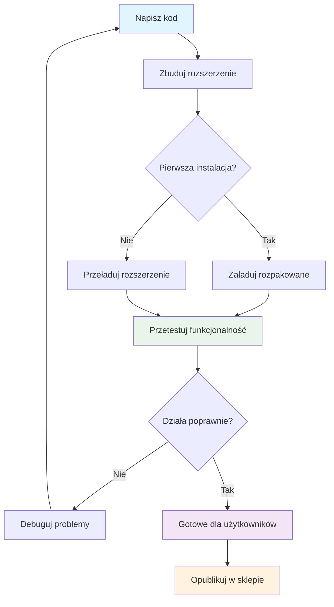
```bash
# Krok 1: Zbuduj swoje rozszerzenie
npm run build
```

**Co osiąga to polecenie:**
- **Kompiluje** Twój kod źródłowy do plików gotowych na przeglądarkę
- **Pakuje** moduły JavaScript do zoptymalizowanych paczek
- **Generuje** ostateczne pliki rozszerzenia w folderze `/dist`
- **Przygotowuje** rozszerzenie do instalacji i testowania

**Krok 2: Przejdź do rozszerzeń przeglądarki**
1. **Otwórz** stronę zarządzania rozszerzeniami w swojej przeglądarce
2. **Kliknij** przycisk „Ustawienia i więcej” (ikona `...`) w prawym górnym rogu
3. **Wybierz** „Rozszerzenia” z menu rozwijanego

**Krok 3: Załaduj swoje rozszerzenie**
- **Dla nowych instalacji**: Wybierz `załaduj rozpakowane` i wskaż swój folder `/dist`
- **Dla aktualizacji**: Kliknij `przeładuj` obok już zainstalowanego rozszerzenia
- **Do testów**: Włącz „Tryb programisty”, aby uzyskać dodatkowe funkcje debugowania

### Instalacja rozszerzenia produkcyjnego

> ✅ **Uwaga**: Te instrukcje dotyczące rozwoju są przeznaczone wyłącznie dla rozszerzeń, które tworzysz samodzielnie. Aby zainstalować opublikowane rozszerzenia, odwiedź oficjalne sklepy z rozszerzeniami, takie jak [Microsoft Edge Add-ons store](https://microsoftedge.microsoft.com/addons/Microsoft-Edge-Extensions-Home).

**Rozróżnienie:**
- **Instalacje deweloperskie** pozwalają testować niepublikowane rozszerzenia podczas rozwoju
- **Instalacje sklepowe** oferują zatwierdzone, opublikowane rozszerzenia z automatycznymi aktualizacjami
- **Sideloading** umożliwia instalację rozszerzeń spoza oficjalnych sklepów (wymaga trybu dewelopera)

## Tworzenie rozszerzenia Carbon Footprint

Stworzymy rozszerzenie przeglądarki, które wyświetla ślad węglowy zużycia energii w Twoim regionie. Projekt ten demonstruje kluczowe pojęcia związane z tworzeniem rozszerzeń, tworząc praktyczne narzędzie do podnoszenia świadomości ekologicznej.

To podejście bazuje na zasadzie „uczenia się przez działanie”, która od dawna jest skuteczna — łączy umiejętności techniczne z znaczącymi zastosowaniami w rzeczywistym świecie.

### Wymagania projektu

Przed rozpoczęciem rozwoju zbierzmy wymagane zasoby i zależności:

**Wymagany dostęp do API:**
- **[Klucz API CO2 Signal](https://www.co2signal.com/)**: Podaj swój adres e-mail, aby otrzymać darmowy klucz API
- **[Kod regionu](http://api.electricitymap.org/v3/zones)**: Znajdź kod swojego regionu na [Electricity Map](https://www.electricitymap.org/map) (np. Boston ma 'US-NEISO')

**Narzędzia programistyczne:**
- **[Node.js i NPM](https://www.npmjs.com)**: Narzędzie do zarządzania pakietami, używane do instalacji zależności projektu
- **[Kod startowy](../../../../5-browser-extension/start)**: Pobierz folder `start`, aby rozpocząć rozwój

✅ **Dowiedz się więcej**: Rozwijaj swoje umiejętności zarządzania pakietami dzięki temu [kompletnemu modułowi Learn](https://docs.microsoft.com/learn/modules/create-nodejs-project-dependencies/?WT.mc_id=academic-77807-sagibbon)

### Zrozumienie struktury projektu

Zrozumienie struktury projektu pomaga sprawniej organizować pracę nad rozwojem. Podobnie jak Biblioteka Aleksandryjska była uporządkowana, by łatwo odnaleźć wiedzę, dobrze zorganizowana baza kodu przyspiesza rozwój:

```
project-root/
├── dist/                    # Built extension files
│   ├── manifest.json        # Extension configuration
│   ├── index.html           # User interface markup
│   ├── background.js        # Background script functionality
│   └── main.js              # Compiled JavaScript bundle
├── src/                     # Source development files
│   └── index.js             # Your main JavaScript code
├── package.json             # Project dependencies and scripts
└── webpack.config.js        # Build configuration
```

**Co realizuje każdy z plików:**
- **`manifest.json`**: **Definiuje** metadane rozszerzenia, uprawnienia i punkty wejścia
- **`index.html`**: **Tworzy** interfejs użytkownika, który pojawia się po kliknięciu rozszerzenia
- **`background.js`**: **Obsługuje** zadania działające w tle oraz nasłuchiwanie zdarzeń przeglądarki
- **`main.js`**: **Zawiera** ostateczny kod JavaScript po procesie budowania
- **`src/index.js`**: **Przechowuje** główny kod tworzony podczas programowania, który zostaje skompilowany do `main.js`

> 💡 **Wskazówka organizacyjna**: Przechowuj swój klucz API i kod regionu w bezpiecznej notatce, by łatwo do nich sięgać podczas rozwoju. Będziesz potrzebować tych wartości do testowania funkcji rozszerzenia.

✅ **Uwagi bezpieczeństwa**: Nigdy nie zapisuj kluczy API ani poufnych danych w repozytorium kodu. Pokażemy Ci, jak postępować z tym bezpiecznie w kolejnych krokach.

## Tworzenie interfejsu rozszerzenia

Teraz zbudujemy komponenty interfejsu użytkownika. Rozszerzenie korzysta z dwuekranowego podejścia: ekran konfiguracji do wstępnej konfiguracji i ekran wyników do wyświetlania danych.

Zasada ta odpowiada regule stopniowego ujawniania informacji, stosowanej w projektowaniu interfejsów od wczesnych dni komputerów – informacje i opcje są ujawniane stopniowo, by uniknąć przytłoczenia użytkowników.

### Przegląd widoków rozszerzenia

**Widok konfiguracji** – konfiguracja dla pierwszych użytkowników:
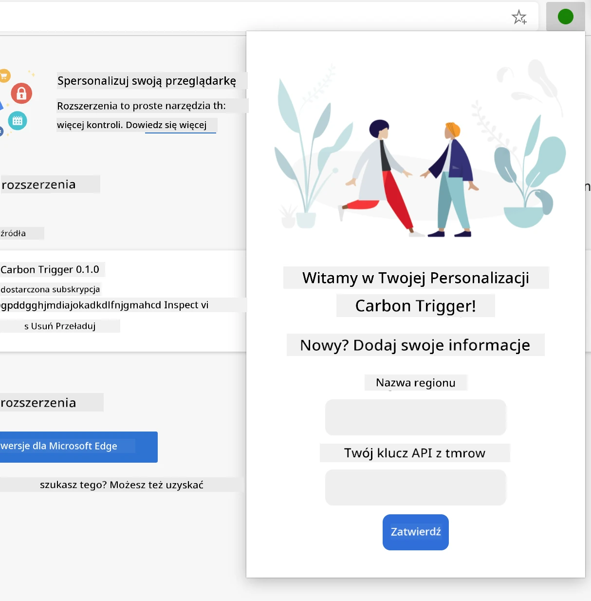

**Widok wyników** – wyświetlanie danych o śladzie węglowym:
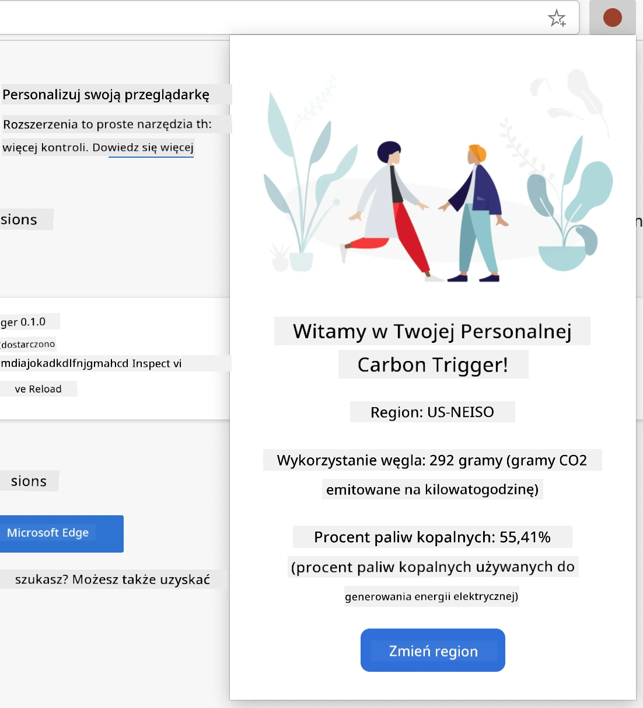

### Tworzenie formularza konfiguracji

Formularz konfiguracji zbiera dane konfiguracyjne użytkownika podczas pierwszego uruchomienia. Po skonfigurowaniu te informacje są przechowywane w pamięci przeglądarki na kolejne sesje.

W pliku `/dist/index.html` dodaj tę strukturę formularza:

```html
<form class="form-data" autocomplete="on">
    <div>
        <h2>New? Add your Information</h2>
    </div>
    <div>
        <label for="region">Region Name</label>
        <input type="text" id="region" required class="region-name" />
    </div>
    <div>
        <label for="api">Your API Key from tmrow</label>
        <input type="text" id="api" required class="api-key" />
    </div>
    <button class="search-btn">Submit</button>
</form>
```

**Co zawiera ten formularz:**
- **Tworzy** semantyczną strukturę formularza z właściwymi etykietami i powiązaniami pól
- **Umożliwia** autouzupełnianie przeglądarki dla poprawy doświadczenia użytkownika
- **Wymaga** wypełnienia obu pól przed zatwierdzeniem za pomocą atrybutu `required`
- **Organizuje** pola za pomocą opisowych klas dla łatwego stylizowania i celów JavaScript
- **Dostarczają** jasne instrukcje dla użytkowników konfigurujących rozszerzenie po raz pierwszy

### Tworzenie wyświetlania wyników

Następnie stwórz obszar wyników, który będzie pokazywał dane o śladzie węglowym. Dodaj poniższy kod HTML pod formularzem:

```html
<div class="result">
    <div class="loading">loading...</div>
    <div class="errors"></div>
    <div class="data"></div>
    <div class="result-container">
        <p><strong>Region: </strong><span class="my-region"></span></p>
        <p><strong>Carbon Usage: </strong><span class="carbon-usage"></span></p>
        <p><strong>Fossil Fuel Percentage: </strong><span class="fossil-fuel"></span></p>
    </div>
    <button class="clear-btn">Change region</button>
</div>
```

**Co zapewnia ta struktura:**
- **`loading`**: **Wyświetla** komunikat ładowania podczas pobierania danych z API
- **`errors`**: **Pokazuje** komunikaty o błędach, jeśli wywołania API zawiodą lub dane są nieprawidłowe
- **`data`**: **Przechowuje** surowe dane do celów debugowania podczas rozwoju
- **`result-container`**: **Prezentuje** sformatowane informacje o śladzie węglowym dla użytkowników
- **`clear-btn`**: **Pozwala** użytkownikowi zmienić region i ponownie skonfigurować rozszerzenie

### Konfiguracja procesu budowy

Teraz zainstalujmy zależności projektu i przetestujmy proces budowy:

```bash
npm install
```

**Co osiąga ten proces instalacji:**
- **Pobiera** Webpack i inne zależności rozwojowe określone w `package.json`
- **Konfiguruje** narzędzia budujące do kompilacji nowoczesnego JavaScript
- **Przygotowuje** środowisko programistyczne do budowy i testowania rozszerzenia
- **Umożliwia** pakowanie kodu, optymalizację i kompatybilność międzyprzeglądarkową

> 💡 **Wgląd w proces budowania**: Webpack pakuje Twój kod źródłowy z `/src/index.js` do pliku `/dist/main.js`. Proces ten optymalizuje kod pod kątem produkcyjnym i zapewnia kompatybilność z przeglądarkami.

### Testowanie postępu prac

Na tym etapie możesz przetestować swoje rozszerzenie:
1. **Uruchom** polecenie build, aby skompilować swój kod  
2. **Załaduj** rozszerzenie do swojej przeglądarki, korzystając z trybu programisty  
3. **Zweryfikuj**, czy formularz wyświetla się poprawnie i wygląda profesjonalnie  
4. **Sprawdź**, czy wszystkie elementy formularza są poprawnie wyrównane i działają  

**Co osiągnąłeś:**  
- **Zbudowałeś** podstawową strukturę HTML swojego rozszerzenia  
- **Stworzyłeś** interfejsy konfiguracji i wyników z odpowiednim oznaczeniem semantycznym  
- **Skonfigurowałeś** nowoczesny workflow deweloperski z użyciem narzędzi branżowych  
- **Przygotowałeś** fundament pod dodanie interaktywnej funkcjonalności JavaScript  

### 🔄 **Pedagogiczne podsumowanie**  
**Postęp w tworzeniu rozszerzenia**: Zweryfikuj swoje zrozumienie przed kontynuacją:  
- ✅ Czy potrafisz wyjaśnić przeznaczenie każdego pliku w strukturze projektu?  
- ✅ Czy rozumiesz, jak proces build transformuje Twój kod źródłowy?  
- ✅ Dlaczego oddzielamy konfigurację i wyniki w różnych sekcjach UI?  
- ✅ W jaki sposób struktura formularza wspiera zarówno użyteczność, jak i dostępność?  

**Zrozumienie workflow deweloperskiego**: Powinieneś teraz potrafić:  
1. **Modyfikować** HTML i CSS interfejsu rozszerzenia  
2. **Uruchamiać** polecenie build, aby skompilować zmiany  
3. **Przeładować** rozszerzenie w przeglądarce w celu testu aktualizacji  
4. **Debugować** problemy korzystając z narzędzi deweloperskich przeglądarki  

Ukończyłeś pierwszą fazę tworzenia rozszerzenia przeglądarki. Podobnie jak bracia Wright musieli najpierw zrozumieć aerodynamikę, aby latać, zrozumienie tych podstawowych pojęć przygotowuje Cię do budowania bardziej złożonych, interaktywnych funkcji w następnej lekcji.  

## GitHub Copilot Agent Challenge 🚀  

Użyj trybu Agenta, aby wykonać następujące zadanie:  

**Opis:** Ulepsz rozszerzenie przeglądarki, dodając walidację formularza i funkcje informowania użytkownika, aby poprawić doświadczenie podczas wpisywania kluczy API i kodów regionów.  

**Zadanie:** Stwórz funkcje walidacji JavaScript, które sprawdzą, czy pole klucza API zawiera co najmniej 20 znaków oraz czy kod regionu ma prawidłowy format (np. 'US-NEISO'). Dodaj wizualną informację zwrotną, zmieniając kolor obramowania pola na zielony dla poprawnych wartości i na czerwony dla błędnych. Dodaj również funkcję przełączania widoczności klucza API dla bezpieczeństwa.  

Dowiedz się więcej o [trybie agenta](https://code.visualstudio.com/blogs/2025/02/24/introducing-copilot-agent-mode) tutaj.  

## 🚀 Wyzwanie  

Przejrzyj sklep z rozszerzeniami przeglądarki i zainstaluj jedno rozszerzenie. Możesz przyjrzeć się jego plikom w ciekawy sposób. Co odkrywasz?  

## Quiz po wykładzie  

[Quiz po wykładzie](https://ff-quizzes.netlify.app/web/quiz/24)  

## Przegląd i samodzielna nauka  

W tej lekcji poznałeś nieco historii przeglądarki internetowej; skorzystaj z okazji, aby dowiedzieć się, jak wynalazcy World Wide Web wyobrażali sobie jej wykorzystanie, czytając więcej o jej historii. Przydatne strony to:  

[Historia przeglądarek internetowych](https://www.mozilla.org/firefox/browsers/browser-history/)  

[Historia sieci Web](https://webfoundation.org/about/vision/history-of-the-web/)  

[Wywiad z Timem Berners-Lee](https://www.theguardian.com/technology/2019/mar/12/tim-berners-lee-on-30-years-of-the-web-if-we-dream-a-little-we-can-get-the-web-we-want)  

### ⚡ **Co możesz zrobić w ciągu następnych 5 minut**  
- [ ] Otwórz stronę rozszerzeń Chrome/Edge (chrome://extensions) i zbadaj zainstalowane rozszerzenia  
- [ ] Obejrzyj zakładkę Network w narzędziach DevTools podczas ładowania strony  
- [ ] Spróbuj wyświetlić źródło strony (Ctrl+U), aby zobaczyć strukturę HTML  
- [ ] Zbadaj dowolny element strony i zmodyfikuj jego CSS w DevTools  

### 🎯 **Co możesz osiągnąć w ciągu najbliższej godziny**  
- [ ] Ukończ quiz po lekcji i zrozum podstawy działania przeglądarki  
- [ ] Stwórz podstawowy plik manifest.json dla rozszerzenia przeglądarki  
- [ ] Zbuduj proste rozszerzenie „Hello World” z wyskakującym okienkiem  
- [ ] Przetestuj ładowanie rozszerzenia w trybie programisty  
- [ ] Zapoznaj się z dokumentacją rozszerzeń dla swojej przeglądarki  

### 📅 **Twoja tygodniowa podróż z rozszerzeniem**  
- [ ] Ukończ funkcjonalne rozszerzenie przeglądarki o rzeczywistej użyteczności  
- [ ] Poznaj skrypty zawartości, skrypty tła oraz interakcje popup  
- [ ] Opanuj API przeglądarki do przechowywania danych, kart i komunikacji  
- [ ] Projektuj przyjazne dla użytkownika interfejsy rozszerzenia  
- [ ] Testuj rozszerzenie na różnych stronach i w różnych scenariuszach  
- [ ] Opublikuj rozszerzenie w sklepie rozszerzeń przeglądarki  

### 🌟 **Twoja miesięczna przygoda z rozwojem przeglądarek**  
- [ ] Stwórz wiele rozszerzeń rozwiązujących różne problemy użytkowników  
- [ ] Poznaj zaawansowane API przeglądarek i najlepsze praktyki bezpieczeństwa  
- [ ] Współtwórz projekty open source rozszerzeń przeglądarki  
- [ ] Opanuj kompatybilność między przeglądarkami i progresywne udoskonalanie  
- [ ] Twórz narzędzia i szablony deweloperskie rozszerzeń dla innych  
- [ ] Zostań ekspertem od rozszerzeń przeglądarek, który wspiera innych developerów  

## 🎯 Twoja oś czasu mistrzostwa w tworzeniu rozszerzeń  

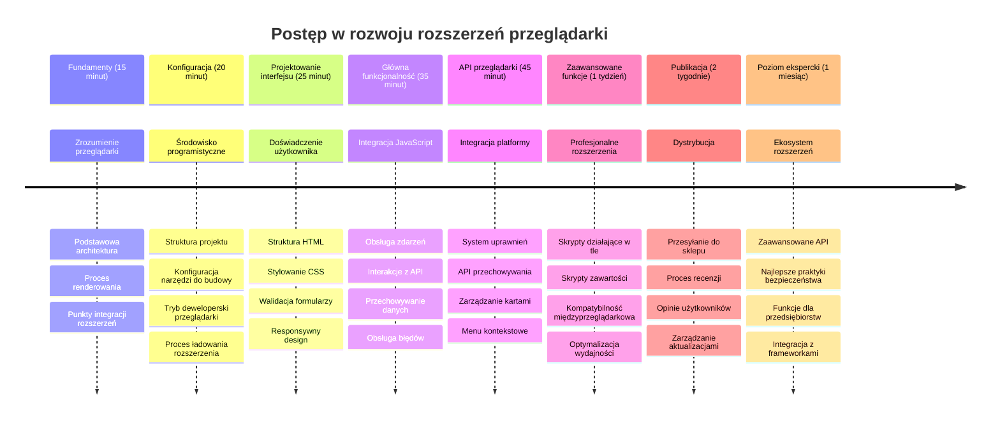
### 🛠️ Podsumowanie Twojego zestawu narzędzi do tworzenia rozszerzeń  

Po ukończeniu tej lekcji masz teraz:  
- **Wiedzę o architekturze przeglądarki**: zrozumienie silników renderujących, modeli bezpieczeństwa i integracji rozszerzeń  
- **Środowisko programistyczne**: nowoczesny zestaw narzędzi z Webpack, NPM i możliwościami debugowania  
- **Podstawy UI/UX**: semantyczna struktura HTML z wzorcami progresywnego ujawniania  
- **Świadomość bezpieczeństwa**: zrozumienie uprawnień przeglądarki i bezpiecznych praktyk tworzenia  
- **Koncepcje wieloprzeglądarkowe**: wiedza o kompatybilności i podejściach do testowania  
- **Integracja API**: fundament pod pracę z zewnętrznymi źródłami danych  
- **Profesjonalny workflow**: branżowe procedury tworzenia i testowania  

**Zastosowania w praktyce**: Te umiejętności bezpośrednio odnoszą się do:  
- **Tworzenia stron internetowych**: aplikacji jednostronicowych i progresywnych aplikacji webowych  
- **Aplikacji desktopowych**: Electron i aplikacji webowych na komputery  
- **Rozwoju mobilnego**: aplikacji hybrydowych i webowych rozwiązań mobilnych  
- **Narzędzi korporacyjnych**: wewnętrznych aplikacji do zwiększania produktywności i automatyzacji pracy  
- **Open Source**: współtworzenia projektów rozszerzeń i standardów webowych  

**Kolejny poziom**: Jesteś gotów dodać interaktywne funkcje, pracować z API przeglądarki i tworzyć rozszerzenia rozwiązujące prawdziwe problemy użytkowników!  

## Zadanie  

[Zmien styl swojego rozszerzenia](assignment.md)

---

<!-- CO-OP TRANSLATOR DISCLAIMER START -->
**Zrzeczenie się odpowiedzialności**:  
Niniejszy dokument został przetłumaczony za pomocą usługi tłumaczenia AI [Co-op Translator](https://github.com/Azure/co-op-translator). Mimo że dokładamy wszelkich starań, aby zapewnić poprawność, prosimy pamiętać, że tłumaczenia automatyczne mogą zawierać błędy lub nieścisłości. Oryginalny dokument w języku źródłowym należy traktować jako źródło ostateczne. W przypadku informacji o kluczowym znaczeniu zalecane jest skorzystanie z profesjonalnego tłumaczenia wykonanego przez człowieka. Nie ponosimy odpowiedzialności za jakiekolwiek nieporozumienia lub błędną interpretację wynikającą z korzystania z tego tłumaczenia.
<!-- CO-OP TRANSLATOR DISCLAIMER END -->