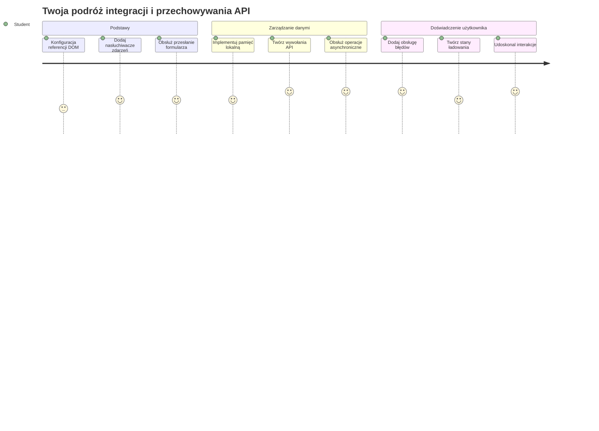
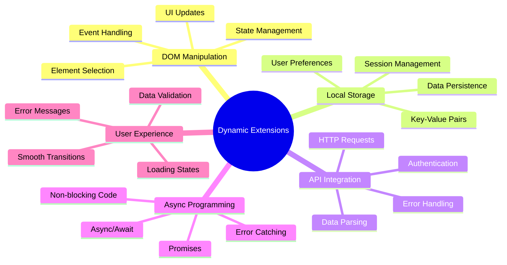
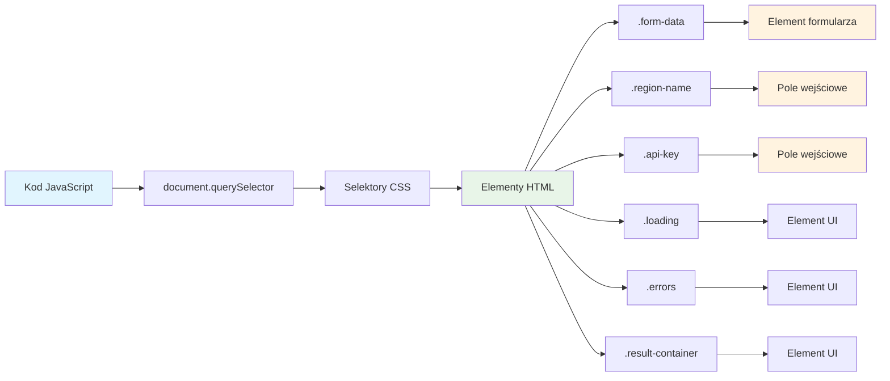
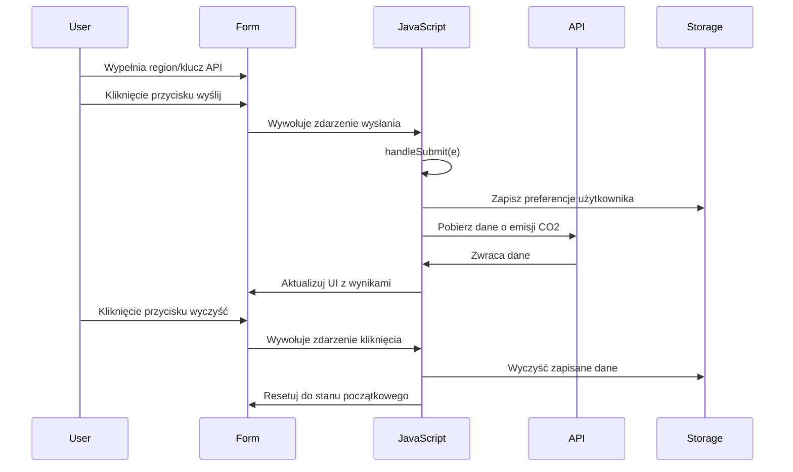
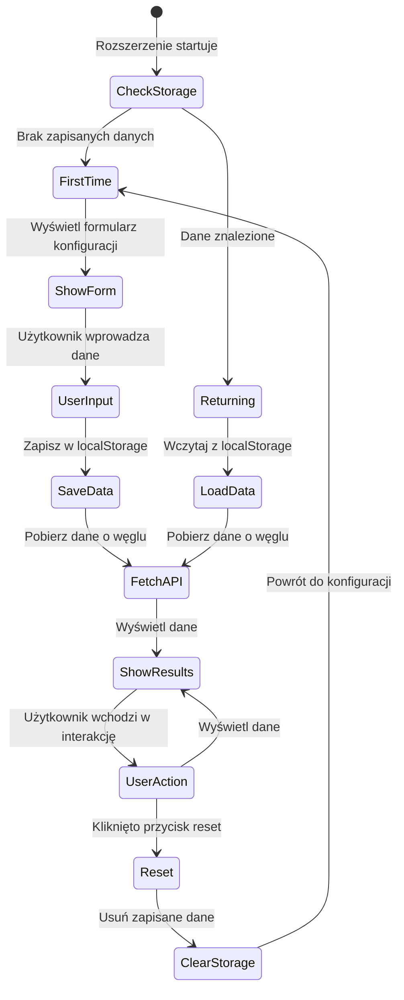
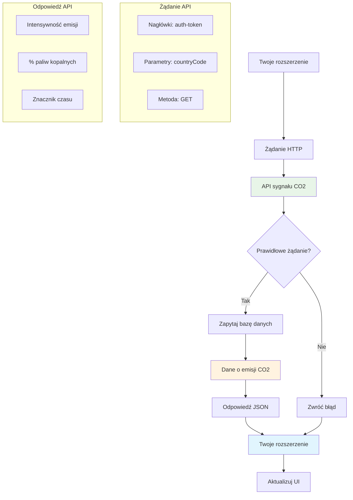
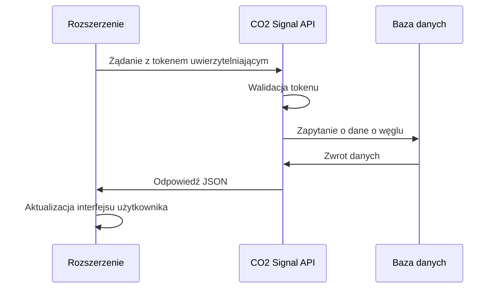
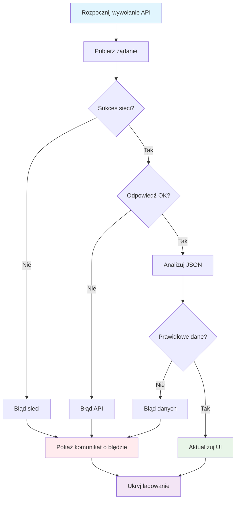
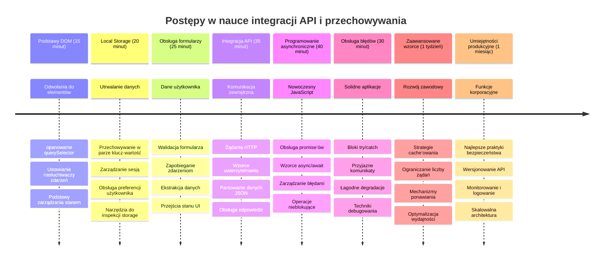

<!--
CO_OP_TRANSLATOR_METADATA:
{
  "original_hash": "2b6203a48c48d8234e0948353b47d84e",
  "translation_date": "2026-01-06T19:22:02+00:00",
  "source_file": "5-browser-extension/2-forms-browsers-local-storage/README.md",
  "language_code": "pl"
}
-->
# Projekt rozszerzenia przeglądarki część 2: Wywołanie API, użycie Local Storage


## Quiz przed wykładem

[Quiz przed wykładem](https://ff-quizzes.netlify.app/web/quiz/25)

## Wprowadzenie

Pamiętasz rozszerzenie przeglądarki, które zacząłeś budować? Obecnie masz ładnie wyglądający formularz, ale jest on zasadniczo statyczny. Dziś ożywimy go, łącząc go z prawdziwymi danymi i nadając mu pamięć.

Pomyśl o komputerach misji Apollo – nie wyświetlały one tylko stałych informacji. Cały czas komunikowały się ze statkami kosmicznymi, aktualizowały dane telemetryczne i pamiętały kluczowe parametry misji. To właśnie taki dynamiczny charakter budujemy dzisiaj. Twoje rozszerzenie sięgnie do internetu, pobierze prawdziwe dane środowiskowe i zapamięta twoje ustawienia na przyszłość.

Integracja z API może brzmieć skomplikowanie, ale to tak naprawdę nauka twojego kodu, jak komunikować się z innymi usługami. Niezależnie od tego, czy pobierasz dane pogodowe, kanały z mediów społecznościowych, czy informacje o śladzie węglowym, jak zrobimy dzisiaj, chodzi o ustanowienie tych cyfrowych połączeń. Poznamy też, jak przeglądarki mogą przechowywać informacje – podobnie jak biblioteki używały kartotek do zapamiętywania, gdzie są książki.

Pod koniec tej lekcji będziesz mieć rozszerzenie przeglądarki, które pobiera prawdziwe dane, przechowuje preferencje użytkownika i zapewnia płynne doświadczenie. Zaczynajmy!


✅ Postępuj zgodnie z numerowanymi segmentami w odpowiednich plikach, aby wiedzieć, gdzie umieścić swój kod

## Konfiguracja elementów do manipulacji w rozszerzeniu

Zanim JavaScript będzie mógł manipulować interfejsem, potrzebuje odniesień do konkretnych elementów HTML. To jak teleskop, który musi być skierowany na konkretne gwiazdy – zanim Galileusz mógł badać księżyce Jowisza, musiał zlokalizować i ustawić teleskop na Jowiszu.

W pliku `index.js` utworzymy zmienne `const`, które przechwycą referencje do każdego ważnego elementu formularza. To podobne do tego, jak naukowcy oznaczają swoje sprzęty – zamiast za każdym razem szukać w całym laboratorium, mogą bezpośrednio dostać się do tego, czego potrzebują.


```javascript
// pola formularza
const form = document.querySelector('.form-data');
const region = document.querySelector('.region-name');
const apiKey = document.querySelector('.api-key');

// wyniki
const errors = document.querySelector('.errors');
const loading = document.querySelector('.loading');
const results = document.querySelector('.result-container');
const usage = document.querySelector('.carbon-usage');
const fossilfuel = document.querySelector('.fossil-fuel');
const myregion = document.querySelector('.my-region');
const clearBtn = document.querySelector('.clear-btn');
```

**Co robi ten kod:**
- **Przechwytuje** elementy formularza za pomocą `document.querySelector()` z selektorami klas CSS
- **Tworzy** referencje do pól wprowadzania nazwy regionu i klucza API
- **Nawiązuje** połączenia z elementami wyświetlającymi wyniki danych o zużyciu węgla
- **Ustawia** dostęp do elementów UI, takich jak wskaźniki ładowania i komunikaty o błędach
- **Przechowuje** każdą referencję elementu w zmiennej `const` dla łatwego ponownego użycia w całym kodzie

## Dodaj nasłuchiwacze zdarzeń

Teraz sprawimy, że twoje rozszerzenie będzie reagowało na działania użytkownika. Nasłuchiwacze zdarzeń to sposób twojego kodu na monitorowanie interakcji użytkownika. Możesz to porównać do operatorów w wczesnych centralkach telefonicznych – nasłuchiwali połączeń i łączyli odpowiednie obwody, gdy ktoś chciał nawiązać połączenie.


```javascript
form.addEventListener('submit', (e) => handleSubmit(e));
clearBtn.addEventListener('click', (e) => reset(e));
init();
```

**Wyjaśnienie tych koncepcji:**
- **Przypisuje** nasłuchiwacz zdarzenia submit do formularza, który uruchamia się, gdy użytkownicy wciśną Enter lub klikną przycisk wyślij
- **Podłącza** nasłuchiwacz kliknięcia do przycisku resetowania formularza
- **Przekazuje** obiekt zdarzenia `(e)` do funkcji obsługi dla dodatkowej kontroli
- **Wywołuje** funkcję `init()` natychmiast, aby ustawić początkowy stan rozszerzenia

✅ Zauważ skróconą składnię funkcji strzałkowej stosowaną tutaj. Ten nowoczesny sposób w JavaScript jest czyściejszy niż tradycyjne wyrażenia funkcyjne, ale oba działają równie dobrze!

### 🔄 **Kontrola pedagogiczna**
**Zrozumienie obsługi zdarzeń**: Przed przejściem do inicjalizacji upewnij się, że potrafisz:
- ✅ Wyjaśnić, jak `addEventListener` łączy akcje użytkownika z funkcjami JavaScript
- ✅ Rozumieć, dlaczego przekazujemy obiekt zdarzenia `(e)` do funkcji obsługujących
- ✅ Rozróżnić zdarzenia `submit` i `click`
- ✅ Opisać, kiedy i dlaczego wywołuje się funkcja `init()`

**Szybki test**: Co się stanie, jeśli zapomnisz `e.preventDefault()` przy wysłaniu formularza?
*Odpowiedź: Strona się przeładuje, tracąc cały stan JavaScript i przerywając doświadczenie użytkownika*

## Zbuduj funkcje inicjalizacji i resetu

Stwórzmy logikę inicjalizacji dla twojego rozszerzenia. Funkcja `init()` jest jak system nawigacyjny statku sprawdzający swoje instrumenty – określa aktualny stan i odpowiednio dostosowuje interfejs. Sprawdza, czy ktoś już korzystał z twojego rozszerzenia i ładuje jego poprzednie ustawienia.

Funkcja `reset()` daje użytkownikom świeży start – podobnie jak naukowcy resetują swoje przyrządy między eksperymentami, aby mieć czyste dane.

```javascript
function init() {
	// Sprawdź, czy użytkownik wcześniej zapisał dane uwierzytelniające API
	const storedApiKey = localStorage.getItem('apiKey');
	const storedRegion = localStorage.getItem('regionName');

	// Ustaw ikonę rozszerzenia na ogólny zielony (miejsce na przyszłą lekcję)
	// DO ZROBIENIA: Zaimplementuj aktualizację ikony w następnej lekcji

	if (storedApiKey === null || storedRegion === null) {
		// Użytkownik po raz pierwszy: pokaż formularz konfiguracji
		form.style.display = 'block';
		results.style.display = 'none';
		loading.style.display = 'none';
		clearBtn.style.display = 'none';
		errors.textContent = '';
	} else {
		// Powracający użytkownik: automatycznie załaduj jego zapisane dane
		displayCarbonUsage(storedApiKey, storedRegion);
		results.style.display = 'none';
		form.style.display = 'none';
		clearBtn.style.display = 'block';
	}
}

function reset(e) {
	e.preventDefault();
	// Wyczyść przechowywany region, aby umożliwić użytkownikowi wybór nowej lokalizacji
	localStorage.removeItem('regionName');
	// Uruchom ponownie proces inicjalizacji
	init();
}
```

**Co się tu dzieje:**
- **Pobiera** zapisany klucz API i region z lokalnej pamięci przeglądarki
- **Sprawdza**, czy to pierwszy raz użytkownika (brak zapisanych danych) czy powracający użytkownik
- **Wyświetla** formularz konfiguracyjny dla nowych użytkowników i ukrywa pozostałe elementy interfejsu
- **Automatycznie ładuje** zapisane dane dla powracających i pokazuje opcję resetowania
- **Zarządza** stanem interfejsu użytkownika na podstawie dostępnych danych

**Kluczowe koncepcje Local Storage:**
- **Przechowuje** dane pomiędzy sesjami przeglądarki (w przeciwieństwie do session storage)
- **Zapisuje** dane jako pary klucz-wartość przy użyciu `getItem()` i `setItem()`
- **Zwraca** `null` jeśli nie ma danych dla danego klucza
- **Umożliwia** łatwe zapamiętanie preferencji i ustawień użytkownika

> 💡 **Zrozumienie pamięci przeglądarki**: [LocalStorage](https://developer.mozilla.org/docs/Web/API/Window/localStorage) daje twojemu rozszerzeniu trwałą pamięć. Pomyśl o starożytnej Bibliotece Aleksandryjskiej, gdzie zwoje pozostały dostępne nawet po odejściu uczonych.
>
> **Główne cechy:**
> - **Przechowuje** dane nawet po zamknięciu przeglądarki
> - **Przetrwa** restart komputera i awarie przeglądarki
> - **Zapewnia** dużą przestrzeń do przechowywania ustawień użytkownika
> - **Umożliwia** natychmiastowy dostęp bez opóźnień sieciowych

> **Ważna uwaga**: Twoje rozszerzenie przeglądarki ma własną, izolowaną lokalną pamięć, odseparowaną od zwykłych stron www. Zapewnia to bezpieczeństwo i zapobiega konfliktom z innymi stronami.

Możesz przeglądać przechowywane dane, otwierając narzędzia developerskie przeglądarki (F12), przechodząc do zakładki **Application** i rozwijając sekcję **Local Storage**.




> ⚠️ **Kwestie bezpieczeństwa**: W aplikacjach produkcyjnych przechowywanie kluczy API w LocalStorage niesie ryzyko bezpieczeństwa, ponieważ JavaScript ma do nich dostęp. Dla celów edukacyjnych jest to w porządku, ale prawdziwe aplikacje powinny korzystać z bezpiecznego przechowywania po stronie serwera dla poufnych danych.

## Obsłuż wysyłanie formularza

Teraz zajmiemy się tym, co się dzieje, gdy ktoś wyśle twój formularz. Domyślnie przeglądarki przeładowują stronę po wysłaniu formularza, ale my przerwiemy to zachowanie, aby stworzyć płynniejsze doświadczenie.

To podejście przypomina, jak centrum kontroli misji obsługuje komunikację ze statkami kosmicznymi – zamiast resetować cały system dla każdej transmisji, utrzymują ciągłą pracę, przetwarzając nowe informacje.

Stwórz funkcję, która przechwyci zdarzenie wysłania formularza i wyciągnie dane wprowadzone przez użytkownika:

```javascript
function handleSubmit(e) {
	e.preventDefault();
	setUpUser(apiKey.value, region.value);
}
```

**Co jest tutaj:**
- **Uniemożliwia** domyślne zachowanie wysłania formularza, które odświeżałoby stronę
- **Wyciąga** wartości wprowadzone przez użytkownika z pól klucza API i regionu
- **Przekazuje** dane formularza do funkcji `setUpUser()` do dalszego przetwarzania
- **Utrzymuje** zachowanie aplikacji jednostronicowej, unikając przeładowania strony

✅ Pamiętaj, że pola formularza w HTML mają atrybut `required`, więc przeglądarka automatycznie weryfikuje, że użytkownik podał zarówno klucz API, jak i region zanim ta funkcja zostanie wywołana.

## Skonfiguruj preferencje użytkownika

Funkcja `setUpUser` odpowiada za zapisanie poświadczeń użytkownika i rozpoczęcie pierwszego wywołania API. Tworzy to płynne przejście od konfiguracji do wyświetlania wyników.

```javascript
function setUpUser(apiKey, regionName) {
	// Zapisz dane uwierzytelniające użytkownika na przyszłe sesje
	localStorage.setItem('apiKey', apiKey);
	localStorage.setItem('regionName', regionName);
	
	// Zaktualizuj interfejs użytkownika, aby pokazać stan ładowania
	loading.style.display = 'block';
	errors.textContent = '';
	clearBtn.style.display = 'block';
	
	// Pobierz dane zużycia dwutlenku węgla za pomocą danych uwierzytelniających użytkownika
	displayCarbonUsage(apiKey, regionName);
}
```

**Krok po kroku, co się dzieje:**
- **Zapisuje** klucz API i nazwę regionu do lokalnej pamięci na przyszłość
- **Pokazuje** wskaźnik ładowania, informując użytkowników, że dane są pobierane
- **Czyści** wcześniejsze komunikaty o błędach z wyświetlacza
- **Ukazuje** przycisk czyszczenia, by użytkownicy mogli później zresetować ustawienia
- **Inicjuje** wywołanie API, by pobrać rzeczywiste dane o zużyciu węgla

Ta funkcja zapewnia bezproblemowe doświadczenie, zarządzając zarówno trwałością danych, jak i aktualizacjami interfejsu w jednym skoordynowanym działaniu.

## Wyświetl dane o zużyciu węgla

Połączmy teraz twoje rozszerzenie z zewnętrznymi źródłami danych za pośrednictwem API. To przekształci twoje rozszerzenie z narzędzia samodzielnego w coś, co ma dostęp do informacji w czasie rzeczywistym z całego internetu.

**Poznajemy API**

[API](https://www.webopedia.com/TERM/A/API.html) to sposób, w jaki różne aplikacje komunikują się ze sobą. Można je porównać do telegrafu, który łączył odległe miasta w XIX wieku – operatorzy wysyłali zapytania do odległych stacji i otrzymywali odpowiedzi z żądanymi informacjami. Za każdym razem, gdy sprawdzasz media społecznościowe, zadajesz pytanie asystentowi głosowemu czy korzystasz z aplikacji do dostawy, API ułatwiają wymianę danych.


**Kluczowe koncepcje REST API:**
- **REST** oznacza 'Representational State Transfer'
- **Używa** standardowych metod HTTP (GET, POST, PUT, DELETE) do interakcji z danymi
- **Zwraca** dane w przewidywalnych formatach, zwykle JSON
- **Zapewnia** spójne, oparte na URL punktu końcowego dla różnych typów zapytań

✅ [CO2 Signal API](https://www.co2signal.com/), którego użyjemy, dostarcza dane o intensywności emisji dwutlenku węgla w czasie rzeczywistym z sieci elektrycznych na całym świecie. Pomaga to użytkownikom zrozumieć wpływ ich zużycia elektryczności na środowisko!

> 💡 **Zrozumienie JavaScript asynchronicznego**: Słowo kluczowe [`async`](https://developer.mozilla.org/docs/Web/JavaScript/Reference/Statements/async_function) pozwala twojemu kodowi obsługiwać wiele operacji równocześnie. Gdy żądasz danych z serwera, nie chcesz, aby całe rozszerzenie się zawiesiło – byłoby to jak kontrola ruchu lotniczego zatrzymująca wszystkie operacje, czekając na odpowiedź jednego samolotu.
>
> **Główne zalety:**
> - **Utrzymuje** responsywność rozszerzenia podczas ładowania danych
> - **Pozwala** innym fragmentom kodu działać podczas zapytań sieciowych
> - **Poprawia** czytelność kodu względem tradycyjnych wzorców callback
> - **Umożliwia** elegancką obsługę błędów sieciowych

Krótki film o `async`:

[](https://youtube.com/watch?v=YwmlRkrxvkk "Async and Await for managing promises")

> 🎥 Kliknij obraz powyżej, aby obejrzeć film o async/await.

### 🔄 **Kontrola pedagogiczna**
**Zrozumienie programowania asynchronicznego**: Przed przejściem do funkcji API upewnij się, że rozumiesz:
- ✅ Dlaczego używamy `async/await` zamiast blokować całe rozszerzenie
- ✅ Jak bloki `try/catch` obsługują błędy sieciowe w sposób elegancki
- ✅ Różnicę między operacjami synchronicznymi a asynchronicznymi
- ✅ Dlaczego wywołania API mogą się nie powieść i jak radzić sobie z tymi awariami

**Przykłady codziennego asynchronicznego działania:**
- **Zamawianie jedzenia**: Nie czekasz przy kuchni – dostajesz paragon i robisz inne rzeczy
- **Wysyłanie e-maili**: Aplikacja pocztowa się nie zawiesza podczas wysłania – możesz napisać więcej maili
- **Ładowanie stron internetowych**: Obrazy ładują się stopniowo, podczas gdy już możesz czytać tekst

**Przebieg uwierzytelniania API**:

Utwórz funkcję do pobierania i wyświetlania danych o zużyciu węgla:

```javascript
// Nowoczesne podejście do API fetch (bez potrzeby używania zewnętrznych zależności)
async function displayCarbonUsage(apiKey, region) {
	try {
		// Pobierz dane o intensywności emisji węgla z API CO2 Signal
		const response = await fetch('https://api.co2signal.com/v1/latest', {
			method: 'GET',
			headers: {
				'auth-token': apiKey,
				'Content-Type': 'application/json'
			},
			// Dodaj parametry zapytania dla konkretnego regionu
			...new URLSearchParams({ countryCode: region }) && {
				url: `https://api.co2signal.com/v1/latest?countryCode=${region}`
			}
		});

		// Sprawdź, czy żądanie API zakończyło się sukcesem
		if (!response.ok) {
			throw new Error(`API request failed: ${response.status}`);
		}

		const data = await response.json();
		const carbonData = data.data;

		// Oblicz zaokrągloną wartość intensywności emisji węgla
		const carbonIntensity = Math.round(carbonData.carbonIntensity);

		// Zaktualizuj interfejs użytkownika pobranymi danymi
		loading.style.display = 'none';
		form.style.display = 'none';
		myregion.textContent = region.toUpperCase();
		usage.textContent = `${carbonIntensity} grams (grams CO₂ emitted per kilowatt hour)`;
		fossilfuel.textContent = `${carbonData.fossilFuelPercentage.toFixed(2)}% (percentage of fossil fuels used to generate electricity)`;
		results.style.display = 'block';

		// DO ZROBIENIA: calculateColor(carbonIntensity) - zaimplementuj w następnej lekcji

	} catch (error) {
		console.error('Error fetching carbon data:', error);
		
		// Pokaż przyjazny dla użytkownika komunikat o błędzie
		loading.style.display = 'none';
		results.style.display = 'none';
		errors.textContent = 'Sorry, we couldn\'t fetch data for that region. Please check your API key and region code.';
	}
}
```

**Co tutaj się dzieje:**
- **Używa** nowoczesnego API `fetch()` zamiast zewnętrznych bibliotek typu Axios, dla czystszego, wolnego od zależności kodu
- **Implementuje** właściwą kontrolę błędów z `response.ok`, aby wcześnie wykrywać problemy z API
- **Obsługuje** operacje asynchroniczne za pomocą `async/await` dla lepszego przepływu kodu
- **Uwierzytelnia się** w CO2 Signal API używając nagłówka `auth-token`
- **Parsuje** dane JSON i wyciąga informacje o intensywności emisji dwutlenku węgla
- **Aktualizuje** wiele elementów UI sformatowanymi danymi środowiskowymi
- **Wyświetla** przyjazne komunikaty błędów, gdy wywołania API nie powiodą się

**Kluczowe nowoczesne koncepcje JavaScript pokazane tutaj:**
- **Szablony stringów** z użyciem `${}` dla czystego formatowania napisów
- **Obsługa błędów** przy pomocy bloków try/catch dla stabilnych aplikacji
- **Wzorzec async/await** do sprawnej obsługi zapytań sieciowych
- **Destrukturyzacja obiektów** do wyciągania konkretnych danych z odpowiedzi API
- **Łańcuchowanie metod** przy wielu manipulacjach DOM

✅ Ta funkcja pokazuje kilka ważnych koncepcji programowania webowego – komunikację z serwerami zewnętrznymi, uwierzytelnianie, przetwarzanie danych, aktualizację interfejsów i zarządzanie błędami. To podstawowe umiejętności, których używają profesjonalni programiści na co dzień.


### 🔄 **Kontrola pedagogiczna**
**Pełne zrozumienie systemu**: Sprawdź swoją znajomość całego przepływu:
- ✅ Jak referencje do DOM pozwalają JavaScript kontrolować interfejs
- ✅ Dlaczego local storage tworzy trwałość pomiędzy sesjami przeglądarki
- ✅ Jak async/await umożliwia wywołania API bez zamrażania rozszerzenia
- ✅ Co się dzieje, gdy wywołania API się nie powiodą i jak obsługiwać błędy
- ✅ Dlaczego doświadczenie użytkownika obejmuje stany ładowania i komunikaty o błędach

🎉 **Co osiągnąłeś:** Stworzyłeś rozszerzenie przeglądarki, które:
- **Łączy się** z internetem i pobiera prawdziwe dane środowiskowe
- **Przechowuje** ustawienia użytkownika pomiędzy sesjami
- **Obsługuje** błędy w sposób łagodny, zamiast zawieszać się
- **Zapewnia** płynne i profesjonalne doświadczenie użytkownika

Przetestuj swoją pracę, uruchamiając `npm run build` i odświeżając rozszerzenie w przeglądarce. Masz teraz działający licznik śladu węglowego. Następna lekcja doda dynamiczną funkcjonalność ikon, aby dokończyć rozszerzenie.

---

## Wyzwanie agenta GitHub Copilot 🚀

Użyj trybu Agenta, aby wykonać następujące zadanie:
**Opis:** Ulepsz rozszerzenie przeglądarki, dodając usprawnienia obsługi błędów oraz funkcje poprawiające doświadczenie użytkownika. To wyzwanie pomoże Ci przećwiczyć pracę z API, pamięcią lokalną oraz manipulacją DOM, używając nowoczesnych wzorców JavaScript.

**Zadanie:** Utwórz ulepszoną wersję funkcji displayCarbonUsage, która zawiera: 1) mechanizm ponawiania nieudanego wywołania API z wykorzystaniem wykładniczego opóźnienia, 2) walidację wejściowego kodu regionu przed wykonaniem wywołania API, 3) animację ładowania z wskaźnikami postępu, 4) buforowanie odpowiedzi API w localStorage z adnotacją o czasie wygaśnięcia (cache przez 30 minut) oraz 5) funkcjonalność wyświetlania danych historycznych z poprzednich wywołań API. Dodaj także odpowiednie komentarze JSDoc w stylu TypeScript dokumentujące wszystkie parametry funkcji oraz typy zwracane.

Dowiedz się więcej o [agent mode](https://code.visualstudio.com/blogs/2025/02/24/introducing-copilot-agent-mode).

## 🚀 Wyzwanie

Poszerz swoją wiedzę o API, eksplorując bogactwo dostępnych w przeglądarce interfejsów API dla web developmentu. Wybierz jedno z poniższych API przeglądarkowych i zbuduj małą demonstrację:

- [Geolocation API](https://developer.mozilla.org/docs/Web/API/Geolocation_API) – pobierz aktualną lokalizację użytkownika
- [Notification API](https://developer.mozilla.org/docs/Web/API/Notifications_API) – wysyłaj powiadomienia na pulpit
- [HTML Drag and Drop API](https://developer.mozilla.org/docs/Web/API/HTML_Drag_and_Drop_API) – twórz interaktywne interfejsy przeciągania
- [Web Storage API](https://developer.mozilla.org/docs/Web/API/Web_Storage_API) – zaawansowane techniki pamięci lokalnej
- [Fetch API](https://developer.mozilla.org/docs/Web/API/Fetch_API) – nowoczesna alternatywa dla XMLHttpRequest

**Pytania badawcze do rozważenia:**
- Jakie rzeczywiste problemy rozwiązuje to API?
- Jak API obsługuje błędy i przypadki brzegowe?
- Jakie kwestie bezpieczeństwa istnieją przy korzystaniu z tego API?
- Jak szeroko jest wspierane to API w różnych przeglądarkach?

Po badaniach określ, jakie cechy czynią API przyjaznym dla programistów i niezawodnym.

## Quiz po wykładzie

[Quiz po wykładzie](https://ff-quizzes.netlify.app/web/quiz/26)

## Przegląd i samodzielna nauka

W tym materiale poznałeś LocalStorage i API, oba bardzo przydatne dla profesjonalnego web developera. Czy zastanawiałeś się, jak te dwie rzeczy współpracują? Pomyśl, jak zaprojektowałbyś stronę internetową, która przechowuje elementy do wykorzystania przez API.

### ⚡ **Co możesz zrobić w ciągu następnych 5 minut**
- [ ] Otwórz DevTools na karcie Aplikacja i zbadaj localStorage na dowolnej stronie
- [ ] Utwórz prosty formularz HTML i przetestuj walidację formularza w przeglądarce
- [ ] Spróbuj przechowywać i pobierać dane z localStorage w konsoli przeglądarki
- [ ] Zbadaj dane formularza wysyłane za pomocą karty Sieć

### 🎯 **Co możesz osiągnąć w ciągu godziny**
- [ ] Ukończ quiz po lekcji i zrozum koncepcje obsługi formularzy
- [ ] Zbuduj formularz rozszerzenia przeglądarki, który zapisuje preferencje użytkownika
- [ ] Wdróż walidację formularza po stronie klienta z użytecznymi komunikatami o błędach
- [ ] Poćwicz używanie API chrome.storage dla trwałości danych rozszerzenia
- [ ] Stwórz interfejs użytkownika reagujący na zapisane ustawienia użytkownika

### 📅 **Twój tygodniowy plan tworzenia rozszerzenia**
- [ ] Ukończ pełnoprawne rozszerzenie przeglądarki z funkcjonalnością formularza
- [ ] Opanuj różne opcje przechowywania: local, sync oraz session storage
- [ ] Wdróż zaawansowane funkcje formularzy, takie jak autouzupełnianie i walidacja
- [ ] Dodaj funkcję importu/eksportu danych użytkownika
- [ ] Dokładnie testuj rozszerzenie we wszystkich przeglądarkach
- [ ] Dopieszczaj doświadczenie użytkownika i obsługę błędów w rozszerzeniu

### 🌟 **Twój miesięczny plan mistrzostwa Web API**
- [ ] Buduj złożone aplikacje używając różnych API przeglądarkowej pamięci
- [ ] Poznaj wzorce developmentu offline-first
- [ ] Współpracuj przy projektach open source dotyczących trwałości danych
- [ ] Opanuj programowanie z uwzględnieniem prywatności i zgodności z RODO
- [ ] Twórz biblioteki do obsługi formularzy i zarządzania danymi wielokrotnego użytku
- [ ] Dziel się wiedzą o web API i tworzeniu rozszerzeń

## 🎯 Twoja oś czasu mistrzostwa w tworzeniu rozszerzeń


### 🛠️ Podsumowanie Twojego zestawu narzędzi Full-Stack Development

Po ukończeniu tej lekcji masz teraz:
- **Opanowanie DOM**: Precyzyjne celowanie i manipulacja elementami
- **Ekspertyza w przechowywaniu**: Zarządzanie trwałymi danymi za pomocą localStorage
- **Integracja API**: Pobieranie danych w czasie rzeczywistym i uwierzytelnianie
- **Programowanie asynchroniczne**: Operacje nieblokujące z nowoczesnym JavaScript
- **Obsługa błędów**: Stabilne aplikacje radzące sobie z niepowodzeniami
- **Doświadczenie użytkownika**: Stany ładowania, walidacja i płynne interakcje
- **Nowoczesne wzorce**: fetch API, async/await i cechy ES6+

**Umiejętności zawodowe zdobyte:** Wdrożyłeś wzorce stosowane w:
- **Aplikacjach webowych**: Jednostronicowe aplikacje z zewnętrznymi źródłami danych
- **Rozwoju mobilnym**: Aplikacje oparte na API z funkcjami offline
- **Oprogramowaniu desktopowym**: Aplikacje Electron z trwałą pamięcią
- **Systemach korporacyjnych**: Uwierzytelnianie, buforowanie i obsługa błędów
- **Nowoczesnych frameworkach**: Wzorce zarządzania danymi React/Vue/Angular

**Kolejny poziom:** Jesteś gotów na zgłębianie zaawansowanych tematów jak strategie buforowania, połączenia WebSocket w czasie rzeczywistym czy zaawansowane zarządzanie stanem!

## Zadanie

[Wdróż API](assignment.md)

---

<!-- CO-OP TRANSLATOR DISCLAIMER START -->
**Zastrzeżenie**:  
Niniejszy dokument został przetłumaczony przy użyciu usługi tłumaczenia AI [Co-op Translator](https://github.com/Azure/co-op-translator). Mimo że dążymy do jak największej dokładności, prosimy pamiętać, że automatyczne tłumaczenia mogą zawierać błędy lub nieścisłości. Oryginalny dokument w języku źródłowym należy traktować jako źródło autorytatywne. W przypadku informacji o kluczowym znaczeniu zaleca się skorzystanie z profesjonalnego tłumaczenia wykonywanego przez człowieka. Nie ponosimy odpowiedzialności za jakiekolwiek nieporozumienia lub błędne interpretacje wynikające z użycia tego tłumaczenia.
<!-- CO-OP TRANSLATOR DISCLAIMER END -->