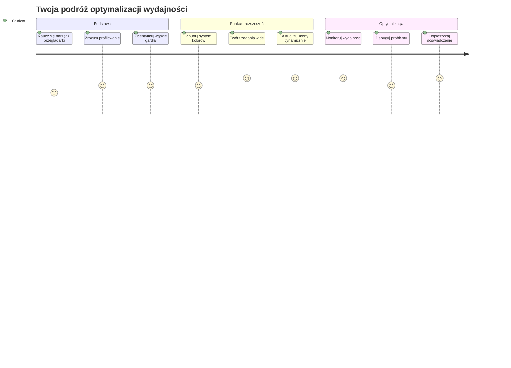
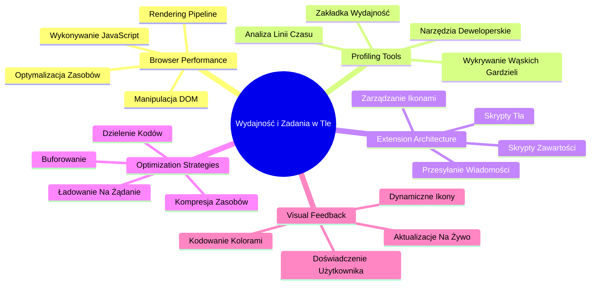
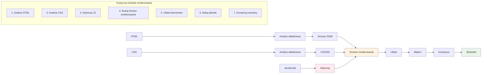
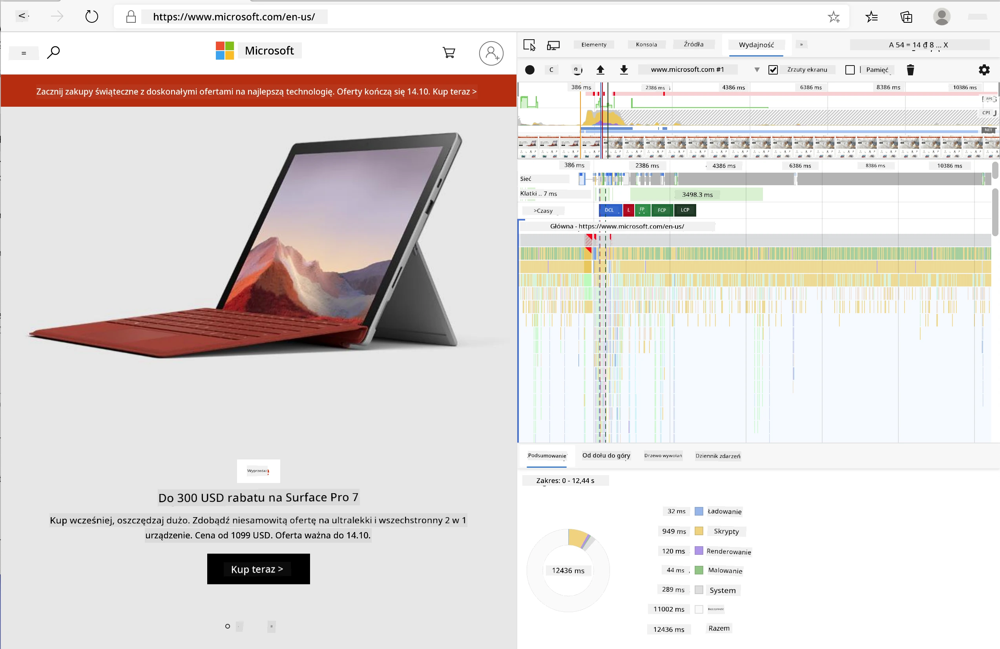
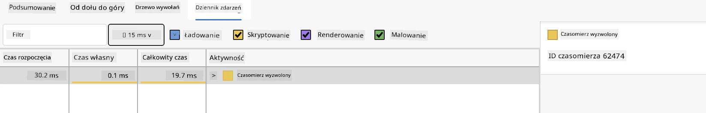
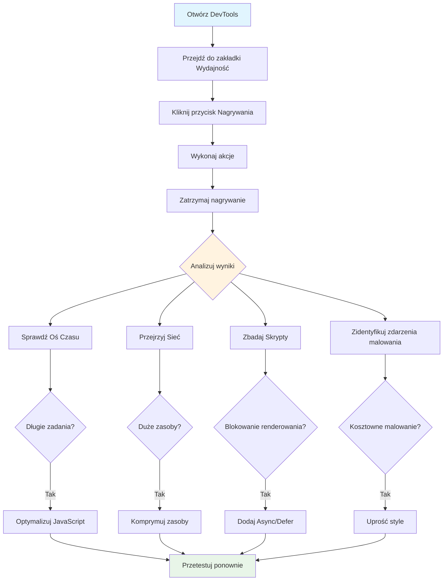
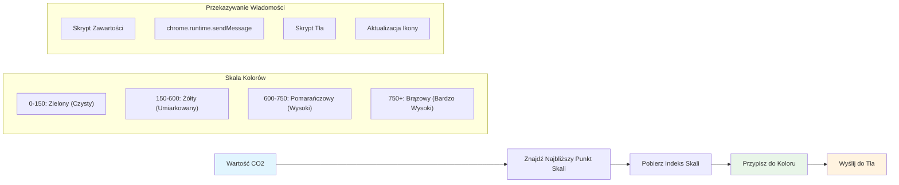
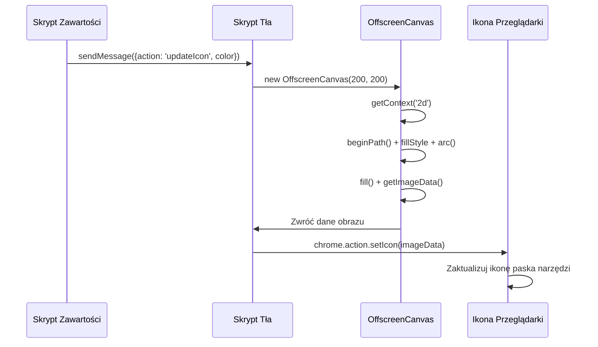
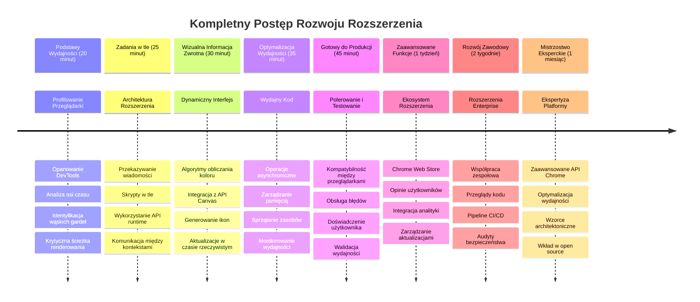

# Projekt rozszerzenia do przeglądarki cz. 3: Poznaj zadania w tle i wydajność


Zastanawiałeś się kiedyś, co sprawia, że niektóre rozszerzenia do przeglądarek działają szybciej i bardziej responsywnie, a inne wydają się wolne? Tajemnica tkwi w tym, co dzieje się za kulisami. Podczas gdy użytkownicy klikają w interfejs rozszerzenia, istnieje cały świat procesów w tle, które cicho zarządzają pobieraniem danych, aktualizacją ikon i zasobami systemowymi.

To nasza ostatnia lekcja z serii o rozszerzeniach do przeglądarek i sprawimy, że twoje narzędzie do śledzenia śladu węglowego będzie działać płynnie. Dodasz dynamiczne aktualizacje ikon i nauczysz się, jak dostrzegać problemy z wydajnością zanim staną się poważne. To jak strojenie samochodu wyścigowego – drobne optymalizacje mogą robić ogromną różnicę w działaniu całości.

Na koniec będziesz mieć dopracowane rozszerzenie i zrozumiesz zasady wydajności, które oddzielają dobre aplikacje webowe od świetnych. Zanurzmy się w świat optymalizacji przeglądarki.

## Quiz przed wykładem

[Quiz przed wykładem](https://ff-quizzes.netlify.app/web/quiz/27)

### Wprowadzenie

W poprzednich lekcjach zbudowałeś formularz, połączyłeś go z API i poradziłeś sobie z asynchronicznym pobieraniem danych. Twoje rozszerzenie ładnie się kształtuje.

Teraz musimy dodać ostatnie szlify – na przykład sprawić, by ikona rozszerzenia zmieniała kolory w zależności od danych o emisji CO2. Przypomina mi to, jak NASA musiała optymalizować każdy system na statku Apollo. Nie mogli sobie pozwolić na zmarnowanie cykli czy pamięci, bo życie zależało od wydajności. Nasze rozszerzenie nie jest aż tak krytyczne, ale te same zasady obowiązują – efektywny kod tworzy lepsze doświadczenia użytkownika.


## Podstawy wydajności w sieci

Kiedy twój kod działa efektywnie, ludzie mogą to *poczuć*. Znasz ten moment, gdy strona ładuje się natychmiast lub animacja płynie gładko? To działanie dobrej wydajności.

Wydajność to nie tylko szybkość – to tworzenie doświadczeń webowych, które są naturalne, a nie toporne i frustrujące. W początkach komputerów Grace Hopper słynnie trzymała nanosekundę (kawałek drutu około stopy długości) na swoim biurku, aby pokazać, jak daleko światło może przejść w jednej miliardowej sekundy. To był jej sposób wyjaśniania, dlaczego każda mikrosekunda ma znaczenie w obliczeniach. Poznajmy narzędzia detektywistyczne, które pomogą ci znaleźć, co spowalnia.

> "Wydajność strony internetowej to dwie rzeczy: jak szybko ładuje się strona i jak szybko działa na niej kod." -- [Zack Grossbart](https://www.smashingmagazine.com/2012/06/javascript-profiling-chrome-developer-tools/)

Temat, jak sprawić by twoje strony były błyskawicznie szybkie na wszelkich urządzeniach, dla wszelkich użytkowników, w różnych sytuacjach, jest jak można się spodziewać ogromny. Oto kilka punktów, które warto mieć na uwadze, budując zwykły projekt webowy lub rozszerzenie do przeglądarki.

Pierwszym krokiem do optymalizacji jest zrozumienie, co naprawdę dzieje się pod maską. Na szczęście twoja przeglądarka ma wbudowane potężne narzędzia detektywistyczne.


Aby otworzyć Narzędzia deweloperskie w Edge, kliknij trzy kropki w prawym górnym rogu, potem idź do Więcej narzędzi > Narzędzia deweloperskie. Możesz też użyć skrótu klawiszowego: `Ctrl` + `Shift` + `I` na Windows lub `Option` + `Command` + `I` na Macu. Po wejściu kliknij na kartę Wydajność — tutaj przeprowadzisz swoje śledztwo.

**Oto twój zestaw narzędzi detektywistycznych do wydajności:**
- **Otwórz** Narzędzia deweloperskie (będziesz ich stale używać jako programista!)
- **Przejdź** do zakładki Wydajność – potraktuj ją jak tracker kondycji twojej aplikacji webowej
- **Naciśnij** przycisk Nagrywania i obserwuj działanie strony
- **Przeanalizuj** wyniki, by znaleźć, co spowalnia działanie

Wypróbujmy to. Otwórz jakąś stronę (Microsoft.com świetnie się sprawdzi) i kliknij 'Nagraj'. Teraz odśwież stronę i obserwuj, jak profiler rejestruje wszystko, co się dzieje. Po zatrzymaniu nagrywania zobaczysz szczegółowy rozkład tego, jak przeglądarka 'skryptuje', 'renderuje' i 'maluje' witrynę. Przypomina mi to, jak centrum kontroli misji monitoruje każdy system podczas startu rakiety – masz dane w czasie rzeczywistym o tym, co i kiedy się dzieje.



✅ [Dokumentacja Microsoft](https://docs.microsoft.com/microsoft-edge/devtools-guide/performance/?WT.mc_id=academic-77807-sagibbon) zawiera dużo więcej szczegółów, jeśli chcesz zgłębić temat

> Pro tip: Wyczyść pamięć podręczną przeglądarki przed testowaniem, by zobaczyć, jak twoja strona działa dla pierwszych odwiedzających – zazwyczaj jest to dość inne niż przy kolejnych wizytach!

Wybierz elementy linii czasu profilu, aby przybliżyć zdarzenia zachodzące podczas ładowania strony.

Zyskaj migawkę wydajności strony, wybierając fragment linii czasu profilu i patrząc na panel podsumowania:


Sprawdź panel Dziennika zdarzeń, aby zobaczyć, czy jakieś zdarzenie trwało dłużej niż 15 ms:



✅ Poznaj swój profiler! Otwórz narzędzia deweloperskie na tej stronie i sprawdź, czy są jakieś wąskie gardła. Jaki zasób ładuje się najwolniej? Najszybciej?


## Na co zwracać uwagę podczas profilowania

Uruchomienie profilera to dopiero początek – prawdziwa umiejętność to wiedzieć, co te kolorowe wykresy naprawdę oznaczają. Nie martw się, nauczysz się je czytać. Doświadczeni programiści potrafią dostrzec sygnały ostrzegawcze zanim przerodzą się w poważne problemy.

Porozmawiajmy o typowych winowajcach – problemach z wydajnością, które lubią wkradać się do projektów webowych. Jak Marie Curie musiała starannie monitorować poziomy promieniowania w laboratorium, tak my musimy obserwować pewne wzorce wskazujące na problemy. Wykrycie ich wcześnie zaoszczędzi wiele frustracji tobie i użytkownikom.

**Rozmiary zasobów**: Strony internetowe stały się "cięższe" przez lata, a wiele z tego dodatkowego obciążenia pochodzi od obrazów. To tak, jakbyśmy pakowali coraz więcej do naszych cyfrowych walizek.

✅ Sprawdź [Internet Archive](https://httparchive.org/reports/page-weight), aby zobaczyć, jak rozmiary stron rosły z czasem – to bardzo pouczające.

**Oto jak utrzymać optymalizację zasobów:**
- **Kompresuj** obrazy! Nowoczesne formaty, takie jak WebP, mogą drastycznie zmniejszyć rozmiary plików
- **Dostarczaj** odpowiedni rozmiar obrazu dla każdego urządzenia – nie wysyłaj ogromnych obrazów desktopowych na telefony
- **Minimalizuj** CSS i JavaScript – każdy bajt się liczy
- **Stosuj** lazy loading, by obrazy pobierały się dopiero, gdy użytkownik do nich przewinie

**Przechodzenie po DOM**: Przeglądarka musi zbudować swój Document Object Model na podstawie twojego kodu, więc dla dobrej wydajności strony trzymaj elementy minimalnie, stosując i stylizując tylko to, czego strona potrzebuje. Nadmiar CSS powiązany ze stroną można zoptymalizować; style potrzebne tylko na jednej stronie nie muszą być uwzględnione w głównym arkuszu stylów, na przykład.

**Kluczowe strategie optymalizacji DOM:**
- **Minimalizuj** liczbę elementów HTML i poziomy zagnieżdżenia
- **Usuwaj** nieużywane reguły CSS i efektywnie konsoliduj arkusze stylów
- **Organizuj** CSS tak, by ładowało się tylko to, co potrzebne na danej stronie
- **Strukturyzuj** HTML semantycznie, by ułatwić analizę przez przeglądarkę

**JavaScript**: Każdy deweloper powinien zwracać uwagę na skrypty blokujące renderowanie, które muszą być załadowane, zanim reszta DOM może być przejrzana i wyświetlona. Rozważ użycie atrybutu `defer` w swoich skryptach inline (tak jak jest to zrobione w module Terrarium).

**Nowoczesne techniki optymalizacji JavaScript:**
- **Używaj** atrybutu `defer`, by ładować skrypty po parsowaniu DOM
- **Zaimplementuj** dzielenie kodu, by ładować tylko niezbędny JavaScript
- **Stosuj** lazy loading dla funkcji niekrytycznych
- **Minimalizuj** używanie ciężkich bibliotek i frameworków, kiedy to możliwe

✅ Wypróbuj kilka stron na [Site Speed Test website](https://www.webpagetest.org/), by poznać najczęstsze testy wydajności stron.

### 🔄 **Sprawdzenie pedagogiczne**
**Zrozumienie wydajności**: Przed budowaniem funkcji rozszerzenia upewnij się, że potrafisz:
- ✅ Wyjaśnić krytyczną ścieżkę renderowania od HTML do pikseli
- ✅ Zidentyfikować typowe wąskie gardła wydajności w aplikacjach webowych
- ✅ Używać narzędzi deweloperskich przeglądarki do profilowania wydajności strony
- ✅ Rozumieć, jak rozmiar zasobów i złożoność DOM wpływają na szybkość

**Szybki test**: Co się dzieje, gdy masz JavaScript blokujący renderowanie?
*Odpowiedź: Przeglądarka musi pobrać i wykonać ten skrypt, zanim będzie mogła kontynuować parsowanie HTML i renderowanie strony*

**Rzeczywisty wpływ na wydajność**:
- **100 ms opóźnienia**: użytkownicy zauważają spowolnienie
- **1 sekunda opóźnienia**: użytkownicy tracą koncentrację
- **3+ sekund**: 40% użytkowników porzuca stronę
- **Sieci mobilne**: wydajność ma jeszcze większe znaczenie

Teraz, gdy masz pojęcie, jak przeglądarka renderuje zasoby, które jej wysyłasz, spójrzmy na ostatnie czynności, które musisz wykonać, aby ukończyć rozszerzenie:

### Utwórz funkcję do obliczania koloru

Teraz stworzymy funkcję, która zamienia dane liczbowe na znaczące kolory. Pomyśl o tym jak o sygnalizacji świetlnej – zielony oznacza czystą energię, czerwony wysoki poziom emisji.

Funkcja ta weźmie dane CO2 z naszego API i określi, jaki kolor najlepiej reprezentuje wpływ na środowisko. To podobne do tego, jak naukowcy używają kodowania kolorami w mapach cieplnych do wizualizacji złożonych wzorców danych – od temperatur oceanu po formowanie się gwiazd. Dodajmy to do `/src/index.js`, tuż po definicjach tych zmiennych `const`, które ustaliliśmy wcześniej:


```javascript
function calculateColor(value) {
	// Zdefiniuj skalę intensywności CO2 (gramy na kWh)
	const co2Scale = [0, 150, 600, 750, 800];
	// Odpowiadające kolory od zielonego (czyste) do ciemnobrązowego (wysoka emisja węgla)
	const colors = ['#2AA364', '#F5EB4D', '#9E4229', '#381D02', '#381D02'];

	// Znajdź najbliższą wartość na skali do naszego wejścia
	const closestNum = co2Scale.sort((a, b) => {
		return Math.abs(a - value) - Math.abs(b - value);
	})[0];
	
	console.log(`${value} is closest to ${closestNum}`);
	
	// Znajdź indeks do mapowania kolorów
	const num = (element) => element > closestNum;
	const scaleIndex = co2Scale.findIndex(num);

	const closestColor = colors[scaleIndex];
	console.log(scaleIndex, closestColor);

	// Wyślij wiadomość o aktualizacji koloru do skryptu w tle
	chrome.runtime.sendMessage({ action: 'updateIcon', value: { color: closestColor } });
}
```

**Przeanalizujmy tę sprytną funkcję:**
- **Ustawia** dwie tablice – jedną dla poziomów CO2, drugą dla kolorów (zielony = czysto, brązowy = brudno!)
- **Znajduje** najbliższe dopasowanie do naszej rzeczywistej wartości CO2 za pomocą sprytnego sortowania tablicy
- **Pobiera** odpowiadający kolor metodą findIndex()
- **Wysyła** wiadomość do skryptu w tle Chrome z wybranym kolorem
- **Używa** template literals (tych odwrotnych apostrofów) dla czytelniejszego formatowania tekstu
- **Utrzymuje** kod uporządkowany dzięki deklaracjom const

`chrome.runtime` [API](https://developer.chrome.com/extensions/runtime) jest jak system nerwowy twojego rozszerzenia – obsługuje całą komunikację i zadania w tle:

> "Użyj API chrome.runtime, aby uzyskać stronę tła, zwrócić szczegóły o manifeście oraz nasłuchiwać i reagować na zdarzenia w cyklu życia aplikacji lub rozszerzenia. Możesz także użyć tego API do konwersji względnych ścieżek URL na w pełni kwalifikowane adresy URL."

**Dlaczego API Chrome Runtime jest tak przydatne:**
- **Pozwala** różnym częściom rozszerzenia komunikować się ze sobą
- **Obsługuje** pracę w tle bez zawieszania interfejsu użytkownika
- **Zarządza** wydarzeniami cyklu życia rozszerzenia
- **Ułatwia** przekazywanie wiadomości między skryptami

✅ Jeżeli tworzysz to rozszerzenie dla Edge, może cię zaskoczyć, że używasz API chrome. Nowsze wersje Edge działają na silniku Chromium, więc możesz korzystać z tych narzędzi.


> **Pro wskazówka**: Jeśli chcesz profilować rozszerzenie, uruchom narzędzia deweloperskie z poziomu samego rozszerzenia, jako że jest ono oddzielną instancją przeglądarki. Uzyskasz w ten sposób dostęp do metryk wydajności specyficznych dla rozszerzenia.

### Ustaw domyślny kolor ikony

Zanim zaczniemy pobierać prawdziwe dane, dajmy rozszerzeniu punkt startowy. Nikt nie lubi patrzeć na pustą lub zepsutą ikonę. Zacznijmy od zielonego koloru, żeby użytkownicy wiedzieli, że rozszerzenie działa od momentu instalacji.

W funkcji `init()` ustawmy ten domyślny zielony kolor ikony:

```javascript
chrome.runtime.sendMessage({
	action: 'updateIcon',
	value: {
		color: 'green',
	},
});
```

**Co osiąga ta inicjalizacja:**
- **Ustawia** neutralny zielony kolor jako stan domyślny
- **Zapewnia** natychmiastową wizualną informację zwrotną, gdy rozszerzenie się ładuje
- **Ustanawia** wzorzec komunikacji ze skryptem tła
- **Zapewnia**, że użytkownicy widzą działające rozszerzenie przed załadowaniem danych
### Wywołaj funkcję, wykonaj połączenie

Połączmy teraz wszystko tak, aby gdy nadejdą świeże dane CO2, ikona automatycznie aktualizowała się właściwym kolorem. To jak połączenie ostatniego obwodu w urządzeniu elektronicznym – nagle wszystkie komponenty działają jako jeden system.

Dodaj tę linijkę zaraz po pobraniu danych CO2 z API:

```javascript
// Po pobraniu danych CO2 z API
// pozwól CO2 = data.data[0].intensity.actual;
calculateColor(CO2);
```

**Ta integracja osiąga:**
- **Łączy** przepływ danych API z systemem wskaźników wizualnych
- **Wywołuje** automatyczne aktualizacje ikony przy nadejściu nowych danych
- **Zapewnia** wizualną informację zwrotną w czasie rzeczywistym na podstawie aktualnej intensywności emisji
- **Utrzymuje** separację odpowiedzialności między pobieraniem danych a logiką wyświetlania

I na koniec w pliku `/dist/background.js` dodaj nasłuchiwacz dla tych wywołań w tle:

```javascript
// Nasłuchuj wiadomości od skryptu treści
chrome.runtime.onMessage.addListener(function (msg, sender, sendResponse) {
	if (msg.action === 'updateIcon') {
		chrome.action.setIcon({ imageData: drawIcon(msg.value) });
	}
});

// Rysuj dynamiczną ikonę za pomocą Canvas API
// Zapożyczone z rozszerzenia energy lollipop - świetna funkcja!
function drawIcon(value) {
	// Utwórz canvas poza ekranem dla lepszej wydajności
	const canvas = new OffscreenCanvas(200, 200);
	const context = canvas.getContext('2d');

	// Narysuj kolorowe koło reprezentujące intensywność węgla
	context.beginPath();
	context.fillStyle = value.color;
	context.arc(100, 100, 50, 0, 2 * Math.PI);
	context.fill();

	// Zwróć dane obrazu dla ikony przeglądarki
	return context.getImageData(50, 50, 100, 100);
}
```

**Oto, co robi ten skrypt tła:**
- **Nasłuchuje** wiadomości od głównego skryptu (jak recepcjonista odbierający telefony)
- **Przetwarza** żądania 'updateIcon' do zmiany ikony na pasku narzędzi
- **Tworzy** nowe ikony „w locie” używając API Canvas
- **Rysuje** prosty kolorowy okrąg, który pokazuje aktualną intensywność emisji
- **Aktualizuje** pasek narzędzi przeglądarki z nową ikoną
- **Używa** OffscreenCanvas dla płynnej wydajności (bez blokowania UI)

✅ Więcej o API Canvas nauczysz się w lekcjach [Space Game](../../6-space-game/2-drawing-to-canvas/README.md).


### 🔄 **Sprawdzenie pedagogiczne**
**Pełne zrozumienie rozszerzenia**: Sprawdź swoją znajomość całego systemu:
- ✅ Jak działa przekazywanie wiadomości między różnymi skryptami rozszerzenia?
- ✅ Dlaczego używamy OffscreenCanvas zamiast zwykłego Canvas dla wydajności?
- ✅ Jaką rolę odgrywa Chrome Runtime API w architekturze rozszerzeń?
- ✅ Jak algorytm obliczania koloru mapuje dane na informację wizualną?

**Uwagi dotyczące wydajności**: Twoje rozszerzenie obecnie prezentuje:
- **Wydajna komunikacja**: Czysta wymiana wiadomości między kontekstami skryptów
- **Optymalizacja renderowania**: OffscreenCanvas zapobiega blokowaniu interfejsu użytkownika
- **Aktualizacje w czasie rzeczywistym**: Dynamiczne zmiany ikony oparte na aktualnych danych
- **Zarządzanie pamięcią**: Poprawne sprzątanie i obsługa zasobów

**Czas przetestować rozszerzenie:**
- **Zbuduj** wszystko za pomocą `npm run build`
- **Przeładuj** rozszerzenie w przeglądarce (nie zapomnij tego kroku)
- **Otwórz** swoje rozszerzenie i obserwuj, jak zmienia się kolor ikony
- **Sprawdź**, jak reaguje na rzeczywiste dane dotyczące emisji dwutlenku węgla z całego świata

Teraz od razu poznasz, czy to dobry moment na pranie, czy warto poczekać na czystszą energię. Właśnie stworzyłeś coś naprawdę użytecznego i po drodze nauczyłeś się o wydajności przeglądarki.

## GitHub Copilot Agent Challenge 🚀

Wykorzystaj tryb Agenta, aby wykonać następujące zadanie:

**Opis:** Rozszerz możliwości monitorowania wydajności rozszerzenia przeglądarki, dodając funkcję śledzenia i wyświetlania czasów ładowania różnych komponentów rozszerzenia.

**Polecenie:** Stwórz system monitorowania wydajności rozszerzenia przeglądarki, który mierzy i loguje czas pobierania danych CO2 z API, obliczania kolorów oraz aktualizacji ikony. Dodaj funkcję o nazwie `performanceTracker`, która wykorzystuje Performance API do pomiaru tych operacji i wyświetla wyniki w konsoli przeglądarki wraz ze znacznikami czasu i metrykami trwania.

Dowiedz się więcej o [trybie agenta](https://code.visualstudio.com/blogs/2025/02/24/introducing-copilot-agent-mode).

## 🚀 Wyzwanie

Oto ciekawa misja detektywistyczna: wybierz kilka otwartoźródłowych serwisów, które działają od lat (pomysł: Wikipedia, GitHub lub Stack Overflow) i przejrzyj ich historię commitów. Czy zauważasz momenty, w których poprawiano wydajność? Jakie problemy się powtarzały?

**Twoje podejście do śledztwa:**
- **Przeszukaj** komunikaty commitów pod kątem słów takich jak "optimize", "performance" lub "faster"
- **Szukaj** wzorców – czy ciągle naprawiają te same rodzaje problemów?
- **Zidentyfikuj** typowe przeszkody spowalniające strony
- **Podziel się** swoimi odkryciami – inni deweloperzy uczą się na przykładach z życia

## Quiz po wykładzie

[Quiz po wykładzie](https://ff-quizzes.netlify.app/web/quiz/28)

## Przegląd i samokształcenie

Rozważ zapisanie się do [newslettera o wydajności](https://perf.email/)

Zbadaj różne sposoby, w jakie przeglądarki mierzą wydajność stron, przeglądając zakładki wydajności w narzędziach developerskich. Czy zauważasz istotne różnice?

### ⚡ **Co możesz zrobić w ciągu najbliższych 5 minut**
- [ ] Otwórz Menedżer zadań przeglądarki (Shift+Esc w Chrome), aby zobaczyć zużycie zasobów przez rozszerzenia
- [ ] Użyj zakładki Wydajność w DevTools, aby nagrać i przeanalizować działanie strony
- [ ] Sprawdź stronę rozszerzeń przeglądarki, by zobaczyć, które rozszerzenia wpływają na czas uruchamiania
- [ ] Spróbuj tymczasowo wyłączyć rozszerzenia, aby zobaczyć różnice w wydajności

### 🎯 **Co możesz osiągnąć w ciągu najbliższej godziny**
- [ ] Ukończ quiz po lekcji i zrozum koncepcje wydajności
- [ ] Zaimplementuj skrypt tła dla swojego rozszerzenia przeglądarki
- [ ] Naucz się korzystać z browser.alarms do efektywnych zadań w tle
- [ ] Ćwicz przekazywanie wiadomości między skryptami zawartości a skryptami tła
- [ ] Mierz i optymalizuj zużycie zasobów przez swoje rozszerzenie

### 📅 **Twoja tygodniowa podróż po wydajności**
- [ ] Ukończ wysokowydajne rozszerzenie przeglądarki z funkcjonalnością w tle
- [ ] Opanuj service workers i nowoczesną architekturę rozszerzeń
- [ ] Wdrażaj efektywną synchronizację danych i strategie cache’owania
- [ ] Poznaj zaawansowane techniki debugowania wydajności rozszerzeń
- [ ] Optymalizuj rozszerzenie pod kątem funkcjonalności i efektywności zasobów
- [ ] Twórz kompleksowe testy scenariuszy wydajności rozszerzenia

### 🌟 **Twoje miesięczne mistrzostwo optymalizacji**
- [ ] Buduj rozszerzenia przeglądarki klasy enterprise z optymalną wydajnością
- [ ] Zdobywaj wiedzę o Web Workers, Service Workers i nowoczesnej wydajności webowej
- [ ] Wnoś wkład w projekty open source skupione na optymalizacji wydajności
- [ ] Opanuj wewnętrzne mechanizmy przeglądarek i zaawansowane metody debugowania
- [ ] Twórz narzędzia do monitorowania wydajności i przewodniki najlepszych praktyk
- [ ] Stań się ekspertem od wydajności pomagającym optymalizować aplikacje webowe

## 🎯 Twój harmonogram opanowania rozszerzeń przeglądarki


### 🛠️ Twój kompletny zestaw narzędzi do tworzenia rozszerzeń

Po ukończeniu tej trylogii opanowałeś:
- **Architekturę przeglądarki**: Dogłębne rozumienie integracji rozszerzeń z systemami przeglądarki
- **Profilowanie wydajności**: Umiejętność identyfikowania i naprawiania wąskich gardeł za pomocą narzędzi developerskich
- **Programowanie asynchroniczne**: Nowoczesne wzorce JavaScript dla responsywnych, nieblokujących operacji
- **Integrację API**: Pobieranie danych z zewnętrznych źródeł z obsługą uwierzytelniania i błędów
- **Projektowanie wizualne**: Dynamiczne aktualizacje UI i generowanie grafiki opartej na Canvas
- **Przekazywanie wiadomości**: Komunikacja między skryptami w architekturze rozszerzeń
- **Doświadczenie użytkownika**: Stany ładowania, obsługa błędów i intuicyjne interakcje
- **Umiejętności produkcyjne**: Testowanie, debugowanie i optymalizacja do wdrożeń produkcyjnych

**Zastosowania w realnym świecie**: Umiejętności tworzenia rozszerzeń wykorzystasz bezpośrednio w:
- **Progressive Web Apps**: Podobna architektura i wzorce wydajności
- **Aplikacje desktopowe Electron**: Wieloplatformowe aplikacje wykorzystujące technologie webowe
- **Mobilne aplikacje hybrydowe**: Tworzenie Cordova/PhoneGap z użyciem API webowych
- **Aplikacje webowe dla przedsiębiorstw**: Złożone pulpity i narzędzia produktywności
- **Rozszerzenia Chrome DevTools**: Zaawansowane narzędzia developerskie i debugowanie
- **Integracja z Web API**: Każda aplikacja komunikująca się z zewnętrznymi usługami

**Profesjonalny wpływ**: Teraz możesz:
- **Budować** rozszerzenia przeglądarki gotowe do produkcji od pomysłu do wdrożenia
- **Optymalizować** wydajność aplikacji webowych używając standardowych narzędzi profilujących
- **Projektować** skalowalne systemy z odpowiednim podziałem odpowiedzialności
- **Debugować** złożone operacje asynchroniczne i komunikację między kontekstami
- **Wnosić wkład** w projekty open source i standardy przeglądarek

**Możliwości na wyższy poziom**:
- **Deweloper Chrome Web Store**: Publikuj rozszerzenia dla milionów użytkowników
- **Inżynier wydajności webowej**: Specjalizuj się w optymalizacji i doświadczeniu użytkownika
- **Deweloper platformy przeglądarki**: Wnoś wkład w rozwój silników przeglądarek
- **Twórca frameworków rozszerzeń**: Buduj narzędzia wspierające innych deweloperów
- **Relacje z deweloperami**: Dziel się wiedzą przez nauczanie i tworzenie treści

🌟 **Osiągnięcie odblokowane**: Zbudowałeś kompletne, funkcjonalne rozszerzenie przeglądarki, które prezentuje profesjonalne praktyki rozwoju i nowoczesne standardy webowe!

## Zadanie

[Przeanalizuj serwis pod kątem wydajności](assignment.md)

---

<!-- CO-OP TRANSLATOR DISCLAIMER START -->
**Zastrzeżenie**:  
Niniejszy dokument został przetłumaczony za pomocą usługi tłumaczeniowej AI [Co-op Translator](https://github.com/Azure/co-op-translator). Chociaż dążymy do jak największej dokładności, należy pamiętać, że tłumaczenia automatyczne mogą zawierać błędy lub nieścisłości. Oryginalny dokument w jego języku źródłowym powinien być uważany za źródło nadrzędne. W przypadku informacji o znaczeniu krytycznym zalecane jest skorzystanie z profesjonalnego tłumaczenia wykonanego przez człowieka. Nie ponosimy odpowiedzialności za jakiekolwiek nieporozumienia lub błędne interpretacje wynikające z użycia tego tłumaczenia.
<!-- CO-OP TRANSLATOR DISCLAIMER END -->