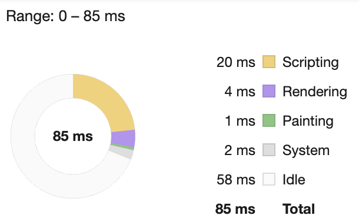
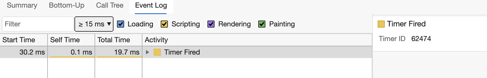

<!--
CO_OP_TRANSLATOR_METADATA:
{
  "original_hash": "49b58721a71cfda824e2f3e1f46908c6",
  "translation_date": "2025-08-29T16:27:33+00:00",
  "source_file": "5-browser-extension/3-background-tasks-and-performance/README.md",
  "language_code": "pl"
}
-->
# Projekt Rozszerzenia Przeglądarki, Część 3: Dowiedz się o Zadaniach w Tle i Wydajności

## Quiz Przed Lekcją

[Quiz przed lekcją](https://ff-quizzes.netlify.app/web/quiz/27)

### Wprowadzenie

W dwóch ostatnich lekcjach tego modułu nauczyłeś się, jak stworzyć formularz i obszar wyświetlania danych pobranych z API. To bardzo standardowy sposób tworzenia obecności w sieci. Nauczyłeś się także, jak obsługiwać asynchroniczne pobieranie danych. Twoje rozszerzenie przeglądarki jest prawie gotowe.

Pozostało zarządzanie niektórymi zadaniami w tle, w tym odświeżanie koloru ikony rozszerzenia, więc to świetny moment, aby porozmawiać o tym, jak przeglądarka zarządza tego typu zadaniami. Zastanówmy się nad tymi zadaniami przeglądarki w kontekście wydajności Twoich zasobów internetowych podczas ich tworzenia.

## Podstawy Wydajności w Sieci

> "Wydajność strony internetowej to dwie rzeczy: jak szybko ładuje się strona i jak szybko działa kod na niej." -- [Zack Grossbart](https://www.smashingmagazine.com/2012/06/javascript-profiling-chrome-developer-tools/)

Temat tego, jak sprawić, by Twoje strony internetowe działały błyskawicznie na wszelkiego rodzaju urządzeniach, dla różnych użytkowników i w różnych sytuacjach, jest, co nie dziwi, bardzo obszerny. Oto kilka punktów, które warto mieć na uwadze podczas tworzenia standardowego projektu internetowego lub rozszerzenia przeglądarki.

Pierwszą rzeczą, którą musisz zrobić, aby upewnić się, że Twoja strona działa wydajnie, jest zebranie danych na temat jej wydajności. Pierwszym miejscem, w którym możesz to zrobić, są narzędzia deweloperskie Twojej przeglądarki. W Edge możesz wybrać przycisk "Ustawienia i więcej" (ikona trzech kropek w prawym górnym rogu przeglądarki), a następnie przejść do Więcej narzędzi > Narzędzia deweloperskie i otworzyć kartę Wydajność. Możesz także użyć skrótów klawiaturowych `Ctrl` + `Shift` + `I` na Windowsie lub `Option` + `Command` + `I` na Macu, aby otworzyć narzędzia deweloperskie.

Karta Wydajność zawiera narzędzie do profilowania. Otwórz stronę internetową (spróbuj na przykład [https://www.microsoft.com](https://www.microsoft.com/?WT.mc_id=academic-77807-sagibbon)) i kliknij przycisk "Nagrywaj", a następnie odśwież stronę. Zatrzymaj nagrywanie w dowolnym momencie, a zobaczysz rutyny generowane do 'skryptowania', 'renderowania' i 'malowania' strony:


✅ Odwiedź [Dokumentację Microsoft](https://docs.microsoft.com/microsoft-edge/devtools-guide/performance/?WT.mc_id=academic-77807-sagibbon) dotyczącą panelu Wydajność w Edge.

> Wskazówka: aby uzyskać dokładny odczyt czasu uruchamiania Twojej strony, wyczyść pamięć podręczną przeglądarki.

Wybierz elementy osi czasu profilu, aby przybliżyć zdarzenia, które mają miejsce podczas ładowania Twojej strony.

Uzyskaj migawkę wydajności swojej strony, wybierając część osi czasu profilu i patrząc na panel podsumowania:



Sprawdź panel Dziennika Zdarzeń, aby zobaczyć, czy jakieś zdarzenie trwało dłużej niż 15 ms:



✅ Zapoznaj się z profilerem! Otwórz narzędzia deweloperskie na tej stronie i sprawdź, czy występują jakieś wąskie gardła. Jaki zasób ładuje się najwolniej? Najszybciej?

## Kontrole Profilowania

Ogólnie rzecz biorąc, istnieją pewne "problematyczne obszary", na które każdy deweloper stron internetowych powinien zwracać uwagę podczas budowania strony, aby uniknąć niemiłych niespodzianek podczas wdrażania na produkcję.

**Rozmiary zasobów**: Sieć stała się w ostatnich latach "cięższa", a co za tym idzie, wolniejsza. Część tej wagi wynika z użycia obrazów.

✅ Przejrzyj [Internet Archive](https://httparchive.org/reports/page-weight) w poszukiwaniu historycznego widoku wagi stron i innych informacji.

Dobrym zwyczajem jest upewnienie się, że Twoje obrazy są zoptymalizowane i dostarczane w odpowiednim rozmiarze i rozdzielczości dla Twoich użytkowników.

**Przechodzenie po DOM**: Przeglądarka musi zbudować swój Model Obiektowy Dokumentu na podstawie kodu, który piszesz, więc w interesie dobrej wydajności strony leży minimalizacja znaczników, używając i stylizując tylko to, co jest potrzebne na stronie. Na przykład nadmiar CSS związany ze stroną można zoptymalizować; style, które są potrzebne tylko na jednej stronie, nie muszą być uwzględniane w głównym arkuszu stylów.

**JavaScript**: Każdy deweloper JavaScript powinien uważać na skrypty blokujące renderowanie, które muszą zostać załadowane, zanim reszta DOM zostanie przejrzana i wyrenderowana w przeglądarce. Rozważ użycie `defer` w swoich skryptach inline (jak to zrobiono w module Terrarium).

✅ Wypróbuj kilka stron na [stronie testującej prędkość witryn](https://www.webpagetest.org/), aby dowiedzieć się więcej o typowych kontrolach przeprowadzanych w celu określenia wydajności strony.

Teraz, gdy masz pojęcie, jak przeglądarka renderuje zasoby, które jej wysyłasz, przyjrzyjmy się ostatnim rzeczom, które musisz zrobić, aby ukończyć swoje rozszerzenie:

### Stwórz funkcję do obliczania koloru

Pracując w `/src/index.js`, dodaj funkcję o nazwie `calculateColor()` po serii zmiennych `const`, które ustawiłeś, aby uzyskać dostęp do DOM:

```JavaScript
function calculateColor(value) {
	let co2Scale = [0, 150, 600, 750, 800];
	let colors = ['#2AA364', '#F5EB4D', '#9E4229', '#381D02', '#381D02'];

	let closestNum = co2Scale.sort((a, b) => {
		return Math.abs(a - value) - Math.abs(b - value);
	})[0];
	console.log(value + ' is closest to ' + closestNum);
	let num = (element) => element > closestNum;
	let scaleIndex = co2Scale.findIndex(num);

	let closestColor = colors[scaleIndex];
	console.log(scaleIndex, closestColor);

	chrome.runtime.sendMessage({ action: 'updateIcon', value: { color: closestColor } });
}
```

Co tu się dzieje? Przekazujesz wartość (intensywność węgla) z wywołania API, które ukończyłeś w ostatniej lekcji, a następnie obliczasz, jak blisko jej wartość jest indeksu przedstawionego w tablicy kolorów. Następnie przesyłasz tę najbliższą wartość koloru do środowiska chrome runtime.

Chrome.runtime ma [API](https://developer.chrome.com/extensions/runtime), które obsługuje wszelkiego rodzaju zadania w tle, a Twoje rozszerzenie z niego korzysta:

> "Użyj API chrome.runtime, aby pobrać stronę w tle, zwrócić szczegóły dotyczące manifestu oraz nasłuchiwać i reagować na zdarzenia w cyklu życia aplikacji lub rozszerzenia. Możesz także użyć tego API, aby konwertować względne ścieżki URL na w pełni kwalifikowane URL."

✅ Jeśli rozwijasz to rozszerzenie przeglądarki dla Edge, może Cię zaskoczyć, że używasz API chrome. Nowsze wersje przeglądarki Edge działają na silniku przeglądarki Chromium, więc możesz korzystać z tych narzędzi.

> Uwaga: jeśli chcesz profilować rozszerzenie przeglądarki, uruchom narzędzia deweloperskie z poziomu samego rozszerzenia, ponieważ jest to oddzielna instancja przeglądarki.

### Ustaw domyślny kolor ikony

Teraz, w funkcji `init()`, ustaw ikonę na ogólny zielony kolor na początek, ponownie wywołując akcję `updateIcon` w chrome:

```JavaScript
chrome.runtime.sendMessage({
	action: 'updateIcon',
		value: {
			color: 'green',
		},
});
```

### Wywołaj funkcję, wykonaj wywołanie

Następnie wywołaj funkcję, którą właśnie stworzyłeś, dodając ją do obietnicy zwróconej przez API C02Signal:

```JavaScript
//let CO2...
calculateColor(CO2);
```

I wreszcie, w `/dist/background.js`, dodaj nasłuchiwacza dla tych wywołań akcji w tle:

```JavaScript
chrome.runtime.onMessage.addListener(function (msg, sender, sendResponse) {
	if (msg.action === 'updateIcon') {
		chrome.browserAction.setIcon({ imageData: drawIcon(msg.value) });
	}
});
//borrowed from energy lollipop extension, nice feature!
function drawIcon(value) {
	let canvas = document.createElement('canvas');
	let context = canvas.getContext('2d');

	context.beginPath();
	context.fillStyle = value.color;
	context.arc(100, 100, 50, 0, 2 * Math.PI);
	context.fill();

	return context.getImageData(50, 50, 100, 100);
}
```

W tym kodzie dodajesz nasłuchiwacza dla wszelkich wiadomości przychodzących do menedżera zadań w tle. Jeśli wiadomość nazywa się 'updateIcon', następny kod zostanie uruchomiony, aby narysować ikonę w odpowiednim kolorze za pomocą API Canvas.

✅ Dowiesz się więcej o API Canvas w [lekcjach o grze kosmicznej](../../6-space-game/2-drawing-to-canvas/README.md).

Teraz, zbuduj ponownie swoje rozszerzenie (`npm run build`), odśwież i uruchom swoje rozszerzenie, i obserwuj, jak zmienia się kolor. Czy to dobry moment, aby zrobić sobie przerwę lub pozmywać naczynia? Teraz już wiesz!

Gratulacje, stworzyłeś użyteczne rozszerzenie przeglądarki i dowiedziałeś się więcej o tym, jak działa przeglądarka i jak profilować jej wydajność.

---

## 🚀 Wyzwanie

Zbadaj kilka stron internetowych open source, które istnieją od dawna, i na podstawie ich historii na GitHubie spróbuj ustalić, czy były optymalizowane pod kątem wydajności na przestrzeni lat, a jeśli tak, to w jaki sposób. Jaki jest najczęstszy problem?

## Quiz Po Lekcji

[Quiz po lekcji](https://ff-quizzes.netlify.app/web/quiz/28)

## Przegląd i Samodzielna Nauka

Rozważ zapisanie się na [newsletter o wydajności](https://perf.email/).

Zbadaj niektóre sposoby, w jakie przeglądarki oceniają wydajność stron internetowych, przeglądając zakładki wydajności w ich narzędziach internetowych. Czy zauważasz jakieś istotne różnice?

## Zadanie

[Przeanalizuj stronę pod kątem wydajności](assignment.md)

---

**Zastrzeżenie**:  
Ten dokument został przetłumaczony za pomocą usługi tłumaczenia AI [Co-op Translator](https://github.com/Azure/co-op-translator). Chociaż dokładamy wszelkich starań, aby tłumaczenie było precyzyjne, prosimy pamiętać, że automatyczne tłumaczenia mogą zawierać błędy lub nieścisłości. Oryginalny dokument w jego rodzimym języku powinien być uznawany za źródło autorytatywne. W przypadku informacji o kluczowym znaczeniu zaleca się skorzystanie z profesjonalnego tłumaczenia przez człowieka. Nie ponosimy odpowiedzialności za jakiekolwiek nieporozumienia lub błędne interpretacje wynikające z użycia tego tłumaczenia.