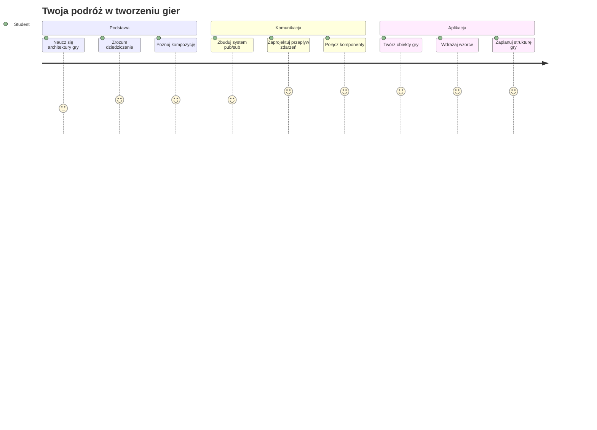
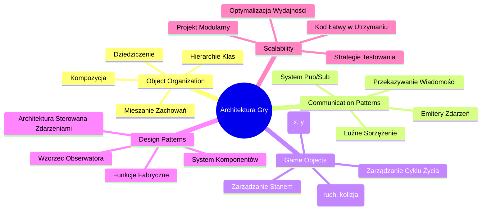
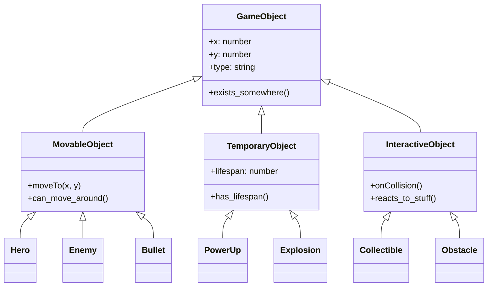
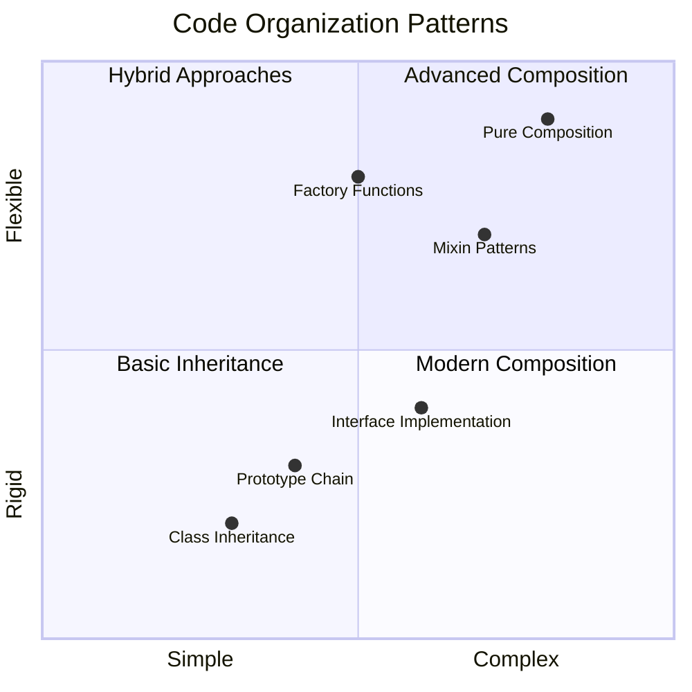
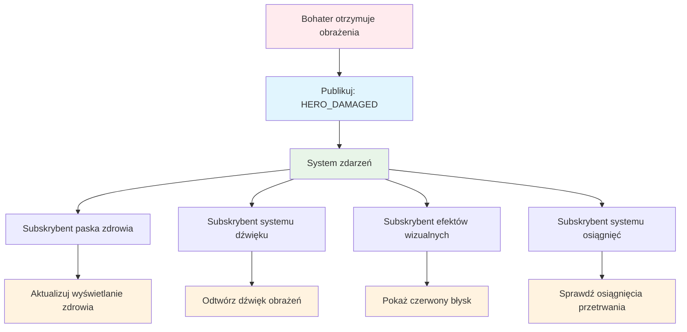
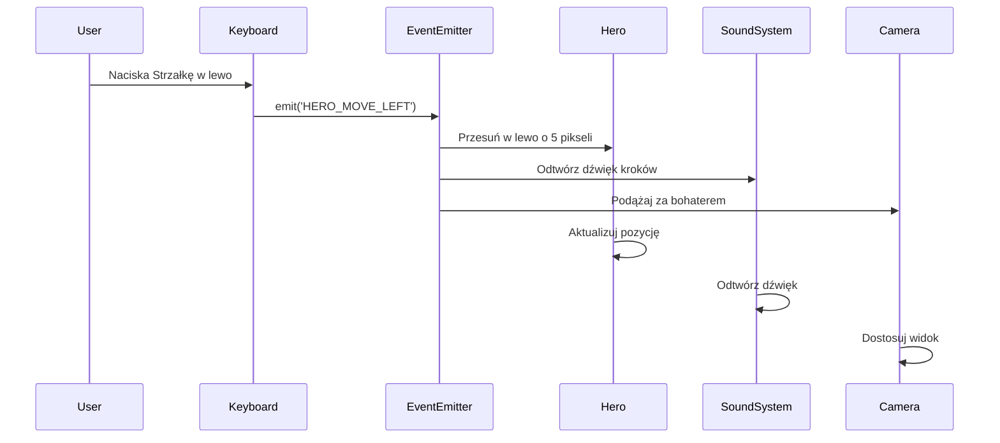
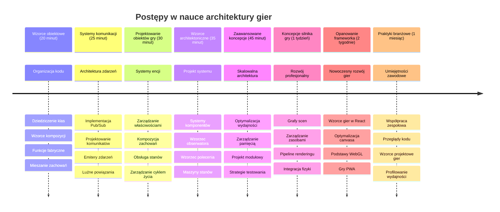

<!--
CO_OP_TRANSLATOR_METADATA:
{
  "original_hash": "a6332a7bb4d0be3bfd24199c83993777",
  "translation_date": "2026-01-06T19:16:43+00:00",
  "source_file": "6-space-game/1-introduction/README.md",
  "language_code": "pl"
}
-->
# Zbuduj grę kosmiczną część 1: Wprowadzenie




Podobnie jak centrum misji NASA koordynuje wiele systemów podczas startu rakiety, zbudujemy grę kosmiczną, która pokaże, jak różne części programu mogą współpracować bezproblemowo. Tworząc coś, w co naprawdę możesz grać, nauczysz się podstawowych koncepcji programowania, które mają zastosowanie w każdym projekcie oprogramowania.

Poznamy dwa fundamentalne podejścia do organizacji kodu: dziedziczenie i kompozycję. To nie są tylko koncepcje akademickie – to te same wzorce, które napędzają wszystko, od gier wideo po systemy bankowe. Zaimplementujemy także system komunikacji zwany pub/sub, który działa jak sieci komunikacyjne używane w statkach kosmicznych, pozwalając różnym komponentom dzielić się informacjami bez tworzenia zależności.

Pod koniec tej serii zrozumiesz, jak budować aplikacje, które mogą się skalować i ewoluować – czy to rozwijając gry, aplikacje webowe, czy inne systemy oprogramowania.


## Quiz przed wykładem

[Quiz przed wykładem](https://ff-quizzes.netlify.app/web/quiz/29)

## Dziedziczenie i kompozycja w tworzeniu gier

W miarę jak projekty rosną na złożoności, organizacja kodu staje się kluczowa. To, co zaczyna się jako prosty skrypt, może stać się trudne do utrzymania bez odpowiedniej struktury – podobnie jak misje Apollo wymagały starannej koordynacji tysięcy komponentów.

Poznamy dwa fundamentalne podejścia do organizacji kodu: dziedziczenie i kompozycję. Każde z nich ma swoje zalety, a zrozumienie obu pomaga wybrać właściwe podejście w różnych sytuacjach. Pokażemy te koncepcje na przykładzie naszej gry kosmicznej, gdzie bohaterowie, wrogowie, ulepszenia i inne obiekty muszą efektywnie ze sobą współdziałać.

✅ Jedna z najsłynniejszych książek o programowaniu dotyczy [wzorców projektowych](https://en.wikipedia.org/wiki/Design_Patterns).

W każdej grze masz `obiekty gry` – interaktywne elementy tworzące świat gry. Bohaterowie, wrogowie, power-upy i efekty wizualne to właśnie obiekty gry. Każdy z nich istnieje na określonych współrzędnych ekranu wykorzystując wartości `x` i `y`, podobnie jak punkty na płaszczyźnie współrzędnych.

Pomimo różnic wizualnych, te obiekty często dzielą podstawowe zachowania:

- **Istnieją gdzieś** – każdy obiekt ma współrzędne x i y, aby gra wiedziała, gdzie go narysować
- **Wiele z nich się porusza** – bohaterowie biegną, wrogowie ścigają, pociski lecą po ekranie
- **Mają czas życia** – niektóre pozostają na wieczność, inne (np. eksplozje) pojawiają się na chwilę i znikają
- **Reagują na zdarzenia** – gdy coś się zderza, power-upy są zbierane, paski zdrowia się aktualizują

✅ Pomyśl o grze jak Pac-Man. Czy potrafisz określić powyższe cztery typy obiektów w tej grze?


### Wyrażanie zachowań przez kod

Teraz, gdy rozumiesz wspólne zachowania obiektów gry, spójrzmy jak zaimplementować te zachowania w JavaScript. Zachowania obiektów można wyrażać za pomocą metod przypisanych do klas lub indywidualnych obiektów, i istnieje kilka podejść do wyboru.

**Podejście oparte na klasach**

Klasy i dziedziczenie dostarczają ustrukturyzowanego sposobu organizacji obiektów gry. Podobnie jak system klasyfikacji taksonomicznej opracowany przez Carla Linneusza, zaczynasz od klasy bazowej zawierającej wspólne właściwości, a następnie tworzysz specjalizowane klasy, które dziedziczą te podstawy i dodają specyficzne funkcje.

✅ Dziedziczenie to ważna koncepcja do zrozumienia. Dowiedz się więcej z [artykułu MDN o dziedziczeniu](https://developer.mozilla.org/docs/Web/JavaScript/Inheritance_and_the_prototype_chain).

Oto jak możesz zaimplementować obiekty gry wykorzystując klasy i dziedziczenie:

```javascript
// Krok 1: Utwórz podstawową klasę GameObject
class GameObject {
  constructor(x, y, type) {
    this.x = x;
    this.y = y;
    this.type = type;
  }
}
```

**Rozbijmy to krok po kroku:**
- Tworzymy podstawowy szablon, który każdy obiekt gry może wykorzystać
- Konstruktor zapisuje pozycję obiektu (`x`, `y`) oraz jaki to typ obiektu
- To staje się fundamentem, na którym zbudowane są wszystkie twoje obiekty gry

```javascript
// Krok 2: Dodaj możliwość poruszania się przez dziedziczenie
class Movable extends GameObject {
  constructor(x, y, type) {
    super(x, y, type); // Wywołaj konstruktor klasy nadrzędnej
  }

  // Dodaj możliwość przesunięcia do nowej pozycji
  moveTo(x, y) {
    this.x = x;
    this.y = y;
  }
}
```

**W powyższym:**
- **Rozszerzyliśmy** klasę GameObject, aby dodać funkcjonalność ruchu
- **Wywołaliśmy** konstruktor rodzica używając `super()`, aby zainicjalizować dziedziczone właściwości
- **Dodaliśmy** metodę `moveTo()`, która aktualizuje pozycję obiektu

```javascript
// Krok 3: Utwórz konkretne typy obiektów gry
class Hero extends Movable {
  constructor(x, y) {
    super(x, y, 'Hero'); // Ustaw typ automatycznie
  }
}

class Tree extends GameObject {
  constructor(x, y) {
    super(x, y, 'Tree'); // Drzewa nie potrzebują ruchu
  }
}

// Krok 4: Użyj swoich obiektów gry
const hero = new Hero(0, 0);
hero.moveTo(5, 5); // Bohater może się poruszać!

const tree = new Tree(10, 15);
// tree.moveTo() spowodowałoby błąd - drzewa nie mogą się poruszać
```

**Zrozumienie tych koncepcji:**
- **Tworzy** wyspecjalizowane typy obiektów, które dziedziczą odpowiednie zachowania
- **Demonstruje**, jak dziedziczenie pozwala selektywnie włączać funkcje
- **Pokazuje**, że bohaterowie mogą się poruszać, a drzewa zostają nieruchome
- **Ilustruje**, jak hierarchia klas zapobiega niewłaściwym działaniom

✅ Poświęć kilka minut, aby wyobrazić sobie bohatera Pac-Mana (np. Inky, Pinky lub Blinky) i jak byłby napisany w JavaScript.

**Podejście kompozycyjne**

Kompozycja podąża za filozofią modularnego projektowania, podobnie jak inżynierowie projektują statki kosmiczne z wymiennymi komponentami. Zamiast dziedziczyć po klasie nadrzędnej, łączysz konkretne zachowania, aby tworzyć obiekty mające dokładnie potrzebną funkcjonalność. To podejście oferuje elastyczność bez sztywnych hierarchicznych ograniczeń.

```javascript
// Krok 1: Utwórz podstawowe obiekty zachowań
const gameObject = {
  x: 0,
  y: 0,
  type: ''
};

const movable = {
  moveTo(x, y) {
    this.x = x;
    this.y = y;
  }
};
```

**Oto, co robi ten kod:**
- **Definiuje** bazowy `gameObject` z właściwościami pozycji i typu
- **Tworzy** osobny obiekt zachowania `movable` z funkcjonalnością ruchu
- **Oddziela** odpowiedzialności, utrzymując dane pozycji i logikę ruchu niezależnie

```javascript
// Krok 2: Komponuj obiekty przez łączenie zachowań
const movableObject = { ...gameObject, ...movable };

// Krok 3: Twórz funkcje fabryczne dla różnych typów obiektów
function createHero(x, y) {
  return {
    ...movableObject,
    x,
    y,
    type: 'Hero'
  };
}

function createStatic(x, y, type) {
  return {
    ...gameObject,
    x,
    y,
    type
  };
}
```

**W powyższym:**
- **Połączyliśmy** właściwości obiektu bazowego z zachowaniem ruchu za pomocą operatora spread
- **Stworzyliśmy** funkcje fabryczne, które zwracają dostosowane obiekty
- **Umożliwiliśmy** elastyczne tworzenie obiektów bez sztywnych hierarchii klas
- **Pozwoliliśmy** obiektom mieć dokładnie te zachowania, których potrzebują

```javascript
// Krok 4: Utwórz i użyj swoich złożonych obiektów
const hero = createHero(10, 10);
hero.moveTo(5, 5); // Działa idealnie!

const tree = createStatic(0, 0, 'Tree');
// tree.moveTo() jest niezdefiniowane - nie skomponowano żadnego zachowania ruchu
```

**Najważniejsze punkty do zapamiętania:**
- **Komponuje** obiekty przez mieszanie zachowań zamiast ich dziedziczenia
- **Zapewnia** więcej elastyczności niż sztywne hierarchie dziedziczenia
- **Pozwala** obiektom mieć dokładnie pożądane funkcjonalności
- **Wykorzystuje** nowoczesną składnię spread JavaScript dla czystego łączenia obiektów

```

**Which Pattern Should You Choose?**

**Which Pattern Should You Choose?**



> 💡 **Praktyczna wskazówka**: Oba wzorce mają swoje miejsce w nowoczesnym rozwoju JavaScript. Klasy dobrze sprawdzają się przy jasno zdefiniowanych hierarchiach, natomiast kompozycja błyszczy, gdy potrzebujesz maksymalnej elastyczności.
> 
**Kiedy stosować każde podejście:**
- **Wybierz** dziedziczenie, gdy masz wyraźne relacje „jest to” (np. Bohater *jest* obiektem Ruchomym)
- **Wybierz** kompozycję, gdy masz relacje „ma” (np. Bohater *ma* zdolności ruchu)
- **Weź pod uwagę** preferencje zespołu i wymagania projektu
- **Pamiętaj**, że możesz łączyć oba podejścia w jednej aplikacji

### 🔄 **Sprawdzenie pedagogiczne**
**Zrozumienie organizacji obiektów**: Przed przejściem do wzorców komunikacji upewnij się, że potrafisz:
- ✅ Wyjaśnić różnicę między dziedziczeniem a kompozycją
- ✅ Określić, kiedy używać klas, a kiedy funkcji fabrycznych
- ✅ Zrozumieć działanie słowa kluczowego `super()` w dziedziczeniu
- ✅ Rozpoznać korzyści każdego podejścia w tworzeniu gier

**Szybki test samodzielny**: Jak stworzyłbyś latającego wroga, który może zarówno się poruszać, jak i latać?
- **Podejście dziedziczenia**: `class FlyingEnemy extends Movable`
- **Podejście kompozycji**: `{ ...movable, ...flyable, ...gameObject }`

**Związek z rzeczywistością**: Te wzorce pojawiają się wszędzie:
- **Komponenty React**: Props (kompozycja) kontra dziedziczenie klas
- **Silniki gier**: Systemy jednostek i komponentów wykorzystujące kompozycję
- **Aplikacje mobilne**: Frameworki UI często używają hierarchii dziedziczenia

## Wzorce komunikacji: system Pub/Sub

W miarę jak aplikacje rosną w złożoności, zarządzanie komunikacją między komponentami staje się wyzwaniem. Wzorzec publikuj-subskrybuj (pub/sub) rozwiązuje ten problem, stosując zasady podobne do nadawania radiowego – jeden nadajnik może dotrzeć do wielu odbiorców, nie wiedząc, kto słucha.

Weź pod uwagę, co się dzieje, gdy bohater otrzymuje obrażenia: pasek zdrowia się aktualizuje, odtwarzane są efekty dźwiękowe, pojawia się wizualne sprzężenie zwrotne. Zamiast bezpośrednio łączyć obiekt bohatera z tymi systemami, pub/sub pozwala bohaterowi nadawać wiadomość "obrażenia otrzymane". Każdy system, który chce odpowiedzieć, może subskrybować ten typ wiadomości i reagować odpowiednio.

✅ **Pub/Sub** oznacza 'publish-subscribe' (publikuj-subskrybuj)


### Zrozumienie architektury Pub/Sub

Wzorzec pub/sub utrzymuje luźne powiązania między częściami aplikacji, co oznacza, że mogą one współdziałać bez bezpośrednich zależności. To rozdzielenie sprawia, że twój kod jest bardziej łatwy do utrzymania, testowania i elastyczny na zmiany.

**Kluczowi gracze w pub/sub:**
- **Wiadomości** – Proste etykiety tekstowe jak `'PLAYER_SCORED'`, opisujące, co się wydarzyło (plus dodatkowe informacje)
- **Nadawcy** – Obiekty, które krzyczą "Coś się stało!" do wszystkich słuchających
- **Subskrybenci** – Obiekty, które mówią "Interesuję się tym zdarzeniem" i reagują, gdy to nastąpi
- **System zdarzeń** – Pośrednik, który dba, aby wiadomości trafiały do właściwych odbiorców

### Budowanie systemu zdarzeń

Stwórzmy prosty, ale potężny system zdarzeń, który zademonstruje te koncepcje:

```javascript
// Krok 1: Utwórz klasę EventEmitter
class EventEmitter {
  constructor() {
    this.listeners = {}; // Przechowuj wszystkich słuchaczy zdarzeń
  }
  
  // Zarejestruj słuchacza dla określonego typu wiadomości
  on(message, listener) {
    if (!this.listeners[message]) {
      this.listeners[message] = [];
    }
    this.listeners[message].push(listener);
  }
  
  // Wyślij wiadomość do wszystkich zarejestrowanych słuchaczy
  emit(message, payload = null) {
    if (this.listeners[message]) {
      this.listeners[message].forEach(listener => {
        listener(message, payload);
      });
    }
  }
}
```

**Co się tutaj dzieje:**
- **Tworzy** centralny system zarządzania zdarzeniami przy użyciu prostej klasy
- **Przechowuje** słuchaczy w obiekcie zorganizowanym według typów wiadomości
- **Rejestruje** nowych słuchaczy za pomocą metody `on()`
- **Nadawaje** wiadomości do wszystkich zainteresowanych słuchaczy za pomocą `emit()`
- **Obsługuje** opcjonalne dane, przekazujące istotne informacje

### Całość w praktyce: przykładowy system ruchu

Zobaczmy to w działaniu! Zbudujemy prosty system ruchu, który pokaże, jak czysty i elastyczny może być pub/sub:

```javascript
// Krok 1: Zdefiniuj swoje typy wiadomości
const Messages = {
  HERO_MOVE_LEFT: 'HERO_MOVE_LEFT',
  HERO_MOVE_RIGHT: 'HERO_MOVE_RIGHT',
  ENEMY_SPOTTED: 'ENEMY_SPOTTED'
};

// Krok 2: Utwórz swój system zdarzeń i obiekty gry
const eventEmitter = new EventEmitter();
const hero = createHero(0, 0);
```

**Co robi ten kod:**
- **Definiuje** obiekt stałych, aby zapobiec literówkom w nazwach wiadomości
- **Tworzy** instancję emitera zdarzeń do obsługi całej komunikacji
- **Inicjalizuje** obiekt bohatera na pozycji startowej

```javascript
// Krok 3: Ustaw nasłuchiwacze zdarzeń (subskrybenci)
eventEmitter.on(Messages.HERO_MOVE_LEFT, () => {
  hero.moveTo(hero.x - 5, hero.y);
  console.log(`Hero moved to position: ${hero.x}, ${hero.y}`);
});

eventEmitter.on(Messages.HERO_MOVE_RIGHT, () => {
  hero.moveTo(hero.x + 5, hero.y);
  console.log(`Hero moved to position: ${hero.x}, ${hero.y}`);
});
```

**W powyższym:**
- **Zarejestrowaliśmy** nasłuchiwacze zdarzeń reagujące na wiadomości o ruchu
- **Zaktualizowaliśmy** pozycję bohatera na podstawie kierunku ruchu
- **Dodaliśmy** logowanie do konsoli, aby śledzić zmiany pozycji bohatera
- **Oddzieliliśmy** logikę ruchu od obsługi wejścia

```javascript
// Krok 4: Połącz wejście z klawiatury z zdarzeniami (wydawcami)
window.addEventListener('keydown', (event) => {
  switch(event.key) {
    case 'ArrowLeft':
      eventEmitter.emit(Messages.HERO_MOVE_LEFT);
      break;
    case 'ArrowRight':
      eventEmitter.emit(Messages.HERO_MOVE_RIGHT);
      break;
  }
});
```

**Zrozumienie tych koncepcji:**
- **Łączy** wejście z klawiatury z wydarzeniami gry bez ścisłych powiązań
- **Umożliwia** systemowi wejścia komunikację z obiektami gry pośrednio
- **Pozwala** wielu systemom reagować na te same zdarzenia z klawiatury
- **Ułatwia** zmianę przypisania klawiszy lub dodanie nowych metod wejścia


> 💡 **Praktyczna wskazówka**: Piękno tego wzorca to elastyczność! Możesz łatwo dodać efekty dźwiękowe, zatrząsanie ekranu lub efekty cząsteczkowe, po prostu dodając kolejnych nasłuchiwaczy zdarzeń – bez konieczności modyfikowania istniejącego kodu klawiatury czy ruchu.
> 
**Dlaczego pokochasz to podejście:**
- Dodawanie nowych funkcji jest bardzo proste – wystarczy nasłuchiwać interesujące cię zdarzenia
- Wiele elementów może reagować na to samo zdarzenie bez zakłóceń
- Testowanie jest dużo prostsze, bo każda część działa niezależnie
- Gdy coś się zepsuje, wiesz dokładnie, gdzie szukać

### Dlaczego Pub/Sub dobrze się skaluje

Wzorzec pub/sub zachowuje prostotę w miarę rosnącej złożoności aplikacji. Niezależnie od tego, czy zarządzasz dziesiątkami wrogów, dynamicznymi aktualizacjami UI, czy systemami dźwiękowymi, wzorzec radzi sobie ze skalowaniem bez zmian architektury. Nowe funkcje integrują się z istniejącym systemem zdarzeń, nie wpływając na ustaloną funkcjonalność.

> ⚠️ **Typowy błąd**: Nie twórz zbyt wielu specyficznych typów wiadomości zbyt wcześnie. Zacznij od szerokich kategorii i doprecyzuj je, gdy potrzeby gry staną się bardziej jasne.
> 
**Praktyki do stosowania:**
- **Grupuj** powiązane wiadomości w logiczne kategorie
- **Używaj** opisowych nazw jasno wskazujących, co się stało
- **Utrzymuj** proste i skupione ładunki wiadomości
- **Dokumentuj** typy wiadomości dla zespołowej współpracy

### 🔄 **Sprawdzenie pedagogiczne**
**Zrozumienie architektury zdarzeń**: Zweryfikuj swoją wiedzę o całym systemie:
- ✅ Jak wzorzec pub/sub zapobiega ścisłym zależnościom między komponentami?
- ✅ Dlaczego łatwiej jest dodawać nowe funkcje z architekturą opartą na zdarzeniach?
- ✅ Jaką rolę pełni EventEmitter w przepływie komunikacji?
- ✅ Jak stałe wiadomości zapobiegają błędom i poprawiają utrzymanie?

**Wyzwanie projektowe**: Jak obsłużysz te scenariusze gry za pomocą pub/sub?
1. **Wróg ginie**: Aktualizacja wyniku, odtwarzanie dźwięku, pojawienie się power-upa, usunięcie z ekranu
2. **Poziom ukończony**: Zatrzymanie muzyki, pokazanie UI, zapis postępu, załadowanie następnego poziomu
3. **Power-up zebrany**: Wzmocnienie umiejętności, aktualizacja UI, odtworzenie efektu, rozpoczęcie licznika

**Powiązania z branżą**: Ten wzorzec spotkasz w:
- **Frameworkach frontendowych**: systemy zdarzeń React/Vue
- **Serwisach backendowych**: komunikacja mikrousług
- **Silnikach gier**: system zdarzeń Unity
- **Rozwoju mobilnym**: systemy powiadomień iOS/Android

---

## Wyzwanie GitHub Copilot Agent 🚀

Użyj trybu Agent, aby wykonać następujące zadanie:

**Opis:** Stwórz prosty system obiektów gry wykorzystujący zarówno dziedziczenie, jak i wzorzec pub/sub. Zaimplementujesz podstawową grę, w której różne obiekty mogą komunikować się przez zdarzenia, nie znając się bezpośrednio.

**Zadanie:** Stwórz system gry w JavaScript z następującymi wymaganiami: 1) Utwórz klasę bazową GameObject z współrzędnymi x, y i właściwością typu. 2) Stwórz klasę Hero dziedziczącą po GameObject, która potrafi się poruszać. 3) Stwórz klasę Enemy dziedziczącą po GameObject, która może ścigać bohatera. 4) Zaimplementuj klasę EventEmitter do wzorca pub/sub. 5) Skonfiguruj nasłuchiwaczy zdarzeń tak, aby gdy bohater się porusza, pobliscy wrogowie otrzymywali zdarzenie 'HERO_MOVED' i aktualizowali swoją pozycję, by poruszać się w kierunku bohatera. Dodaj instrukcje console.log pokazujące komunikację między obiektami.

Dowiedz się więcej o [trybie agenta](https://code.visualstudio.com/blogs/2025/02/24/introducing-copilot-agent-mode) tutaj.

## 🚀 Wyzwanie
Rozważ, jak wzorzec pub-sub może usprawnić architekturę gry. Zidentyfikuj, które komponenty powinny emitować zdarzenia oraz jak system powinien na nie reagować. Zaprojektuj koncepcję gry i rozplanuj wzorce komunikacji pomiędzy jej komponentami.

## Post-Lecture Quiz

[Post-lecture quiz](https://ff-quizzes.netlify.app/web/quiz/30)

## Review & Self Study

Dowiedz się więcej o Pub/Sub, [czytając o tym](https://docs.microsoft.com/azure/architecture/patterns/publisher-subscriber/?WT.mc_id=academic-77807-sagibbon).

### ⚡ **Co możesz zrobić w ciągu następnych 5 minut**
- [ ] Otwórz dowolną grę HTML5 online i przejrzyj jej kod za pomocą DevTools
- [ ] Utwórz prosty element HTML5 Canvas i narysuj podstawowy kształt
- [ ] Spróbuj użyć `setInterval`, aby stworzyć prostą pętlę animacji
- [ ] Przeglądaj dokumentację Canvas API i wypróbuj metodę rysowania

### 🎯 **Co możesz osiągnąć w ciągu tej godziny**
- [ ] Wykonaj quiz po lekcji i zrozum koncepcje tworzenia gier
- [ ] Skonfiguruj strukturę projektu gry z plikami HTML, CSS i JavaScript
- [ ] Stwórz podstawową pętlę gry, która aktualizuje i renderuje na bieżąco
- [ ] Narysuj pierwsze sprite'y gry na canvasie
- [ ] Wdróż podstawowe ładowanie zasobów, takich jak obrazy i dźwięki

### 📅 **Tworzenie Twojej gry przez tydzień**
- [ ] Ukończ pełną grę kosmiczną ze wszystkimi zaplanowanymi funkcjami
- [ ] Dodaj dopracowane grafiki, efekty dźwiękowe i płynne animacje
- [ ] Wdróż stany gry (ekran startowy, rozgrywka, koniec gry)
- [ ] Stwórz system punktacji i śledzenie postępów gracza
- [ ] Zadbaj, by gra była responsywna i dostępna na różnych urządzeniach
- [ ] Udostępnij grę online i zbierz opinie od graczy

### 🌟 **Miesięczny rozwój Twojej gry**
- [ ] Zbuduj kilka gier eksplorujących różne gatunki i mechaniki
- [ ] Naucz się frameworka do tworzenia gier, takiego jak Phaser lub Three.js
- [ ] Współpracuj przy projektach open source dotyczących tworzenia gier
- [ ] Opanuj zaawansowane wzorce programowania gier i optymalizację
- [ ] Stwórz portfolio prezentujące Twoje umiejętności tworzenia gier
- [ ] Mentoruj osoby zainteresowane tworzeniem gier i mediami interaktywnymi

## 🎯 Harmonogram mistrzostwa w tworzeniu gier


### 🛠️ Podsumowanie Twoich narzędzi do architektury gry

Po ukończeniu tej lekcji masz już:
- **Opanowanie wzorców projektowych**: Zrozumienie kompromisów dziedziczenia i kompozycji
- **Architekturę zdarzeniową**: Implementację pub/sub dla skalowalnej komunikacji
- **Projektowanie obiektowe**: Hierarchie klas i kompozycja zachowań
- **Nowoczesny JavaScript**: Funkcje fabryczne, operator spread oraz wzorce ES6+
- **Skalowalną architekturę**: Luźne powiązania i zasady projektowania modułowego
- **Podstawy tworzenia gier**: Systemy encji i wzorce komponentów
- **Wzorce profesjonalne**: Standardowe podejścia do organizacji kodu

**Zastosowania w praktyce**: Te wzorce mają zastosowanie w:
- **Frameworkach frontendowych**: Architektura komponentów React/Vue oraz zarządzanie stanem
- **Serwisach backendowych**: Komunikacja mikrousług i systemy zdarzeniowe
- **Tworzeniu aplikacji mobilnych**: Architektura aplikacji i systemy powiadomień iOS/Android
- **Silnikach gier**: Unity, Unreal oraz tworzenie gier webowych
- **Oprogramowaniu korporacyjnym**: Event sourcing i projektowanie systemów rozproszonych
- **Projektowaniu API**: Usługi RESTful i komunikacja w czasie rzeczywistym

**Umiejętności zawodowe**: Potrafisz teraz:
- **Projektować** skalowalne architektury oprogramowania wykorzystując sprawdzone wzorce
- **Implementować** systemy zdarzeniowe obsługujące złożone interakcje
- **Dobierać** odpowiednie strategie organizacji kodu dla różnych scenariuszy
- **Debugować** i utrzymywać luźno powiązane systemy skutecznie
- **Komunikować** decyzje techniczne używając terminologii branżowej

**Następny poziom**: Jesteś gotów wdrożyć te wzorce w rzeczywistej grze, zgłębiać zaawansowane tematy tworzenia gier lub zastosować te koncepcje architektoniczne w aplikacjach webowych!

🌟 **Osiągnięcie odblokowane**: Opanowałeś podstawowe wzorce architektury oprogramowania, które napędzają wszystko od prostych gier po złożone systemy korporacyjne!

## Assignment

[Mock up a game](assignment.md)

---

<!-- CO-OP TRANSLATOR DISCLAIMER START -->
**Zastrzeżenie**:  
Niniejszy dokument został przetłumaczony przy użyciu usługi tłumaczenia AI [Co-op Translator](https://github.com/Azure/co-op-translator). Chociaż dokładamy starań, aby tłumaczenie było jak najdokładniejsze, prosimy pamiętać, że automatyczne tłumaczenia mogą zawierać błędy lub niedokładności. Oryginalny dokument w języku źródłowym należy traktować jako źródło wiążące. W przypadku informacji krytycznych zalecamy skorzystanie z profesjonalnego tłumaczenia wykonanego przez człowieka. Nie ponosimy odpowiedzialności za jakiekolwiek nieporozumienia lub błędne interpretacje wynikające z użycia tego tłumaczenia.
<!-- CO-OP TRANSLATOR DISCLAIMER END -->