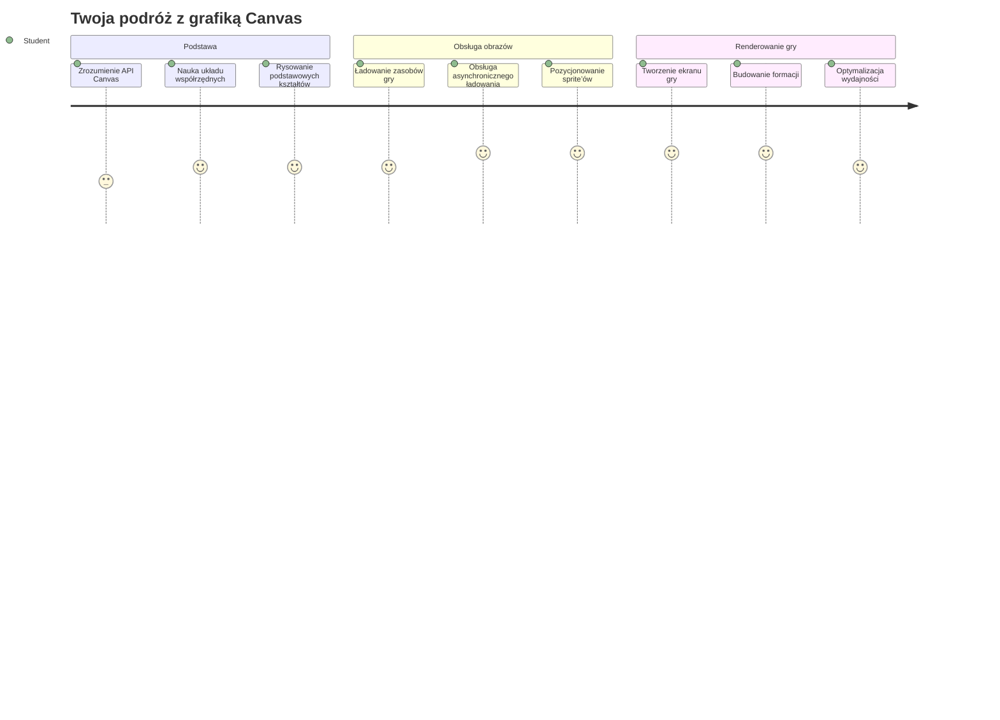
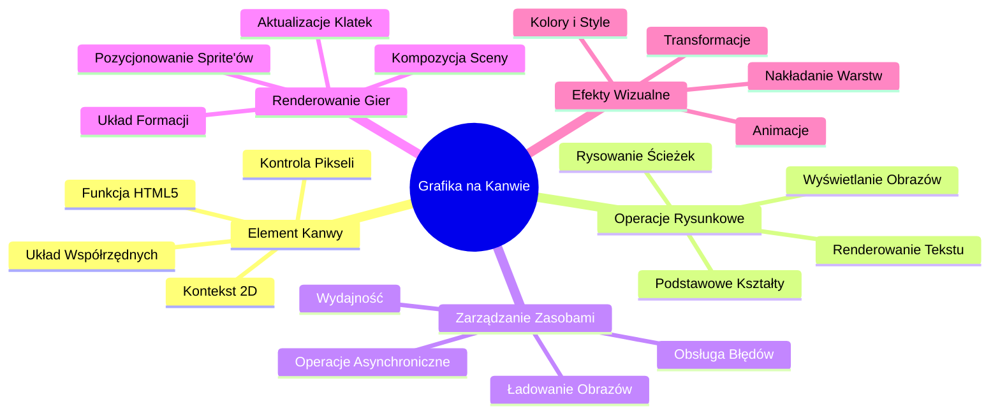
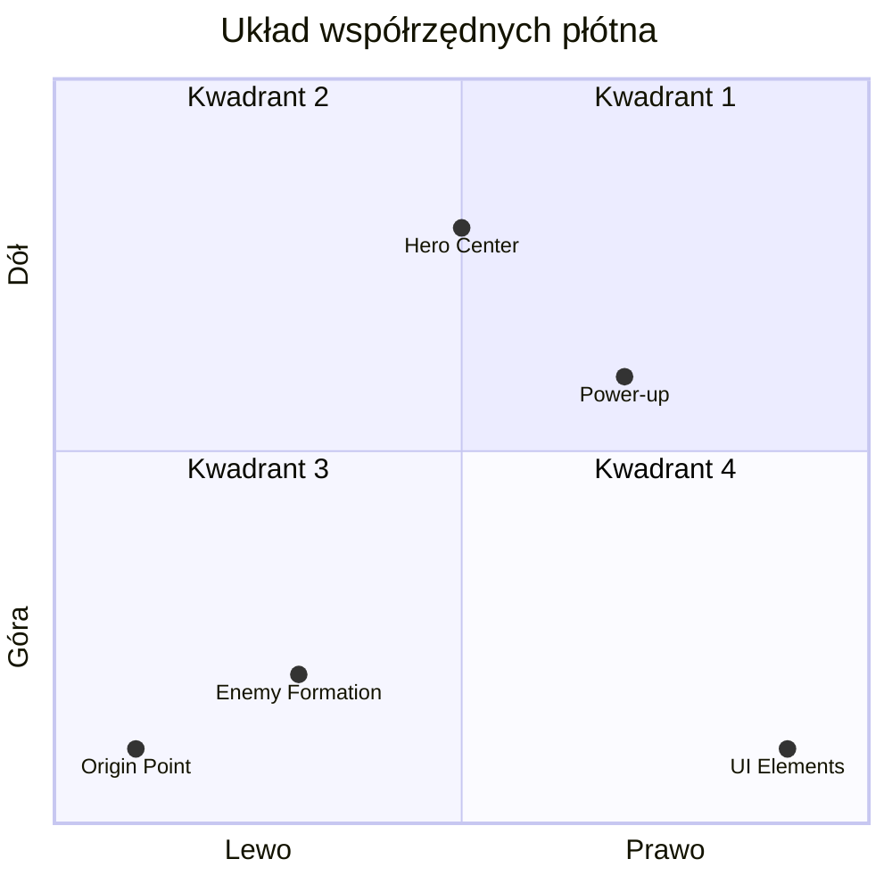
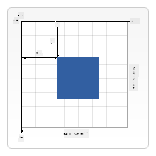
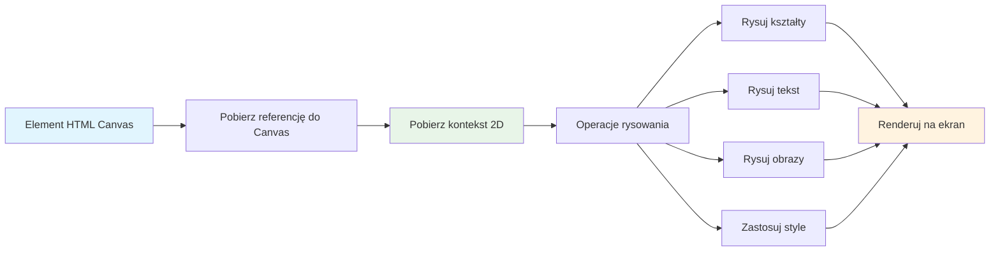
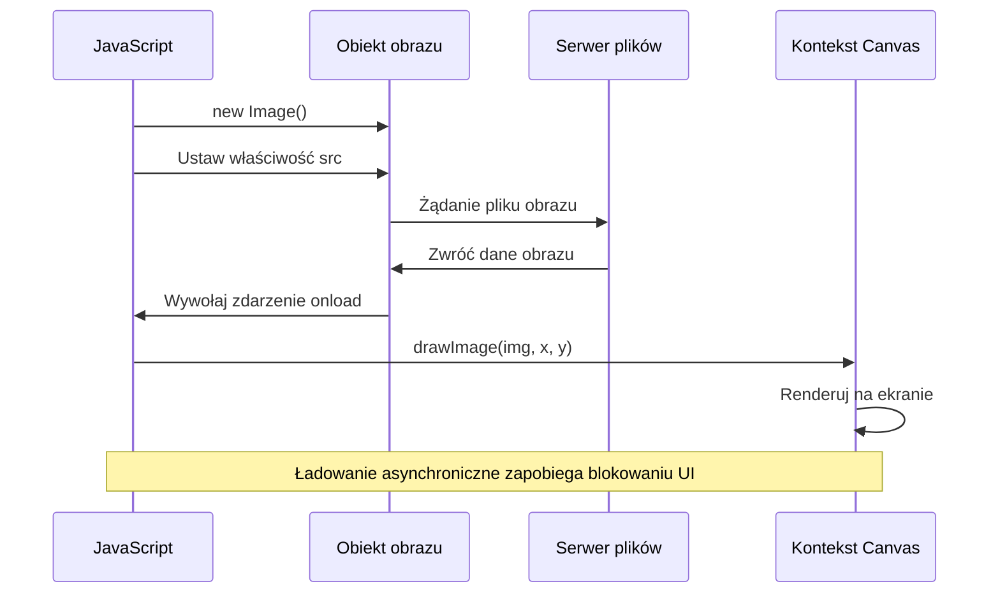
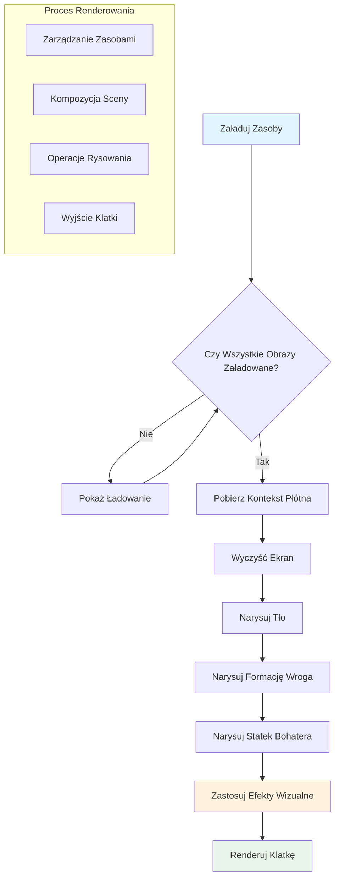
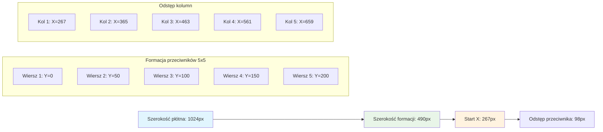
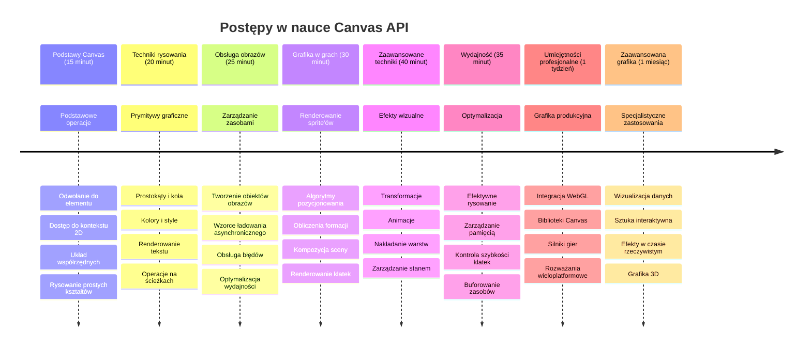

<!--
CO_OP_TRANSLATOR_METADATA:
{
  "original_hash": "7994743c5b21fdcceb36307916ef249a",
  "translation_date": "2026-01-06T19:09:48+00:00",
  "source_file": "6-space-game/2-drawing-to-canvas/README.md",
  "language_code": "pl"
}
-->
# Zbuduj grę kosmiczną część 2: Rysuj bohatera i potwory na płótnie


API Canvas to jedna z najpotężniejszych funkcji w tworzeniu stron internetowych, umożliwiająca tworzenie dynamicznej, interaktywnej grafiki bezpośrednio w przeglądarce. W tej lekcji przekształcimy pusty element HTML `<canvas>` w świat gry pełen bohaterów i potworów. Możesz myśleć o płótnie jako o cyfrowej tablicy, na której kod zamienia się w obraz.

Budujemy na tym, czego nauczyłeś się w poprzedniej lekcji, a teraz zagłębimy się w aspekty wizualne. Nauczysz się, jak ładować i wyświetlać sprite'y gry, precyzyjnie pozycjonować elementy oraz tworzyć wizualną podstawę swojej gry kosmicznej. To most łączący statyczne strony internetowe z dynamicznymi, interaktywnymi doświadczeniami.

Pod koniec tej lekcji będziesz mieć kompletną scenę gry z prawidłowo umieszczonym statkiem bohatera i formacjami wrogów gotowymi do walki. Zrozumiesz, jak nowoczesne gry renderują grafikę w przeglądarkach i zdobędziesz umiejętności tworzenia własnych interaktywnych wizualnych doświadczeń. Odkryjmy grafikę na płótnie i ożywmy Twoją grę kosmiczną!


## Quiz przed wykładem

[Quiz przed wykładem](https://ff-quizzes.netlify.app/web/quiz/31)

## Płótno (Canvas)

Czym właściwie jest ten element `<canvas>`? To rozwiązanie HTML5 do tworzenia dynamicznej grafiki i animacji w przeglądarkach internetowych. W przeciwieństwie do zwykłych obrazów czy filmów, które są statyczne, płótno daje kontrolę na poziomie pikseli nad wszystkim, co pojawia się na ekranie. To czyni go idealnym do gier, wizualizacji danych i interaktywnej sztuki. Możesz myśleć o nim jak o programowalnej powierzchni do rysowania, gdzie JavaScript staje się Twoim pędzlem.

Domyślnie element canvas wygląda jak puste, przezroczyste prostokąt na stronie. Ale właśnie w tym tkwi potencjał! Jego prawdziwa moc objawia się, gdy używasz JavaScriptu do rysowania kształtów, ładowania obrazów, tworzenia animacji i reagowania na interakcje użytkownika. To podobne do tego, jak pionierzy grafiki komputerowej z Bell Labs w latach 60. musieli programować każdy piksel, aby stworzyć pierwsze cyfrowe animacje.

✅ Przeczytaj [więcej o Canvas API](https://developer.mozilla.org/docs/Web/API/Canvas_API) na MDN.

Tak zazwyczaj deklaruje się go jako część ciała strony:

```html
<canvas id="myCanvas" width="200" height="100"></canvas>
```

**Co robi ten kod:**
- **Ustawia** atrybut `id`, abyś mógł odwołać się do tego konkretnego elementu canvas w JavaScript
- **Definiuje** `width` w pikselach, aby kontrolować szerokość canvas
- **Ustala** `height` w pikselach, aby określić pionowe wymiary canvas

## Rysowanie prostej geometrii

Teraz, gdy wiesz, czym jest element canvas, spójrzmy, jak na nim rysować! Canvas korzysta z układu współrzędnych, który może wydawać się znajomy z matematyki, ale jest jedna ważna różnica charakterystyczna dla grafiki komputerowej.

Canvas używa współrzędnych kartezjańskich z osią x (poziomą) i osią y (pionową) do pozycjonowania wszystkiego, co rysujesz. Ale oto kluczowa różnica: w odróżnieniu od matematycznego układu, punkt początkowy `(0,0)` zaczyna się w lewym górnym rogu, a wartości x rosną w prawo, natomiast wartości y rosną w dół. To podejście pochodzi z wczesnych wyświetlaczy komputerowych, gdzie wiązki elektronów skanowały od góry do dołu, czyniąc lewy górny róg naturalnym punktem startowym.



> Obraz z [MDN](https://developer.mozilla.org/docs/Web/API/Canvas_API/Tutorial/Drawing_shapes)

Aby rysować na elemencie canvas, wykonasz ten sam trzyetapowy proces, który jest podstawą całej grafiki na canvasie. Po kilku próbach stanie się to drugą naturą:


1. **Uzyskaj odniesienie** do elementu Canvas w DOM (tak jak do dowolnego innego elementu HTML)
2. **Pobierz kontekst renderowania 2D** – to daje dostęp do wszystkich metod rysowania
3. **Zacznij rysować!** Używaj wbudowanych metod kontekstu, by tworzyć grafikę

Tak wygląda to w kodzie:

```javascript
// Krok 1: Pobierz element canvas
const canvas = document.getElementById("myCanvas");

// Krok 2: Pobierz kontekst renderowania 2D
const ctx = canvas.getContext("2d");

// Krok 3: Ustaw kolor wypełnienia i narysuj prostokąt
ctx.fillStyle = 'red';
ctx.fillRect(0, 0, 200, 200); // x, y, szerokość, wysokość
```

**Rozbijmy to krok po kroku:**
- **Pobieramy** element canvas po jego ID i zapisujemy w zmiennej
- **Pobieramy** kontekst renderowania 2D – to nasz zestaw narzędzi pełen metod do rysowania
- **Mówimy** canvasowi, że chcemy wypełniać kolorem czerwonym, ustawiając `fillStyle`
- **Rysujemy** prostokąt zaczynając od lewego górnego rogu (0,0) o szerokości i wysokości 200 pikseli

✅ API Canvas koncentruje się głównie na kształtach 2D, ale możesz także rysować elementy 3D na stronie internetowej; do tego możesz używać [WebGL API](https://developer.mozilla.org/docs/Web/API/WebGL_API).

Możesz rysować różne rzeczy za pomocą Canvas API, takie jak:

- **Kształty geometryczne**, pokazaliśmy już jak narysować prostokąt, ale można narysować znacznie więcej.
- **Tekst**, możesz rysować tekst dowolną czcionką i kolorem.
- **Obrazy**, możesz wyświetlać obraz na podstawie pliku graficznego, np. .jpg lub .png.

✅ Spróbuj! Potrafisz narysować prostokąt - czy potrafisz narysować koło na stronie? Sprawdź niektóre ciekawe rysunki na Canvas w CodePen. Oto [szczególnie imponujący przykład](https://codepen.io/dissimulate/pen/KrAwx).

### 🔄 **Kontrola pedagogiczna**
**Zrozumienie podstaw Canvas**: Zanim przejdziesz do ładowania obrazów, upewnij się, że potrafisz:
- ✅ Wyjaśnić, jak układ współrzędnych canvas różni się od matematycznego
- ✅ Zrozumieć trzyetapowy proces rysowania na canvas
- ✅ Rozpoznać, co dostarcza kontekst renderowania 2D
- ✅ Opisać, jak działają właściwości fillStyle i fillRect

**Szybki test**: Jak narysujesz niebieskie koło na pozycji (100, 50) o promieniu 25?
```javascript
ctx.fillStyle = 'blue';
ctx.beginPath();
ctx.arc(100, 50, 25, 0, 2 * Math.PI);
ctx.fill();
```

**Metody rysowania na Canvas, które znasz:**
- **fillRect()**: Rysuje wypełnione prostokąty
- **fillStyle**: Ustawia kolory i wzory
- **beginPath()**: Rozpoczyna nową ścieżkę rysowania
- **arc()**: Tworzy koła i krzywe

## Ładowanie i rysowanie obrazu

Rysowanie podstawowych kształtów jest przydatne na start, ale większość gier potrzebuje prawdziwych obrazów! Sprite'y, tła i tekstury nadają grom wizualny urok. Ładowanie i wyświetlanie obrazów na canvasie działa inaczej niż rysowanie kształtów geometrycznych, ale to proste, gdy zrozumiesz proces.

Potrzebujemy utworzyć obiekt `Image`, załadować plik obrazu (dzieje się to asynchronicznie, czyli w tle) i narysować go na canvasie, gdy będzie gotowy. To zapewnia poprawne wyświetlanie obrazów, bez blokowania działania aplikacji podczas ładowania.


### Podstawowe ładowanie obrazu

```javascript
const img = new Image();
img.src = 'path/to/my/image.png';
img.onload = () => {
  // Obraz załadowany i gotowy do użycia
  console.log('Image loaded successfully!');
};
```

**Co się dzieje w tym kodzie:**
- **Tworzymy** nowy obiekt Image, by przechować nasz sprite lub teksturę
- **Mówimy** mu, jaki plik obrazu ma załadować, ustawiając źródło
- **Słuchamy** zdarzenia load, aby wiedzieć, kiedy obraz jest gotowy do użycia

### Lepszy sposób na ładowanie obrazów

Oto bardziej solidny sposób na obsługę ładowania obrazów, który stosują profesjonaliści. Opakujemy ładowanie obrazu w funkcję opartą na obietnicach (Promise) – podejście to, upowszechnione od ES6, sprawia, że kod jest bardziej uporządkowany i łatwo obsługuje błędy:

```javascript
function loadAsset(path) {
  return new Promise((resolve, reject) => {
    const img = new Image();
    img.src = path;
    img.onload = () => {
      resolve(img);
    };
    img.onerror = () => {
      reject(new Error(`Failed to load image: ${path}`));
    };
  });
}

// Nowoczesne użycie z async/await
async function initializeGame() {
  try {
    const heroImg = await loadAsset('hero.png');
    const monsterImg = await loadAsset('monster.png');
    // Obrazy są teraz gotowe do użycia
  } catch (error) {
    console.error('Failed to load game assets:', error);
  }
}
```

**Co tutaj zrobiliśmy:**
- **Opakowaliśmy** całą logikę ładowania w Promise, aby lepiej nią zarządzać
- **Dodaliśmy** obsługę błędów, która informuje nas, gdy coś pójdzie nie tak
- **Użyliśmy** nowoczesnej składni async/await, bo jest czytelniejsza
- **Dołączyliśmy** bloki try/catch, aby łagodnie obsłużyć ewentualne problemy

Gdy obrazy są załadowane, ich rysowanie na canvasie jest całkiem proste:

```javascript
async function renderGameScreen() {
  try {
    // Załaduj zasoby gry
    const heroImg = await loadAsset('hero.png');
    const monsterImg = await loadAsset('monster.png');

    // Pobierz płótno i kontekst
    const canvas = document.getElementById("myCanvas");
    const ctx = canvas.getContext("2d");

    // Narysuj obrazy w określonych pozycjach
    ctx.drawImage(heroImg, canvas.width / 2, canvas.height / 2);
    ctx.drawImage(monsterImg, 0, 0);
  } catch (error) {
    console.error('Failed to render game screen:', error);
  }
}
```

**Przejdźmy to krok po kroku:**
- **Ładujemy** obrazy bohatera i potworów w tle, używając await
- **Pobieramy** element canvas i kontekst renderowania 2D, który jest nam potrzebny
- **Pozycjonujemy** obraz bohatera dokładnie na środku, stosując szybkie obliczenia współrzędnych
- **Umieszczamy** obraz potwora w lewym górnym rogu, by zacząć formację wrogów
- **Przechwytujemy** ewentualne błędy podczas ładowania lub rysowania


## Czas zacząć budować Twoją grę

Teraz połączymy wszystko, by stworzyć wizualną podstawę twojej gry kosmicznej. Masz solidne podstawy Canvas i techniki ładowania obrazów, więc ta praktyczna część poprowadzi Cię do stworzenia kompletnego ekranu gry z prawidłowo umieszczonymi sprite'ami.

### Co zbudować

Zbudujesz stronę internetową z elementem Canvas. Powinna wyświetlać czarny ekran o rozmiarze `1024*768`. Udostępniliśmy Ci dwa obrazy:

- Statek bohatera

   

- 5×5 potworów

   

### Zalecane kroki rozpoczęcia pracy

Znajdź pliki startowe, które zostały dla Ciebie przygotowane w podfolderze `your-work`. Struktura Twojego projektu powinna zawierać:

```bash
your-work/
├── assets/
│   ├── enemyShip.png
│   └── player.png
├── index.html
├── app.js
└── package.json
```

**Oto z czym pracujesz:**
- **Sprite'y gry** znajdują się w folderze `assets/`, by zachować porządek
- **Twój główny plik HTML** ustawia element canvas i przygotowuje wszystko
- **Plik JavaScript** gdzie napiszesz całą magię renderowania gry
- **Plik package.json** który konfiguruje serwer deweloperski do testów lokalnych

Otwórz ten folder w Visual Studio Code, aby zacząć pracę. Potrzebujesz lokalnego środowiska deweloperskiego z Visual Studio Code, NPM i Node.js. Jeśli nie masz zainstalowanego `npm`, [oto jak to zrobić](https://www.npmjs.com/get-npm).

Uruchom serwer deweloperski, przechodząc do folderu `your-work`:

```bash
cd your-work
npm start
```

**Ten polecenie robi kilka fajnych rzeczy:**
- **Uruchamia** lokalny serwer pod adresem `http://localhost:5000`, żebyś mógł testować grę
- **Serwuje** wszystkie pliki poprawnie, żeby przeglądarka mogła je wczytać
- **Monitoruje** zmiany w plikach, byś mógł wygodnie rozwijać aplikację
- **Daje** profesjonalne środowisko do testowania wszystkiego

> 💡 **Uwaga**: Przeglądarka na początku pokaże pustą stronę – to normalne! Dodając kod, odświeżaj stronę, aby zobaczyć zmiany. Ten iteracyjny proces rozwoju jest podobny do tego, jak NASA budowała komputer pokładowy Apollo – testując każdy komponent przed integracją.

### Dodaj kod

Dodaj wymagany kod do `your-work/app.js`, by wykonać następujące zadania:

1. **Narysuj płótno z czarnym tłem**
   > 💡 **Jak to zrobić:** Znajdź TODO w `/app.js` i dodaj tylko dwie linie. Ustaw `ctx.fillStyle` na czarny, następnie użyj `ctx.fillRect()` zaczynając od (0,0) o rozmiarach twojego canvasu. Proste!

2. **Załaduj tekstury gry**
   > 💡 **Jak to zrobić:** Użyj `await loadAsset()` aby załadować obrazy gracza i wroga. Przechowuj je w zmiennych, by móc potem użyć. Pamiętaj – nie pojawią się, dopóki ich faktycznie nie narysujesz!

3. **Narysuj statek bohatera na środku u dołu**
   > 💡 **Jak to zrobić:** Użyj `ctx.drawImage()` aby pozycjonować bohatera. Dla współrzędnej x użyj `canvas.width / 2 - 45`, aby go wyśrodkować, a dla y `canvas.height - canvas.height / 4`, aby umieścić go w dolnej części.

4. **Narysuj formację 5×5 statków wroga**
   > 💡 **Jak to zrobić:** Znajdź funkcję `createEnemies` i ustaw pętlę zagnieżdżoną. Będziesz musiał wykonać obliczenia pozycji i odstępów między statkami, ale nie martw się – pokażę Ci dokładnie jak!

Najpierw ustal stałe, które pozwolą właściwie rozmieścić formację przeciwników:

```javascript
const ENEMY_TOTAL = 5;
const ENEMY_SPACING = 98;
const FORMATION_WIDTH = ENEMY_TOTAL * ENEMY_SPACING;
const START_X = (canvas.width - FORMATION_WIDTH) / 2;
const STOP_X = START_X + FORMATION_WIDTH;
```

**Co robią te stałe:**
- Ustawiamy 5 wrogów na wiersz i kolumnę (ładna siatka 5×5)
- Definiujemy odstępy między wrogami, aby nie była ściśnięta
- Obliczamy, jak szeroka będzie cała formacja
- Ustalamy, gdzie zacząć i skończyć, by formacja wyglądała na wyśrodkowaną


Następnie utwórz pętle zagnieżdżone do rysowania formacji wrogów:

```javascript
for (let x = START_X; x < STOP_X; x += ENEMY_SPACING) {
  for (let y = 0; y < 50 * 5; y += 50) {
    ctx.drawImage(enemyImg, x, y);
  }
}
```

**Co robi ta zagnieżdżona pętla:**
- Pętla zewnętrzna przechodzi z lewej do prawej po formacji
- Pętla wewnętrzna przechodzi z góry na dół, tworząc równe rzędy
- Rysujemy każdy sprite wroga w dokładnie obliczonych współrzędnych x,y
- Wszystko jest równomiernie rozłożone tak, by wyglądało profesjonalnie i schludnie

### 🔄 **Kontrola pedagogiczna**
**Mistrzostwo w renderowaniu gry**: Sprawdź swoją wiedzę o systemie renderowania:
- ✅ Jak asynchroniczne ładowanie obrazów zapobiega blokowaniu interfejsu podczas uruchamiania gry?
- ✅ Dlaczego pozycje formacji wrogów obliczamy za pomocą stałych, a nie hardcodujemy?
- ✅ Jaką rolę pełni kontekst renderujący 2D przy rysowaniu?
- ✅ Jak pętle zagnieżdżone tworzą zorganizowane formacje sprite'ów?

**Ważne kwestie wydajnościowe**: Twoja gra teraz demonstruje:
- **Wydajne ładowanie zasobów**: zarządzanie obrazami oparte na Promise
- **Zorganizowane renderowanie**: uporządkowane operacje rysowania
- **Matematyczne pozycjonowanie**: obliczona lokalizacja sprite'ów
- **Obsługę błędów**: łagodne reagowanie na problemy

**Pojęcia programowania wizualnego**: Nauczyłeś się:
- **Układy współrzędnych**: Tłumaczenie matematyki na pozycje na ekranie
- **Zarządzanie sprite’ami**: Ładowanie i wyświetlanie grafiki gry
- **Algorytmy formacji**: Matematyczne wzory dla uporządkowanych układów
- **Operacje asynchroniczne**: Nowoczesny JavaScript dla płynnego doświadczenia użytkownika

## Wynik

Gotowy efekt powinien wyglądać tak:


## Rozwiązanie

Spróbuj najpierw rozwiązać to samodzielnie, ale jeśli utkniesz, spójrz na [rozwiązanie](../../../../6-space-game/2-drawing-to-canvas/solution/app.js)

---

## Wyzwanie GitHub Copilot Agent 🚀

Użyj trybu Agenta, aby ukończyć następujące wyzwanie:

**Opis:** Ulepsz swoją planszę gry kosmicznej, dodając efekty wizualne i elementy interaktywne wykorzystujące poznane techniki API Canvas.

**Polecenie:** Stwórz nowy plik o nazwie `enhanced-canvas.html` z planszą (canvas), która wyświetla animowane gwiazdy w tle, pulsujący pasek zdrowia dla statku bohatera oraz statki wrogów powoli przesuwające się w dół. Dołącz kod JavaScript, który rysuje migoczące gwiazdy używając losowych pozycji i przezroczystości, implementuje pasek zdrowia zmieniający kolor zależnie od poziomu zdrowia (zielony > żółty > czerwony) oraz animuje statki wrogów przesuwające się po ekranie z różnymi prędkościami.

Dowiedz się więcej o [trybie agenta](https://code.visualstudio.com/blogs/2025/02/24/introducing-copilot-agent-mode).

## 🚀 Wyzwanie

Poznałeś rysowanie z użyciem 2D API Canvas; zerknij na [WebGL API](https://developer.mozilla.org/docs/Web/API/WebGL_API) i spróbuj narysować obiekt 3D.

## Quiz po wykładzie

[Quiz po wykładzie](https://ff-quizzes.netlify.app/web/quiz/32)

## Powtórka i samodzielna nauka

Dowiedz się więcej o API Canvas, [czytając o nim](https://developer.mozilla.org/docs/Web/API/Canvas_API).

### ⚡ **Co możesz zrobić w najbliższe 5 minut**
- [ ] Otwórz konsolę przeglądarki i stwórz element canvas przez `document.createElement('canvas')`
- [ ] Spróbuj narysować prostokąt metodą `fillRect()` na kontekście canvas
- [ ] Eksperymentuj z różnymi kolorami przez właściwość `fillStyle`
- [ ] Narysuj prosty okrąg używając metody `arc()`

### 🎯 **Co możesz osiągnąć w ciągu godziny**
- [ ] Ukończ quiz po lekcji i zrozum podstawy canvas
- [ ] Stwórz aplikację do rysowania na canvas z wieloma kształtami i kolorami
- [ ] Zaimplementuj ładowanie obrazów i renderowanie sprite’ów w swojej grze
- [ ] Zbuduj prostą animację przesuwającą obiekty po canvas
- [ ] Ćwicz transformacje canvas takie jak skalowanie, obrót i translacje

### 📅 **Twój tygodniowy plan nauki Canvas**
- [ ] Ukończ grę kosmiczną z dopracowaną grafiką i animacjami sprite’ów
- [ ] Opanuj zaawansowane techniki canvas takie jak gradienty, wzory i kompozycje
- [ ] Twórz interaktywne wizualizacje danych za pomocą canvas
- [ ] Naucz się optymalizacji canvas dla płynnej wydajności
- [ ] Zbuduj aplikację do rysowania lub malowania z różnymi narzędziami
- [ ] Eksploruj wzory kreatywnego kodowania i generatywnej sztuki za pomocą canvas

### 🌟 **Twój miesięczny plan mistrzostwa grafiki**
- [ ] Twórz złożone aplikacje wizualne używając Canvas 2D i WebGL
- [ ] Poznaj koncepcje programowania grafiki i podstawy shaderów
- [ ] Współtwórz otwartoźródłowe biblioteki do grafiki i narzędzia wizualizacyjne
- [ ] Opanuj optymalizację wydajności dla aplikacji wymagających grafiki
- [ ] Twórz treści edukacyjne o programowaniu canvas i grafice komputerowej
- [ ] Zostań ekspertem programowania grafiki, który pomaga innym tworzyć doświadczenia wizualne

## 🎯 Twój harmonogram opanowania grafiki Canvas


### 🛠️ Podsumowanie Twojego zestawu narzędzi Canvas Graphics

Po ukończeniu tej lekcji masz:
- **Opanowanie API Canvas**: Pełne zrozumienie programowania grafiki 2D
- **Matematyka współrzędnych**: Precyzyjne pozycjonowanie i algorytmy układu
- **Zarządzanie zasobami**: Profesjonalne ładowanie obrazów i obsługa błędów
- **Pipeline renderowania**: Strukturalne podejście do kompozycji sceny
- **Grafika gry**: Pozycjonowanie sprite’ów i obliczenia formacji
- **Programowanie asynchroniczne**: Nowoczesne wzorce JavaScript dla płynnej wydajności
- **Programowanie wizualne**: Tłumaczenie matematycznych koncepcji na grafikę ekranową

**Zastosowania w praktyce**: Twoje umiejętności Canvas stosują się bezpośrednio do:
- **Wizualizacji danych**: Wykresy, tabelki i interaktywne pulpity
- **Tworzenia gier**: Gry 2D, symulacje i interaktywne doświadczenia
- **Sztuki cyfrowej**: Kreatywne kodowanie i projekty generatywne
- **Projektowania UI/UX**: Niestandardowa grafika i elementy interaktywne
- **Oprogramowania edukacyjnego**: Narzędzia wizualnego uczenia i symulacje
- **Aplikacji webowych**: Dynamiczna grafika i wizualizacje w czasie rzeczywistym

**Zdobyte umiejętności zawodowe**: Teraz potrafisz:
- **Budować** niestandardowe rozwiązania graficzne bez zewnętrznych bibliotek
- **Optymalizować** wydajność renderowania dla płynnych doświadczeń użytkownika
- **Debugować** złożone problemy wizualne za pomocą narzędzi developerskich przeglądarki
- **Projektować** skalowalne systemy graficzne na bazie zasad matematycznych
- **Integracja** grafiki Canvas z nowoczesnymi frameworkami webowymi

**Metody Canvas API, które opanowałeś**:
- **Zarządzanie elementami**: getElementById, getContext
- **Operacje rysowania**: fillRect, drawImage, fillStyle
- **Ładowanie zasobów**: Obiekty Image, wzorce Promise
- **Pozycjonowanie matematyczne**: Obliczenia współrzędnych, algorytmy formacji

**Następny poziom:** Jesteś gotowy, by dodać animacje, interakcję użytkownika, wykrywanie kolizji lub zgłębić WebGL dla grafiki 3D!

🌟 **Osiągnięcie odblokowane:** Zbudowałeś kompletny system renderowania gry używając podstawowych technik Canvas API!

## Zadanie

[Poznaj API Canvas](assignment.md)

---

<!-- CO-OP TRANSLATOR DISCLAIMER START -->
**Zastrzeżenie**:
Niniejszy dokument został przetłumaczony za pomocą usługi tłumaczenia AI [Co-op Translator](https://github.com/Azure/co-op-translator). Chociaż dążymy do dokładności, prosimy pamiętać, że tłumaczenia automatyczne mogą zawierać błędy lub niedokładności. Oryginalny dokument w języku źródłowym powinien być uznawany za źródło autorytatywne. W przypadku informacji krytycznych zalecane jest skorzystanie z profesjonalnego tłumaczenia wykonanego przez człowieka. Nie ponosimy odpowiedzialności za jakiekolwiek nieporozumienia lub błędne interpretacje wynikające z korzystania z tego tłumaczenia.
<!-- CO-OP TRANSLATOR DISCLAIMER END -->