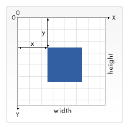

<!--
CO_OP_TRANSLATOR_METADATA:
{
  "original_hash": "056641280211e52fd0adb81b6058ec55",
  "translation_date": "2025-08-29T16:31:16+00:00",
  "source_file": "6-space-game/2-drawing-to-canvas/README.md",
  "language_code": "pl"
}
-->
# Stwórz grę kosmiczną, część 2: Rysowanie bohatera i potworów na Canvasie

## Quiz przed wykładem

[Quiz przed wykładem](https://ff-quizzes.netlify.app/web/quiz/31)

## Canvas

Canvas to element HTML, który domyślnie nie ma żadnej zawartości; to pusta przestrzeń. Musisz dodać do niego zawartość, rysując na nim.

✅ Przeczytaj [więcej o Canvas API](https://developer.mozilla.org/docs/Web/API/Canvas_API) na MDN.

Oto jak zazwyczaj jest deklarowany, jako część ciała strony:

```html
<canvas id="myCanvas" width="200" height="100"></canvas>
```

Powyżej ustawiamy `id`, `width` i `height`.

- `id`: ustaw to, aby móc uzyskać referencję, gdy będziesz potrzebować interakcji z elementem.
- `width`: szerokość elementu.
- `height`: wysokość elementu.

## Rysowanie prostych kształtów

Canvas używa kartezjańskiego układu współrzędnych do rysowania. Oznacza to, że korzysta z osi x i y, aby określić, gdzie coś się znajduje. Pozycja `0,0` to lewy górny róg, a prawy dolny róg to wartości WIDTH i HEIGHT ustawione dla canvasa.

  
> Obraz z [MDN](https://developer.mozilla.org/docs/Web/API/Canvas_API/Tutorial/Drawing_shapes)

Aby rysować na elemencie canvas, musisz wykonać następujące kroki:

1. **Uzyskaj referencję** do elementu Canvas.
2. **Uzyskaj referencję** do elementu Context, który znajduje się na canvasie.
3. **Wykonaj operację rysowania** za pomocą elementu Context.

Kod dla powyższych kroków zazwyczaj wygląda tak:

```javascript
// draws a red rectangle
//1. get the canvas reference
canvas = document.getElementById("myCanvas");

//2. set the context to 2D to draw basic shapes
ctx = canvas.getContext("2d");

//3. fill it with the color red
ctx.fillStyle = 'red';

//4. and draw a rectangle with these parameters, setting location and size
ctx.fillRect(0,0, 200, 200) // x,y,width, height
```

✅ Canvas API skupia się głównie na kształtach 2D, ale możesz również rysować elementy 3D na stronie internetowej; do tego możesz użyć [WebGL API](https://developer.mozilla.org/docs/Web/API/WebGL_API).

Za pomocą Canvas API możesz rysować różne rzeczy, takie jak:

- **Kształty geometryczne** – już pokazaliśmy, jak narysować prostokąt, ale można rysować znacznie więcej.
- **Tekst** – możesz rysować tekst w dowolnej czcionce i kolorze.
- **Obrazy** – możesz rysować obrazy na podstawie zasobów graficznych, takich jak .jpg czy .png.

✅ Spróbuj! Wiesz już, jak narysować prostokąt, czy potrafisz narysować koło na stronie? Zobacz kilka ciekawych rysunków na Canvasie na CodePen. Oto [szczególnie imponujący przykład](https://codepen.io/dissimulate/pen/KrAwx).

## Wczytywanie i rysowanie zasobu graficznego

Aby wczytać zasób graficzny, tworzysz obiekt `Image` i ustawiasz jego właściwość `src`. Następnie nasłuchujesz zdarzenia `load`, aby wiedzieć, kiedy jest gotowy do użycia. Kod wygląda tak:

### Wczytywanie zasobu

```javascript
const img = new Image();
img.src = 'path/to/my/image.png';
img.onload = () => {
  // image loaded and ready to be used
}
```

### Wzorzec wczytywania zasobu

Zaleca się opakowanie powyższego w konstrukcję, jak poniżej, aby było łatwiejsze w użyciu i aby manipulować nim dopiero, gdy będzie w pełni załadowany:

```javascript
function loadAsset(path) {
  return new Promise((resolve) => {
    const img = new Image();
    img.src = path;
    img.onload = () => {
      // image loaded and ready to be used
      resolve(img);
    }
  })
}

// use like so

async function run() {
  const heroImg = await loadAsset('hero.png')
  const monsterImg = await loadAsset('monster.png')
}

```

Aby narysować zasoby gry na ekranie, twój kod wyglądałby tak:

```javascript
async function run() {
  const heroImg = await loadAsset('hero.png')
  const monsterImg = await loadAsset('monster.png')

  canvas = document.getElementById("myCanvas");
  ctx = canvas.getContext("2d");
  ctx.drawImage(heroImg, canvas.width/2,canvas.height/2);
  ctx.drawImage(monsterImg, 0,0);
}
```

## Czas zacząć budować swoją grę

### Co zbudować

Zbudujesz stronę internetową z elementem Canvas. Powinna renderować czarny ekran o wymiarach `1024*768`. Udostępniliśmy ci dwa obrazy:

- Statek bohatera

   

- 5*5 potworów

   

### Zalecane kroki na początek

Znajdź pliki, które zostały dla ciebie utworzone w podfolderze `your-work`. Powinny zawierać następujące:

```bash
-| assets
  -| enemyShip.png
  -| player.png
-| index.html
-| app.js
-| package.json
```

Otwórz kopię tego folderu w Visual Studio Code. Musisz mieć skonfigurowane lokalne środowisko programistyczne, najlepiej z Visual Studio Code z zainstalowanymi NPM i Node. Jeśli nie masz skonfigurowanego `npm` na swoim komputerze, [oto jak to zrobić](https://www.npmjs.com/get-npm).

Rozpocznij projekt, przechodząc do folderu `your_work`:

```bash
cd your-work
npm start
```

Powyższe uruchomi serwer HTTP pod adresem `http://localhost:5000`. Otwórz przeglądarkę i wpisz ten adres. Na razie to pusta strona, ale to się zmieni.

> Uwaga: aby zobaczyć zmiany na ekranie, odśwież przeglądarkę.

### Dodaj kod

Dodaj potrzebny kod do `your-work/app.js`, aby rozwiązać poniższe:

1. **Narysuj** canvas z czarnym tłem  
   > wskazówka: dodaj dwie linie pod odpowiednim TODO w `/app.js`, ustawiając element `ctx` na czarny, a współrzędne górne/lewe na 0,0 oraz wysokość i szerokość równą wymiarom canvasa.
2. **Załaduj** tekstury  
   > wskazówka: dodaj obrazy gracza i wroga, używając `await loadTexture` i przekazując ścieżkę do obrazu. Na razie nie zobaczysz ich na ekranie!
3. **Narysuj** bohatera na środku ekranu w dolnej połowie  
   > wskazówka: użyj API `drawImage`, aby narysować heroImg na ekranie, ustawiając `canvas.width / 2 - 45` i `canvas.height - canvas.height / 4)`.
4. **Narysuj** 5*5 potworów  
   > wskazówka: teraz możesz odkomentować kod, aby narysować wrogów na ekranie. Następnie przejdź do funkcji `createEnemies` i ją rozbuduj.

   Najpierw ustaw kilka stałych:

    ```javascript
    const MONSTER_TOTAL = 5;
    const MONSTER_WIDTH = MONSTER_TOTAL * 98;
    const START_X = (canvas.width - MONSTER_WIDTH) / 2;
    const STOP_X = START_X + MONSTER_WIDTH;
    ```

   Następnie utwórz pętlę, aby narysować tablicę potworów na ekranie:

    ```javascript
    for (let x = START_X; x < STOP_X; x += 98) {
        for (let y = 0; y < 50 * 5; y += 50) {
          ctx.drawImage(enemyImg, x, y);
        }
      }
    ```

## Wynik

Gotowy wynik powinien wyglądać tak:


## Rozwiązanie

Spróbuj najpierw rozwiązać to samodzielnie, ale jeśli utkniesz, spójrz na [rozwiązanie](../../../../6-space-game/2-drawing-to-canvas/solution/app.js).

---

## 🚀 Wyzwanie

Nauczyłeś się rysować za pomocą Canvas API skoncentrowanego na 2D; zapoznaj się z [WebGL API](https://developer.mozilla.org/docs/Web/API/WebGL_API) i spróbuj narysować obiekt 3D.

## Quiz po wykładzie

[Quiz po wykładzie](https://ff-quizzes.netlify.app/web/quiz/32)

## Przegląd i samodzielna nauka

Dowiedz się więcej o Canvas API, [czytając o nim](https://developer.mozilla.org/docs/Web/API/Canvas_API).

## Zadanie

[Pobaw się Canvas API](assignment.md)

---

**Zastrzeżenie**:  
Ten dokument został przetłumaczony za pomocą usługi tłumaczenia AI [Co-op Translator](https://github.com/Azure/co-op-translator). Chociaż dokładamy wszelkich starań, aby zapewnić poprawność tłumaczenia, prosimy pamiętać, że automatyczne tłumaczenia mogą zawierać błędy lub nieścisłości. Oryginalny dokument w jego rodzimym języku powinien być uznawany za źródło autorytatywne. W przypadku informacji o kluczowym znaczeniu zaleca się skorzystanie z profesjonalnego tłumaczenia przez człowieka. Nie ponosimy odpowiedzialności za jakiekolwiek nieporozumienia lub błędne interpretacje wynikające z użycia tego tłumaczenia.