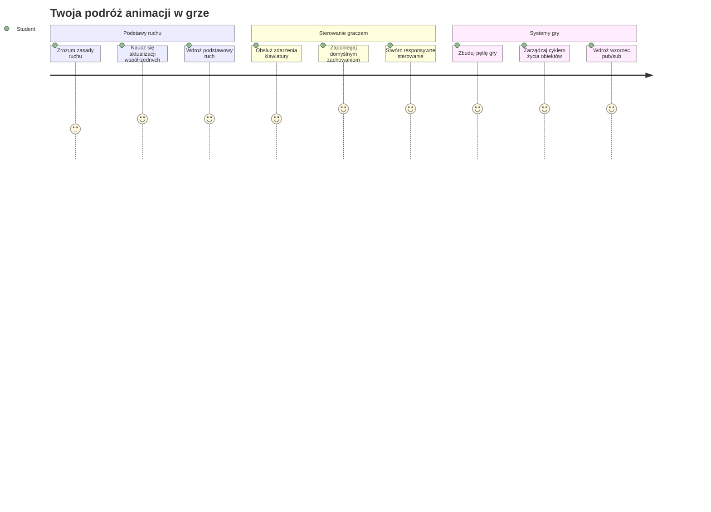
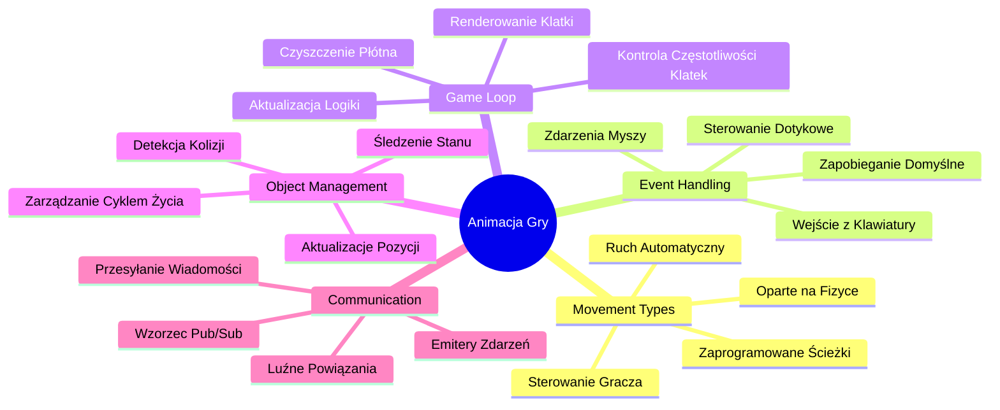
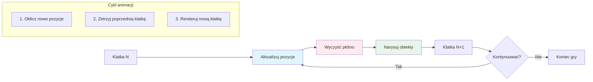
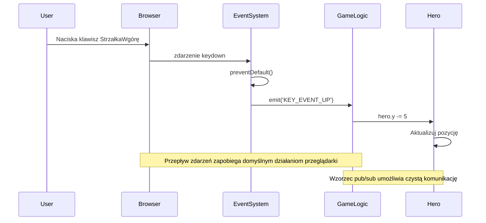
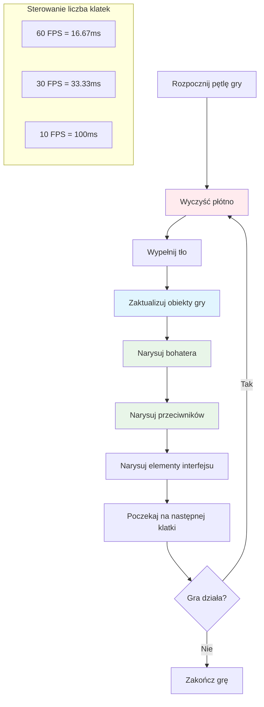
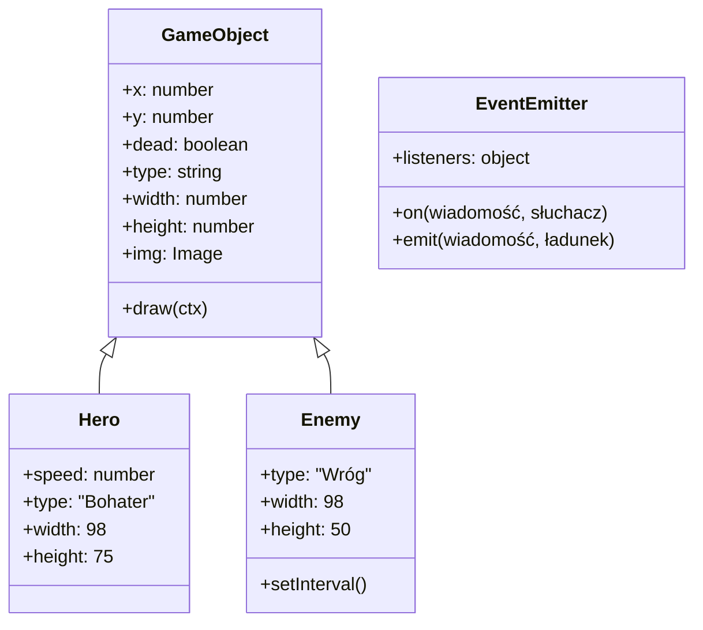
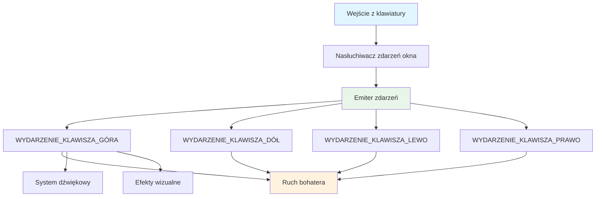
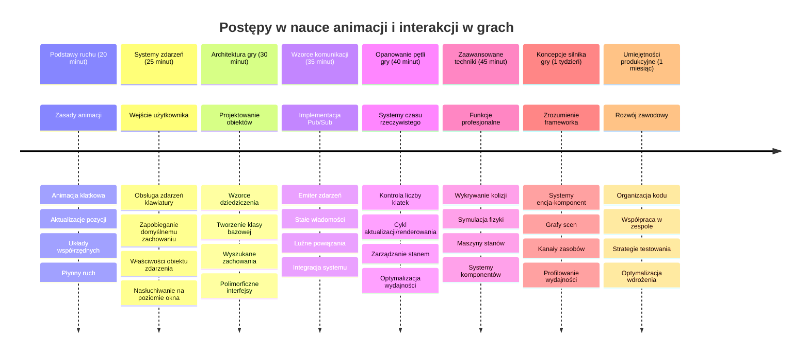

<!--
CO_OP_TRANSLATOR_METADATA:
{
  "original_hash": "8c55a2bd4bc0ebe4c88198fd563a9e09",
  "translation_date": "2026-01-06T19:19:19+00:00",
  "source_file": "6-space-game/3-moving-elements-around/README.md",
  "language_code": "pl"
}
-->
# Tworzenie gry kosmicznej Część 3: Dodawanie ruchu


Pomyśl o swoich ulubionych grach – to, co czyni je fascynującymi, to nie tylko ładna grafika, ale sposób, w jaki wszystko się porusza i reaguje na twoje działania. Obecnie twoja gra kosmiczna przypomina piękny obraz, ale zaraz dodamy ruch, który ożywi ją.

Gdy inżynierowie NASA programowali komputer nawigacyjny dla misji Apollo, stali przed podobnym wyzwaniem: jak sprawić, by statek kosmiczny reagował na polecenia pilota, jednocześnie automatycznie utrzymując poprawki kursu? Zasady, których się dziś nauczymy, odzwierciedlają właśnie te koncepcje – zarządzanie ruchem kontrolowanym przez gracza oraz automatycznymi zachowaniami systemu.

W tej lekcji nauczysz się, jak sprawić, by statki kosmiczne sunęły po ekranie, reagowały na polecenia gracza i tworzyły płynne wzorce ruchu. Wszystko rozłożymy na przystępne koncepcje, które naturalnie ze sobą współgrają.

Na koniec gracze będą pilotować swój statek bohatera po ekranie, podczas gdy statki wroga będą patrolować niebo. Co ważniejsze, zrozumiesz podstawowe zasady napędzające systemy ruchu w grach.


## Quiz przed wykładem

[Quiz przed wykładem](https://ff-quizzes.netlify.app/web/quiz/33)

## Zrozumienie ruchu w grach

Gry ożywają, gdy coś zaczyna się poruszać, a zasadniczo dzieje się to na dwa sposoby:

- **Ruch kontrolowany przez gracza**: Gdy naciskasz klawisz lub klikasz myszą, coś się porusza. To bezpośrednie powiązanie między tobą a światem gry.
- **Ruch automatyczny**: Gdy gra sama decyduje o ruchu – na przykład statki wroga, które muszą patrolować ekran, niezależnie od tego, co robisz.

Poruszanie obiektów na ekranie komputera jest prostsze, niż myślisz. Pamiętasz te współrzędne x i y z lekcji matematyki? To właśnie nimi się tu posługujemy. Gdy Galileo obserwował księżyce Jowisza w 1610 roku, robił zasadniczo to samo – śledził pozycje w czasie, by zrozumieć wzory ruchu.

Poruszanie czegoś na ekranie jest jak tworzenie animacji flipbook – trzeba wykonać te trzy proste kroki:


1. **Zaktualizuj pozycję** – Zmień miejsce, w którym powinien się znaleźć obiekt (np. przesuń go o 5 pikseli w prawo)
2. **Usuń stary obraz** – Wyczyść ekran, aby nie było widoczne "duchowe" ślady
3. **Narysuj nową klatkę** – Umieść obiekt w nowym miejscu

Robiąc to wystarczająco szybko, masz płynny ruch, który graczom wydaje się naturalny.

Oto jak może to wyglądać w kodzie:

```javascript
// Ustaw lokalizację bohatera
hero.x += 5;
// Wyczyść prostokąt, który gości bohatera
ctx.clearRect(0, 0, canvas.width, canvas.height);
// Prerysuj tło gry i bohatera
ctx.fillRect(0, 0, canvas.width, canvas.height);
ctx.fillStyle = "black";
ctx.drawImage(heroImg, hero.x, hero.y);
```

**To, co robi ten kod:**
- **Aktualizuje** współrzędną x bohatera o 5 pikseli, aby przesunąć go w poziomie
- **Czyści** cały obszar canvas, usuwając poprzednią klatkę
- **Wypełnia** canvas czarnym kolorem tła
- **Rysuje ponownie** obraz bohatera na jego nowej pozycji

✅ Potrafisz wskazać powód, dla którego rysowanie bohatera wielu klatek na sekundę może obciążać wydajność? Przeczytaj o [alternatywach dla tego wzorca](https://developer.mozilla.org/en-US/docs/Web/API/Canvas_API/Tutorial/Optimizing_canvas).

## Obsługa zdarzeń klawiatury

To miejsce, gdzie łączymy wejście gracza z akcją w grze. Gdy ktoś naciśnie spację, by wystrzelić laser, lub dotknie klawisza strzałki, by uniknąć asteroidy, twoja gra musi wykryć i zareagować na te dane wejściowe.

Zdarzenia klawiatury zachodzą na poziomie okna, co oznacza, że całe twoje okno przeglądarki nasłuchuje na naciśnięcia klawiszy. Kliknięcia myszą natomiast mogą być powiązane z konkretnymi elementami (np. kliknięcie przycisku). W naszej grze kosmicznej skupimy się na sterowaniu klawiaturą, ponieważ to one dają graczom klasyczne arcade'owe wrażenie.

Przypomina mi to, jak operatorzy telegrafu w XIX wieku musieli tłumaczyć kod Morse’a na zrozumiałe wiadomości – robimy podobnie, tłumacząc naciśnięcia klawiszy na polecenia gry.

Aby obsłużyć zdarzenie, należy użyć metody `addEventListener()` okna i podać jej dwa parametry. Pierwszy to nazwa zdarzenia, np. `keyup`. Drugi to funkcja, która zostanie wywołana po zajściu zdarzenia.

Oto przykład:

```javascript
window.addEventListener('keyup', (evt) => {
  // evt.key = reprezentacja klawisza w postaci łańcucha znaków
  if (evt.key === 'ArrowUp') {
    // zrób coś
  }
});
```

**Analiza tego, co się tutaj dzieje:**
- **Nasłuchuje** zdarzeń klawiatury na całym oknie
- **Przechwytuje** obiekt zdarzenia, który zawiera informacje, jaki klawisz został naciśnięty
- **Sprawdza**, czy naciśnięty klawisz to konkretny (tu strzałka w górę)
- **Wykonuje** kod, jeśli warunek jest spełniony

Do zdarzeń klawiaturowych można użyć dwóch właściwości obiektu event, by zobaczyć, który klawisz został naciśnięty:

- `key` – to jest reprezentacja tekstowa klawisza, np. `'ArrowUp'`
- `keyCode` – to jest liczba, np. `37`, odpowiadająca `ArrowLeft`

✅ Manipulacja zdarzeniami klawiatury jest przydatna także poza tworzeniem gier. Jakie inne zastosowania przychodzą ci do głowy dla tej techniki?


### Specjalne klawisze: uwaga!

Niektóre klawisze mają wbudowane zachowania przeglądarki, które mogą przeszkadzać w grze. Strzałki przewijają stronę, a spacja przesuwa ją w dół – tego nie chcemy, gdy ktoś steruje statkiem kosmicznym.

Możemy zapobiec tym domyślnym zachowaniom i pozwolić naszej grze obsłużyć wejście. To podobne do tego, jak pierwsi programiści musieli nadpisać przerwania systemowe, by tworzyć własne zachowania – tutaj robimy to na poziomie przeglądarki. Oto jak:

```javascript
const onKeyDown = function (e) {
  console.log(e.keyCode);
  switch (e.keyCode) {
    case 37:
    case 39:
    case 38:
    case 40: // Klawisze strzałek
    case 32:
      e.preventDefault();
      break; // Spacja
    default:
      break; // nie blokuj innych klawiszy
  }
};

window.addEventListener('keydown', onKeyDown);
```

**Zrozumienie tego kodu zapobiegającego:**
- **Sprawdza** konkretne kody klawiszy, które mogą wywołać niechciane zachowania przeglądarki
- **Zatrzymuje** domyślną akcję przeglądarki dla klawiszy strzałek i spacji
- **Pozwala** innym klawiszom działać normalnie
- **Używa** `e.preventDefault()` aby zatrzymać wbudowane zachowanie przeglądarki

### 🔄 **Pedagogiczne podsumowanie**
**Zrozumienie obsługi zdarzeń**: Zanim przejdziemy do ruchu automatycznego, upewnij się, że potrafisz:
- ✅ Wyjaśnić różnicę między zdarzeniami `keydown` i `keyup`
- ✅ Zrozumieć, dlaczego zapobiegamy domyślnym zachowaniom przeglądarki
- ✅ Opisać jak event listenery łączą wejścia użytkownika z logiką gry
- ✅ Wskazać, które klawisze mogą przeszkadzać w sterowaniu grą

**Szybki test**: Co by się stało, gdybyś nie zapobiegł domyślnemu zachowaniu klawiszy strzałek?
*Odpowiedź: Przeglądarka przewijałaby stronę, przeszkadzając w ruchu gry*

**Architektura systemu zdarzeń**: Teraz rozumiesz:
- **Nasłuchiwanie na poziomie okna**: przechwytywanie zdarzeń w przeglądarce
- **Właściwości obiektu zdarzenia**: łańcuchy `key` vs liczby `keyCode`
- **Zapobieganie domyślnemu zachowaniu**: zatrzymywanie niepożądanych działań przeglądarki
- **Logika warunkowa**: reagowanie na konkretne kombinacje klawiszy

## Ruch sterowany przez grę

Porozmawiajmy teraz o obiektach, które poruszają się bez wejścia od gracza. Pomyśl o statkach wroga przemierzających ekran, pociskach lecących po liniach prostych lub chmurach unoszących się w tle. Ten autonomiczny ruch sprawia, że świat twojej gry jest żywy, nawet gdy nikt nie steruje.

Używamy wbudowanych timerów JavaScript do aktualizacji pozycji w regularnych odstępach czasu. Ta koncepcja przypomina działanie zegarów wahadłowych – mechanizm wyzwalający spójne, ustalone działania w określonych odstępach. Oto jak prosto to może działać:

```javascript
const id = setInterval(() => {
  // Przesuń wroga na osi y
  enemy.y += 10;
}, 100);
```

**To, co robi ten kod ruchu:**
- **Tworzy** timer, który działa co 100 milisekund
- **Aktualizuje** współrzędną y wroga o 10 pikseli za każdym razem
- **Przechowuje** ID interwału, aby można go było zatrzymać w razie potrzeby
- **Przesuwa** wroga automatycznie w dół na ekranie

## Pętla gry

Oto koncepcja łącząca wszystko razem – pętla gry. Gdyby twoja gra była filmem, pętla gry byłaby projektorem, pokazującym klatkę za klatką na tyle szybko, że wszystko wygląda na płynny ruch.

Każda gra ma taką pętlę działającą w tle. To funkcja, która aktualizuje obiekty gry, rysuje ekran i ciągle powtarza ten proces. Śledzi twojego bohatera, wszystkich wrogów, pociski latające — stan całej gry.

Przypomina mi to, jak pierwsi filmowi animatorzy, tacy jak Walt Disney, musieli rysować postaci klatka po klatce, by stworzyć iluzję ruchu. Teraz robimy to samo, ale za pomocą kodu zamiast ołówków.

Oto jak typowo może wyglądać pętla gry, wyrażona w kodzie:


```javascript
const gameLoopId = setInterval(() => {
  function gameLoop() {
    ctx.clearRect(0, 0, canvas.width, canvas.height);
    ctx.fillStyle = "black";
    ctx.fillRect(0, 0, canvas.width, canvas.height);
    drawHero();
    drawEnemies();
    drawStaticObjects();
  }
  gameLoop();
}, 200);
```

**Zrozumienie struktury pętli gry:**
- **Czyści** cały canvas, usuwając poprzednią klatkę
- **Wypełnia** tło jednostajnym kolorem
- **Rysuje** wszystkie obiekty gry w ich aktualnych pozycjach
- **Powtarza** ten proces co 200 milisekund, tworząc płynną animację
- **Zarządza** liczbą klatek przez kontrolę interwału czasowego

## Kontynuacja gry kosmicznej

Teraz dodamy ruch do statycznej sceny, którą wcześniej zbudowałeś. Zamienimy ją ze statycznego obrazka w interaktywne doświadczenie. Przejdziemy przez to krok po kroku, aby każdy element naturalnie wynikał z poprzedniego.

Weź kod z miejsca, w którym skończyliśmy w poprzedniej lekcji (lub zacznij od kodu w folderze [Part II- starter](../../../../6-space-game/3-moving-elements-around/your-work), jeśli potrzebujesz świeży start).

**To, co dziś budujemy:**
- **Sterowanie bohaterem**: Klawisze strzałek będą pilotować twój statek kosmiczny po ekranie
- **Ruch wrogów**: Te obce statki rozpoczną swój marsz

Zacznijmy implementować te funkcje.

## Polecane kroki

Znajdź pliki utworzone dla ciebie w podfolderze `your-work`. Powinny zawierać:

```bash
-| assets
  -| enemyShip.png
  -| player.png
-| index.html
-| app.js
-| package.json
```

Projekt rozpoczynasz w folderze `your-work` wpisując:

```bash
cd your-work
npm start
```

**Co robi to polecenie:**
- **Przechodzi** do katalogu twojego projektu
- **Uruchamia** serwer HTTP pod adresem `http://localhost:5000`
- **Serwuje** pliki gry, byś mógł testować ją w przeglądarce

Powyższe uruchomi serwer HTTP pod adresem `http://localhost:5000`. Otwórz przeglądarkę i wpisz ten adres – powinien wyświetlić bohatera i wszystkich wrogów; nic się jeszcze nie porusza!

### Dodaj kod

1. **Dodaj dedykowane obiekty** dla `hero`, `enemy` i `game object`, powinny mieć właściwości `x` i `y`. (Przypomnij sobie fragment o [dziedziczeniu lub kompozycji](../README.md)).

   *PODPOWIEDŹ* `game object` powinien mieć `x` i `y` oraz zdolność do rysowania siebie na canvas.

   > **Wskazówka**: Zacznij od dodania nowej klasy `GameObject` z konstruktorem przedstawionym poniżej, a potem narysuj ją na canvas:

    ```javascript
    class GameObject {
      constructor(x, y) {
        this.x = x;
        this.y = y;
        this.dead = false;
        this.type = "";
        this.width = 0;
        this.height = 0;
        this.img = undefined;
      }
    
      draw(ctx) {
        ctx.drawImage(this.img, this.x, this.y, this.width, this.height);
      }
    }
    ```

    **Zrozumienie tej klasy bazowej:**
    - **Definiuje** wspólne właściwości współdzielone przez wszystkie obiekty gry (pozycja, rozmiar, obraz)
    - **Zawiera** flagę `dead`, by śledzić, czy obiekt powinien zostać usunięty
    - **Dostarcza** metodę `draw()`, która renderuje obiekt na canvas
    - **Ustawia** wartości domyślne dla wszystkich właściwości, które mogą być nadpisane przez klasy potomne


    Teraz rozszerz tę klasę `GameObject`, aby stworzyć `Hero` i `Enemy`:

    ```javascript
    class Hero extends GameObject {
      constructor(x, y) {
        super(x, y);
        this.width = 98;
        this.height = 75;
        this.type = "Hero";
        this.speed = 5;
      }
    }
    ```

    ```javascript
    class Enemy extends GameObject {
      constructor(x, y) {
        super(x, y);
        this.width = 98;
        this.height = 50;
        this.type = "Enemy";
        const id = setInterval(() => {
          if (this.y < canvas.height - this.height) {
            this.y += 5;
          } else {
            console.log('Stopped at', this.y);
            clearInterval(id);
          }
        }, 300);
      }
    }
    ```

    **Kluczowe koncepcje w tych klasach:**
    - **Dziedziczy** po `GameObject` używając słowa kluczowego `extends`
    - **Wywołuje** konstruktor klasy nadrzędnej za pomocą `super(x, y)`
    - **Ustawia** specyficzne wymiary i właściwości dla każdego typu obiektu
    - **Implementuje** automatyczny ruch wrogów wykorzystując `setInterval()`

2. **Dodaj obsługę zdarzeń klawiatury** do nawigacji (ruch bohatera góra/dół/lewo/prawo)

   *PAMIĘTAJ* to system kartezjański, lewy górny róg to `0,0`. Pamiętaj też o dodaniu kodu blokującego *domyślne zachowanie*

   > **Wskazówka**: Utwórz funkcję `onKeyDown` i podłącz ją do okna:

   ```javascript
   const onKeyDown = function (e) {
     console.log(e.keyCode);
     // Dodaj kod z powyższej lekcji, aby zatrzymać domyślne zachowanie
     switch (e.keyCode) {
       case 37:
       case 39:
       case 38:
       case 40: // Klawisze strzałek
       case 32:
         e.preventDefault();
         break; // Spacja
       default:
         break; // nie blokuj innych klawiszy
     }
   };

   window.addEventListener("keydown", onKeyDown);
   ```
    
   **Co robi ten handler zdarzeń:**
   - **Nasłuchuje** zdarzeń `keydown` na całym oknie
   - **Loguje** kod klawisza, aby ułatwić debugowanie, które klawisze są naciskane
   - **Zapobiega** domyślnemu zachowaniu przeglądarki dla klawiszy strzałek i spacji
   - **Pozwala** innym klawiszom działać normalnie
   
   Sprawdź teraz konsolę przeglądarki i obserwuj logowanie naciśnięć klawiszy.

3. **Zaimplementuj** wzorzec [Pub sub](../README.md), co pozwoli utrzymać kod w czystości, gdy przejdziesz do dalszych części.

   Wzorzec Publish-Subscribe pomaga zorganizować kod przez oddzielenie wykrywania zdarzeń od ich obsługi. Sprawia to, że kod jest bardziej modułowy i łatwiejszy w utrzymaniu.

   Aby to zrobić, możesz:

   1. **Dodać listener zdarzeń** na oknie:

       ```javascript
       window.addEventListener("keyup", (evt) => {
         if (evt.key === "ArrowUp") {
           eventEmitter.emit(Messages.KEY_EVENT_UP);
         } else if (evt.key === "ArrowDown") {
           eventEmitter.emit(Messages.KEY_EVENT_DOWN);
         } else if (evt.key === "ArrowLeft") {
           eventEmitter.emit(Messages.KEY_EVENT_LEFT);
         } else if (evt.key === "ArrowRight") {
           eventEmitter.emit(Messages.KEY_EVENT_RIGHT);
         }
       });
       ```

   **Co robi ten system zdarzeń:**
   - **Wykrywa** wejścia z klawiatury i zamienia je na niestandardowe zdarzenia gry
   - **Oddziela** wykrywanie wejścia od logiki gry
   - **Ułatwia** późniejszą zmianę sterowania bez wpływu na kod gry
   - **Pozwala** wielu systemom reagować na to samo wejście


   2. **Utwórz klasę EventEmitter**, aby publikować i subskrybować wiadomości:

       ```javascript
       class EventEmitter {
         constructor() {
           this.listeners = {};
         }
       
         on(message, listener) {
           if (!this.listeners[message]) {
             this.listeners[message] = [];
           }
           this.listeners[message].push(listener);
         }
       
   3. **Dodaj stałe** i skonfiguruj EventEmitter:

       ```javascript
       const Messages = {
         KEY_EVENT_UP: "KEY_EVENT_UP",
         KEY_EVENT_DOWN: "KEY_EVENT_DOWN",
         KEY_EVENT_LEFT: "KEY_EVENT_LEFT",
         KEY_EVENT_RIGHT: "KEY_EVENT_RIGHT",
       };
       
       let heroImg, 
           enemyImg, 
           laserImg,
           canvas, ctx, 
           gameObjects = [], 
           hero, 
           eventEmitter = new EventEmitter();
       ```

   **Zrozumienie konfiguracji:**
   - **Definiuje** stałe wiadomości, by unikać literówek i ułatwić refaktoryzację
   - **Deklaruje** zmienne dla obrazów, kontekstu canvas i stanu gry
   - **Tworzy** globalny emiter zdarzeń dla systemu pub-sub
   - **Inicjuje** tablicę do przechowywania wszystkich obiektów gry

   4. **Zainicjuj grę**

       ```javascript
       function initGame() {
         gameObjects = [];
         createEnemies();
         createHero();
       
         eventEmitter.on(Messages.KEY_EVENT_UP, () => {
           hero.y -= 5;
         });
       
         eventEmitter.on(Messages.KEY_EVENT_DOWN, () => {
           hero.y += 5;
         });
       
         eventEmitter.on(Messages.KEY_EVENT_LEFT, () => {
           hero.x -= 5;
         });
       
4. **Ustaw pętlę gry**

   Zrefaktoryzuj funkcję `window.onload`, aby zainicjować grę i ustawić pętlę gry w dobrym odstępie czasowym. Dodasz też wiązkę lasera:

    ```javascript
    window.onload = async () => {
      canvas = document.getElementById("canvas");
      ctx = canvas.getContext("2d");
      heroImg = await loadTexture("assets/player.png");
      enemyImg = await loadTexture("assets/enemyShip.png");
      laserImg = await loadTexture("assets/laserRed.png");
    
      initGame();
      const gameLoopId = setInterval(() => {
        ctx.clearRect(0, 0, canvas.width, canvas.height);
        ctx.fillStyle = "black";
        ctx.fillRect(0, 0, canvas.width, canvas.height);
        drawGameObjects(ctx);
      }, 100);
    };
    ```

   **Zrozumienie ustawień gry:**
   - **Czeka** na pełne załadowanie strony przed rozpoczęciem
   - **Pobiera** element canvas i jego kontekst renderowania 2D
   - **Ładuje** asynchronicznie wszystkie assety obrazów używając `await`
   - **Uruchamia** pętlę gry działającą co 100 ms (10 kl./s)
   - **Czyści** i ponownie rysuje cały ekran każdą klatkę

5. **Dodaj kod** do poruszania się wrogów w określonych odstępach czasu

    Zrefaktoryzuj funkcję `createEnemies()`, aby tworzyć wrogów i dodawać ich do nowej klasy gameObjects:

    ```javascript
    function createEnemies() {
      const MONSTER_TOTAL = 5;
      const MONSTER_WIDTH = MONSTER_TOTAL * 98;
      const START_X = (canvas.width - MONSTER_WIDTH) / 2;
      const STOP_X = START_X + MONSTER_WIDTH;
    
      for (let x = START_X; x < STOP_X; x += 98) {
        for (let y = 0; y < 50 * 5; y += 50) {
          const enemy = new Enemy(x, y);
          enemy.img = enemyImg;
          gameObjects.push(enemy);
        }
      }
    }
    ```

    **Co robi tworzenie wrogów:**
    - **Oblicza** pozycje, by wycentrować wrogów na ekranie
    - **Tworzy** siatkę wrogów za pomocą zagnieżdżonych pętli
    - **Przypisuje** obraz wroga do każdego obiektu wroga
    - **Dodaje** każdego wroga do globalnej tablicy obiektów gry
    
    oraz dodaj funkcję `createHero()`, aby w podobny sposób utworzyć bohatera.
    
    ```javascript
    function createHero() {
      hero = new Hero(
        canvas.width / 2 - 45,
        canvas.height - canvas.height / 4
      );
      hero.img = heroImg;
      gameObjects.push(hero);
    }
    ```

    **Co robi tworzenie bohatera:**
    - **Ustawia** bohatera na dole, na środku ekranu
    - **Przypisuje** obraz bohatera do obiektu bohatera
    - **Dodaje** bohatera do tablicy obiektów gry do renderowania

    i na koniec dodaj funkcję `drawGameObjects()`, aby rozpocząć rysowanie:

    ```javascript
    function drawGameObjects(ctx) {
      gameObjects.forEach(go => go.draw(ctx));
    }
    ```

    **Zrozumienie funkcji rysującej:**
    - **Iteruje** przez wszystkie obiekty gry w tablicy
    - **Wywołuje** metodę `draw()` na każdym obiekcie
    - **Przekazuje** kontekst canvas, aby obiekty mogły się same renderować

    ### 🔄 **Pedagogiczne Podsumowanie**
    **Kompletne zrozumienie systemu gry**: Zweryfikuj swoją znajomość całej architektury:
    - ✅ Jak dziedziczenie pozwala bohaterowi i wrogom dzielić wspólne właściwości GameObject?
    - ✅ Dlaczego wzorzec pub/sub sprawia, że twój kod jest bardziej utrzymywany?
    - ✅ Jaką rolę pełni pętla gry w tworzeniu płynnej animacji?
    - ✅ Jak nasłuchiwacze zdarzeń łączą interakcję użytkownika z zachowaniem obiektów gry?

    **Integracja systemu**: Twoja gra teraz demonstruje:
    - **Projektowanie obiektowe**: Klasy bazowe z wyspecjalizowanym dziedziczeniem
    - **Architektura zdarzeniowa**: Wzorzec pub/sub dla luźnego powiązania
    - **Framework animacji**: Pętla gry ze spójnymi aktualizacjami klatek
    - **Obsługa wejścia**: Zdarzenia klawiatury z zapobieganiem domyślnemu działaniu
    - **Zarządzanie assetami**: Ładowanie obrazów i renderowanie sprite'ów

    **Wzorce profesjonalne**: Zaimplementowałeś:
    - **Separation of Concerns**: Separacja logiki, wejścia i renderowania
    - **Polimorfizm**: Wszystkie obiekty gry dzielą wspólny interfejs rysowania
    - **Przesyłanie wiadomości**: Czysta komunikacja między komponentami
    - **Zarządzanie zasobami**: Efektywne zarządzanie sprite'ami i animacjami

    Twoi wrogowie powinni zacząć przesuwać się w stronę Twojego statku bohatera!
      }
    }
    ```
    
    and add a `createHero()` function to do a similar process for the hero.
    
    ```javascript
    function createHero() {
      hero = new Hero(
        canvas.width / 2 - 45,
        canvas.height - canvas.height / 4
      );
      hero.img = heroImg;
      gameObjects.push(hero);
    }
    ```

    i na koniec dodaj funkcję `drawGameObjects()`, aby rozpocząć rysowanie:

    ```javascript
    function drawGameObjects(ctx) {
      gameObjects.forEach(go => go.draw(ctx));
    }
    ```

    Twoi wrogowie powinni zacząć przesuwać się w stronę Twojego statku bohatera!

---

## GitHub Copilot Agent Challenge 🚀

Oto wyzwanie, które poprawi dopracowanie Twojej gry: dodanie granic i płynnych sterowań. Obecnie Twój bohater może wyjść poza ekran, a ruch może wydawać się szarpany.

**Twoja misja:** Spraw, aby Twój statek kosmiczny był bardziej realistyczny, implementując granice ekranu i płynny ruch. To podobne do systemów kontroli lotów NASA, które zapobiegają przekraczaniu bezpiecznych parametrów operacyjnych przez statki kosmiczne.

**Co zbudować:** Stwórz system, który utrzymuje statek bohatera na ekranie i spraw, aby sterowanie było płynne. Gdy gracze przytrzymają klawisz strzałki, statek powinien się ślizgać ciągle, zamiast poruszać się skokowo. Rozważ dodanie wizualnej informacji zwrotnej, gdy statek dotrze do granic ekranu – np. subtelny efekt wskazujący krawędź obszaru gry.

Dowiedz się więcej o [trybie agenta](https://code.visualstudio.com/blogs/2025/02/24/introducing-copilot-agent-mode).

## 🚀 Wyzwanie

Organizacja kodu staje się coraz ważniejsza w miarę rozrostu projektów. Mogłeś zauważyć, że Twój plik robi się zatłoczony od funkcji, zmiennych i klas wymieszanych razem. Przypomina to to, jak inżynierowie organizujący kod misji Apollo musieli tworzyć jasne, łatwe w utrzymaniu systemy, nad którymi mogło pracować wiele zespołów jednocześnie.

**Twoja misja:**
Myśl jak architekt oprogramowania. Jak zorganizowałbyś swój kod, aby za sześć miesięcy Ty (lub kolega) mogli z łatwością zrozumieć, co się dzieje? Nawet jeśli wszystko zostanie w jednym pliku, możesz stworzyć lepszą organizację:

- **Grupowanie powiązanych funkcji** razem z wyraźnymi nagłówkami komentarzy
- **Separacja obowiązków** – oddzielenie logiki gry od renderowania
- **Stosowanie spójnej nazewnictwa** zmiennych i funkcji
- **Tworzenie modułów** lub przestrzeni nazw do organizacji różnych aspektów Twojej gry
- **Dodanie dokumentacji** wyjaśniającej cel każdej większej sekcji

**Pytania refleksyjne:**
- Które części Twojego kodu są najtrudniejsze do zrozumienia po powrocie do nich?
- Jak mógłbyś zorganizować kod, by ułatwić innym programistom współpracę?
- Co by się stało, gdybyś chciał dodać nowe funkcje, jak power-upy lub różne typy wrogów?

## Quiz po wykładzie

[Quiz po wykładzie](https://ff-quizzes.netlify.app/web/quiz/34)

## Przegląd & Samodzielna nauka

Budowaliśmy wszystko od podstaw, co jest fantastyczne dla nauki, ale oto mały sekret – istnieje wiele świetnych frameworków JavaScript, które mogą odciążyć Cię w wielu zadaniach. Kiedy poczujesz się pewnie z podstawami, warto [sprawdzić, co jest dostępne](https://github.com/collections/javascript-game-engines).

Pomyśl o frameworkach jak o dobrze wyposażonej skrzynce narzędziowej zamiast tworzeniu każdego narzędzia samodzielnie. Mogą rozwiązać wiele wyzwań związanych z organizacją kodu, o których rozmawialiśmy, a także oferują funkcje, które zbudowanie samemu zajęłoby tygodnie.

**Warto zbadać:**
- Jak silniki gier organizują kod – zdziwisz się, jakie sprytne wzorce stosują
- Triki wydajnościowe pozwalające uruchomić gry canvas płynnie  
- Nowoczesne funkcje JavaScript, które mogą uczynić Twój kod czystszym i łatwiejszym w utrzymaniu
- Różne podejścia do zarządzania obiektami gry i ich relacjami

## 🎯 Twój Oś Czasu Mistrzostwa Animacji Gry


### 🛠️ Podsumowanie Twojego Zestawu Narzędzi Do Tworzenia Gier

Po ukończeniu tej lekcji, opanowałeś:
- **Zasady animacji**: Ruch oparty na klatkach i płynne przejścia
- **Programowanie zdarzeniowe**: Obsługa wejścia z klawiatury z odpowiednim zarządzaniem zdarzeniami
- **Projektowanie obiektowe**: Hierarchie dziedziczenia i polimorficzne interfejsy
- **Wzorce komunikacji**: Architektura pub/sub dla utrzymania kodu
- **Architektura pętli gry**: Aktualizacje i cykle renderowania w czasie rzeczywistym
- **Systemy wejścia**: Mapowanie sterowania użytkownika z zapobieganiem domyślnemu zachowaniu
- **Zarządzanie zasobami**: Ładowanie sprite’ów i efektywne techniki renderowania

### ⚡ **Co Możesz Zrobić w Następnych 5 Minutach**
- [ ] Otwórz konsolę przeglądarki i wypróbuj `addEventListener('keydown', console.log)` aby zobaczyć zdarzenia klawiatury
- [ ] Stwórz prosty element div i przesuwaj go za pomocą klawiszy strzałek
- [ ] Eksperymentuj z `setInterval`, aby uzyskać ciągły ruch
- [ ] Spróbuj zapobiegać domyślnemu zachowaniu za pomocą `event.preventDefault()`

### 🎯 **Co Możesz Osiągnąć w Ciągu Godziny**
- [ ] Ukończ quiz po lekcji i zrozum programowanie zdarzeniowe
- [ ] Zbuduj poruszający się statek bohatera z pełną obsługą klawiatury
- [ ] Zaimplementuj płynne wzory ruchu wrogów
- [ ] Dodaj granice zapobiegające opuszczaniu ekranu przez obiekty gry
- [ ] Stwórz podstawową detekcję kolizji między obiektami gry

### 📅 **Twoja Tygodniowa Podróż Animacji**
- [ ] Ukończ pełną grę kosmiczną z dopracowanym ruchem i interakcjami
- [ ] Dodaj zaawansowane wzory ruchu, jak krzywe, przyspieszenia i fizyka
- [ ] Wprowadź płynne przejścia i funkcje easing
- [ ] Stwórz efekty cząsteczkowe i systemy informacji wizualnej
- [ ] Optymalizuj wydajność gry dla płynnej rozgrywki 60fps
- [ ] Dodaj sterowanie dotykowe i responsywny design

### 🌟 **Twój Miesięczny Interaktywny Rozwój**
- [ ] Buduj złożone aplikacje interaktywne z zaawansowanymi systemami animacji
- [ ] Ucz się bibliotek animacji takich jak GSAP lub stwórz własny silnik animacji
- [ ] Współpracuj przy open source’owych projektach gier i animacji
- [ ] Opanuj optymalizację wydajności dla aplikacji intensywnie korzystających z grafiki
- [ ] Twórz materiały edukacyjne o tworzeniu gier i animacji
- [ ] Zbuduj portfolio prezentujące zaawansowane umiejętności programowania interaktywnego

**Zastosowania w rzeczywistości:** Twoje umiejętności animacji gier odnoszą się bezpośrednio do:
- **Interaktywnych aplikacji webowych**: Dynamiczne pulpity i interfejsy w czasie rzeczywistym
- **Wizualizacji danych**: Animowane wykresy i grafiki interaktywne
- **Oprogramowania edukacyjnego**: Symulacje interaktywne i narzędzia do nauki
- **Rozwoju mobilnego**: Gry i obsługa gestów dotykowych
- **Aplikacji desktopowych**: Aplikacje Electron z płynnymi animacjami
- **Animacji webowych**: Biblioteki animacji CSS i JavaScript

**Umiejętności zawodowe zdobyte:** Potrafisz teraz:
- **Projektować** systemy zdarzeniowe skalujące się złożonością
- **Implementować** płynne animacje za pomocą zasad matematycznych
- **Debugować** złożone systemy interakcji używając narzędzi deweloperskich przeglądarki
- **Optymalizować** wydajność gry na różne urządzenia i przeglądarki
- **Projektować** utrzymywalne struktury kodu wg sprawdzonych wzorców

**Opanowane koncepcje tworzenia gier:**
- **Zarządzanie liczbą klatek**: Zrozumienie FPS i kontroli czasu
- **Obsługa wejścia**: Wieloplatformowe systemy klawiatury i zdarzeń
- **Cykl życia obiektu**: Wzorce tworzenia, aktualizacji i niszczenia
- **Synchronizacja stanu**: Utrzymanie spójności stanu gry między klatkami
- **Architektura zdarzeń**: Luzowanie powiązań między systemami gry

**Kolejny poziom:** Jesteś gotowy dodać detekcję kolizji, systemy punktacji, efekty dźwiękowe lub zgłębić nowoczesne frameworki gier, takie jak Phaser lub Three.js!

🌟 **Osiągnięcie odblokowane**: Zbudowałeś kompletny interaktywny system gry z profesjonalnymi wzorcami architektonicznymi!

## Zadanie

[Skomentuj swój kod](assignment.md)

---

<!-- CO-OP TRANSLATOR DISCLAIMER START -->
**Oświadczenie**:
Niniejszy dokument został przetłumaczony za pomocą usługi tłumaczenia AI [Co-op Translator](https://github.com/Azure/co-op-translator). Mimo że dokładamy starań, aby tłumaczenie było jak najbardziej precyzyjne, prosimy pamiętać, że automatyczne tłumaczenia mogą zawierać błędy lub nieścisłości. Oryginalny dokument w języku źródłowym powinien być uważany za źródło autorytatywne. W przypadku informacji krytycznych zaleca się skorzystanie z profesjonalnego tłumaczenia wykonanego przez człowieka. Nie ponosimy odpowiedzialności za jakiekolwiek nieporozumienia lub błędne interpretacje wynikające z użycia tego tłumaczenia.
<!-- CO-OP TRANSLATOR DISCLAIMER END -->