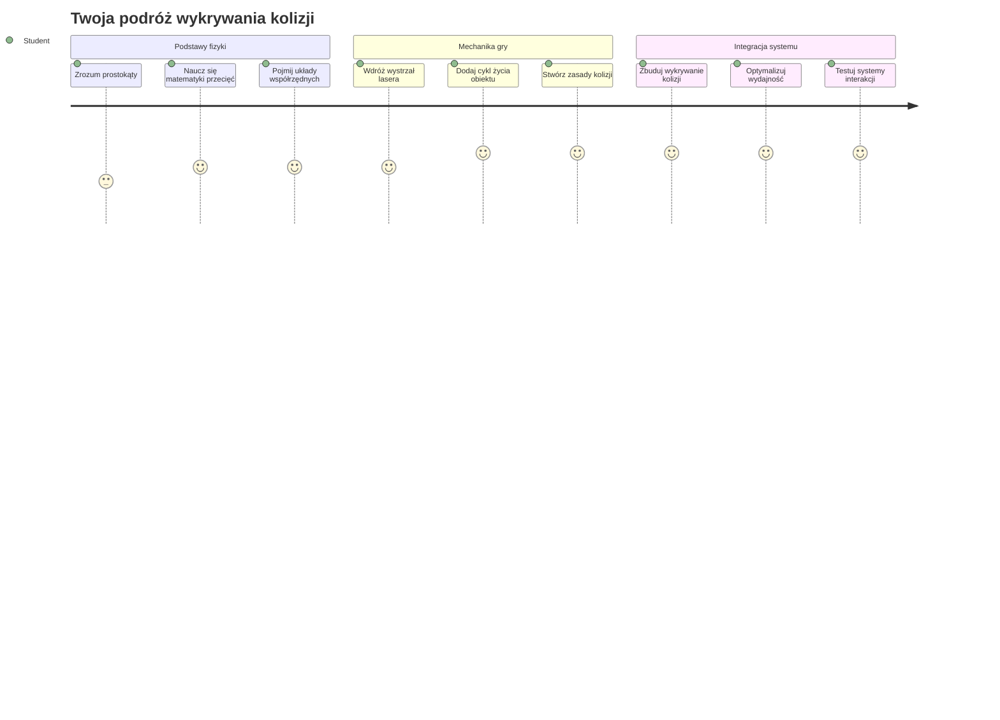
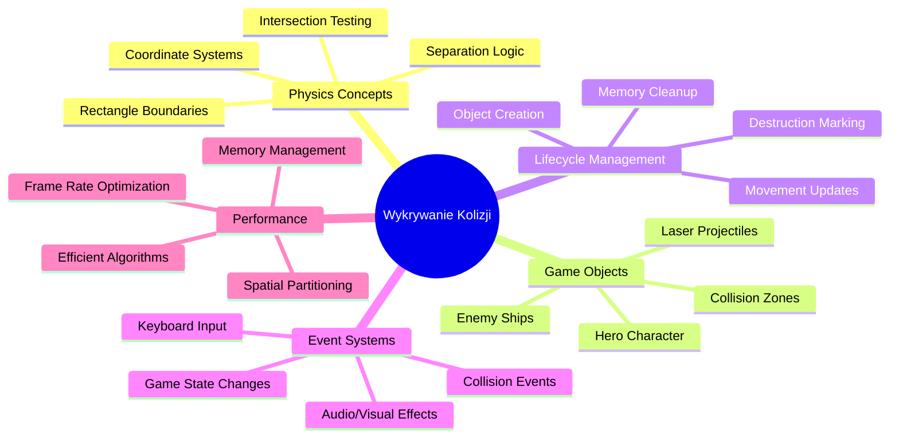
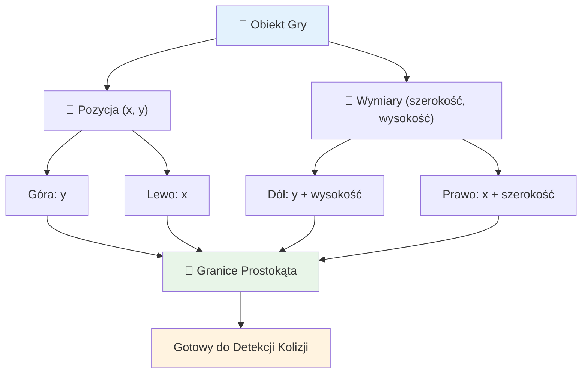
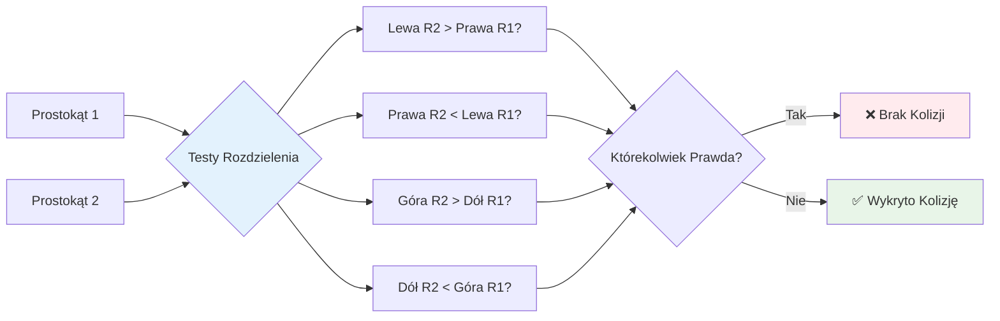
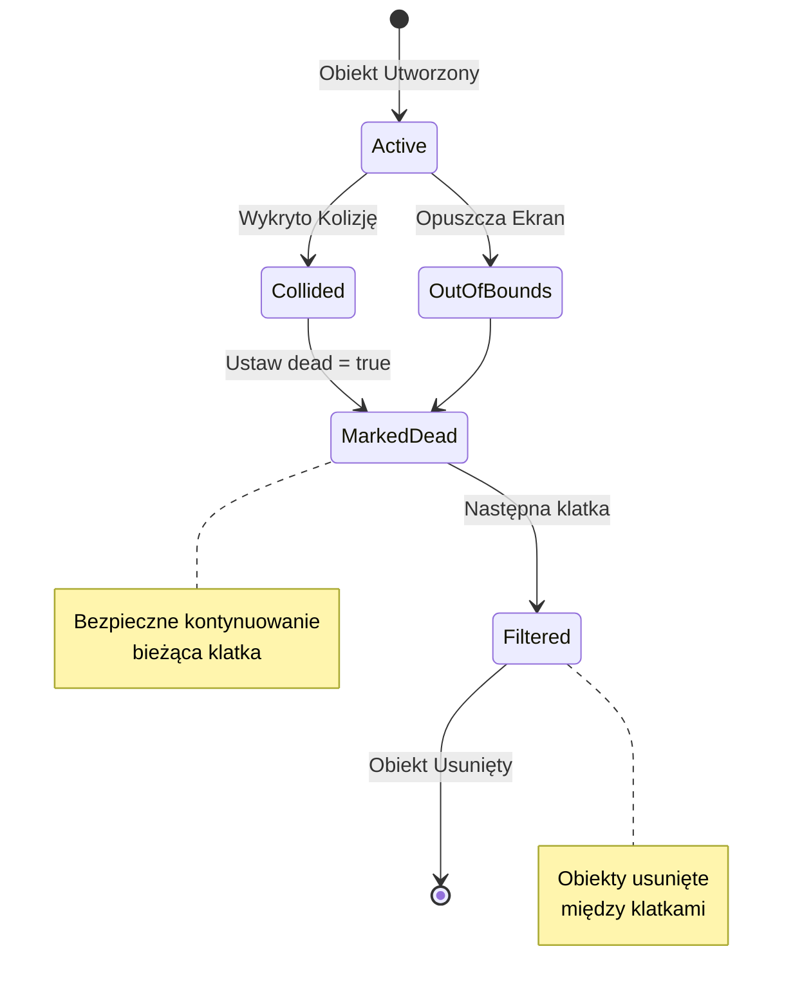
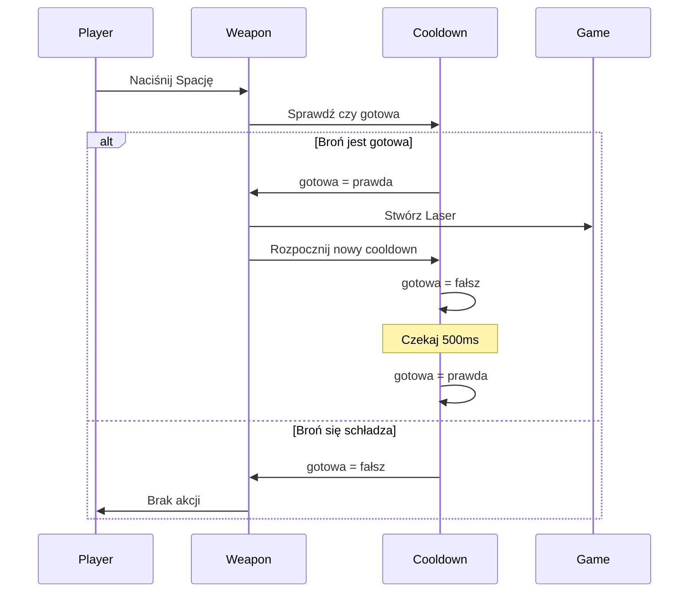
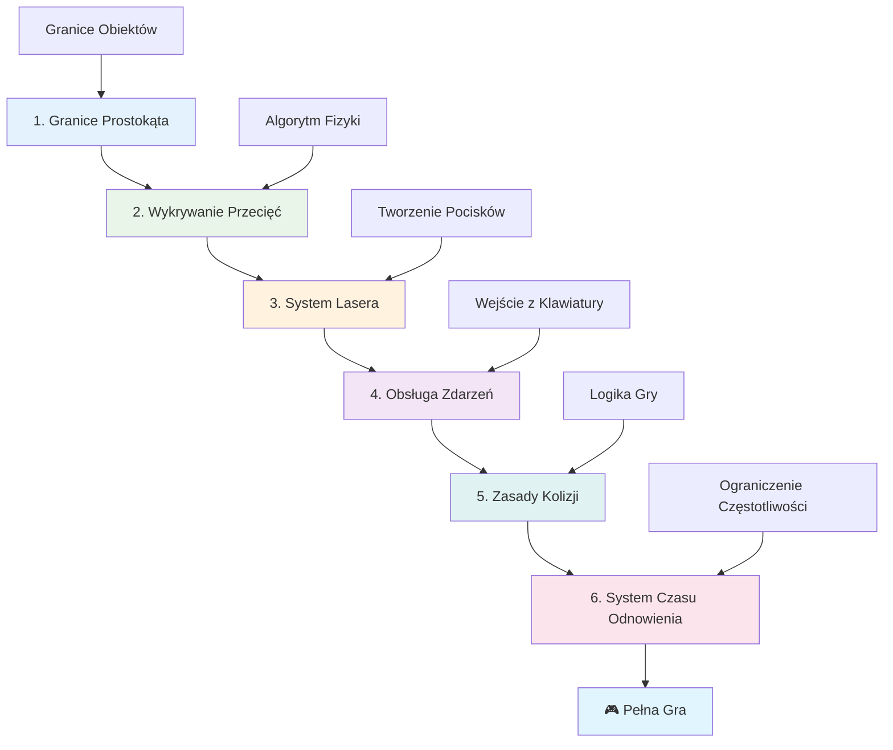
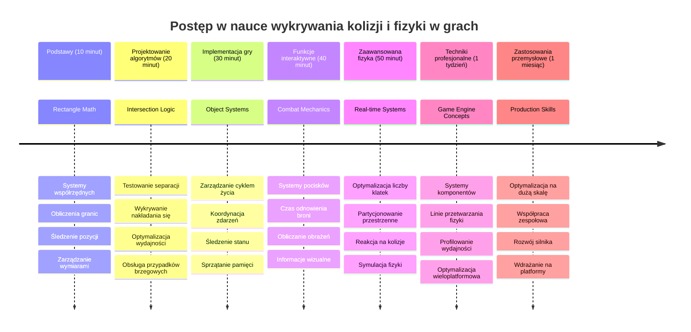

# Stwórz grę kosmiczną Część 4: Dodawanie lasera i wykrywanie kolizji


## Quiz przed wykładem

[Quiz przed wykładem](https://ff-quizzes.netlify.app/web/quiz/35)

Pomyśl o momencie w Gwiezdnych Wojnach, gdy protonowe torpedy Luke'a trafiły w wylot spalin Gwiazdy Śmierci. To precyzyjne wykrycie kolizji zmieniło losy galaktyki! W grach wykrywanie kolizji działa podobnie - określa kiedy obiekty wchodzą ze sobą w interakcje i co się wtedy dzieje.

W tej lekcji dodasz do swojej gry kosmicznej bronie laserowe i zaimplementujesz wykrywanie kolizji. Podobnie jak planiści misji NASA obliczają trajektorie statków kosmicznych, aby unikać odłamków, nauczysz się wykrywać, kiedy obiekty gry się przecinają. Rozłożymy to na zrozumiałe etapy, które będą na siebie nakładać.

Na końcu będziesz mieć działający system walki, w którym lasery niszczą wrogów, a kolizje wywołują zdarzenia w grze. Te same zasady wykrywania kolizji stosuje się we wszystkim, od symulacji fizycznych po interaktywne interfejsy internetowe.


✅ Zrób krótkie badania na temat pierwszej napisanej w historii komputerowej gry. Jakie miała funkcje?

## Wykrywanie kolizji

Wykrywanie kolizji działa jak czujniki odległości w module księżycowym Apollo – stale mierzy odległości i wywołuje alarmy, gdy obiekty zbliżają się zbyt blisko. W grach ten system decyduje, kiedy obiekty ze sobą oddziałują i co powinno się dalej wydarzyć.

Podejście, którego użyjemy, traktuje każdy obiekt gry jako prostokąt, podobnie jak systemy kontroli ruchu lotniczego wykorzystują uproszczone kształty geometryczne do śledzenia samolotów. Ta prostokątna metoda może wydawać się prosta, ale jest wydajna obliczeniowo i dobrze działa w większości scenariuszy gier.

### Reprezentacja prostokąta

Każdy obiekt gry potrzebuje granicznych współrzędnych, podobnie jak łazik Mars Pathfinder mapował swoją lokalizację na powierzchni Marsa. Tak definiujemy te granice:


```javascript
rectFromGameObject() {
  return {
    top: this.y,
    left: this.x,
    bottom: this.y + this.height,
    right: this.x + this.width
  }
}
```

**Rozłóżmy to na części:**
- **Górna krawędź**: To po prostu miejsce, gdzie obiekt zaczyna się pionowo (jego pozycja y)
- **Lewa krawędź**: Miejsce startu poziomo (jego pozycja x)
- **Dolna krawędź**: Dodaj wysokość do pozycji y – teraz wiesz, gdzie się kończy!
- **Prawa krawędź**: Dodaj szerokość do pozycji x – i masz pełne granice

### Algorytm wykrywania przecięcia

Wykrywanie przecięcia prostokątów używa logiki podobnej do tej, którą teleskop Hubble wykorzystuje, by określić, czy obiekty niebieskie nachodzą na siebie w polu widzenia. Algorytm sprawdza oddzielenie:


```javascript
function intersectRect(r1, r2) {
  return !(r2.left > r1.right ||
    r2.right < r1.left ||
    r2.top > r1.bottom ||
    r2.bottom < r1.top);
}
```

**Test oddzielenia działa jak systemy radarowe:**
- Czy prostokąt 2 leży całkowicie na prawo od prostokąta 1?
- Czy prostokąt 2 leży całkowicie na lewo od prostokąta 1?
- Czy prostokąt 2 leży całkowicie pod prostokątem 1?
- Czy prostokąt 2 leży całkowicie nad prostokątem 1?

Jeśli żadna z tych warunków nie jest spełniona, prostokąty muszą się nakładać. To podejście odzwierciedla, jak operatorzy radarów sprawdzają, czy dwa samoloty zachowują bezpieczną odległość.

## Zarządzanie cyklem życia obiektów

Gdy laser trafia w wroga, oba obiekty muszą zostać usunięte z gry. Jednak usuwanie obiektów w trakcie pętli może powodować błędy — to lekcja wyciągnięta z dawnych systemów komputerowych, takich jak Apollo Guidance Computer. Zamiast tego stosujemy podejście „oznacz do usunięcia”, które bezpiecznie usuwa obiekty między klatkami.


Tak oznaczamy coś do usunięcia:

```javascript
// Oznacz obiekt do usunięcia
enemy.dead = true;
```

**Dlaczego to podejście działa:**
- Oznaczamy obiekt jako „martwy”, ale nie usuwamy go od razu
- Pozwala to dokończyć obecną klatkę gry bez błędów
- Brak awarii z powodu używania czegoś, co już zniknęło!

Następnie filtrujemy oznaczone obiekty przed kolejnym cyklem renderowania:

```javascript
gameObjects = gameObjects.filter(go => !go.dead);
```

**Co robi to filtrowanie:**
- Tworzy nową listę z tylko „żyjącymi” obiektami
- Usuwa wszystko, co oznaczono jako martwe
- Utrzymuje płynność gry
- Zapobiega zbyt szybkiemu narastaniu uszkodzonych obiektów w pamięci

## Implementacja mechaniki lasera

Pociski laserowe w grach działają na tej samej zasadzie co fotonowe torpedy w Star Treku – są odrębnymi obiektami, które poruszają się po liniach prostych aż do trafienia w coś. Każde naciśnięcie spacji tworzy nowy obiekt lasera, który przesuwa się po ekranie.

Aby to działało, musimy koordynować kilka elementów:

**Kluczowe elementy do zaimplementowania:**
- **Tworzenie** obiektów laserów, które powstają przy pozycji bohatera
- **Obsługa** klawiatury do wywołania tworzenia lasera
- **Zarządzanie** ruchiem i cyklem życia laserów
- **Implementacja** wizualnej reprezentacji pocisków laserowych

## Implementacja kontroli szybkości strzałów

Nieograniczona szybkość strzelania zalałaby silnik gry i uczyniłaby rozgrywkę zbyt prostą. Rzeczywiste systemy broni mają podobne ograniczenia – nawet fazery USS Enterprise potrzebowały czasu na przeładowanie między strzałami.

Wdrożymy system chłodzenia (cooldown), który zapobiega spamowi szybkich strzałów, a jednocześnie zachowuje responsywność sterowania:


```javascript
class Cooldown {
  constructor(time) {
    this.cool = false;
    setTimeout(() => {
      this.cool = true;
    }, time);
  }
}

class Weapon {
  constructor() {
    this.cooldown = null;
  }
  
  fire() {
    if (!this.cooldown || this.cooldown.cool) {
      // Stwórz pocisk laserowy
      this.cooldown = new Cooldown(500);
    } else {
      // Broń nadal się chłodzi
    }
  }
}
```

**Jak działa cooldown:**
- Po stworzeniu broń jest „gorąca” (nie może jeszcze strzelać)
- Po upływie czasu staje się „zimna” (gotowa do strzału)
- Przed oddaniem strzału sprawdzamy: „Czy broń jest zimna?”
- To zapobiega spamowaniu, ale zachowuje szybkie reakcje

✅ Przypomnij sobie lekcję 1 z serii gry kosmicznej o systemach cooldown.

## Budowanie systemu kolizji

Rozszerzysz swój istniejący kod gry kosmicznej o system wykrywania kolizji. Podobnie jak automatyczny system unikania kolizji Międzynarodowej Stacji Kosmicznej, twoja gra będzie na bieżąco monitorować pozycje obiektów i reagować na przecięcia.

Na podstawie kodu z poprzedniej lekcji dodasz wykrywanie kolizji z konkretnymi zasadami sterującymi interakcjami obiektów.

> 💡 **Pro Tip**: Sprite lasera jest już dołączony w folderze assets i odwołany w twoim kodzie, gotowy do wdrożenia.

### Zasady kolizji do zaimplementowania

**Mechanika gry do dodania:**
1. **Laser trafia wroga**: Obiekt wroga jest niszczony, jeśli zostanie trafiony przez pocisk laserowy
2. **Laser trafia w krawędź ekranu**: Laser jest usuwany, gdy dotrze do górnej krawędzi ekranu
3. **Kolizja wroga z bohaterem**: Oba obiekty są niszczone, gdy się przecinają
4. **Wróg dociera do dołu ekranu**: Warunek przegranej, gdy wrogowie docierają do dołu ekranu

### 🔄 **Sprawdzenie pedagogiczne**
**Podstawy wykrywania kolizji**: Zanim zaimplementujesz, upewnij się, że rozumiesz:
- ✅ Jak granice prostokątów definiują strefy kolizji
- ✅ Dlaczego testy separacji są wydajniejsze niż obliczanie przecięć
- ✅ Znaczenie zarządzania cyklem życia obiektów w pętli gry
- ✅ Jak systemy oparte na zdarzeniach koordynują reakcje na kolizje

**Szybki test samodzielny**: Co by się stało, gdybyś usuwał obiekty od razu zamiast oznaczać je?
*Odpowiedź: Usuwanie w trakcie pętli mogłoby powodować awarie lub pominięcie obiektów w iteracji*

**Zrozumienie fizyki**: Teraz rozumiesz:
- **Układy współrzędnych**: Jak pozycja i wymiary tworzą granice
- **Logika przecięć**: Zasady matematyczne wykrywania kolizji
- **Optymalizacja wydajności**: Dlaczego efektywne algorytmy są ważne w systemach czasu rzeczywistego
- **Zarządzanie pamięcią**: Bezpieczne wzorce zarządzania obiektami dla stabilności

## Konfiguracja środowiska programistycznego

Dobre wieści - większość przygotowań jest już gotowa! Wszystkie twoje zasoby gry i podstawowa struktura czekają w podfolderze `your-work`, gotowe na dodanie fajnych funkcji kolizji.

### Struktura projektu

```bash
-| assets
  -| enemyShip.png
  -| player.png
  -| laserRed.png
-| index.html
-| app.js
-| package.json
```

**Co zawiera struktura plików:**
- **Zawiera** wszystkie obrazy sprite potrzebne do obiektów gry
- **Zawiera** główny dokument HTML i plik aplikacji JavaScript
- **Dostarcza** konfigurację pakietu dla lokalnego serwera deweloperskiego

### Uruchamianie serwera deweloperskiego

Przejdź do folderu projektu i uruchom lokalny serwer:

```bash
cd your-work
npm start
```

**Ta sekwencja komend:**
- **Zmienia** katalog na twój folder roboczy projektu
- **Uruchamia** lokalny serwer HTTP na `http://localhost:5000`
- **Serwuje** pliki gry do testowania i pracy deweloperskiej
- **Umożliwia** tworzenie na żywo ze automatycznym odświeżaniem

Otwórz przeglądarkę i przejdź pod adres `http://localhost:5000`, aby zobaczyć aktualny stan gry z wyrenderowanym bohaterem i wrogami na ekranie.

### Implementacja krok po kroku

Podobnie jak systematyczne podejście NASA do programowania sond Voyager, zaimplementujemy wykrywanie kolizji metodycznie, budując każdy element krok po kroku.


#### 1. Dodaj granice kolizji prostokąta

Najpierw nauczmy obiekty gry opisywać swoje granice. Dodaj tę metodę do klasy `GameObject`:

```javascript
rectFromGameObject() {
    return {
      top: this.y,
      left: this.x,
      bottom: this.y + this.height,
      right: this.x + this.width,
    };
  }
```

**Ta metoda robi:**
- **Tworzy** obiekt prostokąta z precyzyjnymi koordynatami granic
- **Oblicza** dolną i prawą krawędź za pomocą pozycji plus wymiary
- **Zwraca** obiekt gotowy do użycia w algorytmach wykrywania kolizji
- **Zapewnia** ustandaryzowany interfejs dla wszystkich obiektów gry

#### 2. Zaimplementuj wykrywanie przecięcia

Teraz stwórzmy nasze wykrywanie kolizji – funkcję, która określi, czy dwa prostokąty się nakładają:

```javascript
function intersectRect(r1, r2) {
  return !(
    r2.left > r1.right ||
    r2.right < r1.left ||
    r2.top > r1.bottom ||
    r2.bottom < r1.top
  );
}
```

**Ten algorytm:**
- **Sprawdza** cztery warunki separacji między prostokątami
- **Zwraca** `false`, jeśli jakikolwiek warunek separacji jest prawdziwy
- **Wskazuje** kolizję, gdy nie ma oddzielenia
- **Używa** negacji logiki dla efektywnego testu przecięcia

#### 3. Wdrożenie systemu strzelania laserem

Teraz robi się ciekawie! Ustawmy system strzelania laserem.

##### Stałe wiadomości

Najpierw zdefiniujmy typy wiadomości, aby różne części naszej gry mogły się komunikować:

```javascript
KEY_EVENT_SPACE: "KEY_EVENT_SPACE",
COLLISION_ENEMY_LASER: "COLLISION_ENEMY_LASER",
COLLISION_ENEMY_HERO: "COLLISION_ENEMY_HERO",
```

**Te stałe:**
- **Standaryzują** nazwy zdarzeń w całej aplikacji
- **Umożliwiają** spójną komunikację między systemami gry
- **Zapobiegają** literówkom przy rejestracji obsługi zdarzeń

##### Obsługa klawiatury

Dodaj wykrywanie spacji w słuchaczu zdarzeń klawiszy:

```javascript
} else if(evt.keyCode === 32) {
  eventEmitter.emit(Messages.KEY_EVENT_SPACE);
}
```

**Ten handler wejścia:**
- **Wykrywa** wciśnięcia spacji kodem klawisza 32
- **Emituje** ustandaryzowaną wiadomość zdarzenia
- **Umożliwia** oddzielenie logiki strzelania

##### Rejestracja nasłuchiwaczy

Zarejestruj zachowanie strzału w funkcji `initGame()`:

```javascript
eventEmitter.on(Messages.KEY_EVENT_SPACE, () => {
 if (hero.canFire()) {
   hero.fire();
 }
});
```

**Ten nasłuchiwacz:**
- **Reaguje** na zdarzenia spacji
- **Sprawdza** status cooldown
- **Wyzwala** tworzenie lasera, gdy jest to dozwolone

Dodaj obsługę kolizji laser-wróg:

```javascript
eventEmitter.on(Messages.COLLISION_ENEMY_LASER, (_, { first, second }) => {
  first.dead = true;
  second.dead = true;
});
```

**Ten handler kolizji:**
- **Odbiera** dane o kolizji z dwoma obiektami
- **Oznacza** oba obiekty do usunięcia
- **Zapewnia** prawidłowe czyszczenie po kolizji

#### 4. Utwórz klasę Laser

Zaimplementuj pocisk laserowy, który porusza się w górę i zarządza swoim cyklem życia:

```javascript
class Laser extends GameObject {
  constructor(x, y) {
    super(x, y);
    this.width = 9;
    this.height = 33;
    this.type = 'Laser';
    this.img = laserImg;
    
    let id = setInterval(() => {
      if (this.y > 0) {
        this.y -= 15;
      } else {
        this.dead = true;
        clearInterval(id);
      }
    }, 100);
  }
}
```

**Ta klasa:**
- **Dziedziczy** po GameObject, aby odziedziczyć podstawową funkcjonalność
- **Ustawia** odpowiednie wymiary sprite'a lasera
- **Tworzy** automatyczny ruch w górę za pomocą `setInterval()`
- **Zarządza** samodestrukcją po dotarciu do górnej krawędzi ekranu
- **Obsługuje** własne timery animacji i sprzątanie

#### 5. Implementuj system wykrywania kolizji

Stwórz kompleksową funkcję wykrywania kolizji:

```javascript
function updateGameObjects() {
  const enemies = gameObjects.filter(go => go.type === 'Enemy');
  const lasers = gameObjects.filter(go => go.type === "Laser");
  
  // Testuj kolizje lasera z wrogiem
  lasers.forEach((laser) => {
    enemies.forEach((enemy) => {
      if (intersectRect(laser.rectFromGameObject(), enemy.rectFromGameObject())) {
        eventEmitter.emit(Messages.COLLISION_ENEMY_LASER, {
          first: laser,
          second: enemy,
        });
      }
    });
  });

  // Usuń zniszczone obiekty
  gameObjects = gameObjects.filter(go => !go.dead);
}
```

**System kolizji:**
- **Filtruje** obiekty gry według typu dla efektywnego testowania
- **Testuje** każdą wiązkę laserów z każdym wrogiem pod kątem przecięcia
- **Emituję** zdarzenia kolizji, gdy wykryje przecięcia
- **Czyści** zniszczone obiekty po obsłudze kolizji

> ⚠️ **Ważne**: Dodaj `updateGameObjects()` do swojej głównej pętli gry w `window.onload`, aby włączyć wykrywanie kolizji.

#### 6. Dodaj system cooldown do klasy Hero

Ulepsz klasę Hero, dodając mechanikę strzelania i ograniczanie tempa strzałów:

```javascript
class Hero extends GameObject {
  constructor(x, y) {
    super(x, y);
    this.width = 99;
    this.height = 75;
    this.type = "Hero";
    this.speed = { x: 0, y: 0 };
    this.cooldown = 0;
  }
  
  fire() {
    gameObjects.push(new Laser(this.x + 45, this.y - 10));
    this.cooldown = 500;

    let id = setInterval(() => {
      if (this.cooldown > 0) {
        this.cooldown -= 100;
      } else {
        clearInterval(id);
      }
    }, 200);
  }
  
  canFire() {
    return this.cooldown === 0;
  }
}
```

**Ulepszona klasa Hero:**
- **Inicjuje** licznik cooldown na zero (gotowy do strzału)
- **Tworzy** obiekty laserów umieszczone nad okrętem bohatera
- **Ustawia** okres cooldown, aby zapobiec szybkiemu strzelaniu
- **Zmniejsza** licznik cooldown w cyklicznych aktualizacjach
- **Umożliwia** sprawdzenie gotowości do strzału metodą `canFire()`

### 🔄 **Sprawdzenie pedagogiczne**
**Kompletne zrozumienie systemu**: Sprawdź swoją biegłość w systemie kolizji:
- ✅ Jak granice prostokątów umożliwiają efektywne wykrywanie kolizji?
- ✅ Dlaczego zarządzanie cyklem życia obiektów jest krytyczne dla stabilności gry?
- ✅ Jak system cooldown zapobiega problemom z wydajnością?
- ✅ Jaką rolę odgrywa architektura oparta na wydarzeniach w obsłudze kolizji?

**Integracja systemów**: Twój system kolizji demonstruje:
- **Precyzję matematyczną**: Algorytmy przecięcia prostokątów
- **Optymalizację wydajności**: Wydajne wzorce testowania kolizji
- **Zarządzanie pamięcią**: Bezpieczne tworzenie i usuwanie obiektów
- **Koordynację zdarzeń**: Odłączoną komunikację systemową
- **Przetwarzanie w czasie rzeczywistym**: Cykl aktualizacji oparty na klatkach

**Wzorce profesjonalne**: Zaimplementowałeś:
- **Separation of Concerns**: Oddzielenie fizyki, renderowania i obsługi wejścia
- **Projektowanie obiektowe**: Dziedziczenie i polimorfizm
- **Zarządzanie stanem**: Cykl życia obiektów i śledzenie stanu gry
- **Optymalizację wydajności**: Efektywne algorytmy do zastosowań czasu rzeczywistego

### Testowanie implementacji

Twoja gra kosmiczna ma teraz pełny system wykrywania kolizji i mechanikę walki. 🚀 Przetestuj nowe funkcje:
- **Nawiguj** za pomocą klawiszy strzałek, aby zweryfikować sterowanie ruchem
- **Strzelaj laserami** za pomocą spacji – zauważ, jak cooldown zapobiega spamowaniu
- **Obserwuj kolizje**, gdy lasery trafiają wrogów, co wywołuje ich usunięcie
- **Sprawdź sprzątanie**, gdy uszkodzone obiekty znikają z gry

Pomyślnie zaimplementowałeś system wykrywania kolizji, korzystając z tych samych zasad matematycznych, które kierują nawigacją statków kosmicznych i robotyką.

### ⚡ **Co możesz zrobić w ciągu następnych 5 minut**
- [ ] Otwórz narzędzia deweloperskie przeglądarki i ustaw pułapki (breakpointy) w funkcji wykrywania kolizji
- [ ] Spróbuj zmodyfikować prędkość lasera lub ruch wrogów, aby zobaczyć efekty kolizji
- [ ] Eksperymentuj z różnymi wartościami cooldown, aby przetestować tempo strzelania
- [ ] Dodaj instrukcje `console.log` do śledzenia zdarzeń kolizji w czasie rzeczywistym

### 🎯 **Co możesz osiągnąć w tę godzinę**
- [ ] Ukończ quiz po lekcji i zrozum algorytmy wykrywania kolizji
- [ ] Dodaj efekty wizualne, takie jak eksplozje, gdy dochodzi do kolizji
- [ ] Zaimplementuj różne typy pocisków o zróżnicowanych właściwościach
- [ ] Stwórz power-upy, które tymczasowo zwiększają zdolności gracza
- [ ] Dodaj efekty dźwiękowe, aby kolizje były bardziej satysfakcjonujące

### 📅 **Twój tygodniowy plan programowania fizyki**
- [ ] Ukończ pełną grę kosmiczną z dopracowanymi systemami kolizji
- [ ] Wdróż zaawansowane kształty kolizji wykraczające poza prostokąty (koła, wielokąty)
- [ ] Dodaj systemy cząsteczek dla realistycznych efektów eksplozji
- [ ] Stwórz złożone zachowanie przeciwników z unikaniem kolizji
- [ ] Optymalizuj wykrywanie kolizji, by poprawić wydajność przy wielu obiektach
- [ ] Dodaj symulację fizyki, jak pęd i realistyczny ruch

### 🌟 **Twoje miesięczne mistrzostwo fizyki gry**
- [ ] Buduj gry z zaawansowanymi silnikami fizyki i realistycznymi symulacjami
- [ ] Ucz się wykrywania kolizji 3D i algorytmów partycjonowania przestrzeni
- [ ] Współtwórz biblioteki fizyki i silniki gier open source
- [ ] Opanuj optymalizację wydajności w aplikacjach graficznych wymagających mocy obliczeniowej
- [ ] Twórz materiały edukacyjne dotyczące fizyki gier i wykrywania kolizji
- [ ] Zbuduj portfolio prezentujące zaawansowane umiejętności programowania fizyki

## 🎯 Twój harmonogram opanowania wykrywania kolizji


### 🛠️ Podsumowanie Twojego zestawu narzędzi fizyki gry

Po ukończeniu tej lekcji opanowałeś:
- **Matematykę kolizji**: Algorytmy przecięcia prostokątów i systemy współrzędnych
- **Optymalizację wydajności**: Efektywne wykrywanie kolizji w aplikacjach czasu rzeczywistego
- **Zarządzanie cyklem życia obiektów**: Bezpieczne wzorce tworzenia, aktualizacji i niszczenia
- **Architekturę opartą na zdarzeniach**: Odseparowane systemy reagujące na kolizje
- **Integrację z pętlą gry**: Aktualizacje fizyki bazujące na klatkach i koordynacja renderowania
- **Systemy wejścia**: Responsywne sterowanie z ograniczeniem częstotliwości i sprzężeniem zwrotnym
- **Zarządzanie pamięcią**: Efektywne pule obiektów i strategie sprzątania

**Zastosowania w praktyce**: Twoje umiejętności wykrywania kolizji mają zastosowanie w:
- **Interaktywnych symulacjach**: Modelowanie naukowe i narzędzia edukacyjne
- **Projektowaniu interfejsów**: Interakcje przeciągnij i upuść oraz wykrywanie dotyku
- **Wizualizacji danych**: Interaktywne wykresy i elementy klikalne
- **Tworzeniu aplikacji mobilnych**: Rozpoznawanie gestów dotykowych i obsługa kolizji
- **Programowaniu robotów**: Planowanie ścieżek i unikanie przeszkód
- **Grafice komputerowej**: Śledzenie promieni i algorytmy przestrzenne

**Nabyte umiejętności zawodowe**: Potrafisz teraz:
- **Projektować** efektywne algorytmy do wykrywania kolizji w czasie rzeczywistym
- **Implementować** systemy fizyki skalujące się złożonością obiektów
- **Debugować** złożone systemy interakcji, używając zasad matematycznych
- **Optymalizować** wydajność dla różnych sprzętów i przeglądarek
- **Architektować** utrzymywalne systemy gier stosując sprawdzone wzorce projektowe

**Opanowane pojęcia w tworzeniu gier**:
- **Symulacja fizyki**: Wykrywanie i reakcja na kolizje w czasie rzeczywistym
- **Inżynieria wydajności**: Optymalizowane algorytmy dla aplikacji interaktywnych
- **Systemy zdarzeń**: Oddzielona komunikacja między komponentami gry
- **Zarządzanie obiektami**: Efektywne wzorce cyklu życia dla treści dynamicznej
- **Obsługa wejścia**: Responsywne sterowanie z odpowiednim sprzężeniem zwrotnym

**Kolejny poziom**: Jesteś gotów eksplorować zaawansowane silniki fizyki jak Matter.js, implementować wykrywanie kolizji 3D lub budować złożone systemy cząsteczek!

🌟 **Odznaka zdobyta**: Zbudowałeś kompletny system interakcji oparty na fizyce z profesjonalnym wykrywaniem kolizji!

## Wyzwanie GitHub Copilot Agent 🚀

Użyj trybu Agenta, aby ukończyć następujące wyzwanie:

**Opis:** Ulepsz system wykrywania kolizji, implementując power-upy, które pojawiają się losowo i zapewniają tymczasowe zdolności po zebraniu przez statek bohatera.

**Polecenie:** Stwórz klasę PowerUp rozszerzającą GameObject i zaimplementuj wykrywanie kolizji między bohaterem a power-upami. Dodaj przynajmniej dwa typy power-upów: jeden zwiększający szybkostrzelność (skrócenie czasu odnowienia), a drugi tworzący tymczasową tarczę. Uwzględnij logikę pojawiania się power-upów w losowych odstępach i pozycjach.

---


## 🚀 Wyzwanie

Dodaj eksplozję! Spójrz na zasoby gry w [repozytorium Space Art](../../../../6-space-game/solution/spaceArt/readme.txt) i spróbuj dodać eksplozję, gdy laser trafia obcego

## Quiz po wykładzie

[Quiz po wykładzie](https://ff-quizzes.netlify.app/web/quiz/36)

## Przegląd i nauka własna

Eksperymentuj z interwałami w swojej grze. Co się dzieje, gdy je zmieniasz? Przeczytaj więcej o [zdarzeniach czasowych w JavaScript](https://www.freecodecamp.org/news/javascript-timing-events-settimeout-and-setinterval/).

## Zadanie domowe

[Zbadaj kolizje](assignment.md)

---

<!-- CO-OP TRANSLATOR DISCLAIMER START -->
**Zastrzeżenie**:  
Niniejszy dokument został przetłumaczony za pomocą usługi tłumaczenia AI [Co-op Translator](https://github.com/Azure/co-op-translator). Choć staramy się zapewnić dokładność, prosimy pamiętać, że automatyczne tłumaczenia mogą zawierać błędy lub niedokładności. Oryginalny dokument w języku źródłowym należy traktować jako źródło autorytatywne. W przypadku informacji o kluczowym znaczeniu zalecane jest skorzystanie z profesjonalnego tłumaczenia wykonanego przez człowieka. Nie ponosimy odpowiedzialności za jakiekolwiek nieporozumienia lub błędne interpretacje wynikające z korzystania z tego tłumaczenia.
<!-- CO-OP TRANSLATOR DISCLAIMER END -->