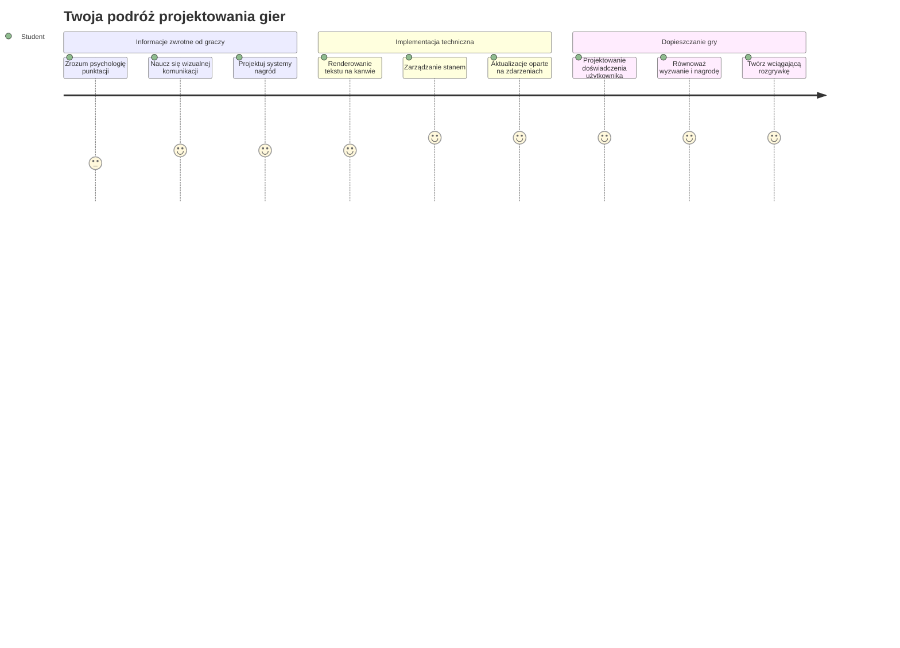
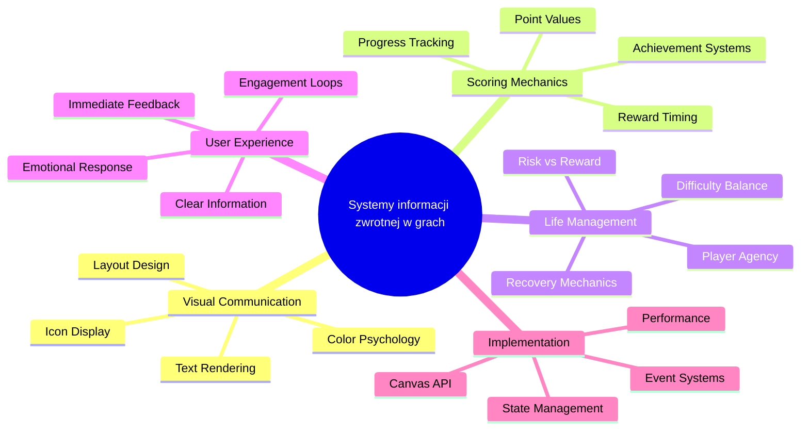
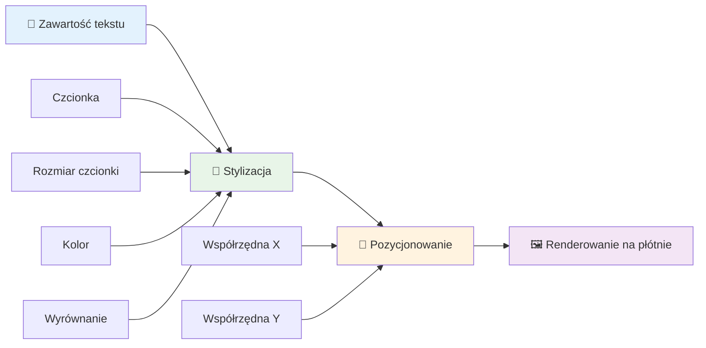
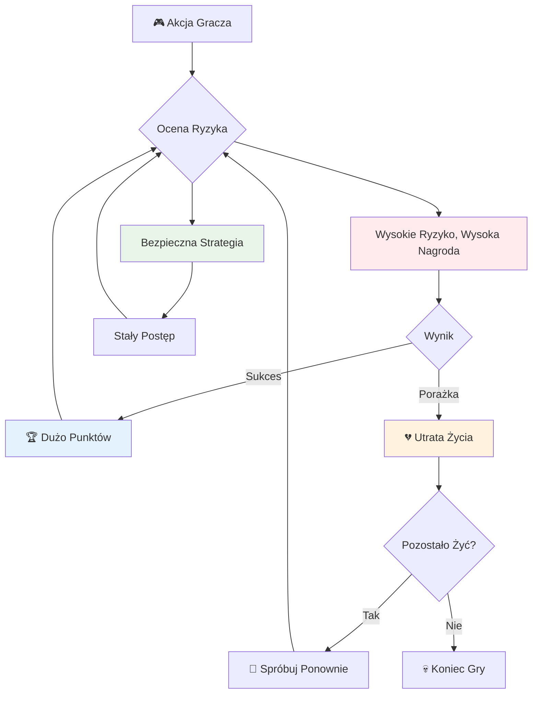
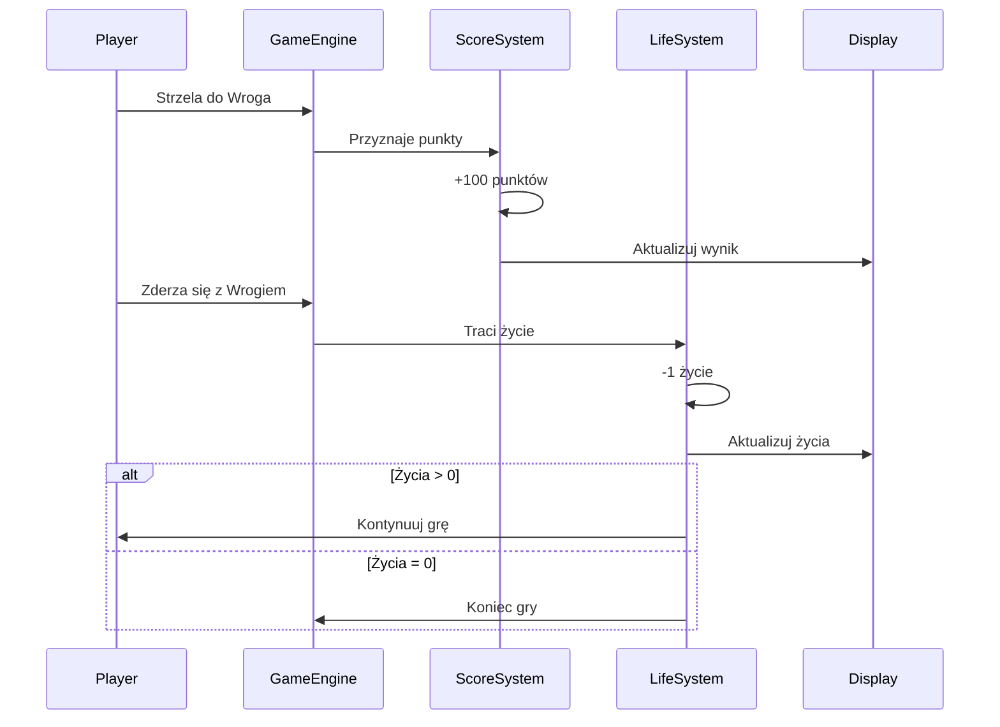
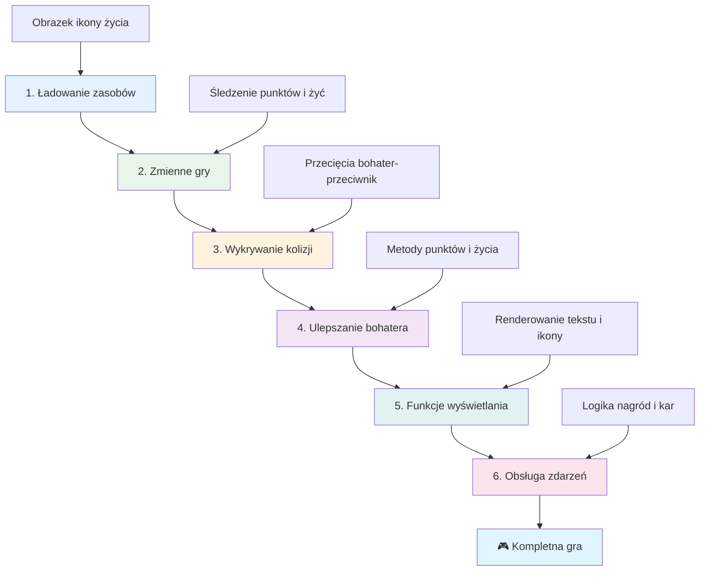
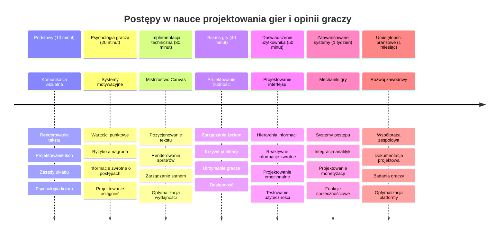

# Build a Space Game Part 5: Scoring and Lives


## Pre-Lecture Quiz

[Pre-lecture quiz](https://ff-quizzes.netlify.app/web/quiz/37)

Gotowy, aby twoja kosmiczna gra naprawdę poczuła się jak prawdziwa gra? Dodajmy punktację i zarządzanie życiami - kluczowe mechaniki, które transformowały wczesne gry arcade jak Space Invaders z prostych demonstracji w wciągającą rozrywkę. To moment, gdy twoja gra staje się naprawdę grywalna.


## Rysowanie tekstu na ekranie - Głos twojej gry

Aby wyświetlić swój wynik, musimy nauczyć się, jak renderować tekst na kanwie. Metoda `fillText()` jest twoim podstawowym narzędziem do tego - to ta sama technika używana w klasycznych grach arcade do pokazania punktacji i informacji o stanie gry.


Masz pełną kontrolę nad wyglądem tekstu:

```javascript
ctx.font = "30px Arial";
ctx.fillStyle = "red";
ctx.textAlign = "right";
ctx.fillText("show this on the screen", 0, 0);
```

✅ Zanurz się głębiej w [dodawanie tekstu do kanwy](https://developer.mozilla.org/docs/Web/API/Canvas_API/Tutorial/Drawing_text) - możesz być zaskoczony, jak kreatywnie możesz używać czcionek i stylizacji!

## Życia - Więcej niż tylko liczba

W projektowaniu gier „życie” reprezentuje margines błędu gracza. Koncepcja ta sięga automatów do pinballa, gdzie dostawało się kilka piłek do gry. W wczesnych grach wideo, jak Asteroids, życia dawały graczom pozwolenie na podejmowanie ryzyka i naukę na błędach.


Wizualna reprezentacja ma ogromne znaczenie - wyświetlanie ikon statków zamiast samego napisu „Życia: 3” tworzy natychmiastowe rozpoznanie wzrokowe, podobnie jak wczesne automaty arcade używały ikonografii do komunikacji ponad barierami językowymi.

## Budowa systemu nagród w twojej grze

Teraz zaimplementujemy podstawowe systemy informacji zwrotnej, które utrzymują zaangażowanie graczy:


- **System punktacji**: Każdy zniszczony statek wroga nagradza 100 punktów (okrągłe liczby są łatwiejsze do mentalnego liczenia dla graczy). Wynik wyświetlany jest w lewym dolnym rogu.
- **Licznik żyć**: Twój bohater rozpoczyna z trzema życiami - standard ustalony przez wczesne gry arcade, by zbalansować wyzwanie z grywalnością. Każda kolizja z wrogiem kosztuje jedno życie. Pokażemy pozostałe życia w prawym dolnym rogu za pomocą ikon statków .

## Zaczynamy budować!

Najpierw przygotuj swoje środowisko pracy. Przejdź do plików w podfolderze `your-work`. Powinieneś zobaczyć te pliki:

```bash
-| assets
  -| enemyShip.png
  -| player.png
  -| laserRed.png
-| index.html
-| app.js
-| package.json
```

Aby przetestować swoją grę, uruchom serwer deweloperski z folderu `your_work`:

```bash
cd your-work
npm start
```

To uruchamia lokalny serwer pod adresem `http://localhost:5000`. Otwórz ten adres w swojej przeglądarce, aby zobaczyć swoją grę. Przetestuj sterowanie strzałkami i spróbuj strzelać do wrogów, aby sprawdzić, czy wszystko działa.


### Czas na kodowanie!

1. **Pobierz potrzebne zasoby wizualne**. Skopiuj plik `life.png` z folderu `solution/assets/` do swojego folderu `your-work`. Następnie dodaj lifeImg do funkcji window.onload:

    ```javascript
    lifeImg = await loadTexture("assets/life.png");
    ```

1. Nie zapomnij dodać `lifeImg` do listy zasobów:

    ```javascript
    let heroImg,
    ...
    lifeImg,
    ...
    eventEmitter = new EventEmitter();
    ```
  
2. **Skonfiguruj zmienne gry**. Dodaj kod do śledzenia łącznego wyniku (początkowo 0) i pozostałych żyć (początkowo 3). Wyświetlimy je na ekranie, aby gracze zawsze wiedzieli, gdzie stoją.

3. **Załaduj detekcję kolizji**. Rozszerz funkcję `updateGameObjects()`, aby wykryć, kiedy wrogowie zderzają się z twoim bohaterem:

    ```javascript
    enemies.forEach(enemy => {
        const heroRect = hero.rectFromGameObject();
        if (intersectRect(heroRect, enemy.rectFromGameObject())) {
          eventEmitter.emit(Messages.COLLISION_ENEMY_HERO, { enemy });
        }
      })
    ```

4. **Dodaj śledzenie życia i punktów do swojego bohatera**. 
   1. **Zainicjuj liczniki**. Pod `this.cooldown = 0` w klasie `Hero` ustaw liczbę żyć i punktów:

        ```javascript
        this.life = 3;
        this.points = 0;
        ```

   1. **Pokaż te wartości graczowi**. Stwórz funkcje do rysowania tych wartości na ekranie:

        ```javascript
        function drawLife() {
          // DO ZROBIENIA, 35, 27
          const START_POS = canvas.width - 180;
          for(let i=0; i < hero.life; i++ ) {
            ctx.drawImage(
              lifeImg, 
              START_POS + (45 * (i+1) ), 
              canvas.height - 37);
          }
        }
        
        function drawPoints() {
          ctx.font = "30px Arial";
          ctx.fillStyle = "red";
          ctx.textAlign = "left";
          drawText("Points: " + hero.points, 10, canvas.height-20);
        }
        
        function drawText(message, x, y) {
          ctx.fillText(message, x, y);
        }

        ```

   1. **Podłącz wszystko do pętli gry**. Dodaj te funkcje do funkcji window.onload zaraz po `updateGameObjects()`:

        ```javascript
        drawPoints();
        drawLife();
        ```

### 🔄 **Pedagogiczne przypomnienie**
**Zrozumienie projektowania gry**: Przed wdrożeniem konsekwencji upewnij się, że rozumiesz:
- ✅ Jak wizualne informacje zwrotne komunikują stan gry graczom
- ✅ Dlaczego spójne rozmieszczenie elementów UI poprawia użyteczność
- ✅ Psychologię stojącą za wartościami punktów i zarządzaniem życiami
- ✅ Jak renderowanie tekstu na kanwie różni się od tekstu HTML

**Szybki test własny**: Dlaczego gry arcade zwykle używają okrągłych wartości punktów?
*Odpowiedź: Okrągłe liczby są łatwiejsze do mentalnego liczenia dla graczy i dają satysfakcjonujące nagrody psychologiczne*

**Zasady doświadczenia użytkownika**: Teraz stosujesz:
- **Hierarchię wizualną**: Ważne informacje umieszczone wyróżniająco
- **Natychmiastową informację zwrotną**: Aktualizacje w czasie rzeczywistym na działania gracza
- **Obciążenie poznawcze**: Proste, jasne przedstawienie informacji
- **Projekt emocjonalny**: Ikony i kolory tworzące więź z graczem

1. **Wdróż konsekwencje i nagrody w grze**. Dodamy teraz systemy informacji zwrotnej, które nadają sens działaniom gracza:

   1. **Kolizje kosztują życia**. Za każdym razem, gdy twój bohater zderzy się z wrogiem, tracisz życie.
   
      Dodaj tę metodę do klasy `Hero`:

        ```javascript
        decrementLife() {
          this.life--;
          if (this.life === 0) {
            this.dead = true;
          }
        }
        ```

   2. **Strzelanie do wrogów daje punkty**. Każde trafienie nagradza 100 punktami, dając natychmiastową pozytywną informację zwrotną za celny strzał.

      Rozszerz swoją klasę Hero o tę metodę inkrementacji:
    
        ```javascript
          incrementPoints() {
            this.points += 100;
          }
        ```

        Teraz połącz te funkcje ze zdarzeniami kolizji:

        ```javascript
        eventEmitter.on(Messages.COLLISION_ENEMY_LASER, (_, { first, second }) => {
           first.dead = true;
           second.dead = true;
           hero.incrementPoints();
        })

        eventEmitter.on(Messages.COLLISION_ENEMY_HERO, (_, { enemy }) => {
           enemy.dead = true;
           hero.decrementLife();
        });
        ```

✅ Ciekawi cię, jakie inne gry powstały dzięki JavaScript i Canvas? Poszukaj sam - możesz być zdumiony, co jest możliwe!

Po zaimplementowaniu tych funkcji, przetestuj swoją grę, aby zobaczyć kompletny system informacji zwrotnej w akcji. Powinieneś zobaczyć ikony żyć w prawym dolnym rogu, swój wynik w lewym dolnym i obserwować, jak kolizje zmniejszają życie, a trafienia podnoszą wynik.

Twoja gra ma teraz kluczowe mechaniki, które uczyniły wczesne gry arcade tak wciągającymi - jasne cele, natychmiastową informację zwrotną i istotne konsekwencje działań gracza.

### 🔄 **Pedagogiczne przypomnienie**
**Kompletny system projektowania gry**: Sprawdź swoją biegłość w systemach informacji zwrotnej dla gracza:
- ✅ Jak mechaniki punktacji tworzą motywację i zaangażowanie graczy?
- ✅ Dlaczego spójność wizualna jest ważna dla projektowania interfejsu użytkownika?
- ✅ Jak system żyć równoważy wyzwanie z utrzymaniem gracza?
- ✅ Jaką rolę pełni natychmiastowa informacja zwrotna w tworzeniu satysfakcjonującej rozgrywki?

**Integracja systemu**: Twój system informacji zwrotnej demonstruje:
- **Projektowanie UX**: Jasna wizualna komunikacja i hierarchia informacji
- **Architekturę sterowaną zdarzeniami**: Reaktywne aktualizacje czynności gracza
- **Zarządzanie state**: Śledzenie i wyświetlanie dynamicznych danych gry
- **Mistrzostwo Canvas**: Renderowanie tekstu i pozycjonowanie sprite’ów
- **Psychologię gry**: Zrozumienie motywacji i zaangażowania gracza

**Profesjonalne wzorce**: Wdrożyłeś:
- **Architekturę MVC**: Separację logiki gry, danych i prezentacji
- **Wzorzec obserwatora**: Aktualizacje sterowane zdarzeniami dla zmian stanu gry
- **Projektowanie komponentowe**: Wielokrotnego użytku funkcje renderowania i logiki
- **Optymalizację wydajności**: Efektywne renderowanie w pętli gry

### ⚡ **Co możesz zrobić w następnych 5 minutach**
- [ ] Eksperymentuj z różnymi rozmiarami i kolorami czcionki dla wyświetlania wyniku
- [ ] Spróbuj zmienić wartości punktowe i zobacz, jak to wpływa na odbiór rozgrywki
- [ ] Dodaj console.log, aby śledzić zmiany punktów i żyć
- [ ] Testuj sytuacje brzegowe, jak wyczerpanie żyć czy osiągnięcie wysokich wyników

### 🎯 **Co możesz osiągnąć w tej godzinie**
- [ ] Ukończ quiz po lekcji i zrozum psychologię projektowania gier
- [ ] Dodaj efekty dźwiękowe za zdobywanie punktów i tracenie żyć
- [ ] Wdróż system najwyższych wyników używając localStorage
- [ ] Stwórz różne wartości punktowe dla różnych typów wrogów
- [ ] Dodaj efekty wizualne, takie jak wstrząs ekranu po utracie życia

### 📅 **Twoja tygodniowa podróż po projektowaniu gier**
- [ ] Ukończ pełną grę kosmiczną z dopracowanymi systemami informacji zwrotnej
- [ ] Wdróż zaawansowane mechaniki punktacji, np. mnożniki combo
- [ ] Dodaj osiągnięcia i odblokowywalne treści
- [ ] Stwórz systemy progresji trudności i balansowania gry
- [ ] Zaprojektuj interfejsy dla menu i ekranów końcowych
- [ ] Przestudiuj inne gry, by zrozumieć mechanizmy angażujące graczy

### 🌟 **Twoje miesięczne mistrzostwo w rozwoju gry**
- [ ] Twórz kompletne gry z zaawansowanymi systemami progresji
- [ ] Naucz się analityki gier i pomiaru zachowań graczy
- [ ] Wnoś wkład do projektów open source związanych z tworzeniem gier
- [ ] Opanuj zaawansowane wzorce projektowe gier i monetyzację
- [ ] Twórz materiały edukacyjne o projektowaniu gier i doświadczeniu użytkownika
- [ ] Zbuduj portfolio prezentujące umiejętności projektowania i tworzenia gier

## 🎯 Oś czasu twojego mistrzostwa w projektowaniu gier


### 🛠️ Podsumowanie zestawu narzędzi do projektowania gier

Po ukończeniu tej lekcji, opanowałeś:
- **Psychologię gracza**: Zrozumienie motywacji, ryzyka/nagród i pętli zaangażowania
- **Komunikację wizualną**: Skuteczny design interfejsu za pomocą tekstu, ikon i układu
- **Systemy informacji zwrotnej**: Reakcję w czasie rzeczywistym na działania gracza i zdarzenia gry
- **Zarządzanie stanem**: Efektywne śledzenie i wyświetlanie dynamicznych danych gry
- **Renderowanie tekstu na kanwie**: Profesjonalne wyświetlanie tekstu z stylizacją i pozycjonowaniem
- **Integrację zdarzeń**: Łączenie akcji użytkownika z istotnymi konsekwencjami w grze
- **Balans gry**: Projektowanie krzywych trudności i systemów progresji gracza

**Realne zastosowania**: Twoje umiejętności projektowania gier stosują się bezpośrednio do:
- **Projektowania interfejsów użytkownika**: Tworzenia angażujących i intuicyjnych UI
- **Rozwoju produktów**: Zrozumienie motywacji użytkownika i pętli informacji zwrotnej
- **Technologii edukacyjnej**: Gamifikacji i systemów angażowania w nauce
- **Wizualizacji danych**: Uczynienia złożonych informacji przystępnymi i atrakcyjnymi
- **Tworzenia aplikacji mobilnych**: Mechanik utrzymania użytkownika i projektowania UX
- **Marketingu technologicznego**: Zrozumienie zachowań użytkowników i optymalizacji konwersji

**Nabyte umiejętności zawodowe**: Potrafisz teraz:
- **Projektować** doświadczenia użytkownika, które motywują i angażują
- **Wdrażać** systemy informacji zwrotnej efektywnie kształtujące zachowania użytkownika
- **Balansować** wyzwania i dostępność w interaktywnych systemach
- **Tworzyć** komunikację wizualną działającą w różnych grupach użytkowników
- **Analizować** zachowania użytkowników i ulepszać projekt na podstawie wyników

**Opanowane koncepcje tworzenia gier**:
- **Motywacja gracza**: Zrozumienie, co napędza zaangażowanie i retencję
- **Projekt wizualny**: Tworzenie czytelnych, atrakcyjnych i funkcjonalnych interfejsów
- **Integracja systemów**: Łączenie wielu systemów gry dla spójnego doświadczenia
- **Optymalizacja wydajności**: Efektywne renderowanie i zarządzanie stanem
- **Dostępność**: Projektowanie dla różnych poziomów umiejętności i potrzeb graczy

**Kolejny poziom**: Jesteś gotowy, aby zgłębić zaawansowane wzorce projektowania gier, wdrożyć systemy analityczne lub studiować monetyzację gier i strategie utrzymania gracza!

🌟 **Osiągnięcie odblokowane**: Zbudowałeś kompletny system informacji zwrotnej dla gracza zgodny z profesjonalnymi zasadami projektowania gier!

---

## GitHub Copilot Agent Challenge 🚀

Użyj trybu Agenta, aby wykonać następujące zadanie:

**Opis:** Rozszerz system punktacji gry kosmicznej o funkcję najwyższego wyniku z trwałym przechowywaniem oraz mechanikę przyznawania punktów bonusowych.

**Polecenie:** Stwórz system najwyższego wyniku, który zapisuje najlepszy wynik gracza w localStorage. Dodaj punkty bonusowe za kolejne zabite wrogie statki (system combo) i zaimplementuj różne wartości punktów dla różnych typów przeciwników. Dołącz wizualny wskaźnik, gdy gracz osiąga nowy rekord oraz wyświetl aktualny najwyższy wynik na ekranie gry.


## 🚀 Wyzwanie

Masz teraz działającą grę z punktacją i życiami. Zastanów się, jakie dodatkowe funkcje mogłyby ulepszyć doświadczenie gracza.

## Post-Lecture Quiz

[Post-lecture quiz](https://ff-quizzes.netlify.app/web/quiz/38)

## Przegląd & Samodzielna nauka

Chcesz odkryć więcej? Zbadaj różne podejścia do systemów punktacji i żyć w grach. Istnieją fascynujące silniki gier takie jak [PlayFab](https://playfab.com), które obsługują punktację, rankingi i progresję graczy. Jak mogłoby to wpłynąć na rozwój twojej gry?

## Zadanie

[Build a Scoring Game](assignment.md)

---

<!-- CO-OP TRANSLATOR DISCLAIMER START -->
**Zastrzeżenie**:  
Niniejszy dokument został przetłumaczony przy użyciu automatycznej usługi tłumaczeniowej [Co-op Translator](https://github.com/Azure/co-op-translator). Pomimo naszych starań o dokładność, prosimy pamiętać, że tłumaczenia automatyczne mogą zawierać błędy lub nieścisłości. Oryginalny dokument w języku źródłowym należy uznać za źródło ostateczne. W przypadku informacji krytycznych zaleca się skorzystanie z profesjonalnego tłumaczenia wykonanego przez człowieka. Nie ponosimy odpowiedzialności za jakiekolwiek nieporozumienia lub błędne interpretacje wynikające z korzystania z tego tłumaczenia.
<!-- CO-OP TRANSLATOR DISCLAIMER END -->