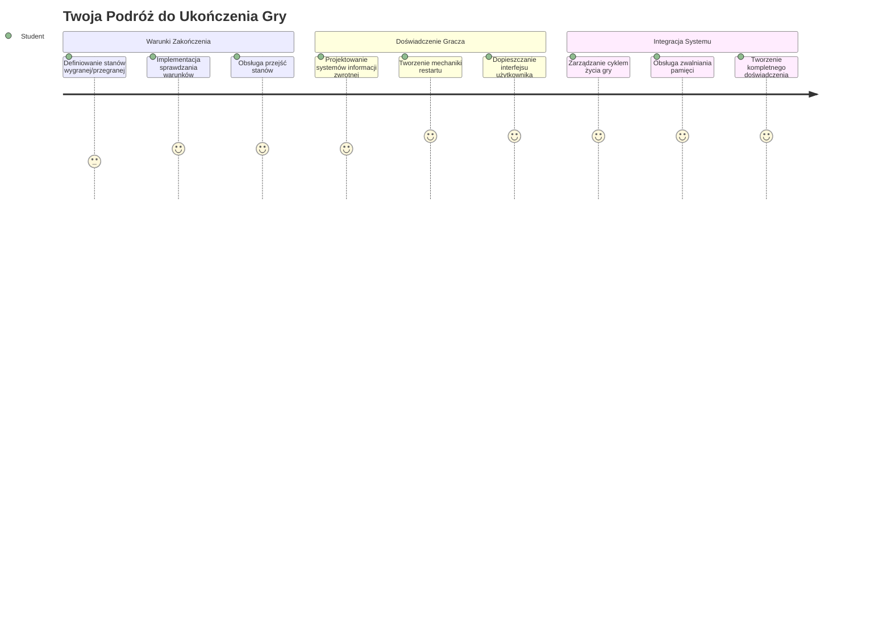
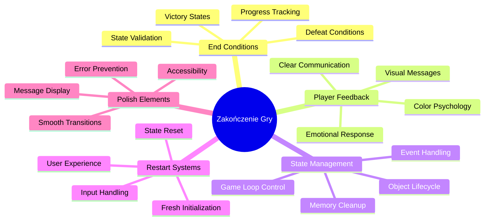
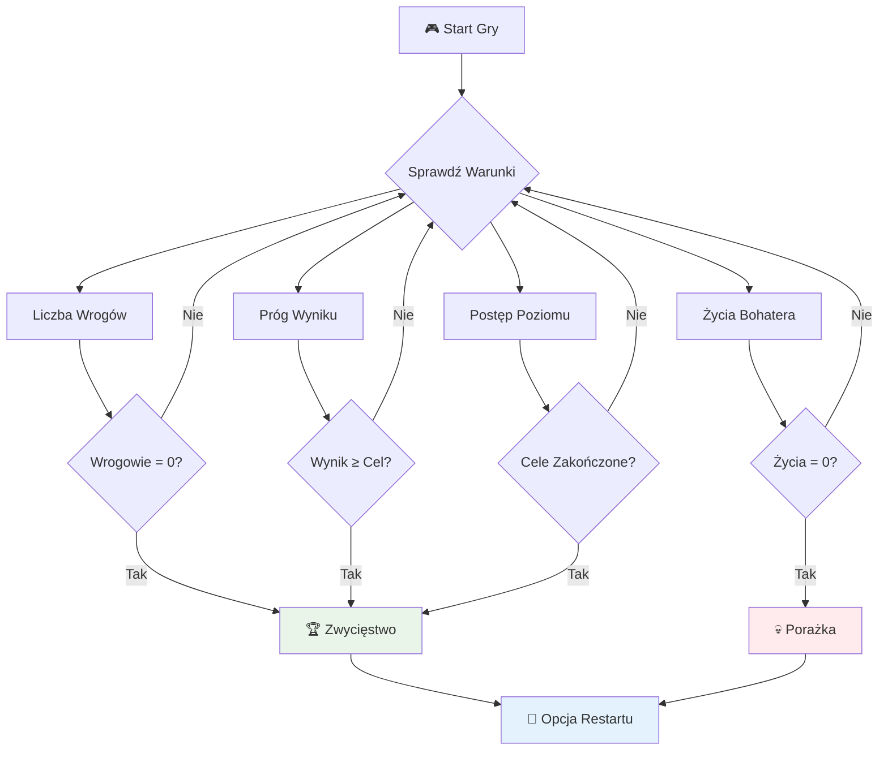
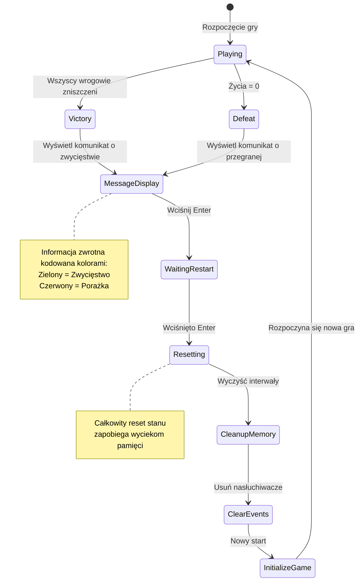
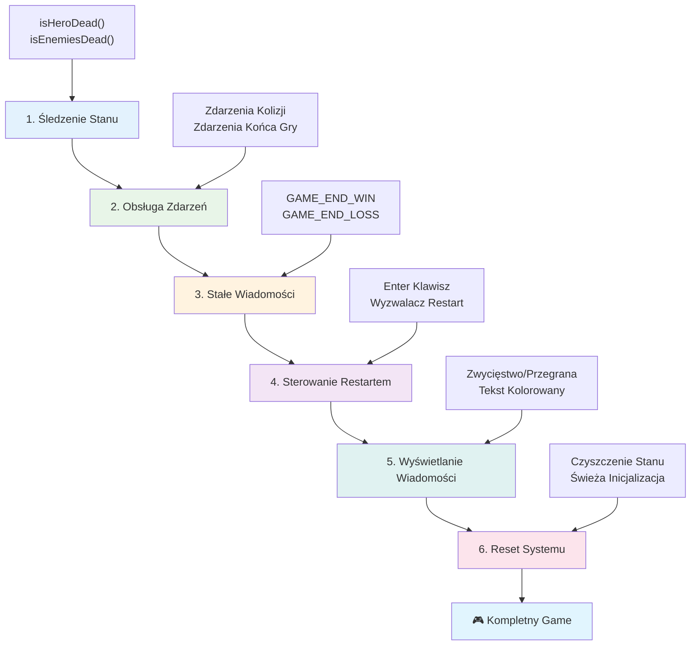
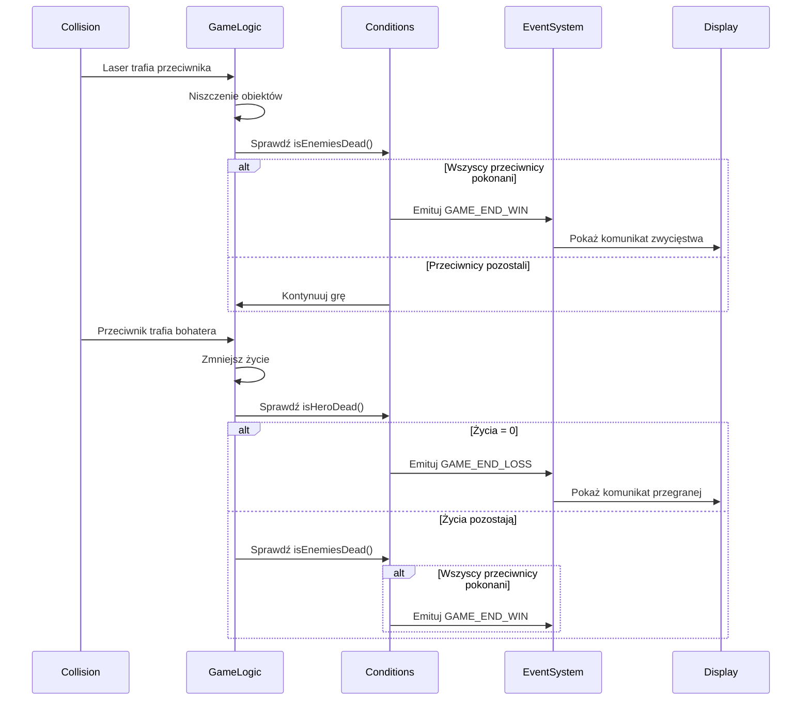
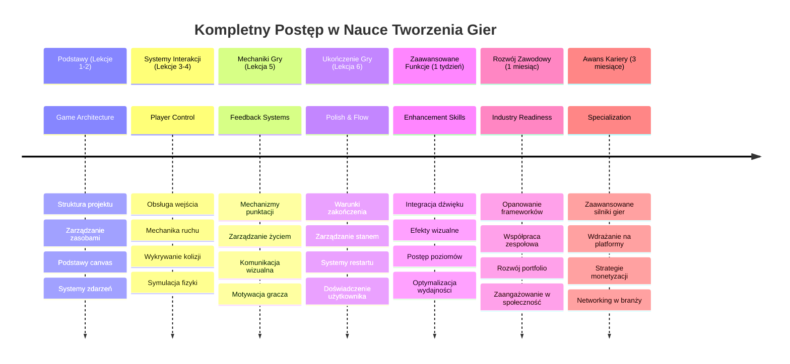

<!--
CO_OP_TRANSLATOR_METADATA:
{
  "original_hash": "a4b78043f4d64bf3ee24e0689b8b391d",
  "translation_date": "2026-01-06T19:12:27+00:00",
  "source_file": "6-space-game/6-end-condition/README.md",
  "language_code": "pl"
}
-->
# Build a Space Game Part 6: Koniec i Restart


Każda świetna gra potrzebuje jasnych warunków zakończenia i płynnego mechanizmu restartu. Zbudowałeś imponującą kosmiczną grę z ruchem, walką i punktacją – teraz czas dodać ostatnie elementy, które sprawiają, że gra poczuje się kompletna.

Twoja gra obecnie działa bez końca, jak sondy Voyager, które NASA wystrzeliło w 1977 roku – wciąż przemierzają przestrzeń kosmiczną dekady później. Choć to dobrze się sprawdza w eksploracji kosmosu, gry potrzebują zdefiniowanych punktów końcowych, aby tworzyć satysfakcjonujące doświadczenia.

Dziś zaimplementujemy właściwe warunki wygranej/przegranej oraz system restartu. Po zakończeniu tej lekcji będziesz mieć dopracowaną grę, którą gracze mogą ukończyć i ponownie zagrać, tak jak klasyczne gry arcade, które ukształtowały medium.


## Quiz przed wykładem

[Quiz przed wykładem](https://ff-quizzes.netlify.app/web/quiz/39)

## Zrozumienie warunków zakończenia gry

Kiedy powinna się zakończyć twoja gra? To podstawowe pytanie kształtuje projektowanie gier od czasów wczesnych automatów arcade. Pac-Man kończy się, gdy zostaniesz złapany przez duchy lub zbierzesz wszystkie kropki, a Space Invaders, gdy kosmici dotrą do dołu lub ich wszystkich zniszczysz.

Jako twórca gry, definiujesz warunki zwycięstwa i porażki. Dla naszej kosmicznej gry oto sprawdzone podejścia, które tworzą angażującą rozgrywkę:


- **Zniszczono `N` wrogich statków**: Często, jeśli dzielisz grę na różne poziomy, musisz zniszczyć `N` wrogich statków, aby zakończyć poziom
- **Twój statek został zniszczony**: Są gry, w których przegrywasz, gdy twój statek zostaje zniszczony. Innym powszechnym rozwiązaniem jest posiadanie życia. Za każdym razem, gdy twój statek zostaje zniszczony, tracisz jedno życie. Po utracie wszystkich żyć przegrywasz grę.
- **Zebrałeś `N` punktów**: Innym popularnym warunkiem zakończenia jest zebranie określonej liczby punktów. Sposób zdobywania punktów zależy od ciebie, ale często przypisuje się punkty za różne działania, jak zniszczenie wrogiego statku lub zebranie przedmiotów upuszczonych po zniszczeniu.
- **Ukończenie poziomu**: Może to obejmować kilka warunków, takich jak zniszczenie `X` wrogich statków, zebranie `Y` punktów lub zdobycie konkretnego przedmiotu.

## Implementacja funkcji restartu gry

Dobre gry zachęcają do ponownej rozgrywki dzięki płynnym mechanizmom restartu. Gdy gracze ukończą grę (lub przegrają), często chcą spróbować jeszcze raz – aby pobić swój wynik lub poprawić wynik.


Tetris idealnie to ilustruje: gdy twoje klocki dotrą do góry, możesz od razu zacząć nową grę bez poruszania się po złożonych menu. Zbudujemy podobny system restartu, który czysto zresetuje stan gry i szybko pozwoli graczom powrócić do akcji.

✅ **Refleksja**: Pomyśl o grach, w które grałeś. W jakich warunkach się kończą i jak jesteś zachęcany do restartu? Co sprawia, że restartowanie jest płynne, a kiedy frustruje?

## Co zbudujesz

Zaimplementujesz ostatnie funkcje, które przekształcą twój projekt w pełne doświadczenie gry. Te elementy wyróżniają dopracowane gry od podstawowych prototypów.

**Dziś dodajemy:**

1. **Warunek zwycięstwa**: Zniszcz wszystkich wrogów i odbierz właściwe świętowanie (zasłużyłeś na to!)
2. **Warunek porażki**: Stracisz wszystkie życia i staniesz przed ekranem przegranej
3. **Mechanizm restartu**: Naciśnij Enter, by zacząć od nowa – bo jedna gra to za mało
4. **Zarządzanie stanem**: Za każdym razem czysta karta – bez pozostałych wrogów ani dziwnych błędów po poprzedniej grze

## Rozpoczęcie pracy

Przygotujmy twoje środowisko programistyczne. Powinieneś mieć wszystkie pliki swojej gry kosmicznej z poprzednich lekcji.

**Twój projekt powinien wyglądać mniej więcej tak:**

```bash
-| assets
  -| enemyShip.png
  -| player.png
  -| laserRed.png
  -| life.png
-| index.html
-| app.js
-| package.json
```

**Uruchom serwer deweloperski:**

```bash
cd your-work
npm start
```

**To polecenie:**
- Uruchamia lokalny serwer na `http://localhost:5000`
- Poprawnie serwuje twoje pliki
- Automatycznie odświeża się przy wprowadzaniu zmian

Otwórz w przeglądarce `http://localhost:5000` i sprawdź, że gra działa. Powinieneś móc się poruszać, strzelać i wchodzić w interakcje z wrogami. Po potwierdzeniu możemy przejść do implementacji.

> 💡 **Pro Tip:** Aby uniknąć ostrzeżeń w Visual Studio Code, zadeklaruj `gameLoopId` na początku pliku jako `let gameLoopId;` zamiast deklarować go wewnątrz funkcji `window.onload`. To zgodne z nowoczesnymi najlepszymi praktykami deklarowania zmiennych w JavaScript.


## Kroki implementacji

### Krok 1: Utwórz funkcje śledzące warunki zakończenia

Potrzebujemy funkcji do monitorowania, kiedy gra powinna się zakończyć. Jak czujniki na Międzynarodowej Stacji Kosmicznej, które ciągle monitorują krytyczne systemy, te funkcje będą nieustannie sprawdzać stan gry.

```javascript
function isHeroDead() {
  return hero.life <= 0;
}

function isEnemiesDead() {
  const enemies = gameObjects.filter((go) => go.type === "Enemy" && !go.dead);
  return enemies.length === 0;
}
```

**Co się dzieje pod maską:**
- **Sprawdza**, czy nasz bohater ma jeszcze życie (auć!)
- **Zlicza**, ile wrogów wciąż żyje i walczy
- **Zwraca** `true`, jeśli pole bitwy jest wolne od wrogów
- **Używa** prostej logiki prawda/fałsz, by utrzymać prostotę
- **Przesiewa** wszystkie obiekty gry, aby znaleźć ocalałych

### Krok 2: Zaktualizuj obsługę zdarzeń dla warunków zakończenia

Teraz połączymy te sprawdzenia z systemem zdarzeń gry. Za każdym razem, gdy dojdzie do kolizji, gra oceni, czy to warunek zakończenia. Tworzy to natychmiastową reakcję na kluczowe wydarzenia w grze.


```javascript
eventEmitter.on(Messages.COLLISION_ENEMY_LASER, (_, { first, second }) => {
    first.dead = true;
    second.dead = true;
    hero.incrementPoints();

    if (isEnemiesDead()) {
      eventEmitter.emit(Messages.GAME_END_WIN);
    }
});

eventEmitter.on(Messages.COLLISION_ENEMY_HERO, (_, { enemy }) => {
    enemy.dead = true;
    hero.decrementLife();
    if (isHeroDead())  {
      eventEmitter.emit(Messages.GAME_END_LOSS);
      return; // strata przed zwycięstwem
    }
    if (isEnemiesDead()) {
      eventEmitter.emit(Messages.GAME_END_WIN);
    }
});

eventEmitter.on(Messages.GAME_END_WIN, () => {
    endGame(true);
});
  
eventEmitter.on(Messages.GAME_END_LOSS, () => {
  endGame(false);
});
```

**Co się tu dzieje:**
- **Laser trafia w wroga**: Oboje znikają, otrzymujesz punkty i sprawdzamy, czy wygrałeś
- **Wróg trafia w ciebie**: Tracisz życie, sprawdzamy, czy nadal żyjesz
- **Inteligentna kolejność**: Najpierw sprawdzamy porażkę (nikt nie chce wygrać i przegrać jednocześnie!)
- **Natychmiastowe reakcje**: Gdy dzieje się coś ważnego, gra o tym wie od razu

### Krok 3: Dodaj nowe stałe wiadomości

Musisz dodać nowe typy komunikatów do obiektu stałych `Messages`. Te stałe pomagają zachować spójność i zapobiec literówkom w systemie zdarzeń.

```javascript
GAME_END_LOSS: "GAME_END_LOSS",
GAME_END_WIN: "GAME_END_WIN",
```

**Powyżej:**
- **Dodaliśmy** stałe dotyczące zakończenia gry, by zachować spójność
- **Używamy** opisowych nazw jasno wskazujących cel zdarzenia
- **Zachowujemy** istniejącą konwencję nazewnictwa typów komunikatów

### Krok 4: Zaimplementuj sterowanie restartem

Dodasz teraz obsługę klawiatury, która pozwoli graczom zrestartować grę. Klawisz Enter jest naturalnym wyborem, ponieważ często kojarzy się z potwierdzaniem akcji i rozpoczynaniem nowych gier.

**Dodaj wykrywanie klawisza Enter do istniejącego nasłuchiwania zdarzenia keydown:**

```javascript
else if(evt.key === "Enter") {
   eventEmitter.emit(Messages.KEY_EVENT_ENTER);
}
```

**Dodaj nową stałą wiadomość:**

```javascript
KEY_EVENT_ENTER: "KEY_EVENT_ENTER",
```

**Co warto wiedzieć:**
- **Rozszerza** istniejący system obsługi zdarzeń klawiatury
- **Używa** klawisza Enter jako wyzwalacza restartu dla intuicyjnego doświadczenia
- **Wysyła** niestandardowe zdarzenie, na które inne części gry mogą reagować
- **Zachowuje** ten sam wzór co inne sterowanie klawiatury

### Krok 5: Stwórz system wyświetlania komunikatów

Twoja gra musi jasno komunikować wyniki graczom. Stworzymy system wiadomości wyświetlający stany zwycięstwa i przegranej za pomocą tekstu z kolorami, podobnie jak w terminalach starych systemów, gdzie zielony oznacza sukces, a czerwony błąd.

**Stwórz funkcję `displayMessage()`:**

```javascript
function displayMessage(message, color = "red") {
  ctx.font = "30px Arial";
  ctx.fillStyle = color;
  ctx.textAlign = "center";
  ctx.fillText(message, canvas.width / 2, canvas.height / 2);
}
```

**Po kolei, co się dzieje:**
- **Ustawia** rozmiar i krój czcionki dla czytelnego tekstu
- **Zastosowuje** parametr koloru z domyślnym „czerwonym” dla ostrzeżeń
- **Centruje** tekst poziomo i pionowo na kanwie
- **Wykorzystuje** nowoczesne parametry domyślne JavaScript dla elastyczności
- **Korzysta** z kontekstu 2D canvasa do bezpośredniego renderowania tekstu

**Stwórz funkcję `endGame()`:**

```javascript
function endGame(win) {
  clearInterval(gameLoopId);

  // Ustaw opóźnienie, aby upewnić się, że wszystkie oczekujące renderowania zostaną zakończone
  setTimeout(() => {
    ctx.clearRect(0, 0, canvas.width, canvas.height);
    ctx.fillStyle = "black";
    ctx.fillRect(0, 0, canvas.width, canvas.height);
    if (win) {
      displayMessage(
        "Victory!!! Pew Pew... - Press [Enter] to start a new game Captain Pew Pew",
        "green"
      );
    } else {
      displayMessage(
        "You died !!! Press [Enter] to start a new game Captain Pew Pew"
      );
    }
  }, 200)  
}
```

**Co robi ta funkcja:**
- **Zatrzymuje** wszystko – już żadnych ruchów statków czy laserów
- **Robi** krótką pauzę (200ms), żeby ostatnia klatka się narysowała
- **Czyści** ekran i maluje go na czarno dla dramatyzmu
- **Wyświetla** różne komunikaty dla zwycięzców i przegranych
- **Koloruje** wiadomości – zielony dla dobrego, czerwony dla... no, nie tak dobrego
- **Informuje** graczy, jak wskoczyć z powrotem do gry

### 🔄 **Pedagogiczna weryfikacja**
**Zarządzanie stanem gry**: Przed implementacją resetu upewnij się, że rozumiesz:
- ✅ Jak warunki zakończenia tworzą jasne cele rozgrywki
- ✅ Dlaczego wizualna informacja zwrotna jest kluczowa dla zrozumienia przez gracza
- ✅ Jak ważne jest odpowiednie czyszczenie, by zapobiec wyciekom pamięci
- ✅ Jak architektura zdarzeniowa umożliwia czyste przejścia stanów

**Szybki test wiedzy**: Co by się stało, gdybyś nie usunął nasłuchiwaczy zdarzeń podczas resetu?
*Odpowiedź: Wycieki pamięci i dublujące się obsługi zdarzeń powodujące nieprzewidywalne zachowanie*

**Zasady projektowania gier**: Wdrażasz teraz:
- **Jasne cele**: Gracze dokładnie wiedzą, co oznacza sukces i porażka
- **Natychmiastową informację zwrotną**: Zmiany stanu gry są komunikowane od razu
- **Kontrolę użytkownika**: Gracze mogą restartować grę, kiedy chcą
- **Niezawodność systemu**: Odpowiednie czyszczenie zapobiega błędom i spadkom wydajności

### Krok 6: Implementacja funkcji restartu gry

System resetu musi całkowicie wyczyścić bieżący stan gry i zainicjalizować nową sesję gry. Zapewnia to graczom czysty start bez pozostałości danych z poprzedniej gry.

**Stwórz funkcję `resetGame()`:**

```javascript
function resetGame() {
  if (gameLoopId) {
    clearInterval(gameLoopId);
    eventEmitter.clear();
    initGame();
    gameLoopId = setInterval(() => {
      ctx.clearRect(0, 0, canvas.width, canvas.height);
      ctx.fillStyle = "black";
      ctx.fillRect(0, 0, canvas.width, canvas.height);
      drawPoints();
      drawLife();
      updateGameObjects();
      drawGameObjects(ctx);
    }, 100);
  }
}
```

**Zrozum każdy element:**
- **Sprawdza**, czy pętla gry jest uruchomiona przed resetem
- **Czyści** istniejącą pętlę gry, by zatrzymać wszystkie działania
- **Usuwa** wszystkie nasłuchiwacze zdarzeń, by zapobiec wyciekom pamięci
- **Reinicjuje** stan gry z nowymi obiektami i zmiennymi
- **Uruchamia** nową pętlę gry ze wszystkimi potrzebnymi funkcjami
- **Utrzymuje** 100ms odstęp dla spójnej wydajności gry

**Dodaj obsługę klawisza Enter do funkcji `initGame()`:**

```javascript
eventEmitter.on(Messages.KEY_EVENT_ENTER, () => {
  resetGame();
});
```

**Dodaj metodę `clear()` do swojej klasy EventEmitter:**

```javascript
clear() {
  this.listeners = {};
}
```

**Kluczowe punkty do zapamiętania:**
- **Łączy** naciśnięcie klawisza Enter z funkcją restartu gry
- **Rejestruje** ten nasłuchiwacz podczas inicjalizacji gry
- **Zapewnia** czysty sposób usuwania wszystkich nasłuchiwaczy podczas resetu
- **Zapobiega** wyciekom pamięci przez czyszczenie obsługi zdarzeń między grami
- **Resetuje** obiekt nasłuchiwaczy do stanu pustego dla świeżej inicjalizacji

## Gratulacje! 🎉

👽 💥 🚀 Udało ci się zbudować kompletną grę od podstaw. Jak programiści, którzy stworzyli pierwsze gry wideo w latach 70., przekształciłeś linijki kodu w interaktywne doświadczenie z właściwą mechaniką i informacją zwrotną dla użytkownika. 🚀 💥 👽

**Osiągnąłeś:**
- **Implementację** kompletnych warunków wygranej i przegranej z informacją zwrotną dla gracza
- **Stworzenie** płynnego systemu restartu dla ciągłej rozgrywki
- **Zaprojektowanie** jasnej komunikacji wizualnej dla stanów gry
- **Zarządzanie** złożonymi przejściami i czyszczeniem stanu gry
- **Złożenie** wszystkich komponentów w spójną, grywalną całość

### 🔄 **Pedagogiczna weryfikacja**
**Kompletny system tworzenia gry**: Świętuj mistrzostwo pełnego cyklu tworzenia gry:
- ✅ Jak warunki zakończenia tworzą satysfakcjonujące doświadczenia gracza?
- ✅ Dlaczego właściwe zarządzanie stanem jest kluczowe dla stabilności gry?
- ✅ Jak wizualna informacja zwrotna wzmacnia rozumienie przez gracza?
- ✅ Jaką rolę odgrywa system restartu w zatrzymaniu gracza przy grze?

**Mistrzostwo systemu**: Twoja kompletna gra demonstruje:
- **Full-stack Game Development**: Od grafiki po wejścia i zarządzanie stanem
- **Profesjonalną architekturę**: Systemy zdarzeń z odpowiednim czyszczeniem
- **Projektowanie UX**: Jasna informacja i intuicyjne sterowanie
- **Optymalizację wydajności**: Efektywne renderowanie i zarządzanie pamięcią
- **Dopracowanie i kompletność**: Wszystkie detale, które czynią grę dopracowaną

**Umiejętności gotowe dla branży**: Zaimplementowałeś:
- **Architekturę pętli gry**: Systemy czasu rzeczywistego ze stałą wydajnością
- **Programowanie zdarzeniowe**: Rozdzielone systemy skalujące się efektywnie
- **Zarządzanie stanem**: Złożone zarządzanie danymi i cyklem życia
- **Projektowanie interfejsu użytkownika**: Jasna komunikacja i responsywne sterowanie
- **Testowanie i debugowanie**: Iteracyjny rozwój i rozwiązywanie problemów

### ⚡ **Co możesz zrobić w następnych 5 minutach**
- [ ] Zagraj w swoją kompletną grę i przetestuj wszystkie warunki zwycięstwa i porażki
- [ ] Eksperymentuj z różnymi parametrami warunków zakończenia
- [ ] Dodaj instrukcje console.log, by śledzić zmiany stanu gry
- [ ] Podziel się grą z przyjaciółmi i zbierz opinie

### 🎯 **Co możesz osiągnąć w ciągu tej godziny**
- [ ] Ukończ quiz po lekcji i zastanów się nad swoją podróżą tworzenia gry
- [ ] Dodaj efekty dźwiękowe na stany zwycięstwa i porażki
- [ ] Zaimplementuj dodatkowe warunki zakończenia, jak limity czasowe lub cele bonusowe
- [ ] Stwórz różne poziomy trudności z różną liczbą wrogów
- [ ] Dopracuj wizualną prezentację, używając lepszych czcionek i kolorów

### 📅 **Twój tygodniowy plan mistrzostwa w tworzeniu gry**
- [ ] Ukończ rozbudowaną kosmiczną grę z wieloma poziomami i postępem
- [ ] Dodaj zaawansowane funkcje, jak ulepszenia, różne typy wrogów i specjalną broń
- [ ] Stwórz system najlepszych wyników z przechowywaniem danych
- [ ] Zaprojektuj interfejsy użytkownika dla menu, ustawień i opcji gry
- [ ] Optymalizuj wydajność dla różnych urządzeń i przeglądarek
- [ ] Wdróż grę online i udostępnij ją społeczności
### 🌟 **Twój miesięczny rozwój kariery w tworzeniu gier**
- [ ] Stwórz kilka kompletnych gier eksplorujących różne gatunki i mechaniki
- [ ] Naucz się zaawansowanych frameworków do tworzenia gier, takich jak Phaser lub Three.js
- [ ] Wnieś wkład do otwartych projektów związanych z tworzeniem gier
- [ ] Studiuj zasady projektowania gier i psychologię graczy
- [ ] Stwórz portfolio prezentujące Twoje umiejętności w tworzeniu gier
- [ ] Nawiąż kontakt ze społecznością twórców gier i kontynuuj naukę

## 🎯 Twój kompletny harmonogram opanowania tworzenia gier


### 🛠️ Podsumowanie Twojego kompletu narzędzi do tworzenia gier

Po ukończeniu całej serii o grach kosmicznych, opanowałeś teraz:
- **Architektura gry**: systemy sterowane zdarzeniami, pętle gry i zarządzanie stanem
- **Programowanie grafiki**: API Canvas, renderowanie sprite'ów i efekty wizualne
- **Systemy wejścia**: obsługa klawiatury, wykrywanie kolizji i responsywne sterowanie
- **Projektowanie gier**: feedback dla gracza, systemy progresji i mechaniki angażujące
- **Optymalizacja wydajności**: efektywne renderowanie, zarządzanie pamięcią i kontrola liczby klatek
- **Doświadczenie użytkownika**: klarowna komunikacja, intuicyjne sterowanie i detale wykończenia
- **Profesjonalne wzorce**: czysty kod, techniki debugowania i organizacja projektu

**Zastosowania w praktyce**: Twoje umiejętności tworzenia gier mają bezpośrednie zastosowanie w:
- **Interaktywne aplikacje webowe**: dynamiczne interfejsy i systemy czasu rzeczywistego
- **Wizualizacja danych**: animowane wykresy i interaktywna grafika
- **Technologie edukacyjne**: grywalizacja i angażujące doświadczenia nauki
- **Programowanie mobilne**: interakcje dotykowe i optymalizacja wydajności
- **Oprogramowanie symulacyjne**: silniki fizyki i modele czasu rzeczywistego
- **Branże kreatywne**: interaktywna sztuka, rozrywka i doświadczenia cyfrowe

**Zdobyte umiejętności zawodowe**: Potrafisz teraz:
- **Projektować** złożone interaktywne systemy od podstaw
- **Debugować** aplikacje czasu rzeczywistego stosując metody systematyczne
- **Optymalizować** wydajność dla płynnych doświadczeń użytkownika
- **Projektować** angażujące interfejsy i wzorce interakcji
- **Współpracować** efektywnie przy projektach technicznych z odpowiednią organizacją kodu

**Opanowane koncepcje tworzenia gier**:
- **Systemy czasu rzeczywistego**: pętle gry, zarządzanie liczbą klatek i wydajność
- **Architektura oparta na zdarzeniach**: systemy luźno powiązane i przesyłanie komunikatów
- **Zarządzanie stanem**: obsługa złożonych danych i cykl życia
- **Programowanie interfejsu użytkownika**: grafika Canvas i responsywny design
- **Teoria projektowania gier**: psychologia gracza oraz mechaniki zaangażowania

**Kolejny poziom**: Jesteś gotowy do eksploracji zaawansowanych frameworków do gier, grafiki 3D, systemów wieloosobowych lub do przejścia do profesjonalnych ról w tworzeniu gier!

🌟 **Osiągnięcie odblokowane**: Ukończyłeś pełną drogę tworzenia gry i zbudowałeś profesjonalnej jakości interaktywne doświadczenie od podstaw!

**Witamy w społeczności twórców gier!** 🎮✨

## Wyzwanie GitHub Copilot Agent 🚀

Użyj trybu Agenta, aby wykonać następujące wyzwanie:

**Opis:** Ulepsz grę kosmiczną, implementując system progresji poziomów z rosnącym stopniem trudności i bonusowymi funkcjami.

**Zadanie:** Stwórz system wielu poziomów gry kosmicznej, gdzie każdy poziom ma więcej wrogich statków o zwiększonej prędkości i zdrowiu. Dodaj mnożnik punktów, który wzrasta z każdym poziomem, oraz zaimplementuj ulepszenia (np. szybki ogień lub tarcza), które pojawiają się losowo po zniszczeniu przeciwników. Dodaj bonus za ukończenie poziomu i wyświetl aktualny poziom na ekranie obok istniejącej punktacji i liczby żyć.

Dowiedz się więcej o [trybie agenta](https://code.visualstudio.com/blogs/2025/02/24/introducing-copilot-agent-mode).

## 🚀 Opcjonalne wyzwanie ulepszające

**Dodaj dźwięk do swojej gry**: Ulepsz swoje doświadczenie gry, implementując efekty dźwiękowe! Rozważ dodanie dźwięków dla:

- **Wystrzałów laserowych** gdy gracz strzela
- **Zniszczenia wrogów** gdy statki zostają trafione
- **Uszkodzeń bohatera** gdy gracz otrzymuje trafienia
- **Muzyki zwycięstwa** gdy gra zostanie wygrana
- **Dźwięku porażki** gdy gra zostanie przegrana

**Przykład implementacji dźwięku:**

```javascript
// Utwórz obiekty dźwięku
const laserSound = new Audio('assets/laser.wav');
const explosionSound = new Audio('assets/explosion.wav');

// Odtwarzaj dźwięki podczas wydarzeń gry
function playLaserSound() {
  laserSound.currentTime = 0; // Resetuj do początku
  laserSound.play();
}
```

**Co musisz wiedzieć:**
- **Tworzy** obiekty Audio dla różnych efektów dźwiękowych
- **Resetuje** `currentTime`, aby umożliwić szybkie powtarzanie dźwięków
- **Obsługuje** politykę automatycznego odtwarzania przeglądarek przez wywołanie dźwięków z interakcji użytkownika
- **Zarządza** głośnością i czasem odtwarzania dla lepszego doświadczenia gry

> 💡 **Źródło nauki**: Eksploruj ten [audio sandbox](https://www.w3schools.com/jsref/tryit.asp?filename=tryjsref_audio_play), aby dowiedzieć się więcej o implementacji dźwięku w grach JavaScript.

## Quiz po wykładzie

[Quiz po wykładzie](https://ff-quizzes.netlify.app/web/quiz/40)

## Przegląd i samodzielna nauka

Twoim zadaniem jest stworzenie nowej przykładowej gry, więc zapoznaj się z kilkoma ciekawymi grami, aby zobaczyć, jaki rodzaj gry chciałbyś stworzyć.

## Zadanie

[Stwórz przykładową grę](assignment.md)

---

<!-- CO-OP TRANSLATOR DISCLAIMER START -->
**Zastrzeżenie**:  
Niniejszy dokument został przetłumaczony przy użyciu automatycznej usługi tłumaczeniowej [Co-op Translator](https://github.com/Azure/co-op-translator). Mimo że dokładamy starań, aby tłumaczenie było jak najdokładniejsze, prosimy pamiętać, że tłumaczenia automatyczne mogą zawierać błędy lub nieścisłości. Oryginalny dokument w języku źródłowym powinien być uważany za źródło autorytatywne. W przypadku istotnych informacji zalecane jest skorzystanie z profesjonalnego tłumaczenia wykonanego przez człowieka. Nie ponosimy odpowiedzialności za jakiekolwiek nieporozumienia lub błędne interpretacje wynikające z korzystania z tego tłumaczenia.
<!-- CO-OP TRANSLATOR DISCLAIMER END -->