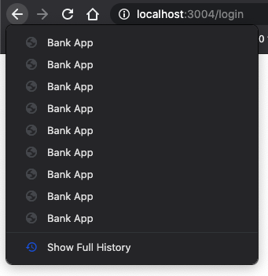

<!--
CO_OP_TRANSLATOR_METADATA:
{
  "original_hash": "8a07db14e75ac62f013b7de5df05981d",
  "translation_date": "2025-08-29T16:25:39+00:00",
  "source_file": "7-bank-project/1-template-route/README.md",
  "language_code": "pl"
}
-->
# Budowa aplikacji bankowej, część 1: Szablony HTML i trasy w aplikacji webowej

## Quiz przed wykładem

[Quiz przed wykładem](https://ff-quizzes.netlify.app/web/quiz/41)

### Wprowadzenie

Od czasu pojawienia się JavaScriptu w przeglądarkach, strony internetowe stają się bardziej interaktywne i złożone niż kiedykolwiek wcześniej. Technologie webowe są obecnie powszechnie wykorzystywane do tworzenia w pełni funkcjonalnych aplikacji działających bezpośrednio w przeglądarce, które nazywamy [aplikacjami webowymi](https://en.wikipedia.org/wiki/Web_application). Ponieważ aplikacje webowe są bardzo interaktywne, użytkownicy nie chcą czekać na pełne przeładowanie strony za każdym razem, gdy wykonują jakąś akcję. Dlatego JavaScript jest używany do bezpośredniego aktualizowania HTML za pomocą DOM, aby zapewnić płynniejsze doświadczenie użytkownika.

W tej lekcji położymy fundamenty do stworzenia aplikacji bankowej, wykorzystując szablony HTML do tworzenia wielu ekranów, które mogą być wyświetlane i aktualizowane bez konieczności przeładowywania całej strony HTML.

### Wymagania wstępne

Potrzebujesz lokalnego serwera webowego, aby przetestować aplikację webową, którą stworzymy w tej lekcji. Jeśli go nie masz, możesz zainstalować [Node.js](https://nodejs.org) i użyć polecenia `npx lite-server` w folderze swojego projektu. Utworzy to lokalny serwer webowy i otworzy Twoją aplikację w przeglądarce.

### Przygotowanie

Na swoim komputerze utwórz folder o nazwie `bank` z plikiem `index.html` w środku. Zaczniemy od tego [szablonu HTML](https://en.wikipedia.org/wiki/Boilerplate_code):

```html
<!DOCTYPE html>
<html lang="en">
  <head>
    <meta charset="UTF-8">
    <meta name="viewport" content="width=device-width, initial-scale=1.0">
    <title>Bank App</title>
  </head>
  <body>
    <!-- This is where you'll work -->
  </body>
</html>
```

---

## Szablony HTML

Jeśli chcesz stworzyć wiele ekranów dla strony internetowej, jednym z rozwiązań byłoby utworzenie jednego pliku HTML dla każdego ekranu, który chcesz wyświetlić. Jednak to rozwiązanie ma pewne niedogodności:

- Musisz przeładować cały HTML podczas przełączania ekranu, co może być wolne.
- Trudno jest udostępniać dane między różnymi ekranami.

Innym podejściem jest posiadanie tylko jednego pliku HTML i definiowanie wielu [szablonów HTML](https://developer.mozilla.org/docs/Web/HTML/Element/template) za pomocą elementu `<template>`. Szablon to wielokrotnego użytku blok HTML, który nie jest wyświetlany przez przeglądarkę i musi być zainicjowany w czasie rzeczywistym za pomocą JavaScriptu.

### Zadanie

Stworzymy aplikację bankową z dwoma ekranami: stroną logowania i panelem użytkownika. Najpierw dodajmy w sekcji HTML element zastępczy, którego użyjemy do inicjowania różnych ekranów naszej aplikacji:

```html
<div id="app">Loading...</div>
```

Nadajemy mu `id`, aby łatwiej było go zlokalizować później za pomocą JavaScriptu.

> Wskazówka: ponieważ zawartość tego elementu będzie zastępowana, możemy umieścić w nim komunikat lub wskaźnik ładowania, który będzie wyświetlany podczas ładowania aplikacji.

Następnie dodajmy poniżej szablon HTML dla strony logowania. Na razie umieścimy tam tylko tytuł i sekcję zawierającą link, który wykorzystamy do nawigacji.

```html
<template id="login">
  <h1>Bank App</h1>
  <section>
    <a href="/dashboard">Login</a>
  </section>
</template>
```

Potem dodamy kolejny szablon HTML dla strony panelu użytkownika. Ta strona będzie zawierać różne sekcje:

- Nagłówek z tytułem i linkiem do wylogowania
- Aktualne saldo konta bankowego
- Listę transakcji wyświetlaną w tabeli

```html
<template id="dashboard">
  <header>
    <h1>Bank App</h1>
    <a href="/login">Logout</a>
  </header>
  <section>
    Balance: 100$
  </section>
  <section>
    <h2>Transactions</h2>
    <table>
      <thead>
        <tr>
          <th>Date</th>
          <th>Object</th>
          <th>Amount</th>
        </tr>
      </thead>
      <tbody></tbody>
    </table>
  </section>
</template>
```

> Wskazówka: podczas tworzenia szablonów HTML, jeśli chcesz zobaczyć, jak będą wyglądać, możesz zakomentować linie `<template>` i `</template>` otaczając je `<!-- -->`.

✅ Dlaczego używamy atrybutów `id` w szablonach? Czy moglibyśmy użyć czegoś innego, na przykład klas?

## Wyświetlanie szablonów za pomocą JavaScriptu

Jeśli spróbujesz otworzyć swój obecny plik HTML w przeglądarce, zobaczysz, że utknął na wyświetlaniu `Loading...`. Dzieje się tak, ponieważ musimy dodać kod JavaScript, aby zainicjować i wyświetlić szablony HTML.

Inicjowanie szablonu zazwyczaj odbywa się w 3 krokach:

1. Pobranie elementu szablonu w DOM, na przykład za pomocą [`document.getElementById`](https://developer.mozilla.org/docs/Web/API/Document/getElementById).
2. Skopiowanie elementu szablonu za pomocą [`cloneNode`](https://developer.mozilla.org/docs/Web/API/Node/cloneNode).
3. Dołączenie go do DOM pod widocznym elementem, na przykład za pomocą [`appendChild`](https://developer.mozilla.org/docs/Web/API/Node/appendChild).

✅ Dlaczego musimy skopiować szablon przed dołączeniem go do DOM? Co by się stało, gdybyśmy pominęli ten krok?

### Zadanie

Utwórz nowy plik o nazwie `app.js` w folderze projektu i zaimportuj ten plik w sekcji `<head>` swojego HTML:

```html
<script src="app.js" defer></script>
```

Teraz w `app.js` utworzymy nową funkcję `updateRoute`:

```js
function updateRoute(templateId) {
  const template = document.getElementById(templateId);
  const view = template.content.cloneNode(true);
  const app = document.getElementById('app');
  app.innerHTML = '';
  app.appendChild(view);
}
```

To, co tutaj robimy, to dokładnie 3 kroki opisane powyżej. Inicjujemy szablon o `id` `templateId` i umieszczamy jego skopiowaną zawartość w naszym elemencie zastępczym aplikacji. Zauważ, że musimy użyć `cloneNode(true)`, aby skopiować całą strukturę szablonu.

Teraz wywołaj tę funkcję z jednym z szablonów i zobacz wynik.

```js
updateRoute('login');
```

✅ Jaki jest cel tego kodu `app.innerHTML = '';`? Co się dzieje bez niego?

## Tworzenie tras

W kontekście aplikacji webowej nazywamy *trasowaniem* zamiar mapowania **URL** na konkretne ekrany, które powinny być wyświetlane. Na stronie internetowej z wieloma plikami HTML dzieje się to automatycznie, ponieważ ścieżki plików są odzwierciedlone w URL. Na przykład, mając te pliki w folderze projektu:

```
mywebsite/index.html
mywebsite/login.html
mywebsite/admin/index.html
```

Jeśli utworzysz serwer webowy z `mywebsite` jako root, mapowanie URL będzie wyglądać tak:

```
https://site.com            --> mywebsite/index.html
https://site.com/login.html --> mywebsite/login.html
https://site.com/admin/     --> mywebsite/admin/index.html
```

Jednak w naszej aplikacji webowej używamy jednego pliku HTML zawierającego wszystkie ekrany, więc domyślne zachowanie nam nie pomoże. Musimy ręcznie stworzyć tę mapę i aktualizować wyświetlany szablon za pomocą JavaScriptu.

### Zadanie

Użyjemy prostego obiektu, aby zaimplementować [mapę](https://en.wikipedia.org/wiki/Associative_array) między ścieżkami URL a naszymi szablonami. Dodaj ten obiekt na początku swojego pliku `app.js`.

```js
const routes = {
  '/login': { templateId: 'login' },
  '/dashboard': { templateId: 'dashboard' },
};
```

Teraz zmodyfikujmy trochę funkcję `updateRoute`. Zamiast bezpośrednio przekazywać `templateId` jako argument, chcemy najpierw sprawdzić obecny URL, a następnie użyć naszej mapy, aby uzyskać odpowiadającą wartość `templateId`. Możemy użyć [`window.location.pathname`](https://developer.mozilla.org/docs/Web/API/Location/pathname), aby uzyskać tylko sekcję ścieżki z URL.

```js
function updateRoute() {
  const path = window.location.pathname;
  const route = routes[path];

  const template = document.getElementById(route.templateId);
  const view = template.content.cloneNode(true);
  const app = document.getElementById('app');
  app.innerHTML = '';
  app.appendChild(view);
}
```

Tutaj mapujemy zadeklarowane trasy na odpowiadające szablony. Możesz sprawdzić, czy działa poprawnie, zmieniając URL ręcznie w przeglądarce.

✅ Co się dzieje, jeśli wpiszesz nieznaną ścieżkę w URL? Jak moglibyśmy to rozwiązać?

## Dodawanie nawigacji

Kolejnym krokiem dla naszej aplikacji jest dodanie możliwości nawigacji między stronami bez konieczności ręcznego zmieniania URL. Oznacza to dwie rzeczy:

1. Aktualizowanie obecnego URL
2. Aktualizowanie wyświetlanego szablonu na podstawie nowego URL

Drugą częścią zajęliśmy się już za pomocą funkcji `updateRoute`, więc musimy wymyślić, jak zaktualizować obecny URL.

Musimy użyć JavaScriptu, a konkretnie [`history.pushState`](https://developer.mozilla.org/docs/Web/API/History/pushState), który pozwala na aktualizację URL i tworzenie nowego wpisu w historii przeglądania, bez przeładowywania HTML.

> Uwaga: Chociaż element HTML [`<a href>`](https://developer.mozilla.org/docs/Web/HTML/Element/a) może być używany samodzielnie do tworzenia hiperłączy do różnych URL, domyślnie powoduje przeładowanie HTML. Konieczne jest zapobieżenie temu zachowaniu podczas obsługi trasowania za pomocą niestandardowego JavaScriptu, używając funkcji `preventDefault()` na zdarzeniu kliknięcia.

### Zadanie

Utwórzmy nową funkcję, której możemy użyć do nawigacji w naszej aplikacji:

```js
function navigate(path) {
  window.history.pushState({}, path, path);
  updateRoute();
}
```

Ta metoda najpierw aktualizuje obecny URL na podstawie podanej ścieżki, a następnie aktualizuje szablon. Właściwość `window.location.origin` zwraca root URL, pozwalając nam na rekonstrukcję pełnego URL z podanej ścieżki.

Teraz, gdy mamy tę funkcję, możemy zająć się problemem, który mamy, jeśli ścieżka nie pasuje do żadnej zdefiniowanej trasy. Zmienimy funkcję `updateRoute`, dodając domyślne przejście do jednej z istniejących tras, jeśli nie możemy znaleźć dopasowania.

```js
function updateRoute() {
  const path = window.location.pathname;
  const route = routes[path];

  if (!route) {
    return navigate('/login');
  }

  ...
```

Jeśli trasa nie może zostać znaleziona, teraz przekierujemy na stronę `login`.

Teraz utwórzmy funkcję, aby uzyskać URL, gdy kliknięty zostanie link, i zapobiec domyślnemu zachowaniu przeglądarki:

```js
function onLinkClick(event) {
  event.preventDefault();
  navigate(event.target.href);
}
```

Uzupełnijmy system nawigacji, dodając powiązania do naszych linków *Login* i *Logout* w HTML.

```html
<a href="/dashboard" onclick="onLinkClick(event)">Login</a>
...
<a href="/login" onclick="onLinkClick(event)">Logout</a>
```

Obiekt `event` powyżej przechwytuje zdarzenie `click` i przekazuje je do naszej funkcji `onLinkClick`.

Używając atrybutu [`onclick`](https://developer.mozilla.org/docs/Web/API/GlobalEventHandlers/onclick), powiąż zdarzenie `click` z kodem JavaScript, tutaj wywołaniem funkcji `navigate()`.

Spróbuj kliknąć te linki, powinieneś teraz móc nawigować między różnymi ekranami swojej aplikacji.

✅ Metoda `history.pushState` jest częścią standardu HTML5 i zaimplementowana we [wszystkich nowoczesnych przeglądarkach](https://caniuse.com/?search=pushState). Jeśli tworzysz aplikację webową dla starszych przeglądarek, istnieje trik, którego możesz użyć zamiast tego API: użycie [hasha (`#`)](https://en.wikipedia.org/wiki/URI_fragment) przed ścieżką pozwala zaimplementować trasowanie, które działa z regularną nawigacją za pomocą kotwic i nie przeładowuje strony, ponieważ jego celem było tworzenie wewnętrznych linków w obrębie strony.

## Obsługa przycisków "wstecz" i "dalej" w przeglądarce

Użycie `history.pushState` tworzy nowe wpisy w historii nawigacji przeglądarki. Możesz to sprawdzić, przytrzymując *przycisk wstecz* swojej przeglądarki, powinno to wyświetlić coś takiego:



Jeśli spróbujesz kliknąć przycisk wstecz kilka razy, zobaczysz, że obecny URL się zmienia, a historia jest aktualizowana, ale ten sam szablon nadal jest wyświetlany.

Dzieje się tak, ponieważ aplikacja nie wie, że musimy wywołać `updateRoute()` za każdym razem, gdy historia się zmienia. Jeśli spojrzysz na [dokumentację `history.pushState`](https://developer.mozilla.org/docs/Web/API/History/pushState), zobaczysz, że jeśli stan się zmienia - oznacza to, że przeszliśmy do innego URL - wywoływane jest zdarzenie [`popstate`](https://developer.mozilla.org/docs/Web/API/Window/popstate_event). Użyjemy tego, aby rozwiązać ten problem.

### Zadanie

Aby upewnić się, że wyświetlany szablon jest aktualizowany, gdy historia przeglądarki się zmienia, dołączymy nową funkcję, która wywołuje `updateRoute()`. Zrobimy to na końcu naszego pliku `app.js`:

```js
window.onpopstate = () => updateRoute();
updateRoute();
```

> Uwaga: użyliśmy tutaj [funkcji strzałkowej](https://developer.mozilla.org/docs/Web/JavaScript/Reference/Functions/Arrow_functions), aby zadeklarować nasz handler zdarzenia `popstate` dla zwięzłości, ale zwykła funkcja działałaby tak samo.

Oto przypomnienie o funkcjach strzałkowych:

[](https://youtube.com/watch?v=OP6eEbOj2sc "Funkcje strzałkowe")

> 🎥 Kliknij obrazek powyżej, aby obejrzeć wideo o funkcjach strzałkowych.

Teraz spróbuj użyć przycisków "wstecz" i "dalej" w swojej przeglądarce i sprawdź, czy wyświetlana trasa jest teraz poprawnie aktualizowana.

---

## 🚀 Wyzwanie

Dodaj nowy szablon i trasę dla trzeciej strony, która pokazuje autorów tej aplikacji.

## Quiz po wykładzie

[Quiz po wykładzie](https://ff-quizzes.netlify.app/web/quiz/42)

## Przegląd i samodzielna nauka

Trasowanie jest jednym z zaskakująco trudnych aspektów tworzenia aplikacji webowych, szczególnie gdy web przechodzi od zachowań związanych z odświeżaniem strony do odświeżania w aplikacjach jednostronicowych (SPA). Przeczytaj trochę o [tym, jak usługa Azure Static Web App](https://docs.microsoft.com/azure/static-web-apps/routes/?WT.mc_id=academic-77807-sagibbon) obsługuje trasowanie. Czy potrafisz wyjaśnić, dlaczego niektóre decyzje opisane w tym dokumencie są konieczne?

## Zadanie

[Popraw trasowanie](assignment.md)

---

**Zastrzeżenie**:  
Ten dokument został przetłumaczony za pomocą usługi tłumaczenia AI [Co-op Translator](https://github.com/Azure/co-op-translator). Chociaż dokładamy wszelkich starań, aby zapewnić poprawność tłumaczenia, prosimy pamiętać, że automatyczne tłumaczenia mogą zawierać błędy lub nieścisłości. Oryginalny dokument w jego języku źródłowym powinien być uznawany za autorytatywne źródło. W przypadku informacji o kluczowym znaczeniu zaleca się skorzystanie z profesjonalnego tłumaczenia przez człowieka. Nie ponosimy odpowiedzialności za jakiekolwiek nieporozumienia lub błędne interpretacje wynikające z użycia tego tłumaczenia.