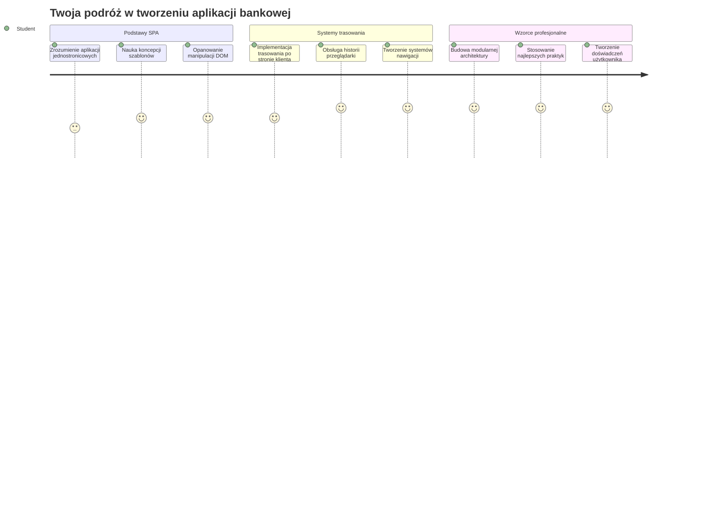
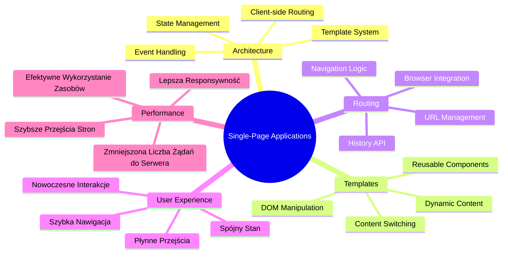
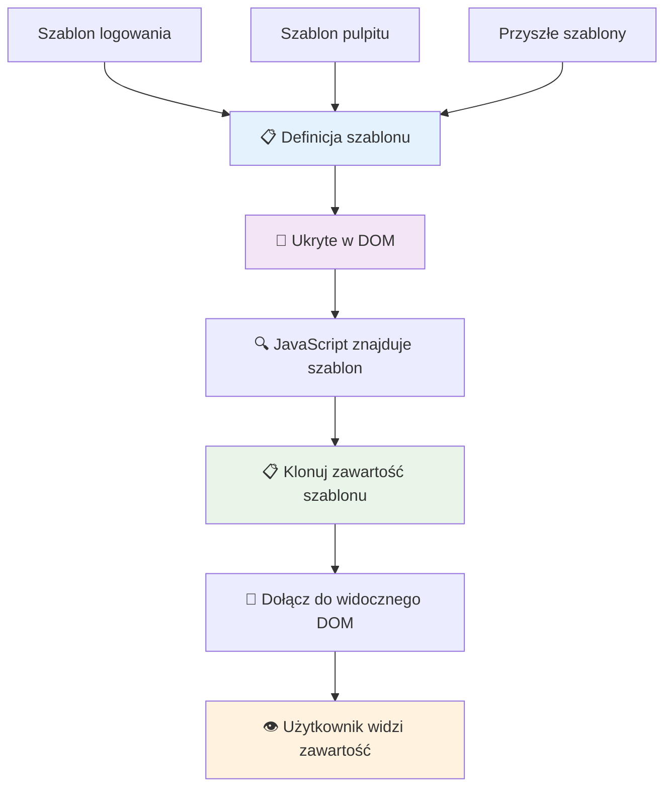
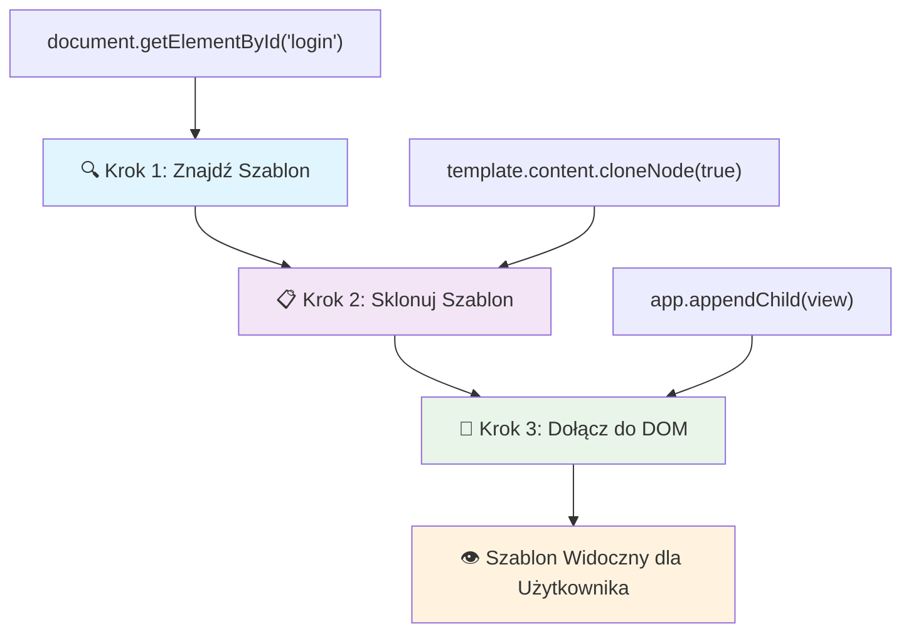
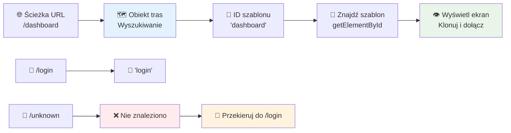
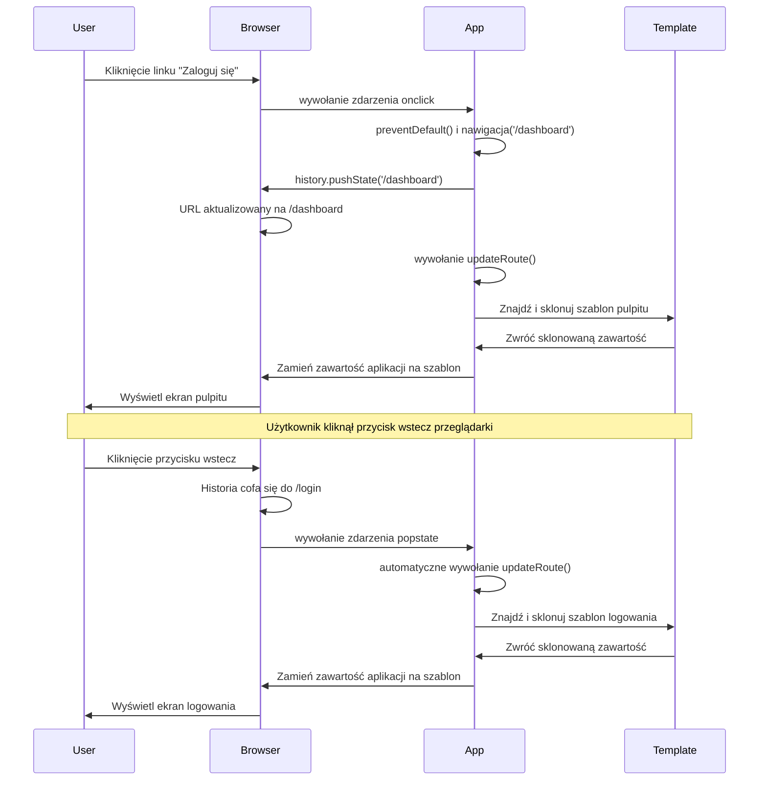
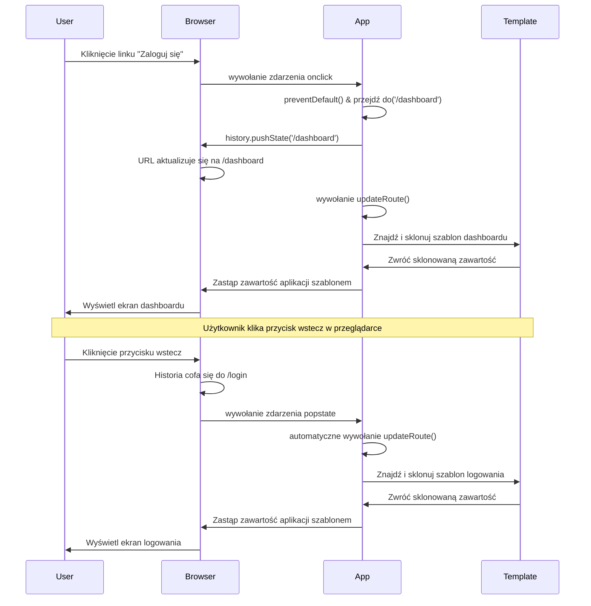
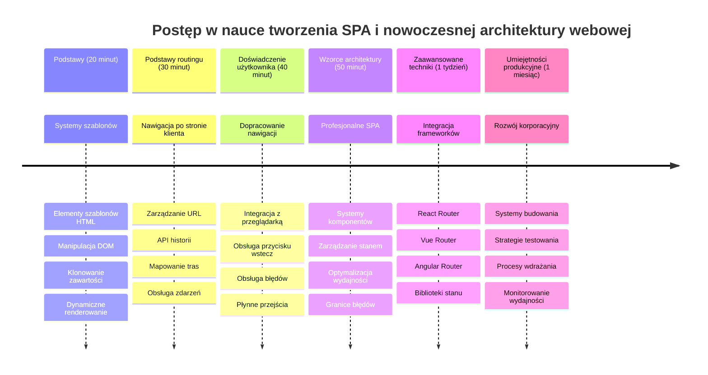

<!--
CO_OP_TRANSLATOR_METADATA:
{
  "original_hash": "351678bece18f07d9daa987a881fb062",
  "translation_date": "2026-01-06T19:32:56+00:00",
  "source_file": "7-bank-project/1-template-route/README.md",
  "language_code": "pl"
}
-->
# Zbuduj aplikację bankową Część 1: Szablony HTML i trasy w aplikacji internetowej


Kiedy komputer pokładowy Apollo 11 nawigował do księżyca w 1969 roku, musiał przełączać się między różnymi programami bez ponownego uruchamiania całego systemu. Nowoczesne aplikacje internetowe działają podobnie – zmieniają to, co widzisz, bez przeładowywania wszystkiego od początku. To tworzy płynne, responsywne doświadczenie, którego użytkownicy oczekują dziś.

W przeciwieństwie do tradycyjnych stron internetowych, które przeładowują całe strony przy każdej interakcji, nowoczesne aplikacje webowe aktualizują tylko te części, które wymagają zmiany. Takie podejście, podobnie jak kontrola misji przełączająca się między różnymi wyświetlaczami, przy zachowaniu stałej komunikacji, tworzy to płynne doświadczenie, do którego się przyzwyczailiśmy.

Oto co sprawia, że różnica jest tak dramatyczna:

| Tradycyjne aplikacje wielostronicowe | Nowoczesne aplikacje jednostronicowe |
|----------------------------|-------------------------|
| **Nawigacja** | Pełne przeładowanie strony dla każdego ekranu | Natychmiastowa zmiana treści |
| **Wydajność** | Wolniejsze ze względu na pełne pobieranie HTML | Szybsze dzięki częściowym aktualizacjom |
| **Doświadczenie użytkownika** | Drastyczne błyski stron | Płynne, aplikacyjne przejścia |
| **Udostępnianie danych** | Trudne między stronami | Łatwe zarządzanie stanem |
| **Tworzenie** | Wiele plików HTML do utrzymania | Jeden HTML z dynamicznymi szablonami |

**Zrozumienie ewolucji:**
- **Tradycyjne aplikacje** wymagają zapytań serwera przy każdej nawigacji
- **Nowoczesne SPA** ładują się raz i dynamicznie aktualizują treść za pomocą JavaScriptu
- **Oczekiwania użytkowników** teraz preferują natychmiastowe, bezproblemowe interakcje
- **Korzyści wydajności** obejmują zmniejszone zużycie pasma i szybsze odpowiedzi

W tej lekcji zbudujemy aplikację bankową z wieloma ekranami płynnie ze sobą współpracującymi. Tak jak naukowcy używają modułowych instrumentów, które można rekonfigurować do różnych eksperymentów, my użyjemy szablonów HTML jako wielokrotnie wykorzystywanych komponentów, które można wyświetlać według potrzeby.

Będziesz pracować z szablonami HTML (wielokrotnego użytku wzorcami dla różnych ekranów), routingiem w JavaScript (systemem przełączającym się między ekranami) oraz historią przeglądarki API (która sprawia, że działa przycisk wstecz). To te same fundamentalne techniki stosowane w frameworkach takich jak React, Vue oraz Angular.

Pod koniec będziesz mieć działającą aplikację bankową demonstrującą profesjonalne zasady aplikacji jednostronicowej.


## Quiz przed wykładem

[Quiz przed wykładem](https://ff-quizzes.netlify.app/web/quiz/41)

### Czego będziesz potrzebować

Potrzebujemy lokalnego serwera WWW do testowania naszej aplikacji bankowej – nie martw się, to łatwiejsze niż brzmi! Jeśli nie masz go jeszcze skonfigurowanego, po prostu zainstaluj [Node.js](https://nodejs.org) i uruchom `npx lite-server` z folderu projektu. To polecenie szybko uruchomi lokalny serwer i automatycznie otworzy Twoją aplikację w przeglądarce.

### Przygotowanie

Na swoim komputerze utwórz folder o nazwie `bank` z plikiem `index.html` w środku. Zaczniemy od tego szablonu HTML [boilerplate](https://en.wikipedia.org/wiki/Boilerplate_code):

```html
<!DOCTYPE html>
<html lang="en">
  <head>
    <meta charset="UTF-8">
    <meta name="viewport" content="width=device-width, initial-scale=1.0">
    <title>Bank App</title>
  </head>
  <body>
    <!-- This is where you'll work -->
  </body>
</html>
```

**Oto co dostarcza ten boilerplate:**
- **Ustanawia** strukturę dokumentu HTML5 z odpowiednią deklaracją DOCTYPE
- **Konfiguruje** kodowanie znaków jako UTF-8 dla wsparcia tekstu międzynarodowego
- **Aktywuje** responsywny design za pomocą meta tagu viewport dla kompatybilności mobilnej
- **Ustawia** opisowy tytuł pojawiający się na karcie przeglądarki
- **Tworzy** czystą sekcję body, gdzie będziemy budować naszą aplikację

> 📁 **Podgląd struktury projektu**
> 
> **Na koniec tej lekcji w Twoim projekcie znajdą się:**
> ```
> bank/
> ├── index.html      <!-- Main HTML with templates -->
> ├── app.js          <!-- Routing and navigation logic -->
> └── style.css       <!-- (Optional for future lessons) -->
> ```
> 
> **Odpowiedzialność plików:**
> - **index.html**: Zawiera wszystkie szablony i dostarcza strukturę aplikacji
> - **app.js**: Obsługuje routing, nawigację i zarządzanie szablonami
> - **Szablony**: Definiują interfejs użytkownika dla logowania, panelu i innych ekranów

---

## Szablony HTML

Szablony rozwiązują podstawowy problem w tworzeniu stron internetowych. Gdy Gutenberg wynalazł ruchomą czcionkę w latach 40. XV wieku, zauważył, że zamiast tworzyć całe strony ręcznie, może tworzyć wielokrotnie używalne bloki liter i układać je według potrzeb. Szablony HTML działają według tej samej zasady – zamiast tworzyć oddzielne pliki HTML dla każdego ekranu, definiujesz wielokrotnego użytku struktury, które można wyświetlać w razie potrzeby.


Pomyśl o szablonach jak o planach różnych części Twojej aplikacji. Tak jak architekt tworzy jeden plan i używa go wielokrotnie zamiast rysować identyczne pokoje, my tworzymy szablony raz i wykorzystujemy je według potrzeby. Przeglądarka trzyma te szablony ukryte dopóki JavaScript ich nie aktywuje.

Jeśli chcesz stworzyć wiele ekranów dla strony internetowej, jedną z możliwości byłoby tworzenie po jednym pliku HTML dla każdego ekranu. Jednak takie rozwiązanie ma kilka niedogodności:

- Musisz przeładowywać cały HTML podczas przełączania ekranu, co może być wolne.
- Trudno jest współdzielić dane między różnymi ekranami.

Innym podejściem jest posiadanie tylko jednego pliku HTML i zdefiniowanie wielu [szablonów HTML](https://developer.mozilla.org/docs/Web/HTML/Element/template) za pomocą elementu `<template>`. Szablon to wielokrotnego użytku blok HTML, który nie jest wyświetlany przez przeglądarkę i musi zostać zainstancjonowany w czasie wykonywania za pomocą JavaScript.

### Zbudujmy to

Stworzymy aplikację bankową z dwoma głównymi ekranami: stroną logowania i panelem głównym. Najpierw dodajmy element zastępczy do naszego body HTML – to tutaj będą się wyświetlać wszystkie nasze różne ekrany:

```html
<div id="app">Loading...</div>
```

**Zrozumienie tego elementu zastępczego:**
- **Tworzy** kontener o identyfikatorze „app”, gdzie będą wyświetlane wszystkie ekrany
- **Pokazuje** komunikat „Loading...” do momentu, aż JavaScript zainicjalizuje pierwszy ekran
- **Zapewnia** jedno miejsce do umocowania naszej dynamicznej zawartości
- **Umożliwia** łatwe odwoływanie się z JavaScript za pomocą `document.getElementById()`

> 💡 **Wskazówka eksperta**: Ponieważ zawartość tego elementu będzie zastępowana, możesz wstawić tam komunikat ładowania lub wskaźnik, który będzie widoczny podczas ładowania aplikacji.

Następnie dodajmy poniżej szablon HTML dla strony logowania. Na razie umieścimy tam tylko tytuł i sekcję zawierającą link, który posłuży nam do nawigacji.

```html
<template id="login">
  <h1>Bank App</h1>
  <section>
    <a href="/dashboard">Login</a>
  </section>
</template>
```

**Analiza szablonu logowania:**
- **Definiuje** szablon o unikalnym identyfikatorze „login” do celów JavaScript
- **Zawiera** główne nagłówki określające markę aplikacji
- **Posiada** semantyczny element `<section>`, aby grupować powiązane treści
- **Dostarcza** link nawigacyjny, który przeprowadzi użytkownika do panelu głównego

Następnie dodamy kolejny szablon HTML dla strony panelu głównego. Ta strona będzie zawierać różne sekcje:

- Nagłówek z tytułem i linkiem do wylogowania
- Aktualne saldo konta bankowego
- Listę transakcji wyświetlaną w tabeli

```html
<template id="dashboard">
  <header>
    <h1>Bank App</h1>
    <a href="/login">Logout</a>
  </header>
  <section>
    Balance: 100$
  </section>
  <section>
    <h2>Transactions</h2>
    <table>
      <thead>
        <tr>
          <th>Date</th>
          <th>Object</th>
          <th>Amount</th>
        </tr>
      </thead>
      <tbody></tbody>
    </table>
  </section>
</template>
```

**Poznajmy każdą część tego panelu:**
- **Buduje** stronę za pomocą semantycznego elementu `<header>` zawierającego nawigację
- **Wyświetla** tytuł aplikacji spójnie na wszystkich ekranach dla identyfikacji marki
- **Zapewnia** link wylogowania przekierowujący z powrotem do ekranu logowania
- **Pokazuje** aktualne saldo konta w dedykowanej sekcji
- **Organizuje** dane transakcji za pomocą prawidłowo zbudowanej tabeli HTML
- **Definiuje** nagłówki tabeli dla kolumn Data, Obiekt i Kwota
- **Pozostawia** ciało tabeli puste do dynamicznego wstawiania zawartości później

> 💡 **Wskazówka eksperta**: Podczas tworzenia szablonów HTML, jeśli chcesz zobaczyć ich wygląd, możesz skomentować linie `<template>` oraz `</template>` otaczając je `<!-- -->`.

### 🔄 **Sprawdzenie pedagogiczne**
**Zrozumienie systemu szablonów**: Przed wdrożeniem JavaScript upewnij się, że rozumiesz:
- ✅ Jak szablony różnią się od zwykłych elementów HTML
- ✅ Dlaczego szablony są niewidoczne, dopóki nie są aktywowane przez JavaScript
- ✅ Znaczenie semantycznej struktury HTML w szablonach
- ✅ Jak szablony umożliwiają tworzenie wielokrotnie używalnych komponentów UI

**Szybki autotest**: Co się stanie, jeśli usuniesz tagi `<template>` wokół swojego HTML?
*Odpowiedź: Zawartość stanie się od razu widoczna i traci funkcjonalność szablonu*

**Zalety architektury**: Szablony oferują:
- **Wielokrotne użycie**: Jedna definicja, wiele instancji
- **Wydajność**: Brak zbędnego parsowania HTML
- **Łatwość utrzymania**: Centralna struktura UI
- **Elastyczność**: Dynamiczna zmiana zawartości

✅ Dlaczego Twoim zdaniem używamy atrybutów `id` na szablonach? Czy moglibyśmy użyć czegoś innego, np. klas?

## Ożywianie szablonów za pomocą JavaScriptu

Teraz musimy sprawić, żeby nasze szablony działały. Tak jak drukarka 3D bierze cyfrowy szkic i tworzy fizyczny obiekt, tak JavaScript bierze nasze ukryte szablony i tworzy widoczne, interaktywne elementy, które użytkownicy mogą zobaczyć i używać.

Proces ten przebiega w trzech konsekwentnych krokach, które tworzą podstawę nowoczesnego tworzenia stron. Gdy zrozumiesz ten wzorzec, zobaczysz go w wielu frameworkach i bibliotekach.

Jeśli w tej chwili otworzysz swój plik HTML w przeglądarce, zobaczysz, że przestaje pokazywać tylko „Loading...”. Dzieje się tak dlatego, że musimy dodać trochę kodu JavaScript, który zainstancjonuje i wyświetli szablony HTML.

Instancjonowanie szablonu zwykle odbywa się w 3 krokach:

1. Pobranie elementu szablonu w DOM, na przykład za pomocą [`document.getElementById`](https://developer.mozilla.org/docs/Web/API/Document/getElementById).
2. Sklonowanie elementu szablonu za pomocą [`cloneNode`](https://developer.mozilla.org/docs/Web/API/Node/cloneNode).
3. Dołączenie go do DOM pod elementem widocznym, np. przy użyciu [`appendChild`](https://developer.mozilla.org/docs/Web/API/Node/appendChild).


**Graficzne omówienie procesu:**
- **Krok 1** lokalizuje ukryty szablon w strukturze DOM
- **Krok 2** tworzy działającą kopię, którą można bezpiecznie modyfikować
- **Krok 3** wstawia kopię do widocznego obszaru strony
- **Efekt** to funkcjonalny ekran, z którym użytkownik może interagować

✅ Dlaczego musimy sklonować szablon zanim go dodamy do DOM? Co by się stało, gdybyśmy pominęli ten krok?

### Zadanie

Utwórz nowy plik o nazwie `app.js` w folderze projektu i zaimportuj go w sekcji `<head>` Twojego HTML:

```html
<script src="app.js" defer></script>
```

**Zrozumienie importu skryptu:**
- **Łączy** plik JavaScript z naszym dokumentem HTML
- **Używa** atrybutu `defer`, aby skrypt uruchomił się po zakończeniu parsowania HTML
- **Zapewnia** dostęp do wszystkich elementów DOM, ponieważ są już w pełni załadowane przed wykonaniem skryptu
- **Podąża** za nowoczesnymi najlepszymi praktykami ładowania skryptów i wydajności

Teraz w `app.js` utworzymy nową funkcję `updateRoute`:

```js
function updateRoute(templateId) {
  const template = document.getElementById(templateId);
  const view = template.content.cloneNode(true);
  const app = document.getElementById('app');
  app.innerHTML = '';
  app.appendChild(view);
}
```

**Krok po kroku, co tu się dzieje:**
- **Lokalizuje** element szablonu po jego unikalnym ID
- **Tworzy** głęboką kopię zawartości szablonu za pomocą `cloneNode(true)`
- **Znajduje** kontener aplikacji, gdzie ta zawartość będzie wyświetlana
- **Czyści** całą istniejącą zawartość kontenera aplikacji
- **Wstawia** sklonowaną zawartość szablonu do widocznego DOM

Teraz wywołaj tę funkcję z jednym ze szablonów i zobacz efekt.

```js
updateRoute('login');
```

**Co osiąga to wywołanie funkcji:**
- **Aktywuje** szablon logowania, przekazując jego ID jako parametr
- **Pokazuje** jak programowo przełączać się między różnymi ekranami aplikacji
- **Wyświetla** ekran logowania zamiast komunikatu „Loading...”

✅ Jaki jest cel tego kodu `app.innerHTML = '';`? Co się stanie bez niego?

## Tworzenie tras

Routing to w zasadzie łączenie URL-i z odpowiednią treścią. Wyobraź sobie, jak dawni operatorzy telefoniczni używali centrali do łączenia rozmów – przyjmowali połączenie przychodzące i kierowali je do właściwego celu. Routing sieciowy działa podobnie, przyjmując żądanie URL i decydując, którą treść wyświetlić.


Tradycyjnie serwery internetowe obsługiwały to przez serwowanie różnych plików HTML dla różnych adresów URL. Ponieważ budujemy aplikację jednostronicową, musimy obsłużyć routing samodzielnie za pomocą JavaScriptu. To podejście daje nam większą kontrolę nad doświadczeniem użytkownika i wydajnością.


**Zrozumienie przepływu routingu:**
- **Zmiany URL** wywołują sprawdzenie w naszej konfiguracji tras
- **Prawidłowe trasy** są mapowane na konkretne ID szablonów do renderowania
- **Nieprawidłowe trasy** wywołują zachowanie zapasowe, aby uniknąć błędnych stanów
- **Renderowanie szablonu** przebiega zgodnie z poznanym wcześniej trzyetapowym procesem

Mówiąc o aplikacji webowej, *Routing* to intencja mapowania **URL** na konkretne ekrany, które powinny się wyświetlać. W serwisie z wieloma plikami HTML odbywa się to automatycznie, ponieważ ścieżki plików odzwierciedlają się w URL. Na przykład, mając w folderze projektu takie pliki:

```
mywebsite/index.html
mywebsite/login.html
mywebsite/admin/index.html
```

Jeśli utworzysz serwer webowy z `mywebsite` jako rootem, mapowanie URL będzie wyglądać:

```
https://site.com            --> mywebsite/index.html
https://site.com/login.html --> mywebsite/login.html
https://site.com/admin/     --> mywebsite/admin/index.html
```

Jednak w naszej aplikacji internetowej mamy jeden plik HTML zawierający wszystkie ekrany, więc to domyślne zachowanie nam nie pomoże. Musimy stworzyć tę mapę ręcznie i zaktualizować wyświetlany szablon za pomocą JavaScriptu.

### Zadanie

Użyjemy prostego obiektu, aby zaimplementować [mapę](https://en.wikipedia.org/wiki/Associative_array) między ścieżkami URL a naszymi szablonami. Dodaj ten obiekt na górze pliku `app.js`.

```js
const routes = {
  '/login': { templateId: 'login' },
  '/dashboard': { templateId: 'dashboard' },
};
```

**Zrozumienie tej konfiguracji tras:**
- **Definiuje** mapowanie między ścieżkami URL i identyfikatorami szablonów
- **Używa** składni obiektu, gdzie klucze to ścieżki URL, a wartości zawierają informacje o szablonach
- **Umożliwia** łatwe wyszukanie, który szablon wyświetlić dla danego URL
- **Zapewnia** skalowalną strukturę do dodawania nowych tras w przyszłości
Teraz zmodyfikujmy trochę funkcję `updateRoute`. Zamiast przekazywać bezpośrednio `templateId` jako argument, chcemy go pobrać, najpierw patrząc na aktualny URL, a następnie użyć naszej mapy, by uzyskać odpowiadającą wartość ID szablonu. Możemy użyć [`window.location.pathname`](https://developer.mozilla.org/docs/Web/API/Location/pathname), aby pobrać tylko część ścieżki z URL.

```js
function updateRoute() {
  const path = window.location.pathname;
  const route = routes[path];

  const template = document.getElementById(route.templateId);
  const view = template.content.cloneNode(true);
  const app = document.getElementById('app');
  app.innerHTML = '';
  app.appendChild(view);
}
```

**Analiza tego, co się tutaj dzieje:**
- **Wyciąga** aktualną ścieżkę z adresu URL przeglądarki za pomocą `window.location.pathname`
- **Wyszukuje** odpowiadającą konfigurację trasy w obiekcie routes
- **Pobiera** ID szablonu z konfiguracji trasy
- **Realizuje** ten sam proces renderowania szablonu co wcześniej
- **Tworzy** dynamiczny system reagujący na zmiany URL

Tutaj odwzorowaliśmy trasy, które zadeklarowaliśmy, na odpowiadające im szablony. Możesz sprawdzić, że działa to poprawnie, zmieniając adres URL ręcznie w przeglądarce.

✅ Co się stanie, jeśli wpiszesz nieznaną ścieżkę w URL? Jak moglibyśmy to rozwiązać?

## Dodawanie Nawigacji

Po ustaleniu routingu użytkownicy potrzebują sposobu na poruszanie się po aplikacji. Tradycyjne strony internetowe przeładowują całe strony po kliknięciu w linki, ale my chcemy aktualizować zarówno URL, jak i treść bez odświeżania strony. Tworzy to płynniejsze doświadczenie podobne do tego, jak aplikacje desktopowe przełączają się między różnymi widokami.

Musimy skoordynować dwie rzeczy: aktualizację adresu URL w przeglądarce, aby użytkownicy mogli dodawać strony do zakładek i udostępniać linki, oraz wyświetlanie odpowiedniej zawartości. Jeśli zostanie to poprawnie zaimplementowane, tworzy to płynną nawigację, jakiej użytkownicy oczekują w nowoczesnych aplikacjach.


### 🔄 **Pedagogiczne podsumowanie**
**Architektura Single-Page Application**: Zweryfikuj swoją wiedzę na temat całego systemu:
- ✅ Czym różni się routing po stronie klienta od tradycyjnego routingu po stronie serwera?
- ✅ Dlaczego API History jest niezbędne do prawidłowej nawigacji SPA?
- ✅ Jak szablony umożliwiają dynamiczną zawartość bez przeładowania strony?
- ✅ Jaką rolę odgrywa obsługa zdarzeń w przechwytywaniu nawigacji?

**Integracja systemu**: Twoja SPA pokazuje:
- **Zarządzanie szablonami**: wielokrotnego użytku komponenty UI z dynamiczną treścią
- **Routing po stronie klienta**: zarządzanie URL bez zapytań do serwera
- **Architektura zdarzeniowa**: responsywna nawigacja i interakcje użytkownika
- **Integracja z przeglądarką**: obsługa historii i przycisków wstecz/dalej
- **Optymalizacja wydajności**: szybkie przejścia i zmniejszenie obciążenia serwera

**Wzorce profesjonalne**: Zaimplementowałeś:
- **Oddzielenie modelu od widoku**: szablony oddzielone od logiki aplikacji
- **Zarządzanie stanem**: synchronizacja stanu URL z wyświetlaną zawartością
- **Progresywne ulepszanie**: JavaScript usprawnia podstawową funkcjonalność HTML
- **Doświadczenie użytkownika**: płynna nawigacja jak w aplikacjach bez przeładowań

> � **Wgląd w architekturę**: Komponenty systemu nawigacji
>
> **Co budujesz:**
> - **🔄 Zarządzanie URL**: Aktualizacja paska adresu przeglądarki bez przeładowania strony
> - **📋 System szablonów**: Dynamiczna zmiana treści w zależności od bieżącej trasy  
> - **📚 Integracja historii**: Utrzymanie działania przycisków wstecz/dalej
> - **🛡️ Obsługa błędów**: Eleganckie rozwiązania dla niepoprawnych lub brakujących tras
>
> **Jak współdziałają komponenty:**
> - **Nasłuchują** zdarzeń nawigacji (kliknięcia, zmiany historii)
> - **Aktualizują** URL za pomocą API History
> - **Renderują** odpowiedni szablon dla nowej trasy
> - **Utrzymują** płynne doświadczenie użytkownika

Następnym krokiem naszej aplikacji jest dodanie możliwości nawigowania między stronami bez konieczności ręcznego zmieniania URL. Obejmuje to dwie rzeczy:

  1. Aktualizację bieżącego URL
  2. Aktualizację wyświetlanego szablonu na podstawie nowego URL

Drugą częścią zajęliśmy się już za pomocą funkcji `updateRoute`, teraz musimy wymyślić, jak zaktualizować bieżący URL.

Będziemy musieli użyć JavaScript, a konkretnie [`history.pushState`](https://developer.mozilla.org/docs/Web/API/History/pushState), która pozwala zaktualizować URL i utworzyć nowy wpis w historii przeglądania, bez przeładowania HTML.

> ⚠️ **Ważna uwaga**: Chociaż element HTML anchor [`<a href>`](https://developer.mozilla.org/docs/Web/HTML/Element/a) może być użyty samodzielnie do tworzenia odnośników do różnych URL, domyślnie spowoduje przeładowanie strony. Należy zapobiec temu zachowaniu podczas obsługi routingu za pomocą własnego JavaScript, stosując funkcję preventDefault() na zdarzeniu kliknięcia.

### Zadanie

Stwórzmy nową funkcję, której będziemy mogli użyć do nawigacji w naszej aplikacji:

```js
function navigate(path) {
  window.history.pushState({}, path, path);
  updateRoute();
}
```

**Zrozumienie tej funkcji nawigacyjnej:**
- **Aktualizuje** URL przeglądarki na nową ścieżkę za pomocą `history.pushState`
- **Dodaje** nowy wpis do stosu historii przeglądania w celu prawidłowego działania przycisków wstecz/dalej
- **Wywołuje** funkcję `updateRoute()`, aby wyświetlić odpowiedni szablon
- **Utrzymuje** doświadczenie SPA bez przeładowań strony

Ta metoda najpierw aktualizuje bieżący URL na podstawie podanej ścieżki, następnie aktualizuje szablon. Właściwość `window.location.origin` zwraca korzeń adresu URL, pozwalając zrekonstruować pełny adres z podanej ścieżki.

Mając tę funkcję, możemy zająć się problemem, który mamy, jeśli ścieżka nie pasuje do żadnej zdefiniowanej trasy. Zmienimy funkcję `updateRoute`, dodając zapasową trasę, jeśli nie znajdziemy dopasowania.

```js
function updateRoute() {
  const path = window.location.pathname;
  const route = routes[path];

  if (!route) {
    return navigate('/login');
  }

  const template = document.getElementById(route.templateId);
  const view = template.content.cloneNode(true);
  const app = document.getElementById('app');
  app.innerHTML = '';
  app.appendChild(view);
}
```

**Kluczowe punkty do zapamiętania:**
- **Sprawdza**, czy istnieje trasa dla bieżącej ścieżki
- **Przekierowuje** na stronę logowania, gdy dostęp do niepoprawnej trasy zostanie podjęty
- **Zapewnia** mechanizm zapasowy zapobiegający przerwanym nawigacjom
- **Gwarantuje**, że użytkownicy zawsze zobaczą poprawny ekran, nawet przy błędnych URL

Jeśli nie znajdziemy trasy, teraz przekierujemy na stronę `login`.

Stwórzmy teraz funkcję, która pobierze adres URL podczas kliknięcia linku oraz zapobiegnie domyślnemu zachowaniu przeglądarki:

```js
function onLinkClick(event) {
  event.preventDefault();
  navigate(event.target.href);
}
```

**Analiza tego obsługiwacza kliknięć:**
- **Zapobiega** domyślnemu zachowaniu linku w przeglądarce za pomocą `preventDefault()`
- **Wyciąga** docelowy adres URL z klikniętego elementu linku
- **Wywołuje** naszą własną funkcję nawigacyjną zamiast przeładowywania strony
- **Utrzymuje** płynne doświadczenie aplikacji jednostronicowej

```html
<a href="/dashboard" onclick="onLinkClick(event)">Login</a>
...
<a href="/login" onclick="onLinkClick(event)">Logout</a>
```

**Co osiąga powiązanie onclick:**
- **Łączy** każdy link z naszym niestandardowym systemem nawigacji
- **Przekazuje** zdarzenie kliknięcia do naszej funkcji `onLinkClick` do obsługi
- **Umożliwia** płynną nawigację bez przeładowań strony
- **Utrzymuje** poprawną strukturę URL, którą użytkownicy mogą zakładać w zakładkach lub udostępniać

Atrybut [`onclick`](https://developer.mozilla.org/docs/Web/API/GlobalEventHandlers/onclick) łączy zdarzenie `click` z kodem JavaScript, tutaj wywołaniem funkcji `navigate()`.

Spróbuj kliknąć w te linki — teraz powinieneś móc nawigować między różnymi ekranami swojej aplikacji.

✅ Metoda `history.pushState` jest częścią standardu HTML5 i została zaimplementowana w [wszystkich nowoczesnych przeglądarkach](https://caniuse.com/?search=pushState). Jeśli tworzysz aplikację webową dla starszych przeglądarek, istnieje sposób, by zastąpić to API: używając [hasza (`#`)](https://en.wikipedia.org/wiki/URI_fragment) przed ścieżką, możesz zaimplementować routing działający z tradycyjnym nawigowaniem linków i bez przeładowania strony, ponieważ jego celem było tworzenie linków wewnętrznych w obrębie jednej strony.

## Umożliwienie działania przycisków Wstecz i Dalej

Przyciski wstecz i dalej są fundamentem przeglądania stron internetowych, podobnie jak kontrolerzy misji NASA mogą przeglądać poprzednie stany systemów podczas misji kosmicznych. Użytkownicy oczekują, że te przyciski będą działać, a gdy tak nie jest, psuje to oczekiwane doświadczenie przeglądania.

Nasza aplikacja jednostronicowa wymaga dodatkowej konfiguracji, by to wspierać. Przeglądarka utrzymuje stos historii (który dodajemy za pomocą `history.pushState`), ale gdy użytkownicy poruszają się po historii, nasza aplikacja musi na to zareagować, aktualizując wyświetlaną zawartość.


**Kluczowe punkty interakcji:**
- **Działania użytkownika** wywołują nawigację przez kliknięcia lub przyciski przeglądarki
- **Aplikacja przechwytuje** kliknięcia linków zapobiegając przeładowaniu strony
- **API History** zarządza zmianami URL i stosem historii przeglądarki
- **Szablony** dostarczają strukturę zawartości dla każdego ekranu
- **Nasłuchiwacze zdarzeń** zapewniają reakcję aplikacji na wszystkie typy nawigacji

Użycie `history.pushState` tworzy nowe wpisy w historii nawigacji przeglądarki. Możesz to sprawdzić, przytrzymując *przycisk wstecz* w przeglądarce — powinno się pokazać coś takiego:


Jeśli spróbujesz kilka razy kliknąć przycisk wstecz, zauważysz, że aktualny URL się zmienia, a historia jest aktualizowana, ale nadal wyświetlany jest ten sam szablon.

Dzieje się tak, ponieważ aplikacja nie wie, że musi wywołać `updateRoute()` przy każdej zmianie historii. Jeśli spojrzysz na [dokumentację `history.pushState`](https://developer.mozilla.org/docs/Web/API/History/pushState), zobaczysz, że jeśli stan się zmienia — czyli przechodzimy do innego URL — wywoływane jest zdarzenie [`popstate`](https://developer.mozilla.org/docs/Web/API/Window/popstate_event). Wykorzystamy to, by naprawić ten problem.

### Zadanie

Aby mieć pewność, że wyświetlany szablon jest aktualizowany podczas zmiany historii przeglądarki, podłączymy nową funkcję wywołującą `updateRoute()`. Zrobimy to na dole naszego pliku `app.js`:

```js
window.onpopstate = () => updateRoute();
updateRoute();
```

**Co się dzieje podczas integracji historii:**
- **Nasłuchuje** zdarzeń `popstate`, które występują gdy użytkownicy nawigują za pomocą przycisków przeglądarki
- **Używa** funkcji strzałkowej dla zwięzłej składni obsługi zdarzeń
- **Automatycznie wywołuje** `updateRoute()` za każdym razem, gdy zmienia się stan historii
- **Inicjalizuje** aplikację wywołując `updateRoute()` podczas pierwszego załadowania strony
- **Zapewnia** poprawne wyświetlanie szablonu niezależnie od metody nawigacji użytkownika

> 💡 **Profesjonalna wskazówka**: Użyliśmy tutaj [funkcji strzałkowej](https://developer.mozilla.org/docs/Web/JavaScript/Reference/Functions/Arrow_functions) do zadeklarowania obsługi zdarzenia `popstate` ze względu na jej zwięzłość, ale zwykła funkcja działałaby tak samo.

Przypomnij sobie wideo o funkcjach strzałkowych:

[](https://youtube.com/watch?v=OP6eEbOj2sc "Arrow Functions")

> 🎥 Kliknij powyższy obraz, by obejrzeć wideo o funkcjach strzałkowych.

Spróbuj teraz korzystać z przycisków wstecz i dalej swojej przeglądarki i sprawdź, czy wyświetlana trasa jest tym razem poprawnie aktualizowana.

### ⚡ **Co możesz zrobić w następnych 5 minutach**
- [ ] Przetestuj nawigację swojej aplikacji bankowej za pomocą przycisków wstecz/dalej w przeglądarce
- [ ] Spróbuj wpisać ręcznie różne URL w pasku adresu, by przetestować routing
- [ ] Otwórz DevTools przeglądarki i sprawdź, jak szablony są klonowane do DOM
- [ ] Eksperymentuj z dodawaniem poleceń console.log, aby śledzić przebieg routingu

### 🎯 **Co możesz osiągnąć w ciągu godziny**
- [ ] Wykonaj quiz po lekcji i zrozum koncepcje architektury SPA
- [ ] Dodaj stylizację CSS, aby Twoje szablony aplikacji bankowej wyglądały profesjonalnie
- [ ] Zaimplementuj stronę błędu 404 z odpowiednią obsługą błędów
- [ ] Stwórz stronę z podziękowaniami z dodatkowymi funkcjami routingu
- [ ] Dodaj stany ładowania i przejścia między szablonami

### 📅 **Twój tygodniowy plan rozwoju SPA**
- [ ] Ukończ pełną aplikację bankową z formularzami, zarządzaniem danymi i trwałością
- [ ] Dodaj zaawansowane funkcje routingu, takie jak parametry tras i zagnieżdżone trasy
- [ ] Zaimplementuj strażników nawigacji i routing oparty na uwierzytelnianiu
- [ ] Stwórz wielokrotnego użytku komponenty szablonów i bibliotekę komponentów
- [ ] Dodaj animacje i przejścia w celu płynniejszego doświadczenia użytkownika
- [ ] Wdróż swoją SPA na platformę hostingową i poprawnie skonfiguruj routing

### 🌟 **Twój miesięczny kurs mistrzowski architektury frontendu**
- [ ] Buduj kompleksowe SPA używając nowoczesnych frameworków jak React, Vue czy Angular
- [ ] Naucz się zaawansowanych wzorców zarządzania stanem i bibliotek
- [ ] Opanuj narzędzia budowania i workflowy deweloperskie dla tworzenia SPA
- [ ] Zaimplementuj funkcje Progressive Web App i pracę offline
- [ ] Studiuj techniki optymalizacji wydajności dla dużych SPA
- [ ] Angażuj się w projekty open source SPA i dziel się swoją wiedzą

## 🎯 Twój harmonogram opanowania Single-Page Application


### 🛠️ Podsumowanie Twojego zestawu narzędzi do tworzenia SPA

Po ukończeniu tej lekcji opanowałeś teraz:
- **Architekturę szablonów**: wielokrotnego użytku komponenty HTML z dynamicznym renderowaniem zawartości
- **Routing po stronie klienta**: zarządzanie URL i nawigację bez przeładowań strony
- **Integrację z przeglądarką**: użycie API History i obsługa przycisków wstecz/dalej
- **Systemy zdarzeniowe**: obsługa nawigacji i zarządzanie interakcjami użytkownika
- **Manipulację DOM**: klonowanie szablonów, przełączanie zawartości oraz zarządzanie elementami
- **Obsługę błędów**: eleganckie rozwiązania zapasowe dla błędnych tras i brakującej zawartości
- **Wzorce wydajności**: efektywne strategie ładowania i renderowania zawartości

**Zastosowania w praktyce**: Twoje umiejętności tworzenia SPA mają zastosowanie bezpośrednio w:
- **Nowoczesnych aplikacjach webowych**: React, Vue, Angular i inne frameworki
- **Progressive Web Apps**: aplikacje działające offline z doświadczeniem aplikacji
- **Dashboardach korporacyjnych**: złożone aplikacje biznesowe z wieloma widokami
- **Platformach e-commerce**: katalogi produktów, koszyki i procesy zamówień
- **Systemach zarządzania treścią**: dynamiczne tworzenie i edycja zawartości
- **Rozwoju mobilnym**: aplikacje hybrydowe oparte o technologie webowe

**Zdobyte umiejętności zawodowe**: Teraz potrafisz:
- **Projektuj** aplikacje jednostronicowe z odpowiednim podziałem obowiązków
- **Implementuj** systemy routingu po stronie klienta, które skalują się wraz z złożonością aplikacji
- **Debuguj** złożone przepływy nawigacji za pomocą narzędzi deweloperskich przeglądarki
- **Optymalizuj** wydajność aplikacji poprzez efektywne zarządzanie szablonami
- **Projektuj** doświadczenia użytkownika, które są natywne i responsywne

**Opanowane koncepcje rozwoju frontendu**:
- **Architektura komponentów**: wielokrotnego użytku wzorce UI oraz systemy szablonów
- **Synchronizacja stanu**: zarządzanie stanem URL i historią przeglądarki
- **Programowanie zdarzeniowe**: obsługa interakcji użytkownika oraz nawigacji
- **Optymalizacja wydajności**: efektywna manipulacja DOM i ładowanie zawartości
- **Projektowanie doświadczenia użytkownika**: płynne przejścia i intuicyjna nawigacja

**Kolejny poziom**: Jesteś gotowy, aby eksplorować nowoczesne frameworki frontendowe, zaawansowane zarządzanie stanem lub budować złożone aplikacje korporacyjne!

🌟 **Osiągnięcie odblokowane**: Zbudowałeś profesjonalne fundamenty aplikacji jednostronicowej z nowoczesnymi wzorcami architektury webowej!

---

## Wyzwanie GitHub Copilot Agent 🚀

Użyj trybu Agenta, aby wykonać następujące wyzwanie:

**Opis:** Rozbuduj aplikację bankową o obsługę błędów i szablon strony 404 dla niepoprawnych tras, poprawiając doświadczenie użytkownika podczas nawigacji do nieistniejących stron.

**Podpowiedź:** Stwórz nowy szablon HTML o id "not-found", który wyświetla przyjazną dla użytkownika stronę błędu 404 z odpowiednim stylem. Następnie zmodyfikuj logikę routingu w JavaScript, aby wyświetlała ten szablon, gdy użytkownicy przejdą do niepoprawnych URL-i, oraz dodaj przycisk "Idź do domu", który nawiguję z powrotem do strony logowania.

Dowiedz się więcej o [trybie agenta](https://code.visualstudio.com/blogs/2025/02/24/introducing-copilot-agent-mode).

## 🚀 Wyzwanie

Dodaj nowy szablon i trasę dla trzeciej strony, która wyświetla informacje o twórcach aplikacji.

**Cele wyzwania:**
- **Utwórz** nowy szablon HTML z odpowiednią strukturą treści
- **Dodaj** nową trasę do obiektu konfiguracji tras
- **Uwzględnij** linki nawigacyjne do i ze strony z informacjami o twórcach
- **Przetestuj**, że cała nawigacja działa poprawnie z historią przeglądarki

## Quiz po wykładzie

[Quiz po wykładzie](https://ff-quizzes.netlify.app/web/quiz/42)

## Przegląd i samodzielna nauka

Routing jest jednym z zaskakująco trudnych aspektów tworzenia stron internetowych, zwłaszcza gdy web przechodzi od odświeżania stron do odświeżeń w aplikacjach jednostronicowych. Przeczytaj trochę o tym, [jak usługa Azure Static Web App](https://docs.microsoft.com/azure/static-web-apps/routes/?WT.mc_id=academic-77807-sagibbon) obsługuje routing. Czy potrafisz wyjaśnić, dlaczego niektóre decyzje opisane w tym dokumencie są konieczne?

**Dodatkowe materiały do nauki:**
- **Poznaj** jak popularne frameworki, takie jak React Router i Vue Router, implementują routing po stronie klienta
- **Zbadaj** różnice między routingiem opartym na hash i routingiem z użyciem API historii
- **Dowiedz się** o renderowaniu po stronie serwera (SSR) i jego wpływie na strategie routingu
- **Zbadaj** jak progresywne aplikacje webowe (PWA) radzą sobie z routingiem i nawigacją

## Zadanie

[Ulepsz routing](assignment.md)

---

<!-- CO-OP TRANSLATOR DISCLAIMER START -->
**Zastrzeżenie**:  
Dokument ten został przetłumaczony za pomocą usługi tłumaczenia AI [Co-op Translator](https://github.com/Azure/co-op-translator). Pomimo dążenia do dokładności, prosimy mieć na uwadze, że tłumaczenia automatyczne mogą zawierać błędy lub niedokładności. Oryginalny dokument w języku źródłowym powinien być traktowany jako źródło autorytatywne. W przypadku istotnych informacji zalecane jest skorzystanie z profesjonalnego tłumaczenia wykonanego przez człowieka. Nie ponosimy odpowiedzialności za jakiekolwiek nieporozumienia lub błędne interpretacje wynikające z korzystania z tego tłumaczenia.
<!-- CO-OP TRANSLATOR DISCLAIMER END -->