<!--
CO_OP_TRANSLATOR_METADATA:
{
  "original_hash": "7cbdbd132d39a2bb493e85bc2a9387cc",
  "translation_date": "2026-01-06T19:29:42+00:00",
  "source_file": "7-bank-project/2-forms/README.md",
  "language_code": "pl"
}
-->
# Zbuduj aplikację bankową część 2: Zbuduj formularz logowania i rejestracji

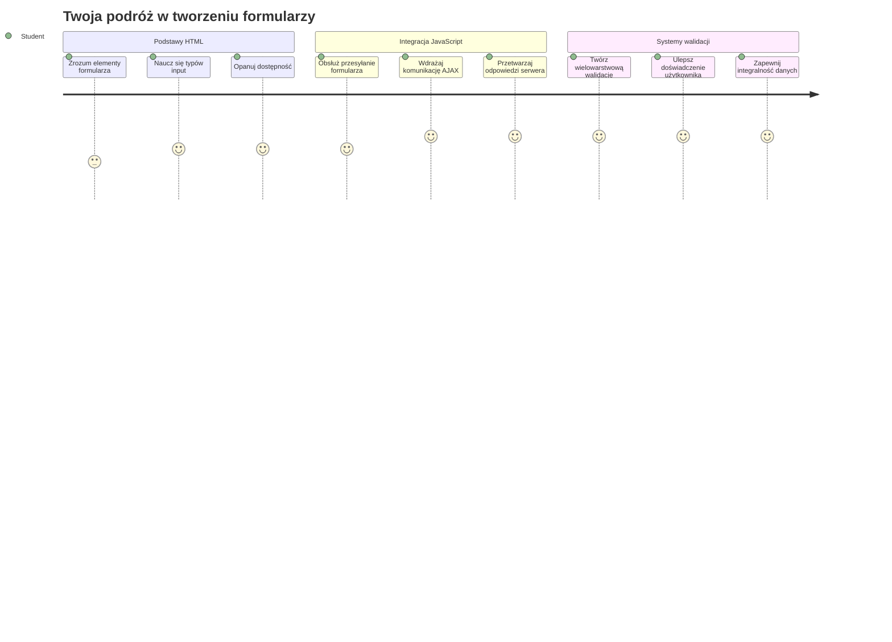
## Quiz przed wykładem

[Quiz przed wykładem](https://ff-quizzes.netlify.app/web/quiz/43)

Czy kiedykolwiek wypełniłeś formularz online i formularz odrzucił format Twojego emaila? Albo straciłeś wszystkie informacje po kliknięciu przycisku wyślij? Wszyscy doświadczyliśmy takich frustrujących sytuacji.

Formularze są mostem między Twoimi użytkownikami a funkcjonalnością Twojej aplikacji. Podobnie jak staranne protokoły, których używają kontrolerzy ruchu lotniczego, by bezpiecznie skierować samoloty do celu, dobrze zaprojektowane formularze zapewniają jasną informację zwrotną i zapobiegają kosztownym błędom. Złe formularze potrafią zniechęcić użytkowników szybciej niż nieporozumienie na ruchliwym lotnisku.

W tej lekcji zmienimy Twoją statyczną aplikację bankową w interaktywną aplikację. Nauczysz się tworzyć formularze, które walidują dane użytkownika, komunikują się z serwerem i dostarczają przydatną informację zwrotną. Pomyśl o tym jak o budowie interfejsu kontrolnego, który umożliwia użytkownikom poruszanie się po funkcjach Twojej aplikacji.

Na końcu będziesz mieć kompletny system logowania i rejestracji z walidacją, która prowadzi użytkowników do sukcesu, a nie frustracji.

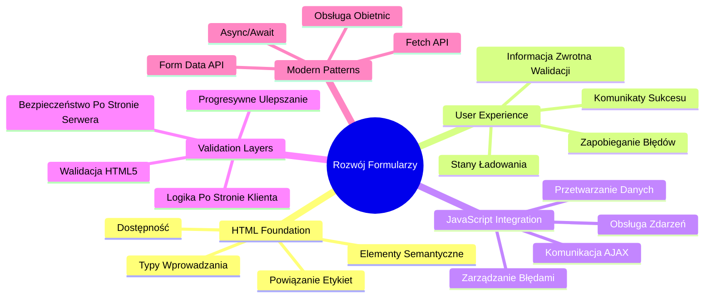
## Wymagania wstępne

Zanim zaczniemy budować formularze, upewnijmy się, że wszystko masz poprawnie skonfigurowane. Ta lekcja zaczyna się dokładnie tam, gdzie skończyliśmy poprzednio, więc jeśli przeskoczyłeś dalej, warto wrócić i najpierw uruchomić podstawy.

### Wymagane środowisko

| Komponent | Status | Opis |
|-----------|--------|-------------|
| [Szablony HTML](../1-template-route/README.md) | ✅ Wymagane | Podstawowa struktura aplikacji bankowej |
| [Node.js](https://nodejs.org) | ✅ Wymagane | Środowisko uruchomieniowe JavaScript dla serwera |
| [Serwer API banku](../api/README.md) | ✅ Wymagane | Backend do przechowywania danych |

> 💡 **Wskazówka dla deweloperów**: Będziesz uruchamiać dwa oddzielne serwery jednocześnie – jeden dla frontendu aplikacji bankowej i drugi dla backendowego API. To odzwierciedla realny rozwój, gdzie usługi frontendowe i backendowe działają niezależnie.

### Konfiguracja serwerów

**Twoje środowisko developerskie będzie zawierać:**
- **Serwer frontendowy**: Obsługuje aplikację bankową (zwykle na porcie `3000`)
- **Serwer backend API**: Obsługuje przechowywanie i pobieranie danych (port `5000`)
- **Oba serwery** mogą działać jednocześnie bez konfliktów

**Testowanie połączenia z API:**
```bash
curl http://localhost:5000/api
# Oczekiwana odpowiedź: "Bank API v1.0.0"
```

**Jeśli widzisz odpowiedź z wersją API, możesz przejść dalej!**

---

## Zrozumienie formularzy i elementów HTML

Formularze HTML to sposób, w jaki użytkownicy komunikują się z Twoją aplikacją webową. Pomyśl o nich jak o systemie telegraficznym łączącym odległe miejsca w XIX wieku – są protokołem komunikacji między zamierzeniem użytkownika a odpowiedzią aplikacji. Kiedy są starannie zaprojektowane, wychwytują błędy, kierują formatowaniem danych i dostarczają pomocnych wskazówek.

Nowoczesne formularze są znacznie bardziej zaawansowane niż podstawowe pola tekstowe. HTML5 wprowadził specjalne typy inputów, które automatycznie obsługują weryfikację emaili, formatowanie liczb i wybór daty. Te ulepszenia korzystnie wpływają na dostępność i doświadczenie użytkowników na urządzeniach mobilnych.

### Podstawowe elementy formularza

**Budulce, które każdy formularz powinien zawierać:**

```html
<!-- Basic form structure -->
<form id="userForm" method="POST">
  <label for="username">Username</label>
  <input id="username" name="username" type="text" required>
  
  <button type="submit">Submit</button>
</form>
```

**Co robi ten kod:**
- **Tworzy** kontener formularza z unikalnym identyfikatorem
- **Określa** metodę HTTP do przesyłania danych
- **Łączy** etykiety z polami dla dostępności
- **Definiuje** przycisk submit do przetwarzania formularza

### Nowoczesne typy inputów i atrybuty

| Typ inputu | Cel | Przykładowe użycie |
|------------|---------|---------------|
| `text` | Ogólne pole tekstowe | `<input type="text" name="username">` |
| `email` | Walidacja emaila | `<input type="email" name="email">` |
| `password` | Ukryty wpis tekstowy | `<input type="password" name="password">` |
| `number` | Pole numeryczne | `<input type="number" name="balance" min="0">` |
| `tel` | Numery telefonów | `<input type="tel" name="phone">` |

> 💡 **Zaleta nowoczesnego HTML5**: Używanie konkretnych typów inputów zapewnia automatyczną walidację, odpowiednią klawiaturę na urządzeniach mobilnych oraz lepsze wsparcie dostępności bez dodatkowego JavaScript!

### Typy i zachowania przycisków

```html
<!-- Different button behaviors -->
<button type="submit">Save Data</button>     <!-- Submits the form -->
<button type="reset">Clear Form</button>    <!-- Resets all fields -->
<button type="button">Custom Action</button> <!-- No default behavior -->
```

**Co robi każdy typ przycisku:**
- **Przyciski submit**: Wywołują wysłanie formularza i przesyłają dane do wskazanego endpointu
- **Przyciski reset**: Przywracają wszystkie pola formularza do stanu początkowego
- **Zwykłe przyciski**: Nie mają domyślnego zachowania i wymagają własnego JavaScriptu do działania

> ⚠️ **Ważna uwaga**: Element `<input>` jest samodomykający się i nie wymaga tagu zamykającego. Zalecane jest pisanie `<input>` bez ukośnika.

### Tworzenie formularza logowania

Teraz stwórzmy praktyczny formularz logowania, który pokazuje nowoczesne praktyki formularzy HTML. Zaczniemy od podstawowej struktury i stopniowo dodamy funkcje dostępności i walidację.

```html
<template id="login">
  <h1>Bank App</h1>
  <section>
    <h2>Login</h2>
    <form id="loginForm" novalidate>
      <div class="form-group">
        <label for="username">Username</label>
        <input id="username" name="user" type="text" required 
               autocomplete="username" placeholder="Enter your username">
      </div>
      <button type="submit">Login</button>
    </form>
  </section>
</template>
```

**Analiza tego co się dzieje:**
- **Strukturyzuje** formularz za pomocą semantycznych elementów HTML5
- **Grupuje** powiązane elementy używając `div` z opisowymi klasami
- **Łączy** etykiety z polami input za pomocą atrybutów `for` i `id`
- **Zawiera** nowoczesne atrybuty takie jak `autocomplete` i `placeholder` dla lepszego UX
- **Dodaje** `novalidate` aby obsłużyć walidację za pomocą JavaScript, nie domyślną przeglądarkową

### Siła odpowiednich etykiet

**Dlaczego etykiety mają znaczenie w nowoczesnym webdevie:**

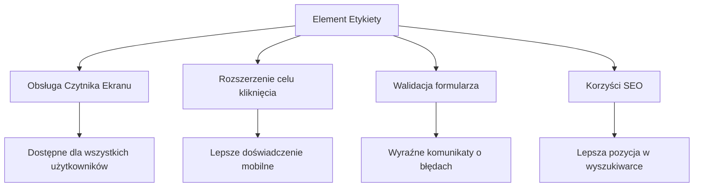
**Co osiągają poprawne etykiety:**
- **Umożliwiają** czytnikom ekranu jasne ogłoszenie pól formularza
- **Poszerzają** obszar klikalny (kliknięcie etykiety ustawia fokus na polu)
- **Poprawiają** obsługę na urządzeniach mobilnych dzięki większym obszarom dotyku
- **Wspierają** walidację formularza przez znaczące komunikaty błędów
- **Ulepszają** SEO przez nadanie semantycznego znaczenia elementom formularza

> 🎯 **Cel dostępności**: Każde pole formularza powinno mieć przypisaną etykietę. Ta prosta praktyka sprawia, że Twoje formularze są użyteczne dla wszystkich, w tym osób z niepełnosprawnościami i poprawia doświadczenie wszystkich użytkowników.

### Tworzenie formularza rejestracji

Formularz rejestracji wymaga bardziej szczegółowych informacji do stworzenia kompletnego konta użytkownika. Stwórzmy go z użyciem nowoczesnych funkcji HTML5 i zwiększonej dostępności.

```html
<hr/>
<h2>Register</h2>
<form id="registerForm" novalidate>
  <div class="form-group">
    <label for="user">Username</label>
    <input id="user" name="user" type="text" required 
           autocomplete="username" placeholder="Choose a username">
  </div>
  
  <div class="form-group">
    <label for="currency">Currency</label>
    <input id="currency" name="currency" type="text" value="$" 
           required maxlength="3" placeholder="USD, EUR, etc.">
  </div>
  
  <div class="form-group">
    <label for="description">Account Description</label>
    <input id="description" name="description" type="text" 
           maxlength="100" placeholder="Personal savings, checking, etc.">
  </div>
  
  <div class="form-group">
    <label for="balance">Starting Balance</label>
    <input id="balance" name="balance" type="number" value="0" 
           min="0" step="0.01" placeholder="0.00">
  </div>
  
  <button type="submit">Create Account</button>
</form>
```

**W powyższym kodzie:**
- **Zorganizowaliśmy** każde pole w osobnych divach dla lepszego stylowania i układu
- **Dodaliśmy** odpowiednie atrybuty `autocomplete` dla wsparcia autofill w przeglądarce
- **Zamieściliśmy** pomocnicze teksty placeholder, które kierują użytkownika
- **Ustawiliśmy** sensowne wartości domyślne za pomocą atrybutu `value`
- **Zastosowaliśmy** atrybuty walidacji takie jak `required`, `maxlength` i `min`
- **Użyliśmy** `type="number"` dla pola salda z obsługą liczb dziesiętnych

### Eksploracja typów inputów i ich zachowań

**Nowoczesne typy inputów oferują zaawansowane funkcje:**

| Funkcja | Korzyść | Przykład |
|---------|---------|----------|
| `type="number"` | Klawiatura numeryczna na urządzeniach mobilnych | Łatwiejsze wpisywanie salda |
| `step="0.01"` | Kontrola precyzji dziesiętnej | Pozwala na wpisywanie groszy |
| `autocomplete` | Autofill w przeglądarce | Szybsze wypełnianie formularza |
| `placeholder` | Podpowiedzi kontekstowe | Ułatwiają zrozumienie oczekiwań |

> 🎯 **Wyzwanie dostępności**: Spróbuj nawigować po formularzach tylko za pomocą klawiatury! Używaj `Tab` do przechodzenia między polami, `Space` do zaznaczania pól wyboru, `Enter` do wysłania. To doświadczenie pozwala zrozumieć, jak użytkownicy czytników ekranu korzystają z formularzy.

### 🔄 **Sprawdzenie pedagogiczne**
**Zrozumienie fundamentów formularzy**: Zanim zaimplementujesz JavaScript, upewnij się, że rozumiesz:
- ✅ Jak semantyczny HTML tworzy dostępne struktury formularzy
- ✅ Dlaczego typy inputów są ważne dla klawiatur mobilnych i walidacji
- ✅ Relację między etykietami a kontrolkami formularza
- ✅ Jak atrybuty formularza wpływają na domyślne zachowanie przeglądarki

**Szybki test wiedzy**: Co się stanie, jeśli wyślesz formularz bez obsługi JavaScript?
*Odpowiedź: Przeglądarka wykona domyślne wysłanie, zwykle przekierowując pod adres akcji*

**Zalety formularzy HTML5**: Nowoczesne formularze zapewniają:
- **Wbudowaną walidację**: Automatyczną kontrolę formatu emaila i liczb
- **Optymalizację mobilną**: Odpowiednie klawiatury dla różnych typów danych
- **Dostępność**: Wsparcie dla czytników ekranu i nawigacji klawiaturą
- **Stopniowe wzbogacanie**: Działają nawet gdy JavaScript jest wyłączony

## Zrozumienie metod wysyłania formularzy

Gdy ktoś wypełni Twój formularz i kliknie wyślij, te dane muszą gdzieś trafić – zazwyczaj na serwer, który je zapisze. Są różne sposoby, aby to zrobić, a wiedza którą metodę wybrać pomoże Ci uniknąć problemów.

Spójrzmy, co tak naprawdę się dzieje, gdy ktoś kliknie przycisk wyślij.

### Domyślne zachowanie formularza

Najpierw obserwujmy, co się dzieje przy podstawowym wysyłaniu formularza:

**Przetestuj swoje aktualne formularze:**
1. Kliknij przycisk *Zarejestruj się* w swoim formularzu
2. Zwróć uwagę na zmiany w pasku adresu przeglądarki
3. Zauważ jak strona odświeża się i dane pojawiają się w URL


### Porównanie metod HTTP

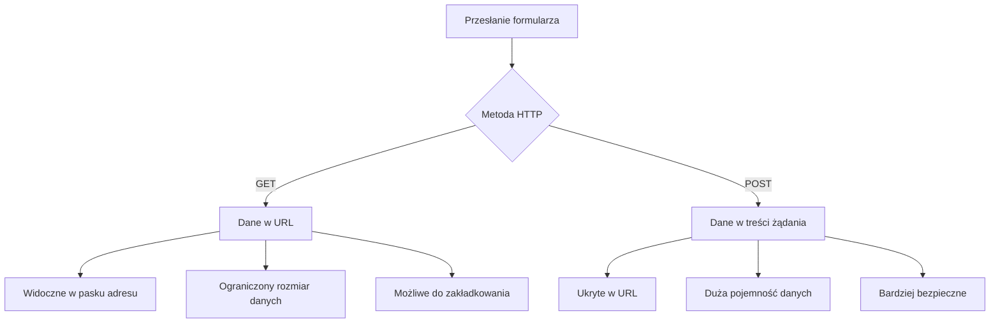
**Zrozumienie różnic:**

| Metoda | Zastosowanie | Lokalizacja danych | Poziom bezpieczeństwa | Limit rozmiaru |
|--------|----------|---------------|----------------|-------------|
| `GET` | Zapytania wyszukiwania, filtry | Parametry w URL | Niski (widoczne) | ~2000 znaków |
| `POST` | Konta użytkowników, dane wrażliwe | Treść zapytania | Wyższy (ukryte) | Brak praktycznego limitu |

**Podstawowe różnice:**
- **GET**: Dołącza dane formularza do URL jako parametry zapytania (odpowiednie dla operacji wyszukiwania)
- **POST**: Zawiera dane w ciele żądania (niezbędne dla danych wrażliwych)
- **Ograniczenia GET**: Limity rozmiaru, widoczne dane, trwała historia w przeglądarce
- **Zalety POST**: Duża pojemność danych, ochrona prywatności, wsparcie dla przesyłania plików

> 💡 **Dobra praktyka**: Używaj `GET` dla formularzy wyszukiwania i filtrów (pobieranie danych), `POST` dla rejestracji, logowania i tworzenia danych.

### Konfiguracja wysyłania formularza

Skonfiguruj swój formularz rejestracji tak, aby poprawnie komunikował się z backendowym API używając metody POST:

```html
<form id="registerForm" action="//localhost:5000/api/accounts" 
      method="POST" novalidate>
```

**Co robi ta konfiguracja:**
- **Kieruje** wysyłanie formularza do endpointu API
- **Używa** metody POST dla bezpiecznej transmisji danych
- **Zawiera** `novalidate` do obsługi walidacji przez JavaScript

### Testowanie wysyłania formularza

**Postępuj według tych kroków, aby przetestować swój formularz:**
1. **Wypełnij** formularz rejestracji swoimi danymi
2. **Kliknij** przycisk "Utwórz konto"
3. **Obserwuj** odpowiedź serwera w przeglądarce

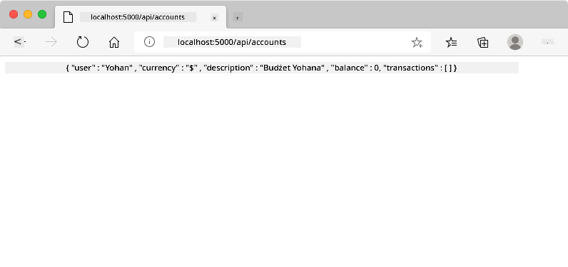

**Co powinieneś zobaczyć:**
- **Przeglądarka przekierowuje** na adres endpointu API
- **Odpowiedź JSON** zawierająca dane nowo utworzonego konta
- **Potwierdzenie serwera**, że konto zostało pomyślnie utworzone

> 🧪 **Czas na eksperyment**: Spróbuj zarejestrować się ponownie z tym samym nazwiskiem użytkownika. Jaką odpowiedź otrzymasz? To pomaga zrozumieć, jak serwer radzi sobie z danymi duplikowanymi i warunkami błędów.

### Zrozumienie odpowiedzi JSON

**Gdy serwer przetworzy Twój formularz pomyślnie:**
```json
{
  "user": "john_doe",
  "currency": "$",
  "description": "Personal savings",
  "balance": 100,
  "id": "unique_account_id"
}
```

**Ta odpowiedź potwierdza:**
- **Tworzy** nowe konto z podanymi danymi
- **Przydziela** unikalny identyfikator do dalszego odwołania
- **Zwraca** wszystkie informacje o koncie do weryfikacji
- **Sygnalizuje** pomyślne zapisanie w bazie danych

## Nowoczesne obsługiwanie formularzy w JavaScript

Tradycyjne wysyłanie formularzy powoduje pełne przeładowanie strony, podobnie jak wczesne misje kosmiczne wymagały pełnych restartów systemu, aby wykonać korektę kursu. To zaburza doświadczenie użytkownika i powoduje utratę stanu aplikacji.

Obsługa formularzy w JavaScript działa jak ciągły system nawigacji używany przez współczesne statki kosmiczne – wykonując korekty w czasie rzeczywistym bez utraty kontekstu nawigacyjnego. Możemy przechwytywać wysłanie formularza, zapewniać natychmiastową informację zwrotną, obsługiwać błędy elegancko i aktualizować interfejs na podstawie odpowiedzi serwera, utrzymując użytkownika w aplikacji.

### Dlaczego unikać przeładowań strony?

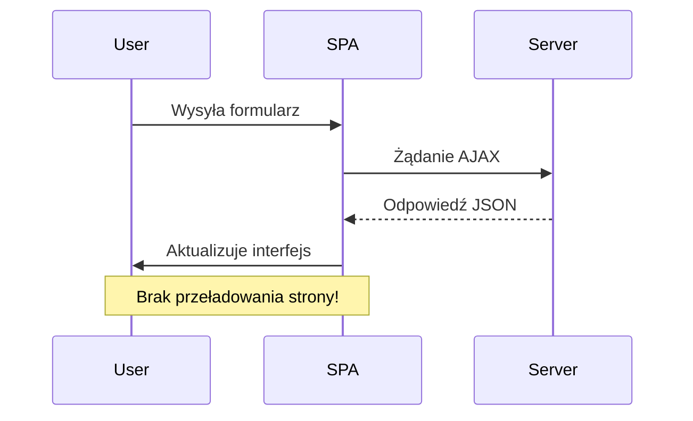
**Korzyści z obsługi formularzy w JavaScript:**
- **Utrzymanie** stanu aplikacji i kontekstu użytkownika
- **Zapewnienie** natychmiastowej informacji zwrotnej i wskaźników ładowania
- **Umożliwia** dynamiczną obsługę błędów i walidację
- **Tworzy** płynne doświadczenia podobne do aplikacji
- **Pozwala** na logikę warunkową zależną od odpowiedzi serwera

### Przejście od tradycyjnych do nowoczesnych formularzy

**Wyzwania tradycyjnego podejścia:**
- **Przekierowuje** użytkowników poza Twoją aplikację
- **Traci** bieżący stan i kontekst aplikacji
- **Wymaga** pełnych przeładowań strony dla prostych operacji
- **Daje** ograniczoną kontrolę nad informacją zwrotną dla użytkownika

**Zalety nowoczesnego podejścia w JavaScript:**
- **Zatrzymuje** użytkowników w Twojej aplikacji
- **Utrzymuje** cały stan i dane aplikacji
- **Umożliwia** weryfikację i feedback w czasie rzeczywistym
- **Wspiera** stopniowe wzbogacanie i dostępność

### Implementacja obsługi formularza w JavaScript

Zastąpmy tradycyjne wysyłanie formularza nowoczesną obsługą zdarzeń w JavaScript:

```html
<!-- Remove the action attribute and add event handling -->
<form id="registerForm" method="POST" novalidate>
```

**Dodaj logikę rejestracji do pliku `app.js`:**

```javascript
// Nowoczesne obsługiwanie formularzy sterowane zdarzeniami
function register() {
  const registerForm = document.getElementById('registerForm');
  const formData = new FormData(registerForm);
  const data = Object.fromEntries(formData);
  const jsonData = JSON.stringify(data);
  
  console.log('Form data prepared:', data);
}

// Dołącz nasłuchiwacz zdarzeń po załadowaniu strony
document.addEventListener('DOMContentLoaded', () => {
  const registerForm = document.getElementById('registerForm');
  registerForm.addEventListener('submit', (event) => {
    event.preventDefault(); // Zapobiegaj domyślnemu wysłaniu formularza
    register();
  });
});
```

**Co tutaj się dzieje:**
- **Uniemożliwia** domyślne wysłanie formularza przy pomocy `event.preventDefault()`
- **Pobiera** element formularza za pomocą nowoczesnego selektora DOM
- **Ekstrahuje** dane formularza z użyciem API `FormData`
- **Konwertuje** FormData do zwykłego obiektu za pomocą `Object.fromEntries()`
- **Serializuje** dane do formatu JSON do komunikacji z serwerem
- **Loguje** przetworzone dane do debugowania i weryfikacji

### Zrozumienie API FormData

**API FormData zapewnia potężną obsługę formularzy:**
```javascript
// Przykład tego, co FormData przechwytuje
const formData = new FormData(registerForm);

// FormData automatycznie przechwytuje:
// {
//   "user": "john_doe",
//   "currency": "$",
//   "description": "Konto osobiste",
//   "balance": "100"
// }
```

**Zalety API FormData:**
- **Kompleksowe zbieranie danych**: Zbiera wszystkie elementy formularza, w tym tekst, pliki i złożone dane wejściowe
- **Świadomość typów**: Automatycznie obsługuje różne typy danych wejściowych bez konieczności pisania własnego kodu
- **Wydajność**: Eliminuje ręczne zbieranie pól za pomocą pojedynczego wywołania API
- **Elastyczność**: Utrzymuje funkcjonalność mimo zmian w strukturze formularza

### Tworzenie funkcji komunikacji z serwerem

Teraz stwórzmy solidną funkcję komunikacyjną z twoim serwerem API, używając nowoczesnych wzorców JavaScript:

```javascript
async function createAccount(account) {
  try {
    const response = await fetch('//localhost:5000/api/accounts', {
      method: 'POST',
      headers: { 
        'Content-Type': 'application/json',
        'Accept': 'application/json'
      },
      body: account
    });
    
    // Sprawdź, czy odpowiedź była pomyślna
    if (!response.ok) {
      throw new Error(`HTTP error! status: ${response.status}`);
    }
    
    return await response.json();
  } catch (error) {
    console.error('Account creation failed:', error);
    return { error: error.message || 'Network error occurred' };
  }
}
```

**Zrozumienie asynchronicznego JavaScript:**

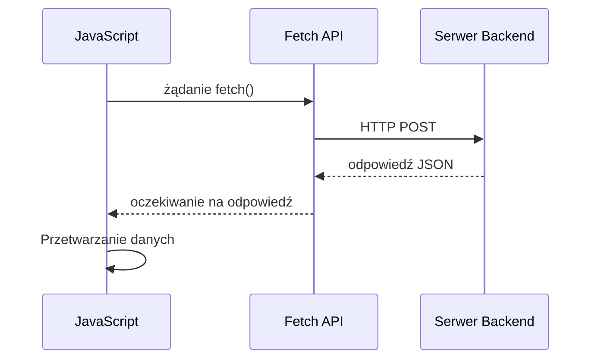
**Co osiąga ta nowoczesna implementacja:**
- **Używa** `async/await` dla czytelnego asynchronicznego kodu
- **Zawiera** właściwe obsługiwanie błędów w blokach try/catch
- **Sprawdza** status odpowiedzi przed przetwarzaniem danych
- **Ustawia** odpowiednie nagłówki do komunikacji JSON
- **Dostarcza** szczegółowe komunikaty o błędach do debugowania
- **Zwraca** spójną strukturę danych w przypadku sukcesu i błędów

### Moc nowoczesnego Fetch API

**Zalety Fetch API nad starszymi metodami:**

| Funkcja | Korzyść | Implementacja |
|---------|---------|---------------|
| Oparte na Promise | Czysty kod asynchroniczny | `await fetch()` |
| Konfiguracja żądań | Pełna kontrola HTTP | Nagłówki, metody, ciało |
| Obsługa odpowiedzi | Elastyczne parsowanie danych | `.json()`, `.text()`, `.blob()` |
| Obsługa błędów | Kompleksowe łapanie błędów | Bloki try/catch |

> 🎥 **Dowiedz się więcej**: [Async/Await Tutorial](https://youtube.com/watch?v=YwmlRkrxvkk) - Zrozumienie wzorców asynchronicznego JavaScript dla nowoczesnego web developmentu.

**Kluczowe pojęcia komunikacji z serwerem:**
- **Funkcje async** pozwalają wstrzymać wykonanie, by poczekać na odpowiedź serwera
- **Słowo kluczowe await** sprawia, że asynchroniczny kod czyta się jak synchroniczny
- **Fetch API** zapewnia nowoczesne żądania HTTP oparte na Promise
- **Obsługa błędów** gwarantuje, że aplikacja reaguje łagodnie na problemy sieciowe

### Ukończenie funkcji rejestracji

Złóżmy wszystko w całość, tworząc kompletną, produkcyjną funkcję rejestracji:

```javascript
async function register() {
  const registerForm = document.getElementById('registerForm');
  const submitButton = registerForm.querySelector('button[type="submit"]');
  
  try {
    // Pokaż stan ładowania
    submitButton.disabled = true;
    submitButton.textContent = 'Creating Account...';
    
    // Przetwórz dane formularza
    const formData = new FormData(registerForm);
    const jsonData = JSON.stringify(Object.fromEntries(formData));
    
    // Wyślij na serwer
    const result = await createAccount(jsonData);
    
    if (result.error) {
      console.error('Registration failed:', result.error);
      alert(`Registration failed: ${result.error}`);
      return;
    }
    
    console.log('Account created successfully!', result);
    alert(`Welcome, ${result.user}! Your account has been created.`);
    
    // Zresetuj formularz po pomyślnej rejestracji
    registerForm.reset();
    
  } catch (error) {
    console.error('Unexpected error:', error);
    alert('An unexpected error occurred. Please try again.');
  } finally {
    // Przywróć stan przycisku
    submitButton.disabled = false;
    submitButton.textContent = 'Create Account';
  }
}
```

**Ta rozszerzona implementacja zawiera:**
- **Zapewnia** wizualną informację podczas wysyłania formularza
- **Dezaktywuje** przycisk wysyłania, by uniknąć podwójnych zgłoszeń
- **Obsługuje** zarówno spodziewane, jak i nieoczekiwane błędy w sposób łagodny
- **Wyświetla** przyjazne dla użytkownika komunikaty sukcesu i błędów
- **Resetuje** formularz po pomyślnej rejestracji
- **Przywraca** stan interfejsu niezależnie od rezultatu

### Testowanie implementacji

**Otwórz narzędzia deweloperskie przeglądarki i przetestuj rejestrację:**

1. **Otwórz** konsolę przeglądarki (F12 → zakładka Konsola)
2. **Wypełnij** formularz rejestracji
3. **Kliknij** "Utwórz konto"
4. **Obserwuj** komunikaty w konsoli i informacje zwrotne dla użytkownika


**Co powinno się pojawić:**
- **Stan ładowania** na przycisku wysyłania
- **Logi w konsoli** pokazujące szczegóły procesu
- **Komunikat o sukcesie** po udanym utworzeniu konta
- **Automatyczne resetowanie** formularza po pomyślnym zgłoszeniu

> 🔒 **Uwaga dotycząca bezpieczeństwa**: Obecnie dane przesyłane są przez HTTP, co nie jest bezpieczne w środowisku produkcyjnym. W rzeczywistych zastosowaniach zawsze korzystaj z HTTPS, aby szyfrować przesyłane dane. Dowiedz się więcej o [bezpieczeństwie HTTPS](https://en.wikipedia.org/wiki/HTTPS) i dlaczego jest to niezbędne do ochrony danych użytkownika.

### 🔄 **Pedagogiczne podsumowanie**
**Nowoczesna integracja JavaScript**: Sprawdź swoje rozumienie asynchronicznej obsługi formularzy:
- ✅ Jak `event.preventDefault()` zmienia domyślne zachowanie formularza?
- ✅ Dlaczego API FormData jest bardziej wydajne niż ręczne zbieranie pól?
- ✅ W jaki sposób wzorce async/await poprawiają czytelność kodu?
- ✅ Jaką rolę odgrywa obsługa błędów dla doświadczenia użytkownika?

**Architektura systemu**: Obsługa formularza demonstruje:
- **Programowanie zdarzeniowe**: Formularze reagują na działania użytkownika bez przeładowania strony
- **Komunikacja asynchroniczna**: Żądania do serwera nie blokują interfejsu użytkownika
- **Obsługa błędów**: Łagodna degradacja działania przy problemach sieciowych
- **Zarządzanie stanem**: Aktualizacje UI odzwierciedlają odpowiedzi serwera
- **Progresywne ulepszanie**: Podstawowa funkcjonalność działa, a JavaScript ją wzbogaca

**Profesjonalne wzorce**: Wdrożyłeś:
- **Pojedynczą odpowiedzialność**: Funkcje mają jasne, skupione cele
- **Granice błędów**: Bloki try/catch zapobiegają awariom aplikacji
- **Informacje zwrotne dla użytkownika**: Stany ładowania i komunikaty sukcesu/błędu
- **Transformację danych**: FormData konwertowane na JSON do komunikacji z serwerem

## Kompleksowa walidacja formularza

Walidacja formularza zapobiega frustrującym sytuacjom, gdy błędy pojawiają się dopiero po wysłaniu danych. Podobnie jak wielowarstwowe systemy redundancji na Międzynarodowej Stacji Kosmicznej, skuteczna walidacja korzysta z wielu warstw kontroli bezpieczeństwa.

Optymalne podejście łączy walidację na poziomie przeglądarki, walidację w JavaScript dla lepszego UX oraz walidację po stronie serwera dla bezpieczeństwa i integralności danych. Taka redundancja zapewnia satysfakcję użytkownika i ochronę systemu.

### Zrozumienie warstw walidacji

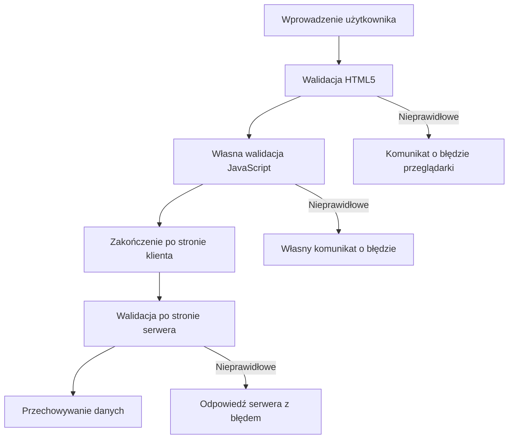
**Strategia wielowarstwowej walidacji:**
- **Walidacja HTML5**: Natychmiastowe kontrole w przeglądarce
- **Walidacja JavaScript**: Własna logika i doświadczenie użytkownika
- **Walidacja serwerowa**: Ostateczna kontrola bezpieczeństwa i integralności danych
- **Progresywne ulepszanie**: Działa także gdy JavaScript jest wyłączony

### Atrybuty walidacji HTML5

**Nowoczesne narzędzia walidacji:**

| Atrybut | Cel | Przykład zastosowania | Zachowanie przeglądarki |
|---------|-----|----------------------|------------------------|
| `required` | Pole obowiązkowe | `<input required>` | Zapobiega pustemu wysłaniu |
| `minlength`/`maxlength` | Limity długości tekstu | `<input maxlength="20">` | Wymusza ograniczenia znaków |
| `min`/`max` | Zakresy liczbowe | `<input min="0" max="1000">` | Waliduje zakres liczbowy |
| `pattern` | Własne reguły regex | `<input pattern="[A-Za-z]+">` | Dopasowuje określone formaty |
| `type` | Walidacja typu danych | `<input type="email">` | Walidacja formatów specyficznych |

### Stylizacja walidacji w CSS

**Twórz wizualną informację dla stanów walidacji:**

```css
/* Valid input styling */
input:valid {
  border-color: #28a745;
  background-color: #f8fff9;
}

/* Invalid input styling */
input:invalid {
  border-color: #dc3545;
  background-color: #fff5f5;
}

/* Focus states for better accessibility */
input:focus:valid {
  box-shadow: 0 0 0 0.2rem rgba(40, 167, 69, 0.25);
}

input:focus:invalid {
  box-shadow: 0 0 0 0.2rem rgba(220, 53, 69, 0.25);
}
```

**Co oznaczają te wizualne wskazówki:**
- **Zielone obramowania**: Wskazują poprawną walidację, jak zielone światła na stanowisku kontroli misji
- **Czerwone obramowania**: Sygnalizują błędy walidacji wymagające uwagi
- **Podświetlenie fokusu**: Pokazuje wyraźnie, gdzie aktualnie znajduje się kursor
- **Spójna stylistyka**: Ustanawia przewidywalne wzorce interfejsu, które użytkownicy łatwo zapamiętują

> 💡 **Przydatna wskazówka**: Używaj selektorów CSS `:valid` i `:invalid`, aby zapewnić natychmiastową wizualną informację podczas wpisywania, tworząc responsywny i pomocny interfejs.

### Implementacja kompleksowej walidacji

Dodajmy do twojego formularza rejestracji solidną walidację, oferującą doskonałe doświadczenie użytkownika i jakość danych:

```html
<form id="registerForm" method="POST" novalidate>
  <div class="form-group">
    <label for="user">Username <span class="required">*</span></label>
    <input id="user" name="user" type="text" required 
           minlength="3" maxlength="20" 
           pattern="[a-zA-Z0-9_]+" 
           autocomplete="username"
           title="Username must be 3-20 characters, letters, numbers, and underscores only">
    <small class="form-text">Choose a unique username (3-20 characters)</small>
  </div>
  
  <div class="form-group">
    <label for="currency">Currency <span class="required">*</span></label>
    <input id="currency" name="currency" type="text" required 
           value="$" maxlength="3" 
           pattern="[A-Z$€£¥₹]+" 
           title="Enter a valid currency symbol or code">
    <small class="form-text">Currency symbol (e.g., $, €, £)</small>
  </div>
  
  <div class="form-group">
    <label for="description">Account Description</label>
    <input id="description" name="description" type="text" 
           maxlength="100" 
           placeholder="Personal savings, checking, etc.">
    <small class="form-text">Optional description (up to 100 characters)</small>
  </div>
  
  <div class="form-group">
    <label for="balance">Starting Balance</label>
    <input id="balance" name="balance" type="number" 
           value="0" min="0" step="0.01" 
           title="Enter a positive number for your starting balance">
    <small class="form-text">Initial account balance (minimum $0.00)</small>
  </div>
  
  <button type="submit">Create Account</button>
</form>
```

**Co zapewnia rozszerzona walidacja:**
- **Łączy** wskaźniki pól wymaganych z pomocniczymi opisami
- **Zawiera** atrybuty `pattern` do walidacji formatów
- **Dostarcza** atrybuty `title` dla dostępności i podpowiedzi
- **Dodaje** tekst pomocniczy, który prowadzi użytkownika
- **Wykorzystuje** semantyczną strukturę HTML dla lepszej dostępności

### Zaawansowane reguły walidacji

**Co realizuje każda reguła walidacji:**

| Pole | Reguły walidacji | Korzyść dla użytkownika |
|-------|------------------|------------------------|
| Nazwa użytkownika | `required`, `minlength="3"`, `maxlength="20"`, `pattern="[a-zA-Z0-9_]+"` | Gwarantuje poprawny, unikalny identyfikator |
| Waluta | `required`, `maxlength="3"`, `pattern="[A-Z$€£¥₹]+"` | Akceptuje popularne symbole walutowe |
| Saldo | `min="0"`, `step="0.01"`, `type="number"` | Zapobiega ujemnym stanom konta |
| Opis | `maxlength="100"` | Rozsądne ograniczenie długości |

### Testowanie zachowań walidacji

**Wypróbuj te scenariusze walidacji:**
1. **Spróbuj wysłać** formularz z pustymi polami obowiązkowymi
2. **Wprowadź** nazwę użytkownika krótszą niż 3 znaki
3. **Użyj** znaków specjalnych w polu nazwy użytkownika
4. **Wpisz** ujemną kwotę salda

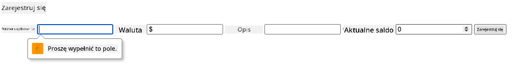

**Co zauważysz:**
- **Przeglądarka wyświetla** natywne komunikaty walidacji
- **Zmiany stylów** wynikające ze stanów `:valid` i `:invalid`
- **Wysyłanie formularza** jest zablokowane, dopóki wszystkie walidacje nie przejdą
- **Automatyczne skupienie** na pierwszym błędnym polu

### Walidacja po stronie klienta vs serwera

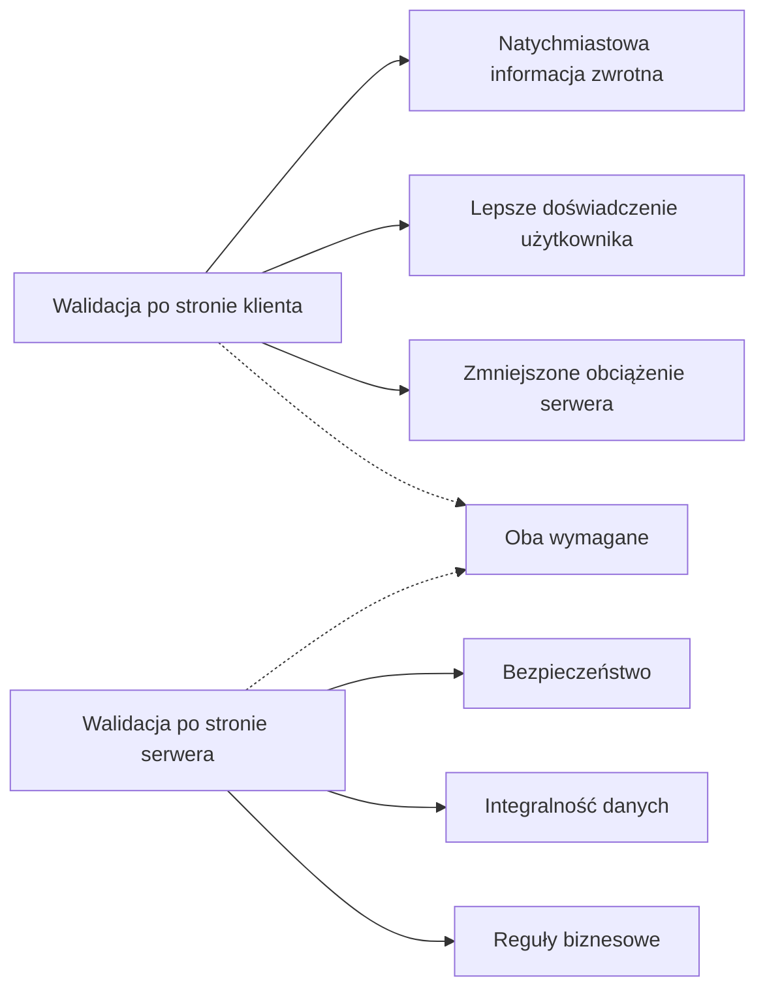
**Dlaczego potrzebujesz obu warstw:**
- **Walidacja klienta**: Zapewnia natychmiastową informację i lepsze UX
- **Walidacja serwera**: Gwarantuje bezpieczeństwo i realizuje złożone reguły biznesowe
- **Połączenie obu**: Tworzy solidne, przyjazne dla użytkownika i bezpieczne aplikacje
- **Progresywne ulepszanie**: Działa także bez JavaScript

> 🛡️ **Przypomnienie o bezpieczeństwie**: Nigdy nie ufaj wyłącznie walidacji po stronie klienta! Złośliwi użytkownicy mogą ją ominąć, więc walidacja po stronie serwera jest kluczowa dla bezpieczeństwa i integralności danych.

### ⚡ **Co możesz zrobić w ciągu następnych 5 minut**
- [ ] Przetestuj formularz za pomocą nieprawidłowych danych, by zobaczyć komunikaty walidacji
- [ ] Spróbuj wysłać formularz z wyłączonym JavaScript, by zobaczyć walidację HTML5
- [ ] Otwórz narzędzia deweloperskie i zanalizuj dane formularza wysyłane do serwera
- [ ] Eksperymentuj z różnymi typami wejść, aby zobaczyć zmiany klawiatury mobilnej

### 🎯 **Co możesz osiągnąć w ciągu najbliższej godziny**
- [ ] Ukończ quiz po lekcji i zrozum koncepcje obsługi formularzy
- [ ] Wdróż kompleksowe wyzwanie walidacji z informacją zwrotną w czasie rzeczywistym
- [ ] Dodaj stylizację CSS, by formularze wyglądały profesjonalnie
- [ ] Stwórz obsługę błędów dla duplikatów nazw użytkowników i błędów serwera
- [ ] Dodaj pola potwierdzania hasła z odpowiednią walidacją

### 📅 **Twoja tygodniowa ścieżka do mistrzostwa w formularzach**
- [ ] Zbuduj pełną aplikację bankową z zaawansowanymi funkcjami formularzy
- [ ] Wdróż możliwość przesyłania plików na zdjęcia profilowe lub dokumenty
- [ ] Dodaj wieloetapowe formularze z wskaźnikami postępu i zarządzaniem stanem
- [ ] Stwórz dynamiczne formularze adaptujące się na podstawie wyborów użytkownika
- [ ] Wdróż automatyczne zapisywanie formularzy i odzyskiwanie danych dla lepszego UX
- [ ] Dodaj zaawansowaną walidację, np. weryfikację emaila i formatowanie numerów telefonów

### 🌟 **Twoja miesięczna droga do mistrzostwa frontendowego**
- [ ] Buduj złożone aplikacje formularzy z logiką warunkową i przepływami pracy
- [ ] Naucz się bibliotek i frameworków formularzy dla szybszego rozwoju
- [ ] Mistrzostwo w zasadach dostępności i inkluzywnego projektowania
- [ ] Wdróż internacjonalizację i lokalizację dla globalnych formularzy
- [ ] Twórz wielokrotnego użytku biblioteki komponentów formularzy i systemy projektowe
- [ ] Wspieraj projekty open source formularzy i dziel się najlepszymi praktykami

## 🎯 Twój harmonogram mistrzostwa w tworzeniu formularzy

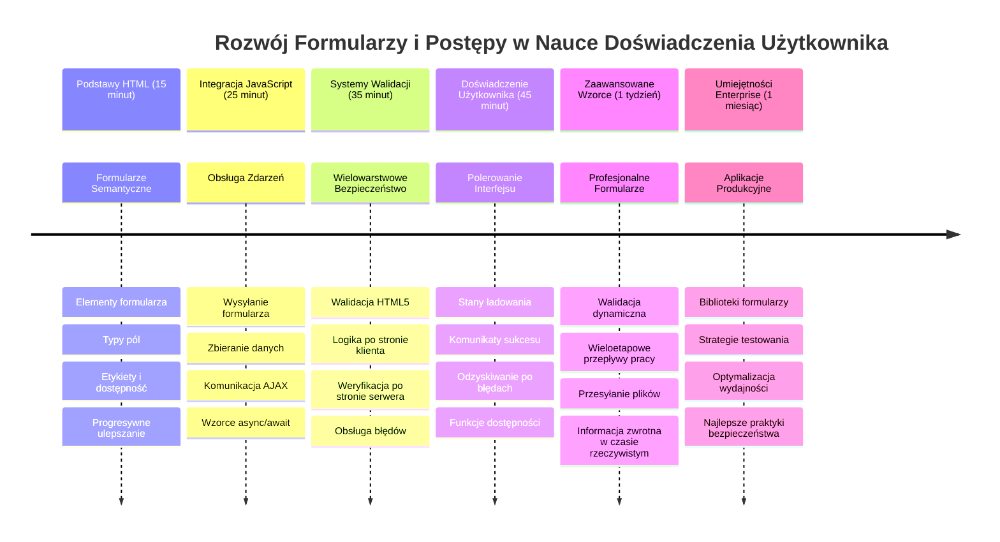
### 🛠️ Podsumowanie zestawu narzędzi do tworzenia formularzy

Po ukończeniu tej lekcji opanowałeś:
- **Formularze HTML5**: Semantyczna struktura, typy wejść i funkcje dostępności
- **Obsługę formularzy w JavaScript**: Zarządzanie zdarzeniami, zbieranie danych i komunikację AJAX
- **Architekturę walidacji**: Wielowarstwowa walidacja dla bezpieczeństwa i doświadczenia użytkownika
- **Programowanie asynchroniczne**: Nowoczesne Fetch API i wzorce async/await
- **Zarządzanie błędami**: Kompleksowa obsługa błędów i systemy informacji zwrotnej
- **Projektowanie UX**: Stany ładowania, komunikaty sukcesu i odzyskiwanie po błędach
- **Progresywne ulepszanie**: Formularze działające na wszystkich przeglądarkach i platformach

**Zastosowania w praktyce**: Twoje umiejętności tworzenia formularzy mają zastosowanie m.in. w:
- **Aplikacjach e-commerce**: Procesy realizacji zamówień, rejestracja kont i formularze płatności
- **Oprogramowaniu korporacyjnym**: Systemy wprowadzania danych, interfejsy raportów i przepływy pracy
- **Zarządzaniu treścią**: Platformy publikacyjne, treści generowane przez użytkowników, interfejsy administracyjne
- **Aplikacjach finansowych**: Interfejsy bankowe, platformy inwestycyjne, systemy transakcji
- **Systemach opieki zdrowotnej**: Portale pacjentów, umawianie wizyt, formularze medyczne
- **Platformach edukacyjnych**: Rejestracja na kursy, narzędzia oceny, systemy zarządzania nauką

**Zdobyte umiejętności zawodowe**: Potrafisz teraz:
- **Projektować** dostępne formularze działające dla wszystkich użytkowników, w tym niepełnosprawnych
- **Wdrażać** bezpieczną walidację formularzy zapobiegającą błędom i podatnościom
- **Tworzyć** responsywne interfejsy użytkownika z wyraźną informacją zwrotną i wsparciem
- **Debugować** złożone interakcje formularzy za pomocą narzędzi deweloperskich i analizy sieci
- **Optymalizować** wydajność formularzy przez efektywne przetwarzanie danych i walidację

**Opanowane koncepcje frontendowe**:
- **Architektura zdarzeniowa**: Obsługa interakcji użytkownika i reakcji systemu
- **Programowanie asynchroniczne**: Komunikacja z serwerem bez blokowania i obsługa błędów
- **Walidacja danych**: Kontrole bezpieczeństwa i integralności po stronie klienta i serwera
- **Projektowanie doświadczenia użytkownika**: Intuicyjne interfejsy prowadzące do sukcesu
- **Inżynieria dostępności**: Wdrażanie inkluzywnego projektowania dla różnorodnych potrzeb

**Następny poziom**: Jesteś gotowy na eksplorację zaawansowanych bibliotek formularzy, wdrożenie skomplikowanych reguł walidacji lub budowę systemów zbierania danych klasy korporacyjnej!

🌟 **Osiągnięcie odblokowane**: Zbudowałeś kompletny system obsługi formularzy z profesjonalną walidacją, obsługą błędów i wzorcami UX!

---


---

## GitHub Copilot Agent Challenge 🚀

Użyj trybu Agenta, aby ukończyć następujące wyzwanie:

**Opis:** Ulepsz formularz rejestracji, dodając kompleksową walidację po stronie klienta oraz informację zwrotną dla użytkownika. To wyzwanie pozwoli ci poćwiczyć walidację formularzy, obsługę błędów i poprawę doświadczenia użytkownika przez interaktywną informację.
**Prompt:** Stwórz kompletny system walidacji formularza rejestracji, który zawiera: 1) Informacje zwrotne na żywo dla każdego pola podczas wpisywania, 2) Niestandardowe komunikaty walidacyjne, które pojawiają się pod każdym polem, 3) Pole potwierdzenia hasła z walidacją dopasowania, 4) Wskaźniki wizualne (takie jak zielone haczyki dla poprawnych pól i czerwone ostrzeżenia dla niepoprawnych), 5) Przycisk wysyłania, który jest aktywowany tylko wtedy, gdy wszystkie walidacje są poprawne. Użyj atrybutów walidacji HTML5, CSS do stylizacji stanów walidacji oraz JavaScript do interaktywnego działania.

Dowiedz się więcej o [agent mode](https://code.visualstudio.com/blogs/2025/02/24/introducing-copilot-agent-mode) tutaj.

## 🚀 Wyzwanie

Pokaż komunikat o błędzie w HTML, jeśli użytkownik już istnieje.

Oto przykład, jak może wyglądać końcowa strona logowania po dodaniu stylów:

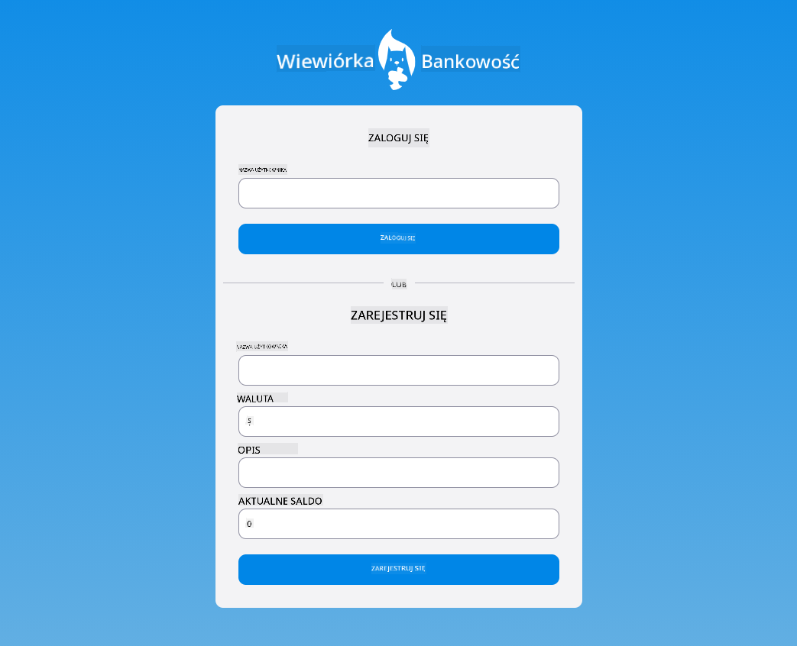

## Quiz po wykładzie

[Quiz po wykładzie](https://ff-quizzes.netlify.app/web/quiz/44)

## Przegląd i samodzielna nauka

Twórcy aplikacji wykazali się dużą kreatywnością w budowie formularzy, szczególnie w zakresie strategii walidacji. Poznaj różne przebiegi formularzy, przeglądając [CodePen](https://codepen.com); czy znajdziesz interesujące i inspirujące formularze?

## Zadanie

[Ostylizuj swoją aplikację bankową](assignment.md)

---

<!-- CO-OP TRANSLATOR DISCLAIMER START -->
**Zastrzeżenie**:
Niniejszy dokument został przetłumaczony przy użyciu usług tłumaczeniowych AI [Co-op Translator](https://github.com/Azure/co-op-translator). Chociaż dokładamy starań, aby tłumaczenie było jak najdokładniejsze, prosimy mieć na uwadze, że automatyczne tłumaczenia mogą zawierać błędy lub nieścisłości. Oryginalny dokument w jego języku źródłowym powinien być uważany za źródło autorytatywne. W przypadku informacji krytycznych zalecane jest skorzystanie z profesjonalnego tłumaczenia wykonanego przez człowieka. Nie ponosimy odpowiedzialności za jakiekolwiek nieporozumienia lub błędne interpretacje wynikające z użycia tego tłumaczenia.
<!-- CO-OP TRANSLATOR DISCLAIMER END -->