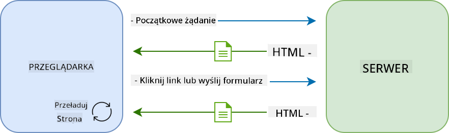
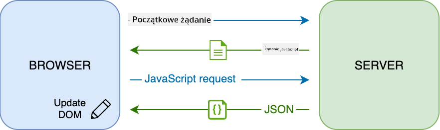
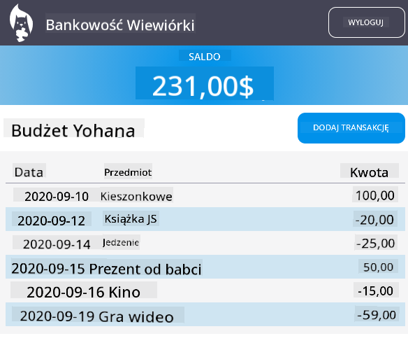

<!--
CO_OP_TRANSLATOR_METADATA:
{
  "original_hash": "89d0df9854ed020f155e94882ae88d4c",
  "translation_date": "2025-08-29T16:22:34+00:00",
  "source_file": "7-bank-project/3-data/README.md",
  "language_code": "pl"
}
-->
# Budowa aplikacji bankowej, część 3: Metody pobierania i wykorzystywania danych

## Quiz przed wykładem

[Quiz przed wykładem](https://ff-quizzes.netlify.app/web/quiz/45)

### Wprowadzenie

W sercu każdej aplikacji internetowej znajdują się *dane*. Dane mogą przybierać różne formy, ale ich głównym celem jest zawsze prezentowanie informacji użytkownikowi. Wraz z rosnącą interaktywnością i złożonością aplikacji internetowych, sposób, w jaki użytkownik uzyskuje dostęp do informacji i wchodzi z nimi w interakcję, stał się kluczowym elementem tworzenia stron internetowych.

W tej lekcji zobaczymy, jak asynchronicznie pobierać dane z serwera i wykorzystywać je do wyświetlania informacji na stronie internetowej bez przeładowywania HTML.

### Wymagania wstępne

Musisz mieć zbudowaną [Formularz logowania i rejestracji](../2-forms/README.md) jako część aplikacji internetowej z poprzedniej lekcji. Musisz również zainstalować [Node.js](https://nodejs.org) i [uruchomić API serwera](../api/README.md) lokalnie, aby uzyskać dane konta.

Możesz sprawdzić, czy serwer działa poprawnie, wykonując to polecenie w terminalu:

```sh
curl http://localhost:5000/api
# -> should return "Bank API v1.0.0" as a result
```

---

## AJAX i pobieranie danych

Tradycyjne strony internetowe aktualizują wyświetlaną zawartość, gdy użytkownik wybiera link lub przesyła dane za pomocą formularza, poprzez przeładowanie całej strony HTML. Za każdym razem, gdy trzeba załadować nowe dane, serwer internetowy zwraca zupełnie nową stronę HTML, którą przeglądarka musi przetworzyć, przerywając bieżące działanie użytkownika i ograniczając interakcje podczas przeładowania. Ten sposób działania nazywany jest również *aplikacją wielostronicową* (ang. *Multi-Page Application*, MPA).



Wraz z rozwojem bardziej złożonych i interaktywnych aplikacji internetowych pojawiła się nowa technika o nazwie [AJAX (Asynchronous JavaScript and XML)](https://en.wikipedia.org/wiki/Ajax_(programming)). Technika ta pozwala aplikacjom internetowym na asynchroniczne wysyłanie i pobieranie danych z serwera za pomocą JavaScript, bez konieczności przeładowywania strony HTML, co skutkuje szybszymi aktualizacjami i płynniejszymi interakcjami użytkownika. Po otrzymaniu nowych danych z serwera bieżąca strona HTML może być również aktualizowana za pomocą API [DOM](https://developer.mozilla.org/docs/Web/API/Document_Object_Model). Z czasem podejście to ewoluowało w kierunku tego, co obecnie nazywamy [*aplikacją jednostronicową* (ang. *Single-Page Application*, SPA)](https://en.wikipedia.org/wiki/Single-page_application).



Kiedy AJAX został wprowadzony, jedynym dostępnym API do asynchronicznego pobierania danych było [`XMLHttpRequest`](https://developer.mozilla.org/docs/Web/API/XMLHttpRequest/Using_XMLHttpRequest). Jednak nowoczesne przeglądarki implementują teraz bardziej wygodne i potężne [`Fetch API`](https://developer.mozilla.org/docs/Web/API/Fetch_API), które wykorzystuje obietnice (promises) i jest lepiej dostosowane do manipulacji danymi JSON.

> Chociaż wszystkie nowoczesne przeglądarki obsługują `Fetch API`, jeśli chcesz, aby Twoja aplikacja internetowa działała na starszych przeglądarkach, zawsze warto sprawdzić [tabelę zgodności na caniuse.com](https://caniuse.com/fetch).

### Zadanie

W [poprzedniej lekcji](../2-forms/README.md) zaimplementowaliśmy formularz rejestracji do tworzenia konta. Teraz dodamy kod umożliwiający logowanie przy użyciu istniejącego konta i pobieranie jego danych. Otwórz plik `app.js` i dodaj nową funkcję `login`:

```js
async function login() {
  const loginForm = document.getElementById('loginForm')
  const user = loginForm.user.value;
}
```

Zaczynamy od pobrania elementu formularza za pomocą `getElementById()`, a następnie uzyskujemy nazwę użytkownika z pola wejściowego za pomocą `loginForm.user.value`. Każdy element formularza można uzyskać jako właściwość formularza, korzystając z nazwy ustawionej w HTML za pomocą atrybutu `name`.

Podobnie jak w przypadku rejestracji, utworzymy kolejną funkcję do wykonywania żądania serwera, tym razem w celu pobrania danych konta:

```js
async function getAccount(user) {
  try {
    const response = await fetch('//localhost:5000/api/accounts/' + encodeURIComponent(user));
    return await response.json();
  } catch (error) {
    return { error: error.message || 'Unknown error' };
  }
}
```

Używamy `fetch API`, aby asynchronicznie pobrać dane z serwera, ale tym razem nie potrzebujemy żadnych dodatkowych parametrów poza URL, ponieważ tylko zapytujemy o dane. Domyślnie `fetch` tworzy żądanie HTTP [`GET`](https://developer.mozilla.org/docs/Web/HTTP/Methods/GET), co jest dokładnie tym, czego potrzebujemy.

✅ `encodeURIComponent()` to funkcja, która koduje specjalne znaki dla URL. Jakie problemy moglibyśmy napotkać, jeśli nie wywołamy tej funkcji i użyjemy bezpośrednio wartości `user` w URL?

Teraz zaktualizujmy naszą funkcję `login`, aby używała `getAccount`:

```js
async function login() {
  const loginForm = document.getElementById('loginForm')
  const user = loginForm.user.value;
  const data = await getAccount(user);

  if (data.error) {
    return console.log('loginError', data.error);
  }

  account = data;
  navigate('/dashboard');
}
```

Ponieważ `getAccount` jest funkcją asynchroniczną, musimy użyć słowa kluczowego `await`, aby poczekać na wynik serwera. Jak w przypadku każdego żądania serwera, musimy również obsłużyć przypadki błędów. Na razie dodamy tylko komunikat w logach, aby wyświetlić błąd, a wrócimy do tego później.

Następnie musimy przechowywać dane gdzieś, aby później użyć ich do wyświetlenia informacji na pulpicie. Ponieważ zmienna `account` jeszcze nie istnieje, utworzymy dla niej zmienną globalną na początku naszego pliku:

```js
let account = null;
```

Po zapisaniu danych użytkownika w zmiennej możemy przejść ze strony *logowania* na *pulpit* za pomocą funkcji `navigate()`, którą już mamy.

Na koniec musimy wywołać naszą funkcję `login`, gdy formularz logowania zostanie przesłany, modyfikując HTML:

```html
<form id="loginForm" action="javascript:login()">
```

Przetestuj, czy wszystko działa poprawnie, rejestrując nowe konto i próbując zalogować się przy użyciu tego samego konta.

Przed przejściem do następnej części możemy również uzupełnić funkcję `register`, dodając to na końcu funkcji:

```js
account = result;
navigate('/dashboard');
```

✅ Czy wiesz, że domyślnie możesz wywoływać API serwera tylko z *tej samej domeny i portu*, co przeglądana strona internetowa? Jest to mechanizm bezpieczeństwa wymuszany przez przeglądarki. Ale zaraz, nasza aplikacja internetowa działa na `localhost:3000`, podczas gdy API serwera działa na `localhost:5000`. Dlaczego to działa? Dzięki technice zwanej [Cross-Origin Resource Sharing (CORS)](https://developer.mozilla.org/docs/Web/HTTP/CORS) możliwe jest wykonywanie żądań HTTP między różnymi źródłami, jeśli serwer doda specjalne nagłówki do odpowiedzi, pozwalając na wyjątki dla określonych domen.

> Dowiedz się więcej o API, biorąc udział w tej [lekcji](https://docs.microsoft.com/learn/modules/use-apis-discover-museum-art/?WT.mc_id=academic-77807-sagibbon)

## Aktualizacja HTML w celu wyświetlenia danych

Teraz, gdy mamy dane użytkownika, musimy zaktualizować istniejący HTML, aby je wyświetlić. Wiemy już, jak pobrać element z DOM, na przykład za pomocą `document.getElementById()`. Po uzyskaniu elementu bazowego, oto kilka API, których możesz użyć do jego modyfikacji lub dodania elementów podrzędnych:

- Korzystając z właściwości [`textContent`](https://developer.mozilla.org/docs/Web/API/Node/textContent), możesz zmienić tekst elementu. Zmiana tej wartości usuwa wszystkie dzieci elementu (jeśli istnieją) i zastępuje je podanym tekstem. Jest to również efektywna metoda usuwania wszystkich dzieci danego elementu, przypisując do niego pusty ciąg `''`.

- Korzystając z [`document.createElement()`](https://developer.mozilla.org/docs/Web/API/Document/createElement) wraz z metodą [`append()`](https://developer.mozilla.org/docs/Web/API/ParentNode/append), możesz tworzyć i dołączać jeden lub więcej nowych elementów podrzędnych.

✅ Korzystając z właściwości [`innerHTML`](https://developer.mozilla.org/docs/Web/API/Element/innerHTML) elementu, można również zmieniać jego zawartość HTML, ale należy tego unikać, ponieważ jest to podatne na ataki typu [cross-site scripting (XSS)](https://developer.mozilla.org/docs/Glossary/Cross-site_scripting).

### Zadanie

Zanim przejdziemy do ekranu pulpitu, jest jeszcze jedna rzecz, którą powinniśmy zrobić na stronie *logowania*. Obecnie, jeśli spróbujesz zalogować się z nazwą użytkownika, która nie istnieje, komunikat jest wyświetlany w konsoli, ale dla zwykłego użytkownika nic się nie zmienia i nie wiadomo, co się dzieje.

Dodajmy element zastępczy w formularzu logowania, w którym w razie potrzeby możemy wyświetlić komunikat o błędzie. Dobrym miejscem byłoby tuż przed przyciskiem `<button>` logowania:

```html
...
<div id="loginError"></div>
<button>Login</button>
...
```

Ten element `<div>` jest pusty, co oznacza, że nic nie będzie wyświetlane na ekranie, dopóki nie dodamy do niego jakiejś zawartości. Nadajemy mu również `id`, aby łatwo go było pobrać za pomocą JavaScript.

Wróć do pliku `app.js` i utwórz nową funkcję pomocniczą `updateElement`:

```js
function updateElement(id, text) {
  const element = document.getElementById(id);
  element.textContent = text;
}
```

Funkcja ta jest dość prosta: podając *id* elementu i *tekst*, aktualizuje zawartość tekstową elementu DOM o pasującym `id`. Użyjmy tej metody zamiast poprzedniego komunikatu o błędzie w funkcji `login`:

```js
if (data.error) {
  return updateElement('loginError', data.error);
}
```

Teraz, jeśli spróbujesz zalogować się na nieprawidłowe konto, powinieneś zobaczyć coś takiego:


Teraz mamy tekst błędu, który pojawia się wizualnie, ale jeśli spróbujesz go z czytnikiem ekranu, zauważysz, że nic nie jest ogłaszane. Aby tekst dynamicznie dodawany do strony był ogłaszany przez czytniki ekranu, musi używać czegoś, co nazywa się [regionem na żywo (Live Region)](https://developer.mozilla.org/docs/Web/Accessibility/ARIA/ARIA_Live_Regions). Tutaj użyjemy konkretnego typu regionu na żywo, zwanego alertem:

```html
<div id="loginError" role="alert"></div>
```

Zaimplementuj to samo zachowanie dla błędów funkcji `register` (nie zapomnij zaktualizować HTML).

## Wyświetlanie informacji na pulpicie

Korzystając z tych samych technik, które właśnie omówiliśmy, zajmiemy się również wyświetlaniem informacji o koncie na stronie pulpitu.

Tak wygląda obiekt konta otrzymany z serwera:

```json
{
  "user": "test",
  "currency": "$",
  "description": "Test account",
  "balance": 75,
  "transactions": [
    { "id": "1", "date": "2020-10-01", "object": "Pocket money", "amount": 50 },
    { "id": "2", "date": "2020-10-03", "object": "Book", "amount": -10 },
    { "id": "3", "date": "2020-10-04", "object": "Sandwich", "amount": -5 }
  ],
}
```

> Uwaga: aby ułatwić sobie życie, możesz użyć istniejącego konta `test`, które jest już wypełnione danymi.

### Zadanie

Zacznijmy od zastąpienia sekcji "Saldo" w HTML, dodając elementy zastępcze:

```html
<section>
  Balance: <span id="balance"></span><span id="currency"></span>
</section>
```

Dodamy również nową sekcję tuż poniżej, aby wyświetlić opis konta:

```html
<h2 id="description"></h2>
```

✅ Ponieważ opis konta pełni funkcję tytułu dla treści poniżej, jest oznaczony semantycznie jako nagłówek. Dowiedz się więcej o tym, jak [struktura nagłówków](https://www.nomensa.com/blog/2017/how-structure-headings-web-accessibility) jest ważna dla dostępności, i krytycznie przyjrzyj się stronie, aby określić, co jeszcze mogłoby być nagłówkiem.

Następnie utworzymy nową funkcję w `app.js`, aby wypełnić elementy zastępcze:

```js
function updateDashboard() {
  if (!account) {
    return navigate('/login');
  }

  updateElement('description', account.description);
  updateElement('balance', account.balance.toFixed(2));
  updateElement('currency', account.currency);
}
```

Najpierw sprawdzamy, czy mamy potrzebne dane konta, zanim przejdziemy dalej. Następnie używamy funkcji `updateElement()`, którą stworzyliśmy wcześniej, aby zaktualizować HTML.

> Aby saldo wyglądało ładniej, używamy metody [`toFixed(2)`](https://developer.mozilla.org/docs/Web/JavaScript/Reference/Global_Objects/Number/toFixed), aby wymusić wyświetlanie wartości z 2 miejscami po przecinku.

Teraz musimy wywołać naszą funkcję `updateDashboard()` za każdym razem, gdy ładowany jest pulpit. Jeśli ukończyłeś już [zadanie z lekcji 1](../1-template-route/assignment.md), powinno to być proste, w przeciwnym razie możesz użyć poniższej implementacji.

Dodaj ten kod na końcu funkcji `updateRoute()`:

```js
if (typeof route.init === 'function') {
  route.init();
}
```

I zaktualizuj definicję tras za pomocą:

```js
const routes = {
  '/login': { templateId: 'login' },
  '/dashboard': { templateId: 'dashboard', init: updateDashboard }
};
```

Dzięki tej zmianie za każdym razem, gdy wyświetlana jest strona pulpitu, wywoływana jest funkcja `updateDashboard()`. Po zalogowaniu powinieneś być w stanie zobaczyć saldo konta, walutę i opis.

## Dynamiczne tworzenie wierszy tabeli za pomocą szablonów HTML

W [pierwszej lekcji](../1-template-route/README.md) użyliśmy szablonów HTML wraz z metodą [`appendChild()`](https://developer.mozilla.org/docs/Web/API/Node/appendChild), aby zaimplementować nawigację w naszej aplikacji. Szablony mogą być również mniejsze i używane do dynamicznego wypełniania powtarzających się części strony.

Użyjemy podobnego podejścia, aby wyświetlić listę transakcji w tabeli HTML.

### Zadanie

Dodaj nowy szablon w `<body>` HTML:

```html
<template id="transaction">
  <tr>
    <td></td>
    <td></td>
    <td></td>
  </tr>
</template>
```

Ten szablon reprezentuje pojedynczy wiersz tabeli z 3 kolumnami, które chcemy wypełnić: *data*, *obiekt* i *kwota* transakcji.

Następnie dodaj tę właściwość `id` do elementu `<tbody>` tabeli w szablonie pulpitu, aby łatwiej było go znaleźć za pomocą JavaScript:

```html
<tbody id="transactions"></tbody>
```

Nasz HTML jest gotowy, przejdźmy do kodu JavaScript i utwórzmy nową funkcję `createTransactionRow`:

```js
function createTransactionRow(transaction) {
  const template = document.getElementById('transaction');
  const transactionRow = template.content.cloneNode(true);
  const tr = transactionRow.querySelector('tr');
  tr.children[0].textContent = transaction.date;
  tr.children[1].textContent = transaction.object;
  tr.children[2].textContent = transaction.amount.toFixed(2);
  return transactionRow;
}
```

Funkcja ta robi dokładnie to, co sugeruje jej nazwa: korzystając z wcześniej utworzonego szablonu, tworzy nowy wiersz tabeli i wypełnia jego zawartość danymi transakcji. Użyjemy jej w naszej funkcji `updateDashboard()`, aby wypełnić tabelę:

```js
const transactionsRows = document.createDocumentFragment();
for (const transaction of account.transactions) {
  const transactionRow = createTransactionRow(transaction);
  transactionsRows.appendChild(transactionRow);
}
updateElement('transactions', transactionsRows);
```

Tutaj używamy metody [`document.createDocumentFragment()`](https://developer.mozilla.org/docs/Web/API/Document/createDocumentFragment), która tworzy nowy fragment DOM, na którym możemy pracować, zanim ostatecznie dołączymy go do naszej tabeli HTML.

Jest jeszcze jedna rzecz, którą musimy zrobić, zanim ten kod zacznie działać, ponieważ nasza funkcja `updateElement()` obecnie obsługuje tylko zawartość tekstową. Zmieńmy jej kod nieco:

```js
function updateElement(id, textOrNode) {
  const element = document.getElementById(id);
  element.textContent = ''; // Removes all children
  element.append(textOrNode);
}
```

Używamy metody [`append()`](https://developer.mozilla.org/docs/Web/API/ParentNode/append), ponieważ pozwala ona dołączać zarówno tekst, jak i [węzły DOM](https://developer.mozilla.org/docs/Web/API/Node) do elementu nadrzędnego, co idealnie pasuje do wszystkich naszych przypadków użycia.
Jeśli spróbujesz zalogować się na konto `test`, powinieneś teraz zobaczyć listę transakcji na pulpicie 🎉.

---

## 🚀 Wyzwanie

Wspólnie sprawcie, aby strona pulpitu wyglądała jak prawdziwa aplikacja bankowa. Jeśli już wystylizowaliście swoją aplikację, spróbujcie użyć [media queries](https://developer.mozilla.org/docs/Web/CSS/Media_Queries), aby stworzyć [responsywny design](https://developer.mozilla.org/docs/Web/Progressive_web_apps/Responsive/responsive_design_building_blocks), który dobrze działa zarówno na urządzeniach stacjonarnych, jak i mobilnych.

Oto przykład wystylizowanej strony pulpitu:



## Quiz po wykładzie

[Quiz po wykładzie](https://ff-quizzes.netlify.app/web/quiz/46)

## Zadanie

[Refaktoryzuj i skomentuj swój kod](assignment.md)

---

**Zastrzeżenie**:  
Ten dokument został przetłumaczony za pomocą usługi tłumaczeniowej AI [Co-op Translator](https://github.com/Azure/co-op-translator). Chociaż dokładamy wszelkich starań, aby tłumaczenie było precyzyjne, prosimy pamiętać, że automatyczne tłumaczenia mogą zawierać błędy lub nieścisłości. Oryginalny dokument w jego języku źródłowym powinien być uznawany za wiarygodne źródło. W przypadku informacji o kluczowym znaczeniu zaleca się skorzystanie z profesjonalnego tłumaczenia przez człowieka. Nie ponosimy odpowiedzialności za jakiekolwiek nieporozumienia lub błędne interpretacje wynikające z użycia tego tłumaczenia.