# Budowa aplikacji bankowej, część 3: Metody pobierania i wykorzystywania danych

Pomyśl o komputerze Enterprise ze Star Trek – gdy kapitan Picard pyta o status statku, informacje pojawiają się natychmiast, bez konieczności wyłączania i odbudowy całego interfejsu. Ten płynny przepływ informacji to dokładnie to, co tworzymy tutaj, dzięki dynamicznemu pobieraniu danych.

Obecnie twoja aplikacja bankowa jest jak papierowa gazeta – informacyjna, ale statyczna. Przekształcimy ją w coś bardziej przypominającego centrum dowodzenia NASA, gdzie dane płyną nieprzerwanie i aktualizują się w czasie rzeczywistym, nie przerywając pracy użytkownika.

Nauczysz się, jak komunikować się z serwerami asynchronicznie, obsługiwać dane, które przychodzą w różnych momentach, i przekształcać surowe informacje w coś znaczącego dla twoich użytkowników. To jest różnica między demonstracją a oprogramowaniem gotowym do produkcji.

## ⚡ Co możesz zrobić w następnych 5 minutach

**Szybka ścieżka dla zapracowanych deweloperów**

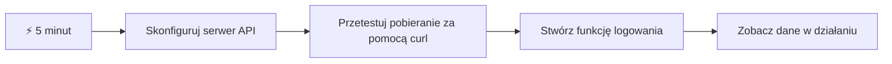
- **Minuty 1-2**: Uruchom serwer API (`cd api && npm start`) i przetestuj połączenie
- **Minuta 3**: Utwórz podstawową funkcję `getAccount()` używając fetch
- **Minuta 4**: Podłącz formularz logowania z `action="javascript:login()"`
- **Minuta 5**: Przetestuj logowanie i obserwuj dane konta w konsoli

**Szybkie polecenia testowe**:
```bash
# Sprawdź, czy API działa
curl http://localhost:5000/api

# Przetestuj pobieranie danych konta
curl http://localhost:5000/api/accounts/test
```

**Dlaczego to ważne**: W ciągu 5 minut zobaczysz magię asynchronicznego pobierania danych, która napędza każdą nowoczesną aplikację webową. To fundament, który sprawia, że aplikacje są responsywne i żywe.

## 🗺️ Twoja podróż edukacyjna przez aplikacje webowe oparte na danych

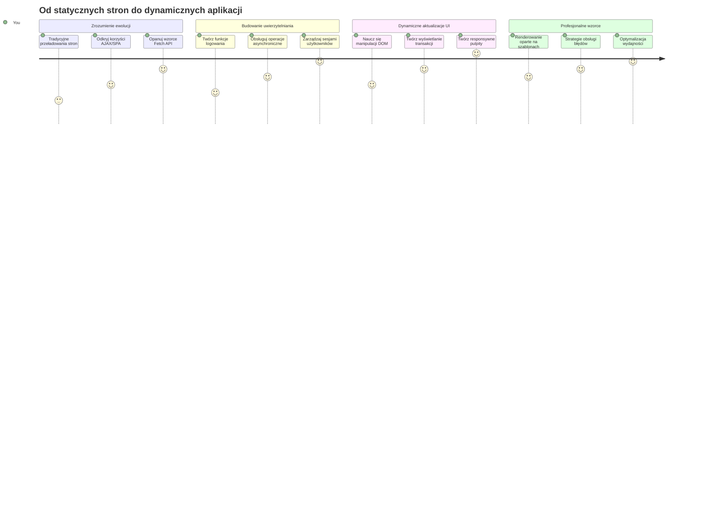
**Cel twojej podróży**: Na koniec tej lekcji zrozumiesz, jak nowoczesne aplikacje webowe pobierają, przetwarzają i wyświetlają dane dynamicznie, tworząc płynne doświadczenia użytkownika, których oczekujemy od profesjonalnych aplikacji.

## Quiz przed wykładem

[Quiz przed wykładem](https://ff-quizzes.netlify.app/web/quiz/45)

### Wymagania wstępne

Zanim zagłębisz się w pobieranie danych, upewnij się, że masz gotowe następujące elementy:

- **Poprzednia lekcja**: Ukończ [formularz logowania i rejestracji](../2-forms/README.md) – na tym zbudujemy
- **Lokalny serwer**: Zainstaluj [Node.js](https://nodejs.org) i [uruchom serwer API](../api/README.md), który dostarczy dane konta
- **Połączenie z API**: Przetestuj połączenie z serwerem tym poleceniem:

```bash
curl http://localhost:5000/api
# Oczekiwana odpowiedź: "Bank API v1.0.0"
```

Ten szybki test zapewnia prawidłową komunikację komponentów:
- Sprawdza, czy Node.js działa poprawnie na twoim systemie
- Potwierdza, że serwer API jest aktywny i odpowiada
- Weryfikuje, czy aplikacja może połączyć się z serwerem (jak sprawdzenie łączności radiowej przed misją)

## 🧠 Przegląd ekosystemu zarządzania danymi

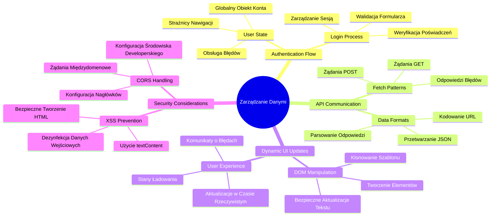
**Podstawowa zasada**: Nowoczesne aplikacje webowe to systemy orkiestracji danych – koordynują interfejsy użytkownika, serwery API i modele bezpieczeństwa przeglądarki, by tworzyć płynne i responsywne doświadczenia.

---

## Zrozumienie pobierania danych w nowoczesnych aplikacjach webowych

Sposób, w jaki aplikacje internetowe obsługują dane, znacznie ewoluował w ciągu ostatnich dwóch dekad. Zrozumienie tej ewolucji pomoże ci docenić, dlaczego nowoczesne techniki, takie jak AJAX i Fetch API, są tak potężne i dlaczego stały się niezbędnymi narzędziami dla deweloperów webowych.

Przyjrzyjmy się, jak działały tradycyjne strony internetowe w porównaniu z dynamicznymi i responsywnymi aplikacjami, które tworzymy dziś.

### Tradycyjne aplikacje wielostronicowe (MPA)

Na wczesnym etapie internetu każde kliknięcie było jak zmiana kanału w starym telewizorze – ekran robił się czarny, a następnie powoli ładował nową zawartość. Tak wyglądały wczesne aplikacje webowe, gdzie każda interakcja oznaczała kompletne przeładowanie całej strony.

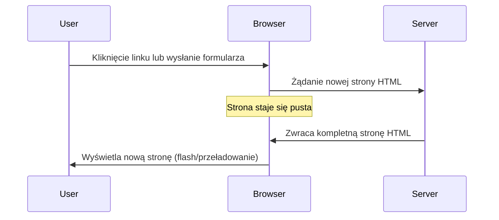
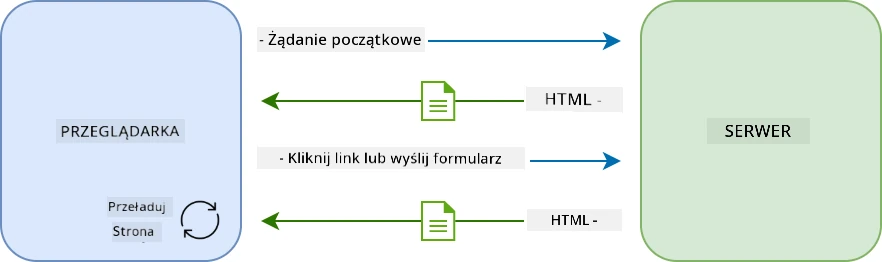

**Dlaczego to było niewygodne:**
- Każde kliknięcie powodowało całkowite przeładowanie strony
- Użytkownicy byli przerywani w trakcie myślenia przez irytujące migotanie strony
- Twoje łącze internetowe pracowało na pełnych obrotach, wielokrotnie pobierając ten sam nagłówek i stopkę
- Aplikacje bardziej przypominały przeklikiwanie się przez szafki z dokumentami niż obsługę oprogramowania

### Nowoczesne aplikacje jednowstronicowe (SPA)

AJAX (Asynchronous JavaScript and XML) całkowicie zmienił ten schemat. Podobnie jak modułowa konstrukcja Międzynarodowej Stacji Kosmicznej, gdzie astronauci mogą wymieniać poszczególne elementy bez przebudowy całej struktury, AJAX pozwala aktualizować konkretne części strony bez przeładowywania całości. Mimo że w nazwie jest XML, obecnie używamy głównie JSON, ale idea pozostaje ta sama: aktualizujemy tylko to, co trzeba zmienić.

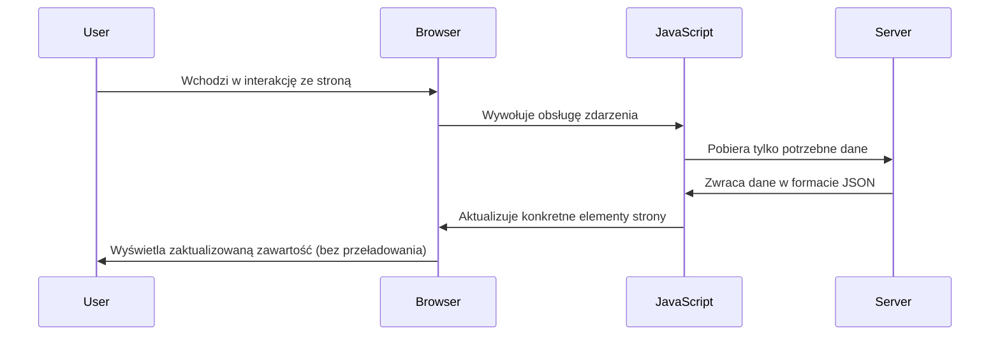
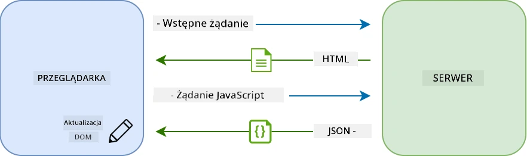

**Dlaczego SPAs działają dużo lepiej:**
- Aktualizują tylko zmienione fragmenty (sprytne, prawda?)
- Brak uciążliwych przerw – użytkownicy płynnie wykonują swoje zadania
- Mniej danych przesyłanych przez sieć oznacza szybsze ładowanie
- Wszystko działa szybko i responsywnie, jak aplikacje na telefonie

### Ewolucja do nowoczesnego Fetch API

Nowoczesne przeglądarki oferują [`Fetch` API](https://developer.mozilla.org/docs/Web/API/Fetch_API), które zastępuje starszy [`XMLHttpRequest`](https://developer.mozilla.org/docs/Web/API/XMLHttpRequest/Using_XMLHttpRequest). To jak przejście od używania telegrafu do korzystania z poczty elektronicznej – Fetch API opiera się na promise’ach dla czystszego kodu asynchronicznego i naturalnie obsługuje JSON.

| Funkcja | XMLHttpRequest | Fetch API |
|---------|----------------|----------|
| **Składnia** | Złożona, oparta na callbackach | Czysta, oparta na promise’ach |
| **Obsługa JSON** | Wymaga ręcznego parsowania | Wbudowana metoda `.json()` |
| **Obsługa błędów** | Ograniczone informacje | Szczegółowe dane o błędach |
| **Wsparcie nowoczesne** | Zgodność wsteczna | Promise i async/await ES6+ |

> 💡 **Kompatybilność przeglądarek**: Dobra wiadomość – Fetch API działa we wszystkich nowoczesnych przeglądarkach! Jeśli interesują cię konkretne wersje, [caniuse.com](https://caniuse.com/fetch) ma pełną listę kompatybilności.
> 
**Podsumowując:**
- Świetnie działa w Chrome, Firefox, Safari i Edge (praktycznie wszędzie tam, gdzie są twoi użytkownicy)
- Tylko Internet Explorer wymaga dodatkowej obsługi (szczerze mówiąc, czas pożegnać IE)
- Idealnie przygotowuje do elegantnych wzorców async/await, które wykorzystamy później

### Implementacja logowania użytkownika i pobierania danych

Teraz zaimplementujemy system logowania, który zmieni twoją aplikację bankową z statycznego widoku w funkcjonalną aplikację. Podobnie jak protokoły uwierzytelniania używane w bezpiecznych obiektach wojskowych, zweryfikujemy dane użytkownika i udzielimy dostępu do jego danych.

Zbudujemy to krok po kroku, zaczynając od podstawowej autoryzacji, a potem dodając pobieranie danych.

#### Krok 1: Utwórz fundament funkcji logowania

Otwórz plik `app.js` i dodaj nową funkcję `login`, która będzie obsługiwać proces logowania użytkownika:

```javascript
async function login() {
  const loginForm = document.getElementById('loginForm');
  const user = loginForm.user.value;
}
```

**Wyjaśnienie:**
- Słowo kluczowe `async` mówi JavaScriptowi, że ta funkcja może wymagać oczekiwania na operacje
- Pobieramy formularz z strony (nic specjalnego, tylko szukamy po ID)
- Wyciągamy wpisaną przez użytkownika nazwę użytkownika
- Sprytny trik: możesz odwoływać się do dowolnego pola formularza po jego nazwie (`name`) – nie trzeba dodatkowych getElementById!

> 💡 **Wzorzec dostępu do formularza**: Każdy element formularza można uzyskać jako własność formularza po jego nazwie (ustawionej w atrybucie `name` w HTML). To zapewnia czytelny sposób na pobieranie danych z formularza.

#### Krok 2: Utwórz funkcję pobierania danych konta

Następnie stwórz dedykowaną funkcję, która pobierze dane konta z serwera. Postępuje podobnie jak funkcja rejestracji, ale skupia się na pobieraniu danych:

```javascript
async function getAccount(user) {
  try {
    const response = await fetch('//localhost:5000/api/accounts/' + encodeURIComponent(user));
    return await response.json();
  } catch (error) {
    return { error: error.message || 'Unknown error' };
  }
}
```

**Co robi ten kod:**
- **Używa** nowoczesnego `fetch` do asynchronicznego pobierania danych
- **Tworzy** URL żądania GET z parametrem nazwy użytkownika
- **Zastosowuje** `encodeURIComponent()` dla bezpiecznego kodowania znaków specjalnych w URL
- **Konwertuje** odpowiedź na format JSON dla łatwej obsługi danych
- **Obsługuje** błędy, zwracając obiekt błędu zamiast awarii

> ⚠️ **Uwaga bezpieczeństwa**: Funkcja `encodeURIComponent()` obsługuje znaki specjalne w URL, podobnie jak systemy kodowania w komunikacji morskiej. Zapewnia, że wiadomość dotrze dokładnie tak, jak zamierzasz, zapobiegając niepoprawnej interpretacji znaków takich jak "#" czy "&".
> 
**Dlaczego to ważne:**
- Zapobiega zepsuciu URL przez specjalne znaki
- Chroni przed atakami manipulacji URL
- Gwarantuje, że serwer otrzyma właściwe dane
- Stosuje dobre praktyki bezpieczeństwa

#### Zrozumienie zapytań HTTP GET

Może cię zdziwić, że korzystając z `fetch` bez dodatkowych opcji, automatycznie wysyłasz żądanie [`GET`](https://developer.mozilla.org/docs/Web/HTTP/Methods/GET). To idealne do naszego celu – pytania serwera „hej, czy mogę zobaczyć dane konta tego użytkownika?”.

Pomyśl o żądaniach GET jak o uprzejmym wypożyczaniu książki z biblioteki – prosisz o obejrzenie czegoś, co już istnieje. Żądania POST (które stosowaliśmy podczas rejestracji) są bardziej jak przesłanie nowej książki do kolekcji.

| Żądanie GET | Żądanie POST |
|-------------|-------------|
| **Cel** | Pobranie istniejących danych | Wysłanie nowych danych na serwer |
| **Parametry** | W ścieżce URL lub ciągu zapytania | W ciele żądania |
| **Cache** | Może być buforowane przez przeglądarki | Zazwyczaj nie jest buforowane |
| **Bezpieczeństwo** | Widoczne w URL i logach | Ukryte w ciele żądania |

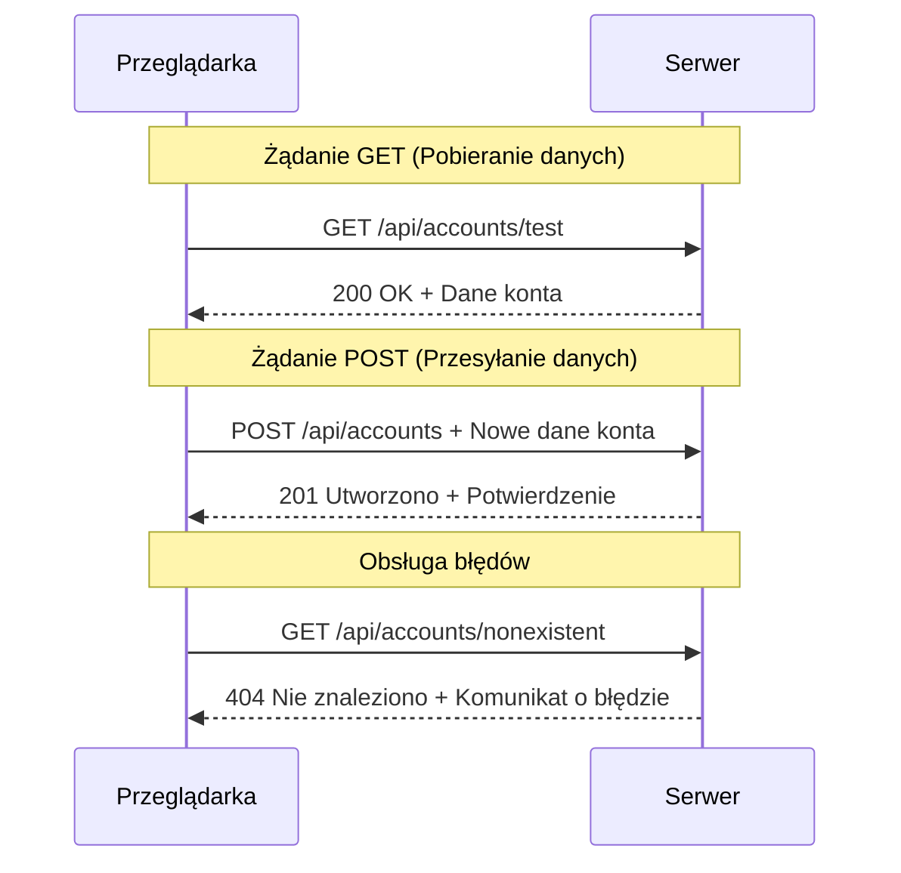
#### Krok 3: Połącz wszystko razem

Teraz przyjemna część – połącz funkcję pobierania konta z procesem logowania. To tutaj wszystko się zazębia:

```javascript
async function login() {
  const loginForm = document.getElementById('loginForm');
  const user = loginForm.user.value;
  const data = await getAccount(user);

  if (data.error) {
    return console.log('loginError', data.error);
  }

  account = data;
  navigate('/dashboard');
}
```

Ta funkcja wykonuje następujące kroki:
- Pobiera nazwę użytkownika z formularza
- Żąda danych konta użytkownika od serwera
- Obsługuje ewentualne błędy podczas tego procesu
- Przechowuje dane konta i przechodzi do panelu użytkownika po sukcesie

> 🎯 **Wzorzec async/await**: Ponieważ `getAccount` jest funkcją asynchroniczną, używamy słowa kluczowego `await`, aby zatrzymać wykonanie do momentu, gdy serwer odpowie. Zapobiega to dalszemu wykonywaniu kodu z niezdefiniowanymi danymi.

#### Krok 4: Utwórz miejsce na dane

Twoja aplikacja potrzebuje miejsca, by zapamiętać informacje o koncie po ich załadowaniu. To jak krótkotrwała pamięć twojej aplikacji – miejsce, gdzie możesz mieć pod ręką dane bieżącego użytkownika. Dodaj tę linię na początku swojego pliku `app.js`:

```javascript
// To przechowuje dane konta aktualnego użytkownika
let account = null;
```

**Dlaczego tego potrzebujemy:**
- Umożliwia dostęp do danych konta z dowolnego miejsca aplikacji
- Początkowa wartość `null` oznacza „nikt jeszcze się nie zalogował”
- Aktualizuje się, gdy ktoś się skutecznie zaloguje lub zarejestruje
- Działa jak jedno źródło prawdy – brak zamieszania, kto jest zalogowany

#### Krok 5: Podłącz formularz

Teraz podłącz nową funkcję logowania do formularza HTML. Zaktualizuj tag formularza tak:

```html
<form id="loginForm" action="javascript:login()">
  <!-- Your existing form inputs -->
</form>
```

**Co zmienia ta drobna modyfikacja:**
- Powstrzymuje domyślne zachowanie formularza polegające na przeładowaniu całej strony
- Wywołuje twoją niestandardową funkcję JavaScript
- Utrzymuje płynność i styl aplikacji jednowstronicowej
- Daje pełną kontrolę nad tym, co się dzieje po kliknięciu „Zaloguj”

#### Krok 6: Ulepsz funkcję rejestracji

Dla spójności zaktualizuj funkcję `register`, aby także zapisywała dane konta i przechodziła do panelu użytkownika:

```javascript
// Dodaj te linie na końcu funkcji rejestracji
account = result;
navigate('/dashboard');
```

**Ta poprawka zapewnia:**
- **Płynne** przejście z rejestracji do panelu użytkownika
- **Spójne** doświadczenie użytkownika pomiędzy logowaniem a rejestracją
- **Natychmiastowy** dostęp do danych konta po pomyślnej rejestracji

#### Testowanie implementacji

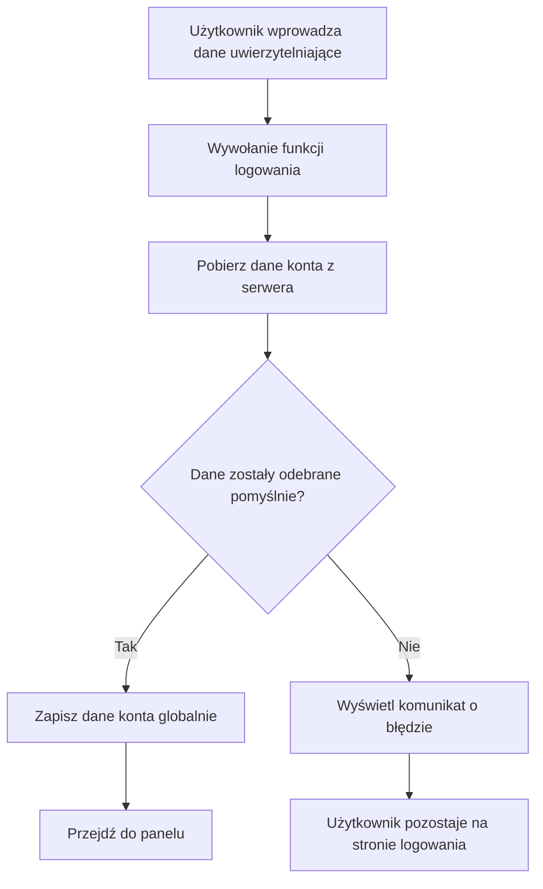
**Czas sprawdzić działanie:**
1. Utwórz nowe konto, by upewnić się, że wszystko działa
2. Spróbuj zalogować się tymi samymi danymi
3. Sprawdź konsolę przeglądarki (F12), jeśli coś jest nie tak
4. Upewnij się, że po zalogowaniu trafiasz do panelu użytkownika

Jeśli coś nie działa, nie panikuj! Większość problemów można naprawić prostymi poprawkami, jak literówki lub brak uruchomionego serwera API.

#### Szybka uwaga o magii cross-origin

Możesz się zastanawiać: „Jak moja aplikacja webowa komunikuje się z serwerem API, skoro działają na różnych portach?” Dobre pytanie! To temat, na który każdy web developer kiedyś natrafia.

> 🔒 **Bezpieczeństwo cross-origin**: Przeglądarki stosują „zasadę tego samego pochodzenia” (same-origin policy), aby zapobiegać nieautoryzowanej komunikacji między różnymi domenami. Podobnie jak system kontroli bezpieczeństwa w Pentagonie, weryfikują, czy komunikacja jest autoryzowana przed zezwoleniem na transfer danych.
> 
**W naszej konfiguracji:**
- Twoja aplikacja działa na `localhost:3000` (serwer deweloperski)
- Serwer API działa na `localhost:5000` (serwer backendowy)
- Serwer API zawiera [nagłówki CORS](https://developer.mozilla.org/docs/Web/HTTP/CORS), które wyraźnie pozwalają na komunikację z twoją aplikacją webową

To odzwierciedla rzeczywiste środowisko deweloperskie, gdzie frontend i backend zwykle działają na osobnych serwerach.

> 📚 **Dowiedz się więcej**: Zgłębiaj API i pobieranie danych dzięki temu obszernemu [modułowi Microsoft Learn o API](https://docs.microsoft.com/learn/modules/use-apis-discover-museum-art/?WT.mc_id=academic-77807-sagibbon).

## Ożywianie danych w HTML

Teraz uczynimy pobrane dane widocznymi dla użytkowników poprzez manipulację DOM. Tak jak podczas wywoływania zdjęć w ciemni, bierzemy niewidzialne dane i przekształcamy je w coś, co użytkownicy mogą zobaczyć i z czym mogą wejść w interakcję.
Manipulacja DOM to technika, która przekształca statyczne strony internetowe w dynamiczne aplikacje, aktualizujące swoją zawartość na podstawie interakcji użytkownika i odpowiedzi serwera.

### Wybór odpowiedniego narzędzia

Jeśli chodzi o aktualizację HTML za pomocą JavaScript, masz do dyspozycji kilka opcji. Pomyśl o nich jak o różnych narzędziach w skrzynce - każde idealne do określonych zadań:

| Metoda | Do czego się świetnie nadaje | Kiedy jej używać | Poziom bezpieczeństwa |
|--------|------------------------------|------------------|-----------------------|
| `textContent` | Bezpieczne wyświetlanie danych użytkownika | Zawsze gdy pokazujesz tekst | ✅ Niezawodna |
| `createElement()` + `append()` | Tworzenie złożonych układów | Tworzenie nowych sekcji/list | ✅ Solidna |
| `innerHTML` | Ustawianie zawartości HTML | ⚠️ Lepiej unikać | ❌ Ryzykowna |

#### Bezpieczny sposób na wyświetlanie tekstu: textContent

Właściwość [`textContent`](https://developer.mozilla.org/docs/Web/API/Node/textContent) to twój najlepszy sprzymierzeniec przy wyświetlaniu danych użytkownika. To jak ochroniarz twojej strony - nic szkodliwego nie przejdzie:

```javascript
// Bezpieczny, niezawodny sposób aktualizacji tekstu
const balanceElement = document.getElementById('balance');
balanceElement.textContent = account.balance;
```

**Zalety używania textContent:**
- Traktuje wszystko jak zwykły tekst (zapobiega wykonywaniu skryptów)
- Automatycznie czyści istniejącą zawartość
- Wydajne przy prostych aktualizacjach tekstu
- Zapewnia wbudowaną ochronę przed złośliwą zawartością

#### Tworzenie dynamicznych elementów HTML

Dla bardziej złożonej zawartości połącz [`document.createElement()`](https://developer.mozilla.org/docs/Web/API/Document/createElement) z metodą [`append()`](https://developer.mozilla.org/docs/Web/API/ParentNode/append):

```javascript
// Bezpieczny sposób tworzenia nowych elementów
const transactionItem = document.createElement('div');
transactionItem.className = 'transaction-item';
transactionItem.textContent = `${transaction.date}: ${transaction.description}`;
container.append(transactionItem);
```

**Co robi to podejście:**
- **Tworzy** nowe elementy DOM programistycznie
- **Pozwala zachować** pełną kontrolę nad atrybutami i zawartością elementów
- **Umożliwia** tworzenie złożonych, zagnieżdżonych struktur
- **Zachowuje** bezpieczeństwo przez oddzielenie struktury od zawartości

> ⚠️ **Kwestionariusz bezpieczeństwa**: Choć [`innerHTML`](https://developer.mozilla.org/docs/Web/API/Element/innerHTML) pojawia się w wielu tutorialach, może wykonywać osadzone skrypty. Podobnie jak protokoły bezpieczeństwa CERN, które zapobiegają nieautoryzowanemu wykonywaniu kodu, stosowanie `textContent` i `createElement` zapewnia bezpieczniejsze alternatywy.
> 
**Ryzyka dotyczące innerHTML:**
- Wykonuje wszystkie znaczniki `<script>` w danych użytkownika
- Narażone na ataki typu wstrzyknięcie kodu
- Tworzy potencjalne luki bezpieczeństwa
- Bezpieczniejsze alternatywy zapewniają tę samą funkcjonalność

### Uczynienie błędów przyjaznymi dla użytkownika

Obecnie błędy logowania pojawiają się tylko w konsoli przeglądarki, która jest niewidoczna dla użytkowników. Jak różnica między wewnętrzną diagnostyką pilota a systemem informacji dla pasażerów, musimy przekazywać ważne informacje odpowiednim kanałem.

Implementacja widocznych komunikatów o błędach daje użytkownikom natychmiastową informację zwrotną, co poszło nie tak i jak dalej postępować.

#### Krok 1: Dodaj miejsce na komunikaty o błędach

Najpierw daj komunikatom o błędach swoje miejsce w HTML. Dodaj to tuż przed przyciskiem logowania, aby użytkownicy widzieli je naturalnie:

```html
<!-- This is where error messages will appear -->
<div id="loginError" role="alert"></div>
<button>Login</button>
```

**Co się tu dzieje:**
- Tworzymy pusty kontener, który jest niewidoczny, dopóki nie jest potrzebny
- Umieszczony jest tam, gdzie użytkownicy patrzą po kliknięciu "Zaloguj się"
- `role="alert"` to miły dodatek dla czytników ekranu – mówi technologii wspomagającej „hej, to ważne!”
- Unikalne `id` daje naszemu JavaScript łatwy cel

#### Krok 2: Stwórz pomocniczą funkcję

Zróbmy małą funkcję pomocniczą, która może aktualizować tekst dowolnego elementu. To taka funkcja „napisz raz, używaj wszędzie”, która zaoszczędzi ci czasu:

```javascript
function updateElement(id, text) {
  const element = document.getElementById(id);
  element.textContent = text;
}
```

**Zalety funkcji:**
- Prosty interfejs wymagający tylko ID elementu i tekstu
- Bezpiecznie lokalizuje i aktualizuje elementy DOM
- Reużywalny wzorzec, który zmniejsza powielanie kodu
- Utrzymuje spójne zachowanie aktualizacji w całej aplikacji

#### Krok 3: Pokazuj błędy tam, gdzie użytkownicy je widzą

Teraz zastąp ukrytą wiadomość w konsoli czymś, co użytkownicy faktycznie zobaczą. Zaktualizuj swoją funkcję logowania:

```javascript
// Zamiast tylko logować do konsoli, pokaż użytkownikowi, co jest nie tak
if (data.error) {
  return updateElement('loginError', data.error);
}
```

**Ta mała zmiana robi wielką różnicę:**
- Komunikaty o błędach pojawiają się tam, gdzie użytkownicy patrzą
- Koniec z tajemniczymi, cichymi awariami
- Użytkownicy otrzymują natychmiastową, praktyczną informację zwrotną
- Twoja aplikacja zaczyna wyglądać profesjonalnie i przemyślanie

Teraz, gdy przetestujesz z nieprawidłowym kontem, zobaczysz pomocny komunikat o błędzie bezpośrednio na stronie!


#### Krok 4: Być inkluzywnym dzięki dostępności

Oto coś fajnego z tym `role="alert"`, który wcześniej dodaliśmy - to nie tylko ozdoba! Ten atrybut tworzy tzw. [Live Region](https://developer.mozilla.org/docs/Web/Accessibility/ARIA/ARIA_Live_Regions), który natychmiast ogłasza zmiany czytnikom ekranu:

```html
<div id="loginError" role="alert"></div>
```

**Dlaczego to ważne:**
- Użytkownicy czytników ekranu usłyszą komunikat o błędzie, gdy tylko się pojawi
- Wszyscy dostają te same ważne informacje, bez względu na sposób nawigacji
- To prosty sposób, by sprawić, że twoja aplikacja będzie działać dla więcej osób
- Pokazuje, że dbasz o tworzenie inkluzywnych doświadczeń

Takie drobne detale odróżniają dobrych programistów od świetnych!

### 🎯 Sprawdzian pedagogiczny: Wzorce autoryzacji

**Zatrzymaj się i przemyśl**: Właśnie zaimplementowałeś kompletny flow uwierzytelniania. To podstawowy wzorzec w web developmencie.

**Szybka autoewaluacja**:
- Czy potrafisz wyjaśnić, dlaczego używamy async/await do wywołań API?
- Co by się stało, gdybyśmy zapomnieli o funkcji `encodeURIComponent()`?
- W jaki sposób obsługa błędów poprawia doświadczenie użytkownika?

**Powiązanie z rzeczywistością**: Wzorce, których się tutaj uczysz (asynchroniczne pobieranie danych, obsługa błędów, informowanie użytkownika), są używane we wszystkich głównych aplikacjach sieciowych - od platform społecznościowych po sklepy internetowe. Budujesz umiejętności na poziomie produkcyjnym!

**Pytanie wyzwania**: Jak byś zmodyfikował ten system uwierzytelniania, by obsługiwał wiele ról użytkowników (klient, administrator, kasjer)? Pomyśl o strukturze danych i zmianach w interfejsie użytkownika.

#### Krok 5: Zastosuj ten sam wzorzec w rejestracji

Dla spójności zaimplementuj identyczną obsługę błędów w formularzu rejestracji:

1. **Dodaj** element wyświetlający błędy do formularza rejestracji w HTML:
```html
<div id="registerError" role="alert"></div>
```

2. **Zaktualizuj** funkcję rejestracji, by używała tego samego wzorca wyświetlania błędów:
```javascript
if (data.error) {
  return updateElement('registerError', data.error);
}
```

**Zalety spójnej obsługi błędów:**
- **Zapewnia** jednolite doświadczenie użytkownika we wszystkich formularzach
- **Zmniejsza** obciążenie poznawcze przez stosowanie znanych wzorców
- **Ułatwia** utrzymanie dzięki ponownemu wykorzystaniu kodu
- **Gwarantuje** spełnienie standardów dostępności w całej aplikacji

## Tworzenie twojego dynamicznego dashboardu

Teraz przekształcimy twój statyczny pulpit nawigacyjny w dynamiczny interfejs, który wyświetla rzeczywiste dane konta. Jak różnica między drukowanym rozkładem lotów a tablicami odlotów na żywo na lotniskach, przechodzimy od informacji statycznych do wyświetlaczy reagujących na żywo.

Wykorzystując techniki manipulacji DOM, które poznałeś, stworzymy dashboard, który automatycznie aktualizuje się o aktualne informacje o koncie.

### Poznaj swoje dane

Zanim zaczniemy budować, rzućmy okiem, jakie dane serwer zwraca po pomyślnym zalogowaniu:

```json
{
  "user": "test",
  "currency": "$",
  "description": "Test account",
  "balance": 75,
  "transactions": [
    { "id": "1", "date": "2020-10-01", "object": "Pocket money", "amount": 50 },
    { "id": "2", "date": "2020-10-03", "object": "Book", "amount": -10 },
    { "id": "3", "date": "2020-10-04", "object": "Sandwich", "amount": -5 }
  ]
}
```

**Ta struktura danych zawiera:**
- **`user`**: Idealne do personalizacji doświadczenia („Witamy z powrotem, Sarah!”)
- **`currency`**: Zapewnia poprawne wyświetlanie kwot pieniędzy
- **`description`**: Przyjazna nazwa konta
- **`balance`**: Najważniejsze bieżące saldo
- **`transactions`**: Pełna historia transakcji ze wszystkimi szczegółami

Wszystko, czego potrzebujesz, by zbudować profesjonalnie wyglądający bankowy pulpit!

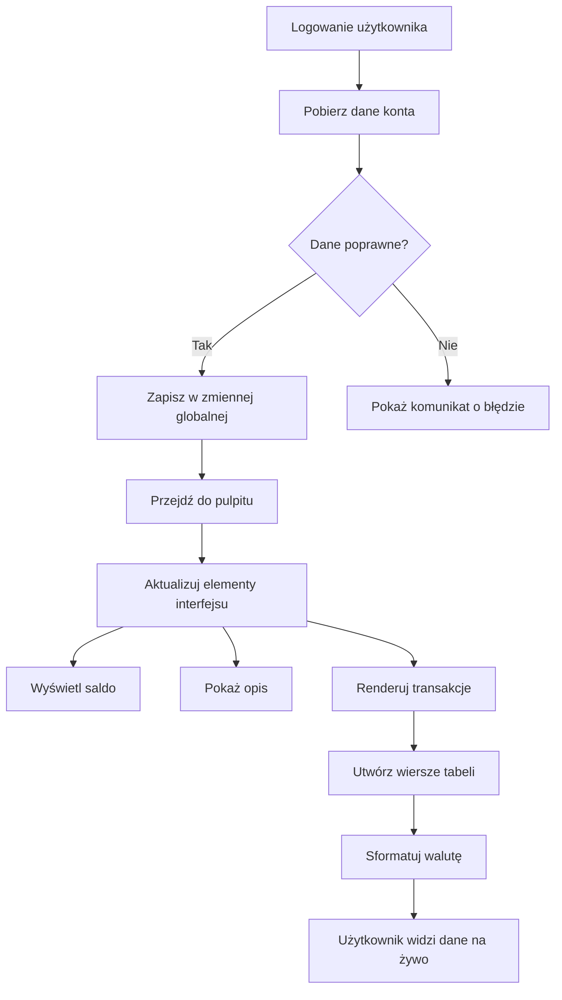
> 💡 **Pro Tip**: Chcesz od razu zobaczyć dashboard w akcji? Użyj nazwy użytkownika `test` podczas logowania - ma wstępnie załadowane przykładowe dane, więc zobaczysz wszystko bez konieczności tworzenia transakcji.
> 
**Dlaczego konto testowe jest wygodne:**
- Ma realistyczne przykładowe dane już załadowane
- Świetne do zobaczenia jak wyświetlane są transakcje
- Idealne do testowania funkcji dashboardu
- Oszczędza czas i wysiłek potrzebny do ręcznego tworzenia danych testowych

### Tworzenie elementów wyświetlania dashboardu

Zbudujmy interfejs twojego dashboardu krok po kroku, zaczynając od informacji podsumowujących konto, a potem przechodząc do bardziej złożonych funkcji jak listy transakcji.

#### Krok 1: Zaktualizuj strukturę HTML

Najpierw zamień statyczną sekcję „Saldo” na dynamiczne placeholdere, które JavaScript będzie uzupełniał:

```html
<section>
  Balance: <span id="balance"></span><span id="currency"></span>
</section>
```

Następnie dodaj sekcję z opisem konta. Ponieważ pełni ona rolę tytułu treści dashboardu, użyj semantycznego HTML:

```html
<h2 id="description"></h2>
```

**Co oznacza ta struktura HTML:**
- **Używa** oddzielnych elementów `<span>` dla salda i waluty, by mieć nad nimi indywidualną kontrolę
- **Nadaje** unikalne ID dla każdego elementu do celów JavaScript
- **Stosuje** semantykę HTML, używając `<h2>` jako nagłówka opisu konta
- **Tworzy** logiczną hierarchię dla czytników ekranu i SEO

> ✅ **Wgląd w dostępność**: Opis konta funkcjonuje jako tytuł zawartości dashboardu, więc jest oznaczony jako nagłówek. Dowiedz się więcej o tym, jak [struktura nagłówków](https://www.nomensa.com/blog/2017/how-structure-headings-web-accessibility) wpływa na dostępność. Czy potrafisz wskazać inne elementy na stronie, które mogłyby skorzystać z tagów nagłówka?

#### Krok 2: Stwórz funkcję aktualizującą dashboard

Teraz napisz funkcję, która wypełni dashboard rzeczywistymi danymi konta:

```javascript
function updateDashboard() {
  if (!account) {
    return navigate('/login');
  }

  updateElement('description', account.description);
  updateElement('balance', account.balance.toFixed(2));
  updateElement('currency', account.currency);
}
```

**Krok po kroku, co robi ta funkcja:**
- **Sprawdza**, czy dane konta istnieją przed kontynuacją
- **Przekierowuje** niezalogowanych użytkowników z powrotem do strony logowania
- **Aktualizuje** opis konta, używając wielokrotnie stosowanej funkcji `updateElement`
- **Formatuje** saldo, zawsze pokazując dwie cyfry po przecinku
- **Wyświetla** odpowiedni symbol waluty

> 💰 **Formatowanie pieniędzy**: Metoda [`toFixed(2)`](https://developer.mozilla.org/docs/Web/JavaScript/Reference/Global_Objects/Number/toFixed) to zbawienie! Zapewnia, że saldo zawsze wygląda jak prawdziwe pieniądze - „75.00” zamiast tylko „75”. Użytkownicy docenią znajome formatowanie walut.

#### Krok 3: Upewnij się, że dashboard się aktualizuje

Aby dashboard odświeżał się z najnowszymi danymi za każdym razem, gdy ktoś go odwiedza, musimy podpiąć się pod system nawigacji. Jeśli zrobiłeś [zadanie lekcji 1](../1-template-route/assignment.md), powinno to być znajome. Jeśli nie, oto co musisz zrobić:

Dodaj to na koniec swojej funkcji `updateRoute()`:

```javascript
if (typeof route.init === 'function') {
  route.init();
}
```

Następnie zaktualizuj trasy, aby uwzględnić inicjalizację dashboardu:

```javascript
const routes = {
  '/login': { templateId: 'login' },
  '/dashboard': { templateId: 'dashboard', init: updateDashboard }
};
```

**Co robi ten sprytny układ:**
- Sprawdza, czy trasa ma specjalny kod inicjalizacji
- Automatycznie uruchamia ten kod po załadowaniu trasy
- Zapewnia, że dashboard zawsze pokazuje świeże dane
- Utrzymuje logikę routingu przejrzystą i uporządkowaną

#### Testowanie dashboardu

Po wprowadzeniu tych zmian przetestuj dashboard:

1. **Zaloguj się** na konto testowe
2. **Sprawdź**, czy zostajesz przekierowany na dashboard
3. **Zweryfikuj**, czy opis konta, saldo i waluta wyświetlają się poprawnie
4. **Wyloguj się i zaloguj ponownie**, aby upewnić się, że dane się odświeżają

Twój dashboard powinien teraz pokazywać dynamiczne informacje o koncie, które aktualizują się na podstawie danych zalogowanego użytkownika!

## Budowanie inteligentnych list transakcji za pomocą szablonów

Zamiast ręcznie tworzyć HTML dla każdej transakcji, użyjemy szablonów do automatycznego generowania spójnego formatowania. Jak standaryzowane komponenty w produkcji statków kosmicznych, szablony zapewniają, że każdy wiersz transakcji ma tę samą strukturę i wygląd.

Technika ta skaluję się sprawnie od kilku do tysięcy transakcji, utrzymując konsekwentną wydajność i prezentację.

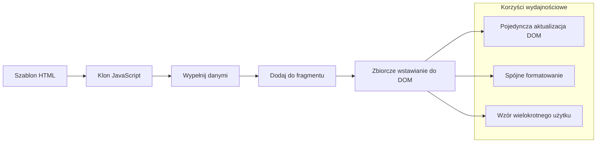

### Krok 1: Stwórz szablon transakcji

Najpierw dodaj wielokrotnie używalny szablon dla wierszy transakcji w twoim HTML `<body>`:

```html
<template id="transaction">
  <tr>
    <td></td>
    <td></td>
    <td></td>
  </tr>
</template>
```

**Co oferują szablony HTML:**
- **Definiują** strukturę pojedynczego wiersza tabeli
- **Pozostają** niewidoczne dopóki nie zostaną sklonowane i wypełnione JS
- **Zawierają** trzy komórki: data, opis i kwota
- **Dostarczają** wzorzec do ponownego użytku zapewniający spójne formatowanie

### Krok 2: Przygotuj tabelę na zawartość dynamiczną

Następnie dodaj `id` do ciała tabeli, aby JavaScript mógł łatwo je zlokalizować:

```html
<tbody id="transactions"></tbody>
```

**Co to osiąga:**
- **Tworzy** wyraźny cel do wstawiania wierszy transakcji
- **Oddziela** strukturę tabeli od zawartości dynamicznej
- **Umożliwia** łatwe czyszczenie i ponowne wypełnianie danymi transakcji

### Krok 3: Zbuduj funkcję-fabrykę wierszy transakcji

Teraz stwórz funkcję, która przekształca dane transakcji w elementy HTML:

```javascript
function createTransactionRow(transaction) {
  const template = document.getElementById('transaction');
  const transactionRow = template.content.cloneNode(true);
  const tr = transactionRow.querySelector('tr');
  tr.children[0].textContent = transaction.date;
  tr.children[1].textContent = transaction.object;
  tr.children[2].textContent = transaction.amount.toFixed(2);
  return transactionRow;
}
```

**Rozbicie tej funkcji-fabryki:**
- **Pobiera** element szablonu po jego ID
- **Klonuje** zawartość szablonu do bezpiecznej manipulacji
- **Wybiera** wiersz tabeli wewnątrz sklonowanej zawartości
- **Wypełnia** każdą komórkę danymi transakcji
- **Formatuje** kwotę, by pokazać poprawne liczby po przecinku
- **Zwraca** gotowy wiersz do wstawienia

### Krok 4: Efektywne generowanie wielu wierszy transakcji

Dodaj ten kod do swojej funkcji `updateDashboard()`, by wyświetlić wszystkie transakcje:

```javascript
const transactionsRows = document.createDocumentFragment();
for (const transaction of account.transactions) {
  const transactionRow = createTransactionRow(transaction);
  transactionsRows.appendChild(transactionRow);
}
updateElement('transactions', transactionsRows);
```

**Jak działa to efektywne podejście:**
- **Tworzy** fragment dokumentu do zbiorczych operacji DOM
- **Przechodzi** przez wszystkie transakcje w danych konta
- **Generuje** wiersz dla każdej transakcji za pomocą funkcji-fabryki
- **Zbiera** wszystkie wiersze w fragmencie przed dodaniem do DOM
- **Wykonuje** pojedynczą aktualizację DOM zamiast wielu pojedynczych wstawek
> ⚡ **Optymalizacja wydajności**: [`document.createDocumentFragment()`](https://developer.mozilla.org/docs/Web/API/Document/createDocumentFragment) działa jak proces montażu w Boeing – komponenty są przygotowywane poza główną linią, a następnie instalowane jako kompletna całość. To podejście partiami minimalizuje przerysowania DOM, wykonując jedno wstawienie zamiast wielu pojedynczych operacji.

### Krok 5: Ulepsz funkcję aktualizacji dla mieszanego kontentu

Twoja funkcja `updateElement()` obecnie obsługuje tylko zawartość tekstową. Zaktualizuj ją, aby działała zarówno z tekstem, jak i węzłami DOM:

```javascript
function updateElement(id, textOrNode) {
  const element = document.getElementById(id);
  element.textContent = ''; // Usuwa wszystkie elementy potomne
  element.append(textOrNode);
}
```

**Kluczowe ulepszenia w tej aktualizacji:**
- **Czyści** istniejącą zawartość przed dodaniem nowej
- **Akceptuje** jako parametry ciągi tekstowe lub węzły DOM
- **Używa** metody [`append()`](https://developer.mozilla.org/docs/Web/API/ParentNode/append) dla elastyczności
- **Zachowuje** kompatybilność wsteczną z istniejącym tekstowym użyciem

### Wypróbuj swój panel w działaniu

Czas na moment prawdy! Zobaczmy, jak działa twój dynamiczny panel:

1. Zaloguj się na konto `test` (zawiera gotowe dane przykładowe)
2. Przejdź do swojego panelu
3. Sprawdź, czy pojawiają się wiersze transakcji z poprawnym formatowaniem
4. Upewnij się, że daty, opisy i kwoty wyglądają poprawnie

Jeśli wszystko działa, powinieneś zobaczyć w pełni funkcjonalną listę transakcji na swoim pulpicie! 🎉

**Co osiągnąłeś:**
- Zbudowałeś panel skalowalny na dowolną ilość danych
- Stworzyłeś wielokrotnego użytku szablony dla spójnego formatowania
- Wdrożyłeś efektywne techniki manipulacji DOM
- Rozwinąłeś funkcjonalność porównywalną do produkcyjnych aplikacji bankowych

Pomyślnie przekształciłeś statyczną stronę internetową w dynamiczną aplikację webową.

### 🎯 Kontrola pedagogiczna: Generowanie dynamicznej zawartości

**Zrozumienie architektury**: Wdrożyłeś zaawansowany pipeline danych do UI, który odzwierciedla wzorce używane w frameworkach takich jak React, Vue i Angular.

**Opanowane kluczowe koncepcje:**
- **Renderowanie oparte na szablonach**: Tworzenie wielokrotnego użytku komponentów UI
- **Fragmenty dokumentu**: Optymalizacja wydajności DOM
- **Bezpieczna manipulacja DOM**: Zapobieganie lukom bezpieczeństwa
- **Transformacja danych**: Konwersja danych z serwera na interfejs użytkownika

**Powiązania z branżą**: Te techniki stanowią fundament współczesnych frameworków frontendowych. Wirtualny DOM Reacta, system szablonów Vue i architektura komponentów Angulara opierają się na tych podstawowych koncepcjach.

**Pytanie do refleksji**: Jak rozszerzyłbyś ten system, by obsługiwał aktualizacje w czasie rzeczywistym (np. automatyczne pojawianie się nowych transakcji)? Rozważ użycie WebSockets lub Server-Sent Events.

---

## 📈 Twoja oś czasu mistrzostwa zarządzania danymi

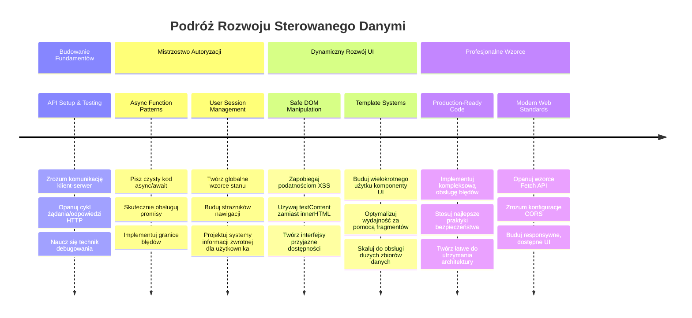
**🎓 Kamień milowy ukończenia**: Pomyślnie stworzyłeś kompletną aplikację webową opartą na danych, wykorzystując nowoczesne wzorce JavaScript. Te umiejętności przekładają się bezpośrednio na pracę z frameworkami takimi jak React, Vue czy Angular.

**🔄 Kolejny poziom umiejętności:**
- Gotowość do eksploracji frameworków frontendowych opartych na tych koncepcjach
- Przygotowanie do implementacji funkcji czasu rzeczywistego z WebSockets
- Wyposażenie w narzędzia do budowy progresywnych aplikacji webowych z możliwością pracy offline
- Fundament do nauki zaawansowanych wzorców zarządzania stanem

## Wyzwaniem Agenta GitHub Copilot 🚀

Użyj trybu Agenta, aby zrealizować następujące wyzwanie:

**Opis:** Rozbuduj aplikację bankową, implementując funkcję wyszukiwania i filtrowania transakcji, która pozwala użytkownikom odnaleźć konkretne transakcje według zakresu dat, kwoty lub opisu.

**Zadanie:** Stwórz funkcjonalność wyszukiwania dla aplikacji bankowej, która będzie zawierać: 1) formularz wyszukiwania z polami na zakres dat (od/do), minimalną/maksymalną kwotę oraz słowa kluczowe opisu transakcji, 2) funkcję `filterTransactions()`, która przefiltruje tablicę account.transactions według kryteriów wyszukiwania, 3) aktualizację funkcji `updateDashboard()`, aby pokazywała przefiltrowane wyniki oraz 4) dodanie przycisku "Wyczyść filtry" do resetowania widoku. Użyj nowoczesnych metod tablic JavaScript, takich jak `filter()`, i obsłuż sytuacje brzegowe dla pustych kryteriów wyszukiwania.

Dowiedz się więcej o [trybie agenta](https://code.visualstudio.com/blogs/2025/02/24/introducing-copilot-agent-mode).

## 🚀 Wyzwanie

Gotowy podnieść swoją aplikację bankową na wyższy poziom? Sprawmy, żeby wyglądała i działała naprawdę świetnie. Oto kilka pomysłów, które rozbudzą twoją kreatywność:

**Uczyń ją piękną**: Dodaj stylizację CSS, aby przekształcić funkcjonalny panel w coś wizualnie atrakcyjnego. Pomyśl o czystych liniach, odpowiednich odstępach i może nawet subtelnych animacjach.

**Zadbaj o responsywność**: Spróbuj użyć [media queries](https://developer.mozilla.org/docs/Web/CSS/Media_Queries), aby stworzyć [responsywny design](https://developer.mozilla.org/docs/Web/Progressive_web_apps/Responsive/responsive_design_building_blocks), który dobrze działa na telefonach, tabletach i komputerach stacjonarnych. Twoi użytkownicy będą ci wdzięczni!

**Dodaj trochę stylu**: Rozważ kodowanie kolorami transakcji (zielony dla przychodów, czerwony dla wydatków), dodanie ikon lub efektów po najechaniu kursorem, które sprawią, że interfejs będzie bardziej interaktywny.

Tak może wyglądać dopracowany panel:

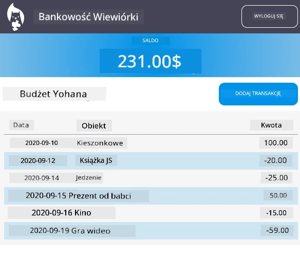

Nie czuj presji, by dokładnie to odwzorować – użyj tego jako inspiracji i dostosuj do siebie!

## Quiz po wykładzie

[Quiz po wykładzie](https://ff-quizzes.netlify.app/web/quiz/46)

## Zadanie

[Refaktoryzuj i komentuj swój kod](assignment.md)

---

<!-- CO-OP TRANSLATOR DISCLAIMER START -->
**Zastrzeżenie**:  
Ten dokument został przetłumaczony za pomocą usługi tłumaczeń AI [Co-op Translator](https://github.com/Azure/co-op-translator). Choć dokładamy starań, aby tłumaczenie było jak najdokładniejsze, należy pamiętać, że automatyczne tłumaczenia mogą zawierać błędy lub nieścisłości. Oryginalny dokument w jego języku źródłowym powinien być traktowany jako źródło autorytatywne. W przypadku informacji krytycznych zaleca się skorzystanie z profesjonalnego tłumaczenia wykonanego przez człowieka. Nie ponosimy odpowiedzialności za jakiekolwiek nieporozumienia lub błędne interpretacje wynikające z użycia tego tłumaczenia.
<!-- CO-OP TRANSLATOR DISCLAIMER END -->