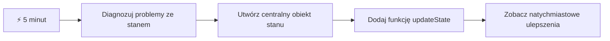
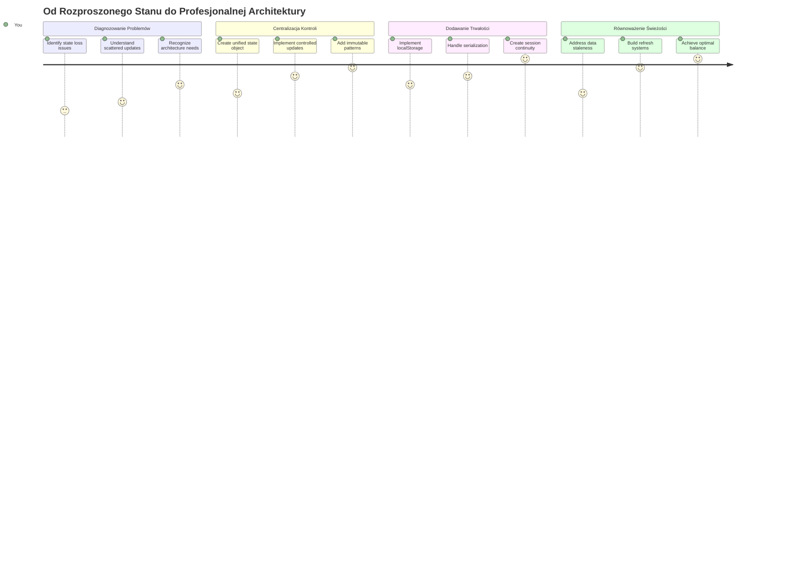
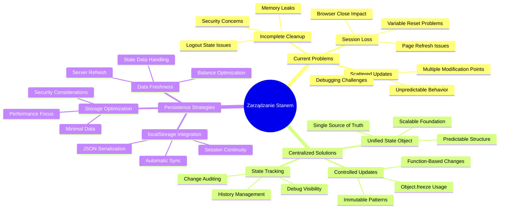
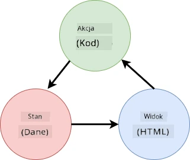
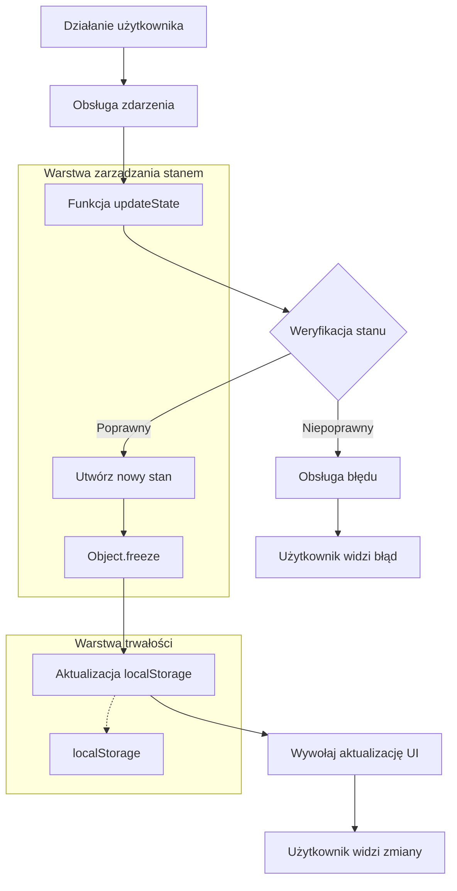
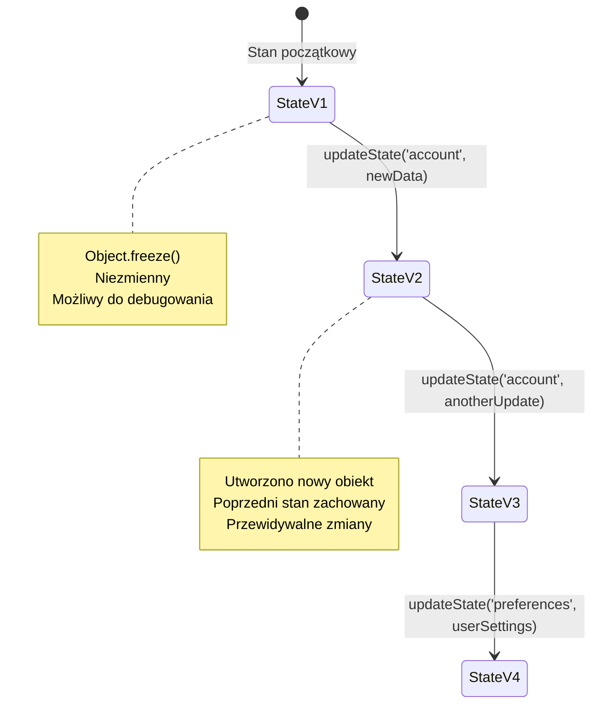
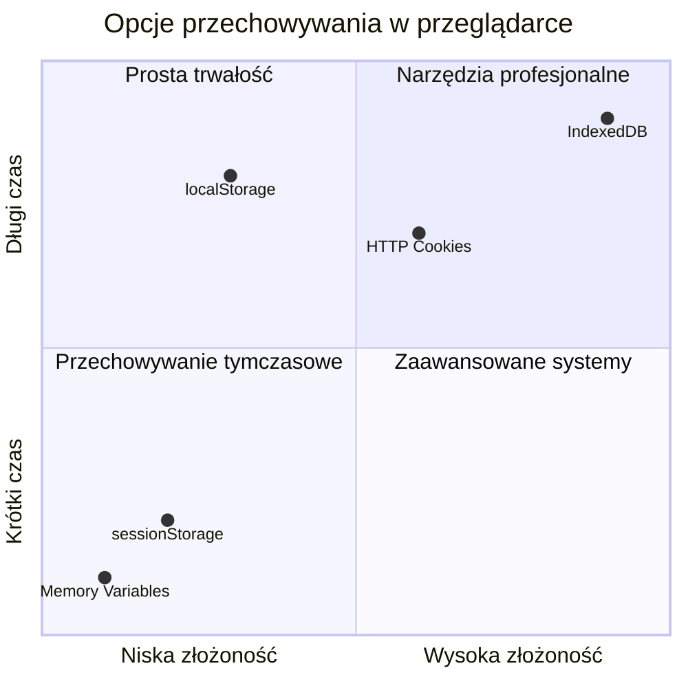
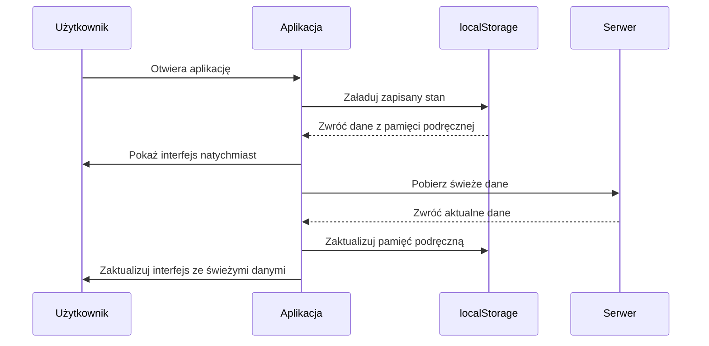
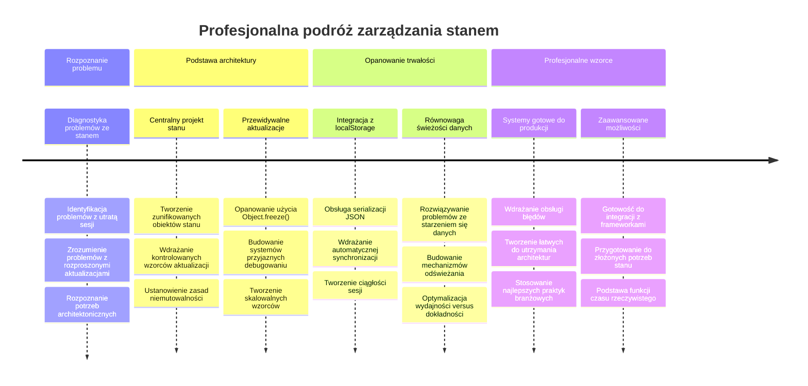
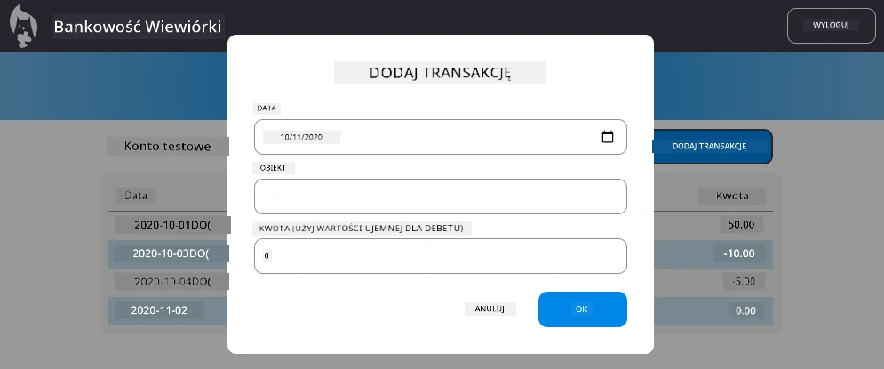

# Budowanie aplikacji bankowej Część 4: Koncepcje zarządzania stanem

## ⚡ Co możesz zrobić w następnych 5 minutach

**Szybka ścieżka startowa dla zapracowanych programistów**


- **Minuta 1**: Przetestuj aktualny problem stanu - zaloguj się, odśwież stronę, obserwuj wylogowanie
- **Minuta 2**: Zamień `let account = null` na `let state = { account: null }`
- **Minuta 3**: Stwórz prostą funkcję `updateState()` do kontrolowanych aktualizacji
- **Minuta 4**: Zaktualizuj jedną funkcję, aby używała nowego wzorca
- **Minuta 5**: Przetestuj poprawioną przewidywalność i łatwość debugowania

**Szybki test diagnostyczny**:
```javascript
// Przed: Rozproszony stan
let account = null; // Utracone po odświeżeniu!

// Po: Centralny stan
let state = Object.freeze({ account: null }); // Kontrolowany i śledzony!
```

**Dlaczego to ważne**: W 5 minut doświadczysz transformacji z chaotycznego zarządzania stanem do przewidywalnych, łatwych do debugowania wzorców. To podstawa, która sprawia, że skomplikowane aplikacje są utrzymywalne.

## 🗺️ Twoja droga nauki przez mistrzostwo zarządzania stanem


**Cel Twojej podróży**: Pod koniec tej lekcji zbudujesz profesjonalny system zarządzania stanem, który obsługuje utrwalanie, świeżość danych i przewidywalne aktualizacje - te same wzorce stosowane w aplikacjach produkcyjnych.

## Quiz przed wykładem

[Quiz przed wykładem](https://ff-quizzes.netlify.app/web/quiz/47)

## Wprowadzenie

Zarządzanie stanem jest jak system nawigacyjny na statku Voyager – gdy wszystko działa płynnie, ledwo zauważasz jego obecność. Ale gdy coś idzie nie tak, to różnica między dotarciem do przestrzeni międzygwiezdnej a dryfowaniem bez celu w kosmicznej pustce. W tworzeniu stron internetowych stan reprezentuje wszystko, co Twoja aplikacja musi zapamiętać: status logowania użytkownika, dane formularza, historię nawigacji i tymczasowe stany interfejsu.

W miarę jak Twoja aplikacja bankowa ewoluowała od prostego formularza logowania do bardziej zaawansowanej aplikacji, prawdopodobnie napotkałeś typowe wyzwania. Odśwież stronę, a użytkownicy są niespodziewanie wylogowani. Zamknij przeglądarkę, a cały postęp znika. Debuggując problem, przeszukujesz wiele funkcji, które modyfikują te same dane na różne sposoby.

To nie są oznaki złego programowania – to naturalne trudności rozwojowe pojawiające się, gdy aplikacje osiągają pewien poziom złożoności. Każdy programista staje wobec tych wyzwań, gdy jego aplikacje przechodzą z "protokołu koncepcji" do "gotowości produkcyjnej".

W tej lekcji zaimplementujemy scentralizowany system zarządzania stanem, który przekształci Twoją aplikację bankową w niezawodną, profesjonalną aplikację. Nauczysz się zarządzać przepływami danych przewidywalnie, utrwalać sesje użytkowników w odpowiedni sposób oraz tworzyć płynne doświadczenie użytkownika, którego wymagają nowoczesne aplikacje webowe.

## Wymagania wstępne

Zanim zagłębisz się w koncepcje zarządzania stanem, musisz mieć poprawnie skonfigurowane środowisko deweloperskie i gotową podstawę aplikacji bankowej. Ta lekcja bazuje bezpośrednio na koncepcjach i kodzie z poprzednich części tego cyklu.

Upewnij się, że masz gotowe następujące elementy przed kontynuacją:

**Wymagane przygotowanie:**
- Ukończ [lekcję pobierania danych](../3-data/README.md) – Twoja aplikacja powinna poprawnie ładować i wyświetlać dane konta
- Zainstaluj [Node.js](https://nodejs.org) na swoim systemie do uruchomienia backendowego API
- Uruchom lokalnie [API serwera](../api/README.md) do obsługi operacji na danych konta

**Testowanie środowiska:**

Sprawdź, czy serwer API działa poprawnie, wykonując tę komendę w terminalu:

```sh
curl http://localhost:5000/api
# -> powinno zwrócić jako rezultat "Bank API v1.0.0"
```

**Co robi ta komenda:**
- **Wysyła** żądanie GET do lokalnego serwera API
- **Testuje** połączenie i sprawdza, czy serwer odpowiada
- **Zwraca** informacje o wersji API, jeśli wszystko działa prawidłowo

## 🧠 Przegląd architektury zarządzania stanem


**Główna zasada**: Profesjonalne zarządzanie stanem to równowaga między przewidywalnością, utrwalaniem danych i wydajnością, aby tworzyć niezawodne doświadczenia użytkownika, które skalują się od prostych interakcji do złożonych przepływów aplikacji.

---

## Diagnozowanie bieżących problemów ze stanem

Jak Sherlock Holmes badający miejsce zbrodni, musimy dokładnie zrozumieć, co dzieje się w naszej obecnej implementacji, zanim rozwiążemy zagadkę znikających sesji użytkowników.

Przeprowadźmy prosty eksperyment, który ujawni wyzwania związane z zarządzaniem stanem:

**🧪 Wypróbuj ten test diagnostyczny:**
1. Zaloguj się do aplikacji bankowej i przejdź do pulpitu nawigacyjnego
2. Odśwież stronę przeglądarki
3. Obserwuj, co dzieje się z Twoim statusem logowania

Jeśli zostaniesz przekierowany z powrotem do ekranu logowania, odkryłeś klasyczny problem z utrwalaniem stanu. Takie zachowanie wynika z faktu, że nasza obecna implementacja przechowuje dane użytkownika w zmiennych JavaScript, które resetują się przy każdym załadowaniu strony.

**Problemy aktualnej implementacji:**

Prosta zmienna `account` z naszej [poprzedniej lekcji](../3-data/README.md) powoduje trzy istotne problemy wpływające na doświadczenie użytkownika i utrzymywalność kodu:

| Problem | Przyczyna techniczna | Wpływ na użytkownika |
|---------|---------------------|---------------------|
| **Utrata sesji** | Odświeżenie strony czyści zmienne JavaScript | Użytkownicy muszą się często ponownie logować |
| **Rozsiane aktualizacje** | Wiele funkcji modyfikuje stan bezpośrednio | Debugowanie staje się coraz trudniejsze |
| **Niepełne czyszczenie** | Wylogowanie nie usuwa wszystkich referencji do stanu | Potencjalne problemy z bezpieczeństwem i prywatnością |

**Wyzwanie architektoniczne:**

Podobnie jak projekt Titanica z podziałem na przedziały, który wydawał się solidny aż do zalania ich wielu jednocześnie, naprawianie tych problemów pojedynczo nie rozwiąże podstawowej kwestii architektonicznej. Potrzebujemy kompleksowego rozwiązania zarządzania stanem.

> 💡 **Co właściwie chcemy osiągnąć?**

[Zarządzanie stanem](https://en.wikipedia.org/wiki/State_management) to tak naprawdę rozwiązanie dwóch fundamentalnych zagadek:

1. **Gdzie są moje dane?**: Śledzenie, jakie informacje posiadamy i skąd pochodzą
2. **Czy wszyscy mają tę samą informację?**: Upewnienie się, że to, co widzą użytkownicy, odpowiada rzeczywistości

**Nasz plan działania:**

Zamiast biegać w kółko, stworzymy system **scentralizowanego zarządzania stanem**. Wyobraź to sobie jak jedną naprawdę zorganizowaną osobę odpowiedzialną za wszystko, co ważne:




**Zrozumienie tego przepływu danych:**
- **Scentralizowany** cały stan aplikacji w jednym miejscu
- **Kieruje** wszystkie zmiany stanu przez kontrolowane funkcje
- **Zapewnia** synchronizację UI z aktualnym stanem
- **Dostarcza** wyraźny, przewidywalny wzorzec zarządzania danymi

> 💡 **Profesjonalna wskazówka**: Ta lekcja skupia się na podstawowych koncepcjach. W przypadku złożonych aplikacji biblioteki takie jak [Redux](https://redux.js.org) oferują bardziej zaawansowane funkcje zarządzania stanem. Zrozumienie tych podstawowych zasad pomoże Ci opanować dowolną bibliotekę zarządzania stanem.

> ⚠️ **Zaawansowany temat**: Nie omówimy automatycznych aktualizacji UI wywoływanych przez zmiany stanu, ponieważ wiąże się to z koncepcjami [programowania reaktywnego](https://en.wikipedia.org/wiki/Reactive_programming). To doskonały kolejny krok na Twojej drodze nauki!

### Zadanie: Scentralizuj strukturę stanu

Zacznijmy przekształcać nasze rozsiane zarządzanie stanem w system scentralizowany. Ten pierwszy krok ustanawia fundament pod wszystkie kolejne ulepszenia.

**Krok 1: Utwórz centralny obiekt stanu**

Zamień prostą deklarację `account`:

```js
let account = null;
```

Na ustrukturyzowany obiekt stanu:

```js
let state = {
  account: null
};
```

**Dlaczego ta zmiana ma znaczenie:**
- **Scentralizowuje** wszystkie dane aplikacji w jednym miejscu
- **Przygotowuje** strukturę do dodania kolejnych właściwości stanu
- **Tworzy** wyraźną granicę między stanem a innymi zmiennymi
- **Ustanawia** wzorzec skalowalny wraz z rozwojem aplikacji

**Krok 2: Zaktualizuj wzorce dostępu do stanu**

Zaktualizuj swoje funkcje, aby korzystały z nowej struktury stanu:

**W funkcjach `register()` i `login()`** zamień:
```js
account = ...
```

Na:
```js
state.account = ...
```

**W funkcji `updateDashboard()`** dodaj na początku tę linię:
```js
const account = state.account;
```

**Co osiągają te aktualizacje:**
- **Utrzymują** istniejącą funkcjonalność, poprawiając strukturę
- **Przygotowują** kod na bardziej zaawansowane zarządzanie stanem
- **Tworzą** spójne wzorce dostępu do danych stanu
- **Ustanawiają** fundament dla scentralizowanych aktualizacji stanu

> 💡 **Uwaga**: Ten refaktoring nie rozwiązuje od razu naszych problemów, ale tworzy niezbędną bazę dla potężnych ulepszeń, które nadejdą!

### 🎯 Sprawdzenie pedagogiczne: zasady centralizacji

**Zatrzymaj się i pomyśl**: właśnie zaimplementowałeś fundament scentralizowanego zarządzania stanem. To kluczowa decyzja architektoniczna.

**Szybka samoocena:**
- Czy potrafisz wyjaśnić, dlaczego centralizacja stanu w jednym obiekcie jest lepsza niż rozsiane zmienne?
- Co się stanie, jeśli zapomnisz zaktualizować funkcję, aby używała `state.account`?
- Jak ten wzorzec przygotowuje Twój kod na bardziej zaawansowane funkcje?

**Powiązanie z rzeczywistością**: Wzorzec centralizacji, którego się nauczyłeś, to podstawa nowoczesnych frameworków takich jak Redux, Vuex czy React Context. Budujesz to samo myślenie architektoniczne, które stosują duże aplikacje.

**Pytanie wyzwania**: Gdybyś musiał dodać preferencje użytkownika (motyw, język) do swojej aplikacji, gdzie byś je dodał w strukturze stanu? Jak by to skalowało?

## Implementacja kontrolowanych aktualizacji stanu

Mając stan scentralizowany, kolejnym krokiem jest ustanowienie kontrolowanych mechanizmów modyfikacji danych. Podejście to zapewnia przewidywalne zmiany stanu i łatwiejsze debugowanie.

Podstawowa zasada przypomina kontrolę ruchu lotniczego: zamiast pozwalać wielu funkcjom na niezależne modyfikowanie stanu, przekażemy wszystkie zmiany przez pojedynczą, kontrolowaną funkcję. Ten wzorzec zapewnia jasny nadzór nad tym, kiedy i jak zmieniają się dane.

**Niezmienność stanu:**

Będziemy traktować nasz obiekt `state` jako [*niezmienny*](https://en.wikipedia.org/wiki/Immutable_object), co oznacza, że nigdy nie modyfikujemy go bezpośrednio. Zamiast tego każda zmiana tworzy nowy obiekt stanu z zaktualizowanymi danymi.

Choć takie podejście na początku może wydawać się mniej wydajne niż modyfikacje bezpośrednie, oferuje znaczne korzyści podczas debugowania, testowania i utrzymywania przewidywalności aplikacji.

**Korzyści z niezmiennego zarządzania stanem:**

| Korzyść | Opis | Wpływ |
|---------|-------|-------|
| **Przewidywalność** | Zmiany zachodzą tylko przez kontrolowane funkcje | Łatwiejsze debugowanie i testowanie |
| **Śledzenie historii** | Każda zmiana stanu tworzy nowy obiekt | Umożliwia funkcje cofania/powtarzania |
| **Zapobieganie efektom ubocznym** | Brak przypadkowych modyfikacji | Zapobiega tajemniczym błędom |
| **Optymalizacja wydajności** | Łatwo wykryć faktyczne zmiany stanu | Umożliwia efektywne aktualizacje UI |

**Niezmienność w JavaScript z `Object.freeze()`:**

JavaScript oferuje [`Object.freeze()`](https://developer.mozilla.org/docs/Web/JavaScript/Reference/Global_Objects/Object/freeze), aby zapobiec modyfikacjom obiektów:

```js
const immutableState = Object.freeze({ account: userData });
// Każda próba modyfikacji immutableState spowoduje wyrzucenie błędu
```

**Co się tutaj dzieje:**
- **Uniemożliwia** bezpośrednie przypisywanie lub usuwanie właściwości
- **Wyrzuca** wyjątki, jeśli podejmowane są próby modyfikacji
- **Zapewnia**, że zmiany stanu muszą przechodzić przez kontrolowane funkcje
- **Tworzy** wyraźny kontrakt, jak można aktualizować stan

> 💡 **Głębsze zanurzenie**: Dowiedz się o różnicy między *płytką* a *głęboką* niezmiennością obiektów w [dokumentacji MDN](https://developer.mozilla.org/docs/Web/JavaScript/Reference/Global_Objects/Object/freeze#What_is_shallow_freeze). Zrozumienie tej różnicy jest kluczowe dla złożonych struktur stanu.


### Zadanie

Stwórzmy nową funkcję `updateState()`:

```js
function updateState(property, newData) {
  state = Object.freeze({
    ...state,
    [property]: newData
  });
}
```

W tej funkcji tworzymy nowy obiekt stanu i kopiujemy dane ze stanu poprzedniego używając [*operatora rozproszenia (`...`)*](https://developer.mozilla.org/docs/Web/JavaScript/Reference/Operators/Spread_syntax#Spread_in_object_literals). Następnie nadpisujemy konkretną właściwość obiektu stanu nowymi danymi, używając [notacji nawiasowej](https://developer.mozilla.org/docs/Web/JavaScript/Guide/Working_with_Objects#Objects_and_properties) `[property]` do przypisania. Na końcu blokujemy obiekt, by zapobiec modyfikacjom, używając `Object.freeze()`. Na razie w stanie przechowujemy tylko właściwość `account`, ale z tym podejściem możesz dodać tyle właściwości, ile potrzebujesz.

Zaktualizujemy również inicjalizację `state`, aby początkowy stan był również zamrożony:

```js
let state = Object.freeze({
  account: null
});
```

Następnie w funkcji `register` zamień przypisanie `state.account = result;` na:

```js
updateState('account', result);
```

To samo zrób w funkcji `login`, zamieniając `state.account = data;` na:

```js
updateState('account', data);
```

Teraz skorzystamy z okazji, aby naprawić problem z nieczyszczeniem danych konta, gdy użytkownik kliknie *Wyloguj się*.

Stwórz nową funkcję `logout()`:

```js
function logout() {
  updateState('account', null);
  navigate('/login');
}
```

W `updateDashboard()` zamień przekierowanie `return navigate('/login');` na `return logout();`

Spróbuj zarejestrować nowe konto, wylogować się i zalogować ponownie, aby upewnić się, że wszystko działa poprawnie.

> Wskazówka: możesz obserwować wszystkie zmiany stanu, dodając `console.log(state)` na końcu `updateState()` i otwierając konsolę narzędzi programistycznych przeglądarki.

## Implementacja utrwalania danych

Problem utraty sesji, który wcześniej zidentyfikowaliśmy, wymaga rozwiązania w postaci utrwalania, które zachowa stan użytkownika pomiędzy sesjami przeglądarki. To przekształca naszą aplikację z tymczasowego doświadczenia w niezawodne, profesjonalne narzędzie.

Pomyśl o tym, jak zegary atomowe utrzymują precyzyjny czas nawet podczas przerw w zasilaniu, przechowując krytyczny stan w pamięci nieulotnej. Podobnie aplikacje webowe potrzebują mechanizmów trwałego przechowywania, aby zachować podstawowe dane użytkownika między sesjami i odświeżeniami strony.

**Strategiczne pytania dotyczące utrwalania danych:**

Zanim zaimplementujesz utrwalanie, rozważ te kluczowe czynniki:

| Pytanie | Kontekst aplikacji bankowej | Wpływ na decyzję |
|----------|-----------------------------|------------------|
| **Czy dane są wrażliwe?** | Saldo konta, historia transakcji | Wybierz bezpieczne metody przechowywania |
| **Jak długo powinno to przechowywać?** | Stan zalogowania vs. tymczasowe preferencje UI | Wybierz odpowiedni czas przechowywania |
| **Czy serwer tego potrzebuje?** | Tokeny uwierzytelniania vs. ustawienia UI | Określ wymagania dotyczące udostępniania |

**Opcje przechowywania w przeglądarce:**

Nowoczesne przeglądarki oferują kilka mechanizmów przechowywania, każdy zaprojektowany do różnych zastosowań:

**Główne API przechowywania:**

1. **[`localStorage`](https://developer.mozilla.org/docs/Web/API/Window/localStorage)**: trwałe [przechowywanie klucz/wartość](https://pl.wikipedia.org/wiki/Baza_danych_klucz-wartość)
   - **Przechowuje** dane przez wiele sesji przeglądarki bezterminowo  
   - **Przetrwa** restarty przeglądarki i ponowne uruchomienia komputera
   - **Zakres** ograniczony do konkretnej domeny witryny
   - **Idealne** do preferencji użytkownika i stanu zalogowania

2. **[`sessionStorage`](https://developer.mozilla.org/docs/Web/API/Window/sessionStorage)**: tymczasowe przechowywanie sesji
   - **Działa** tak samo jak localStorage podczas aktywnej sesji
   - **Usuwa się** automatycznie po zamknięciu zakładki przeglądarki
   - **Świetne** do tymczasowych danych, które nie powinny być przechowywane

3. **[HTTP Cookies](https://developer.mozilla.org/docs/Web/HTTP/Cookies)**: współdzielone z serwerem przechowywanie
   - **Wysyłane automatycznie** z każdym żądaniem do serwera
   - **Idealne** do tokenów [uwierzytelniania](https://pl.wikipedia.org/wiki/Uwierzytelnianie)
   - **Ograniczone** rozmiarowo i mogą wpływać na wydajność

**Wymóg serializacji danych:**

Zarówno `localStorage`, jak i `sessionStorage` przechowują tylko [łańcuchy znaków](https://developer.mozilla.org/docs/Web/JavaScript/Reference/Global_Objects/String):

```js
// Konwertuj obiekty na łańcuchy JSON do przechowywania
const accountData = { user: 'john', balance: 150 };
localStorage.setItem('account', JSON.stringify(accountData));

// Parsuj łańcuchy JSON z powrotem na obiekty podczas pobierania
const savedAccount = JSON.parse(localStorage.getItem('account'));
```

**Zrozumienie serializacji:**
- **Konwertuje** obiekty JavaScript na łańcuchy JSON za pomocą [`JSON.stringify()`](https://developer.mozilla.org/docs/Web/JavaScript/Reference/Global_Objects/JSON/stringify)
- **Odtwarza** obiekty z JSON za pomocą [`JSON.parse()`](https://developer.mozilla.org/docs/Web/JavaScript/Reference/Global_Objects/JSON/parse)
- **Obsługuje** złożone zagnieżdżone obiekty i tablice automatycznie
- **Nie działa** na funkcjach, niezdefiniowanych wartościach i odwołaniach cyklicznych

> 💡 **Opcja zaawansowana**: Dla złożonych aplikacji offline z dużymi zestawami danych rozważ API [`IndexedDB`](https://developer.mozilla.org/docs/Web/API/IndexedDB_API). Zapewnia pełną bazę danych po stronie klienta, ale wymaga bardziej skomplikowanej implementacji.


### Zadanie: Implementacja trwałości w localStorage

Zaimplementujmy trwałe przechowywanie, aby użytkownicy pozostawali zalogowani, dopóki nie wylogują się świadomie. Użyjemy `localStorage` do przechowywania danych konta między sesjami przeglądarki.

**Krok 1: Definiowanie konfiguracji przechowywania**

```js
const storageKey = 'savedAccount';
```

**Co dostarcza ta stała:**
- **Tworzy** spójny identyfikator dla naszych przechowywanych danych
- **Zapobiega** błędom literowym przy odwołaniach do klucza przechowywania
- **Ułatwia** zmianę klucza przechowywania w razie potrzeby
- **Stosuje się** do najlepszych praktyk dla łatwego utrzymania kodu

**Krok 2: Dodanie automatycznej trwałości**

Dodaj ten wiersz na końcu funkcji `updateState()`:

```js
localStorage.setItem(storageKey, JSON.stringify(state.account));
```

**Analiza tego, co się tutaj dzieje:**
- **Konwertuje** obiekt konta na łańcuch JSON do przechowywania
- **Zapisuje** dane używając spójnego klucza przechowywania
- **Wykonuje się** automatycznie przy każdej zmianie stanu
- **Zapewnia**, że przechowywane dane są zawsze zsynchronizowane ze stanem

> 💡 **Korzyść architektoniczna**: Ponieważ centralizowaliśmy wszystkie aktualizacje stanu przez `updateState()`, dodanie trwałości wymagało tylko jednej linijki kodu. To pokazuje siłę dobrych decyzji architektonicznych!

**Krok 3: Przywracanie stanu przy uruchomieniu aplikacji**

Utwórz funkcję inicjalizacyjną do przywracania zapisanych danych:

```js
function init() {
  const savedAccount = localStorage.getItem(storageKey);
  if (savedAccount) {
    updateState('account', JSON.parse(savedAccount));
  }

  // Nasz poprzedni kod inicjalizacyjny
  window.onpopstate = () => updateRoute();
  updateRoute();
}

init();
```

**Zrozumienie procesu inicjalizacji:**
- **Pobiera** wcześniej zapisane dane konta z localStorage
- **Parsuje** łańcuch JSON z powrotem na obiekt JavaScript
- **Aktualizuje** stan poprzez naszą kontrolowaną funkcję aktualizacji
- **Automatycznie przywraca** sesję użytkownika po załadowaniu strony
- **Wykonuje się** przed aktualizacją tras, aby stan był dostępny

**Krok 4: Optymalizacja domyślnej trasy**

Zaktualizuj domyślną trasę, by wykorzystać trwałość:

W `updateRoute()` zamień:
```js
// Zamień na: return navigate('/login');
return navigate('/dashboard');
```

**Dlaczego ta zmiana ma sens:**
- **Wykorzystuje** skutecznie nasz nowy system trwałości
- **Pozwala** dashboardowi obsługiwać kontrole uwierzytelniania
- **Przekierowuje** do logowania automatycznie, jeśli nie ma zapisanej sesji
- **Tworzy** bardziej płynne doświadczenie użytkownika

**Testowanie Twojej implementacji:**

1. Zaloguj się do swojej aplikacji bankowej
2. Odśwież stronę w przeglądarce
3. Sprawdź, czy pozostajesz zalogowany i na dashboardzie
4. Zamknij i ponownie otwórz przeglądarkę
5. Wróć do aplikacji i potwierdź, że nadal jesteś zalogowany

🎉 **Osiągnięcie odblokowane**: Pomyślnie zaimplementowałeś zarządzanie trwałym stanem! Twoja aplikacja teraz działa jak profesjonalne rozwiązanie webowe.

### 🎯 Kontrola pedagogiczna: Architektura trwałości

**Zrozumienie architektury**: Zaimplementowałeś zaawansowaną warstwę trwałości, która równoważy doświadczenie użytkownika i złożoność zarządzania danymi.

**Opanowane kluczowe koncepcje**:
- **Serializacja JSON**: konwersja złożonych obiektów do przechowywalnych łańcuchów znaków
- **Automatyczna synchronizacja**: zmiany stanu wyzwalają trwałe przechowywanie
- **Odzyskiwanie sesji**: aplikacje mogą przywracać kontekst użytkownika po przerwach
- **Centralizacja trwałości**: jedna funkcja update zarządza całym przechowywaniem

**Powiązanie branżowe**: Ten wzorzec trwałości jest fundamentem dla Progressive Web Apps (PWA), aplikacji offline-first i nowoczesnych doświadczeń mobilnych. Budujesz rozwiązanie produkcyjne.

**Pytanie do refleksji**: Jak zmodyfikowałbyś ten system, by obsługiwał wiele kont użytkowników na tym samym urządzeniu? Weź pod uwagę prywatność i bezpieczeństwo.

## Równoważenie trwałości z aktualnością danych

Nasz system trwałości skutecznie utrzymuje sesje użytkowników, ale wprowadza nowy problem: nieświeżość danych. Gdy wielu użytkowników lub aplikacji modyfikuje te same dane na serwerze, lokalny cache staje się przestarzały.

Ta sytuacja przypomina nawigatorów Wikingów, którzy korzystali zarówno z przechowywanych map gwiazd jak i bieżących obserwacji nieba. Mapy zapewniały spójność, ale nawigatorzy potrzebowali świeżych obserwacji by uwzględnić zmienne warunki. Podobnie nasza aplikacja potrzebuje zarówno trwałego stanu użytkownika, jak i aktualnych danych serwera.

**🧪 Odkrywanie problemu świeżości danych:**

1. Zaloguj się na dashboardie na konto `test`
2. Uruchom to polecenie w terminalu, aby zasymulować transakcję z innego źródła:

```sh
curl --request POST \
     --header "Content-Type: application/json" \
     --data "{ \"date\": \"2020-07-24\", \"object\": \"Bought book\", \"amount\": -20 }" \
     http://localhost:5000/api/accounts/test/transactions
```

3. Odśwież stronę dashboardu w przeglądarce
4. Zaobserwuj, czy pojawiła się nowa transakcja

**Co pokazuje ten test:**
- **Pokazuje**, jak localStorage może się stać "przestarzałe"
- **Symuluje** realne scenariusze zmian danych poza Twoją aplikacją
- **Ujawnia** napięcie między trwałością a świeżością danych

**Wyzwanie nieświeżości danych:**

| Problem | Przyczyna | Skutek dla użytkownika |
|---------|-----------|-----------------------|
| **Przestarzałe dane** | localStorage nigdy nie wygasa automatycznie | Użytkownicy widzą nieaktualne informacje |
| **Zmiany serwera** | Inne aplikacje/użytkownicy modyfikują te same dane | Niespójne widoki na różnych platformach |
| **Cache vs. rzeczywistość** | Lokalny cache nie odpowiada stanowi serwera | Zła jakość doświadczenia i dezorientacja |

**Strategia rozwiązania:**

Wdrożymy wzorzec „odśwież przy ładowaniu”, który łączy zalety trwałości z potrzebą świeżych danych. Podejście to utrzymuje płynność doświadczenia użytkownika i zapewnia poprawność danych.


### Zadanie: Implementacja systemu odświeżania danych

Stworzymy system, który automatycznie pobiera świeże dane z serwera, zachowując zalety naszego trwałego zarządzania stanem.

**Krok 1: Utwórz aktualizator danych konta**

```js
async function updateAccountData() {
  const account = state.account;
  if (!account) {
    return logout();
  }

  const data = await getAccount(account.user);
  if (data.error) {
    return logout();
  }

  updateState('account', data);
}
```

**Logika tej funkcji:**
- **Sprawdza**, czy użytkownik jest aktualnie zalogowany (istnieje state.account)
- **Przekierowuje** do wylogowania, jeśli sesja jest nieważna
- **Pobiera** świeże dane konta z serwera używając istniejącej funkcji `getAccount()`
- **Obsługuje** błędy serwera, wylogowując nieprawidłowe sesje
- **Aktualizuje** stan za pomocą naszego kontrolowanego systemu aktualizacji
- **Wyzwala** automatyczną trwałość w localStorage poprzez `updateState()`

**Krok 2: Utwórz obsługę odświeżania dashboardu**

```js
async function refresh() {
  await updateAccountData();
  updateDashboard();
}
```

**Co ta funkcja odświeżania osiąga:**
- **Koordynuje** proces odświeżania danych i aktualizacji UI
- **Oczekuje** na załadowanie świeżych danych przed aktualizacją wyświetlacza
- **Zapewnia**, że dashboard pokazuje najnowsze informacje
- **Utrzymuje** rozdział zarządzania danymi od aktualizacji UI

**Krok 3: Integracja z systemem tras**

Zaktualizuj konfigurację tras, by automatycznie wywoływała odświeżanie:

```js
const routes = {
  '/login': { templateId: 'login' },
  '/dashboard': { templateId: 'dashboard', init: refresh }
};
```

**Jak działa ta integracja:**
- **Wykonuje** funkcję odświeżania za każdym razem, gdy wczytuje się trasa dashboardu
- **Zapewnia**, że zawsze wyświetlane są świeże dane przy nawigacji do dashboardu
- **Utrzymuje** istniejącą strukturę trasy, dodając jednocześnie aktualność danych
- **Dostarcza** spójny wzorzec inicjalizacji specyficznej dla trasy

**Testowanie Twojego systemu odświeżania danych:**

1. Zaloguj się do aplikacji bankowej
2. Uruchom wcześniej podane polecenie curl, aby utworzyć nową transakcję
3. Odśwież stronę dashboardu lub przejdź gdziekolwiek i wróć
4. Sprawdź, czy nowa transakcja pojawiła się od razu

🎉 **Osiągnięto doskonałą równowagę**: Twoja aplikacja łączy teraz płynność trwałego stanu z dokładnością świeżych danych z serwera!

## 📈 Twoja oś czasu mistrzostwa zarządzania stanem


**🎓 Kamień milowy ukończenia**: Pomyślnie zbudowałeś kompletny system zarządzania stanem, używając tych samych zasad, które napędzają Redux, Vuex i inne profesjonalne biblioteki stanu. Te wzorce skalują się od prostych aplikacji do rozwiązań korporacyjnych.

**🔄 Następny poziom możliwości**:
- Gotowość do opanowania frameworków zarządzania stanem (Redux, Zustand, Pinia)
- Przygotowany do implementacji funkcji czasu rzeczywistego z WebSockets
- Wyposażony w narzędzia do tworzenia offline-first Progressive Web Apps
- Podstawa do zaawansowanych wzorców, takich jak maszyny stanów i obserwatory

## Wyzwanie GitHub Copilot Agent 🚀

Użyj trybu Agenta, aby wykonać następujące wyzwanie:

**Opis:** Zaimplementuj kompleksowy system zarządzania stanem z funkcjami cofania i ponawiania (undo/redo) dla aplikacji bankowej. To wyzwanie pozwoli Ci poćwiczyć zaawansowane koncepcje zarządzania stanem, w tym śledzenie historii stanu, niezmienne aktualizacje i synchronizację interfejsu użytkownika.

**Wskazówka:** Stwórz rozszerzony system zarządzania stanem, który zawiera: 1) tablicę historii stanu śledzącą wszystkie poprzednie stany, 2) funkcje cofania i ponawiania umożliwiające powrót do poprzednich stanów, 3) przyciski UI do operacji undo/redo na dashboardzie, 4) limit historii do 10 stanów, by zapobiec problemom z pamięcią, oraz 5) właściwe czyszczenie historii po wylogowaniu użytkownika. Upewnij się, że undo/redo działa z modyfikacjami salda konta i trwa po odświeżeniu przeglądarki.

Dowiedz się więcej o [trybie agenta](https://code.visualstudio.com/blogs/2025/02/24/introducing-copilot-agent-mode) tutaj.

## 🚀 Wyzwanie: Optymalizacja przechowywania

Twoja implementacja teraz skutecznie obsługuje sesje użytkowników, odświeżanie danych i zarządzanie stanem. Zastanów się jednak, czy nasze obecne podejście optymalnie równoważy efektywność przechowywania z funkcjonalnością.

Jak mistrzowie szachowi, którzy odróżniają ważne figury od zbędnych pionów, skuteczne zarządzanie stanem wymaga identyfikacji danych, które muszą być trwałe, od tych, które powinny być zawsze świeże z serwera.

**Analiza optymalizacji:**

Oceń swoją obecną implementację localStorage i rozważ te pytania strategiczne:
- Jakie jest minimum informacji wymagane do utrzymania uwierzytelnienia użytkownika?
- Które dane zmieniają się na tyle często, że lokalny caching przynosi niewiele korzyści?
- Jak optymalizacja przechowywania może poprawić wydajność bez pogorszenia doświadczenia użytkownika?

Tego typu analiza architektoniczna wyróżnia doświadczonych programistów, którzy uwzględniają zarówno funkcjonalność, jak i efektywność w swoich rozwiązaniach.

**Strategia implementacji:**
- **Zidentyfikuj** kluczowe dane, które muszą być trwałe (prawdopodobnie tylko identyfikacja użytkownika)
- **Zmodyfikuj** implementację localStorage, aby przechowywać tylko krytyczne dane sesyjne
- **Zapewnij**, że świeże dane są zawsze ładowane z serwera przy odwiedzinach dashboardu
- **Przetestuj**, czy zoptymalizowane podejście utrzymuje takie samo doświadczenie użytkownika

**Zaawansowane rozważania:**
- **Porównaj** kompromisy między przechowywaniem pełnych danych konta a tylko tokenów uwierzytelniania
- **Udokumentuj** swoje decyzje i uzasadnienia dla przyszłych członków zespołu

To wyzwanie pomoże Ci myśleć jak profesjonalny programista, który bierze pod uwagę zarówno doświadczenie użytkownika, jak i efektywność aplikacji. Poświęć czas na eksperymenty z różnymi podejściami!

## Quiz po wykładzie

[Quiz po wykładzie](https://ff-quizzes.netlify.app/web/quiz/48)

## Zadanie

[Zaimplementuj dialog „Dodaj transakcję”](assignment.md)

Oto przykładowy efekt po ukończeniu zadania:



---

<!-- CO-OP TRANSLATOR DISCLAIMER START -->
**Zastrzeżenie**:  
Niniejszy dokument został przetłumaczony przy użyciu automatycznej usługi tłumaczeniowej AI [Co-op Translator](https://github.com/Azure/co-op-translator). Mimo że dokładamy starań, aby tłumaczenie było jak najdokładniejsze, prosimy pamiętać, że przekłady automatyczne mogą zawierać błędy lub niedokładności. Oryginalny dokument w języku źródłowym powinien być traktowany jako źródło wiarygodne i ostateczne. W przypadku ważnych informacji zaleca się skorzystanie z profesjonalnego tłumaczenia wykonanego przez człowieka. Nie ponosimy odpowiedzialności za jakiekolwiek nieporozumienia lub błędne interpretacje wynikające z użycia tego tłumaczenia.
<!-- CO-OP TRANSLATOR DISCLAIMER END -->