# Korzystanie z edytora kodu: Opanowanie VSCode.dev

Pamiętasz scenę z *Matrixa*, kiedy Neo musiał podłączyć się do ogromnego terminala komputerowego, aby uzyskać dostęp do świata cyfrowego? Narzędzia do tworzenia stron internetowych dzisiaj to zupełnie inna historia – niezwykle potężne możliwości dostępne z dowolnego miejsca. VSCode.dev to edytor kodu działający w przeglądarce, który dostarcza profesjonalne narzędzia programistyczne na każde urządzenie z dostępem do internetu.

Podobnie jak druk spopularyzował książki, czyniąc je dostępnymi nie tylko dla skrybów w klasztorach, VSCode.dev demokratyzuje kodowanie. Możesz pracować nad projektami z komputera w bibliotece, szkolnej pracowni lub z dowolnego miejsca, gdzie masz dostęp do przeglądarki. Bez instalacji, bez ograniczeń typu „potrzebuję swojego konkretnego środowiska”.

Na koniec tej lekcji będziesz wiedzieć, jak poruszać się po VSCode.dev, otwierać repozytoria GitHub bezpośrednio w przeglądarce oraz używać Gita do kontroli wersji – wszystkie te umiejętności są codziennie wykorzystywane przez profesjonalnych programistów.

## ⚡ Co możesz zrobić w ciągu następnych 5 minut

**Szybki start dla zapracowanych programistów**


- **Minuta 1**: Wejdź na [vscode.dev](https://vscode.dev) – bez potrzeby instalacji
- **Minuta 2**: Zaloguj się przez GitHub, by połączyć swoje repozytoria
- **Minuta 3**: Wypróbuj sztuczkę z URL: zamień `github.com` na `vscode.dev/github` w dowolnym adresie repozytorium
- **Minuta 4**: Stwórz nowy plik i obserwuj automatyczne podświetlanie składni
- **Minuta 5**: Wprowadź zmianę i zatwierdź ją przez panel Kontroli Źródła

**Szybki test URL**:
```
# Transform this:
github.com/microsoft/Web-Dev-For-Beginners

# Into this:
vscode.dev/github/microsoft/Web-Dev-For-Beginners
```

**Dlaczego to ważne**: W 5 minut poczujesz wolność kodowania gdziekolwiek, z profesjonalnymi narzędziami. To przyszłość programowania – dostępna, potężna i natychmiastowa.

## 🗺️ Twoja podróż nauki przez chmurowy rozwój oprogramowania

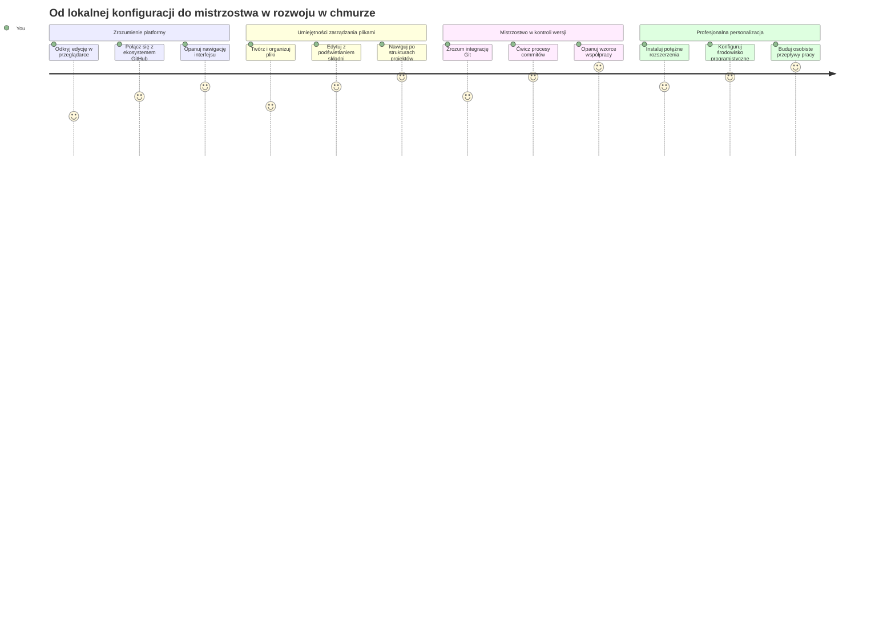
**Cel podróży**: Po tej lekcji opanujesz profesjonalne środowisko chmurowego programowania działające na dowolnym urządzeniu, co pozwoli Ci kodować tymi samymi narzędziami, które używają deweloperzy w wielkich firmach technologicznych.

## Czego się nauczysz

Po przejściu tego kursu będziesz potrafić:

- Poruszać się po VSCode.dev jak po własnym domu – znajdziesz wszystko, czego potrzebujesz, bez zgubienia się
- Otwierać dowolne repozytorium GitHub w przeglądarce i od razu rozpocząć edycję (to całkiem magiczne!)
- Korzystać z Git, aby śledzić zmiany i zapisywać postępy jak profesjonalista
- Wzbogacić swój edytor o rozszerzenia, które przyspieszą i uprzyjemnią kodowanie
- Tworzyć i organizować pliki projektu z pewnością siebie

## Czego będziesz potrzebować

Wymagania są proste:

- Darmowe [konto GitHub](https://github.com) (w razie potrzeby przeprowadzimy Cię przez proces tworzenia)
- Podstawowa znajomość przeglądarek internetowych
- Lekcja Podstawy GitHub dostarcza pomocnych informacji, choć nie jest obowiązkowa

> 💡 **Nowy w GitHub?** Założenie konta jest darmowe i zajmuje kilka minut. Jak karta biblioteczna daje dostęp do książek na całym świecie, tak konto GitHub otwiera drzwi do repozytoriów kodu w internecie.

## 🧠 Przegląd ekosystemu chmurowego programowania

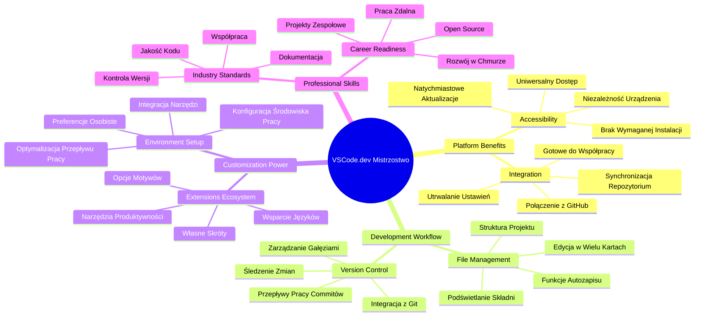
**Główna zasada**: Środowiska programistyczne oparte na chmurze to przyszłość kodowania – oferują narzędzia profesjonalnej klasy, które są dostępne, współdzielone i niezależne od platformy.

## Dlaczego edytory kodu oparte na sieci mają znaczenie

Przed erą internetu naukowcy z różnych uczelni nie mogli łatwo wymieniać się badaniami. Pojawiło się ARPANET w latach 60., łącząc komputery na odległość. Edytory kodu online działają na podobnej zasadzie – zapewniają dostęp do potężnych narzędzi niezależnie od miejsca czy urządzenia.

Edytor kodu to Twoje miejsce pracy, gdzie piszesz, edytujesz i organizujesz pliki z kodem. W przeciwieństwie do prostych edytorów tekstu, profesjonalne edytory oferują podświetlanie składni, wykrywanie błędów i zarządzanie projektami.

VSCode.dev przenosi te możliwości do przeglądarki:

**Zalety edycji w chmurze:**

| Funkcja | Opis | Praktyczna korzyść |
|---------|-------------|------------------|
| **Niezależność platformy** | Działa na każdym urządzeniu z przeglądarką | Praca na różnych komputerach bez problemów |
| **Brak potrzeby instalacji** | Dostęp przez URL w przeglądarce | Pomija ograniczenia instalacyjne |
| **Automatyczne aktualizacje** | Zawsze najnowsza wersja | Nowe funkcje bez ręcznych aktualizacji |
| **Integracja z repozytoriami** | Bezpośrednie połączenie z GitHub | Edycja kodu bez zarządzania plikami lokalnymi |

**Konsekwencje praktyczne:**
- Ciągłość pracy na różnych środowiskach
- Spójny interfejs niezależnie od systemu operacyjnego
- Natychmiastowa możliwość współpracy z innymi
- Mniejsze wymagania dotyczące lokalnej przestrzeni dyskowej

## Eksploracja VSCode.dev

Podobnie jak w laboratorium Marii Curie, gdzie znajdowały się zaawansowane urządzenia w dość prostym pomieszczeniu, VSCode.dev pakuję profesjonalne narzędzia programistyczne do interfejsu przeglądarki. Ta aplikacja webowa oferuje tę samą podstawową funkcjonalność co edytory kodu na komputerach stacjonarnych.

Zacznij od wejścia na [vscode.dev](https://vscode.dev) w swojej przeglądarce. Interfejs ładuje się bez pobierania czy instalacji – to bezpośrednie zastosowanie zasad chmury obliczeniowej.

### Łączenie konta GitHub

Jak telefon Alexandra Grahama Bella łączył odległe miejsca, tak połączenie konta GitHub wiąże VSCode.dev z Twoimi repozytoriami. Po wyświetleniu monitu o zalogowanie się przez GitHub, zalecane jest zaakceptowanie tego połączenia.

**Integracja z GitHub oferuje:**
- Bezpośredni dostęp do Twoich repozytoriów w edytorze
- Synchronizację ustawień i rozszerzeń na różnych urządzeniach
- Usprawniony sposób zapisywania do GitHub
- Spersonalizowane środowisko pracy

### Poznaj swoje nowe miejsce pracy

Gdy wszystko się załaduje, zobaczysz czyste i uporządkowane środowisko, które pozwoli Ci skupić się na tym, co ważne – na Twoim kodzie!

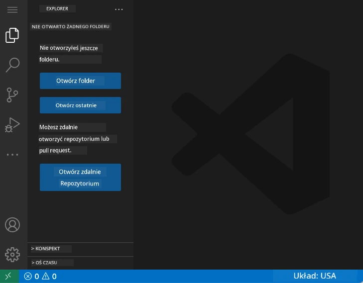

**Oto wycieczka po okolicy:**
- **Pasek aktywności** (ta pionowa listwa po lewej): Twoja główna nawigacja z eksploratorem 📁, wyszukiwaniem 🔍, kontrolą źródła 🌿, rozszerzeniami 🧩 i ustawieniami ⚙️
- **Panel boczny** (obok paska): Pokazuje informacje zależnie od wybranego elementu
- **Obszar edytora** (duża przestrzeń na środku): Tu odbywa się magia – główne miejsce kodowania

**Poświęć chwilę na eksplorację:**
- Klikaj ikony na pasku aktywności i zobacz, co każda z nich robi
- Zauważ, jak panel boczny zmienia się pokazując różne informacje – całkiem fajne, prawda?
- Widok Eksploratora (📁) to miejsce, w którym spędzisz najwięcej czasu, więc zapoznaj się z nim

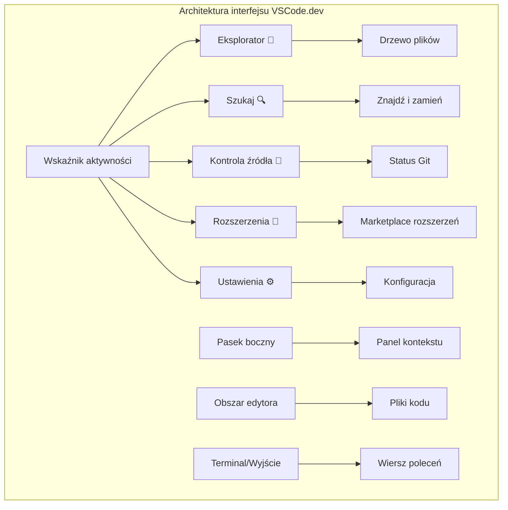
## Otwieranie repozytoriów GitHub

Przed internetem badacze musieli fizycznie jeździć do bibliotek, aby mieć dostęp do dokumentów. Repozytoria GitHub działają podobnie – to zbiory kodu przechowywane zdalnie. VSCode.dev eliminuje tradycyjny krok pobierania repozytoriów na lokalną maszynę przed edycją.

Ta funkcja pozwala na natychmiastowy dostęp do dowolnego publicznego repozytorium, by je przeglądać, edytować lub współtworzyć. Oto dwie metody otwierania repozytoriów:

### Metoda 1: kliknij i otwórz

Idealna, gdy zaczynasz w VSCode.dev i chcesz otworzyć konkretne repozytorium. Prosta i przyjazna dla początkujących:

**Tak to się robi:**

1. Wejdź na [vscode.dev](https://vscode.dev) jeśli jeszcze tam nie jesteś
2. Znajdź przycisk „Open Remote Repository” na ekranie powitalnym i kliknij go

   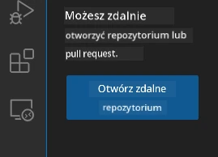

3. Wklej dowolny adres repozytorium GitHub (np. `https://github.com/microsoft/Web-Dev-For-Beginners`)
4. Naciśnij Enter i zobacz, jak działa magia!

**Pro tip – skrót Command Palette:**

Chcesz poczuć się jak czarodziej kodu? Wypróbuj skrót klawiszowy: Ctrl+Shift+P (lub Cmd+Shift+P na Macu) by otworzyć Command Palette:

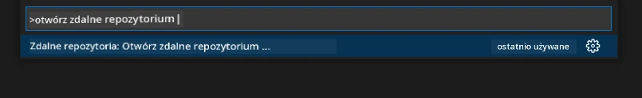

**Command Palette to jak wyszukiwarka wszystkiego, co możesz zrobić:**
- Wpisz "open remote", a znajdzie otwieracz repozytoriów
- Pamięta repozytoria, które ostatnio otwierałeś (super wygodne!)
- Po przyzwyczajeniu się poczujesz się jak kodujący błyskawicznie
- To jak wersja VSCode.dev „Hej Siri, ale dla kodowania”

### Metoda 2: modyfikacja URL

Podobnie jak HTTP i HTTPS używają różnych protokołów, ale mają tę samą strukturę domeny, VSCode.dev używa wzoru URL odzwierciedlającego system adresowania GitHub. Każdy adres repozytorium GitHub można zmodyfikować tak, aby otwierał się bezpośrednio w VSCode.dev.

**Wzór transformacji URL:**

| Typ repozytorium | URL GitHub | URL VSCode.dev |
|-----------------|--------------------------|-----------------------------|
| **Repozytorium publiczne** | `github.com/microsoft/Web-Dev-For-Beginners` | `vscode.dev/github/microsoft/Web-Dev-For-Beginners` |
| **Projekt osobisty** | `github.com/twoja-nazwa/u-projekt` | `vscode.dev/github/twoja-nazwa/u-projekt` |
| **Dowolne dostępne repozytorium** | `github.com/ich-nazwa/super-repo` | `vscode.dev/github/ich-nazwa/super-repo` |

**Wdrożenie:**
- Zamień `github.com` na `vscode.dev/github`
- Pozostaw pozostałe części URL bez zmian
- Działa z każdą publicznie dostępną repozytorium
- Zapewnia natychmiastowy dostęp do edycji

> 💡 **Wskazówka zmieniająca życie**: Dodaj do zakładek wersje VSCode.dev ulubionych repozytoriów. Mam zakładki takie jak „Edytuj Moje Portfolio” i „Napraw Dokumentację”, które zabierają mnie prosto do trybu edycji!

**Którą metodę wybrać?**
- **Sposób interfejsowy**: Świetny podczas eksplorowania lub gdy nie pamiętasz dokładnych nazw repozytoriów
- **Sztuczka z URL**: Idealna na szybki dostęp, gdy dokładnie wiesz, gdzie chcesz wejść

### 🎯 Sprawdzenie pedagogiczne: dostęp do środowiska chmurowego

**Zatrzymaj się i zastanów:** Właśnie nauczyłeś się dwóch metod dostępu do repozytoriów poprzez przeglądarkę. To fundamentalna zmiana w sposobie pracy deweloperów.

**Szybka autoocena**:
- Czy potrafisz wyjaśnić, dlaczego edycja w sieci eliminuje tradycyjne „konfigurowanie środowiska”?
- Jakie korzyści daje modyfikacja URL w porównaniu z lokalnym klonowaniem git?
- Jak ta metoda zmienia sposób, w jaki możesz przyczyniać się do projektów open source?

**Połączenie ze światem realnym**: Duże firmy takie jak GitHub, GitLab i Replit budują swoje platformy programistyczne wokół tych zasad chmurowych. Uczysz się tych samych przepływów, które stosują zespoły na całym świecie.

**Pytanie wyzwania**: Jak programowanie w chmurze może zmienić sposób nauczania kodowania w szkołach? Weź pod uwagę wymagania sprzętowe, zarządzanie oprogramowaniem i możliwości współpracy.

## Praca z plikami i projektami

Gdy masz otwarte repozytorium, zacznijmy budować! VSCode.dev daje Ci wszystko, czego potrzebujesz, aby tworzyć, edytować i porządkować pliki z kodem. Pomyśl o tym jak o swoim cyfrowym warsztacie – każdy narzędzie jest dokładnie tam, gdzie powinno.

Zacznijmy od codziennych zadań, które będą stanowić większość Twojej pracy.

### Tworzenie nowych plików

Analogicznie do organizacji planów architektonicznych, tworzenie plików w VSCode.dev odbywa się według uporządkowanego schematu. System obsługuje wszystkie standardowe typy plików webowych.

**Proces tworzenia pliku:**

1. Przejdź do docelowego folderu w panelu Eksploratora
2. Najedź kursorem na nazwę folderu, aby ukazała się ikona „Nowy plik” (📄+)
3. Wpisz nazwę pliku wraz z odpowiednim rozszerzeniem (`style.css`, `script.js`, `index.html`)
4. Naciśnij Enter, aby utworzyć plik

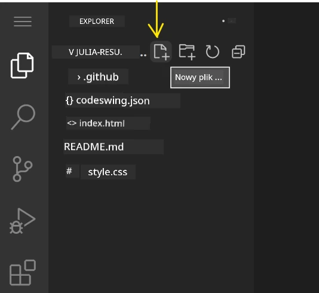

**Zasady nazewnictwa:**
- Używaj opisowych nazw wskazujących cel pliku
- Dołącz rozszerzenia, żeby mieć odpowiednie podświetlanie składni
- Stosuj spójne schematy nazewnictwa w całym projekcie
- Używaj małych liter i łączników zamiast spacji

### Edytowanie i zapisywanie plików

Tu zaczyna się prawdziwa zabawa! Edytor VSCode.dev jest wyposażony w funkcje ułatwiające i uprzyjemniające kodowanie. To jak posiadanie bardzo mądrego asystenta pisania, ale dla kodu.

**Twój workflow edytowania:**

1. Kliknij dowolny plik w Eksploratorze, by otworzyć go w głównym obszarze
2. Zacznij pisać i zobacz, jak VSCode.dev pomaga kolorami, podpowiedziami i wykrywaniem błędów
3. Zapisz pracę skrótem Ctrl+S (Windows/Linux) lub Cmd+S (Mac) – chociaż edytor zapisuje też automatycznie!


**Co się dzieje podczas pisania:**
- Twój kod jest pięknie kolorowany dla lepszej czytelności
- VSCode.dev podpowiada uzupełnienia w trakcie pisania (jak autokorekta, tylko inteligentniejsza)
- Łapie błędy i literówki jeszcze przed zapisaniem
- Możesz mieć wiele plików otwartych w kartach, jak w przeglądarce
- Wszystko zapisuje się automatycznie w tle

> ⚠️ **Szybka wskazówka**: Mimo auto-zapisu, warto przyzwyczaić się do Ctrl+S lub Cmd+S. Natychmiast zapisuje wszystko i uruchamia dodatkowe funkcje, np. sprawdzanie błędów.

### Kontrola wersji z Gitem

Tak jak archeolodzy tworzą dokładne zapisy warstw wykopalisk, Git rejestruje zmiany w Twoim kodzie na przestrzeni czasu. Ten system przechowuje historię projektu i pozwala wracać do wcześniejszych wersji. VSCode.dev ma zintegrowaną funkcjonalność Git.

**Interfejs Kontroli Źródła:**

1. Wejdź do panelu Kontroli Źródła przez ikonę 🌿 na pasku aktywności
2. Zmodyfikowane pliki pojawiają się w sekcji „Changes” (Zmiany)
3. Kolory wskazują typ zmian: zielony dla dodatków, czerwony dla usunięć

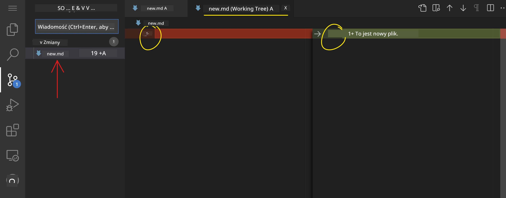

**Zapisywanie pracy (workflow commit):**

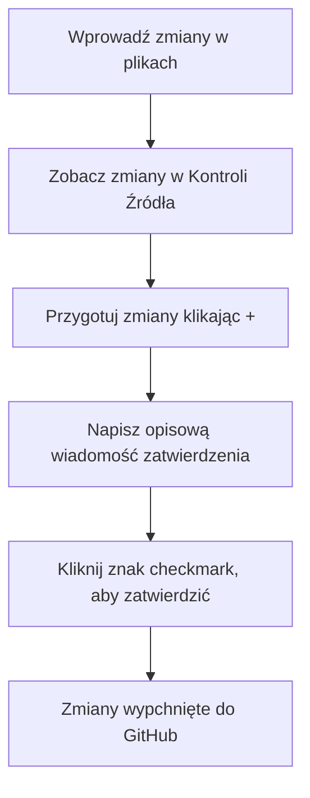
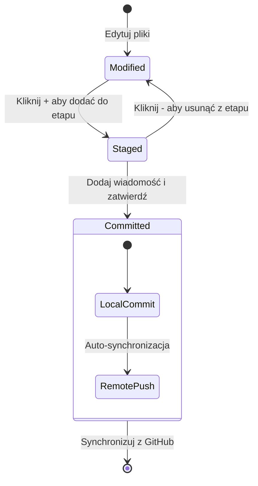
**Oto krok po kroku, jak to zrobić:**
- Kliknij ikonę "+" obok plików, które chcesz zapisać (to „stage’owanie”)
- Sprawdź dokładnie, czy jesteś zadowolony ze wszystkich swoich zmian w obszarze staging
- Napisz krótką notatkę wyjaśniającą, co zrobiłeś (to jest Twój „commit message”)
- Kliknij przycisk ze znacznikiem, aby zapisać wszystko na GitHub
- Jeśli zmienisz zdanie co do czegoś, ikona cofania pozwoli Ci odrzucić zmiany

**Pisanie dobrych commit message (to łatwiejsze niż myślisz!):**
- Po prostu opisz, co zrobiłeś, np. „Dodaj formularz kontaktowy” lub „Popraw uszkodzoną nawigację”
- Bądź krótki i zwięzły – pomyśl o długości tweeta, a nie eseju
- Zacznij od czasowników opisujących działanie, takich jak „Dodaj”, „Popraw”, „Zaktualizuj” lub „Usuń”
- **Dobre przykłady**: „Dodaj responsywne menu nawigacyjne”, „Popraw problemy z układem mobilnym”, „Zaktualizuj kolory dla lepszej dostępności”

> 💡 **Szybka wskazówka nawigacyjna**: Użyj menu hamburger (☰) w lewym górnym rogu, aby szybko wrócić do swojego repozytorium GitHub i zobaczyć swoje zatwierdzone zmiany online. To jak portal między środowiskiem edycji a domem Twojego projektu na GitHub!

## Rozszerzanie funkcjonalności za pomocą rozszerzeń

Podobnie jak warsztat rzemieślnika zawiera specjalistyczne narzędzia do różnych zadań, VSCode.dev można dostosować za pomocą rozszerzeń, które dodają konkretne możliwości. Te wtyczki tworzone przez społeczność odpowiadają na typowe potrzeby programistów takie jak formatowanie kodu, podgląd na żywo i rozszerzona integracja z Gitem.

Marketplace rozszerzeń zawiera tysiące darmowych narzędzi stworzonych przez programistów na całym świecie. Każde rozszerzenie rozwiązuje konkretne wyzwania związane z workflow, pozwalając Ci zbudować spersonalizowane środowisko programistyczne odpowiadające Twoim indywidualnym potrzebom i preferencjom.

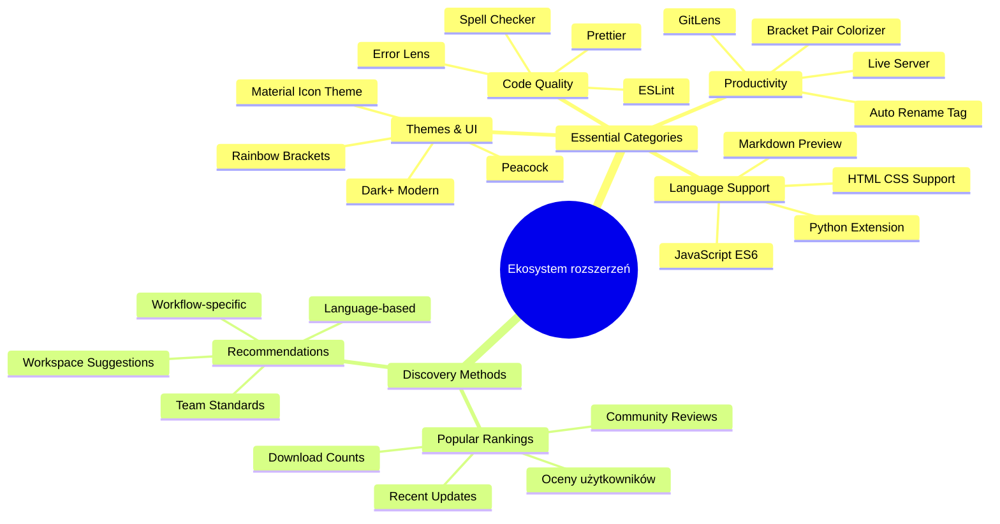
### Znajdowanie idealnych rozszerzeń

Marketplace rozszerzeń jest naprawdę dobrze zorganizowany, więc nie zgubisz się szukając tego, czego potrzebujesz. Został zaprojektowany tak, aby pomóc Ci odkrywać zarówno konkretne narzędzia, jak i fajne rzeczy, o których nawet nie wiedziałeś!

**Jak dotrzeć do marketplace:**

1. Kliknij ikonę rozszerzeń (🧩) na pasku aktywności
2. Przeglądaj lub wyszukaj coś konkretnego
3. Kliknij na wszystko, co wygląda ciekawie, żeby dowiedzieć się więcej

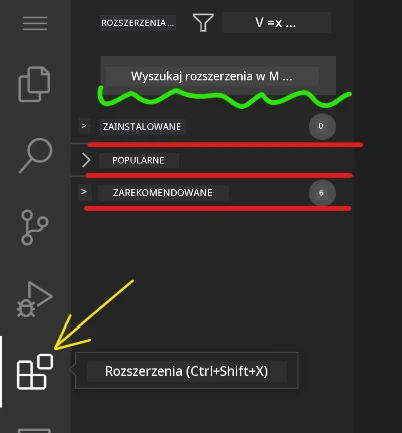

**Co tam zobaczysz:**

| Sekcja | Co się tam znajduje | Dlaczego jest pomocne |
|----------|---------|----------|
| **Zainstalowane** | Rozszerzenia, które już dodałeś | Twój osobisty zestaw narzędzi programistycznych |
| **Popularne** | Ulubione społeczności | To, na co najczęściej stawiają programiści |
| **Polecane** | Inteligentne propozycje dla Twojego projektu | Pomocne rekomendacje VSCode.dev |

**Co ułatwia przeglądanie:**
- Każde rozszerzenie pokazuje oceny, liczbę pobrań i prawdziwe recenzje użytkowników
- Masz dostęp do zrzutów ekranu i jasnych opisów, co robi każde rozszerzenie
- Wszystko jest wyraźnie oznaczone informacjami o kompatybilności
- Proponowane są podobne rozszerzenia, abyś mógł porównać opcje

### Instalowanie rozszerzeń (To naprawdę proste!)

Dodanie nowych funkcji do edytora jest tak proste, jak kliknięcie przycisku. Rozszerzenia instalują się w kilka sekund i zaczynają działać natychmiast – bez restartów i czekania.

**Co musisz zrobić:**

1. Wyszukaj, czego chcesz (spróbuj wpisać „live server” lub „prettier”)
2. Kliknij na to, co wygląda dobrze, żeby zobaczyć więcej szczegółów
3. Przeczytaj, co robi i sprawdź oceny
4. Kliknij niebieski przycisk „Install” i gotowe!


**Co się dzieje w tle:**
- Rozszerzenie pobiera się i automatycznie konfiguruje
- Nowe funkcje natychmiast pojawiają się w interfejsie
- Wszystko zaczyna działać od razu (naprawdę, tak szybko!)
- Jeśli jesteś zalogowany, rozszerzenie synchronizuje się na wszystkich urządzeniach

**Kilka rozszerzeń, które polecam na start:**
- **Live Server**: Zobacz, jak Twoja strona aktualizuje się na żywo podczas kodowania (to prawdziwa magia!)
- **Prettier**: Automatycznie sprawia, że Twój kod wygląda schludnie i profesjonalnie
- **Auto Rename Tag**: Zmienia jeden tag HTML, a jego partner aktualizuje się automatycznie
- **Bracket Pair Colorizer**: Koloruje nawiasy, abyś nigdy się nie zgubił
- **GitLens**: Wzmacnia funkcje Gita o mnóstwo przydatnych informacji

### Dostosowywanie rozszerzeń

Większość rozszerzeń ma ustawienia, które możesz zmieniać, aby działały dokładnie tak, jak chcesz. To jak dostosowanie fotela i lusterek w samochodzie – każdy ma swoje preferencje!

**Jak zmieniać ustawienia rozszerzeń:**

1. Znajdź zainstalowane rozszerzenie na panelu rozszerzeń
2. Poszukaj ikonki koła zębatego (⚙️) obok jego nazwy i kliknij ją
3. Wybierz „Extension Settings” z rozwijanego menu
4. Dostosuj ustawienia, aż poczujesz, że odpowiadają Twojemu workflow

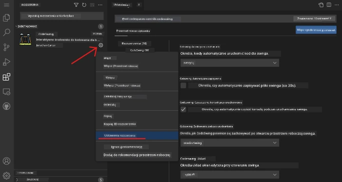

**Typowe rzeczy, które możesz chcieć zmienić:**
- Jak formatowany jest kod (tabulatory vs spacje, długość linii itd.)
- Jakie skróty klawiszowe wywołują różne akcje
- Z jakimi typami plików rozszerzenie powinno działać
- Włączanie lub wyłączanie konkretnych funkcji, by zachować porządek

### Uporządkowanie rozszerzeń

Gdy odkrywasz coraz więcej fajnych rozszerzeń, chcesz mieć kolekcję w porządku i działającą płynnie. VSCode.dev bardzo to ułatwia.

**Co możesz zrobić z rozszerzeniami:**

| Co możesz zrobić | Kiedy jest pomocne | Wskazówka |
|--------|---------|----------|
| **Wyłącz** | Testowanie, czy rozszerzenie powoduje problemy | Lepsze niż odinstalowanie, jeśli możesz chcieć je później |
| **Odinstaluj** | Całkowite usunięcie niepotrzebnych rozszerzeń | Utrzymuje środowisko lekkie i szybkie |
| **Aktualizuj** | Pobierz najnowsze funkcje i poprawki błędów | Zwykle dzieje się automatycznie, ale warto sprawdzić |

**Jak ja zarządzam rozszerzeniami:**
- Co kilka miesięcy przeglądam, co mam zainstalowane i usuwam to, czego nie używam
- Utrzymuję rozszerzenia na bieżąco, by mieć najnowsze usprawnienia i poprawki bezpieczeństwa
- Jeśli coś działa wolno, tymczasowo wyłączam rozszerzenia, żeby zdiagnozować problem
- Czytam notatki o aktualizacjach, gdy rozszerzenia dostają większe zmiany – czasem pojawiają się fajne nowe funkcje!

> ⚠️ **Wskazówka dotycząca wydajności**: Rozszerzenia są super, ale za dużo ich może spowolnić program. Skup się na tych, które naprawdę ułatwiają Ci pracę i nie bój się odinstalować tych, których nigdy nie używasz.

### 🎯 Kontrola pedagogiczna: Dostosowanie środowiska programistycznego

**Zrozumienie architektury**: Nauczyłeś się, jak dostosować profesjonalne środowisko rozwoju przy pomocy rozszerzeń tworzonych przez społeczność. To odzwierciedla, jak zespoły enterprise budują zunifikowane narzędzia.

**Kluczowe pojęcia opanowane**:
- **Wyszukiwanie rozszerzeń**: Znajdowanie narzędzi rozwiązujących konkretne problemy deweloperskie
- **Konfiguracja środowiska**: Dostosowywanie narzędzi do własnych lub zespołowych preferencji
- **Optymalizacja wydajności**: Balansowanie funkcji z wydajnością systemu
- **Współpraca społecznościowa**: Wykorzystanie narzędzi tworzonych globalnie przez deweloperów

**Powiązanie z branżą**: Ekosystem rozszerzeń wspiera główne platformy rozwojowe, takie jak VS Code, Chrome DevTools i nowoczesne IDE. Umiejętność oceny, instalacji i konfiguracji rozszerzeń jest niezbędna dla profesjonalnych workflow deweloperskich.

**Pytanie do refleksji**: Jak podszedłbyś do skonfigurowania zunifikowanego środowiska rozwojowego dla zespołu 10 programistów? Weź pod uwagę spójność, wydajność i indywidualne preferencje.

## 📈 Twoja oś czasu mistrzostwa w rozwoju w chmurze

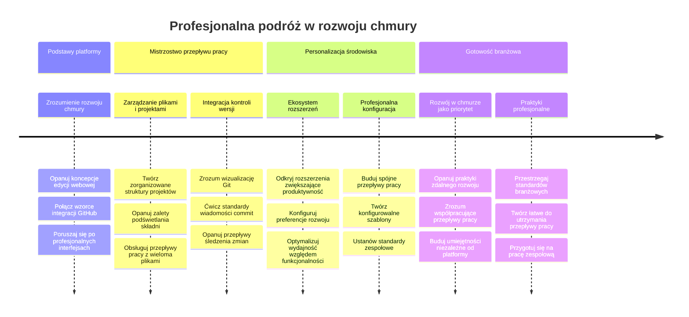
**🎓 Kamień milowy ukończenia:** Opanowałeś rozwój oparty na chmurze, korzystając z tych samych narzędzi i workflow, co profesjonalni programiści w dużych firmach technologicznych. Te umiejętności reprezentują przyszłość tworzenia oprogramowania.

**🔄 Umiejętności na wyższym poziomie:**
- Gotowość do eksploracji zaawansowanych platform rozwoju w chmurze (Codespaces, GitPod)
- Przygotowanie do pracy w rozproszonych zespołach deweloperskich
- Zdolność do wnoszenia wkładu w projekty open source na całym świecie
- Fundament pod nowoczesne praktyki DevOps i ciągłej integracji

## Wyzwanie z GitHub Copilot Agent 🚀

Jak systematyczne podejście NASA do misji kosmicznych, to wyzwanie polega na zastosowaniu umiejętności VSCode.dev w kompletnym scenariuszu workflow.

**Cel:** Pokaż biegłość w VSCode.dev poprzez ustanowienie kompleksowego workflow tworzenia stron internetowych.

**Wymagania projektu:** Korzystając z trybu agenta, wykonaj następujące:
1. Zrób fork istniejącego repozytorium lub utwórz nowe
2. Ustanów funkcjonalną strukturę projektu z plikami HTML, CSS i JavaScript
3. Zainstaluj i skonfiguruj trzy rozszerzenia wspomagające rozwój
4. Praktykuj kontrolę wersji z opisowymi commit message
5. Eksperymentuj z tworzeniem i modyfikacją branchy funkcjonalności
6. Udokumentuj proces i wnioski w pliku README.md

To ćwiczenie łączy wszystkie koncepcje VSCode.dev w praktyczny workflow, który możesz wykorzystać w przyszłych projektach.

Dowiedz się więcej o [trybie agenta](https://code.visualstudio.com/blogs/2025/02/24/introducing-copilot-agent-mode) tutaj.

## Zadanie

Czas na praktyczny sprawdzian! Mam dla Ciebie projekt, który pozwoli Ci poćwiczyć wszystko, czego się nauczyłeś: [Stwórz stronę z CV za pomocą VSCode.dev](./assignment.md)

To zadanie przeprowadzi Cię krok po kroku przez budowę profesjonalnej strony CV całkowicie w przeglądarce. Użyjesz wszystkich funkcji VSCode.dev, które poznaliśmy, a na koniec będziesz miał świetnie wyglądającą stronę i solidne zaufanie do nowego workflow.

## Kontynuuj odkrywanie i rozwijanie umiejętności

Masz już solidne podstawy, ale jest tyle fajnych rzeczy do odkrycia! Oto zasoby i pomysły, by podnieść swoje umiejętności VSCode.dev na nowy poziom:

**Oficjalna dokumentacja warta dodania do zakładek:**
- [Dokumentacja VSCode Web](https://code.visualstudio.com/docs/editor/vscode-web?WT.mc_id=academic-0000-alfredodeza) – Kompletny przewodnik po edycji w przeglądarce
- [GitHub Codespaces](https://docs.github.com/en/codespaces) – Na wypadek, gdybyś chciał mieć jeszcze więcej mocy w chmurze

**Fajne funkcje do eksperymentowania:**
- **Skróty klawiszowe**: Naucz się kombinacji klawiszy, które sprawią, że poczujesz się jak ninja kodowania
- **Ustawienia workspace**: Skonfiguruj różne środowiska dla różnych typów projektów
- **Workspace z wieloma rootami**: Pracuj nad wieloma repozytoriami naraz (mega wygodne!)
- **Integracja terminala**: Dostęp do narzędzi wiersza poleceń bezpośrednio w przeglądarce

**Pomysły na praktykę:**
- Wskocz do projektów open source i zacznij w nich uczestniczyć z VSCode.dev – to świetny sposób na wsparcie społeczności!
- Wypróbuj różne rozszerzenia, aby znaleźć idealne zestawienie dla siebie
- Twórz szablony projektów dla typów stron, które najczęściej tworzysz
- Ćwicz workflow Git, takie jak tworzenie branchy i scalanie – te umiejętności są bezcenne w projektach zespołowych

---

**Opanowałeś tworzenie oprogramowania w przeglądarce!** 🎉 Podobnie jak wynalezienie przenośnych instrumentów pozwoliło naukowcom prowadzić badania w odległych miejscach, VSCode.dev umożliwia profesjonalne programowanie z dowolnego urządzenia z Internetem.

Te umiejętności odzwierciedlają aktualne praktyki branżowe – wielu profesjonalnych programistów korzysta ze środowisk rozwoju w chmurze ze względu na ich elastyczność i dostępność. Nauczyłeś się workflow, które skaluje się od pojedynczych projektów po wielkie zespoły.

Zastosuj te techniki w swoim kolejnym projekcie programistycznym! 🚀

---

<!-- CO-OP TRANSLATOR DISCLAIMER START -->
**Zastrzeżenie**:  
Niniejszy dokument został przetłumaczony za pomocą usługi tłumaczenia AI [Co-op Translator](https://github.com/Azure/co-op-translator). Mimo że dążymy do dokładności, prosimy mieć na uwadze, że tłumaczenia automatyczne mogą zawierać błędy lub niedokładności. Oryginalny dokument w jego języku źródłowym powinien być uznawany za źródło wiążące. W przypadku istotnych informacji zalecane jest skorzystanie z profesjonalnego tłumaczenia wykonanego przez człowieka. Nie ponosimy odpowiedzialności za jakiekolwiek nieporozumienia lub błędne interpretacje wynikające z korzystania z tego tłumaczenia.
<!-- CO-OP TRANSLATOR DISCLAIMER END -->