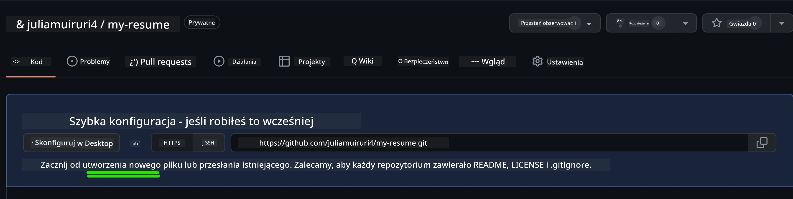
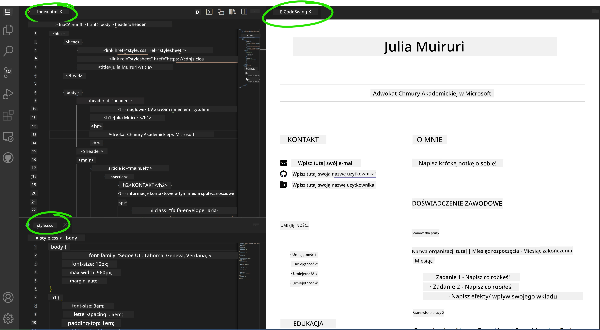

# Stwórz stronę z CV używając VSCode.dev

Zmień swoje perspektywy zawodowe, tworząc profesjonalną stronę z CV, która prezentuje Twoje umiejętności i doświadczenie w interaktywnym, nowoczesnym formacie. Zamiast wysyłać tradycyjne pliki PDF, wyobraź sobie, że dostarczasz rekruterom elegancką, responsywną stronę internetową, która pokazuje zarówno Twoje kwalifikacje, jak i zdolności programistyczne.

To praktyczne zadanie pozwoli Ci wykorzystać wszystkie umiejętności VSCode.dev podczas tworzenia czegoś naprawdę przydatnego dla Twojej kariery. Doświadczysz pełnego procesu tworzenia stron internetowych – od utworzenia repozytorium aż po wdrożenie – wszystko w przeglądarce.

Po ukończeniu tego projektu będziesz mieć profesjonalną obecność online, którą łatwo podzielisz się z potencjalnymi pracodawcami, zaktualizujesz w miarę rozwoju swoich umiejętności i dostosujesz do własnej marki osobistej. To właśnie taki praktyczny projekt pokazuje rzeczywiste umiejętności web developerskie.

## Cele nauki

Po ukończeniu tego zadania będziesz potrafić:

- **Tworzyć** i zarządzać kompletnym projektem webowym za pomocą VSCode.dev
- **Strukturyzować** profesjonalną stronę używając semantycznych elementów HTML
- **Stylizować** responsywne układy korzystając z nowoczesnych technik CSS
- **Implementować** interaktywne funkcje wykorzystując podstawowe technologie webowe
- **Wdrożyć** działającą stronę dostępną pod udostępnialnym adresem URL
- **Demonstrować** najlepsze praktyki kontroli wersji w trakcie rozwoju projektu

## Wymagania wstępne

Przed rozpoczęciem tego zadania upewnij się, że posiadasz:

- Konto na GitHub (jeśli potrzeba, utwórz je na [github.com](https://github.com/))
- Ukończyłeś lekcję VSCode.dev dotyczącą nawigacji w interfejsie i podstawowych operacji
- Podstawową wiedzę o strukturze HTML oraz koncepcjach stylowania CSS

## Konfiguracja projektu i tworzenie repozytorium

Zacznijmy od przygotowania fundamentów projektu. Ten proces odzwierciedla rzeczywiste przepływy pracy, w których projekty zaczynają się od odpowiedniego inicjowania repozytorium i planowania struktury.

### Krok 1: Utwórz swoje repozytorium na GitHub

Utworzenie dedykowanego repozytorium zapewnia, że Twój projekt będzie odpowiednio zorganizowany i kontrolowany pod kątem wersji od samego początku.

1. **Przejdź** do [GitHub.com](https://github.com) i zaloguj się do swojego konta  
2. **Kliknij** zielony przycisk "New" lub ikonę "+" w prawym górnym rogu  
3. **Nazwij** swój repozytorium `my-resume` (lub wybierz spersonalizowaną nazwę, np. `jan-kowalski-cv`)  
4. **Dodaj** krótki opis: "Profesjonalna strona CV zbudowana z użyciem HTML i CSS"  
5. **Wybierz** "Public" aby Twoje CV było dostępne dla potencjalnych pracodawców  
6. **Zaznacz** opcję "Add a README file" by utworzyć początkowy opis projektu  
7. **Kliknij** "Create repository" aby zakończyć konfigurację

> 💡 **Wskazówka dotycząca nazewnictwa repozytorium**: Używaj opisowych, profesjonalnych nazw, które jasno określają cel projektu. To pomocne podczas dzielenia się z pracodawcami lub podczas przeglądów portfolio.

### Krok 2: Zainicjuj strukturę projektu

Ponieważ VSCode.dev wymaga co najmniej jednego pliku do otwarcia repozytorium, utworzymy główny plik HTML bezpośrednio na GitHub zanim przejdziemy do edytora webowego.

1. **Kliknij** link "creating a new file" w swoim nowym repozytorium  
2. **Wpisz** nazwę pliku `index.html`  
3. **Dodaj** tę początkową strukturę HTML:

```html
<!DOCTYPE html>
<html lang="en">
<head>
    <meta charset="UTF-8">
    <meta name="viewport" content="width=device-width, initial-scale=1.0">
    <title>Your Name - Professional Resume</title>
</head>
<body>
    <h1>Your Name</h1>
    <p>Professional Resume Website</p>
</body>
</html>
```
  
4. **Napisz** komunikat commita: "Add initial HTML structure"  
5. **Kliknij** "Commit new file", aby zapisać zmiany



**Co osiąga ta początkowa konfiguracja:**  
- **Ustala** poprawną strukturę dokumentu HTML5 z semantycznymi elementami  
- **Zawiera** meta tag viewport dla kompatybilności z responsywnym designem  
- **Ustawia** opisowy tytuł strony widoczny na kartach przeglądarki  
- **Tworzy** fundament do profesjonalnej organizacji treści  

## Praca w VSCode.dev

Gdy podstawy repozytorium są już gotowe, przejdźmy do VSCode.dev aby wykonać główne prace developerskie. Ten edytor webowy oferuje wszystkie narzędzia potrzebne do profesjonalnego tworzenia stron.

### Krok 3: Otwórz projekt w VSCode.dev

1. **Przejdź** do [vscode.dev](https://vscode.dev) w nowej karcie przeglądarki  
2. **Kliknij** "Open Remote Repository" na ekranie powitalnym  
3. **Skopiuj** adres URL repozytorium z GitHub i wklej go w odpowiednie pole  

   Format: `https://github.com/twoja-nazwa-uzytkownika/my-resume`  
   
   *Zastąp `twoja-nazwa-uzytkownika` własnym loginem na GitHub*

4. **Naciśnij** Enter aby załadować projekt

✅ **Wskaźnik sukcesu**: Powinieneś zobaczyć pliki projektu w panelu Explorer oraz `index.html` dostępny do edycji na głównym ekranie.


**Co zobaczysz w interfejsie:**  
- **Panel Explorer**: **Wyświetla** pliki i strukturę folderów repozytorium  
- **Obszar edytora**: **Pokazuje** zawartość wybranego pliku do edycji  
- **Pasek aktywności**: **Zapewnia** dostęp do funkcji takich jak Kontrola źródła czy Rozszerzenia  
- **Pasek statusu**: **Informuje** o stanie połączenia i aktualnej gałęzi repozytorium  

### Krok 4: Zbuduj zawartość swojego CV

Zamień zawartość zastępczą w `index.html` na kompletną strukturę CV. Ten HTML stanowi fundament profesjonalnej prezentacji Twoich kwalifikacji.

<details>
<summary><b>Kompletna struktura HTML CV</b></summary>

```html
<!DOCTYPE html>
<html lang="en">
<head>
    <meta charset="UTF-8">
    <meta name="viewport" content="width=device-width, initial-scale=1.0">
    <link href="style.css" rel="stylesheet">
    <link rel="stylesheet" href="https://cdnjs.cloudflare.com/ajax/libs/font-awesome/5.15.4/css/all.min.css">
    <title>Your Name - Professional Resume</title>
</head>
<body>
    <header id="header">
        <h1>Your Full Name</h1>
        <hr>
        <p class="role">Your Professional Title</p>
        <hr>
    </header>
    
    <main>
        <article id="mainLeft">
            <section>
                <h2>CONTACT</h2>
                <p>
                    <i class="fa fa-envelope" aria-hidden="true"></i>
                    <a href="mailto:your.email@domain.com">your.email@domain.com</a>
                </p>
                <p>
                    <i class="fab fa-github" aria-hidden="true"></i>
                    <a href="https://github.com/your-username">github.com/your-username</a>
                </p>
                <p>
                    <i class="fab fa-linkedin" aria-hidden="true"></i>
                    <a href="https://linkedin.com/in/your-profile">linkedin.com/in/your-profile</a>
                </p>
            </section>
            
            <section>
                <h2>SKILLS</h2>
                <ul>
                    <li>HTML5 & CSS3</li>
                    <li>JavaScript (ES6+)</li>
                    <li>Responsive Web Design</li>
                    <li>Version Control (Git)</li>
                    <li>Problem Solving</li>
                </ul>
            </section>
            
            <section>
                <h2>EDUCATION</h2>
                <h3>Your Degree or Certification</h3>
                <p>Institution Name</p>
                <p>Start Date - End Date</p>
            </section>
        </article>
        
        <article id="mainRight">
            <section>
                <h2>ABOUT</h2>
                <p>Write a compelling summary that highlights your passion for web development, key achievements, and career goals. This section should give employers insight into your personality and professional approach.</p>
            </section>
            
            <section>
                <h2>WORK EXPERIENCE</h2>
                <div class="job">
                    <h3>Job Title</h3>
                    <p class="company">Company Name | Start Date – End Date</p>
                    <ul>
                        <li>Describe a key accomplishment or responsibility</li>
                        <li>Highlight specific skills or technologies used</li>
                        <li>Quantify impact where possible (e.g., "Improved efficiency by 25%")</li>
                    </ul>
                </div>
                
                <div class="job">
                    <h3>Previous Job Title</h3>
                    <p class="company">Previous Company | Start Date – End Date</p>
                    <ul>
                        <li>Focus on transferable skills and achievements</li>
                        <li>Demonstrate growth and learning progression</li>
                        <li>Include any leadership or collaboration experiences</li>
                    </ul>
                </div>
            </section>
            
            <section>
                <h2>PROJECTS</h2>
                <div class="project">
                    <h3>Project Name</h3>
                    <p>Brief description of what the project accomplishes and technologies used.</p>
                    <a href="#" target="_blank">View Project</a>
                </div>
            </section>
        </article>
    </main>
</body>
</html>
```
</details>

**Wskazówki do personalizacji:**  
- **Zamień** wszystkie teksty zastępcze na swoje prawdziwe dane  
- **Dostosuj** sekcje według swojego poziomu doświadczenia i zawodowego ukierunkowania  
- **Dodaj** lub usuń sekcje według potrzeb (np. Certyfikaty, Wolontariat, Języki)  
- **Dołącz** linki do swoich rzeczywistych profili i projektów  

### Krok 5: Utwórz pliki wspierające

Profesjonalne strony wymagają zorganizowanej struktury plików. Utwórz arkusz stylów CSS oraz pliki konfiguracyjne potrzebne do kompletnego projektu.

1. **Najedź** kursorem na nazwę folderu projektu w panelu Explorer  
2. **Kliknij** ikonę "Nowy plik" (📄+), która się pojawi  
3. **Utwórz** kolejno następujące pliki:  
   - `style.css` (do stylów i układu)  
   - `codeswing.json` (do konfiguracji rozszerzenia podglądu)

**Tworzenie pliku CSS (`style.css`):**

<details>
<summary><b>Profesjonalne style CSS</b></summary>

```css
/* Modern Resume Styling */
body {
    font-family: 'Segoe UI', Tahoma, Geneva, Verdana, sans-serif;
    font-size: 16px;
    line-height: 1.6;
    max-width: 960px;
    margin: 0 auto;
    padding: 20px;
    color: #333;
    background-color: #f9f9f9;
}

/* Header Styling */
header {
    text-align: center;
    margin-bottom: 3em;
    padding: 2em;
    background: linear-gradient(135deg, #667eea 0%, #764ba2 100%);
    color: white;
    border-radius: 10px;
    box-shadow: 0 4px 6px rgba(0, 0, 0, 0.1);
}

h1 {
    font-size: 3em;
    letter-spacing: 0.1em;
    margin-bottom: 0.2em;
    font-weight: 300;
}

.role {
    font-size: 1.3em;
    font-weight: 300;
    margin: 1em 0;
}

/* Main Content Layout */
main {
    display: grid;
    grid-template-columns: 35% 65%;
    gap: 3em;
    margin-top: 3em;
    background: white;
    padding: 2em;
    border-radius: 10px;
    box-shadow: 0 2px 10px rgba(0, 0, 0, 0.1);
}

/* Typography */
h2 {
    font-size: 1.4em;
    font-weight: 600;
    margin-bottom: 1em;
    color: #667eea;
    border-bottom: 2px solid #667eea;
    padding-bottom: 0.3em;
}

h3 {
    font-size: 1.1em;
    font-weight: 600;
    margin-bottom: 0.5em;
    color: #444;
}

/* Section Styling */
section {
    margin-bottom: 2.5em;
}

#mainLeft {
    border-right: 1px solid #e0e0e0;
    padding-right: 2em;
}

/* Contact Links */
section a {
    color: #667eea;
    text-decoration: none;
    transition: color 0.3s ease;
}

section a:hover {
    color: #764ba2;
    text-decoration: underline;
}

/* Icons */
i {
    margin-right: 0.8em;
    width: 20px;
    text-align: center;
    color: #667eea;
}

/* Lists */
ul {
    list-style: none;
    padding-left: 0;
}

li {
    margin: 0.5em 0;
    padding: 0.3em 0;
    position: relative;
}

li:before {
    content: "▸";
    color: #667eea;
    margin-right: 0.5em;
}

/* Work Experience */
.job, .project {
    margin-bottom: 2em;
    padding-bottom: 1.5em;
    border-bottom: 1px solid #f0f0f0;
}

.company {
    font-style: italic;
    color: #666;
    margin-bottom: 0.5em;
}

/* Responsive Design */
@media (max-width: 768px) {
    main {
        grid-template-columns: 1fr;
        gap: 2em;
    }
    
    #mainLeft {
        border-right: none;
        border-bottom: 1px solid #e0e0e0;
        padding-right: 0;
        padding-bottom: 2em;
    }
    
    h1 {
        font-size: 2.2em;
    }
    
    body {
        padding: 10px;
    }
}

/* Print Styles */
@media print {
    body {
        background: white;
        color: black;
        font-size: 12pt;
    }
    
    header {
        background: none;
        color: black;
        box-shadow: none;
    }
    
    main {
        box-shadow: none;
    }
}
```
</details>

**Tworzenie pliku konfiguracyjnego (`codeswing.json`):**

```json
{
    "scripts": [],
    "styles": []
}
```
  
**Funkcje CSS zastosowane w pliku:**  
- **Wykorzystuje** CSS Grid dla responsywnego, profesjonalnego układu  
- **Stosuje** nowoczesne schematy kolorów z gradientowymi nagłówkami  
- **Zawiera** efekty hover i płynne przejścia dla interaktywności  
- **Zapewnia** responsywny design dopasowany do wszystkich rozmiarów urządzeń  
- **Dodaje** style przyjazne do druku i generowania PDF  

### Krok 6: Zainstaluj i skonfiguruj rozszerzenia

Rozszerzenia wzbogacają Twoje środowisko pracy, oferując m.in. podgląd na żywo i usprawnione narzędzia. Rozszerzenie CodeSwing jest szczególnie przydatne w projektach webowych.

**Instalacja rozszerzenia CodeSwing:**

1. **Kliknij** ikonę Rozszerzeń (🧩) na pasku aktywności  
2. **Wyszukaj** „CodeSwing” w oknie wyszukiwania  
3. **Wybierz** rozszerzenie CodeSwing z listy wyników  
4. **Kliknij** niebieski przycisk „Install”


**Co oferuje CodeSwing:**  
- **Umożliwia** podgląd strony na żywo podczas edycji  
- **Wyświetla** zmiany w czasie rzeczywistym bez konieczności odświeżania  
- **Obsługuje** wiele typów plików, w tym HTML, CSS i JavaScript  
- **Dostarcza** zintegrowane środowisko developerskie  

**Natychmiastowe efekty po instalacji:**  
Po zainstalowaniu CodeSwing zobaczysz podgląd swojego CV na żywo w edytorze. Pozwala to dokładnie widzieć, jak wygląda strona podczas wprowadzania zmian.



**Zrozumienie ulepszonego interfejsu:**  
- **Widok podzielony**: **Pokazuje** kod po jednej stronie i podgląd na żywo po drugiej  
- **Aktualizacje w czasie rzeczywistym**: **Odzwierciedla** zmiany natychmiast podczas pisania  
- **Interaktywny podgląd**: **Pozwala** testować linki i interakcje  
- **Symulacja mobilna**: **Umożliwia** testowanie responsywności i wyglądu na urządzeniach mobilnych  

### Krok 7: Kontrola wersji i publikacja

Gdy Twoja strona CV jest gotowa, użyj Gita, aby zapisać pracę i udostępnić ją online.

**Zatwierdzanie zmian:**

1. **Kliknij** ikonę Kontroli źródła (🌿) na pasku aktywności  
2. **Sprawdź** wszystkie stworzone i zmodyfikowane pliki w sekcji „Changes”  
3. **Staguj** zmiany klikając ikonę „+” obok każdego pliku  
4. **Napisz** opisowy komunikat commita, np.:  
   - „Dodaj kompletną stronę CV z responsywnym designem”  
   - „Wdroż profesjonalne style i strukturę treści”  
5. **Kliknij** znaczek „✓” aby zatwierdzić i wypchnąć zmiany

**Przykłady efektywnych komunikatów commit:**  
- „Dodaj profesjonalną treść i style CV”  
- „Wdroż responsywny design dla kompatybilności mobilnej”  
- „Aktualizuj dane kontaktowe i linki do projektów”

> 💡 **Profesjonalna wskazówka**: Dobre komunikaty commitów pomagają śledzić rozwój projektu i świadczą o dbałości o szczegóły – cechy cenione przez pracodawców.

**Dostęp do opublikowanej strony:**  
Po zatwierdzeniu zmian możesz wrócić do repozytorium na GitHub, korzystając z menu hamburgerowego (☰) w lewym górnym rogu. Twoja strona CV jest teraz kontrolowana wersjami i gotowa do wdrożenia lub udostępniania.

## Wyniki i kolejne kroki

**Gratulacje! 🎉** Udało Ci się stworzyć profesjonalną stronę CV używając VSCode.dev. Twój projekt demonstruje:  
**Wykazane umiejętności techniczne:**  
- **Zarządzanie repozytorium**: Utworzyłeś i zorganizowałeś kompletną strukturę projektu  
- **Tworzenie stron**: Zbudowałeś responsywną stronę korzystającą z nowoczesnego HTML5 i CSS3  
- **Kontrola wersji**: Wdrożyłeś poprawny proces Git z opisowymi commitami  
- **Biegłość w narzędziach**: Efektywnie wykorzystałeś interfejs i system rozszerzeń VSCode.dev  

**Osiągnięcia zawodowe:**  
- **Obecność online**: Udostępnialny URL pokazujący Twoje kwalifikacje  
- **Nowoczesny format**: Interaktywna alternatywa dla tradycyjnego CV w PDF  
- **Dowód umiejętności**: Konkretny przykład Twoich zdolności web developerskich  
- **Proste aktualizacje**: Fundament, który możesz stale rozwijać i dostosowywać  

### Opcje wdrożenia

Aby Twoje CV było dostępne dla pracodawców, rozważ następujące platformy hostingowe:

**GitHub Pages (zalecane):**  
1. Wejdź w Ustawienia repozytorium na GitHub  
2. Przewiń do sekcji „Pages”  
3. Wybierz „Deploy from a branch” i wskaż gałąź „main”  
4. Strona będzie dostępna pod adresem `https://twoja-nazwa-uzytkownika.github.io/my-resume`

**Alternatywne platformy:**  
- **Netlify**: Automatyczne wdrożenie z własną domeną  
- **Vercel**: Szybkie wdrożenia z nowoczesnymi funkcjami hostingu  
- **GitHub Codespaces**: Środowisko deweloperskie z wbudowanym podglądem  

### Sugestie ulepszeń

Rozwijaj dalej swoje umiejętności, dodając następujące funkcje:

**Ulepszenia techniczne:**  
- **Interaktywność JavaScript**: Dodaj płynne przewijanie lub elementy interaktywne  
- **Przełącznik trybu ciemnego/jasnego**: Implementuj zmianę motywu według preferencji użytkownika  
- **Formularz kontaktowy**: Umożliw bezpośredni kontakt od potencjalnych pracodawców  
- **Optymalizacja SEO**: Dodaj meta tagi i dane strukturalne dla lepszej widoczności w wyszukiwarkach  

**Ulepszenia merytoryczne:**  
- **Portfolio projektów**: Dodaj linki do repozytoriów GitHub i demonstracji na żywo  
- **Wizualizacja umiejętności**: Stwórz paski postępu lub oceny kompetencji  
- **Sekcja referencji**: Zamieść rekomendacje od współpracowników lub nauczycieli  
- **Integracja bloga**: Dodaj sekcję blogową, aby pokazać swoją ścieżkę nauki  

## Wyzwanie GitHub Copilot Agent 🚀

Użyj trybu Agenta, aby wykonać to wyzwanie:

**Opis:** Rozbuduj swoją stronę CV o zaawansowane funkcje, które pokażą profesjonalne zdolności web developmentu i nowoczesne zasady projektowania.

**Polecenie:** Budując na obecnej stronie CV, zaimplementuj te zaawansowane funkcjonalności:  
1. Dodaj przełącznik motywu ciemnego/jasnego z płynnymi przejściami  
2. Stwórz interaktywną sekcję umiejętności z animowanymi paskami postępu  
3. Dodaj formularz kontaktowy z walidacją danych  
4. Dodaj sekcję portfolio projektów z efektami hover i modalnymi oknami popup  
5. Wprowadź sekcję blogową z co najmniej 3 przykładowymi wpisami o Twojej ścieżce nauki  
6. Optymalizuj SEO z właściwymi meta tagami, danymi strukturalnymi i wydajnością  
7. Wdróż rozbudowaną stronę używając GitHub Pages lub Netlify  
8. Udokumentuj wszystkie nowe funkcje w README.md wraz ze zrzutami ekranu

Twoja rozbudowana strona powinna pokazywać mistrzostwo nowoczesnych praktyk web developmentu, w tym responsywny design, interaktywność JavaScript i profesjonalne procesy wdrożeniowe.

## Rozszerzenie wyzwania

Chcesz pójść o krok dalej? Spróbuj tych zaawansowanych wyzwań:

**📱 Redesign mobile-first:** Całkowicie przebuduj stronę używając podejścia mobile-first z CSS Grid i Flexbox

**🔍 Optymalizacja SEO:** Wdróż kompleksową optymalizację SEO z meta tagami, danymi strukturalnymi i optymalizacją wydajności

**🌐 Wsparcie wielojęzyczne:** Dodaj funkcje internacjonalizacji obsługujące wiele języków

**📊 Integracja analityki:** Dodaj Google Analytics do śledzenia zaangażowania odwiedzających i optymalizacji treści

**🚀 Optymalizacja wydajności:** Uzyskaj doskonałe wyniki w narzędziu Lighthouse we wszystkich kategoriach

## Przegląd i samokształcenie

Poszerzaj swoją wiedzę korzystając z tych zasobów:

**Zaawansowane funkcje VSCode.dev:**  
- [Dokumentacja VSCode.dev](https://code.visualstudio.com/docs/editor/vscode-web?WT.mc_id=academic-0000-alfredodeza) – Kompletny przewodnik po edycji w przeglądarce  
- [GitHub Codespaces](https://docs.github.com/en/codespaces) – Środowiska deweloperskie w chmurze  

**Najlepsze praktyki tworzenia stron:**  
- **Responsywny design:** Poznaj CSS Grid i Flexbox do nowoczesnych układów
- **Dostępność**: Poznaj wytyczne WCAG dotyczące dostępnego projektowania stron internetowych  
- **Wydajność**: Poznaj narzędzia takie jak Lighthouse do optymalizacji  
- **SEO**: Zrozum podstawy optymalizacji pod kątem wyszukiwarek  

**Rozwój zawodowy:**  
- **Budowanie portfolio**: Twórz dodatkowe projekty, aby pokazać różnorodne umiejętności  
- **Open Source**: Wnoś wkład do istniejących projektów, aby zdobyć doświadczenie we współpracy  
- **Networking**: Udostępniaj swoją stronę z CV w społecznościach programistów, aby uzyskać opinię  
- **Ciągła nauka**: Śledź trendy i technologie w rozwoju stron internetowych  

---

**Twoje kolejne kroki:** Udostępnij swoją stronę z CV znajomym, rodzinie lub mentorom, aby uzyskać ich opinie. Wykorzystaj ich sugestie do iteracji i ulepszania projektu. Pamiętaj, że ten projekt to nie tylko CV – to pokaz Twojego rozwoju jako web dewelopera!

---

<!-- CO-OP TRANSLATOR DISCLAIMER START -->
**Zastrzeżenie**:  
Niniejszy dokument został przetłumaczony za pomocą usługi tłumaczenia AI [Co-op Translator](https://github.com/Azure/co-op-translator). Chociaż staramy się o jak największą dokładność, prosimy mieć na uwadze, że tłumaczenia automatyczne mogą zawierać błędy lub niedokładności. Oryginalny dokument w języku źródłowym należy traktować jako źródło autorytatywne. W przypadku istotnych informacji zalecane jest skorzystanie z profesjonalnego tłumaczenia wykonanego przez człowieka. Nie ponosimy odpowiedzialności za jakiekolwiek nieporozumienia lub błędne interpretacje wynikające z korzystania z tego tłumaczenia.
<!-- CO-OP TRANSLATOR DISCLAIMER END -->