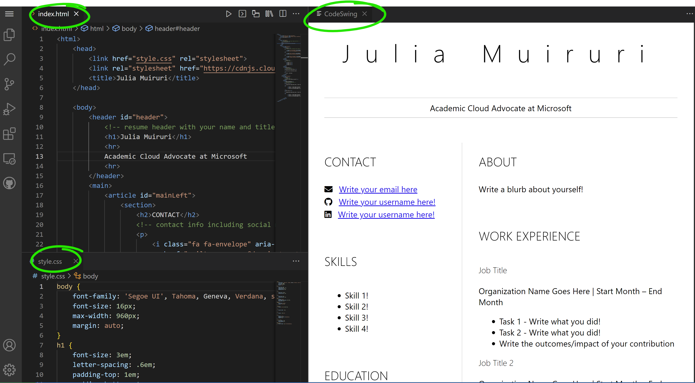

<!--
CO_OP_TRANSLATOR_METADATA:
{
  "original_hash": "bd3aa6d2b879c30ea496c43aec1c49ed",
  "translation_date": "2025-08-29T16:37:30+00:00",
  "source_file": "8-code-editor/1-using-a-code-editor/assignment.md",
  "language_code": "pl"
}
-->
# Stwórz stronę internetową z CV za pomocą vscode.dev

_Jak fajnie byłoby, gdyby rekruter poprosił o Twoje CV, a Ty wysłałbyś mu link?_ 😎

## Cele

Po wykonaniu tego zadania nauczysz się:

- Tworzyć stronę internetową, aby zaprezentować swoje CV

### Wymagania wstępne

1. Konto na GitHub. Przejdź do [GitHub](https://github.com/) i załóż konto, jeśli jeszcze go nie masz.

## Kroki

**Krok 1:** Utwórz nowe repozytorium na GitHub i nadaj mu nazwę `my-resume`

**Krok 2:** Utwórz plik `index.html` w swoim repozytorium. Dodamy przynajmniej jeden plik bezpośrednio na github.com, ponieważ nie można otworzyć pustego repozytorium w vscode.dev.

Kliknij link `creating a new file`, wpisz nazwę `index.html` i wybierz przycisk `Commit new file`.


**Krok 3:** Otwórz [VSCode.dev](https://vscode.dev) i wybierz przycisk `Open Remote Repository`.

Skopiuj adres URL repozytorium, które właśnie utworzyłeś dla swojej strony z CV, i wklej go w polu tekstowym:

_Zamień `your-username` na swoją nazwę użytkownika GitHub._

```
https://github.com/your-username/my-resume
```

✅ Jeśli wszystko się udało, zobaczysz swój projekt oraz plik index.html otwarty w edytorze tekstu w przeglądarce.


**Krok 4:** Otwórz plik `index.html`, wklej poniższy kod w obszarze kodu i zapisz.

<details>
    <summary><b>Kod HTML odpowiedzialny za treść Twojej strony z CV.</b></summary>
    
        <html>

            <head>
                <link href="style.css" rel="stylesheet">
                <link rel="stylesheet" href="https://cdnjs.cloudflare.com/ajax/libs/font-awesome/5.15.4/css/all.min.css">
                <title>Twoje Imię i Nazwisko!</title>
            </head>
            <body>
                <header id="header">
                    <!-- nagłówek CV z Twoim imieniem i stanowiskiem -->
                    <h1>Twoje Imię i Nazwisko!</h1>
                    <hr>
                    Twoja Rola!
                    <hr>
                </header>
                <main>
                    <article id="mainLeft">
                        <section>
                            <h2>KONTAKT</h2>
                            <!-- dane kontaktowe, w tym media społecznościowe -->
                            <p>
                                <i class="fa fa-envelope" aria-hidden="true"></i>
                                <a href="mailto:username@domain.top-level domain">Wpisz tutaj swój e-mail</a>
                            </p>
                            <p>
                                <i class="fab fa-github" aria-hidden="true"></i>
                                <a href="github.com/yourGitHubUsername">Wpisz tutaj swoją nazwę użytkownika!</a>
                            </p>
                            <p>
                                <i class="fab fa-linkedin" aria-hidden="true"></i>
                                <a href="linkedin.com/yourLinkedInUsername">Wpisz tutaj swoją nazwę użytkownika!</a>
                            </p>
                        </section>
                        <section>
                            <h2>UMIEJĘTNOŚCI</h2>
                            <!-- Twoje umiejętności -->
                            <ul>
                                <li>Umiejętność 1!</li>
                                <li>Umiejętność 2!</li>
                                <li>Umiejętność 3!</li>
                                <li>Umiejętność 4!</li>
                            </ul>
                        </section>
                        <section>
                            <h2>EDUKACJA</h2>
                            <!-- Twoje wykształcenie -->
                            <h3>Wpisz tutaj swój kierunek studiów!</h3>
                            <p>
                                Wpisz tutaj nazwę swojej uczelni!
                            </p>
                            <p>
                                Data rozpoczęcia - Data zakończenia
                            </p>
                        </section>            
                    </article>
                    <article id="mainRight">
                        <section>
                            <h2>O MNIE</h2>
                            <!-- informacje o Tobie -->
                            <p>Wpisz tutaj kilka słów o sobie!</p>
                        </section>
                        <section>
                            <h2>DOŚWIADCZENIE ZAWODOWE</h2>
                            <!-- Twoje doświadczenie zawodowe -->
                            <h3>Stanowisko</h3>
                            <p>
                                Nazwa organizacji | Miesiąc rozpoczęcia – Miesiąc zakończenia
                            </p>
                            <ul>
                                    <li>Zadanie 1 - Opisz, co robiłeś!</li>
                                    <li>Zadanie 2 - Opisz, co robiłeś!</li>
                                    <li>Opisz rezultaty/efekty swojej pracy</li>
                                    
                            </ul>
                            <h3>Stanowisko 2</h3>
                            <p>
                                Nazwa organizacji | Miesiąc rozpoczęcia – Miesiąc zakończenia
                            </p>
                            <ul>
                                    <li>Zadanie 1 - Opisz, co robiłeś!</li>
                                    <li>Zadanie 2 - Opisz, co robiłeś!</li>
                                    <li>Opisz rezultaty/efekty swojej pracy</li>
                                    
                            </ul>
                        </section>
                    </article>
                </main>
            </body>
        </html>
</details>

Dodaj szczegóły swojego CV, zastępując _tekst zastępczy_ w kodzie HTML.

**Krok 5:** Najedź na folder My-Resume, kliknij ikonę `New File ...` i utwórz 2 nowe pliki w swoim projekcie: `style.css` oraz `codeswing.json`.

**Krok 6:** Otwórz plik `style.css`, wklej poniższy kod i zapisz.

<details>
        <summary><b>Kod CSS do formatowania układu strony.</b></summary>
            
            body {
                font-family: 'Segoe UI', Tahoma, Geneva, Verdana, sans-serif;
                font-size: 16px;
                max-width: 960px;
                margin: auto;
            }
            h1 {
                font-size: 3em;
                letter-spacing: .6em;
                padding-top: 1em;
                padding-bottom: 1em;
            }

            h2 {
                font-size: 1.5em;
                padding-bottom: 1em;
            }

            h3 {
                font-size: 1em;
                padding-bottom: 1em;
            }
            main { 
                display: grid;
                grid-template-columns: 40% 60%;
                margin-top: 3em;
            }
            header {
                text-align: center;
                margin: auto 2em;
            }

            section {
                margin: auto 1em 4em 2em;
            }

            i {
                margin-right: .5em;
            }

            p {
                margin: .2em auto
            }

            hr {
                border: none;
                background-color: lightgray;
                height: 1px;
            }

            h1, h2, h3 {
                font-weight: 100;
                margin-bottom: 0;
            }
            #mainLeft {
                border-right: 1px solid lightgray;
            }
            
</details>

**Krok 6:** Otwórz plik `codeswing.json`, wklej poniższy kod i zapisz.

    {
    "scripts": [],
    "styles": []
    }

**Krok 7:** Zainstaluj rozszerzenie `Codeswing`, aby zobaczyć stronę z CV w obszarze kodu.

Kliknij ikonę _`Extensions`_ na pasku aktywności i wpisz Codeswing. Kliknij _niebieski przycisk instalacji_ na rozszerzonym pasku aktywności, aby zainstalować, lub użyj przycisku instalacji, który pojawi się w obszarze kodu po wybraniu rozszerzenia, aby załadować dodatkowe informacje. Natychmiast po zainstalowaniu rozszerzenia zobaczysz zmiany w swoim projekcie 😃


Tak będzie wyglądał Twój ekran po zainstalowaniu rozszerzenia.



Jeśli jesteś zadowolony ze zmian, które wprowadziłeś, najedź na folder `Changes` i kliknij przycisk `+`, aby dodać zmiany.

Wpisz wiadomość commit _(Opis zmiany, którą wprowadziłeś w projekcie)_ i zatwierdź zmiany, klikając `check`. Po zakończeniu pracy nad projektem wybierz ikonę menu hamburgera w lewym górnym rogu, aby wrócić do repozytorium na GitHub.

Gratulacje 🎉 Właśnie stworzyłeś stronę internetową z CV za pomocą vscode.dev w kilku krokach.

## 🚀 Wyzwanie

Otwórz zdalne repozytorium, do którego masz uprawnienia do wprowadzania zmian, i zaktualizuj kilka plików. Następnie spróbuj utworzyć nową gałąź ze swoimi zmianami i wykonaj Pull Request.

## Przegląd i samodzielna nauka

Przeczytaj więcej o [VSCode.dev](https://code.visualstudio.com/docs/editor/vscode-web?WT.mc_id=academic-0000-alfredodeza) i jego innych funkcjach.

---

**Zastrzeżenie**:  
Ten dokument został przetłumaczony za pomocą usługi tłumaczeniowej AI [Co-op Translator](https://github.com/Azure/co-op-translator). Chociaż dokładamy wszelkich starań, aby tłumaczenie było precyzyjne, prosimy pamiętać, że automatyczne tłumaczenia mogą zawierać błędy lub nieścisłości. Oryginalny dokument w jego języku źródłowym powinien być uznawany za autorytatywne źródło. W przypadku informacji o kluczowym znaczeniu zaleca się skorzystanie z profesjonalnego tłumaczenia przez człowieka. Nie ponosimy odpowiedzialności za jakiekolwiek nieporozumienia lub błędne interpretacje wynikające z użycia tego tłumaczenia.