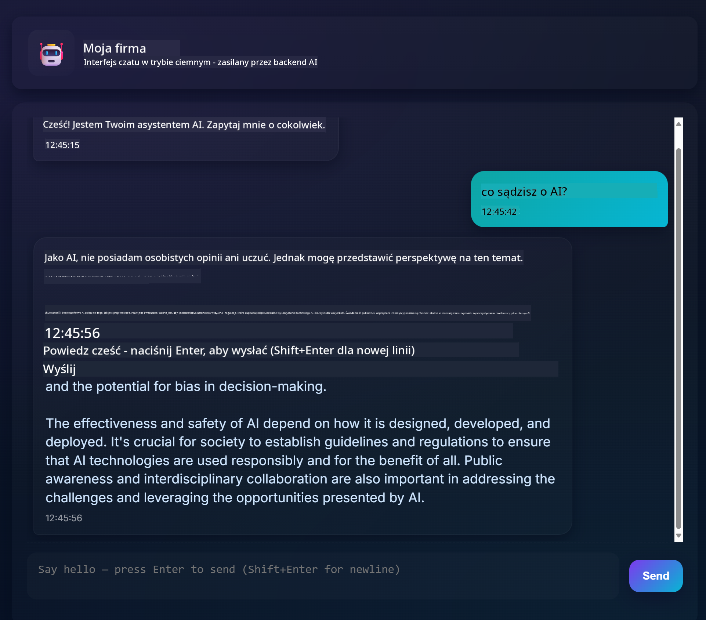
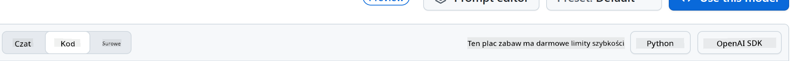
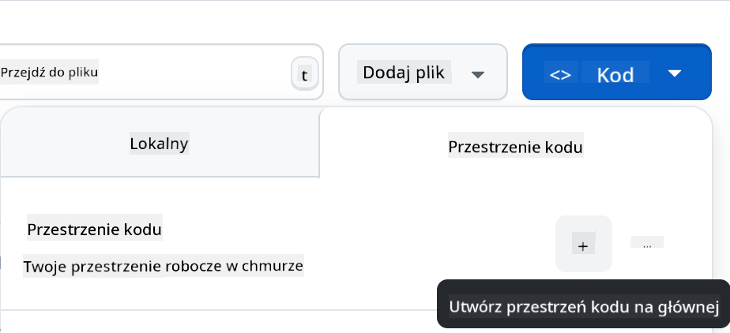

<!--
CO_OP_TRANSLATOR_METADATA:
{
  "original_hash": "11cf36165c243947b6cd85b88cf6faa6",
  "translation_date": "2025-09-01T16:54:35+00:00",
  "source_file": "9-chat-project/README.md",
  "language_code": "pl"
}
-->
# Projekt czatu

Ten projekt czatu pokazuje, jak zbudować Asystenta Czatu przy użyciu GitHub Models.

Oto jak wygląda ukończony projekt:



Kilka słów wstępu: budowanie asystentów czatu z wykorzystaniem generatywnej AI to świetny sposób na rozpoczęcie nauki o sztucznej inteligencji. W tej lekcji nauczysz się, jak zintegrować generatywną AI z aplikacją webową. Zaczynajmy!

## Połączenie z generatywną AI

Na backendzie używamy GitHub Models. To świetna usługa, która pozwala korzystać z AI za darmo. Przejdź do jej playground i skopiuj kod odpowiadający wybranemu językowi backendu. Oto jak wygląda [GitHub Models Playground](https://github.com/marketplace/models/azure-openai/gpt-4o-mini/playground):


Jak wspomniano, wybierz zakładkę "Code" i swój preferowany runtime.



### Użycie Pythona

W tym przypadku wybieramy Pythona, co oznacza, że wybieramy ten kod:

```python
"""Run this model in Python

> pip install openai
"""
import os
from openai import OpenAI

# To authenticate with the model you will need to generate a personal access token (PAT) in your GitHub settings. 
# Create your PAT token by following instructions here: https://docs.github.com/en/authentication/keeping-your-account-and-data-secure/managing-your-personal-access-tokens
client = OpenAI(
    base_url="https://models.github.ai/inference",
    api_key=os.environ["GITHUB_TOKEN"],
)

response = client.chat.completions.create(
    messages=[
        {
            "role": "system",
            "content": "",
        },
        {
            "role": "user",
            "content": "What is the capital of France?",
        }
    ],
    model="openai/gpt-4o-mini",
    temperature=1,
    max_tokens=4096,
    top_p=1
)

print(response.choices[0].message.content)
```

Oczyśćmy ten kod, aby był bardziej uniwersalny:

```python
def call_llm(prompt: str, system_message: str):
    response = client.chat.completions.create(
        messages=[
            {
                "role": "system",
                "content": system_message,
            },
            {
                "role": "user",
                "content": prompt,
            }
        ],
        model="openai/gpt-4o-mini",
        temperature=1,
        max_tokens=4096,
        top_p=1
    )

    return response.choices[0].message.content
```

Dzięki tej funkcji `call_llm` możemy teraz podać prompt i system prompt, a funkcja zwróci wynik.

### Dostosowanie Asystenta AI

Jeśli chcesz dostosować asystenta AI, możesz określić, jak ma się zachowywać, wypełniając system prompt w ten sposób:

```python
call_llm("Tell me about you", "You're Albert Einstein, you only know of things in the time you were alive")
```

## Udostępnienie przez Web API

Świetnie, mamy część AI gotową, zobaczmy, jak możemy zintegrować ją z Web API. W przypadku Web API wybieramy Flask, ale każdy framework webowy będzie odpowiedni. Oto kod:

### Użycie Pythona

```python
# api.py
from flask import Flask, request, jsonify
from llm import call_llm
from flask_cors import CORS

app = Flask(__name__)
CORS(app)   # *   example.com

@app.route("/", methods=["GET"])
def index():
    return "Welcome to this API. Call POST /hello with 'message': 'my message' as JSON payload"


@app.route("/hello", methods=["POST"])
def hello():
    # get message from request body  { "message": "do this taks for me" }
    data = request.get_json()
    message = data.get("message", "")

    response = call_llm(message, "You are a helpful assistant.")
    return jsonify({
        "response": response
    })

if __name__ == "__main__":
    app.run(host="0.0.0.0", port=5000)
```

Tutaj tworzymy API we Flasku i definiujemy domyślną trasę "/" oraz "/chat". Ta druga jest przeznaczona do komunikacji z frontendem, aby przesyłać pytania.

Aby zintegrować *llm.py*, musimy zrobić następujące kroki:

- Zaimportować funkcję `call_llm`:

   ```python
   from llm import call_llm
   from flask import Flask, request
   ```

- Wywołać ją w trasie "/chat":

   ```python
   @app.route("/hello", methods=["POST"])
   def hello():
      # get message from request body  { "message": "do this taks for me" }
      data = request.get_json()
      message = data.get("message", "")

      response = call_llm(message, "You are a helpful assistant.")
      return jsonify({
         "response": response
      })
   ```

   Tutaj analizujemy przychodzące żądanie, aby pobrać właściwość `message` z ciała JSON. Następnie wywołujemy LLM w ten sposób:

   ```python
   response = call_llm(message, "You are a helpful assistant")

   # return the response as JSON
   return jsonify({
      "response": response 
   })
   ```

Świetnie, teraz mamy to, czego potrzebujemy.

## Konfiguracja Cors

Warto wspomnieć, że ustawiliśmy coś takiego jak CORS, czyli współdzielenie zasobów między różnymi domenami. Oznacza to, że ponieważ nasz backend i frontend będą działać na różnych portach, musimy pozwolić frontendowi na komunikację z backendem.

### Użycie Pythona

W pliku *api.py* znajduje się fragment kodu, który to ustawia:

```python
from flask_cors import CORS

app = Flask(__name__)
CORS(app)   # *   example.com
```

Obecnie jest ustawione na "*" (wszystkie domeny), co jest nieco niebezpieczne. Powinniśmy to ograniczyć, gdy przejdziemy do produkcji.

## Uruchomienie projektu

Aby uruchomić projekt, najpierw musisz uruchomić backend, a potem frontend.

### Użycie Pythona

Mamy *llm.py* i *api.py*, jak to uruchomić na backendzie? Są dwa kroki:

- Zainstaluj zależności:

   ```sh
   cd backend
   python -m venv venv
   source ./venv/bin/activate

   pip install openai flask flask-cors openai
   ```

- Uruchom API:

   ```sh
   python api.py
   ```

   Jeśli korzystasz z Codespaces, przejdź do sekcji Ports w dolnej części edytora, kliknij prawym przyciskiem myszy i wybierz "Port Visibility", a następnie "Public".

### Praca nad frontendem

Teraz, gdy mamy działające API, stwórzmy frontend. Minimalny frontend, który będziemy stopniowo ulepszać. W folderze *frontend* utwórz następujące pliki:

```text
backend/
frontend/
index.html
app.js
styles.css
```

Zacznijmy od **index.html**:

```html
<html>
    <head>
        <link rel="stylesheet" href="styles.css">
    </head>
    <body>
      <form>
        <textarea id="messages"></textarea>
        <input id="input" type="text" />
        <button type="submit" id="sendBtn">Send</button>  
      </form>  
      <script src="app.js" />
    </body>
</html>    
```

Powyższy kod to absolutne minimum potrzebne do obsługi okna czatu. Składa się z pola tekstowego, w którym będą wyświetlane wiadomości, pola wejściowego do wpisywania wiadomości oraz przycisku do wysyłania wiadomości do backendu. Teraz spójrzmy na JavaScript w pliku *app.js*.

**app.js**

```js
// app.js

(function(){
  // 1. set up elements  
  const messages = document.getElementById("messages");
  const form = document.getElementById("form");
  const input = document.getElementById("input");

  const BASE_URL = "change this";
  const API_ENDPOINT = `${BASE_URL}/hello`;

  // 2. create a function that talks to our backend
  async function callApi(text) {
    const response = await fetch(API_ENDPOINT, {
      method: "POST",
      headers: { "Content-Type": "application/json" },
      body: JSON.stringify({ message: text })
    });
    let json = await response.json();
    return json.response;
  }

  // 3. add response to our textarea
  function appendMessage(text, role) {
    const el = document.createElement("div");
    el.className = `message ${role}`;
    el.innerHTML = text;
    messages.appendChild(el);
  }

  // 4. listen to submit events
  form.addEventListener("submit", async(e) => {
    e.preventDefault();
   // someone clicked the button in the form
   
   // get input
   const text = input.value.trim();

   appendMessage(text, "user")

   // reset it
   input.value = '';

   const reply = await callApi(text);

   // add to messages
   appendMessage(reply, "assistant");

  })
})();
```

Omówmy kod sekcja po sekcji:

- 1) Tutaj uzyskujemy referencje do wszystkich elementów, których będziemy używać w kodzie.
- 2) W tej sekcji tworzymy funkcję, która korzysta z wbudowanej metody `fetch`, aby wywołać nasze API.
- 3) `appendMessage` pomaga dodawać odpowiedzi oraz wiadomości wpisane przez użytkownika.
- 4) Tutaj nasłuchujemy zdarzenia submit, odczytujemy pole wejściowe, umieszczamy wiadomość użytkownika w polu tekstowym, wywołujemy API i renderujemy odpowiedź w polu tekstowym.

Teraz przejdźmy do stylizacji. Możesz tutaj zaszaleć i dostosować wygląd według własnych upodobań, ale oto kilka sugestii:

**styles.css**

```
.message {
    background: #222;
    box-shadow: 0 0 0 10px orange;
    padding: 10px:
    margin: 5px;
}

.message.user {
    background: blue;
}

.message.assistant {
    background: grey;
} 
```

Dzięki tym trzem klasom możesz stylizować wiadomości w zależności od tego, czy pochodzą od asystenta, czy od użytkownika. Jeśli potrzebujesz inspiracji, zajrzyj do folderu `solution/frontend/styles.css`.

### Zmiana Base Url

Jest jedna rzecz, której jeszcze nie ustawiliśmy, a mianowicie `BASE_URL`. Nie jest ona znana, dopóki backend nie zostanie uruchomiony. Aby ją ustawić:

- Jeśli uruchamiasz API lokalnie, powinna być ustawiona na coś w stylu `http://localhost:5000`.
- Jeśli uruchamiasz w Codespaces, powinna wyglądać mniej więcej tak: "[name]app.github.dev".

## Zadanie

Utwórz własny folder *project* z zawartością jak poniżej:

```text
project/
  frontend/
    index.html
    app.js
    styles.css
  backend/
    ...
```

Skopiuj zawartość zgodnie z powyższymi instrukcjami, ale możesz dostosować ją według własnych upodobań.

## Rozwiązanie

[Solution](./solution/README.md)

## Bonus

Spróbuj zmienić osobowość asystenta AI.

### Dla Pythona

Podczas wywoływania `call_llm` w *api.py* możesz zmienić drugi argument na dowolny, na przykład:

```python
call_llm(message, "You are Captain Picard")
```

### Frontend

Zmień również CSS i tekst według własnych upodobań, wprowadzając zmiany w *index.html* i *styles.css*.

## Podsumowanie

Świetnie, nauczyłeś się od podstaw, jak stworzyć osobistego asystenta z wykorzystaniem AI. Zrobiliśmy to przy użyciu GitHub Models, backendu w Pythonie oraz frontendu w HTML, CSS i JavaScript.

## Konfiguracja w Codespaces

- Przejdź do: [Repozytorium Web Dev For Beginners](https://github.com/microsoft/Web-Dev-For-Beginners)
- Utwórz repozytorium z szablonu (upewnij się, że jesteś zalogowany na GitHubie) w prawym górnym rogu:

    

- Po wejściu do repozytorium utwórz Codespace:

    

    Powinno to uruchomić środowisko, w którym możesz teraz pracować.

---

**Zastrzeżenie**:  
Ten dokument został przetłumaczony za pomocą usługi tłumaczenia AI [Co-op Translator](https://github.com/Azure/co-op-translator). Chociaż dokładamy wszelkich starań, aby tłumaczenie było precyzyjne, prosimy pamiętać, że automatyczne tłumaczenia mogą zawierać błędy lub nieścisłości. Oryginalny dokument w jego języku źródłowym powinien być uznawany za autorytatywne źródło. W przypadku informacji o kluczowym znaczeniu zaleca się skorzystanie z profesjonalnego tłumaczenia przez człowieka. Nie ponosimy odpowiedzialności za jakiekolwiek nieporozumienia lub błędne interpretacje wynikające z użycia tego tłumaczenia.