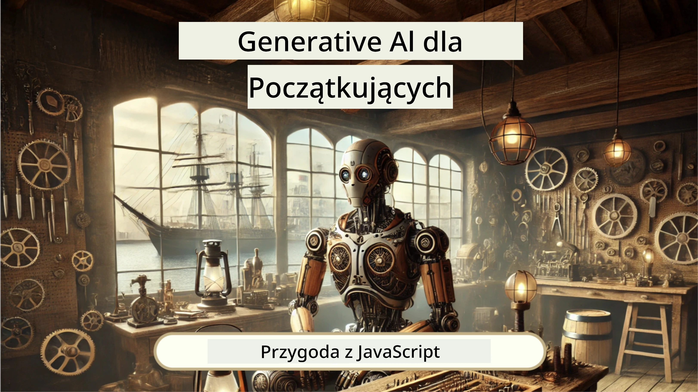
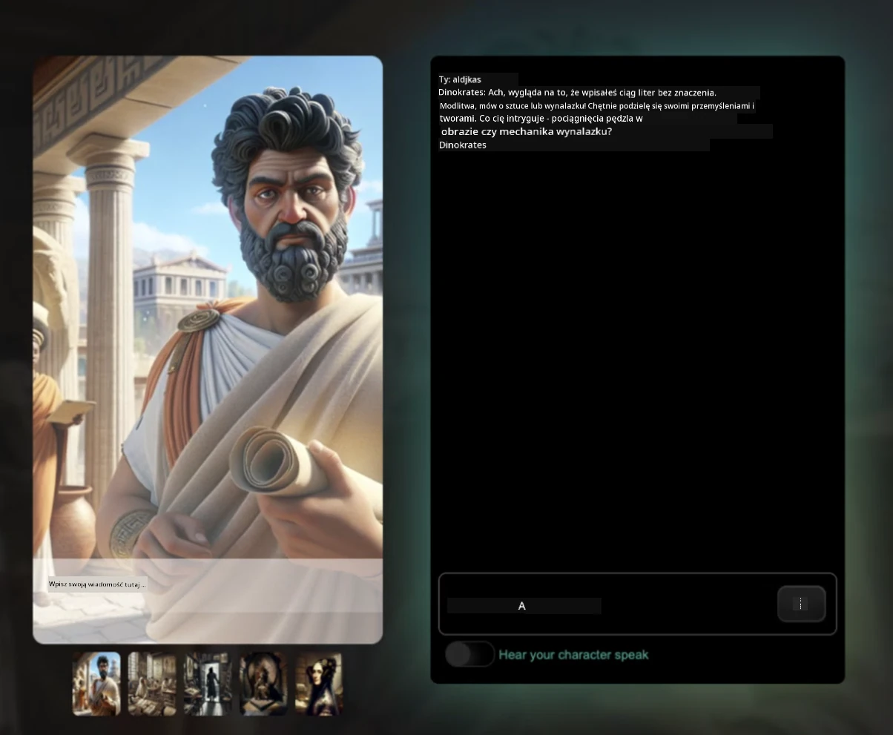
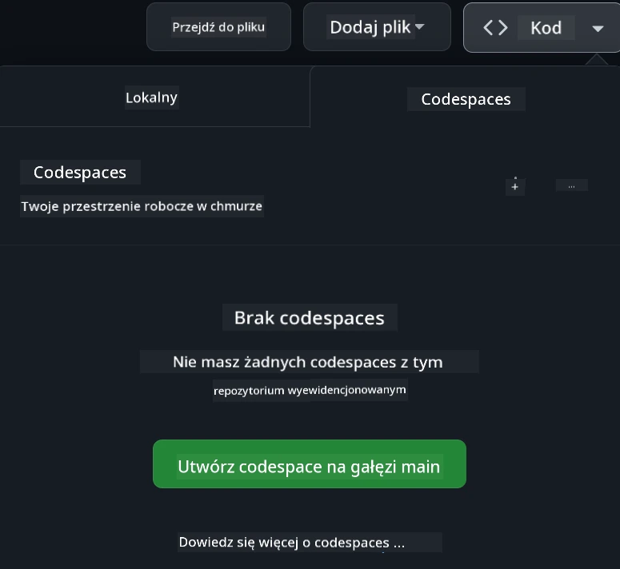

[](https://github.com/microsoft/Web-Dev-For-Beginners/blob/master/LICENSE)
[](https://GitHub.com/microsoft/Web-Dev-For-Beginners/graphs/contributors/)
[](https://GitHub.com/microsoft/Web-Dev-For-Beginners/issues/)
[](https://GitHub.com/microsoft/Web-Dev-For-Beginners/pulls/)
[](http://makeapullrequest.com) 

[](https://GitHub.com/microsoft/Web-Dev-For-Beginners/watchers/)
[](https://GitHub.com/microsoft/Web-Dev-For-Beginners/network/)
[](https://GitHub.com/microsoft/Web-Dev-For-Beginners/stargazers/)

[](https://discord.gg/nTYy5BXMWG)

# Tworzenie stron internetowych dla początkujących - program nauczania

Poznaj podstawy tworzenia stron internetowych dzięki naszemu 12-tygodniowemu kompleksowemu kursowi prowadzonemu przez Microsoft Cloud Advocates. Każda z 24 lekcji zanurza się w JavaScript, CSS i HTML poprzez praktyczne projekty, takie jak terraria, rozszerzenia przeglądarki i gry kosmiczne. Angażuj się w quizy, dyskusje i zadania praktyczne. Rozwijaj swoje umiejętności i optymalizuj utrwalanie wiedzy dzięki naszej efektywnej pedagogice opartej na projektach. Rozpocznij swoją przygodę z kodowaniem już dziś!

Dołącz do społeczności Azure AI Foundry na Discordzie

[](https://discord.gg/nTYy5BXMWG)

Wykonaj te kroki, aby zacząć korzystać z tych zasobów:
1. **Utwórz forka repozytorium**: Kliknij [](https://GitHub.com/microsoft/Web-Dev-For-Beginners/fork)
2. **Sklonuj repozytorium**:   `git clone https://github.com/microsoft/Web-Dev-For-Beginners.git`
3. [**Dołącz do Azure AI Foundry na Discordzie i spotkaj ekspertów oraz innych programistów**](https://discord.com/invite/ByRwuEEgH4)

### 🌐 Obsługa wielu języków

#### Wsparcie poprzez GitHub Action (automatyczne i zawsze aktualne)

<!-- CO-OP TRANSLATOR LANGUAGES TABLE START -->
[Arabic](../ar/README.md) | [Bengali](../bn/README.md) | [Bulgarian](../bg/README.md) | [Burmese (Myanmar)](../my/README.md) | [Chinese (Simplified)](../zh-CN/README.md) | [Chinese (Traditional, Hong Kong)](../zh-HK/README.md) | [Chinese (Traditional, Macau)](../zh-MO/README.md) | [Chinese (Traditional, Taiwan)](../zh-TW/README.md) | [Croatian](../hr/README.md) | [Czech](../cs/README.md) | [Danish](../da/README.md) | [Dutch](../nl/README.md) | [Estonian](../et/README.md) | [Finnish](../fi/README.md) | [French](../fr/README.md) | [German](../de/README.md) | [Greek](../el/README.md) | [Hebrew](../he/README.md) | [Hindi](../hi/README.md) | [Hungarian](../hu/README.md) | [Indonesian](../id/README.md) | [Italian](../it/README.md) | [Japanese](../ja/README.md) | [Kannada](../kn/README.md) | [Korean](../ko/README.md) | [Lithuanian](../lt/README.md) | [Malay](../ms/README.md) | [Malayalam](../ml/README.md) | [Marathi](../mr/README.md) | [Nepali](../ne/README.md) | [Nigerian Pidgin](../pcm/README.md) | [Norwegian](../no/README.md) | [Persian (Farsi)](../fa/README.md) | [Polish](./README.md) | [Portuguese (Brazil)](../pt-BR/README.md) | [Portuguese (Portugal)](../pt-PT/README.md) | [Punjabi (Gurmukhi)](../pa/README.md) | [Romanian](../ro/README.md) | [Russian](../ru/README.md) | [Serbian (Cyrillic)](../sr/README.md) | [Slovak](../sk/README.md) | [Slovenian](../sl/README.md) | [Spanish](../es/README.md) | [Swahili](../sw/README.md) | [Swedish](../sv/README.md) | [Tagalog (Filipino)](../tl/README.md) | [Tamil](../ta/README.md) | [Telugu](../te/README.md) | [Thai](../th/README.md) | [Turkish](../tr/README.md) | [Ukrainian](../uk/README.md) | [Urdu](../ur/README.md) | [Vietnamese](../vi/README.md)

> **Wolisz klonować lokalnie?**

> To repozytorium zawiera ponad 50 tłumaczeń językowych, co znacznie zwiększa rozmiar pobierania. Aby klonować bez tłumaczeń, użyj sparse checkout:
> ```bash
> git clone --filter=blob:none --sparse https://github.com/microsoft/Web-Dev-For-Beginners.git
> cd Web-Dev-For-Beginners
> git sparse-checkout set --no-cone '/*' '!translations' '!translated_images'
> ```
> To da Ci wszystko, czego potrzebujesz do ukończenia kursu z dużo szybszym pobieraniem.
<!-- CO-OP TRANSLATOR LANGUAGES TABLE END -->

**Jeśli chcesz, aby obsługiwane były dodatkowe języki tłumaczeń, są one wymienione [tutaj](https://github.com/Azure/co-op-translator/blob/main/getting_started/supported-languages.md)**

[](https://open.vscode.dev/microsoft/Web-Dev-For-Beginners)

#### 🧑‍🎓 _Jesteś studentem?_

Odwiedź [**Stronę Student Hub**](https://docs.microsoft.com/learn/student-hub/?WT.mc_id=academic-77807-sagibbon), gdzie znajdziesz zasoby dla początkujących, pakiety dla studentów, a nawet sposoby na uzyskanie darmowego vouchera na certyfikat. To jest strona, którą warto dodać do zakładek i od czasu do czasu sprawdzać, ponieważ co miesiąc zmieniamy zawartość.

### 📣 Ogłoszenie - Nowe wyzwania trybu GitHub Copilot Agent do wykonania!

Dodano nowe wyzwanie, szukaj "GitHub Copilot Agent Challenge 🚀" w większości rozdziałów. To nowe wyzwanie do wykonania przy użyciu GitHub Copilot i trybu Agenta. Jeśli nie korzystałeś wcześniej z trybu Agenta, potrafi on nie tylko generować tekst, ale także tworzyć i edytować pliki, uruchamiać polecenia i więcej.

### 📣 Ogłoszenie - _Nowy projekt do realizacji z wykorzystaniem Generatywnej AI_

Dodano nowy projekt AI Assistant, sprawdź [projekt](./9-chat-project/README.md)

### 📣 Ogłoszenie - _Nowy program nauczania_ o Generatywnej AI dla JavaScript właśnie został wydany

Nie przegap naszego nowego programu nauczania Generatywnej AI!

Odwiedź [https://aka.ms/genai-js-course](https://aka.ms/genai-js-course), aby zacząć!



- Lekcje obejmujące wszystko od podstaw po RAG.
- Interakcja z postaciami historycznymi za pomocą GenAI i naszej aplikacji towarzyszącej.
- Zabawa i angażująca narracja, będziesz podróżować w czasie!




Każda lekcja zawiera zadanie do wykonania, test wiedzy i wyzwanie, które pokierują Cię w nauce tematów takich jak:
- Promptowanie i inżynieria promptów
- Generowanie aplikacji tekstowych i obrazkowych
- Aplikacje wyszukujące

Odwiedź [https://aka.ms/genai-js-course](https://aka.ms/genai-js-course), aby zacząć!


## 🌱 Rozpoczęcie

> **Nauczyciele**, przygotowaliśmy [kilka sugestii](for-teachers.md) dotyczących korzystania z tego programu nauczania. Liczymy na Wasze opinie [na naszym forum dyskusyjnym](https://github.com/microsoft/Web-Dev-For-Beginners/discussions/categories/teacher-corner)!

**[Uczniowie](https://aka.ms/student-page/?WT.mc_id=academic-77807-sagibbon)**, do każdej lekcji zacznij od quizu wstępnego, a następnie przeczytaj materiał wykładu, wykonaj różne aktywności i sprawdź swoje rozumienie w quizie podsumowującym.

Aby wzmocnić swoją naukę, łącz się z kolegami i koleżankami, aby pracować nad projektami razem! Zachęcamy do dyskusji na naszym [forum dyskusyjnym](https://github.com/microsoft/Web-Dev-For-Beginners/discussions), gdzie nasz zespół moderatorów jest dostępny, aby odpowiadać na Wasze pytania.

Aby pogłębić edukację, zdecydowanie polecamy zapoznanie się z [Microsoft Learn](https://learn.microsoft.com/users/wirelesslife/collections/p1ddcy5jwy0jkm?WT.mc_id=academic-77807-sagibbon) po dodatkowe materiały do nauki.

### 📋 Konfiguracja środowiska

Ten program nauczania ma gotowe środowisko do programowania! Na start możesz wybrać uruchomienie go w [Codespace](https://github.com/features/codespaces/) (_środowisku przeglądarkowym, bez konieczności instalacji_), lub lokalnie na swoim komputerze z użyciem edytora tekstu, takiego jak [Visual Studio Code](https://code.visualstudio.com/?WT.mc_id=academic-77807-sagibbon).

#### Utwórz własne repozytorium
Aby łatwo zapisywać swoją pracę, zalecamy utworzenie własnej kopii tego repozytorium. Możesz to zrobić klikając przycisk **Use this template** na górze strony. Spowoduje to utworzenie nowego repozytorium na Twoim koncie GitHub z kopią programu nauczania.

Wykonaj następujące kroki:
1. **Utwórz forka repozytorium**: Kliknij przycisk "Fork" w prawym górnym rogu tej strony.
2. **Sklonuj repozytorium**:   `git clone https://github.com/microsoft/Web-Dev-For-Beginners.git`

#### Uruchamianie programu nauczania w Codespace

W swojej kopii tego repozytorium, które utworzyłeś, kliknij przycisk **Code** i wybierz **Open with Codespaces**. Spowoduje to utworzenie nowego Codespace do pracy.



#### Uruchamianie programu nauczania lokalnie na komputerze

Aby uruchomić ten program nauczania lokalnie na swoim komputerze, potrzebujesz edytora tekstu, przeglądarki oraz narzędzia wiersza polecenia. Nasza pierwsza lekcja, [Wprowadzenie do języków programowania i narzędzi](../../1-getting-started-lessons/1-intro-to-programming-languages), poprowadzi Cię przez różne opcje tych narzędzi, abyś mógł wybrać najlepsze dla siebie.

Polecamy używać [Visual Studio Code](https://code.visualstudio.com/?WT.mc_id=academic-77807-sagibbon) jako edytora, który ma również wbudowany [Terminal](https://code.visualstudio.com/docs/terminal/basics/?WT.mc_id=academic-77807-sagibbon). Możesz pobrać Visual Studio Code [tutaj](https://code.visualstudio.com/?WT.mc_id=academic-77807-sagibbon).


1. Sklonuj swoje repozytorium na komputer. Możesz to zrobić, klikając przycisk **Code** i kopiując URL:

    [CodeSpace](./images/createcodespace.png)
    Następnie otwórz [Terminal](https://code.visualstudio.com/docs/terminal/basics/?WT.mc_id=academic-77807-sagibbon) w [Visual Studio Code](https://code.visualstudio.com/?WT.mc_id=academic-77807-sagibbon) i uruchom następujące polecenie, zastępując `<your-repository-url>` adresem URL, który właśnie skopiowałeś:

    ```bash 
    git clone <your-repository-url>
    ```

2. Otwórz folder w Visual Studio Code. Możesz to zrobić, klikając **Plik** > **Otwórz folder** i wybierając właśnie sklonowany folder.


>  Zalecane rozszerzenia Visual Studio Code:
>
> * [Live Server](https://marketplace.visualstudio.com/items?itemName=ritwickdey.LiveServer&WT.mc_id=academic-77807-sagibbon) - do podglądu stron HTML w Visual Studio Code
> * [Copilot](https://marketplace.visualstudio.com/items?itemName=GitHub.copilot&WT.mc_id=academic-77807-sagibbon) - pomaga pisać kod szybciej

## 📂 Każda lekcja zawiera:

- opcjonalną sketchnotkę
- opcjonalne uzupełniające wideo
- quiz rozgrzewkowy przed lekcją
- lekcję tekstową
- w lekcjach opartych na projekcie, szczegółowe przewodniki krok po kroku jak zbudować projekt
- testy wiedzy
- wyzwanie
- uzupełniającą lekturę
- zadanie domowe
- [quiz po lekcji](https://ff-quizzes.netlify.app/web/)

> **Uwagi o quizach**: Wszystkie quizy znajdują się w folderze Quiz-app, łącznie 48 quizów po trzy pytania każdy. Są dostępne [tutaj](https://ff-quizzes.netlify.app/web/), aplikację quizową można uruchomić lokalnie lub wdrożyć do Azure; postępuj zgodnie z instrukcjami w folderze `quiz-app`.

## 🗃️ Lekcje

|     |                       Nazwa projektu                      |                            Nauczane koncepcje                             | Cele nauki                                                                                                                     |                                                         Powiązana lekcja                                                          |         Autor          |
| :-: | :-------------------------------------------------------: | :----------------------------------------------------------------------: | ----------------------------------------------------------------------------------------------------------------------------- | :------------------------------------------------------------------------------------------------------------------------------: | :---------------------: |
| 01  |                     Zacznijmy                            |           Wprowadzenie do programowania i narzędzi używanych w branży           | Poznaj podstawy programowania oraz oprogramowanie pomagające profesjonalnym programistom w pracy                               | [Wprowadzenie do języków programowania i narzędzi](./1-getting-started-lessons/1-intro-to-programming-languages/README.md)      |         Jasmine         |
| 02  |                     Zacznijmy                            |             Podstawy GitHuba, praca zespołowa            | Jak używać GitHuba w projekcie, jak współpracować z innymi nad kodem                                                           |                            [Wprowadzenie do GitHuba](./1-getting-started-lessons/2-github-basics/README.md)                          |          Floor          |
| 03  |                     Zacznijmy                            |                             Dostępność                              | Naucz się podstaw dostępności stron internetowych                                                                              |                       [Podstawy dostępności](./1-getting-started-lessons/3-accessibility/README.md)                                 |       Christopher       |
| 04  |                        Podstawy JS                        |                         Typy danych w JavaScript                          | Podstawy typów danych w JavaScript                                                                                              |                                       [Typy danych](./2-js-basics/1-data-types/README.md)                                          |         Jasmine         |
| 05  |                        Podstawy JS                        |                         Funkcje i metody                              | Poznaj funkcje i metody służące do zarządzania logiką aplikacji                                                                |                              [Funkcje i metody](./2-js-basics/2-functions-methods/README.md)                                        | Jasmine i Christopher   |
| 06  |                        Podstawy JS                        |                        Podejmowanie decyzji z JS                       | Naucz się tworzyć warunki w swoim kodzie przy użyciu metod podejmowania decyzji                                                 |                                 [Podejmowanie decyzji](./2-js-basics/3-making-decisions/README.md)                                  |         Jasmine         |
| 07  |                        Podstawy JS                        |                            Tablice i pętle                             | Pracuj z danymi za pomocą tablic i pętli w JavaScript                                                                           |                                   [Tablice i pętle](./2-js-basics/4-arrays-loops/README.md)                                      |         Jasmine         |
| 08  |       [Terrarium](./3-terrarium/solution/README.md)      |                            HTML w praktyce                            | Zbuduj HTML potrzebny do stworzenia online terrarium, skupiając się na układzie strony                                            |                                 [Wprowadzenie do HTML](./3-terrarium/1-intro-to-html/README.md)                                    |           Jen           |
| 09  |       [Terrarium](./3-terrarium/solution/README.md)      |                            CSS w praktyce                             | Zbuduj CSS, by wystylizować online terrarium, skupiając się na podstawach CSS i responsywności                                   |                                  [Wprowadzenie do CSS](./3-terrarium/2-intro-to-css/README.md)                                    |           Jen           |
| 10  |            [Terrarium](./3-terrarium/solution/README.md)            |                 JavaScript closures, manipulacja DOM                  | Zbuduj JavaScript, który pozwoli terrarium działać z funkcją przeciągnij upuść, skupiając się na closures i manipulacji DOM      |                  [JavaScript closures, manipulacja DOM](./3-terrarium/3-intro-to-DOM-and-closures/README.md)                      |           Jen           |
| 11  |          [Typing Game](./4-typing-game/solution/README.md)          |                          Zbuduj grę w pisanie na klawiaturze            | Naucz się używać zdarzeń klawiatury do sterowania logiką aplikacji JavaScript                                                   |                                [Programowanie zdarzeniowe](./4-typing-game/typing-game/README.md)                                  |       Christopher       |
| 12  | [Green Browser Extension](./5-browser-extension/solution/README.md) |                         Praca z przeglądarkami                        | Naucz się, jak działają przeglądarki, ich historię oraz jak stworzyć pierwsze elementy rozszerzenia przeglądarki                |                               [O przeglądarkach](./5-browser-extension/1-about-browsers/README.md)                                   |           Jen           |
| 13  | [Green Browser Extension](./5-browser-extension/solution/README.md) | Tworzenie formularzy, wywoływanie API i przechowywanie zmiennych w local storage | Stwórz elementy JavaScript rozszerzenia przeglądarki do wywoływania API, korzystając ze zmiennych przechowywanych lokalnie       |                [API, formularze i local storage](./5-browser-extension/2-forms-browsers-local-storage/README.md)                  |           Jen           |
| 14  | [Green Browser Extension](./5-browser-extension/solution/README.md) |          Procesy tła w przeglądarce, wydajność www         | Użyj procesów tła przeglądarki do zarządzania ikoną rozszerzenia; poznaj optymalizacje poprawiające wydajność                    |             [Procesy tła i wydajność](./5-browser-extension/3-background-tasks-and-performance/README.md)                       |           Jen           |
| 15  |           [Space Game](./6-space-game/solution/README.md)           |             Zaawansowane tworzenie gier w JavaScript           | Poznaj dziedziczenie wykorzystujące klasy i kompozycję oraz wzorzec Pub/Sub, w przygotowaniu do budowy gry                     |                      [Wprowadzenie do zaawansowanego tworzenia gier](./6-space-game/1-introduction/README.md)                   |          Chris          |
| 16  |           [Space Game](./6-space-game/solution/README.md)           |                           Rysowanie na kanwie                            | Poznaj API Canvas do rysowania elementów na ekranie                                                                             |                                [Rysowanie na kanwie](./6-space-game/2-drawing-to-canvas/README.md)                                |          Chris          |
| 17  |           [Space Game](./6-space-game/solution/README.md)           |                   Poruszanie elementów na ekranie                    | Dowiedz się, jak elementy mogą się poruszać, używając współrzędnych kartezjańskich i API Canvas                                 |                           [Poruszanie elementami](./6-space-game/3-moving-elements-around/README.md)                            |          Chris          |
| 18  |           [Space Game](./6-space-game/solution/README.md)           |                          Wykrywanie kolizji                           | Spraw, aby elementy zderzały się i reagowały na siebie, używając naciśnięć klawiszy oraz funkcji cooldown dla wydajności gry   |                              [Wykrywanie kolizji](./6-space-game/4-collision-detection/README.md)                              |          Chris          |
| 19  |           [Space Game](./6-space-game/solution/README.md)           |                             Liczenie punktów                             | Wykonuj obliczenia matematyczne na podstawie stanu i wyniku gry                                                                 |                                    [Liczenie punktów](./6-space-game/5-keeping-score/README.md)                                   |          Chris          |
| 20  |           [Space Game](./6-space-game/solution/README.md)           |                    Kończenie i restartowanie gry                      | Naucz się kończyć i restartować grę, w tym sprzątać zasoby i resetować wartości zmiennych                                        |                                [Warunek zakończenia](./6-space-game/6-end-condition/README.md)                                   |          Chris          |
| 21  |         [Banking App](./7-bank-project/solution/README.md)          |                 Szablony HTML i trasy w aplikacji webowej             | Naucz się tworzyć szkielet architektury multipage site za pomocą routingu i szablonów HTML                                       |                            [Szablony HTML i trasy](./7-bank-project/1-template-route/README.md)                                 |          Yohan          |
| 22  |         [Banking App](./7-bank-project/solution/README.md)          |                  Tworzenie formularzy logowania i rejestracji          | Dowiedz się, jak budować formularze i obsługiwać walidację                                                                       |                                           [Formularze](./7-bank-project/2-forms/README.md)                                       |          Yohan          |
| 23  |         [Banking App](./7-bank-project/solution/README.md)          |                   Metody pobierania i używania danych                   | Jak wyglądają przepływy danych w Twojej aplikacji, jak je pobierać, przechowywać i usuwać                                          |                                            [Dane](./7-bank-project/3-data/README.md)                                           |          Yohan          |
| 24  |         [Banking App](./7-bank-project/solution/README.md)          |                      Koncepcje zarządzania stanem                      | Naucz się, jak Twoja aplikacja przechowuje stan i jak nim programowo zarządzać                                                  |                                [Zarządzanie stanem](./7-bank-project/4-state-management/README.md)                               |          Yohan          |
| 25 | [Browser/VScode Code](../../8-code-editor) | Praca z VScode | Naucz się korzystać z edytora kodu | [Używaj edytora kodu VScode](./8-code-editor/1-using-a-code-editor/README.md) | Chris |
| 26 | [AI Assistants](./9-chat-project/README.md) | Praca z AI | Naucz się tworzyć własnego asystenta AI | [Projekt AI Assistant](./9-chat-project/README.md) | Chris |

## 🏫 Pedagogika

Nasz program nauczania opiera się na dwóch kluczowych zasadach pedagogicznych:
* nauka oparta na projektach
* częste quizy

Program uczy podstaw JavaScript, HTML i CSS oraz najnowszych narzędzi i technik stosowanych przez dzisiejszych programistów webowych. Studenci będą mieli okazję zdobyć praktyczne doświadczenie, tworząc grę do nauki pisania na klawiaturze, wirtualne terrarium, ekologiczne rozszerzenie przeglądarki, grę w stylu Space Invaders oraz aplikację bankową dla firm. Do końca serii uczniowie zdobędą solidną wiedzę z zakresu tworzenia stron internetowych.

> 🎓 Możesz zacząć od pierwszych kilku lekcji tego programu jako [Ścieżkę nauki](https://docs.microsoft.com/learn/paths/web-development-101/?WT.mc_id=academic-77807-sagibbon) na Microsoft Learn!

Zapewnienie zgodności treści z projektami sprawia, że proces nauki jest dla uczniów bardziej angażujący, a utrwalenie koncepcji zostanie wzmocnione. Napisaliśmy też kilka lekcji wprowadzających do podstaw JavaScript, które prezentują koncepcje, a także dołączyliśmy wideo z kolekcji "[Beginners Series to: JavaScript](https://channel9.msdn.com/Series/Beginners-Series-to-JavaScript/?WT.mc_id=academic-77807-sagibbon)", których autorzy przyczynili się do tego programu nauczania.

Ponadto quiz niskiego ryzyka przed lekcją ustawia intencję ucznia w kierunku nauki tematu, a drugi quiz po zajęciach zapewnia dalsze utrwalenie. Program ma charakter elastyczny i zabawowy i można z niego korzystać w całości lub częściowo. Projekty zaczynają się od prostych i stają się coraz bardziej złożone pod koniec 12-tygodniowego cyklu.

Ponieważ świadomie unikamy wprowadzania frameworków JavaScript, koncentrując się na podstawowych umiejętnościach potrzebnych jako programista webowy przed przyjęciem frameworka, dobrym następnym krokiem po ukończeniu tego programu będzie nauka Node.js za pomocą innej kolekcji wideo: "[Beginner Series to: Node.js](https://channel9.msdn.com/Series/Beginners-Series-to-Nodejs/?WT.mc_id=academic-77807-sagibbon)".

> Odwiedź nasze wytyczne [Kodeks Postępowania](CODE_OF_CONDUCT.md) oraz [Wkład](CONTRIBUTING.md). Zachęcamy do konstruktywnej opinii!


## 🧭 Dostęp offline

Możesz uruchomić tę dokumentację offline, używając [Docsify](https://docsify.js.org/#/). Rozgałęź ten repozytorium, [zainstaluj Docsify](https://docsify.js.org/#/quickstart) na swoim lokalnym komputerze, a następnie w katalogu głównym repozytorium wpisz `docsify serve`. Strona będzie dostępna na porcie 3000 na localhost: `localhost:3000`.

## 📘 PDF

Plik PDF ze wszystkimi lekcjami jest dostępny [tutaj](https://microsoft.github.io/Web-Dev-For-Beginners/pdf/readme.pdf).


## 🎒 Inne kursy
Nasz zespół tworzy inne kursy! Sprawdź:

<!-- CO-OP TRANSLATOR OTHER COURSES START -->
### LangChain
[](https://aka.ms/langchain4j-for-beginners)
[](https://aka.ms/langchainjs-for-beginners?WT.mc_id=m365-94501-dwahlin)
[](https://github.com/microsoft/langchain-for-beginners?WT.mc_id=m365-94501-dwahlin)
---

### Azure / Edge / MCP / Agents
[](https://github.com/microsoft/AZD-for-beginners?WT.mc_id=academic-105485-koreyst)
[](https://github.com/microsoft/edgeai-for-beginners?WT.mc_id=academic-105485-koreyst)
[](https://github.com/microsoft/mcp-for-beginners?WT.mc_id=academic-105485-koreyst)
[](https://github.com/microsoft/ai-agents-for-beginners?WT.mc_id=academic-105485-koreyst)

---
 
### Generative AI Series
[](https://github.com/microsoft/generative-ai-for-beginners?WT.mc_id=academic-105485-koreyst)
[-9333EA?style=for-the-badge&labelColor=E5E7EB&color=9333EA)](https://github.com/microsoft/Generative-AI-for-beginners-dotnet?WT.mc_id=academic-105485-koreyst)
[-C084FC?style=for-the-badge&labelColor=E5E7EB&color=C084FC)](https://github.com/microsoft/generative-ai-for-beginners-java?WT.mc_id=academic-105485-koreyst)
[-E879F9?style=for-the-badge&labelColor=E5E7EB&color=E879F9)](https://github.com/microsoft/generative-ai-with-javascript?WT.mc_id=academic-105485-koreyst)

---
 
### Core Learning
[](https://aka.ms/ml-beginners?WT.mc_id=academic-105485-koreyst)
[](https://aka.ms/datascience-beginners?WT.mc_id=academic-105485-koreyst)
[](https://aka.ms/ai-beginners?WT.mc_id=academic-105485-koreyst)
[](https://github.com/microsoft/Security-101?WT.mc_id=academic-96948-sayoung)
[](https://aka.ms/webdev-beginners?WT.mc_id=academic-105485-koreyst)
[](https://aka.ms/iot-beginners?WT.mc_id=academic-105485-koreyst)
[](https://github.com/microsoft/xr-development-for-beginners?WT.mc_id=academic-105485-koreyst)

---
 
### Copilot Series
[](https://aka.ms/GitHubCopilotAI?WT.mc_id=academic-105485-koreyst)
[](https://github.com/microsoft/mastering-github-copilot-for-dotnet-csharp-developers?WT.mc_id=academic-105485-koreyst)
[](https://github.com/microsoft/CopilotAdventures?WT.mc_id=academic-105485-koreyst)
<!-- CO-OP TRANSLATOR OTHER COURSES END -->

## Uzyskanie pomocy

Jeśli utkniesz lub masz pytania dotyczące tworzenia aplikacji AI. Dołącz do innych uczących się i doświadczonych programistów w dyskusjach o MCP. To wspierająca społeczność, gdzie pytania są mile widziane, a wiedza jest swobodnie dzielona.

[](https://discord.gg/nTYy5BXMWG)

Jeśli masz uwagi dotyczące produktu lub napotkasz błędy podczas tworzenia, odwiedź:

[](https://aka.ms/foundry/forum)

## Licencja

To repozytorium jest licencjonowane na warunkach licencji MIT. Szczegóły znajdziesz w pliku [LICENSE](../../LICENSE).

---

<!-- CO-OP TRANSLATOR DISCLAIMER START -->
**Zastrzeżenie**:  
Dokument ten został przetłumaczony za pomocą usługi tłumaczenia AI [Co-op Translator](https://github.com/Azure/co-op-translator). Chociaż staramy się zapewnić dokładność, prosimy pamiętać, że tłumaczenia automatyczne mogą zawierać błędy lub nieścisłości. Oryginalny dokument w języku źródłowym powinien być uznawany za źródło wiarygodne. W przypadku informacji krytycznych zaleca się skorzystanie z profesjonalnego tłumaczenia wykonanego przez człowieka. Nie ponosimy odpowiedzialności za jakiekolwiek nieporozumienia lub błędne interpretacje wynikające z korzystania z tego tłumaczenia.
<!-- CO-OP TRANSLATOR DISCLAIMER END -->