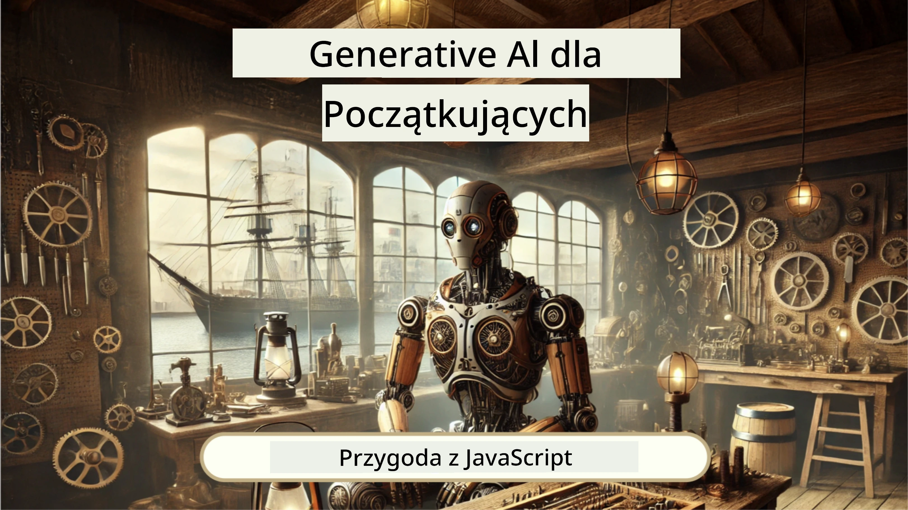
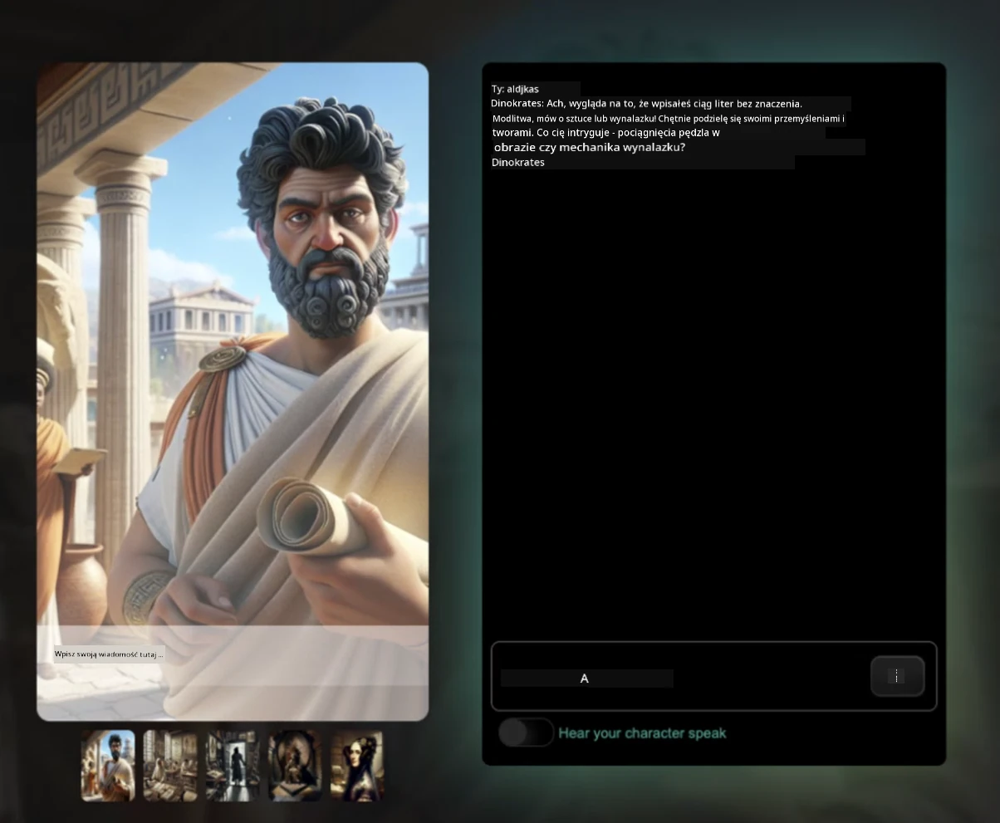
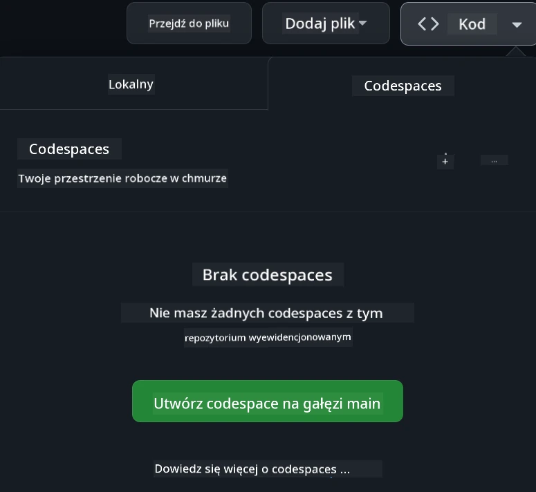

[](https://github.com/microsoft/Web-Dev-For-Beginners/blob/master/LICENSE)
[](https://GitHub.com/microsoft/Web-Dev-For-Beginners/graphs/contributors/)
[](https://GitHub.com/microsoft/Web-Dev-For-Beginners/issues/)
[](https://GitHub.com/microsoft/Web-Dev-For-Beginners/pulls/)
[](http://makeapullrequest.com) 

[](https://GitHub.com/microsoft/Web-Dev-For-Beginners/watchers/)
[](https://GitHub.com/microsoft/Web-Dev-For-Beginners/network/)
[](https://GitHub.com/microsoft/Web-Dev-For-Beginners/stargazers/)

[](https://discord.gg/nTYy5BXMWG)

# Web Development for Beginners - Program nauczania

Poznaj podstawy tworzenia stron internetowych dzięki naszemu 12-tygodniowemu, kompleksowemu kursowi prowadzonemu przez Microsoft Cloud Advocates. Każda z 24 lekcji zagłębia się w JavaScript, CSS i HTML za pomocą praktycznych projektów, takich jak terraria, rozszerzenia przeglądarki i gry kosmiczne. Weź udział w quizach, dyskusjach oraz praktycznych zadaniach. Doskonal swoje umiejętności i zoptymalizuj przyswajanie wiedzy dzięki naszej skutecznej, projektowej metodzie nauczania. Rozpocznij swoją podróż z kodowaniem już dziś!

Dołącz do społeczności Azure AI Foundry Discord

[](https://discord.gg/nTYy5BXMWG)

Postępuj zgodnie z poniższymi krokami, aby rozpocząć korzystanie z tych zasobów:
1. **Utwórz forka repozytorium**: Kliknij [](https://GitHub.com/microsoft/Web-Dev-For-Beginners/fork)
2. **Sklonuj repozytorium**:   `git clone https://github.com/microsoft/Web-Dev-For-Beginners.git`
3. [**Dołącz do Azure AI Foundry Discord i poznaj ekspertów oraz innych programistów**](https://discord.com/invite/ByRwuEEgH4)

### 🌐 Wsparcie wielu języków

#### Obsługiwane przez GitHub Action (automatyczne i zawsze aktualne)

<!-- CO-OP TRANSLATOR LANGUAGES TABLE START -->
[Arabic](../ar/README.md) | [Bengali](../bn/README.md) | [Bulgarian](../bg/README.md) | [Burmese (Myanmar)](../my/README.md) | [Chinese (Simplified)](../zh-CN/README.md) | [Chinese (Traditional, Hong Kong)](../zh-HK/README.md) | [Chinese (Traditional, Macau)](../zh-MO/README.md) | [Chinese (Traditional, Taiwan)](../zh-TW/README.md) | [Croatian](../hr/README.md) | [Czech](../cs/README.md) | [Danish](../da/README.md) | [Dutch](../nl/README.md) | [Estonian](../et/README.md) | [Finnish](../fi/README.md) | [French](../fr/README.md) | [German](../de/README.md) | [Greek](../el/README.md) | [Hebrew](../he/README.md) | [Hindi](../hi/README.md) | [Hungarian](../hu/README.md) | [Indonesian](../id/README.md) | [Italian](../it/README.md) | [Japanese](../ja/README.md) | [Kannada](../kn/README.md) | [Khmer](../km/README.md) | [Korean](../ko/README.md) | [Lithuanian](../lt/README.md) | [Malay](../ms/README.md) | [Malayalam](../ml/README.md) | [Marathi](../mr/README.md) | [Nepali](../ne/README.md) | [Nigerian Pidgin](../pcm/README.md) | [Norwegian](../no/README.md) | [Persian (Farsi)](../fa/README.md) | [Polish](./README.md) | [Portuguese (Brazil)](../pt-BR/README.md) | [Portuguese (Portugal)](../pt-PT/README.md) | [Punjabi (Gurmukhi)](../pa/README.md) | [Romanian](../ro/README.md) | [Russian](../ru/README.md) | [Serbian (Cyrillic)](../sr/README.md) | [Slovak](../sk/README.md) | [Slovenian](../sl/README.md) | [Spanish](../es/README.md) | [Swahili](../sw/README.md) | [Swedish](../sv/README.md) | [Tagalog (Filipino)](../tl/README.md) | [Tamil](../ta/README.md) | [Telugu](../te/README.md) | [Thai](../th/README.md) | [Turkish](../tr/README.md) | [Ukrainian](../uk/README.md) | [Urdu](../ur/README.md) | [Vietnamese](../vi/README.md)

> **Wolisz klonować lokalnie?**
>
> To repozytorium zawiera tłumaczenia na ponad 50 języków, co znacznie zwiększa rozmiar pobierania. Aby sklonować bez tłumaczeń, użyj sparsowanego checkout:
>
> **Bash / macOS / Linux:**
> ```bash
> git clone --filter=blob:none --sparse https://github.com/microsoft/Web-Dev-For-Beginners.git
> cd Web-Dev-For-Beginners
> git sparse-checkout set --no-cone '/*' '!translations' '!translated_images'
> ```
>
> **CMD (Windows):**
> ```cmd
> git clone --filter=blob:none --sparse https://github.com/microsoft/Web-Dev-For-Beginners.git
> cd Web-Dev-For-Beginners
> git sparse-checkout set --no-cone "/*" "!translations" "!translated_images"
> ```
>
> To zapewni Ci wszystko, czego potrzebujesz, aby ukończyć kurs, przy znacznie szybszym pobieraniu.
<!-- CO-OP TRANSLATOR LANGUAGES TABLE END -->

**Jeśli chcesz, aby obsługiwane były dodatkowe języki tłumaczeń, są one wymienione [tutaj](https://github.com/Azure/co-op-translator/blob/main/getting_started/supported-languages.md)**

[](https://open.vscode.dev/microsoft/Web-Dev-For-Beginners)

#### 🧑‍🎓 _Jesteś studentem?_

Odwiedź [**Student Hub page**](https://docs.microsoft.com/learn/student-hub/?WT.mc_id=academic-77807-sagibbon), gdzie znajdziesz zasoby dla początkujących, pakiety studenckie oraz sposoby na zdobycie darmowego vouchera na certyfikat. To jest strona, którą warto dodać do zakładek i regularnie odwiedzać, ponieważ co miesiąc zmieniamy zawartość.

### 📣 Ogłoszenie - Nowe wyzwania z trybu agenta GitHub Copilot do wykonania!

Dodano nowe wyzwanie, znajdziesz je pod nazwą "GitHub Copilot Agent Challenge 🚀" w większości rozdziałów. To nowe wyzwanie do wykonania za pomocą GitHub Copilot i trybu agenta. Jeśli nie korzystałeś wcześniej z trybu agenta, umożliwia on nie tylko generowanie tekstu, ale także tworzenie i edytowanie plików, uruchamianie poleceń i wiele więcej.

### 📣 Ogłoszenie - _Nowy projekt do zbudowania z wykorzystaniem sztucznej inteligencji generatywnej_

Dodano nowy projekt AI Assistant, sprawdź go [projekt](./9-chat-project/README.md)

### 📣 Ogłoszenie - _Nowy program nauczania_ o Generatywnej AI dla JavaScript został właśnie wydany

Nie przegap naszego nowego programu nauczania Generatywnej AI!

Odwiedź [https://aka.ms/genai-js-course](https://aka.ms/genai-js-course), aby zacząć!



- Lekcje obejmujące wszystko od podstaw po RAG.
- Interakcja z postaciami historycznymi za pomocą GenAI i naszej aplikacji towarzyszącej.
- Zabawna i angażująca narracja, będziesz podróżować w czasie!




Każda lekcja zawiera zadanie do wykonania, sprawdzian wiedzy i wyzwanie, które pomogą Ci nauczyć się takich tematów jak:
- Promptowanie i inżynieria promptów
- Generowanie aplikacji tekstowych i obrazkowych
- Aplikacje wyszukujące

Odwiedź [https://aka.ms/genai-js-course](https://aka.ms/genai-js-course), aby zacząć!


## 🌱 Rozpoczynamy

> **Nauczyciele**, zamieściliśmy [kilka sugestii](for-teachers.md) dotyczących korzystania z tego programu nauczania. Chętnie poznamy Wasze opinie [na naszym forum dyskusyjnym](https://github.com/microsoft/Web-Dev-For-Beginners/discussions/categories/teacher-corner)!

**[Uczący się](https://aka.ms/student-page/?WT.mc_id=academic-77807-sagibbon)**, na każdą lekcję zacznij od quizu przed wykładem, potem zapoznaj się z materiałem wykładowym, wykonuj różne aktywności i sprawdź swoją wiedzę przy pomocy quizu po wykładzie.

Aby wzbogacić swoje doświadczenie edukacyjne, połącz się z rówieśnikami, aby wspólnie pracować nad projektami! Zachęcamy do dyskusji na naszym [forum dyskusyjnym](https://github.com/microsoft/Web-Dev-For-Beginners/discussions), gdzie zespół moderatorów będzie dostępny, by odpowiadać na pytania.

Aby poszerzyć swoją edukację, gorąco polecamy eksplorację [Microsoft Learn](https://learn.microsoft.com/users/wirelesslife/collections/p1ddcy5jwy0jkm?WT.mc_id=academic-77807-sagibbon) w celu zdobycia dodatkowych materiałów do nauki.

### 📋 Konfiguracja środowiska

Ten program nauczania ma gotowe środowisko programistyczne! Na początku możesz wybrać uruchomienie kursu w [Codespace](https://github.com/features/codespaces/) (_środowisko działające w przeglądarce, bez potrzeby instalacji_), albo lokalnie na swoim komputerze, używając edytora tekstu takiego jak [Visual Studio Code](https://code.visualstudio.com/?WT.mc_id=academic-77807-sagibbon).

#### Utwórz własne repozytorium
Aby łatwo zapisywać swoją pracę, zalecamy utworzenie własnej kopii tego repozytorium. Możesz to zrobić, klikając przycisk **Use this template** na górze strony. Utworzy to nowe repozytorium na Twoim koncie GitHub z kopią kursu.

Wykonaj następujące kroki:
1. **Utwórz forka repozytorium**: Kliknij przycisk "Fork" w prawym górnym rogu tej strony.
2. **Sklonuj repozytorium**:   `git clone https://github.com/microsoft/Web-Dev-For-Beginners.git`

#### Uruchamianie kursu w Codespace

W swojej kopii repozytorium kliknij przycisk **Code** i wybierz **Open with Codespaces**. To utworzy nowy Codespace do pracy.



#### Uruchamianie kursu lokalnie na komputerze

Aby uruchomić kurs lokalnie na komputerze, potrzebujesz edytora tekstu, przeglądarki i narzędzia wiersza poleceń. Nasza pierwsza lekcja, [Wprowadzenie do języków programowania i narzędzi pracy](../../1-getting-started-lessons/1-intro-to-programming-languages), przeprowadzi Cię przez różne opcje dla każdego z tych narzędzi, abyś mógł wybrać te, które najlepiej Ci odpowiadają.

Naszą rekomendacją jest użycie [Visual Studio Code](https://code.visualstudio.com/?WT.mc_id=academic-77807-sagibbon) jako edytora, który zawiera również wbudowany [terminal](https://code.visualstudio.com/docs/terminal/basics/?WT.mc_id=academic-77807-sagibbon). Visual Studio Code możesz pobrać [tutaj](https://code.visualstudio.com/?WT.mc_id=academic-77807-sagibbon).
1. Sklonuj swoje repozytorium na komputer. Możesz to zrobić, klikając przycisk **Code** i kopiując URL:

    [CodeSpace](./images/createcodespace.png)

    Następnie otwórz [Terminal](https://code.visualstudio.com/docs/terminal/basics/?WT.mc_id=academic-77807-sagibbon) w [Visual Studio Code](https://code.visualstudio.com/?WT.mc_id=academic-77807-sagibbon) i uruchom następujące polecenie, zamieniając `<your-repository-url>` na skopiowany wcześniej URL:

    ```bash 
    git clone <your-repository-url>
    ```

2. Otwórz folder w Visual Studio Code. Możesz to zrobić, klikając **File** > **Open Folder** i wybierając właśnie sklonowany folder.


>  Polecane rozszerzenia Visual Studio Code:
>
> * [Live Server](https://marketplace.visualstudio.com/items?itemName=ritwickdey.LiveServer&WT.mc_id=academic-77807-sagibbon) - do podglądu stron HTML w Visual Studio Code
> * [Copilot](https://marketplace.visualstudio.com/items?itemName=GitHub.copilot&WT.mc_id=academic-77807-sagibbon) - aby pomóc Ci szybciej pisać kod

## 📂 Każda lekcja zawiera:

- opcjonalną notatkę szkicową
- opcjonalny film uzupełniający
- quiz rozgrzewkowy przed lekcją
- lekcję pisaną
- w lekcjach projektowych, przewodniki krok po kroku jak zbudować projekt
- kontrole wiedzy
- wyzwanie
- dodatkową lekturę
- zadanie domowe
- [quiz po lekcji](https://ff-quizzes.netlify.app/web/)

> **Notatka o quizach**: Wszystkie quizy znajdują się w folderze Quiz-app, łącznie 48 quizów po trzy pytania każdy. Są dostępne [tutaj](https://ff-quizzes.netlify.app/web/), aplikacja quizowa może być uruchomiona lokalnie lub wdrożona w Azure; postępuj zgodnie z instrukcjami w folderze `quiz-app`.

## 🗃️ Lekcje

|     |                       Nazwa Projektu                       |                            Wprowadzone Pojęcia                            | Cele Nauki                                                                                                                        |                                                         Powiązana Lekcja                                                        |         Autor          |
| :-: | :--------------------------------------------------------: | :----------------------------------------------------------------------: | -------------------------------------------------------------------------------------------------------------------------------- | :----------------------------------------------------------------------------------------------------------------------------: | :---------------------: |
| 01  |                     Getting Started                        |           Wstęp do programowania i narzędzi pracy                          | Poznaj podstawowe założenia większości języków programowania oraz oprogramowanie wspomagające pracę profesjonalnych developerów  | [Intro to Programming Languages and Tools of the Trade](./1-getting-started-lessons/1-intro-to-programming-languages/README.md) |         Jasmine         |
| 02  |                     Getting Started                        |             Podstawy GitHub, w tym praca zespołowa                        | Jak korzystać z GitHub w projekcie oraz jak współpracować z innymi nad bazą kodu                                                  |                            [Intro to GitHub](./1-getting-started-lessons/2-github-basics/README.md)                             |          Floor          |
| 03  |                     Getting Started                        |                             Dostępność                                    | Naucz się podstaw dostępności stron internetowych                                                                                 |                       [Accessibility Fundamentals](./1-getting-started-lessons/3-accessibility/README.md)                       |       Christopher       |
| 04  |                        JS Basics                           |                         Typy danych w JavaScript                          | Podstawy typów danych w JavaScript                                                                                                |                                       [Data Types](./2-js-basics/1-data-types/README.md)                                        |         Jasmine         |
| 05  |                        JS Basics                           |                         Funkcje i metody                                  | Poznaj funkcje i metody do zarządzania logiką aplikacji                                                                          |                              [Functions and Methods](./2-js-basics/2-functions-methods/README.md)                               | Jasmine and Christopher |
| 06  |                        JS Basics                           |                        Podejmowanie decyzji w JS                          | Naucz się tworzyć warunki w swoim kodzie za pomocą metod podejmowania decyzji                                                    |                                 [Making Decisions](./2-js-basics/3-making-decisions/README.md)                                  |         Jasmine         |
| 07  |                        JS Basics                           |                            Tablice i pętle                                | Pracuj z danymi używając tablic i pętli w JavaScript                                                                             |                                   [Arrays and Loops](./2-js-basics/4-arrays-loops/README.md)                                    |         Jasmine         |
| 08  |       [Terrarium](./3-terrarium/solution/README.md)         |                            HTML w praktyce                               | Zbuduj HTML tworzący terrarium online, skupiając się na budowie układu                                                          |                                 [Introduction to HTML](./3-terrarium/1-intro-to-html/README.md)                                 |           Jen           |
| 09  |       [Terrarium](./3-terrarium/solution/README.md)         |                            CSS w praktyce                                | Zbuduj CSS stylizujący terrarium online, skupiając się na podstawach CSS oraz responsywności strony                             |                                  [Introduction to CSS](./3-terrarium/2-intro-to-css/README.md)                                  |           Jen           |
| 10  |            [Terrarium](./3-terrarium/solution/README.md)         |              Domknięcia JavaScript, manipulacja DOM                     | Zbuduj JavaScript, który sprawi, że terrarium będzie działać jako interfejs drag/drop, skupiając się na domknięciach i manipulacji DOM |                  [JavaScript Closures, DOM manipulation](./3-terrarium/3-intro-to-DOM-and-closures/README.md)                   |           Jen           |
| 11  |          [Typing Game](./4-typing-game/solution/README.md)          |                          Budowanie gry w pisanie                         | Naucz się wykorzystywać zdarzenia klawiatury do sterowania logiką aplikacji JavaScript                                           |                                [Event-Driven Programming](./4-typing-game/typing-game/README.md)                                |       Christopher       |
| 12  | [Green Browser Extension](./5-browser-extension/solution/README.md) |                         Praca z przeglądarkami                          | Naucz się jak działają przeglądarki, poznaj ich historię i jak tworzyć szkielety elementów rozszerzeń przeglądarki               |                               [About Browsers](./5-browser-extension/1-about-browsers/README.md)                                |           Jen           |
| 13  | [Green Browser Extension](./5-browser-extension/solution/README.md) | Tworzenie formularzy, wywoływanie API i przechowywanie zmiennych w local storage | Stwórz elementy JavaScript w rozszerzeniu do przeglądarki, aby wywoływać API używając zmiennych przechowywanych lokalnie         |                [APIs, Forms, and Local Storage](./5-browser-extension/2-forms-browsers-local-storage/README.md)                 |           Jen           |
| 14  | [Green Browser Extension](./5-browser-extension/solution/README.md) |       Procesy w tle w przeglądarce, wydajność witryn webowych           | Wykorzystaj procesy w tle przeglądarki do zarządzania ikoną rozszerzenia; poznaj wydajność stron oraz optymalizacje             |             [Background Tasks and Performance](./5-browser-extension/3-background-tasks-and-performance/README.md)              |           Jen           |
| 15  |           [Space Game](./6-space-game/solution/README.md)           |             Zaawansowany development gier w JavaScript                 | Poznaj dziedziczenie przy użyciu klas i kompozycji oraz wzorzec Pub/Sub, przygotowując się do budowy gry                         |                      [Introduction to Advanced Game Development](./6-space-game/1-introduction/README.md)                       |          Chris          |
| 16  |           [Space Game](./6-space-game/solution/README.md)           |                           Rysowanie na canvas                           | Poznaj API Canvas, wykorzystywane do rysowania elementów na ekranie                                                             |                                [Drawing to Canvas](./6-space-game/2-drawing-to-canvas/README.md)                                |          Chris          |
| 17  |           [Space Game](./6-space-game/solution/README.md)           |                          Przemieszczanie elementów                      | Odkryj, jak elementy mogą się poruszać korzystając ze współrzędnych kartezjańskich i API Canvas                                 |                           [Moving Elements Around](./6-space-game/3-moving-elements-around/README.md)                           |          Chris          |
| 18  |           [Space Game](./6-space-game/solution/README.md)           |                        Wykrywanie kolizji                              | Spraw, by elementy się zderzały i reagowały na siebie przy pomocy naciśnięć klawiszy, dodaj funkcję cooldown dla wydajności gry |                              [Collision Detection](./6-space-game/4-collision-detection/README.md)                              |          Chris          |
| 19  |           [Space Game](./6-space-game/solution/README.md)           |                            Liczenie punktów                            | Wykonuj obliczenia matematyczne bazujące na stanie i wydajności gry                                                              |                                    [Keeping Score](./6-space-game/5-keeping-score/README.md)                                    |          Chris          |
| 20  |           [Space Game](./6-space-game/solution/README.md)           |                      Zakończenie i ponowne uruchomienie gry            | Naucz się kończyć i restartować grę, w tym sprzątać zasoby i resetować zmienne                                                     |                                [The Ending Condition](./6-space-game/6-end-condition/README.md)                                 |          Chris          |
| 21  |         [Banking App](./7-bank-project/solution/README.md)          |              Szablony HTML i routingi w aplikacji webowej              | Naucz się tworzyć szkielet architektury wielostronicowej strony internetowej używając routingu i szablonów HTML                  |                            [HTML Templates and Routes](./7-bank-project/1-template-route/README.md)                             |          Yohan          |
| 22  |         [Banking App](./7-bank-project/solution/README.md)          |              Tworzenie formularza logowania i rejestracji              | Naucz się tworzyć formularze i obsługiwać rutyny walidacji                                                                        |                                           [Forms](./7-bank-project/2-forms/README.md)                                           |          Yohan          |
| 23  |         [Banking App](./7-bank-project/solution/README.md)          |                 Metody pobierania i używania danych                    | Jak dane przepływają do i z aplikacji, jak je pobierać, przechowywać i usuwać                                                     |                                            [Data](./7-bank-project/3-data/README.md)                                            |          Yohan          |
| 24  |         [Banking App](./7-bank-project/solution/README.md)          |                    Koncepcje zarządzania stanem                        | Naucz się, jak Twoja aplikacja przechowuje stan i jak nim zarządzać programistycznie                                              |                                [State Management](./7-bank-project/4-state-management/README.md)                                |          Yohan          |
| 25  | [Browser/VScode Code](../../8-code-editor) | Praca z VScode | Naucz się korzystać z edytora kodu | [Use VScode Code Editor](./8-code-editor/1-using-a-code-editor/README.md) | Chris |
| 26  | [AI Assistants](./9-chat-project/README.md) | Praca z SI | Naucz się tworzyć własnego asystenta AI | [AI Assistant project](./9-chat-project/README.md) | Chris |

## 🏫 Pedagogika

Nasz program nauczania opiera się na dwóch kluczowych zasadach pedagogicznych:
* nauka przez projekty
* częste quizy

Program uczy podstaw JavaScript, HTML i CSS, a także najnowszych narzędzi i technik używanych przez współczesnych twórców stron internetowych. Uczniowie będą mieli okazję zdobyć praktyczne doświadczenie, budując grę pisania na klawiaturze, wirtualne terrarium, ekologiczne rozszerzenie przeglądarki, grę w stylu najeźdźców kosmicznych oraz aplikację bankową dla firm. Pod koniec serii uczniowie zdobędą solidną wiedzę na temat tworzenia stron internetowych.

> 🎓 Możesz rozpocząć od kilku pierwszych lekcji tego programu nauczania jako [ścieżkę nauki](https://docs.microsoft.com/learn/paths/web-development-101/?WT.mc_id=academic-77807-sagibbon) na Microsoft Learn!

Dzięki zapewnieniu, że zawartość jest zgrana z projektami, proces nauki jest bardziej angażujący dla uczniów, a utrwalenie koncepcji zostaje zwiększone. Przygotowaliśmy również kilka wprowadzających lekcji z podstaw JavaScript, uzupełnionych filmem z serii "[Beginners Series to: JavaScript](https://channel9.msdn.com/Series/Beginners-Series-to-JavaScript/?WT.mc_id=academic-77807-sagibbon)", której autorzy przyczynili się do tego programu.

Ponadto quiz niskiego ryzyka przed lekcją ustawia intencję ucznia na naukę danego tematu, a drugi quiz po lekcji zapewnia dalsze utrwalenie wiedzy. Ten program był zaprojektowany tak, aby był elastyczny i przyjemny i może być realizowany w całości lub częściowo. Projekty zaczynają się od małych i stopniowo stają się coraz bardziej złożone w ciągu 12-tygodniowego cyklu.

Chociaż celowo unikaliśmy wprowadzania frameworków JavaScript, aby skoncentrować się na podstawowych umiejętnościach potrzebnych programiście webowemu przed przyjęciem frameworka, dobrym następnym krokiem po ukończeniu tego programu jest nauka Node.js za pomocą innej serii filmów: "[Beginner Series to: Node.js](https://channel9.msdn.com/Series/Beginners-Series-to-Nodejs/?WT.mc_id=academic-77807-sagibbon)".

> Odwiedź nasze wytyczne [Code of Conduct](CODE_OF_CONDUCT.md) i [Contributing](CONTRIBUTING.md). Czekamy na Twoje konstruktywne uwagi!


## 🧭 Dostęp offline

Możesz korzystać z tej dokumentacji offline, używając [Docsify](https://docsify.js.org/#/). Sklonuj to repozytorium, [zainstaluj Docsify](https://docsify.js.org/#/quickstart) na swoim komputerze lokalnym, a następnie w katalogu głównym tego repozytorium wpisz `docsify serve`. Strona zostanie uruchomiona na porcie 3000 na Twoim localhost: `localhost:3000`.

## 📘 PDF
PDF ze wszystkimi lekcjami można znaleźć [tutaj](https://microsoft.github.io/Web-Dev-For-Beginners/pdf/readme.pdf).


## 🎒 Inne kursy

Nasz zespół tworzy również inne kursy! Sprawdź:

<!-- CO-OP TRANSLATOR OTHER COURSES START -->
### LangChain
[](https://aka.ms/langchain4j-for-beginners)
[](https://aka.ms/langchainjs-for-beginners?WT.mc_id=m365-94501-dwahlin)
[](https://github.com/microsoft/langchain-for-beginners?WT.mc_id=m365-94501-dwahlin)
---

### Azure / Edge / MCP / Agents
[](https://github.com/microsoft/AZD-for-beginners?WT.mc_id=academic-105485-koreyst)
[](https://github.com/microsoft/edgeai-for-beginners?WT.mc_id=academic-105485-koreyst)
[](https://github.com/microsoft/mcp-for-beginners?WT.mc_id=academic-105485-koreyst)
[](https://github.com/microsoft/ai-agents-for-beginners?WT.mc_id=academic-105485-koreyst)

---
 
### Seria Generative AI
[](https://github.com/microsoft/generative-ai-for-beginners?WT.mc_id=academic-105485-koreyst)
[-9333EA?style=for-the-badge&labelColor=E5E7EB&color=9333EA)](https://github.com/microsoft/Generative-AI-for-beginners-dotnet?WT.mc_id=academic-105485-koreyst)
[-C084FC?style=for-the-badge&labelColor=E5E7EB&color=C084FC)](https://github.com/microsoft/generative-ai-for-beginners-java?WT.mc_id=academic-105485-koreyst)
[-E879F9?style=for-the-badge&labelColor=E5E7EB&color=E879F9)](https://github.com/microsoft/generative-ai-with-javascript?WT.mc_id=academic-105485-koreyst)

---
 
### Podstawowe nauki
[](https://aka.ms/ml-beginners?WT.mc_id=academic-105485-koreyst)
[](https://aka.ms/datascience-beginners?WT.mc_id=academic-105485-koreyst)
[](https://aka.ms/ai-beginners?WT.mc_id=academic-105485-koreyst)
[](https://github.com/microsoft/Security-101?WT.mc_id=academic-96948-sayoung)
[](https://aka.ms/webdev-beginners?WT.mc_id=academic-105485-koreyst)
[](https://aka.ms/iot-beginners?WT.mc_id=academic-105485-koreyst)
[](https://github.com/microsoft/xr-development-for-beginners?WT.mc_id=academic-105485-koreyst)

---
 
### Seria Copilot
[](https://aka.ms/GitHubCopilotAI?WT.mc_id=academic-105485-koreyst)
[](https://github.com/microsoft/mastering-github-copilot-for-dotnet-csharp-developers?WT.mc_id=academic-105485-koreyst)
[](https://github.com/microsoft/CopilotAdventures?WT.mc_id=academic-105485-koreyst)
<!-- CO-OP TRANSLATOR OTHER COURSES END -->

## Uzyskiwanie pomocy

Jeśli utkniesz lub masz pytania dotyczące tworzenia aplikacji AI. Dołącz do innych uczniów i doświadczonych programistów w dyskusjach o MCP. To wspierająca społeczność, w której pytania są mile widziane, a wiedza jest swobodnie dzielona.

[](https://discord.gg/nTYy5BXMWG)

Jeśli masz uwagi dotyczące produktu lub napotkasz błędy podczas tworzenia, odwiedź:

[](https://aka.ms/foundry/forum)

## Licencja

To repozytorium jest licencjonowane na podstawie licencji MIT. Więcej informacji znajdziesz w pliku [LICENSE](../../LICENSE).

---

<!-- CO-OP TRANSLATOR DISCLAIMER START -->
**Zastrzeżenie**:  
Dokument ten został przetłumaczony za pomocą usługi tłumaczenia AI [Co-op Translator](https://github.com/Azure/co-op-translator). Mimo że dokładamy starań, aby tłumaczenie było jak najdokładniejsze, prosimy mieć na uwadze, że automatyczne tłumaczenia mogą zawierać błędy lub niedokładności. Oryginalny dokument w jego rodzimym języku powinien być traktowany jako źródło autorytatywne. W przypadku informacji o krytycznym znaczeniu zaleca się skorzystanie z profesjonalnego tłumaczenia wykonanego przez człowieka. Nie ponosimy odpowiedzialności za jakiekolwiek nieporozumienia lub błędne interpretacje wynikające z korzystania z tego tłumaczenia.
<!-- CO-OP TRANSLATOR DISCLAIMER END -->