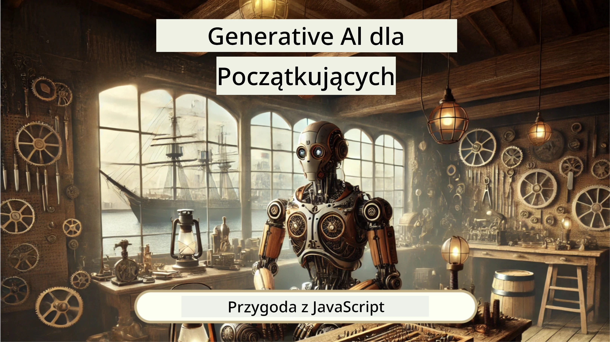
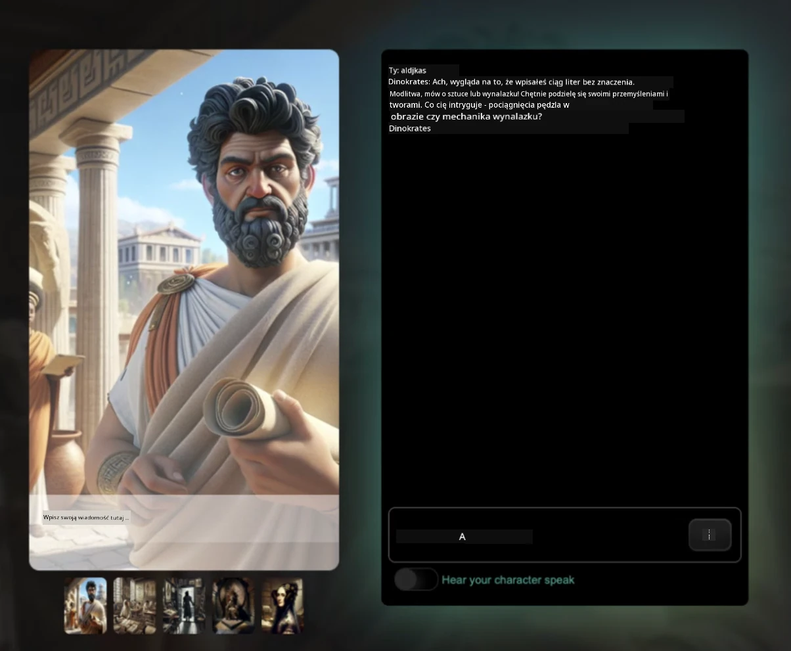
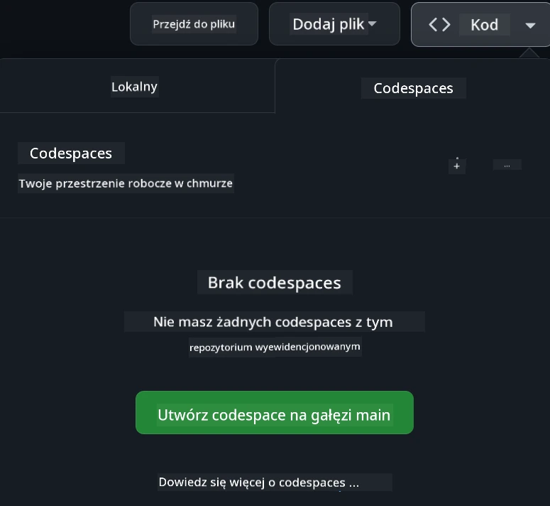

[](https://github.com/microsoft/Web-Dev-For-Beginners/blob/master/LICENSE)
[](https://GitHub.com/microsoft/Web-Dev-For-Beginners/graphs/contributors/)
[](https://GitHub.com/microsoft/Web-Dev-For-Beginners/issues/)
[](https://GitHub.com/microsoft/Web-Dev-For-Beginners/pulls/)
[](http://makeapullrequest.com) 

[](https://GitHub.com/microsoft/Web-Dev-For-Beginners/watchers/)
[](https://GitHub.com/microsoft/Web-Dev-For-Beginners/network/)
[](https://GitHub.com/microsoft/Web-Dev-For-Beginners/stargazers/)

[](https://discord.gg/nTYy5BXMWG)

# Programowanie stron internetowych dla początkujących - Program nauczania

Poznaj podstawy tworzenia stron internetowych dzięki naszemu 12-tygodniowemu, kompleksowemu kursowi prowadzonemu przez Microsoft Cloud Advocates. Każda z 24 lekcji zagłębia się w JavaScript, CSS i HTML poprzez praktyczne projekty, takie jak terraria, rozszerzenia przeglądarki i gry kosmiczne. Angażuj się w quizy, dyskusje i praktyczne zadania. Rozwijaj swoje umiejętności i optymalizuj zapamiętywanie wiedzy dzięki naszej efektywnej, opartej na projektach metodyce nauczania. Rozpocznij swoją przygodę z programowaniem już dziś!

Dołącz do Discorda Azure AI Foundry i poznaj ekspertów oraz innych programistów.

[](https://discord.gg/nTYy5BXMWG)

Wykonaj te kroki, aby zacząć korzystać z tych zasobów:
1. **Rozgałęź Repozytorium**: Kliknij [](https://GitHub.com/microsoft/Web-Dev-For-Beginners/fork)
2. **Sklonuj Repozytorium**:   `git clone https://github.com/microsoft/Web-Dev-For-Beginners.git`
3. [**Dołącz do Discorda Azure AI Foundry i poznaj ekspertów oraz innych programistów**](https://discord.com/invite/ByRwuEEgH4)

### 🌐 Wsparcie wielojęzyczne

#### Wspierane przez GitHub Action (Automatyczne i zawsze aktualne)

<!-- CO-OP TRANSLATOR LANGUAGES TABLE START -->
[Arabic](../ar/README.md) | [Bengali](../bn/README.md) | [Bulgarian](../bg/README.md) | [Burmese (Myanmar)](../my/README.md) | [Chinese (Simplified)](../zh-CN/README.md) | [Chinese (Traditional, Hong Kong)](../zh-HK/README.md) | [Chinese (Traditional, Macau)](../zh-MO/README.md) | [Chinese (Traditional, Taiwan)](../zh-TW/README.md) | [Croatian](../hr/README.md) | [Czech](../cs/README.md) | [Danish](../da/README.md) | [Dutch](../nl/README.md) | [Estonian](../et/README.md) | [Finnish](../fi/README.md) | [French](../fr/README.md) | [German](../de/README.md) | [Greek](../el/README.md) | [Hebrew](../he/README.md) | [Hindi](../hi/README.md) | [Hungarian](../hu/README.md) | [Indonesian](../id/README.md) | [Italian](../it/README.md) | [Japanese](../ja/README.md) | [Kannada](../kn/README.md) | [Khmer](../km/README.md) | [Korean](../ko/README.md) | [Lithuanian](../lt/README.md) | [Malay](../ms/README.md) | [Malayalam](../ml/README.md) | [Marathi](../mr/README.md) | [Nepali](../ne/README.md) | [Nigerian Pidgin](../pcm/README.md) | [Norwegian](../no/README.md) | [Persian (Farsi)](../fa/README.md) | [Polish](./README.md) | [Portuguese (Brazil)](../pt-BR/README.md) | [Portuguese (Portugal)](../pt-PT/README.md) | [Punjabi (Gurmukhi)](../pa/README.md) | [Romanian](../ro/README.md) | [Russian](../ru/README.md) | [Serbian (Cyrillic)](../sr/README.md) | [Slovak](../sk/README.md) | [Slovenian](../sl/README.md) | [Spanish](../es/README.md) | [Swahili](../sw/README.md) | [Swedish](../sv/README.md) | [Tagalog (Filipino)](../tl/README.md) | [Tamil](../ta/README.md) | [Telugu](../te/README.md) | [Thai](../th/README.md) | [Turkish](../tr/README.md) | [Ukrainian](../uk/README.md) | [Urdu](../ur/README.md) | [Vietnamese](../vi/README.md)

> **Wolisz klonować lokalnie?**
>
> To repozytorium zawiera ponad 50 tłumaczeń językowych, co znacznie zwiększa rozmiar pobierania. Aby sklonować bez tłumaczeń, użyj sparse checkout:
>
> **Bash / macOS / Linux:**
> ```bash
> git clone --filter=blob:none --sparse https://github.com/microsoft/Web-Dev-For-Beginners.git
> cd Web-Dev-For-Beginners
> git sparse-checkout set --no-cone '/*' '!translations' '!translated_images'
> ```
>
> **CMD (Windows):**
> ```cmd
> git clone --filter=blob:none --sparse https://github.com/microsoft/Web-Dev-For-Beginners.git
> cd Web-Dev-For-Beginners
> git sparse-checkout set --no-cone "/*" "!translations" "!translated_images"
> ```
>
> To zapewni Ci wszystko, co potrzebne do ukończenia kursu, z dużo szybszym pobieraniem.
<!-- CO-OP TRANSLATOR LANGUAGES TABLE END -->

**Jeśli chcesz mieć dodatkowe tłumaczenia, obsługiwane języki są wymienione tutaj. [tutaj](https://github.com/Azure/co-op-translator/blob/main/getting_started/supported-languages.md)**

[](https://open.vscode.dev/microsoft/Web-Dev-For-Beginners)

#### 🧑‍🎓 _Jesteś studentem?_

Odwiedź stronę [**Student Hub**](https://docs.microsoft.com/learn/student-hub/?WT.mc_id=academic-77807-sagibbon), gdzie znajdziesz materiały dla początkujących, pakiety dla studentów, a także sposoby na uzyskanie bezpłatnego vouchera na certyfikat. To strona, którą warto dodać do ulubionych i odwiedzać regularnie, ponieważ co miesiąc aktualizujemy zawartość.

### 📣 Ogłoszenie - Nowe wyzwania w trybie GitHub Copilot Agent do wykonania!

Dodano nowe wyzwanie, szukaj "GitHub Copilot Agent Challenge 🚀" w większości rozdziałów. To nowe wyzwanie dla Ciebie do wykonania z użyciem GitHub Copilot i trybu Agent. Jeśli wcześniej nie korzystałeś z trybu Agent, potrafi on nie tylko generować tekst, ale także tworzyć i edytować pliki, uruchamiać polecenia i więcej.

### 📣 Ogłoszenie - _Nowy projekt do zbudowania z użyciem Generative AI_

Nowy projekt asystenta AI właśnie dodany, sprawdź [projekt](./9-chat-project/README.md)

### 📣 Ogłoszenie - _Nowy program nauczania_ dotyczący Generative AI dla JavaScript właśnie został wydany

Nie przegap naszego nowego programu nauczania Generative AI!

Odwiedź [https://aka.ms/genai-js-course](https://aka.ms/genai-js-course), aby zacząć!



- Lekcje obejmujące wszystko, od podstaw po RAG.
- Interakcja z postaciami historycznymi z wykorzystaniem GenAI i naszej aplikacji towarzyszącej.
- Zabawa i angażująca narracja, będziesz podróżować w czasie!




Każda lekcja zawiera zadanie do wykonania, sprawdzenie wiedzy oraz wyzwanie, które poprowadzą Cię w nauce zagadnień takich jak:
- Tworzenie promptów i inżynieria promptów
- Generowanie aplikacji tekstowych i obrazkowych
- Aplikacje do wyszukiwania

Odwiedź [https://aka.ms/genai-js-course](https://aka.ms/genai-js-course), aby zacząć!


## 🌱 Rozpoczęcie

> **Nauczyciele**, przygotowaliśmy [kilka sugestii](for-teachers.md) dotyczących korzystania z tego programu nauczania. Chętnie usłyszymy Waszą opinię [na naszym forum dyskusyjnym](https://github.com/microsoft/Web-Dev-For-Beginners/discussions/categories/teacher-corner)!

**[Uczniowie](https://aka.ms/student-page/?WT.mc_id=academic-77807-sagibbon)**, na każdą lekcję zacznij od quizu przed wykładem, następnie przeczytaj materiał, wykonaj różne aktywności i sprawdź swoje zrozumienie w quizie po wykładzie.

Aby zwiększyć efektywność nauki, współpracuj ze swoimi kolegami nad projektami! Zachęcamy do dyskusji na naszym [forum dyskusyjnym](https://github.com/microsoft/Web-Dev-For-Beginners/discussions), gdzie zespół moderatorów będzie dostępny, aby odpowiedzieć na Twoje pytania.

Aby pogłębić swoją edukację, zdecydowanie polecamy eksplorację [Microsoft Learn](https://learn.microsoft.com/users/wirelesslife/collections/p1ddcy5jwy0jkm?WT.mc_id=academic-77807-sagibbon) dla dodatkowych materiałów do nauki.

### 📋 Konfiguracja środowiska

Ten program nauczania ma gotowe środowisko deweloperskie! Na start możesz wybrać uruchomienie programu w [Codespace](https://github.com/features/codespaces/) (_środowisku przeglądarkowym, bez potrzeby instalacji_) lub lokalnie na swoim komputerze, używając edytora tekstu takiego jak [Visual Studio Code](https://code.visualstudio.com/?WT.mc_id=academic-77807-sagibbon).

#### Utwórz własne repozytorium
Aby wygodnie zapisywać swoje postępy, zalecamy utworzenie własnej kopii tego repozytorium. Możesz to zrobić, klikając przycisk **Use this template** u góry strony. Utworzy to nowe repozytorium na Twoim koncie GitHub z kopią programu nauczania.

Wykonaj te kroki:
1. **Rozgałęź Repozytorium**: Kliknij przycisk "Fork" w prawym górnym rogu tej strony.
2. **Sklonuj Repozytorium**:   `git clone https://github.com/microsoft/Web-Dev-For-Beginners.git`

#### Uruchamianie programu w Codespace

W swojej kopii repozytorium kliknij przycisk **Code** i wybierz **Open with Codespaces**. Utworzy to nowe środowisko Codespace do pracy.



#### Uruchamianie programu lokalnie na komputerze

Aby uruchomić program lokalnie na swoim komputerze, potrzebujesz edytora tekstu, przeglądarki i narzędzia wiersza polecenia. Nasza pierwsza lekcja, [Wprowadzenie do języków programowania i narzędzi](../../1-getting-started-lessons/1-intro-to-programming-languages), przeprowadzi Cię przez różne opcje tych narzędzi, abyś mógł wybrać to, co Ci najbardziej odpowiada.

Zalecamy używanie [Visual Studio Code](https://code.visualstudio.com/?WT.mc_id=academic-77807-sagibbon) jako edytora, który posiada wbudowany [Terminal](https://code.visualstudio.com/docs/terminal/basics/?WT.mc_id=academic-77807-sagibbon). Visual Studio Code możesz pobrać [tutaj](https://code.visualstudio.com/?WT.mc_id=academic-77807-sagibbon).
1. Sklonuj swoje repozytorium na komputer. Możesz to zrobić, klikając przycisk **Code** i kopiując URL:

    [CodeSpace](./images/createcodespace.png)

    Następnie otwórz [Terminal](https://code.visualstudio.com/docs/terminal/basics/?WT.mc_id=academic-77807-sagibbon) w [Visual Studio Code](https://code.visualstudio.com/?WT.mc_id=academic-77807-sagibbon) i uruchom następujące polecenie, zamieniając `<your-repository-url>` na URL, który właśnie skopiowałeś:

    ```bash 
    git clone <your-repository-url>
    ```

2. Otwórz folder w Visual Studio Code. Możesz to zrobić, klikając **File** > **Open Folder** i wybierając folder, który właśnie sklonowałeś.


>  Zalecane rozszerzenia Visual Studio Code:
>
> * [Live Server](https://marketplace.visualstudio.com/items?itemName=ritwickdey.LiveServer&WT.mc_id=academic-77807-sagibbon) - do podglądu stron HTML w Visual Studio Code
> * [Copilot](https://marketplace.visualstudio.com/items?itemName=GitHub.copilot&WT.mc_id=academic-77807-sagibbon) - aby pomóc Ci szybciej pisać kod

## 📂 Każda lekcja zawiera:

- opcjonalną sketchnotkę
- opcjonalne dodatkowe wideo
- quiz rozgrzewkowy przed lekcją
- pisemną lekcję
- w lekcjach projektowych, instrukcje krok po kroku, jak zbudować projekt
- sprawdziany wiedzy
- wyzwanie
- dodatkową lekturę
- zadanie domowe
- [quiz po lekcji](https://ff-quizzes.netlify.app/web/)

> **Informacja o quizach**: Wszystkie quizy znajdują się w folderze Quiz-app, łącznie 48 quizów po trzy pytania każdy. Są dostępne [tutaj](https://ff-quizzes.netlify.app/web/). Aplikację quizu można uruchomić lokalnie lub wdrożyć na Azure; postępuj zgodnie z instrukcjami w folderze `quiz-app`.

## 🗃️ Lekcje

|     |                       Nazwa projektu                        |                            Omawiane zagadnienia                              | Cele nauki                                                                                                                            |                                                         Powiązana lekcja                                                          |         Autor          |
| :-: | :---------------------------------------------------------: | :--------------------------------------------------------------------------: | ------------------------------------------------------------------------------------------------------------------------------------ | :----------------------------------------------------------------------------------------------------------------------------: | :---------------------: |
| 01  |                     Rozpoczynamy                           |           Wprowadzenie do programowania i narzędzia pracy                    | Poznaj podstawy większości języków programowania oraz oprogramowanie, które pomaga profesjonalnym programistom w ich pracy           | [Wprowadzenie do języków programowania i narzędzi pracy](./1-getting-started-lessons/1-intro-to-programming-languages/README.md) |         Jasmine         |
| 02  |                     Rozpoczynamy                           |             Podstawy GitHub, w tym praca zespołowa                          | Jak korzystać z GitHub w projekcie, jak współpracować z innymi nad bazą kodu                                                          |                            [Wprowadzenie do GitHub](./1-getting-started-lessons/2-github-basics/README.md)                            |          Floor          |
| 03  |                     Rozpoczynamy                           |                             Dostępność                                    | Nauka podstaw dostępności sieci web                                                                                                  |                       [Podstawy dostępności](./1-getting-started-lessons/3-accessibility/README.md)                                   |       Christopher       |
| 04  |                        Podstawy JS                         |                         Typy danych w JavaScript                           | Podstawy typów danych w JavaScript                                                                                                  |                                       [Typy danych](./2-js-basics/1-data-types/README.md)                                          |         Jasmine         |
| 05  |                        Podstawy JS                         |                         Funkcje i metody                                   | Nauka o funkcjach i metodach do zarządzania przepływem logiki aplikacji                                                             |                              [Funkcje i metody](./2-js-basics/2-functions-methods/README.md)                                       | Jasmine i Christopher   |
| 06  |                        Podstawy JS                         |                        Podejmowanie decyzji w JS                          | Nauka tworzenia warunków w kodzie za pomocą metod podejmowania decyzji                                                              |                                 [Podejmowanie decyzji](./2-js-basics/3-making-decisions/README.md)                                  |         Jasmine         |
| 07  |                        Podstawy JS                         |                            Tablice i pętle                                 | Praca z danymi za pomocą tablic i pętli w JavaScript                                                                                 |                                   [Tablice i pętle](./2-js-basics/4-arrays-loops/README.md)                                      |         Jasmine         |
| 08  |       [Terrarium](./3-terrarium/solution/README.md)       |                            HTML w praktyce                                | Tworzenie HTML do budowy terrarium online, ze szczególnym uwzględnieniem układu strony                                                |                                 [Wprowadzenie do HTML](./3-terrarium/1-intro-to-html/README.md)                                   |           Jen           |
| 09  |       [Terrarium](./3-terrarium/solution/README.md)       |                            CSS w praktyce                                 | Tworzenie CSS do stylizowania terrarium online, ze szczególnym uwzględnieniem podstaw CSS i responsywności strony                   |                                  [Wprowadzenie do CSS](./3-terrarium/2-intro-to-css/README.md)                                   |           Jen           |
| 10  |            [Terrarium](./3-terrarium/solution/README.md)            |                 JavaScript Closures, manipulacja DOM                       | Tworzenie JavaScript do funkcji terrarium jako interfejs przeciągania i upuszczania, skupiając się na closures i manipulacji DOM     |                  [JavaScript Closures, manipulacja DOM](./3-terrarium/3-intro-to-DOM-and-closures/README.md)                      |           Jen           |
| 11  |          [Typing Game](./4-typing-game/solution/README.md)          |                          Tworzenie gry pisania                            | Nauka korzystania z zdarzeń klawiatury do sterowania logiką aplikacji JavaScript                                                     |                                [Programowanie zdarzeniowe](./4-typing-game/typing-game/README.md)                                   |       Christopher       |
| 12  | [Green Browser Extension](./5-browser-extension/solution/README.md) |                         Praca z przeglądarkami                           | Poznaj działanie przeglądarek, ich historię i szkicuj pierwsze elementy rozszerzenia przeglądarki                                     |                               [O przeglądarkach](./5-browser-extension/1-about-browsers/README.md)                                 |           Jen           |
| 13  | [Green Browser Extension](./5-browser-extension/solution/README.md) | Budowa formularza, wywoływanie API i przechowywanie zmiennych lokalnie    | Tworzenie elementów JavaScript rozszerzenia przeglądarki do wywołania API z wykorzystaniem zmiennych przechowywanych lokalnie         |                [API, formularze i lokalne przechowywanie](./5-browser-extension/2-forms-browsers-local-storage/README.md)          |           Jen           |
| 14  | [Green Browser Extension](./5-browser-extension/solution/README.md) |          Procesy w tle przeglądarki, wydajność webowa                    | Wykorzystanie procesów w tle przeglądarki do zarządzania ikoną rozszerzenia; nauka o wydajności webowej i optymalizacjach jej działania |             [Procesy w tle i wydajność](./5-browser-extension/3-background-tasks-and-performance/README.md)                      |           Jen           |
| 15  |           [Space Game](./6-space-game/solution/README.md)           |             Bardziej zaawansowany rozwój gier w JavaScript               | Nauka o dziedziczeniu z wykorzystaniem klas i kompozycji oraz wzorca Pub/Sub, do budowy gry                                          |                      [Wprowadzenie do zaawansowanego tworzenia gier](./6-space-game/1-introduction/README.md)                      |          Chris          |
| 16  |           [Space Game](./6-space-game/solution/README.md)           |                           Rysowanie na kanwie                            | Poznanie Canvas API, używanego do rysowania elementów na ekranie                                                                    |                                [Rysowanie na kanwie](./6-space-game/2-drawing-to-canvas/README.md)                               |          Chris          |
| 17  |           [Space Game](./6-space-game/solution/README.md)           |                   Poruszanie elementami po ekranie                       | Odkrywanie, jak elementy mogą zyskać ruch, korzystając z układu kartezjańskiego i Canvas API                                         |                           [Poruszanie elementów](./6-space-game/3-moving-elements-around/README.md)                              |          Chris          |
| 18  |           [Space Game](./6-space-game/solution/README.md)           |                          Wykrywanie kolizji                              | Spraw, aby elementy kolidowały i reagowały na siebie z użyciem naciśnięć klawiszy oraz funkcji przerwy, zapewniając wydajność gry  |                              [Wykrywanie kolizji](./6-space-game/4-collision-detection/README.md)                                 |          Chris          |
| 19  |           [Space Game](./6-space-game/solution/README.md)           |                             Liczenie punktów                            | Wykonuj obliczenia matematyczne na podstawie statusu i wydajności gry                                                               |                                    [Liczenie punktów](./6-space-game/5-keeping-score/README.md)                                   |          Chris          |
| 20  |           [Space Game](./6-space-game/solution/README.md)           |                     Kończenie i restartowanie gry                        | Nauka zakończenia i restartowania gry, w tym sprzątania zasobów i resetowania wartości zmiennych                                     |                                [Warunek zakończenia](./6-space-game/6-end-condition/README.md)                                   |          Chris          |
| 21  |         [Banking App](./7-bank-project/solution/README.md)          |                 Szablony HTML i trasy w aplikacji webowej               | Nauka jak stworzyć szkielet architektury wielostronicowej strony internetowej za pomocą routingu i szablonów HTML                     |                            [Szablony HTML i trasy](./7-bank-project/1-template-route/README.md)                                    |          Yohan          |
| 22  |         [Banking App](./7-bank-project/solution/README.md)          |                  Budowa formularza logowania i rejestracji               | Nauka budowy formularzy i obsługi mechanizmów walidacji                                                                              |                                           [Formularze](./7-bank-project/2-forms/README.md)                                      |          Yohan          |
| 23  |         [Banking App](./7-bank-project/solution/README.md)          |                   Metody pobierania i używania danych                    | Jak dane przepływają do aplikacji i z niej, jak je pobierać, przechowywać i usuwać                                                   |                                            [Dane](./7-bank-project/3-data/README.md)                                           |          Yohan          |
| 24  |         [Banking App](./7-bank-project/solution/README.md)          |                      Koncepcje zarządzania stanem                        | Nauka, jak aplikacja przechowuje stan i jak nim zarządzać programowo                                                                |                                [Zarządzanie stanem](./7-bank-project/4-state-management/README.md)                                |          Yohan          |
| 25 | [Browser/VScode Code](../../8-code-editor) | Praca z VScode | Nauka korzystania z edytora kodu | [Korzystanie z edytora VScode](./8-code-editor/1-using-a-code-editor/README.md) | Chris |
| 26 | [AI Assistants](./9-chat-project/README.md) | Praca z AI | Nauka budowy własnego asystenta AI | [Projekt asystenta AI](./9-chat-project/README.md) | Chris |

## 🏫 Pedagogika

Nasz program nauczania opiera się na dwóch kluczowych zasadach pedagogicznych:
* nauka oparta na projektach
* częste quizy

Program uczy podstaw JavaScript, HTML i CSS, a także najnowszych narzędzi i technik używanych przez współczesnych web developerów. Uczestnicy będą mieli okazję zdobyć praktyczne doświadczenie, tworząc grę do pisania, wirtualne terrarium, ekologiczne rozszerzenie do przeglądarki, grę w stylu Space Invader oraz aplikację bankowości dla firm. Po zakończeniu serii uczniowie zyskają solidne podstawy tworzenia stron internetowych.

> 🎓 Możesz zacząć od kilku pierwszych lekcji tego programu jako [Ścieżkę nauki](https://docs.microsoft.com/learn/paths/web-development-101/?WT.mc_id=academic-77807-sagibbon) na Microsoft Learn!

Zapewniając zgodność treści z projektami, proces nauki jest dla uczniów bardziej angażujący, a utrwalenie pojęć zostaje wzmocnione. Napisaliśmy również kilka lekcji startowych z podstaw JavaScript, aby wprowadzić pojęcia, zestawione z wideo z kolekcji "[Beginners Series to: JavaScript](https://channel9.msdn.com/Series/Beginners-Series-to-JavaScript/?WT.mc_id=academic-77807-sagibbon)", których autorzy przyczynili się do tego programu nauczania.

Ponadto niskostresowy quiz przed zajęciami ustawia intencję ucznia do nauki tematu, a drugi quiz po zajęciach zapewnia dalsze utrwalenie. Ten program został zaprojektowany tak, aby był elastyczny i przyjemny, można go realizować zarówno w całości, jak i częściowo. Projekty zaczynają się od prostych i stają się coraz bardziej zaawansowane na koniec 12-tygodniowego cyklu.

Choć celowo unikaliśmy wprowadzania frameworków JavaScript, aby skupić się na podstawowych umiejętnościach potrzebnych web developerowi przed adaptacją frameworka, dobrym kolejnym krokiem po ukończeniu tego programu byłoby zapoznanie się z Node.js dzięki innej kolekcji wideo: "[Beginner Series to: Node.js](https://channel9.msdn.com/Series/Beginners-Series-to-Nodejs/?WT.mc_id=academic-77807-sagibbon)".

> Odwiedź nasze wytyczne [Kodeks postępowania](CODE_OF_CONDUCT.md) oraz [Wkład](CONTRIBUTING.md). Czekamy na Twoje konstruktywne opinie!


## 🧭 Dostęp offline

Możesz uruchomić tę dokumentację offline, korzystając z [Docsify](https://docsify.js.org/#/). Sklonuj to repozytorium, [zainstaluj Docsify](https://docsify.js.org/#/quickstart) na swoim komputerze, a następnie w katalogu głównym repozytorium wpisz `docsify serve`. Strona będzie serwowana na porcie 3000 pod adresem localhost: `localhost:3000`.

## 📘 PDF
PDF ze wszystkimi lekcjami można znaleźć [tutaj](https://microsoft.github.io/Web-Dev-For-Beginners/pdf/readme.pdf).


## 🎒 Inne kursy

Nasz zespół tworzy także inne kursy! Sprawdź:

<!-- CO-OP TRANSLATOR OTHER COURSES START -->
### LangChain
[](https://aka.ms/langchain4j-for-beginners)
[](https://aka.ms/langchainjs-for-beginners?WT.mc_id=m365-94501-dwahlin)
[](https://github.com/microsoft/langchain-for-beginners?WT.mc_id=m365-94501-dwahlin)
---

### Azure / Edge / MCP / Agenci
[](https://github.com/microsoft/AZD-for-beginners?WT.mc_id=academic-105485-koreyst)
[](https://github.com/microsoft/edgeai-for-beginners?WT.mc_id=academic-105485-koreyst)
[](https://github.com/microsoft/mcp-for-beginners?WT.mc_id=academic-105485-koreyst)
[](https://github.com/microsoft/ai-agents-for-beginners?WT.mc_id=academic-105485-koreyst)

---
 
### Seria Generative AI
[](https://github.com/microsoft/generative-ai-for-beginners?WT.mc_id=academic-105485-koreyst)
[-9333EA?style=for-the-badge&labelColor=E5E7EB&color=9333EA)](https://github.com/microsoft/Generative-AI-for-beginners-dotnet?WT.mc_id=academic-105485-koreyst)
[-C084FC?style=for-the-badge&labelColor=E5E7EB&color=C084FC)](https://github.com/microsoft/generative-ai-for-beginners-java?WT.mc_id=academic-105485-koreyst)
[-E879F9?style=for-the-badge&labelColor=E5E7EB&color=E879F9)](https://github.com/microsoft/generative-ai-with-javascript?WT.mc_id=academic-105485-koreyst)

---
 
### Podstawowe nauczanie
[](https://aka.ms/ml-beginners?WT.mc_id=academic-105485-koreyst)
[](https://aka.ms/datascience-beginners?WT.mc_id=academic-105485-koreyst)
[](https://aka.ms/ai-beginners?WT.mc_id=academic-105485-koreyst)
[](https://github.com/microsoft/Security-101?WT.mc_id=academic-96948-sayoung)
[](https://aka.ms/webdev-beginners?WT.mc_id=academic-105485-koreyst)
[](https://aka.ms/iot-beginners?WT.mc_id=academic-105485-koreyst)
[](https://github.com/microsoft/xr-development-for-beginners?WT.mc_id=academic-105485-koreyst)

---
 
### Seria Copilot
[](https://aka.ms/GitHubCopilotAI?WT.mc_id=academic-105485-koreyst)
[](https://github.com/microsoft/mastering-github-copilot-for-dotnet-csharp-developers?WT.mc_id=academic-105485-koreyst)
[](https://github.com/microsoft/CopilotAdventures?WT.mc_id=academic-105485-koreyst)
<!-- CO-OP TRANSLATOR OTHER COURSES END -->

## Uzyskiwanie pomocy

Jeśli utkniesz lub masz pytania dotyczące tworzenia aplikacji AI, dołącz do innych uczących się i doświadczonych programistów w dyskusjach na temat MCP. To wspierająca społeczność, gdzie pytania są mile widziane, a wiedza jest chętnie dzielona.

[](https://discord.gg/nTYy5BXMWG)

Jeśli masz uwagi dotyczące produktu lub napotkasz błędy podczas tworzenia, odwiedź:

[](https://aka.ms/foundry/forum)

## Licencja

To repozytorium jest licencjonowane na podstawie licencji MIT. Szczegóły znajdują się w pliku [LICENSE](../../LICENSE).

---

<!-- CO-OP TRANSLATOR DISCLAIMER START -->
**Zastrzeżenie**:  
Ten dokument został przetłumaczony za pomocą usługi tłumaczenia AI [Co-op Translator](https://github.com/Azure/co-op-translator). Choć dążymy do dokładności, prosimy pamiętać, że automatyczne tłumaczenia mogą zawierać błędy lub niedokładności. Oryginalny dokument w języku źródłowym powinien być uważany za wiarygodne źródło. W przypadku istotnych informacji zalecane jest skorzystanie z profesjonalnego tłumaczenia przez człowieka. Nie ponosimy odpowiedzialności za jakiekolwiek nieporozumienia lub błędne interpretacje wynikające z korzystania z tego tłumaczenia.
<!-- CO-OP TRANSLATOR DISCLAIMER END -->