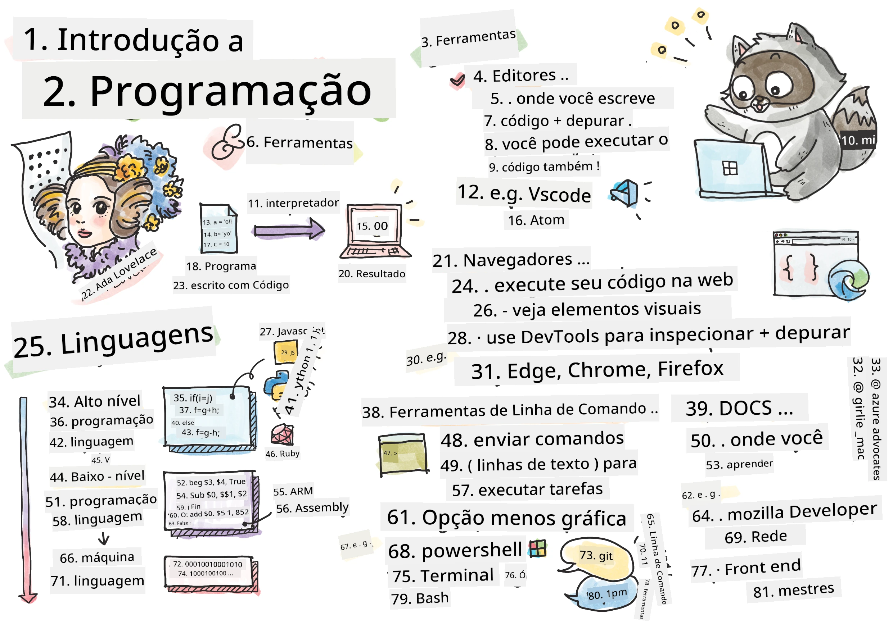
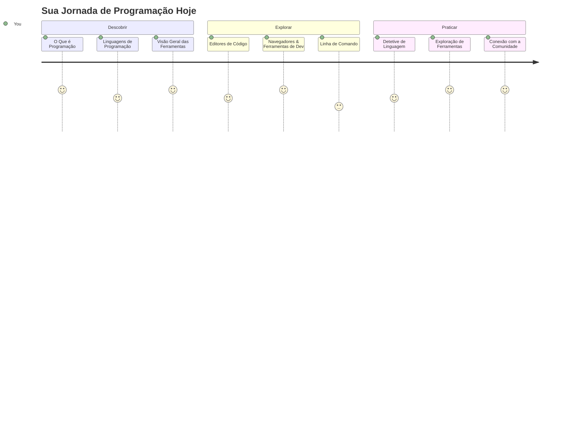
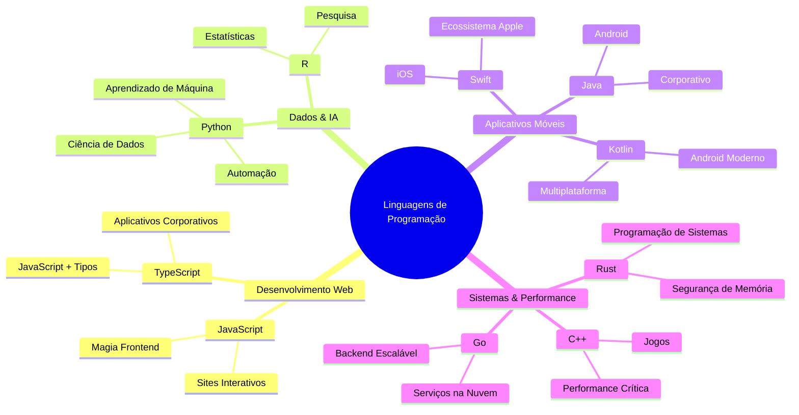
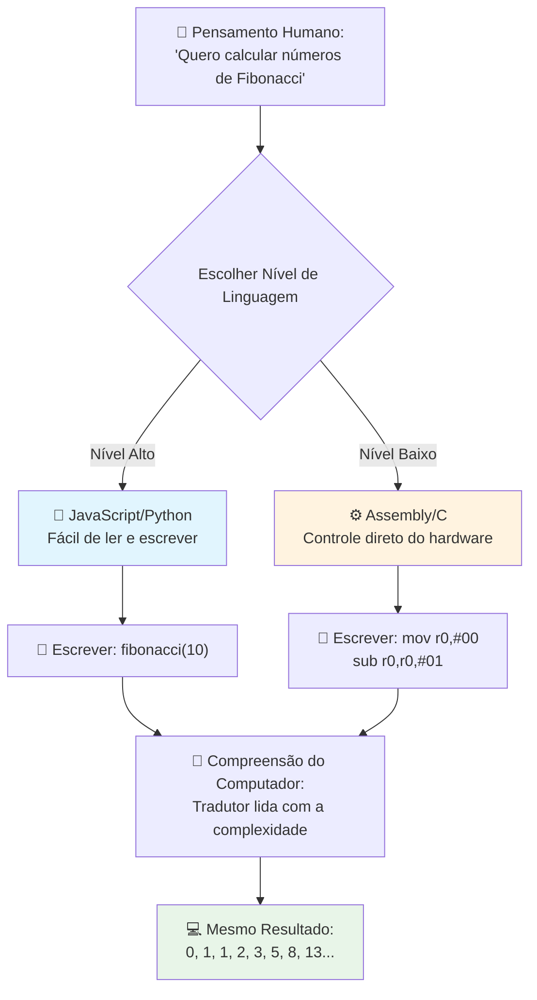
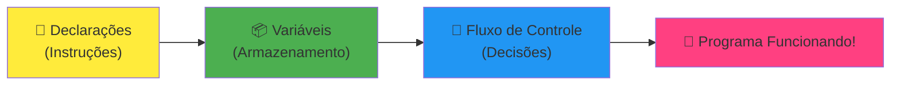
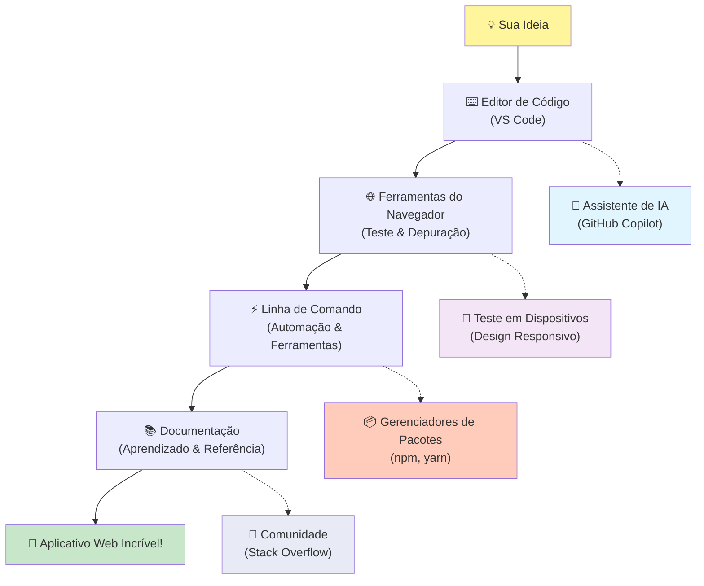
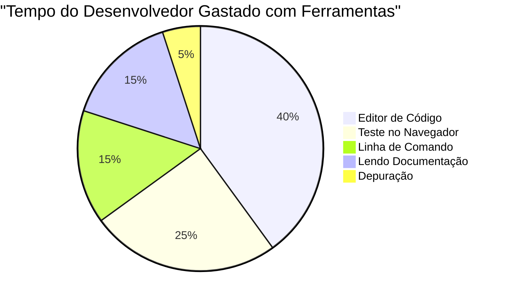
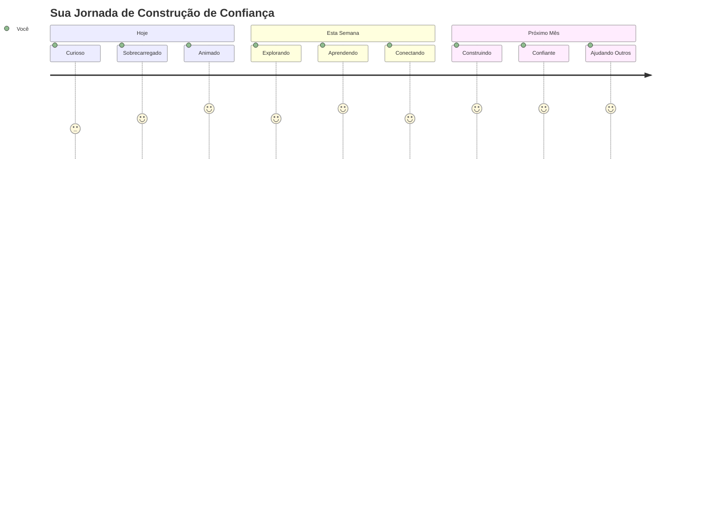

# Introdução às Linguagens de Programação e Ferramentas Modernas para Desenvolvedores

Olá, futuro desenvolvedor! 👋 Posso te contar algo que ainda me dá arrepios todos os dias? Você está prestes a descobrir que programar não é apenas sobre computadores – é sobre ter superpoderes reais para trazer suas ideias mais loucas à vida!

Sabe aquele momento em que você está usando seu app favorito e tudo simplesmente funciona perfeitamente? Quando você toca um botão e algo absolutamente mágico acontece que te faz pensar "uau, como eles FAZEM isso?" Bem, alguém exatamente como você – provavelmente sentado no café favorito às 2 da manhã com o terceiro espresso – escreveu o código que criou essa mágica. E aqui está o que vai te deixar de queixo caído: no final desta lição, você não só vai entender como eles fizeram isso, como vai estar doido para tentar você mesmo!

Olha, eu entendo perfeitamente se programar parece intimidante agora. Quando comecei, eu achava que precisava ser algum tipo de gênio da matemática ou ter programado desde os cinco anos. Mas aqui está o que mudou totalmente minha perspectiva: programar é exatamente como aprender a ter conversas em um novo idioma. Você começa com "olá" e "obrigado," depois passa a pedir um café e, antes de perceber, está tendo discussões filosóficas profundas! Só que nesse caso, você está conversando com computadores, e sinceramente? Eles são os parceiros de conversa mais pacientes que você vai ter – nunca julgam seus erros e estão sempre animados para tentar de novo!

Hoje, vamos explorar as incríveis ferramentas que tornam o desenvolvimento web moderno não só possível, mas seriamente viciante. Estou falando dos mesmos editores, navegadores e fluxos de trabalho que desenvolvedores da Netflix, Spotify e seu estúdio indie favorito usam todo santo dia. E aqui vai a parte que vai te fazer dançar de alegria: a maioria dessas ferramentas profissionais, padrão da indústria, são totalmente gratuitas!


> Sketchnote por [Tomomi Imura](https://twitter.com/girlie_mac)


## Vamos Ver o Que Você Já Sabe!

Antes de mergulharmos nas coisas divertidas, eu estou curioso – o que você já sabe sobre esse mundo da programação? E olha, se você está vendo essas perguntas pensando "eu literalmente não faço ideia de nada disso," isso não é só ok, é perfeito! Isso significa que você está exatamente no lugar certo. Pense neste quiz como um alongamento antes do treino – estamos apenas aquecendo esses músculos cerebrais!

[Faça o quiz pré-aula](https://ff-quizzes.netlify.app/web/)


## A Aventura Que Vamos Fazer Juntos

Ok, eu estou genuinamente empolgado com o que vamos explorar hoje! Sério, eu queria poder ver sua cara quando alguns desses conceitos se encaixarem. Aqui está a incrível jornada que vamos fazer juntos:

- **O que realmente é programação (e por que é a coisa mais legal de todas!)** – Vamos descobrir como o código é literalmente a magia invisível que move tudo ao seu redor, desde aquele despertador que de alguma forma sabe que é segunda de manhã até o algoritmo que cria suas recomendações perfeitas na Netflix
- **Linguagens de programação e suas personalidades incríveis** – Imagine entrar em uma festa onde cada pessoa tem superpoderes completamente diferentes e formas distintas de resolver problemas. É assim que é o mundo das linguagens de programação, e você vai adorar conhecê-las!
- **Os blocos fundamentais que fazem a mágica digital acontecer** – Pense nisso como o conjunto de LEGO criativo definitivo. Quando você entender como essas peças se encaixam, vai perceber que pode literalmente construir qualquer coisa que sua imaginação imaginar
- **Ferramentas profissionais que vão fazer você se sentir como se tivesse acabado de receber uma varinha de mago** – Não estou sendo dramático – essas ferramentas vão realmente te fazer sentir que você tem superpoderes, e a melhor parte? São as mesmas que os profissionais usam!

> 💡 **Aqui está o lance**: Nem pense em tentar decorar tudo hoje! Agora, eu só quero que você sinta aquela faísca de empolgação sobre o que é possível. Os detalhes vão colar naturalmente enquanto praticamos juntos – é assim que a aprendizagem de verdade acontece!

> Você pode fazer esta lição no [Microsoft Learn](https://learn.microsoft.com/en-us/learn/modules/web-development-101/introduction-programming/?WT.mc_id=academic-77807-sagibbon)!

## Então, O Que *É* Programação Exatamente?

Certo, vamos encarar a pergunta de um milhão de dólares: o que é programação, realmente?

Vou contar uma história que mudou totalmente minha forma de pensar sobre isso. Semana passada, eu estava tentando explicar para minha mãe como usar o controle remoto da nossa nova smart TV. Me peguei falando coisas como "aperte o botão vermelho, mas não o botão vermelho grande, o botão vermelho pequeno à esquerda... não, seu outro lado esquerdo... ok, agora segure por dois segundos, não um, não três..." Te soa familiar? 😅

Isso é programação! É a arte de dar instruções incrivelmente detalhadas, passo a passo, para algo que é muito poderoso mas precisa que tudo seja explicado perfeitamente. Só que, em vez de explicar para sua mãe (que pode perguntar "qual botão vermelho?!"), você está explicando para um computador (que simplesmente faz exatamente o que você disse, mesmo que não seja bem o que você quis dizer).

Aqui está o que me deixou maravilhado quando aprendi isso pela primeira vez: os computadores são na verdade bem simples na sua essência. Eles literalmente só entendem duas coisas – 1 e 0, que é basicamente "sim" e "não" ou "ligado" e "desligado." É só isso! Mas aqui é que fica mágico – não precisamos falar em 1s e 0s como se estivéssemos na Matrix. É aí que as **linguagens de programação** entram em cena para ajudar. Elas são como ter o melhor tradutor do mundo que pega seus pensamentos normais de humano e converte para a linguagem do computador.

E aqui está o que ainda me dá arrepios toda manhã quando acordo: literalmente *tudo* digital na sua vida começou com alguém exatamente como você, provavelmente de pijama com uma xícara de café, digitando código no laptop. Aquele filtro do Instagram que te faz parecer impecável? Alguém programou isso. A recomendação que te levou à sua nova música favorita? Um desenvolvedor criou esse algoritmo. O app que ajuda a dividir a conta do jantar com amigos? Pois é, alguém pensou "isso é chato, aposto que posso resolver" e então... resolveu!

Quando você aprende a programar, você não está só adquirindo uma nova habilidade – você está entrando numa comunidade incrível de solucionadores de problemas que passam o dia pensando, "E se eu pudesse criar algo que faça o dia de alguém um pouco melhor?" Sério, tem coisa mais legal que isso?

✅ **Caça ao Fato Curioso**: Aqui está algo super legal para pesquisar quando tiver um tempo livre – quem você acha que foi o primeiro programador de computador do mundo? Vou te dar uma dica: pode não ser quem você está esperando! A história dessa pessoa é absolutamente fascinante e mostra que programação sempre foi sobre criatividade e pensar fora da caixa.

### 🧠 **Hora do Check-in: Como Você Está Se Sentindo?**

**Reserve um momento para refletir:**
- A ideia de "dar instruções para computadores" faz sentido para você agora?
- Você consegue pensar em uma tarefa diária que gostaria de automatizar com programação?
- Quais perguntas estão surgindo na sua cabeça sobre essa coisa toda de programação?

> **Lembre-se**: É totalmente normal se alguns conceitos estiverem confusos agora. Aprender programação é como aprender um novo idioma – seu cérebro precisa de tempo para criar essas conexões neurais. Você está indo super bem!

## Linguagens de Programação São Como Diferentes Sabores de Magia

Ok, isso vai parecer estranho, mas me acompanha – linguagens de programação são muito parecidas com diferentes estilos musicais. Pense nisso: tem o jazz, que é suave e improvisado, o rock que é potente e direto, a música clássica que é elegante e estruturada e o hip-hop que é criativo e expressivo. Cada estilo tem seu próprio clima, sua comunidade de fãs apaixonados, e cada um é perfeito para diferentes humores e ocasiões.

Linguagens de programação funcionam exatamente assim! Você não usaria a mesma linguagem para criar um jogo móvel divertido que usaria para processar grandes quantidades de dados climáticos, assim como ninguém toca death metal numa aula de yoga (bem, na maioria das aulas de yoga, pelo menos! 😄).

Mas aqui está o que sempre me impressiona: essas linguagens são como ter o intérprete mais paciente e brilhante do mundo sentado bem ao seu lado. Você pode expressar suas ideias de um jeito que faz sentido para seu cérebro humano, e elas cuidam de todo o trabalho incrivelmente complexo de traduzir isso para os 1s e 0s que os computadores realmente falam. É como ter um amigo perfeito, fluente tanto em "criatividade humana" quanto em "lógica de computador" – e que nunca se cansa, nunca precisa fazer pausa para café e nunca te julga por repetir a mesma pergunta duas vezes!

### Linguagens de Programação Populares e Seus Usos


| Linguagem | Melhor Para | Por Que É Popular |
|----------|----------|------------------|
| **JavaScript** | Desenvolvimento web, interfaces de usuário | Roda em navegadores e alimenta sites interativos |
| **Python** | Ciência de dados, automação, IA | Fácil de ler e aprender, bibliotecas poderosas |
| **Java** | Aplicações empresariais, apps Android | Independente de plataforma, robusto para sistemas grandes |
| **C#** | Aplicativos Windows, desenvolvimento de jogos | Forte suporte no ecossistema Microsoft |
| **Go** | Serviços em nuvem, sistemas backend | Rápido, simples, projetado para computação moderna |

### Linguagens de Alto Nível vs. Baixo Nível

Ok, esse foi honestamente o conceito que me quebrou o cérebro quando comecei a aprender, então vou compartilhar a analogia que finalmente fez isso fazer sentido para mim – e espero muito que ajude você também!

Imagine que você está visitando um país onde não fala o idioma, e precisa desesperadamente encontrar o banheiro mais próximo (todos já passamos por isso, né? 😅):

- **Programação de baixo nível** é como aprender o dialeto local tão bem que você consegue conversar com a avó que vende frutas na esquina usando referências culturais, gírias locais e piadas internas que só quem cresceu lá entenderia. Super impressionante e extremamente eficiente... se você for fluente! Mas bem esmagador quando você só quer achar um banheiro.

- **Programação de alto nível** é como ter aquele amigo local incrível que te entende. Você pode dizer "preciso muito achar um banheiro" no inglês simples, e ele cuida da tradução cultural e te dá a direção de um jeito que faça sentido para seu cérebro que não é local.

Em termos de programação:
- **Linguagens de baixo nível** (como Assembly ou C) deixam você ter conversas incrivelmente detalhadas com o hardware real do computador, mas você precisa pensar como uma máquina, o que... bom, digamos que é uma mudança mental grande!
- **Linguagens de alto nível** (como JavaScript, Python ou C#) deixam você pensar como humano enquanto cuidam da linguagem máquina nos bastidores. Além disso, têm comunidades super acolhedoras cheias de pessoas que lembram como era ser novato e querem ajudar de verdade!

Adivinha quais eu vou sugerir que você comece? 😉 Linguagens de alto nível são como rodinhas de apoio que você nunca quer tirar porque fazem a experiência toda muito mais prazerosa!


### Deixe-me Mostrar Por Que Linguagens de Alto Nível São Muito Mais Amigáveis

Beleza, eu vou te mostrar algo que demonstra perfeitamente porque me apaixonei pelas linguagens de alto nível, mas primeiro – preciso que você me prometa uma coisa. Quando você vir esse primeiro exemplo de código, não entre em pânico! Ele deve parecer intimidante. Esse é exatamente o ponto que quero mostrar!

Vamos olhar a mesma tarefa escrita em dois estilos completamente diferentes. Ambos criam a chamada sequência de Fibonacci – é um padrão matemático lindo onde cada número é a soma dos dois anteriores: 0, 1, 1, 2, 3, 5, 8, 13... (Curiosidade: você encontra esse padrão literalmente em toda a natureza – espirais de sementes de girassol, padrões em pinhas, até a formação de galáxias!)

Pronto para ver a diferença? Vamos lá!

**Linguagem de alto nível (JavaScript) – Amigável para humanos:**

```javascript
// Etapa 1: Configuração básica de Fibonacci
const fibonacciCount = 10;
let current = 0;
let next = 1;

console.log('Fibonacci sequence:');
```

**O que este código faz:**
- **Declara** uma constante para especificar quantos números de Fibonacci queremos gerar
- **Inicializa** duas variáveis para rastrear o número atual e o próximo na sequência
- **Define** os valores iniciais (0 e 1) que definem o padrão Fibonacci
- **Mostra** uma mensagem de cabeçalho para identificar nossa saída

```javascript
// Passo 2: Gere a sequência com um loop
for (let i = 0; i < fibonacciCount; i++) {
  console.log(`Position ${i + 1}: ${current}`);
  
  // Calcule o próximo número na sequência
  const sum = current + next;
  current = next;
  next = sum;
}
```

**Quebrando o que acontece aqui:**
- **Percorre** cada posição da sequência usando um loop `for`
- **Exibe** cada número com sua posição usando formatação de template literal
- **Calcula** o próximo número de Fibonacci somando os valores atual e próximo
- **Atualiza** as variáveis para passar à próxima iteração

```javascript
// Passo 3: Abordagem funcional moderna
const generateFibonacci = (count) => {
  const sequence = [0, 1];
  
  for (let i = 2; i < count; i++) {
    sequence[i] = sequence[i - 1] + sequence[i - 2];
  }
  
  return sequence;
};

// Exemplo de uso
const fibSequence = generateFibonacci(10);
console.log(fibSequence);
```

**No código acima, nós:**
- **Criamos** uma função reutilizável usando a sintaxe moderna de arrow function
- **Construímos** um array para armazenar toda a sequência em vez de mostrar um a um
- **Usamos** indexação de array para calcular cada novo número a partir dos anteriores
- **Retornamos** a sequência completa para uso flexível em outras partes do programa

**Linguagem de baixo nível (ARM Assembly) – Amigável para computadores:**

```assembly
 area ascen,code,readonly
 entry
 code32
 adr r0,thumb+1
 bx r0
 code16
thumb
 mov r0,#00
 sub r0,r0,#01
 mov r1,#01
 mov r4,#10
 ldr r2,=0x40000000
back add r0,r1
 str r0,[r2]
 add r2,#04
 mov r3,r0
 mov r0,r1
 mov r1,r3
 sub r4,#01
 cmp r4,#00
 bne back
 end
```

Note como a versão em JavaScript lê quase como instruções em inglês, enquanto a versão Assembly usa comandos crípticos que controlam diretamente o processador do computador. Ambas realizam exatamente a mesma tarefa, mas a linguagem de alto nível é muito mais fácil para humanos entenderem, escreverem e manterem.

**Principais diferenças que você vai notar:**
- **Legibilidade**: JavaScript usa nomes descritivos como `fibonacciCount` enquanto Assembly usa rótulos criptografados como `r0`, `r1`
- **Comentários**: Linguagens de alto nível incentivam comentários explicativos que tornam o código autoexplicativo
- **Estrutura**: O fluxo lógico do JavaScript corresponde à forma como os humanos pensam passo a passo sobre problemas
- **Manutenção**: Atualizar a versão JavaScript para diferentes requisitos é simples e claro

✅ **Sobre a sequência de Fibonacci**: Esse padrão numérico absolutamente lindo (onde cada número é a soma dos dois anteriores: 0, 1, 1, 2, 3, 5, 8...) aparece literalmente *em todo lugar* na natureza! Você o encontrará nas espirais dos girassóis, nos padrões dos pinhões, na forma como as conchas de náutilo se curvam e até em como os galhos das árvores crescem. É realmente impressionante como a matemática e o código podem nos ajudar a entender e recriar os padrões que a natureza usa para criar beleza!


## Os Blocos de Construção Que Fazem a Magia Acontecer

Beleza, agora que você viu como as linguagens de programação funcionam na prática, vamos analisar as peças fundamentais que compõem literalmente todo programa já escrito. Pense nelas como os ingredientes essenciais da sua receita favorita – uma vez que você entender o que cada um faz, poderá ler e escrever código em praticamente qualquer linguagem!

É meio que como aprender a gramática da programação. Lembra na escola quando você aprendeu sobre substantivos, verbos e como montar frases? A programação tem sua própria versão de gramática e, honestamente, é muito mais lógica e tolerante do que a gramática do inglês jamais foi! 😄

### Instruções: As Orientações Passo a Passo

Vamos começar com **instruções** – elas são como sentenças individuais em uma conversa com seu computador. Cada instrução diz ao computador para fazer uma coisa específica, tipo dar uma direção: "Vire à esquerda aqui," "Pare no semáforo vermelho," "Estacione naquele lugar."

O que eu adoro nas instruções é o quão legíveis elas geralmente são. Veja só:

```javascript
// Declarações básicas que realizam ações únicas
const userName = "Alex";                    
console.log("Hello, world!");              
const sum = 5 + 3;                         
```

**Aqui está o que esse código faz:**
- **Declara** uma variável constante para armazenar o nome de um usuário
- **Exibe** uma mensagem de saudação no console
- **Calcula** e armazena o resultado de uma operação matemática

```javascript
// Declarações que interagem com páginas da web
document.title = "My Awesome Website";      
document.body.style.backgroundColor = "lightblue";
```

**Passo a passo, aqui está o que está acontecendo:**
- **Modifica** o título da página que aparece na aba do navegador
- **Muda** a cor de fundo de todo o corpo da página

### Variáveis: O Sistema de Memória do Seu Programa

Ok, **variáveis** são, honestamente, um dos meus conceitos favoritos para ensinar porque são muito parecidas com coisas que você já usa todo dia!

Pense na sua lista de contatos do telefone por um segundo. Você não memoriza o número de todo mundo – ao invés disso, salva "Mãe," "Melhor Amigo," ou "Pizzaria que Entrega Até 2 da Madrugada" e deixa seu telefone lembrar os números reais. Variáveis funcionam exatamente assim! São como recipientes rotulados onde seu programa pode armazenar informações e buscar depois usando um nome que realmente faça sentido.

Aqui está o que é realmente legal: variáveis podem mudar enquanto seu programa roda (daí o nome "variável" – percebe a intenção?). Assim como você pode atualizar aquele contato da pizzaria quando descobrir um lugar ainda melhor, variáveis podem ser atualizadas conforme seu programa aprende novas informações ou as situações mudam!

Deixe-me mostrar como isso pode ser maravilhosamente simples:

```javascript
// Passo 1: Criando variáveis básicas
const siteName = "Weather Dashboard";        
let currentWeather = "sunny";               
let temperature = 75;                       
let isRaining = false;                      
```

**Entendendo esses conceitos:**
- **Armazenar** valores fixos em variáveis `const` (como o nome do site)
- **Usar** `let` para valores que podem mudar ao longo do programa
- **Atribuir** diferentes tipos de dados: strings (texto), números e booleanos (true/false)
- **Escolher** nomes descritivos que expliquem o que cada variável contém

```javascript
// Etapa 2: Trabalhando com objetos para agrupar dados relacionados
const weatherData = {                       
  location: "San Francisco",
  humidity: 65,
  windSpeed: 12
};
```

**No exemplo acima, nós:**
- **Criamos** um objeto para agrupar informações climáticas relacionadas
- **Organizamos** vários dados sob um mesmo nome de variável
- **Usamos** pares chave-valor para rotular cada informação claramente

```javascript
// Passo 3: Usando e atualizando variáveis
console.log(`${siteName}: Today is ${currentWeather} and ${temperature}°F`);
console.log(`Wind speed: ${weatherData.windSpeed} mph`);

// Atualizando variáveis mutáveis
currentWeather = "cloudy";                  
temperature = 68;                          
```

**Vamos entender cada parte:**
- **Exibir** informações usando template literals com a sintaxe `${}`
- **Acessar** propriedades de objeto usando notação de ponto (`weatherData.windSpeed`)
- **Atualizar** variáveis declaradas com `let` para refletir condições mutáveis
- **Combinar** múltiplas variáveis para criar mensagens significativas

```javascript
// Etapa 4: Desestruturação moderna para um código mais limpo
const { location, humidity } = weatherData; 
console.log(`${location} humidity: ${humidity}%`);
```

**O que você precisa saber:**
- **Extrair** propriedades específicas de objetos usando atribuição por desestruturação
- **Criar** variáveis automaticamente com os mesmos nomes das chaves do objeto
- **Simplificar** código evitando notação em ponto repetitiva

### Fluxo de Controle: Ensinando Seu Programa a Pensar

Beleza, aqui a programação fica absolutamente impressionante! **Fluxo de controle** é basicamente ensinar seu programa a tomar decisões inteligentes, exatamente como você faz todo dia sem nem pensar.

Imagine só: hoje de manhã você provavelmente passou por algo tipo "Se estiver chovendo, pego o guarda-chuva. Se estiver frio, uso uma jaqueta. Se eu estiver atrasado, pulo o café da manhã e pego um café no caminho." Seu cérebro naturalmente segue essa lógica de se-então dezenas de vezes diariamente!

É isso que faz os programas parecerem inteligentes e vivos ao invés de apenas seguirem um roteiro chato e previsível. Eles realmente podem olhar uma situação, avaliar o que está acontecendo e reagir apropriadamente. É como dar ao seu programa um cérebro que pode se adaptar e fazer escolhas!

Quer ver como isso funciona lindamente? Deixe-me mostrar:

```javascript
// Etapa 1: Lógica condicional básica
const userAge = 17;

if (userAge >= 18) {
  console.log("You can vote!");
} else {
  const yearsToWait = 18 - userAge;
  console.log(`You'll be able to vote in ${yearsToWait} year(s).`);
}
```

**Aqui está o que esse código faz:**
- **Verifica** se a idade do usuário cumpre o requisito para votar
- **Executa** blocos de código diferentes baseado no resultado da condição
- **Calcula** e exibe quanto tempo falta para poder votar se for menor de 18
- **Fornece** feedback específico e útil para cada cenário

```javascript
// Passo 2: Múltiplas condições com operadores lógicos
const userAge = 17;
const hasPermission = true;

if (userAge >= 18 && hasPermission) {
  console.log("Access granted: You can enter the venue.");
} else if (userAge >= 16) {
  console.log("You need parent permission to enter.");
} else {
  console.log("Sorry, you must be at least 16 years old.");
}
```

**Analisando o que acontece aqui:**
- **Combina** múltiplas condições usando o operador `&&` (e)
- **Cria** uma hierarquia de condições usando `else if` para vários cenários
- **Trata** todos os casos possíveis com uma instrução final `else`
- **Fornece** respostas claras e acionáveis para cada situação diferente

```javascript
// Passo 3: Condicional concisa com operador ternário
const votingStatus = userAge >= 18 ? "Can vote" : "Cannot vote yet";
console.log(`Status: ${votingStatus}`);
```

**O que você precisa lembrar:**
- **Use** o operador ternário (`? :`) para condições simples com duas opções
- **Escreva** a condição primeiro, seguida de `?`, depois resultado verdadeiro, `:`, e resultado falso
- **Aplique** esse padrão para atribuir valores baseados em condições

```javascript
// Etapa 4: Tratando múltiplos casos específicos
const dayOfWeek = "Tuesday";

switch (dayOfWeek) {
  case "Monday":
  case "Tuesday":
  case "Wednesday":
  case "Thursday":
  case "Friday":
    console.log("It's a weekday - time to work!");
    break;
  case "Saturday":
  case "Sunday":
    console.log("It's the weekend - time to relax!");
    break;
  default:
    console.log("Invalid day of the week");
}
```

**Este código realiza o seguinte:**
- **Compara** o valor da variável com vários casos específicos
- **Agrupa** casos semelhantes (dias de semana vs. fim de semana)
- **Executa** o bloco de código apropriado quando encontra um caso correspondente
- **Inclui** um caso `default` para tratar valores inesperados
- **Usa** instruções `break` para evitar que o código continue para o próximo caso

> 💡 **Analogia do mundo real**: Pense no fluxo de controle como ter o GPS mais paciente do mundo te dando direções. Ele pode dizer "Se houver trânsito na Rua Principal, pegue a rodovia. Se a construção estiver bloqueando a rodovia, tente a rota cênica." Programas usam exatamente o mesmo tipo de lógica condicional para responder de forma inteligente a diferentes situações e sempre proporcionar a melhor experiência possível aos usuários.

### 🎯 **Verificação de Conceito: Domínio dos Blocos de Construção**

**Vamos ver como você está se saindo nos conceitos básicos:**
- Você consegue explicar a diferença entre uma variável e uma instrução com suas próprias palavras?
- Pense em um cenário do mundo real onde você usaria uma decisão if-then (como nosso exemplo de voto)
- Qual foi uma coisa sobre a lógica da programação que te surpreendeu?

**Pequeno reforço de confiança:**

✅ **O que vem a seguir**: Vamos nos divertir muito mergulhando mais fundo nesses conceitos enquanto continuamos essa incrível jornada juntos! Por agora, foque em sentir aquela empolgação com todas as possibilidades incríveis à sua frente. As habilidades e técnicas específicas vão se fixar naturalmente conforme praticarmos juntos – prometo que isso vai ser muito mais divertido do que você imagina!

## Ferramentas do Ofício

Beleza, aqui é honestamente onde eu fico tão animado que mal consigo me conter! 🚀 Estamos prestes a falar sobre as ferramentas incríveis que vão fazer você se sentir como se tivesse acabado de receber as chaves de uma nave espacial digital.

Sabe como um chef tem aquelas facas perfeitamente equilibradas que parecem extensões das mãos dele? Ou como um músico tem aquela guitarra que parece cantar no momento que ele toca? Bem, desenvolvedores têm nossa própria versão dessas ferramentas mágicas, e aqui está o que vai realmente te impressionar – a maioria delas é completamente gratuita!

Eu praticamente fico pulando na cadeira de pensar em compartilhar isso com você porque elas revolucionaram completamente como construímos software. Estamos falando de assistentes de codificação com inteligência artificial que ajudam a escrever seu código (sem brincadeira!), ambientes na nuvem onde você pode criar aplicativos inteiros literalmente de qualquer lugar com Wi-Fi, e ferramentas de depuração tão sofisticadas que parecem visão de raio X para seus programas.

E aqui está a parte que ainda me arrepia: essas não são ferramentas “para iniciantes” que você vai superar. São as mesmas ferramentas profissionais que desenvolvedores no Google, Netflix, e naquele estúdio indie de apps que você adora estão usando neste exato momento. Você vai se sentir um verdadeiro profissional usando elas!


### Editores de Código e IDEs: Seus Novos Melhores Amigos Digitais

Vamos falar sobre editores de código – eles estão prestes a se tornar seus novos lugares favoritos para passar o tempo! Pense neles como seu santuário pessoal de codificação, onde você passará a maior parte do tempo criando e aperfeiçoando suas criações digitais.

Mas aqui está o que é absolutamente mágico nos editores modernos: eles não são apenas editores de texto sofisticados. São como ter o mentor de codificação mais brilhante e solidário sentado ao seu lado 24/7. Eles capturam seus erros de digitação antes mesmo de você perceber, sugerem melhorias que fazem você parecer um gênio, ajudam a entender o que cada pedaço de código faz, e alguns até conseguem prever o que você vai digitar e oferecem para terminar seus pensamentos!

Lembro quando descobri o preenchimento automático – eu literalmente me senti vivendo no futuro. Você começa a digitar algo, e seu editor diz: “Ei, você estava pensando nessa função que faz exatamente o que precisa?” É como ter um leitor de mentes como seu parceiro de codificação!

**O que torna esses editores tão incríveis?**

Editores modernos oferecem uma impressionante variedade de recursos projetados para aumentar sua produtividade:

| Recurso | O Que Faz | Por Que Ajuda |
|---------|-----------|--------------|
| **Realce de Sintaxe** | Colore diferentes partes do seu código | Facilita a leitura do código e a identificação de erros |
| **Auto-completar** | Sugere código enquanto você digita | Acelera a codificação e reduz erros de digitação |
| **Ferramentas de Depuração** | Ajuda a encontrar e corrigir erros | Economiza horas de resolução de problemas |
| **Extensões** | Adiciona recursos especializados | Personaliza seu editor para qualquer tecnologia |
| **Assistentes de IA** | Sugere código e explicações | Acelera o aprendizado e a produtividade |

> 🎥 **Recurso em Vídeo**: Quer ver essas ferramentas em ação? Confira este [vídeo Ferramentas do Ofício](https://youtube.com/watch?v=69WJeXGBdxg) para uma visão geral abrangente.

#### Editores Recomendados para Desenvolvimento Web

**[Visual Studio Code](https://code.visualstudio.com/?WT.mc_id=academic-77807-sagibbon)** (Gratuito)
- O mais popular entre desenvolvedores web
- Excelente ecossistema de extensões
- Terminal embutido e integração com Git
- **Extensões essenciais**:
  - [GitHub Copilot](https://marketplace.visualstudio.com/items?itemName=GitHub.copilot) - Sugestões de código com IA
  - [Live Share](https://marketplace.visualstudio.com/items?itemName=MS-vsliveshare.vsliveshare) - Colaboração em tempo real
  - [Prettier](https://marketplace.visualstudio.com/items?itemName=esbenp.prettier-vscode) - Formatação automática de código
  - [Code Spell Checker](https://marketplace.visualstudio.com/items?itemName=streetsidesoftware.code-spell-checker) - Detecta erros de digitação no seu código

**[JetBrains WebStorm](https://www.jetbrains.com/webstorm/)** (Pago, grátis para estudantes)
- Ferramentas avançadas de depuração e testes
- Auto-completar inteligente
- Controle de versão embutido

**IDEs Baseadas em Nuvem** (Preços variados)
- [GitHub Codespaces](https://github.com/features/codespaces) - VS Code completo no navegador
- [Replit](https://replit.com/) - Ótimo para aprender e compartilhar código
- [StackBlitz](https://stackblitz.com/) - Desenvolvimento web full-stack instantâneo

> 💡 **Dica para Começar**: Comece com o Visual Studio Code – é gratuito, amplamente usado na indústria e possui uma enorme comunidade criando tutoriais e extensões úteis.


### Navegadores Web: Seu Laboratório Secreto de Desenvolvimento

Ok, prepare-se para ter sua mente completamente explodida! Você sabe como tem usado navegadores para navegar em redes sociais e assistir vídeos? Pois é, eles estavam escondendo esse incrível laboratório secreto de desenvolvimento o tempo todo, só esperando você descobrir!

Toda vez que você clica com o botão direito numa página e escolhe "Inspecionar Elemento", você está abrindo um mundo oculto de ferramentas para desenvolvedores que são honestamente mais poderosas do que alguns softwares caros que eu costumava pagar centenas de dólares. É como descobrir que sua cozinha velha e comum estava escondendo um laboratório profissional de chef atrás de um painel secreto!
A primeira vez que alguém me mostrou as DevTools do navegador, passei umas três horas só clicando por aí e falando “ESPERA, ISSO TAMBÉM DÁ PRA FAZER?!” Você literalmente pode editar qualquer site em tempo real, ver exatamente o quão rápido tudo carrega, testar como seu site fica em diferentes dispositivos e até fazer debug de JavaScript como um verdadeiro profissional. É simplesmente impressionante!

**Aqui está o motivo pelo qual os navegadores são sua arma secreta:**

Quando você cria um site ou uma aplicação web, precisa ver como ele se parece e se comporta no mundo real. Os navegadores não só exibem seu trabalho, mas também fornecem feedback detalhado sobre desempenho, acessibilidade e problemas potenciais.

#### Ferramentas do Desenvolvedor do Navegador (DevTools)

Navegadores modernos incluem suítes de desenvolvimento abrangentes:

| Categoria da Ferramenta | O Que Ela Faz | Exemplo de Uso |
|------------------------|---------------|----------------|
| **Inspetor de Elementos** | Visualize e edite HTML/CSS em tempo real | Ajuste estilos para ver resultados imediatos |
| **Console** | Visualize mensagens de erro e teste JavaScript | Debug de problemas e experimentação de código |
| **Monitor de Rede** | Acompanhe como recursos carregam | Otimize desempenho e tempos de carregamento |
| **Verificador de Acessibilidade** | Teste design inclusivo | Garanta que seu site funcione para todos os usuários |
| **Simulador de Dispositivos** | Visualize em diferentes tamanhos de tela | Teste design responsivo sem múltiplos dispositivos |

#### Navegadores Recomendados para Desenvolvimento

- **[Chrome](https://developers.google.com/web/tools/chrome-devtools/)** - DevTools padrão do setor com documentação extensa
- **[Firefox](https://developer.mozilla.org/docs/Tools)** - Excelentes ferramentas para CSS Grid e acessibilidade
- **[Edge](https://docs.microsoft.com/microsoft-edge/devtools-guide-chromium/?WT.mc_id=academic-77807-sagibbon)** - Baseado em Chromium com recursos para desenvolvedores da Microsoft

> ⚠️ **Dica Importante de Teste**: Sempre teste seus sites em vários navegadores! O que funciona perfeitamente no Chrome pode parecer diferente no Safari ou Firefox. Desenvolvedores profissionais testam em todos os principais navegadores para garantir experiências consistentes aos usuários.


### Ferramentas de Linha de Comando: Seu Portal para Superpoderes de Desenvolvimento

Beleza, vamos ter um momento completamente sincero aqui sobre a linha de comando, porque quero que você ouça isso de alguém que realmente entende. Quando eu a vi pela primeira vez — só aquela tela preta assustadora com texto piscando — eu literalmente pensei, "Não, de jeito nenhum! Isso parece coisa de filme de hacker dos anos 80, e eu definitivamente não sou inteligente o suficiente para isso!" 😅

Mas aqui está o que eu queria que alguém tivesse me dito naquela época, e o que estou dizendo para você agora: a linha de comando não é assustadora – é como ter uma conversa direta com seu computador. Pense nela como a diferença entre pedir comida por um aplicativo chique com fotos e menus (que é legal e fácil) versus entrar no seu restaurante local favorito onde o chef sabe exatamente o que você gosta e pode preparar algo perfeito só com você dizendo “surpreenda-me com algo incrível”.

A linha de comando é onde os desenvolvedores se sentem verdadeiros magos. Você digita algumas palavras aparentemente mágicas (ok, são só comandos, mas parecem mágicos!), pressiona enter, e PÁ – você criou estruturas completas de projetos, instalou ferramentas poderosas do mundo todo ou lançou seu app na internet para milhões de pessoas verem. Depois que você experimenta esse poder pela primeira vez, é honestamente viciante!

**Por que a linha de comando vai se tornar sua ferramenta favorita:**

Enquanto interfaces gráficas são ótimas para muitas tarefas, a linha de comando é imbatível em automação, precisão e velocidade. Muitas ferramentas de desenvolvimento funcionam principalmente por linha de comando, e aprender a usá-las eficientemente pode melhorar muito sua produtividade.

```bash
# Etapa 1: Crie e navegue até o diretório do projeto
mkdir my-awesome-website
cd my-awesome-website
```

**Aqui está o que esse código faz:**
- **Cria** um novo diretório chamado "my-awesome-website" para seu projeto
- **Navega** para dentro do diretório recém-criado para começar a trabalhar

```bash
# Etapa 2: Inicialize o projeto com package.json
npm init -y

# Instale ferramentas modernas de desenvolvimento
npm install --save-dev vite prettier eslint
npm install --save-dev @eslint/js
```

**Passo a passo, aqui está o que está acontecendo:**
- **Inicializa** um novo projeto Node.js com configurações padrão usando `npm init -y`
- **Instala** o Vite como uma ferramenta moderna de build para desenvolvimento rápido e builds de produção
- **Adiciona** Prettier para formatação automática de código e ESLint para verificação da qualidade do código
- **Usa** a flag `--save-dev` para marcar essas dependências como apenas para desenvolvimento

```bash
# Passo 3: Criar estrutura e arquivos do projeto
mkdir src assets
echo '<!DOCTYPE html><html><head><title>My Site</title></head><body><h1>Hello World</h1></body></html>' > index.html

# Iniciar servidor de desenvolvimento
npx vite
```

**No acima, nós:**
- **Organizamos** nosso projeto criando pastas separadas para código-fonte e assets
- **Geramos** um arquivo HTML básico com estrutura correta de documento
- **Iniciamos** o servidor de desenvolvimento do Vite para recarregamento ao vivo e substituição quente de módulos

#### Ferramentas Essenciais de Linha de Comando para Desenvolvimento Web

| Ferramenta | Propósito | Por Que Você Precisa |
|------------|-----------|---------------------|
| **[Git](https://git-scm.com/)** | Controle de versão | Acompanhe mudanças, colabore e faça backup do seu trabalho |
| **[Node.js & npm](https://nodejs.org/)** | Ambiente JavaScript e gerenciador de pacotes | Execute JavaScript fora dos navegadores e instale ferramentas modernas |
| **[Vite](https://vitejs.dev/)** | Ferramenta de build e servidor dev | Desenvolvimento super rápido com hot module replacement |
| **[ESLint](https://eslint.org/)** | Qualidade de código | Encontre e corrija problemas automaticamente no seu JavaScript |
| **[Prettier](https://prettier.io/)** | Formatação de código | Mantenha seu código sempre formatado e legível |

#### Opções por Plataforma

**Windows:**
- **[Windows Terminal](https://docs.microsoft.com/windows/terminal/?WT.mc_id=academic-77807-sagibbon)** - Terminal moderno e cheio de recursos
- **[PowerShell](https://docs.microsoft.com/powershell/?WT.mc_id=academic-77807-sagibbon)** 💻 - Ambiente poderoso para scripts
- **[Prompt de Comando](https://learn.microsoft.com/windows-server/administration/windows-commands/windows-commands)** 💻 - Linha de comando tradicional do Windows

**macOS:**
- **[Terminal](https://support.apple.com/guide/terminal/)** 💻 - Aplicação de terminal embutida
- **[iTerm2](https://iterm2.com/)** - Terminal melhorado com recursos avançados

**Linux:**
- **[Bash](https://www.gnu.org/software/bash/)** 💻 - Shell padrão do Linux
- **[KDE Konsole](https://docs.kde.org/trunk5/en/konsole/konsole/index.html)** - Emulador de terminal avançado

> 💻 = Pré-instalado no sistema operacional

> 🎯 **Caminho de Aprendizado**: Comece com comandos básicos como `cd` (mudar diretório), `ls` ou `dir` (listar arquivos), e `mkdir` (criar pasta). Pratique com comandos do fluxo moderno como `npm install`, `git status` e `code .` (abre o diretório atual no VS Code). Conforme ganhar confiança, você naturalmente aprenderá comandos mais avançados e técnicas de automação.


### Documentação: Seu Mentor de Aprendizado Sempre Disponível

Ok, deixa eu compartilhar um segredinho que vai fazer você se sentir muito melhor por ser iniciante: até os desenvolvedores mais experientes passam uma enorme parte do tempo lendo documentação. E isso não porque eles não sabem o que estão fazendo – é, na verdade, um sinal de sabedoria!

Pense na documentação como ter acesso aos professores mais pacientes e conhecedores do mundo, disponíveis 24/7. Travado num problema às 2 da manhã? A documentação está lá com um abraço virtual quente e exatamente a resposta que você precisa. Quer aprender sobre alguma função nova da qual todo mundo está falando? A documentação te apoia com exemplos passo a passo. Tentando entender por que algo funciona daquele jeito? Você acertou – a documentação está pronta para explicar de um jeito que finalmente faz sentido!

Aqui está algo que mudou completamente minha visão: o mundo do desenvolvimento web se move incrivelmente rápido, e ninguém (sério, absolutamente ninguém!) decorou tudo. Já vi desenvolvedores seniores com mais de 15 anos de experiência pesquisando sintaxe básica, e sabe o que é isso? Não é vergonha – é inteligência! Não se trata de ter uma memória perfeita; é sobre saber onde encontrar respostas confiáveis rapidamente e compreender como aplicá-las.

**É aqui que a verdadeira mágica acontece:**

Desenvolvedores profissionais gastam uma parte significativa do tempo lendo documentação – não porque não sabem o que fazem, mas porque o cenário do desenvolvimento web evolui tão rápido que se manter atualizado exige aprendizado constante. Boa documentação ajuda você a entender não só *como* usar algo, mas *por que* e *quando* usar.

#### Recursos Essenciais de Documentação

**[Mozilla Developer Network (MDN)](https://developer.mozilla.org/docs/Web)**
- O padrão ouro para documentação de tecnologias web
- Guias abrangentes para HTML, CSS e JavaScript
- Inclui informações de compatibilidade entre navegadores
- Conteúdo com exemplos práticos e demos interativas

**[Web.dev](https://web.dev)** (do Google)
- Melhores práticas modernas para desenvolvimento web
- Guias de otimização de performance
- Princípios de acessibilidade e design inclusivo
- Estudos de caso de projetos reais

**[Microsoft Developer Documentation](https://docs.microsoft.com/microsoft-edge/#microsoft-edge-for-developers)**
- Recursos para desenvolvimento no navegador Edge
- Guias para Progressive Web Apps
- Insights sobre desenvolvimento multiplataforma

**[Frontend Masters Learning Paths](https://frontendmasters.com/learn/)**
- Currículos estruturados de aprendizado
- Cursos em vídeo com especialistas da indústria
- Exercícios práticos de codificação

> 📚 **Estratégia de Estudo**: Não tente decorar a documentação – ao invés disso, aprenda a navegar por ela eficientemente. Faça bookmarks de referências usadas com frequência e pratique usando as funções de busca para encontrar informações específicas rapidamente.

### 🔧 **Checagem de Domínio de Ferramentas: O Que Faz Mais Sentido Para Você?**

**Tire um momento para pensar:**
- Qual ferramenta você está mais animado para experimentar primeiro? (Não existe resposta errada!)
- A linha de comando ainda parece intimidadora, ou você está curioso para ela?
- Você consegue imaginar usar as DevTools do navegador para espiar os bastidores de seus sites favoritos?


> **Curiosidade divertida**: A maioria dos desenvolvedores passa cerca de 40% do tempo no editor de código, mas repare quanto do tempo vai para testes, aprendizado e resolução de problemas. Programar não é só escrever código – é criar experiências!

✅ **Para refletir**: Aqui vai algo interessante para pensar – como você acha que as ferramentas para construir sites (desenvolvimento) podem ser diferentes das ferramentas para desenhar sua aparência (design)? É como a diferença entre ser um arquiteto que projeta uma casa bonita e o construtor que realmente a ergue. Ambos são cruciais, mas precisam de conjuntos de ferramentas diferentes! Esse tipo de pensamento vai te ajudar a enxergar o panorama geral de como sites ganham vida.

## Desafio do Agente GitHub Copilot 🚀

Use o modo Agente para completar o desafio abaixo:

**Descrição:** Explore os recursos de um editor de código moderno ou IDE e demonstre como ele pode melhorar seu fluxo de trabalho como desenvolvedor web.

**Prompt:** Escolha um editor de código ou IDE (como Visual Studio Code, WebStorm ou um IDE na nuvem). Liste três funcionalidades ou extensões que ajudam você a escrever, depurar ou manter código de forma mais eficiente. Para cada uma, forneça uma breve explicação de como ela beneficia seu fluxo de trabalho.

---

## 🚀 Desafio

**Beleza, detetive, pronto para seu primeiro caso?**

Agora que você tem essa base incrível, tenho uma aventura que vai ajudar você a ver o quão diversa e fascinante o mundo da programação realmente é. E escute – isso não é sobre escrever código ainda, então relaxe! Pense em você como um detetive de linguagens de programação no seu primeiro caso emocionante!

**Sua missão, caso aceite:**
1. **Torne-se um explorador de linguagens**: Escolha três linguagens de programação de universos completamente diferentes — talvez uma que constrói sites, uma que cria apps móveis e uma que processa dados para cientistas. Encontre exemplos da mesma tarefa simples escrita em cada uma. Prometo que você vai ficar absolutamente impressionado com o quão diferentes podem ser, fazendo exatamente a mesma coisa!

2. **Descubra as histórias de origem**: O que torna cada linguagem especial? Aqui vai uma curiosidade legal – toda linguagem de programação foi criada porque alguém pensou, “Sabe? Deve existir uma forma melhor de resolver esse problema específico.” Consegue descobrir quais eram esses problemas? Algumas dessas histórias são realmente fascinantes!

3. **Conheça as comunidades**: Veja o quão acolhedora e apaixonada é a comunidade de cada linguagem. Algumas têm milhões de desenvolvedores compartilhando conhecimento e ajudando uns aos outros, outras são menores, mas extremamente unidas e solidárias. Você vai adorar ver as diferentes personalidades dessas comunidades!

4. **Siga seu instinto**: Qual linguagem parece mais acessível para você agora? Não se preocupe em fazer a escolha “perfeita” – só ouça seu instinto! Honestamente, não há resposta errada, e você sempre pode explorar outras depois.

**Trabalho extra de detetive**: Veja se consegue descobrir quais grandes sites ou apps são construídos com cada linguagem. Garanto que vai se surpreender ao saber o que move Instagram, Netflix, ou aquele jogo mobile que você não consegue parar de jogar!

> 💡 **Lembrete**: Você não está tentando se tornar um expert em nenhuma dessas linguagens hoje. Você está apenas conhecendo o bairro antes de decidir onde quer se estabelecer. Vá com calma, divirta-se e deixe sua curiosidade te guiar!

## Vamos Celebrar o Que Você Descobriu!

Caramba, você absorveu tanta informação incrível hoje! Estou genuinamente animado para ver o quanto dessa jornada incrível ficou com você. E lembre-se – isso não é um teste que você precisa acertar tudo. É mais uma celebração de todas as coisas legais que você aprendeu sobre esse mundo fascinante em que você está prestes a mergulhar!

[Faça o quiz pós-aula](https://ff-quizzes.netlify.app/web/)

## Revisão & Autoestudo

**Tire seu tempo para explorar e se divertir!**
Você cobriu muito terreno hoje, e isso é algo para se orgulhar! Agora vem a parte divertida – explorar os tópicos que despertaram sua curiosidade. Lembre-se, isso não é dever de casa – é uma aventura!

**Mergulhe mais fundo no que te empolga:**

**Coloque a mão na massa com linguagens de programação:**
- Visite os sites oficiais de 2-3 linguagens que chamaram sua atenção. Cada uma tem sua própria personalidade e história!
- Experimente alguns playgrounds de código online como [CodePen](https://codepen.io/), [JSFiddle](https://jsfiddle.net/), ou [Replit](https://replit.com/). Não tenha medo de experimentar – você não vai quebrar nada!
- Leia sobre como sua linguagem favorita surgiu. Sério, algumas dessas histórias de origem são fascinantes e vão ajudar você a entender por que as linguagens funcionam do jeito que funcionam.

**Fique confortável com suas novas ferramentas:**
- Baixe o Visual Studio Code se ainda não fez isso – ele é gratuito e você vai adorar!
- Passe alguns minutos navegando pelo marketplace de Extensões. É como uma loja de aplicativos para seu editor de código!
- Abra as Ferramentas do Desenvolvedor do seu navegador e clique por aí. Não se preocupe em entender tudo – apenas familiarize-se com o que está lá.

**Junte-se à comunidade:**
- Siga algumas comunidades de desenvolvedores no [Dev.to](https://dev.to/), [Stack Overflow](https://stackoverflow.com/), ou [GitHub](https://github.com/). A comunidade de programação é incrivelmente acolhedora para quem está começando!
- Assista a vídeos de programação para iniciantes no YouTube. Há muitos criadores ótimos por aí que lembram como é estar começando.
- Considere participar de encontros locais ou comunidades online. Confie em mim, desenvolvedores adoram ajudar quem está começando!

> 🎯 **Escute, aqui está o que quero que você lembre**: Você não precisa se tornar um mago da programação da noite para o dia! Agora, você está apenas conhecendo esse mundo incrível do qual fará parte. Vá no seu ritmo, aproveite a jornada e lembre-se – todo desenvolvedor que você admira já esteve exatamente onde você está agora, sentindo-se empolgado e talvez um pouco sobrecarregado. Isso é totalmente normal e significa que você está no caminho certo!


## Assignment

[Reading the Docs](assignment.md)

> 💡 **Um empurrãozinho para sua tarefa**: Eu adoraria ver você explorar algumas ferramentas que ainda não cobrimos! Pule os editores, navegadores e ferramentas de linha de comando que já falamos – existe todo um universo incrível de ferramentas de desenvolvimento esperando para ser descoberto. Procure por aquelas que são ativamente mantidas e têm comunidades vibrantes e prestativas (elas costumam ter os melhores tutoriais e as pessoas mais solidárias quando, inevitavelmente, você ficar preso e precisar de uma mão amiga).

---

## 🚀 Seu Cronograma de Jornada na Programação

### ⚡ **O que você pode fazer nos próximos 5 minutos**
- [ ] Favoritar 2-3 sites de linguagens de programação que chamaram sua atenção
- [ ] Baixar o Visual Studio Code, se ainda não fez
- [ ] Abrir as DevTools do seu navegador (F12) e clicar em qualquer site
- [ ] Entrar em uma comunidade de programação (Dev.to, Reddit r/webdev, ou Stack Overflow)

### ⏰ **O que você pode realizar nesta hora**
- [ ] Completar o quiz pós-aula e refletir sobre suas respostas
- [ ] Configurar o VS Code com a extensão GitHub Copilot
- [ ] Tentar um exemplo "Hello World" em 2 linguagens de programação diferentes online
- [ ] Assistir a um vídeo "Um dia na vida de um desenvolvedor" no YouTube
- [ ] Começar sua investigação sobre linguagens de programação (desafio)

### 📅 **Sua aventura de uma semana**
- [ ] Completar a tarefa e explorar 3 novas ferramentas de desenvolvimento
- [ ] Seguir 5 desenvolvedores ou contas de programação nas redes sociais
- [ ] Tentar construir algo pequeno no CodePen ou Replit (mesmo que seja só "Olá, [Seu Nome]!")
- [ ] Ler um post de blog de um desenvolvedor sobre a jornada dele(a)
- [ ] Participar de um meetup virtual ou assistir a uma palestra sobre programação
- [ ] Começar a aprender sua linguagem escolhida com tutoriais online

### 🗓️ **Sua transformação em um mês**
- [ ] Construir seu primeiro projeto pequeno (até uma página simples conta!)
- [ ] Contribuir para um projeto open source (comece com correções na documentação)
- [ ] Mentorar alguém que está começando na programação
- [ ] Criar seu site portfólio de desenvolvedor
- [ ] Conectar-se com comunidades locais de desenvolvedores ou grupos de estudo
- [ ] Começar a planejar seu próximo marco de aprendizado

### 🎯 **Reflexão final**

**Antes de seguir adiante, pare um momento para comemorar:**
- Qual foi uma coisa sobre programação que te empolgou hoje?
- Qual ferramenta ou conceito você quer explorar primeiro?
- Como você se sente ao começar essa jornada na programação?
- Qual é uma pergunta que você gostaria de fazer para um desenvolvedor agora mesmo?


> 🌟 **Lembre-se**: Todo especialista já foi um iniciante. Todo desenvolvedor sênior já se sentiu exatamente como você se sente agora – empolgado, talvez um pouco sobrecarregado, e definitivamente curioso sobre o que é possível. Você está em ótima companhia, e essa jornada vai ser incrível. Bem-vindo ao maravilhoso mundo da programação! 🎉

---

<!-- CO-OP TRANSLATOR DISCLAIMER START -->
**Aviso Legal**:  
Este documento foi traduzido utilizando o serviço de tradução por IA [Co-op Translator](https://github.com/Azure/co-op-translator). Embora nos esforcemos para garantir a precisão, informamos que traduções automatizadas podem conter erros ou imprecisões. O documento original em seu idioma nativo deve ser considerado a fonte autoritária. Para informações críticas, recomenda-se tradução profissional humana. Não nos responsabilizamos por quaisquer mal-entendidos ou interpretações equivocadas decorrentes do uso desta tradução.
<!-- CO-OP TRANSLATOR DISCLAIMER END -->