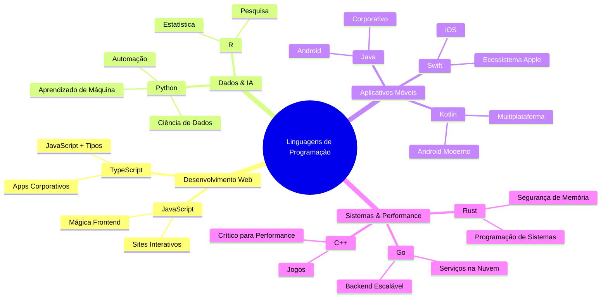
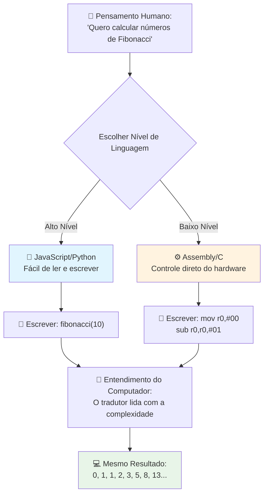
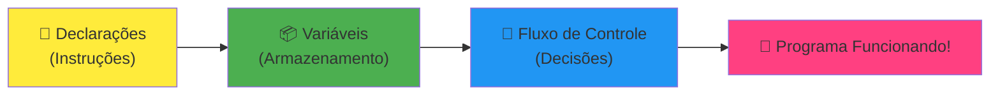
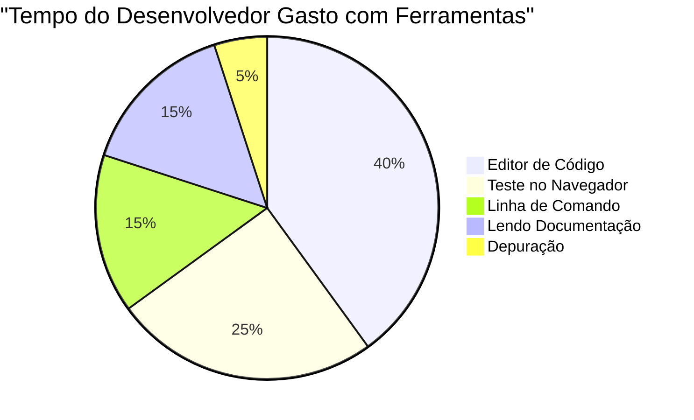

# Introdução a Linguagens de Programação e Ferramentas Modernas para Desenvolvedores

Ei, futuro desenvolvedor! 👋 Posso te contar uma coisa que ainda me arrepia todos os dias? Você está prestes a descobrir que programar não é apenas sobre computadores – é sobre ter superpoderes reais para transformar suas ideias mais loucas em realidade!

Sabe aquele momento em que você está usando seu app favorito e tudo simplesmente funciona perfeitamente? Quando você toca em um botão e algo absolutamente mágico acontece que te faz pensar "uau, como eles FIZERAM isso?" Bem, alguém muito parecido com você – provavelmente sentado na sua cafeteria favorita às 2 da manhã tomando o terceiro espresso – escreveu o código que criou essa magia. E aqui vai algo que vai explodir sua mente: até o final desta aula, você não só vai entender como eles fizeram isso, mas vai estar morrendo de vontade de tentar você mesmo!

Olha, eu entendo perfeitamente se programação parecer intimidadora agora. Quando comecei, eu honestamente pensei que você precisava ser um gênio da matemática ou estar codando desde os cinco anos de idade. Mas aqui está o que mudou completamente minha perspectiva: programar é exatamente como aprender a ter conversas em uma nova língua. Você começa com "olá" e "obrigado", depois evolui para pedir um café, e antes que perceba, está tendo discussões filosóficas profundas! Só que, neste caso, você está conversando com computadores, e sinceramente? Eles são os interlocutores mais pacientes que você vai ter – nunca julgam seus erros e estão sempre animados para tentar de novo!

Hoje, vamos explorar as ferramentas incríveis que tornam o desenvolvimento web moderno não só possível, mas seriamente viciante. Estou falando dos mesmos editores, navegadores e fluxos de trabalho que desenvolvedores da Netflix, Spotify e seu estúdio indie favorito usam todos os dias. E aqui está a parte que vai fazer você querer dançar de alegria: a maioria dessas ferramentas profissionais, padrão da indústria, é totalmente gratuita!


> Sketchnote por [Tomomi Imura](https://twitter.com/girlie_mac)


## Vamos Ver o Que Você Já Sabe!

Antes de pular para as coisas divertidas, estou curioso – o que você já sabe sobre esse mundo da programação? E escuta, se ao olhar essas perguntas você está pensando "eu literalmente não faço ideia de nada disso," isso não é só ok, é perfeito! Isso significa que você está no lugar exato. Pense neste quiz como um alongamento antes do treino – estamos apenas aquecendo esses músculos do cérebro!

[Faça o quiz pré-aula](https://ff-quizzes.netlify.app/web/)


## A Aventura Que Vamos Fazer Juntos

Ok, estou realmente ansioso com o que vamos explorar hoje! Sério, queria poder ver sua cara quando alguns desses conceitos fizerem sentido. Aqui está a jornada incrível que vamos fazer juntos:

- **O que programação realmente é (e por que é a coisa mais legal do mundo!)** – Vamos descobrir como código é literalmente a mágica invisível que faz tudo ao seu redor funcionar, desde aquele despertador que de alguma forma sabe que é segunda-feira de manhã até o algoritmo que cria suas recomendações perfeitas na Netflix
- **Linguagens de programação e suas personalidades incríveis** – Imagine chegar numa festa onde cada pessoa tem superpoderes completamente diferentes e jeitos únicos de resolver problemas. É assim que é o mundo das linguagens de programação, e você vai amar conhecê-las!
- **Os blocos fundamentais que fazem a mágica digital acontecer** – Pense neles como o kit LEGO criativo definitivo. Depois que você entender como essas peças se encaixam, vai perceber que pode literalmente construir qualquer coisa que sua imaginação sonhar
- **Ferramentas profissionais que vão fazer você sentir que ganhou uma varinha de mágico** – Não estou exagerando – essas ferramentas vão mesmo fazer você se sentir com superpoderes, e o melhor? São as mesmas que os profissionais usam!

> 💡 **Aqui vai o segredo**: Não pense nem em tentar memorizar tudo hoje! Agora, eu só quero que você sinta aquela faísca de empolgação sobre o que é possível. Os detalhes vão fixar naturalmente à medida que praticarmos juntos – é assim que o aprendizado de verdade acontece!

> Você pode fazer esta aula no [Microsoft Learn](https://learn.microsoft.com/en-us/learn/modules/web-development-101/introduction-programming/?WT.mc_id=academic-77807-sagibbon)!

## Então, O Que Realmente *É* Programação?

Certo, vamos encarar a pergunta de um milhão de dólares: o que é programação, afinal?

Vou te contar uma história que mudou completamente a maneira como eu penso sobre isso. Semana passada, tentei explicar para minha mãe como usar o controle remoto inteligente da nossa nova TV. Me peguei dizendo coisas tipo "Aperte o botão vermelho, mas não o botão vermelho grande, o botão vermelho pequeno do lado esquerdo... não, o seu outro lado esquerdo... ok, agora segure por dois segundos, não um, não três..." Soa familiar? 😅

Isso é programação! É a arte de dar instruções incrivelmente detalhadas, passo a passo, para algo muito poderoso, mas que precisa que tudo seja explicado perfeitamente. Só que, em vez de explicar pra sua mãe (que pode perguntar "qual botão vermelho?!"), você está explicando para um computador (que faz exatamente o que você diz, mesmo que o que você disse não seja exatamente o que você quis dizer).

O que me surpreendeu quando aprendi isso: computadores, na verdade, são bastante simples em seu núcleo. Eles só entendem duas coisas – 1 e 0, que basicamente significam "sim" e "não" ou "ligado" e "desligado". Só isso! Mas aqui é onde fica mágico – não precisamos falar em 1s e 0s como se estivéssemos na Matrix. É aí que entram as **linguagens de programação**. Elas são como ter o melhor tradutor do mundo, que pega seus pensamentos humanos perfeitamente normais e os converte para a linguagem do computador.

E aqui está o que ainda me arrepia todas as manhãs quando acordo: literalmente *tudo* digital na sua vida começou com alguém como você, provavelmente de pijama, com uma xícara de café, digitando código no laptop. Aquele filtro do Instagram que te deixa impecável? Alguém codificou isso. A recomendação que te levou à sua música nova favorita? Um desenvolvedor criou aquele algoritmo. O app que ajuda você a dividir a conta do jantar com os amigos? Sim, alguém pensou "isso é chato, aposto que posso consertar isso" e então... fez!

Quando você aprende a programar, não está só adquirindo uma nova habilidade – está entrando para uma comunidade incrível de solucionadores de problemas que passam o dia pensando, "E se eu pudesse construir algo que deixasse o dia de alguém um pouco melhor?" Sério, existe coisa mais legal que isso?

✅ **Caça ao Fato Curioso**: Aqui vai algo super legal para pesquisar quando tiver um tempinho livre – quem você acha que foi o primeiro programador de computadores do mundo? Vou te dar uma dica: pode não ser quem você espera! A história dessa pessoa é absolutamente fascinante e mostra que programação sempre foi sobre criatividade, solucionar problemas e pensar fora da caixa.

### 🧠 **Hora do Check-in: Como Você Está Se Sentindo?**

**Reserve um momento para refletir:**
- A ideia de "dar instruções a computadores" faz sentido para você agora?
- Você consegue pensar em uma tarefa diária que gostaria de automatizar com programação?
- Quais perguntas estão surgindo na sua cabeça sobre essa coisa toda de programação?

> **Lembre-se**: É totalmente normal se alguns conceitos parecerem confusos agora. Aprender programação é como aprender uma nova língua – leva tempo para seu cérebro criar essas conexões neurais. Você está indo muito bem!

## Linguagens de Programação São Como Diferentes Sabores de Magia

Ok, isso vai parecer estranho, mas fique comigo – linguagens de programação são muito parecidas com diferentes estilos de música. Pense nisso: você tem jazz, que é suave e improvisado; rock, que é poderoso e direto; clássico, elegante e estruturado; e hip-hop, criativo e expressivo. Cada estilo tem sua vibe, sua comunidade de fãs apaixonados, e cada um é perfeito para diferentes humores e ocasiões.

Linguagens de programação funcionam exatamente assim! Você não usaria a mesma língua para criar um jogo mobile divertido e para processar massa enorme de dados climáticos, assim como você não tocaria death metal numa aula de yoga (bem, na maioria delas pelo menos! 😄).

Mas aqui está o que me impressiona toda vez que penso nisso: essas linguagens são como ter o intérprete mais paciente e brilhante do mundo sentado bem do seu lado. Você pode expressar suas ideias de um jeito que faça sentido para seu cérebro humano, e elas cuidam de todo o trabalho incrivelmente complexo de traduzir isso para os 1s e 0s que os computadores realmente falam. É como ter um amigo fluente em "criatividade humana" e "lógica computacional" – e ele nunca se cansa, nunca precisa de pausas para café, e nunca te julga por perguntar a mesma coisa duas vezes!

### Linguagens de Programação Populares e Seus Usos


| Linguagem | Melhor Para | Por Que É Popular |
|----------|----------|------------------|
| **JavaScript** | Desenvolvimento web, interfaces de usuário | Roda em navegadores e alimenta sites interativos |
| **Python** | Ciência de dados, automação, IA | Fácil de ler e aprender, bibliotecas poderosas |
| **Java** | Aplicações empresariais, apps Android | Independente de plataforma, robusto para sistemas grandes |
| **C#** | Aplicações Windows, desenvolvimento de jogos | Forte suporte do ecossistema Microsoft |
| **Go** | Serviços em nuvem, sistemas backend | Rápido, simples, projetado para computação moderna |

### Linguagens de Alto e Baixo Nível

Ok, esse foi sinceramente o conceito que me deixou confuso quando comecei a aprender, então vou compartilhar a analogia que finalmente fez tudo fazer sentido pra mim – e espero que ajude você também!

Imagine que você está visitando um país onde não fala o idioma e precisa desesperadamente achar o banheiro mais próximo (todos nós já passamos por isso, né? 😅):

- **Programação de baixo nível** é como aprender o dialeto local tão bem que você consegue conversar com a avó que vende frutas na esquina usando referências culturais, gírias locais e piadas internas que só quem cresceu lá entenderia. Super impressionante e muito eficiente... se você for fluente! Mas bem complicado quando só quer achar um banheiro.

- **Programação de alto nível** é como ter aquele amigo local incrível que simplesmente te entende. Você pode dizer "Preciso muito encontrar um banheiro" em inglês simples, e ele faz toda a tradução cultural e te dá as direções de um jeito que seu cérebro não local entende perfeitamente.

Em termos de programação:
- **Linguagens de baixo nível** (como Assembly ou C) deixam você falar com o hardware do computador em detalhes incrivelmente precisos, mas você precisa pensar como uma máquina, o que é... digamos que é uma mudança mental enorme!
- **Linguagens de alto nível** (como JavaScript, Python ou C#) deixam você pensar como um humano enquanto elas cuidam da linguagem da máquina nos bastidores. Além disso, essas linguagens têm comunidades super acolhedoras, cheias de gente que lembra como era ser iniciante e que realmente quer ajudar!

Adivinha por quais eu vou sugerir que você comece? 😉 Linguagens de alto nível são como rodinhas de treinamento que você nunca vai querer tirar porque deixam toda a experiência muito mais agradável!


### Deixe-me Mostrar Por Que Linguagens de Alto Nível São Muito Mais Amigáveis

Certo, vou te mostrar algo que demonstra perfeitamente por que me apaixonei pelas linguagens de alto nível, mas antes – preciso que me prometa uma coisa. Quando você ver esse primeiro exemplo de código, não entre em pânico! Ele é para parecer intimidador. Esse é exatamente o ponto!

Vamos ver a mesma tarefa escrita em dois estilos completamente diferentes. Ambas criam a chamada sequência de Fibonacci – um padrão matemático lindo onde cada número é a soma dos dois anteriores: 0, 1, 1, 2, 3, 5, 8, 13... (Curiosidade: você encontra esse padrão literalmente em toda a natureza – espirais de sementes de girassol, padrões de pinhas, até a forma como as galáxias se formam!)

Pronto para ver a diferença? Vamos lá!

**Linguagem de alto nível (JavaScript) – Amigável para humanos:**

```javascript
// Passo 1: Configuração básica de Fibonacci
const fibonacciCount = 10;
let current = 0;
let next = 1;

console.log('Fibonacci sequence:');
```

**Veja o que esse código faz:**
- **Declara** uma constante para especificar quantos números da sequência Fibonacci queremos gerar
- **Inicializa** duas variáveis para acompanhar o número atual e o próximo na sequência
- **Configura** os valores iniciais (0 e 1) que definem o padrão de Fibonacci
- **Exibe** uma mensagem de cabeçalho para identificar nossa saída

```javascript
// Passo 2: Gere a sequência com um loop
for (let i = 0; i < fibonacciCount; i++) {
  console.log(`Position ${i + 1}: ${current}`);
  
  // Calcule o próximo número na sequência
  const sum = current + next;
  current = next;
  next = sum;
}
```

**Entendendo o que acontece aqui:**
- **Percorre** cada posição da sequência usando um loop `for`
- **Mostra** cada número com sua posição usando formatação de template literals
- **Calcula** o próximo número Fibonacci somando os valores atual e próximo
- **Atualiza** as variáveis de acompanhamento para passar à próxima iteração

```javascript
// Passo 3: Abordagem funcional moderna
const generateFibonacci = (count) => {
  const sequence = [0, 1];
  
  for (let i = 2; i < count; i++) {
    sequence[i] = sequence[i - 1] + sequence[i - 2];
  }
  
  return sequence;
};

// Exemplo de uso
const fibSequence = generateFibonacci(10);
console.log(fibSequence);
```

**No código acima, nós:**
- **Criamos** uma função reutilizável usando a sintaxe moderna de arrow function
- **Construímos** um array para armazenar a sequência completa em vez de mostrar número por número
- **Usamos** indexação de array para calcular cada novo número a partir dos anteriores
- **Retornamos** a sequência completa para uso flexível em outras partes do programa

**Linguagem de baixo nível (Assembly ARM) – Amigável para computadores:**

```assembly
 area ascen,code,readonly
 entry
 code32
 adr r0,thumb+1
 bx r0
 code16
thumb
 mov r0,#00
 sub r0,r0,#01
 mov r1,#01
 mov r4,#10
 ldr r2,=0x40000000
back add r0,r1
 str r0,[r2]
 add r2,#04
 mov r3,r0
 mov r0,r1
 mov r1,r3
 sub r4,#01
 cmp r4,#00
 bne back
 end
```

Repare como a versão em JavaScript parece quase uma instrução em inglês, enquanto a versão em Assembly usa comandos criptografados que controlam diretamente o processador do computador. Ambos realizam exatamente a mesma tarefa, mas a linguagem de alto nível é muito mais fácil para humanos entenderem, escreverem e manterem.

**Diferenças chave que você vai notar:**
- **Legibilidade**: JavaScript usa nomes descritivos como `fibonacciCount`, enquanto Assembly usa rótulos criptografados como `r0`, `r1`
- **Comentários**: Linguagens de alto nível incentivam comentários explicativos que tornam o código auto-documentado
- **Estrutura**: O fluxo lógico do JavaScript corresponde a como os humanos pensam sobre problemas passo a passo
- **Manutenção**: Atualizar a versão JavaScript para diferentes requisitos é direto e claro

✅ **Sobre a sequência de Fibonacci**: Este padrão de números absolutamente lindo (onde cada número é a soma dos dois anteriores: 0, 1, 1, 2, 3, 5, 8...) aparece literalmente *em todo lugar* na natureza! Você o encontrará nas espirais dos girassóis, nos padrões das pinhas, na forma como as conchas de náutilos se curvam e até mesmo no crescimento dos galhos das árvores. É realmente impressionante como a matemática e o código podem nos ajudar a entender e recriar os padrões que a natureza usa para criar beleza!


## Os Blocos de Construção Que Fazem a Magia Acontecer

Certo, agora que você viu como as linguagens de programação funcionam na prática, vamos dividir as peças fundamentais que compõem literalmente todo programa já escrito. Pense nelas como os ingredientes essenciais da sua receita favorita – uma vez que você entender o que cada um faz, poderá ler e escrever código em praticamente qualquer linguagem!

Isso é meio que aprender a gramática da programação. Lembra quando na escola você aprendeu sobre substantivos, verbos e como montar frases? Programação tem sua própria versão de gramática e, honestamente, é muito mais lógica e tolerante do que a gramática do inglês já foi! 😄

### Declarações: As Instruções Passo a Passo

Vamos começar com **declarações** – elas são como frases individuais em uma conversa com seu computador. Cada declaração diz ao computador para fazer uma coisa específica, tipo dar instruções: "Vire à esquerda aqui", "Pare no sinal vermelho", "Estacione naquele lugar."

O que eu adoro nas declarações é o quão legíveis elas geralmente são. Veja só:

```javascript
// Declarações básicas que realizam ações únicas
const userName = "Alex";                    
console.log("Hello, world!");              
const sum = 5 + 3;                         
```

**Isto é o que este código faz:**
- **Declarar** uma variável constante para armazenar o nome de um usuário
- **Exibir** uma mensagem de saudação no console
- **Calcular** e armazenar o resultado de uma operação matemática

```javascript
// Declarações que interagem com páginas web
document.title = "My Awesome Website";      
document.body.style.backgroundColor = "lightblue";
```

**Passo a passo, veja o que está acontecendo:**
- **Modificar** o título da página que aparece na aba do navegador
- **Alterar** a cor de fundo de todo o corpo da página

### Variáveis: O Sistema de Memória do Seu Programa

Beleza, **variáveis** são honestamente um dos meus conceitos favoritos de ensinar porque são muito parecidas com coisas que você já usa todo dia!

Pense na sua lista de contatos do telefone por um segundo. Você não memoriza o número de telefone de todo mundo – ao invés disso, você salva "Mamãe", "Melhor Amigo" ou "Pizzaria que Entrega Até 2 da Manhã" e deixa o telefone lembrar os números reais. Variáveis funcionam exatamente da mesma forma! São como recipientes rotulados onde seu programa pode armazenar informações e recuperá-las depois usando um nome que realmente faz sentido.

Aqui está o que é realmente legal: as variáveis podem mudar conforme seu programa roda (daí o nome "variável" – sacou?). Assim como você atualiza o contato da pizzaria quando descobre um lugar melhor, as variáveis podem ser atualizadas conforme seu programa aprende novas informações ou quando as situações mudam!

Deixe eu te mostrar como isso pode ser lindamente simples:

```javascript
// Passo 1: Criando variáveis básicas
const siteName = "Weather Dashboard";        
let currentWeather = "sunny";               
let temperature = 75;                       
let isRaining = false;                      
```

**Entendendo esses conceitos:**
- **Armazenar** valores constantes em variáveis `const` (como o nome do site)
- **Usar** `let` para valores que podem mudar durante o programa
- **Atribuir** diferentes tipos de dados: strings (texto), números e booleanos (verdadeiro/falso)
- **Escolher** nomes descritivos que expliquem o que cada variável contém

```javascript
// Etapa 2: Trabalhando com objetos para agrupar dados relacionados
const weatherData = {                       
  location: "San Francisco",
  humidity: 65,
  windSpeed: 12
};
```

**No exemplo acima, nós:**
- **Criamos** um objeto para agrupar informações relacionadas ao clima
- **Organizamos** vários dados sob um nome de variável
- **Usamos** pares de chave-valor para rotular claramente cada informação

```javascript
// Etapa 3: Usando e atualizando variáveis
console.log(`${siteName}: Today is ${currentWeather} and ${temperature}°F`);
console.log(`Wind speed: ${weatherData.windSpeed} mph`);

// Atualizando variáveis mutáveis
currentWeather = "cloudy";                  
temperature = 68;                          
```

**Vamos entender cada parte:**
- **Exibir** informações usando template literals com a sintaxe `${}`
- **Acessar** propriedades do objeto usando a notação de ponto (`weatherData.windSpeed`)
- **Atualizar** variáveis declaradas com `let` para refletir condições que mudam
- **Combinar** múltiplas variáveis para criar mensagens significativas

```javascript
// Etapa 4: Desestruturação moderna para um código mais limpo
const { location, humidity } = weatherData; 
console.log(`${location} humidity: ${humidity}%`);
```

**O que você precisa saber:**
- **Extrair** propriedades específicas de objetos usando desestruturação
- **Criar** variáveis novas automaticamente com os mesmos nomes das chaves do objeto
- **Simplificar** o código evitando repetir a notação de ponto

### Fluxo de Controle: Ensinando Seu Programa a Pensar

Beleza, aqui é onde a programação fica absolutamente impressionante! **Fluxo de controle** é basicamente ensinar seu programa a tomar decisões inteligentes, exatamente como você faz todo dia sem nem pensar.

Imagine isso: hoje de manhã você provavelmente fez algo como "Se estiver chovendo, eu pego um guarda-chuva. Se estiver frio, eu visto um casaco. Se estiver atrasado, pulo o café da manhã e pego um café no caminho." Seu cérebro segue essa lógica if-then dezenas de vezes todos os dias!

É isso que faz os programas parecerem inteligentes e vivos em vez de apenas seguirem um script chato e previsível. Eles podem realmente olhar a situação, avaliar o que está acontecendo e responder adequadamente. É como dar um cérebro para seu programa que pode se adaptar e fazer escolhas!

Quer ver como isso funciona lindamente? Deixe eu te mostrar:

```javascript
// Etapa 1: Lógica condicional básica
const userAge = 17;

if (userAge >= 18) {
  console.log("You can vote!");
} else {
  const yearsToWait = 18 - userAge;
  console.log(`You'll be able to vote in ${yearsToWait} year(s).`);
}
```

**Este código faz o seguinte:**
- **Verifica** se a idade do usuário atende ao requisito para votar
- **Executa** blocos de código diferentes com base no resultado da condição
- **Calcula** e exibe quanto tempo falta para a elegibilidade ao voto caso seja menor de 18
- **Fornece** feedback específico e útil para cada cenário

```javascript
// Passo 2: Múltiplas condições com operadores lógicos
const userAge = 17;
const hasPermission = true;

if (userAge >= 18 && hasPermission) {
  console.log("Access granted: You can enter the venue.");
} else if (userAge >= 16) {
  console.log("You need parent permission to enter.");
} else {
  console.log("Sorry, you must be at least 16 years old.");
}
```

**Analisando o que acontece aqui:**
- **Combina** múltiplas condições usando o operador `&&` (e)
- **Cria** uma hierarquia de condições usando `else if` para vários cenários
- **Trata** todos os casos possíveis com uma declaração `else` final
- **Oferece** feedback claro e prático para cada situação diferente

```javascript
// Passo 3: Condicional concisa com operador ternário
const votingStatus = userAge >= 18 ? "Can vote" : "Cannot vote yet";
console.log(`Status: ${votingStatus}`);
```

**O que você precisa lembrar:**
- **Use** o operador ternário (`? :`) para condições simples com duas opções
- **Escreva** a condição primeiro, seguida de `?`, depois o resultado verdadeiro, em seguida `:`, e por fim o resultado falso
- **Aplique** esse padrão quando precisar atribuir valores conforme condições

```javascript
// Passo 4: Lidando com múltiplos casos específicos
const dayOfWeek = "Tuesday";

switch (dayOfWeek) {
  case "Monday":
  case "Tuesday":
  case "Wednesday":
  case "Thursday":
  case "Friday":
    console.log("It's a weekday - time to work!");
    break;
  case "Saturday":
  case "Sunday":
    console.log("It's the weekend - time to relax!");
    break;
  default:
    console.log("Invalid day of the week");
}
```

**Este código realiza o seguinte:**
- **Compara** o valor da variável com vários casos específicos
- **Agrupa** casos semelhantes (dias de semana vs. finais de semana)
- **Executa** o bloco de código apropriado quando encontra uma correspondência
- **Inclui** um caso `default` para lidar com valores inesperados
- **Usa** instruções `break` para evitar que o código continue para o próximo caso

> 💡 **Analogia no mundo real**: Pense no fluxo de controle como ter o GPS mais paciente do mundo te dando instruções. Ele pode dizer "Se houver trânsito na Rua Principal, pegue a rodovia. Se a construção bloquear a rodovia, tente o caminho cênico." Programas usam exatamente esse tipo de lógica condicional para responder de forma inteligente a diferentes situações e sempre oferecer a melhor experiência aos usuários.

### 🎯 **Verificação de Conceitos: Domínio dos Blocos de Construção**

**Vamos ver como você está indo com os fundamentos:**
- Consegue explicar, com suas próprias palavras, a diferença entre uma variável e uma declaração?
- Pense em um cenário do mundo real onde você usaria uma decisão if-then (como no nosso exemplo de votação)
- Qual foi uma coisa sobre a lógica de programação que te surpreendeu?

**Pequeno impulso de confiança:**

✅ **O que vem a seguir**: Vamos nos divertir muito mergulhando mais fundo nesses conceitos enquanto continuamos essa incrível jornada juntos! Por enquanto, foque em sentir essa empolgação sobre todas as possibilidades incríveis à sua frente. As habilidades e técnicas específicas vão surgir naturalmente conforme praticamos juntos – prometo que vai ser muito mais divertido do que você imagina!

## Ferramentas do Ofício

Certo, aqui é onde eu fico tão empolgado que mal consigo me controlar! 🚀 Vamos falar sobre as ferramentas incríveis que vão fazer você se sentir como se tivesse acabado de receber as chaves de uma nave espacial digital.

Sabe como um chef tem aquelas facas perfeitamente equilibradas que parecem extensões das mãos dele? Ou como um músico tem aquela guitarra que parece cantar no instante que ele a toca? Bem, desenvolvedores têm nossa própria versão dessas ferramentas mágicas, e aqui vai o que vai te impressionar de verdade – a maioria delas é completamente gratuita!

Estou praticamente pulando na cadeira pensando em compartilhar isso com você porque elas revolucionaram completamente a forma como construímos software. Estamos falando de assistentes de codificação com inteligência artificial que ajudam a escrever seu código (não estou brincando!), ambientes em nuvem onde você pode construir apps inteiros de literalmente qualquer lugar com Wi-Fi, e ferramentas de depuração tão sofisticadas que são como ter visão de raio-x para seus programas.

E aqui está a parte que ainda me arrepia: essas não são ferramentas "para iniciantes" que você vai superar rápido. São exatamente as mesmas ferramentas profissionais que desenvolvedores do Google, Netflix e daquele estúdio indie de apps que você adora estão usando neste exato momento. Você vai se sentir um fera usando elas!


### Editores de Código e IDEs: Seus Novos Melhores Amigos Digitais

Vamos falar sobre editores de código – eles estão prestes a se tornar seus lugares favoritos para passar o tempo! Pense neles como seu santuário pessoal de programação onde você vai passar a maior parte do tempo criando e aprimorando suas criações digitais.

Mas aqui está o que é absolutamente mágico nos editores modernos: eles não são apenas editores de texto sofisticados. São como ter o mentor de codificação mais brilhante e solidário sentado ao seu lado 24/7. Eles capturam seus erros de digitação antes que você os perceba, sugerem melhorias que fazem você parecer um gênio, ajudam você a entender o que cada pedaço de código faz e alguns até conseguem prever o que você vai digitar e oferecer para terminar seus pensamentos!

Lembro da primeira vez que descobri a auto-completação – me senti vivendo no futuro. Você começa a digitar algo, e seu editor fala: "Ei, você estava pensando nesta função que faz exatamente o que você precisa?" É como ter um leitor de mentes como seu parceiro de programação!

**O que faz esses editores serem tão incríveis?**

Editores de código modernos oferecem uma variedade impressionante de recursos para aumentar sua produtividade:

| Recurso | O que Faz | Por que Ajuda |
|---------|-----------|--------------|
| **Realce de Sintaxe** | Colore diferentes partes do seu código | Facilita a leitura do código e a identificação de erros |
| **Auto-completação** | Sugere código enquanto você digita | Acelera a codificação e reduz erros de digitação |
| **Ferramentas de Depuração** | Ajuda a encontrar e corrigir erros | Economiza horas de solução de problemas |
| **Extensões** | Adicionam funcionalidades especializadas | Personalize seu editor para qualquer tecnologia |
| **Assistentes de IA** | Sugerem código e explicações | Acelera o aprendizado e a produtividade |

> 🎥 **Recurso em Vídeo**: Quer ver essas ferramentas em ação? Confira este [vídeo Ferramentas do Ofício](https://youtube.com/watch?v=69WJeXGBdxg) para uma visão abrangente.

#### Editores Recomendados para Desenvolvimento Web

**[Visual Studio Code](https://code.visualstudio.com/?WT.mc_id=academic-77807-sagibbon)** (Gratuito)
- O mais popular entre desenvolvedores web
- Excelente ecossistema de extensões
- Terminal embutido e integração com Git
- **Extensões essenciais**:
  - [GitHub Copilot](https://marketplace.visualstudio.com/items?itemName=GitHub.copilot) - sugestões de código com IA
  - [Live Share](https://marketplace.visualstudio.com/items?itemName=MS-vsliveshare.vsliveshare) - colaboração em tempo real
  - [Prettier](https://marketplace.visualstudio.com/items?itemName=esbenp.prettier-vscode) - formatação automática de código
  - [Code Spell Checker](https://marketplace.visualstudio.com/items?itemName=streetsidesoftware.code-spell-checker) - detecta erros de digitação no código

**[JetBrains WebStorm](https://www.jetbrains.com/webstorm/)** (Pago, gratuito para estudantes)
- Ferramentas avançadas de depuração e testes
- Auto-completar inteligente
- Controle de versão embutido

**IDEs Baseadas em Nuvem** (Diferentes preços)
- [GitHub Codespaces](https://github.com/features/codespaces) - VS Code completo no navegador
- [Replit](https://replit.com/) - ótimo para aprender e compartilhar código
- [StackBlitz](https://stackblitz.com/) - desenvolvimento web full-stack instantâneo

> 💡 **Dica para Começar**: Comece com o Visual Studio Code – é gratuito, amplamente usado na indústria e tem uma comunidade enorme criando tutoriais e extensões úteis.


### Navegadores Web: Seu Laboratório Secreto de Desenvolvimento

Ok, prepare-se para ficar de queixo caído! Sabe como você tem usado os navegadores para passar pelas redes sociais e assistir vídeos? Bem, eles estavam escondendo esse laboratório secreto de desenvolvimento o tempo todo, só esperando você descobrir!

Toda vez que você clica com o botão direito em uma página e seleciona "Inspecionar Elemento," você abre um mundo oculto de ferramentas de desenvolvedor que são honestamente mais poderosas do que alguns softwares caros pelos quais eu costumava pagar centenas de dólares. É como descobrir que sua cozinha comum estava escondendo um laboratório de chef profissional atrás de um painel secreto!
A primeira vez que alguém me mostrou as DevTools do navegador, passei tipo três horas clicando em tudo e dizendo "ESPERA, ISSO TAMBÉM PODE?!" Você pode literalmente editar qualquer site em tempo real, ver exatamente a velocidade de carregamento de tudo, testar como seu site aparece em diferentes dispositivos e até debugar JavaScript como um profissional de verdade. É absolutamente impressionante!

**Aqui está o porquê dos navegadores serem sua arma secreta:**

Quando você cria um site ou uma aplicação web, precisa ver como ele se parece e se comporta no mundo real. Os navegadores não só exibem seu trabalho, como também fornecem feedback detalhado sobre desempenho, acessibilidade e possíveis problemas.

#### Ferramentas de Desenvolvedor do Navegador (DevTools)

Navegadores modernos incluem suítes de desenvolvimento completas:

| Categoria da Ferramenta | O Que Ela Faz | Exemplo de Uso |
|---------------|--------------|------------------|
| **Inspetor de Elementos** | Ver e editar HTML/CSS em tempo real | Ajustar estilos para ver resultados imediatos |
| **Console** | Visualizar mensagens de erro e testar JavaScript | Depurar problemas e experimentar com código |
| **Monitor de Rede** | Acompanhar o carregamento de recursos | Otimizar desempenho e tempos de carregamento |
| **Verificador de Acessibilidade** | Testar design inclusivo | Garantir que seu site funcione para todos os usuários |
| **Simulador de Dispositivo** | Visualizar em diferentes tamanhos de tela | Testar design responsivo sem múltiplos dispositivos |

#### Navegadores Recomendados para Desenvolvimento

- **[Chrome](https://developers.google.com/web/tools/chrome-devtools/)** - DevTools padrão da indústria com documentação extensa
- **[Firefox](https://developer.mozilla.org/docs/Tools)** - Excelentes ferramentas para CSS Grid e acessibilidade
- **[Edge](https://docs.microsoft.com/microsoft-edge/devtools-guide-chromium/?WT.mc_id=academic-77807-sagibbon)** - Baseado no Chromium com recursos para desenvolvedores da Microsoft

> ⚠️ **Dica Importante para Testes:** Sempre teste seus sites em múltiplos navegadores! O que funciona perfeitamente no Chrome pode parecer diferente no Safari ou Firefox. Desenvolvedores profissionais testam em todos os principais navegadores para garantir experiências consistentes.

### Ferramentas de Linha de Comando: Sua Porta para Superpoderes de Desenvolvedor

Beleza, vamos ter um momento totalmente honesto sobre a linha de comando, porque eu quero que você ouça isso de alguém que realmente entende. Quando eu a vi pela primeira vez – só aquela tela preta assustadora com texto piscando – eu literalmente pensei: "Não, de jeito nenhum! Isso parece coisa de filme de hacker dos anos 80, e eu definitivamente não sou inteligente o suficiente para isso!" 😅

Mas aqui está o que eu gostaria que alguém tivesse me dito naquela época, e estou te dizendo agora: a linha de comando não é assustadora – é como ter uma conversa direta com seu computador. Pense nisso como a diferença entre pedir comida por um app sofisticado com fotos e menus (que é legal e fácil) versus entrar no seu restaurante favorito onde o chef sabe exatamente o que você gosta e prepara algo perfeito só porque você disse "surpreenda-me com algo incrível."

A linha de comando é onde os desenvolvedores se sentem como verdadeiros magos. Você digita algumas palavras que parecem mágicas (ok, são apenas comandos, mas parecem mágicas!), aperta enter, e PAH – você criou toda a estrutura de um projeto, instalou ferramentas poderosas do mundo todo ou lançou seu app na internet para milhões verem. Quando você experimenta esse poder pela primeira vez, é sinceramente viciante!

**Por que a linha de comando vai se tornar sua ferramenta favorita:**

Enquanto interfaces gráficas são ótimas para muitas tarefas, a linha de comando se destaca em automação, precisão e velocidade. Muitas ferramentas de desenvolvimento funcionam principalmente via linha de comando, e aprender a usá-las eficientemente pode melhorar muito sua produtividade.

```bash
# Etapa 1: Crie e navegue até o diretório do projeto
mkdir my-awesome-website
cd my-awesome-website
```

**Aqui está o que esse código faz:**
- **Cria** um novo diretório chamado "my-awesome-website" para seu projeto
- **Navega** para dentro do diretório recém-criado para começar a trabalhar

```bash
# Etapa 2: Inicialize o projeto com package.json
npm init -y

# Instale ferramentas modernas de desenvolvimento
npm install --save-dev vite prettier eslint
npm install --save-dev @eslint/js
```

**Passo a passo, veja o que está acontecendo:**
- **Inicializa** um novo projeto Node.js com as configurações padrão usando `npm init -y`
- **Instala** o Vite como uma ferramenta moderna de build para desenvolvimento rápido e builds de produção
- **Adiciona** o Prettier para formatação automática de código e o ESLint para verificações de qualidade
- **Usa** a flag `--save-dev` para marcar essas dependências como apenas para desenvolvimento

```bash
# Etapa 3: Crie a estrutura e os arquivos do projeto
mkdir src assets
echo '<!DOCTYPE html><html><head><title>My Site</title></head><body><h1>Hello World</h1></body></html>' > index.html

# Iniciar servidor de desenvolvimento
npx vite
```

**No exemplo acima, nós:**
- **Organizamos** nosso projeto criando pastas separadas para código-fonte e recursos
- **Geramos** um arquivo HTML básico com a estrutura correta do documento
- **Iniciamos** o servidor de desenvolvimento do Vite para recarga ao vivo e substituição a quente de módulos

#### Ferramentas Essenciais de Linha de Comando para Desenvolvimento Web

| Ferramenta | Propósito | Por Que Você Precisa |
|------|---------|-----------------|
| **[Git](https://git-scm.com/)** | Controle de versão | Rastrear mudanças, colaborar, fazer backup do seu trabalho |
| **[Node.js & npm](https://nodejs.org/)** | Runtime JavaScript & gerenciador de pacotes | Executar JavaScript fora do navegador, instalar ferramentas modernas |
| **[Vite](https://vitejs.dev/)** | Ferramenta de build & servidor de desenvolvimento | Desenvolvimento super-rápido com hot module replacement |
| **[ESLint](https://eslint.org/)** | Qualidade de código | Encontrar e corrigir problemas automaticamente no JavaScript |
| **[Prettier](https://prettier.io/)** | Formatação de código | Manter o código consistente e legível |

#### Opções Específicas para Plataformas

**Windows:**
- **[Windows Terminal](https://docs.microsoft.com/windows/terminal/?WT.mc_id=academic-77807-sagibbon)** - Terminal moderno com muitos recursos
- **[PowerShell](https://docs.microsoft.com/powershell/?WT.mc_id=academic-77807-sagibbon)** 💻 - Ambiente poderoso para scripts
- **[Prompt de Comando](https://docs.microsoft.com/windows-server/administration/windows-commands/?WT.mc_id=academic-77807-sagibbon)** 💻 - Linha de comando tradicional do Windows

**macOS:**
- **[Terminal](https://support.apple.com/guide/terminal/)** 💻 - Aplicativo de terminal embutido
- **[iTerm2](https://iterm2.com/)** - Terminal aprimorado com recursos avançados

**Linux:**
- **[Bash](https://www.gnu.org/software/bash/)** 💻 - Shell padrão do Linux
- **[KDE Konsole](https://docs.kde.org/trunk5/en/konsole/konsole/index.html)** - Emulador de terminal avançado

> 💻 = Pré-instalado no sistema operacional

> 🎯 **Caminho de Aprendizagem:** Comece com comandos básicos como `cd` (mudar diretório), `ls` ou `dir` (listar arquivos) e `mkdir` (criar pasta). Pratique com comandos modernos de fluxo de trabalho como `npm install`, `git status` e `code .` (abre o diretório atual no VS Code). À medida que ganhar confiança, você naturalmente aprenderá comandos avançados e técnicas de automação.

### Documentação: Seu Mentor de Aprendizado Sempre Disponível

Ok, deixe eu contar um segredinho que vai te fazer se sentir muito melhor por ser iniciante: até os desenvolvedores mais experientes gastam uma boa parte do tempo lendo documentação. E não é porque eles não sabem o que estão fazendo – na verdade, isso é sinal de sabedoria!

Pense na documentação como ter acesso aos professores mais pacientes e conhecedores do mundo, disponíveis 24 horas por dia. Travado num problema às 2 da manhã? A documentação está lá com um abraço virtual e exatamente a resposta que você precisa. Quer aprender sobre algum recurso novo que todo mundo está comentando? A documentação te ajuda com exemplos passo a passo. Tentando entender por que algo funciona de determinada forma? Você já sabe – a documentação está pronta para explicar de um jeito que finalmente faça sentido!

Aqui vai algo que mudou completamente minha visão: o mundo do desenvolvimento web se move muito rápido, e ninguém (absolutamente ninguém!) decorou tudo. Já vi desenvolvedores seniores com mais de 15 anos de experiência consultar a sintaxe básica, e quer saber? Isso não é vergonhoso – é inteligente! Não é sobre ter memória perfeita; é sobre saber onde achar respostas confiáveis rapidamente e entender como aplicá-las.

**É aqui que a verdadeira mágica acontece:**

Desenvolvedores profissionais gastam uma parte significativa do tempo lendo documentação – não porque não sabem o que estão fazendo, mas porque o cenário do desenvolvimento web evolui tão rápido que se manter atualizado exige aprendizado contínuo. Uma boa documentação ajuda a entender não apenas *como* usar algo, mas *por que* e *quando* usá-lo.

#### Recursos Essenciais de Documentação

**[Mozilla Developer Network (MDN)](https://developer.mozilla.org/docs/Web)**  
- O padrão ouro para documentação de tecnologias web  
- Guias completos para HTML, CSS e JavaScript  
- Inclui informações sobre compatibilidade com navegadores  
- Oferece exemplos práticos e demos interativas  

**[Web.dev](https://web.dev)** (do Google)  
- Melhores práticas modernas de desenvolvimento web  
- Guias de otimização de desempenho  
- Princípios de acessibilidade e design inclusivo  
- Estudos de caso de projetos reais  

**[Microsoft Developer Documentation](https://docs.microsoft.com/microsoft-edge/#microsoft-edge-for-developers)**  
- Recursos para desenvolvimento no navegador Edge  
- Guias de Progressive Web Apps  
- Insights para desenvolvimento multiplataforma  

**[Frontend Masters Learning Paths](https://frontendmasters.com/learn/)**  
- Currículos estruturados de aprendizagem  
- Cursos em vídeo com especialistas do setor  
- Exercícios práticos de programação  

> 📚 **Estratégia de Estudo:** Não tente decorar a documentação – em vez disso, aprenda a navegar nela eficientemente. Salve referências usadas com frequência e pratique usar a função de busca para encontrar informações específicas rapidamente.

### 🔧 **Cheque de Domínio das Ferramentas: Com o Que Você Se Identifica?**

**Tire um momento para pensar:**
- Qual ferramenta você está mais animado para experimentar primeiro? (Não existe resposta errada!)
- A linha de comando ainda parece intimidante, ou você está curioso para ela?
- Você consegue imaginar usar as DevTools do navegador para espiar por trás da cortina dos seus sites favoritos?


> **Curiosidade divertida**: A maioria dos desenvolvedores passa cerca de 40% do tempo no editor de código, mas repare quanto tempo vai para testes, aprendizado e resolução de problemas. Programar não é só escrever código – é criar experiências!

✅ **Para refletir**: Aqui vai uma questão interessante – como você acha que as ferramentas para construir sites (desenvolvimento) podem ser diferentes das ferramentas para projetar sua aparência (design)? É como a diferença entre um arquiteto que projeta uma casa bonita e o empreiteiro que realmente a constrói. Ambos são cruciais, mas precisam de caixas de ferramentas diferentes! Esse tipo de pensamento vai te ajudar a enxergar o panorama geral de como os sites ganham vida.

## Desafio Agente GitHub Copilot 🚀

Use o modo Agente para completar o seguinte desafio:

**Descrição:** Explore as funcionalidades de um editor de código moderno ou IDE e demonstre como ele pode melhorar seu fluxo de trabalho como desenvolvedor web.

**Prompt:** Escolha um editor de código ou IDE (como Visual Studio Code, WebStorm ou um IDE baseado na nuvem). Liste três recursos ou extensões que te ajudam a escrever, depurar ou manter código com mais eficiência. Para cada um, forneça uma breve explicação de como beneficia seu fluxo de trabalho.

---

## 🚀 Desafio

**Beleza, detetive, pronto para seu primeiro caso?**

Agora que você tem essa base incrível, tenho uma aventura que vai te ajudar a ver o quão incrivelmente diverso e fascinante o mundo da programação realmente é. E escute – isso não é sobre escrever código ainda, então nada de pressão! Pense em você como um detetive de linguagens de programação no seu primeiro caso emocionante!

**Sua missão, caso aceite:**
1. **Se torne um explorador de linguagens**: Escolha três linguagens de programação de universos completamente diferentes – talvez uma para construir sites, outra para criar apps móveis e outra para analisar dados para cientistas. Encontre exemplos da mesma tarefa simples escritos em cada linguagem. Eu prometo que você vai ficar absolutamente impressionado como podem ser tão diferentes e ainda fazer exatamente a mesma coisa!

2. **Descubra suas histórias de origem**: O que torna cada linguagem especial? Aqui vai um fato legal – toda linguagem de programação foi criada porque alguém pensou, "Sabe de uma coisa? Precisa haver uma forma melhor de resolver esse problema específico." Consegue descobrir quais eram esses problemas? Algumas dessas histórias são realmente fascinantes!

3. **Conheça as comunidades**: Confira como é a recepção e o entusiasmo das comunidades de cada linguagem. Algumas têm milhões de desenvolvedores compartilhando conhecimento e ajudando uns aos outros, outras são menores mas super unidas e apoiadoras. Você vai adorar conhecer as diferentes personalidades dessas comunidades!

4. **Siga seu instinto**: Qual linguagem parece mais acessível para você agora? Não se preocupe em fazer a escolha "perfeita" – ouça seu feeling! Não existe resposta errada aqui, e você sempre pode explorar outras depois.

**Trabalho extra do detetive:** Veja se consegue descobrir quais grandes sites ou apps são construídos com cada linguagem. Garanto que vai se surpreender ao saber o que move Instagram, Netflix ou aquele jogo mobile que você não para de jogar!

> 💡 **Lembre-se**: Você não está tentando se tornar um expert em nenhuma dessas linguagens hoje. Você está apenas conhecendo a vizinhança antes de decidir onde quer se estabelecer. Vá com calma, divirta-se e deixe sua curiosidade te guiar!

## Vamos Celebrar Tudo o Que Você Descobriu!

Nossa, você absorveu tanta informação incrível hoje! Estou genuinamente animado para ver quanto dessa jornada maravilhosa ficou com você. E lembre-se – isso não é uma prova em que você precisa acertar tudo. É mais uma celebração de tudo o que você aprendeu sobre esse mundo fascinante que está prestes a explorar!

[Faça o quiz após a aula](https://ff-quizzes.netlify.app/web/)

## Revisão & Autoestudo

**Tire seu tempo para explorar e se divertir!**
Você percorreu um longo caminho hoje, e isso é algo para se orgulhar! Agora vem a parte divertida – explorar os tópicos que despertaram sua curiosidade. Lembre-se, isso não é dever de casa – é uma aventura!

**Aprofunde-se no que te anima:**

**Comece a usar as linguagens de programação:**
- Visite os sites oficiais de 2-3 linguagens que chamaram sua atenção. Cada uma tem sua própria personalidade e história!
- Experimente alguns playgrounds de código online como [CodePen](https://codepen.io/), [JSFiddle](https://jsfiddle.net/), ou [Replit](https://replit.com/). Não tenha medo de experimentar – você não vai quebrar nada!
- Leia sobre como sua linguagem favorita surgiu. Sério, algumas dessas histórias de origem são fascinantes e vão ajudar você a entender por que as linguagens funcionam do jeito que funcionam.

**Fique familiarizado com suas novas ferramentas:**
- Baixe o Visual Studio Code se ainda não o fez – é gratuito e você vai adorar!
- Passe alguns minutos navegando pelo marketplace de Extensões. É como uma loja de apps para seu editor de código!
- Abra as Ferramentas de Desenvolvedor do seu navegador e explore um pouco. Não se preocupe em entender tudo – apenas familiarize-se com o que está lá.

**Junte-se à comunidade:**
- Siga algumas comunidades de desenvolvedores no [Dev.to](https://dev.to/), [Stack Overflow](https://stackoverflow.com/), ou [GitHub](https://github.com/). A comunidade de programação é extremamente receptiva a iniciantes!
- Assista a vídeos de programação para iniciantes no YouTube. Existem muitos criadores excelentes que lembram como é começar do zero.
- Considere participar de meetups locais ou comunidades online. Acredite, desenvolvedores adoram ajudar quem está começando!

> 🎯 **Ouça, aqui está o que quero que você lembre**: Você não precisa se tornar um mago da programação da noite para o dia! Agora, você está apenas conhecendo esse mundo incrível que está prestes a fazer parte. Vá com calma, aproveite a jornada e lembre-se – todo desenvolvedor que você admira já esteve exatamente onde você está agora, sentindo-se empolgado e talvez um pouco sobrecarregado. Isso é totalmente normal, e significa que você está no caminho certo!


## Assignment

[Reading the Docs](assignment.md)

> 💡 **Um pequeno empurrão para sua tarefa**: Eu adoraria ver você explorar algumas ferramentas que ainda não cobrimos! Pule os editores, navegadores e ferramentas de linha de comando de que já falamos – existe um universo incrível de ferramentas de desenvolvimento esperando para ser descoberto. Procure aquelas que são ativamente mantidas e têm comunidades vibrantes e prestativas (essas tendem a ter os melhores tutoriais e as pessoas mais solidárias quando você inevitavelmente ficar travado e precisar de uma ajuda amigável).

---

## 🚀 Seu Cronograma de Jornada na Programação

### ⚡ **O que você pode fazer nos próximos 5 minutos**
- [ ] Salvar nos favoritos 2-3 sites de linguagens de programação que chamaram sua atenção
- [ ] Baixar o Visual Studio Code se ainda não fez
- [ ] Abrir as DevTools do navegador (F12) e clicar por qualquer site
- [ ] Entrar em uma comunidade de programação (Dev.to, Reddit r/webdev, ou Stack Overflow)

### ⏰ **O que você pode realizar nesta hora**
- [ ] Completar o quiz pós-aula e refletir sobre suas respostas
- [ ] Configurar o VS Code com a extensão GitHub Copilot
- [ ] Experimentar um exemplo "Hello World" em 2 linguagens de programação online
- [ ] Assistir a um vídeo "Um dia na vida de um desenvolvedor" no YouTube
- [ ] Começar sua investigação sobre linguagens de programação (do desafio)

### 📅 **Sua aventura de uma semana**
- [ ] Completar a tarefa e explorar 3 novas ferramentas de desenvolvimento
- [ ] Seguir 5 desenvolvedores ou contas de programação nas redes sociais
- [ ] Tentar criar algo pequeno no CodePen ou Replit (mesmo que seja só "Olá, [Seu Nome]!")
- [ ] Ler um post de blog de um desenvolvedor sobre a jornada de codificação dele
- [ ] Participar de um meetup virtual ou assistir a uma palestra sobre programação
- [ ] Começar a aprender sua linguagem escolhida com tutoriais online

### 🗓️ **Sua transformação em um mês**
- [ ] Construir seu primeiro projeto pequeno (mesmo uma página web simples conta!)
- [ ] Contribuir para um projeto open-source (comece com correções na documentação)
- [ ] Mentorar alguém que está começando a jornada de programação
- [ ] Criar seu site portfólio de desenvolvedor
- [ ] Conectar-se com comunidades locais de desenvolvedores ou grupos de estudo
- [ ] Começar a planejar seu próximo marco de aprendizado

### 🎯 **Checagem final de reflexão**

**Antes de continuar, reserve um momento para celebrar:**
- Qual foi uma coisa sobre programação que te empolgou hoje?
- Qual ferramenta ou conceito você quer explorar primeiro?
- Como você se sente ao começar essa jornada na programação?
- Qual é uma pergunta que você gostaria de fazer a um desenvolvedor agora?


> 🌟 **Lembre-se**: Todo especialista já foi um iniciante. Todo desenvolvedor sênior já sentiu exatamente o que você sente agora – empolgado, talvez um pouco sobrecarregado, e definitivamente curioso sobre o que é possível. Você está em uma companhia incrível, e essa jornada vai ser sensacional. Bem-vindo ao maravilhoso mundo da programação! 🎉

---

<!-- CO-OP TRANSLATOR DISCLAIMER START -->
**Aviso Legal**:  
Este documento foi traduzido utilizando o serviço de tradução por IA [Co-op Translator](https://github.com/Azure/co-op-translator). Embora nos esforcemos para garantir a precisão, esteja ciente de que traduções automatizadas podem conter erros ou imprecisões. O documento original em seu idioma nativo deve ser considerado a fonte autorizada. Para informações críticas, recomenda-se tradução profissional feita por humanos. Não nos responsabilizamos por quaisquer mal-entendidos ou interpretações incorretas decorrentes do uso desta tradução.
<!-- CO-OP TRANSLATOR DISCLAIMER END -->