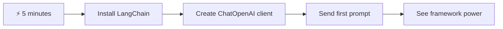
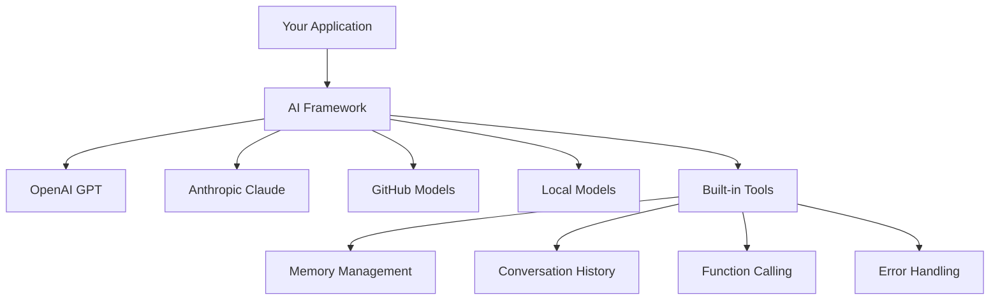
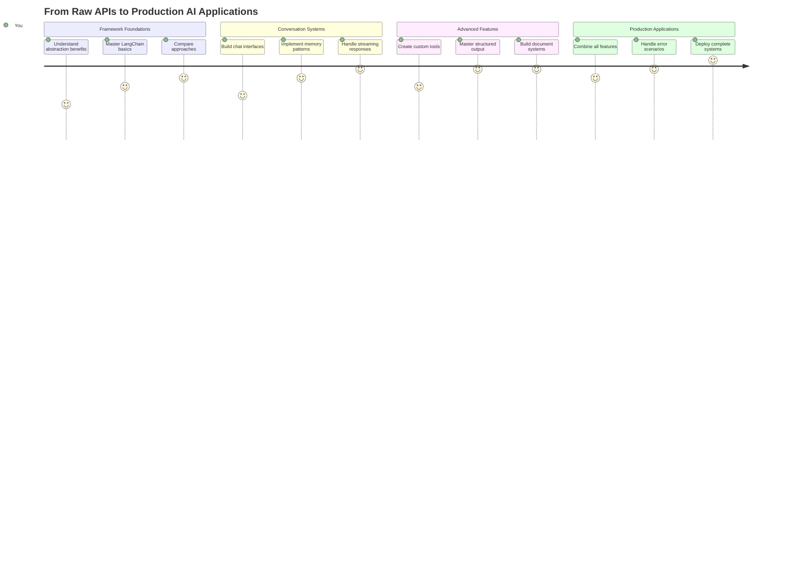
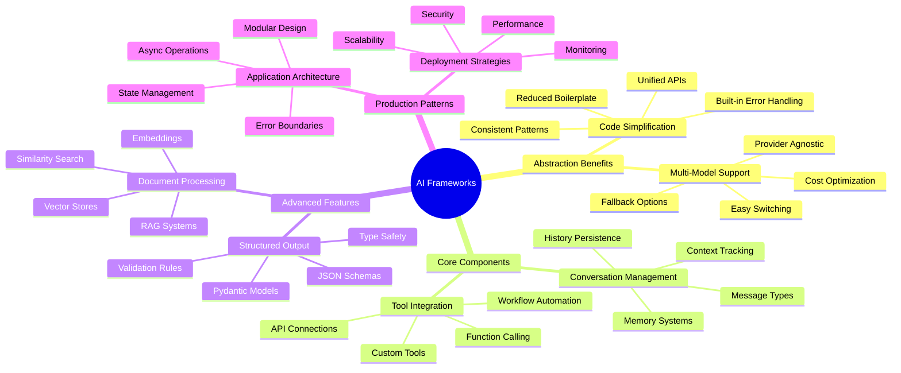
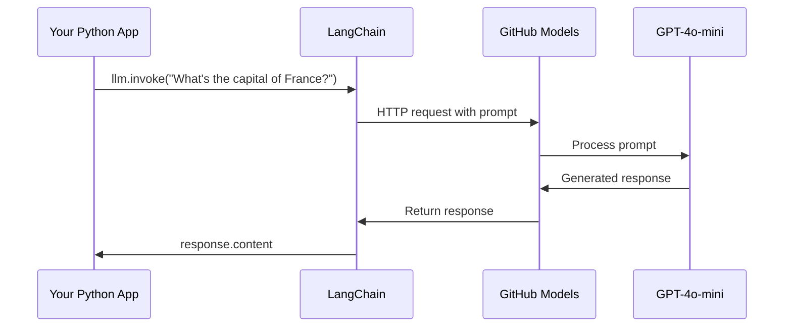
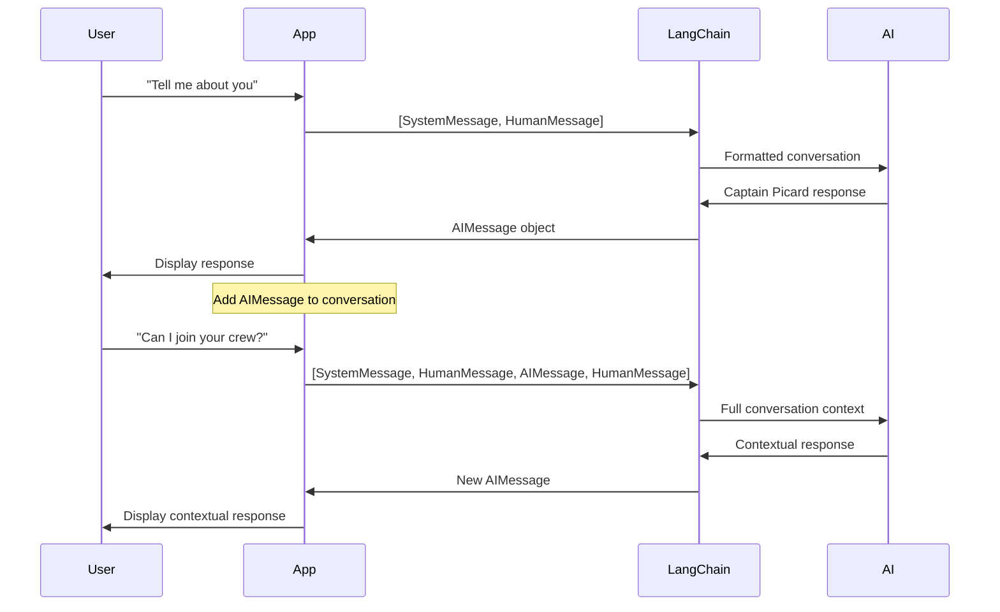
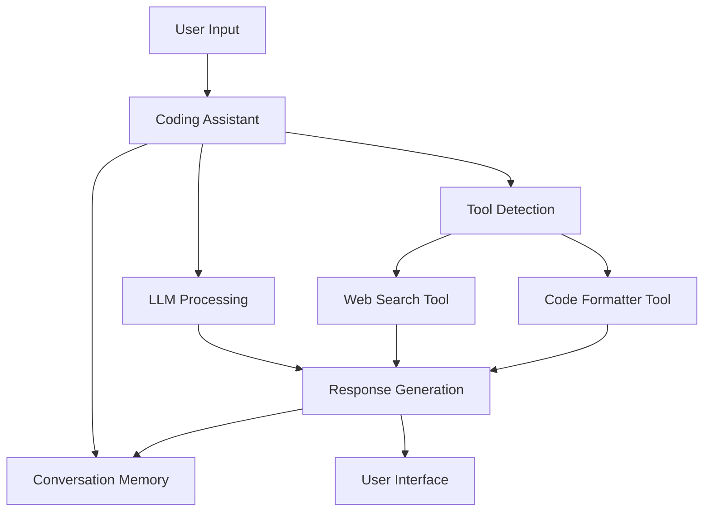
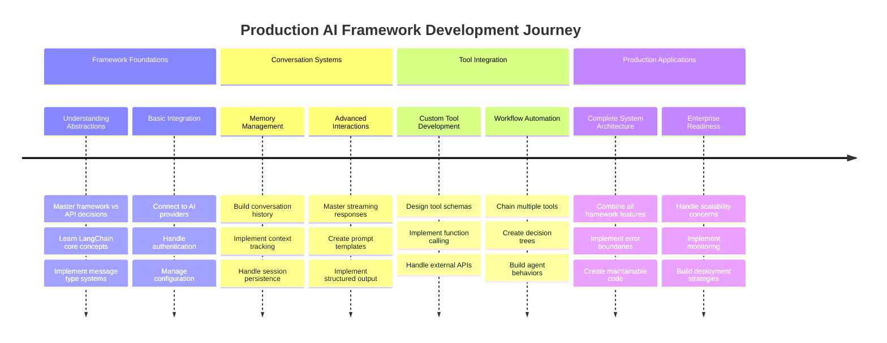
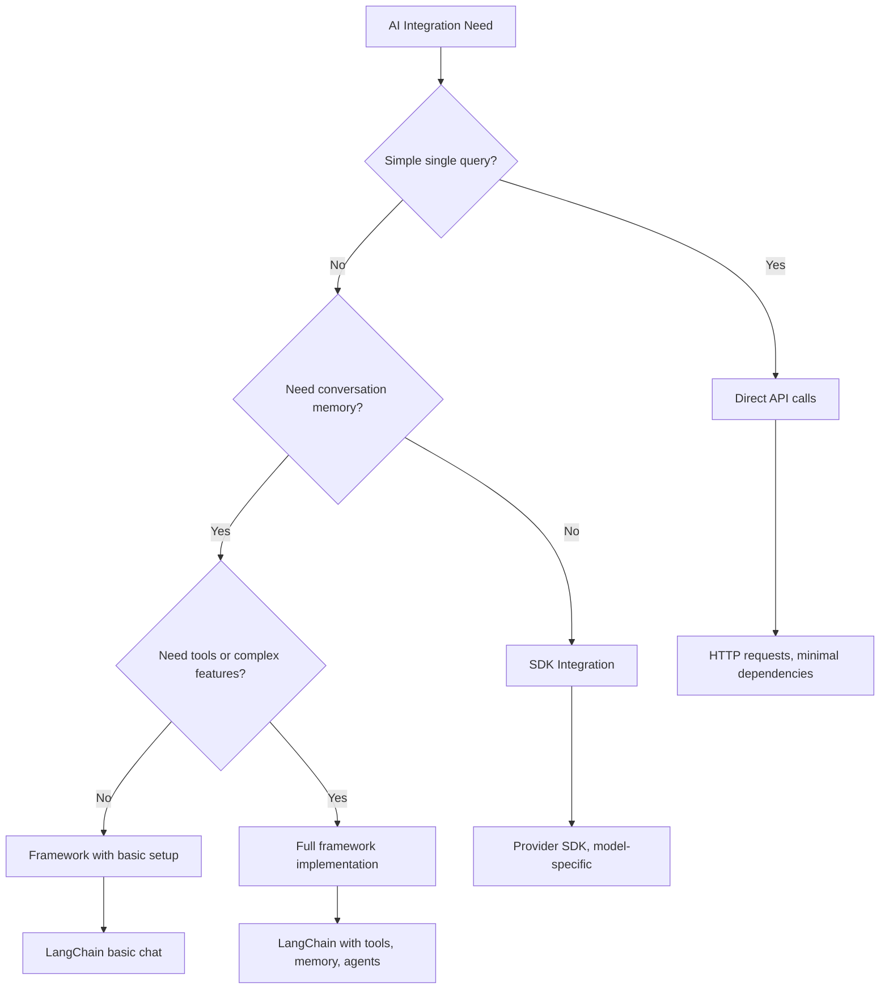

# Framework de IA

Já se sentiu sobrecarregado ao tentar construir aplicações de IA do zero? Você não está sozinho! Frameworks de IA são como um canivete suíço para o desenvolvimento de IA - ferramentas poderosas que podem economizar tempo e evitar dores de cabeça ao criar aplicações inteligentes. Pense em um framework de IA como uma biblioteca bem organizada: ele fornece componentes pré-construídos, APIs padronizadas e abstrações inteligentes para que você possa se concentrar em resolver problemas, em vez de lutar com detalhes de implementação.

Nesta lição, vamos explorar como frameworks como o LangChain podem transformar tarefas complexas de integração de IA em código limpo e legível. Você descobrirá como enfrentar desafios do mundo real, como acompanhar conversas, implementar chamadas de ferramentas e gerenciar diferentes modelos de IA por meio de uma interface unificada.

Ao final, você saberá quando usar frameworks em vez de chamadas de API diretas, como utilizar suas abstrações de forma eficaz e como construir aplicações de IA prontas para uso no mundo real. Vamos explorar o que os frameworks de IA podem fazer pelos seus projetos.

## ⚡ O que você pode fazer nos próximos 5 minutos

**Caminho Rápido para Desenvolvedores Ocupados**



- **Minuto 1**: Instale o LangChain: `pip install langchain langchain-openai`
- **Minuto 2**: Configure seu token do GitHub e importe o cliente ChatOpenAI
- **Minuto 3**: Crie uma conversa simples com mensagens do sistema e do usuário
- **Minuto 4**: Adicione uma ferramenta básica (como uma função de soma) e veja a chamada de ferramentas pela IA
- **Minuto 5**: Experimente a diferença entre chamadas de API diretas e abstração de frameworks

**Código de Teste Rápido**:
```python
from langchain_openai import ChatOpenAI
from langchain_core.messages import SystemMessage, HumanMessage

llm = ChatOpenAI(
    api_key=os.environ["GITHUB_TOKEN"],
    base_url="https://models.github.ai/inference",
    model="openai/gpt-4o-mini"
)

response = llm.invoke([
    SystemMessage(content="You are a helpful coding assistant"),
    HumanMessage(content="Explain Python functions briefly")
])
print(response.content)
```

**Por que isso importa**: Em 5 minutos, você experimentará como os frameworks de IA transformam integrações complexas de IA em chamadas de método simples. Esta é a base que alimenta aplicações de IA em produção.

## Por que escolher um framework?

Então você está pronto para construir um aplicativo de IA - incrível! Mas aqui está o ponto: você tem vários caminhos diferentes que pode seguir, e cada um tem seus próprios prós e contras. É como escolher entre caminhar, andar de bicicleta ou dirigir para chegar a algum lugar - todos vão te levar lá, mas a experiência (e o esforço) será totalmente diferente.

Vamos dividir as três principais maneiras de integrar IA em seus projetos:

| Abordagem | Vantagens | Melhor Para | Considerações |
|----------|------------|----------|--------------|
| **Requisições HTTP Diretas** | Controle total, sem dependências | Consultas simples, aprender fundamentos | Código mais verboso, tratamento de erros manual |
| **Integração com SDK** | Menos boilerplate, otimização específica do modelo | Aplicações de modelo único | Limitado a provedores específicos |
| **Frameworks de IA** | API unificada, abstrações integradas | Aplicações multi-modelo, fluxos de trabalho complexos | Curva de aprendizado, possível superabstração |

### Benefícios dos Frameworks na Prática



**Por que os frameworks são importantes:**
- **Unifica** vários provedores de IA em uma única interface
- **Gerencia** memória de conversação automaticamente
- **Fornece** ferramentas prontas para tarefas comuns como embeddings e chamadas de funções
- **Lida** com tratamento de erros e lógica de repetição
- **Transforma** fluxos de trabalho complexos em chamadas de método legíveis

> 💡 **Dica Profissional**: Use frameworks ao alternar entre diferentes modelos de IA ou ao construir recursos complexos como agentes, memória ou chamadas de ferramentas. Fique com APIs diretas ao aprender o básico ou ao construir aplicações simples e focadas.

**Conclusão**: Como escolher entre ferramentas especializadas de um artesão e uma oficina completa, trata-se de combinar a ferramenta com a tarefa. Frameworks são excelentes para aplicações complexas e ricas em recursos, enquanto APIs diretas funcionam bem para casos de uso simples.

## 🗺️ Sua Jornada de Aprendizado na Maestria de Frameworks de IA



**Destino da sua Jornada**: Ao final desta lição, você terá dominado o desenvolvimento de frameworks de IA e será capaz de construir aplicações de IA sofisticadas e prontas para produção que rivalizam com assistentes de IA comerciais.

## Introdução

Nesta lição, vamos aprender a:

- Usar um framework de IA comum.
- Resolver problemas comuns como conversas de chat, uso de ferramentas, memória e contexto.
- Aproveitar isso para construir aplicativos de IA.

## 🧠 Ecossistema de Desenvolvimento de Frameworks de IA



**Princípio Central**: Frameworks de IA abstraem a complexidade enquanto fornecem abstrações poderosas para gerenciamento de conversas, integração de ferramentas e processamento de documentos, permitindo que desenvolvedores construam aplicações de IA sofisticadas com código limpo e fácil de manter.

## Seu primeiro prompt de IA

Vamos começar com os fundamentos criando sua primeira aplicação de IA que envia uma pergunta e recebe uma resposta. Como Arquimedes descobrindo o princípio do deslocamento em seu banho, às vezes as observações mais simples levam aos insights mais poderosos - e os frameworks tornam esses insights acessíveis.

### Configurando LangChain com Modelos do GitHub

Vamos usar o LangChain para conectar aos Modelos do GitHub, o que é muito interessante porque oferece acesso gratuito a vários modelos de IA. A melhor parte? Você só precisa de alguns parâmetros de configuração simples para começar:

```python
from langchain_openai import ChatOpenAI
import os

llm = ChatOpenAI(
    api_key=os.environ["GITHUB_TOKEN"],
    base_url="https://models.github.ai/inference",
    model="openai/gpt-4o-mini",
)

# Send a simple prompt
response = llm.invoke("What's the capital of France?")
print(response.content)
```

**Vamos detalhar o que está acontecendo aqui:**
- **Cria** um cliente LangChain usando a classe `ChatOpenAI` - este é seu portal para a IA!
- **Configura** a conexão com os Modelos do GitHub com seu token de autenticação
- **Especifica** qual modelo de IA usar (`gpt-4o-mini`) - pense nisso como escolher seu assistente de IA
- **Envia** sua pergunta usando o método `invoke()` - é aqui que a mágica acontece
- **Extrai** e exibe a resposta - e voilà, você está conversando com a IA!

> 🔧 **Nota de Configuração**: Se você estiver usando o GitHub Codespaces, está com sorte - o `GITHUB_TOKEN` já está configurado para você! Trabalhando localmente? Sem problemas, você só precisará criar um token de acesso pessoal com as permissões corretas.

**Saída esperada:**
```text
The capital of France is Paris.
```



## Construindo IA conversacional

Esse primeiro exemplo demonstra o básico, mas é apenas uma troca única - você faz uma pergunta, recebe uma resposta e pronto. Em aplicações reais, você quer que sua IA se lembre do que você está discutindo, como Watson e Holmes construíram suas conversas investigativas ao longo do tempo.

É aqui que o LangChain se torna particularmente útil. Ele fornece diferentes tipos de mensagens que ajudam a estruturar conversas e permitem que você dê uma personalidade à sua IA. Você estará construindo experiências de chat que mantêm contexto e caráter.

### Entendendo os tipos de mensagens

Pense nesses tipos de mensagens como diferentes "papéis" que os participantes desempenham em uma conversa. O LangChain usa diferentes classes de mensagens para acompanhar quem está dizendo o quê:

| Tipo de Mensagem | Propósito | Exemplo de Caso de Uso |
|------------------|-----------|------------------------|
| `SystemMessage` | Define a personalidade e o comportamento da IA | "Você é um assistente de codificação útil" |
| `HumanMessage` | Representa a entrada do usuário | "Explique como funções funcionam" |
| `AIMessage` | Armazena respostas da IA | Respostas anteriores da IA na conversa |

### Criando sua primeira conversa

Vamos criar uma conversa onde nossa IA assume um papel específico. Vamos fazê-la incorporar o Capitão Picard - um personagem conhecido por sua sabedoria diplomática e liderança:

```python
messages = [
    SystemMessage(content="You are Captain Picard of the Starship Enterprise"),
    HumanMessage(content="Tell me about you"),
]
```

**Detalhando esta configuração de conversa:**
- **Estabelece** o papel e a personalidade da IA por meio de `SystemMessage`
- **Fornece** a consulta inicial do usuário via `HumanMessage`
- **Cria** uma base para conversas de múltiplas interações

O código completo para este exemplo é assim:

```python
from langchain_core.messages import HumanMessage, SystemMessage
from langchain_openai import ChatOpenAI
import os

llm = ChatOpenAI(
    api_key=os.environ["GITHUB_TOKEN"],
    base_url="https://models.github.ai/inference",
    model="openai/gpt-4o-mini",
)

messages = [
    SystemMessage(content="You are Captain Picard of the Starship Enterprise"),
    HumanMessage(content="Tell me about you"),
]


# works
response  = llm.invoke(messages)
print(response.content)
```

Você deve ver um resultado semelhante a:

```text
I am Captain Jean-Luc Picard, the commanding officer of the USS Enterprise (NCC-1701-D), a starship in the United Federation of Planets. My primary mission is to explore new worlds, seek out new life and new civilizations, and boldly go where no one has gone before. 

I believe in the importance of diplomacy, reason, and the pursuit of knowledge. My crew is diverse and skilled, and we often face challenges that test our resolve, ethics, and ingenuity. Throughout my career, I have encountered numerous species, grappled with complex moral dilemmas, and have consistently sought peaceful solutions to conflicts.

I hold the ideals of the Federation close to my heart, believing in the importance of cooperation, understanding, and respect for all sentient beings. My experiences have shaped my leadership style, and I strive to be a thoughtful and just captain. How may I assist you further?
```

Para manter a continuidade da conversa (em vez de redefinir o contexto a cada vez), você precisa continuar adicionando respostas à sua lista de mensagens. Como as tradições orais que preservaram histórias ao longo de gerações, essa abordagem constrói uma memória duradoura:

```python
from langchain_core.messages import HumanMessage, SystemMessage
from langchain_openai import ChatOpenAI
import os

llm = ChatOpenAI(
    api_key=os.environ["GITHUB_TOKEN"],
    base_url="https://models.github.ai/inference",
    model="openai/gpt-4o-mini",
)

messages = [
    SystemMessage(content="You are Captain Picard of the Starship Enterprise"),
    HumanMessage(content="Tell me about you"),
]


# works
response  = llm.invoke(messages)

print(response.content)

print("---- Next ----")

messages.append(response)
messages.append(HumanMessage(content="Now that I know about you, I'm Chris, can I be in your crew?"))

response  = llm.invoke(messages)

print(response.content)

```

Bem legal, certo? O que está acontecendo aqui é que estamos chamando o LLM duas vezes - primeiro com apenas nossas duas mensagens iniciais, mas depois novamente com todo o histórico da conversa. É como se a IA estivesse realmente acompanhando nosso bate-papo!

Quando você executar este código, receberá uma segunda resposta que soa algo como:

```text
Welcome aboard, Chris! It's always a pleasure to meet those who share a passion for exploration and discovery. While I cannot formally offer you a position on the Enterprise right now, I encourage you to pursue your aspirations. We are always in need of talented individuals with diverse skills and backgrounds. 

If you are interested in space exploration, consider education and training in the sciences, engineering, or diplomacy. The values of curiosity, resilience, and teamwork are crucial in Starfleet. Should you ever find yourself on a starship, remember to uphold the principles of the Federation: peace, understanding, and respect for all beings. Your journey can lead you to remarkable adventures, whether in the stars or on the ground. Engage!
```



Vou considerar isso como um "talvez" ;)

## Respostas em streaming

Já reparou como o ChatGPT parece "digitar" suas respostas em tempo real? Isso é streaming em ação. Como assistir a um calígrafo habilidoso trabalhando - vendo os caracteres aparecerem traço por traço em vez de materializarem instantaneamente - o streaming torna a interação mais natural e fornece feedback imediato.

### Implementando streaming com LangChain

```python
from langchain_openai import ChatOpenAI
import os

llm = ChatOpenAI(
    api_key=os.environ["GITHUB_TOKEN"],
    base_url="https://models.github.ai/inference",
    model="openai/gpt-4o-mini",
    streaming=True
)

# Stream the response
for chunk in llm.stream("Write a short story about a robot learning to code"):
    print(chunk.content, end="", flush=True)
```

**Por que o streaming é incrível:**
- **Mostra** o conteúdo enquanto está sendo criado - nada de espera constrangedora!
- **Faz** os usuários sentirem que algo está realmente acontecendo
- **Parece** mais rápido, mesmo quando tecnicamente não é
- **Permite** que os usuários comecem a ler enquanto a IA ainda está "pensando"

> 💡 **Dica de Experiência do Usuário**: O streaming realmente brilha quando você está lidando com respostas mais longas, como explicações de código, escrita criativa ou tutoriais detalhados. Seus usuários vão adorar ver o progresso em vez de encarar uma tela em branco!

### 🎯 Verificação Pedagógica: Benefícios da Abstração de Frameworks

**Pausa e Reflexão**: Você acabou de experimentar o poder das abstrações de frameworks de IA. Compare o que aprendeu com chamadas de API diretas de lições anteriores.

**Autoavaliação Rápida**:
- Você consegue explicar como o LangChain simplifica o gerenciamento de conversas em comparação com o rastreamento manual de mensagens?
- Qual é a diferença entre os métodos `invoke()` e `stream()`, e quando você usaria cada um?
- Como o sistema de tipos de mensagens do framework melhora a organização do código?

**Conexão com o Mundo Real**: Os padrões de abstração que você aprendeu (tipos de mensagens, interfaces de streaming, memória de conversação) são usados em todas as principais aplicações de IA - desde a interface do ChatGPT até a assistência de código do GitHub Copilot. Você está dominando os mesmos padrões arquitetônicos usados por equipes profissionais de desenvolvimento de IA.

**Pergunta Desafiadora**: Como você projetaria uma abstração de framework para lidar com diferentes provedores de modelos de IA (OpenAI, Anthropic, Google) com uma única interface? Considere os benefícios e as desvantagens.

## Templates de prompts

Templates de prompts funcionam como as estruturas retóricas usadas na oratória clássica - pense em como Cícero adaptaria seus padrões de discurso para diferentes públicos enquanto mantinha o mesmo framework persuasivo. Eles permitem criar prompts reutilizáveis onde você pode trocar diferentes partes de informação sem reescrever tudo do zero. Depois de configurar o template, basta preencher as variáveis com os valores necessários.

### Criando prompts reutilizáveis

```python
from langchain_core.prompts import ChatPromptTemplate

# Define a template for code explanations
template = ChatPromptTemplate.from_messages([
    ("system", "You are an expert programming instructor. Explain concepts clearly with examples."),
    ("human", "Explain {concept} in {language} with a practical example for {skill_level} developers")
])

# Use the template with different values
questions = [
    {"concept": "functions", "language": "JavaScript", "skill_level": "beginner"},
    {"concept": "classes", "language": "Python", "skill_level": "intermediate"},
    {"concept": "async/await", "language": "JavaScript", "skill_level": "advanced"}
]

for question in questions:
    prompt = template.format_messages(**question)
    response = llm.invoke(prompt)
    print(f"Topic: {question['concept']}\n{response.content}\n---\n")
```

**Por que você vai adorar usar templates:**
- **Mantém** seus prompts consistentes em todo o aplicativo
- **Nada de** concatenação de strings bagunçada - apenas variáveis limpas e simples
- **Sua IA** se comporta de forma previsível porque a estrutura permanece a mesma
- **Atualizações** são fáceis - altere o template uma vez e estará corrigido em todos os lugares

## Saída estruturada

Já ficou frustrado tentando analisar respostas de IA que chegam como texto não estruturado? Saída estruturada é como ensinar sua IA a seguir a abordagem sistemática que Lineu usou para classificação biológica - organizada, previsível e fácil de trabalhar. Você pode solicitar JSON, estruturas de dados específicas ou qualquer formato necessário.

### Definindo esquemas de saída

```python
from langchain_core.prompts import ChatPromptTemplate
from langchain_core.output_parsers import JsonOutputParser
from pydantic import BaseModel, Field

class CodeReview(BaseModel):
    score: int = Field(description="Code quality score from 1-10")
    strengths: list[str] = Field(description="List of code strengths")
    improvements: list[str] = Field(description="List of suggested improvements")
    overall_feedback: str = Field(description="Summary feedback")

# Set up the parser
parser = JsonOutputParser(pydantic_object=CodeReview)

# Create prompt with format instructions
prompt = ChatPromptTemplate.from_messages([
    ("system", "You are a code reviewer. {format_instructions}"),
    ("human", "Review this code: {code}")
])

# Format the prompt with instructions
chain = prompt | llm | parser

# Get structured response
code_sample = """
def calculate_average(numbers):
    return sum(numbers) / len(numbers)
"""

result = chain.invoke({
    "code": code_sample,
    "format_instructions": parser.get_format_instructions()
})

print(f"Score: {result['score']}")
print(f"Strengths: {', '.join(result['strengths'])}")
```

**Por que saída estruturada é um divisor de águas:**
- **Nada de** adivinhar o formato que você receberá - é consistente todas as vezes
- **Conecta-se** diretamente aos seus bancos de dados e APIs sem trabalho extra
- **Detecta** respostas estranhas da IA antes que elas quebrem seu aplicativo
- **Torna** seu código mais limpo porque você sabe exatamente com o que está lidando

## Chamadas de ferramentas

Agora chegamos a um dos recursos mais poderosos: ferramentas. É assim que você dá à sua IA capacidades práticas além da conversa. Como as guildas medievais desenvolveram ferramentas especializadas para ofícios específicos, você pode equipar sua IA com instrumentos focados. Você descreve quais ferramentas estão disponíveis e, quando alguém solicita algo que corresponda, sua IA pode agir.

### Usando Python

Vamos adicionar algumas ferramentas assim:

```python
from typing_extensions import Annotated, TypedDict

class add(TypedDict):
    """Add two integers."""

    # Annotations must have the type and can optionally include a default value and description (in that order).
    a: Annotated[int, ..., "First integer"]
    b: Annotated[int, ..., "Second integer"]

tools = [add]

functions = {
    "add": lambda a, b: a + b
}
```

Então, o que está acontecendo aqui? Estamos criando um modelo para uma ferramenta chamada `add`. Ao herdar de `TypedDict` e usar esses tipos elegantes `Annotated` para `a` e `b`, estamos dando ao LLM uma imagem clara do que essa ferramenta faz e do que ela precisa. O dicionário `functions` é como nossa caixa de ferramentas - ele informa ao código exatamente o que fazer quando a IA decide usar uma ferramenta específica.

Vamos ver como chamamos o LLM com essa ferramenta a seguir:

```python
llm = ChatOpenAI(
    api_key=os.environ["GITHUB_TOKEN"],
    base_url="https://models.github.ai/inference",
    model="openai/gpt-4o-mini",
)

llm_with_tools = llm.bind_tools(tools)
```

Aqui chamamos `bind_tools` com nosso array `tools` e, assim, o LLM `llm_with_tools` agora tem conhecimento dessa ferramenta.

Para usar esse novo LLM, podemos digitar o seguinte código:

```python
query = "What is 3 + 12?"

res = llm_with_tools.invoke(query)
if(res.tool_calls):
    for tool in res.tool_calls:
        print("TOOL CALL: ", functions[tool["name"]](../../../10-ai-framework-project/**tool["args"]))
print("CONTENT: ",res.content)
```

Agora que chamamos `invoke` nesse novo LLM, que tem ferramentas, talvez a propriedade `tool_calls` seja preenchida. Se for, qualquer ferramenta identificada terá uma propriedade `name` e `args` que identifica qual ferramenta deve ser chamada e com quais argumentos. O código completo é assim:

```python
from langchain_core.messages import HumanMessage, SystemMessage
from langchain_openai import ChatOpenAI
import os
from typing_extensions import Annotated, TypedDict

class add(TypedDict):
    """Add two integers."""

    # Annotations must have the type and can optionally include a default value and description (in that order).
    a: Annotated[int, ..., "First integer"]
    b: Annotated[int, ..., "Second integer"]

tools = [add]

functions = {
    "add": lambda a, b: a + b
}

llm = ChatOpenAI(
    api_key=os.environ["GITHUB_TOKEN"],
    base_url="https://models.github.ai/inference",
    model="openai/gpt-4o-mini",
)

llm_with_tools = llm.bind_tools(tools)

query = "What is 3 + 12?"

res = llm_with_tools.invoke(query)
if(res.tool_calls):
    for tool in res.tool_calls:
        print("TOOL CALL: ", functions[tool["name"]](../../../10-ai-framework-project/**tool["args"]))
print("CONTENT: ",res.content)
```

Ao executar este código, você deve ver uma saída semelhante a:

```text
TOOL CALL:  15
CONTENT: 
```

A IA examinou "Qual é 3 + 12" e reconheceu isso como uma tarefa para a ferramenta `add`. Como um bibliotecário habilidoso sabe qual referência consultar com base no tipo de pergunta feita, ela fez essa determinação a partir do nome, descrição e especificações de campo da ferramenta. O resultado de 15 vem do nosso dicionário `functions` executando a ferramenta:

```python
print("TOOL CALL: ", functions[tool["name"]](../../../10-ai-framework-project/**tool["args"]))
```

### Uma ferramenta mais interessante que chama uma API web
Adicionar números demonstra o conceito, mas ferramentas reais geralmente realizam operações mais complexas, como chamar APIs da web. Vamos expandir nosso exemplo para que a IA busque conteúdo da internet - semelhante a como operadores de telégrafo conectavam locais distantes:

```python
class joke(TypedDict):
    """Tell a joke."""

    # Annotations must have the type and can optionally include a default value and description (in that order).
    category: Annotated[str, ..., "The joke category"]

def get_joke(category: str) -> str:
    response = requests.get(f"https://api.chucknorris.io/jokes/random?category={category}", headers={"Accept": "application/json"})
    if response.status_code == 200:
        return response.json().get("value", f"Here's a {category} joke!")
    return f"Here's a {category} joke!"

functions = {
    "add": lambda a, b: a + b,
    "joke": lambda category: get_joke(category)
}

query = "Tell me a joke about animals"

# the rest of the code is the same
```

Agora, se você executar este código, receberá uma resposta dizendo algo como:

```text
TOOL CALL:  Chuck Norris once rode a nine foot grizzly bear through an automatic car wash, instead of taking a shower.
CONTENT:  
```

```mermaid
flowchart TD
    A[User Query: "Tell me a joke about animals"] --> B[LangChain Analysis]
    B --> C{Tool Available?}
    C -->|Yes| D[Select joke tool]
    C -->|No| E[Generate direct response]
    
    D --> F[Extract Parameters]
    F --> G[Call joke(category="animals")]
    G --> H[API Request to chucknorris.io]
    H --> I[Return joke content]
    I --> J[Display to user]
    
    E --> K[AI-generated response]
    K --> J
    
    subgraph "Tool Definition Layer"
        L[TypedDict Schema]
        M[Function Implementation]
        N[Parameter Validation]
    end
    
    D --> L
    F --> N
    G --> M
```

Aqui está o código completo:

```python
from langchain_openai import ChatOpenAI
import requests
import os
from typing_extensions import Annotated, TypedDict

class add(TypedDict):
    """Add two integers."""

    # Annotations must have the type and can optionally include a default value and description (in that order).
    a: Annotated[int, ..., "First integer"]
    b: Annotated[int, ..., "Second integer"]

class joke(TypedDict):
    """Tell a joke."""

    # Annotations must have the type and can optionally include a default value and description (in that order).
    category: Annotated[str, ..., "The joke category"]

tools = [add, joke]

def get_joke(category: str) -> str:
    response = requests.get(f"https://api.chucknorris.io/jokes/random?category={category}", headers={"Accept": "application/json"})
    if response.status_code == 200:
        return response.json().get("value", f"Here's a {category} joke!")
    return f"Here's a {category} joke!"

functions = {
    "add": lambda a, b: a + b,
    "joke": lambda category: get_joke(category)
}

llm = ChatOpenAI(
    api_key=os.environ["GITHUB_TOKEN"],
    base_url="https://models.github.ai/inference",
    model="openai/gpt-4o-mini",
)

llm_with_tools = llm.bind_tools(tools)

query = "Tell me a joke about animals"

res = llm_with_tools.invoke(query)
if(res.tool_calls):
    for tool in res.tool_calls:
        # print("TOOL CALL: ", tool)
        print("TOOL CALL: ", functions[tool["name"]](../../../10-ai-framework-project/**tool["args"]))
print("CONTENT: ",res.content)
```

## Embeddings e processamento de documentos

Embeddings representam uma das soluções mais elegantes na IA moderna. Imagine se você pudesse pegar qualquer texto e convertê-lo em coordenadas numéricas que capturam seu significado. É exatamente isso que os embeddings fazem - transformam texto em pontos em um espaço multidimensional onde conceitos semelhantes se agrupam. É como ter um sistema de coordenadas para ideias, semelhante a como Mendeleev organizou a tabela periódica com base nas propriedades atômicas.

### Criando e usando embeddings

```python
from langchain_openai import OpenAIEmbeddings
from langchain_community.vectorstores import FAISS
from langchain_community.document_loaders import TextLoader
from langchain.text_splitter import CharacterTextSplitter

# Initialize embeddings
embeddings = OpenAIEmbeddings(
    api_key=os.environ["GITHUB_TOKEN"],
    base_url="https://models.github.ai/inference",
    model="text-embedding-3-small"
)

# Load and split documents
loader = TextLoader("documentation.txt")
documents = loader.load()

text_splitter = CharacterTextSplitter(chunk_size=1000, chunk_overlap=0)
texts = text_splitter.split_documents(documents)

# Create vector store
vectorstore = FAISS.from_documents(texts, embeddings)

# Perform similarity search
query = "How do I handle user authentication?"
similar_docs = vectorstore.similarity_search(query, k=3)

for doc in similar_docs:
    print(f"Relevant content: {doc.page_content[:200]}...")
```

### Carregadores de documentos para vários formatos

```python
from langchain_community.document_loaders import (
    PyPDFLoader,
    CSVLoader,
    JSONLoader,
    WebBaseLoader
)

# Load different document types
pdf_loader = PyPDFLoader("manual.pdf")
csv_loader = CSVLoader("data.csv")
json_loader = JSONLoader("config.json")
web_loader = WebBaseLoader("https://example.com/docs")

# Process all documents
all_documents = []
for loader in [pdf_loader, csv_loader, json_loader, web_loader]:
    docs = loader.load()
    all_documents.extend(docs)
```

**O que você pode fazer com embeddings:**
- **Construir** buscas que realmente entendem o que você quer dizer, não apenas correspondência de palavras-chave
- **Criar** IA que pode responder perguntas sobre seus documentos
- **Fazer** sistemas de recomendação que sugerem conteúdo verdadeiramente relevante
- **Organizar automaticamente** e categorizar seu conteúdo

```mermaid
flowchart LR
    A[Documents] --> B[Text Splitter]
    B --> C[Create Embeddings]
    C --> D[Vector Store]
    
    E[User Query] --> F[Query Embedding]
    F --> G[Similarity Search]
    G --> D
    D --> H[Relevant Documents]
    H --> I[AI Response]
    
    subgraph "Vector Space"
        J[Document A: [0.1, 0.8, 0.3...]]
        K[Document B: [0.2, 0.7, 0.4...]]
        L[Query: [0.15, 0.75, 0.35...]]
    end
    
    C --> J
    C --> K
    F --> L
    G --> J
    G --> K
```

## Construindo uma aplicação completa de IA

Agora vamos integrar tudo o que você aprendeu em uma aplicação abrangente - um assistente de codificação que pode responder perguntas, usar ferramentas e manter memória de conversação. Assim como a prensa de impressão combinou tecnologias existentes (tipo móvel, tinta, papel e pressão) em algo transformador, vamos combinar nossos componentes de IA em algo prático e útil.

### Exemplo de aplicação completa

```python
from langchain_openai import ChatOpenAI, OpenAIEmbeddings
from langchain_core.prompts import ChatPromptTemplate
from langchain_core.messages import HumanMessage, SystemMessage, AIMessage
from langchain_community.vectorstores import FAISS
from typing_extensions import Annotated, TypedDict
import os
import requests

class CodingAssistant:
    def __init__(self):
        self.llm = ChatOpenAI(
            api_key=os.environ["GITHUB_TOKEN"],
            base_url="https://models.github.ai/inference",
            model="openai/gpt-4o-mini"
        )
        
        self.conversation_history = [
            SystemMessage(content="""You are an expert coding assistant. 
            Help users learn programming concepts, debug code, and write better software.
            Use tools when needed and maintain a helpful, encouraging tone.""")
        ]
        
        # Define tools
        self.setup_tools()
    
    def setup_tools(self):
        class web_search(TypedDict):
            """Search for programming documentation or examples."""
            query: Annotated[str, "Search query for programming help"]
        
        class code_formatter(TypedDict):
            """Format and validate code snippets."""
            code: Annotated[str, "Code to format"]
            language: Annotated[str, "Programming language"]
        
        self.tools = [web_search, code_formatter]
        self.llm_with_tools = self.llm.bind_tools(self.tools)
    
    def chat(self, user_input: str):
        # Add user message to conversation
        self.conversation_history.append(HumanMessage(content=user_input))
        
        # Get AI response
        response = self.llm_with_tools.invoke(self.conversation_history)
        
        # Handle tool calls if any
        if response.tool_calls:
            for tool_call in response.tool_calls:
                tool_result = self.execute_tool(tool_call)
                print(f"🔧 Tool used: {tool_call['name']}")
                print(f"📊 Result: {tool_result}")
        
        # Add AI response to conversation
        self.conversation_history.append(response)
        
        return response.content
    
    def execute_tool(self, tool_call):
        tool_name = tool_call['name']
        args = tool_call['args']
        
        if tool_name == 'web_search':
            return f"Found documentation for: {args['query']}"
        elif tool_name == 'code_formatter':
            return f"Formatted {args['language']} code: {args['code'][:50]}..."
        
        return "Tool execution completed"

# Usage example
assistant = CodingAssistant()

print("🤖 Coding Assistant Ready! Type 'quit' to exit.\n")

while True:
    user_input = input("You: ")
    if user_input.lower() == 'quit':
        break
    
    response = assistant.chat(user_input)
    print(f"🤖 Assistant: {response}\n")
```

**Arquitetura da aplicação:**



**Principais recursos que implementamos:**
- **Lembra** toda a sua conversa para continuidade de contexto
- **Realiza ações** através de chamadas de ferramentas, não apenas conversa
- **Segue** padrões de interação previsíveis
- **Gerencia** tratamento de erros e fluxos de trabalho complexos automaticamente

### 🎯 Verificação Pedagógica: Arquitetura de IA para Produção

**Compreensão da Arquitetura**: Você construiu uma aplicação completa de IA que combina gerenciamento de conversação, chamadas de ferramentas e fluxos de trabalho estruturados. Isso representa o desenvolvimento de aplicações de IA em nível de produção.

**Conceitos-chave dominados**:
- **Arquitetura baseada em classes**: Estrutura organizada e sustentável para aplicações de IA
- **Integração de ferramentas**: Funcionalidade personalizada além da conversa
- **Gerenciamento de memória**: Contexto persistente de conversação
- **Tratamento de erros**: Comportamento robusto da aplicação

**Conexão com a indústria**: Os padrões de arquitetura que você implementou (classes de conversação, sistemas de ferramentas, gerenciamento de memória) são os mesmos usados em aplicações de IA empresariais como o assistente de IA do Slack, GitHub Copilot e Microsoft Copilot. Você está construindo com pensamento arquitetônico de nível profissional.

**Pergunta de Reflexão**: Como você estenderia esta aplicação para lidar com múltiplos usuários, armazenamento persistente ou integração com bancos de dados externos? Considere os desafios de escalabilidade e gerenciamento de estado.

## Tarefa: Construa seu próprio assistente de estudo com IA

**Objetivo**: Crie uma aplicação de IA que ajude estudantes a aprender conceitos de programação fornecendo explicações, exemplos de código e questionários interativos.

### Requisitos

**Recursos principais (obrigatórios):**
1. **Interface de conversação**: Implemente um sistema de chat que mantenha o contexto em várias perguntas
2. **Ferramentas educacionais**: Crie pelo menos duas ferramentas que ajudem no aprendizado:
   - Ferramenta de explicação de código
   - Gerador de questionários sobre conceitos
3. **Aprendizado personalizado**: Use mensagens do sistema para adaptar respostas a diferentes níveis de habilidade
4. **Formatação de respostas**: Implemente saída estruturada para perguntas de questionário

### Etapas de implementação

**Etapa 1: Configure seu ambiente**
```bash
pip install langchain langchain-openai
```

**Etapa 2: Funcionalidade básica de chat**
- Crie uma classe `StudyAssistant`
- Implemente memória de conversação
- Adicione configuração de personalidade para suporte educacional

**Etapa 3: Adicione ferramentas educacionais**
- **Explicador de Código**: Divide o código em partes compreensíveis
- **Gerador de Questionários**: Cria perguntas sobre conceitos de programação
- **Rastreador de Progresso**: Acompanha os tópicos abordados

**Etapa 4: Recursos avançados (opcional)**
- Implemente respostas em streaming para melhor experiência do usuário
- Adicione carregamento de documentos para incorporar materiais de curso
- Crie embeddings para recuperação de conteúdo baseada em similaridade

### Critérios de avaliação

| Recurso               | Excelente (4) | Bom (3) | Satisfatório (2) | Precisa melhorar (1) |
|-----------------------|---------------|---------|------------------|-----------------------|
| **Fluxo de Conversação** | Respostas naturais e com contexto | Boa retenção de contexto | Conversa básica | Sem memória entre trocas |
| **Integração de Ferramentas** | Várias ferramentas úteis funcionando perfeitamente | 2+ ferramentas implementadas corretamente | 1-2 ferramentas básicas | Ferramentas não funcionais |
| **Qualidade do Código** | Limpo, bem documentado, com tratamento de erros | Boa estrutura, alguma documentação | Funcionalidade básica funciona | Estrutura ruim, sem tratamento de erros |
| **Valor Educacional** | Realmente útil para aprendizado, adaptativo | Bom suporte ao aprendizado | Explicações básicas | Benefício educacional limitado |

### Estrutura de código de exemplo

```python
class StudyAssistant:
    def __init__(self, skill_level="beginner"):
        # Initialize LLM, tools, and conversation memory
        pass
    
    def explain_code(self, code, language):
        # Tool: Explain how code works
        pass
    
    def generate_quiz(self, topic, difficulty):
        # Tool: Create practice questions
        pass
    
    def chat(self, user_input):
        # Main conversation interface
        pass

# Example usage
assistant = StudyAssistant(skill_level="intermediate")
response = assistant.chat("Explain how Python functions work")
```

**Desafios bônus:**
- Adicione capacidades de entrada/saída de voz
- Implemente uma interface web usando Streamlit ou Flask
- Crie uma base de conhecimento a partir de materiais de curso usando embeddings
- Adicione rastreamento de progresso e caminhos de aprendizado personalizados

## 📈 Linha do tempo de domínio do desenvolvimento de frameworks de IA



**🎓 Marco de Graduação**: Você dominou com sucesso o desenvolvimento de frameworks de IA usando as mesmas ferramentas e padrões que alimentam aplicações modernas de IA. Essas habilidades representam o estado da arte no desenvolvimento de aplicações de IA e preparam você para construir sistemas inteligentes de nível empresarial.

**🔄 Capacidades de próximo nível**:
- Pronto para explorar arquiteturas avançadas de IA (agentes, sistemas multiagentes)
- Preparado para construir sistemas RAG com bancos de dados vetoriais
- Equipado para criar aplicações de IA multimodais
- Base estabelecida para escalabilidade e otimização de aplicações de IA

## Resumo

🎉 Você agora dominou os fundamentos do desenvolvimento de frameworks de IA e aprendeu como construir aplicações sofisticadas de IA usando LangChain. Como completar um aprendizado abrangente, você adquiriu um conjunto substancial de habilidades. Vamos revisar o que você conquistou.

### O que você aprendeu

**Conceitos principais do framework:**
- **Benefícios do framework**: Entender quando escolher frameworks em vez de chamadas diretas de API
- **Fundamentos do LangChain**: Configurar e conectar modelos de IA
- **Tipos de mensagens**: Usar `SystemMessage`, `HumanMessage` e `AIMessage` para conversas estruturadas

**Recursos avançados:**
- **Chamadas de ferramentas**: Criar e integrar ferramentas personalizadas para capacidades aprimoradas de IA
- **Memória de conversação**: Manter o contexto em várias interações
- **Respostas em streaming**: Implementar entrega de respostas em tempo real
- **Templates de prompts**: Construir prompts reutilizáveis e dinâmicos
- **Saída estruturada**: Garantir respostas consistentes e analisáveis da IA
- **Embeddings**: Criar busca semântica e capacidades de processamento de documentos

**Aplicações práticas:**
- **Construção de aplicativos completos**: Combinar múltiplos recursos em aplicações prontas para produção
- **Tratamento de erros**: Implementar gerenciamento robusto de erros e validação
- **Integração de ferramentas**: Criar ferramentas personalizadas que ampliam as capacidades da IA

### Principais aprendizados

> 🎯 **Lembre-se**: Frameworks de IA como LangChain são basicamente seus melhores amigos para esconder complexidade e oferecer recursos avançados. Eles são perfeitos quando você precisa de memória de conversação, chamadas de ferramentas ou quer trabalhar com vários modelos de IA sem perder a sanidade.

**Framework de decisão para integração de IA:**



### Para onde ir a partir daqui?

**Comece a construir agora mesmo:**
- Pegue esses conceitos e crie algo que te empolgue!
- Experimente diferentes modelos de IA através do LangChain - é como ter um playground de modelos de IA
- Crie ferramentas que resolvam problemas reais que você enfrenta no trabalho ou em projetos

**Pronto para o próximo nível?**
- **Agentes de IA**: Construa sistemas de IA que possam planejar e executar tarefas complexas por conta própria
- **RAG (Geração Aumentada por Recuperação)**: Combine IA com suas próprias bases de conhecimento para aplicações superpotentes
- **IA Multimodal**: Trabalhe com texto, imagens e áudio juntos - as possibilidades são infinitas!
- **Implantação em Produção**: Aprenda como escalar suas aplicações de IA e monitorá-las no mundo real

**Junte-se à comunidade:**
- A comunidade LangChain é fantástica para se manter atualizado e aprender as melhores práticas
- Modelos do GitHub oferecem acesso a capacidades de IA de ponta - perfeito para experimentação
- Continue praticando com diferentes casos de uso - cada projeto ensinará algo novo

Agora você tem o conhecimento para construir aplicações inteligentes e conversacionais que podem ajudar as pessoas a resolver problemas reais. Como os artesãos do Renascimento que combinavam visão artística com habilidade técnica, você agora pode unir as capacidades da IA com aplicações práticas. A pergunta é: o que você vai criar? 🚀

## Desafio do Agente do GitHub Copilot 🚀

Use o modo Agente para completar o seguinte desafio:

**Descrição:** Construa um assistente avançado de revisão de código com IA que combine múltiplos recursos do LangChain, incluindo chamadas de ferramentas, saída estruturada e memória de conversação para fornecer feedback abrangente sobre submissões de código.

**Prompt:** Crie uma classe CodeReviewAssistant que implemente:
1. Uma ferramenta para analisar a complexidade do código e sugerir melhorias
2. Uma ferramenta para verificar o código em relação às melhores práticas
3. Saída estruturada usando modelos Pydantic para formato consistente de revisão
4. Memória de conversação para acompanhar sessões de revisão
5. Uma interface principal de chat que possa lidar com submissões de código e fornecer feedback detalhado e acionável

O assistente deve ser capaz de revisar código em várias linguagens de programação, manter o contexto em várias submissões de código em uma sessão e fornecer tanto pontuações resumidas quanto sugestões detalhadas de melhorias.

Saiba mais sobre o [modo agente](https://code.visualstudio.com/blogs/2025/02/24/introducing-copilot-agent-mode) aqui.

---

**Aviso Legal**:  
Este documento foi traduzido usando o serviço de tradução por IA [Co-op Translator](https://github.com/Azure/co-op-translator). Embora nos esforcemos pela precisão, esteja ciente de que traduções automatizadas podem conter erros ou imprecisões. O documento original em seu idioma nativo deve ser considerado a fonte autoritativa. Para informações críticas, recomenda-se a tradução profissional humana. Não nos responsabilizamos por quaisquer mal-entendidos ou interpretações incorretas decorrentes do uso desta tradução.