# Noções Básicas de JavaScript: Tipos de Dados


> Sketchnote por [Tomomi Imura](https://twitter.com/girlie_mac)

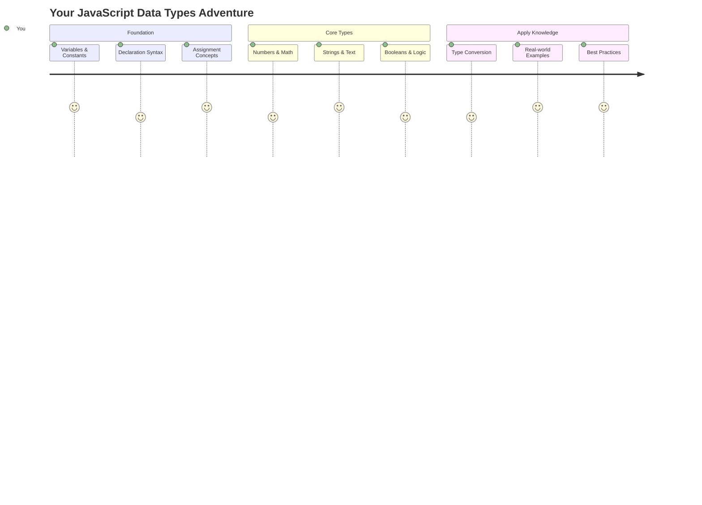

Os tipos de dados são um dos conceitos fundamentais em JavaScript que você encontrará em todos os programas que escrever. Pense nos tipos de dados como o sistema de arquivamento usado pelos antigos bibliotecários de Alexandria – eles tinham lugares específicos para pergaminhos contendo poesia, matemática e registros históricos. O JavaScript organiza informações de maneira semelhante, com diferentes categorias para diferentes tipos de dados.

Nesta lição, exploraremos os principais tipos de dados que fazem o JavaScript funcionar. Você aprenderá a lidar com números, textos, valores verdadeiro/falso e entenderá por que escolher o tipo correto é essencial para seus programas. Esses conceitos podem parecer abstratos no início, mas com prática, eles se tornarão naturais.

Compreender os tipos de dados tornará tudo no JavaScript muito mais claro. Assim como arquitetos precisam entender diferentes materiais de construção antes de construir uma catedral, esses fundamentos apoiarão tudo o que você criar daqui para frente.

## Quiz Pré-Aula
[Quiz pré-aula](https://ff-quizzes.netlify.app/web/)

Esta lição cobre os fundamentos do JavaScript, a linguagem que proporciona interatividade na web.

> Você pode fazer esta lição no [Microsoft Learn](https://docs.microsoft.com/learn/modules/web-development-101-variables/?WT.mc_id=academic-77807-sagibbon)!

[](https://youtube.com/watch?v=JNIXfGiDWM8 "Variáveis em JavaScript")

[](https://youtube.com/watch?v=AWfA95eLdq8 "Tipos de Dados em JavaScript")

> 🎥 Clique nas imagens acima para vídeos sobre variáveis e tipos de dados

Vamos começar com variáveis e os tipos de dados que as preenchem!

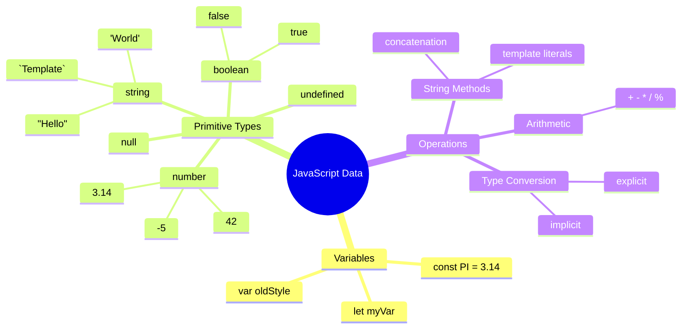

## Variáveis

Variáveis são blocos fundamentais na programação. Como os frascos rotulados que os alquimistas medievais usavam para armazenar diferentes substâncias, as variáveis permitem que você armazene informações e dê a elas um nome descritivo para que possa referenciá-las mais tarde. Precisa lembrar a idade de alguém? Armazene em uma variável chamada `age`. Quer acompanhar o nome de um usuário? Guarde em uma variável chamada `userName`.

Vamos focar na abordagem moderna para criar variáveis em JavaScript. As técnicas que você aprenderá aqui representam anos de evolução da linguagem e melhores práticas desenvolvidas pela comunidade de programação.

Criar e **declarar** uma variável tem a seguinte sintaxe **[palavra-chave] [nome]**. É composta por duas partes:

- **Palavra-chave**. Use `let` para variáveis que podem mudar ou `const` para valores que permanecem os mesmos.
- **O nome da variável**, este é um nome descritivo que você escolhe.

✅ A palavra-chave `let` foi introduzida no ES6 e dá à sua variável um chamado _escopo de bloco_. É recomendado que você use `let` ou `const` em vez da palavra-chave mais antiga `var`. Vamos abordar escopos de bloco mais detalhadamente em partes futuras.

### Tarefa - Trabalhando com Variáveis

1. **Declare uma variável**. Vamos começar criando nossa primeira variável:

    ```javascript
    let myVariable;
    ```

   **O que isso realiza:**
   - Isso diz ao JavaScript para criar um local de armazenamento chamado `myVariable`
   - O JavaScript aloca espaço na memória para essa variável
   - A variável atualmente não tem valor (undefined)

2. **Dê um valor a ela**. Agora vamos colocar algo em nossa variável:

    ```javascript
    myVariable = 123;
    ```

   **Como funciona a atribuição:**
   - O operador `=` atribui o valor 123 à nossa variável
   - A variável agora contém esse valor em vez de estar indefinida
   - Você pode referenciar esse valor em todo o seu código usando `myVariable`

   > Nota: o uso de `=` nesta lição significa que estamos utilizando um "operador de atribuição", usado para definir um valor para uma variável. Ele não denota igualdade.

3. **Faça do jeito inteligente**. Na verdade, vamos combinar essas duas etapas:

    ```javascript
    let myVariable = 123;
    ```

    **Essa abordagem é mais eficiente:**
    - Você está declarando a variável e atribuindo um valor em uma única instrução
    - Esta é a prática padrão entre os desenvolvedores
    - Reduz o comprimento do código enquanto mantém a clareza

4. **Mude de ideia**. E se quisermos armazenar um número diferente?

   ```javascript
   myVariable = 321;
   ```

   **Entendendo a reatribuição:**
   - A variável agora contém 321 em vez de 123
   - O valor anterior é substituído – variáveis armazenam apenas um valor por vez
   - Essa mutabilidade é a característica principal das variáveis declaradas com `let`

   ✅ Experimente! Você pode escrever JavaScript diretamente no seu navegador. Abra uma janela do navegador e vá para as Ferramentas de Desenvolvedor. No console, você encontrará um prompt; digite `let myVariable = 123`, pressione Enter e depois digite `myVariable`. O que acontece? Note que você aprenderá mais sobre esses conceitos em lições subsequentes.

### 🧠 **Verificação de Domínio de Variáveis: Ficando Confortável**

**Vamos ver como você está se sentindo em relação às variáveis:**
- Você consegue explicar a diferença entre declarar e atribuir uma variável?
- O que acontece se você tentar usar uma variável antes de declará-la?
- Quando você escolheria `let` em vez de `const` para uma variável?

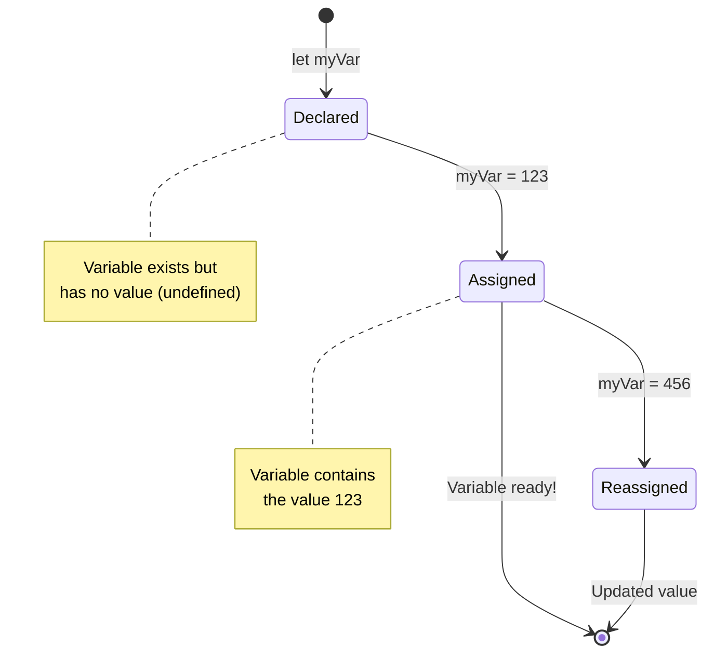

> **Dica rápida**: Pense nas variáveis como caixas de armazenamento rotuladas. Você cria a caixa (`let`), coloca algo nela (`=`) e pode substituir o conteúdo mais tarde, se necessário!

## Constantes

Às vezes, você precisa armazenar informações que nunca devem mudar durante a execução do programa. Pense nas constantes como os princípios matemáticos que Euclides estabeleceu na Grécia Antiga – uma vez provados e documentados, permaneceram fixos para referência futura.

As constantes funcionam de forma semelhante às variáveis, mas com uma restrição importante: uma vez que você atribui seu valor, ele não pode ser alterado. Essa imutabilidade ajuda a evitar modificações acidentais em valores críticos do seu programa.

A declaração e inicialização de uma constante seguem os mesmos conceitos de uma variável, com a exceção da palavra-chave `const`. As constantes geralmente são declaradas com letras maiúsculas.

```javascript
const MY_VARIABLE = 123;
```

**O que este código faz:**
- **Cria** uma constante chamada `MY_VARIABLE` com o valor 123
- **Usa** convenção de nomenclatura em letras maiúsculas para constantes
- **Impede** quaisquer alterações futuras nesse valor

As constantes têm duas regras principais:

- **Você deve dar um valor imediatamente** – não são permitidas constantes vazias!
- **Você nunca pode mudar esse valor** – o JavaScript gerará um erro se você tentar. Vamos ver o que isso significa:

   **Valor simples** - O seguinte NÃO é permitido:
   
      ```javascript
      const PI = 3;
      PI = 4; // não permitido
      ```

   **O que você precisa lembrar:**
   - **Tentativas** de reatribuir uma constante causarão um erro
   - **Protege** valores importantes contra alterações acidentais
   - **Garante** que o valor permaneça consistente durante todo o programa
 
   **Referência de objeto é protegida** - O seguinte NÃO é permitido:
   
      ```javascript
      const obj = { a: 3 };
      obj = { b: 5 } // não permitido
      ```

   **Entendendo esses conceitos:**
   - **Impede** substituir o objeto inteiro por um novo
   - **Protege** a referência ao objeto original
   - **Mantém** a identidade do objeto na memória

    **Valor do objeto não é protegido** - O seguinte É permitido:
    
      ```javascript
      const obj = { a: 3 };
      obj.a = 5;  // permitido
      ```

      **Desvendando o que acontece aqui:**
      - **Modifica** o valor da propriedade dentro do objeto
      - **Mantém** a mesma referência do objeto
      - **Demonstra** que os conteúdos do objeto podem mudar enquanto a referência permanece constante

   > Nota, um `const` significa que a referência está protegida contra reatribuição. O valor não é _imutável_ e pode mudar, especialmente se for uma construção complexa como um objeto.

## Tipos de Dados

O JavaScript organiza informações em diferentes categorias chamadas tipos de dados. Este conceito espelha como os estudiosos antigos categorizavam o conhecimento – Aristóteles distinguia entre diferentes tipos de raciocínio, sabendo que princípios lógicos não podiam ser aplicados uniformemente à poesia, matemática e filosofia natural.

Os tipos de dados são importantes porque diferentes operações funcionam com diferentes tipos de informações. Assim como você não pode realizar cálculos em um nome de pessoa ou alfabetizar uma equação matemática, o JavaScript exige o tipo de dado apropriado para cada operação. Compreender isso evita erros e torna seu código mais confiável.

Variáveis podem armazenar muitos tipos diferentes de valores, como números e textos. Esses vários tipos de valores são conhecidos como **tipo de dado**. Os tipos de dados são uma parte importante do desenvolvimento de software porque ajudam os desenvolvedores a tomar decisões sobre como o código deve ser escrito e como o software deve funcionar. Além disso, alguns tipos de dados têm características únicas que ajudam a transformar ou extrair informações adicionais de um valor.

✅ Os Tipos de Dados também são chamados de primitivas de dados do JavaScript, pois são os tipos de dados de nível mais baixo fornecidos pela linguagem. Existem 7 tipos de dados primitivos: string, number, bigint, boolean, undefined, null e symbol. Reserve um momento para visualizar o que cada uma dessas primitivas pode representar. O que é um `zebra`? E `0`? `true`?

### Números

Números são o tipo de dado mais simples no JavaScript. Seja trabalhando com números inteiros como 42, decimais como 3.14 ou números negativos como -5, o JavaScript os trata de forma uniforme.

Lembra da nossa variável de antes? Aquele 123 que armazenamos era, na verdade, um tipo de dado numérico:

```javascript
let myVariable = 123;
```

**Características principais:**
- O JavaScript reconhece automaticamente valores numéricos
- Você pode realizar operações matemáticas com essas variáveis
- Não é necessário declarar explicitamente o tipo

Variáveis podem armazenar todos os tipos de números, incluindo decimais ou números negativos. Números também podem ser usados com operadores aritméticos, abordados na [próxima seção](../../../../2-js-basics/1-data-types).

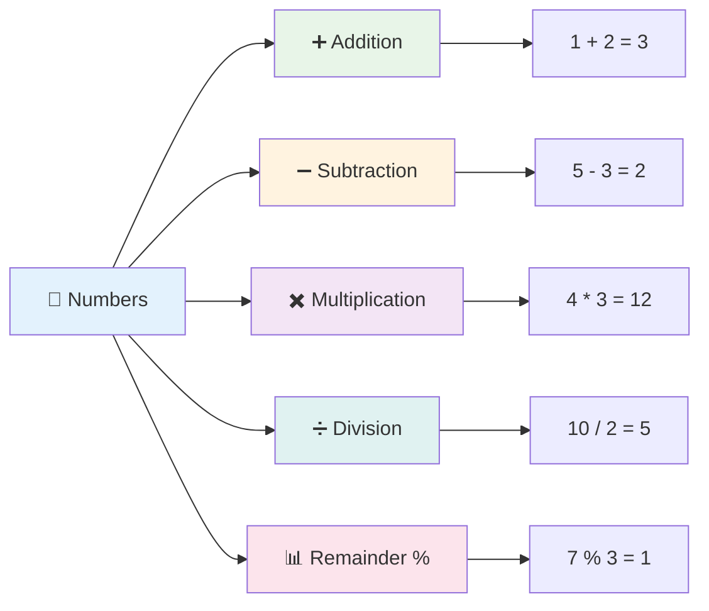

### Operadores Aritméticos

Operadores aritméticos permitem que você realize cálculos matemáticos no JavaScript. Esses operadores seguem os mesmos princípios que os matemáticos têm usado por séculos – os mesmos símbolos que apareceram nos trabalhos de estudiosos como Al-Khwarizmi, que desenvolveu a notação algébrica.

Os operadores funcionam como você esperaria na matemática tradicional: mais para adição, menos para subtração e assim por diante.

Existem vários tipos de operadores para usar ao realizar funções aritméticas, e alguns estão listados aqui:

| Símbolo | Descrição                                                               | Exemplo                          |
| ------  | ----------------------------------------------------------------------- | -------------------------------- |
| `+`     | **Adição**: Calcula a soma de dois números                              | `1 + 2 //resposta esperada é 3`  |
| `-`     | **Subtração**: Calcula a diferença entre dois números                   | `1 - 2 //resposta esperada é -1` |
| `*`     | **Multiplicação**: Calcula o produto de dois números                    | `1 * 2 //resposta esperada é 2`  |
| `/`     | **Divisão**: Calcula o quociente de dois números                        | `1 / 2 //resposta esperada é 0.5`|
| `%`     | **Resto**: Calcula o resto da divisão de dois números                   | `1 % 2 //resposta esperada é 1`  |

✅ Experimente! Tente uma operação aritmética no console do seu navegador. Os resultados te surpreendem?

### 🧮 **Verificação de Habilidades Matemáticas: Calculando com Confiança**

**Teste sua compreensão de aritmética:**
- Qual é a diferença entre `/` (divisão) e `%` (resto)?
- Você consegue prever o que `10 % 3` resulta? (Dica: não é 3.33...)
- Por que o operador de resto pode ser útil na programação?

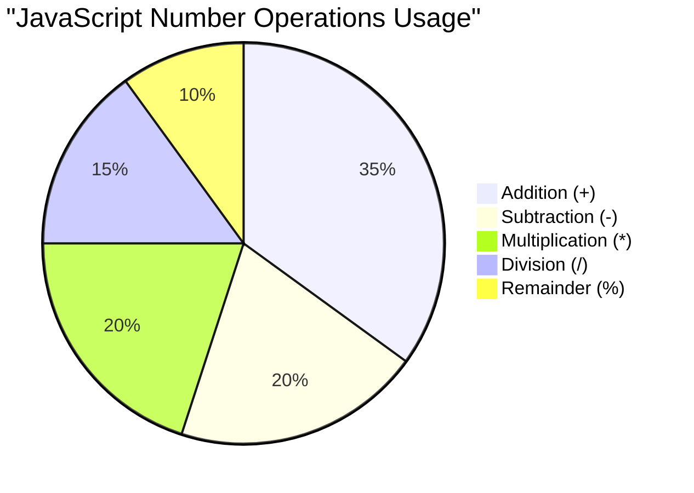

> **Insight do mundo real**: O operador de resto (%) é super útil para verificar se números são pares/ímpares, criar padrões ou percorrer arrays!

### Strings

No JavaScript, dados textuais são representados como strings. O termo "string" vem do conceito de caracteres conectados em sequência, assim como os escribas em monastérios medievais conectavam letras para formar palavras e frases em seus manuscritos.

Strings são fundamentais para o desenvolvimento web. Cada pedaço de texto exibido em um site – nomes de usuários, rótulos de botões, mensagens de erro, conteúdo – é tratado como dado de string. Compreender strings é essencial para criar interfaces de usuário funcionais.

Strings são conjuntos de caracteres que ficam entre aspas simples ou duplas.

```javascript
'This is a string'
"This is also a string"
let myString = 'This is a string value stored in a variable';
```

**Entendendo esses conceitos:**
- **Usa** aspas simples `'` ou duplas `"` para definir strings
- **Armazena** dados textuais que podem incluir letras, números e símbolos
- **Atribui** valores de string a variáveis para uso posterior
- **Exige** aspas para distinguir texto de nomes de variáveis

Lembre-se de usar aspas ao escrever uma string, caso contrário, o JavaScript assumirá que é um nome de variável.

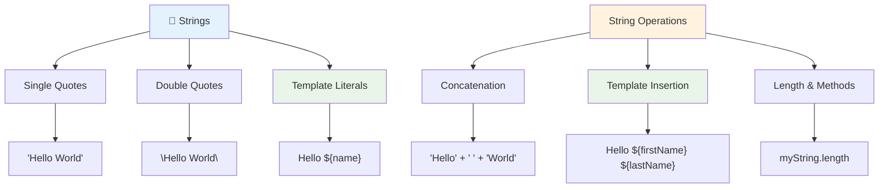

### Formatando Strings

A manipulação de strings permite que você combine elementos de texto, incorpore variáveis e crie conteúdo dinâmico que responde ao estado do programa. Essa técnica possibilita construir texto de forma programática.

Frequentemente, você precisa juntar várias strings – esse processo é chamado de concatenação.
Para **concatenar** duas ou mais strings, ou juntá-las, use o operador `+`.

```javascript
let myString1 = "Hello";
let myString2 = "World";

myString1 + myString2 + "!"; //HelloWorld!
myString1 + " " + myString2 + "!"; //Hello World!
myString1 + ", " + myString2 + "!"; //Hello, World!
```

**Passo a passo, aqui está o que está acontecendo:**
- **Combina** várias strings usando o operador `+`
- **Une** strings diretamente sem espaços no primeiro exemplo
- **Adiciona** caracteres de espaço `" "` entre as strings para facilitar a leitura
- **Insere** pontuação como vírgulas para criar uma formatação adequada

✅ Por que `1 + 1 = 2` em JavaScript, mas `'1' + '1' = 11`? Pense nisso. E o que acontece com `'1' + 1`?

**Template literals** são outra forma de formatar strings, exceto que, em vez de aspas, usa-se o acento grave. Qualquer coisa que não seja texto simples deve ser colocada dentro de placeholders `${ }`. Isso inclui quaisquer variáveis que possam ser strings.

```javascript
let myString1 = "Hello";
let myString2 = "World";

`${myString1} ${myString2}!` //Hello World!
`${myString1}, ${myString2}!` //Hello, World!
```

**Vamos entender cada parte:**
- **Usa** acentos graves `` ` `` em vez de aspas regulares para criar template literals
- **Insere** variáveis diretamente usando a sintaxe de placeholder `${}`
- **Preserva** espaços e formatação exatamente como escrito
- **Oferece** uma maneira mais limpa de criar strings complexas com variáveis

Você pode alcançar seus objetivos de formatação com qualquer método, mas os template literals respeitam os espaços e quebras de linha.

✅ Quando você usaria um template literal em vez de uma string simples?

### 🔤 **Teste de Maestria em Strings: Confiança na Manipulação de Texto**

**Avalie suas habilidades com strings:**
- Você consegue explicar por que `'1' + '1'` resulta em `'11'` em vez de `2`?
- Qual método de string você acha mais legível: concatenação ou template literals?
- O que acontece se você esquecer as aspas ao redor de uma string?

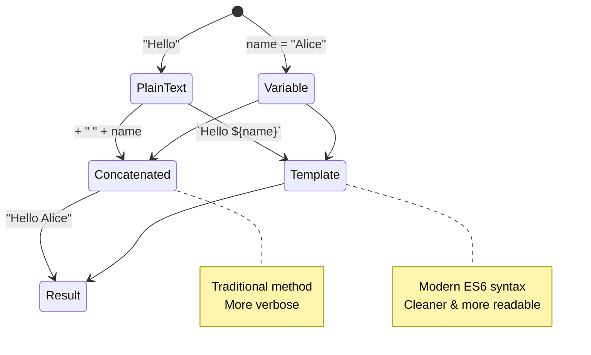

> **Dica profissional**: Template literals geralmente são preferidos para construção de strings complexas porque são mais legíveis e lidam com strings de várias linhas de forma excelente!

### Booleans

Booleans representam a forma mais simples de dados: eles só podem ter um de dois valores – `true` ou `false`. Esse sistema de lógica binária remonta ao trabalho de George Boole, um matemático do século XIX que desenvolveu a álgebra booleana.

Apesar de sua simplicidade, booleans são essenciais para a lógica de programação. Eles permitem que seu código tome decisões com base em condições – se um usuário está logado, se um botão foi clicado ou se certos critérios foram atendidos.

Booleans só podem ter dois valores: `true` ou `false`. Eles ajudam a decidir quais linhas de código devem ser executadas quando certas condições são atendidas. Em muitos casos, [operadores](../../../../2-js-basics/1-data-types) ajudam a definir o valor de um Boolean, e você frequentemente verá variáveis sendo inicializadas ou seus valores sendo atualizados com um operador.

```javascript
let myTrueBool = true;
let myFalseBool = false;
```

**No exemplo acima, nós:**
- **Criamos** uma variável que armazena o valor Boolean `true`
- **Demonstramos** como armazenar o valor Boolean `false`
- **Usamos** as palavras-chave exatas `true` e `false` (sem aspas)
- **Preparamos** essas variáveis para uso em declarações condicionais

✅ Uma variável pode ser considerada 'truthy' se ela for avaliada como um booleano `true`. Curiosamente, em JavaScript, [todos os valores são truthy, a menos que sejam definidos como falsy](https://developer.mozilla.org/docs/Glossary/Truthy).

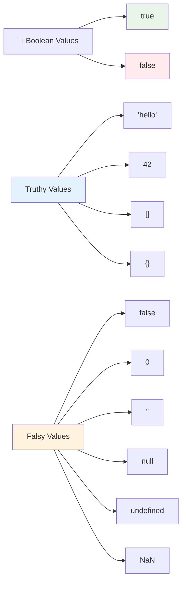

### 🎯 **Teste de Lógica Booleana: Habilidades de Tomada de Decisão**

**Teste sua compreensão sobre booleans:**
- Por que você acha que o JavaScript tem valores "truthy" e "falsy" além de apenas `true` e `false`?
- Você consegue prever quais desses são falsy: `0`, `"0"`, `[]`, `"false"`?
- Como os booleans podem ser úteis para controlar o fluxo de um programa?

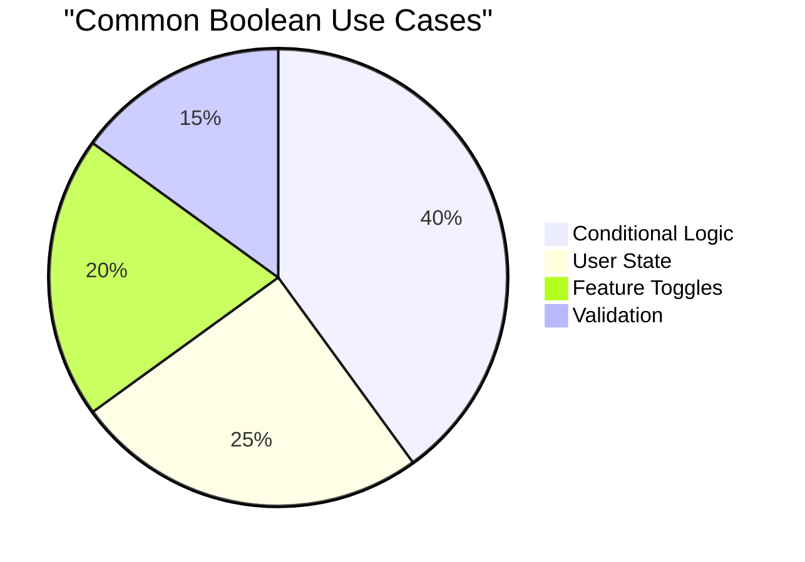

> **Lembre-se**: Em JavaScript, apenas 6 valores são falsy: `false`, `0`, `""`, `null`, `undefined` e `NaN`. Todo o resto é truthy!

---

## 📊 **Resumo da Sua Caixa de Ferramentas de Tipos de Dados**

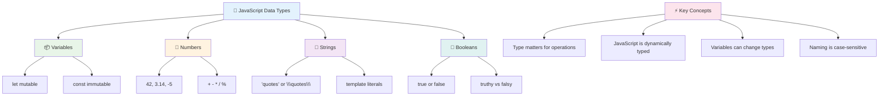

## Desafio do Agente GitHub Copilot 🚀

Use o modo Agent para completar o seguinte desafio:

**Descrição:** Crie um gerenciador de informações pessoais que demonstre todos os tipos de dados do JavaScript que você aprendeu nesta lição enquanto lida com cenários de dados do mundo real.

**Prompt:** Construa um programa em JavaScript que crie um objeto de perfil de usuário contendo: nome da pessoa (string), idade (número), status de estudante (boolean), cores favoritas como um array e um objeto de endereço com propriedades de rua, cidade e código postal. Inclua funções para exibir as informações do perfil e atualizar campos individuais. Certifique-se de demonstrar concatenação de strings, template literals, operações aritméticas com a idade e lógica booleana para o status de estudante.

Saiba mais sobre [modo agent](https://code.visualstudio.com/blogs/2025/02/24/introducing-copilot-agent-mode) aqui.

## 🚀 Desafio

O JavaScript tem alguns comportamentos que podem pegar os desenvolvedores desprevenidos. Aqui está um exemplo clássico para explorar: tente digitar isso no console do seu navegador: `let age = 1; let Age = 2; age == Age` e observe o resultado. Ele retorna `false` – você consegue determinar por quê?

Isso representa um dos muitos comportamentos do JavaScript que vale a pena entender. Familiaridade com essas peculiaridades ajudará você a escrever códigos mais confiáveis e a depurar problemas de forma mais eficaz.

## Quiz Pós-Aula
[Quiz pós-aula](https://ff-quizzes.netlify.app)

## Revisão & Autoestudo

Dê uma olhada [nesta lista de exercícios de JavaScript](https://css-tricks.com/snippets/javascript/) e tente um. O que você aprendeu?

## Tarefa

[Prática de Tipos de Dados](assignment.md)

## 🚀 Sua Linha do Tempo de Maestria em Tipos de Dados do JavaScript

### ⚡ **O Que Você Pode Fazer nos Próximos 5 Minutos**
- [ ] Abra o console do seu navegador e crie 3 variáveis com diferentes tipos de dados
- [ ] Tente o desafio: `let age = 1; let Age = 2; age == Age` e descubra por que é falso
- [ ] Pratique a concatenação de strings com seu nome e número favorito
- [ ] Teste o que acontece quando você adiciona um número a uma string

### 🎯 **O Que Você Pode Realizar Nesta Hora**
- [ ] Complete o quiz pós-aula e revise quaisquer conceitos confusos
- [ ] Crie uma mini calculadora que soma, subtrai, multiplica e divide dois números
- [ ] Construa um formatador de nomes simples usando template literals
- [ ] Explore as diferenças entre os operadores de comparação `==` e `===`
- [ ] Pratique a conversão entre diferentes tipos de dados

### 📅 **Sua Base de JavaScript em Uma Semana**
- [ ] Complete a tarefa com confiança e criatividade
- [ ] Crie um objeto de perfil pessoal usando todos os tipos de dados aprendidos
- [ ] Pratique com [exercícios de JavaScript do CSS-Tricks](https://css-tricks.com/snippets/javascript/)
- [ ] Construa um validador de formulário simples usando lógica booleana
- [ ] Experimente tipos de dados de array e objeto (prévia das próximas lições)
- [ ] Participe de uma comunidade de JavaScript e faça perguntas sobre tipos de dados

### 🌟 **Sua Transformação em Um Mês**
- [ ] Integre o conhecimento de tipos de dados em projetos de programação maiores
- [ ] Entenda quando e por que usar cada tipo de dado em aplicações reais
- [ ] Ajude outros iniciantes a entender os fundamentos do JavaScript
- [ ] Construa um pequeno aplicativo que gerencie diferentes tipos de dados de usuários
- [ ] Explore conceitos avançados de tipos de dados, como coerção de tipos e igualdade estrita
- [ ] Contribua para projetos de JavaScript de código aberto com melhorias na documentação

### 🧠 **Check-in Final de Maestria em Tipos de Dados**

**Celebre sua base em JavaScript:**
- Qual tipo de dado mais te surpreendeu em termos de comportamento?
- Quão confortável você se sente explicando variáveis vs. constantes para um amigo?
- Qual foi a coisa mais interessante que você descobriu sobre o sistema de tipos do JavaScript?
- Qual aplicação do mundo real você imagina construir com esses fundamentos?

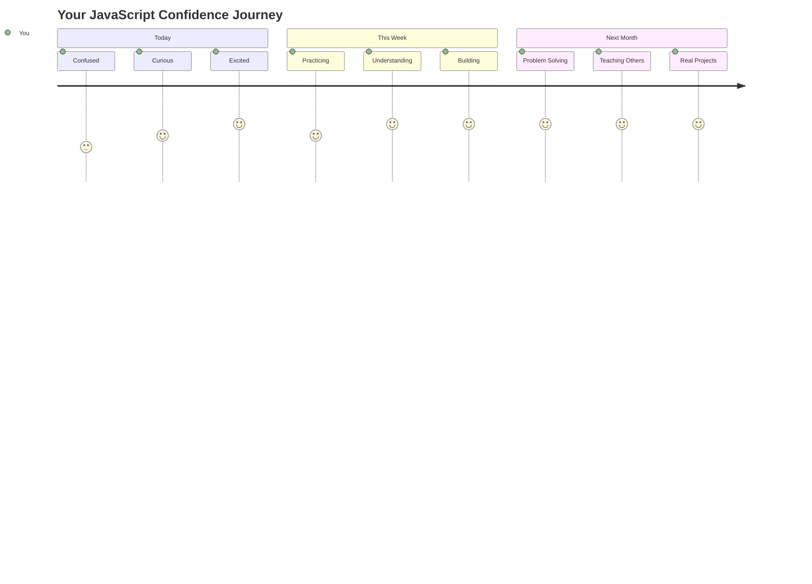

> 💡 **Você construiu a base!** Entender os tipos de dados é como aprender o alfabeto antes de escrever histórias. Todo programa em JavaScript que você escrever usará esses conceitos fundamentais. Agora você tem os blocos de construção para criar sites interativos, aplicativos dinâmicos e resolver problemas do mundo real com código. Bem-vindo ao maravilhoso mundo do JavaScript! 🎉

---

**Aviso Legal**:  
Este documento foi traduzido utilizando o serviço de tradução por IA [Co-op Translator](https://github.com/Azure/co-op-translator). Embora nos esforcemos para garantir a precisão, esteja ciente de que traduções automatizadas podem conter erros ou imprecisões. O documento original em seu idioma nativo deve ser considerado a fonte autoritativa. Para informações críticas, recomenda-se a tradução profissional feita por humanos. Não nos responsabilizamos por quaisquer mal-entendidos ou interpretações incorretas decorrentes do uso desta tradução.