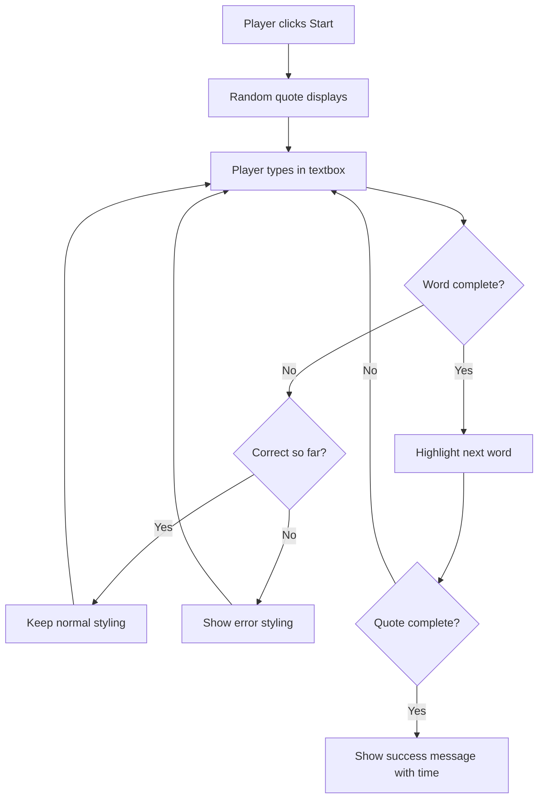
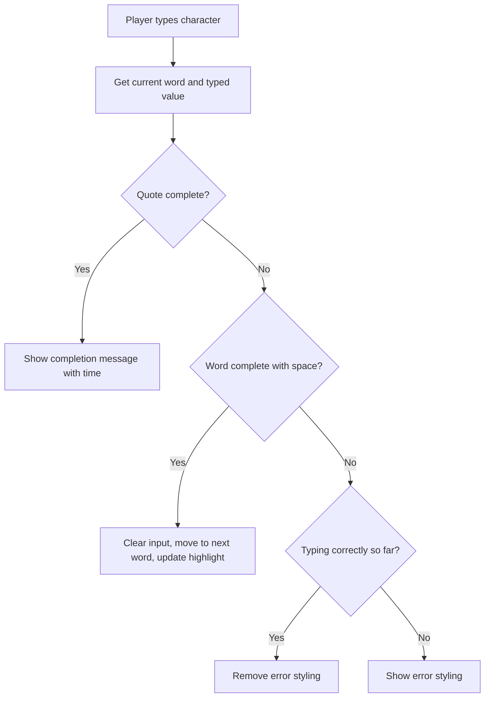
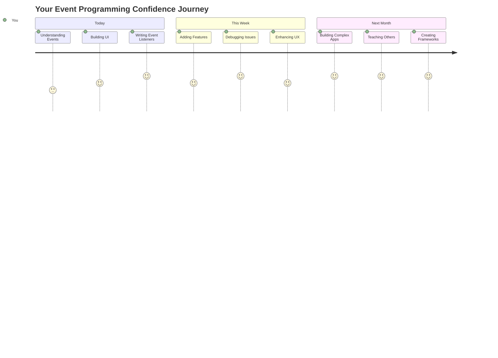

# Criando um jogo usando eventos

Já se perguntou como os sites sabem quando você clica em um botão ou digita em uma caixa de texto? Isso é a mágica da programação orientada a eventos! E que melhor maneira de aprender essa habilidade essencial do que construindo algo útil - um jogo de velocidade de digitação que reage a cada tecla que você pressiona.

Você verá de perto como os navegadores "conversam" com seu código JavaScript. Toda vez que você clica, digita ou move o mouse, o navegador envia pequenas mensagens (chamamos de eventos) para o seu código, e você decide como responder!

Quando terminarmos aqui, você terá criado um jogo de digitação real que rastreia sua velocidade e precisão. Mais importante ainda, você entenderá os conceitos fundamentais que impulsionam todos os sites interativos que você já usou. Vamos começar!

## Questionário Pré-aula

[Questionário pré-aula](https://ff-quizzes.netlify.app/web/quiz/21)

## Programação orientada a eventos

Pense no seu aplicativo ou site favorito - o que o torna tão dinâmico e responsivo? É tudo sobre como ele reage ao que você faz! Cada toque, clique, deslizar ou pressionar de tecla cria o que chamamos de "evento", e é aí que a verdadeira mágica do desenvolvimento web acontece.

Aqui está o que torna a programação para a web tão interessante: nunca sabemos quando alguém vai clicar naquele botão ou começar a digitar em uma caixa de texto. Eles podem clicar imediatamente, esperar cinco minutos ou talvez nunca clicar! Essa imprevisibilidade significa que precisamos pensar de forma diferente sobre como escrevemos nosso código.

Em vez de escrever um código que é executado de cima para baixo como uma receita, escrevemos um código que fica pacientemente esperando algo acontecer. É semelhante a como os operadores de telégrafo no século XIX ficavam ao lado de suas máquinas, prontos para responder no momento em que uma mensagem chegava pelo fio.

Então, o que exatamente é um "evento"? Simplificando, é algo que acontece! Quando você clica em um botão - isso é um evento. Quando você digita uma letra - isso é um evento. Quando você move o mouse - isso é outro evento.

A programação orientada a eventos nos permite configurar nosso código para ouvir e responder. Criamos funções especiais chamadas **event listeners** que esperam pacientemente por coisas específicas acontecerem e entram em ação quando isso ocorre.

Pense nos event listeners como ter uma campainha para o seu código. Você configura a campainha (`addEventListener()`), diz qual som ela deve ouvir (como um 'clique' ou 'tecla pressionada') e, em seguida, especifica o que deve acontecer quando alguém tocar a campainha (sua função personalizada).

**Como os event listeners funcionam:**
- **Escutam** ações específicas do usuário, como cliques, pressionamentos de tecla ou movimentos do mouse
- **Executam** seu código personalizado quando o evento especificado ocorre
- **Respondem** imediatamente às interações do usuário, criando uma experiência fluida
- **Gerenciam** múltiplos eventos no mesmo elemento usando diferentes listeners

> **NOTE:** Vale destacar que existem várias maneiras de criar event listeners. Você pode usar funções anônimas ou criar funções nomeadas. Pode usar vários atalhos, como configurar a propriedade `click` ou usar `addEventListener()`. No nosso exercício, vamos focar em `addEventListener()` e funções anônimas, pois é provavelmente a técnica mais comum usada por desenvolvedores web. Também é a mais flexível, já que `addEventListener()` funciona para todos os eventos, e o nome do evento pode ser fornecido como um parâmetro.

### Eventos comuns

Embora os navegadores ofereçam dezenas de diferentes eventos para você ouvir, a maioria das aplicações interativas depende de apenas um pequeno conjunto de eventos essenciais. Compreender esses eventos principais lhe dará a base para construir interações sofisticadas com o usuário.

Existem [dezenas de eventos](https://developer.mozilla.org/docs/Web/Events) disponíveis para você ouvir ao criar uma aplicação. Basicamente, qualquer coisa que um usuário faz em uma página gera um evento, o que lhe dá muito poder para garantir que eles tenham a experiência desejada. Felizmente, você normalmente precisará de apenas um pequeno número de eventos. Aqui estão alguns comuns (incluindo os dois que usaremos ao criar nosso jogo):

| Evento | Descrição | Casos de Uso Comuns |
|--------|-----------|---------------------|
| `click` | O usuário clicou em algo | Botões, links, elementos interativos |
| `contextmenu` | O usuário clicou com o botão direito do mouse | Menus de clique direito personalizados |
| `select` | O usuário destacou algum texto | Edição de texto, operações de cópia |
| `input` | O usuário inseriu algum texto | Validação de formulário, busca em tempo real |

**Compreendendo esses tipos de eventos:**
- **Disparam** quando os usuários interagem com elementos específicos na sua página
- **Fornecem** informações detalhadas sobre a ação do usuário por meio de objetos de evento
- **Permitem** criar aplicações web responsivas e interativas
- **Funcionam** de forma consistente em diferentes navegadores e dispositivos

## Criando o jogo

Agora que você entende como os eventos funcionam, vamos colocar esse conhecimento em prática criando algo útil. Vamos criar um jogo de velocidade de digitação que demonstra o manuseio de eventos enquanto ajuda você a desenvolver uma habilidade importante como desenvolvedor.

Vamos criar um jogo para explorar como os eventos funcionam no JavaScript. Nosso jogo testará a habilidade de digitação de um jogador, que é uma das habilidades mais subestimadas que todos os desenvolvedores deveriam ter. Curiosidade: o layout do teclado QWERTY que usamos hoje foi projetado na década de 1870 para máquinas de escrever - e boas habilidades de digitação ainda são tão valiosas para programadores hoje! O fluxo geral do jogo será assim:



**Como nosso jogo funcionará:**
- **Começa** quando o jogador clica no botão de início e exibe uma frase aleatória
- **Acompanha** o progresso de digitação do jogador palavra por palavra em tempo real
- **Destaca** a palavra atual para guiar o foco do jogador
- **Fornece** feedback visual imediato para erros de digitação
- **Calcula** e exibe o tempo total quando a frase é concluída

Vamos construir nosso jogo e aprender sobre eventos!

### Estrutura de arquivos

Antes de começarmos a codificar, vamos nos organizar! Ter uma estrutura de arquivos limpa desde o início economizará dores de cabeça mais tarde e tornará seu projeto mais profissional. 😊

Vamos manter as coisas simples com apenas três arquivos: `index.html` para a estrutura da página, `script.js` para toda a lógica do jogo e `style.css` para deixar tudo bonito. Este é o trio clássico que impulsiona a maior parte da web!

**Crie uma nova pasta para seu trabalho abrindo um console ou terminal e emitindo o seguinte comando:**

```bash
# Linux or macOS
mkdir typing-game && cd typing-game

# Windows
md typing-game && cd typing-game
```

**O que esses comandos fazem:**
- **Cria** um novo diretório chamado `typing-game` para os arquivos do seu projeto
- **Navega** automaticamente para o diretório recém-criado
- **Configura** um espaço de trabalho limpo para o desenvolvimento do seu jogo

**Abra o Visual Studio Code:**

```bash
code .
```

**Este comando:**
- **Inicia** o Visual Studio Code no diretório atual
- **Abre** sua pasta de projeto no editor
- **Fornece** acesso a todas as ferramentas de desenvolvimento necessárias

**Adicione três arquivos à pasta no Visual Studio Code com os seguintes nomes:**
- `index.html` - Contém a estrutura e o conteúdo do seu jogo
- `script.js` - Lida com toda a lógica do jogo e os event listeners
- `style.css` - Define a aparência visual e o estilo

## Criar a interface do usuário

Agora vamos construir o palco onde toda a ação do nosso jogo acontecerá! Pense nisso como projetar o painel de controle de uma nave espacial - precisamos garantir que tudo o que nossos jogadores precisam esteja exatamente onde eles esperam.

Vamos descobrir o que nosso jogo realmente precisa. Se você estivesse jogando um jogo de digitação, o que gostaria de ver na tela? Aqui está o que precisaremos:

| Elemento da UI | Propósito | Elemento HTML |
|----------------|-----------|---------------|
| Exibição de Frase | Mostra o texto para digitar | `<p>` com `id="quote"` |
| Área de Mensagem | Exibe mensagens de status e sucesso | `<p>` com `id="message"` |
| Entrada de Texto | Onde os jogadores digitam a frase | `<input>` com `id="typed-value"` |
| Botão de Início | Inicia o jogo | `<button>` com `id="start"` |

**Compreendendo a estrutura da UI:**
- **Organiza** o conteúdo logicamente de cima para baixo
- **Atribui** IDs únicos aos elementos para direcionamento no JavaScript
- **Fornece** hierarquia visual clara para melhor experiência do usuário
- **Inclui** elementos HTML semânticos para acessibilidade

Cada um desses elementos precisará de IDs para que possamos trabalhar com eles em nosso JavaScript. Também adicionaremos referências aos arquivos CSS e JavaScript que vamos criar.

Crie um novo arquivo chamado `index.html`. Adicione o seguinte HTML:

```html
<!-- inside index.html -->
<html>
<head>
  <title>Typing game</title>
  <link rel="stylesheet" href="style.css">
</head>
<body>
  <h1>Typing game!</h1>
  <p>Practice your typing skills with a quote from Sherlock Holmes. Click **start** to begin!</p>
  <p id="quote"></p> <!-- This will display our quote -->
  <p id="message"></p> <!-- This will display any status messages -->
  <div>
    <input type="text" aria-label="current word" id="typed-value" /> <!-- The textbox for typing -->
    <button type="button" id="start">Start</button> <!-- To start the game -->
  </div>
  <script src="script.js"></script>
</body>
</html>
```

**Desmembrando o que essa estrutura HTML realiza:**
- **Linka** a folha de estilos CSS no `<head>` para estilização
- **Cria** um cabeçalho claro e instruções para os usuários
- **Estabelece** parágrafos de espaço reservado com IDs específicos para conteúdo dinâmico
- **Inclui** um campo de entrada com atributos de acessibilidade
- **Fornece** um botão de início para iniciar o jogo
- **Carrega** o arquivo JavaScript no final para desempenho ideal

### Lançar a aplicação

Testar sua aplicação frequentemente durante o desenvolvimento ajuda a identificar problemas cedo e ver seu progresso em tempo real. Live Server é uma ferramenta inestimável que atualiza automaticamente o navegador sempre que você salva alterações, tornando o desenvolvimento muito mais eficiente.

É sempre melhor desenvolver iterativamente para ver como as coisas estão ficando. Vamos lançar nossa aplicação. Há uma extensão maravilhosa para o Visual Studio Code chamada [Live Server](https://marketplace.visualstudio.com/items?itemName=ritwickdey.LiveServer&WT.mc_id=academic-77807-sagibbon), que hospedará sua aplicação localmente e atualizará o navegador cada vez que você salvar.

**Instale o [Live Server](https://marketplace.visualstudio.com/items?itemName=ritwickdey.LiveServer&WT.mc_id=academic-77807-sagibbon) seguindo o link e clicando em Instalar:**

**O que acontece durante a instalação:**
- **Solicita** ao navegador que abra o Visual Studio Code
- **Guia** você pelo processo de instalação da extensão
- **Pode exigir** reiniciar o Visual Studio Code para concluir a configuração

**Uma vez instalado, no Visual Studio Code, clique em Ctrl-Shift-P (ou Cmd-Shift-P) para abrir o painel de comandos:**

**Compreendendo o painel de comandos:**
- **Fornece** acesso rápido a todos os comandos do VS Code
- **Busca** comandos enquanto você digita
- **Oferece** atalhos de teclado para desenvolvimento mais rápido

**Digite "Live Server: Open with Live Server":**

**O que o Live Server faz:**
- **Inicia** um servidor de desenvolvimento local para seu projeto
- **Atualiza automaticamente** o navegador quando você salva arquivos
- **Serve** seus arquivos de uma URL local (normalmente `localhost:5500`)

**Abra um navegador e navegue para `https://localhost:5500`:**

Agora você deve ver a página que criou! Vamos adicionar alguma funcionalidade.

## Adicionar o CSS

Agora vamos deixar tudo bonito! O feedback visual tem sido crucial para interfaces de usuário desde os primórdios da computação. Na década de 1980, pesquisadores descobriram que o feedback visual imediato melhora significativamente o desempenho do usuário e reduz erros. É exatamente isso que vamos criar.

Nosso jogo precisa ser extremamente claro sobre o que está acontecendo. Os jogadores devem saber imediatamente qual palavra devem digitar e, se cometerem um erro, devem vê-lo imediatamente. Vamos criar um estilo simples, mas eficaz:

Crie um novo arquivo chamado `style.css` e adicione a seguinte sintaxe.

```css
/* inside style.css */
.highlight {
  background-color: yellow;
}

.error {
  background-color: lightcoral;
  border: red;
}
```

**Compreendendo essas classes CSS:**
- **Destaca** a palavra atual com um fundo amarelo para orientação visual clara
- **Sinaliza** erros de digitação com uma cor de fundo coral claro
- **Fornece** feedback imediato sem interromper o fluxo de digitação do usuário
- **Utiliza** cores contrastantes para acessibilidade e comunicação visual clara

✅ Quando se trata de CSS, você pode organizar sua página como preferir. Dedique um tempo para tornar a página mais atraente:

- Escolha uma fonte diferente
- Coloque cores nos cabeçalhos
- Redimensione os itens

## JavaScript

Aqui é onde as coisas ficam interessantes! 🎉 Temos nossa estrutura HTML e nosso estilo CSS, mas agora nosso jogo é como um carro bonito sem motor. O JavaScript será esse motor - é o que faz tudo realmente funcionar e responder ao que os jogadores fazem.

É aqui que você verá sua criação ganhar vida. Vamos abordar isso passo a passo para que nada pareça esmagador:

| Etapa | Propósito | O que você aprenderá |
|-------|----------|-----------------------|
| [Criar as constantes](../../../../4-typing-game/typing-game) | Configurar frases e referências DOM | Gerenciamento de variáveis e seleção DOM |
| [Event listener para iniciar o jogo](../../../../4-typing-game/typing-game) | Lidar com a inicialização do jogo | Manipulação de eventos e atualizações de UI |
| [Event listener para digitação](../../../../4-typing-game/typing-game) | Processar entrada do usuário em tempo real | Validação de entrada e feedback dinâmico |

**Essa abordagem estruturada ajuda você a:**
- **Organizar** seu código em seções lógicas e gerenciáveis
- **Construir** funcionalidades de forma incremental para facilitar a depuração
- **Compreender** como diferentes partes da sua aplicação funcionam juntas
- **Criar** padrões reutilizáveis para projetos futuros

Mas primeiro, crie um novo arquivo chamado `script.js`.

### Adicionar as constantes

Antes de mergulharmos na ação, vamos reunir todos os nossos recursos! Assim como a NASA prepara todos os seus sistemas de monitoramento antes do lançamento, é muito mais fácil quando você tem tudo preparado e pronto para usar. Isso nos poupa de procurar coisas mais tarde e ajuda a evitar erros de digitação.

Aqui está o que precisamos configurar primeiro:

| Tipo de Dados | Propósito | Exemplo |
|---------------|-----------|---------|
| Array de citações | Armazena todas as citações possíveis para o jogo | `['Citação 1', 'Citação 2', ...]` |
| Array de palavras | Divide a citação atual em palavras individuais | `['Quando', 'você', 'tem', ...]` |
| Índice de palavras | Acompanha qual palavra o jogador está digitando | `0, 1, 2, 3...` |
| Tempo inicial | Calcula o tempo decorrido para pontuação | `Date.now()` |

**Também precisaremos de referências para nossos elementos da interface:**
| Elemento | ID | Finalidade |
|----------|----|-----------|
| Entrada de texto | `typed-value` | Onde os jogadores digitam |
| Exibição de citação | `quote` | Mostra a citação para digitar |
| Área de mensagens | `message` | Exibe atualizações de status |

```javascript
// inside script.js
// all of our quotes
const quotes = [
    'When you have eliminated the impossible, whatever remains, however improbable, must be the truth.',
    'There is nothing more deceptive than an obvious fact.',
    'I ought to know by this time that when a fact appears to be opposed to a long train of deductions it invariably proves to be capable of bearing some other interpretation.',
    'I never make exceptions. An exception disproves the rule.',
    'What one man can invent another can discover.',
    'Nothing clears up a case so much as stating it to another person.',
    'Education never ends, Watson. It is a series of lessons, with the greatest for the last.',
];
// store the list of words and the index of the word the player is currently typing
let words = [];
let wordIndex = 0;
// the starting time
let startTime = Date.now();
// page elements
const quoteElement = document.getElementById('quote');
const messageElement = document.getElementById('message');
const typedValueElement = document.getElementById('typed-value');
```

**Desmembrando o que este código de configuração realiza:**
- **Armazena** um array de citações de Sherlock Holmes usando `const`, já que as citações não mudarão
- **Inicializa** variáveis de acompanhamento com `let`, pois esses valores serão atualizados durante o jogo
- **Captura** referências aos elementos do DOM usando `document.getElementById()` para acesso eficiente
- **Estabelece** a base para toda a funcionalidade do jogo com nomes de variáveis claros e descritivos
- **Organiza** dados e elementos relacionados logicamente para facilitar a manutenção do código

✅ Vá em frente e adicione mais citações ao seu jogo

> 💡 **Dica Pro**: Podemos recuperar os elementos sempre que quisermos no código usando `document.getElementById()`. Como vamos nos referir a esses elementos regularmente, evitaremos erros de digitação com literais de string usando constantes. Frameworks como [Vue.js](https://vuejs.org/) ou [React](https://reactjs.org/) podem ajudar você a gerenciar melhor a centralização do seu código.
>
**Por que essa abordagem funciona tão bem:**
- **Previne** erros de digitação ao referenciar elementos várias vezes
- **Melhora** a legibilidade do código com nomes de constantes descritivos
- **Habilita** melhor suporte do IDE com autocompletar e verificação de erros
- **Facilita** a refatoração caso os IDs dos elementos mudem no futuro

Reserve um momento para assistir a um vídeo sobre o uso de `const`, `let` e `var`

[](https://youtube.com/watch?v=JNIXfGiDWM8 "Tipos de variáveis")

> 🎥 Clique na imagem acima para assistir a um vídeo sobre variáveis.

### Adicione lógica de início

É aqui que tudo se encaixa! 🚀 Você está prestes a escrever seu primeiro listener de evento real, e há algo muito satisfatório em ver seu código responder a um clique de botão.

Pense nisso: em algum lugar, um jogador vai clicar no botão "Iniciar", e seu código precisa estar pronto para ele. Não temos ideia de quando ele vai clicar - pode ser imediatamente, pode ser depois de pegar um café - mas quando isso acontecer, seu jogo ganha vida.

Quando o usuário clicar em `start`, precisamos selecionar uma citação, configurar a interface do usuário e configurar o acompanhamento da palavra atual e do tempo. Abaixo está o JavaScript que você precisará adicionar; discutimos isso logo após o bloco de script.

```javascript
// at the end of script.js
document.getElementById('start').addEventListener('click', () => {
  // get a quote
  const quoteIndex = Math.floor(Math.random() * quotes.length);
  const quote = quotes[quoteIndex];
  // Put the quote into an array of words
  words = quote.split(' ');
  // reset the word index for tracking
  wordIndex = 0;

  // UI updates
  // Create an array of span elements so we can set a class
  const spanWords = words.map(function(word) { return `<span>${word} </span>`});
  // Convert into string and set as innerHTML on quote display
  quoteElement.innerHTML = spanWords.join('');
  // Highlight the first word
  quoteElement.childNodes[0].className = 'highlight';
  // Clear any prior messages
  messageElement.innerText = '';

  // Setup the textbox
  // Clear the textbox
  typedValueElement.value = '';
  // set focus
  typedValueElement.focus();
  // set the event handler

  // Start the timer
  startTime = new Date().getTime();
});
```

**Vamos desmembrar o código em seções lógicas:**

**📊 Configuração de Acompanhamento de Palavras:**
- **Seleciona** uma citação aleatória usando `Math.floor()` e `Math.random()` para variedade
- **Converte** a citação em um array de palavras individuais usando `split(' ')`
- **Reseta** o `wordIndex` para 0, já que os jogadores começam com a primeira palavra
- **Prepara** o estado do jogo para uma nova rodada

**🎨 Configuração e Exibição da Interface:**
- **Cria** um array de elementos `<span>`, envolvendo cada palavra para estilização individual
- **Une** os elementos span em uma única string para atualização eficiente do DOM
- **Destaca** a primeira palavra adicionando a classe CSS `highlight`
- **Limpa** quaisquer mensagens anteriores do jogo para fornecer uma tela limpa

**⌨️ Preparação da Caixa de Texto:**
- **Limpa** qualquer texto existente no campo de entrada
- **Define o foco** na caixa de texto para que os jogadores possam começar a digitar imediatamente
- **Prepara** a área de entrada para a nova sessão de jogo

**⏱️ Inicialização do Cronômetro:**
- **Captura** o timestamp atual usando `new Date().getTime()`
- **Permite** o cálculo preciso da velocidade de digitação e do tempo de conclusão
- **Inicia** o acompanhamento de desempenho para a sessão de jogo

### Adicione lógica de digitação

Aqui é onde enfrentamos o coração do nosso jogo! Não se preocupe se isso parecer muito no início - vamos passar por cada parte, e no final, você verá como tudo faz sentido.

O que estamos construindo aqui é bastante sofisticado: cada vez que alguém digitar uma letra, nosso código vai verificar o que foi digitado, dar feedback e decidir o que deve acontecer a seguir. É semelhante a como os primeiros processadores de texto, como o WordStar nos anos 1970, forneciam feedback em tempo real para os digitadores.

```javascript
// at the end of script.js
typedValueElement.addEventListener('input', () => {
  // Get the current word
  const currentWord = words[wordIndex];
  // get the current value
  const typedValue = typedValueElement.value;

  if (typedValue === currentWord && wordIndex === words.length - 1) {
    // end of sentence
    // Display success
    const elapsedTime = new Date().getTime() - startTime;
    const message = `CONGRATULATIONS! You finished in ${elapsedTime / 1000} seconds.`;
    messageElement.innerText = message;
  } else if (typedValue.endsWith(' ') && typedValue.trim() === currentWord) {
    // end of word
    // clear the typedValueElement for the new word
    typedValueElement.value = '';
    // move to the next word
    wordIndex++;
    // reset the class name for all elements in quote
    for (const wordElement of quoteElement.childNodes) {
      wordElement.className = '';
    }
    // highlight the new word
    quoteElement.childNodes[wordIndex].className = 'highlight';
  } else if (currentWord.startsWith(typedValue)) {
    // currently correct
    // highlight the next word
    typedValueElement.className = '';
  } else {
    // error state
    typedValueElement.className = 'error';
  }
});
```

**Entendendo o fluxo lógico da digitação:**

Esta função usa uma abordagem em cascata, verificando condições do mais específico ao mais geral. Vamos desmembrar cada cenário:



**🏁 Citação Completa (Cenário 1):**
- **Verifica** se o valor digitado corresponde à palavra atual E se estamos na última palavra
- **Calcula** o tempo decorrido subtraindo o tempo inicial do tempo atual
- **Converte** milissegundos em segundos dividindo por 1.000
- **Exibe** mensagem de parabéns com o tempo de conclusão

**✅ Palavra Completa (Cenário 2):**
- **Detecta** a conclusão da palavra quando a entrada termina com um espaço
- **Valida** que a entrada aparada corresponde exatamente à palavra atual
- **Limpa** o campo de entrada para a próxima palavra
- **Avança** para a próxima palavra incrementando `wordIndex`
- **Atualiza** o destaque visual removendo todas as classes e destacando a nova palavra

**📝 Digitação em Progresso (Cenário 3):**
- **Verifica** se a palavra atual começa com o que foi digitado até agora
- **Remove** qualquer estilização de erro para mostrar que a entrada está correta
- **Permite** que a digitação continue sem interrupção

**❌ Estado de Erro (Cenário 4):**
- **Dispara** quando o texto digitado não corresponde ao início esperado da palavra
- **Aplica** a classe CSS de erro para fornecer feedback visual imediato
- **Ajuda** os jogadores a identificar e corrigir erros rapidamente

## Teste sua aplicação

Veja o que você conquistou! 🎉 Você acabou de construir um jogo de digitação funcional do zero usando programação orientada a eventos. Reserve um momento para apreciar isso - não é uma tarefa pequena!

Agora vem a fase de testes! Será que funciona como esperado? Perdemos algo? Aqui está o ponto: se algo não funcionar perfeitamente de imediato, isso é completamente normal. Mesmo desenvolvedores experientes encontram bugs em seus códigos regularmente. Faz parte do processo de desenvolvimento!

Clique em `start` e comece a digitar! Deve parecer um pouco com a animação que vimos antes.


**O que testar na sua aplicação:**
- **Verifica** se ao clicar em Start uma citação aleatória é exibida
- **Confirma** se a digitação destaca corretamente a palavra atual
- **Checa** se a estilização de erro aparece para digitação incorreta
- **Garante** que completar palavras avança o destaque corretamente
- **Testa** se ao finalizar a citação aparece a mensagem de conclusão com o tempo

**Dicas comuns de depuração:**
- **Verifique** o console do navegador (F12) para erros de JavaScript
- **Confirme** se todos os nomes de arquivos correspondem exatamente (diferenciação de maiúsculas e minúsculas)
- **Certifique-se** de que o Live Server está funcionando e atualizando corretamente
- **Teste** diferentes citações para verificar se a seleção aleatória funciona

---

## Desafio do Agente do GitHub Copilot 🎮

Use o modo Agent para completar o seguinte desafio:

**Descrição:** Amplie o jogo de digitação implementando um sistema de dificuldade que ajusta o jogo com base no desempenho do jogador. Este desafio ajudará você a praticar manipulação avançada de eventos, análise de dados e atualizações dinâmicas da interface.

**Prompt:** Crie um sistema de ajuste de dificuldade para o jogo de digitação que:
1. Acompanhe a velocidade de digitação do jogador (palavras por minuto) e a porcentagem de precisão
2. Ajuste automaticamente para três níveis de dificuldade: Fácil (citações simples), Médio (citações atuais), Difícil (citações complexas com pontuação)
3. Exiba o nível de dificuldade atual e as estatísticas do jogador na interface
4. Implemente um contador de sequência que aumenta a dificuldade após 3 desempenhos consecutivos bons
5. Adicione feedback visual (cores, animações) para indicar mudanças de dificuldade

Adicione os elementos HTML necessários, estilos CSS e funções JavaScript para implementar esse recurso. Inclua tratamento de erros adequado e garanta que o jogo permaneça acessível com rótulos ARIA apropriados.

Saiba mais sobre o [modo agent](https://code.visualstudio.com/blogs/2025/02/24/introducing-copilot-agent-mode) aqui.

## 🚀 Desafio

Pronto para levar seu jogo de digitação para o próximo nível? Tente implementar esses recursos avançados para aprofundar sua compreensão de manipulação de eventos e manipulação do DOM:

**Adicione mais funcionalidades:**

| Recurso | Descrição | Habilidades que você vai praticar |
|---------|-----------|----------------------------------|
| **Controle de Entrada** | Desative o listener de evento `input` na conclusão e reative-o quando o botão for clicado | Gerenciamento de eventos e controle de estado |
| **Gerenciamento de Estado da UI** | Desative a caixa de texto quando o jogador concluir a citação | Manipulação de propriedades do DOM |
| **Diálogo Modal** | Exiba uma caixa de diálogo modal com a mensagem de sucesso | Padrões avançados de UI e acessibilidade |
| **Sistema de Pontuação** | Armazene pontuações altas usando `localStorage` | APIs de armazenamento do navegador e persistência de dados |

**Dicas de implementação:**
- **Pesquise** `localStorage.setItem()` e `localStorage.getItem()` para armazenamento persistente
- **Pratique** adicionar e remover listeners de eventos dinamicamente
- **Explore** elementos de diálogo HTML ou padrões de modal em CSS
- **Considere** a acessibilidade ao desativar e ativar controles de formulário

## Quiz Pós-Aula

[Quiz pós-aula](https://ff-quizzes.netlify.app/web/quiz/22)

---

## 🚀 Sua Linha do Tempo de Domínio do Jogo de Digitação

### ⚡ **O que você pode fazer nos próximos 5 minutos**
- [ ] Teste seu jogo de digitação com diferentes citações para garantir que funcione sem problemas
- [ ] Experimente a estilização em CSS - tente mudar as cores de destaque e erro
- [ ] Abra as Ferramentas de Desenvolvedor do seu navegador (F12) e observe o Console enquanto joga
- [ ] Desafie-se a completar uma citação o mais rápido possível

### ⏰ **O que você pode realizar nesta hora**
- [ ] Adicione mais citações ao array (talvez de seus livros ou filmes favoritos)
- [ ] Implemente o sistema de pontuação alta com localStorage da seção de desafios
- [ ] Crie um calculador de palavras por minuto que exiba após cada jogo
- [ ] Adicione efeitos sonoros para digitação correta, erros e conclusão

### 📅 **Sua Aventura de Uma Semana**
- [ ] Construa uma versão multiplayer onde amigos possam competir lado a lado
- [ ] Crie diferentes níveis de dificuldade com complexidade variada de citações
- [ ] Adicione uma barra de progresso mostrando quanto da citação foi concluída
- [ ] Implemente contas de usuário com acompanhamento de estatísticas pessoais
- [ ] Projete temas personalizados e permita que os usuários escolham seu estilo preferido

### 🗓️ **Sua Transformação de Um Mês**
- [ ] Crie um curso de digitação com lições que ensinem progressivamente a posição correta dos dedos
- [ ] Desenvolva análises que mostrem quais letras ou palavras causam mais erros
- [ ] Adicione suporte para diferentes idiomas e layouts de teclado
- [ ] Integre com APIs educacionais para obter citações de bancos de dados de literatura
- [ ] Publique seu jogo de digitação aprimorado para que outros possam usar e aproveitar

### 🎯 **Reflexão Final**

**Antes de seguir em frente, reserve um momento para comemorar:**
- Qual foi o momento mais satisfatório ao construir este jogo?
- Como você se sente sobre programação orientada a eventos agora em comparação com quando começou?
- Qual é o recurso que você está mais animado para adicionar e tornar este jogo único?
- Como você pode aplicar os conceitos de manipulação de eventos em outros projetos?



> 🌟 **Lembre-se**: Você acabou de dominar um dos conceitos principais que alimenta todos os sites e aplicativos interativos. Programação orientada a eventos é o que faz a web parecer viva e responsiva. Toda vez que você vê um menu suspenso, um formulário que valida enquanto você digita ou um jogo que responde aos seus cliques, agora você entende a mágica por trás disso. Você não está apenas aprendendo a programar - está aprendendo a criar experiências que parecem intuitivas e envolventes! 🎉

---

## Revisão e Autoestudo

Leia sobre [todos os eventos disponíveis](https://developer.mozilla.org/docs/Web/Events) para o desenvolvedor via o navegador da web e considere os cenários em que você usaria cada um.

## Tarefa

[Crie um novo jogo de teclado](assignment.md)

---

**Aviso Legal**:  
Este documento foi traduzido utilizando o serviço de tradução por IA [Co-op Translator](https://github.com/Azure/co-op-translator). Embora nos esforcemos para garantir a precisão, esteja ciente de que traduções automáticas podem conter erros ou imprecisões. O documento original em seu idioma nativo deve ser considerado a fonte autoritativa. Para informações críticas, recomenda-se a tradução profissional humana. Não nos responsabilizamos por quaisquer mal-entendidos ou interpretações equivocadas decorrentes do uso desta tradução.