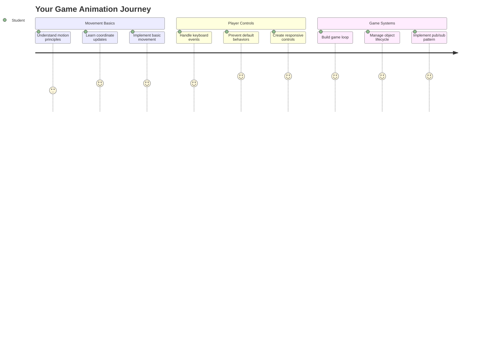
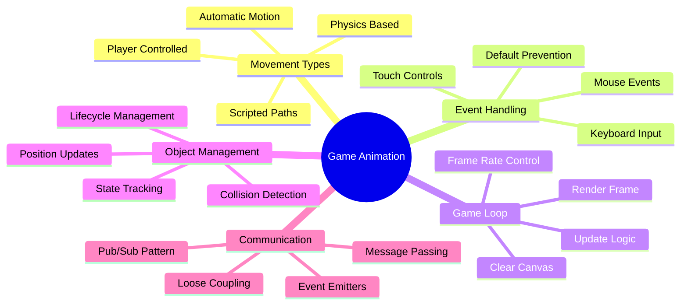
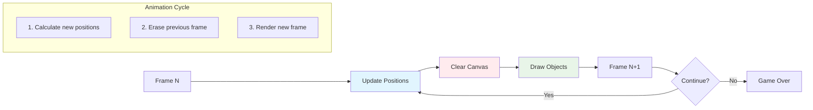
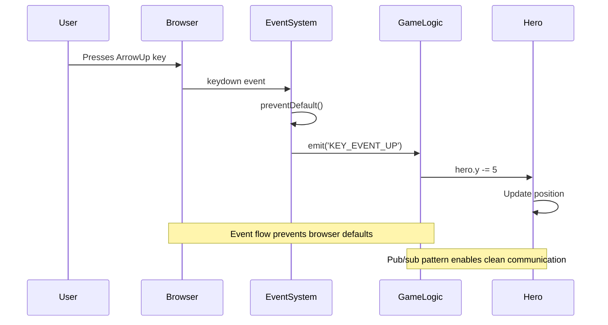
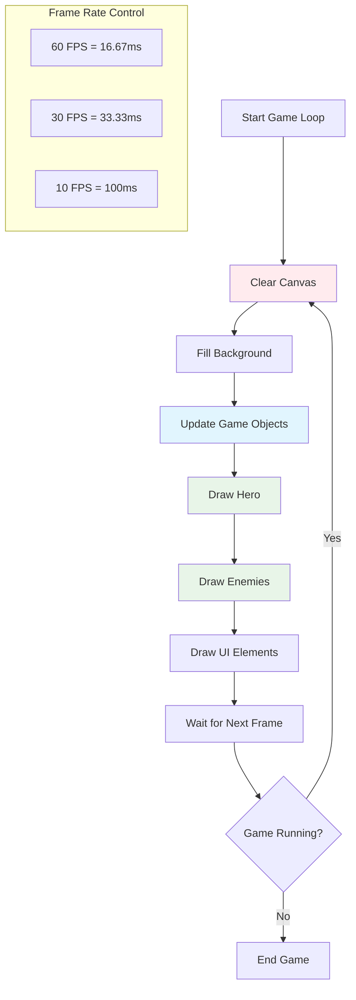
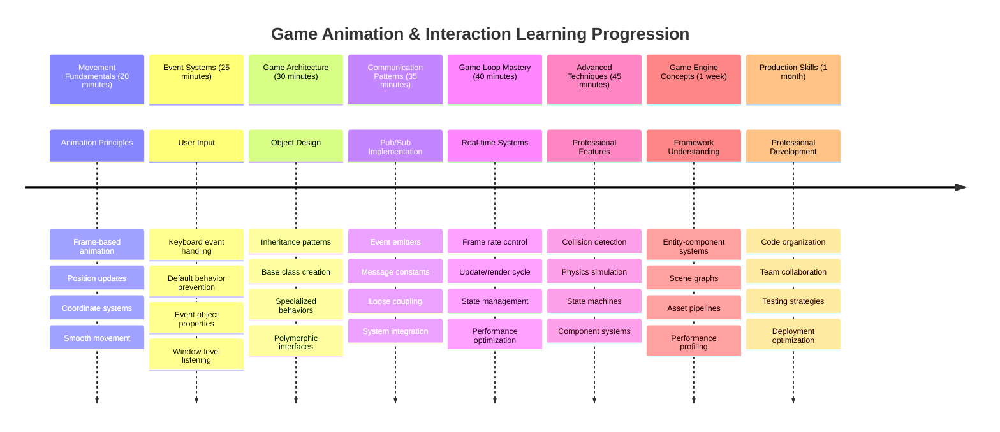

# Construindo um Jogo Espacial Parte 3: Adicionando Movimento



Pense nos seus jogos favoritos – o que os torna cativantes não são apenas os gráficos bonitos, mas a forma como tudo se move e responde às suas ações. No momento, seu jogo espacial é como uma pintura bonita, mas estamos prestes a adicionar movimento que o trará à vida.

Quando os engenheiros da NASA programaram o computador de orientação para as missões Apollo, enfrentaram um desafio semelhante: como fazer uma espaçonave responder aos comandos do piloto enquanto mantém correções automáticas de curso? Os princípios que aprenderemos hoje ecoam esses mesmos conceitos – gerenciar o movimento controlado pelo jogador junto com comportamentos automáticos do sistema.

Nesta lição, você aprenderá como fazer as naves espaciais deslizar pela tela, responder aos comandos do jogador e criar padrões de movimento suaves. Vamos dividir tudo em conceitos gerenciáveis que se constroem naturalmente uns sobre os outros.

Ao final, os jogadores estarão pilotando sua nave heroica pela tela enquanto as naves inimigas patrulham acima. Mais importante, você entenderá os princípios fundamentais que alimentam os sistemas de movimento dos jogos.



## Quiz Pré-Aula

[Quiz pré-aula](https://ff-quizzes.netlify.app/web/quiz/33)

## Entendendo o Movimento em Jogos

Os jogos ganham vida quando as coisas começam a se mover, e existem fundamentalmente duas maneiras de isso acontecer:

- **Movimento controlado pelo jogador**: Quando você pressiona uma tecla ou clica com o mouse, algo se move. Esta é a conexão direta entre você e o mundo do jogo.
- **Movimento automático**: Quando o próprio jogo decide mover as coisas – como aquelas naves inimigas que precisam patrulhar a tela, independentemente do que você esteja fazendo.

Fazer objetos se moverem na tela de um computador é mais simples do que você imagina. Lembra-se das coordenadas x e y da aula de matemática? É exatamente isso que estamos trabalhando aqui. Quando Galileu rastreou as luas de Júpiter em 1610, ele estava essencialmente fazendo a mesma coisa – plotando posições ao longo do tempo para entender os padrões de movimento.

Mover coisas na tela é como criar uma animação de flipbook – você precisa seguir estes três passos simples:



1. **Atualizar a posição** – Alterar onde seu objeto deve estar (talvez movê-lo 5 pixels para a direita)
2. **Apagar o quadro antigo** – Limpar a tela para que você não veja rastros fantasmagóricos por toda parte
3. **Desenhar o novo quadro** – Colocar seu objeto em sua nova posição

Faça isso rápido o suficiente e pronto! Você terá um movimento suave que parece natural para os jogadores.

Veja como isso pode ser no código:

```javascript
// Set the hero's location
hero.x += 5;
// Clear the rectangle that hosts the hero
ctx.clearRect(0, 0, canvas.width, canvas.height);
// Redraw the game background and hero
ctx.fillRect(0, 0, canvas.width, canvas.height);
ctx.fillStyle = "black";
ctx.drawImage(heroImg, hero.x, hero.y);
```

**O que este código faz:**
- **Atualiza** a coordenada x do herói em 5 pixels para movê-lo horizontalmente
- **Limpa** toda a área do canvas para remover o quadro anterior
- **Preenche** o canvas com uma cor de fundo preta
- **Redesenha** a imagem do herói em sua nova posição

✅ Você consegue pensar em um motivo pelo qual redesenhar seu herói muitos quadros por segundo pode gerar custos de desempenho? Leia sobre [alternativas para este padrão](https://developer.mozilla.org/en-US/docs/Web/API/Canvas_API/Tutorial/Optimizing_canvas).

## Manipular eventos de teclado

É aqui que conectamos a entrada do jogador à ação do jogo. Quando alguém aperta a barra de espaço para disparar um laser ou toca uma tecla de seta para desviar de um asteroide, seu jogo precisa detectar e responder a essa entrada.

Eventos de teclado acontecem no nível da janela, o que significa que toda a janela do navegador está ouvindo essas teclas pressionadas. Cliques do mouse, por outro lado, podem ser vinculados a elementos específicos (como clicar em um botão). Para nosso jogo espacial, vamos focar nos controles de teclado, já que é isso que dá aos jogadores aquela sensação clássica de arcade.

Isso me lembra como os operadores de telégrafo no século XIX tinham que traduzir entradas de código Morse em mensagens significativas – estamos fazendo algo semelhante, traduzindo teclas pressionadas em comandos de jogo.

Para lidar com um evento, você precisa usar o método `addEventListener()` da janela e fornecer dois parâmetros de entrada. O primeiro parâmetro é o nome do evento, por exemplo, `keyup`. O segundo parâmetro é a função que deve ser invocada como resultado do evento.

Aqui está um exemplo:

```javascript
window.addEventListener('keyup', (evt) => {
  // evt.key = string representation of the key
  if (evt.key === 'ArrowUp') {
    // do something
  }
});
```

**Desmembrando o que acontece aqui:**
- **Escuta** eventos de teclado em toda a janela
- **Captura** o objeto de evento que contém informações sobre qual tecla foi pressionada
- **Verifica** se a tecla pressionada corresponde a uma tecla específica (neste caso, a seta para cima)
- **Executa** o código quando a condição é atendida

Para eventos de tecla, há duas propriedades no evento que você pode usar para ver qual tecla foi pressionada:

- `key` - esta é uma representação em string da tecla pressionada, por exemplo, `'ArrowUp'`
- `keyCode` - esta é uma representação numérica, por exemplo, `37`, que corresponde a `ArrowLeft`

✅ Manipulação de eventos de tecla é útil fora do desenvolvimento de jogos. Que outros usos você consegue pensar para esta técnica?



### Teclas especiais: um aviso!

Algumas teclas têm comportamentos embutidos no navegador que podem interferir no seu jogo. As teclas de seta rolam a página e a barra de espaço pula para baixo – comportamentos que você não quer quando alguém está tentando pilotar sua nave espacial.

Podemos evitar esses comportamentos padrão e deixar nosso jogo lidar com a entrada. Isso é semelhante a como os primeiros programadores de computadores tinham que substituir interrupções do sistema para criar comportamentos personalizados – estamos apenas fazendo isso no nível do navegador. Veja como:

```javascript
const onKeyDown = function (e) {
  console.log(e.keyCode);
  switch (e.keyCode) {
    case 37:
    case 39:
    case 38:
    case 40: // Arrow keys
    case 32:
      e.preventDefault();
      break; // Space
    default:
      break; // do not block other keys
  }
};

window.addEventListener('keydown', onKeyDown);
```

**Entendendo este código de prevenção:**
- **Verifica** códigos de tecla específicos que podem causar comportamentos indesejados no navegador
- **Previne** a ação padrão do navegador para teclas de seta e barra de espaço
- **Permite** que outras teclas funcionem normalmente
- **Usa** `e.preventDefault()` para interromper o comportamento embutido do navegador

### 🔄 **Verificação Pedagógica**
**Compreensão de Manipulação de Eventos**: Antes de passar para o movimento automático, certifique-se de que você pode:
- ✅ Explicar a diferença entre eventos `keydown` e `keyup`
- ✅ Entender por que evitamos comportamentos padrão do navegador
- ✅ Descrever como os ouvintes de eventos conectam a entrada do usuário à lógica do jogo
- ✅ Identificar quais teclas podem interferir nos controles do jogo

**Auto-Teste Rápido**: O que aconteceria se você não evitasse o comportamento padrão para as teclas de seta?
*Resposta: O navegador rolaria a página, interferindo no movimento do jogo*

**Arquitetura do Sistema de Eventos**: Agora você entende:
- **Escuta no nível da janela**: Captura de eventos no nível do navegador
- **Propriedades do objeto de evento**: Strings `key` vs números `keyCode`
- **Prevenção padrão**: Interrompendo comportamentos indesejados do navegador
- **Lógica condicional**: Respondendo a combinações específicas de teclas

## Movimento induzido pelo jogo

Agora vamos falar sobre objetos que se movem sem entrada do jogador. Pense em naves inimigas cruzando a tela, balas voando em linhas retas ou nuvens flutuando ao fundo. Esse movimento autônomo faz com que o mundo do jogo pareça vivo, mesmo quando ninguém está tocando nos controles.

Usamos temporizadores embutidos do JavaScript para atualizar posições em intervalos regulares. Este conceito é semelhante ao funcionamento de relógios de pêndulo – um mecanismo regular que aciona ações consistentes e cronometradas. Veja como pode ser simples:

```javascript
const id = setInterval(() => {
  // Move the enemy on the y axis
  enemy.y += 10;
}, 100);
```

**O que este código de movimento faz:**
- **Cria** um temporizador que executa a cada 100 milissegundos
- **Atualiza** a coordenada y do inimigo em 10 pixels a cada vez
- **Armazena** o ID do intervalo para que possamos pará-lo mais tarde, se necessário
- **Move** o inimigo para baixo na tela automaticamente

## O loop do jogo

Aqui está o conceito que une tudo – o loop do jogo. Se seu jogo fosse um filme, o loop do jogo seria o projetor, mostrando quadro após quadro tão rápido que tudo parece se mover suavemente.

Todo jogo tem um desses loops rodando nos bastidores. É uma função que atualiza todos os objetos do jogo, redesenha a tela e repete esse processo continuamente. Isso mantém o controle do seu herói, todos os inimigos, quaisquer lasers voando por aí – todo o estado do jogo.

Este conceito me lembra como os primeiros animadores de filmes, como Walt Disney, tinham que redesenhar os personagens quadro a quadro para criar a ilusão de movimento. Estamos fazendo o mesmo, só que com código em vez de lápis.

Veja como um loop de jogo pode ser tipicamente expresso em código:



```javascript
const gameLoopId = setInterval(() => {
  function gameLoop() {
    ctx.clearRect(0, 0, canvas.width, canvas.height);
    ctx.fillStyle = "black";
    ctx.fillRect(0, 0, canvas.width, canvas.height);
    drawHero();
    drawEnemies();
    drawStaticObjects();
  }
  gameLoop();
}, 200);
```

**Entendendo a estrutura do loop do jogo:**
- **Limpa** todo o canvas para remover o quadro anterior
- **Preenche** o fundo com uma cor sólida
- **Desenha** todos os objetos do jogo em suas posições atuais
- **Repete** este processo a cada 200 milissegundos para criar animação suave
- **Gerencia** a taxa de quadros controlando o tempo do intervalo

## Continuando o Jogo Espacial

Agora vamos adicionar movimento à cena estática que você construiu anteriormente. Vamos transformá-la de uma captura de tela em uma experiência interativa. Vamos trabalhar nisso passo a passo para garantir que cada peça se construa sobre a anterior.

Pegue o código de onde paramos na lição anterior (ou comece com o código na pasta [Part II- starter](../../../../6-space-game/3-moving-elements-around/your-work) se precisar de um novo começo).

**O que estamos construindo hoje:**
- **Controles do herói**: As teclas de seta irão pilotar sua nave espacial pela tela
- **Movimento dos inimigos**: Essas naves alienígenas começarão seu avanço

Vamos começar a implementar esses recursos.

## Passos recomendados

Localize os arquivos que foram criados para você na subpasta `your-work`. Ela deve conter o seguinte:

```bash
-| assets
  -| enemyShip.png
  -| player.png
-| index.html
-| app.js
-| package.json
```

Você inicia seu projeto na pasta `your-work` digitando:

```bash
cd your-work
npm start
```

**O que este comando faz:**
- **Navega** até o diretório do seu projeto
- **Inicia** um servidor HTTP no endereço `http://localhost:5000`
- **Serve** seus arquivos de jogo para que você possa testá-los em um navegador

O comando acima iniciará um servidor HTTP no endereço `http://localhost:5000`. Abra um navegador e insira esse endereço, agora ele deve renderizar o herói e todos os inimigos; nada está se movendo - ainda!

### Adicionar código

1. **Adicione objetos dedicados** para `hero`, `enemy` e `game object`, eles devem ter propriedades `x` e `y`. (Lembre-se da parte sobre [Herança ou composição](../README.md)).

   *DICA* `game object` deve ser aquele com `x` e `y` e a capacidade de se desenhar em um canvas.

   > **Dica**: Comece adicionando uma nova classe `GameObject` com seu construtor delineado como abaixo, e depois desenhe-a no canvas:

    ```javascript
    class GameObject {
      constructor(x, y) {
        this.x = x;
        this.y = y;
        this.dead = false;
        this.type = "";
        this.width = 0;
        this.height = 0;
        this.img = undefined;
      }
    
      draw(ctx) {
        ctx.drawImage(this.img, this.x, this.y, this.width, this.height);
      }
    }
    ```

    **Entendendo esta classe base:**
    - **Define** propriedades comuns que todos os objetos do jogo compartilham (posição, tamanho, imagem)
    - **Inclui** uma bandeira `dead` para rastrear se o objeto deve ser removido
    - **Fornece** um método `draw()` que renderiza o objeto no canvas
    - **Define** valores padrão para todas as propriedades que as classes filhas podem sobrescrever

    ```mermaid
    classDiagram
        class GameObject {
            +x: number
            +y: number
            +dead: boolean
            +type: string
            +width: number
            +height: number
            +img: Image
            +draw(ctx)
        }
        
        class Hero {
            +speed: number
            +type: "Hero"
            +width: 98
            +height: 75
        }
        
        class Enemy {
            +type: "Enemy"
            +width: 98
            +height: 50
            +setInterval()
        }
        
        GameObject <|-- Hero
        GameObject <|-- Enemy
        
        class EventEmitter {
            +listeners: object
            +on(message, listener)
            +emit(message, payload)
        }
    ```

    Agora, estenda este `GameObject` para criar o `Hero` e o `Enemy`:
    
    ```javascript
    class Hero extends GameObject {
      constructor(x, y) {
        super(x, y);
        this.width = 98;
        this.height = 75;
        this.type = "Hero";
        this.speed = 5;
      }
    }
    ```

    ```javascript
    class Enemy extends GameObject {
      constructor(x, y) {
        super(x, y);
        this.width = 98;
        this.height = 50;
        this.type = "Enemy";
        const id = setInterval(() => {
          if (this.y < canvas.height - this.height) {
            this.y += 5;
          } else {
            console.log('Stopped at', this.y);
            clearInterval(id);
          }
        }, 300);
      }
    }
    ```

    **Conceitos-chave nestas classes:**
    - **Herdam** de `GameObject` usando a palavra-chave `extends`
    - **Chamam** o construtor pai com `super(x, y)`
    - **Definem** dimensões e propriedades específicas para cada tipo de objeto
    - **Implementam** movimento automático para inimigos usando `setInterval()`

2. **Adicione manipuladores de eventos de tecla** para lidar com a navegação por teclas (mover o herói para cima/baixo/esquerda/direita)

   *LEMBRE-SE* é um sistema cartesiano, o canto superior esquerdo é `0,0`. Também lembre-se de adicionar código para interromper *comportamentos padrão*

   > **Dica**: Crie sua função `onKeyDown` e conecte-a à janela:

   ```javascript
   const onKeyDown = function (e) {
     console.log(e.keyCode);
     // Add the code from the lesson above to stop default behavior
     switch (e.keyCode) {
       case 37:
       case 39:
       case 38:
       case 40: // Arrow keys
       case 32:
         e.preventDefault();
         break; // Space
       default:
         break; // do not block other keys
     }
   };

   window.addEventListener("keydown", onKeyDown);
   ```
    
   **O que este manipulador de eventos faz:**
   - **Escuta** eventos de tecla pressionada em toda a janela
   - **Registra** o código da tecla para ajudar você a depurar quais teclas estão sendo pressionadas
   - **Previne** o comportamento padrão do navegador para teclas de seta e barra de espaço
   - **Permite** que outras teclas funcionem normalmente
   
   Verifique o console do seu navegador neste ponto e observe as teclas sendo registradas. 

3. **Implemente** o [Padrão Pub-Sub](../README.md), isso manterá seu código limpo enquanto você segue as partes restantes.

   O padrão Publish-Subscribe ajuda a organizar seu código separando a detecção de eventos do tratamento de eventos. Isso torna seu código mais modular e fácil de manter.

   Para fazer esta última parte, você pode:

   1. **Adicionar um ouvinte de eventos** na janela:

       ```javascript
       window.addEventListener("keyup", (evt) => {
         if (evt.key === "ArrowUp") {
           eventEmitter.emit(Messages.KEY_EVENT_UP);
         } else if (evt.key === "ArrowDown") {
           eventEmitter.emit(Messages.KEY_EVENT_DOWN);
         } else if (evt.key === "ArrowLeft") {
           eventEmitter.emit(Messages.KEY_EVENT_LEFT);
         } else if (evt.key === "ArrowRight") {
           eventEmitter.emit(Messages.KEY_EVENT_RIGHT);
         }
       });
       ```

   **O que este sistema de eventos faz:**
   - **Detecta** entrada de teclado e a converte em eventos personalizados do jogo
   - **Separa** a detecção de entrada da lógica do jogo
   - **Facilita** a alteração dos controles mais tarde sem afetar o código do jogo
   - **Permite** que vários sistemas respondam à mesma entrada

   ```mermaid
   flowchart TD
       A["Keyboard Input"] --> B["Window Event Listener"]
       B --> C["Event Emitter"]
       C --> D["KEY_EVENT_UP"]
       C --> E["KEY_EVENT_DOWN"]
       C --> F["KEY_EVENT_LEFT"]
       C --> G["KEY_EVENT_RIGHT"]
       
       D --> H["Hero Movement"]
       D --> I["Sound System"]
       D --> J["Visual Effects"]
       
       E --> H
       F --> H
       G --> H
       
       style A fill:#e1f5fe
       style C fill:#e8f5e8
       style H fill:#fff3e0
   ```

   2. **Crie uma classe EventEmitter** para publicar e assinar mensagens:

       ```javascript
       class EventEmitter {
         constructor() {
           this.listeners = {};
         }
       
         on(message, listener) {
           if (!this.listeners[message]) {
             this.listeners[message] = [];
           }
           this.listeners[message].push(listener);
         }
       
   3. **Adicione constantes** e configure o EventEmitter:

       ```javascript
       const Messages = {
         KEY_EVENT_UP: "KEY_EVENT_UP",
         KEY_EVENT_DOWN: "KEY_EVENT_DOWN",
         KEY_EVENT_LEFT: "KEY_EVENT_LEFT",
         KEY_EVENT_RIGHT: "KEY_EVENT_RIGHT",
       };
       
       let heroImg, 
           enemyImg, 
           laserImg,
           canvas, ctx, 
           gameObjects = [], 
           hero, 
           eventEmitter = new EventEmitter();
       ```

   **Entendendo a configuração:**
   - **Define** constantes de mensagens para evitar erros de digitação e facilitar a refatoração
   - **Declara** variáveis para imagens, contexto do canvas e estado do jogo
   - **Cria** um emissor de eventos global para o sistema pub-sub
   - **Inicializa** um array para armazenar todos os objetos do jogo

   4. **Inicialize o jogo**

       ```javascript
       function initGame() {
         gameObjects = [];
         createEnemies();
         createHero();
       
         eventEmitter.on(Messages.KEY_EVENT_UP, () => {
           hero.y -= 5;
         });
       
         eventEmitter.on(Messages.KEY_EVENT_DOWN, () => {
           hero.y += 5;
         });
       
         eventEmitter.on(Messages.KEY_EVENT_LEFT, () => {
           hero.x -= 5;
         });
       
4. **Configure o loop do jogo**

   Refatore a função `window.onload` para inicializar o jogo e configurar um loop de jogo em um intervalo adequado. Você também adicionará um feixe de laser:

    ```javascript
    window.onload = async () => {
      canvas = document.getElementById("canvas");
      ctx = canvas.getContext("2d");
      heroImg = await loadTexture("assets/player.png");
      enemyImg = await loadTexture("assets/enemyShip.png");
      laserImg = await loadTexture("assets/laserRed.png");
    
      initGame();
      const gameLoopId = setInterval(() => {
        ctx.clearRect(0, 0, canvas.width, canvas.height);
        ctx.fillStyle = "black";
        ctx.fillRect(0, 0, canvas.width, canvas.height);
        drawGameObjects(ctx);
      }, 100);
    };
    ```

   **Entendendo a configuração do jogo:**
   - **Aguarda** o carregamento completo da página antes de iniciar
   - **Obtém** o elemento canvas e seu contexto de renderização 2D
   - **Carrega** todos os recursos de imagem de forma assíncrona usando `await`
   - **Inicia** o loop do jogo com intervalos de 100ms (10 FPS)
   - **Limpa** e redesenha toda a tela a cada quadro

5. **Adicione código** para mover os inimigos em um determinado intervalo

    Refatore a função `createEnemies()` para criar os inimigos e adicioná-los à nova classe gameObjects:

    ```javascript
    function createEnemies() {
      const MONSTER_TOTAL = 5;
      const MONSTER_WIDTH = MONSTER_TOTAL * 98;
      const START_X = (canvas.width - MONSTER_WIDTH) / 2;
      const STOP_X = START_X + MONSTER_WIDTH;
    
      for (let x = START_X; x < STOP_X; x += 98) {
        for (let y = 0; y < 50 * 5; y += 50) {
          const enemy = new Enemy(x, y);
          enemy.img = enemyImg;
          gameObjects.push(enemy);
        }
      }
    }
    ```

    **O que a criação de inimigos faz:**
    - **Calcula** posições para centralizar os inimigos na tela
    - **Cria** uma grade de inimigos usando loops aninhados
    - **Atribui** a imagem do inimigo a cada objeto inimigo
    - **Adiciona** cada inimigo ao array global de objetos do jogo
    
    e adicione uma função `createHero()` para realizar um processo semelhante para o herói.
    
    ```javascript
    function createHero() {
      hero = new Hero(
        canvas.width / 2 - 45,
        canvas.height - canvas.height / 4
      );
      hero.img = heroImg;
      gameObjects.push(hero);
    }
    ```

    **O que a criação do herói faz:**
    - **Posiciona** o herói na parte inferior central da tela
    - **Atribui** a imagem do herói ao objeto herói
    - **Adiciona** o herói ao array de objetos do jogo para renderização

    e, por fim, adicione uma função `drawGameObjects()` para iniciar a renderização:

    ```javascript
    function drawGameObjects(ctx) {
      gameObjects.forEach(go => go.draw(ctx));
    }
    ```

    **Entendendo a função de renderização:**
    - **Itera** por todos os objetos do jogo no array
    - **Chama** o método `draw()` em cada objeto
    - **Passa** o contexto do canvas para que os objetos possam se renderizar

    ### 🔄 **Check-in Pedagógico**
    **Compreensão Completa do Sistema de Jogo**: Verifique sua compreensão de toda a arquitetura:
    - ✅ Como a herança permite que Hero e Enemy compartilhem propriedades comuns de GameObject?
    - ✅ Por que o padrão pub/sub torna seu código mais fácil de manter?
    - ✅ Qual é o papel do loop do jogo na criação de animações suaves?
    - ✅ Como os event listeners conectam a entrada do usuário ao comportamento dos objetos do jogo?

    **Integração do Sistema**: Seu jogo agora demonstra:
    - **Design Orientado a Objetos**: Classes base com herança especializada
    - **Arquitetura Orientada a Eventos**: Padrão pub/sub para acoplamento flexível
    - **Framework de Animação**: Loop de jogo com atualizações consistentes de quadros
    - **Manipulação de Entrada**: Eventos de teclado com prevenção padrão
    - **Gerenciamento de Recursos**: Carregamento de imagens e renderização de sprites

    **Padrões Profissionais**: Você implementou:
    - **Separação de Responsabilidades**: Entrada, lógica e renderização separadas
    - **Polimorfismo**: Todos os objetos do jogo compartilham uma interface de desenho comum
    - **Passagem de Mensagens**: Comunicação limpa entre componentes
    - **Gerenciamento de Recursos**: Manipulação eficiente de sprites e animações

    Seus inimigos devem começar a avançar em direção à sua nave heroica!
      }
    }
    ```
    
    and add a `createHero()` function to do a similar process for the hero.
    
    ```javascript
    function createHero() {
      hero = new Hero(
        canvas.width / 2 - 45,
        canvas.height - canvas.height / 4
      );
      hero.img = heroImg;
      gameObjects.push(hero);
    }
    ```

    e, por fim, adicione uma função `drawGameObjects()` para iniciar a renderização:

    ```javascript
    function drawGameObjects(ctx) {
      gameObjects.forEach(go => go.draw(ctx));
    }
    ```

    Seus inimigos devem começar a avançar em direção à sua nave heroica!

---

## Desafio do Agente GitHub Copilot 🚀

Aqui está um desafio que vai melhorar o polimento do seu jogo: adicionar limites e controles suaves. Atualmente, seu herói pode sair da tela, e o movimento pode parecer brusco.

**Sua missão:** Faça sua nave espacial parecer mais realista implementando limites de tela e movimento fluido. Quando os jogadores mantêm pressionada uma tecla de seta, a nave deve deslizar continuamente em vez de se mover em passos discretos. Considere adicionar um feedback visual quando a nave atingir os limites da tela – talvez um efeito sutil para indicar o limite da área de jogo.

Saiba mais sobre o [modo agente](https://code.visualstudio.com/blogs/2025/02/24/introducing-copilot-agent-mode) aqui.

## 🚀 Desafio

A organização do código se torna cada vez mais importante à medida que os projetos crescem. Você pode ter notado que seu arquivo está ficando cheio de funções, variáveis e classes misturadas. Isso me lembra como os engenheiros que organizaram o código da missão Apollo tiveram que criar sistemas claros e fáceis de manter para que várias equipes pudessem trabalhar simultaneamente.

**Sua missão:**
Pense como um arquiteto de software. Como você organizaria seu código para que, daqui a seis meses, você (ou um colega) pudesse entender o que está acontecendo? Mesmo que tudo permaneça em um único arquivo por enquanto, você pode criar uma organização melhor:

- **Agrupar funções relacionadas** com cabeçalhos de comentários claros
- **Separar responsabilidades** - mantenha a lógica do jogo separada da renderização
- **Usar convenções de nomenclatura consistentes** para variáveis e funções
- **Criar módulos** ou namespaces para organizar diferentes aspectos do seu jogo
- **Adicionar documentação** que explique o propósito de cada seção principal

**Perguntas para reflexão:**
- Quais partes do seu código são mais difíceis de entender quando você volta a elas?
- Como você poderia organizar seu código para torná-lo mais fácil para outra pessoa contribuir?
- O que aconteceria se você quisesse adicionar novos recursos como power-ups ou diferentes tipos de inimigos?

## Quiz Pós-Aula

[Quiz pós-aula](https://ff-quizzes.netlify.app/web/quiz/34)

## Revisão & Autoestudo

Estamos construindo tudo do zero, o que é fantástico para aprender, mas aqui vai um pequeno segredo – existem alguns frameworks incríveis de JavaScript que podem lidar com grande parte do trabalho pesado para você. Assim que você se sentir confortável com os fundamentos que abordamos, vale a pena [explorar o que está disponível](https://github.com/collections/javascript-game-engines).

Pense nos frameworks como ter uma caixa de ferramentas bem equipada em vez de fazer cada ferramenta à mão. Eles podem resolver muitos desses desafios de organização de código que mencionamos, além de oferecer recursos que levariam semanas para você desenvolver sozinho.

**Coisas que valem a pena explorar:**
- Como os motores de jogo organizam o código – você ficará impressionado com os padrões inteligentes que eles usam
- Truques de desempenho para fazer jogos em canvas rodarem de forma super suave  
- Recursos modernos do JavaScript que podem tornar seu código mais limpo e fácil de manter
- Diferentes abordagens para gerenciar objetos do jogo e suas relações

## 🎯 Sua Linha do Tempo de Domínio de Animação de Jogos



### 🛠️ Resumo da Sua Caixa de Ferramentas de Desenvolvimento de Jogos

Após concluir esta lição, você agora domina:
- **Princípios de Animação**: Movimento baseado em quadros e transições suaves
- **Programação Orientada a Eventos**: Manipulação de entrada de teclado com gerenciamento adequado de eventos
- **Design Orientado a Objetos**: Hierarquias de herança e interfaces polimórficas
- **Padrões de Comunicação**: Arquitetura pub/sub para código fácil de manter
- **Arquitetura de Loop de Jogo**: Atualização em tempo real e ciclos de renderização
- **Sistemas de Entrada**: Mapeamento de controle do usuário com prevenção de comportamento padrão
- **Gerenciamento de Recursos**: Carregamento de sprites e técnicas de renderização eficientes

### ⚡ **O Que Você Pode Fazer nos Próximos 5 Minutos**
- [ ] Abra o console do navegador e experimente `addEventListener('keydown', console.log)` para ver eventos de teclado
- [ ] Crie um elemento div simples e mova-o usando as teclas de seta
- [ ] Experimente com `setInterval` para criar movimento contínuo
- [ ] Tente prevenir o comportamento padrão com `event.preventDefault()`

### 🎯 **O Que Você Pode Realizar Nesta Hora**
- [ ] Complete o quiz pós-aula e entenda a programação orientada a eventos
- [ ] Construa a nave heroica em movimento com controles completos de teclado
- [ ] Implemente padrões de movimento suaves para os inimigos
- [ ] Adicione limites para evitar que objetos do jogo saiam da tela
- [ ] Crie detecção básica de colisão entre objetos do jogo

### 📅 **Sua Jornada de Animação Durante a Semana**
- [ ] Complete o jogo espacial completo com movimento e interações polidas
- [ ] Adicione padrões de movimento avançados como curvas, aceleração e física
- [ ] Implemente transições suaves e funções de easing
- [ ] Crie efeitos de partículas e sistemas de feedback visual
- [ ] Otimize o desempenho do jogo para uma jogabilidade suave a 60fps
- [ ] Adicione controles de toque para dispositivos móveis e design responsivo

### 🌟 **Seu Desenvolvimento Interativo Durante o Mês**
- [ ] Construa aplicativos interativos complexos com sistemas avançados de animação
- [ ] Aprenda bibliotecas de animação como GSAP ou crie seu próprio motor de animação
- [ ] Contribua para projetos de desenvolvimento de jogos e animação de código aberto
- [ ] Domine a otimização de desempenho para aplicativos gráficos intensivos
- [ ] Crie conteúdo educacional sobre desenvolvimento de jogos e animação
- [ ] Construa um portfólio mostrando habilidades avançadas de programação interativa

**Aplicações no Mundo Real**: Suas habilidades de animação de jogos se aplicam diretamente a:
- **Aplicativos Web Interativos**: Dashboards dinâmicos e interfaces em tempo real
- **Visualização de Dados**: Gráficos animados e gráficos interativos
- **Software Educacional**: Simulações interativas e ferramentas de aprendizado
- **Desenvolvimento Mobile**: Jogos baseados em toque e manipulação de gestos
- **Aplicativos Desktop**: Apps Electron com animações suaves
- **Animações Web**: Bibliotecas de animação CSS e JavaScript

**Habilidades Profissionais Adquiridas**: Agora você pode:
- **Arquitetar** sistemas orientados a eventos que escalam com complexidade
- **Implementar** animações suaves usando princípios matemáticos
- **Depurar** sistemas de interação complexos usando ferramentas de desenvolvedor do navegador
- **Otimizar** o desempenho do jogo para diferentes dispositivos e navegadores
- **Projetar** estruturas de código fáceis de manter usando padrões comprovados

**Conceitos de Desenvolvimento de Jogos Dominados**:
- **Gerenciamento de Taxa de Quadros**: Compreensão de FPS e controles de tempo
- **Manipulação de Entrada**: Sistemas de teclado e eventos multiplataforma
- **Ciclo de Vida de Objetos**: Padrões de criação, atualização e destruição
- **Sincronização de Estado**: Manter o estado do jogo consistente entre os quadros
- **Arquitetura de Eventos**: Comunicação desacoplada entre sistemas de jogo

**Próximo Nível**: Você está pronto para adicionar detecção de colisão, sistemas de pontuação, efeitos sonoros ou explorar frameworks modernos de jogos como Phaser ou Three.js!

🌟 **Conquista Desbloqueada**: Você construiu um sistema de jogo interativo completo com padrões de arquitetura profissional!

## Tarefa

[Comente seu código](assignment.md)

---

**Aviso Legal**:  
Este documento foi traduzido utilizando o serviço de tradução por IA [Co-op Translator](https://github.com/Azure/co-op-translator). Embora nos esforcemos para garantir a precisão, esteja ciente de que traduções automáticas podem conter erros ou imprecisões. O documento original em seu idioma nativo deve ser considerado a fonte autoritativa. Para informações críticas, recomenda-se a tradução profissional humana. Não nos responsabilizamos por quaisquer mal-entendidos ou interpretações incorretas decorrentes do uso desta tradução.