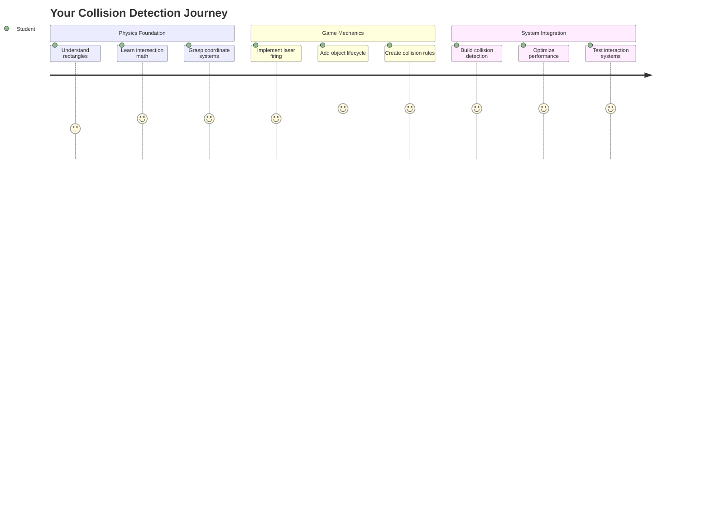
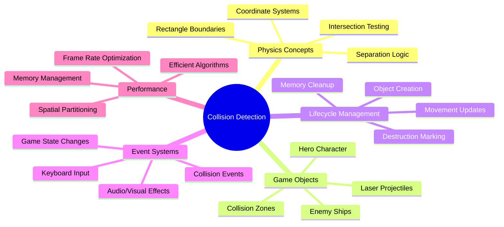
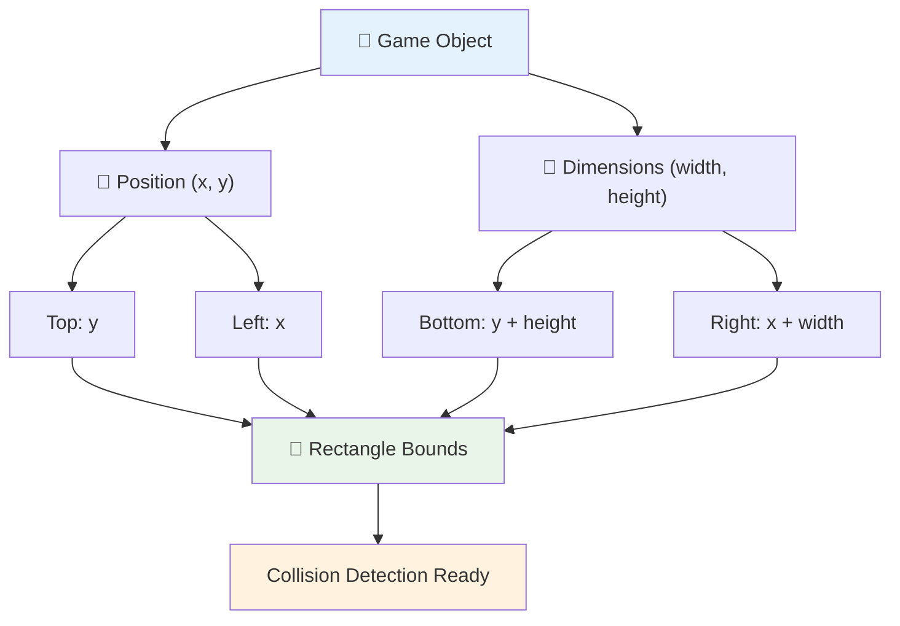
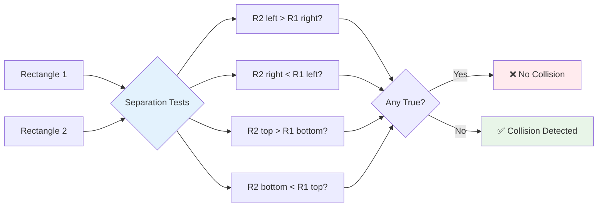
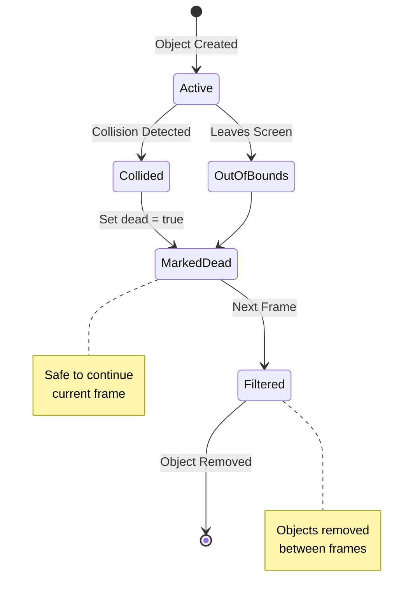
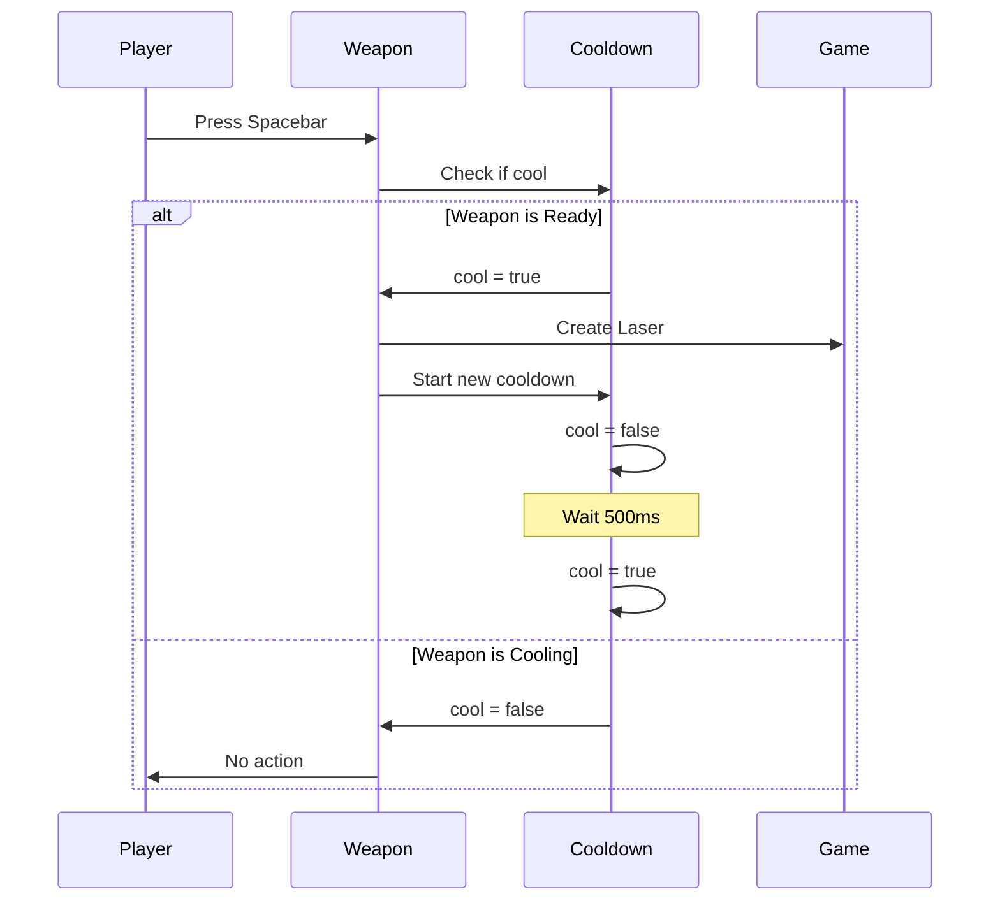
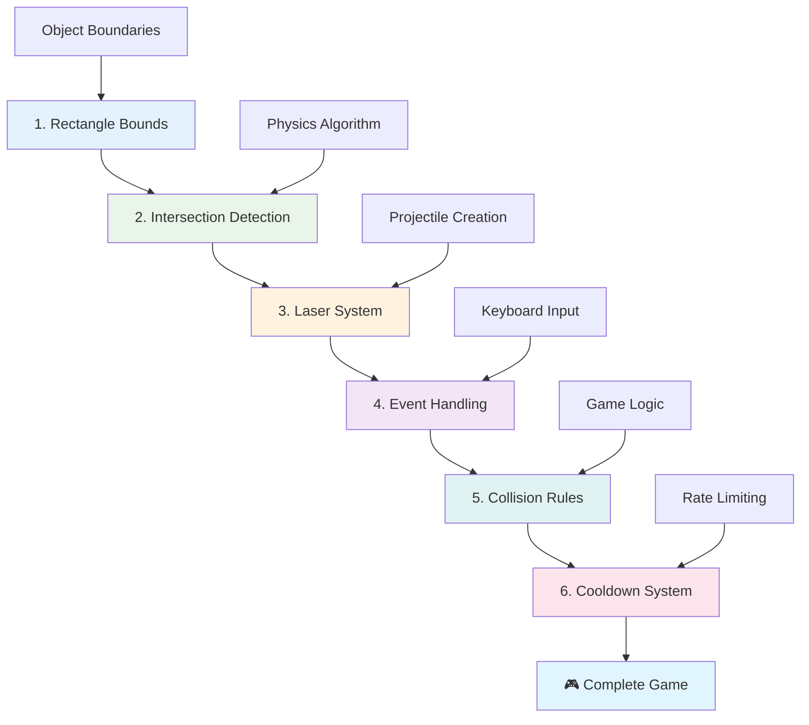
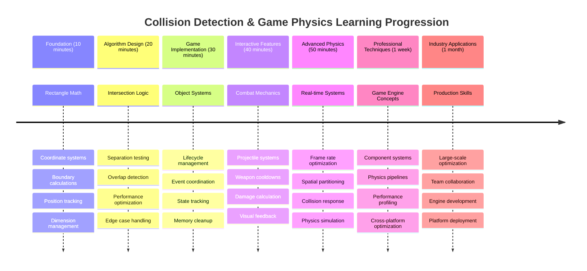

# Construindo um Jogo Espacial Parte 4: Adicionando um Laser e Detectando Colisões



## Quiz Pré-Aula

[Quiz pré-aula](https://ff-quizzes.netlify.app/web/quiz/35)

Pense no momento em Star Wars quando os torpedos de prótons de Luke atingiram o porto de exaustão da Estrela da Morte. Aquela detecção precisa de colisão mudou o destino da galáxia! Nos jogos, a detecção de colisão funciona da mesma forma - ela determina quando os objetos interagem e o que acontece em seguida.

Nesta lição, você adicionará armas de laser ao seu jogo espacial e implementará a detecção de colisões. Assim como os planejadores de missão da NASA calculam as trajetórias das espaçonaves para evitar detritos, você aprenderá a detectar quando os objetos do jogo se cruzam. Vamos dividir isso em etapas gerenciáveis que se complementam.

Ao final, você terá um sistema de combate funcional onde lasers destroem inimigos e colisões desencadeiam eventos no jogo. Esses mesmos princípios de colisão são usados em tudo, desde simulações de física até interfaces web interativas.



✅ Faça uma pequena pesquisa sobre o primeiro jogo de computador já criado. Qual era sua funcionalidade?

## Detecção de colisão

A detecção de colisão funciona como os sensores de proximidade do módulo lunar Apollo - verifica constantemente as distâncias e dispara alertas quando os objetos se aproximam demais. Nos jogos, esse sistema determina quando os objetos interagem e o que deve acontecer em seguida.

A abordagem que usaremos trata cada objeto do jogo como um retângulo, semelhante à forma como os sistemas de controle de tráfego aéreo usam formas geométricas simplificadas para rastrear aeronaves. Esse método retangular pode parecer básico, mas é computacionalmente eficiente e funciona bem para a maioria dos cenários de jogos.

### Representação de retângulo

Cada objeto do jogo precisa de limites de coordenadas, semelhante à forma como o rover Mars Pathfinder mapeou sua localização na superfície de Marte. Veja como definimos essas coordenadas de limite:



```javascript
rectFromGameObject() {
  return {
    top: this.y,
    left: this.x,
    bottom: this.y + this.height,
    right: this.x + this.width
  }
}
```

**Vamos detalhar isso:**
- **Borda superior**: É onde seu objeto começa verticalmente (sua posição y)
- **Borda esquerda**: Onde começa horizontalmente (sua posição x)
- **Borda inferior**: Adicione a altura à posição y - agora você sabe onde termina!
- **Borda direita**: Adicione a largura à posição x - e você terá o limite completo

### Algoritmo de interseção

Detectar interseções de retângulos usa lógica semelhante à forma como o Telescópio Espacial Hubble determina se objetos celestes estão se sobrepondo em seu campo de visão. O algoritmo verifica a separação:



```javascript
function intersectRect(r1, r2) {
  return !(r2.left > r1.right ||
    r2.right < r1.left ||
    r2.top > r1.bottom ||
    r2.bottom < r1.top);
}
```

**O teste de separação funciona como sistemas de radar:**
- O retângulo 2 está completamente à direita do retângulo 1?
- O retângulo 2 está completamente à esquerda do retângulo 1?
- O retângulo 2 está completamente abaixo do retângulo 1?
- O retângulo 2 está completamente acima do retângulo 1?

Se nenhuma dessas condições for verdadeira, os retângulos devem estar se sobrepondo. Essa abordagem reflete como os operadores de radar determinam se duas aeronaves estão a distâncias seguras.

## Gerenciando ciclos de vida dos objetos

Quando um laser atinge um inimigo, ambos os objetos precisam ser removidos do jogo. No entanto, excluir objetos no meio do loop pode causar falhas - uma lição aprendida da maneira mais difícil em sistemas de computador antigos, como o Apollo Guidance Computer. Em vez disso, usamos uma abordagem de "marcar para exclusão" que remove objetos com segurança entre os quadros.



Veja como marcamos algo para remoção:

```javascript
// Mark object for removal
enemy.dead = true;
```

**Por que essa abordagem funciona:**
- Marcamos o objeto como "morto", mas não o excluímos imediatamente
- Isso permite que o quadro atual do jogo termine com segurança
- Sem falhas ao tentar usar algo que já foi removido!

Depois, filtramos os objetos marcados antes do próximo ciclo de renderização:

```javascript
gameObjects = gameObjects.filter(go => !go.dead);
```

**O que essa filtragem faz:**
- Cria uma lista nova com apenas os objetos "vivos"
- Remove tudo que foi marcado como morto
- Mantém o jogo funcionando sem problemas
- Evita acúmulo de memória com objetos destruídos

## Implementando mecânicas de laser

Projéteis de laser em jogos funcionam no mesmo princípio dos torpedos de fótons em Star Trek - são objetos discretos que viajam em linhas retas até atingirem algo. Cada vez que a barra de espaço é pressionada, um novo objeto de laser é criado e se move pela tela.

Para fazer isso funcionar, precisamos coordenar algumas peças diferentes:

**Componentes principais para implementar:**
- **Criar** objetos de laser que surgem da posição do herói
- **Lidar** com entrada do teclado para disparar lasers
- **Gerenciar** movimento e ciclo de vida dos lasers
- **Implementar** representação visual para os projéteis de laser

## Implementando controle de taxa de disparo

Taxas de disparo ilimitadas sobrecarregariam o motor do jogo e tornariam o jogo muito fácil. Sistemas de armas reais enfrentam restrições semelhantes - até os phasers da USS Enterprise precisavam de tempo para recarregar entre os disparos.

Implementaremos um sistema de cooldown que impede disparos rápidos enquanto mantém controles responsivos:



```javascript
class Cooldown {
  constructor(time) {
    this.cool = false;
    setTimeout(() => {
      this.cool = true;
    }, time);
  }
}

class Weapon {
  constructor() {
    this.cooldown = null;
  }
  
  fire() {
    if (!this.cooldown || this.cooldown.cool) {
      // Create laser projectile
      this.cooldown = new Cooldown(500);
    } else {
      // Weapon is still cooling down
    }
  }
}
```

**Como o cooldown funciona:**
- Quando criado, a arma começa "quente" (não pode disparar ainda)
- Após o período de espera, ela se torna "fria" (pronta para disparar)
- Antes de disparar, verificamos: "A arma está fria?"
- Isso impede cliques repetidos enquanto mantém controles responsivos

✅ Consulte a lição 1 da série de jogos espaciais para relembrar sobre cooldowns.

## Construindo o sistema de colisão

Você ampliará o código existente do seu jogo espacial para criar um sistema de detecção de colisão. Como o sistema automatizado de prevenção de colisões da Estação Espacial Internacional, seu jogo monitorará continuamente as posições dos objetos e responderá às interseções.

A partir do código da lição anterior, você adicionará detecção de colisão com regras específicas que governam as interações dos objetos.

> 💡 **Dica Pro**: O sprite do laser já está incluído na sua pasta de recursos e referenciado no seu código, pronto para implementação.

### Regras de colisão para implementar

**Mecânicas do jogo para adicionar:**
1. **Laser atinge inimigo**: O objeto inimigo é destruído quando atingido por um projétil de laser
2. **Laser atinge limite da tela**: O laser é removido ao alcançar a borda superior da tela
3. **Colisão entre inimigo e herói**: Ambos os objetos são destruídos quando se cruzam
4. **Inimigo alcança o fundo**: Condição de fim de jogo quando os inimigos chegam ao fundo da tela

### 🔄 **Verificação Pedagógica**
**Fundamentos da Detecção de Colisão**: Antes de implementar, certifique-se de entender:
- ✅ Como os limites de retângulo definem zonas de colisão
- ✅ Por que o teste de separação é mais eficiente do que o cálculo de interseção
- ✅ A importância do gerenciamento do ciclo de vida dos objetos nos loops de jogo
- ✅ Como sistemas baseados em eventos coordenam respostas a colisões

**Autoavaliação Rápida**: O que aconteceria se você excluísse objetos imediatamente em vez de marcá-los?
*Resposta: A exclusão no meio do loop poderia causar falhas ou pular objetos na iteração*

**Compreensão Física**: Agora você entende:
- **Sistemas de Coordenadas**: Como posição e dimensões criam limites
- **Lógica de Interseção**: Princípios matemáticos por trás da detecção de colisão
- **Otimização de Desempenho**: Por que algoritmos eficientes são importantes em sistemas em tempo real
- **Gerenciamento de Memória**: Padrões seguros de ciclo de vida de objetos para estabilidade

## Configurando seu ambiente de desenvolvimento

Boa notícia - já preparamos a maior parte da base para você! Todos os seus recursos de jogo e estrutura básica estão esperando na subpasta `your-work`, prontos para você adicionar os recursos legais de colisão.

### Estrutura do projeto

```bash
-| assets
  -| enemyShip.png
  -| player.png
  -| laserRed.png
-| index.html
-| app.js
-| package.json
```

**Entendendo a estrutura de arquivos:**
- **Contém** todas as imagens de sprites necessárias para os objetos do jogo
- **Inclui** o documento HTML principal e o arquivo de aplicação JavaScript
- **Fornece** configuração de pacote para servidor de desenvolvimento local

### Iniciando o servidor de desenvolvimento

Navegue até sua pasta de projeto e inicie o servidor local:

```bash
cd your-work
npm start
```

**Essa sequência de comandos:**
- **Altera** o diretório para sua pasta de trabalho do projeto
- **Inicia** um servidor HTTP local em `http://localhost:5000`
- **Serve** seus arquivos de jogo para teste e desenvolvimento
- **Permite** desenvolvimento ao vivo com recarregamento automático

Abra seu navegador e navegue até `http://localhost:5000` para ver o estado atual do seu jogo com o herói e os inimigos renderizados na tela.

### Implementação passo a passo

Como a abordagem sistemática que a NASA usou para programar a espaçonave Voyager, implementaremos a detecção de colisão metodicamente, construindo cada componente passo a passo.



#### 1. Adicionar limites de colisão retangulares

Primeiro, vamos ensinar nossos objetos do jogo a descrever seus limites. Adicione este método à sua classe `GameObject`:

```javascript
rectFromGameObject() {
    return {
      top: this.y,
      left: this.x,
      bottom: this.y + this.height,
      right: this.x + this.width,
    };
  }
```

**Este método realiza:**
- **Cria** um objeto retangular com coordenadas de limite precisas
- **Calcula** bordas inferior e direita usando posição mais dimensões
- **Retorna** um objeto pronto para algoritmos de detecção de colisão
- **Fornece** uma interface padronizada para todos os objetos do jogo

#### 2. Implementar detecção de interseção

Agora vamos criar nosso detetive de colisões - uma função que pode dizer quando dois retângulos estão se sobrepondo:

```javascript
function intersectRect(r1, r2) {
  return !(
    r2.left > r1.right ||
    r2.right < r1.left ||
    r2.top > r1.bottom ||
    r2.bottom < r1.top
  );
}
```

**Este algoritmo funciona ao:**
- **Testar** quatro condições de separação entre retângulos
- **Retornar** `false` se qualquer condição de separação for verdadeira
- **Indicar** colisão quando não há separação
- **Usar** lógica de negação para testes de interseção eficientes

#### 3. Implementar sistema de disparo de laser

Aqui é onde as coisas ficam emocionantes! Vamos configurar o sistema de disparo de laser.

##### Constantes de mensagens

Primeiro, vamos definir alguns tipos de mensagens para que diferentes partes do nosso jogo possam se comunicar:

```javascript
KEY_EVENT_SPACE: "KEY_EVENT_SPACE",
COLLISION_ENEMY_LASER: "COLLISION_ENEMY_LASER",
COLLISION_ENEMY_HERO: "COLLISION_ENEMY_HERO",
```

**Essas constantes fornecem:**
- **Padronizam** nomes de eventos em toda a aplicação
- **Permitem** comunicação consistente entre sistemas de jogo
- **Evitam** erros de digitação no registro de manipuladores de eventos

##### Manipulação de entrada do teclado

Adicione a detecção da tecla de espaço ao seu listener de eventos de teclado:

```javascript
} else if(evt.keyCode === 32) {
  eventEmitter.emit(Messages.KEY_EVENT_SPACE);
}
```

**Este manipulador de entrada:**
- **Detecta** pressionamentos da tecla de espaço usando keyCode 32
- **Emite** uma mensagem de evento padronizada
- **Permite** lógica de disparo desacoplada

##### Configuração de listener de eventos

Registre o comportamento de disparo na sua função `initGame()`:

```javascript
eventEmitter.on(Messages.KEY_EVENT_SPACE, () => {
 if (hero.canFire()) {
   hero.fire();
 }
});
```

**Este listener de eventos:**
- **Responde** a eventos da tecla de espaço
- **Verifica** o status de cooldown de disparo
- **Dispara** a criação de laser quando permitido

Adicione manipulação de colisão para interações entre laser e inimigo:

```javascript
eventEmitter.on(Messages.COLLISION_ENEMY_LASER, (_, { first, second }) => {
  first.dead = true;
  second.dead = true;
});
```

**Este manipulador de colisão:**
- **Recebe** dados de eventos de colisão com ambos os objetos
- **Marca** ambos os objetos para remoção
- **Garante** limpeza adequada após a colisão

#### 4. Criar a classe Laser

Implemente um projétil de laser que se move para cima e gerencia seu próprio ciclo de vida:

```javascript
class Laser extends GameObject {
  constructor(x, y) {
    super(x, y);
    this.width = 9;
    this.height = 33;
    this.type = 'Laser';
    this.img = laserImg;
    
    let id = setInterval(() => {
      if (this.y > 0) {
        this.y -= 15;
      } else {
        this.dead = true;
        clearInterval(id);
      }
    }, 100);
  }
}
```

**Esta implementação de classe:**
- **Estende** GameObject para herdar funcionalidade básica
- **Define** dimensões apropriadas para o sprite do laser
- **Cria** movimento automático para cima usando `setInterval()`
- **Lida** com autodestruição ao alcançar o topo da tela
- **Gerencia** seu próprio tempo de animação e limpeza

#### 5. Implementar sistema de detecção de colisão

Crie uma função abrangente de detecção de colisão:

```javascript
function updateGameObjects() {
  const enemies = gameObjects.filter(go => go.type === 'Enemy');
  const lasers = gameObjects.filter(go => go.type === "Laser");
  
  // Test laser-enemy collisions
  lasers.forEach((laser) => {
    enemies.forEach((enemy) => {
      if (intersectRect(laser.rectFromGameObject(), enemy.rectFromGameObject())) {
        eventEmitter.emit(Messages.COLLISION_ENEMY_LASER, {
          first: laser,
          second: enemy,
        });
      }
    });
  });

  // Remove destroyed objects
  gameObjects = gameObjects.filter(go => !go.dead);
}
```

**Este sistema de colisão:**
- **Filtra** objetos do jogo por tipo para testes eficientes
- **Testa** cada laser contra cada inimigo para interseções
- **Emite** eventos de colisão quando interseções são detectadas
- **Limpa** objetos destruídos após o processamento de colisões

> ⚠️ **Importante**: Adicione `updateGameObjects()` ao seu loop principal de jogo em `window.onload` para habilitar a detecção de colisão.

#### 6. Adicionar sistema de cooldown à classe Hero

Melhore a classe Hero com mecânicas de disparo e limitação de taxa:

```javascript
class Hero extends GameObject {
  constructor(x, y) {
    super(x, y);
    this.width = 99;
    this.height = 75;
    this.type = "Hero";
    this.speed = { x: 0, y: 0 };
    this.cooldown = 0;
  }
  
  fire() {
    gameObjects.push(new Laser(this.x + 45, this.y - 10));
    this.cooldown = 500;

    let id = setInterval(() => {
      if (this.cooldown > 0) {
        this.cooldown -= 100;
      } else {
        clearInterval(id);
      }
    }, 200);
  }
  
  canFire() {
    return this.cooldown === 0;
  }
}
```

**Entendendo a classe Hero aprimorada:**
- **Inicializa** o temporizador de cooldown em zero (pronto para disparar)
- **Cria** objetos de laser posicionados acima da nave do herói
- **Define** período de cooldown para evitar disparos rápidos
- **Decrementa** o temporizador de cooldown usando atualizações baseadas em intervalos
- **Fornece** verificação de status de disparo através do método `canFire()`

### 🔄 **Verificação Pedagógica**
**Compreensão Completa do Sistema**: Verifique sua maestria no sistema de colisão:
- ✅ Como os limites de retângulo permitem detecção de colisão eficiente?
- ✅ Por que o gerenciamento do ciclo de vida dos objetos é crítico para a estabilidade do jogo?
- ✅ Como o sistema de cooldown evita problemas de desempenho?
- ✅ Qual é o papel da arquitetura baseada em eventos na manipulação de colisões?

**Integração do Sistema**: Sua detecção de colisão demonstra:
- **Precisão Matemática**: Algoritmos de interseção de retângulos
- **Otimização de Desempenho**: Padrões de teste de colisão eficientes
- **Gerenciamento de Memória**: Criação e destruição segura de objetos
- **Coordenação de Eventos**: Comunicação desacoplada do sistema
- **Processamento em Tempo Real**: Ciclos de atualização baseados em quadros

**Padrões Profissionais**: Você implementou:
- **Separação de Preocupações**: Física, renderização e entrada separadas
- **Design Orientado a Objetos**: Herança e polimorfismo
- **Gerenciamento de Estado**: Rastreamento do ciclo de vida dos objetos e estado do jogo
- **Otimização de Desempenho**: Algoritmos eficientes para uso em tempo real

### Testando sua implementação

Seu jogo espacial agora apresenta detecção de colisão completa e mecânicas de combate. 🚀 Teste essas novas capacidades:
- **Navegue** com as teclas de seta para verificar os controles de movimento
- **Dispare lasers** com a barra de espaço - note como o cooldown impede cliques repetidos
- **Observe colisões** quando lasers atingem inimigos, desencadeando remoção
- **Verifique a limpeza** enquanto objetos destruídos desaparecem do jogo

Você implementou com sucesso um sistema de detecção de colisão usando os mesmos princípios matemáticos que orientam a navegação de espaçonaves e robótica.

### ⚡ **O que você pode fazer nos próximos 5 minutos**
- [ ] Abra as DevTools do navegador e configure pontos de interrupção na sua função de detecção de colisão
- [ ] Experimente modificar a velocidade do laser ou o movimento dos inimigos para observar os efeitos de colisão
- [ ] Teste diferentes valores de cooldown para experimentar taxas de disparo
- [ ] Adicione declarações `console.log` para monitorar eventos de colisão em tempo real

### 🎯 **O Que Você Pode Realizar Nesta Hora**
- [ ] Complete o quiz pós-aula e entenda os algoritmos de detecção de colisão
- [ ] Adicione efeitos visuais como explosões quando ocorrerem colisões
- [ ] Implemente diferentes tipos de projéteis com propriedades variadas
- [ ] Crie power-ups que aumentem temporariamente as habilidades do jogador
- [ ] Adicione efeitos sonoros para tornar as colisões mais satisfatórias

### 📅 **Sua Programação de Física para a Semana**
- [ ] Complete o jogo espacial completo com sistemas de colisão refinados
- [ ] Implemente formas de colisão avançadas além de retângulos (círculos, polígonos)
- [ ] Adicione sistemas de partículas para efeitos de explosão realistas
- [ ] Crie comportamentos complexos de inimigos com desvio de colisão
- [ ] Otimize a detecção de colisão para melhor desempenho com muitos objetos
- [ ] Adicione simulação de física como momento e movimento realista

### 🌟 **Sua Maestria em Física de Jogos para o Mês**
- [ ] Desenvolva jogos com motores de física avançados e simulações realistas
- [ ] Aprenda detecção de colisão em 3D e algoritmos de particionamento espacial
- [ ] Contribua para bibliotecas de física open source e motores de jogos
- [ ] Domine a otimização de desempenho para aplicações gráficas intensivas
- [ ] Crie conteúdo educacional sobre física de jogos e detecção de colisão
- [ ] Construa um portfólio que mostre habilidades avançadas em programação de física

## 🎯 Sua Linha do Tempo para Maestria em Detecção de Colisão



### 🛠️ Resumo do Seu Kit de Ferramentas de Física de Jogos

Após completar esta lição, você agora domina:
- **Matemática de Colisão**: Algoritmos de interseção de retângulos e sistemas de coordenadas
- **Otimização de Desempenho**: Detecção de colisão eficiente para aplicações em tempo real
- **Gerenciamento de Ciclo de Vida de Objetos**: Padrões seguros de criação, atualização e destruição
- **Arquitetura Orientada a Eventos**: Sistemas desacoplados para resposta a colisões
- **Integração com o Loop de Jogo**: Atualizações de física baseadas em quadros e coordenação de renderização
- **Sistemas de Entrada**: Controles responsivos com limitação de taxa e feedback
- **Gerenciamento de Memória**: Estratégias eficientes de pooling e limpeza de objetos

**Aplicações no Mundo Real**: Suas habilidades em detecção de colisão se aplicam diretamente a:
- **Simulações Interativas**: Modelagem científica e ferramentas educacionais
- **Design de Interface de Usuário**: Interações de arrastar e soltar e detecção de toque
- **Visualização de Dados**: Gráficos interativos e elementos clicáveis
- **Desenvolvimento Mobile**: Reconhecimento de gestos de toque e manipulação de colisões
- **Programação de Robótica**: Planejamento de trajetórias e desvio de obstáculos
- **Gráficos Computacionais**: Traçado de raios e algoritmos espaciais

**Habilidades Profissionais Adquiridas**: Agora você pode:
- **Projetar** algoritmos eficientes para detecção de colisão em tempo real
- **Implementar** sistemas de física que escalam com a complexidade dos objetos
- **Depurar** sistemas de interação complexos usando princípios matemáticos
- **Otimizar** o desempenho para diferentes hardwares e capacidades de navegadores
- **Arquitetar** sistemas de jogos sustentáveis usando padrões de design comprovados

**Conceitos de Desenvolvimento de Jogos Dominados**:
- **Simulação de Física**: Detecção e resposta de colisão em tempo real
- **Engenharia de Desempenho**: Algoritmos otimizados para aplicações interativas
- **Sistemas de Eventos**: Comunicação desacoplada entre componentes do jogo
- **Gerenciamento de Objetos**: Padrões eficientes de ciclo de vida para conteúdo dinâmico
- **Manipulação de Entrada**: Controles responsivos com feedback apropriado

**Próximo Nível**: Você está pronto para explorar motores de física avançados como Matter.js, implementar detecção de colisão em 3D ou construir sistemas complexos de partículas!

🌟 **Conquista Desbloqueada**: Você construiu um sistema completo de interação baseado em física com detecção de colisão de nível profissional!

## Desafio do Agente GitHub Copilot 🚀

Use o modo Agente para completar o seguinte desafio:

**Descrição:** Melhore o sistema de detecção de colisão implementando power-ups que aparecem aleatoriamente e fornecem habilidades temporárias quando coletados pela nave heroica.

**Prompt:** Crie uma classe PowerUp que estenda GameObject e implemente a detecção de colisão entre o herói e os power-ups. Adicione pelo menos dois tipos de power-ups: um que aumenta a taxa de disparo (reduz o tempo de espera) e outro que cria um escudo temporário. Inclua lógica de spawn que cria power-ups em intervalos e posições aleatórios.

---

## 🚀 Desafio

Adicione uma explosão! Dê uma olhada nos assets do jogo no [repositório Space Art](../../../../6-space-game/solution/spaceArt/readme.txt) e tente adicionar uma explosão quando o laser atingir um alienígena.

## Quiz Pós-Aula

[Quiz pós-aula](https://ff-quizzes.netlify.app/web/quiz/36)

## Revisão & Autoestudo

Experimente os intervalos no seu jogo até agora. O que acontece quando você os altera? Leia mais sobre [eventos de temporização em JavaScript](https://www.freecodecamp.org/news/javascript-timing-events-settimeout-and-setinterval/).

## Tarefa

[Explore colisões](assignment.md)

---

**Aviso Legal**:  
Este documento foi traduzido utilizando o serviço de tradução por IA [Co-op Translator](https://github.com/Azure/co-op-translator). Embora nos esforcemos para garantir a precisão, esteja ciente de que traduções automatizadas podem conter erros ou imprecisões. O documento original em seu idioma nativo deve ser considerado a fonte autoritativa. Para informações críticas, recomenda-se a tradução profissional feita por humanos. Não nos responsabilizamos por quaisquer mal-entendidos ou interpretações incorretas decorrentes do uso desta tradução.