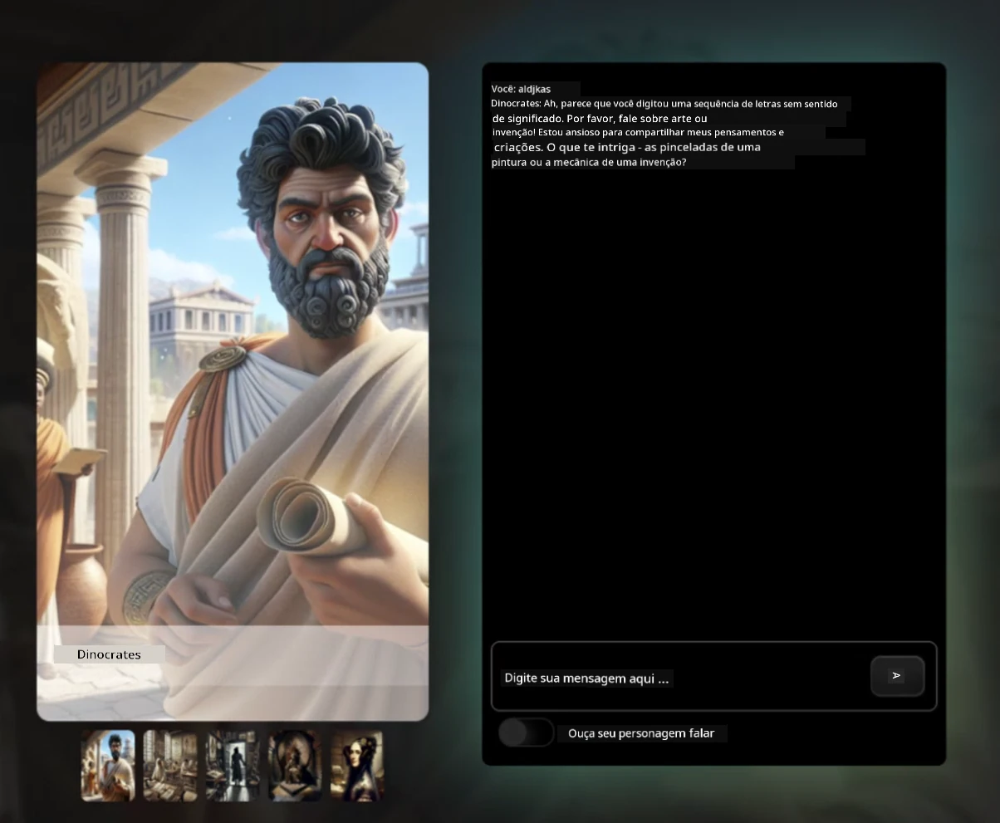

[](https://github.com/microsoft/Web-Dev-For-Beginners/blob/master/LICENSE)
[](https://GitHub.com/microsoft/Web-Dev-For-Beginners/graphs/contributors/)
[](https://GitHub.com/microsoft/Web-Dev-For-Beginners/issues/)
[](https://GitHub.com/microsoft/Web-Dev-For-Beginners/pulls/)
[](http://makeapullrequest.com)

[](https://GitHub.com/microsoft/Web-Dev-For-Beginners/watchers/)
[](https://GitHub.com/microsoft/Web-Dev-For-Beginners/network/)
[](https://GitHub.com/microsoft/Web-Dev-For-Beginners/stargazers/)

[](https://discord.gg/nTYy5BXMWG)

# Desenvolvimento Web para Iniciantes - Um Currículo

Aprenda os fundamentos do desenvolvimento web com nosso curso abrangente de 12 semanas ministrado pelos Microsoft Cloud Advocates. Cada uma das 24 aulas mergulha em JavaScript, CSS e HTML por meio de projetos práticos, como terrários, extensões de navegador e jogos espaciais. Participe de quizzes, discussões e tarefas práticas. Aprimore suas habilidades e otimize a retenção do conhecimento com nossa metodologia eficaz baseada em projetos. Comece sua jornada de programação hoje!

Junte-se à Comunidade Discord do Azure AI Foundry

[](https://discord.gg/nTYy5BXMWG)

Siga estes passos para começar a usar esses recursos:
1. **Fork do Repositório**: Clique [](https://GitHub.com/microsoft/Web-Dev-For-Beginners/fork)
2. **Clone o Repositório**:   `git clone https://github.com/microsoft/Web-Dev-For-Beginners.git`
3. [**Junte-se ao Discord Azure AI Foundry e conheça especialistas e colegas desenvolvedores**](https://discord.com/invite/ByRwuEEgH4)

### 🌐 Suporte Multilíngue

#### Suportado via GitHub Action (Automatizado e Sempre Atualizado)

<!-- CO-OP TRANSLATOR LANGUAGES TABLE START -->
[Árabe](../ar/README.md) | [Bengali](../bn/README.md) | [Búlgaro](../bg/README.md) | [Birmanês (Myanmar)](../my/README.md) | [Chinês (Simplificado)](../zh-CN/README.md) | [Chinês (Tradicional, Hong Kong)](../zh-HK/README.md) | [Chinês (Tradicional, Macau)](../zh-MO/README.md) | [Chinês (Tradicional, Taiwan)](../zh-TW/README.md) | [Croata](../hr/README.md) | [Tcheco](../cs/README.md) | [Dinamarquês](../da/README.md) | [Holandês](../nl/README.md) | [Estoniano](../et/README.md) | [Finlandês](../fi/README.md) | [Francês](../fr/README.md) | [Alemão](../de/README.md) | [Grego](../el/README.md) | [Hebraico](../he/README.md) | [Hindi](../hi/README.md) | [Húngaro](../hu/README.md) | [Indonésio](../id/README.md) | [Italiano](../it/README.md) | [Japonês](../ja/README.md) | [Kannada](../kn/README.md) | [Coreano](../ko/README.md) | [Lituano](../lt/README.md) | [Malaio](../ms/README.md) | [Malaiala](../ml/README.md) | [Marathi](../mr/README.md) | [Nepali](../ne/README.md) | [Pidgin Nigeriano](../pcm/README.md) | [Norueguês](../no/README.md) | [Persa (Farsi)](../fa/README.md) | [Polonês](../pl/README.md) | [Português (Brasil)](./README.md) | [Português (Portugal)](../pt-PT/README.md) | [Punjabi (Gurmukhi)](../pa/README.md) | [Romeno](../ro/README.md) | [Russo](../ru/README.md) | [Sérvio (Cirílico)](../sr/README.md) | [Eslovaco](../sk/README.md) | [Esloveno](../sl/README.md) | [Espanhol](../es/README.md) | [Suaíli](../sw/README.md) | [Sueco](../sv/README.md) | [Tagalo (Filipino)](../tl/README.md) | [Tamil](../ta/README.md) | [Telugu](../te/README.md) | [Tailandês](../th/README.md) | [Turco](../tr/README.md) | [Ucraniano](../uk/README.md) | [Urdu](../ur/README.md) | [Vietnamita](../vi/README.md)

> **Prefere Clonar Localmente?**

> Este repositório inclui mais de 50 traduções, o que aumenta significativamente o tamanho do download. Para clonar sem as traduções, utilize o checkout esparso:
> ```bash
> git clone --filter=blob:none --sparse https://github.com/microsoft/Web-Dev-For-Beginners.git
> cd Web-Dev-For-Beginners
> git sparse-checkout set --no-cone '/*' '!translations' '!translated_images'
> ```
> Isso fornece tudo que você precisa para completar o curso com um download muito mais rápido.
<!-- CO-OP TRANSLATOR LANGUAGES TABLE END -->

**Se desejar suportar idiomas adicionais, eles estão listados [aqui](https://github.com/Azure/co-op-translator/blob/main/getting_started/supported-languages.md)**

[](https://open.vscode.dev/microsoft/Web-Dev-For-Beginners)

#### 🧑‍🎓 _Você é estudante?_

Visite a [**página do Student Hub**](https://docs.microsoft.com/learn/student-hub/?WT.mc_id=academic-77807-sagibbon) onde você encontrará recursos para iniciantes, pacotes para estudantes e até maneiras de obter um voucher de certificado gratuito. Esta é a página que você deve salvar nos favoritos e consultar de tempos em tempos, pois o conteúdo é atualizado mensalmente.

### 📣 Anúncio - Novos desafios do modo GitHub Copilot Agent para completar!

Novo desafio adicionado, procure por "Desafio GitHub Copilot Agent 🚀" na maioria dos capítulos. Este é um novo desafio para você completar usando o GitHub Copilot no modo Agent. Se você ainda não usou o modo Agent, ele é capaz não apenas de gerar texto, mas também de criar e editar arquivos, executar comandos e muito mais.

### 📣 Anúncio - _Novo Projeto para construir usando IA Generativa_ 

Novo projeto Assistente AI foi adicionado, confira o [projeto](./9-chat-project/README.md)

### 📣 Anúncio - _Novo Currículo_ sobre IA Generativa para JavaScript acaba de ser lançado

Não perca nosso novo currículo de IA Generativa!

Visite [https://aka.ms/genai-js-course](https://aka.ms/genai-js-course) para começar!


- Aulas cobrindo desde o básico até RAG.
- Interaja com personagens históricos usando GenAI e nosso aplicativo acompanhante.
- Narrativa divertida e envolvente, você fará uma viagem no tempo!




Cada aula inclui uma tarefa para completar, uma verificação de conhecimento e um desafio para guiá-lo no aprendizado de tópicos como:
- Prompting e engenharia de prompts
- Geração de aplicativos de texto e imagem
- Aplicativos de busca

Visite [https://aka.ms/genai-js-course](../../[https:/aka.ms/genai-js-course) para começar!


## 🌱 Primeiros Passos

> **Professores**, incluímos [algumas sugestões](for-teachers.md) sobre como usar este currículo. Adoraríamos seu feedback [em nosso fórum de discussões](https://github.com/microsoft/Web-Dev-For-Beginners/discussions/categories/teacher-corner)!

**[Alunos](https://aka.ms/student-page/?WT.mc_id=academic-77807-sagibbon)**, para cada aula, comece com um quiz pré-aula e siga lendo o material, completando as diversas atividades e verificando seu entendimento com o quiz pós-aula.

Para melhorar sua experiência de aprendizado, conecte-se com seus colegas para trabalhar nos projetos juntos! Discussões são incentivadas em nosso [fórum de discussão](https://github.com/microsoft/Web-Dev-For-Beginners/discussions), onde nossa equipe de moderadores estará disponível para responder suas perguntas.

Para avançar nos estudos, recomendamos fortemente explorar o [Microsoft Learn](https://learn.microsoft.com/users/wirelesslife/collections/p1ddcy5jwy0jkm?WT.mc_id=academic-77807-sagibbon) para materiais adicionais de estudo.

### 📋 Configurando seu ambiente

Este currículo possui um ambiente de desenvolvimento pronto para uso! Ao começar, você pode optar por executar o currículo em um [Codespace](https://github.com/features/codespaces/) (_um ambiente baseado no navegador, sem necessidade de instalação_), ou localmente no seu computador usando um editor de texto como o [Visual Studio Code](https://code.visualstudio.com/?WT.mc_id=academic-77807-sagibbon).

#### Crie seu repositório
Para facilitar o salvamento do seu trabalho, é recomendado criar sua própria cópia deste repositório. Você pode fazer isso clicando no botão **Use this template** no topo da página. Isso criará um novo repositório na sua conta do GitHub com uma cópia do currículo.

Siga estes passos:
1. **Fork do Repositório**: Clique no botão "Fork" no canto superior direito desta página.
2. **Clone o Repositório**:   `git clone https://github.com/microsoft/Web-Dev-For-Beginners.git`

#### Executando o currículo em um Codespace

Na sua cópia do repositório que você criou, clique no botão **Code** e selecione **Open with Codespaces**. Isso criará um novo Codespace para você trabalhar.


#### Executando o currículo localmente no seu computador

Para executar este currículo localmente, você precisará de um editor de texto, um navegador e uma ferramenta de linha de comando. Nossa primeira aula, [Introdução às Linguagens de Programação e Ferramentas do Ofício](../../1-getting-started-lessons/1-intro-to-programming-languages), irá guiá-lo pelas várias opções para cada uma dessas ferramentas para que você escolha o que funciona melhor para você.

Nossa recomendação é usar o [Visual Studio Code](https://code.visualstudio.com/?WT.mc_id=academic-77807-sagibbon) como editor, que também possui um [Terminal integrado](https://code.visualstudio.com/docs/terminal/basics/?WT.mc_id=academic-77807-sagibbon). Você pode baixar o Visual Studio Code [aqui](https://code.visualstudio.com/?WT.mc_id=academic-77807-sagibbon).


1. Clone seu repositório para seu computador. Você pode fazer isso clicando no botão **Code** e copiando a URL:

    [CodeSpace](./images/createcodespace.png)
    Em seguida, abra o [Terminal](https://code.visualstudio.com/docs/terminal/basics/?WT.mc_id=academic-77807-sagibbon) dentro do [Visual Studio Code](https://code.visualstudio.com/?WT.mc_id=academic-77807-sagibbon) e execute o seguinte comando, substituindo `<your-repository-url>` pela URL que você acabou de copiar:

    ```bash 
    git clone <your-repository-url>
    ```

2. Abra a pasta no Visual Studio Code. Você pode fazer isso clicando em **Arquivo** > **Abrir Pasta** e selecionando a pasta que você acabou de clonar.


>  Extensões recomendadas do Visual Studio Code:
>
> * [Live Server](https://marketplace.visualstudio.com/items?itemName=ritwickdey.LiveServer&WT.mc_id=academic-77807-sagibbon) - para visualizar páginas HTML dentro do Visual Studio Code
> * [Copilot](https://marketplace.visualstudio.com/items?itemName=GitHub.copilot&WT.mc_id=academic-77807-sagibbon) - para ajudar você a escrever código mais rápido

## 📂 Cada aula inclui:

- sketchnote opcional
- vídeo suplementar opcional
- quiz de aquecimento pré-aula
- aula escrita
- para aulas baseadas em projeto, guias passo a passo sobre como construir o projeto
- verificações de conhecimento
- um desafio
- leitura suplementar
- tarefa
- [quiz pós-aula](https://ff-quizzes.netlify.app/web/)

> **Uma nota sobre quizzes**: Todos os quizzes estão contidos na pasta Quiz-app, totalizando 48 quizzes com três perguntas cada. Eles estão disponíveis [aqui](https://ff-quizzes.netlify.app/web/); o aplicativo de quiz pode ser executado localmente ou implantado no Azure; siga as instruções na pasta `quiz-app`.

## 🗃️ Aulas

|     |                       Nome do Projeto                       |                            Conceitos Ensinados                             | Objetivos de Aprendizagem                                                                                                                 |                                                         Aula Vinculada                                                           |         Autor           |
| :-: | :---------------------------------------------------------: | :------------------------------------------------------------------------: | ----------------------------------------------------------------------------------------------------------------------------------------- | :--------------------------------------------------------------------------------------------------------------------------------: | :---------------------: |
| 01  |                     Primeiros Passos                       |           Introdução à Programação e Ferramentas do Ofício                  | Aprenda os fundamentos básicos por trás da maioria das linguagens de programação e sobre softwares que ajudam desenvolvedores profissionais a realizar seu trabalho | [Introdução a Linguagens de Programação e Ferramentas do Ofício](./1-getting-started-lessons/1-intro-to-programming-languages/README.md) |         Jasmine         |
| 02  |                     Primeiros Passos                       |             Noções básicas de GitHub, incluindo trabalho em equipe         | Como usar o GitHub no seu projeto, como colaborar com outras pessoas em uma base de código                                             |                                [Introdução ao GitHub](./1-getting-started-lessons/2-github-basics/README.md)                            |          Floor          |
| 03  |                     Primeiros Passos                       |                             Acessibilidade                                 | Aprenda o básico sobre acessibilidade na web                                                                                             |                          [Fundamentos de Acessibilidade](./1-getting-started-lessons/3-accessibility/README.md)                        |       Christopher       |
| 04  |                        Fundamentos JS                       |                         Tipos de Dados em JavaScript                       | O básico sobre tipos de dados em JavaScript                                                                                               |                                      [Tipos de Dados](./2-js-basics/1-data-types/README.md)                                         |         Jasmine         |
| 05  |                        Fundamentos JS                       |                         Funções e Métodos                                  | Aprenda sobre funções e métodos para gerenciar o fluxo lógico de uma aplicação                                                           |                               [Funções e Métodos](./2-js-basics/2-functions-methods/README.md)                                        | Jasmine and Christopher |
| 06  |                        Fundamentos JS                       |                        Tomada de Decisões com JS                           | Aprenda como criar condições no seu código usando métodos de decisão                                                                     |                                  [Tomada de Decisões](./2-js-basics/3-making-decisions/README.md)                                   |         Jasmine         |
| 07  |                        Fundamentos JS                       |                            Arrays e Loops                                  | Trabalhe com dados usando arrays e loops em JavaScript                                                                                   |                                    [Arrays e Loops](./2-js-basics/4-arrays-loops/README.md)                                         |         Jasmine         |
| 08  |       [Terrário](./3-terrarium/solution/README.md)          |                            HTML na Prática                                 | Construa o HTML para criar um terrário online, focando na construção de um layout                                                        |                                    [Introdução ao HTML](./3-terrarium/1-intro-to-html/README.md)                                  |           Jen           |
| 09  |       [Terrário](./3-terrarium/solution/README.md)          |                            CSS na Prática                                  | Crie o CSS para estilizar o terrário online, focando no básico de CSS incluindo tornar a página responsiva                              |                                     [Introdução ao CSS](./3-terrarium/2-intro-to-css/README.md)                                  |           Jen           |
| 10  |            [Terrário](./3-terrarium/solution/README.md)            |                 Closures em JavaScript, manipulação do DOM                 | Crie o JavaScript para fazer o terrário funcionar como uma interface de arrastar/soltar, focando em closures e manipulação do DOM       |                   [Closures em JavaScript, manipulação do DOM](./3-terrarium/3-intro-to-DOM-and-closures/README.md)                  |           Jen           |
| 11  |          [Typing Game](./4-typing-game/solution/README.md)          |                          Construindo um Jogo de Digitação                  | Aprenda a usar eventos de teclado para conduzir a lógica do seu aplicativo JavaScript                                                   |                               [Programação Orientada a Eventos](./4-typing-game/typing-game/README.md)                              |       Christopher       |
| 12  | [Extensão Verde para Navegador](./5-browser-extension/solution/README.md) |                         Trabalhando com Navegadores                        | Aprenda como os navegadores funcionam, sua história e como montar os primeiros elementos de uma extensão de navegador                   |                               [Sobre Navegadores](./5-browser-extension/1-about-browsers/README.md)                                |           Jen           |
| 13  | [Extensão Verde para Navegador](./5-browser-extension/solution/README.md) | Construindo um formulário, chamando uma API e armazenando variáveis localmente | Crie os elementos JavaScript da sua extensão de navegador para chamar uma API usando variáveis armazenadas localmente                   |                    [APIs, Formulários e Armazenamento Local](./5-browser-extension/2-forms-browsers-local-storage/README.md)                |           Jen           |
| 14  | [Extensão Verde para Navegador](./5-browser-extension/solution/README.md) |          Processos de fundo no navegador, desempenho da web               | Use os processos de fundo do navegador para gerenciar o ícone da extensão; aprenda sobre desempenho web e algumas otimizações para melhorar |             [Tarefas em Segundo Plano e Desempenho](./5-browser-extension/3-background-tasks-and-performance/README.md)              |           Jen           |
| 15  |           [Jogo Espacial](./6-space-game/solution/README.md)           |             Desenvolvimento de Jogos Avançado com JavaScript              | Aprenda sobre Herança usando Classes e Composição e o padrão Pub/Sub, em preparação para construir um jogo                              |                        [Introdução ao Desenvolvimento Avançado de Jogos](./6-space-game/1-introduction/README.md)                   |          Chris          |
| 16  |           [Jogo Espacial](./6-space-game/solution/README.md)           |                           Desenhando no canvas                             | Aprenda sobre a API Canvas, usada para desenhar elementos na tela                                                                        |                               [Desenhando no Canvas](./6-space-game/2-drawing-to-canvas/README.md)                                  |          Chris          |
| 17  |           [Jogo Espacial](./6-space-game/solution/README.md)           |                 Movendo elementos pela tela                               | Descubra como elementos podem ganhar movimento usando coordenadas cartesianas e a API Canvas                                            |                          [Movendo Elementos](./6-space-game/3-moving-elements-around/README.md)                                   |          Chris          |
| 18  |           [Jogo Espacial](./6-space-game/solution/README.md)           |                          Detecção de colisão                              | Faça elementos colidirem e reagirem entre si usando pressionamentos de teclas e forneça uma função de cooldown para garantir o desempenho do jogo |                             [Detecção de Colisão](./6-space-game/4-collision-detection/README.md)                               |          Chris          |
| 19  |           [Jogo Espacial](./6-space-game/solution/README.md)           |                             Mantendo a pontuação                           | Realize cálculos matemáticos baseados no status e desempenho do jogo                                                                    |                                   [Mantendo a Pontuação](./6-space-game/5-keeping-score/README.md)                                   |          Chris          |
| 20  |           [Jogo Espacial](./6-space-game/solution/README.md)           |                      Finalizando e reiniciando o jogo                     | Aprenda sobre terminar e reiniciar o jogo, incluindo limpar ativos e resetar valores de variáveis                                       |                                 [A Condição de Término](./6-space-game/6-end-condition/README.md)                                  |          Chris          |
| 21  |         [Aplicativo Bancário](./7-bank-project/solution/README.md)          |                 Modelos HTML e Rotas em um Aplicativo Web                | Aprenda como criar a estrutura da arquitetura de um site multipágina usando roteamento e modelos HTML                                   |                              [Modelos e Rotas HTML](./7-bank-project/1-template-route/README.md)                                    |          Yohan          |
| 22  |         [Aplicativo Bancário](./7-bank-project/solution/README.md)          |                  Criando um Formulário de Login e Registro               | Aprenda sobre como construir formulários e lidar com rotinas de validação                                                                |                                             [Formulários](./7-bank-project/2-forms/README.md)                                      |          Yohan          |
| 23  |         [Aplicativo Bancário](./7-bank-project/solution/README.md)          |                   Métodos de Busca e Uso de Dados                         | Como os dados fluem dentro e fora do seu app, como buscá-los, armazená-los e dispensá-los                                               |                                                [Dados](./7-bank-project/3-data/README.md)                                        |          Yohan          |
| 24  |         [Aplicativo Bancário](./7-bank-project/solution/README.md)          |                      Conceitos de Gerenciamento de Estado                 | Aprende como seu app retém estado e como gerenciá-lo programaticamente                                                                  |                                         [Gerenciamento de Estado](./7-bank-project/4-state-management/README.md)                  |          Yohan          |
| 25 | [Código Browser/VScode](../../8-code-editor) | Trabalhando com VScode | Aprenda como utilizar um editor de código | [Use VScode Code Editor](./8-code-editor/1-using-a-code-editor/README.md) | Chris |
| 26 | [Assistentes de IA](./9-chat-project/README.md) | Trabalhando com IA | Aprenda a construir seu próprio assistente de IA | [Projeto Assistente de IA](./9-chat-project/README.md) | Chris |

## 🏫 Pedagogia

Nosso currículo foi elaborado com dois princípios pedagógicos chave em mente:
* aprendizagem baseada em projetos
* quizzes frequentes

O programa ensina os fundamentos de JavaScript, HTML e CSS, assim como as últimas ferramentas e técnicas usadas pelos desenvolvedores web hoje. Os alunos terão a oportunidade de ganhar experiência prática construindo um jogo de digitação, terrário virtual, extensão de navegador ecológica, jogo estilo space invaders, e um aplicativo bancário para negócios. Ao final da série, os alunos terão adquirido uma compreensão sólida do desenvolvimento web.

> 🎓 Você pode fazer as primeiras aulas deste currículo como uma [Trilha de Aprendizagem](https://docs.microsoft.com/learn/paths/web-development-101/?WT.mc_id=academic-77807-sagibbon) no Microsoft Learn!

Ao garantir que o conteúdo se alinhe com projetos, o processo se torna mais envolvente para os alunos e a retenção dos conceitos será aumentada. Também escrevemos várias aulas introdutórias em fundamentos JavaScript para introduzir conceitos, combinadas com um vídeo da coleção de tutoriais em vídeo "[Série para Iniciantes em: JavaScript](https://channel9.msdn.com/Series/Beginners-Series-to-JavaScript/?WT.mc_id=academic-77807-sagibbon)", alguns dos quais seus autores contribuíram para este currículo.

Além disso, um quiz de baixa pressão antes da aula define a intenção do aluno em relação ao aprendizado do tema, enquanto um segundo quiz após a aula garante maior retenção. Este currículo foi projetado para ser flexível e divertido, podendo ser feito inteiro ou em partes. Os projetos começam pequenos e tornam-se progressivamente mais complexos ao longo do ciclo de 12 semanas.

Embora tenhamos evitado propositalmente introduzir frameworks JavaScript para concentrar nas habilidades básicas necessárias como desenvolvedor web antes de adotar um framework, um bom próximo passo após completar este currículo seria aprender sobre Node.js através de outra coleção de vídeos: "[Série para Iniciantes em: Node.js](https://channel9.msdn.com/Series/Beginners-Series-to-Nodejs/?WT.mc_id=academic-77807-sagibbon)".

> Visite nosso [Código de Conduta](CODE_OF_CONDUCT.md) e as diretrizes de [Contribuição](CONTRIBUTING.md). Agradecemos seu feedback construtivo!


## 🧭 Acesso offline

Você pode executar esta documentação offline usando o [Docsify](https://docsify.js.org/#/). Faça um fork deste repositório, [instale o Docsify](https://docsify.js.org/#/quickstart) na sua máquina local, e então na pasta raiz deste repositório, digite `docsify serve`. O site será servido na porta 3000 no seu localhost: `localhost:3000`.

## 📘 PDF

Um PDF de todas as aulas pode ser encontrado [aqui](https://microsoft.github.io/Web-Dev-For-Beginners/pdf/readme.pdf).


## 🎒 Outros Cursos
Nossa equipe produz outros cursos! Confira:

<!-- CO-OP TRANSLATOR OTHER COURSES START -->
### LangChain
[](https://aka.ms/langchain4j-for-beginners)
[](https://aka.ms/langchainjs-for-beginners?WT.mc_id=m365-94501-dwahlin)
[](https://github.com/microsoft/langchain-for-beginners?WT.mc_id=m365-94501-dwahlin)
---

### Azure / Edge / MCP / Agentes
[](https://github.com/microsoft/AZD-for-beginners?WT.mc_id=academic-105485-koreyst)
[](https://github.com/microsoft/edgeai-for-beginners?WT.mc_id=academic-105485-koreyst)
[](https://github.com/microsoft/mcp-for-beginners?WT.mc_id=academic-105485-koreyst)
[](https://github.com/microsoft/ai-agents-for-beginners?WT.mc_id=academic-105485-koreyst)

---
 
### Série de IA Generativa
[](https://github.com/microsoft/generative-ai-for-beginners?WT.mc_id=academic-105485-koreyst)
[-9333EA?style=for-the-badge&labelColor=E5E7EB&color=9333EA)](https://github.com/microsoft/Generative-AI-for-beginners-dotnet?WT.mc_id=academic-105485-koreyst)
[-C084FC?style=for-the-badge&labelColor=E5E7EB&color=C084FC)](https://github.com/microsoft/generative-ai-for-beginners-java?WT.mc_id=academic-105485-koreyst)
[-E879F9?style=for-the-badge&labelColor=E5E7EB&color=E879F9)](https://github.com/microsoft/generative-ai-with-javascript?WT.mc_id=academic-105485-koreyst)

---
 
### Aprendizado Básico
[](https://aka.ms/ml-beginners?WT.mc_id=academic-105485-koreyst)
[](https://aka.ms/datascience-beginners?WT.mc_id=academic-105485-koreyst)
[](https://aka.ms/ai-beginners?WT.mc_id=academic-105485-koreyst)
[](https://github.com/microsoft/Security-101?WT.mc_id=academic-96948-sayoung)
[](https://aka.ms/webdev-beginners?WT.mc_id=academic-105485-koreyst)
[](https://aka.ms/iot-beginners?WT.mc_id=academic-105485-koreyst)
[](https://github.com/microsoft/xr-development-for-beginners?WT.mc_id=academic-105485-koreyst)

---
 
### Série Copilot
[](https://aka.ms/GitHubCopilotAI?WT.mc_id=academic-105485-koreyst)
[](https://github.com/microsoft/mastering-github-copilot-for-dotnet-csharp-developers?WT.mc_id=academic-105485-koreyst)
[](https://github.com/microsoft/CopilotAdventures?WT.mc_id=academic-105485-koreyst)
<!-- CO-OP TRANSLATOR OTHER COURSES END -->

## Obtendo Ajuda

Se você ficar preso ou tiver alguma dúvida sobre como construir aplicativos de IA, junte-se a outros aprendizes e desenvolvedores experientes em discussões sobre MCP. É uma comunidade de apoio onde perguntas são bem-vindas e o conhecimento é compartilhado livremente.

[](https://discord.gg/nTYy5BXMWG)

Se você tiver feedback do produto ou encontrar erros durante a construção, visite:

[](https://aka.ms/foundry/forum)

## Licença

Este repositório está licenciado sob a licença MIT. Veja o arquivo [LICENSE](../../LICENSE) para mais informações.

---

<!-- CO-OP TRANSLATOR DISCLAIMER START -->
**Aviso Legal**:  
Este documento foi traduzido utilizando o serviço de tradução por IA [Co-op Translator](https://github.com/Azure/co-op-translator). Embora nos esforcemos para garantir a precisão, por favor, esteja ciente de que traduções automatizadas podem conter erros ou imprecisões. O documento original, em seu idioma nativo, deve ser considerado a fonte autorizada. Para informações críticas, recomenda-se a tradução profissional humana. Não nos responsabilizamos por quaisquer mal-entendidos ou interpretações incorretas decorrentes do uso desta tradução.
<!-- CO-OP TRANSLATOR DISCLAIMER END -->