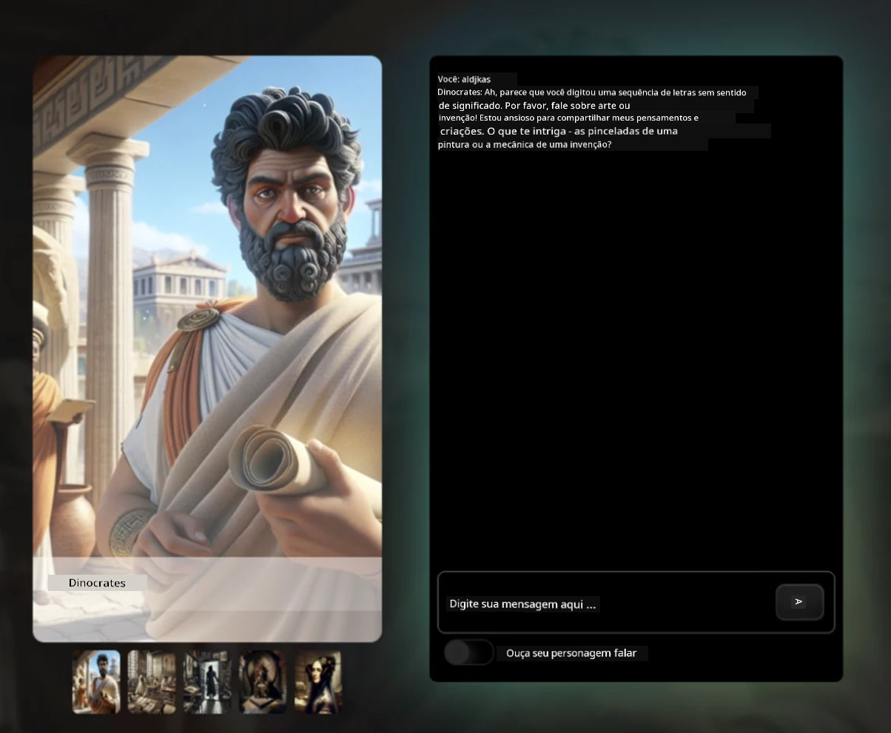
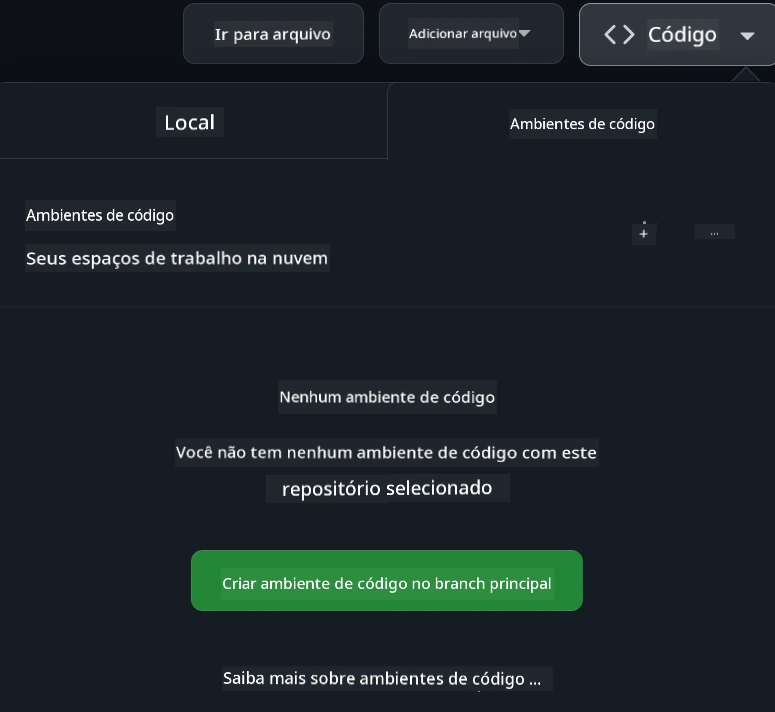

[](https://github.com/microsoft/Web-Dev-For-Beginners/blob/master/LICENSE)
[](https://GitHub.com/microsoft/Web-Dev-For-Beginners/graphs/contributors/)
[](https://GitHub.com/microsoft/Web-Dev-For-Beginners/issues/)
[](https://GitHub.com/microsoft/Web-Dev-For-Beginners/pulls/)
[](http://makeapullrequest.com) 

[](https://GitHub.com/microsoft/Web-Dev-For-Beginners/watchers/)
[](https://GitHub.com/microsoft/Web-Dev-For-Beginners/network/)
[](https://GitHub.com/microsoft/Web-Dev-For-Beginners/stargazers/)

[](https://discord.gg/nTYy5BXMWG)

# Desenvolvimento Web para Iniciantes - Um Currículo

Aprenda os fundamentos do desenvolvimento web com nosso curso abrangente de 12 semanas ministrado por Microsoft Cloud Advocates. Cada uma das 24 lições mergulha em JavaScript, CSS e HTML por meio de projetos práticos, como terrários, extensões para navegadores e jogos espaciais. Participe de questionários, discussões e tarefas práticas. Aprimore suas habilidades e otimize a retenção do conhecimento com nossa pedagogia eficaz baseada em projetos. Comece sua jornada na programação hoje!

Participe do Discord do Azure AI Foundry e conheça especialistas e outros desenvolvedores.

[](https://discord.gg/nTYy5BXMWG)

Siga estes passos para começar a usar esses recursos:
1. **Faça um Fork do Repositório**: Clique em [](https://GitHub.com/microsoft/Web-Dev-For-Beginners/fork)
2. **Clone o Repositório**:   `git clone https://github.com/microsoft/Web-Dev-For-Beginners.git`
3. [**Participe do Discord do Azure AI Foundry e conheça especialistas e outros desenvolvedores**](https://discord.com/invite/ByRwuEEgH4)

### 🌐 Suporte Multilíngue

#### Suportado via GitHub Action (Automatizado e Sempre Atualizado)

<!-- CO-OP TRANSLATOR LANGUAGES TABLE START -->
[Árabe](../ar/README.md) | [Bengali](../bn/README.md) | [Búlgaro](../bg/README.md) | [Birmanês (Myanmar)](../my/README.md) | [Chinês (Simplificado)](../zh-CN/README.md) | [Chinês (Tradicional, Hong Kong)](../zh-HK/README.md) | [Chinês (Tradicional, Macau)](../zh-MO/README.md) | [Chinês (Tradicional, Taiwan)](../zh-TW/README.md) | [Croata](../hr/README.md) | [Tcheco](../cs/README.md) | [Dinamarquês](../da/README.md) | [Holandês](../nl/README.md) | [Estoniano](../et/README.md) | [Finlandês](../fi/README.md) | [Francês](../fr/README.md) | [Alemão](../de/README.md) | [Grego](../el/README.md) | [Hebraico](../he/README.md) | [Hindi](../hi/README.md) | [Húngaro](../hu/README.md) | [Indonésio](../id/README.md) | [Italiano](../it/README.md) | [Japonês](../ja/README.md) | [Kannada](../kn/README.md) | [Khmer](../km/README.md) | [Coreano](../ko/README.md) | [Lituano](../lt/README.md) | [Malaio](../ms/README.md) | [Malaialam](../ml/README.md) | [Marathi](../mr/README.md) | [Nepali](../ne/README.md) | [Pidgin Nigeriano](../pcm/README.md) | [Norueguês](../no/README.md) | [Persa (Farsi)](../fa/README.md) | [Polonês](../pl/README.md) | [Português (Brasil)](./README.md) | [Português (Portugal)](../pt-PT/README.md) | [Punjabi (Gurmukhi)](../pa/README.md) | [Romeno](../ro/README.md) | [Russo](../ru/README.md) | [Sérvio (Cirílico)](../sr/README.md) | [Eslovaco](../sk/README.md) | [Esloveno](../sl/README.md) | [Espanhol](../es/README.md) | [Suaíli](../sw/README.md) | [Sueco](../sv/README.md) | [Tagalog (Filipino)](../tl/README.md) | [Tâmil](../ta/README.md) | [Telugu](../te/README.md) | [Tailandês](../th/README.md) | [Turco](../tr/README.md) | [Ucraniano](../uk/README.md) | [Urdu](../ur/README.md) | [Vietnamita](../vi/README.md)

> **Prefere Clonar Localmente?**
>
> Este repositório inclui traduções para mais de 50 idiomas, o que aumenta significativamente o tamanho do download. Para clonar sem as traduções, use a checagem esparsa:
>
> **Bash / macOS / Linux:**
> ```bash
> git clone --filter=blob:none --sparse https://github.com/microsoft/Web-Dev-For-Beginners.git
> cd Web-Dev-For-Beginners
> git sparse-checkout set --no-cone '/*' '!translations' '!translated_images'
> ```
>
> **CMD (Windows):**
> ```cmd
> git clone --filter=blob:none --sparse https://github.com/microsoft/Web-Dev-For-Beginners.git
> cd Web-Dev-For-Beginners
> git sparse-checkout set --no-cone "/*" "!translations" "!translated_images"
> ```
>
> Isso oferece tudo que você precisa para completar o curso com um download muito mais rápido.
<!-- CO-OP TRANSLATOR LANGUAGES TABLE END -->

**Se desejar traduções adicionais, os idiomas suportados estão listados aqui. [aqui](https://github.com/Azure/co-op-translator/blob/main/getting_started/supported-languages.md)**

[](https://open.vscode.dev/microsoft/Web-Dev-For-Beginners)

#### 🧑‍🎓 _Você é estudante?_

Visite a [**página Student Hub**](https://docs.microsoft.com/learn/student-hub/?WT.mc_id=academic-77807-sagibbon) onde você encontrará recursos para iniciantes, pacotes para estudantes e até maneiras de obter um voucher de certificado gratuito. Esta é a página que você deve adicionar aos favoritos e consultar de tempos em tempos, pois o conteúdo é atualizado mensalmente.

### 📣 Anúncio - Novos desafios do modo GitHub Copilot Agent para completar!

Novo desafio adicionado, procure por "GitHub Copilot Agent Challenge 🚀" na maioria dos capítulos. Este é um novo desafio para você completar usando o GitHub Copilot e o modo Agent. Se você nunca usou o modo Agent antes, ele é capaz de não apenas gerar texto, mas também criar e editar arquivos, executar comandos e mais.

### 📣 Anúncio - _Novo Projeto para construir usando IA Generativa_

Novo projeto de Assistente AI adicionado, confira o [projeto](./9-chat-project/README.md)

### 📣 Anúncio - _Novo Currículo_ sobre IA Generativa para JavaScript foi lançado

Não perca nosso novo currículo de IA Generativa!

Visite [https://aka.ms/genai-js-course](https://aka.ms/genai-js-course) para começar!


- Lições que cobrem desde o básico até RAG.
- Interaja com personagens históricos usando GenAI e nosso aplicativo acompanhante.
- Narrativa divertida e envolvente, você vai viajar no tempo!




Cada lição inclui uma tarefa para completar, uma checagem de conhecimento e um desafio para guiá-lo em tópicos como:
- Prompting e engenharia de prompt
- Geração de aplicativos de texto e imagem
- Aplicativos de busca

Visite [https://aka.ms/genai-js-course](https://aka.ms/genai-js-course) para começar!


## 🌱 Começando

> **Professores**, incluímos [algumas sugestões](for-teachers.md) sobre como usar este currículo. Adoraríamos seu feedback [em nosso fórum de discussão](https://github.com/microsoft/Web-Dev-For-Beginners/discussions/categories/teacher-corner)!

**[Aprendizes](https://aka.ms/student-page/?WT.mc_id=academic-77807-sagibbon)**, para cada lição, comece com um quiz pré-aula e siga lendo o material da palestra, completando as várias atividades e confira sua compreensão com o quiz pós-aula.

Para melhorar sua experiência de aprendizado, conecte-se com seus colegas para trabalhar juntos nos projetos! Discussões são incentivadas em nosso [fórum de discussões](https://github.com/microsoft/Web-Dev-For-Beginners/discussions), onde nossa equipe de moderadores estará disponível para responder às suas perguntas.

Para aprofundar sua educação, recomendamos fortemente explorar o [Microsoft Learn](https://learn.microsoft.com/users/wirelesslife/collections/p1ddcy5jwy0jkm?WT.mc_id=academic-77807-sagibbon) para materiais de estudo adicionais.

### 📋 Configurando seu ambiente

Este currículo tem um ambiente de desenvolvimento pronto para uso! Ao começar, você pode optar por executar o currículo em um [Codespace](https://github.com/features/codespaces/) (_um ambiente baseado em navegador, sem necessidade de instalação_), ou localmente no seu computador usando um editor de texto como o [Visual Studio Code](https://code.visualstudio.com/?WT.mc_id=academic-77807-sagibbon).

#### Crie seu repositório
Para facilitar salvar seu trabalho, recomenda-se criar sua própria cópia deste repositório. Você pode fazer isso clicando no botão **Usar este modelo** no topo da página. Isso criará um novo repositório em sua conta do GitHub com uma cópia do currículo.

Siga estes passos:
1. **Faça um Fork do Repositório**: Clique no botão "Fork" no canto superior direito desta página.
2. **Clone o Repositório**:   `git clone https://github.com/microsoft/Web-Dev-For-Beginners.git`

#### Executando o currículo em um Codespace

Na sua cópia deste repositório que você criou, clique no botão **Code** e selecione **Open with Codespaces**. Isso criará um novo Codespace para você trabalhar.



#### Executando o currículo localmente no seu computador

Para executar este currículo localmente no seu computador, você precisará de um editor de texto, um navegador e uma ferramenta de linha de comando. Nossa primeira lição, [Introdução às Linguagens de Programação e Ferramentas do Ofício](../../1-getting-started-lessons/1-intro-to-programming-languages), irá guiá-lo por várias opções para cada uma dessas ferramentas para você selecionar o que funciona melhor para você.

Nossa recomendação é usar o [Visual Studio Code](https://code.visualstudio.com/?WT.mc_id=academic-77807-sagibbon) como seu editor, que também tem um [Terminal](https://code.visualstudio.com/docs/terminal/basics/?WT.mc_id=academic-77807-sagibbon) integrado. Você pode baixar o Visual Studio Code [aqui](https://code.visualstudio.com/?WT.mc_id=academic-77807-sagibbon).
1. Clone seu repositório para o seu computador. Você pode fazer isso clicando no botão **Code** e copiando a URL:

    [CodeSpace](./images/createcodespace.png)

    Em seguida, abra o [Terminal](https://code.visualstudio.com/docs/terminal/basics/?WT.mc_id=academic-77807-sagibbon) dentro do [Visual Studio Code](https://code.visualstudio.com/?WT.mc_id=academic-77807-sagibbon) e execute o seguinte comando, substituindo `<your-repository-url>` pela URL que você acabou de copiar:

    ```bash 
    git clone <your-repository-url>
    ```

2. Abra a pasta no Visual Studio Code. Você pode fazer isso clicando em **File** > **Open Folder** e selecionando a pasta que você acabou de clonar.


>  Extensões recomendadas para o Visual Studio Code:
>
> * [Live Server](https://marketplace.visualstudio.com/items?itemName=ritwickdey.LiveServer&WT.mc_id=academic-77807-sagibbon) - para pré-visualizar páginas HTML dentro do Visual Studio Code
> * [Copilot](https://marketplace.visualstudio.com/items?itemName=GitHub.copilot&WT.mc_id=academic-77807-sagibbon) - para ajudar você a escrever código mais rapidamente

## 📂 Cada lição inclui:

- esboço opcional
- vídeo suplementar opcional
- quiz de aquecimento pré-lição
- lição escrita
- para lições baseadas em projetos, guias passo a passo sobre como construir o projeto
- verificações de conhecimento
- um desafio
- leitura suplementar
- tarefa
- [quiz pós-lição](https://ff-quizzes.netlify.app/web/)

> **Uma nota sobre quizzes**: Todos os quizzes estão contidos na pasta Quiz-app, com um total de 48 quizzes com três perguntas cada. Eles estão disponíveis [aqui](https://ff-quizzes.netlify.app/web/); o aplicativo de quiz pode ser executado localmente ou implantado no Azure; siga as instruções na pasta `quiz-app`.

## 🗃️ Lições

|     |                       Nome do Projeto                       |                            Conceitos Ensinados                            | Objetivos de Aprendizagem                                                                                                           |                                                         Lição Relacionada                                                          |         Autor          |
| :-: | :---------------------------------------------------------: | :----------------------------------------------------------------------: | ---------------------------------------------------------------------------------------------------------------------------------- | :----------------------------------------------------------------------------------------------------------------------------: | :---------------------: |
| 01  |                     Começando                               |           Introdução à Programação e Ferramentas do Ofício               | Aprender os fundamentos básicos por trás da maioria das linguagens de programação e sobre o software que ajuda desenvolvedores      | [Introdução às Linguagens de Programação e Ferramentas do Ofício](./1-getting-started-lessons/1-intro-to-programming-languages/README.md) |         Jasmine         |
| 02  |                     Começando                               |             Noções básicas de GitHub, incluindo trabalho em equipe       | Como usar GitHub em seu projeto, como colaborar com outros em uma base de código                                                    |                            [Introdução ao GitHub](./1-getting-started-lessons/2-github-basics/README.md)                             |          Floor          |
| 03  |                     Começando                               |                             Acessibilidade                               | Aprender o básico de acessibilidade na web                                                                                          |                       [Fundamentos de Acessibilidade](./1-getting-started-lessons/3-accessibility/README.md)                       |       Christopher       |
| 04  |                        Básicos de JS                        |                         Tipos de Dados em JavaScript                      | O básico sobre tipos de dados em JavaScript                                                                                         |                                       [Tipos de Dados](./2-js-basics/1-data-types/README.md)                                        |         Jasmine         |
| 05  |                        Básicos de JS                        |                         Funções e Métodos                                | Aprender sobre funções e métodos para gerenciar o fluxo lógico de um aplicativo                                                     |                              [Funções e Métodos](./2-js-basics/2-functions-methods/README.md)                               | Jasmine e Christopher   |
| 06  |                        Básicos de JS                        |                        Tomando Decisões com JS                           | Aprender como criar condições em seu código usando métodos para tomada de decisão                                                   |                                 [Tomando Decisões](./2-js-basics/3-making-decisions/README.md)                                  |         Jasmine         |
| 07  |                        Básicos de JS                        |                            Arrays e Loops                               | Trabalhar com dados usando arrays e loops em JavaScript                                                                             |                                   [Arrays e Loops](./2-js-basics/4-arrays-loops/README.md)                                    |         Jasmine         |
| 08  |       [Terrarium](./3-terrarium/solution/README.md)        |                            HTML na Prática                              | Construir o HTML para criar um terrário online, com foco no layout                                                                 |                                 [Introdução ao HTML](./3-terrarium/1-intro-to-html/README.md)                                 |           Jen           |
| 09  |       [Terrarium](./3-terrarium/solution/README.md)        |                            CSS na Prática                               | Construir o CSS para estilizar o terrário online, focando no básico de CSS, incluindo tornar a página responsiva                   |                                  [Introdução ao CSS](./3-terrarium/2-intro-to-css/README.md)                                  |           Jen           |
| 10  |            [Terrarium](./3-terrarium/solution/README.md)   |                 Closures em JavaScript e manipulação do DOM             | Construir o JavaScript para fazer o terrário funcionar como uma interface de arrastar e soltar, focando em closures e manipulação do DOM |                  [Closures em JavaScript e manipulação do DOM](./3-terrarium/3-intro-to-DOM-and-closures/README.md)             |           Jen           |
| 11  |          [Typing Game](./4-typing-game/solution/README.md)  |                          Construir um Jogo de Digitação                  | Aprender a usar eventos de teclado para controlar a lógica do seu app JavaScript                                                   |                                [Programação Baseada em Eventos](./4-typing-game/typing-game/README.md)                                |       Christopher       |
| 12  | [Extensão de Navegador Verde](./5-browser-extension/solution/README.md) |                         Trabalhando com Navegadores                      | Aprender como os navegadores funcionam, sua história e como criar os primeiros elementos de uma extensão de navegador               |                               [Sobre Navegadores](./5-browser-extension/1-about-browsers/README.md)                                |           Jen           |
| 13  | [Extensão de Navegador Verde](./5-browser-extension/solution/README.md) | Construção de formulário, chamada a API e armazenamento local de variáveis | Construir os elementos JavaScript da sua extensão para chamar uma API usando variáveis armazenadas localmente                     |                [APIs, Formulários e Armazenamento Local](./5-browser-extension/2-forms-browsers-local-storage/README.md)                 |           Jen           |
| 14  | [Extensão de Navegador Verde](./5-browser-extension/solution/README.md) |          Processos em segundo plano no navegador, performance na web    | Usar os processos em segundo plano do navegador para gerenciar o ícone da extensão; aprender sobre performance na web e algumas otimizações |             [Tarefas em Segundo Plano e Performance](./5-browser-extension/3-background-tasks-and-performance/README.md)              |           Jen           |
| 15  |           [Jogo Espacial](./6-space-game/solution/README.md) |             Desenvolvimento de Jogos mais Avançado com JavaScript      | Aprender sobre herança usando Classes e Composição e o padrão Pub/Sub, preparando para construir um jogo                            |                      [Introdução ao Desenvolvimento Avançado de Jogos](./6-space-game/1-introduction/README.md)                       |          Chris          |
| 16  |           [Jogo Espacial](./6-space-game/solution/README.md) |                           Desenhando no canvas                          | Aprender sobre a API Canvas, usada para desenhar elementos na tela                                                                 |                                [Desenhando no Canvas](./6-space-game/2-drawing-to-canvas/README.md)                                |          Chris          |
| 17  |           [Jogo Espacial](./6-space-game/solution/README.md) |                   Movendo elementos pela tela                          | Descobrir como os elementos podem ganhar movimento usando coordenadas cartesianas e a API Canvas                                   |                           [Movendo Elementos](./6-space-game/3-moving-elements-around/README.md)                           |          Chris          |
| 18  |           [Jogo Espacial](./6-space-game/solution/README.md) |                          Detecção de colisões                         | Fazer elementos colidirem e reagirem entre si usando pressionamentos de tecla e fornecer função de cooldown para garantir performance |                              [Detecção de Colisões](./6-space-game/4-collision-detection/README.md)                              |          Chris          |
| 19  |           [Jogo Espacial](./6-space-game/solution/README.md) |                             Mantendo a pontuação                       | Realizar cálculos matemáticos baseados no estado e na performance do jogo                                                        |                                    [Mantendo a Pontuação](./6-space-game/5-keeping-score/README.md)                                    |          Chris          |
| 20  |           [Jogo Espacial](./6-space-game/solution/README.md) |                     Terminando e reiniciando o jogo                   | Aprender sobre como terminar e reiniciar o jogo, incluindo limpeza de recursos e reset de valores de variáveis                    |                                [A Condição de Término](./6-space-game/6-end-condition/README.md)                                 |          Chris          |
| 21  |         [Aplicativo Bancário](./7-bank-project/solution/README.md) |                 Templates HTML e Rotas em um aplicativo Web           | Aprender a criar a arquitetura de um site multipágina usando roteamento e templates HTML                                            |                            [Templates HTML e Rotas](./7-bank-project/1-template-route/README.md)                             |          Yohan          |
| 22  |         [Aplicativo Bancário](./7-bank-project/solution/README.md) |                  Construir um formulário de login e registro          | Aprender sobre construir formulários e lidar com rotinas de validação                                                             |                                           [Formulários](./7-bank-project/2-forms/README.md)                                           |          Yohan          |
| 23  |         [Aplicativo Bancário](./7-bank-project/solution/README.md) |                   Métodos para buscar e usar dados                     | Como os dados entram e saem do seu app, como buscá-los, armazená-los e descartá-los                                                |                                            [Dados](./7-bank-project/3-data/README.md)                                            |          Yohan          |
| 24  |         [Aplicativo Bancário](./7-bank-project/solution/README.md) |                      Conceitos de Gerenciamento de Estado             | Aprender como seu app retém estado e como gerenciá-lo programaticamente                                                           |                                [Gerenciamento de Estado](./7-bank-project/4-state-management/README.md)                                |          Yohan          |
| 25 | [Browser/VScode Code](../../8-code-editor) | Trabalhando com VScode | Aprender a usar um editor de código | [Usar o editor de código VScode](./8-code-editor/1-using-a-code-editor/README.md) | Chris |
| 26 | [Assistentes de IA](./9-chat-project/README.md) | Trabalhando com IA | Aprender a construir seu próprio assistente de IA | [Projeto Assistente de IA](./9-chat-project/README.md) | Chris |

## 🏫 Pedagogia

Nosso currículo é elaborado com dois princípios pedagógicos principais em mente:
* aprendizagem baseada em projects
* quizzes frequentes

O programa ensina os fundamentos de JavaScript, HTML e CSS, bem como as ferramentas e técnicas mais recentes usadas pelos desenvolvedores web hoje. Os estudantes terão a oportunidade de desenvolver experiência prática construindo um jogo de digitação, um terrário virtual, uma extensão de navegador ecológica, um jogo estilo space-invaders e um aplicativo bancário para negócios. Ao final da série, os estudantes terão adquirido uma sólida compreensão do desenvolvimento web.

> 🎓 Você pode fazer as primeiras lições deste currículo como um [Caminho de Aprendizagem](https://docs.microsoft.com/learn/paths/web-development-101/?WT.mc_id=academic-77807-sagibbon) no Microsoft Learn!

Ao garantir que o conteúdo esteja alinhado com os projetos, o processo se torna mais envolvente para os alunos e a retenção dos conceitos será aumentada. Também escrevemos várias lições iniciais sobre os básicos de JavaScript para introduzir conceitos, combinadas com um vídeo da coleção "[Série para Iniciantes em: JavaScript](https://channel9.msdn.com/Series/Beginners-Series-to-JavaScript/?WT.mc_id=academic-77807-sagibbon)" de tutoriais em vídeo, alguns cujos autores contribuíram para este currículo.

Além disso, um quiz de baixa pressão antes da aula define a intenção do aluno para aprender um tópico, enquanto um segundo quiz após a aula assegura a retenção adicional. Este currículo foi projetado para ser flexível e divertido e pode ser feito completo ou em parte. Os projetos começam pequenos e tornam-se progressivamente mais complexos até o final do ciclo de 12 semanas.

Embora tenhamos evitado propositalmente introduzir frameworks JavaScript para concentrar nas habilidades básicas necessárias como desenvolvedor web antes de adotar um framework, o próximo passo recomendado para completar este currículo seria aprender sobre Node.js através de outra coleção de vídeos: "[Série para Iniciantes em: Node.js](https://channel9.msdn.com/Series/Beginners-Series-to-Nodejs/?WT.mc_id=academic-77807-sagibbon)".

> Visite nossas diretrizes de [Código de Conduta](CODE_OF_CONDUCT.md) e [Contribuição](CONTRIBUTING.md). Aguardamos seu feedback construtivo!


## 🧭 Acesso offline

Você pode executar esta documentação offline usando [Docsify](https://docsify.js.org/#/). Faça um fork deste repositório, [instale o Docsify](https://docsify.js.org/#/quickstart) em sua máquina local e então, na pasta raiz deste repositório, digite `docsify serve`. O site será servido na porta 3000 no seu localhost: `localhost:3000`.

## 📘 PDF
Um PDF de todas as lições pode ser encontrado [aqui](https://microsoft.github.io/Web-Dev-For-Beginners/pdf/readme.pdf).


## 🎒 Outros Cursos

Nossa equipe produz outros cursos! Confira:

<!-- CO-OP TRANSLATOR OTHER COURSES START -->
### LangChain
[](https://aka.ms/langchain4j-for-beginners)
[](https://aka.ms/langchainjs-for-beginners?WT.mc_id=m365-94501-dwahlin)
[](https://github.com/microsoft/langchain-for-beginners?WT.mc_id=m365-94501-dwahlin)
---

### Azure / Edge / MCP / Agentes
[](https://github.com/microsoft/AZD-for-beginners?WT.mc_id=academic-105485-koreyst)
[](https://github.com/microsoft/edgeai-for-beginners?WT.mc_id=academic-105485-koreyst)
[](https://github.com/microsoft/mcp-for-beginners?WT.mc_id=academic-105485-koreyst)
[](https://github.com/microsoft/ai-agents-for-beginners?WT.mc_id=academic-105485-koreyst)

---
 
### Série de IA Generativa
[](https://github.com/microsoft/generative-ai-for-beginners?WT.mc_id=academic-105485-koreyst)
[-9333EA?style=for-the-badge&labelColor=E5E7EB&color=9333EA)](https://github.com/microsoft/Generative-AI-for-beginners-dotnet?WT.mc_id=academic-105485-koreyst)
[-C084FC?style=for-the-badge&labelColor=E5E7EB&color=C084FC)](https://github.com/microsoft/generative-ai-for-beginners-java?WT.mc_id=academic-105485-koreyst)
[-E879F9?style=for-the-badge&labelColor=E5E7EB&color=E879F9)](https://github.com/microsoft/generative-ai-with-javascript?WT.mc_id=academic-105485-koreyst)

---
 
### Aprendizado Básico
[](https://aka.ms/ml-beginners?WT.mc_id=academic-105485-koreyst)
[](https://aka.ms/datascience-beginners?WT.mc_id=academic-105485-koreyst)
[](https://aka.ms/ai-beginners?WT.mc_id=academic-105485-koreyst)
[](https://github.com/microsoft/Security-101?WT.mc_id=academic-96948-sayoung)
[](https://aka.ms/webdev-beginners?WT.mc_id=academic-105485-koreyst)
[](https://aka.ms/iot-beginners?WT.mc_id=academic-105485-koreyst)
[](https://github.com/microsoft/xr-development-for-beginners?WT.mc_id=academic-105485-koreyst)

---
 
### Série Copilot
[](https://aka.ms/GitHubCopilotAI?WT.mc_id=academic-105485-koreyst)
[](https://github.com/microsoft/mastering-github-copilot-for-dotnet-csharp-developers?WT.mc_id=academic-105485-koreyst)
[](https://github.com/microsoft/CopilotAdventures?WT.mc_id=academic-105485-koreyst)
<!-- CO-OP TRANSLATOR OTHER COURSES END -->

## Obter Ajuda

Se você ficar preso ou tiver alguma dúvida sobre como criar aplicativos de IA. Junte-se a outros aprendizes e desenvolvedores experientes em discussões sobre MCP. É uma comunidade acolhedora onde perguntas são bem-vindas e o conhecimento é compartilhado livremente.

[](https://discord.gg/nTYy5BXMWG)

Se você tiver feedback de produto ou encontrar erros durante o desenvolvimento, visite:

[](https://aka.ms/foundry/forum)

## Licença

Este repositório está licenciado sob a licença MIT. Veja o arquivo [LICENSE](../../LICENSE) para mais informações.

---

<!-- CO-OP TRANSLATOR DISCLAIMER START -->
**Aviso Legal**:  
Este documento foi traduzido usando o serviço de tradução por IA [Co-op Translator](https://github.com/Azure/co-op-translator). Embora nos esforcemos pela precisão, esteja ciente de que traduções automáticas podem conter erros ou imprecisões. O documento original em seu idioma nativo deve ser considerado a fonte autorizada. Para informações críticas, recomenda-se tradução profissional humana. Não nos responsabilizamos por quaisquer mal-entendidos ou interpretações equivocadas que possam surgir do uso desta tradução.
<!-- CO-OP TRANSLATOR DISCLAIMER END -->