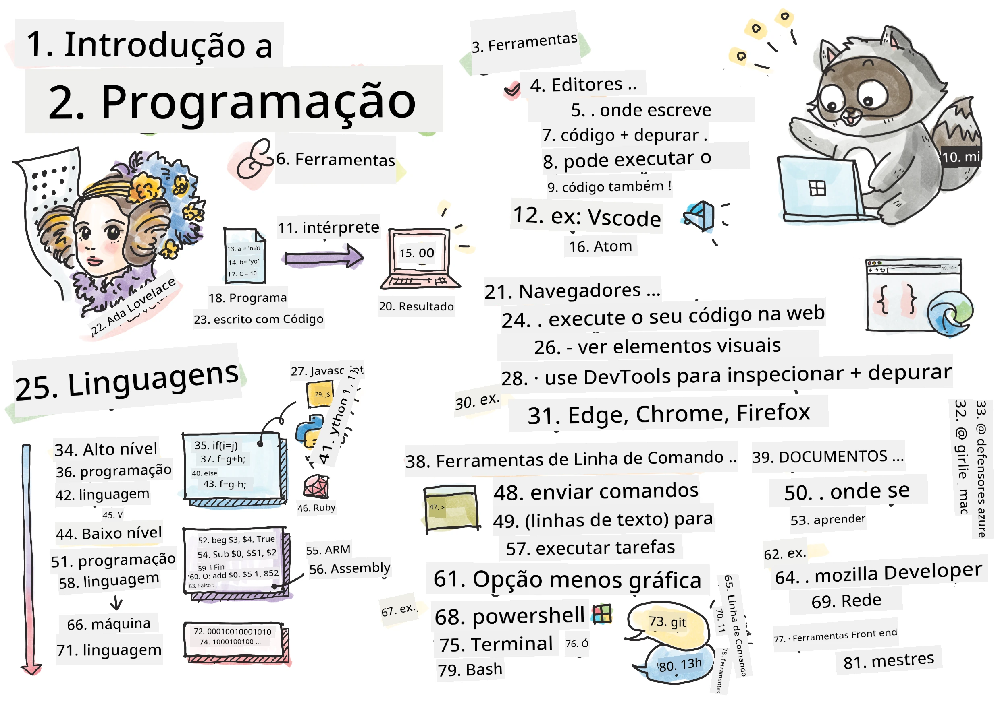
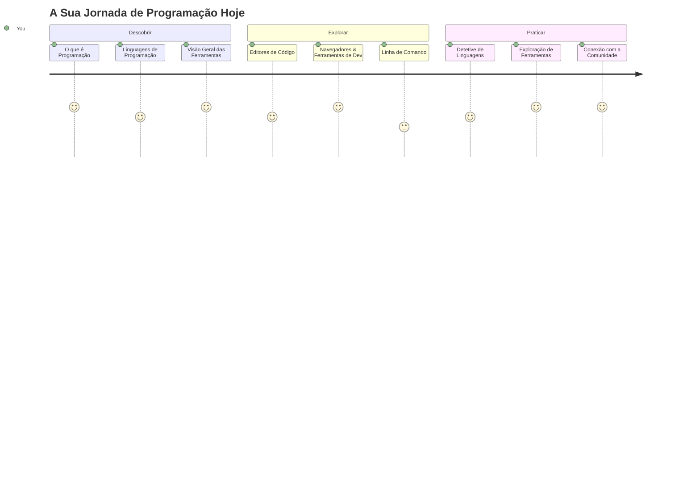
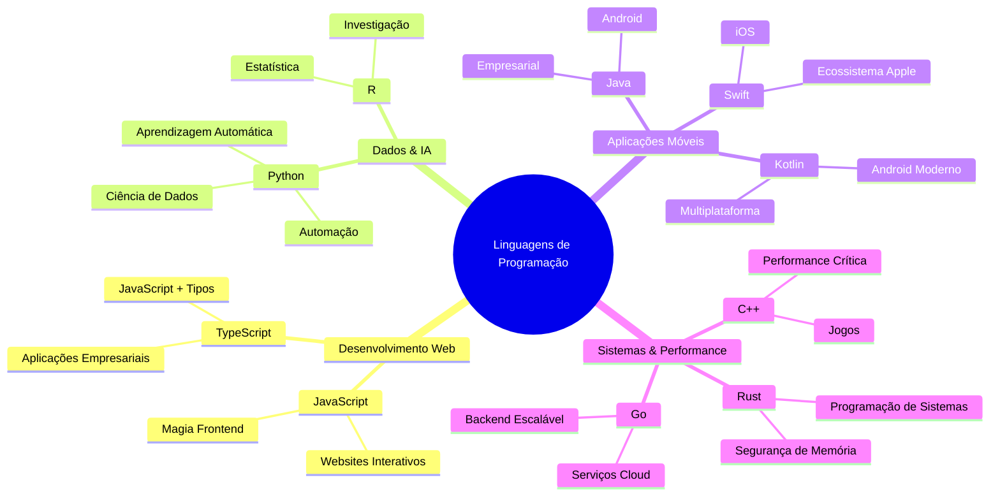
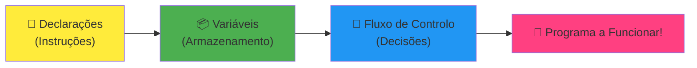
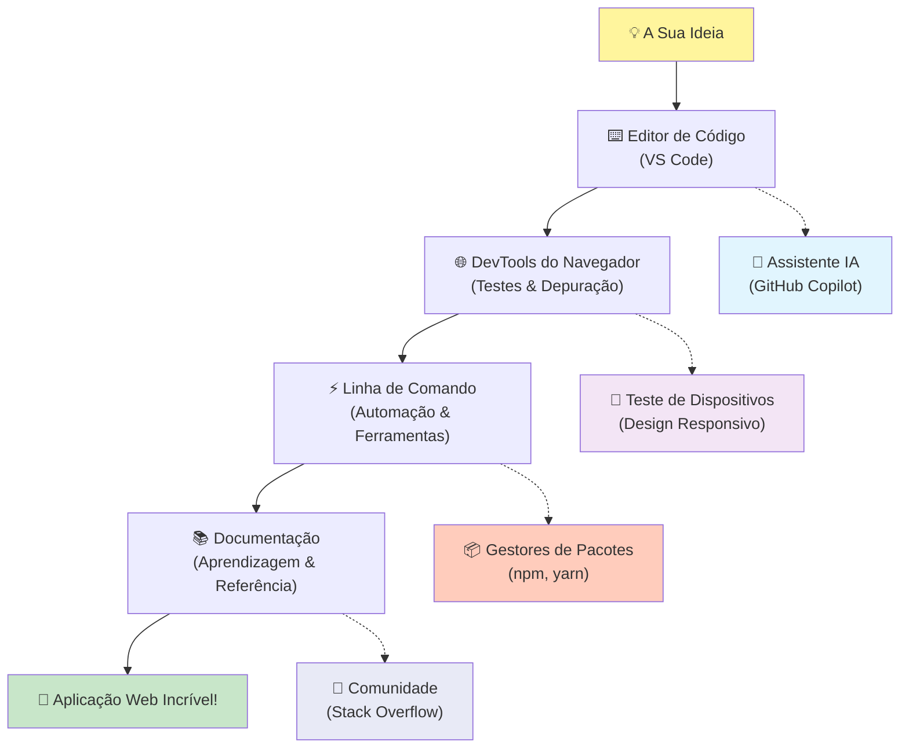
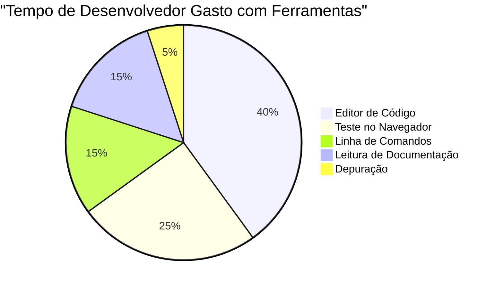
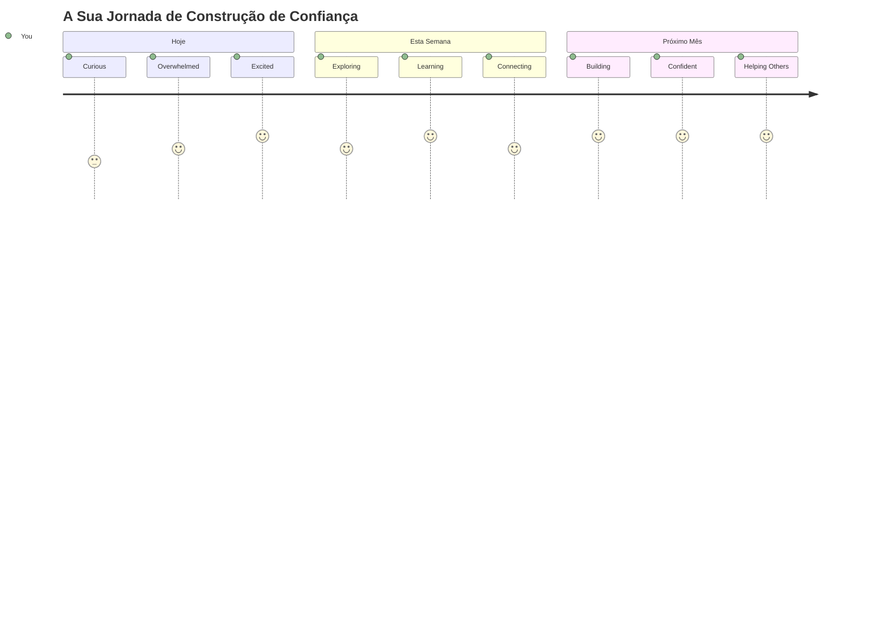

# Introdução às Linguagens de Programação e Ferramentas Modernas para Desenvolvedores
 
Olá, futuro desenvolvedor! 👋 Posso contar-te algo que ainda me dá arrepios todos os dias? Estás prestes a descobrir que programar não é só sobre computadores – é sobre ter superpoderes para dar vida às tuas ideias mais loucas!

Conheces aquele momento em que estás a usar a tua app favorita e tudo encaixa na perfeição? Quando tocas num botão e acontece algo absolutamente mágico que te faz pensar "uau, como é que eles fizeram ISTO?" Pois bem, alguém exatamente como tu – provavelmente sentado no seu café preferido às 2 da manhã com o seu terceiro expresso – escreveu o código que criou essa magia. E aqui está algo que vai explodir a tua mente: no final desta lição, não só vais entender como eles fizeram isso, mas vais querer experimentar por ti mesmo!

Olha, percebo perfeitamente se programar te parece intimidante agora. Quando comecei, pensei honestamente que precisavas de ser algum génio da matemática ou estar a programar desde os cinco anos. Mas aqui está o que mudou completamente a minha perspetiva: programar é exatamente como aprender a ter conversas numa nova língua. Começas com "olá" e "obrigado", depois vais até pedir café, e antes que percebas, estás a ter discussões filosóficas profundas! Exceto que, neste caso, estás a conversar com computadores, e sabes? Eles são os interlocutores mais pacientes de sempre – nunca julgam os teus erros e estão sempre entusiasmados para tentares novamente!

Hoje, vamos explorar as ferramentas incríveis que fazem o desenvolvimento web moderno não só possível, mas mesmo viciante. Estou a falar dos mesmos editores, navegadores e fluxos de trabalho que os programadores da Netflix, Spotify e do teu estúdio de apps indie favorito usam todos os dias. E aqui está a parte que vai fazer-te dançar de alegria: a maioria destas ferramentas profissionais, padrão da indústria, são completamente gratuitas!


> Sketchnote por [Tomomi Imura](https://twitter.com/girlie_mac)


## Vamos Ver o Que Já Sabes!

Antes de entrarmos nas coisas divertidas, estou curioso – o que é que já sabes sobre este mundo da programação? E olha, se estás a olhar para estas perguntas a pensar "eu literalmente não faço a mínima ideia disto tudo," isso não é só aceitável, é perfeito! Isso significa que estás exatamente no sítio certo. Pensa neste quiz como o aquecimento antes de um treino – estamos só a preparar os músculos do cérebro!

[Faz o quiz pré-lição](https://ff-quizzes.netlify.app/web/)


## A Aventura Que Vamos Fazer Juntos

Ok, estou mesmo entusiasmado com o que vamos explorar hoje! A sério, adorava poder ver a tua cara quando alguns destes conceitos fizerem sentido. Aqui está a incrível jornada que vamos fazer juntos:

- **O que é realmente a programação (e porque é a coisa mais fixe de sempre!)** – Vamos descobrir como o código é literalmente a magia invisível que alimenta tudo à tua volta, desde o alarme que sabe que é segunda-feira de manhã até ao algoritmo que seleciona perfeitamente as tuas recomendações na Netflix
- **Linguagens de programação e as suas personalidades incríveis** – Imagina entrares numa festa onde cada pessoa tem superpoderes completamente diferentes e formas únicas de resolver problemas. É assim o mundo das linguagens de programação, e vais adorar conhecê-las!
- **Os blocos fundamentais que fazem a magia digital acontecer** – Pensa neles como o LEGO criativo supremo. Quando perceberes como estas peças se encaixam, vais entender que podes literalmente construir tudo o que a tua imaginação sonhar
- **Ferramentas profissionais que vão fazer-te sentir como se te tivessem dado a varinha de um feiticeiro** – Não estou a dramatizar aqui – estas ferramentas vão realmente fazer-te sentir superpoderoso, e o melhor? São as mesmas que os profissionais usam!

> 💡 **Aqui está a coisa**: Não penses sequer em decorar tudo hoje! Agora, quero só que sintas essa faísca de entusiasmo sobre o que é possível. Os detalhes vão ficar naturalmente enquanto praticamos juntos – é assim que se aprende mesmo!

> Podes fazer esta lição no [Microsoft Learn](https://learn.microsoft.com/en-us/learn/modules/web-development-101/introduction-programming/?WT.mc_id=academic-77807-sagibbon)!

## Então, O Que É *Realmente* Programar?

Ora bem, vamos enfrentar a questão do milhão: o que é realmente programar?

Vou contar-te uma história que mudou completamente a minha forma de pensar sobre isto. Na semana passada, estava a tentar explicar à minha mãe como usar o telecomando da nossa nova smart TV. Apanhei-me a dizer coisas como "Carrega no botão vermelho, mas não no botão vermelho grande, no botão vermelho pequeno à esquerda... não, na tua outra esquerda... ok, agora mantém carregado durante dois segundos, não um, não três..." Soa familiar? 😅

Isto é programação! É a arte de dar instruções incrivelmente detalhadas, passo a passo, a algo que é muito poderoso mas que precisa que tudo esteja perfeitamente explicado. Exceto que, em vez de explicar à tua mãe (que pode perguntar "qual botão vermelho?!"), estás a explicar a um computador (que simplesmente faz exatamente o que lhe dizes, mesmo que o que disseste não seja bem o que querias).

Isto é o que me deixou arrepiado quando aprendi pela primeira vez: os computadores são na verdade bastante simples na essência. Eles literalmente só entendem duas coisas – 1 e 0, que basicamente significa "sim" e "não" ou "ligado" e "desligado." É só isso! Mas aqui é onde a magia acontece – não precisamos de falar em 1s e 0s como se estivéssemos no Matrix. É para isso que existem as **linguagens de programação**. Elas são como ter o melhor tradutor do mundo que pega nos teus pensamentos perfeitamente humanos e converte-os para a linguagem do computador.

E aqui está o que ainda me dá arrepios todas as manhãs quando acordo: literalmente *tudo* o que é digital na tua vida começou com alguém exatamente como tu, provavelmente sentado de pijama com uma chávena de café, a escrever código no portátil. Esse filtro do Instagram que te faz parecer impecável? Alguém o programou. A recomendação que te levou à tua nova música favorita? Um programador criou esse algoritmo. A app que te ajuda a dividir contas com os amigos? Pois, alguém pensou "isto é chato, posso resolver isto" e depois... resolveu!

Quando aprendes a programar, não estás só a adquirir uma nova competência – estás a tornar-te parte de uma comunidade incrível de solucionadores de problemas que passam os dias a pensar, "E se eu pudesse criar algo que tornasse o dia de alguém um bocadinho melhor?" Honestamente, existe algo mais fixe do que isso?

✅ **Caça ao Facto Divertido**: Aqui vai algo super fixe para pesquisares quando tiveres um momento livre – quem achas que foi o primeiro programador do mundo? Dou-te uma pista: pode não ser quem estás à espera! A história dessa pessoa é absolutamente fascinante e mostra que programar tem sempre sido sobre criatividade na resolução de problemas e pensar fora da caixa.

### 🧠 **Momento de Reflexão: Como Estás a Sentir-te?**

**Tira um momento para refletir:**
- Faz sentido agora a ideia de "dar instruções a computadores"?
- Consegues pensar numa tarefa do dia a dia que gostarias de automatizar com programação?
- Que perguntas é que te estão a ocorrer sobre tudo isto da programação?

> **Lembra-te**: É completamente normal se alguns conceitos parecerem confusos agora. Aprender programação é como aprender uma nova língua – o cérebro precisa de tempo para formar esses caminhos neurais. Estás a ir muito bem!

## As Linguagens de Programação São Como Diferentes Sabores de Magia

Ok, isto vai parecer estranho, mas fica comigo – as linguagens de programação são muito como diferentes tipos de música. Pensa nisto: tens jazz, que é suave e improvisado, rock que é poderoso e direto, clássico que é elegante e estruturado, e hip-hop que é criativo e expressivo. Cada estilo tem a sua vibe, a sua comunidade apaixonada, e cada um é perfeito para diferentes estados de espírito e ocasiões.

As linguagens de programação funcionam exatamente da mesma maneira! Não irias usar a mesma linguagem para criar um jogo móvel divertido que para processar enormes quantidades de dados climáticos, assim como não ias tocar death metal numa aula de yoga (bem, na maioria das aulas de yoga! 😄).

Mas aqui está algo que me deixa de boca aberta sempre que penso nisso: estas linguagens são como ter o intérprete mais paciente e brilhante do mundo sentado mesmo ao teu lado. Podes expressar as tuas ideias de um modo que é natural para o teu cérebro humano, e elas tratam de todo o trabalho incrivelmente complexo de traduzir isso para os 1s e 0s que os computadores realmente entendem. É como ter um amigo que domina perfeitamente tanto a "criatividade humana" como a "lógica do computador" – e que nunca se cansa, nunca precisa de pausas para café, e nunca te julga por perguntar a mesma coisa duas vezes!

### Linguagens de Programação Populares e os Seus Usos


| Language | Best For | Why It's Popular |
|----------|----------|------------------|
| **JavaScript** | Desenvolvimento web, interfaces de utilizador | Corre em navegadores e alimenta websites interativos |
| **Python** | Ciência de dados, automação, IA | Fácil de ler e aprender, bibliotecas poderosas |
| **Java** | Aplicações empresariais, apps Android | Independente de plataforma, robusto para sistemas grandes |
| **C#** | Aplicações Windows, desenvolvimento de jogos | Forte suporte no ecossistema Microsoft |
| **Go** | Serviços na cloud, sistemas backend | Rápido, simples, desenhado para computação moderna |

### Linguagens de Alto Nível vs. Baixo Nível

Ok, este foi honestamente o conceito que me deixou confuso quando comecei, por isso vou partilhar a analogia que finalmente me fez perceber – e espero mesmo que te ajude também!

Imagina que estás a visitar um país onde não falas a língua e precisas desesperadamente de encontrar a casa de banho mais próxima (todos já passámos por isso, certo? 😅):

- **Programação de baixo nível** é como aprender o dialeto local tão bem que consegues conversar com a avó que vende fruta na esquina usando referências culturais, calão local e piadas internas que só quem cresceu ali entende. Super impressionante e incrivelmente eficiente... se fores fluente! Mas bastante esmagador quando só queres encontrar uma casa de banho.

- **Programação de alto nível** é como ter aquele amigo local incrível que te entende perfeitamente. Podes dizer "Preciso mesmo de encontrar uma casa de banho" em inglês simples, e ele cuida de toda a tradução cultural e dá-te indicações que fazem perfeito sentido para o teu cérebro não local.

Em termos de programação:
- **Linguagens de baixo nível** (como Assembly ou C) permitem-te ter conversas incrivelmente detalhadas com o hardware real do computador, mas precisas pensar como uma máquina, o que é... bem, digamos que é uma grande mudança mental!
- **Linguagens de alto nível** (como JavaScript, Python ou C#) deixam-te pensar como um humano enquanto elas cuidam de toda a linguagem da máquina nos bastidores. Além disso, têm comunidades extremamente acolhedoras cheias de pessoas que se lembram como era ser novato e genuinamente querem ajudar!

Adivinha com quais vou sugerir que comeces? 😉 As linguagens de alto nível são como rodinhas de treino que nunca na vida vais querer tirar porque tornam toda a experiência muito mais agradável!


### Deixa-me Mostrar Por Que as Linguagens de Alto Nível São Muito Mais Amigáveis

Ok, vou mostrar-te algo que demonstra na perfeição porque me apaixonei pelas linguagens de alto nível, mas primeiro – preciso que me prometas uma coisa. Quando vires esse primeiro exemplo de código, não penses em pânico! Supõe-se que ele pareça intimidante. É mesmo esse o ponto que quero mostrar!

Vamos olhar para a mesma tarefa escrita em dois estilos completamente diferentes. Ambos criam o que se chama a sequência de Fibonacci – é um padrão matemático lindo onde cada número é a soma dos dois anteriores: 0, 1, 1, 2, 3, 5, 8, 13... (Curiosidade: vais encontrar este padrão literalmente em toda a natureza – espirais das sementes do girassol, padrões de pinhas, até a forma como as galáxias se formam!)

Pronto para ver a diferença? Vamos a isso!

**Linguagem de alto nível (JavaScript) – Amigável para humanos:**

```javascript
// Passo 1: Configuração básica do Fibonacci
const fibonacciCount = 10;
let current = 0;
let next = 1;

console.log('Fibonacci sequence:');
```

**Isto é o que este código faz:**
- **Declara** uma constante para especificar quantos números de Fibonacci queremos gerar
- **Inicializa** duas variáveis para acompanhar o número atual e o próximo da sequência
- **Define** os valores iniciais (0 e 1) que estabelecem o padrão Fibonacci
- **Mostra** uma mensagem de cabeçalho para identificar a nossa saída

```javascript
// Passo 2: Gerar a sequência com um ciclo
for (let i = 0; i < fibonacciCount; i++) {
  console.log(`Position ${i + 1}: ${current}`);
  
  // Calcular o próximo número na sequência
  const sum = current + next;
  current = next;
  next = sum;
}
```

**Explicando o que acontece aqui:**
- **Percorre** cada posição na nossa sequência usando um ciclo `for`
- **Mostra** cada número com a sua posição usando formatação com template literals
- **Calcula** o próximo número de Fibonacci somando os valores atual e seguinte
- **Atualiza** as variáveis para avançar para a próxima iteração

```javascript
// Passo 3: Abordagem funcional moderna
const generateFibonacci = (count) => {
  const sequence = [0, 1];
  
  for (let i = 2; i < count; i++) {
    sequence[i] = sequence[i - 1] + sequence[i - 2];
  }
  
  return sequence;
};

// Exemplo de utilização
const fibSequence = generateFibonacci(10);
console.log(fibSequence);
```

**No código acima, nós:**
- **Criámos** uma função reutilizável usando a sintaxe moderna de arrow functions
- **Construímos** um array para guardar a sequência completa em vez de mostrar número a número
- **Usámos** indexação de array para calcular cada novo número a partir dos valores anteriores
- **Retornámos** a sequência completa para permitir uso flexível noutras partes do programa

**Linguagem de baixo nível (ARM Assembly) – Amiga do computador:**

```assembly
 area ascen,code,readonly
 entry
 code32
 adr r0,thumb+1
 bx r0
 code16
thumb
 mov r0,#00
 sub r0,r0,#01
 mov r1,#01
 mov r4,#10
 ldr r2,=0x40000000
back add r0,r1
 str r0,[r2]
 add r2,#04
 mov r3,r0
 mov r0,r1
 mov r1,r3
 sub r4,#01
 cmp r4,#00
 bne back
 end
```

Repara como a versão em JavaScript lê quase como instruções em inglês, enquanto a versão Assembly usa comandos crípticos que controlam diretamente o processador do computador. Ambos fazem exatamente a mesma tarefa, mas a linguagem de alto nível é muito mais fácil para humanos compreenderem, escreverem e manterem.

**Diferenças chave que vais notar:**
- **Legibilidade**: JavaScript usa nomes descritivos como `fibonacciCount` enquanto Assembly usa rótulos crípticos como `r0`, `r1`
- **Comentários**: Linguagens de alto nível incentivam comentários explicativos que tornam o código auto-documentado
- **Estrutura**: O fluxo lógico do JavaScript corresponde à forma como os humanos pensam em problemas passo a passo
- **Manutenção**: Atualizar a versão JavaScript para diferentes requisitos é direto e claro

✅ **Sobre a sequência de Fibonacci**: Este padrão numérico absolutamente lindo (onde cada número é igual à soma dos dois anteriores: 0, 1, 1, 2, 3, 5, 8...) aparece literalmente *por toda a parte* na natureza! Você vai encontrá-lo nas espirais dos girassóis, nos padrões dos pinhas, na forma como as conchas de náutilo se curvam, e até na forma como os ramos das árvores crescem. É realmente impressionante como a matemática e o código podem ajudar-nos a entender e recriar os padrões que a natureza usa para criar a beleza!


## Os Blocos de Construção Que Fazem a Magia Acontecer

Certo, agora que viste como as linguagens de programação funcionam na prática, vamos decompor as peças fundamentais que compõem literalmente todos os programas já escritos. Pensa neles como os ingredientes essenciais da tua receita favorita – uma vez que entendas o que cada um faz, vais conseguir ler e escrever código em praticamente qualquer linguagem!

Isto é tipo aprender a gramática da programação. Lembras-te de quando na escola aprendeste sobre substantivos, verbos e como construir frases? A programação tem a sua própria versão de gramática, e honestamente, é muito mais lógica e perdoadora do que a gramática inglesa alguma vez foi! 😄

### Sentenças: As Instruções Passo a Passo

Vamos começar com **sentenças** – são como frases individuais numa conversa com o teu computador. Cada sentença diz ao computador para fazer uma coisa específica, tipo dar instruções: "Vira à esquerda aqui," "Para no semáforo vermelho," "Estaciona naquele lugar."

O que adoro nas sentenças é como normalmente são fáceis de ler. Vê isto:

```javascript
// Declarações básicas que executam ações únicas
const userName = "Alex";                    
console.log("Hello, world!");              
const sum = 5 + 3;                         
```

**Isto é o que este código faz:**
- **Declara** uma variável constante para guardar o nome de um utilizador
- **Exibe** uma mensagem de saudação na consola
- **Calcula** e guarda o resultado de uma operação matemática

```javascript
// Instruções que interagem com páginas web
document.title = "My Awesome Website";      
document.body.style.backgroundColor = "lightblue";
```

**Passo a passo, isto é o que está a acontecer:**
- **Modifica** o título da página que aparece no separador do navegador
- **Muda** a cor de fundo de todo o corpo da página

### Variáveis: O Sistema de Memória do Teu Programa

Ok, as **variáveis** são honestamente um dos meus conceitos favoritos para ensinar porque são tão parecidas com coisas que já usas todos os dias!

Pensa na tua lista de contactos do telemóvel por um segundo. Não decoras o número de telefone de toda a gente – em vez disso, guardas "Mãe," "Melhor Amiga," ou "Pizzaria Que Entrega Até Às 2 da Manhã" e deixas o teu telemóvel lembrar os números reais. As variáveis funcionam exatamente da mesma forma! São como recipientes rotulados onde o teu programa pode guardar informação e recuperá-la mais tarde usando um nome que realmente faça sentido.

O que é realmente fixe: as variáveis podem mudar enquanto o teu programa está a correr (daí o nome "variável" – percebes a brincadeira?). Tal como atualizas o contacto da pizzaria quando descobres um sítio ainda melhor, as variáveis podem ser atualizadas à medida que o teu programa aprende novas informações ou as situações mudam!

Deixa-me mostrar-te como isto pode ser lindamente simples:

```javascript
// Passo 1: Criar variáveis básicas
const siteName = "Weather Dashboard";        
let currentWeather = "sunny";               
let temperature = 75;                       
let isRaining = false;                      
```

**Compreender estes conceitos:**
- **Guardar** valores imutáveis em variáveis `const` (como o nome do site)
- **Usar** `let` para valores que podem mudar ao longo do programa
- **Atribuir** diferentes tipos de dados: strings (texto), números e booleanos (verdadeiro/falso)
- **Escolher** nomes descritivos que expliquem o conteúdo de cada variável

```javascript
// Passo 2: Trabalhar com objetos para agrupar dados relacionados
const weatherData = {                       
  location: "San Francisco",
  humidity: 65,
  windSpeed: 12
};
```

**No exemplo acima, nós:**
- **Criámos** um objeto para agrupar informações relacionadas com o tempo
- **Organizámos** múltiplos dados sob um só nome de variável
- **Usámos** pares chave-valor para rotular claramente cada informação

```javascript
// Passo 3: Utilizar e atualizar variáveis
console.log(`${siteName}: Today is ${currentWeather} and ${temperature}°F`);
console.log(`Wind speed: ${weatherData.windSpeed} mph`);

// Atualizar variáveis mutáveis
currentWeather = "cloudy";                  
temperature = 68;                          
```

**Vamos entender cada parte:**
- **Exibir** informação usando template literals com a sintaxe `${}`
- **Aceder** às propriedades do objeto usando notação de ponto (`weatherData.windSpeed`)
- **Atualizar** variáveis declaradas com `let` para refletir condições mutáveis
- **Combinar** múltiplas variáveis para criar mensagens significativas

```javascript
// Passo 4: Desestruturação moderna para código mais limpo
const { location, humidity } = weatherData; 
console.log(`${location} humidity: ${humidity}%`);
```

**O que precisas de saber:**
- **Extrair** propriedades específicas de objetos usando atribuição por desestruturação
- **Criar** novas variáveis automaticamente com os mesmos nomes das chaves do objeto
- **Simplificar** o código evitando repetição da notação de ponto

### Fluxo de Controlo: Ensinando o Teu Programa a Pensar

Ok, aqui é onde a programação fica completamente incrível! **Fluxo de controlo** é basicamente ensinar o teu programa a tomar decisões inteligentes, exatamente como tu fazes todos os dias sem sequer pensar.

Imagina isto: esta manhã provavelmente passaste por algo tipo "Se estiver a chover, vou levar um guarda-chuva. Se estiver frio, vou usar um casaco. Se estiver atrasado, vou saltar o pequeno-almoço e apanhar café pelo caminho." O teu cérebro segue naturalmente esta lógica if-então dezenas de vezes por dia!

Isto é o que faz com que os programas pareçam inteligentes e vivos em vez de apenas seguir um guião aborrecido e previsível. Eles podem realmente olhar para uma situação, avaliar o que está a acontecer e responder apropriadamente. É como dar um cérebro ao teu programa que pode adaptar-se e fazer escolhas!

Queres ver como isto funciona lindamente? Deixa-me mostrar-te:

```javascript
// Passo 1: Lógica condicional básica
const userAge = 17;

if (userAge >= 18) {
  console.log("You can vote!");
} else {
  const yearsToWait = 18 - userAge;
  console.log(`You'll be able to vote in ${yearsToWait} year(s).`);
}
```

**Isto é o que este código faz:**
- **Verifica** se a idade do utilizador cumpre o requisito para votar
- **Executa** blocos de código diferentes com base no resultado da condição
- **Calcula** e exibe quanto tempo falta para ser elegível para votar se for menor de 18
- **Fornece** feedback específico e útil para cada cenário

```javascript
// Passo 2: Várias condições com operadores lógicos
const userAge = 17;
const hasPermission = true;

if (userAge >= 18 && hasPermission) {
  console.log("Access granted: You can enter the venue.");
} else if (userAge >= 16) {
  console.log("You need parent permission to enter.");
} else {
  console.log("Sorry, you must be at least 16 years old.");
}
```

**A decompor o que acontece aqui:**
- **Combina** várias condições usando o operador `&&` (e)
- **Cria** uma hierarquia de condições usando `else if` para vários cenários
- **Lida** com todos os casos possíveis com uma última instrução `else`
- **Fornece** feedback claro e prático para cada situação diferente

```javascript
// Passo 3: Condicional concisa com operador ternário
const votingStatus = userAge >= 18 ? "Can vote" : "Cannot vote yet";
console.log(`Status: ${votingStatus}`);
```

**O que precisas de lembrar:**
- **Usa** o operador ternário (`? :`) para condições simples com duas opções
- **Escreve** a condição primeiro, seguida de `?`, depois o resultado verdadeiro, depois `:`, e finalmente o resultado falso
- **Aplica** este padrão quando precisas de atribuir valores baseados em condições

```javascript
// Passo 4: Tratamento de múltiplos casos específicos
const dayOfWeek = "Tuesday";

switch (dayOfWeek) {
  case "Monday":
  case "Tuesday":
  case "Wednesday":
  case "Thursday":
  case "Friday":
    console.log("It's a weekday - time to work!");
    break;
  case "Saturday":
  case "Sunday":
    console.log("It's the weekend - time to relax!");
    break;
  default:
    console.log("Invalid day of the week");
}
```

**Este código realiza o seguinte:**
- **Compara** o valor da variável com múltiplos casos específicos
- **Agrupa** casos semelhantes juntos (dias úteis versus fins de semana)
- **Executa** o bloco de código apropriado quando encontra correspondência
- **Inclui** um caso `default` para lidar com valores inesperados
- **Usa** instruções `break` para impedir o código de continuar para o próximo caso

> 💡 **Analogia do mundo real**: Pensa no fluxo de controlo como ter o GPS mais paciente do mundo a dar-te direções. Pode dizer "Se houver trânsito na Rua Principal, pega na autoestrada em vez disso. Se a construção bloquear a autoestrada, tenta a rota panorâmica." Os programas usam exatamente este tipo de lógica condicional para responder inteligentemente a diferentes situações e dar sempre aos utilizadores a melhor experiência possível.

### 🎯 **Verificação do Conceito: Domínio dos Blocos de Construção**

**Vamos ver como estás a ir com os fundamentos:**
- Consegues explicar a diferença entre uma variável e uma sentença com as tuas próprias palavras?
- Pensa num cenário do mundo real onde usarias uma decisão if-then (como no exemplo do voto)
- Qual é uma coisa sobre a lógica de programação que te surpreendeu?

**Impulso rápido de confiança:**

✅ **O que vem a seguir**: Vamos divertir-nos imenso a aprofundar estes conceitos enquanto continuamos esta viagem incrível juntos! Por agora, concentra-te só em sentir esse entusiasmo por todas as possibilidades incríveis que tens pela frente. As competências e técnicas específicas vão entrar naturalmente à medida que praticamos juntos – prometo que vai ser muito mais divertido do que possas imaginar!

## Ferramentas do Ofício

Certo, esta é honestamente a parte onde fico tão entusiasmado que mal me consigo conter! 🚀 Vamos falar das ferramentas incríveis que vão fazer-te sentir como se acabasses de receber as chaves de uma nave espacial digital.

Sabes como um chef tem aquelas facas perfeitamente equilibradas que parecem extensões das suas mãos? Ou como um músico tem aquela guitarra que parece cantar no momento em que a toca? Bem, os programadores têm a sua própria versão destas ferramentas mágicas, e aqui está algo que vai impressionar-te – a maioria delas é completamente gratuita!

Estou praticamente a saltar na cadeira a pensar em partilhar isto contigo porque revolucionaram completamente a forma como construímos software. Estamos a falar de assistentes de codificação movidos a IA que podem ajudar a escrever o teu código (não estou a brincar!), ambientes cloud onde podes construir aplicações inteiras literalmente de qualquer lugar com Wi-Fi, e ferramentas de depuração tão sofisticadas que são como ter visão raio-X para os teus programas.

E aqui está a parte que ainda me arrepia: estas não são "ferramentas para iniciantes" que vais ultrapassar rapidamente. São exatamente as ferramentas profissionais que os programadores do Google, Netflix e daquele estúdio indie de apps que adoras estão a usar neste preciso momento. Vais sentir-te um verdadeiro profissional a usá-las!


### Editores de Código e IDEs: Os Teus Novos Melhores Amigos Digitais

Vamos falar sobre editores de código – estes estão mesmo prestes a tornar-se os teus novos locais favoritos para passar tempo! Pensa neles como o teu santuário pessoal de programação onde vais passar a maior parte do tempo a criar e aperfeiçoar as tuas criações digitais.

Mas aqui está o que é absolutamente mágico nos editores modernos: eles não são apenas editores de texto sofisticados. São como ter o mentor de programação mais brilhante e prestável sentado ao teu lado 24/7. Apanham os teus erros de digitação antes mesmo de os notares, sugerem melhorias que te fazem parecer um génio, ajudam-te a entender o que cada pedaço de código faz, e alguns até conseguem prever o que estás para digitar e oferecem-se para completar os teus pensamentos!

Lembro-me da primeira vez que descobri a autocompletação – senti literalmente que estava a viver no futuro. Começas a digitar algo, e o teu editor diz, "Ei, estavas a pensar nesta função que faz exatamente o que precisas?" É como ter um leitor de pensamentos como parceiro de codificação!

**O que torna estes editores tão incríveis?**

Os editores modernos oferecem um impressionante conjunto de funcionalidades desenhadas para aumentar a tua produtividade:

| Funcionalidade | O Que Faz | Porquê Que Ajuda |
|---------|--------------|--------------|
| **Destaque de Sintaxe** | Colore diferentes partes do teu código | Facilita a leitura do código e a deteção de erros |
| **Autocompletação** | Sugere código enquanto digitamos | Acelera a codificação e reduz erros de digitação |
| **Ferramentas de Depuração** | Ajuda a encontrar e corrigir erros | Poupa horas de tempo em resolução de problemas |
| **Extensões** | Adiciona funcionalidades especializadas | Personaliza o editor para qualquer tecnologia |
| **Assistentes de IA** | Sugere código e explicações | Acelera o aprendizado e a produtividade |

> 🎥 **Recurso em Vídeo**: Quer ver estas ferramentas em ação? Vê este [vídeo Ferramentas do Ofício](https://youtube.com/watch?v=69WJeXGBdxg) para uma visão geral completa.

#### Editores Recomendados para Desenvolvimento Web

**[Visual Studio Code](https://code.visualstudio.com/?WT.mc_id=academic-77807-sagibbon)** (Grátis)
- O mais popular entre programadores web
- Excelente ecossistema de extensões
- Terminal integrado e integração com Git
- **Extensões imperdíveis**:
  - [GitHub Copilot](https://marketplace.visualstudio.com/items?itemName=GitHub.copilot) - Sugestões de código movidas a IA
  - [Live Share](https://marketplace.visualstudio.com/items?itemName=MS-vsliveshare.vsliveshare) - Colaboração em tempo real
  - [Prettier](https://marketplace.visualstudio.com/items?itemName=esbenp.prettier-vscode) - Formatação automática de código
  - [Code Spell Checker](https://marketplace.visualstudio.com/items?itemName=streetsidesoftware.code-spell-checker) - Deteta erros ortográficos no código

**[JetBrains WebStorm](https://www.jetbrains.com/webstorm/)** (Pago, grátis para estudantes)
- Ferramentas avançadas de depuração e testes
- Autocompletação inteligente de código
- Controlo de versões integrado

**IDEs Baseadas em Cloud** (Vários preços)
- [GitHub Codespaces](https://github.com/features/codespaces) - VS Code completo no teu navegador
- [Replit](https://replit.com/) - Ótimo para aprender e partilhar código
- [StackBlitz](https://stackblitz.com/) - Desenvolvimento web full-stack instantâneo

> 💡 **Dica para Começar**: Começa com o Visual Studio Code – é grátis, amplamente usado na indústria, e tem uma comunidade enorme a criar tutoriais e extensões úteis.


### Navegadores Web: O Teu Laboratório Secreto de Desenvolvimento

Ok, prepara-te para ficar completamente maravilhado! Sabes como tens usado os navegadores para navegar nas redes sociais e ver vídeos? Pois afinal eles têm estado a esconder este incrível laboratório secreto de desenvolvimento o tempo todo, só à espera que o descubras!

Cada vez que clicas com o botão direito numa página web e selecionas "Inspecionar Elemento", estás a abrir um mundo escondido de ferramentas para desenvolvedores que são honestamente mais poderosas do que algum software caro que eu antigamente pagava centenas de euros para usar. É como descobrir que a tua velha cozinha tem um laboratório de chef profissional escondido atrás de um painel secreto!
A primeira vez que alguém me mostrou as DevTools do navegador, passei cerca de três horas só a clicar por tudo e a dizer "ESPERA, ISTO TAMBÉM FAZ ISSO?!" Literalmente, podes editar qualquer site em tempo real, ver exatamente a velocidade de carregamento de tudo, testar como o teu site fica em diferentes dispositivos, e até depurar JavaScript como um verdadeiro profissional. É absolutamente incrível!

**Aqui está porque os navegadores são a tua arma secreta:**

Quando crias um site ou aplicação web, precisas de ver como ele fica e se comporta no mundo real. Os navegadores não só exibem o teu trabalho, como também fornecem feedback detalhado sobre desempenho, acessibilidade e potenciais problemas.

#### Ferramentas de Desenvolvimento do Navegador (DevTools)

Navegadores modernos incluem suítes completas de desenvolvimento:

| Categoria da Ferramenta | O que faz | Exemplo de Uso |
|------------------------|-----------|----------------|
| **Inspetor de Elementos** | Ver e editar HTML/CSS em tempo real | Ajustar estilos para ver resultados imediatos |
| **Console** | Ver mensagens de erro e testar JavaScript | Depurar problemas e experimentar código |
| **Monitor de Rede** | Acompanhar o carregamento dos recursos | Otimizar desempenho e tempos de carregamento |
| **Verificador de Acessibilidade** | Testar design inclusivo | Garantir que o site funciona para todos os utilizadores |
| **Simulador de Dispositivos** | Pré-visualizar em diferentes tamanhos de ecrã | Testar design responsivo sem múltiplos dispositivos |

#### Navegadores Recomendados para Desenvolvimento

- **[Chrome](https://developers.google.com/web/tools/chrome-devtools/)** - DevTools padrão da indústria com documentação extensa
- **[Firefox](https://developer.mozilla.org/docs/Tools)** - Excelentes ferramentas para CSS Grid e acessibilidade
- **[Edge](https://docs.microsoft.com/microsoft-edge/devtools-guide-chromium/?WT.mc_id=academic-77807-sagibbon)** - Construído sobre Chromium com recursos para desenvolvedores da Microsoft

> ⚠️ **Dica Importante de Testes**: Testa sempre os teus sites em vários browsers! O que funciona perfeitamente no Chrome pode parecer diferente no Safari ou Firefox. Desenvolvedores profissionais testam em todos os browsers principais para garantir experiências de utilizador consistentes.


### Ferramentas de Linha de Comando: A tua Porta de Entrada para Superpoderes de Desenvolvedor

Ok, vamos ter um momento completamente honesto sobre a linha de comando, porque quero que ouças isto de alguém que realmente percebe. Quando a vi pela primeira vez – só aquela assustadora tela preta com texto a piscar – pensei literalmente: "Nem pensar, absolutamente não! Isto parece coisa de filme de hackers dos anos 80, e eu definitivamente não sou suficientemente inteligente para isto!" 😅

Mas aqui está o que gostava que alguém me tivesse dito na altura, e que agora te estou a dizer: a linha de comando não é assustadora – é na verdade como ter uma conversa direta com o teu computador. Pensa nisso como a diferença entre encomendar comida numa app chique com imagens e menus (que é agradável e fácil) e entrar no teu restaurante local favorito onde o chef sabe exatamente o que gostas e pode preparar algo perfeito só por ouvires dizer "surpreende-me com algo incrível."

A linha de comando é onde os desenvolvedores se sentem verdadeiros magos. Digitas umas palavras que parecem mágicas (ok, são só comandos, mas sentem-se mágicos!), carregas enter, e PÁ – criaste estruturas inteiras de projeto, instalaste ferramentas poderosas de todo o mundo, ou colocaste a tua app na internet para milhões de pessoas verem. Depois de provas esse poder pela primeira vez, é sinceramente viciante!

**Por que a linha de comando será a tua ferramenta favorita:**

Enquanto interfaces gráficas são ótimas para muitas tarefas, a linha de comando destaca-se na automação, precisão e velocidade. Muitas ferramentas de desenvolvimento funcionam principalmente por interfaces de linha de comando, e aprender a usá-las eficientemente pode melhorar dramaticamente a tua produtividade.

```bash
# Passo 1: Criar e navegar para o diretório do projeto
mkdir my-awesome-website
cd my-awesome-website
```

**Isto é o que este código faz:**
- **Criar** uma nova pasta chamada "my-awesome-website" para o teu projeto
- **Navegar** para dentro da pasta recém-criada para começar a trabalhar

```bash
# Passo 2: Inicializar o projeto com package.json
npm init -y

# Instalar ferramentas modernas de desenvolvimento
npm install --save-dev vite prettier eslint
npm install --save-dev @eslint/js
```

**Passo a passo, isto é o que está a acontecer:**
- **Inicializar** um novo projeto Node.js com configurações padrão usando `npm init -y`
- **Instalar** o Vite como ferramenta moderna de build para desenvolvimento rápido e builds de produção
- **Adicionar** Prettier para formatação automática e ESLint para verificações de qualidade de código
- **Usar** a flag `--save-dev` para marcar estas dependências como apenas para desenvolvimento

```bash
# Passo 3: Criar estrutura e ficheiros do projeto
mkdir src assets
echo '<!DOCTYPE html><html><head><title>My Site</title></head><body><h1>Hello World</h1></body></html>' > index.html

# Iniciar servidor de desenvolvimento
npx vite
```

**No exemplo acima, nós:**
- **Organizámos** o projeto criando pastas separadas para código-fonte e assets
- **Gerámos** um ficheiro HTML básico com estrutura adequada
- **Iniciámos** o servidor de desenvolvimento do Vite para recarregamentos ao vivo e hot module replacement

#### Ferramentas Essenciais de Linha de Comando para Desenvolvimento Web

| Ferramenta | Propósito | Porquê que precisas |
|------------|-----------|---------------------|
| **[Git](https://git-scm.com/)** | Controlo de versões | Rastrear alterações, colaborar com outros, fazer backup do trabalho |
| **[Node.js & npm](https://nodejs.org/)** | Ambiente de execução JavaScript & gestão de pacotes | Executar JavaScript fora dos browsers, instalar ferramentas modernas |
| **[Vite](https://vitejs.dev/)** | Ferramenta de build & servidor de dev | Desenvolvimento ultrarrápido com hot module replacement |
| **[ESLint](https://eslint.org/)** | Qualidade de código | Encontrar e corrigir automaticamente problemas no JavaScript |
| **[Prettier](https://prettier.io/)** | Formatação de código | Manter o código formatado de forma consistente e legível |

#### Opções Específicas por Plataforma

**Windows:**
- **[Windows Terminal](https://docs.microsoft.com/windows/terminal/?WT.mc_id=academic-77807-sagibbon)** - Terminal moderno e rico em funcionalidades
- **[PowerShell](https://docs.microsoft.com/powershell/?WT.mc_id=academic-77807-sagibbon)** 💻 - Ambiente de scripting poderoso
- **[Command Prompt](https://docs.microsoft.com/windows-server/administration/windows-commands/?WT.mc_id=academic-77807-sagibbon)** 💻 - Linha de comando tradicional do Windows

**macOS:**
- **[Terminal](https://support.apple.com/guide/terminal/)** 💻 - Aplicação terminal integrada
- **[iTerm2](https://iterm2.com/)** - Terminal avançado com funcionalidades adicionais

**Linux:**
- **[Bash](https://www.gnu.org/software/bash/)** 💻 - Shell padrão do Linux
- **[KDE Konsole](https://docs.kde.org/trunk5/en/konsole/konsole/index.html)** - Emulador de terminal avançado

> 💻 = Pré-instalado no sistema operativo

> 🎯 **Caminho de Aprendizagem**: Começa com comandos básicos como `cd` (mudar diretório), `ls` ou `dir` (listar ficheiros), e `mkdir` (criar pasta). Pratica com comandos do fluxo de trabalho moderno como `npm install`, `git status`, e `code .` (abre a pasta atual no VS Code). À medida que fica mais confortável, irás naturalmente aprender comandos mais avançados e técnicas de automação.


### Documentação: O teu Mentor de Aprendizagem Sempre Disponível

Ok, vou partilhar um pequeno segredo que vai fazer-te sentir muito melhor sobre seres principiante: até os desenvolvedores mais experientes passam uma grande parte do seu tempo a ler documentação. E isso não é porque eles não sabem o que estão a fazer – na verdade, é um sinal de sabedoria!

Pensa na documentação como ter acesso aos professores mais pacientes e conhecedores do mundo, disponíveis 24/7. Preso num problema às 2 da manhã? A documentação está lá com um abraço virtual quente e a resposta exata que precisas. Queres aprender sobre alguma funcionalidade nova da qual toda a gente fala? A documentação está do teu lado com exemplos passo a passo. Tentando perceber porque é que algo funciona daquela maneira? Acertaste – a documentação está pronta a explicar de forma que finalmente faz sentido!

Aqui está algo que mudou completamente a minha perspetiva: o mundo do desenvolvimento web move-se incrivelmente rápido e ninguém (digo, absolutamente ninguém!) decorou tudo. Já vi desenvolvedores séniores com mais de 15 anos de experiência a consultar sintaxe básica e sabes o quê? Isto não é embaraçoso – é inteligente! Não é sobre ter uma memória perfeita; é sobre saber onde encontrar respostas confiáveis rapidamente e como aplicá-las.

**Aqui é onde a verdadeira magia acontece:**

Desenvolvedores profissionais passam uma porção significativa do seu tempo a ler documentação – não porque não saibam o que fazem, mas porque o panorama do desenvolvimento web evolui tão rápido que manter-se atualizado requer aprendizagem contínua. A boa documentação ajuda-te a perceber não só *como* usar algo, mas *porque* e *quando* usar.

#### Recursos Essenciais de Documentação

**[Mozilla Developer Network (MDN)](https://developer.mozilla.org/docs/Web)**
- O padrão ouro para documentação de tecnologias web
- Guias completos para HTML, CSS e JavaScript
- Inclui informações sobre compatibilidade entre navegadores
- Traz exemplos práticos e demos interativas

**[Web.dev](https://web.dev)** (da Google)
- Melhores práticas modernas de desenvolvimento web
- Guias de otimização de desempenho
- Princípios de acessibilidade e design inclusivo
- Estudos de caso de projetos reais

**[Microsoft Developer Documentation](https://docs.microsoft.com/microsoft-edge/#microsoft-edge-for-developers)**
- Recursos para desenvolvimento no navegador Edge
- Guias de Progressive Web Apps
- Insights sobre desenvolvimento multiplataforma

**[Frontend Masters Learning Paths](https://frontendmasters.com/learn/)**
- Currículos estruturados de aprendizagem
- Cursos em vídeo por especialistas da indústria
- Exercícios práticos de codificação

> 📚 **Estratégia de Estudo**: Não tentes decorar a documentação – em vez disso, aprende a navegar eficazmente por ela. Coloca nos favoritos referências usadas frequentemente e pratica usar as funções de pesquisa para encontrar rapidamente o que precisas.

### 🔧 **Verificação do Domínio da Ferramenta: O que mais te atrai?**

**Pensa um pouco sobre:**
- Qual ferramenta tens mais vontade de experimentar primeiro? (Não há resposta errada!)
- A linha de comando ainda te assusta, ou estás curioso sobre ela?
- Consegues imaginar usar as DevTools para espreitar por trás da cortina dos teus sites favoritos?


> **Curiosidade divertida**: A maioria dos desenvolvedores passa cerca de 40% do tempo no editor de código, mas repara quanto tempo vai para testes, aprendizagem e resolução de problemas. Programar não é só escrever código – é criar experiências!

✅ **Ponto para refletir**: Aqui está algo interessante para pensar – como achas que as ferramentas para construir sites (desenvolvimento) podem ser diferentes das ferramentas para desenhar como eles ficam (design)? É como a diferença entre ser um arquiteto que desenha uma casa bonita e o empreiteiro que realmente a constrói. Ambos são cruciais, mas precisam de diferentes conjuntos de ferramentas! Este tipo de pensamento vai ajudar-te mesmo a ver o quadro geral de como os sites ganham vida.

## Desafio GitHub Copilot Agent 🚀

Usa o modo Agent para completar o seguinte desafio:

**Descrição:** Explora as funcionalidades de um editor de código moderno ou IDE e demonstra como pode melhorar o teu fluxo de trabalho como desenvolvedor web.

**Prompt:** Escolhe um editor de código ou IDE (como Visual Studio Code, WebStorm, ou um IDE baseado na cloud). Lista três funcionalidades ou extensões que ajudam a escrever, depurar ou manter código de forma mais eficiente. Para cada uma, fornece uma breve explicação de como beneficia o teu fluxo de trabalho.

---

## 🚀 Desafio

**Então, detetive, pronto para o teu primeiro caso?**

Agora que tens esta base incrível, tenho uma aventura que vai ajudar-te a ver o quão incrivelmente diversa e fascinante é a programação. E ouve bem – isto ainda não é sobre escrever código, portanto não te sintas pressionado! Pensa em ti como um detetive de linguagens de programação no teu primeiro caso excitante!

**A tua missão, se decidires aceitá-la:**
1. **Torna-te explorador de linguagens**: Escolhe três linguagens de programação de universos completamente diferentes – talvez uma que construa websites, outra que crie apps móveis, e uma que processe dados para cientistas. Encontra exemplos da mesma tarefa simples escrita em cada linguagem. Prometo que vais ficar absolutamente maravilhado com o quão diferentes podem ser enquanto fazem exatamente a mesma coisa!

2. **Descobre as suas histórias de origem**: O que torna cada linguagem especial? Aqui vai um facto giro – todas as linguagens de programação foram criadas porque alguém pensou: "Sabes que mais? Tem de haver uma melhor forma de resolver este problema específico." Consegues perceber quais eram esses problemas? Algumas destas histórias são realmente fascinantes!

3. **Conhece as comunidades**: Vê como é a receção e a paixão de cada comunidade de linguagens. Algumas têm milhões de desenvolvedores a partilhar conhecimento e ajudar-se uns aos outros, outras são mais pequenas mas incrivelmente unidas e solidárias. Vais adorar ver as diferentes personalidades destas comunidades!

4. **Segue a tua intuição**: Qual linguagem te parece mais acessível agora? Não te preocupes em fazer a escolha "perfeita" – só ouve os teus instintos! Honestamente, não há resposta errada, e podes sempre explorar outras mais tarde.

**Trabalho de detetive extra**: Vê se consegues descobrir que grandes websites ou apps são construídos com cada linguagem. Garanto que vais ficar chocado ao saber o que move o Instagram, Netflix, ou aquele jogo móvel do qual não te consegues desligar!

> 💡 **Lembra-te**: Não estás a tentar tornar-te um especialista em nenhuma destas linguagens hoje. Estás só a conhecer a vizinhança antes de decidires onde queres estabelecer-te. Vai com calma, diverte-te, e deixa a tua curiosidade guiar-te!

## Vamos Celebrar o que Descobristes!

Caramba, absorveste tanta informação incrível hoje! Estou genuinamente entusiasmado para ver quanto deste incrível percurso ficou contigo. E lembra-te – isto não é um teste onde tens de acertar em tudo. Isto é mais uma celebração de todas as coisas fixes que aprendeste sobre este fascinante mundo para onde estás a caminhar!

[Faz o quiz pós-aula](https://ff-quizzes.netlify.app/web/)

## Revisão & Autoestudo

**Toma o teu tempo para explorar e diverte-te com isso!**
Cobriste muito terreno hoje, e isso é algo de que deves orgulhar-te! Agora vem a parte divertida – explorar os tópicos que despertaram a tua curiosidade. Lembra-te, isto não é trabalho de casa – é uma aventura!

**Mergulha mais fundo no que te entusiasma:**

**Experimenta linguagens de programação:**
- Visita os sites oficiais de 2-3 linguagens que te chamaram a atenção. Cada uma tem a sua própria personalidade e história!
- Experimenta alguns playgrounds de código online como [CodePen](https://codepen.io/), [JSFiddle](https://jsfiddle.net/), ou [Replit](https://replit.com/). Não tenhas medo de experimentar – não vais estragar nada!
- Lê sobre como a tua linguagem favorita foi criada. A sério, algumas destas histórias de origem são fascinantes e vão ajudar-te a perceber por que as linguagens funcionam da forma como funcionam.

**Fica confortável com as tuas novas ferramentas:**
- Descarrega o Visual Studio Code se ainda não o fizeste – é grátis e vais adorar!
- Passa alguns minutos a explorar o marketplace de Extensões. É como uma loja de apps para o teu editor de código!
- Abre as Ferramentas de Desenvolvedor do teu browser e explora. Não te preocupes em perceber tudo – apenas familiariza-te com o que lá está.

**Junta-te à comunidade:**
- Segue algumas comunidades de programadores em [Dev.to](https://dev.to/), [Stack Overflow](https://stackoverflow.com/), ou [GitHub](https://github.com/). A comunidade de programação é incrivelmente acolhedora para novatos!
- Vê vídeos de programação para iniciantes no YouTube. Há tantos grandes criadores que se lembram de como é começar do zero.
- Considera juntar-te a encontros locais ou comunidades online. Confia em mim, os programadores adoram ajudar quem está a começar!

> 🎯 **Escuta, aqui está o que quero que lembres**: Não se espera que te tornes num mago da programação da noite para o dia! Neste momento, estás só a conhecer este mundo incrível de que vais passar a fazer parte. Vai com calma, desfruta a viagem, e lembra-te – todos os programadores que admiras estiveram exatamente onde tu estás agora, entusiasmados e talvez um pouco sobrecarregados. Isso é totalmente normal, e significa que estás a fazer bem!


## Tarefa

[Ler a Documentação](assignment.md)

> 💡 **Um pequeno incentivo para a tua tarefa**: Adoraria ver-te explorar algumas ferramentas que ainda não abordámos! Pula os editores, browsers e ferramentas de linha de comando de que já falámos – existe todo um universo incrível de ferramentas de desenvolvimento à espera de seres descobertas. Procura aquelas que são ativamente mantidas e têm comunidades vibrantes e prestáveis (estas tendem a ter os melhores tutoriais e as pessoas mais disponíveis para ajudar quando ficares bloqueado e precisares de uma mão amiga).

---

## 🚀 O Teu Roteiro de Programação

### ⚡ **O que podes fazer nos próximos 5 minutos**
- [ ] Guardar nos favoritos 2-3 websites de linguagens de programação que chamaram a tua atenção
- [ ] Descarregar o Visual Studio Code se ainda não o fizeste
- [ ] Abrir as Ferramentas de Desenvolvedor do browser (F12) e clicar em qualquer website
- [ ] Juntar-te a uma comunidade de programadores (Dev.to, Reddit r/webdev, ou Stack Overflow)

### ⏰ **O que podes realizar nesta hora**
- [ ] Completar o quiz pós-aula e refletir sobre as tuas respostas
- [ ] Configurar o VS Code com a extensão GitHub Copilot
- [ ] Experimentar um exemplo "Hello World" em 2 linguagens diferentes online
- [ ] Ver um vídeo “Um Dia na Vida de um Programador” no YouTube
- [ ] Começar a tua investigação sobre linguagens de programação (do desafio)

### 📅 **A tua aventura semanal**
- [ ] Completar a tarefa e explorar 3 novas ferramentas de desenvolvimento
- [ ] Seguir 5 programadores ou contas de programação nas redes sociais
- [ ] Tentar criar algo pequeno no CodePen ou Replit (mesmo que seja só "Olá, [O Teu Nome]!")
- [ ] Ler um post de blog de programador sobre a sua jornada de codificação
- [ ] Participar numa meetup virtual ou ver uma palestra sobre programação
- [ ] Começar a aprender a tua linguagem escolhida com tutoriais online

### 🗓️ **A tua transformação mensal**
- [ ] Construir o teu primeiro pequeno projeto (mesmo uma página web simples conta!)
- [ ] Contribuir para um projeto open-source (começa por corrigir documentação)
- [ ] Ser mentor de alguém que está a iniciar-se na programação
- [ ] Criar o teu website de portfólio de programador
- [ ] Ligar-te a comunidades locais de programadores ou grupos de estudo
- [ ] Começar a planear o teu próximo desafio de aprendizagem

### 🎯 **Reflexão final**

**Antes de continuares, tira um momento para celebrar:**
- Qual foi uma coisa sobre programação que te entusiasmou hoje?
- Qual ferramenta ou conceito queres explorar primeiro?
- Como te sentes ao começares esta jornada de programação?
- Qual é uma pergunta que gostarias de fazer a um programador agora?


> 🌟 **Lembra-te**: Todo especialista já foi um principiante. Todo programador sénior já se sentiu exatamente como tu te sentes agora – entusiasmado, talvez um pouco sobrecarregado, e definitivamente curioso sobre o que é possível. Estás em excelente companhia, e esta jornada vai ser incrível. Bem-vindo ao maravilhoso mundo da programação! 🎉

---

<!-- CO-OP TRANSLATOR DISCLAIMER START -->
**Aviso Legal**:  
Este documento foi traduzido utilizando o serviço de tradução automática [Co-op Translator](https://github.com/Azure/co-op-translator). Embora nos esforcemos por garantir a precisão, esteja ciente de que as traduções automáticas podem conter erros ou imprecisões. O documento original na sua língua nativa deve ser considerado a fonte autorizada. Para informações críticas, recomenda-se a tradução profissional feita por um humano. Não nos responsabilizamos por quaisquer mal-entendidos ou interpretações incorretas decorrentes do uso desta tradução.
<!-- CO-OP TRANSLATOR DISCLAIMER END -->