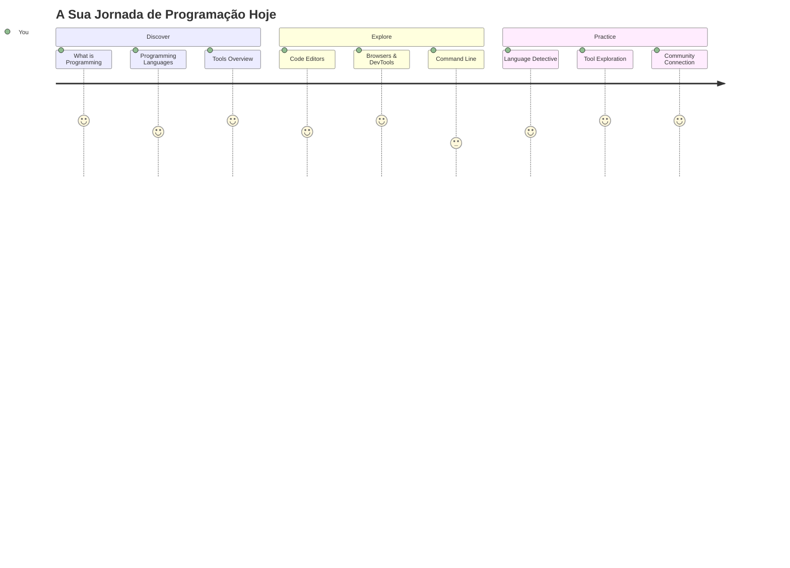
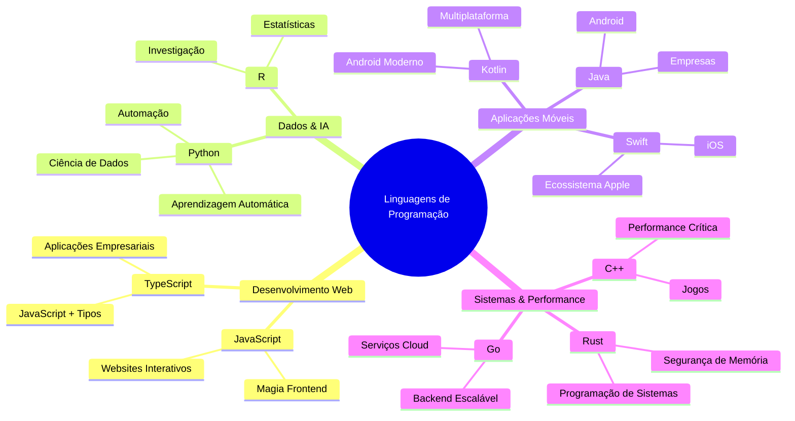
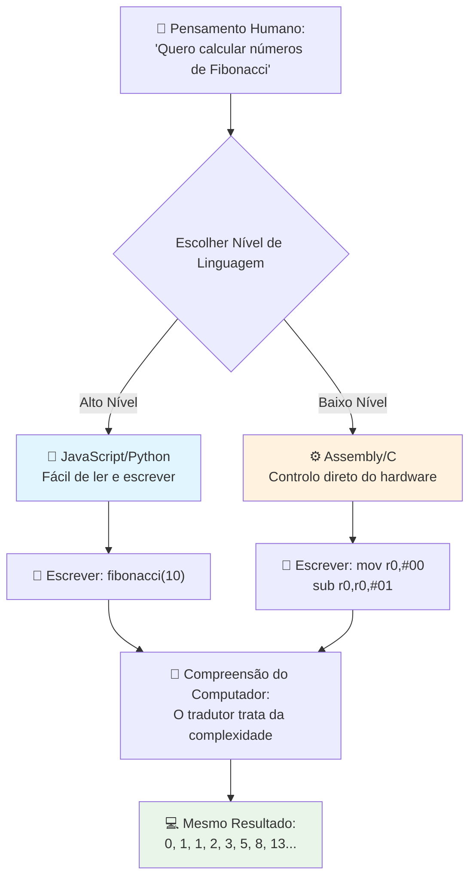
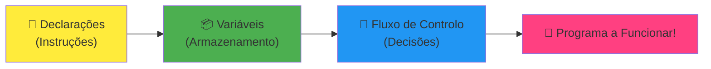
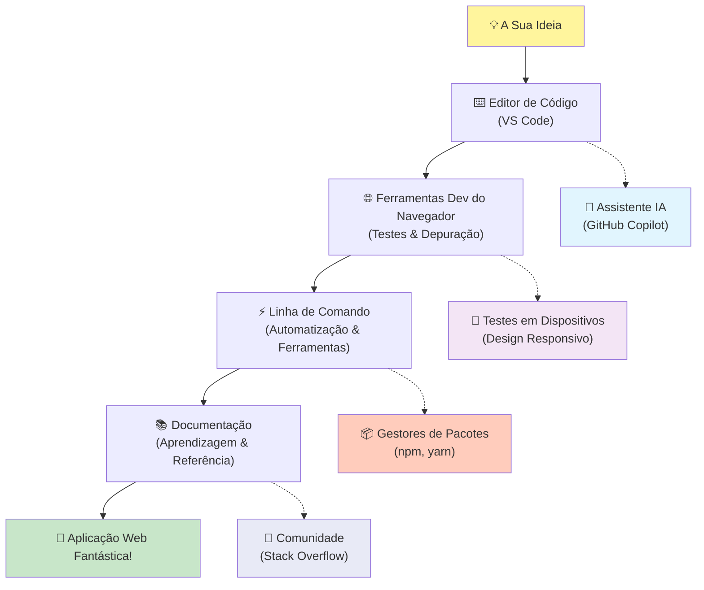
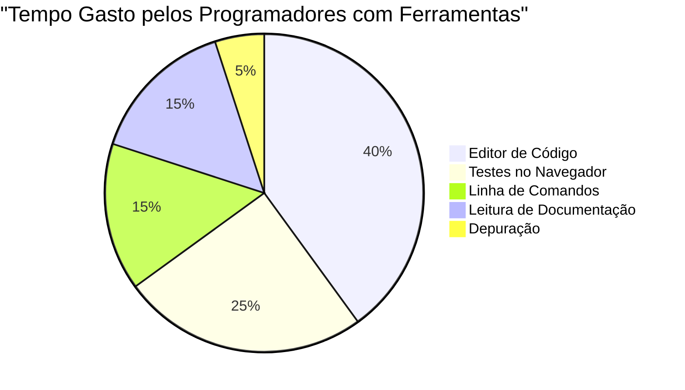

# Introdução às Linguagens de Programação e Ferramentas Modernas para Desenvolvedores
 
Olá, futuro programador! 👋 Posso contar-te algo que ainda me arrepia todos os dias? Estás prestes a descobrir que programar não é só sobre computadores – é sobre ter superpoderes reais para dar vida às tuas ideias mais loucas!

Sabes aquele momento em que estás a usar a tua app favorita e tudo encaixa perfeitamente? Quando tocas num botão e acontece algo absolutamente mágico que te faz pensar "wow, como É QUE fizeram isto?" Pois, alguém tal como tu – provavelmente sentado no seu café favorito às 2 da manhã com o seu terceiro espresso – escreveu o código que criou essa magia. E aqui está o que vai surpreender-te: no final desta lição, não só vais perceber como o fizeram, como vais estar doido para experimentar por ti próprio!

Olha, percebo perfeitamente se agora a programação te parecer intimidante. Quando comecei, acreditei mesmo que precisavas de ser um génio da matemática ou que estavas a programar desde os cinco anos. Mas foi isto que me fez mudar de ideias: programar é exatamente como aprender a conversar numa língua nova. Começas com "olá" e "obrigado", depois passas a pedir um café e, antes de perceberes, estás a ter conversas filosóficas profundas! Só que neste caso, estás a conversar com computadores, e sabes? Eles são os parceiros de conversa mais pacientes que vais ter – nunca julgam os teus erros e estão sempre ansiosos para recomeçar!

Hoje, vamos explorar as ferramentas incríveis que tornam o desenvolvimento web moderno não só possível, como também seriamente viciante. Falo exatamente dos mesmos editores, navegadores e fluxos de trabalho que os programadores da Netflix, Spotify e do teu estúdio indie favorito usam todos os dias. E aqui vem a parte que te vai fazer dançar de alegria: a maioria destas ferramentas profissionais, padrão da indústria, é totalmente gratuita!


> Sketchnote de [Tomomi Imura](https://twitter.com/girlie_mac)


## Vamos Ver O Que Já Sabes!

Antes de entrarmos nas coisas divertidas, tenho curiosidade – o que é que já sabes sobre este mundo da programação? E escuta, se estás a olhar para estas perguntas a pensar "não faço a mínima ideia disto tudo," não só está tudo bem, como é perfeito! Isso significa que estás exatamente no sítio certo. Pensa neste quiz como um aquecimento antes do exercício – estamos só a preparar os músculos do cérebro!

[Faz o quiz pré-lição](https://ff-quizzes.netlify.app/web/)


## A Aventura Que Vamos Viver Juntos

Ok, estou mesmo cheio de entusiasmo pelo que vamos explorar hoje! A sério, gostava de ver a tua cara quando alguns destes conceitos fizerem sentido. Aqui está a viagem incrível que vamos fazer juntos:

- **O que é realmente programação (e porque é a coisa mais fixe de sempre!)** – Vamos descobrir como o código é literalmente a magia invisível que faz tudo funcionar à tua volta, desde aquele despertador que de alguma forma sabe que é segunda de manhã até ao algoritmo que escolhe as tuas recomendações perfeitas na Netflix
- **Linguagens de programação e as suas personalidades incríveis** – Imagina entrar numa festa onde cada pessoa tem superpoderes completamente diferentes e formas próprias de resolver problemas. É isso que o mundo das linguagens de programação é, e vais adorar conhecê-las!
- **Os blocos fundamentais que fazem a magia digital acontecer** – Pensa neles como o set de LEGO criativo supremo. Assim que perceberes como estas peças encaixam, vais perceber que podes construir literalmente tudo o que a tua imaginação imaginar
- **Ferramentas profissionais que te vão fazer sentir que acabaram de te dar a varinha de um feiticeiro** – Não estou a exagerar – estas ferramentas vão mesmo fazer-te sentir com superpoderes, e a melhor parte? São as mesmas que os profissionais usam!

> 💡 **Aqui está uma coisa**: Não penses nem por um segundo em memorizar tudo hoje! Agora, só quero que sintas essa faísca de entusiasmo sobre o que é possível. Os pormenores vão ficar naturalmente quando praticarmos juntos – é assim que a aprendizagem real acontece!

> Podes fazer esta lição no [Microsoft Learn](https://learn.microsoft.com/en-us/learn/modules/web-development-101/introduction-programming/?WT.mc_id=academic-77807-sagibbon)!

## Então, O Que É *Realmente* a Programação?

Ok, vamos enfrentar a questão de um milhão de dólares: o que é, afinal, programação?

Vou contar-te uma história que mudou completamente a minha maneira de pensar sobre isto. Na semana passada, tentei explicar à minha mãe como usar o comando da nossa nova smart TV. Apanhei-me a dizer coisas como "Carrega no botão vermelho, mas não no grande botão vermelho, no pequeno botão vermelho à esquerda... não, na tua outra esquerda... ok, agora segura dois segundos, não um, nem três..." Conheces isto? 😅

Isto é programação! É a arte de dar instruções incríveis, passo a passo, a algo que é muito poderoso mas que precisa que tudo seja explicado ao pormenor. Só que, em vez de estares a explicar à tua mãe (que pode perguntar "que botão vermelho?!"), estás a explicar a um computador (que simplesmente faz exatamente o que dizes, mesmo que o que disseste não seja exatamente o que querias dizer).

O que me surpreendeu quando aprendi isto pela primeira vez foi o seguinte: os computadores são na realidade bastante simples no seu núcleo. Eles só entendem duas coisas – 1 e 0, que basicamente é "sim" e "não" ou "ligado" e "desligado." É tudo! Mas aqui é que entra a magia – não temos que falar em 1s e 0s como se estivéssemos no Matrix. É aqui que as **linguagens de programação** entram em ação. São como o melhor tradutor do mundo que pega nos teus pensamentos perfeitamente normais e humanos e os converte em língua de computador.

E o que ainda me arrepia todas as manhãs quando acordo: literalmente *tudo* o que é digital na tua vida começou com alguém exatamente como tu, provavelmente de pijama com uma chávena de café, a escrever código no seu portátil. Aquele filtro do Instagram que te deixa perfeito? Alguém codificou isso. A recomendação que te levou à tua música favorita? Um programador criou esse algoritmo. A app que te ajuda a dividir a conta do jantar com os amigos? Sim, alguém pensou "isto é chato, aposto que posso resolver isto" e depois... resolveu!

Quando aprendes a programar, não estás só a adquirir uma nova habilidade – estás a juntar-te a uma comunidade incrível de solucionadores de problemas que passam os dias a pensar, "E se eu construísse algo que torne o dia de alguém um pouco melhor?" A sério, há coisa mais fixe do que isso?

✅ **Caça ao Facto Curioso**: Aqui está algo super fixe para procurares quando tiveres um momento livre – sabes quem foi o primeiro programador do mundo? Dou-te uma pista: pode não ser quem esperas! A história desta pessoa é absolutamente fascinante e mostra que programação sempre foi sobre criatividade e pensar fora da caixa.

### 🧠 **Hora da Reflexão: Como Estás a Sentir-te?**

**Tira um momento para refletir:**
- A ideia de "dar instruções aos computadores" faz sentido para ti agora?
- Consegues pensar numa tarefa diária que gostarias de automatizar com programação?
- Que perguntas é que te estão a passar pela cabeça sobre isto tudo da programação?

> **Lembra-te**: É totalmente normal se alguns conceitos agora parecerem confusos. Aprender a programar é como aprender uma língua nova – leva tempo para o teu cérebro criar essas ligações neurais. Estás a ir muito bem!

## As Linguagens de Programação São Como Diferentes Sabores de Magia

Ok, isto vai parecer estranho, mas fica comigo – as linguagens de programação são muito parecidas com diferentes tipos de música. Pensa bem: temos jazz, que é suave e improvisado, rock que é poderoso e direto, clássico que é elegante e estruturado, e hip-hop que é criativo e expressivo. Cada estilo tem a sua vibe, a sua comunidade apaixonada, e cada um é perfeito para diferentes estados de espírito e ocasiões.

As linguagens de programação funcionam exatamente da mesma maneira! Não usarías a mesma linguagem para criar um jogo móvel divertido e para processar enormes volumes de dados climáticos, tal como não ias ouvir death metal numa aula de yoga (bem, numa maioria das aulas de yoga! 😄).

Mas há algo que me surpreende sempre que penso nisso: estas linguagens são como ter o intérprete mais paciente e brilhante do mundo a teu lado. Podes expressar as tuas ideias de uma forma que o teu cérebro humano acha natural, e eles lidam com todo o trabalho extremamente complexo de traduzir isso para os 1s e 0s que os computadores realmente falam. É como ter um amigo fluente em "criatividade humana" e "lógica de computador" – e nunca se cansa, nunca precisa de pausas para café, e nunca te julga por perguntares a mesma coisa duas vezes!

### Linguagens de Programação Populares e Os Seus Usos


| Linguagem | Melhor Para | Porque É Popular |
|----------|----------|------------------|
| **JavaScript** | Desenvolvimento web, interfaces de utilizador | Corre nos navegadores e alimenta websites interativos |
| **Python** | Ciência de dados, automatização, IA | Fácil de ler e aprender, bibliotecas poderosas |
| **Java** | Aplicações empresariais, apps Android | Independente da plataforma, robusta para sistemas grandes |
| **C#** | Aplicações Windows, desenvolvimento de jogos | Forte suporte no ecossistema Microsoft |
| **Go** | Serviços na cloud, sistemas backend | Rápida, simples, desenhada para computação moderna |

### Linguagens de Alto Nível vs. Baixo Nível

Ok, este foi honestamente o conceito que me partiu o cérebro quando comecei a aprender, por isso vou partilhar a analogia que finalmente me fez perceber – e espero que te ajude também!

Imagina que estás a visitar um país onde não falas a língua e precisas desesperadamente de encontrar uma casa de banho (todos já passámos por isto, certo? 😅):

- **Programação de baixo nível** é como aprender tão bem o dialeto local que podes conversar com a avó que vende fruta na esquina usando referências culturais, gírias locais e piadas internas que só quem cresceu ali entende. Super impressionante e incrivelmente eficiente... se fores fluente! Mas bastante avassalador quando só queres encontrar uma casa de banho.

- **Programação de alto nível** é como ter aquele amigo local incrível que simplesmente te entende. Podes dizer "preciso mesmo de encontrar uma casa de banho" em inglês simples, e ele trata de toda a tradução cultural e dá-te direções de uma forma que o teu cérebro não-nativo entende perfeitamente.

Em termos de programação:
- **Linguagens de baixo nível** (como Assembly ou C) permitem-te ter conversas incrivelmente detalhadas com o hardware real do computador, mas tens que pensar como uma máquina, o que é... bem, digamos que é uma mudança mental gigante!
- **Linguagens de alto nível** (como JavaScript, Python ou C#) permitem-te pensar como um humano enquanto elas fazem toda a linguagem máquina nos bastidores. Além disso, têm comunidades incrivelmente acolhedoras cheias de pessoas que se lembram de como era ser novo e que querem realmente ajudar!

Adivinha com quais é que te vou sugerir que comeces? 😉 Linguagens de alto nível são como ter rodinhas na bicicleta que nunca vais querer tirar porque tornam a experiência muito mais divertida!


### Deixa-me Mostrar Porque As Linguagens de Alto Nível São Muito Mais Amigáveis

Ok, vou mostrar-te algo que demonstra exatamente porque me apaixonei pelas linguagens de alto nível, mas primeiro – preciso que me prometas uma coisa. Quando vires esse primeiro exemplo de código, não entres em pânico! É suposto parecer intimidante. É precisamente o ponto que quero mostrar!

Vamos olhar para a mesma tarefa escrita em dois estilos completamente diferentes. Ambos criam o que se chama a sequência de Fibonacci – este padrão matemático lindo onde cada número é a soma dos dois anteriores: 0, 1, 1, 2, 3, 5, 8, 13... (Curiosidade: vais encontrar esta sequência literalmente em todo o lado na natureza – espirais de sementes de girassol, padrões de pinhas, até nas formações das galáxias!)

Pronto para ver a diferença? Vamos lá!

**Linguagem de alto nível (JavaScript) – Amigável para humanos:**

```javascript
// Passo 1: Configuração básica de Fibonacci
const fibonacciCount = 10;
let current = 0;
let next = 1;

console.log('Fibonacci sequence:');
```

**Isto que código faz:**
- **Declara** uma constante para especificar quantos números de Fibonacci queremos gerar
- **Inicializa** duas variáveis para acompanhar o número atual e o próximo na sequência
- **Define** os valores iniciais (0 e 1) que definem o padrão de Fibonacci
- **Mostra** uma mensagem de cabeçalho para identificar a nossa saída

```javascript
// Passo 2: Gerar a sequência com um ciclo
for (let i = 0; i < fibonacciCount; i++) {
  console.log(`Position ${i + 1}: ${current}`);
  
  // Calcular o próximo número na sequência
  const sum = current + next;
  current = next;
  next = sum;
}
```

**Explicando o que acontece aqui:**
- **Percorre** cada posição da sequência usando um ciclo `for`
- **Mostra** cada número com a sua posição usando formatação de template literal
- **Calcula** o próximo número de Fibonacci somando o atual e o seguinte
- **Atualiza** as variáveis de acompanhamento para passar à próxima iteração

```javascript
// Passo 3: Abordagem funcional moderna
const generateFibonacci = (count) => {
  const sequence = [0, 1];
  
  for (let i = 2; i < count; i++) {
    sequence[i] = sequence[i - 1] + sequence[i - 2];
  }
  
  return sequence;
};

// Exemplo de utilização
const fibSequence = generateFibonacci(10);
console.log(fibSequence);
```

**No código acima, nós:**
- **Criámos** uma função reutilizável usando a sintaxe moderna de arrow function
- **Construímos** um array para guardar a sequência completa em vez de mostrar um a um
- **Usámos** indexação do array para calcular cada número novo a partir dos anteriores
- **Devolvemos** a sequência completa para uso flexível noutras partes do programa

**Linguagem de baixo nível (ARM Assembly) – Amigável para o computador:**

```assembly
 area ascen,code,readonly
 entry
 code32
 adr r0,thumb+1
 bx r0
 code16
thumb
 mov r0,#00
 sub r0,r0,#01
 mov r1,#01
 mov r4,#10
 ldr r2,=0x40000000
back add r0,r1
 str r0,[r2]
 add r2,#04
 mov r3,r0
 mov r0,r1
 mov r1,r3
 sub r4,#01
 cmp r4,#00
 bne back
 end
```

Repara como a versão em JavaScript lê quase como instruções em inglês, enquanto a versão em Assembly usa comandos enigmáticos que controlam diretamente o processador do computador. Ambos conseguem fazer exatamente a mesma tarefa, mas a linguagem de alto nível é muito mais fácil de entender, escrever e manter para os humanos.

**Diferenças chave que vais notar:**
- **Legibilidade**: JavaScript utiliza nomes descritivos como `fibonacciCount` enquanto Assembly usa rótulos crípticos como `r0`, `r1`
- **Comentários**: Linguagens de alto nível incentivam comentários explicativos que tornam o código autoexplicativo
- **Estrutura**: O fluxo lógico do JavaScript corresponde à forma como os humanos pensam em problemas passo a passo
- **Manutenção**: Atualizar a versão em JavaScript para diferentes requisitos é direto e claro

✅ **Sobre a sequência de Fibonacci**: Este padrão de números absolutamente deslumbrante (onde cada número é a soma dos dois anteriores: 0, 1, 1, 2, 3, 5, 8...) aparece literalmente *em toda parte* na natureza! Encontrarás-na em espirais de girassóis, padrões de pinhas, na forma como as conchas de náutilo curvam, e até em como os ramos das árvores crescem. É impressionante como a matemática e o código podem ajudar-nos a compreender e recriar os padrões que a natureza usa para criar beleza!

## Os Blocos Constituintes que Fazem a Magia Acontecer

Ok, agora que viste como as linguagens de programação se apresentam em ação, vamos decompor as peças fundamentais que constituem literalmente todos os programas já escritos. Pensa neles como os ingredientes essenciais na tua receita favorita – uma vez que percebas o que cada um faz, serás capaz de ler e escrever código em praticamente qualquer linguagem!

Isto é parecido com aprender a gramática da programação. Lembras-te de quando na escola aprendeste sobre substantivos, verbos e como montar frases? A programação tem a sua própria versão da gramática, e honestamente, é muito mais lógica e tolerante do que a gramática do português alguma vez foi! 😄

### Instruções: As Ordens Passo-a-Passo

Vamos começar com **instruções** – são como frases individuais numa conversa com o teu computador. Cada instrução diz ao computador para fazer uma coisa específica, um pouco como dar direções: "Virar à esquerda aqui," "Parar no semáforo vermelho," "Estacionar nesse lugar."

O que adoro nas instruções é quão legíveis geralmente são. Vê isto:

```javascript
// Declarações básicas que executam ações simples
const userName = "Alex";                    
console.log("Hello, world!");              
const sum = 5 + 3;                         
```

**Isto é o que este código faz:**
- **Declarar** uma variável constante para armazenar o nome do utilizador
- **Exibir** uma mensagem de saudação na saída da consola
- **Calcular** e armazenar o resultado de uma operação matemática

```javascript
// Declarações que interagem com páginas web
document.title = "My Awesome Website";      
document.body.style.backgroundColor = "lightblue";
```

**Passo a passo, isto é o que acontece:**
- **Modificar** o título da página que aparece no separador do navegador
- **Alterar** a cor de fundo do corpo da página inteira

### Variáveis: O Sistema de Memória do Teu Programa

Ok, **variáveis** são honestamente um dos meus conceitos favoritos para ensinar porque são muito parecidos com coisas que já usas todos os dias!

Pensa na lista de contactos do teu telemóvel por um segundo. Tu não decoras o número de telefone de toda a gente – em vez disso, guardas "Mãe," "Melhor Amigo," ou "Pizzaria que Entrega Até às 2 da Manhã" e deixas o telemóvel lembrar-se dos números reais. As variáveis funcionam exatamente da mesma forma! São como recipientes rotulados onde o teu programa pode guardar informações e recuperá-las mais tarde usando um nome que realmente faça sentido.

Aqui está o que é realmente fixe: as variáveis podem mudar enquanto o teu programa está a correr (daí o nome "variável" – viste o que fizeram?). Tal como podes atualizar o contacto dessa pizzaria quando descobres outro sítio ainda melhor, as variáveis podem ser atualizadas conforme o teu programa aprende novas informações ou as situações mudam!

Deixa-me mostrar-te como isto pode ser lindamente simples:

```javascript
// Passo 1: Criar variáveis básicas
const siteName = "Weather Dashboard";        
let currentWeather = "sunny";               
let temperature = 75;                       
let isRaining = false;                      
```

**Compreender estes conceitos:**
- **Guardar** valores imutáveis em variáveis `const` (como o nome do site)
- **Usar** `let` para valores que podem mudar durante o teu programa
- **Atribuir** diferentes tipos de dados: strings (texto), números e booleanos (verdadeiro/falso)
- **Escolher** nomes descritivos que expliquem o que cada variável contém

```javascript
// Passo 2: Trabalhar com objetos para agrupar dados relacionados
const weatherData = {                       
  location: "San Francisco",
  humidity: 65,
  windSpeed: 12
};
```

**No exemplo acima, nós:**
- **Criámos** um objeto para agrupar informações meteorológicas relacionadas
- **Organizámos** múltiplos dados sob um único nome de variável
- **Usámos** pares chave-valor para rotular cada peça de informação claramente

```javascript
// Passo 3: Utilizar e atualizar variáveis
console.log(`${siteName}: Today is ${currentWeather} and ${temperature}°F`);
console.log(`Wind speed: ${weatherData.windSpeed} mph`);

// Atualizar variáveis modificáveis
currentWeather = "cloudy";                  
temperature = 68;                          
```

**Vamos entender cada parte:**
- **Exibir** informações usando literais de template com a sintaxe `${}`
- **Aceder** a propriedades de objetos usando notação por pontos (`weatherData.windSpeed`)
- **Atualizar** variáveis declaradas com `let` para refletir condições que mudam
- **Combinar** múltiplas variáveis para criar mensagens significativas

```javascript
// Passo 4: Desestruturação moderna para um código mais limpo
const { location, humidity } = weatherData; 
console.log(`${location} humidity: ${humidity}%`);
```

**O que precisas de saber:**
- **Extrair** propriedades específicas de objetos usando atribuição por desestruturação
- **Criar** novas variáveis automaticamente com os mesmos nomes das chaves do objeto
- **Simplificar** o código evitando notação por pontos repetitiva

### Fluxo de Controlo: Ensinar o Teu Programa a Pensar

Ok, é aqui que a programação se torna absolutamente impressionante! **Fluxo de controlo** é basicamente ensinar o teu programa a tomar decisões inteligentes, exatamente como tu fazes todos os dias sem sequer pensar nisso.

Imagina isto: esta manhã provavelmente passaste por algo como "Se estiver a chover, levo um guarda-chuva. Se estiver frio, visto um casaco. Se estiver atrasado, salto o pequeno-almoço e pego num café à saída." O teu cérebro segue naturalmente esta lógica if-então dezenas de vezes por dia!

Isto é o que faz com que os programas pareçam inteligentes e vivos em vez de apenas seguir um guião aborrecido e previsível. Eles podem realmente olhar para uma situação, avaliar o que está a acontecer, e responder de forma adequada. É como dar ao teu programa um cérebro que pode adaptar-se e tomar decisões!

Queres ver como isto funciona lindamente? Deixa-me mostrar-te:

```javascript
// Passo 1: Lógica condicional básica
const userAge = 17;

if (userAge >= 18) {
  console.log("You can vote!");
} else {
  const yearsToWait = 18 - userAge;
  console.log(`You'll be able to vote in ${yearsToWait} year(s).`);
}
```

**Isto é o que este código faz:**
- **Verificar** se a idade do utilizador cumpre o requisito para votar
- **Executar** diferentes blocos de código com base no resultado da condição
- **Calcular** e exibir quanto falta para ser elegível para votar se tiver menos de 18 anos
- **Fornecer** feedback específico e útil para cada cenário

```javascript
// Passo 2: Múltiplas condições com operadores lógicos
const userAge = 17;
const hasPermission = true;

if (userAge >= 18 && hasPermission) {
  console.log("Access granted: You can enter the venue.");
} else if (userAge >= 16) {
  console.log("You need parent permission to enter.");
} else {
  console.log("Sorry, you must be at least 16 years old.");
}
```

**A decomposição do que acontece aqui:**
- **Combinar** múltiplas condições usando o operador `&&` (e)
- **Criar** uma hierarquia de condições usando `else if` para múltiplos cenários
- **Lidar** com todos os casos possíveis com uma instrução `else` final
- **Fornecer** feedback claro e acionável para cada situação diferente

```javascript
// Passo 3: Condicional conciso com operador ternário
const votingStatus = userAge >= 18 ? "Can vote" : "Cannot vote yet";
console.log(`Status: ${votingStatus}`);
```

**O que precisas de lembrar:**
- **Usar** o operador ternário (`? :`) para condições simples com duas opções
- **Escrever** a condição primeiro, seguida de `?`, depois o resultado se verdadeiro, depois `:`, depois o resultado se falso
- **Aplicar** este padrão quando precisares de atribuir valores com base em condições

```javascript
// Passo 4: Tratamento de vários casos específicos
const dayOfWeek = "Tuesday";

switch (dayOfWeek) {
  case "Monday":
  case "Tuesday":
  case "Wednesday":
  case "Thursday":
  case "Friday":
    console.log("It's a weekday - time to work!");
    break;
  case "Saturday":
  case "Sunday":
    console.log("It's the weekend - time to relax!");
    break;
  default:
    console.log("Invalid day of the week");
}
```

**Este código realiza o seguinte:**
- **Comparar** o valor da variável com múltiplos casos específicos
- **Agrupar** casos semelhantes (dias úteis vs. fins de semana)
- **Executar** o bloco de código apropriado quando é encontrada uma correspondência
- **Incluir** um caso `default` para lidar com valores inesperados
- **Usar** a instrução `break` para evitar que o código continue para o próximo caso

> 💡 **Analogia do mundo real**: Pensa no fluxo de controlo como se tivesses o GPS mais paciente do mundo a dar-te direções. Pode dizer "Se houver trânsito na Rua Principal, segue pela autoestrada. Se a estrada estiver em obras, tenta o caminho panorâmico." Os programas usam exatamente o mesmo tipo de lógica condicional para responder de forma inteligente a diferentes situações e dar sempre a melhor experiência possível aos utilizadores.

### 🎯 **Verificação de Conceitos: Domínio dos Blocos Constituintes**

**Vamos ver como te estás a safar com os fundamentos:**
- Consegues explicar a diferença entre uma variável e uma instrução com as tuas próprias palavras?
- Pensa numa situação real onde usarias uma decisão if-então (como o nosso exemplo do voto)
- Qual é a coisa sobre a lógica de programação que mais te surpreendeu?

**Um impulsionador rápido de confiança:**

✅ **O que vem a seguir**: Vamos divertir-nos imenso a aprofundar estes conceitos enquanto continuamos esta incrível jornada juntos! Para já, concentra-te em sentir essa excitação por todas as possibilidades incríveis que tens à tua frente. As habilidades e técnicas específicas vão entrar naturalmente enquanto praticamos juntos – prometo que isto vai ser muito mais divertido do que talvez esperes!

## Ferramentas do Ofício

Ok, aqui é que eu fico tão entusiasmado que mal consigo conter-me! 🚀 Vamos falar sobre as ferramentas incríveis que vão fazer-te sentir como se te tivessem acabado de entregar as chaves de uma nave espacial digital.

Sabes como um chef tem aquelas facas perfeitamente equilibradas que parecem extensões das suas mãos? Ou como um músico tem aquela guitarra que parece cantar no momento em que a toca? Bem, os programadores têm a nossa própria versão destas ferramentas mágicas, e aqui está o que vai literalmente explodir a tua mente – a maioria delas é completamente gratuita!

Estou praticamente a saltar na cadeira a pensar em partilhar isto contigo porque revolucionaram completamente a forma como construímos software. Estamos a falar de assistentes de codificação com inteligência artificial que podem ajudar a escrever o teu código (não estou a brincar!), ambientes na cloud onde podes construir aplicações inteiras literalmente de qualquer lugar com Wi-Fi, e ferramentas de depuração tão sofisticadas que são como ter visão raio-x dos teus programas.

E aqui está a parte que ainda me arrepia: estas não são “ferramentas para iniciantes” que vais deixar de usar. São exatamente as mesmas ferramentas profissionais que programadores no Google, Netflix, e naquele estúdio indie de apps que adoras estão a usar neste mesmo momento. Vais sentir-te um verdadeiro profissional ao usá-las!


### Editores de Código e IDEs: Os Teus Novos Melhores Amigos Digitais

Vamos falar dos editores de código – estes vão mesmo tornar-se os teus novos sítios favoritos para estar! Pensa neles como o teu santuário pessoal de codificação onde vais passar a maior parte do teu tempo a criar e aperfeiçoar as tuas criações digitais.

Mas aqui está o mágico dos editores modernos: eles não são apenas editores de texto chiques. São como ter o mentor de codificação mais brilhante e prestável sentado ao teu lado 24/7. Eles apanharem os teus erros de digitação antes de sequer os notares, sugerem melhorias que fazem parecer que és um génio, ajudam-te a entender o que cada pedaço do código faz, e alguns até conseguem prever o que estás prestes a escrever e oferecem-se para acabar os teus pensamentos!

Lembro-me quando descobri a autocompletação pela primeira vez – senti literalmente que estava a viver no futuro. Começas a escrever algo e o editor diz, “Ei, estavas a pensar nesta função que faz exatamente o que precisas?” É como ter um leitor de mentes como teu companheiro de codificação!

**O que torna estes editores tão incríveis?**

Editores modernos de código oferecem um impressionante conjunto de funcionalidades concebidas para aumentar a tua produtividade:

| Funcionalidade | O que Faz | Porquê que Ajuda |
|---------|--------------|--------------|
| **Realce de Sintaxe** | Colore partes diferentes do teu código | Facilita a leitura do código e a deteção de erros |
| **Autocompletação** | Sugere código enquanto escreves | Acelera a codificação e reduz erros de digitação |
| **Ferramentas de Depuração** | Ajuda-te a encontrar e corrigir erros | Poupa horas a resolver problemas |
| **Extensões** | Adiciona funcionalidades especializadas | Personaliza o teu editor para qualquer tecnologia |
| **Assistentes IA** | Sugere código e explicações | Acelera o aprendizado e a produtividade |

> 🎥 **Recurso em Vídeo**: Queres ver estas ferramentas em ação? Espreita este [vídeo Ferramentas do Ofício](https://youtube.com/watch?v=69WJeXGBdxg) para uma visão geral abrangente.

#### Editores Recomendados para Desenvolvimento Web

**[Visual Studio Code](https://code.visualstudio.com/?WT.mc_id=academic-77807-sagibbon)** (Gratuito)
- O mais popular entre os programadores web
- Excelente ecossistema de extensões
- Terminal integrado e integração Git
- **Extensões essenciais**:
  - [GitHub Copilot](https://marketplace.visualstudio.com/items?itemName=GitHub.copilot) - Sugestões de código com IA
  - [Live Share](https://marketplace.visualstudio.com/items?itemName=MS-vsliveshare.vsliveshare) - Colaboração em tempo real
  - [Prettier](https://marketplace.visualstudio.com/items?itemName=esbenp.prettier-vscode) - Formatação automática de código
  - [Code Spell Checker](https://marketplace.visualstudio.com/items?itemName=streetsidesoftware.code-spell-checker) - Correção de erros ortográficos no código

**[JetBrains WebStorm](https://www.jetbrains.com/webstorm/)** (Pago, gratuito para estudantes)
- Ferramentas avançadas de depuração e testes
- Autocompletação de código inteligente
- Controlo de versão integrado

**IDEs Baseadas na Cloud** (Vários preços)
- [GitHub Codespaces](https://github.com/features/codespaces) - VS Code completo no teu navegador
- [Replit](https://replit.com/) - Ótimo para aprender e partilhar código
- [StackBlitz](https://stackblitz.com/) - Desenvolvimento full-stack instantâneo

> 💡 **Dica para Começar**: Começa com o Visual Studio Code – é gratuito, amplamente utilizado na indústria, e tem uma enorme comunidade a criar tutoriais e extensões úteis.

### Navegadores Web: O Teu Laboratório Secreto de Desenvolvimento

Ok, prepara-te para ficarem completamente impressionado! Sabes como tens usado navegadores para navegar nas redes sociais e ver vídeos? Pois, afinal, eles têm estado a esconder este laboratório incrível para desenvolvedores o tempo todo, só à espera que tu o descubras!

Cada vez que clicas com o botão direito numa página web e selecionas "Inspecionar Elemento," estás a abrir um mundo oculto de ferramentas para desenvolvedores que são honestamente mais poderosas do que algum software caro pelo qual eu costumava pagar centenas de euros. É como descobrir que a tua cozinha comum tem um laboratório de chefes profissional escondido por trás de um painel secreto!
A primeira vez que alguém me mostrou as DevTools do navegador, passei cerca de três horas a clicar em tudo e a dizer "ESPERA, ISTO TAMBÉM PODE FAZER ISSO?!" Podes literalmente editar qualquer site em tempo real, ver exatamente quão rápido tudo carrega, testar como o teu site fica em dispositivos diferentes, e até debugar JavaScript como um verdadeiro profissional. É absolutamente impressionante!

**Aqui está o motivo pelo qual os navegadores são a tua arma secreta:**

Quando crias um website ou uma aplicação web, precisas de ver como ele fica e se comporta no mundo real. Os navegadores não só mostram o teu trabalho, como também fornecem feedback detalhado sobre desempenho, acessibilidade e potenciais problemas.

#### Ferramentas de Desenvolvimento do Navegador (DevTools)

Os navegadores modernos incluem suítes de desenvolvimento completas:

| Categoria da Ferramenta | O que Faz | Exemplo de Uso |
|------------------------|-----------|----------------|
| **Inspetor de Elementos** | Visualizar e editar HTML/CSS em tempo real | Ajustar estilos para ver resultados imediatos |
| **Consola** | Ver mensagens de erro e testar JavaScript | Debuggar problemas e experimentar código |
| **Monitor de Rede** | Acompanhar o carregamento de recursos | Otimizar desempenho e tempos de carregamento |
| **Verificador de Acessibilidade** | Testar design inclusivo | Garantir que o site funciona para todos os utilizadores |
| **Simulador de Dispositivos** | Visualizar em tamanhos de ecrã diferentes | Testar design responsivo sem vários dispositivos |

#### Navegadores Recomendados para Desenvolvimento

- **[Chrome](https://developers.google.com/web/tools/chrome-devtools/)** - DevTools padrão da indústria com documentação extensa
- **[Firefox](https://developer.mozilla.org/docs/Tools)** - Excelentes ferramentas para CSS Grid e acessibilidade
- **[Edge](https://docs.microsoft.com/microsoft-edge/devtools-guide-chromium/?WT.mc_id=academic-77807-sagibbon)** - Baseado no Chromium com recursos para desenvolvedores da Microsoft

> ⚠️ **Dica Importante de Testes**: Testa sempre os teus websites em vários navegadores! O que funciona perfeitamente no Chrome pode parecer diferente no Safari ou Firefox. Desenvolvedores profissionais testam em todos os principais navegadores para garantir experiências de utilizador consistentes.


### Ferramentas de Linha de Comandos: O Teu Portal para Superpoderes de Desenvolvedor

Ok, vamos ser completamente honestos aqui sobre a linha de comandos, porque quero que isto te chegue de alguém que realmente percebe. Quando a vi pela primeira vez – só aquela tela preta assustadora com texto a piscar – pensei literalmente: "Não, absolutamente não! Isto parece algo de um filme de hackers dos anos 80, e definitivamente não sou inteligente o suficiente para isto!" 😅

Mas aqui está o que gostava que alguém me tivesse dito naquela altura, e que estou a dizer a ti agora: a linha de comandos não é assustadora – é como ter uma conversa direta com o teu computador. Pensa nela como a diferença entre encomendar comida através de uma aplicação chique com imagens e menus (que é simples e fácil) versus entrar no teu restaurante local favorito onde o chefe sabe exatamente o que gostas e prepara algo perfeito só porque disseste "surpreende-me com algo incrível."

A linha de comandos é onde os desenvolvedores se sentem verdadeiros magos. Escreves algumas palavras que parecem mágicas (ok, são só comandos, mas parecem mágicas!), carregas enter, e PIMBA – criaste toda a estrutura de um projeto, instalaste ferramentas poderosas de todo o mundo, ou fizeste deploy da tua app na internet para milhões de pessoas verem. Quando provas esse poder pela primeira vez, é honestamente viciante!

**Por que a linha de comandos vai tornar-se a tua ferramenta favorita:**

Embora as interfaces gráficas sejam ótimas para muitas tarefas, a linha de comandos destaca-se na automação, precisão e velocidade. Muitas ferramentas de desenvolvimento funcionam principalmente por interfaces de linha de comandos, e aprender a usá-las eficientemente pode melhorar drasticamente a tua produtividade.

```bash
# Passo 1: Criar e navegar para o diretório do projeto
mkdir my-awesome-website
cd my-awesome-website
```

**Isto é o que o código faz:**
- **Criar** um novo diretório chamado "my-awesome-website" para o teu projeto
- **Navegar** para dentro do diretório recém-criado para começares a trabalhar

```bash
# Passo 2: Inicializar o projeto com package.json
npm init -y

# Instalar ferramentas modernas de desenvolvimento
npm install --save-dev vite prettier eslint
npm install --save-dev @eslint/js
```

**Passo a passo, isto é o que acontece:**
- **Inicializar** um novo projeto Node.js com definições por defeito usando `npm init -y`
- **Instalar** o Vite como uma ferramenta moderna de build para desenvolvimento rápido e builds para produção
- **Adicionar** o Prettier para formatação automática de código e ESLint para verificações de qualidade do código
- **Usar** a flag `--save-dev` para marcar estas dependências como apenas para desenvolvimento

```bash
# Passo 3: Criar estrutura do projeto e ficheiros
mkdir src assets
echo '<!DOCTYPE html><html><head><title>My Site</title></head><body><h1>Hello World</h1></body></html>' > index.html

# Iniciar servidor de desenvolvimento
npx vite
```

**No exemplo acima, nós:**
- **Organizámos** o projeto criando pastas separadas para código-fonte e assets
- **Gerámos** um ficheiro HTML básico com estrutura correta do documento
- **Iniciámos** o servidor de desenvolvimento Vite para recarregamento ao vivo e substituição a quente de módulos

#### Ferramentas Essenciais de Linha de Comandos para Desenvolvimento Web

| Ferramenta | Propósito | Porquê que Precisas Dela |
|------------|-----------|--------------------------|
| **[Git](https://git-scm.com/)** | Controlo de versões | Rastrear alterações, colaborar com outros, fazer backup do trabalho |
| **[Node.js & npm](https://nodejs.org/)** | Runtime JavaScript & gestão de pacotes | Executar JavaScript fora do navegador, instalar ferramentas de desenvolvimento modernas |
| **[Vite](https://vitejs.dev/)** | Ferramenta de build & servidor dev | Desenvolvimento super rápido com hot module replacement |
| **[ESLint](https://eslint.org/)** | Qualidade de código | Encontrar e corrigir automaticamente problemas no teu JavaScript |
| **[Prettier](https://prettier.io/)** | Formatação de código | Manter o código formatado de forma consistente e legível |

#### Opções Específicas por Plataforma

**Windows:**
- **[Windows Terminal](https://docs.microsoft.com/windows/terminal/?WT.mc_id=academic-77807-sagibbon)** - Terminal moderno e rico em funcionalidades
- **[PowerShell](https://docs.microsoft.com/powershell/?WT.mc_id=academic-77807-sagibbon)** 💻 - Ambiente de scripting poderoso
- **[Command Prompt](https://learn.microsoft.com/windows-server/administration/windows-commands/windows-commands)** 💻 - Linha de comandos tradicional do Windows

**macOS:**
- **[Terminal](https://support.apple.com/guide/terminal/)** 💻 - Aplicação de terminal integrada
- **[iTerm2](https://iterm2.com/)** - Terminal avançado com funcionalidades extra

**Linux:**
- **[Bash](https://www.gnu.org/software/bash/)** 💻 - Shell padrão do Linux
- **[KDE Konsole](https://docs.kde.org/trunk5/en/konsole/konsole/index.html)** - Emulador de terminal avançado

> 💻 = Pré-instalado no sistema operativo

> 🎯 **Caminho de Aprendizagem**: Começa com comandos básicos como `cd` (mudar diretório), `ls` ou `dir` (listar ficheiros), e `mkdir` (criar pasta). Pratica com comandos de workflow modernos como `npm install`, `git status`, e `code .` (abre o diretório atual no VS Code). À medida que ganhas confiança, vais naturalmente aprender comandos mais avançados e técnicas de automação.


### Documentação: O Teu Mentor de Aprendizagem Sempre Disponível

Ok, deixa-me partilhar um pequeno segredo que vai fazer-te sentir muito melhor por seres um iniciante: até os programadores mais experientes passam grande parte do tempo a ler documentação. E isso não é porque não sabem o que estão a fazer – é na verdade um sinal de sabedoria!

Pensa na documentação como ter acesso aos professores mais pacientes e conhecedores do mundo, disponíveis 24/7. Ficas preso num problema às 2 da manhã? A documentação está lá com um abraço virtual caloroso e exatamente a resposta que precisas. Quer aprender uma nova funcionalidade incrível que toda a gente está a falar? A documentação apoia-te com exemplos passo a passo. Estás a tentar perceber porque é que algo funciona daquela forma? Adivinha – a documentação está pronta para explicar de uma maneira que finalmente faz sentido!

Aqui está algo que mudou totalmente a minha perspetiva: o mundo do desenvolvimento web evolui incrivelmente rápido, e ninguém (mesmo ninguém!) tem tudo memorizado. Já vi programadores séniores com mais de 15 anos de experiência a consultar sintaxe básica, e sabes que mais? Isso não é embaraçoso – é inteligente! Não se trata de ter uma memória perfeita; trata-se de saber onde encontrar respostas confiáveis rapidamente e como aplicá-las.

**Aqui é onde a verdadeira magia acontece:**

Os programadores profissionais passam uma parte significativa do tempo a ler documentação – não porque não saibam o que fazem, mas porque o cenário do desenvolvimento web evolui tão rapidamente que estar atualizado exige aprendizagem contínua. Uma boa documentação ajuda-te a entender não só *como* usar algo, mas *porque* e *quando* usar.

#### Recursos Essenciais de Documentação

**[Mozilla Developer Network (MDN)](https://developer.mozilla.org/docs/Web)**
- O padrão ouro para documentação de tecnologias web
- Guias abrangentes para HTML, CSS e JavaScript
- Inclui informações de compatibilidade entre navegadores
- Apresenta exemplos práticos e demos interativas

**[Web.dev](https://web.dev)** (da Google)
- Boas práticas modernas de desenvolvimento web
- Guias de otimização de desempenho
- Princípios de acessibilidade e design inclusivo
- Estudos de caso de projetos reais

**[Microsoft Developer Documentation](https://docs.microsoft.com/microsoft-edge/#microsoft-edge-for-developers)**
- Recursos para desenvolvimento no navegador Edge
- Guias para Progressive Web Apps
- Insights sobre desenvolvimento multiplataforma

**[Frontend Masters Learning Paths](https://frontendmasters.com/learn/)**
- Currículos estruturados de aprendizagem
- Cursos em vídeo por especialistas da indústria
- Exercícios práticos de programação

> 📚 **Estratégia de Estudo**: Não tentes decorar a documentação – em vez disso, aprende a navegar por ela eficientemente. Guarda referências usadas frequentemente e pratica usar as funções de procura para encontrar informação específica rapidamente.

### 🔧 **Verificação de Domínio das Ferramentas: O que Ressoa Contigo?**

**Tira um momento para pensar:**
- Qual ferramenta tens mais vontade de experimentar primeiro? (Não há resposta errada!)
- A linha de comandos ainda te assusta ou tens curiosidade em explorá-la?
- Consegues imaginar usar as DevTools do navegador para espreitar por trás do pano dos teus sites favoritos?


> **Curiosidade divertida**: A maioria dos programadores passa cerca de 40% do seu tempo no editor de código, mas repara quanto tempo é dedicado a testar, aprender e resolver problemas. Programar não é só escrever código – é criar experiências!

✅ **Para refletir**: Aqui está algo interessante para ponderar – como é que achas que as ferramentas para construir websites (desenvolvimento) diferem das ferramentas para desenhar como eles ficam (design)? É como a diferença entre ser o arquiteto que desenha uma casa linda e o empreiteiro que a constrói de facto. Ambos são cruciais, mas precisam de caixas de ferramentas diferentes! Este tipo de pensamento vai ajudar-te a ver o quadro geral de como os websites ganham vida.

## Desafio do Agente GitHub Copilot 🚀

Usa o modo Agente para completar o seguinte desafio:

**Descrição:** Explora as funcionalidades de um editor de código moderno ou IDE e demonstra como pode melhorar o teu fluxo de trabalho como desenvolvedor web.

**Prompt:** Escolhe um editor de código ou IDE (como Visual Studio Code, WebStorm, ou um IDE baseado na cloud). Lista três funcionalidades ou extensões que te ajudam a escrever, debugar ou manter código de forma mais eficiente. Para cada uma, faz uma breve explicação de como beneficiam o teu fluxo de trabalho.

---

## 🚀 Desafio

**Ok, detetive, pronto para o teu primeiro caso?**

Agora que tens esta base incrível, tenho uma aventura que vai ajudar-te a ver quão incrivelmente diversa e fascinante é realmente a programação. E escuta – isto não é sobre escrever código ainda, por isso sem pressões! Pensa em ti como um detetive de linguagens de programação no teu primeiro caso empolgante!

**A tua missão, caso decidas aceitá-la:**
1. **Torna-te explorador de linguagens**: Escolhe três linguagens de programação de universos completamente diferentes – talvez uma que construa websites, outra que crie apps móveis, e uma que processe dados para cientistas. Encontra exemplos da mesma tarefa simples escritos em cada linguagem. Prometo que vais ficar maravilhado com o quão diferentes podem parecer enquanto fazem exatamente a mesma coisa!

2. **Descobre as histórias de origem delas**: O que torna cada linguagem especial? Aqui vai um facto interessante – cada linguagem de programação foi criada porque alguém pensou, "Sabes que mais? Tem que haver uma forma melhor de resolver este problema específico." Consegues perceber quais foram esses problemas? Algumas destas histórias são verdadeiramente fascinantes!

3. **Conhece as comunidades**: Vê quão acolhedora e apaixonada é a comunidade de cada linguagem. Algumas têm milhões de programadores a partilhar conhecimento e a ajudar uns aos outros, outras são menores mas extremamente unidas e solidárias. Vais adorar ver as diferentes personalidades destas comunidades!

4. **Segue o teu instinto**: Qual destas linguagens te parece mais acessível agora? Não te stresses em fazer a escolha “perfeita” – apenas ouve o teu instinto! Honestamente, não há respostas erradas aqui, e podes sempre explorar outras mais tarde.

**Trabalho extra de detetive**: Descobre quais grandes sites ou apps são construídos com cada linguagem. Garanto que vais ficar surpreendido ao saber o que move o Instagram, Netflix, ou aquele jogo móvel que não consegues parar de jogar!

> 💡 **Lembra-te**: Não estás a tentar tornar-te expert em nenhuma destas linguagens hoje. Estás só a conhecer a vizinhança antes de decidires onde queres montar a tua base. Vai com calma, diverte-te e deixa a tua curiosidade guiar-te!

## Vamos Celebrar o que Descobriste!

Por todos os céus, absorveste tanta informação incrível hoje! Estou genuinamente entusiasmado para ver quanto desta viagem fantástica ficou contigo. E lembra-te – isto não é um teste onde tens que acertar em tudo. Isto é mais uma celebração de todas as coisas fixes que aprendeste sobre este mundo fascinante em que estás prestes a mergulhar!

[Faz o quiz pós-aula](https://ff-quizzes.netlify.app/web/)

## Revisão & Auto Estudo

**Leva o teu tempo para explorar e diverte-te!**
Cobriu muita coisa hoje, e isso é algo de que deve ter orgulho! Agora vem a parte divertida – explorar os tópicos que despertaram a sua curiosidade. Lembre-se, isto não é trabalho de casa – é uma aventura!

**Aprofunde o que o entusiasma:**

**Mãos à obra com linguagens de programação:**
- Visite os websites oficiais de 2-3 linguagens que chamaram a sua atenção. Cada uma tem a sua própria personalidade e história!
- Experimente alguns playgrounds de codificação online como o [CodePen](https://codepen.io/), [JSFiddle](https://jsfiddle.net/), ou [Replit](https://replit.com/). Não tenha medo de experimentar – não pode estragar nada!
- Leia sobre como a sua linguagem preferida foi criada. A sério, algumas destas histórias de origem são fascinantes e vão ajudá-lo a entender porque é que as linguagens funcionam do jeito que funcionam.

**Fique confortável com as suas novas ferramentas:**
- Faça o download do Visual Studio Code se ainda não o fez – é gratuito e vai adorar!
- Gaste alguns minutos a explorar o mercado de Extensões. É como uma loja de aplicações para o seu editor de código!
- Abra as Ferramentas de Desenvolvimento do seu navegador e clique por aí. Não se preocupe em entender tudo – só familiarize-se com o que está lá.

**Junte-se à comunidade:**
- Siga algumas comunidades de programadores no [Dev.to](https://dev.to/), [Stack Overflow](https://stackoverflow.com/), ou [GitHub](https://github.com/). A comunidade de programação é incrivelmente acolhedora para os novos!
- Assista a alguns vídeos para iniciantes no YouTube. Há tantos criadores fantásticos que se lembram de como é começar.
- Considere participar em encontros locais ou comunidades online. Acredite, os programadores adoram ajudar quem está a começar!

> 🎯 **Ouça, aqui está o que quero que se lembre**: Não se espera que se torne um mago da programação da noite para o dia! Neste momento, está apenas a conhecer este mundo incrível do qual vai fazer parte. Vá com calma, desfrute a viagem, e lembre-se – todos os programadores que admira já estiveram exatamente onde você está agora, sentindo-se entusiasmados e talvez um pouco sobrecarregados. Isso é totalmente normal, e significa que está a fazer tudo certo!

## Assignment

[Reading the Docs](assignment.md)

> 💡 **Um pequeno empurrão para o seu trabalho**: Gostava muito de o ver explorar algumas ferramentas que ainda não cobrimos! Evite os editores, navegadores e ferramentas de linha de comando que já mencionámos – existe todo um universo incrível de ferramentas de desenvolvimento à espera de ser descoberto. Procure aquelas que são ativamente mantidas e que têm comunidades vibrantes e prestáveis (estas tendem a ter os melhores tutoriais e as pessoas mais simpáticas quando, inevitavelmente, ficar bloqueado e precisar de uma ajuda amiga).

---

## 🚀 A Sua Linha Temporal de Aprendizagem de Programação

### ⚡ **O Que Pode Fazer Nos Próximos 5 Minutos**
- [ ] Guardar nos favoritos 2-3 websites de linguagens de programação que chamaram a sua atenção
- [ ] Fazer o download do Visual Studio Code se ainda não o fez
- [ ] Abrir as DevTools do navegador (F12) e clicar por qualquer site
- [ ] Entrar numa comunidade de programação (Dev.to, Reddit r/webdev, ou Stack Overflow)

### ⏰ **O Que Pode Concluir Esta Hora**
- [ ] Completar o quiz após a lição e refletir sobre as suas respostas
- [ ] Configurar o VS Code com a extensão GitHub Copilot
- [ ] Tentar um exemplo "Hello World" em 2 linguagens de programação diferentes online
- [ ] Assistir a um vídeo "Um Dia na Vida de um Programador" no YouTube
- [ ] Começar a sua investigação sobre linguagens de programação (do desafio)

### 📅 **A Sua Aventura de Uma Semana**
- [ ] Completar a tarefa e explorar 3 novas ferramentas de desenvolvimento
- [ ] Seguir 5 programadores ou contas de programação nas redes sociais
- [ ] Tentar construir algo pequeno no CodePen ou Replit (mesmo que seja só "Olá, [O Seu Nome]!")
- [ ] Ler um post de blog de um programador sobre a sua jornada de programação
- [ ] Participar numa reunião virtual ou assistir a uma palestra de programação
- [ ] Começar a aprender a sua linguagem escolhida com tutoriais online

### 🗓️ **A Sua Transformação de Um Mês**
- [ ] Construir o seu primeiro projeto pequeno (até uma simples página web conta!)
- [ ] Contribuir para um projeto open source (comece por corrigir documentação)
- [ ] Orientar alguém que está a começar a sua jornada de programação
- [ ] Criar o seu website de portfólio de programador
- [ ] Conectar-se com comunidades locais de programadores ou grupos de estudo
- [ ] Começar a planear o seu próximo marco de aprendizagem

### 🎯 **Reflexão Final**

**Antes de avançar, reserve um momento para celebrar:**
- Qual foi a coisa que o entusiasma mais na programação hoje?
- Qual ferramenta ou conceito quer explorar primeiro?
- Como se sente em começar esta jornada de programação?
- Qual é uma pergunta que gostaria de fazer a um programador agora mesmo?


> 🌟 **Lembre-se**: Todo especialista foi uma vez um iniciante. Todo programador sénior já se sentiu exatamente como você se sente agora – entusiasmado, porventura um pouco sobrecarregado, e definitivamente curioso sobre o que é possível. Está em ótima companhia, e esta jornada vai ser incrível. Bem-vindo ao maravilhoso mundo da programação! 🎉

---

<!-- CO-OP TRANSLATOR DISCLAIMER START -->
**Aviso Legal**:  
Este documento foi traduzido utilizando o serviço de tradução automática [Co-op Translator](https://github.com/Azure/co-op-translator). Embora nos esforcemos para garantir a precisão, por favor tenha em atenção que traduções automáticas podem conter erros ou imprecisões. O documento original no seu idioma nativo deve ser considerado a fonte autorizada. Para informações críticas, é recomendada a tradução profissional humana. Não nos responsabilizamos por quaisquer mal-entendidos ou interpretações incorretas resultantes da utilização desta tradução.
<!-- CO-OP TRANSLATOR DISCLAIMER END -->