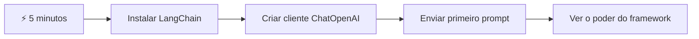
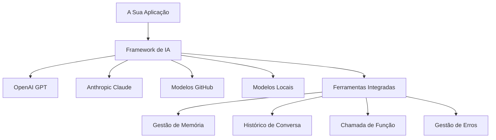
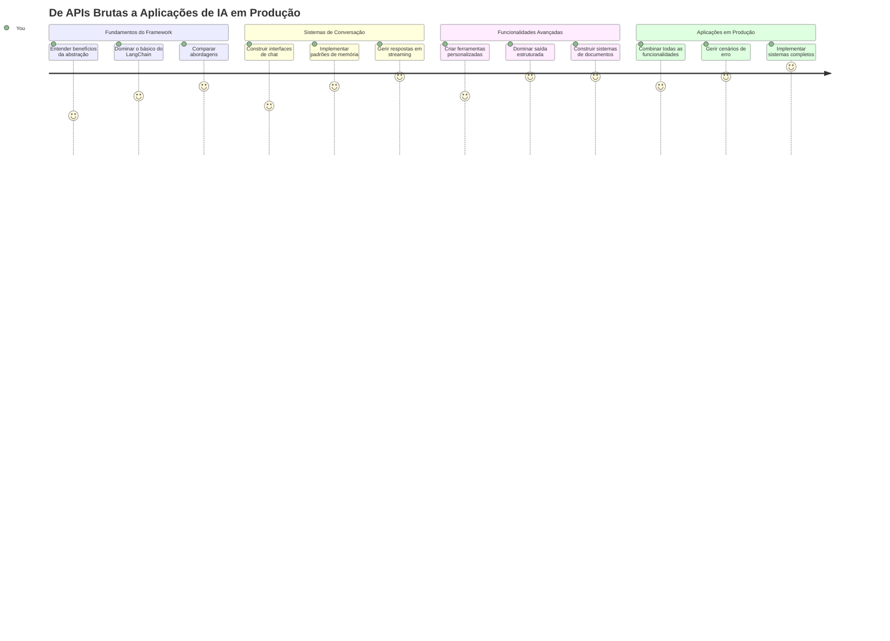
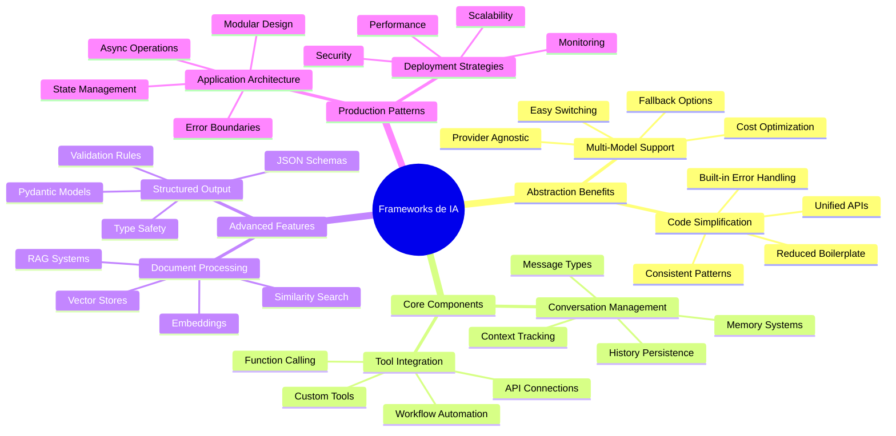
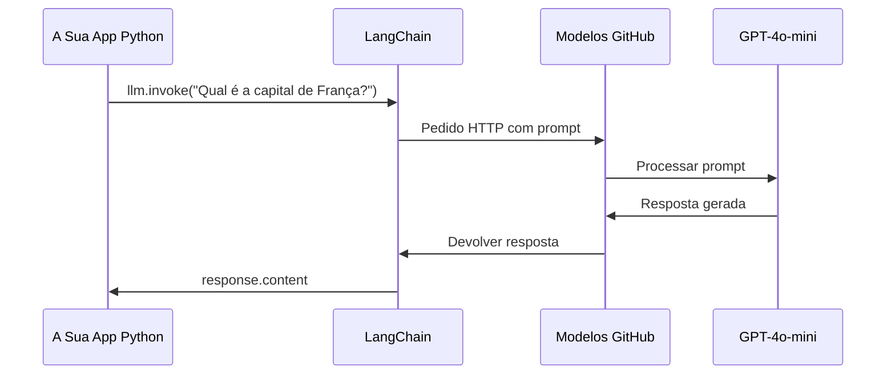
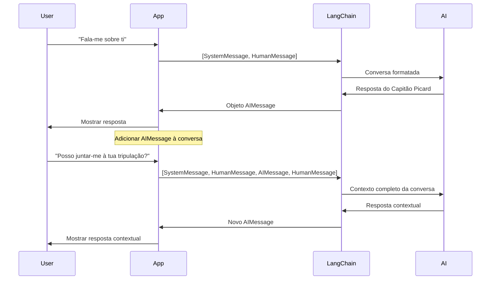
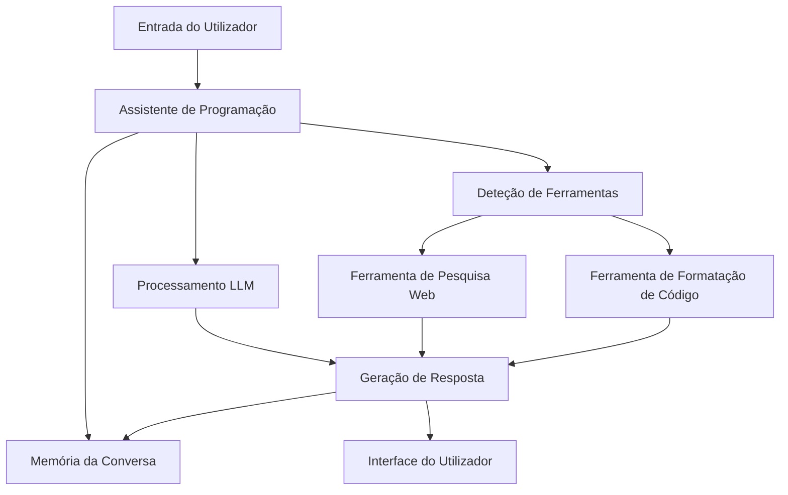
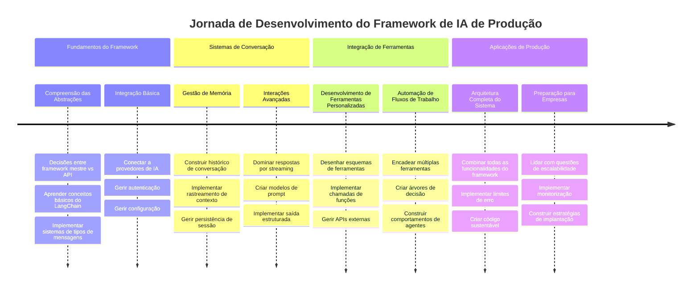
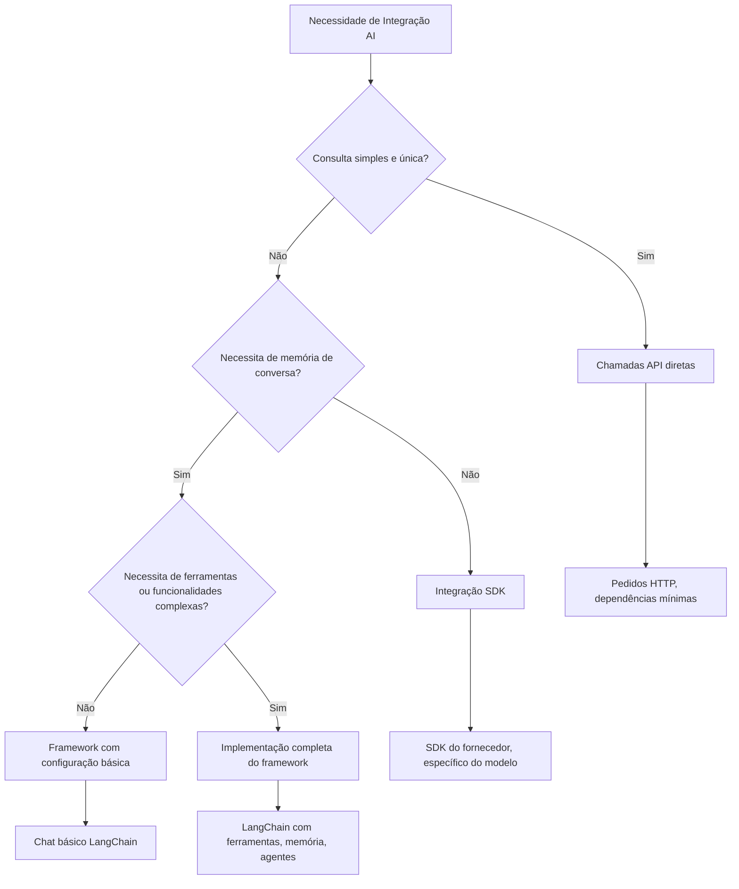

# Framework de IA

Alguma vez se sentiu sobrecarregado a tentar construir aplicações de IA do zero? Não está sozinho! Os frameworks de IA são como ter um canivete suíço para o desenvolvimento de IA – são ferramentas poderosas que podem poupar-lhe tempo e dores de cabeça ao construir aplicações inteligentes. Pense num framework de IA como numa biblioteca bem organizada: fornece componentes pré-construídos, APIs padronizadas e abstrações inteligentes para que possa focar-se em resolver problemas em vez de lutar com os detalhes da implementação.

Nesta lição, vamos explorar como frameworks como o LangChain podem transformar tarefas complexas de integração de IA em código limpo e legível. Vai descobrir como enfrentar desafios do mundo real como acompanhar conversas, implementar chamadas a ferramentas e gerir diferentes modelos de IA através de uma interface unificada.

Quando terminarmos, vai saber quando recorrer a frameworks em vez de chamadas diretas à API, como usar as suas abstrações de forma eficaz e como construir aplicações de IA prontas para uso no mundo real. Vamos explorar o que os frameworks de IA podem fazer pelos seus projetos.

## ⚡ O Que Pode Fazer nos Próximos 5 Minutos

**Caminho de Arranque Rápido para Programadores Ocupados**


- **Minuto 1**: Instale LangChain: `pip install langchain langchain-openai`
- **Minuto 2**: Configure o seu token do GitHub e importe o cliente ChatOpenAI
- **Minuto 3**: Crie uma conversa simples com mensagens do sistema e do utilizador
- **Minuto 4**: Adicione uma ferramenta básica (como uma função soma) e veja a chamada da ferramenta pela IA
- **Minuto 5**: Experimente a diferença entre chamadas diretas à API e abstração do framework

**Código para Teste Rápido**:
```python
from langchain_openai import ChatOpenAI
from langchain_core.messages import SystemMessage, HumanMessage

llm = ChatOpenAI(
    api_key=os.environ["GITHUB_TOKEN"],
    base_url="https://models.github.ai/inference",
    model="openai/gpt-4o-mini"
)

response = llm.invoke([
    SystemMessage(content="You are a helpful coding assistant"),
    HumanMessage(content="Explain Python functions briefly")
])
print(response.content)
```

**Porquê isto ter importância**: Em 5 minutos, vai experimentar como os frameworks de IA transformam uma integração complexa de IA em chamadas simples de método. Esta é a base que alimenta aplicações de IA em produção.

## Porque escolher um framework?

Então está pronto para construir uma aplicação de IA – ótimo! Mas aqui está o ponto: tem vários caminhos diferentes que pode seguir, e cada um tem os seus prós e contras. É como escolher entre andar a pé, andar de bicicleta ou conduzir para chegar a algum lado – todos o levam lá, mas a experiência (e o esforço) será totalmente diferente.

Vamos analisar as três formas principais de integrar IA nos seus projetos:

| Abordagem | Vantagens | Melhor Para | Considerações |
|----------|------------|----------|--------------|
| **Chamadas Diretas HTTP** | Controlo total, sem dependências | Consultas simples, aprendizagem dos fundamentos | Código mais verboso, gestão manual de erros |
| **Integração SDK** | Menos código redundante, otimização específica do modelo | Aplicações de modelo único | Limitado a fornecedores específicos |
| **Frameworks de IA** | API unificada, abstrações integradas | Aplicações multi-modelo, fluxos de trabalho complexos | Curva de aprendizagem, possível abstração excessiva |

### Benefícios do Framework na Prática


**Porque os frameworks importam:**
- **Unifica** múltiplos fornecedores de IA numa única interface
- **Gere** a memória das conversas automaticamente
- **Fornece** ferramentas prontas para tarefas comuns como embeddings e chamadas de funções
- **Gerencia** tratamento de erros e lógica de re-tentativa
- **Transforma** fluxos de trabalho complexos em chamadas de método legíveis

> 💡 **Dica Profissional**: Use frameworks quando mudar entre diferentes modelos de IA ou construir funcionalidades complexas como agentes, memória ou chamadas a ferramentas. Use APIs diretas quando estiver a aprender os fundamentos ou a construir aplicações simples e focadas.

**Conclusão**: Tal como escolher entre ferramentas especializadas de um artesão e uma oficina completa, o importante é adequar a ferramenta à tarefa. Os frameworks destacam-se para aplicações complexas e ricas em funcionalidades, enquanto as APIs diretas funcionam bem para casos de uso simples.

## 🗺️ O Seu Percurso de Aprendizagem na Maestria de Frameworks de IA


**Destino da Sua Jornada**: No final desta lição, terá dominado o desenvolvimento com frameworks de IA e será capaz de construir aplicações de IA sofisticadas e prontas para produção que rivalizam com assistentes comerciais de IA.

## Introdução

Nesta lição, vamos aprender a:

- Usar um framework comum de IA.
- Resolver problemas comuns como conversas de chat, uso de ferramentas, memória e contexto.
- Aproveitar isso para construir aplicações de IA.

## 🧠 Ecossistema de Desenvolvimento de Frameworks de IA


**Princípio Fundamental**: Frameworks de IA abstraem a complexidade enquanto fornecem poderosas abstrações para gestão de conversas, integração de ferramentas e processamento de documentos, permitindo aos programadores construir aplicações de IA sofisticadas com código limpo e fácil de manter.

## O seu primeiro prompt de IA

Vamos começar pelo básico criando a sua primeira aplicação de IA que envia uma pergunta e obtém uma resposta. Tal como Arquimedes descobriu o princípio do deslocamento na sua banheira, às vezes as observações mais simples conduzem aos insights mais poderosos – e os frameworks tornam estes insights acessíveis.

### Configurar LangChain com os Modelos do GitHub

Vamos usar LangChain para ligar aos Modelos do GitHub, que é bastante fixe porque lhe dá acesso gratuito a vários modelos de IA. A melhor parte? Só precisa de alguns parâmetros simples de configuração para começar:

```python
from langchain_openai import ChatOpenAI
import os

llm = ChatOpenAI(
    api_key=os.environ["GITHUB_TOKEN"],
    base_url="https://models.github.ai/inference",
    model="openai/gpt-4o-mini",
)

# Enviar um prompt simples
response = llm.invoke("What's the capital of France?")
print(response.content)
```

**Vamos decompor o que aqui está a acontecer:**
- **Cria** um cliente LangChain usando a classe `ChatOpenAI` – esta é a sua porta de entrada para a IA!
- **Configura** a ligação aos Modelos GitHub com o seu token de autenticação
- **Especifica** qual modelo de IA usar (`gpt-4o-mini`) – pense nisso como escolher o seu assistente de IA
- **Envia** a sua pergunta usando o método `invoke()` – onde a magia acontece
- **Extrai** e mostra a resposta – e voilà, está a conversar com a IA!

> 🔧 **Nota de Configuração**: Se estiver a usar GitHub Codespaces, tem sorte – o `GITHUB_TOKEN` já está configurado para si! A trabalhar localmente? Sem problema, só precisa criar um token de acesso pessoal com as permissões certas.

**Saída esperada:**
```text
The capital of France is Paris.
```


## Construindo IA conversacional

Esse primeiro exemplo demonstra o básico, mas é apenas uma troca única – faz uma pergunta, obtém uma resposta, e pronto. Em aplicações reais, quer que a sua IA se lembre do que foi discutido, como Watson e Holmes construíam as suas conversas de investigação ao longo do tempo.

É aqui que o LangChain se torna particularmente útil. Fornece diferentes tipos de mensagens que ajudam a estruturar conversas e permitem dar à sua IA uma personalidade. Vai construir experiências de chat que mantêm contexto e carácter.

### Entendendo os tipos de mensagem

Pense nestes tipos de mensagem como diferentes "chapéus" que os participantes usam numa conversa. O LangChain usa diferentes classes de mensagem para acompanhar quem diz o quê:

| Tipo de Mensagem | Propósito | Caso de Uso Exemplo |
|--------------|---------|------------------|
| `SystemMessage` | Define a personalidade e comportamento da IA | "És um assistente de programação útil" |
| `HumanMessage` | Representa a entrada do utilizador | "Explica como funcionam as funções" |
| `AIMessage` | Guarda respostas da IA | Respostas anteriores da IA na conversa |

### Criando a sua primeira conversa

Vamos criar uma conversa onde a nossa IA assume um papel específico. Vamos fazê-la encarnar o Capitão Picard – uma personagem conhecida pela sua sabedoria diplomática e liderança:

```python
messages = [
    SystemMessage(content="You are Captain Picard of the Starship Enterprise"),
    HumanMessage(content="Tell me about you"),
]
```

**Decompondo esta configuração da conversa:**
- **Estabelece** o papel e personalidade da IA através do `SystemMessage`
- **Fornece** a pergunta inicial do utilizador via `HumanMessage`
- **Cria** a base para uma conversa multi-turnos

O código completo para este exemplo é assim:

```python
from langchain_core.messages import HumanMessage, SystemMessage
from langchain_openai import ChatOpenAI
import os

llm = ChatOpenAI(
    api_key=os.environ["GITHUB_TOKEN"],
    base_url="https://models.github.ai/inference",
    model="openai/gpt-4o-mini",
)

messages = [
    SystemMessage(content="You are Captain Picard of the Starship Enterprise"),
    HumanMessage(content="Tell me about you"),
]


# funciona
response  = llm.invoke(messages)
print(response.content)
```

Deverá ver um resultado semelhante a:

```text
I am Captain Jean-Luc Picard, the commanding officer of the USS Enterprise (NCC-1701-D), a starship in the United Federation of Planets. My primary mission is to explore new worlds, seek out new life and new civilizations, and boldly go where no one has gone before. 

I believe in the importance of diplomacy, reason, and the pursuit of knowledge. My crew is diverse and skilled, and we often face challenges that test our resolve, ethics, and ingenuity. Throughout my career, I have encountered numerous species, grappled with complex moral dilemmas, and have consistently sought peaceful solutions to conflicts.

I hold the ideals of the Federation close to my heart, believing in the importance of cooperation, understanding, and respect for all sentient beings. My experiences have shaped my leadership style, and I strive to be a thoughtful and just captain. How may I assist you further?
```

Para manter a continuidade da conversa (em vez de reiniciar o contexto sempre), precisa de continuar a adicionar respostas à sua lista de mensagens. Tal como as tradições orais que preservaram histórias ao longo das gerações, esta abordagem constrói memória duradoura:

```python
from langchain_core.messages import HumanMessage, SystemMessage
from langchain_openai import ChatOpenAI
import os

llm = ChatOpenAI(
    api_key=os.environ["GITHUB_TOKEN"],
    base_url="https://models.github.ai/inference",
    model="openai/gpt-4o-mini",
)

messages = [
    SystemMessage(content="You are Captain Picard of the Starship Enterprise"),
    HumanMessage(content="Tell me about you"),
]


# funciona
response  = llm.invoke(messages)

print(response.content)

print("---- Next ----")

messages.append(response)
messages.append(HumanMessage(content="Now that I know about you, I'm Chris, can I be in your crew?"))

response  = llm.invoke(messages)

print(response.content)

```

Bem giro, certo? O que aqui acontece é que estamos a chamar o LLM duas vezes – primeiro só com as duas mensagens iniciais, mas depois de novo com todo o histórico de conversa. É como se a IA realmente estivesse a acompanhar a nossa conversa!

Quando executar este código, obterá uma segunda resposta que soa algo como:

```text
Welcome aboard, Chris! It's always a pleasure to meet those who share a passion for exploration and discovery. While I cannot formally offer you a position on the Enterprise right now, I encourage you to pursue your aspirations. We are always in need of talented individuals with diverse skills and backgrounds. 

If you are interested in space exploration, consider education and training in the sciences, engineering, or diplomacy. The values of curiosity, resilience, and teamwork are crucial in Starfleet. Should you ever find yourself on a starship, remember to uphold the principles of the Federation: peace, understanding, and respect for all beings. Your journey can lead you to remarkable adventures, whether in the stars or on the ground. Engage!
```


Vou considerar isso um talvez ;)

## Respostas em streaming

Já reparou como o ChatGPT parece "escrever" as respostas em tempo real? Isso é o streaming em ação. Tal como ver um calígrafo habilidoso a trabalhar – vendo os caracteres aparecerem traço a traço em vez de se materializarem instantaneamente – o streaming torna a interação mais natural e oferece feedback imediato.

### Implementar streaming com LangChain

```python
from langchain_openai import ChatOpenAI
import os

llm = ChatOpenAI(
    api_key=os.environ["GITHUB_TOKEN"],
    base_url="https://models.github.ai/inference",
    model="openai/gpt-4o-mini",
    streaming=True
)

# Transmitir a resposta
for chunk in llm.stream("Write a short story about a robot learning to code"):
    print(chunk.content, end="", flush=True)
```

**Porque o streaming é fantástico:**
- **Mostra** o conteúdo à medida que é criado – sem esperas desconfortáveis!
- **Faz** os utilizadores sentirem que algo está realmente a acontecer
- **Parece** mais rápido, mesmo que tecnicamente não seja
- **Permite** aos utilizadores começar a ler enquanto a IA ainda está a "pensar"

> 💡 **Dica de Experiência do Utilizador**: O streaming brilha mesmo com respostas mais longas, como explicações de código, escrita criativa ou tutoriais detalhados. Os seus utilizadores vão adorar ver o progresso em vez de ficarem a olhar para um ecrã vazio!

### 🎯 Verificação Pedagógica: Benefícios da Abstração do Framework

**Pausa para Reflexão**: Acabou de experienciar o poder das abstrações dos frameworks de IA. Compare o que aprendeu com as chamadas diretas à API das lições anteriores.

**Autoavaliação Rápida**:
- Consegue explicar como o LangChain simplifica a gestão de conversas comparado com o acompanhamento manual de mensagens?
- Qual a diferença entre os métodos `invoke()` e `stream()`, e quando usaria cada um?
- Como é que o sistema de tipos de mensagens do framework melhora a organização do código?

**Ligação ao Mundo Real**: Os padrões de abstração que aprendeu (tipos de mensagens, interfaces de streaming, memória da conversa) são usados em todas as grandes aplicações de IA – desde a interface do ChatGPT até à assistência de código do GitHub Copilot. Está a dominar os mesmos padrões arquitetónicos usados pelas equipas profissionais de desenvolvimento de IA.

**Pergunta Desafio**: Como desenharia uma abstração de framework para lidar com diferentes fornecedores de modelos de IA (OpenAI, Anthropic, Google) usando uma única interface? Considere os benefícios e compensações.

## Modelos de prompt

Os modelos de prompt funcionam como as estruturas retóricas usadas na oratória clássica – pense em como Cícero adaptava os seus padrões de discurso para diferentes audiências mantendo o mesmo framework persuasivo. Permitem criar prompts reutilizáveis onde pode trocar diferentes pedaços de informação sem reescrever tudo do zero. Depois de configurar o modelo, só precisa de preencher as variáveis com os valores que necessita.

### Criar prompts reutilizáveis

```python
from langchain_core.prompts import ChatPromptTemplate

# Definir um modelo para explicações de código
template = ChatPromptTemplate.from_messages([
    ("system", "You are an expert programming instructor. Explain concepts clearly with examples."),
    ("human", "Explain {concept} in {language} with a practical example for {skill_level} developers")
])

# Usar o modelo com diferentes valores
questions = [
    {"concept": "functions", "language": "JavaScript", "skill_level": "beginner"},
    {"concept": "classes", "language": "Python", "skill_level": "intermediate"},
    {"concept": "async/await", "language": "JavaScript", "skill_level": "advanced"}
]

for question in questions:
    prompt = template.format_messages(**question)
    response = llm.invoke(prompt)
    print(f"Topic: {question['concept']}\n{response.content}\n---\n")
```

**Porque vai adorar usar modelos:**
- **Mantém** os seus prompts consistentes em toda a aplicação
- **Chega de** concatenações complexas de strings – só variáveis simples e limpas
- **A sua IA** comporta-se de forma previsível porque a estrutura mantém-se igual
- **As atualizações** são fáceis – muda o modelo uma vez e fica corrigido em todo o lado

## Saída estruturada

Alguma vez se sentiu frustrado a tentar interpretar respostas de IA que surgem como texto não estruturado? A saída estruturada é como ensinar a sua IA a seguir o método sistemático que Linnaeus usou para a classificação biológica – organizada, previsível e fácil de trabalhar. Pode pedir JSON, estruturas de dados específicas ou qualquer formato que necessite.

### Definição de esquemas de saída

```python
from langchain_core.prompts import ChatPromptTemplate
from langchain_core.output_parsers import JsonOutputParser
from pydantic import BaseModel, Field

class CodeReview(BaseModel):
    score: int = Field(description="Code quality score from 1-10")
    strengths: list[str] = Field(description="List of code strengths")
    improvements: list[str] = Field(description="List of suggested improvements")
    overall_feedback: str = Field(description="Summary feedback")

# Configurar o parser
parser = JsonOutputParser(pydantic_object=CodeReview)

# Criar prompt com instruções de formato
prompt = ChatPromptTemplate.from_messages([
    ("system", "You are a code reviewer. {format_instructions}"),
    ("human", "Review this code: {code}")
])

# Formatar o prompt com instruções
chain = prompt | llm | parser

# Obter resposta estruturada
code_sample = """
def calculate_average(numbers):
    return sum(numbers) / len(numbers)
"""

result = chain.invoke({
    "code": code_sample,
    "format_instructions": parser.get_format_instructions()
})

print(f"Score: {result['score']}")
print(f"Strengths: {', '.join(result['strengths'])}")
```

**Porque a saída estruturada é revolucionária:**
- **Chega de** adivinhar que formato vai receber – é consistente todas as vezes
- **Liga-se** diretamente às suas bases de dados e APIs sem trabalho extra
- **Detecta** respostas estranhas da IA antes que quebrem a sua aplicação
- **Torna** o seu código mais limpo porque sabe exatamente com o que está a lidar

## Chamada a ferramentas

Agora chegamos a uma das funcionalidades mais poderosas: ferramentas. É assim que dá à sua IA capacidades práticas além da conversa. Tal como as guildas medievais desenvolveram ferramentas especializadas para artes específicas, pode equipar a sua IA com instrumentos focados. Descreve que ferramentas estão disponíveis e, quando alguém pede algo que corresponde, a sua IA pode agir.

### Usar Python

Vamos adicionar algumas ferramentas assim:

```python
from typing_extensions import Annotated, TypedDict

class add(TypedDict):
    """Add two integers."""

    # As anotações devem ter o tipo e podem opcionalmente incluir um valor predefinido e uma descrição (nessa ordem).
    a: Annotated[int, ..., "First integer"]
    b: Annotated[int, ..., "Second integer"]

tools = [add]

functions = {
    "add": lambda a, b: a + b
}
```

Então, o que está a acontecer aqui? Estamos a criar um modelo para uma ferramenta chamada `add`. Herdando de `TypedDict` e usando aqueles tipos `Annotated` giros para `a` e `b`, estamos a dar ao LLM uma imagem clara do que esta ferramenta faz e do que precisa. O dicionário `functions` é como a nossa caixa de ferramentas – diz ao nosso código exatamente o que fazer quando a IA decidir usar uma ferramenta específica.

Vamos ver como chamamos o LLM com esta ferramenta a seguir:

```python
llm = ChatOpenAI(
    api_key=os.environ["GITHUB_TOKEN"],
    base_url="https://models.github.ai/inference",
    model="openai/gpt-4o-mini",
)

llm_with_tools = llm.bind_tools(tools)
```

Aqui chamamos `bind_tools` com o nosso array `tools` e assim o LLM `llm_with_tools` agora tem conhecimento desta ferramenta.

Para usar este novo LLM, podemos digitar o seguinte código:

```python
query = "What is 3 + 12?"

res = llm_with_tools.invoke(query)
if(res.tool_calls):
    for tool in res.tool_calls:
        print("TOOL CALL: ", functions[tool["name"]](../../../10-ai-framework-project/**tool["args"]))
print("CONTENT: ",res.content)
```

Agora que chamamos `invoke` neste novo llm, que tem ferramentas, talvez a propriedade `tool_calls` esteja preenchida. Se assim for, qualquer ferramenta identificada tem uma propriedade `name` e `args` que identifica que ferramenta deve ser chamada e com que argumentos. O código completo é assim:

```python
from langchain_core.messages import HumanMessage, SystemMessage
from langchain_openai import ChatOpenAI
import os
from typing_extensions import Annotated, TypedDict

class add(TypedDict):
    """Add two integers."""

    # As anotações devem ter o tipo e podem opcionalmente incluir um valor predefinido e uma descrição (nessa ordem).
    a: Annotated[int, ..., "First integer"]
    b: Annotated[int, ..., "Second integer"]

tools = [add]

functions = {
    "add": lambda a, b: a + b
}

llm = ChatOpenAI(
    api_key=os.environ["GITHUB_TOKEN"],
    base_url="https://models.github.ai/inference",
    model="openai/gpt-4o-mini",
)

llm_with_tools = llm.bind_tools(tools)

query = "What is 3 + 12?"

res = llm_with_tools.invoke(query)
if(res.tool_calls):
    for tool in res.tool_calls:
        print("TOOL CALL: ", functions[tool["name"]](../../../10-ai-framework-project/**tool["args"]))
print("CONTENT: ",res.content)
```

Ao executar este código, deverá ver uma saída semelhante a:

```text
TOOL CALL:  15
CONTENT: 
```

A IA examinou "Qual é 3 + 12" e reconheceu isto como uma tarefa para a ferramenta `add`. Tal como um bibliotecário experiente sabe que referência consultar com base no tipo de pergunta feita, fez esta determinação a partir do nome da ferramenta, descrição e especificações dos campos. O resultado 15 vem do nosso dicionário `functions` a executar a ferramenta:

```python
print("TOOL CALL: ", functions[tool["name"]](../../../10-ai-framework-project/**tool["args"]))
```

### Uma ferramenta mais interessante que chama uma API web
Adicionar números demonstra o conceito, mas as ferramentas reais normalmente executam operações mais complexas, como chamadas a APIs web. Vamos expandir o nosso exemplo para que a IA obtenha conteúdo da internet - semelhante a como os operadores de telégrafo antigamente ligavam locais distantes:

```python
class joke(TypedDict):
    """Tell a joke."""

    # As anotações devem ter o tipo e podem opcionalmente incluir um valor predefinido e uma descrição (nessa ordem).
    category: Annotated[str, ..., "The joke category"]

def get_joke(category: str) -> str:
    response = requests.get(f"https://api.chucknorris.io/jokes/random?category={category}", headers={"Accept": "application/json"})
    if response.status_code == 200:
        return response.json().get("value", f"Here's a {category} joke!")
    return f"Here's a {category} joke!"

functions = {
    "add": lambda a, b: a + b,
    "joke": lambda category: get_joke(category)
}

query = "Tell me a joke about animals"

# o resto do código é o mesmo
```

Agora, se executar este código, receberá uma resposta dizendo algo como:

```text
TOOL CALL:  Chuck Norris once rode a nine foot grizzly bear through an automatic car wash, instead of taking a shower.
CONTENT:  
```

```mermaid
flowchart TD
    A[Consulta do Utilizador: "Conta-me uma piada sobre animais"] --> B[Análise LangChain]
    B --> C{Ferramenta Disponível?}
    C -->|Sim| D[Selecionar ferramenta de piadas]
    C -->|Não| E[Gerar resposta direta]
    
    D --> F[Extrair Parâmetros]
    F --> G[Chamar piada(categoria="animais")]
    G --> H[Pedido API para chucknorris.io]
    H --> I[Retornar conteúdo da piada]
    I --> J[Exibir ao utilizador]
    
    E --> K[Resposta gerada pela IA]
    K --> J
    
    subgraph "Camada de Definição da Ferramenta"
        L[Esquema TypedDict]
        M[Implementação da Função]
        N[Validação de Parâmetros]
    end
    
    D --> L
    F --> N
    G --> M
```
Aqui está o código na sua totalidade:

```python
from langchain_openai import ChatOpenAI
import requests
import os
from typing_extensions import Annotated, TypedDict

class add(TypedDict):
    """Add two integers."""

    # As anotações devem ter o tipo e podem opcionalmente incluir um valor predefinido e uma descrição (nessa ordem).
    a: Annotated[int, ..., "First integer"]
    b: Annotated[int, ..., "Second integer"]

class joke(TypedDict):
    """Tell a joke."""

    # As anotações devem ter o tipo e podem opcionalmente incluir um valor predefinido e uma descrição (nessa ordem).
    category: Annotated[str, ..., "The joke category"]

tools = [add, joke]

def get_joke(category: str) -> str:
    response = requests.get(f"https://api.chucknorris.io/jokes/random?category={category}", headers={"Accept": "application/json"})
    if response.status_code == 200:
        return response.json().get("value", f"Here's a {category} joke!")
    return f"Here's a {category} joke!"

functions = {
    "add": lambda a, b: a + b,
    "joke": lambda category: get_joke(category)
}

llm = ChatOpenAI(
    api_key=os.environ["GITHUB_TOKEN"],
    base_url="https://models.github.ai/inference",
    model="openai/gpt-4o-mini",
)

llm_with_tools = llm.bind_tools(tools)

query = "Tell me a joke about animals"

res = llm_with_tools.invoke(query)
if(res.tool_calls):
    for tool in res.tool_calls:
        # print("CHAMADA DE FERRAMENTA: ", ferramenta)
        print("TOOL CALL: ", functions[tool["name"]](../../../10-ai-framework-project/**tool["args"]))
print("CONTENT: ",res.content)
```

## Embeddings e processamento de documentos

Embeddings representam uma das soluções mais elegantes na IA moderna. Imagine se pudesse pegar qualquer pedaço de texto e convertê-lo em coordenadas numéricas que capturam o seu significado. É exatamente isto que os embeddings fazem - transformam texto em pontos num espaço multidimensional onde conceitos semelhantes se agrupam. É como ter um sistema de coordenadas para ideias, lembrando como Mendeleev organizou a tabela periódica por propriedades atómicas.

### Criar e usar embeddings

```python
from langchain_openai import OpenAIEmbeddings
from langchain_community.vectorstores import FAISS
from langchain_community.document_loaders import TextLoader
from langchain.text_splitter import CharacterTextSplitter

# Inicializar embeddings
embeddings = OpenAIEmbeddings(
    api_key=os.environ["GITHUB_TOKEN"],
    base_url="https://models.github.ai/inference",
    model="text-embedding-3-small"
)

# Carregar e dividir documentos
loader = TextLoader("documentation.txt")
documents = loader.load()

text_splitter = CharacterTextSplitter(chunk_size=1000, chunk_overlap=0)
texts = text_splitter.split_documents(documents)

# Criar armazenamento vetorial
vectorstore = FAISS.from_documents(texts, embeddings)

# Realizar pesquisa por similaridade
query = "How do I handle user authentication?"
similar_docs = vectorstore.similarity_search(query, k=3)

for doc in similar_docs:
    print(f"Relevant content: {doc.page_content[:200]}...")
```

### Carregadores de documentos para vários formatos

```python
from langchain_community.document_loaders import (
    PyPDFLoader,
    CSVLoader,
    JSONLoader,
    WebBaseLoader
)

# Carregar diferentes tipos de documentos
pdf_loader = PyPDFLoader("manual.pdf")
csv_loader = CSVLoader("data.csv")
json_loader = JSONLoader("config.json")
web_loader = WebBaseLoader("https://example.com/docs")

# Processar todos os documentos
all_documents = []
for loader in [pdf_loader, csv_loader, json_loader, web_loader]:
    docs = loader.load()
    all_documents.extend(docs)
```

**O que pode fazer com embeddings:**
- **Construir** pesquisas que realmente compreendem o que quer dizer, e não apenas associar palavras-chave
- **Criar** IA que pode responder a perguntas sobre os seus documentos
- **Fazer** sistemas de recomendação que sugerem conteúdo verdadeiramente relevante
- **Organizar** e categorizar automaticamente o seu conteúdo

```mermaid
flowchart LR
    A[Documentos] --> B[Divisor de Texto]
    B --> C[Criar Embeddings]
    C --> D[Armazenamento Vetorial]
    
    E[Consulta do Utilizador] --> F[Embedding da Consulta]
    F --> G[Pesquisa por Similaridade]
    G --> D
    D --> H[Documentos Relevantes]
    H --> I[Resposta da IA]
    
    subgraph "Espaço Vetorial"
        J[Documento A: [0.1, 0.8, 0.3...]]
        K[Documento B: [0.2, 0.7, 0.4...]]
        L[Consulta: [0.15, 0.75, 0.35...]]
    end
    
    C --> J
    C --> K
    F --> L
    G --> J
    G --> K
```
## Construir uma aplicação AI completa

Agora vamos integrar tudo o que aprendeu numa aplicação abrangente - um assistente de programação que pode responder a perguntas, usar ferramentas e manter memória da conversa. Tal como a imprensa combinou tecnologias existentes (tipografia móvel, tinta, papel e pressão) numa coisa transformadora, combinaremos os nossos componentes de IA numa solução prática e útil.

### Exemplo de aplicação completa

```python
from langchain_openai import ChatOpenAI, OpenAIEmbeddings
from langchain_core.prompts import ChatPromptTemplate
from langchain_core.messages import HumanMessage, SystemMessage, AIMessage
from langchain_community.vectorstores import FAISS
from typing_extensions import Annotated, TypedDict
import os
import requests

class CodingAssistant:
    def __init__(self):
        self.llm = ChatOpenAI(
            api_key=os.environ["GITHUB_TOKEN"],
            base_url="https://models.github.ai/inference",
            model="openai/gpt-4o-mini"
        )
        
        self.conversation_history = [
            SystemMessage(content="""You are an expert coding assistant. 
            Help users learn programming concepts, debug code, and write better software.
            Use tools when needed and maintain a helpful, encouraging tone.""")
        ]
        
        # Definir ferramentas
        self.setup_tools()
    
    def setup_tools(self):
        class web_search(TypedDict):
            """Search for programming documentation or examples."""
            query: Annotated[str, "Search query for programming help"]
        
        class code_formatter(TypedDict):
            """Format and validate code snippets."""
            code: Annotated[str, "Code to format"]
            language: Annotated[str, "Programming language"]
        
        self.tools = [web_search, code_formatter]
        self.llm_with_tools = self.llm.bind_tools(self.tools)
    
    def chat(self, user_input: str):
        # Adicionar mensagem do utilizador à conversa
        self.conversation_history.append(HumanMessage(content=user_input))
        
        # Obter resposta da IA
        response = self.llm_with_tools.invoke(self.conversation_history)
        
        # Lidar com chamadas de ferramentas, se houver
        if response.tool_calls:
            for tool_call in response.tool_calls:
                tool_result = self.execute_tool(tool_call)
                print(f"🔧 Tool used: {tool_call['name']}")
                print(f"📊 Result: {tool_result}")
        
        # Adicionar resposta da IA à conversa
        self.conversation_history.append(response)
        
        return response.content
    
    def execute_tool(self, tool_call):
        tool_name = tool_call['name']
        args = tool_call['args']
        
        if tool_name == 'web_search':
            return f"Found documentation for: {args['query']}"
        elif tool_name == 'code_formatter':
            return f"Formatted {args['language']} code: {args['code'][:50]}..."
        
        return "Tool execution completed"

# Exemplo de uso
assistant = CodingAssistant()

print("🤖 Coding Assistant Ready! Type 'quit' to exit.\n")

while True:
    user_input = input("You: ")
    if user_input.lower() == 'quit':
        break
    
    response = assistant.chat(user_input)
    print(f"🤖 Assistant: {response}\n")
```

**Arquitetura da aplicação:**


**Funcionalidades principais que implementámos:**
- **Lembra-se** de toda a sua conversa para continuidade contextual
- **Executa ações** via chamadas a ferramentas, não apenas conversa
- **Segue** padrões previsíveis de interação
- **Gerencia** tratamento de erros e fluxos de trabalho complexos automaticamente

### 🎯 Verificação Pedagógica: Arquitetura AI para Produção

**Compreensão da Arquitetura**: Construiu uma aplicação AI completa que combina gestão de conversação, chamada de ferramentas e fluxos estruturados. Isto representa desenvolvimento de aplicações AI em nível de produção.

**Conceitos-chave dominados**:
- **Arquitetura baseada em classes**: Estrutura organizada e manutenível para aplicações AI
- **Integração de ferramentas**: Funcionalidade personalizada para além da conversa
- **Gestão de memória**: Contexto persistente da conversa
- **Tratamento de erros**: Comportamento robusto da aplicação

**Conexão com a indústria**: Os padrões de arquitetura que implementou (classes de conversação, sistemas de ferramentas, gestão de memória) são os mesmos usados em aplicações AI empresariais como o assistente AI do Slack, GitHub Copilot e Microsoft Copilot. Está a construir com pensamento arquitetónico profissional.

**Pergunta de reflexão**: Como estenderia esta aplicação para suportar múltiplos utilizadores, armazenamento persistente ou integração com bases de dados externas? Considere desafios de escalabilidade e gestão de estado.

## Tarefa: Crie o seu próprio assistente de estudo com IA

**Objetivo**: Criar uma aplicação AI que ajude estudantes a aprender conceitos de programação fornecendo explicações, exemplos de código e quizzes interativos.

### Requisitos

**Funcionalidades principais (Obrigatórias):**
1. **Interface conversacional**: Implemente um sistema de chat que mantenha contexto em várias perguntas
2. **Ferramentas educativas**: Crie pelo menos duas ferramentas que ajudem na aprendizagem:
   - Ferramenta de explicação de código
   - Gerador de quizzes de conceitos
3. **Aprendizagem personalizada**: Use mensagens de sistema para adaptar respostas a diferentes níveis de habilidade
4. **Formatação de respostas**: Implemente saída estruturada para perguntas de quizzes

### Passos para implementação

**Passo 1: Configurar o seu ambiente**
```bash
pip install langchain langchain-openai
```

**Passo 2: Funcionalidade básica de chat**
- Crie uma classe `StudyAssistant`
- Implemente memória de conversação
- Adicione configuração de personalidade para suporte educativo

**Passo 3: Adicionar ferramentas educativas**
- **Explicador de Código**: Divide o código em partes compreensíveis
- **Gerador de Quiz**: Cria perguntas sobre conceitos de programação
- **Rastreador de Progresso**: Acompanha os tópicos abordados

**Passo 4: Funcionalidades avançadas (Opcional)**
- Implemente respostas em streaming para melhor experiência de utilizador
- Adicione carregamento de documentos para incorporar materiais do curso
- Crie embeddings para recuperação de conteúdo baseada em similaridade

### Critérios de avaliação

| Funcionalidade | Excelente (4) | Bom (3) | Satisfatório (2) | Precisa Melhorar (1) |
|----------------|---------------|---------|------------------|---------------------|
| **Fluxo de Conversa** | Respostas naturais, conscientes do contexto | Boa retenção de contexto | Conversa básica | Sem memória entre trocas |
| **Integração de Ferramentas** | Múltiplas ferramentas úteis a funcionar bem | 2+ ferramentas implementadas corretamente | 1-2 ferramentas básicas | Ferramentas não funcionais |
| **Qualidade do Código** | Código limpo, bem documentado, tratamento de erros | Boa estrutura, alguma documentação | Funcionalidade básica | Estrutura pobre, sem tratamento de erros |
| **Valor Educativo** | Realmente útil para aprendizagem, adaptativo | Bom suporte educativo | Explicações básicas | Benefício educativo limitado |

### Estrutura de código de exemplo

```python
class StudyAssistant:
    def __init__(self, skill_level="beginner"):
        # Inicializar LLM, ferramentas e memória de conversa
        pass
    
    def explain_code(self, code, language):
        # Ferramenta: Explicar como o código funciona
        pass
    
    def generate_quiz(self, topic, difficulty):
        # Ferramenta: Criar perguntas de prática
        pass
    
    def chat(self, user_input):
        # Interface principal de conversa
        pass

# Exemplo de utilização
assistant = StudyAssistant(skill_level="intermediate")
response = assistant.chat("Explain how Python functions work")
```

**Desafios Bónus:**
- Adicionar capacidades de entrada/saída por voz
- Implementar uma interface web usando Streamlit ou Flask
- Criar uma base de conhecimento a partir dos materiais do curso usando embeddings
- Adicionar rastreamento de progresso e percursos de aprendizagem personalizados

## 📈 Linha temporal da sua maestria no desenvolvimento de frameworks AI


**🎓 Marco de graduação**: Dominou com sucesso o desenvolvimento de frameworks AI usando as mesmas ferramentas e padrões que potenciam as aplicações AI modernas. Estas competências representam o estado da arte no desenvolvimento de aplicações AI e preparam-no para construir sistemas inteligentes de nível empresarial.

**🔄 Capacidades do próximo nível**:
- Pronto para explorar arquiteturas AI avançadas (agentes, sistemas multi-agente)
- Preparado para construir sistemas RAG com bases de dados vetoriais
- Equipado para criar aplicações AI multimodais
- Base firmada para escalamento e otimização de aplicações AI

## Resumo

🎉 Agora dominou os fundamentos do desenvolvimento de frameworks AI e aprendeu a construir aplicações AI sofisticadas usando LangChain. Tal como completar um aprendizado abrangente, adquiriu um conjunto substancial de competências. Vamos rever o que alcançou.

### O que aprendeu

**Conceitos fundamentais do framework:**
- **Benefícios do framework**: Quando escolher frameworks em vez de chamadas diretas a API
- **Noções básicas de LangChain**: Configurar e ligar modelos AI
- **Tipos de mensagens**: Uso de `SystemMessage`, `HumanMessage` e `AIMessage` para conversas estruturadas

**Funcionalidades avançadas:**
- **Chamada de ferramentas**: Criar e integrar ferramentas personalizadas para capacidades AI melhoradas
- **Memória de conversação**: Manter contexto ao longo da conversa
- **Respostas em streaming**: Implementar entrega de respostas em tempo real
- **Modelos de prompt**: Construir prompts reutilizáveis e dinâmicos
- **Saída estruturada**: Garantir respostas consistentes e passíveis de análise pela AI
- **Embeddings**: Criar capacidades de pesquisa semântica e processamento documental

**Aplicações práticas:**
- **Construir apps completas**: Combinar múltiplas funcionalidades em aplicações prontas para produção
- **Tratamento de erros**: Implementar gestão robusta de erros e validação
- **Integração de ferramentas**: Criar ferramentas personalizadas que expandem capacidades AI

### Principais conclusões

> 🎯 **Lembre-se**: Frameworks AI como LangChain são basicamente os seus melhores amigos para esconder complexidade e com muitas funcionalidades. São perfeitos quando precisa de memória de conversação, chamada de ferramentas, ou quer trabalhar com múltiplos modelos AI sem perder a cabeça.

**Framework de decisão para integração AI:**


### Para onde seguir agora?

**Comece a construir agora mesmo:**
- Pegue nestes conceitos e construa algo que o entusiasme!
- Experimente diferentes modelos AI através do LangChain – é como ter um parque de diversões dos modelos AI
- Crie ferramentas que resolvam problemas reais que enfrenta no seu trabalho ou projetos

**Pronto para o próximo nível?**
- **Agentes AI**: Construa sistemas AI que possam planear e executar tarefas complexas por conta própria
- **RAG (Geração Aumentada por Recuperação)**: Combine AI com as suas próprias bases de conhecimento para aplicações superpotentes
- **AI Multimodal**: Trabalhe com texto, imagens e áudio em conjunto – as possibilidades são infinitas!
- **Desdobramento em produção**: Aprenda a escalar as suas apps AI e a monitorizá-las no mundo real

**Junte-se à comunidade:**
- A comunidade LangChain é fantástica para se manter atualizado e aprender as melhores práticas
- O GitHub Models oferece acesso a capacidades AI de ponta – perfeito para experimentar
- Continue a praticar com diferentes casos de uso – cada projeto ensina algo novo

Agora tem o conhecimento para criar aplicações inteligentes, conversacionais, que ajudam as pessoas a resolver problemas reais. Tal como os artesãos do Renascimento que combinaram visão artística com habilidade técnica, pode agora fundir capacidades AI com aplicação prática. A pergunta é: o que vai criar? 🚀

## Desafio do Agente GitHub Copilot 🚀

Use o modo Agente para completar o seguinte desafio:

**Descrição:** Construa um assistente avançado de revisão de código alimentado por IA que combine múltiplas funcionalidades LangChain incluindo chamadas a ferramentas, saída estruturada e memória de conversação para fornecer feedback abrangente sobre submissões de código.

**Prompt:** Crie uma classe CodeReviewAssistant que implemente:
1. Uma ferramenta para analisar a complexidade do código e sugerir melhorias
2. Uma ferramenta para verificar código segundo as melhores práticas
3. Saída estruturada usando modelos Pydantic para formato consistente de revisão
4. Memória de conversa para acompanhar sessões de revisão
5. Uma interface de chat principal capaz de lidar com submissões de código e fornecer feedback detalhado e acionável

O assistente deve ser capaz de rever código em várias linguagens de programação, manter contexto entre várias submissões de código numa sessão, e fornecer tanto pontuações sumárias como sugestões detalhadas de melhoria.

Saiba mais sobre [modo agente](https://code.visualstudio.com/blogs/2025/02/24/introducing-copilot-agent-mode) aqui.

---

<!-- CO-OP TRANSLATOR DISCLAIMER START -->
**Aviso Legal**:  
Este documento foi traduzido utilizando o serviço de tradução por IA [Co-op Translator](https://github.com/Azure/co-op-translator). Embora nos esforcemos por garantir a precisão, esteja ciente de que traduções automáticas podem conter erros ou imprecisões. O documento original na sua língua nativa deve ser considerado a fonte autorizada. Para informações críticas, recomenda-se tradução profissional feita por um humano. Não nos responsabilizamos por quaisquer mal-entendidos ou interpretações erradas resultantes do uso desta tradução.
<!-- CO-OP TRANSLATOR DISCLAIMER END -->