# Fundamentos de JavaScript: Tipos de Dados


> Sketchnote por [Tomomi Imura](https://twitter.com/girlie_mac)

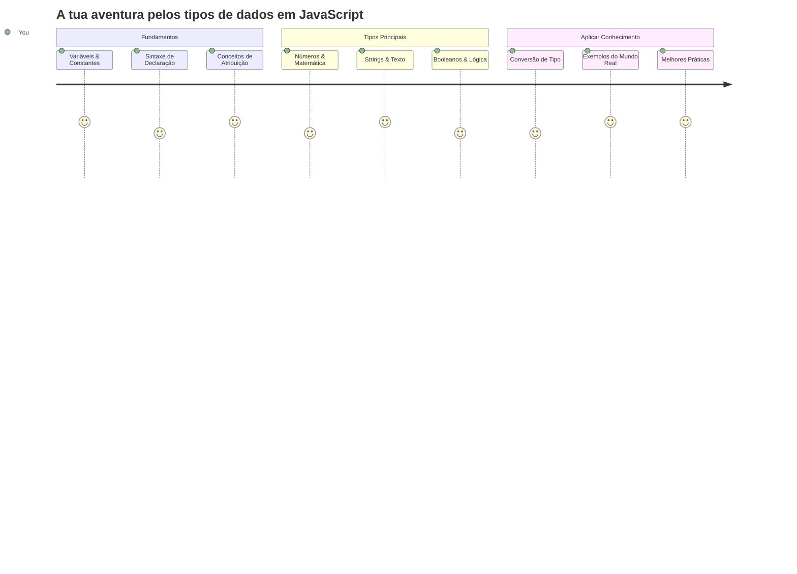
Os tipos de dados são um dos conceitos fundamentais em JavaScript que vais encontrar em todos os programas que escreves. Pensa nos tipos de dados como o sistema de arquivamento usado pelos antigos bibliotecários de Alexandria – eles tinham lugares específicos para rolos com poesia, matemática e registos históricos. O JavaScript organiza a informação de forma semelhante com diferentes categorias para diferentes tipos de dados.

Nesta lição, vamos explorar os tipos de dados principais que fazem o JavaScript funcionar. Vais aprender como lidar com números, texto, valores verdadeiros/falsos, e perceber por que escolher o tipo correto é essencial para os teus programas. Estes conceitos podem parecer abstratos no início, mas com prática, tornar-se-ão naturais.

Compreender os tipos de dados tornará tudo o resto em JavaScript muito mais claro. Tal como os arquitetos precisam de conhecer os diferentes materiais de construção antes de erguer uma catedral, estes fundamentos vão suportar tudo o que construa daqui para a frente.

## Quiz Pré-Aula
[Quiz pré-aula](https://ff-quizzes.netlify.app/web/)

Esta lição cobre os fundamentos do JavaScript, a linguagem que proporciona interatividade na web.

> Podes fazer esta lição em [Microsoft Learn](https://docs.microsoft.com/learn/modules/web-development-101-variables/?WT.mc_id=academic-77807-sagibbon)!

[](https://youtube.com/watch?v=JNIXfGiDWM8 "Variables in JavaScript")

[](https://youtube.com/watch?v=AWfA95eLdq8 "Data Types in JavaScript")

> 🎥 Clica nas imagens acima para vídeos sobre variáveis e tipos de dados

Vamos começar com as variáveis e os tipos de dados que nelas habitam!

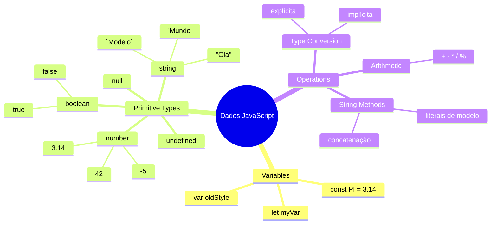
## Variáveis

As variáveis são blocos de construção fundamentais na programação. Tal como os frascos rotulados que os alquimistas medievais usavam para armazenar diferentes substâncias, as variáveis permitem-te guardar informação e dar-lhe um nome descritivo para poderes referenciá-la mais tarde. Precisas de lembrar a idade de alguém? Armazena-a numa variável chamada `age`. Queres acompanhar o nome de um utilizador? Guarda-o numa variável chamada `userName`.

Vamos focar-nos na abordagem moderna para criar variáveis em JavaScript. As técnicas que vais aprender aqui representam anos de evolução da linguagem e boas práticas desenvolvidas pela comunidade de programadores.

Criar e **declarar** uma variável tem a seguinte sintaxe **[keyword] [name]**. É composta pelas duas partes:

- **Palavra-chave**. Usa `let` para variáveis que podem mudar, ou `const` para valores que se mantêm iguais.
- **O nome da variável**, este é um nome descritivo que escolhes tu.

✅ A palavra-chave `let` foi introduzida no ES6 e dá à tua variável o chamado _block scope_. Recomenda-se usar `let` ou `const` em vez da palavra-chave mais antiga `var`. Vamos abordar block scopes com mais detalhe em partes futuras.

### Tarefa - trabalhar com variáveis

1. **Declara uma variável**. Vamos começar por criar a nossa primeira variável:

    ```javascript
    let myVariable;
    ```

   **O que isto concretiza:**
   - Isto diz ao JavaScript para criar uma localização de armazenamento chamada `myVariable`
   - O JavaScript aloca espaço na memória para esta variável
   - A variável atualmente não tem valor (undefined)

2. **Dá-lhe um valor**. Agora vamos colocar algo na nossa variável:

    ```javascript
    myVariable = 123;
    ```

   **Como a atribuição funciona:**
   - O operador `=` atribui o valor 123 à nossa variável
   - A variável agora contém este valor em vez de ser undefined
   - Podes referenciar este valor ao longo do teu código usando `myVariable`

   > Nota: o uso de `=` nesta lição significa que estamos a usar um "operador de atribuição", usado para definir um valor a uma variável. Não denota igualdade.

3. **Fazê-lo de forma inteligente**. Na verdade, vamos combinar esses dois passos:

    ```javascript
    let myVariable = 123;
    ```

    **Esta abordagem é mais eficiente:**
    - Estás a declarar a variável e a atribuir um valor numa só instrução
    - É a prática padrão entre os programadores
    - Isto reduz o comprimento do código, mantendo a clareza

4. **Mudar de ideia**. E se quisermos armazenar um número diferente?

   ```javascript
   myVariable = 321;
   ```

   **Compreendendo a reatribuição:**
   - A variável agora contém 321 em vez de 123
   - O valor anterior é substituído – as variáveis armazenam apenas um valor de cada vez
   - Esta mutabilidade é a característica chave das variáveis declaradas com `let`

   ✅ Experimenta! Podes escrever JavaScript diretamente no teu navegador. Abre uma janela do navegador e navega para as Ferramentas do Desenvolvedor. Na consola, vais encontrar um prompt; escreve `let myVariable = 123`, pressiona Enter, depois escreve `myVariable`. O que acontece? Vais aprender mais sobre estes conceitos nas lições seguintes.

### 🧠 **Verificação de Competência em Variáveis: Sentir-se à vontade**

**Vamos ver como te sentes em relação às variáveis:**
- Consegues explicar a diferença entre declarar e atribuir uma variável?
- O que acontece se tentares usar uma variável antes de a declarares?
- Quando escolherias `let` em vez de `const` para uma variável?

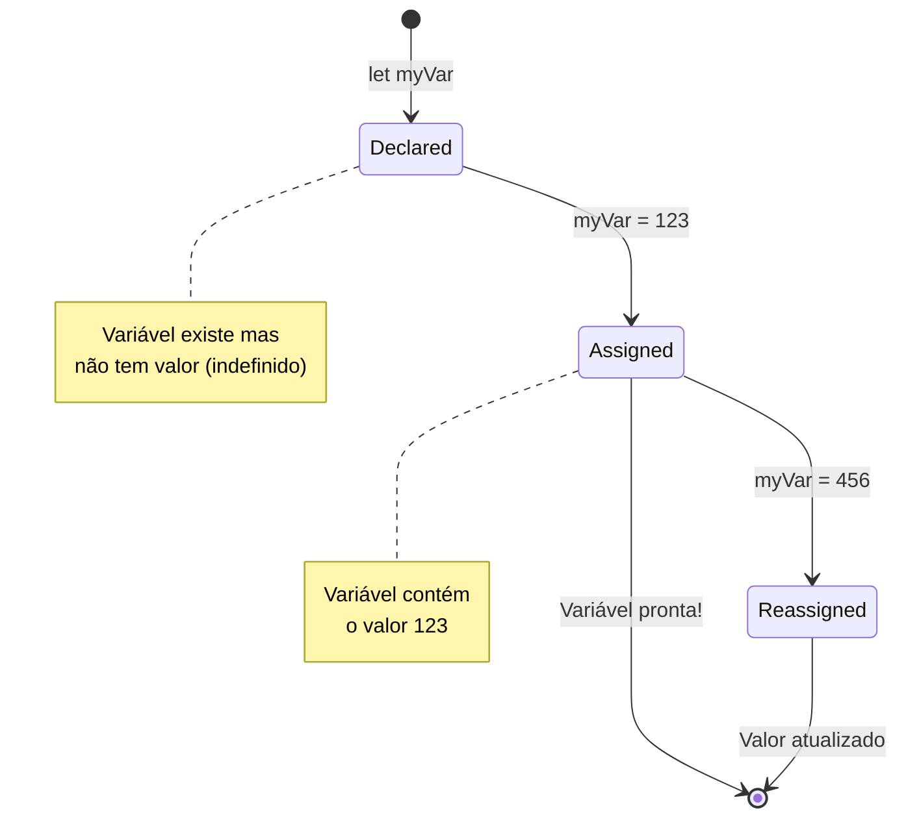
> **Dica rápida**: Pensa nas variáveis como caixas de armazenamento rotuladas. Tu crias a caixa (`let`), colocas algo dentro (`=`), e podes depois substituir o conteúdo se for preciso!

## Constantes

Por vezes precisas de armazenar informação que nunca deve mudar durante a execução do programa. Pensa nas constantes como os princípios matemáticos que Euclides estabeleceu na Grécia antiga – uma vez provados e documentados, permaneceram fixos para toda a referência futura.

As constantes funcionam de forma semelhante às variáveis, mas com uma restrição importante: uma vez que atribuis o seu valor, ele não pode ser alterado. Esta imutabilidade ajuda a evitar modificações acidentais a valores críticos no teu programa.

A declaração e inicialização de uma constante segue os mesmos conceitos que uma variável, com exceção da palavra-chave `const`. Normalmente, as constantes são declaradas com letras maiúsculas.

```javascript
const MY_VARIABLE = 123;
```

**Isto é o que este código faz:**
- **Cria** uma constante chamada `MY_VARIABLE` com o valor 123
- **Usa** a convenção de nomes em maiúsculas para constantes
- **Impede** quaisquer alterações futuras a este valor

As constantes têm duas regras principais:

- **Deves atribuir um valor imediatamente** – não são permitidas constantes vazias!
- **Nunca podes alterar esse valor** – o JavaScript dará erro se tentares. Vamos ver o que quero dizer:

   **Valor simples** - O seguinte NÃO é permitido:
   
      ```javascript
      const PI = 3;
      PI = 4; // não permitido
      ```

   **O que precisas de lembrar:**
   - **Tentativas** de reatribuição a uma constante causam erro
   - **Protege** valores importantes contra alterações acidentais
   - **Garante** que o valor permanece consistente durante o teu programa
 
   **A referência a objeto está protegida** - O seguinte NÃO é permitido:
   
      ```javascript
      const obj = { a: 3 };
      obj = { b: 5 } // não permitido
      ```

   **Compreendendo estes conceitos:**
   - **Impede** substituir o objeto inteiro por outro novo
   - **Protege** a referência ao objeto original
   - **Mantém** a identidade do objeto na memória

    **O valor do objeto não está protegido** - O seguinte É permitido:
    
      ```javascript
      const obj = { a: 3 };
      obj.a = 5;  // permitido
      ```

      **Analisando o que acontece aqui:**
      - **Modifica** o valor da propriedade dentro do objeto
      - **Mantém** a mesma referência ao objeto
      - **Demonstra** que o conteúdo do objeto pode mudar enquanto a referência se mantém constante

   > Nota, um `const` significa que a referência está protegida contra reatribuição. O valor não é _imutável_ e pode mudar, especialmente se for uma estrutura complexa como um objeto.

## Tipos de Dados

O JavaScript organiza a informação em diferentes categorias chamadas tipos de dados. Este conceito espelha como os antigos estudiosos categorizaram o conhecimento – Aristóteles distinguiu entre diferentes tipos de raciocínio, sabendo que os princípios lógicos não podiam ser aplicados uniformemente à poesia, matemática e filosofia natural.

Os tipos de dados são importantes porque diferentes operações funcionam com diferentes tipos de informação. Tal como não podes fazer aritmética com o nome de uma pessoa ou alfabetizar uma equação matemática, o JavaScript precisa do tipo de dado apropriado para cada operação. Compreender isto evita erros e torna o teu código mais fiável.

As variáveis podem armazenar muitos tipos diferentes de valores, como números e texto. Estes vários tipos de valores são conhecidos como o **tipo de dado**. Os tipos de dados são uma parte importante do desenvolvimento de software porque ajudam os programadores a tomar decisões sobre como o código deve ser escrito e como o software deve funcionar. Além disso, alguns tipos de dados têm funcionalidades únicas que ajudam a transformar ou extrair informação adicional de um valor.

✅ Os Tipos de Dados também são chamados primitivas de dados do JavaScript, pois são os tipos de dados de nível mais baixo providenciados pela linguagem. Existem 7 tipos de dados primitivos: string, number, bigint, boolean, undefined, null e symbol. Tira um momento para visualizar o que cada uma dessas primitivas pode representar. O que é uma `zebra`? E `0`? `true`?

### Números

Os números são o tipo de dado mais direto em JavaScript. Quer estejas a trabalhar com números inteiros como 42, decimais como 3.14, ou números negativos como -5, o JavaScript lida com eles de forma uniforme.

Lembras-te da nossa variável de antes? Aquele 123 que armazenámos era na verdade um tipo de dado número:

```javascript
let myVariable = 123;
```

**Características chave:**
- O JavaScript reconhece automaticamente valores numéricos
- Podes realizar operações matemáticas com estas variáveis
- Não é necessária declaração explícita do tipo

As variáveis podem armazenar todos os tipos de números, incluindo decimais ou números negativos. Os números também podem ser usados com operadores aritméticos, abordados na [próxima secção](../../../../2-js-basics/1-data-types).

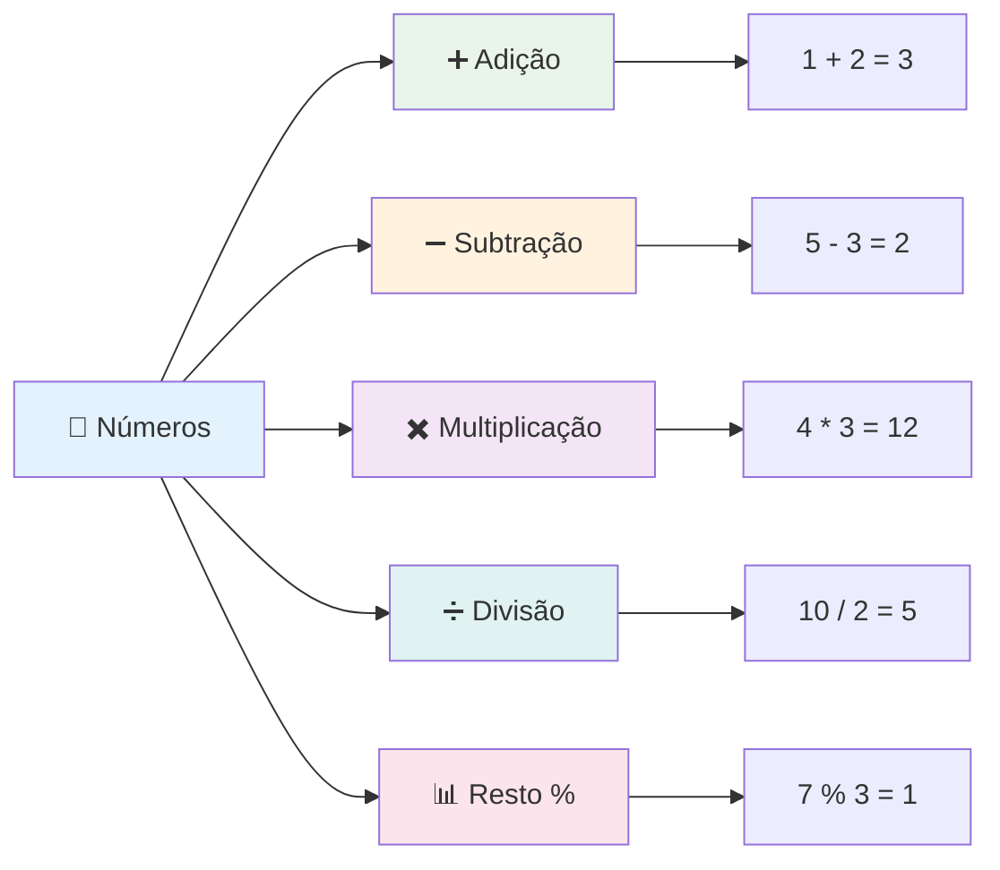
### Operadores Aritméticos

Os operadores aritméticos permitem realizar cálculos matemáticos em JavaScript. Estes operadores seguem os mesmos princípios que os matemáticos usaram durante séculos – os mesmos símbolos que apareceram nos trabalhos de estudiosos como Al-Khwarizmi, que desenvolveu a notação algébrica.

Os operadores funcionam como se esperaria da matemática tradicional: mais para adição, menos para subtração, e assim por diante.

Existem vários tipos de operadores para usar em funções aritméticas, e alguns estão listados aqui:

| Símbolo | Descrição                                                               | Exemplo                              |
| ------- | ----------------------------------------------------------------------- | ------------------------------------ |
| `+`     | **Adição**: Calcula a soma de dois números                              | `1 + 2 // resposta esperada é 3`    |
| `-`     | **Subtração**: Calcula a diferença entre dois números                   | `1 - 2 // resposta esperada é -1`   |
| `*`     | **Multiplicação**: Calcula o produto de dois números                    | `1 * 2 // resposta esperada é 2`    |
| `/`     | **Divisão**: Calcula o quociente de dois números                        | `1 / 2 // resposta esperada é 0.5`  |
| `%`     | **Resto**: Calcula o resto da divisão entre dois números               | `1 % 2 // resposta esperada é 1`    |

✅ Experimenta! Tenta uma operação aritmética na consola do teu navegador. Os resultados surpreendem-te?

### 🧮 **Verificação de Habilidades Matemáticas: Calcular com Confiança**

**Testa o teu entendimento de aritmética:**
- Qual a diferença entre `/` (divisão) e `%` (resto)?
- Consegues prever o que é que `10 % 3` equivale? (Dica: não é 3.33...)
- Porque poderia o operador resto ser útil na programação?

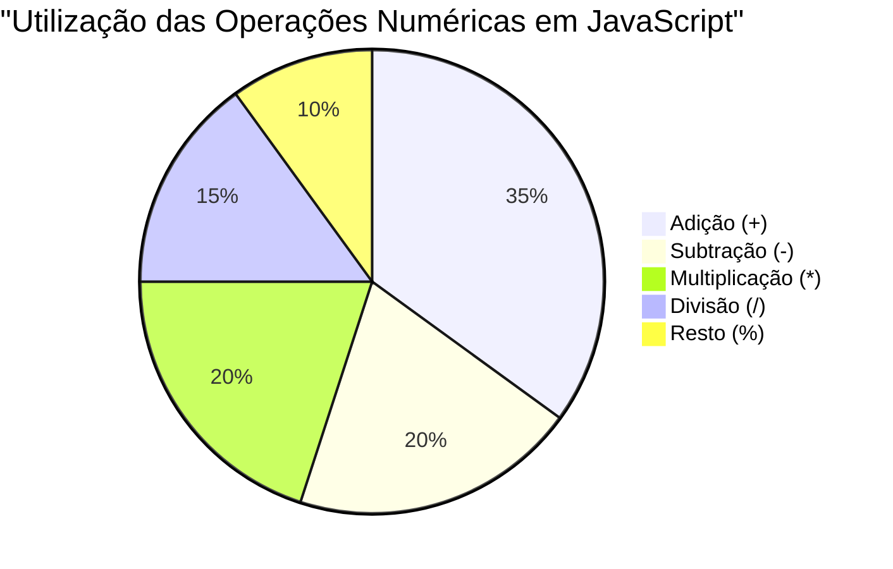
> **Perspetiva do mundo real**: O operador resto (%) é muito útil para verificar se números são pares/ímpares, criar padrões ou percorrer arrays ciclicamente!

### Strings

Em JavaScript, os dados textuais são representados como strings. O termo "string" vem do conceito de caracteres ligados em sequência, tal como os escribas em mosteiros medievais ligavam letras para formar palavras e frases nos seus manuscritos.

As strings são fundamentais para o desenvolvimento web. Cada pedaço de texto exibido num website – nomes de utilizadores, rótulos de botões, mensagens de erro, conteúdos – é tratado como dados string. Compreender strings é essencial para criar interfaces de utilizador funcionais.

As strings são conjuntos de caracteres que residem entre aspas simples ou duplas.

```javascript
'This is a string'
"This is also a string"
let myString = 'This is a string value stored in a variable';
```

**Compreendendo estes conceitos:**
- **Usa** aspas simples `'` ou aspas duplas `"` para definir strings
- **Armazena** dados textuais que podem incluir letras, números e símbolos
- **Atribui** valores string a variáveis para uso posterior
- **Exige** aspas para distinguir texto de nomes de variáveis

Lembra-te de usar aspas quando escreves uma string, caso contrário o JavaScript irá assumir que é o nome de uma variável.

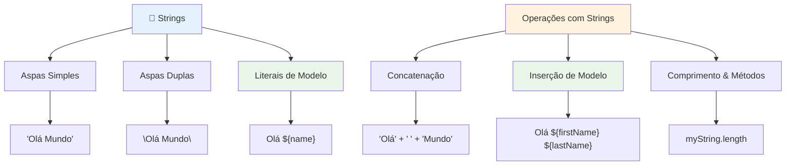
### Formatação de Strings

A manipulação de strings permite combinar elementos de texto, incorporar variáveis e criar conteúdo dinâmico que responde ao estado do programa. Esta técnica possibilita construir texto programaticamente.

Por vezes precisas de juntar várias strings – este processo chama-se concatenação.
Para **concatenar** duas ou mais strings, ou juntá-las, use o operador `+`.

```javascript
let myString1 = "Hello";
let myString2 = "World";

myString1 + myString2 + "!"; //Olá Mundo!
myString1 + " " + myString2 + "!"; //Olá Mundo!
myString1 + ", " + myString2 + "!"; //Olá, Mundo!
```

**Passo a passo, aqui está o que está a acontecer:**
- **Combina** múltiplas strings usando o operador `+`
- **Junta** strings diretamente sem espaços no primeiro exemplo
- **Adiciona** caracteres de espaço `" "` entre strings para melhor legibilidade
- **Insere** pontuação como vírgulas para criar uma formatação correta

✅ Porque é que `1 + 1 = 2` em JavaScript, mas `'1' + '1' = 11?` Pense nisso. E `'1' + 1`?

**Template literals** são outra forma de formatar strings, exceto que em vez de aspas, usa-se a crase. Tudo o que não for texto simples tem de ser colocado dentro de placeholders `${ }`. Isto inclui quaisquer variáveis que possam ser strings.

```javascript
let myString1 = "Hello";
let myString2 = "World";

`${myString1} ${myString2}!` //Olá Mundo!
`${myString1}, ${myString2}!` //Olá, Mundo!
```

**Vamos entender cada parte:**
- **Usa** crases `` ` `` em vez de aspas regulares para criar template literals
- **Embute** variáveis diretamente usando a sintaxe `${}` do placeholder
- **Preserva** espaços e formatação exatamente como estão escritos
- **Fornece** uma forma mais limpa de criar strings complexas com variáveis

Pode atingir os seus objetivos de formatação com qualquer um dos métodos, mas os template literals respeitam quaisquer espaços e quebras de linha.

✅ Quando usaria um template literal em vez de uma string simples?

### 🔤 **Verificação de Domínio de Strings: Confiança na Manipulação de Texto**

**Avalie as suas competências em strings:**
- Consegue explicar porque é que `'1' + '1'` é igual a `'11'` em vez de `2`?
- Qual método de string acha mais legível: concatenação ou template literals?
- O que acontece se esquecer as aspas em volta de uma string?

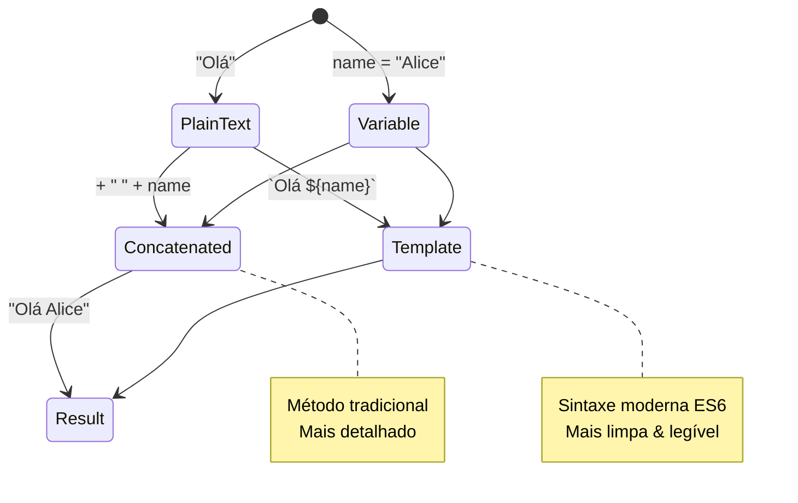
> **Dica profissional**: Template literals são geralmente preferidos para construir strings complexas porque são mais legíveis e lidam muito bem com strings multilinha!

### Booleanos

Booleanos representam a forma mais simples de dados: só podem conter um de dois valores – `true` ou `false`. Este sistema de lógica binária remonta ao trabalho de George Boole, um matemático do século XIX que desenvolveu a álgebra Booleana.

Apesar da sua simplicidade, os booleanos são essenciais para a lógica dos programas. Permitem que o seu código tome decisões baseadas em condições – se um utilizador está autenticado, se um botão foi clicado, ou se certos critérios são cumpridos.

Booleanos podem ter apenas dois valores: `true` ou `false`. Booleanos ajudam a decidir quais linhas de código devem ser executadas quando certas condições são verdadeiras. Em muitos casos, os [operadores](../../../../2-js-basics/1-data-types) ajudam a definir o valor de um Booleano e frequentemente vai notar e escrever variáveis a serem inicializadas ou os seus valores atualizados com um operador.

```javascript
let myTrueBool = true;
let myFalseBool = false;
```

**No exemplo acima, nós:**
- **Criámos** uma variável que armazena o valor Booleano `true`
- **Demonstraremos** como armazenar o valor Booleano `false`
- **Utilizámos** as palavras-chave exatas `true` e `false` (sem aspas)
- **Preparamos** estas variáveis para serem usadas em declarações condicionais

✅ Uma variável pode ser considerada 'truthy' se ela avalia para booleano `true`. Curiosamente, em JavaScript, [todos os valores são truthy a menos que sejam definidos como falsy](https://developer.mozilla.org/docs/Glossary/Truthy).

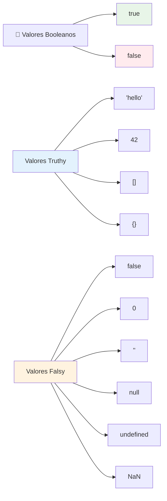
### 🎯 **Verificação de Lógica Booleana: Competências de Tomada de Decisão**

**Teste a sua compreensão dos booleanos:**
- Porque acha que JavaScript tem valores "truthy" e "falsy" para além de só `true` e `false`?
- Consegue prever qual destes é falsy: `0`, `"0"`, `[]`, `"false"`?
- Como poderão os booleanos ser úteis no controlo do fluxo do programa?

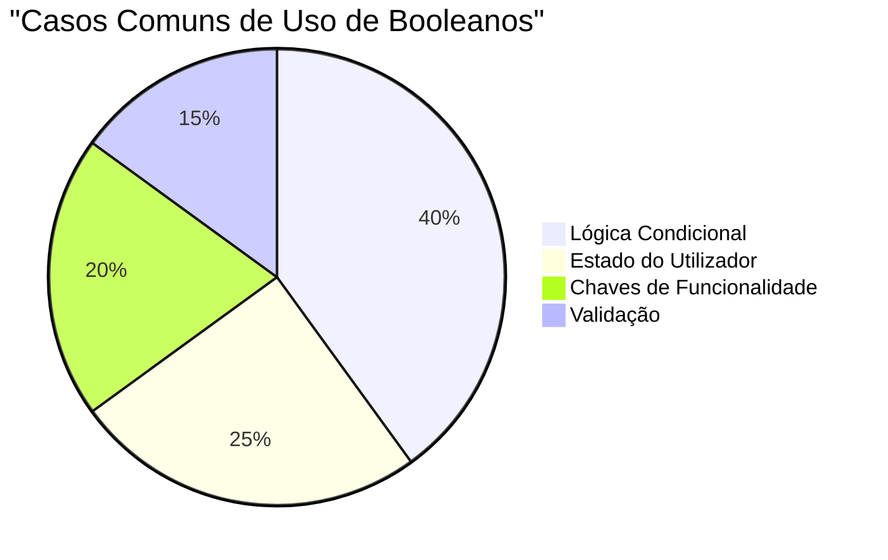
> **Lembre-se**: Em JavaScript, apenas 6 valores são falsy: `false`, `0`, `""`, `null`, `undefined` e `NaN`. Todos os outros são truthy!

---

## 📊 **Resumo da Sua Caixa de Ferramentas de Tipos de Dados**

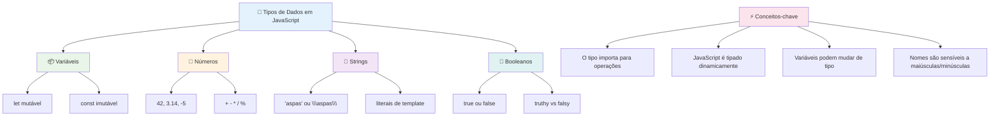
## Desafio do Agente GitHub Copilot 🚀

Use o modo Agente para completar o seguinte desafio:

**Descrição:** Crie um gestor de informação pessoal que demonstre todos os tipos de dados JavaScript que aprendeu nesta lição enquanto manipula cenários de dados do mundo real.

**Instrução:** Construa um programa JavaScript que crie um objeto perfil de utilizador contendo: nome da pessoa (string), idade (number), estado de estudante (boolean), cores favoritas como um array, e um objeto morada com propriedades rua, cidade e código postal. Inclua funções para mostrar a informação do perfil e atualizar campos individuais. Certifique-se de demonstrar concatenação de strings, template literals, operações aritméticas com a idade, e lógica booleana para o estado de estudante.

Saiba mais sobre o [modo agente](https://code.visualstudio.com/blogs/2025/02/24/introducing-copilot-agent-mode) aqui.

## 🚀 Desafio

JavaScript tem alguns comportamentos que podem surpreender os programadores. Aqui está um exemplo clássico para explorar: tente escrever isto na consola do seu navegador: `let age = 1; let Age = 2; age == Age` e observe o resultado. Retorna `false` – consegue determinar porquê?

Isto representa um dos muitos comportamentos de JavaScript que vale a pena conhecer. Familiaridade com estas particularidades vai ajudá-lo a escrever código mais fiável e a depurar problemas com mais eficácia.

## Questionário pós-aula
[Questionário pós-aula](https://ff-quizzes.netlify.app)

## Revisão e Autoestudo

Dê uma vista de olhos a [esta lista de exercícios JavaScript](https://css-tricks.com/snippets/javascript/) e experimente um. O que aprendeu?

## Tarefa

[Prática de Tipos de Dados](assignment.md)

## 🚀 A Sua Linha Temporal de Domínio dos Tipos de Dados JavaScript

### ⚡ **O Que Pode Fazer Nos Próximos 5 Minutos**
- [ ] Abra a consola do navegador e crie 3 variáveis com tipos de dados diferentes
- [ ] Experimente o desafio: `let age = 1; let Age = 2; age == Age` e descubra porque é que é falso
- [ ] Pratique concatenação de strings com o seu nome e número favorito
- [ ] Teste o que acontece quando adiciona um número a uma string

### 🎯 **O Que Pode Conquistar Nesta Hora**
- [ ] Complete o questionário pós-aula e reveja quaisquer conceitos confusos
- [ ] Crie uma mini calculadora que some, subtraia, multiplique e divida dois números
- [ ] Construa um formatador de nomes simples usando template literals
- [ ] Explore as diferenças entre os operadores de comparação `==` e `===`
- [ ] Pratique a conversão entre diferentes tipos de dados

### 📅 **A Sua Base de JavaScript Para a Semana**
- [ ] Complete a tarefa com confiança e criatividade
- [ ] Crie um objeto de perfil pessoal usando todos os tipos de dados aprendidos
- [ ] Pratique com [exercícios JavaScript da CSS-Tricks](https://css-tricks.com/snippets/javascript/)
- [ ] Construa um validador de formulários simples usando lógica booleana
- [ ] Experimente com arrays e tipos de dados de objeto (vista prévia das próximas lições)
- [ ] Junte-se a uma comunidade de JavaScript e faça perguntas sobre tipos de dados

### 🌟 **A Sua Transformação Durante o Mês**
- [ ] Integre o conhecimento de tipos de dados em projetos de programação maiores
- [ ] Compreenda quando e porquê usar cada tipo de dado em aplicações reais
- [ ] Ajude outros iniciantes a entender os fundamentos do JavaScript
- [ ] Construa uma pequena aplicação que gere diferentes tipos de dados de utilizador
- [ ] Explore conceitos avançados de tipos de dados como coerção de tipos e igualdade estrita
- [ ] Contribua para projetos JavaScript open source com melhorias na documentação

### 🧠 **Verificação Final de Domínio dos Tipos de Dados**

**Celebre a sua base em JavaScript:**
- Qual tipo de dado o surpreendeu mais em termos do seu comportamento?
- Quão confortável se sente ao explicar variáveis vs. constantes a um amigo?
- Qual a coisa mais interessante que descobriu sobre o sistema de tipos de JavaScript?
- Que aplicação do mundo real pode imaginar construir com estes fundamentos?

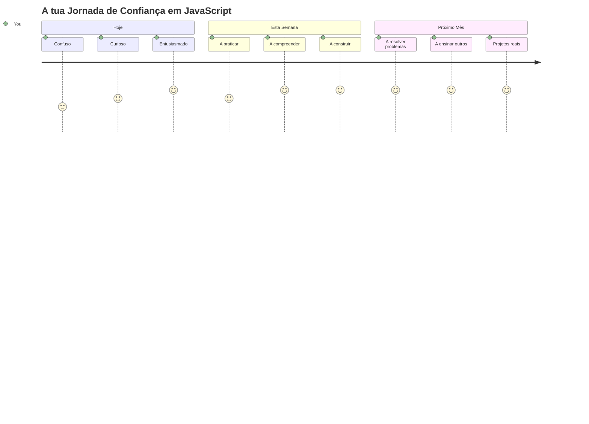
> 💡 **Construiu a base!** Compreender os tipos de dados é como aprender o alfabeto antes de escrever histórias. Todo programa em JavaScript que alguma vez escrever usará estes conceitos fundamentais. Agora tem os blocos de construção para criar websites interativos, aplicações dinâmicas e resolver problemas reais com código. Bem-vindo ao maravilhoso mundo do JavaScript! 🎉

---

<!-- CO-OP TRANSLATOR DISCLAIMER START -->
**Aviso Legal**:  
Este documento foi traduzido utilizando o serviço de tradução automática [Co-op Translator](https://github.com/Azure/co-op-translator). Embora nos esforcemos por garantir a precisão, por favor tenha em conta que traduções automáticas podem conter erros ou imprecisões. O documento original, no seu idioma nativo, deve ser considerado a fonte oficial. Para informações críticas, recomenda-se a tradução profissional realizada por humanos. Não nos responsabilizamos por quaisquer mal-entendidos ou interpretações incorretas decorrentes da utilização desta tradução.
<!-- CO-OP TRANSLATOR DISCLAIMER END -->