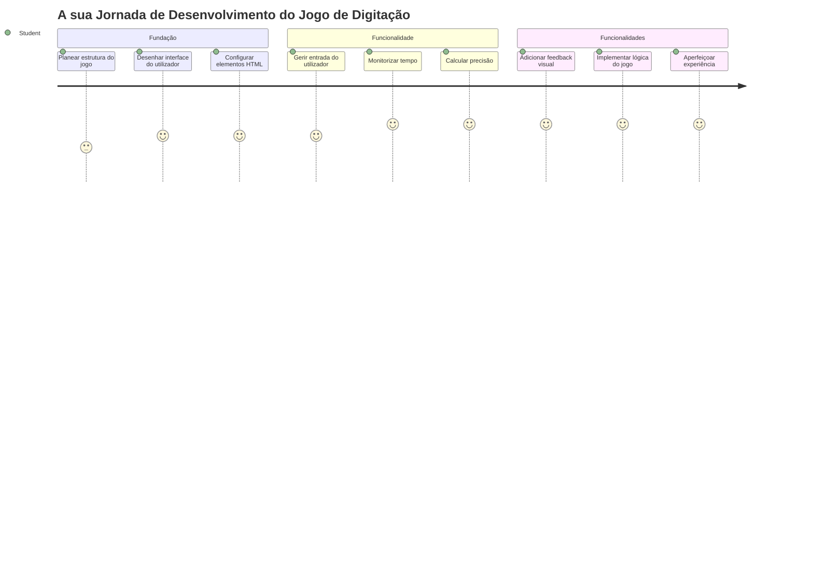
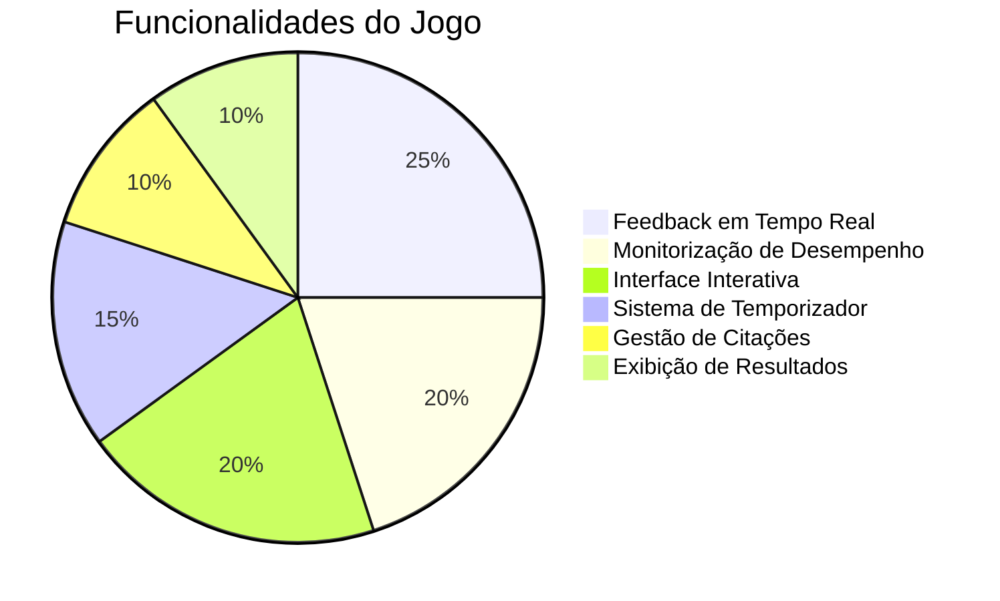
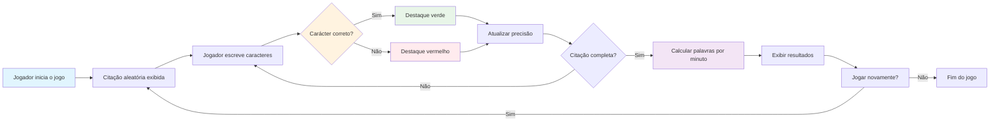
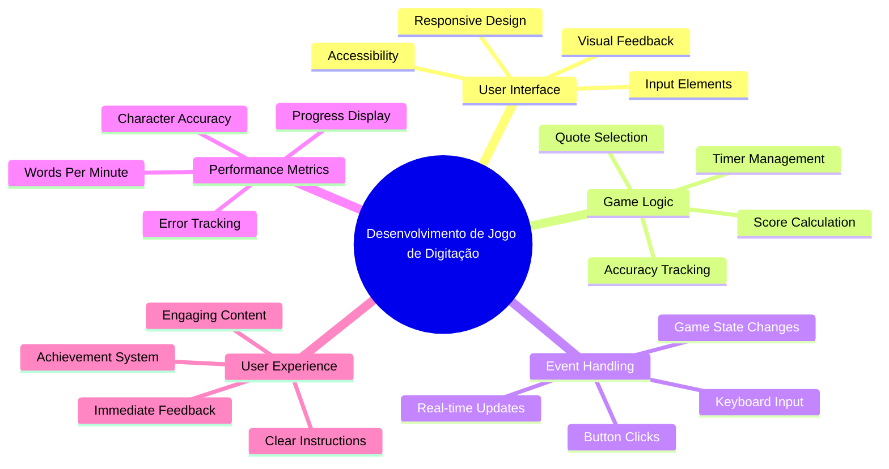
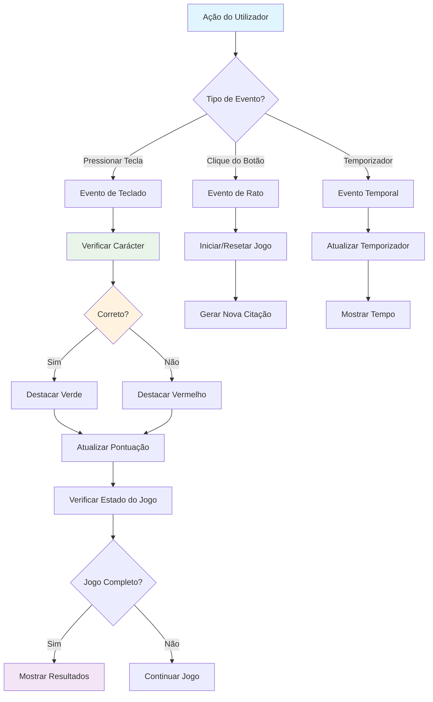
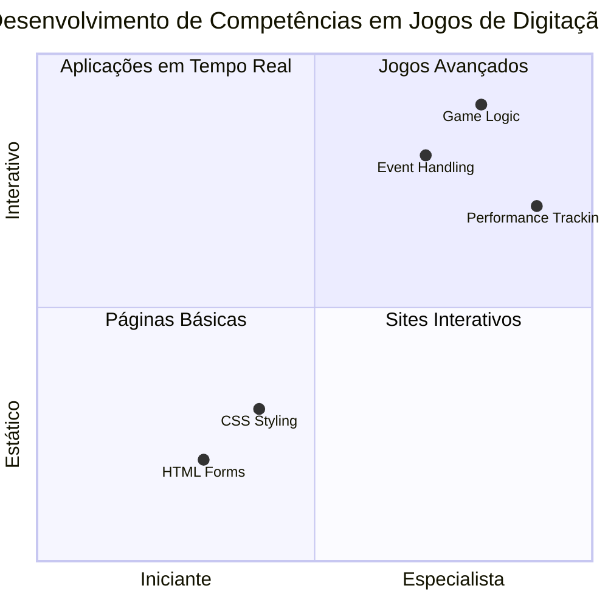
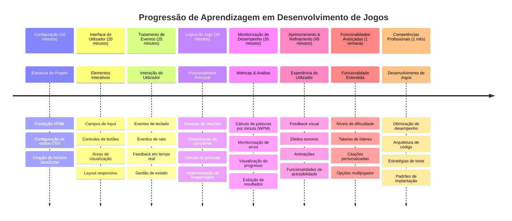

# Programação Orientada a Eventos - Construa um Jogo de Digitação

## Introdução

Aqui está algo que todo desenvolvedor sabe mas raramente fala: digitar rápido é um superpoder! 🚀 Pense nisso - quanto mais rápido conseguir colocar as suas ideias da cabeça para o editor de código, mais a sua criatividade pode fluir. É como ter uma ligação direta entre os seus pensamentos e o ecrã.

Quer saber uma das melhores formas de melhorar esta competência? Adivinhou - vamos criar um jogo!

> Vamos criar juntos um jogo de digitação incrível!

Pronto para colocar em prática todas as competências de JavaScript, HTML e CSS que tem vindo a aprender? Vamos construir um jogo de digitação que o desafiará com citações aleatórias do lendário detetive [Sherlock Holmes](https://en.wikipedia.org/wiki/Sherlock_Holmes). O jogo vai registar a velocidade e precisão da sua digitação - e acredite, é mais viciante do que pode imaginar!

## O Que Precisa de Saber

Antes de começarmos, certifique-se de que está confortável com estes conceitos (não se preocupe se precisa de um pequeno repescar - todos já passámos por isso!):

- Criar controlos de texto e botões
- CSS e definição de estilos usando classes  
- Noções básicas de JavaScript
  - Criar um array
  - Criar um número aleatório
  - Obter a hora atual

Se alguma destas áreas lhe parecer um pouco enferrujada, não há problema! Por vezes, a melhor forma de fixar o conhecimento é mergulhar num projeto e ir descobrindo pelo caminho.

### 🔄 **Verificação Pedagógica**
**Avaliação de Base**: Antes de começar o desenvolvimento, assegure-se de que compreende:
- ✅ Como funcionam os formulários HTML e os elementos de input
- ✅ Classes CSS e estilos dinâmicos
- ✅ Listeners e manipuladores de eventos em JavaScript
- ✅ Manipulação de arrays e seleção aleatória
- ✅ Medição e cálculo de tempo

**Autoavaliação Rápida**: Consegue explicar como estes conceitos funcionam em conjunto num jogo interativo?
- **Eventos** disparam quando os utilizadores interagem com os elementos
- **Manipuladores** processam esses eventos e atualizam o estado do jogo
- **CSS** fornece feedback visual às ações do utilizador
- **Temporização** permite medir performance e progresso no jogo

## Vamos Construir Isto!

[Criar um jogo de digitação usando programação orientada a eventos](./typing-game/README.md)

### ⚡ **O Que Pode Experimentar Nos Próximos 5 Minutos**
- [ ] Abra a consola do navegador e experimente ouvir eventos de teclado com `addEventListener`
- [ ] Crie uma página HTML simples com um campo de input e teste a deteção da digitação
- [ ] Pratique manipulação de strings comparando texto digitado com texto alvo
- [ ] Experimente `setTimeout` para compreender funções de temporização

### 🎯 **O Que Pode Concluir Nesta Hora**
- [ ] Complete o quiz pós-aula e compreenda programação orientada a eventos
- [ ] Construa uma versão básica do jogo de digitação com validação das palavras
- [ ] Adicione feedback visual para digitação correta e incorreta
- [ ] Implemente um sistema simples de pontuação baseado na velocidade e precisão
- [ ] Estilize o seu jogo com CSS para torná-lo visualmente apelativo

### 📅 **O Seu Desenvolvimento de Jogo ao Longo da Semana**
- [ ] Complete o jogo de digitação com todas as funcionalidades e polimento
- [ ] Acrescente níveis de dificuldade com complexidade variável das palavras
- [ ] Implemente acompanhamento de estatísticas do utilizador (PMW, precisão ao longo do tempo)
- [ ] Crie efeitos sonoros e animações para melhorar a experiência do utilizador
- [ ] Torne o seu jogo responsivo para dispositivos móveis e táteis
- [ ] Partilhe o seu jogo online e recolha feedback dos utilizadores

### 🌟 **O Seu Desenvolvimento Interativo Ao Longo do Mês**
- [ ] Construa múltiplos jogos explorando diferentes padrões de interação
- [ ] Aprenda sobre ciclos de jogo, gestão de estado e otimização de performance
- [ ] Contribua para projetos open source de desenvolvimento de jogos
- [ ] Domine conceitos avançados de temporização e animações fluidas
- [ ] Crie um portefólio que mostre várias aplicações interativas
- [ ] Mentore outros interessados em desenvolvimento de jogos e interação com utilizadores

## 🎯 O Seu Cronograma de Domínio do Jogo de Digitação

### 🛠️ Resumo da Sua Caixa de Ferramentas de Desenvolvimento de Jogos

Depois de completar este projeto, terá dominado:
- **Programação Orientada a Eventos**: Interfaces de utilizador responsivas que reagem à entrada
- **Feedback em Tempo Real**: Atualizações instantâneas visuais e de performance
- **Medida de Performance**: Sistemas precisos de medição e pontuação temporais
- **Gestão do Estado do Jogo**: Controlar o fluxo da aplicação e a experiência do utilizador
- **Design Interativo**: Criar experiências cativantes e viciantes
- **APIs Modernas da Web**: Utilizar capacidades do navegador para interações ricas
- **Padrões de Acessibilidade**: Design inclusivo para todos os utilizadores

**Aplicações no Mundo Real**: Estas competências aplicam-se diretamente a:
- **Aplicações Web**: Qualquer interface interativa ou dashboard
- **Software Educativo**: Plataformas de aprendizagem e ferramentas de avaliação de competências
- **Ferramentas de Produtividade**: Editores de texto, IDEs e software colaborativo
- **Indústria dos Jogos**: Jogos no browser e entretenimento interativo
- **Desenvolvimento Móvel**: Interfaces táteis e manipulação de gestos

**Próximo Nível**: Está pronto para explorar frameworks de jogos avançados, sistemas multiplayer em tempo real ou aplicações interativas complexas!

## Créditos

Escrito com ♥️ por [Christopher Harrison](http://www.twitter.com/geektrainer)

---

<!-- CO-OP TRANSLATOR DISCLAIMER START -->
**Aviso Legal**:
Este documento foi traduzido utilizando o serviço de tradução automática [Co-op Translator](https://github.com/Azure/co-op-translator). Embora nos empenhemos em garantir a precisão, por favor tenha em atenção que traduções automáticas podem conter erros ou imprecisões. O documento original no seu idioma nativo deve ser considerado a fonte autoritativa. Para informações críticas, recomenda-se a tradução profissional humana. Não nos responsabilizamos por quaisquer mal-entendidos ou interpretações incorretas decorrentes da utilização desta tradução.
<!-- CO-OP TRANSLATOR DISCLAIMER END -->