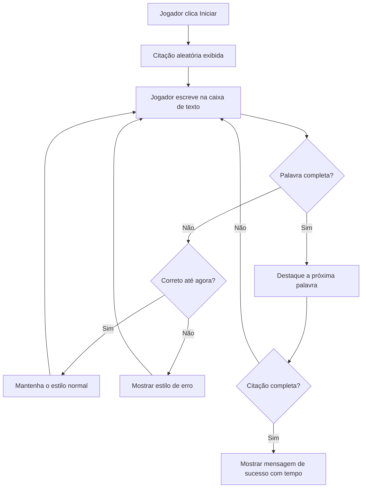
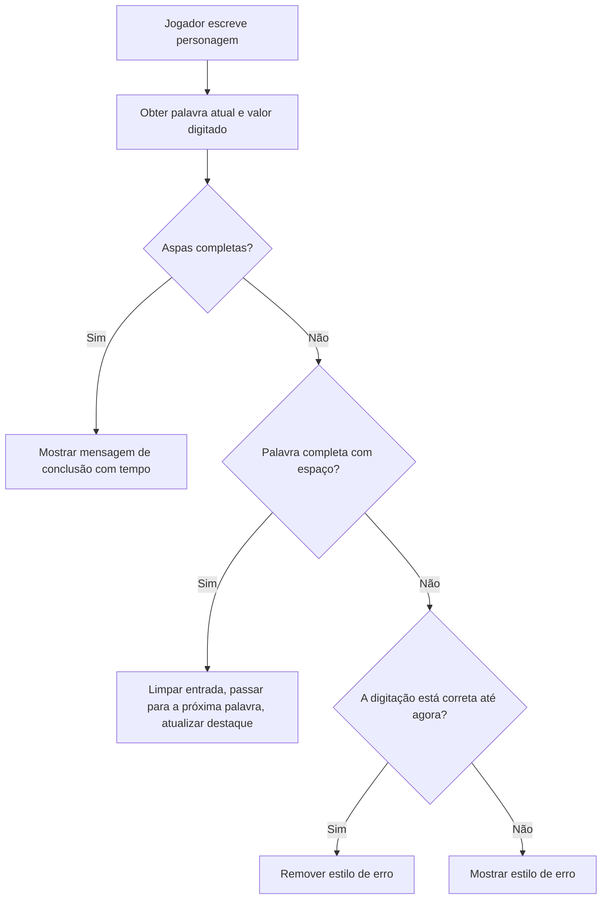
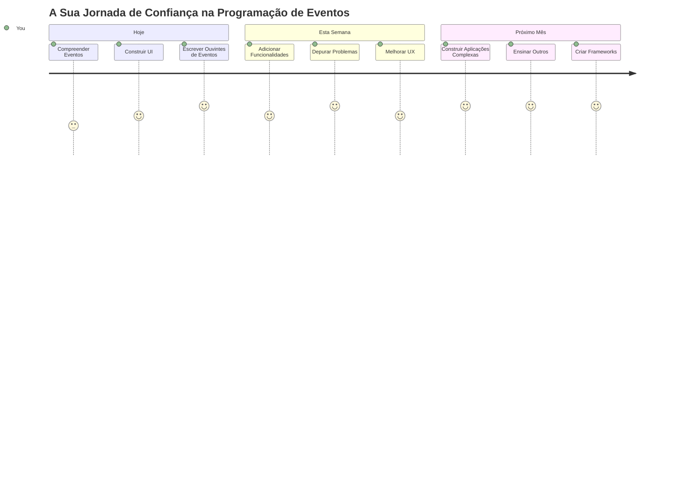

# Criar um jogo usando eventos

Alguma vez se perguntou como é que os websites sabem quando clica num botão ou escreve numa caixa de texto? Essa é a magia da programação orientada a eventos! Que melhor forma de aprender esta habilidade essencial do que construindo algo útil - um jogo de velocidade de digitação que reage a cada tecla que pressiona.

Vai ver em primeira mão como os navegadores "falam" com o seu código JavaScript. Sempre que clica, escreve ou move o rato, o navegador envia pequenas mensagens (chamamos-lhes eventos) para o seu código, e você decide como responder!

Quando terminarmos esta secção, terá criado um verdadeiro jogo de digitação que acompanha a sua velocidade e precisão. Mais importante, compreenderá os conceitos fundamentais que impulsionam todos os websites interativos que alguma vez usou. Vamos começar!

## Questionário pré-aula

[Questionário pré-aula](https://ff-quizzes.netlify.app/web/quiz/21)

## Programação orientada a eventos

Pense na sua aplicação ou website favorito - o que o torna vivo e responsivo? Tudo depende de como reage ao que faz! Cada toque, clique, deslize ou pressionar de tecla cria aquilo a que chamamos um "evento", e é aí que a verdadeira magia do desenvolvimento web acontece.

Isto é o que torna a programação para a web tão interessante: nunca sabemos quando alguém vai clicar naquele botão ou começar a escrever numa caixa de texto. Podem clicar de imediato, esperar cinco minutos, ou até nunca clicar! Esta imprevisibilidade obriga-nos a pensar diferentemente sobre como escrevemos o nosso código.

Em vez de escrever código que corre do topo até ao fundo, como numa receita, escrevemos código que espera pacientemente que algo aconteça. É semelhante a como os operadores de telégrafo nos anos 1800 sentavam-se perto das suas máquinas, prontos para responder no momento em que uma mensagem passasse pelo fio.

Então, o que é exatamente um "evento"? Simplificando, é algo que acontece! Quando clica num botão - isso é um evento. Quando escreve uma letra - isso é um evento. Quando move o rato - é outro evento.

A programação orientada a eventos permite-nos preparar o nosso código para ouvir e responder. Criamos funções especiais chamadas **event listeners** que esperam pacientemente por coisas específicas acontecerem, para depois entrarem em ação.

Pense nos event listeners como se fossem uma campainha para o seu código. Configura a campainha (`addEventListener()`), diz-lhe que som deve ouvir (como um 'click' ou 'keypress'), e especifica o que deve acontecer quando alguém toca (a sua função personalizada).

**Eis como funcionam os event listeners:**
- **Ouvir** ações específicas do utilizador, como cliques, pressionar de teclas ou movimentos do rato
- **Executar** o seu código personalizado quando o evento especificado ocorrer
- **Responder** imediatamente a interações do utilizador, criando uma experiência fluida
- **Gerir** múltiplos eventos no mesmo elemento usando diferentes listeners

> **NOTA:** Vale a pena destacar que existem inúmeras formas de criar event listeners. Pode usar funções anónimas, ou criar funções nomeadas. Pode usar vários atalhos, como definir a propriedade `click`, ou usar `addEventListener()`. No nosso exercício vamos focar-nos em `addEventListener()` e funções anónimas, pois é provavelmente a técnica mais comum entre programadores web. Também é a mais flexível, uma vez que `addEventListener()` funciona para todos os eventos, e o nome do evento pode ser passado como parâmetro.

### Eventos comuns

Embora os navegadores ofereçam dezenas de eventos diferentes que pode ouvir, a maioria das aplicações interativas depende apenas de um pequeno conjunto essencial de eventos. Compreender estes eventos fundamentais dará a base para construir interações sofisticadas com o utilizador.

Existem [dezenas de eventos](https://developer.mozilla.org/docs/Web/Events) disponíveis para ouvir quando cria uma aplicação. Basicamente, tudo o que um utilizador faz numa página gera um evento, o que lhe dá muito poder para garantir que recebem a experiência que deseja. Felizmente, normalmente só precisa de um pequeno conjunto de eventos. Eis alguns comuns (incluindo os dois que usaremos ao criar o nosso jogo):

| Evento | Descrição | Casos de Uso Comuns |
|--------|------------|---------------------|
| `click` | O utilizador clicou em algo | Botões, links, elementos interativos |
| `contextmenu` | O utilizador clicou com o botão direito do rato | Menus de contexto personalizados |
| `select` | O utilizador selecionou texto | Edição de texto, operações de copiar |
| `input` | O utilizador introduziu texto | Validação de formulários, pesquisa em tempo real |

**Compreender estes tipos de eventos:**
- **Disparam** quando os utilizadores interagem com elementos específicos na sua página
- **Fornecem** informação detalhada sobre a ação do utilizador através de objetos evento
- **Permitem** criar aplicações web responsivas e interativas
- **Funcionam** de forma consistente em diferentes navegadores e dispositivos

## Criar o jogo

Agora que entende como os eventos funcionam, vamos colocar esse conhecimento em prática construindo algo útil. Vamos criar um jogo de velocidade de digitação que demonstra o tratamento de eventos enquanto ajuda a desenvolver uma habilidade importante como programador.

Vamos criar um jogo para explorar como os eventos funcionam em JavaScript. O nosso jogo vai testar a habilidade de digitação do jogador, que é uma das competências mais subestimadas e que todos os programadores deveriam ter. Curiosidade: o layout do teclado QWERTY que usamos hoje foi realmente desenhado na década de 1870 para máquinas de escrever - e boas habilidades de digitação continuam a ser tão valiosas para programadores hoje em dia! O fluxo geral do jogo será assim:


**Assim funciona o nosso jogo:**
- **Começa** quando o jogador clica no botão de início e apresenta uma citação aleatória
- **Acompanha** o progresso do jogador palavra a palavra em tempo real
- **Realça** a palavra atual para guiar o foco do jogador
- **Fornece** feedback visual imediato para erros de digitação
- **Calcula** e mostra o tempo total quando a citação está completa

Vamos construir o nosso jogo e aprender sobre eventos!

### Estrutura de ficheiros

Antes de começar a programar, vamos organizar-nos! Ter uma estrutura de ficheiros limpa desde o início vai poupar-lhe dores de cabeça mais tarde e tornar o seu projeto mais profissional. 😊

Vamos simplificar e usar apenas três ficheiros: `index.html` para a estrutura da página, `script.js` para toda a lógica do jogo, e `style.css` para deixar tudo com um aspeto ótimo. Este é o trio clássico que alimenta a maior parte da web!

**Crie uma nova pasta para o seu trabalho abrindo uma consola ou terminal e execute o seguinte comando:**

```bash
# Linux ou macOS
mkdir typing-game && cd typing-game

# Windows
md typing-game && cd typing-game
```

**Isto é o que estes comandos fazem:**
- **Cria** um novo diretório chamado `typing-game` para os ficheiros do projeto
- **Navega** automaticamente para dentro do diretório criado
- **Configura** um espaço de trabalho limpo para o seu desenvolvimento de jogo

**Abra o Visual Studio Code:**

```bash
code .
```

**Este comando:**
- **Lança** o Visual Studio Code no diretório atual
- **Abre** a sua pasta de projeto no editor
- **Fornece** acesso a todas as ferramentas de desenvolvimento necessárias

**Adicione três ficheiros à pasta no Visual Studio Code com os seguintes nomes:**
- `index.html` - Contém a estrutura e conteúdo do seu jogo
- `script.js` - Gerir toda a lógica do jogo e os event listeners
- `style.css` - Define o aspeto visual e o estilo

## Criar a interface do utilizador

Agora vamos construir o palco onde toda a ação do nosso jogo vai acontecer! Pense nisto como desenhar o painel de controlo de uma nave espacial - precisamos garantir que tudo o que os jogadores precisam está exatamente onde esperam.

Vamos perceber o que o nosso jogo realmente necessita. Se estivesse a jogar um jogo de digitação, o que gostaria de ver no ecrã? Eis o que vamos precisar:

| Elemento UI | Propósito | Elemento HTML |
|-------------|-----------|--------------|
| Exibição da citação | Mostra o texto a digitar | `<p>` com `id="quote"` |
| Área de mensagem | Exibe mensagens de estado e sucesso | `<p>` com `id="message"` |
| Caixa de texto | Onde os jogadores escrevem a citação | `<input>` com `id="typed-value"` |
| Botão de início | Começa o jogo | `<button>` com `id="start"` |

**Perceber a estrutura UI:**
- **Organiza** o conteúdo logicamente de cima para baixo
- **Atribui** IDs únicas aos elementos para manipulação em JavaScript
- **Fornece** uma hierarquia visual clara para melhor experiência de utilizador
- **Inclui** elementos HTML semânticos para acessibilidade

Cada um destes vai precisar de IDs para podermos trabalhar com eles no nosso JavaScript. Também vamos adicionar referências aos ficheiros CSS e JavaScript que vamos criar.

Crie um novo ficheiro chamado `index.html`. Adicione o seguinte HTML:

```html
<!-- inside index.html -->
<html>
<head>
  <title>Typing game</title>
  <link rel="stylesheet" href="style.css">
</head>
<body>
  <h1>Typing game!</h1>
  <p>Practice your typing skills with a quote from Sherlock Holmes. Click **start** to begin!</p>
  <p id="quote"></p> <!-- This will display our quote -->
  <p id="message"></p> <!-- This will display any status messages -->
  <div>
    <input type="text" aria-label="current word" id="typed-value" /> <!-- The textbox for typing -->
    <button type="button" id="start">Start</button> <!-- To start the game -->
  </div>
  <script src="script.js"></script>
</body>
</html>
```

**Análise do que esta estrutura HTML alcança:**
- **Encaixa** a folha de estilos CSS no `<head>` para a estilização
- **Cria** um título claro e instruções para os utilizadores
- **Estabelece** parágrafos placeholder com IDs específicas para conteúdo dinâmico
- **Inclui** um campo de input com atributos de acessibilidade
- **Fornece** um botão de início para ativar o jogo
- **Carrega** o ficheiro JavaScript no final para melhor desempenho

### Iniciar a aplicação

Testar a sua aplicação frequentemente durante o desenvolvimento ajuda a detectar problemas cedo e a ver o progresso em tempo real. O Live Server é uma ferramenta imprescindível que atualiza automaticamente o seu navegador sempre que guardar alterações, tornando o desenvolvimento muito mais eficiente.

É sempre melhor desenvolver iterativamente para ver como as coisas ficam. Vamos iniciar a nossa aplicação. Existe uma extensão maravilhosa para Visual Studio Code chamada [Live Server](https://marketplace.visualstudio.com/items?itemName=ritwickdey.LiveServer&WT.mc_id=academic-77807-sagibbon) que hospeda localmente a sua aplicação e atualiza o navegador sempre que guarda.

**Instale o [Live Server](https://marketplace.visualstudio.com/items?itemName=ritwickdey.LiveServer&WT.mc_id=academic-77807-sagibbon) seguindo o link e clicando em Instalar:**

**Isto acontece durante a instalação:**
- **Solicita** ao seu navegador que abra o Visual Studio Code
- **Guia** através do processo de instalação da extensão
- **Pode requerer** reiniciar o Visual Studio Code para concluir a configuração

**Depois de instalado, no Visual Studio Code, clique em Ctrl-Shift-P (ou Cmd-Shift-P) para abrir a paleta de comandos:**

**Perceber a paleta de comandos:**
- **Fornece** acesso rápido a todos os comandos do VS Code
- **Pesquisa** comandos enquanto escreve
- **Oferece** atalhos de teclado para desenvolvimento mais rápido

**Escreva "Live Server: Open with Live Server":**

**O que o Live Server faz:**
- **Inicia** um servidor local de desenvolvimento para o seu projeto
- **Atualiza automaticamente** o navegador quando guarda ficheiros
- **Serve** os seus ficheiros de uma URL local (tipicamente `localhost:5500`)

**Abra um navegador e navegue para `https://localhost:5500`:**

Agora deverá ver a página que criou! Vamos adicionar alguma funcionalidade.

## Adicionar o CSS

Agora vamos deixar as coisas bonitas! O feedback visual é crucial para interfaces de utilizador desde os primórdios da computação. Nos anos 80, investigadores descobriram que o feedback visual imediato melhora drasticamente a performance do utilizador e reduz erros. É exatamente isso que vamos criar.

O nosso jogo precisa de ser claríssimo quanto ao que está a acontecer. Os jogadores devem saber imediatamente qual a palavra que devem digitar, e se cometerem um erro, devem ver isso logo. Vamos criar um estilo simples mas eficaz:

Crie um novo ficheiro chamado `style.css` e adicione a seguinte sintaxe.

```css
/* inside style.css */
.highlight {
  background-color: yellow;
}

.error {
  background-color: lightcoral;
  border: red;
}
```

**Compreender estas classes CSS:**
- **Realça** a palavra atual com um fundo amarelo para orientação visual clara
- **Sinaliza** erros de digitação com uma cor de fundo coral claro
- **Fornece** feedback imediato sem interromper o fluxo de digitação do utilizador
- **Usa** cores contrastantes para acessibilidade e comunicação visual clara

✅ Em relação ao CSS pode organizar a sua página como preferir. Dedique algum tempo para deixar a página mais apelativa:

- Escolha uma fonte diferente
- Aplique cor aos títulos
- Redimensione elementos

## JavaScript

Aqui é onde as coisas ficam interessantes! 🎉 Temos a nossa estrutura HTML e o nosso estilo CSS, mas neste momento o nosso jogo é como um carro lindo sem motor. O JavaScript vai ser esse motor - é o que faz tudo realmente funcionar e responder ao que os jogadores fazem.

É aqui que vai ver a sua criação ganhar vida. Vamos abordar isto passo a passo para que nada fique esmagador:

| Passo | Propósito | O que irá aprender |
|-------|------------|--------------------|
| [Criar as constantes](../../../../4-typing-game/typing-game) | Configurar citações e referências DOM | Gestão de variáveis e seleção DOM |
| [Event listener para iniciar o jogo](../../../../4-typing-game/typing-game) | Tratar a inicialização do jogo | Manipulação de eventos e atualização UI |
| [Event listener para a digitação](../../../../4-typing-game/typing-game) | Processar a entrada do utilizador em tempo real | Validação de input e feedback dinâmico |

**Esta abordagem estruturada ajuda a:**
- **Organizar** o seu código em secções lógicas e geríveis
- **Construir** a funcionalidade incrementalmente para facilitar a depuração
- **Compreender** como diferentes partes da aplicação funcionam em conjunto
- **Criar** padrões reutilizáveis para projetos futuros

Mas primeiro, crie um novo ficheiro chamado `script.js`.

### Adicionar as constantes

Antes de mergulharmos na ação, vamos reunir todos os nossos recursos! Tal como o centro de controlo da missão da NASA configura todos os seus sistemas de monitorização antes do lançamento, é muito mais fácil quando tem tudo preparado e pronto a usar. Isto evita que tenha de andar à procura das coisas mais tarde e ajuda a prevenir erros de digitação.

Aqui está o que precisamos de configurar primeiro:

| Tipo de Dados | Propósito | Exemplo |
|---------------|-----------|---------|
| Array de citações | Armazena todas as citações possíveis para o jogo | `['Quote 1', 'Quote 2', ...]` |
| Array de palavras | Divide a citação atual em palavras individuais | `['When', 'you', 'have', ...]` |
| Índice da palavra | Rastreia qual palavra o jogador está a digitar | `0, 1, 2, 3...` |
| Hora de início | Calcula o tempo decorrido para a pontuação | `Date.now()` |

**Também vamos precisar de referências aos nossos elementos da interface:**
| Elemento | ID | Propósito |
|---------|----|----------|
| Campo de texto | `typed-value` | Onde os jogadores escrevem |
| Exibição da citação | `quote` | Mostra a citação a ser digitada |
| Área de mensagens | `message` | Exibe atualizações de estado |

```javascript
// dentro do script.js
// todas as nossas citações
const quotes = [
    'When you have eliminated the impossible, whatever remains, however improbable, must be the truth.',
    'There is nothing more deceptive than an obvious fact.',
    'I ought to know by this time that when a fact appears to be opposed to a long train of deductions it invariably proves to be capable of bearing some other interpretation.',
    'I never make exceptions. An exception disproves the rule.',
    'What one man can invent another can discover.',
    'Nothing clears up a case so much as stating it to another person.',
    'Education never ends, Watson. It is a series of lessons, with the greatest for the last.',
];
// armazenar a lista de palavras e o índice da palavra que o jogador está atualmente a escrever
let words = [];
let wordIndex = 0;
// a hora de início
let startTime = Date.now();
// elementos da página
const quoteElement = document.getElementById('quote');
const messageElement = document.getElementById('message');
const typedValueElement = document.getElementById('typed-value');
```

**Analisando o que este código de configuração realiza:**
- **Armazena** uma array de citações de Sherlock Holmes usando `const`, pois as citações não vão mudar
- **Inicializa** variáveis de rastreio com `let`, já que estes valores serão atualizados durante o jogo
- **Captura** referências aos elementos do DOM usando `document.getElementById()` para acesso eficiente
- **Estabelece** a base para toda a funcionalidade do jogo com nomes de variáveis claros e descritivos
- **Organiza** dados e elementos relacionados de forma lógica para facilitar a manutenção do código

✅ Vá em frente e adicione mais citações ao seu jogo

> 💡 **Dica Profissional**: Podemos obter os elementos sempre que quisermos no código usando `document.getElementById()`. Como vamos referir frequentemente estes elementos, evitaremos erros de digitação com literais de string usando constantes. Frameworks como [Vue.js](https://vuejs.org/) ou [React](https://reactjs.org/) podem ajudar a gerir melhor a centralização do seu código.
>
**Aqui está o porquê deste método funcionar tão bem:**
- **Previne** erros de ortografia quando se referem múltiplas vezes aos elementos
- **Melhora** a legibilidade do código com nomes constantes descritivos
- **Permite** melhor suporte do IDE com auto-completar e verificação de erros
- **Facilita** a refatoração caso os IDs dos elementos mudem mais tarde

Reserve um minuto para assistir a um vídeo sobre o uso de `const`, `let` e `var`

[](https://youtube.com/watch?v=JNIXfGiDWM8 "Tipos de variáveis")

> 🎥 Clique na imagem acima para um vídeo sobre variáveis.

### Adicionar lógica de iniciar

Aqui é onde tudo encaixa! 🚀 Está prestes a escrever o seu primeiro ouvinte de eventos real, e há algo muito satisfatório em ver o seu código responder ao clique de um botão.

Pense nisto: algures por aí, um jogador vai clicar no botão "Start" e o seu código precisa estar pronto para ele. Não sabemos quando vão clicar — pode ser imediatamente, pode ser depois de beber um café — mas quando clicarem, o seu jogo ganha vida.

Quando o utilizador clicar em `start`, precisamos de selecionar uma citação, configurar a interface do utilizador, e iniciar o rastreio da palavra atual e tempo. Abaixo está o JavaScript que precisa de adicionar; discutimos logo a seguir ao bloco do script.

```javascript
// no final do script.js
document.getElementById('start').addEventListener('click', () => {
  // obter uma citação
  const quoteIndex = Math.floor(Math.random() * quotes.length);
  const quote = quotes[quoteIndex];
  // Colocar a citação numa matriz de palavras
  words = quote.split(' ');
  // reiniciar o índice da palavra para acompanhamento
  wordIndex = 0;

  // Atualizações da interface
  // Criar uma matriz de elementos span para podermos definir uma classe
  const spanWords = words.map(function(word) { return `<span>${word} </span>`});
  // Converter em string e definir como innerHTML na exibição da citação
  quoteElement.innerHTML = spanWords.join('');
  // Realçar a primeira palavra
  quoteElement.childNodes[0].className = 'highlight';
  // Limpar quaisquer mensagens anteriores
  messageElement.innerText = '';

  // Configurar a caixa de texto
  // Limpar a caixa de texto
  typedValueElement.value = '';
  // definir foco
  typedValueElement.focus();
  // definir o manipulador de eventos

  // Iniciar o temporizador
  startTime = new Date().getTime();
});
```

**Vamos dividir o código em seções lógicas:**

**📊 Configuração do rastreio de palavras:**
- **Seleciona** uma citação aleatória usando `Math.floor()` e `Math.random()` para variedade
- **Converte** a citação numa array de palavras individuais usando `split(' ')`
- **Reinicia** `wordIndex` para 0, pois os jogadores começam com a primeira palavra
- **Prepara** o estado do jogo para uma nova ronda fresca

**🎨 Configuração e exibição da UI:**
- **Cria** uma array de elementos `<span>`, envolvendo cada palavra para estilização individual
- **Conjuga** os elementos span numa string única para atualização eficiente do DOM
- **Destaca** a primeira palavra adicionando a classe CSS `highlight`
- **Limpa** quaisquer mensagens de jogo anteriores para uma área limpa

**⌨️ Preparação da caixa de texto:**
- **Limpa** qualquer texto existente no campo de input
- **Define o foco** na caixa para que os jogadores possam começar a escrever imediatamente
- **Prepara** a área de input para a nova sessão do jogo

**⏱️ Inicialização do temporizador:**
- **Captura** o timestamp atual usando `new Date().getTime()`
- **Permite** o cálculo correto da velocidade de digitação e tempo de conclusão
- **Inicia** o rastreio de desempenho da sessão do jogo

### Adicionar lógica de digitação

Aqui é onde abordamos o coração do nosso jogo! Não se preocupe se isto parecer muito à primeira vista — vamos passar por todas as partes e, no final, verá como tudo é lógico.

O que estamos a construir aqui é bastante sofisticado: toda vez que alguém digitar uma letra, o nosso código vai verificar o que foi escrito, dar feedback, e decidir o que fazer a seguir. É semelhante a como os primeiros processadores de texto como o WordStar nos anos 70 davam feedback em tempo real aos digitadores.

```javascript
// no final do script.js
typedValueElement.addEventListener('input', () => {
  // Obter a palavra atual
  const currentWord = words[wordIndex];
  // obter o valor atual
  const typedValue = typedValueElement.value;

  if (typedValue === currentWord && wordIndex === words.length - 1) {
    // fim da frase
    // Mostrar sucesso
    const elapsedTime = new Date().getTime() - startTime;
    const message = `CONGRATULATIONS! You finished in ${elapsedTime / 1000} seconds.`;
    messageElement.innerText = message;
  } else if (typedValue.endsWith(' ') && typedValue.trim() === currentWord) {
    // fim da palavra
    // limpar o elemento typedValueElement para a nova palavra
    typedValueElement.value = '';
    // passar para a próxima palavra
    wordIndex++;
    // reiniciar o nome da classe para todos os elementos na citação
    for (const wordElement of quoteElement.childNodes) {
      wordElement.className = '';
    }
    // destacar a nova palavra
    quoteElement.childNodes[wordIndex].className = 'highlight';
  } else if (currentWord.startsWith(typedValue)) {
    // atualmente correto
    // destacar a próxima palavra
    typedValueElement.className = '';
  } else {
    // estado de erro
    typedValueElement.className = 'error';
  }
});
```

**Compreendendo o fluxo da lógica de digitação:**

Esta função utiliza uma abordagem cascata, verificando condições do mais específico ao mais geral. Vamos dividir cada cenário:


**🏁 Citação Completa (Cenário 1):**
- **Verifica** se o valor digitado corresponde à palavra atual E se estamos na última palavra
- **Calcula** o tempo decorrido subtraindo a hora de início da hora atual
- **Converte** os milissegundos em segundos dividindo por 1.000
- **Exibe** uma mensagem de parabéns com o tempo de conclusão

**✅ Palavra Completa (Cenário 2):**
- **Deteta** a conclusão da palavra quando a entrada termina com um espaço
- **Valida** que o conteúdo aparado da entrada corresponde exatamente à palavra atual
- **Limpa** o campo para a próxima palavra
- **Avança** para a próxima palavra incrementando `wordIndex`
- **Atualiza** o destaque visual removendo todas as classes e realçando a nova palavra

**📝 Digitação em progresso (Cenário 3):**
- **Verifica** que a palavra atual começa com o que foi digitado até agora
- **Remove** qualquer estilo de erro para mostrar que a entrada está correta
- **Permite** a continuação da digitação sem interrupções

**❌ Estado de erro (Cenário 4):**
- **Ativa** quando o texto digitado não corresponde ao início esperado da palavra
- **Aplica** a classe CSS de erro para fornecer feedback visual imediato
- **Ajuda** os jogadores a identificar e corrigir rapidamente os erros

## Teste a sua aplicação

Veja o que conseguiu! 🎉 Acabou de criar um verdadeiro jogo de digitação totalmente funcional do zero usando programação orientada a eventos. Tire um momento para apreciar isso — não é tarefa fácil!

Agora vem a fase de teste! Vai funcionar como esperado? Falhámos em algo? A questão é: se algo não funcionar logo de início, é completamente normal. Mesmo desenvolvedores experientes encontram bugs no código regularmente. Faz parte do processo de desenvolvimento!

Clique em `start` e comece a digitar! Deve ficar parecido com a animação que vimos antes.


**O que testar na sua aplicação:**
- **Verifica** se ao clicar em Start aparece uma citação aleatória
- **Confirma** que a digitação destaca corretamente a palavra atual
- **Verifica** que o estilo de erro aparece ao digitar incorretamente
- **Garante** que a conclusão das palavras avança o destaque corretamente
- **Testa** que terminar a citação mostra a mensagem de conclusão com o tempo

**Dicas comuns para depuração:**
- **Verifique** a consola do navegador (F12) para erros JavaScript
- **Confirme** que todos os nomes dos ficheiros correspondem exatamente (sensível a maiúsculas/minúsculas)
- **Assegure-se** que o Live Server está a correr e a atualizar corretamente
- **Experimente** diferentes citações para verificar que a seleção aleatória funciona

---

## Desafio do Agente GitHub Copilot 🎮

Use o modo Agente para completar o desafio seguinte:

**Descrição:** Expanda o jogo de digitação implementando um sistema de dificuldade que ajuste o jogo com base no desempenho do jogador. Este desafio ajudará a praticar manipulação avançada de eventos, análise de dados e atualizações dinâmicas da UI.

**Prompt:** Crie um sistema de ajuste de dificuldade para o jogo de digitação que:
1. Rastreie a velocidade de digitação do jogador (palavras por minuto) e a percentagem de precisão
2. Ajuste automaticamente para três níveis de dificuldade: Fácil (citações simples), Médio (citações atuais), Difícil (citações complexas com pontuação)
3. Mostre o nível de dificuldade atual e estatísticas do jogador na interface
4. Implemente um contador de sequências que aumenta a dificuldade após 3 desempenhos bons consecutivos
5. Adicione feedback visual (cores, animações) para indicar as mudanças de dificuldade

Adicione os elementos HTML necessários, estilos CSS e funções JavaScript para implementar esta funcionalidade. Inclua tratamento adequado de erros e garanta que o jogo mantém acessibilidade com etiquetas ARIA apropriadas.

Saiba mais sobre [modo agente](https://code.visualstudio.com/blogs/2025/02/24/introducing-copilot-agent-mode) aqui.

## 🚀 Desafio

Pronto para levar o seu jogo de digitação ao próximo nível? Tente implementar estas funcionalidades avançadas para aprofundar o seu conhecimento de manipulação de eventos e DOM:

**Adicionar mais funcionalidades:**

| Funcionalidade | Descrição | Competências que irá praticar |
|----------------|-----------|-------------------------------|
| **Controlo de Input** | Desativar o ouvinte de evento `input` ao terminar, e reativá-lo quando o botão for clicado | Gestão de eventos e controlo de estado |
| **Gestão do estado da UI** | Desativar a caixa de texto quando o jogador terminar a citação | Manipulação de propriedades do DOM |
| **Diálogo Modal** | Exibir uma caixa de diálogo modal com a mensagem de sucesso | Padrões avançados de UI e acessibilidade |
| **Sistema de recordes** | Guardar recordes usando `localStorage` | APIs de armazenamento do navegador e persistência de dados |

**Dicas para implementação:**
- **Pesquise** `localStorage.setItem()` e `localStorage.getItem()` para armazenamento persistente
- **Pratique** adicionar e remover ouvintes de eventos dinamicamente
- **Explore** elementos HTML dialog ou padrões modais em CSS
- **Considere** a acessibilidade ao desativar e ativar controlos de formulário

## Questionário pós-aula

[Questionário pós-aula](https://ff-quizzes.netlify.app/web/quiz/22)

---

## 🚀 O seu Cronograma de Domínio do Jogo de Digitação

### ⚡ **O que pode fazer nos próximos 5 minutos**
- [ ] Testar o seu jogo de digitação com diferentes citações para garantir que funciona bem
- [ ] Experimentar o estilo CSS — tente mudar as cores do destaque e do erro
- [ ] Abrir as DevTools do navegador (F12) e observar a Consola enquanto joga
- [ ] Desafiar-se a completar uma citação o mais rápido possível

### ⏰ **O que pode conseguir nesta hora**
- [ ] Adicionar mais citações à array (talvez dos seus livros ou filmes favoritos)
- [ ] Implementar o sistema de recordes com localStorage da seção de desafios
- [ ] Criar um calculador de palavras por minuto que mostre após cada jogo
- [ ] Adicionar efeitos sonoros para digitação correta, erros e conclusão

### 📅 **A sua aventura semanal**
- [ ] Construir uma versão multijogador onde amigos possam competir lado a lado
- [ ] Criar diferentes níveis de dificuldade com complexidade variável nas citações
- [ ] Adicionar uma barra de progresso mostrando quanto da citação foi concluída
- [ ] Implementar contas de utilizador com rastreio de estatísticas pessoais
- [ ] Desenhar temas personalizados e permitir que os utilizadores escolham o estilo de preferência

### 🗓️ **A sua transformação mensal**
- [ ] Criar um curso de digitação com lições que ensinem progressivamente a posição correta dos dedos
- [ ] Construir análises que mostrem quais letras ou palavras causam mais erros
- [ ] Adicionar suporte a diferentes idiomas e layouts de teclado
- [ ] Integrar com APIs educativas para puxar citações de bases de dados literárias
- [ ] Publicar o seu jogo de digitação melhorado para outros usarem e desfrutarem

### 🎯 **Reflexão final**

**Antes de continuar, tire um momento para celebrar:**
- Qual foi o momento mais satisfatório ao construir este jogo?
- Como se sente sobre programação orientada a eventos agora comparado com o início?
- Qual a funcionalidade que está mais entusiasmado para adicionar e personalizar o jogo?
- Como poderá aplicar conceitos de manipulação de eventos em outros projetos?


> 🌟 **Lembre-se**: Acabou de dominar um dos conceitos centrais que dão vida a qualquer website ou aplicação interativa. A programação orientada a eventos é o que faz a web parecer viva e responsiva. Cada vez que vê um menu pendente, um formulário que valida enquanto escreve, ou um jogo que responde aos seus cliques, agora entende a magia por trás disso. Não está apenas a aprender a programar — está a criar experiências que parecem intuitivas e envolventes! 🎉

---

## Revisão & Autoestudo

Leia sobre [todos os eventos disponíveis](https://developer.mozilla.org/docs/Web/Events) para o desenvolvedor via navegador web, e considere os cenários em que usaria cada um.

## Tarefa

[Crie um novo jogo de teclado](assignment.md)

---

<!-- CO-OP TRANSLATOR DISCLAIMER START -->
**Aviso Legal**:
Este documento foi traduzido utilizando o serviço de tradução automática [Co-op Translator](https://github.com/Azure/co-op-translator). Apesar de nos esforçarmos por garantir a exactidão, esteja ciente de que traduções automáticas podem conter erros ou imprecisões. O documento original no seu idioma nativo deve ser considerado a fonte autorizada. Para informações críticas, é recomendada a tradução profissional realizada por um ser humano. Não nos responsabilizamos por quaisquer mal-entendidos ou interpretações erradas resultantes da utilização desta tradução.
<!-- CO-OP TRANSLATOR DISCLAIMER END -->