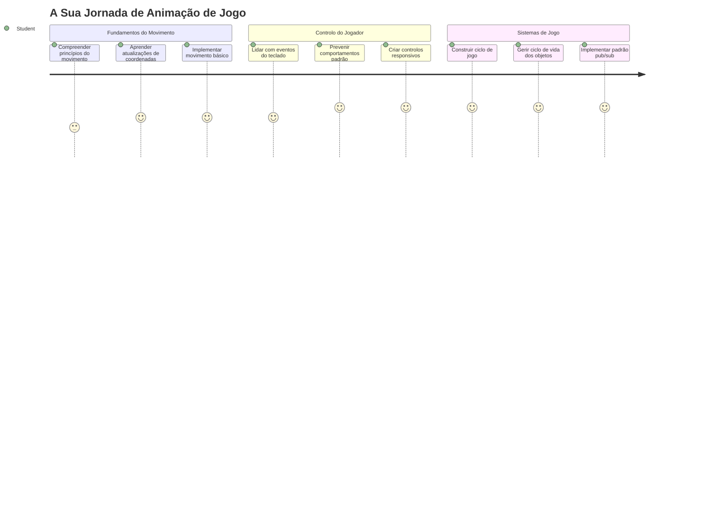
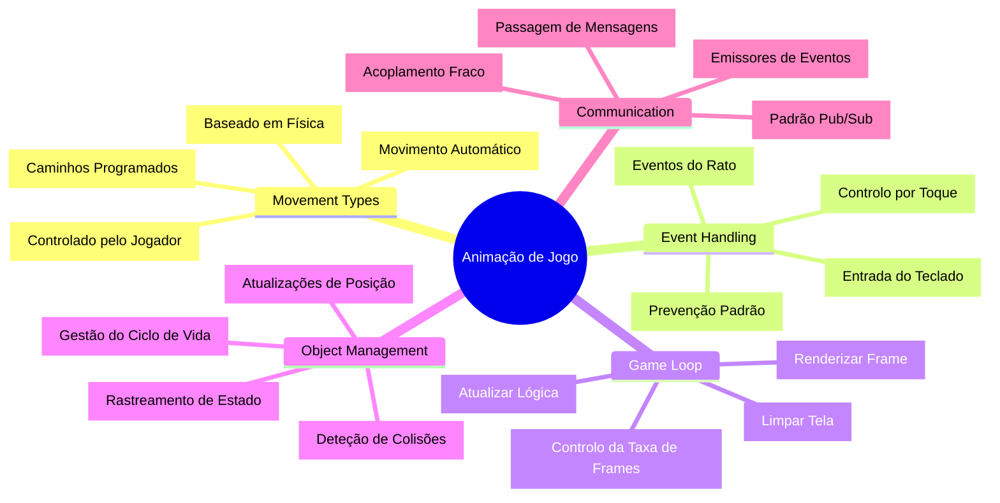
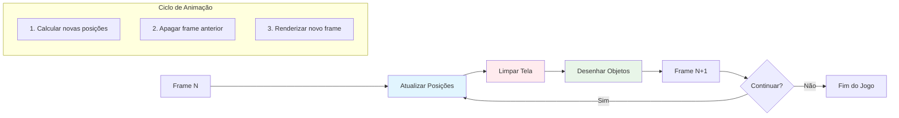
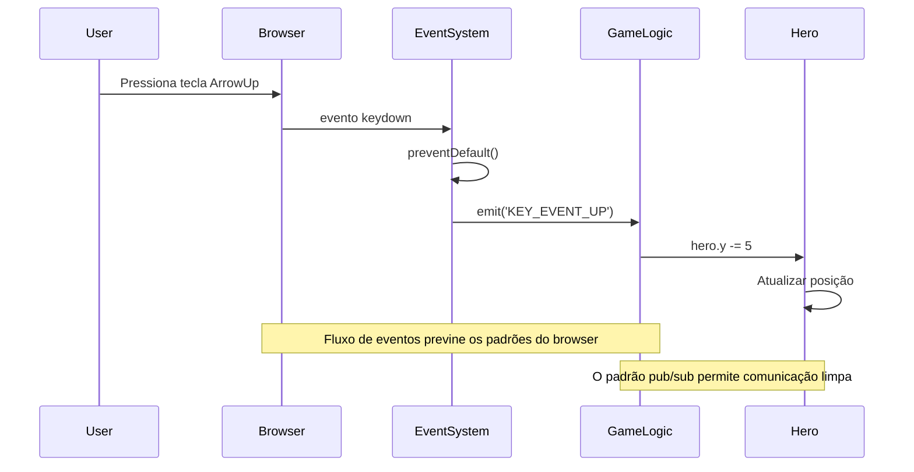
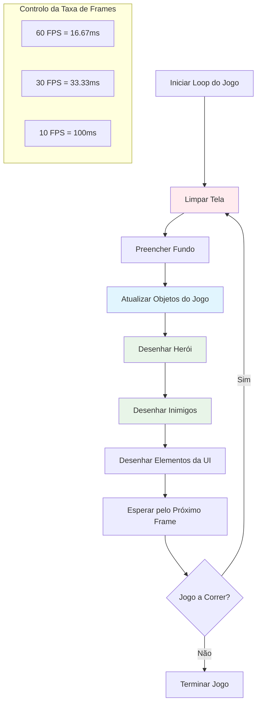
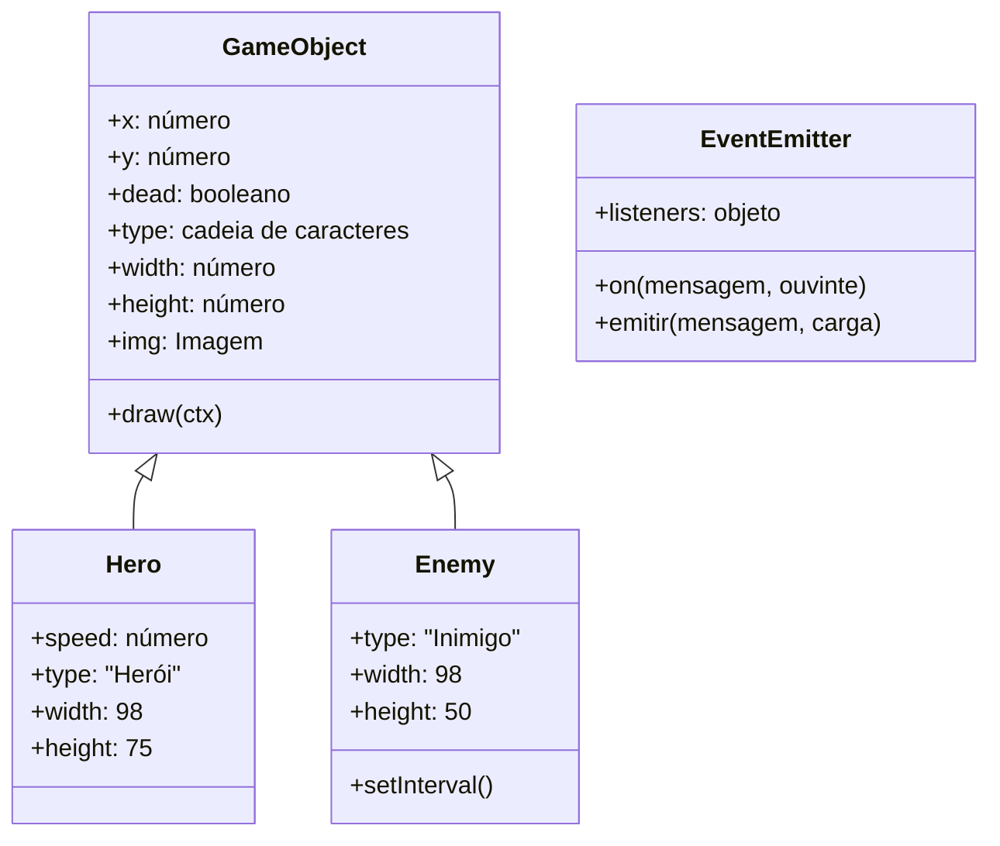
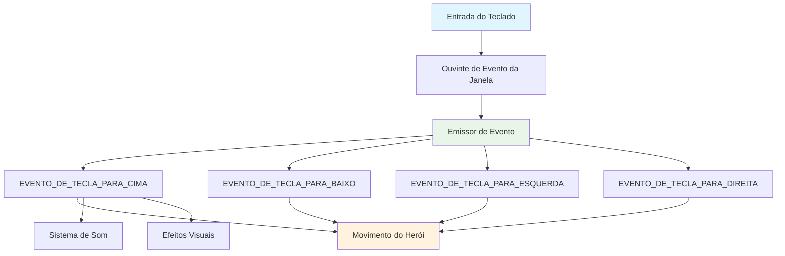
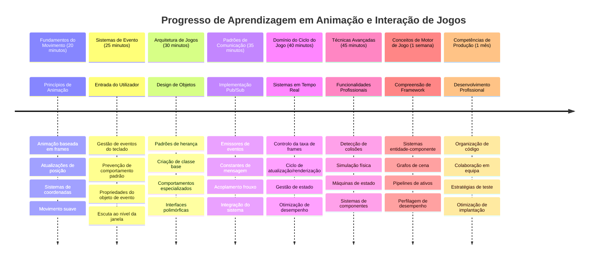

# Construir um Jogo Espacial Parte 3: Adicionando Movimento


Pense nos seus jogos favoritos – o que os torna cativantes não são só gráficos bonitos, é a forma como tudo se move e responde às suas ações. Neste momento, o seu jogo espacial é como uma pintura bonita, mas estamos prestes a adicionar movimento que lhe dá vida.

Quando os engenheiros da NASA programaram o computador de orientação para as missões Apollo, enfrentaram um desafio semelhante: como fazer uma nave responder ao input do piloto enquanto mantinha automaticamente as correções de curso? Os princípios que vamos aprender hoje ecoam esses mesmos conceitos – gerir o movimento controlado pelo jogador juntamente com comportamentos automáticos do sistema.

Nesta lição, vai aprender a fazer as naves deslizar pelo ecrã, responder às ordens do jogador e criar padrões de movimento suaves. Vamos dividir tudo em conceitos geríveis que se constroem naturalmente uns sobre os outros.

No final, terá os jogadores a pilotar a sua nave herói pelo ecrã enquanto as naves inimigas patrulham o espaço aéreo. Mais importante, vai compreender os princípios básicos que alimentam os sistemas de movimento no jogo.


## Questionário Pré-Aula

[Questionário pré-aula](https://ff-quizzes.netlify.app/web/quiz/33)

## Compreender o Movimento nos Jogos

Os jogos ganham vida quando as coisas começam a mover-se, e existem, fundamentalmente, duas formas de isso acontecer:

- **Movimento controlado pelo jogador**: Quando pressiona uma tecla ou clica com o rato, algo se move. Esta é a ligação direta entre si e o seu mundo de jogo.
- **Movimento automático**: Quando o próprio jogo decide mover coisas – como aquelas naves inimigas que precisam de patrulhar o ecrã quer esteja a fazer algo ou não.

Fazer objetos moverem-se num ecrã de computador é mais simples do que pensa. Lembra-se daquelas coordenadas x e y das aulas de matemática? É exatamente com isso que estamos a trabalhar aqui. Quando Galileu rastreou as luas de Júpiter em 1610, estava essencialmente a fazer a mesma coisa – traçar posições ao longo do tempo para entender padrões de movimento.

Mover coisas no ecrã é como criar uma animação em flipbook – precisa seguir estes três passos simples:


1. **Atualizar a posição** – Mudar para onde o seu objeto deve estar (talvez movê-lo 5 pixeis para a direita)
2. **Apagar o quadro antigo** – Limpar o ecrã para não ver rastos fantasmagóricos por todo o lado
3. **Desenhar o quadro novo** – Colocar o seu objeto no novo lugar

Faça isto rápido o suficiente, e boom! Tem movimento suave que parece natural aos jogadores.

Aqui está como pode parecer em código:

```javascript
// Definir a localização do herói
hero.x += 5;
// Limpar o retângulo que aloja o herói
ctx.clearRect(0, 0, canvas.width, canvas.height);
// Voltar a desenhar o fundo do jogo e o herói
ctx.fillRect(0, 0, canvas.width, canvas.height);
ctx.fillStyle = "black";
ctx.drawImage(heroImg, hero.x, hero.y);
```

**Isto é o que este código faz:**
- **Atualiza** a coordenada x do herói em 5 pixeis para o mover horizontalmente
- **Limpa** toda a área do canvas para remover o quadro anterior
- **Preenche** o canvas com uma cor de fundo preta
- **Redesenha** a imagem do herói na sua nova posição

✅ Consegue pensar numa razão pela qual redesenhar o seu herói muitas vezes por segundo pode acarretar custos de desempenho? Leia sobre [alternativas a este padrão](https://developer.mozilla.org/en-US/docs/Web/API/Canvas_API/Tutorial/Optimizing_canvas).

## Manipular eventos do teclado

Aqui é onde ligamos o input do jogador à ação no jogo. Quando alguém carrega na barra de espaço para disparar um laser ou toca numa tecla de seta para desviar de um asteróide, o seu jogo precisa de detetar e responder a esse input.

Os eventos do teclado acontecem ao nível da janela, significando que toda a janela do navegador está à escuta desses eventos de tecla. Os cliques do rato, por outro lado, podem estar ligados a elementos específicos (como clicar num botão). Para o nosso jogo espacial, vamos focar-nos em controlos de teclado, já que é isto que dá aos jogadores aquela sensação clássica de arcade.

Isto lembra-me como os operadores de telégrafo nos anos 1800 tinham de traduzir o input do código morse em mensagens significativas – estamos a fazer algo semelhante, a traduzir as teclas pressionadas em comandos do jogo.

Para manipular um evento, precisa de usar o método `addEventListener()` da janela e fornecer-lhe dois parâmetros de input. O primeiro parâmetro é o nome do evento, por exemplo `keyup`. O segundo parâmetro é a função que deve ser chamada como resultado da ocorrência do evento.

Aqui está um exemplo:

```javascript
window.addEventListener('keyup', (evt) => {
  // evt.key = representação em string da tecla
  if (evt.key === 'ArrowUp') {
    // faça algo
  }
});
```

**Explicação do que acontece aqui:**
- **Escuta** eventos de teclado em toda a janela
- **Captura** o objeto do evento que contém informação sobre qual tecla foi pressionada
- **Verifica** se a tecla pressionada corresponde a uma tecla específica (neste caso, a seta para cima)
- **Executa** código quando a condição é cumprida

Para eventos de tecla, existem duas propriedades no evento que pode usar para ver que tecla foi pressionada:

- `key` - isto é uma representação em string da tecla pressionada, por exemplo `'ArrowUp'`
- `keyCode` - isto é uma representação numérica, por exemplo `37`, que corresponde a `ArrowLeft`

✅ A manipulação de eventos de tecla é útil fora do desenvolvimento de jogos. Que outros usos consegue imaginar para esta técnica?


### Teclas especiais: um aviso!

Algumas teclas têm comportamentos incorporados no navegador que podem interferir com o seu jogo. As teclas de seta deslocam a página e a barra de espaço salta para baixo – comportamentos que não quer quando alguém está a tentar pilotar a sua nave espacial.

Podemos evitar esses comportamentos por defeito e deixar o nosso jogo lidar com o input em vez disso. Isto é semelhante a como os programadores de computadores antigos tinham de substituir interrupções do sistema para criar comportamentos personalizados – estamos apenas a fazê-lo ao nível do navegador. Aqui está como:

```javascript
const onKeyDown = function (e) {
  console.log(e.keyCode);
  switch (e.keyCode) {
    case 37:
    case 39:
    case 38:
    case 40: // Teclas de seta
    case 32:
      e.preventDefault();
      break; // Espaço
    default:
      break; // não bloquear outras teclas
  }
};

window.addEventListener('keydown', onKeyDown);
```

**Compreender este código de prevenção:**
- **Verifica** códigos de tecla específicos que podem causar comportamentos indesejados no navegador
- **Previne** a ação padrão do navegador para as teclas de seta e barra de espaço
- **Permite** que outras teclas funcionem normalmente
- **Usa** `e.preventDefault()` para parar o comportamento incorporado do navegador

### 🔄 **Verificação Pedagógica**
**Compreensão do Manipular de Eventos**: Antes de passar ao movimento automático, certifique-se que pode:
- ✅ Explicar a diferença entre eventos `keydown` e `keyup`
- ✅ Entender por que previmos os comportamentos padrão do navegador
- ✅ Descrever como os event listeners ligam o input do utilizador à lógica do jogo
- ✅ Identificar que teclas podem interferir com os controlos do jogo

**Auto-teste rápido**: O que aconteceria se não evitasse o comportamento padrão para as teclas de seta?
*Resposta: O navegador deslocaria a página, interferindo com o movimento do jogo*

**Arquitetura do Sistema de Eventos**: Agora compreende:
- **Escuta ao nível da janela**: Captura eventos ao nível do navegador
- **Propriedades do objeto de evento**: strings `key` vs números `keyCode`
- **Prevenção por defeito**: Parar comportamentos indesejados do navegador
- **Lógica condicional**: Responder a combinações específicas de teclas

## Movimento induzido pelo jogo

Agora vamos falar sobre objetos que se movem sem input do jogador. Pense nas naves inimigas a navegar pelo ecrã, balas a voar em linhas retas ou nuvens a deslocarem-se ao fundo. Este movimento autónomo faz com que o mundo do seu jogo pareça vivo, mesmo quando ninguém está a tocar nos controlos.

Usamos os temporizadores incorporados do JavaScript para atualizar posições em intervalos regulares. Este conceito é semelhante ao funcionamento dos relógios de pêndulo – um mecanismo regular que dispara ações temporizadas e consistentes. Aqui está como pode ser simples:

```javascript
const id = setInterval(() => {
  // Mover o inimigo no eixo y
  enemy.y += 10;
}, 100);
```

**Isto é o que este código de movimento faz:**
- **Cria** um temporizador que corre a cada 100 milissegundos
- **Atualiza** a coordenada y do inimigo em 10 pixeis cada vez
- **Armazena** o ID do intervalo para podermos pará-lo mais tarde, se necessário
- **Move** o inimigo para baixo no ecrã automaticamente

## O ciclo do jogo

Aqui está o conceito que une tudo – o ciclo do jogo. Se o seu jogo fosse um filme, o ciclo do jogo seria o projetor, a mostrar quadro após quadro tão rápido que tudo parece mover-se suavemente.

Cada jogo tem um destes ciclos a correr em segundo plano. É uma função que atualiza todos os objetos do jogo, redesenha o ecrã e repete este processo continuamente. Isto mantém o controlo do seu herói, de todos os inimigos, de quaisquer lasers a voar – todo o estado do jogo.

Este conceito lembra-me como os primeiros animadores de cinema, como Walt Disney, tinham de redesenhar personagens quadro a quadro para criar a ilusão de movimento. Estamos a fazer a mesma coisa, só que com código em vez de lápis.

Aqui está como um ciclo de jogo pode tipicamente parecer, expresso em código:


```javascript
const gameLoopId = setInterval(() => {
  function gameLoop() {
    ctx.clearRect(0, 0, canvas.width, canvas.height);
    ctx.fillStyle = "black";
    ctx.fillRect(0, 0, canvas.width, canvas.height);
    drawHero();
    drawEnemies();
    drawStaticObjects();
  }
  gameLoop();
}, 200);
```

**Compreender a estrutura do ciclo do jogo:**
- **Limpa** todo o canvas para remover o quadro anterior
- **Preenche** o fundo com uma cor sólida
- **Desenha** todos os objetos do jogo nas suas posições atuais
- **Repete** este processo a cada 200 milissegundos para criar animação suave
- **Gere** a taxa de frames controlando o tempo do intervalo

## Continuar o Jogo Espacial

Agora vamos adicionar movimento à cena estática que construiu anteriormente. Vamos transformá-la de uma captura de ecrã numa experiência interativa. Vamos trabalhar passo a passo para garantir que cada parte se constrói sobre a anterior.

Pegue no código de onde paramos na lição anterior (ou comece com o código na pasta [Part II- starter](../../../../6-space-game/3-moving-elements-around/your-work) se precisar de um novo começo).

**Isto é o que vamos construir hoje:**
- **Controlos do herói**: As teclas de seta vão pilotar a sua nave pelo ecrã
- **Movimento dos inimigos**: Essas naves alienígenas vão começar a avançar

Vamos começar a implementar estas funcionalidades.

## Passos recomendados

Localize os ficheiros que lhe foram criados na subpasta `your-work`. Ela deve conter o seguinte:

```bash
-| assets
  -| enemyShip.png
  -| player.png
-| index.html
-| app.js
-| package.json
```

Comece o seu projeto na pasta `your-work` digitando:

```bash
cd your-work
npm start
```

**O que este comando faz:**
- **Navega** até ao diretório do seu projeto
- **Inicia** um servidor HTTP no endereço `http://localhost:5000`
- **Serve** os ficheiros do jogo para poder testá-los no browser

O acima irá iniciar um servidor HTTP no endereço `http://localhost:5000`. Abra um browser e introduza esse endereço, neste momento deverá renderizar o herói e todos os inimigos; nada está a mover-se – ainda!

### Adicionar código

1. **Adicione objetos dedicados** para `hero` e `enemy` e `game object`, devem ter propriedades `x` e `y`. (Lembre-se da parte sobre [Herança ou composição](../README.md)).

   *DICA* `game object` deve ser aquele com `x` e `y` e a capacidade de desenhar-se a si próprio num canvas.

   > **Dica**: Comece por adicionar uma nova classe `GameObject` com o seu construtor delineado como abaixo, e depois desenhe-a no canvas:

    ```javascript
    class GameObject {
      constructor(x, y) {
        this.x = x;
        this.y = y;
        this.dead = false;
        this.type = "";
        this.width = 0;
        this.height = 0;
        this.img = undefined;
      }
    
      draw(ctx) {
        ctx.drawImage(this.img, this.x, this.y, this.width, this.height);
      }
    }
    ```

    **Compreender esta classe base:**
    - **Define** propriedades comuns que todos os objetos do jogo partilham (posição, tamanho, imagem)
    - **Inclui** uma flag `dead` para rastrear se o objeto deve ser removido
    - **Fornece** um método `draw()` que desenha o objeto no canvas
    - **Define** valores padrão para todas as propriedades que as classes filhas podem sobrescrever


    Agora, estenda este `GameObject` para criar o `Hero` e o `Enemy`:
    
    ```javascript
    class Hero extends GameObject {
      constructor(x, y) {
        super(x, y);
        this.width = 98;
        this.height = 75;
        this.type = "Hero";
        this.speed = 5;
      }
    }
    ```

    ```javascript
    class Enemy extends GameObject {
      constructor(x, y) {
        super(x, y);
        this.width = 98;
        this.height = 50;
        this.type = "Enemy";
        const id = setInterval(() => {
          if (this.y < canvas.height - this.height) {
            this.y += 5;
          } else {
            console.log('Stopped at', this.y);
            clearInterval(id);
          }
        }, 300);
      }
    }
    ```

    **Conceitos chave nestas classes:**
    - **Herda** de `GameObject` usando a palavra-chave `extends`
    - **Chama** o construtor do pai com `super(x, y)`
    - **Define** dimensões e propriedades específicas para cada tipo de objeto
    - **Implementa** movimento automático para inimigos usando `setInterval()`

2. **Adicione manipuladores de eventos de tecla** para controlar a nave (mover herói para cima/baixo/esquerda/direita)

   *LEMBRE-SE* é um sistema cartesiano, topo-esquerdo é `0,0`. Lembre-se também de adicionar código para impedir o *comportamento por defeito*

   > **Dica**: Crie a sua função `onKeyDown` e ligue-a à janela:

   ```javascript
   const onKeyDown = function (e) {
     console.log(e.keyCode);
     // Adicione o código da lição acima para parar o comportamento padrão
     switch (e.keyCode) {
       case 37:
       case 39:
       case 38:
       case 40: // Teclas de seta
       case 32:
         e.preventDefault();
         break; // Espaço
       default:
         break; // não bloqueie outras teclas
     }
   };

   window.addEventListener("keydown", onKeyDown);
   ```
    
   **O que este manipulador de evento faz:**
   - **Escuta** eventos keydown em toda a janela
   - **Regista** o código da tecla para ajudar a depurar quais teclas são pressionadas
   - **Previne** comportamentos padrão do navegador para teclas de seta e barra de espaço
   - **Permite** que outras teclas funcionem normalmente
   
   Verifique o console do seu browser neste momento e observe os pressionamentos de tecla a serem registados.

3. **Implemente** o [padrão Pub sub](../README.md), isto irá manter o seu código limpo enquanto avança nas partes seguintes.

   O padrão Publish-Subscribe ajuda a organizar o seu código separando a deteção de eventos do seu tratamento. Isso torna o seu código mais modular e fácil de manter.

   Para fazer esta última parte pode:

   1. **Adicionar um listener de eventos** na janela:

       ```javascript
       window.addEventListener("keyup", (evt) => {
         if (evt.key === "ArrowUp") {
           eventEmitter.emit(Messages.KEY_EVENT_UP);
         } else if (evt.key === "ArrowDown") {
           eventEmitter.emit(Messages.KEY_EVENT_DOWN);
         } else if (evt.key === "ArrowLeft") {
           eventEmitter.emit(Messages.KEY_EVENT_LEFT);
         } else if (evt.key === "ArrowRight") {
           eventEmitter.emit(Messages.KEY_EVENT_RIGHT);
         }
       });
       ```

   **O que este sistema de eventos faz:**
   - **Deteta** input do teclado e converte-o em eventos customizados do jogo
   - **Separa** a deteção do input da lógica do jogo
   - **Facilita** a alteração dos controlos mais tarde sem afetar o código do jogo
   - **Permite** que múltiplos sistemas respondam ao mesmo input


   2. **Criar uma classe EventEmitter** para publicar e subscrever mensagens:

       ```javascript
       class EventEmitter {
         constructor() {
           this.listeners = {};
         }
       
         on(message, listener) {
           if (!this.listeners[message]) {
             this.listeners[message] = [];
           }
           this.listeners[message].push(listener);
         }
       
   
   3. **Adicionar constantes** e configurar o EventEmitter:

       ```javascript
       const Messages = {
         KEY_EVENT_UP: "KEY_EVENT_UP",
         KEY_EVENT_DOWN: "KEY_EVENT_DOWN",
         KEY_EVENT_LEFT: "KEY_EVENT_LEFT",
         KEY_EVENT_RIGHT: "KEY_EVENT_RIGHT",
       };
       
       let heroImg, 
           enemyImg, 
           laserImg,
           canvas, ctx, 
           gameObjects = [], 
           hero, 
           eventEmitter = new EventEmitter();
       ```

   **Compreensão da configuração:**
   - **Define** constantes de mensagem para evitar erros de digitação e facilitar refatoração
   - **Declara** variáveis para imagens, contexto do canvas e estado do jogo
   - **Cria** um emissor de eventos global para o sistema pub-sub
   - **Inicializa** um array para conter todos os objetos do jogo

   4. **Inicializar o jogo**

       ```javascript
       function initGame() {
         gameObjects = [];
         createEnemies();
         createHero();
       
         eventEmitter.on(Messages.KEY_EVENT_UP, () => {
           hero.y -= 5;
         });
       
         eventEmitter.on(Messages.KEY_EVENT_DOWN, () => {
           hero.y += 5;
         });
       
         eventEmitter.on(Messages.KEY_EVENT_LEFT, () => {
           hero.x -= 5;
         });
       
4. **Configurar o ciclo do jogo**

   Refatore a função `window.onload` para inicializar o jogo e configurar um ciclo de jogo com um intervalo adequado. Também irá adicionar um feixe de laser:

    ```javascript
    window.onload = async () => {
      canvas = document.getElementById("canvas");
      ctx = canvas.getContext("2d");
      heroImg = await loadTexture("assets/player.png");
      enemyImg = await loadTexture("assets/enemyShip.png");
      laserImg = await loadTexture("assets/laserRed.png");
    
      initGame();
      const gameLoopId = setInterval(() => {
        ctx.clearRect(0, 0, canvas.width, canvas.height);
        ctx.fillStyle = "black";
        ctx.fillRect(0, 0, canvas.width, canvas.height);
        drawGameObjects(ctx);
      }, 100);
    };
    ```

   **Compreendendo a configuração do jogo:**
   - **Espera** que a página carregue completamente antes de começar
   - **Obtém** o elemento canvas e o seu contexto de renderização 2D
   - **Carrega** todos os assets de imagem assíncronamente usando `await`
   - **Inicia** o ciclo do jogo a correr em intervalos de 100ms (10 FPS)
   - **Limpa** e redesenha o ecrã completo a cada frame

5. **Adicionar código** para mover os inimigos num determinado intervalo

    Refatore a função `createEnemies()` para criar os inimigos e adicioná-los na nova classe gameObjects:

    ```javascript
    function createEnemies() {
      const MONSTER_TOTAL = 5;
      const MONSTER_WIDTH = MONSTER_TOTAL * 98;
      const START_X = (canvas.width - MONSTER_WIDTH) / 2;
      const STOP_X = START_X + MONSTER_WIDTH;
    
      for (let x = START_X; x < STOP_X; x += 98) {
        for (let y = 0; y < 50 * 5; y += 50) {
          const enemy = new Enemy(x, y);
          enemy.img = enemyImg;
          gameObjects.push(enemy);
        }
      }
    }
    ```

    **O que a criação dos inimigos faz:**
    - **Calcula** posições para centrar os inimigos no ecrã
    - **Cria** uma grelha de inimigos usando ciclos aninhados
    - **Atribui** a imagem do inimigo a cada objeto inimigo
    - **Adiciona** cada inimigo ao array global de objetos do jogo
    
    e adicione uma função `createHero()` para fazer um processo semelhante para o herói.
    
    ```javascript
    function createHero() {
      hero = new Hero(
        canvas.width / 2 - 45,
        canvas.height - canvas.height / 4
      );
      hero.img = heroImg;
      gameObjects.push(hero);
    }
    ```

    **O que a criação do herói faz:**
    - **Posiciona** o herói no centro inferior do ecrã
    - **Atribui** a imagem do herói ao objeto herói
    - **Adiciona** o herói ao array de objetos do jogo para renderização

    e finalmente, adicione uma função `drawGameObjects()` para iniciar o desenho:

    ```javascript
    function drawGameObjects(ctx) {
      gameObjects.forEach(go => go.draw(ctx));
    }
    ```

    **Compreendendo a função de desenho:**
    - **Itera** por todos os objetos do jogo no array
    - **Chama** o método `draw()` em cada objeto
    - **Passa** o contexto do canvas para que os objetos possam renderizar-se

    ### 🔄 **Verificação Pedagógica**
    **Compreensão Completa do Sistema do Jogo**: Verifique a sua maestria da arquitetura completa:
    - ✅ Como é que a herança permite ao Hero e Enemy partilhar propriedades comuns de GameObject?
    - ✅ Porque é que o padrão pub/sub torna o seu código mais fácil de manter?
    - ✅ Qual o papel do ciclo do jogo na criação de uma animação suave?
    - ✅ Como é que os event listeners ligam a entrada do utilizador ao comportamento dos objetos do jogo?

    **Integração do Sistema**: O seu jogo agora demonstra:
    - **Design Orientado a Objetos**: Classes base com herança especializada
    - **Arquitetura Orientada a Eventos**: Padrão pub/sub para acoplamento fraco
    - **Framework de Animação**: Ciclo do jogo com atualizações consistentes de frames
    - **Gestão de Entrada**: Eventos de teclado com prevenção de comportamentos padrão
    - **Gestão de Recursos**: Carregamento de imagens e renderização de sprites

    **Padrões Profissionais**: Você implementou:
    - **Separação de Responsabilidades**: Entrada, lógica e renderização separados
    - **Polimorfismo**: Todos os objetos do jogo partilham uma interface comum de desenho
    - **Passagem de Mensagens**: Comunicação limpa entre componentes
    - **Gestão de Recursos**: Manipulação eficiente de sprites e animações

    Os seus inimigos deverão começar a avançar na sua nave herói!
      }
    }
    ```
    
    and add a `createHero()` function to do a similar process for the hero.
    
    ```javascript
    function createHero() {
      hero = new Hero(
        canvas.width / 2 - 45,
        canvas.height - canvas.height / 4
      );
      hero.img = heroImg;
      gameObjects.push(hero);
    }
    ```

    e finalmente, adicione uma função `drawGameObjects()` para iniciar o desenho:

    ```javascript
    function drawGameObjects(ctx) {
      gameObjects.forEach(go => go.draw(ctx));
    }
    ```

    Os seus inimigos deverão começar a avançar na sua nave herói!

---

## Desafio GitHub Copilot Agent 🚀

Aqui está um desafio que vai melhorar o polimento do seu jogo: adicionar fronteiras e controlos suaves. Atualmente, o seu herói pode voar fora do ecrã e o movimento pode parecer abrupto.

**A sua missão:** Faça com que a sua nave espacial pareça mais realista implementando limites no ecrã e movimentos fluidos. Isto é semelhante a como os sistemas de controlo de voo da NASA impedem que espaçonaves excedam parâmetros operacionais seguros.

**Isto é o que deve construir:** Crie um sistema que mantenha a sua nave herói dentro do ecrã, e que faça os controlos parecerem suaves. Quando os jogadores mantiverem uma tecla de seta pressionada, a nave deve deslizar continuamente, em vez de mover-se em passos discretos. Considere adicionar um feedback visual quando a nave atingir os limites do ecrã — talvez um efeito subtil para indicar a borda da área de jogo.

Saiba mais sobre o [modo agent](https://code.visualstudio.com/blogs/2025/02/24/introducing-copilot-agent-mode) aqui.

## 🚀 Desafio

A organização do código torna-se cada vez mais importante à medida que os projetos crescem. Pode ter reparado que o seu ficheiro está a ficar cheio de funções, variáveis e classes todas misturadas. Isto lembra-me de como os engenheiros que organizaram o código da missão Apollo tiveram de criar sistemas claros e mantíveis para que várias equipas pudessem trabalhar simultaneamente.

**A sua missão:**
Pense como um arquiteto de software. Como organizaria o seu código para que daqui a seis meses, você (ou um colega) pudesse entender o que está a acontecer? Mesmo que tudo fique num só ficheiro por enquanto, pode criar melhor organização:

- **Agrupar funções relacionadas** com cabeçalhos de comentário claros
- **Separar responsabilidades** – manter a lógica do jogo separada da renderização
- **Usar convenções de nomeação consistentes** para variáveis e funções
- **Criar módulos** ou namespaces para organizar diferentes aspetos do seu jogo
- **Adicionar documentação** que explique o propósito de cada secção principal

**Perguntas de reflexão:**
- Quais partes do seu código são mais difíceis de entender quando volta a elas?
- Como poderia organizar o seu código para facilitar a contribuição de outra pessoa?
- O que aconteceria se quisesse adicionar novas funcionalidades como power-ups ou diferentes tipos de inimigos?

## Quiz Pós-Lição

[Quiz pós-lição](https://ff-quizzes.netlify.app/web/quiz/34)

## Revisão & Autoestudo

Temos construído tudo do zero, o que é fantástico para aprender, mas aqui vai um pequeno segredo – existem frameworks JavaScript incríveis que podem tratar de grande parte do trabalho pesado por si. Assim que se sentir confortável com os fundamentos que abordámos, vale a pena [explorar o que existe](https://github.com/collections/javascript-game-engines).

Pense em frameworks como ter uma caixa de ferramentas bem equipada em vez de fabricar cada ferramenta à mão. Elas podem resolver muitos daqueles desafios de organização de código de que falámos, além de oferecer funcionalidades que demoraria semanas a construir sozinho.

**Coisas que vale a pena explorar:**
- Como os motores de jogo organizam o código – vai ficar surpreendido com os padrões engenhosos que usam
- Truques de performance para fazer jogos em canvas correrem incrivelmente suaves  
- Funcionalidades modernas de JavaScript que podem tornar o seu código mais limpo e mantível
- Diferentes abordagens para gerir objetos do jogo e as suas relações

## 🎯 O Seu Cronograma de Mestria em Animação de Jogos


### 🛠️ Resumo da Sua Caixa de Ferramentas para Desenvolvimento de Jogos

Depois de completar esta lição, agora domina:
- **Princípios de Animação**: Movimentos baseados em frames e transições suaves
- **Programação Orientada a Eventos**: Gestão de entrada via teclado com manipulação correta de eventos
- **Design Orientado a Objetos**: Hierarquias de herança e interfaces polimórficas
- **Padrões de Comunicação**: Arquitetura pub/sub para código fácil de manter
- **Arquitetura do Ciclo do Jogo**: Atualizações e renderizações em tempo real
- **Sistemas de Entrada**: Mapas de controlo do utilizador com prevenção de comportamento padrão
- **Gestão de Recursos**: Carregamento de sprites e técnicas de renderização eficientes

### ⚡ **O Que Pode Fazer Nos Próximos 5 Minutos**
- [ ] Abrir o console do navegador e tentar `addEventListener('keydown', console.log)` para ver eventos de teclado
- [ ] Criar um elemento div simples e movê-lo usando as teclas de seta
- [ ] Experimentar com `setInterval` para criar movimento contínuo
- [ ] Tentar prevenir o comportamento padrão com `event.preventDefault()`

### 🎯 **O Que Pode Alcançar Nesta Hora**
- [ ] Completar o quiz pós-lição e compreender a programação orientada a eventos
- [ ] Construir a nave herói móvel com controlo total por teclado
- [ ] Implementar padrões de movimento suave para inimigos
- [ ] Adicionar fronteiras para evitar que objetos do jogo saiam do ecrã
- [ ] Criar deteção básica de colisões entre objetos do jogo

### 📅 **A Sua Jornada de Animação de Uma Semana**
- [ ] Completar o jogo espacial completo com movimentos e interações polidos
- [ ] Adicionar padrões avançados de movimento como curvas, aceleração e física
- [ ] Implementar transições suaves e funções de easing
- [ ] Criar efeitos de partículas e sistemas de feedback visual
- [ ] Otimizar a performance do jogo para fluidez a 60fps
- [ ] Adicionar controlos touch para dispositivos móveis e design responsivo

### 🌟 **O Seu Desenvolvimento Interativo de Um Mês**
- [ ] Criar aplicações interativas complexas com sistemas avançados de animação
- [ ] Aprender bibliotecas de animação como GSAP ou criar o seu próprio motor de animação
- [ ] Contribuir para projetos open source de desenvolvimento de jogos e animação
- [ ] Dominar otimizações de performance para aplicações gráficas intensivas
- [ ] Criar conteúdos educacionais sobre desenvolvimento de jogos e animação
- [ ] Construir um portfólio que demonstre competências avançadas de programação interativa

**Aplicações no Mundo Real**: As suas competências em animação de jogos aplicam-se diretamente a:
- **Aplicações Web Interativas**: Dashboards dinâmicos e interfaces em tempo real
- **Visualização de Dados**: Gráficos animados e gráficos interativos
- **Software Educacional**: Simulações interativas e ferramentas de aprendizagem
- **Desenvolvimento Móvel**: Jogos baseados em toque e manipulação de gestos
- **Aplicações Desktop**: Aplicações Electron com animações suaves
- **Animações Web**: Bibliotecas de animação CSS e JavaScript

**Competências Profissionais Adquiridas**: Agora pode:
- **Arquitetar** sistemas orientados a eventos que escalam com a complexidade
- **Implementar** animações suaves usando princípios matemáticos
- **Debugar** sistemas complexos de interação usando ferramentas de desenvolvimento do navegador
- **Otimizar** a performance do jogo para diferentes dispositivos e browsers
- **Desenhar** estruturas de código mantíveis usando padrões comprovados

**Conceitos de Desenvolvimento de Jogos Dominados**:
- **Gestão de Frame Rate**: Compreensão de FPS e controlo de temporização
- **Gestão de Entrada**: Teclado multiplataforma e sistemas de eventos
- **Ciclo de Vida do Objeto**: Padrões de criação, atualização e destruição
- **Sincronização de Estado**: Manter estado do jogo consistente entre frames
- **Arquitetura de Eventos**: Comunicação desacoplada entre sistemas do jogo

**Próximo Nível**: Está pronto para adicionar deteção de colisões, sistemas de pontuação, efeitos sonoros, ou explorar frameworks modernos como Phaser ou Three.js!

🌟 **Conquista Desbloqueada**: Construiu um sistema de jogo interativo completo com padrões profissionais de arquitetura!

## Tarefa

[Comente o seu código](assignment.md)

---

<!-- CO-OP TRANSLATOR DISCLAIMER START -->
**Aviso Legal**:
Este documento foi traduzido utilizando o serviço de tradução automática [Co-op Translator](https://github.com/Azure/co-op-translator). Embora nos esforcemos por garantir a precisão, por favor esteja ciente de que traduções automáticas podem conter erros ou imprecisões. O documento original, na sua língua nativa, deve ser considerado como a fonte autorizada. Para informações críticas, recomenda-se a tradução profissional feita por humanos. Não nos responsabilizamos por quaisquer mal-entendidos ou interpretações incorrectas decorrentes do uso desta tradução.
<!-- CO-OP TRANSLATOR DISCLAIMER END -->