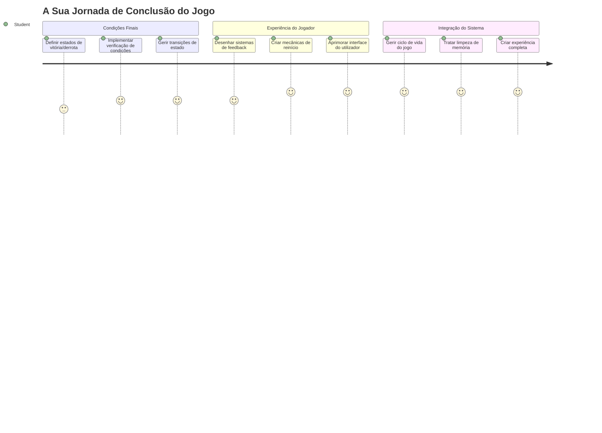
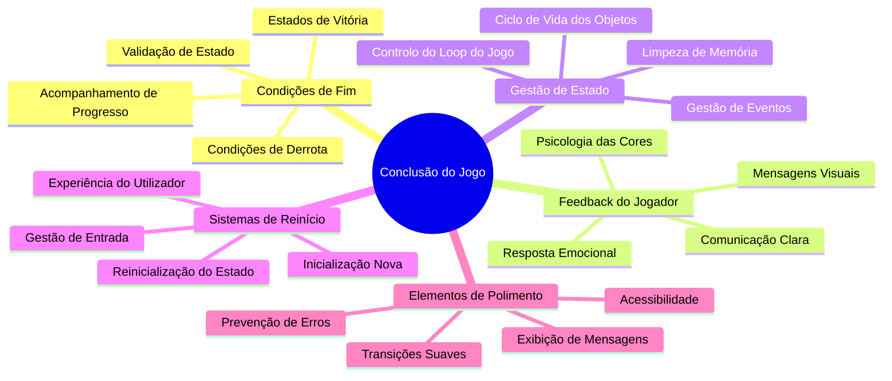
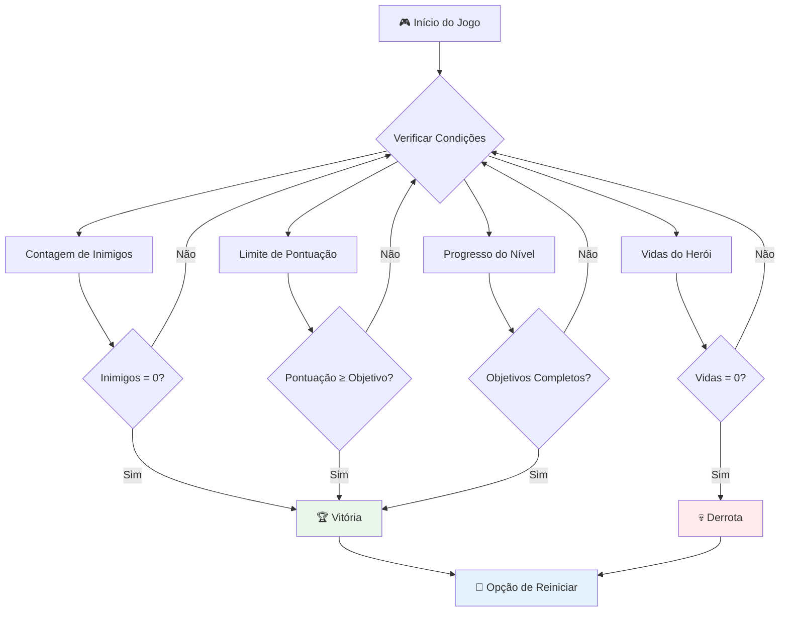
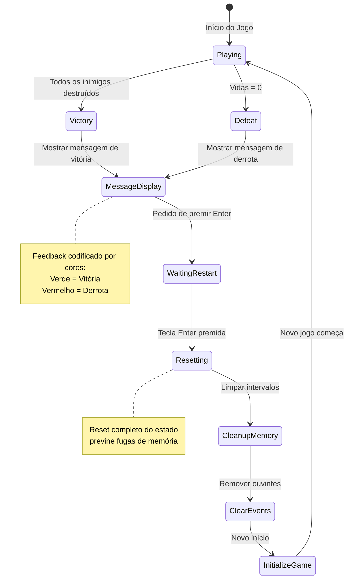
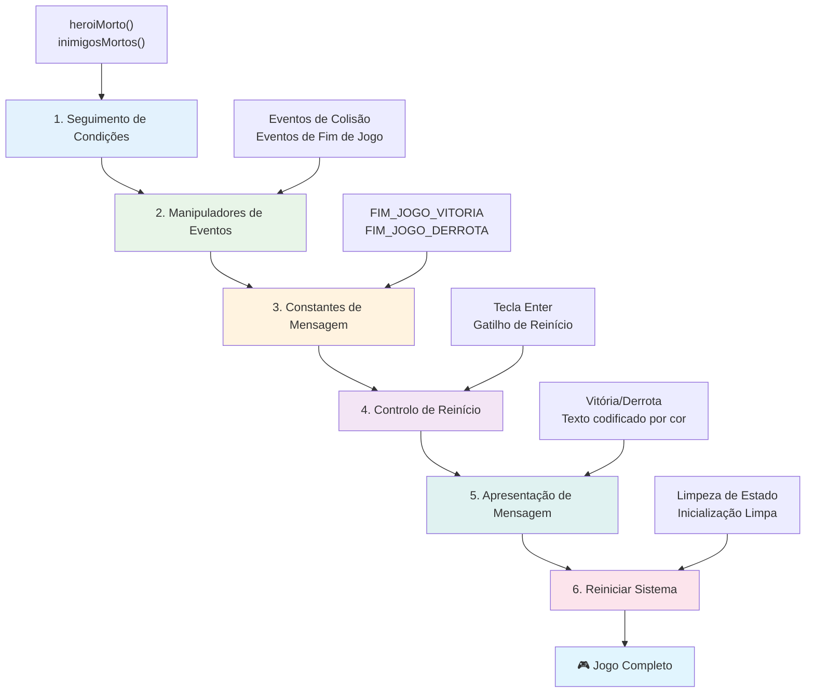
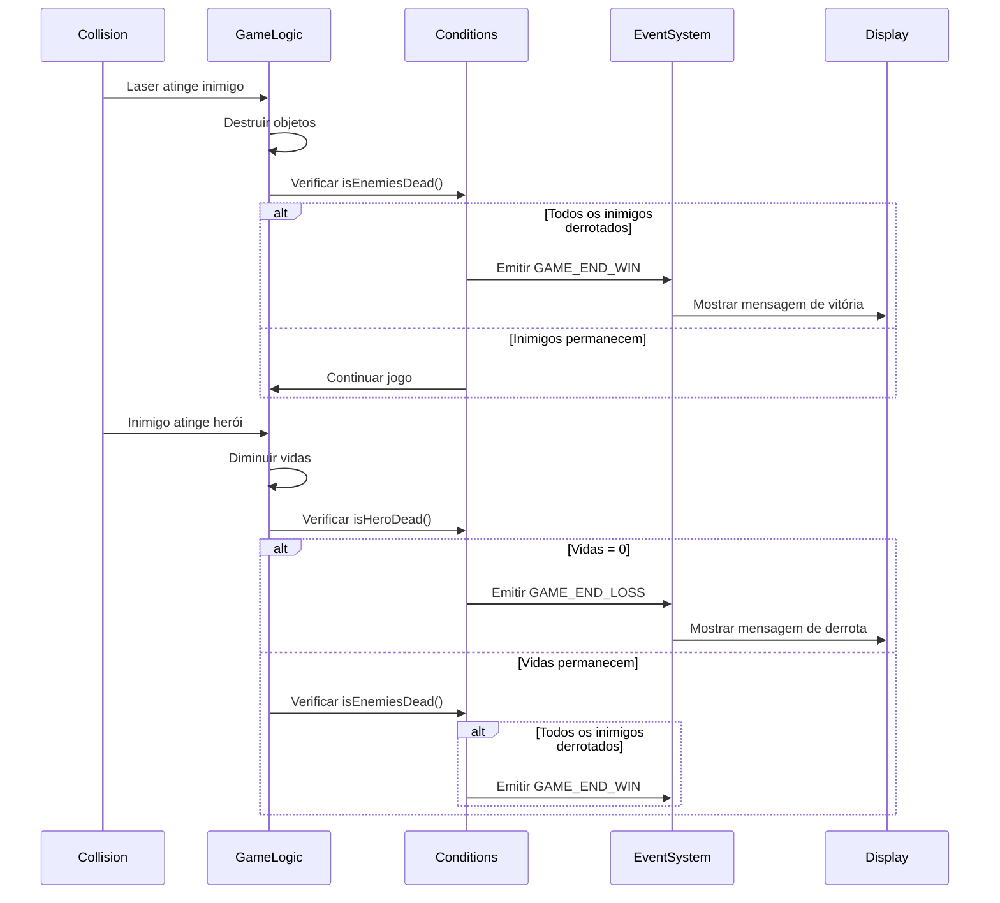
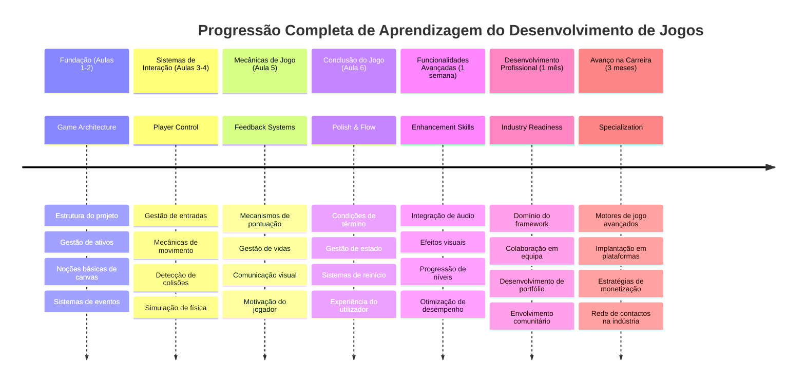

# Construir um Jogo Espacial Parte 6: Fim e Reinício


Todo jogo ótimo precisa de condições claras de fim e um mecanismo suave de reinício. Já construíste um jogo espacial impressionante com movimento, combate e pontuação – agora é hora de adicionar as peças finais que o fazem sentir-se completo.

O teu jogo atualmente corre indefinidamente, como as sondas Voyager que a NASA lançou em 1977 – ainda a viajar pelo espaço décadas depois. Embora isso seja ótimo para exploração espacial, os jogos precisam de pontos finais definidos para criar experiências satisfatórias.

Hoje, vamos implementar condições adequadas de vitória/derrota e um sistema de reinício. No final desta lição, terás um jogo polido que os jogadores podem completar e jogar novamente, tal como os clássicos jogos de arcada que definiram o meio.


## Questionário Pré-Lição

[Questionário pré-lição](https://ff-quizzes.netlify.app/web/quiz/39)

## Compreender as Condições de Fim de Jogo

Quando deverá o teu jogo terminar? Esta questão fundamental moldou o design de jogos desde a era inicial dos arcades. Pac-Man termina quando és apanhado pelos fantasmas ou limpas todos os pontos, enquanto Space Invaders termina quando os alienígenas chegam ao fundo ou quando os destróis todos.

Como criador do jogo, tu defines as condições de vitória e derrota. Para o nosso jogo espacial, aqui estão abordagens comprovadas que criam jogabilidade envolvente:


- **Foram destruídos `N` navios inimigos**: É bastante comum, se divides o jogo em diferentes níveis, que seja necessário destruir `N` navios inimigos para completar um nível
- **O teu navio foi destruído**: Existem definitivamente jogos onde perdes se o teu navio for destruído. Outra abordagem comum é o conceito de vidas. Sempre que o teu navio é destruído, perdes uma vida. Depois de esgotares todas as vidas, perdes o jogo.
- **Coleccionaste `N` pontos**: Outra condição comum de fim é coleccionares pontos. Como consegues pontos fica ao teu critério, mas é comum atribuir pontos a várias atividades, como destruir um navio inimigo ou talvez recolher itens que caem quando são destruídos.
- **Completar um nível**: Isto pode envolver várias condições, como destruir `X` navios inimigos, coleccionar `Y` pontos ou talvez recolher um item específico.

## Implementar Funcionalidade de Reinício do Jogo

Bons jogos incentivam a rejogabilidade através de mecanismos suaves de reinício. Quando os jogadores completam um jogo (ou são derrotados), muitas vezes querem tentar novamente imediatamente – seja para superar a sua pontuação ou melhorar a sua performance.


O Tetris exemplifica isso na perfeição: quando as tuas peças chegam ao topo, podes começar instantaneamente um novo jogo sem navegar por menus complexos. Vamos construir um sistema de reinício semelhante que redefine o estado do jogo de forma limpa e faz com que os jogadores voltem rapidamente à ação.

✅ **Reflexão**: Pensa nos jogos que jogaste. Em que condições terminam e como és convidado a reiniciar? O que torna a experiência de reinício suave em vez de frustrante?

## O Que Vais Construir

Irás implementar as funcionalidades finais que transformam o teu projeto numa experiência de jogo completa. Estes elementos distinguem jogos polidos de protótipos básicos.

**Aqui está o que vamos adicionar hoje:**

1. **Condição de vitória**: Elimina todos os inimigos e recebe uma celebração adequada (muito merecida!)
2. **Condição de derrota**: Fica sem vidas e enfrenta a derrota com um ecrã de derrota
3. **Mecanismo de reinício**: Pressiona Enter para reiniciar imediatamente – porque um jogo nunca é suficiente
4. **Gestão de estado**: Começar de novo sempre – sem inimigos deixados para trás ou glitches estranhos do último jogo

## Começar

Vamos preparar o teu ambiente de desenvolvimento. Deves ter todos os ficheiros do teu jogo espacial das lições anteriores prontos.

**O teu projeto deverá parecer algo assim:**

```bash
-| assets
  -| enemyShip.png
  -| player.png
  -| laserRed.png
  -| life.png
-| index.html
-| app.js
-| package.json
```

**Inicia o servidor de desenvolvimento:**

```bash
cd your-work
npm start
```

**Este comando:**
- Corre um servidor local em `http://localhost:5000`
- Serve os teus ficheiros corretamente
- Atualiza automaticamente quando fazes alterações

Abre `http://localhost:5000` no teu navegador e verifica que o jogo está a correr. Deves conseguir mover, disparar e interagir com os inimigos. Após confirmado, podemos prosseguir com a implementação.

> 💡 **Dica Profissional**: Para evitar avisos no Visual Studio Code, declara `gameLoopId` no topo do teu ficheiro como `let gameLoopId;` em vez de declarar dentro da função `window.onload`. Isto segue as melhores práticas modernas de declaração de variáveis em JavaScript.


## Passos de Implementação

### Passo 1: Criar Funções de Monitorização da Condição de Fim

Precisamos de funções para monitorizar quando o jogo deve terminar. Como sensores na Estação Espacial Internacional que monitorizam constantemente sistemas críticos, estas funções irão verificar continuamente o estado do jogo.

```javascript
function isHeroDead() {
  return hero.life <= 0;
}

function isEnemiesDead() {
  const enemies = gameObjects.filter((go) => go.type === "Enemy" && !go.dead);
  return enemies.length === 0;
}
```

**Aqui está o que está a acontecer por trás dos panos:**
- **Verifica** se o nosso herói ficou sem vidas (ai!)
- **Conta** quantos inimigos ainda estão vivos e ativos
- **Retorna** `true` quando o campo de batalha está livre de inimigos
- **Usa** lógica simples de verdadeiro/falso para manter a simplicidade
- **Filtra** através de todos os objetos do jogo para encontrar os sobreviventes

### Passo 2: Atualizar Manipuladores de Eventos para Condições de Fim

Agora vamos ligar estas verificações de condição ao sistema de eventos do jogo. Sempre que ocorre uma colisão, o jogo irá avaliar se isso desencadeia uma condição de fim. Isto cria um feedback imediato para eventos críticos do jogo.


```javascript
eventEmitter.on(Messages.COLLISION_ENEMY_LASER, (_, { first, second }) => {
    first.dead = true;
    second.dead = true;
    hero.incrementPoints();

    if (isEnemiesDead()) {
      eventEmitter.emit(Messages.GAME_END_WIN);
    }
});

eventEmitter.on(Messages.COLLISION_ENEMY_HERO, (_, { enemy }) => {
    enemy.dead = true;
    hero.decrementLife();
    if (isHeroDead())  {
      eventEmitter.emit(Messages.GAME_END_LOSS);
      return; // perda antes da vitória
    }
    if (isEnemiesDead()) {
      eventEmitter.emit(Messages.GAME_END_WIN);
    }
});

eventEmitter.on(Messages.GAME_END_WIN, () => {
    endGame(true);
});
  
eventEmitter.on(Messages.GAME_END_LOSS, () => {
  endGame(false);
});
```

**O que está a acontecer aqui:**
- **Laser atinge inimigo**: Ambos desaparecem, ganhas pontos e verificamos se ganhaste
- **Inimigo atinge-te**: Perdes uma vida e verificamos se ainda estás vivo
- **Ordem inteligente**: Verificamos a derrota primeiro (ninguém quer ganhar e perder ao mesmo tempo!)
- **Reações instantâneas**: Assim que algo importante acontece, o jogo sabe disso

### Passo 3: Adicionar Novas Constantes de Mensagem

Terás de adicionar novos tipos de mensagem ao teu objeto constante `Messages`. Estas constantes ajudam a manter a consistência e evitam erros ortográficos no sistema de eventos.

```javascript
GAME_END_LOSS: "GAME_END_LOSS",
GAME_END_WIN: "GAME_END_WIN",
```

**No acima, nós:**
- **Adicionámos** constantes para eventos de fim de jogo para manter a consistência
- **Usámos** nomes descritivos que indicam claramente o propósito do evento
- **Seguímos** a convenção de nomes já existente para tipos de mensagens

### Passo 4: Implementar Controlo de Reinício

Agora vais adicionar controlos de teclado que permitem aos jogadores reiniciar o jogo. A tecla Enter é uma escolha natural, pois está associada a confirmar ações e iniciar novos jogos.

**Adiciona deteção da tecla Enter ao teu atual listener de evento keydown:**

```javascript
else if(evt.key === "Enter") {
   eventEmitter.emit(Messages.KEY_EVENT_ENTER);
}
```

**Adiciona a nova constante de mensagem:**

```javascript
KEY_EVENT_ENTER: "KEY_EVENT_ENTER",
```

**O que precisas de saber:**
- **Estende** o teu sistema existente de controlo por teclado
- **Usa** a tecla Enter como gatilho para reiniciar para uma experiência intuitiva
- **Emite** um evento personalizado que outras partes do teu jogo podem escutar
- **Mantém** o mesmo padrão das tuas outras controlos de teclado

### Passo 5: Criar o Sistema de Exibição de Mensagens

O teu jogo precisa comunicar os resultados claramente aos jogadores. Vamos criar um sistema de mensagens que exibe os estados de vitória e derrota utilizando texto codificado por cores, semelhante às interfaces de terminais dos sistemas computacionais iniciais, onde verde indica sucesso e vermelho sinaliza erros.

**Cria a função `displayMessage()`:**

```javascript
function displayMessage(message, color = "red") {
  ctx.font = "30px Arial";
  ctx.fillStyle = color;
  ctx.textAlign = "center";
  ctx.fillText(message, canvas.width / 2, canvas.height / 2);
}
```

**Passo a passo, isto é o que acontece:**
- **Define** o tamanho e a família da fonte para um texto claro e legível
- **Aplica** um parâmetro de cor com "vermelho" como padrão para avisos
- **Centraliza** o texto horizontalmente e verticalmente no canvas
- **Usa** parâmetros padrão modernos do JavaScript para opções de cor flexíveis
- **Aproveita** o contexto 2D do canvas para renderizar texto diretamente

**Cria a função `endGame()`:**

```javascript
function endGame(win) {
  clearInterval(gameLoopId);

  // Definir um atraso para garantir que quaisquer renderizações pendentes sejam concluídas
  setTimeout(() => {
    ctx.clearRect(0, 0, canvas.width, canvas.height);
    ctx.fillStyle = "black";
    ctx.fillRect(0, 0, canvas.width, canvas.height);
    if (win) {
      displayMessage(
        "Victory!!! Pew Pew... - Press [Enter] to start a new game Captain Pew Pew",
        "green"
      );
    } else {
      displayMessage(
        "You died !!! Press [Enter] to start a new game Captain Pew Pew"
      );
    }
  }, 200)  
}
```

**O que esta função faz:**
- **Congela** tudo no lugar – nada de navios ou lasers a mover
- **Tira** uma pequena pausa (200ms) para deixar o último frame acabar de desenhar
- **Limpa** o ecrã e pinta-o de preto para efeito dramático
- **Mostra** mensagens diferentes para vencedores e perdedores
- **Codifica as cores** da notícia – verde para bom, vermelho para… nem por isso
- **Diz** aos jogadores exatamente como reiniciar

### 🔄 **Verificação Pedagógica**
**Gestão do Estado do Jogo**: Antes de implementar a funcionalidade de reinício, certifica-te que entendes:
- ✅ Como as condições de fim criam objetivos claros de jogo
- ✅ Porque é que o feedback visual é essencial para o entendimento do jogador
- ✅ A importância de limpeza adequada para evitar vazamentos de memória
- ✅ Como a arquitetura orientada a eventos permite transições limpas de estado

**Teste Rápido**: O que aconteceria se não limpasses os ouvintes de eventos durante o reinício?  
*Resposta: Vazamentos de memória e múltiplos manipuladores de evento podem causar comportamento imprevisível*

**Princípios de Design de Jogos**: Agora estás a implementar:
- **Objetivos Claros**: Os jogadores sabem exatamente o que define sucesso e fracasso
- **Feedback Imediato**: As mudanças no estado do jogo são comunicadas imediatamente
- **Controlo do Utilizador**: Os jogadores podem reiniciar quando quiserem
- **Confiabilidade do Sistema**: A limpeza adequada previne bugs e problemas de performance

### Passo 6: Implementar Funcionalidade de Reset do Jogo

O sistema de reset precisa limpar completamente o estado atual do jogo e inicializar uma nova sessão limpa. Isto assegura que os jogadores tenham um começo limpo sem dados remanescentes do jogo anterior.

**Cria a função `resetGame()`:**

```javascript
function resetGame() {
  if (gameLoopId) {
    clearInterval(gameLoopId);
    eventEmitter.clear();
    initGame();
    gameLoopId = setInterval(() => {
      ctx.clearRect(0, 0, canvas.width, canvas.height);
      ctx.fillStyle = "black";
      ctx.fillRect(0, 0, canvas.width, canvas.height);
      drawPoints();
      drawLife();
      updateGameObjects();
      drawGameObjects(ctx);
    }, 100);
  }
}
```

**Vamos entender cada parte:**
- **Verifica** se um loop de jogo está a correr antes de reiniciar
- **Limpa** o loop existente para parar toda a atividade atual do jogo
- **Remove** todos os ouvintes de evento para prevenir vazamentos de memória
- **Reinicializa** o estado do jogo com objetos e variáveis novos
- **Inicia** um novo loop de jogo com todas as funções essenciais
- **Mantém** o mesmo intervalo de 100ms para performance consistente

**Adiciona o manipulador da tecla Enter à tua função `initGame()`:**

```javascript
eventEmitter.on(Messages.KEY_EVENT_ENTER, () => {
  resetGame();
});
```

**Adiciona o método `clear()` à tua classe EventEmitter:**

```javascript
clear() {
  this.listeners = {};
}
```

**Pontos-chave para lembrar:**
- **Liga** a tecla Enter à funcionalidade de reset do jogo
- **Regista** este ouvinte de evento durante a inicialização do jogo
- **Fornece** uma forma limpa de remover todos os ouvintes ao reiniciar
- **Previne** vazamentos de memória ao limpar manipuladores entre jogos
- **Reseta** o objeto de ouvintes para um estado vazio para nova inicialização

## Parabéns! 🎉

👽 💥 🚀 Conseguiste construir um jogo completo desde o início. Tal como os programadores que criaram os primeiros videojogos na década de 1970, transformaste linhas de código numa experiência interativa com mecânicas adequadas e feedback ao utilizador. 🚀 💥 👽

**Conseguiste:**
- **Implementar** condições completas de vitória e derrota com feedback ao utilizador
- **Criar** um sistema de reinício fluido para jogo contínuo
- **Desenhar** comunicação visual clara para os estados do jogo
- **Gerir** transições complexas de estado e limpeza
- **Reunir** todos os componentes num jogo coeso e jogável

### 🔄 **Verificação Pedagógica**
**Sistema Completo de Desenvolvimento de Jogos**: Celebra a tua maestria do ciclo completo de desenvolvimento:
- ✅ Como as condições finais criam experiências satisfatórias para o jogador?
- ✅ Porque é que a gestão adequada do estado é crítica para estabilidade do jogo?
- ✅ Como o feedback visual melhora a compreensão do jogador?
- ✅ Que papel tem o sistema de reinício na retenção do jogador?

**Domínio do Sistema**: O teu jogo completo demonstra:
- **Desenvolvimento Full-Stack de Jogos**: Desde gráficos a input e gestão de estado
- **Arquitetura Profissional**: Sistemas orientados a eventos com limpeza adequada
- **Design de Experiência do Utilizador**: Feedback claro e controlos intuitivos
- **Otimização de Performance**: Renderização eficiente e gestão de memória
- **Polimento e Completude**: Todos os detalhes que fazem um jogo parecer acabado

**Competências Preparadas para a Indústria**: Implementaste:
- **Arquitetura do Loop de Jogo**: Sistemas em tempo real com performance consistente
- **Programação Orientada a Eventos**: Sistemas desacoplados que escalam eficazmente
- **Gestão de Estado**: Manipulação complexa de dados e ciclo de vida
- **Design de Interfaces**: Comunicação clara e controlos responsivos
- **Testes e Debugging**: Desenvolvimento iterativo e resolução de problemas

### ⚡ **O Que Podes Fazer nos Próximos 5 Minutos**
- [ ] Jogar o teu jogo completo e testar todas as condições de vitória e derrota
- [ ] Experimentar diferentes parâmetros das condições finais
- [ ] Tentar adicionar declarações console.log para acompanhar mudanças de estado
- [ ] Partilhar o teu jogo com amigos e recolher feedback

### 🎯 **O Que Podes Alcançar Nesta Hora**
- [ ] Completar o questionário pós-lição e refletir sobre a tua jornada de desenvolvimento
- [ ] Adicionar efeitos áudio para estados de vitória e derrota
- [ ] Implementar condições adicionais de fim, como limites de tempo ou objetivos bónus
- [ ] Criar níveis de dificuldade diferentes com várias quantidades de inimigos
- [ ] Polir a apresentação visual com fontes e cores melhores

### 📅 **O Teu Domínio de Desenvolvimento de Jogos em Uma Semana**
- [ ] Completar o jogo espacial melhorado com vários níveis e progressão
- [ ] Adicionar funcionalidades avançadas como power-ups, tipos diferentes de inimigos e armas especiais
- [ ] Criar um sistema de pontuações altas com armazenamento persistente
- [ ] Desenhar interfaces para menus, configurações e opções de jogo
- [ ] Otimizar a performance para dispositivos e navegadores diferentes
- [ ] Publicar o teu jogo online e partilhá-lo com a comunidade
### 🌟 **A Tua Carreira de Desenvolvimento de Jogos de Um Mês**
- [ ] Constrói múltiplos jogos completos explorando diferentes géneros e mecânicas
- [ ] Aprende frameworks avançados de desenvolvimento de jogos como Phaser ou Three.js
- [ ] Contribui para projetos de desenvolvimento de jogos open source
- [ ] Estuda princípios de design de jogos e psicologia do jogador
- [ ] Cria um portefólio que mostra as tuas competências em desenvolvimento de jogos
- [ ] Liga-te à comunidade de desenvolvimento de jogos e continua a aprender

## 🎯 O Teu Cronograma Completo de Domínio em Desenvolvimento de Jogos


### 🛠️ Resumo Completo do Teu Kit de Ferramentas de Desenvolvimento de Jogos

Após completares toda esta série de jogos espaciais, agora dominaste:
- **Arquitetura de Jogos**: Sistemas orientados a eventos, ciclos de jogo e gestão de estados
- **Programação Gráfica**: API Canvas, renderização de sprites e efeitos visuais
- **Sistemas de Entrada**: Manipulação do teclado, deteção de colisões e controlos responsivos
- **Design de Jogos**: Feedback ao jogador, sistemas de progressão e mecânicas de envolvimento
- **Otimização de Performance**: Renderização eficiente, gestão de memória e controlo da taxa de frames
- **Experiência do Utilizador**: Comunicação clara, controlos intuitivos e detalhes de polimento
- **Padrões Profissionais**: Código limpo, técnicas de debug e organização de projetos

**Aplicações no Mundo Real**: As tuas competências em desenvolvimento de jogos aplicam-se diretamente a:
- **Aplicações Web Interativas**: Interfaces dinâmicas e sistemas em tempo real
- **Visualização de Dados**: Gráficos animados e gráficos interativos
- **Tecnologia Educacional**: Gamificação e experiências de aprendizagem envolventes
- **Desenvolvimento Mobile**: Interações táctil e otimização de performance
- **Software de Simulação**: Motores de física e modelação em tempo real
- **Indústrias Criativas**: Arte interativa, entretenimento e experiências digitais

**Competências Profissionais Adquiridas**: Agora podes:
- **Arquitetar** sistemas interativos complexos desde o início
- **Depurar** aplicações em tempo real usando abordagens sistemáticas
- **Otimizar** a performance para experiências suaves do utilizador
- **Desenhar** interfaces de utilizador envolventes e padrões de interação
- **Colaborar** eficazmente em projetos técnicos com organização adequada de código

**Conceitos de Desenvolvimento de Jogos Dominados**:
- **Sistemas em Tempo Real**: Ciclos de jogo, gestão da taxa de frames e performance
- **Arquitetura Orientada a Eventos**: Sistemas desacoplados e passagem de mensagens
- **Gestão de Estado**: Manipulação complexa de dados e gestão do ciclo de vida
- **Programação de Interface de Utilizador**: Gráficos Canvas e design responsivo
- **Teoria do Design de Jogos**: Psicologia do jogador e mecânicas de envolvimento

**Próximo Nível**: Estás pronto para explorar frameworks avançados de jogos, gráficos 3D, sistemas multijogador, ou transitar para funções profissionais de desenvolvimento de jogos!

🌟 **Conquista Desbloqueada**: Completaste uma jornada completa de desenvolvimento de jogos e construíste uma experiência interativa de qualidade profissional desde o início!

**Bem-vindo à comunidade de desenvolvimento de jogos!** 🎮✨

## Desafio do Agente GitHub Copilot 🚀

Usa o modo Agente para completares o seguinte desafio:

**Descrição:** Melhora o jogo espacial implementando um sistema de progressão de níveis com dificuldade crescente e funcionalidades bónus.

**Prompt:** Cria um sistema de jogo espacial multi-nível onde cada nível tem mais naves inimigas com maior velocidade e saúde. Adiciona um multiplicador de pontuação que aumenta com cada nível, e implementa power-ups (como tiro rápido ou escudo) que aparecem aleatoriamente quando inimigos são destruídos. Inclui um bónus de conclusão de nível e mostra o nível atual no ecrã juntamente com a pontuação e vidas existentes.

Sabe mais sobre o [modo agente](https://code.visualstudio.com/blogs/2025/02/24/introducing-copilot-agent-mode) aqui.

## 🚀 Desafio Opcional de Melhoria

**Adiciona Áudio ao Teu Jogo**: Melhora a tua experiência de jogo implementando efeitos sonoros! Considera adicionar áudio para:

- **Disparos de laser** quando o jogador atira
- **Destruição de inimigos** quando as naves são atingidas
- **Dano ao herói** quando o jogador sofre hits
- **Música de vitória** quando o jogo é ganho
- **Som de derrota** quando o jogo é perdido

**Exemplo de implementação de áudio:**

```javascript
// Criar objetos de áudio
const laserSound = new Audio('assets/laser.wav');
const explosionSound = new Audio('assets/explosion.wav');

// Reproduzir sons durante eventos do jogo
function playLaserSound() {
  laserSound.currentTime = 0; // Repor para o início
  laserSound.play();
}
```

**O que precisas de saber:**
- **Cria** objetos Audio para diferentes efeitos sonoros
- **Reseta** o `currentTime` para permitir efeitos sonoros de disparo rápido
- **Consegue contornar** políticas de autoplay do browser acionando sons a partir de interações do utilizador
- **Gere** o volume do áudio e temporização para melhor experiência de jogo

> 💡 **Recurso de aprendizagem**: Explora este [sandbox de áudio](https://www.w3schools.com/jsref/tryit.asp?filename=tryjsref_audio_play) para aprender mais sobre como implementar áudio em jogos JavaScript.

## Quiz Pós-Aula

[Quiz pós-aula](https://ff-quizzes.netlify.app/web/quiz/40)

## Revisão & Estudo Autónomo

A tua tarefa é criar um jogo de exemplo do zero, por isso explora alguns dos jogos interessantes que existem para veres que tipo de jogo podes criar.

## Tarefa

[Constrói um Jogo de Exemplo](assignment.md)

---

<!-- CO-OP TRANSLATOR DISCLAIMER START -->
**Aviso Legal**:
Este documento foi traduzido utilizando o serviço de tradução automática [Co-op Translator](https://github.com/Azure/co-op-translator). Embora nos empenhemos em garantir a precisão, informamos que traduções automáticas podem conter erros ou imprecisões. O documento original na sua língua nativa deve ser considerado a fonte autorizada. Para informações cruciais, recomenda-se a tradução profissional por um tradutor humano. Não nos responsabilizamos por quaisquer mal-entendidos ou interpretações incorretas decorrentes da utilização desta tradução.
<!-- CO-OP TRANSLATOR DISCLAIMER END -->