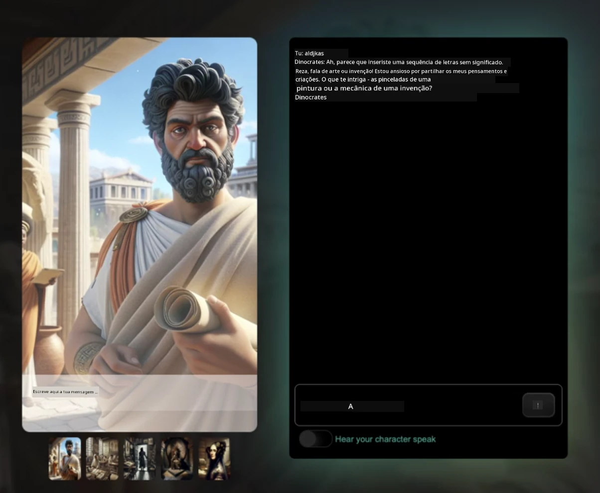
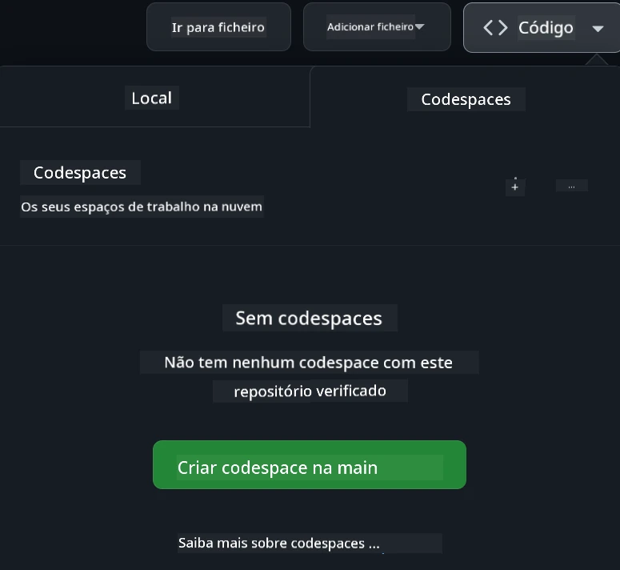

[](https://github.com/microsoft/Web-Dev-For-Beginners/blob/master/LICENSE)
[](https://GitHub.com/microsoft/Web-Dev-For-Beginners/graphs/contributors/)
[](https://GitHub.com/microsoft/Web-Dev-For-Beginners/issues/)
[](https://GitHub.com/microsoft/Web-Dev-For-Beginners/pulls/)
[](http://makeapullrequest.com)

[](https://GitHub.com/microsoft/Web-Dev-For-Beginners/watchers/)
[](https://GitHub.com/microsoft/Web-Dev-For-Beginners/network/)
[](https://GitHub.com/microsoft/Web-Dev-For-Beginners/stargazers/)

[](https://discord.gg/nTYy5BXMWG)

# Desenvolvimento Web para Iniciantes - Um Currículo

Aprenda os fundamentos do desenvolvimento web com o nosso curso abrangente de 12 semanas, por Microsoft Cloud Advocates. Cada uma das 24 aulas aprofunda JavaScript, CSS e HTML através de projetos práticos como terrários, extensões de browser e jogos espaciais. Participe em questionários, discussões e tarefas práticas. Melhore as suas competências e otimize a retenção do conhecimento com a nossa pedagogia eficaz baseada em projetos. Comece a sua jornada de codificação hoje!

Junte-se à Comunidade Azure AI Foundry Discord

[](https://discord.gg/nTYy5BXMWG)

Siga estes passos para começar a usar estes recursos:
1. **Fork do Repositório**: Clique em [](https://GitHub.com/microsoft/Web-Dev-For-Beginners/fork)
2. **Clone do Repositório**:   `git clone https://github.com/microsoft/Web-Dev-For-Beginners.git`
3. [**Junte-se ao Azure AI Foundry Discord e conheça especialistas e outros programadores**](https://discord.com/invite/ByRwuEEgH4)

### 🌐 Suporte Multilíngue

#### Suportado via Ação GitHub (Automatizado & Sempre Atualizado)

<!-- CO-OP TRANSLATOR LANGUAGES TABLE START -->
[Árabe](../ar/README.md) | [Bengali](../bn/README.md) | [Búlgaro](../bg/README.md) | [Birmanês (Myanmar)](../my/README.md) | [Chinês (Simplificado)](../zh-CN/README.md) | [Chinês (Tradicional, Hong Kong)](../zh-HK/README.md) | [Chinês (Tradicional, Macau)](../zh-MO/README.md) | [Chinês (Tradicional, Taiwan)](../zh-TW/README.md) | [Croata](../hr/README.md) | [Checo](../cs/README.md) | [Dinamarquês](../da/README.md) | [Holandês](../nl/README.md) | [Estónio](../et/README.md) | [Finlandês](../fi/README.md) | [Francês](../fr/README.md) | [Alemão](../de/README.md) | [Grego](../el/README.md) | [Hebraico](../he/README.md) | [Hindi](../hi/README.md) | [Húngaro](../hu/README.md) | [Indonésio](../id/README.md) | [Italiano](../it/README.md) | [Japonês](../ja/README.md) | [Kannada](../kn/README.md) | [Coreano](../ko/README.md) | [Lituano](../lt/README.md) | [Malaio](../ms/README.md) | [Malayalam](../ml/README.md) | [Marathi](../mr/README.md) | [Nepali](../ne/README.md) | [Pidgin Nigeriano](../pcm/README.md) | [Norueguês](../no/README.md) | [Persa (Farsi)](../fa/README.md) | [Polaco](../pl/README.md) | [Português (Brasil)](../pt-BR/README.md) | [Português (Portugal)](./README.md) | [Punjabi (Gurmukhi)](../pa/README.md) | [Romeno](../ro/README.md) | [Russo](../ru/README.md) | [Sérvio (Cirílico)](../sr/README.md) | [Eslovaco](../sk/README.md) | [Esloveno](../sl/README.md) | [Espanhol](../es/README.md) | [Suaíli](../sw/README.md) | [Sueco](../sv/README.md) | [Tagalog (Filipino)](../tl/README.md) | [Tamil](../ta/README.md) | [Telugu](../te/README.md) | [Tailandês](../th/README.md) | [Turco](../tr/README.md) | [Ucraniano](../uk/README.md) | [Urdu](../ur/README.md) | [Vietnamita](../vi/README.md)

> **Prefere Clonar Localmente?**

> Este repositório inclui traduções em mais de 50 idiomas, o que aumenta significativamente o tamanho do download. Para clonar sem traduções, use sparse checkout:
> ```bash
> git clone --filter=blob:none --sparse https://github.com/microsoft/Web-Dev-For-Beginners.git
> cd Web-Dev-For-Beginners
> git sparse-checkout set --no-cone '/*' '!translations' '!translated_images'
> ```
> Isto oferece tudo o que precisa para completar o curso com um download muito mais rápido.
<!-- CO-OP TRANSLATOR LANGUAGES TABLE END -->

**Se desejar que línguas adicionais sejam suportadas, estas estão listadas [aqui](https://github.com/Azure/co-op-translator/blob/main/getting_started/supported-languages.md)**

[](https://open.vscode.dev/microsoft/Web-Dev-For-Beginners)

#### 🧑‍🎓 _É estudante?_

Visite a [**página Student Hub**](https://docs.microsoft.com/learn/student-hub/?WT.mc_id=academic-77807-sagibbon) onde encontrará recursos para iniciantes, kits para estudantes e até formas de obter um voucher de certificado gratuito. Esta é a página que deve guardar nos favoritos e consultar de tempos a tempos, pois atualizamos o conteúdo mensalmente.

### 📣 Anúncio - Novos desafios no modo Agente GitHub Copilot para completar!

Novo desafio adicionado, procure por "Desafio Agente GitHub Copilot 🚀" na maioria dos capítulos. Este é um novo desafio para completar usando o GitHub Copilot e o modo Agente. Se nunca usou o modo Agente, ele é capaz não só de gerar texto, mas também de criar e editar ficheiros, executar comandos e muito mais.

### 📣 Anúncio - _Novo Projeto para construir usando IA Generativa_

Novo projeto de Assistente IA adicionado, veja o [projeto](./9-chat-project/README.md)

### 📣 Anúncio - _Novo Currículo_ sobre IA Generativa para JavaScript foi lançado

Não perca o nosso novo currículo de IA Generativa!

Visite [https://aka.ms/genai-js-course](https://aka.ms/genai-js-course) para começar!


- Aulas que cobrem desde os básicos até RAG.
- Interaja com personagens históricos usando GenAI e a nossa app companheira.
- Narrativa divertida e envolvente, fará viagens no tempo!



Cada aula inclui uma tarefa para completar, um teste de conhecimento e um desafio para guiar a aprendizagem de tópicos como:
- Prompting e engenharia de prompts
- Criação de apps de texto e imagem
- Apps de pesquisa

Visite [https://aka.ms/genai-js-course](../../[https:/aka.ms/genai-js-course) para começar!


## 🌱 Introdução

> **Professores**, incluímos algumas sugestões [aqui](for-teachers.md) sobre como usar este currículo. Agradecemos o seu feedback [no nosso fórum de discussão](https://github.com/microsoft/Web-Dev-For-Beginners/discussions/categories/teacher-corner)!

**[Estudantes](https://aka.ms/student-page/?WT.mc_id=academic-77807-sagibbon)**, para cada aula, comece com um questionário pré-lectura, siga lendo o material da aula, complete as várias atividades e verifique a sua compreensão com o questionário pós-lectura.

Para melhorar a sua experiência de aprendizagem, conecte-se com os seus colegas para trabalharem juntos nos projetos! As discussões são incentivadas no nosso [fórum de discussão](https://github.com/microsoft/Web-Dev-For-Beginners/discussions), onde a nossa equipa de moderadores estará disponível para responder às suas perguntas.

Para aprofundar a sua educação, recomendamos explorar [Microsoft Learn](https://learn.microsoft.com/users/wirelesslife/collections/p1ddcy5jwy0jkm?WT.mc_id=academic-77807-sagibbon) para materiais de estudo adicionais.

### 📋 Configurar o seu ambiente

Este currículo tem um ambiente de desenvolvimento pronto a usar! Ao começar, pode optar por executar o currículo num [Codespace](https://github.com/features/codespaces/) (_um ambiente baseado no navegador, sem necessidade de instalações_), ou localmente no seu computador usando um editor de texto como o [Visual Studio Code](https://code.visualstudio.com/?WT.mc_id=academic-77807-sagibbon).

#### Criar o seu repositório
Para guardar o seu trabalho facilmente, é recomendado criar a sua própria cópia deste repositório. Pode fazê-lo clicando no botão **Use this template** no topo da página. Isso criará um novo repositório na sua conta GitHub com uma cópia do currículo.

Siga estes passos:
1. **Fork do Repositório**: Clique no botão "Fork" no canto superior direito desta página.
2. **Clone do Repositório**:   `git clone https://github.com/microsoft/Web-Dev-For-Beginners.git`

#### Executar o currículo num Codespace

Na sua cópia deste repositório que criou, clique no botão **Code** e selecione **Open with Codespaces**. Isso criará um novo Codespace para trabalhar.



#### Executar o currículo localmente no seu computador

Para executar este currículo localmente no seu computador, precisará de um editor de texto, um browser e uma ferramenta de linha de comandos. A nossa primeira aula, [Introdução a Linguagens de Programação e Ferramentas do Ofício](../../1-getting-started-lessons/1-intro-to-programming-languages), guiará através de várias opções para cada uma destas ferramentas para selecionar o que melhor lhe convém.

A nossa recomendação é usar o [Visual Studio Code](https://code.visualstudio.com/?WT.mc_id=academic-77807-sagibbon) como editor, que também tem um [Terminal](https://code.visualstudio.com/docs/terminal/basics/?WT.mc_id=academic-77807-sagibbon) incorporado. Pode fazer download do Visual Studio Code [aqui](https://code.visualstudio.com/?WT.mc_id=academic-77807-sagibbon).


1. Clone o seu repositório para o seu computador. Pode fazê-lo clicando no botão **Code** e copiando a URL:

    [CodeSpace](./images/createcodespace.png)
    Depois, abra o [Terminal](https://code.visualstudio.com/docs/terminal/basics/?WT.mc_id=academic-77807-sagibbon) dentro do [Visual Studio Code](https://code.visualstudio.com/?WT.mc_id=academic-77807-sagibbon) e execute o seguinte comando, substituindo `<your-repository-url>` pelo URL que acabou de copiar:

    ```bash 
    git clone <your-repository-url>
    ```

2. Abra a pasta no Visual Studio Code. Pode fazer isto clicando em **Ficheiro** > **Abrir Pasta** e selecionando a pasta que acabou de clonar.


>  Extensões recomendadas para o Visual Studio Code:
>
> * [Live Server](https://marketplace.visualstudio.com/items?itemName=ritwickdey.LiveServer&WT.mc_id=academic-77807-sagibbon) - para pré-visualizar páginas HTML dentro do Visual Studio Code
> * [Copilot](https://marketplace.visualstudio.com/items?itemName=GitHub.copilot&WT.mc_id=academic-77807-sagibbon) - para ajudar a escrever código mais rapidamente

## 📂 Cada lição inclui:

- sketchnote opcional
- vídeo suplementar opcional
- quiz de aquecimento antes da lição
- lição escrita
- para lições baseadas em projetos, guias passo a passo sobre como construir o projeto
- verificação de conhecimento
- um desafio
- leitura suplementar
- tarefa
- [quiz pós-lição](https://ff-quizzes.netlify.app/web/)

> **Uma nota sobre quizzes**: Todos os quizzes estão contidos na pasta Quiz-app, totalizando 48 quizzes de três perguntas cada. Estão disponíveis [aqui](https://ff-quizzes.netlify.app/web/); a aplicação dos quizzes pode ser executada localmente ou implantada no Azure; siga as instruções na pasta `quiz-app`.

## 🗃️ Lições

|     |                       Nome do Projeto                       |                            Conceitos Ensinados                             | Objetivos de Aprendizagem                                                                                                                  |                                                         Lição Ligada                                                          |         Autor          |
| :-: | :---------------------------------------------------------: | :------------------------------------------------------------------------: | ------------------------------------------------------------------------------------------------------------------------------------------- | :----------------------------------------------------------------------------------------------------------------------------: | :---------------------: |
| 01  |                     A Começar                      |           Introdução à Programação e Ferramentas do Ofício           | Aprender os fundamentos básicos por detrás da maioria das linguagens de programação e sobre software que ajuda os programadores profissionais a fazer o seu trabalho | [Introdução às Linguagens de Programação e Ferramentas do Ofício](./1-getting-started-lessons/1-intro-to-programming-languages/README.md) |         Jasmine         |
| 02  |                     A Começar                      |             Noções básicas de GitHub, incluindo trabalho em equipa             | Como usar o GitHub no seu projeto, como colaborar com outros numa base de código                                                    |                            [Introdução ao GitHub](./1-getting-started-lessons/2-github-basics/README.md)                             |          Floor          |
| 03  |                     A Começar                      |                             Acessibilidade                              | Aprender os fundamentos da acessibilidade web                                                                                               |                       [Fundamentos da Acessibilidade](./1-getting-started-lessons/3-accessibility/README.md)                       |       Christopher       |
| 04  |                        Fundamentos de JS                         |                         Tipos de Dados em JavaScript                          | Os conceitos básicos dos tipos de dados em JavaScript                                                                                                 |                                       [Tipos de Dados](./2-js-basics/1-data-types/README.md)                                        |         Jasmine         |
| 05  |                        Fundamentos de JS                         |                         Funções e Métodos                          | Aprender sobre funções e métodos para gerir o fluxo lógico de uma aplicação                                                             |                              [Funções e Métodos](./2-js-basics/2-functions-methods/README.md)                               | Jasmine e Christopher |
| 06  |                        Fundamentos de JS                         |                        Tomar Decisões com JS                        | Aprender como criar condições no seu código usando métodos de tomada de decisão                                                           |                                 [Tomar Decisões](./2-js-basics/3-making-decisions/README.md)                                  |         Jasmine         |
| 07  |                        Fundamentos de JS                         |                            Arrays e Loops                            | Trabalhar com dados usando arrays e loops em JavaScript                                                                                 |                                   [Arrays e Loops](./2-js-basics/4-arrays-loops/README.md)                                    |         Jasmine         |
| 08  |       [Terrarium](./3-terrarium/solution/README.md)       |                            HTML na Prática                            | Construir o HTML para criar um terrário online, focando na criação de uma disposição/layout                                                         |                                 [Introdução ao HTML](./3-terrarium/1-intro-to-html/README.md)                                 |           Jen           |
| 09  |       [Terrarium](./3-terrarium/solution/README.md)       |                            CSS na Prática                             | Construir o CSS para estilizar o terrário online, focando no básico do CSS incluindo tornar a página responsiva                     |                                  [Introdução ao CSS](./3-terrarium/2-intro-to-css/README.md)                                  |           Jen           |
| 10  |            [Terrarium](./3-terrarium/solution/README.md)            |                 Closures em JavaScript, manipulação do DOM                  | Criar o JavaScript para fazer o terrário funcionar como uma interface drag/drop, focando em closures e manipulação do DOM             |                  [Closures em JavaScript, manipulação do DOM](./3-terrarium/3-intro-to-DOM-and-closures/README.md)                   |           Jen           |
| 11  |          [Typing Game](./4-typing-game/solution/README.md)          |                          Criar um Jogo de Digitação                           | Aprender como usar eventos de teclado para conduzir a lógica da sua aplicação JavaScript                                                          |                                [Programação Orientada a Eventos](./4-typing-game/typing-game/README.md)                                |       Christopher       |
| 12  | [Extensão Verde para Navegadores](./5-browser-extension/solution/README.md) |                         Trabalhar com Navegadores                          | Aprender como os navegadores funcionam, a sua história e como estruturar os primeiros elementos de uma extensão para navegador                               |                               [Sobre Navegadores](./5-browser-extension/1-about-browsers/README.md)                                |           Jen           |
| 13  | [Extensão Verde para Navegadores](./5-browser-extension/solution/README.md) | Construir um formulário, chamar uma API e armazenar variáveis no armazenamento local | Construir os elementos JavaScript da sua extensão de navegador para chamar uma API usando variáveis armazenadas no armazenamento local                      |                [APIs, Formulários e Armazenamento Local](./5-browser-extension/2-forms-browsers-local-storage/README.md)                 |           Jen           |
| 14  | [Extensão Verde para Navegadores](./5-browser-extension/solution/README.md) |          Processos em segundo plano no navegador, desempenho web          | Usar os processos em segundo plano do navegador para gerir o ícone da extensão; aprender sobre desempenho web e algumas otimizações a realizar   |             [Tarefas em Segundo Plano e Desempenho](./5-browser-extension/3-background-tasks-and-performance/README.md)              |           Jen           |
| 15  |           [Jogo Espacial](./6-space-game/solution/README.md)           |             Desenvolvimento de Jogos Mais Avançado com JavaScript              | Aprender sobre Herança usando Classes e Composição, e o padrão Pub/Sub, para preparar-se para criar um jogo              |                      [Introdução ao Desenvolvimento Avançado de Jogos](./6-space-game/1-introduction/README.md)                       |          Chris          |
| 16  |           [Jogo Espacial](./6-space-game/solution/README.md)           |                           Desenhar no canvas                            | Aprender sobre a API Canvas, usada para desenhar elementos num ecrã                                                                       |                                [Desenhar no Canvas](./6-space-game/2-drawing-to-canvas/README.md)                                |          Chris          |
| 17  |           [Jogo Espacial](./6-space-game/solution/README.md)           |                   Mover elementos pelo ecrã                    | Descobrir como os elementos podem ganhar movimento usando coordenadas cartesianas e a API Canvas                                            |                           [Mover Elementos](./6-space-game/3-moving-elements-around/README.md)                           |          Chris          |
| 18  |           [Jogo Espacial](./6-space-game/solution/README.md)           |                          Detetar Colisões                           | Fazer os elementos colidirem e reagirem entre si usando teclas e fornecer uma função de cooldown para garantir o desempenho do jogo    |                              [Detetar Colisões](./6-space-game/4-collision-detection/README.md)                              |          Chris          |
| 19  |           [Jogo Espacial](./6-space-game/solution/README.md)           |                             Manter a pontuação                              | Realizar cálculos matemáticos baseados no estado e desempenho do jogo                                                                |                                    [Manter a Pontuação](./6-space-game/5-keeping-score/README.md)                                    |          Chris          |
| 20  |           [Jogo Espacial](./6-space-game/solution/README.md)           |                     Terminar e reiniciar o jogo                     | Aprender sobre terminar e reiniciar o jogo, incluindo limpar recursos e redefinir valores de variáveis                              |                                [A Condição de Fim](./6-space-game/6-end-condition/README.md)                                 |          Chris          |
| 21  |         [App Bancária](./7-bank-project/solution/README.md)          |                 Templates HTML e Rotas numa App Web                 | Aprender como criar a estrutura arquitetónica de um website multipágina usando rotas e templates HTML                             |                            [Templates HTML e Rotas](./7-bank-project/1-template-route/README.md)                             |          Yohan          |
| 22  |         [App Bancária](./7-bank-project/solution/README.md)          |                  Criar um Formulário de Login e Registo                   | Aprender a criar formulários e gerir rotinas de validação                                                                          |                                           [Formulários](./7-bank-project/2-forms/README.md)                                           |          Yohan          |
| 23  |         [App Bancária](./7-bank-project/solution/README.md)          |                   Métodos para Obter e Usar Dados                   | Como os dados entram e saem da sua aplicação, como buscá-los, guardá-los e descartá-los                                                 |                                            [Dados](./7-bank-project/3-data/README.md)                                            |          Yohan          |
| 24  |         [App Bancária](./7-bank-project/solution/README.md)          |                      Conceitos de Gestão de Estado                      | Aprender como a sua aplicação mantém o estado e como gerí-lo programaticamente                                                              |                                [Gestão de Estado](./7-bank-project/4-state-management/README.md)                                |          Yohan          |
| 25 | [Browser/VScode Code](../../8-code-editor) | Trabalhar com VScode | Aprender a usar um editor de código | [Usar o Editor VScode](./8-code-editor/1-using-a-code-editor/README.md) | Chris |
| 26 | [Assistentes AI](./9-chat-project/README.md) | Trabalhar com AI | Aprender a criar o seu próprio assistente AI | [Projeto de Assistente AI](./9-chat-project/README.md) | Chris |

## 🏫 Pedagogia

O nosso currículo foi concebido com dois princípios pedagógicos chave em mente:
* aprendizagem baseada em projetos
* quizzes frequentes

O programa ensina os fundamentos de JavaScript, HTML e CSS, bem como as ferramentas e técnicas mais recentes usadas pelos desenvolvedores web atuais. Os estudantes terão a oportunidade de desenvolver experiência prática criando um jogo de digitação, um terrário virtual, uma extensão de navegador ecológica, um jogo estilo space-invader e uma aplicação bancária para negócios. No final da série, os estudantes terão adquirido uma compreensão sólida do desenvolvimento web.

> 🎓 Pode fazer as primeiras lições deste currículo como um [Caminho de Aprendizagem](https://docs.microsoft.com/learn/paths/web-development-101/?WT.mc_id=academic-77807-sagibbon) na Microsoft Learn!

Ao assegurar que o conteúdo está alinhado com projetos, o processo torna-se mais envolvente para os estudantes e a retenção de conceitos será aumentada. Também escrevemos várias lições iniciais sobre os fundamentos de JavaScript para introduzir conceitos, combinadas com um vídeo da coleção de tutoriais em vídeo "[Série para Iniciantes em: JavaScript](https://channel9.msdn.com/Series/Beginners-Series-to-JavaScript/?WT.mc_id=academic-77807-sagibbon)", alguns dos cujos autores contribuíram para este currículo.

Além disso, um quiz de baixo risco antes da aula define a intenção do estudante para aprender um tópico, enquanto um segundo quiz após a aula assegura uma maior retenção. Este currículo foi desenhado para ser flexível e divertido, podendo ser seguido na totalidade ou parcialmente. Os projetos começam pequenos e tornam-se progressivamente mais complexos até final do ciclo de 12 semanas.

Embora tenhamos evitado intencionalmente a introdução de frameworks JavaScript para nos concentrarmos nas competências básicas necessárias como desenvolvedor web antes de adotar um framework, um bom próximo passo para completar este currículo seria aprender sobre Node.js através de outra coleção de vídeos: "[Série para Iniciantes em: Node.js](https://channel9.msdn.com/Series/Beginners-Series-to-Nodejs/?WT.mc_id=academic-77807-sagibbon)".

> Visite as nossas orientações do [Código de Conduta](CODE_OF_CONDUCT.md) e [Contribuir](CONTRIBUTING.md). Aguardamos o seu feedback construtivo!

## 🧭 Acesso offline

Pode executar esta documentação offline usando o [Docsify](https://docsify.js.org/#/). Faça um fork deste repositório, [instale o Docsify](https://docsify.js.org/#/quickstart) na sua máquina local e, depois, na pasta raiz deste repositório, digite `docsify serve`. O site será servido na porta 3000 no seu localhost: `localhost:3000`.

## 📘 PDF

Um PDF de todas as lições pode ser encontrado [aqui](https://microsoft.github.io/Web-Dev-For-Beginners/pdf/readme.pdf).


## 🎒 Outros Cursos
A nossa equipa produz outros cursos! Confira:

<!-- CO-OP TRANSLATOR OTHER COURSES START -->
### LangChain
[](https://aka.ms/langchain4j-for-beginners)
[](https://aka.ms/langchainjs-for-beginners?WT.mc_id=m365-94501-dwahlin)

---

### Azure / Edge / MCP / Agents
[](https://github.com/microsoft/AZD-for-beginners?WT.mc_id=academic-105485-koreyst)
[](https://github.com/microsoft/edgeai-for-beginners?WT.mc_id=academic-105485-koreyst)
[](https://github.com/microsoft/mcp-for-beginners?WT.mc_id=academic-105485-koreyst)
[](https://github.com/microsoft/ai-agents-for-beginners?WT.mc_id=academic-105485-koreyst)

---
 
### Série de IA Generativa
[](https://github.com/microsoft/generative-ai-for-beginners?WT.mc_id=academic-105485-koreyst)
[-9333EA?style=for-the-badge&labelColor=E5E7EB&color=9333EA)](https://github.com/microsoft/Generative-AI-for-beginners-dotnet?WT.mc_id=academic-105485-koreyst)
[-C084FC?style=for-the-badge&labelColor=E5E7EB&color=C084FC)](https://github.com/microsoft/generative-ai-for-beginners-java?WT.mc_id=academic-105485-koreyst)
[-E879F9?style=for-the-badge&labelColor=E5E7EB&color=E879F9)](https://github.com/microsoft/generative-ai-with-javascript?WT.mc_id=academic-105485-koreyst)

---
 
### Aprendizagem Fundamental
[](https://aka.ms/ml-beginners?WT.mc_id=academic-105485-koreyst)
[](https://aka.ms/datascience-beginners?WT.mc_id=academic-105485-koreyst)
[](https://aka.ms/ai-beginners?WT.mc_id=academic-105485-koreyst)
[](https://github.com/microsoft/Security-101?WT.mc_id=academic-96948-sayoung)
[](https://aka.ms/webdev-beginners?WT.mc_id=academic-105485-koreyst)
[](https://aka.ms/iot-beginners?WT.mc_id=academic-105485-koreyst)
[](https://github.com/microsoft/xr-development-for-beginners?WT.mc_id=academic-105485-koreyst)

---
 
### Série Copilot
[](https://aka.ms/GitHubCopilotAI?WT.mc_id=academic-105485-koreyst)
[](https://github.com/microsoft/mastering-github-copilot-for-dotnet-csharp-developers?WT.mc_id=academic-105485-koreyst)
[](https://github.com/microsoft/CopilotAdventures?WT.mc_id=academic-105485-koreyst)
<!-- CO-OP TRANSLATOR OTHER COURSES END -->

## Obter Ajuda

Se ficar preso ou tiver alguma pergunta sobre a construção de aplicações de IA. Junte-se a outros alunos e programadores experientes em discussões sobre MCP. É uma comunidade de apoio onde perguntas são bem-vindas e o conhecimento é partilhado livremente.

[](https://discord.gg/nTYy5BXMWG)

Se tiver feedback de produto ou erros durante a construção, visite:

[](https://aka.ms/foundry/forum)

## Licença

Este repositório está licenciado ao abrigo da licença MIT. Veja o ficheiro [LICENSE](../../LICENSE) para mais informações.

---

<!-- CO-OP TRANSLATOR DISCLAIMER START -->
**Aviso Legal**:
Este documento foi traduzido utilizando o serviço de tradução automática [Co-op Translator](https://github.com/Azure/co-op-translator). Embora nos esforcemos por garantir a precisão, esteja ciente de que traduções automáticas podem conter erros ou imprecisões. O documento original no seu idioma nativo deve ser considerado a fonte autoritativa. Para informações críticas, recomenda-se a tradução profissional por um tradutor humano. Não nos responsabilizamos por quaisquer mal-entendidos ou interpretações incorretas decorrentes do uso desta tradução.
<!-- CO-OP TRANSLATOR DISCLAIMER END -->