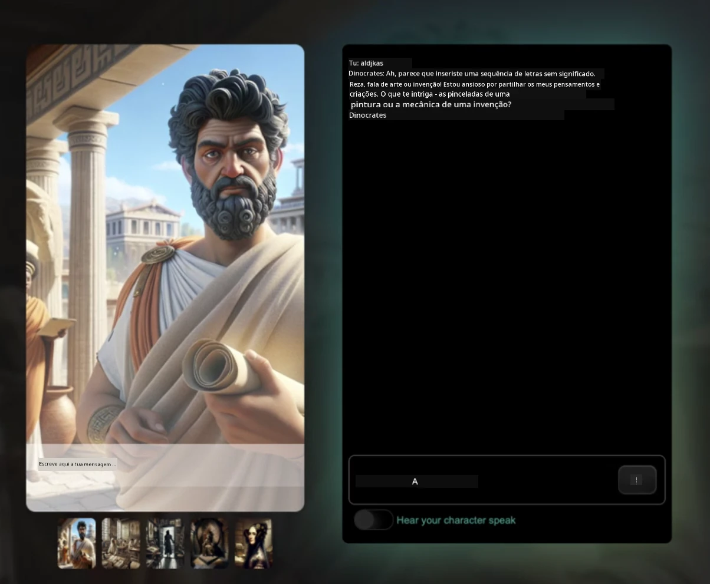
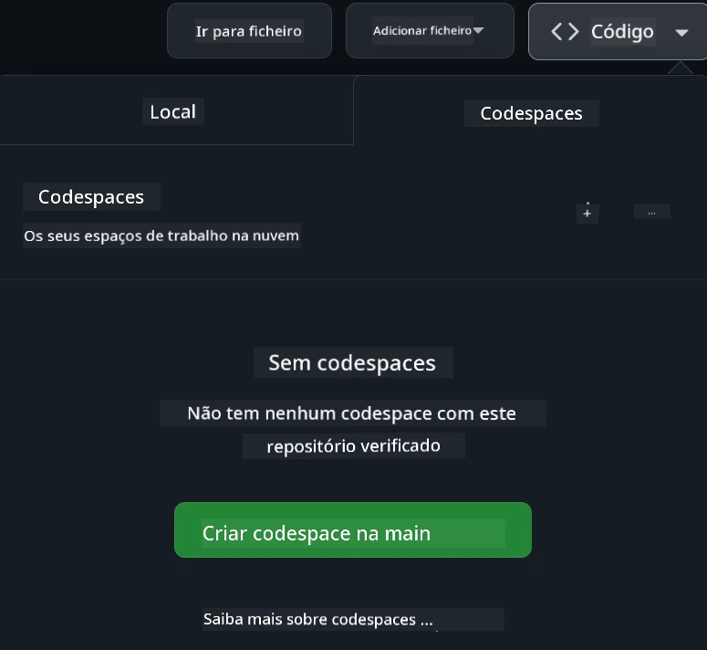

[](https://github.com/microsoft/Web-Dev-For-Beginners/blob/master/LICENSE)
[](https://GitHub.com/microsoft/Web-Dev-For-Beginners/graphs/contributors/)
[](https://GitHub.com/microsoft/Web-Dev-For-Beginners/issues/)
[](https://GitHub.com/microsoft/Web-Dev-For-Beginners/pulls/)
[](http://makeapullrequest.com) 

[](https://GitHub.com/microsoft/Web-Dev-For-Beginners/watchers/)
[](https://GitHub.com/microsoft/Web-Dev-For-Beginners/network/)
[](https://GitHub.com/microsoft/Web-Dev-For-Beginners/stargazers/)

[](https://discord.gg/nTYy5BXMWG)

# Desenvolvimento Web para Iniciantes - Um Currículo

Aprenda os fundamentos do desenvolvimento web com o nosso curso abrangente de 12 semanas pelos Microsoft Cloud Advocates. Cada uma das 24 lições aprofunda-se em JavaScript, CSS e HTML através de projetos práticos como terrários, extensões de navegador e jogos espaciais. Participe em quizzes, discussões e tarefas práticas. Melhore as suas competências e otimize a retenção do conhecimento com a nossa pedagogia eficaz baseada em projetos. Comece a sua jornada de programação hoje!

Junte-se ao Discord do Azure AI Foundry e conheça especialistas e outros desenvolvedores.

[](https://discord.gg/nTYy5BXMWG)

Siga estes passos para começar a usar estes recursos:
1. **Fork o Repositório**: Clique [](https://GitHub.com/microsoft/Web-Dev-For-Beginners/fork)
2. **Clone o Repositório**:   `git clone https://github.com/microsoft/Web-Dev-For-Beginners.git`
3. [**Junte-se ao Discord do Azure AI Foundry e conheça especialistas e outros desenvolvedores**](https://discord.com/invite/ByRwuEEgH4)

### 🌐 Suporte Multilíngue

#### Suportado via GitHub Action (Automatizado e Sempre Atualizado)

<!-- CO-OP TRANSLATOR LANGUAGES TABLE START -->
[Arabic](../ar/README.md) | [Bengali](../bn/README.md) | [Bulgarian](../bg/README.md) | [Burmese (Myanmar)](../my/README.md) | [Chinese (Simplified)](../zh-CN/README.md) | [Chinese (Traditional, Hong Kong)](../zh-HK/README.md) | [Chinese (Traditional, Macau)](../zh-MO/README.md) | [Chinese (Traditional, Taiwan)](../zh-TW/README.md) | [Croatian](../hr/README.md) | [Czech](../cs/README.md) | [Danish](../da/README.md) | [Dutch](../nl/README.md) | [Estonian](../et/README.md) | [Finnish](../fi/README.md) | [French](../fr/README.md) | [German](../de/README.md) | [Greek](../el/README.md) | [Hebrew](../he/README.md) | [Hindi](../hi/README.md) | [Hungarian](../hu/README.md) | [Indonesian](../id/README.md) | [Italian](../it/README.md) | [Japanese](../ja/README.md) | [Kannada](../kn/README.md) | [Khmer](../km/README.md) | [Korean](../ko/README.md) | [Lithuanian](../lt/README.md) | [Malay](../ms/README.md) | [Malayalam](../ml/README.md) | [Marathi](../mr/README.md) | [Nepali](../ne/README.md) | [Nigerian Pidgin](../pcm/README.md) | [Norwegian](../no/README.md) | [Persian (Farsi)](../fa/README.md) | [Polish](../pl/README.md) | [Portuguese (Brazil)](../pt-BR/README.md) | [Portuguese (Portugal)](./README.md) | [Punjabi (Gurmukhi)](../pa/README.md) | [Romanian](../ro/README.md) | [Russian](../ru/README.md) | [Serbian (Cyrillic)](../sr/README.md) | [Slovak](../sk/README.md) | [Slovenian](../sl/README.md) | [Spanish](../es/README.md) | [Swahili](../sw/README.md) | [Swedish](../sv/README.md) | [Tagalog (Filipino)](../tl/README.md) | [Tamil](../ta/README.md) | [Telugu](../te/README.md) | [Thai](../th/README.md) | [Turkish](../tr/README.md) | [Ukrainian](../uk/README.md) | [Urdu](../ur/README.md) | [Vietnamese](../vi/README.md)

> **Prefere Clonar Localmente?**
>
> Este repositório inclui mais de 50 traduções que aumentam significativamente o tamanho do download. Para clonar sem as traduções, utilize o checkout esparso:
>
> **Bash / macOS / Linux:**
> ```bash
> git clone --filter=blob:none --sparse https://github.com/microsoft/Web-Dev-For-Beginners.git
> cd Web-Dev-For-Beginners
> git sparse-checkout set --no-cone '/*' '!translations' '!translated_images'
> ```
>
> **CMD (Windows):**
> ```cmd
> git clone --filter=blob:none --sparse https://github.com/microsoft/Web-Dev-For-Beginners.git
> cd Web-Dev-For-Beginners
> git sparse-checkout set --no-cone "/*" "!translations" "!translated_images"
> ```
>
> Isto dá-lhe tudo o que precisa para completar o curso com um download muito mais rápido.
<!-- CO-OP TRANSLATOR LANGUAGES TABLE END -->

**Se desejar traduções adicionais, as línguas suportadas estão listadas [aqui](https://github.com/Azure/co-op-translator/blob/main/getting_started/supported-languages.md)**

[](https://open.vscode.dev/microsoft/Web-Dev-For-Beginners)

#### 🧑‍🎓 _É estudante?_

Visite a [**página Student Hub**](https://docs.microsoft.com/learn/student-hub/?WT.mc_id=academic-77807-sagibbon) onde encontrará recursos para iniciantes, pacotes para estudantes e até formas de obter um voucher gratuito para certificado. Esta é a página que deve adicionar aos favoritos e consultar regularmente, pois o conteúdo é atualizado mensalmente.

### 📣 Anúncio - Novos desafios do modo GitHub Copilot Agent para completar!

Novo desafio adicionado, procure por "GitHub Copilot Agent Challenge 🚀" na maioria dos capítulos. Este é um novo desafio para completar usando o GitHub Copilot e o modo Agent. Se nunca usou o modo Agent antes, ele é capaz não só de gerar texto, mas também pode criar e editar ficheiros, executar comandos e mais.

### 📣 Anúncio - _Novo Projeto para construir usando IA Generativa_ 

Novo projeto de Assistente AI acabado de adicionar, veja o [projeto](./9-chat-project/README.md)

### 📣 Anúncio - _Novo Currículo_ sobre IA Generativa para JavaScript acaba de ser lançado

Não perca o nosso novo currículo sobre IA Generativa!

Visite [https://aka.ms/genai-js-course](https://aka.ms/genai-js-course) para começar!


- Lições que cobrem desde o básico até RAG.
- Interaja com personagens históricos usando GenAI e a nossa app acompanhante.
- Narrativa divertida e envolvente, irá viajar no tempo!




Cada lição inclui uma tarefa para completar, uma verificação de conhecimento e um desafio para guiá-lo na aprendizagem de tópicos como:
- Prompting e engenharia de prompts
- Geração de aplicações de texto e imagem
- Aplicações de pesquisa

Visite [https://aka.ms/genai-js-course](https://aka.ms/genai-js-course) para começar!


## 🌱 Começar

> **Professores**, incluímos [algumas sugestões](for-teachers.md) sobre como usar este currículo. Apreciaríamos o seu feedback [no nosso fórum de discussão](https://github.com/microsoft/Web-Dev-For-Beginners/discussions/categories/teacher-corner)!

**[Alunos](https://aka.ms/student-page/?WT.mc_id=academic-77807-sagibbon)**, para cada lição, comece com um quiz pré-enciclopédia e continue lendo o material da aula, completando as várias atividades e verificando a sua compreensão com o quiz pós-enciclopédia.

Para melhorar a sua experiência de aprendizagem, conecte-se com os seus colegas para trabalharem juntos nos projetos! São incentivadas discussões no nosso [fórum de discussão](https://github.com/microsoft/Web-Dev-For-Beginners/discussions) onde a nossa equipa de moderadores estará disponível para responder às suas perguntas.

Para aprofundar os seus conhecimentos, recomendamos vivamente explorar [Microsoft Learn](https://learn.microsoft.com/users/wirelesslife/collections/p1ddcy5jwy0jkm?WT.mc_id=academic-77807-sagibbon) para materiais de estudo adicionais.

### 📋 Configurar o seu ambiente

Este currículo tem um ambiente de desenvolvimento pronto a usar! Ao começar, pode optar por executar o currículo num [Codespace](https://github.com/features/codespaces/) (_um ambiente baseado no navegador, sem necessidade de instalações_), ou localmente no seu computador usando um editor de texto como o [Visual Studio Code](https://code.visualstudio.com/?WT.mc_id=academic-77807-sagibbon).

#### Crie o seu repositório
Para guardar facilmente o seu trabalho, é recomendado que crie a sua própria cópia deste repositório. Pode fazer isso clicando no botão **Use this template** no topo da página. Isto criará um novo repositório na sua conta GitHub com uma cópia do currículo.

Siga estes passos:
1. **Fork o Repositório**: Clique no botão "Fork" no canto superior direito desta página.
2. **Clone o Repositório**:   `git clone https://github.com/microsoft/Web-Dev-For-Beginners.git`

#### Executar o currículo num Codespace

Na sua cópia do repositório que criou, clique no botão **Code** e selecione **Open with Codespaces**. Isto vai criar um novo Codespace para si trabalhar.



#### Executar o currículo localmente no seu computador

Para correr este currículo localmente no seu computador, irá necessitar de um editor de texto, um navegador e uma ferramenta de linha de comandos. A nossa primeira lição, [Introdução a Linguagens de Programação e Ferramentas do Ofício](../../1-getting-started-lessons/1-intro-to-programming-languages), irá guiá-lo por várias opções para cada uma destas ferramentas para que possa selecionar aquilo que funciona melhor para si.

A nossa recomendação é usar o [Visual Studio Code](https://code.visualstudio.com/?WT.mc_id=academic-77807-sagibbon) como editor, que também tem um [Terminal](https://code.visualstudio.com/docs/terminal/basics/?WT.mc_id=academic-77807-sagibbon) integrado. Pode descarregar o Visual Studio Code [aqui](https://code.visualstudio.com/?WT.mc_id=academic-77807-sagibbon).
1. Clone o seu repositório para o seu computador. Pode fazer isso clicando no botão **Code** e copiando a URL:

    [CodeSpace](./images/createcodespace.png)

    Depois, abra o [Terminal](https://code.visualstudio.com/docs/terminal/basics/?WT.mc_id=academic-77807-sagibbon) dentro do [Visual Studio Code](https://code.visualstudio.com/?WT.mc_id=academic-77807-sagibbon) e execute o seguinte comando, substituindo `<your-repository-url>` pela URL que acabou de copiar:

    ```bash 
    git clone <your-repository-url>
    ```

2. Abra a pasta no Visual Studio Code. Pode fazer isto clicando em **File** > **Open Folder** e selecionando a pasta que acabou de clonar.


>  Extensões recomendadas para o Visual Studio Code:
>
> * [Live Server](https://marketplace.visualstudio.com/items?itemName=ritwickdey.LiveServer&WT.mc_id=academic-77807-sagibbon) - para pré-visualizar páginas HTML dentro do Visual Studio Code
> * [Copilot](https://marketplace.visualstudio.com/items?itemName=GitHub.copilot&WT.mc_id=academic-77807-sagibbon) - para ajudar a escrever código mais rapidamente

## 📂 Cada aula inclui:

- sketchnote opcional
- vídeo complementar opcional
- quiz de preparação pré-aula
- aula escrita
- para aulas baseadas em projetos, guias passo a passo sobre como construir o projeto
- verificações de conhecimento
- um desafio
- leitura suplementar
- tarefa
- [quiz pós-aula](https://ff-quizzes.netlify.app/web/)

> **Uma nota sobre quizzes**: Todos os quizzes estão contidos na pasta Quiz-app, um total de 48 quizzes com três perguntas cada. Estão disponíveis [aqui](https://ff-quizzes.netlify.app/web/) e a app de quizzes pode ser executada localmente ou implantada no Azure; siga as instruções na pasta `quiz-app`.

## 🗃️ Aulas

|     |                       Nome do Projeto                       |                            Conceitos Ensinados                             | Objetivos de Aprendizagem                                                                                                         |                                                         Aula Associada                                                          |         Autor          |
| :-: | :---------------------------------------------------------: | :------------------------------------------------------------------------: | --------------------------------------------------------------------------------------------------------------------------------- | :------------------------------------------------------------------------------------------------------------------------------: | :---------------------: |
| 01  |                     A Começar                      |           Introdução à Programação e Ferramentas do Ofício           | Conhecer os fundamentos básicos por trás da maioria das linguagens de programação e sobre software que ajuda os programadores profissionais      | [Intro às Linguagens de Programação e Ferramentas do Ofício](./1-getting-started-lessons/1-intro-to-programming-languages/README.md) |         Jasmine         |
| 02  |                     A Começar                      |             Noções básicas de GitHub, incluindo trabalho em equipa             | Como usar GitHub no seu projeto e como colaborar com outros numa base de código                                               |                            [Intro ao GitHub](./1-getting-started-lessons/2-github-basics/README.md)                             |          Floor          |
| 03  |                     A Começar                      |                             Acessibilidade                              | Aprender os conceitos básicos sobre acessibilidade web                                                                                             |                       [Fundamentos de Acessibilidade](./1-getting-started-lessons/3-accessibility/README.md)                       |       Christopher       |
| 04  |                        Noções de JS                         |                         Tipos de Dados em JavaScript                          | Os fundamentos dos tipos de dados em JavaScript                                                                                              |                                       [Tipos de Dados](./2-js-basics/1-data-types/README.md)                                        |         Jasmine         |
| 05  |                        Noções de JS                         |                         Funções e Métodos                          | Aprender sobre funções e métodos para gerir o fluxo lógico de uma aplicação                                                                     |                              [Funções e Métodos](./2-js-basics/2-functions-methods/README.md)                               | Jasmine e Christopher |
| 06  |                        Noções de JS                         |                        Tomar Decisões com JS                        | Aprender a criar condições no seu código usando métodos de tomada de decisão                                                                |                                 [Tomar Decisões](./2-js-basics/3-making-decisions/README.md)                                  |         Jasmine         |
| 07  |                        Noções de JS                         |                            Arrays e Loops                            | Trabalhar com dados usando arrays e ciclos em JavaScript                                                                                 |                                   [Arrays e Loops](./2-js-basics/4-arrays-loops/README.md)                                    |         Jasmine         |
| 08  |       [Terrário](./3-terrarium/solution/README.md)       |                            HTML na Prática                            | Construir o HTML para criar um terrário online, focando na criação do layout                                                           |                                 [Introdução ao HTML](./3-terrarium/1-intro-to-html/README.md)                                 |           Jen           |
| 09  |       [Terrário](./3-terrarium/solution/README.md)       |                            CSS na Prática                             | Construir o CSS para estilizar o terrário online, focando nos conceitos básicos de CSS, incluindo tornar a página responsiva             |                                  [Introdução ao CSS](./3-terrarium/2-intro-to-css/README.md)                                  |           Jen           |
| 10  |            [Terrário](./3-terrarium/solution/README.md)            |                 Fechos em JavaScript, manipulação do DOM                  | Construir o JavaScript para fazer o terrário funcionar como uma interface drag/drop, focando em fechos e manipulação do DOM             |                  [Fechos em JavaScript, manipulação do DOM](./3-terrarium/3-intro-to-DOM-and-closures/README.md)                   |           Jen           |
| 11  |          [Jogo da Digitação](./4-typing-game/solution/README.md)          |                          Construir um Jogo de Digitação                           | Aprender como usar eventos do teclado para conduzir a lógica da sua aplicação JavaScript                                                          |                                [Programação Orientada a Eventos](./4-typing-game/typing-game/README.md)                                |       Christopher       |
| 12  | [Extensão Verde para Navegadores](./5-browser-extension/solution/README.md) |                         Trabalhar com Navegadores                          | Aprender como funcionam os navegadores, sua história e como estruturar os primeiros elementos de uma extensão para navegador                               |                               [Sobre Navegadores](./5-browser-extension/1-about-browsers/README.md)                                |           Jen           |
| 13  | [Extensão Verde para Navegadores](./5-browser-extension/solution/README.md) | Construir um formulário, chamar uma API e armazenar variáveis no armazenamento local | Construir os elementos em JavaScript da sua extensão de navegador para chamar uma API usando variáveis armazenadas localmente                      |                [APIs, Formulários e Armazenamento Local](./5-browser-extension/2-forms-browsers-local-storage/README.md)                 |           Jen           |
| 14  | [Extensão Verde para Navegadores](./5-browser-extension/solution/README.md) |          Processos em segundo plano no navegador, desempenho web          | Usar os processos em segundo plano do navegador para gerir o ícone da extensão; aprender sobre desempenho web e otimizações para melhorar performance   |             [Tarefas em Segundo Plano e Desempenho](./5-browser-extension/3-background-tasks-and-performance/README.md)              |           Jen           |
| 15  |           [Jogo Espacial](./6-space-game/solution/README.md)           |             Desenvolvimento de Jogos Mais Avançado com JavaScript             | Aprender sobre Herança usando Classes e Composição e o padrão Pub/Sub, em preparação para construir um jogo              |                      [Introdução ao Desenvolvimento Avançado de Jogos](./6-space-game/1-introduction/README.md)                       |          Chris          |
| 16  |           [Jogo Espacial](./6-space-game/solution/README.md)           |                           Desenhar no canvas                            | Aprender sobre a API Canvas, usada para desenhar elementos num ecrã                                                                       |                                [Desenhar no Canvas](./6-space-game/2-drawing-to-canvas/README.md)                                |          Chris          |
| 17  |           [Jogo Espacial](./6-space-game/solution/README.md)           |                   Mover elementos pelo ecrã                    | Descobrir como os elementos podem ganhar movimento usando coordenadas cartesianas e a API Canvas                                            |                           [Mover Elementos](./6-space-game/3-moving-elements-around/README.md)                           |          Chris          |
| 18  |           [Jogo Espacial](./6-space-game/solution/README.md)           |                          Detecção de colisões                           | Fazer elementos colidirem e reagirem uns com os outros usando pressões de tecla e fornecer uma função cooldown para garantir o desempenho do jogo    |                              [Detecção de Colisões](./6-space-game/4-collision-detection/README.md)                              |          Chris          |
| 19  |           [Jogo Espacial](./6-space-game/solution/README.md)           |                             Contar pontos                              | Realizar cálculos matemáticos baseados no estado e desempenho do jogo                                                                |                                    [Contagem de Pontos](./6-space-game/5-keeping-score/README.md)                                    |          Chris          |
| 20  |           [Jogo Espacial](./6-space-game/solution/README.md)           |                     Terminar e reiniciar o jogo                     | Aprender sobre terminar e reiniciar o jogo, incluindo limpar recursos e redefinir valores das variáveis                              |                                [Condição de Termino](./6-space-game/6-end-condition/README.md)                                 |          Chris          |
| 21  |         [App Bancário](./7-bank-project/solution/README.md)          |                 Templates HTML e Rotas numa App Web                 | Aprender como criar a estrutura de um website multipágina usando rotas e templates HTML                             |                            [Templates HTML e Rotas](./7-bank-project/1-template-route/README.md)                             |          Yohan          |
| 22  |         [App Bancário](./7-bank-project/solution/README.md)          |                  Construir um Formulário de Login e Registo                   | Aprender sobre construir formulários e gerir rotinas de validação                                                                          |                                           [Formulários](./7-bank-project/2-forms/README.md)                                           |          Yohan          |
| 23  |         [App Bancário](./7-bank-project/solution/README.md)          |                   Métodos para Obter e Usar Dados                   | Como os dados entram e saem da sua aplicação, como obtê-los, armazená-los e descartá-los                                                 |                                            [Dados](./7-bank-project/3-data/README.md)                                            |          Yohan          |
| 24  |         [App Bancário](./7-bank-project/solution/README.md)          |                      Conceitos de Gestão de Estado                      | Aprender como a sua aplicação retém estado e como geri-lo programaticamente                                                              |                                [Gestão de Estado](./7-bank-project/4-state-management/README.md)                                |          Yohan          |
| 25 | [Código Browser/VScode](../../8-code-editor) | Trabalhar com VScode | Aprender a usar um editor de código| [Usar o Editor de Código VScode](./8-code-editor/1-using-a-code-editor/README.md) | Chris |
| 26 | [Assistentes AI](./9-chat-project/README.md) | Trabalhar com AI | Aprender a construir o seu próprio assistente AI | [Projeto Assistente AI](./9-chat-project/README.md) | Chris |

## 🏫 Pedagogia

O nosso currículo foi desenhado com dois princípios pedagógicos fundamentais em mente:
* aprendizagem baseada em projetos
* quizzes frequentes

O programa ensina os fundamentos de JavaScript, HTML e CSS, bem como as ferramentas e técnicas mais recentes usadas pelos desenvolvedores web atuais. Os alunos terão a oportunidade de ganhar experiência prática construindo um jogo de digitação, um terrário virtual, uma extensão de navegador ecológica, um jogo ao estilo invasores do espaço e uma aplicação bancária para empresas. No final da série, os alunos terão adquirido um sólido entendimento do desenvolvimento web.

> 🎓 Pode fazer as primeiras aulas deste currículo como um [Caminho de Aprendizagem](https://docs.microsoft.com/learn/paths/web-development-101/?WT.mc_id=academic-77807-sagibbon) na Microsoft Learn!

Ao garantir que o conteúdo está alinhado com projetos, o processo torna-se mais envolvente para os alunos e a retenção de conceitos será aumentada. Também escrevemos várias aulas introdutórias em JavaScript para introduzir conceitos, acompanhadas de um vídeo da coleção de tutoriais em vídeo "[Série para Iniciantes em: JavaScript](https://channel9.msdn.com/Series/Beginners-Series-to-JavaScript/?WT.mc_id=academic-77807-sagibbon)", alguns dos quais os seus autores contribuíram para este currículo.

Além disso, um quiz de baixo risco antes da aula define a intenção do aluno em aprender um tópico, enquanto um segundo quiz após a aula assegura maior retenção. Este currículo foi desenhado para ser flexível e divertido e pode ser feito total ou parcialmente. Os projetos começam pequenos e tornam-se progressivamente mais complexos até ao fim do ciclo de 12 semanas.

Embora tenhamos evitado intencionalmente introduzir frameworks JavaScript para nos concentrar nas habilidades básicas necessárias como desenvolvedor web antes de adotar um framework, o próximo passo para completar este currículo seria aprender sobre Node.js através de outra coleção de vídeos: "[Série para Iniciantes em: Node.js](https://channel9.msdn.com/Series/Beginners-Series-to-Nodejs/?WT.mc_id=academic-77807-sagibbon)".

> Visite as nossas diretrizes de [Código de Conduta](CODE_OF_CONDUCT.md) e [Contribuições](CONTRIBUTING.md). Agradecemos o seu feedback construtivo!


## 🧭 Acesso Offline

Pode executar esta documentação offline usando [Docsify](https://docsify.js.org/#/). Faça um fork deste repositório, [instale o Docsify](https://docsify.js.org/#/quickstart) na sua máquina local e depois, na pasta raiz deste repositório, digite `docsify serve`. O website será servido na porta 3000 no seu localhost: `localhost:3000`.

## 📘 PDF
Um PDF de todas as lições pode ser encontrado [aqui](https://microsoft.github.io/Web-Dev-For-Beginners/pdf/readme.pdf).


## 🎒 Outros Cursos

A nossa equipa produz outros cursos! Veja:

<!-- CO-OP TRANSLATOR OTHER COURSES START -->
### LangChain
[](https://aka.ms/langchain4j-for-beginners)
[](https://aka.ms/langchainjs-for-beginners?WT.mc_id=m365-94501-dwahlin)
[](https://github.com/microsoft/langchain-for-beginners?WT.mc_id=m365-94501-dwahlin)
---

### Azure / Edge / MCP / Agentes
[](https://github.com/microsoft/AZD-for-beginners?WT.mc_id=academic-105485-koreyst)
[](https://github.com/microsoft/edgeai-for-beginners?WT.mc_id=academic-105485-koreyst)
[](https://github.com/microsoft/mcp-for-beginners?WT.mc_id=academic-105485-koreyst)
[](https://github.com/microsoft/ai-agents-for-beginners?WT.mc_id=academic-105485-koreyst)

---
 
### Série de IA Generativa
[](https://github.com/microsoft/generative-ai-for-beginners?WT.mc_id=academic-105485-koreyst)
[-9333EA?style=for-the-badge&labelColor=E5E7EB&color=9333EA)](https://github.com/microsoft/Generative-AI-for-beginners-dotnet?WT.mc_id=academic-105485-koreyst)
[-C084FC?style=for-the-badge&labelColor=E5E7EB&color=C084FC)](https://github.com/microsoft/generative-ai-for-beginners-java?WT.mc_id=academic-105485-koreyst)
[-E879F9?style=for-the-badge&labelColor=E5E7EB&color=E879F9)](https://github.com/microsoft/generative-ai-with-javascript?WT.mc_id=academic-105485-koreyst)

---
 
### Aprendizagem Central
[](https://aka.ms/ml-beginners?WT.mc_id=academic-105485-koreyst)
[](https://aka.ms/datascience-beginners?WT.mc_id=academic-105485-koreyst)
[](https://aka.ms/ai-beginners?WT.mc_id=academic-105485-koreyst)
[](https://github.com/microsoft/Security-101?WT.mc_id=academic-96948-sayoung)
[](https://aka.ms/webdev-beginners?WT.mc_id=academic-105485-koreyst)
[](https://aka.ms/iot-beginners?WT.mc_id=academic-105485-koreyst)
[](https://github.com/microsoft/xr-development-for-beginners?WT.mc_id=academic-105485-koreyst)

---
 
### Série Copilot
[](https://aka.ms/GitHubCopilotAI?WT.mc_id=academic-105485-koreyst)
[](https://github.com/microsoft/mastering-github-copilot-for-dotnet-csharp-developers?WT.mc_id=academic-105485-koreyst)
[](https://github.com/microsoft/CopilotAdventures?WT.mc_id=academic-105485-koreyst)
<!-- CO-OP TRANSLATOR OTHER COURSES END -->

## Obter Ajuda

Se ficar preso ou tiver alguma dúvida sobre como criar aplicações de IA. Junte-se a outros aprendizes e programadores experientes em discussões sobre o MCP. É uma comunidade solidária onde as perguntas são bem-vindas e o conhecimento é partilhado livremente.

[](https://discord.gg/nTYy5BXMWG)

Se tiver feedback sobre o produto ou encontrar erros durante o desenvolvimento, visite:

[](https://aka.ms/foundry/forum)

## Licença

Este repositório está licenciado sob a licença MIT. Veja o ficheiro [LICENSE](../../LICENSE) para mais informações.

---

<!-- CO-OP TRANSLATOR DISCLAIMER START -->
**Aviso Legal**:  
Este documento foi traduzido utilizando o serviço de tradução automática [Co-op Translator](https://github.com/Azure/co-op-translator). Embora nos esforcemos pela precisão, por favor tenha em atenção que traduções automáticas podem conter erros ou imprecisões. O documento original na sua língua nativa deve ser considerado a fonte autoritativa. Para informações críticas, recomenda-se a tradução profissional por humanos. Não nos responsabilizamos por quaisquer mal-entendidos ou interpretações incorretas decorrentes da utilização desta tradução.
<!-- CO-OP TRANSLATOR DISCLAIMER END -->