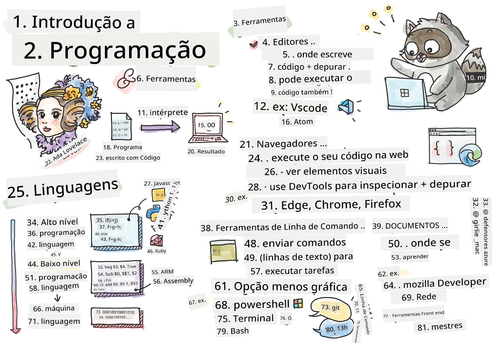
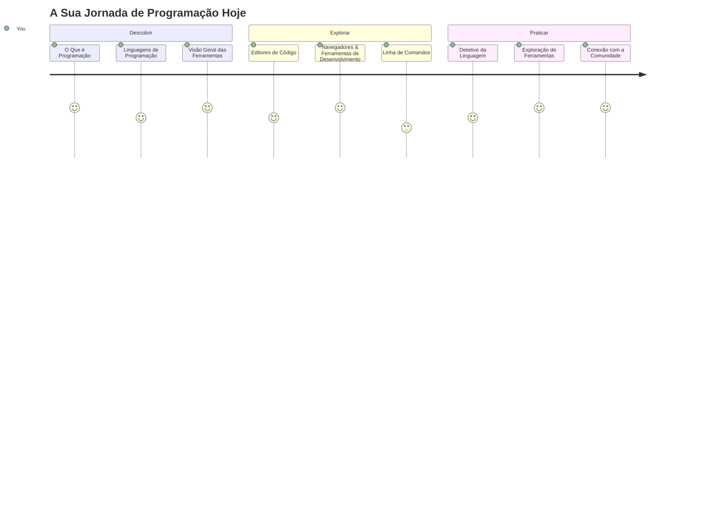
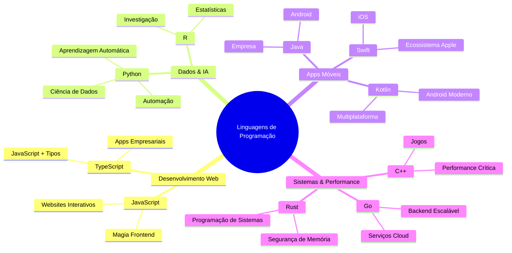
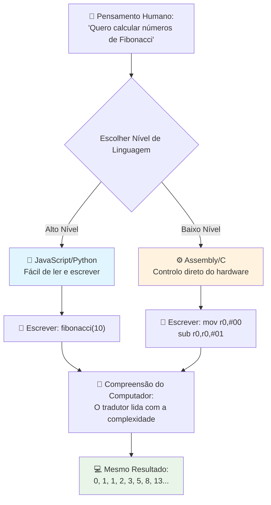
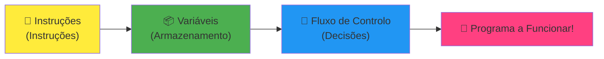
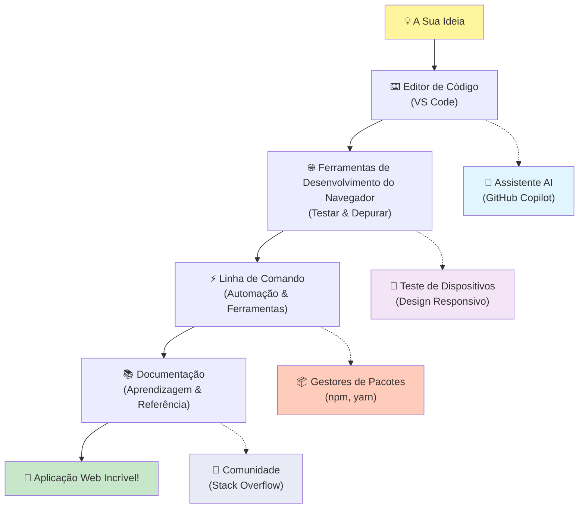
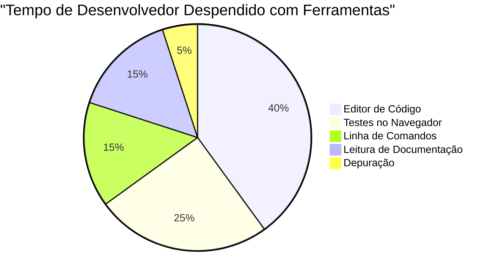
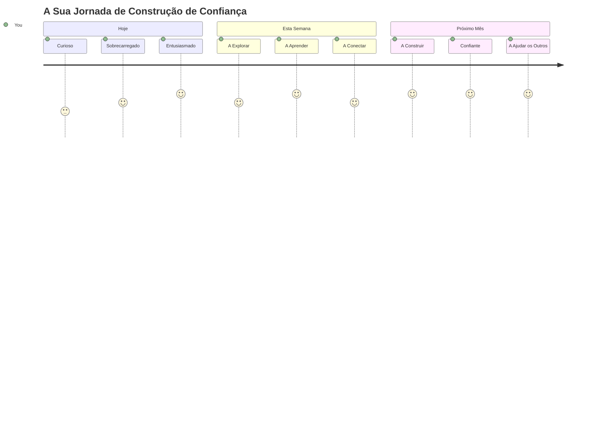

<!--
CO_OP_TRANSLATOR_METADATA:
{
  "original_hash": "d45ddcc54eb9232a76d08328b09d792e",
  "translation_date": "2026-01-06T18:31:44+00:00",
  "source_file": "1-getting-started-lessons/1-intro-to-programming-languages/README.md",
  "language_code": "pt"
}
-->
# Introdução às Linguagens de Programação e Ferramentas Modernas para Desenvolvedores

Olá, futuro programador! 👋 Posso contar-te algo que ainda me arrepia todos os dias? Estás prestes a descobrir que programar não é só sobre computadores – é sobre ter superpoderes reais para dar vida às tuas ideias mais malucas!

Sabes aquele momento em que estás a usar a tua app favorita e tudo se encaixa na perfeição? Quando tocas num botão e acontece algo absolutamente mágico que te faz pensar "uau, como é que fizeram ISTO?" Bem, alguém exatamente como tu – provavelmente a trabalhar no seu café preferido às 2 da manhã com o seu terceiro espresso – escreveu o código que criou essa magia. E aqui está algo que vai arrebatar-te a mente: no final desta lição, não só vais entender como o fizeram, mas vais estar ansioso para tentar por ti próprio!

Olha, eu entendo perfeitamente se a programação te parecer intimidante neste momento. Quando comecei, pensava honestamente que precisavas de ser um génio da matemática ou de programar desde os cinco anos. Mas aqui está o que mudou completamente a minha perspetiva: programar é exatamente como aprender a ter conversas numa nova língua. Começas com "olá" e "obrigado," depois passas a pedir café, e antes que percebas, estás a discutir filosofia profundamente! Só que neste caso, estás a conversar com computadores, e honestamente? São os parceiros de conversa mais pacientes que alguma vez vais ter – nunca julgam os teus erros e estão sempre entusiasmados para tentar de novo!

Hoje, vamos explorar as ferramentas incríveis que tornam o desenvolvimento web moderno não só possível, mas mesmo viciante. Estou a falar dos mesmos editores, browsers e fluxos de trabalho que os programadores da Netflix, Spotify e do teu estúdio indie favorito usam todos os dias. E aqui está a parte que te vai fazer dançar de alegria: a maioria destas ferramentas profissionais e padrão na indústria é completamente gratuita!


> Sketchnote por [Tomomi Imura](https://twitter.com/girlie_mac)


## Vamos Ver O Que Já Sabes!

Antes de começarmos com a parte divertida, estou curioso – o que já sabes sobre este mundo da programação? E olha, se estás a olhar para estas perguntas a pensar "Eu literalmente não faço a mínima ideia sobre isto," isso não é só aceitável, é perfeito! Isso significa que estás exatamente no lugar certo. Pensa neste quiz como um alongamento antes de um treino – estamos só a aquecer esses músculos cerebrais!

[Faz o quiz pré-lição](https://forms.office.com/r/dru4TE0U9n?origin=lprLink)

## A Aventura Que Vamos Fazer Juntos

Ok, estou genuinamente empolgado com o que vamos explorar hoje! A sério, gostava mesmo de ver a tua cara quando alguns destes conceitos fizerem sentido. Aqui está a incrível viagem que vamos fazer juntos:

- **O que é realmente programação (e porque é a coisa mais fixe de sempre!)** – Vamos descobrir como o código é literalmente a magia invisível que alimenta tudo à tua volta, desde o alarme que de algum modo sabe que é segunda-feira de manhã até ao algoritmo que cria as recomendações perfeitas da Netflix
- **Linguagens de programação e as suas personalidades incríveis** – Imagina entrar numa festa onde cada pessoa tem superpoderes completamente diferentes e formas distintas de resolver problemas. É assim o mundo das linguagens de programação, e vais adorar conhecê-las!
- **Os blocos fundamentais que fazem a magia digital acontecer** – Pensa nisto como o conjunto de peças LEGO criativas supremo. Quando perceberes como estas peças se encaixam, vais perceber que podes literalmente construir tudo o que a tua imaginação sonhar
- **Ferramentas profissionais que te vão fazer sentir como se te tivessem dado a varinha de um feiticeiro** – Não estou a exagerar – estas ferramentas vão genuinamente fazer-te sentir que tens superpoderes, e a melhor parte? São as mesmas que os profissionais usam!

> 💡 **Eis a verdade**: Não tentes memorizar tudo hoje! Agora, só quero que sintas essa faísca de entusiasmo sobre o que é possível. Os detalhes vão ficar naturalmente enquanto praticamos juntos – é assim que a aprendizagem real acontece!

> Podes fazer esta lição no [Microsoft Learn](https://docs.microsoft.com/learn/modules/web-development-101/introduction-programming/?WT.mc_id=academic-77807-sagibbon)!

## Então, O Que É Exatamente *Programação*?

Ok, vamos abordar a pergunta milionária: o que é mesmo programação?

Vou contar-te uma história que mudou completamente a minha forma de pensar sobre isto. Na semana passada, estava a tentar explicar à minha mãe como usar o nosso novo comando de TV inteligente. Apanhei-me a dizer coisas como "Carrega no botão vermelho, mas não no botão vermelho grande, no botão vermelho pequeno à esquerda... não, no teu outro lado esquerdo... está bem, agora segura por dois segundos, não um, não três..." Soa-te familiar? 😅

Isso é programação! É a arte de dar instruções incrivelmente detalhadas, passo a passo, a algo que é muito poderoso mas que precisa que tudo seja explicado perfeitamente. Só que em vez de explicares à tua mãe (que pode perguntar "qual botão vermelho?!"), estás a explicar a um computador (que faz exatamente o que dizes, mesmo que o que disseste não seja exatamente o que querias dizer).

Aqui está o que me deixou de boca aberta quando aprendi isto pela primeira vez: os computadores são na verdade bastante simples no seu núcleo. Eles literalmente só entendem duas coisas – 1 e 0, que é basicamente "sim" e "não" ou "ligado" e "desligado." É tudo! Mas aqui está onde fica mágico – não precisamos de falar em 1s e 0s como se estivéssemos no The Matrix. É aqui que as **linguagens de programação** entram em ação. São como ter o melhor tradutor do mundo que pega nos teus pensamentos perfeitamente normais de humano e os converte para linguagem de computador.

E aqui está algo que ainda me arrepia todas as manhãs quando acordo: literalmente *tudo* o que há de digital na tua vida começou com alguém exatamente como tu, provavelmente sentado de pijama com uma chávena de café, a escrever código no portátil. Aquele filtro do Instagram que te deixa impecável? Alguém o programou. A recomendação que te levou à tua nova música favorita? Um programador criou esse algoritmo. A app que te ajuda a dividir as contas do jantar com amigos? Sim, alguém pensou "isto é chato, aposto que posso resolver isto" e depois... resolveu!

Quando aprendes a programar, não estás só a adquirir uma nova competência – estás a tornar-te parte desta comunidade incrível de solucionadores de problemas que passam os dias a pensar: "E se eu pudesse criar algo que torna o dia de alguém um bocadinho melhor?" Honestamente, existe coisa mais fixe do que isso?

✅ **Caça ao Facto Divertido**: Aqui está algo super giro para procurares quando tiveres um momento livre – quem achas que foi o primeiro programador do mundo? Dou-te uma pista: talvez não seja quem esperas! A história desta pessoa é absolutamente fascinante e mostra que a programação sempre foi sobre resolução criativa de problemas e pensar fora da caixa.

### 🧠 **Hora da Reflexão: Como Te Sentes?**

**Tira um momento para refletir:**
- Faz sentido para ti agora a ideia de "dar instruções aos computadores"?
- Consegues pensar numa tarefa diária que gostarias de automatizar com programação?
- Que perguntas é que te estão a surgir sobre toda esta coisa da programação?

> **Lembra-te**: É totalmente normal que alguns conceitos pareçam confusos agora. Aprender a programar é como aprender uma nova língua – o teu cérebro precisa de tempo para criar essas vias neurais. Estás a fazer um ótimo trabalho!

## Linguagens de Programação São Como Diferentes Sabores de Magia

Ok, isto vaia soar estranho, mas fica comigo – as linguagens de programação são muito parecidas com diferentes tipos de música. Pensa nisso: tens o jazz, que é suave e improvisado, o rock que é poderoso e direto, a música clássica que é elegante e estruturada, e o hip-hop que é criativo e expressivo. Cada estilo tem a sua vibe, a sua comunidade de fãs apaixonados, e cada um é perfeito para diferentes estados de espírito e ocasiões.

As linguagens de programação funcionam exatamente da mesma maneira! Não usarias a mesma linguagem para criar um jogo móvel divertido que usarias para processar enormes quantidades de dados climáticos, tal como não ias ouvir death metal numa aula de yoga (bem, na maioria das aulas de yoga pelo menos! 😄).

Mas aqui está o que me surpreende sempre que penso nisso: estas linguagens são como ter o intérprete mais paciente e brilhante do mundo sentado mesmo ao teu lado. Podes expressar as tuas ideias de uma forma que faz sentido ao teu cérebro humano, e eles tratam de todo o trabalho incrivelmente complexo de traduzir isso para os 1s e 0s que os computadores realmente falam. É como ter um amigo que é perfeitamente fluente em "criatividade humana" e "lógica computacional" – e que nunca se cansa, nunca precisa de pausas para café, e nunca te julga por repetires a mesma pergunta!

### Linguagens de Programação Populares e os Seus Usos


| Linguagem | Melhor Para | Por que É Popular |
|-----------|-------------|-------------------|
| **JavaScript** | Desenvolvimento web, interfaces de utilizador | Corre em navegadores e alimenta sites interativos |
| **Python** | Ciência de dados, automação, IA | Fácil de ler e aprender, bibliotecas poderosas |
| **Java** | Aplicações empresariais, apps Android | Independente de plataforma, robusta para sistemas grandes |
| **C#** | Aplicações Windows, desenvolvimento de jogos | Forte suporte no ecossistema Microsoft |
| **Go** | Serviços de cloud, sistemas backend | Rápida, simples, desenhada para computação moderna |

### Linguagens de Alto Nível vs. Baixo Nível

Ok, este foi honestamente o conceito que me partiu o cérebro quando comecei, por isso vou partilhar a analogia que finalmente me fez perceber – e espero que te ajude também!

Imagina que estás a visitar um país onde não falas a língua e precisas desesperadamente de encontrar a casa de banho mais próxima (todos já passámos por isso, certo? 😅):

- **Programação de baixo nível** é como aprender tão bem o dialeto local que consegues conversar com a avó a vender fruta na esquina usando referências culturais, gírias locais e piadas internas que só quem cresceu ali entende. Muito impressionante e incrivelmente eficiente... se por acaso fores fluente! Mas bastante assustador quando só queres achar a casa de banho.

- **Programação de alto nível** é como ter aquele amigo local incrível que simplesmente te entende. Podes dizer "Preciso mesmo de encontrar uma casa de banho" em inglês simples, e ele trata de toda a tradução cultural e dá-te direções que fazem perfeito sentido para o teu cérebro de forasteiro.

Em termos de programação:
- **Linguagens de baixo nível** (como Assembly ou C) permitem-te ter conversas extremamente detalhadas com o hardware real do computador, mas tens que pensar como uma máquina, o que é... bem, digamos que é uma mudança mental grande!
- **Linguagens de alto nível** (como JavaScript, Python ou C#) deixam-te pensar como humano enquanto elas se responsabilizam por toda a linguagem da máquina nos bastidores. Além disso, têm comunidades incrivelmente acolhedoras cheias de pessoas que se lembram como é ser novato e querem genuinamente ajudar!

Adivinha com quais vou sugerir que comeces? 😉 As linguagens de alto nível são como rodinhas de treino que nem queres tirar porque tornam toda a experiência tão mais agradável!


### Deixa-me Mostrar-te Por Que as Linguagens de Alto Nível São Tão Mais Amigáveis

Ok, vou mostrar-te algo que demonstra na perfeição por que me apaixonei pelas linguagens de alto nível, mas primeiro – preciso que me prometas uma coisa. Quando vires esse primeiro exemplo de código, não entres em pânico! É suposto parecer intimidante. Esse é exatamente o ponto que quero mostrar!

Vamos ver a mesma tarefa escrita em dois estilos completamente diferentes. Ambos criam o que se chama a sequência de Fibonacci – é um padrão matemático lindo onde cada número é a soma dos dois anteriores: 0, 1, 1, 2, 3, 5, 8, 13... (Curiosidade: vais encontrar este padrão literalmente em toda a natureza – nos espirais das sementes de girassol, nos padrões dos pinheiros, até na formação das galáxias!)

Pronto para ver a diferença? Vamos lá!

**Linguagem de alto nível (JavaScript) – Amigável para humanos:**

```javascript
// Passo 1: Configuração básica de Fibonacci
const fibonacciCount = 10;
let current = 0;
let next = 1;

console.log('Fibonacci sequence:');
```

**Isto é o que este código faz:**
- **Declara** uma constante para especificar quantos números Fibonacci queremos gerar
- **Inicializa** duas variáveis para controlar o número atual e o próximo na sequência
- **Define** os valores iniciais (0 e 1) que definem o padrão Fibonacci
- **Mostra** uma mensagem de cabeçalho para identificar o output

```javascript
// Passo 2: Gerar a sequência com um ciclo
for (let i = 0; i < fibonacciCount; i++) {
  console.log(`Position ${i + 1}: ${current}`);
  
  // Calcular o próximo número na sequência
  const sum = current + next;
  current = next;
  next = sum;
}
```

**Analisando o que acontece aqui:**
- **Percorre** cada posição na nossa sequência usando um ciclo `for`
- **Exibe** cada número com a sua posição usando formatação de template literals
- **Calcula** o próximo número Fibonacci somando os valores atual e próximo
- **Atualiza** as variáveis para passar à próxima iteração

```javascript
// Passo 3: Abordagem funcional moderna
const generateFibonacci = (count) => {
  const sequence = [0, 1];
  
  for (let i = 2; i < count; i++) {
    sequence[i] = sequence[i - 1] + sequence[i - 2];
  }
  
  return sequence;
};

// Exemplo de utilização
const fibSequence = generateFibonacci(10);
console.log(fibSequence);
```

**No exemplo acima, nós:**
- **Criámos** uma função reutilizável usando sintaxe moderna de arrow function
- **Construímos** um array para guardar a sequência completa em vez de mostrar número a número
- **Usámos** indexação de array para calcular cada novo número a partir dos anteriores
- **Devolvemos** a sequência completa para uso flexível noutras partes do programa

**Linguagem de baixo nível (ARM Assembly) – Amigável para computadores:**

```assembly
 area ascen,code,readonly
 entry
 code32
 adr r0,thumb+1
 bx r0
 code16
thumb
 mov r0,#00
 sub r0,r0,#01
 mov r1,#01
 mov r4,#10
 ldr r2,=0x40000000
back add r0,r1
 str r0,[r2]
 add r2,#04
 mov r3,r0
 mov r0,r1
 mov r1,r3
 sub r4,#01
 cmp r4,#00
 bne back
 end
```

Repara como a versão em JavaScript lê quase como instruções em inglês, enquanto a versão em Assembly usa comandos crípticos que controlam diretamente o processador do computador. Ambas fazem exatamente a mesma tarefa, mas a linguagem de alto nível é muito mais fácil para os humanos compreenderem, escreverem e manterem.

**Diferenças chave que vais notar:**
- **Legibilidade**: JavaScript usa nomes descritivos como `fibonacciCount` enquanto Assembly usa rótulos enigmáticos como `r0`, `r1`
- **Comentários**: Linguagens de alto nível incentivam comentários explicativos que tornam o código autoexplicativo  
- **Estrutura**: O fluxo lógico do JavaScript corresponde a como os humanos pensam sobre problemas passo a passo  
- **Manutenção**: Atualizar a versão JavaScript para diferentes requisitos é simples e claro  

✅ **Sobre a sequência de Fibonacci**: Este padrão numérico absolutamente lindo (onde cada número é a soma dos dois anteriores: 0, 1, 1, 2, 3, 5, 8...) aparece literalmente *por toda a parte* na natureza! Vai encontrá-lo nas espirais das flores de girassol, nos padrões dos pinhões, na forma como as conchas dos náutilos se curvam, e até no crescimento dos ramos das árvores. É impressionante como a matemática e o código podem ajudar-nos a entender e recriar os padrões que a natureza usa para criar beleza!  


## Os Blocos de Construção que Fazem a Magia Acontecer

Ok, agora que viu como as linguagens de programação funcionam na prática, vamos descrever as peças fundamentais que compõem literalmente todos os programas já escritos. Pense neles como os ingredientes essenciais na sua receita favorita – uma vez que entenda o que cada um faz, será capaz de ler e escrever código em praticamente qualquer linguagem!

Isto é como aprender a gramática da programação. Lembra-se de quando estava na escola e aprendeu sobre substantivos, verbos e como construir frases? A programação tem a sua própria versão de gramática, e honestamente, é muito mais lógica e permissiva do que a gramática do inglês alguma vez foi! 😄

### Instruções: Os Passos a Passo

Vamos começar com **instruções** – são como frases individuais numa conversa com o seu computador. Cada instrução diz ao computador para fazer uma coisa específica, como dar direções: "Vira à esquerda aqui", "Para no semáforo vermelho", "Estaciona naquele lugar".

O que adoro nas instruções é a forma como normalmente são legíveis. Veja isto:

```javascript
// Declarações básicas que executam ações únicas
const userName = "Alex";                    
console.log("Hello, world!");              
const sum = 5 + 3;                         
```

**Isto é o que este código faz:**  
- **Declara** uma variável constante para guardar o nome do utilizador  
- **Exibe** uma mensagem de saudação na consola de saída  
- **Calcula** e guarda o resultado de uma operação matemática  

```javascript
// Declarações que interagem com páginas web
document.title = "My Awesome Website";      
document.body.style.backgroundColor = "lightblue";
```

**Passo a passo, isto é o que está a acontecer:**  
- **Modifica** o título da página que aparece no separador do navegador  
- **Muda** a cor de fundo de todo o corpo da página  

### Variáveis: O Sistema de Memória do Seu Programa

Ok, **variáveis** são, honestamente, um dos meus conceitos favoritos para ensinar porque são tão parecidas com coisas que já usa todos os dias!

Pense na sua lista de contactos do telefone por um momento. Não decoras o número de telefone de toda a gente – em vez disso, guardas "Mãe", "Melhor Amiga" ou "Pizzaria que entrega até às 2 da manhã" e deixas o telefone lembrar-se dos números reais. As variáveis funcionam exatamente da mesma forma! São como recipientes com etiquetas onde o seu programa pode guardar informação e recuperá-la mais tarde usando um nome que realmente faça sentido.

Aqui está o que é realmente fixe: as variáveis podem mudar enquanto o seu programa corre (daí o nome "variável" – percebeu a brincadeira?). Tal como pode atualizar o contacto da pizzaria quando descobre um sítio ainda melhor, as variáveis podem ser atualizadas à medida que o seu programa aprende nova informação ou conforme as situações mudam!

Deixe-me mostrar como isto pode ser maravilhosamente simples:

```javascript
// Passo 1: Criar variáveis básicas
const siteName = "Weather Dashboard";        
let currentWeather = "sunny";               
let temperature = 75;                       
let isRaining = false;                      
```

**Compreender estes conceitos:**  
- **Guardar** valores imutáveis em variáveis `const` (como o nome do site)  
- **Usar** `let` para valores que podem mudar ao longo do programa  
- **Atribuir** diferentes tipos de dados: strings (texto), números e booleanos (verdadeiro/falso)  
- **Escolher** nomes descritivos que expliquem o que cada variável contém  

```javascript
// Passo 2: Trabalhar com objetos para agrupar dados relacionados
const weatherData = {                       
  location: "San Francisco",
  humidity: 65,
  windSpeed: 12
};
```

**No exemplo acima, nós:**  
- **Criámos** um objeto para agrupar informações meteorológicas relacionadas  
- **Organizámos** múltiplos dados sob um único nome de variável  
- **Usámos** pares chave-valor para etiquetar claramente cada dado  

```javascript
// Passo 3: Usar e atualizar variáveis
console.log(`${siteName}: Today is ${currentWeather} and ${temperature}°F`);
console.log(`Wind speed: ${weatherData.windSpeed} mph`);

// Atualizar variáveis mutáveis
currentWeather = "cloudy";                  
temperature = 68;                          
```

**Vamos entender cada parte:**  
- **Exibir** informação usando template literals com a sintaxe `${}`  
- **Aceder** às propriedades do objeto usando notação de ponto (`weatherData.windSpeed`)  
- **Atualizar** variáveis declaradas com `let` para refletir condições em mudança  
- **Combinar** múltiplas variáveis para criar mensagens significativas  

```javascript
// Passo 4: Destruturação moderna para código mais limpo
const { location, humidity } = weatherData; 
console.log(`${location} humidity: ${humidity}%`);
```

**O que precisa de saber:**  
- **Extrair** propriedades específicas de objetos usando atribuição por destruturação  
- **Criar** novas variáveis automaticamente com os mesmos nomes das chaves do objeto  
- **Simplificar** o código evitando notação repetitiva de ponto  

### Fluxo de Controlo: Ensinar o Seu Programa a Pensar

Ok, aqui é onde a programação fica absolutamente fascinante! **Fluxo de controlo** é basicamente ensinar o seu programa a tomar decisões inteligentes, exatamente como você faz todos os dias sem sequer pensar.

Imagine isto: esta manhã provavelmente seguiu algo como "Se está a chover, pego no guarda-chuva. Se está frio, visto um casaco. Se estou atrasado, salto o pequeno-almoço e pego num café pelo caminho." O seu cérebro naturalmente segue esta lógica if-then dezenas de vezes por dia!

Isto é o que faz os programas parecerem inteligentes e vivos em vez de simplesmente seguirem um guião chato e previsível. Eles podem realmente observar uma situação, avaliar o que está a acontecer, e responder de forma adequada. É como dar ao seu programa um cérebro que pode adaptar-se e fazer escolhas!

Quer ver como isto funciona lindamente? Deixe-me mostrar-lhe:

```javascript
// Passo 1: Lógica condicional básica
const userAge = 17;

if (userAge >= 18) {
  console.log("You can vote!");
} else {
  const yearsToWait = 18 - userAge;
  console.log(`You'll be able to vote in ${yearsToWait} year(s).`);
}
```

**Isto é o que este código faz:**  
- **Verifica** se a idade do utilizador cumpre o requisito para votar  
- **Executa** diferentes blocos de código com base no resultado da condição  
- **Calcula** e exibe quanto tempo falta até poder votar se tiver menos de 18 anos  
- **Fornece** feedback específico e útil para cada cenário  

```javascript
// Passo 2: Múltiplas condições com operadores lógicos
const userAge = 17;
const hasPermission = true;

if (userAge >= 18 && hasPermission) {
  console.log("Access granted: You can enter the venue.");
} else if (userAge >= 16) {
  console.log("You need parent permission to enter.");
} else {
  console.log("Sorry, you must be at least 16 years old.");
}
```

**Analisando o que acontece aqui:**  
- **Combina** múltiplas condições usando o operador `&&` (e)  
- **Cria** uma hierarquia de condições usando `else if` para múltiplos cenários  
- **Trata** todos os casos possíveis com uma última instrução `else`  
- **Oferece** feedback claro e acionável para cada situação diferente  

```javascript
// Passo 3: Condicional conciso com operador ternário
const votingStatus = userAge >= 18 ? "Can vote" : "Cannot vote yet";
console.log(`Status: ${votingStatus}`);
```

**O que precisa de lembrar:**  
- **Usar** o operador ternário (`? :`) para condições simples com duas opções  
- **Escrever** a condição primeiro, seguida por `?`, depois o resultado verdadeiro, depois `:`, e depois o resultado falso  
- **Aplicar** este padrão quando precisar de atribuir valores com base em condições  

```javascript
// Passo 4: Tratamento de vários casos específicos
const dayOfWeek = "Tuesday";

switch (dayOfWeek) {
  case "Monday":
  case "Tuesday":
  case "Wednesday":
  case "Thursday":
  case "Friday":
    console.log("It's a weekday - time to work!");
    break;
  case "Saturday":
  case "Sunday":
    console.log("It's the weekend - time to relax!");
    break;
  default:
    console.log("Invalid day of the week");
}
```

**Este código realiza o seguinte:**  
- **Compara** o valor da variável com múltiplos casos específicos  
- **Agrupa** casos semelhantes (dias úteis vs fins de semana)  
- **Executa** o bloco de código apropriado quando encontra uma correspondência  
- **Inclui** um caso `default` para tratar valores inesperados  
- **Usa** declarações `break` para evitar que o código continue para o próximo caso  

> 💡 **Analogia do mundo real**: Pense no fluxo de controlo como ter o GPS mais paciente do mundo a dar-lhe direções. Pode dizer "Se houver trânsito na Rua Principal, vá pela autoestrada. Se a construção bloquear a autoestrada, tente o percurso panorâmico." Os programas usam exatamente o mesmo tipo de lógica condicional para responder inteligentemente a situações diferentes e sempre oferecer aos utilizadores a melhor experiência possível.

### 🎯 **Verificação de Conceitos: Domínio dos Blocos de Construção**

**Vamos ver como está com os fundamentos:**  
- Consegue explicar a diferença entre uma variável e uma instrução com as suas próprias palavras?  
- Pense num cenário real em que usaria uma decisão if-then (como o nosso exemplo do voto)  
- Qual é uma coisa na lógica de programação que o surpreendeu?  

**Impulso rápido de confiança:**  

✅ **O que vem a seguir**: Vamos divertir-nos imenso ao mergulhar mais a fundo nestes conceitos enquanto continuamos esta incrível jornada juntos! Por agora, concentre-se em sentir a excitação sobre todas as possibilidades incríveis que tem pela frente. As competências e técnicas específicas vão fixar-se naturalmente à medida que praticarmos juntos – prometo que vai ser muito mais divertido do que possa imaginar!

## Ferramentas do Ofício

Ok, sinceramente aqui é onde fico tão entusiasmado que mal me consigo conter! 🚀 Vamos falar sobre as ferramentas incríveis que vão fazer com que se sinta como se lhe tivessem acabado de entregar as chaves de uma nave espacial digital.

Sabe como um chef tem aquelas facas perfeitamente equilibradas que parecem extensões das suas mãos? Ou como um músico tem aquela guitarra que parece cantar no momento em que a toca? Pois bem, os programadores têm a nossa própria versão destas ferramentas mágicas, e aqui está algo que vai ficar absolutamente maravilhado – a maioria delas é totalmente grátis!

Estou quase a saltar na cadeira a pensar em partilhar isto consigo porque revolucionaram completamente a forma como construímos software. Estamos a falar de assistentes de codificação com IA que ajudam a escrever código (não estou a brincar!), ambientes na nuvem onde pode criar aplicações completas literalmente de qualquer lugar com Wi-Fi, e ferramentas de depuração tão sofisticadas que são como ter visão de raio-x para os seus programas.

E aqui está a parte que ainda me arrepia: estas não são ferramentas "para iniciantes" que vai ultrapassar rapidamente. São exatamente as mesmas ferramentas de nível profissional que programadores do Google, Netflix, e aquele estúdio indie de apps que tanto gosta estão a usar neste preciso momento. Vai sentir-se um verdadeiro profissional a usá-las!


### Editores de Código e IDEs: Os Seus Novos Melhores Amigos Digitais

Vamos falar sobre editores de código – estes vão mesmo tornar-se os seus novos lugares favoritos para passar tempo! Pense neles como o seu santuário pessoal de programação onde vai passar a maior parte do tempo a criar e aperfeiçoar as suas criações digitais.

Mas aqui está o que é absolutamente mágico nos editores modernos: eles não são apenas editores de texto sofisticados. São como ter o mentor de programação mais brilhante e apoiador sentado ao seu lado 24/7. Detetam os seus erros de digitação antes de os notar, sugerem melhorias que o fazem parecer um génio, ajudam-no a perceber o que cada pedaço de código faz, e alguns até conseguem prever o que vai escrever e oferecem-se para terminar os seus pensamentos!

Lembro-me quando descobri a auto-completação pela primeira vez – senti literalmente que estava a viver no futuro. Começa a escrever algo e o editor diz: "Ei, estavas a pensar nesta função que faz exatamente o que precisas?" É como ter um adivinho da mente como seu companheiro de programação!

**O que torna estes editores tão incríveis?**

Os editores de código modernos oferecem um impressionante conjunto de funcionalidades pensadas para aumentar a sua produtividade:

| Funcionalidade | O que Faz | Porquê Ser Útil |
|----------------|-----------|----------------|
| **Realce de Sintaxe** | Colore diferentes partes do código | Facilita a leitura e a deteção de erros |
| **Auto-completação** | Sugere código enquanto escreve | Acelera a programação e reduz erros de digitação |
| **Ferramentas de Depuração** | Ajuda a encontrar e corrigir erros | Poupa horas de resolução de problemas |
| **Extensões** | Adiciona funcionalidades especializadas | Personaliza o editor para qualquer tecnologia |
| **Assistentes de IA** | Sugere código e explicações | Acelera o aprendizado e a produtividade |

> 🎥 **Recurso em Vídeo**: Quer ver estas ferramentas em ação? Veja este [vídeo Tools of the Trade](https://youtube.com/watch?v=69WJeXGBdxg) para uma visão geral completa.

#### Editores Recomendados para Desenvolvimento Web

**[Visual Studio Code](https://code.visualstudio.com/?WT.mc_id=academic-77807-sagibbon)** (Grátis)  
- O mais popular entre os programadores web  
- Excelente ecossistema de extensões  
- Terminal incorporado e integração com Git  
- **Extensões obrigatórias**:  
  - [GitHub Copilot](https://marketplace.visualstudio.com/items?itemName=GitHub.copilot) - Sugestões de código com IA  
  - [Live Share](https://marketplace.visualstudio.com/items?itemName=MS-vsliveshare.vsliveshare) - Colaboração em tempo real  
  - [Prettier](https://marketplace.visualstudio.com/items?itemName=esbenp.prettier-vscode) - Formatação automática de código  
  - [Code Spell Checker](https://marketplace.visualstudio.com/items?itemName=streetsidesoftware.code-spell-checker) - Detetar erros de ortografia no código  

**[JetBrains WebStorm](https://www.jetbrains.com/webstorm/)** (Pago, grátis para estudantes)  
- Ferramentas avançadas de depuração e testes  
- Auto-completação inteligente  
- Controlo de versão incorporado  

**IDEs Baseadas na Nuvem** (Vários preços)  
- [GitHub Codespaces](https://github.com/features/codespaces) - VS Code completo no seu navegador  
- [Replit](https://replit.com/) - Excelente para aprender e partilhar código  
- [StackBlitz](https://stackblitz.com/) - Desenvolvimento web full-stack instantâneo  

> 💡 **Dica para Começar**: Comece com o Visual Studio Code – é gratuito, amplamente usado na indústria, e tem uma enorme comunidade a criar tutoriais e extensões úteis.  


### Navegadores Web: O Seu Laboratório Secreto de Desenvolvimento

Ok, prepare-se para ficar completamente maravilhado! Sabe como tem usado os navegadores para navegar nas redes sociais e ver vídeos? Pois, eles têm estado a esconder este incrível laboratório secreto de desenvolvimento o tempo todo, só à espera de ser descoberto por si!

Cada vez que clica com o botão direito numa página web e seleciona "Inspecionar Elemento", está a abrir um mundo oculto de ferramentas de desenvolvimento que são honestamente mais poderosas do que algum software caro que eu costumava pagar centenas de euros antes. É como descobrir que a sua cozinha comum esconde um laboratório profissional de chef atrás de um painel secreto!
A primeira vez que alguém me mostrou as DevTools do navegador, passei tipo três horas só a clicar por todo o lado e a pensar "ESPERA, ISTO TAMBÉM FAZ ISSO?!" Literalmente podes editar qualquer site em tempo real, ver exatamente a velocidade de carregamento de tudo, testar como o teu site aparece em dispositivos diferentes, e até fazer debug de JavaScript como um verdadeiro profissional. É absolutamente incrível!

**Aqui está o motivo pelo qual os navegadores são a tua arma secreta:**

Quando crias um site ou aplicação web, precisas de ver como ele fica e se comporta no mundo real. Os navegadores não só mostram o teu trabalho como também fornecem feedback detalhado sobre desempenho, acessibilidade e possíveis problemas.

#### Ferramentas de Desenvolvimento do Navegador (DevTools)

Os navegadores modernos incluem suítes de desenvolvimento completas:

| Categoria da Ferramenta | O que faz | Exemplo de uso |
|------------------------|-----------|----------------|
| **Inspetor de Elementos** | Ver e editar HTML/CSS em tempo real | Ajustar estilos para ver resultados imediatos |
| **Console** | Ver mensagens de erro e testar JavaScript | Debug de problemas e experimentar código |
| **Monitor de Rede** | Acompanhar o carregamento de recursos | Otimizar desempenho e tempos de carregamento |
| **Verificador de Acessibilidade** | Testar design inclusivo | Garantir que o site funciona para todos os utilizadores |
| **Simulador de Dispositivo** | Pré-visualizar em diferentes tamanhos de ecrã | Testar design responsivo sem múltiplos dispositivos |

#### Navegadores Recomendados para Desenvolvimento

- **[Chrome](https://developers.google.com/web/tools/chrome-devtools/)** - DevTools padrão da indústria com documentação extensa
- **[Firefox](https://developer.mozilla.org/docs/Tools)** - Excelentes ferramentas para CSS Grid e acessibilidade
- **[Edge](https://docs.microsoft.com/microsoft-edge/devtools-guide-chromium/?WT.mc_id=academic-77807-sagibbon)** - Baseado no Chromium com recursos da Microsoft para desenvolvedores

> ⚠️ **Dica Importante para Testes**: Testa sempre os teus sites em vários navegadores! O que funciona na perfeição no Chrome pode apresentar diferenças no Safari ou Firefox. Programadores profissionais testam em todos os principais browsers para garantir experiências de utilizador consistentes.


### Ferramentas de Linha de Comando: A tua Porta para Superpoderes de Desenvolvedor

Ok, vamos ter um momento completamente honesto sobre a linha de comando, porque quero que escuches isto de alguém que realmente percebe. Quando a vi pela primeira vez – só aquela tela preta assustadora com texto a piscar – pensei literalmente, "Não, absolutamente não! Isto parece algo de um filme de hackers dos anos 80 e definitivamente não sou suficientemente inteligente para isto!" 😅

Mas aqui está o que gostaria que alguém me tivesse dito naquela altura, e o que te digo agora: a linha de comando não é assustadora – é na verdade como ter uma conversa direta com o teu computador. Pensa nisso como a diferença entre pedir comida através de uma app elegante com fotos e menus (o que é fácil e confortável) versus entrar no teu restaurante local preferido onde o chef sabe exatamente o que gostas e prepara algo perfeito só com um "surpreende-me com algo incrível."

A linha de comando é onde os desenvolvedores se sentem verdadeiros magos. Escreves algumas palavras que parecem mágicas (ok, são só comandos, mas parecem mágicas!), carregas Enter, e PÁ – criaste estruturas inteiras de projetos, instalaste ferramentas poderosas do mundo inteiro, ou puseste a tua app na internet para milhões verem. Quando provas esse poder pela primeira vez, é simplesmente viciante!

**Por que a linha de comando vai tornar-se a tua ferramenta favorita:**

Embora interfaces gráficas sejam ótimas para muitas tarefas, a linha de comando destaca-se em automatização, precisão e velocidade. Muitas ferramentas de desenvolvimento funcionam principalmente através da linha de comando, e aprender a usá-las eficientemente pode melhorar muito a tua produtividade.

```bash
# Passo 1: Criar e navegar até ao diretório do projeto
mkdir my-awesome-website
cd my-awesome-website
```

**Isto é o que este código faz:**
- **Criar** uma nova diretoria chamada "my-awesome-website" para o teu projeto
- **Navegar** para dentro da diretoria criada para começares a trabalhar

```bash
# Passo 2: Inicializar o projeto com package.json
npm init -y

# Instalar ferramentas modernas de desenvolvimento
npm install --save-dev vite prettier eslint
npm install --save-dev @eslint/js
```

**Passo a passo, isto está a acontecer:**
- **Inicializar** um novo projeto Node.js com as definições padrão usando `npm init -y`
- **Instalar** o Vite como uma ferramenta moderna de build para desenvolvimento rápido e builds de produção
- **Adicionar** Prettier para formatação automática do código e ESLint para verificar a qualidade do código
- **Usar** o flag `--save-dev` para marcar estas dependências como apenas para desenvolvimento

```bash
# Passo 3: Criar estrutura e ficheiros do projeto
mkdir src assets
echo '<!DOCTYPE html><html><head><title>My Site</title></head><body><h1>Hello World</h1></body></html>' > index.html

# Iniciar servidor de desenvolvimento
npx vite
```

**No exemplo acima, fizemos:**
- **Organizámos** o projeto criando pastas separadas para código fonte e assets
- **Gerámos** um ficheiro HTML básico com estrutura documental apropriada
- **Iniciámos** o servidor de desenvolvimento Vite para recarregamento ao vivo e substituição de módulos em quente

#### Ferramentas Essenciais de Linha de Comando para Desenvolvimento Web

| Ferramenta | Propósito | Porquê que precisas |
|------------|-----------|---------------------|
| **[Git](https://git-scm.com/)** | Controlo de versões | Rastrear alterações, colaborar com outros, fazer backups do trabalho |
| **[Node.js & npm](https://nodejs.org/)** | Ambiente de execução JavaScript & gestão de pacotes | Executar JavaScript fora dos navegadores, instalar ferramentas modernas de desenvolvimento |
| **[Vite](https://vitejs.dev/)** | Ferramenta de build & servidor de desenvolvimento | Desenvolvimento super rápido com substituição de módulos em quente |
| **[ESLint](https://eslint.org/)** | Qualidade do código | Encontrar e corrigir automaticamente problemas no JavaScript |
| **[Prettier](https://prettier.io/)** | Formatação de código | Manter o código consistentemente formatado e legível |

#### Opções Específicas de Plataforma

**Windows:**
- **[Windows Terminal](https://docs.microsoft.com/windows/terminal/?WT.mc_id=academic-77807-sagibbon)** - Terminal moderno e completo
- **[PowerShell](https://docs.microsoft.com/powershell/?WT.mc_id=academic-77807-sagibbon)** 💻 - Ambiente de scripting poderoso
- **[Command Prompt](https://docs.microsoft.com/windows-server/administration/windows-commands/?WT.mc_id=academic-77807-sagibbon)** 💻 - Linha de comando tradicional do Windows

**macOS:**
- **[Terminal](https://support.apple.com/guide/terminal/)** 💻 - Aplicação de terminal integrada
- **[iTerm2](https://iterm2.com/)** - Terminal avançado com funcionalidades melhoradas

**Linux:**
- **[Bash](https://www.gnu.org/software/bash/)** 💻 - Shell padrão do Linux
- **[KDE Konsole](https://docs.kde.org/trunk5/en/konsole/konsole/index.html)** - Emulador de terminal avançado

> 💻 = Pré-instalado no sistema operativo

> 🎯 **Caminho de Aprendizagem**: Começa com comandos básicos como `cd` (mudar diretoria), `ls` ou `dir` (listar ficheiros), e `mkdir` (criar pasta). Pratica comandos do fluxo de trabalho moderno como `npm install`, `git status`, e `code .` (abre a diretoria atual no VS Code). À medida que te conseguires familiarizar, vais naturalmente aprender comandos mais avançados e técnicas de automatização.


### Documentação: O teu Mentor de Aprendizagem Sempre Disponível

Ok, deixa-me partilhar um pequeno segredo que vai fazer com que te sintas muito melhor por seres um principiante: até os programadores mais experientes passam uma grande parte do tempo a ler documentação. E não é porque não sabem o que estão a fazer – é na verdade um sinal de sabedoria!

Pensa na documentação como ter acesso aos professores mais pacientes e experientes do mundo 24/7. Atolado num problema às 2 da manhã? A documentação está lá, com um abraço virtual caloroso e exatamente a resposta que precisas. Quer aprender sobre uma funcionalidade nova e popular? A documentação apoia-te com exemplos passo a passo. Estás a tentar perceber porque é que algo funciona de certa forma? Adivinha – a documentação está pronta para explicar isso de uma maneira que finalmente faz sentido!

Aqui está algo que mudou completamente a minha perspetiva: o mundo do desenvolvimento web evolui incrivelmente rápido, e ninguém (repito, ninguém mesmo!) sabe tudo de cor. Já vi programadores seniores com mais de 15 anos de experiência a consultar sintaxe básica, e sabes o quê? Isso não é embaraçoso – é inteligente! Não se trata de ter uma memória perfeita; trata-se de saber onde encontrar respostas confiáveis rapidamente e entender como aplicá-las.

**É aqui que a verdadeira magia acontece:**

Programadores profissionais passam uma parte significativa do tempo a ler documentação – não porque não saibam o que fazem, mas porque o universo do desenvolvimento web muda tão depressa que estar a par das novidades requer aprendizagem contínua. Uma boa documentação ajuda-te a perceber não só *como* usar algo, mas *porquê* e *quando* o deves usar.

#### Recursos Essenciais de Documentação

**[Mozilla Developer Network (MDN)](https://developer.mozilla.org/docs/Web)**
- O padrão ouro para documentação de tecnologias web
- Guias abrangentes para HTML, CSS e JavaScript
- Inclui informações de compatibilidade entre navegadores
- Traz exemplos práticos e demos interativos

**[Web.dev](https://web.dev)** (da Google)
- Melhores práticas modernas para desenvolvimento web
- Guias para otimização de desempenho
- Princípios de acessibilidade e design inclusivo
- Estudo de casos de projetos reais

**[Documentação para Desenvolvedores Microsoft](https://docs.microsoft.com/microsoft-edge/#microsoft-edge-for-developers)**
- Recursos para desenvolvimento no browser Edge
- Guias para Progressive Web Apps
- Insights para desenvolvimento multiplataforma

**[Frontend Masters Learning Paths](https://frontendmasters.com/learn/)**
- Currículos de aprendizagem estruturados
- Cursos em vídeo com especialistas da indústria
- Exercícios práticos de codificação

> 📚 **Estratégia de Estudo**: Não tentes memorizar a documentação – aprende sim a navegar nela de forma eficiente. Marca como favoritos as referências mais usadas e pratica usar as funções de pesquisa para encontrares informação específica rapidamente.

### 🔧 **Verificação de Maestria nas Ferramentas: O que mais te interessa?**

**Tira um momento para considerar:**
- Qual a ferramenta que estás mais entusiasmado para experimentar primeiro? (Não há resposta errada!)
- Continua a linha de comando a parecer intimidante ou já estás curioso?
- Consegues imaginar-te a usar as DevTools do navegador para espreitares atrás do ecrã dos teus sites favoritos?


> **Curiosidade divertida**: A maioria dos programadores passa cerca de 40% do seu tempo no editor de código, mas repara no tempo que gastam em testes, aprendizagem e resolução de problemas. Programar não é só escrever código – é criar experiências!

✅ **Para refletir**: Aqui vai algo interessante para ponderares – como achas que as ferramentas para construir websites (desenvolvimento) podem ser diferentes das ferramentas para desenhar a sua aparência (design)? É como a diferença entre ser um arquiteto que projeta uma casa bonita e o empreiteiro que de facto a constrói. Ambos são cruciais, mas precisam de caixas de ferramentas diferentes! Este tipo de pensamento vai ajudar-te a ver o quadro completo de como os sites ganham vida.

## Desafio do Agente GitHub Copilot 🚀

Usa o modo Agente para completar o desafio seguinte:

**Descrição:** Explora as funcionalidades de um editor de código moderno ou IDE e demonstra como pode melhorar o teu fluxo de trabalho como desenvolvedor web.

**Prompt:** Escolhe um editor de código ou IDE (como Visual Studio Code, WebStorm, ou um IDE baseado na cloud). Lista três funcionalidades ou extensões que te ajudam a escrever, depurar ou manter o código mais eficientemente. Para cada uma, dá uma breve explicação de como beneficia o teu fluxo de trabalho.

---

## 🚀 Desafio

**Ok, detetive, pronto para o teu primeiro caso?**

Agora que tens esta base fantástica, tenho uma aventura que te vai ajudar a ver quão incrivelmente diversa e fascinante é realmente a programação. E ouve bem – isto não é ainda para escrever código, por isso sem pressão! Imagina-te a ser um detetive de linguagens de programação no teu primeiro caso emocionante!

**A tua missão, caso aceites:**
1. **Torna-te um explorador de linguagens**: Escolhe três linguagens de programação de universos completamente diferentes – talvez uma que constrói websites, outra que cria apps móveis, e outra que analisa dados para cientistas. Encontra exemplos da mesma tarefa simples escrita em cada linguagem. Prometo que vais ficar tão surpreendido com as diferenças, mesmo fazendo exatamente a mesma coisa!

2. **Descobre as histórias de origem**: O que torna cada linguagem especial? Aqui vai um facto interessante – cada linguagem de programação foi criada porque alguém pensou, "Sabes que mais? Deve haver uma forma melhor de resolver este problema específico." Consegues perceber quais eram esses problemas? Algumas destas histórias são mesmo fascinantes!

3. **Conhece as comunidades**: Vê quão acolhedora e apaixonada é a comunidade de cada linguagem. Algumas têm milhões de desenvolvedores a partilharem conhecimento e a ajudarem-se, outras são mais pequenas mas extremamente unidas e de apoio. Vais adorar perceber as diferentes personalidades destas comunidades!

4. **Segue o teu instinto**: Qual linguagem te parece mais acessível agora? Não stresses em fazer a “escolha perfeita” – apenas ouve os teus instintos! Honestamente, não existe resposta errada aqui, e podes sempre explorar outras depois.

**Bónus de detetive**: Se conseguires, descobre com que linguagens são construídos grandes sites ou apps. Garanto que vais ficar chocado ao saber o que está por trás do Instagram, Netflix, ou daquele jogo móvel que não consegues parar de jogar!

> 💡 **Lembra-te**: Não estás a tentar tornar-te expert em nenhuma destas linguagens hoje. Estás só a conhecer o bairro antes de decidir onde queres instalar-te. Vai com calma, diverte-te, e deixa a tua curiosidade guiar-te!

## Vamos Celebrar o que Descobriste!

Por amor de Deus, absorveste tanto conhecimento incrível hoje! Estou mesmo entusiasmado para ver o quanto desta viagem fantástica ficou contigo. E lembra-te – isto não é um teste onde precisas de acertar tudo. É mais uma celebração de todas as coisas fixe que aprendeste sobre o fascinante mundo onde estás prestes a mergulhar!

[Faz o quiz pós-aula](https://ff-quizzes.netlify.app/web/)
## Revisão & Autoestudo

**Leve o seu tempo para explorar e divertir-se com isto!**

Hoje já percorreu muito caminho, e isso é motivo de orgulho! Agora vem a parte divertida – explorar os tópicos que despertaram a sua curiosidade. Lembre-se, isto não é trabalho de casa – é uma aventura!

**Aprofunde-se naquilo que mais o entusiasma:**

**Experimente na prática as linguagens de programação:**
- Visite os sites oficiais de 2-3 linguagens que chamaram a sua atenção. Cada uma tem a sua própria personalidade e história!
- Experimente alguns playgrounds de código online como [CodePen](https://codepen.io/), [JSFiddle](https://jsfiddle.net/) ou [Replit](https://replit.com/). Não tenha medo de experimentar – não vai partir nada!
- Leia sobre como surgiu a sua linguagem favorita. A sério, algumas dessas histórias de origem são fascinantes e vão ajudá-lo a entender porque é que as linguagens funcionam da forma como funcionam.

**Familiarize-se com as suas novas ferramentas:**
- Descarregue o Visual Studio Code se ainda não o fez – é grátis e vai adorar!
- Passe alguns minutos a explorar o mercado de Extensões. É como uma loja de aplicações para o seu editor de código!
- Abra as Ferramentas de Desenvolvedor do seu navegador e vá clicando por aí. Não se preocupe em entender tudo – apenas familiarize-se com o que está lá.

**Junte-se à comunidade:**
- Siga algumas comunidades de programadores em [Dev.to](https://dev.to/), [Stack Overflow](https://stackoverflow.com/) ou [GitHub](https://github.com/). A comunidade de programação é incrivelmente acolhedora para os novos membros!
- Veja alguns vídeos de programação para iniciantes no YouTube. Há tantos criadores excelentes que se lembram de como é começar do zero.
- Considere participar em encontros locais ou comunidades online. Acredite, os programadores adoram ajudar quem está a começar!

> 🎯 **Ouça, quero que se lembre disto**: Não se espera que se torne num especialista em programação da noite para o dia! Agora, está apenas a conhecer este mundo incrível de que vai passar a fazer parte. Leve o seu tempo, desfrute da jornada, e lembre-se – todos os programadores que admira já estiveram exatamente onde está agora, entusiasmados e talvez um pouco sobrecarregados. Isso é totalmente normal, e significa que está a fazer tudo bem!


## Tarefa

[Reading the Docs](assignment.md)

> 💡 **Um pequeno incentivo para a sua tarefa**: Gostaria muito de ver você explorar algumas ferramentas que ainda não abordámos! Ignore os editores, navegadores e ferramentas de linha de comando que já mencionámos – existe todo um universo incrível de ferramentas de desenvolvimento à espera de ser descoberto. Procure aquelas que são mantidas ativamente e têm comunidades vibrantes e prestativas (essas tendem a ter os melhores tutoriais e as pessoas mais solidárias quando inevitavelmente ficar preso e precisar de uma ajuda amiga).

---

## 🚀 A Sua Linha Temporal de Aprendizagem em Programação

### ⚡ **O que pode fazer nos próximos 5 minutos**
- [ ] Guardar nos favoritos 2-3 sites de linguagens de programação que lhe chamaram a atenção
- [ ] Descarregar o Visual Studio Code se ainda não o fez
- [ ] Abrir as DevTools do navegador (F12) e clicar em qualquer site
- [ ] Entrar numa comunidade de programação (Dev.to, Reddit r/webdev, ou Stack Overflow)

### ⏰ **O que pode concretizar nesta hora**
- [ ] Completar o quiz pós-aula e refletir sobre as suas respostas
- [ ] Configurar o VS Code com a extensão GitHub Copilot
- [ ] Experimentar um exemplo "Hello World" em 2 linguagens de programação diferentes online
- [ ] Ver um vídeo "Um dia na vida de um programador" no YouTube
- [ ] Começar a investigar as linguagens de programação escolhidas (desafio)

### 📅 **A sua aventura de uma semana**
- [ ] Completar a tarefa e explorar 3 novas ferramentas de desenvolvimento
- [ ] Seguir 5 programadores ou contas relacionadas em redes sociais
- [ ] Tentar construir algo pequeno no CodePen ou Replit (mesmo que seja só "Hola, [O Seu Nome]!")
- [ ] Ler um artigo de blog de um programador sobre a sua trajetória em programação
- [ ] Participar num meetup virtual ou assistir a uma palestra de programação
- [ ] Começar a aprender a sua linguagem escolhida com tutoriais online

### 🗓️ **A sua transformação de um mês**
- [ ] Construir o seu primeiro projeto pequeno (até uma página web simples conta!)
- [ ] Contribuir para um projeto open-source (começar por corrigir documentação)
- [ ] Ser mentor de alguém que está a iniciar-se na programação
- [ ] Criar o seu website de portfólio de programador
- [ ] Conectar-se a comunidades locais de programadores ou grupos de estudo
- [ ] Começar a planear o seu próximo marco de aprendizagem

### 🎯 **Reflexão Final**

**Antes de avançar, reserve um momento para celebrar:**
- O que foi a coisa que mais o entusiasmou hoje na programação?
- Qual ferramenta ou conceito quer explorar primeiro?
- Como se sente ao começar esta jornada em programação?
- Qual é a pergunta que gostaria de fazer a um programador neste momento?


> 🌟 **Lembre-se**: Todo especialista já foi um principiante. Todo programador sénior já se sentiu exatamente como você se sente agora – entusiasmado, talvez um pouco sobrecarregado, e definitivamente curioso sobre o que é possível. Está em excelente companhia, e esta jornada vai ser incrível. Bem-vindo ao maravilhoso mundo da programação! 🎉

---

<!-- CO-OP TRANSLATOR DISCLAIMER START -->
**Aviso Legal**:  
Este documento foi traduzido usando o serviço de tradução por IA [Co-op Translator](https://github.com/Azure/co-op-translator). Embora nos esforcemos pela precisão, esteja ciente de que traduções automáticas podem conter erros ou imprecisões. O documento original na sua língua nativa deve ser considerado a fonte autoritativa. Para informações críticas, recomenda-se tradução profissional por um ser humano. Não nos responsabilizamos por quaisquer mal-entendidos ou interpretações erradas decorrentes do uso desta tradução.
<!-- CO-OP TRANSLATOR DISCLAIMER END -->