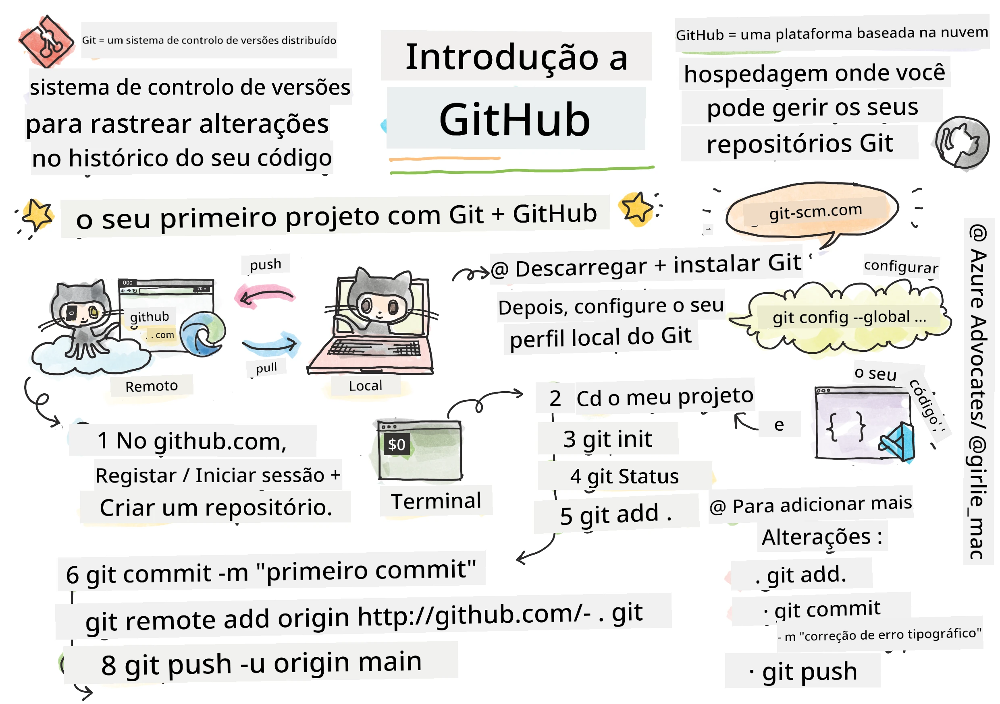
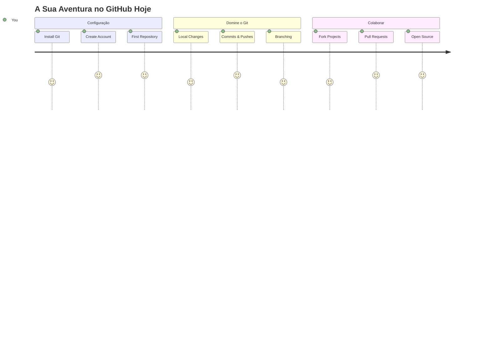
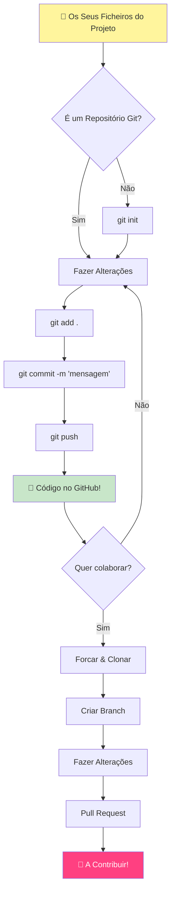
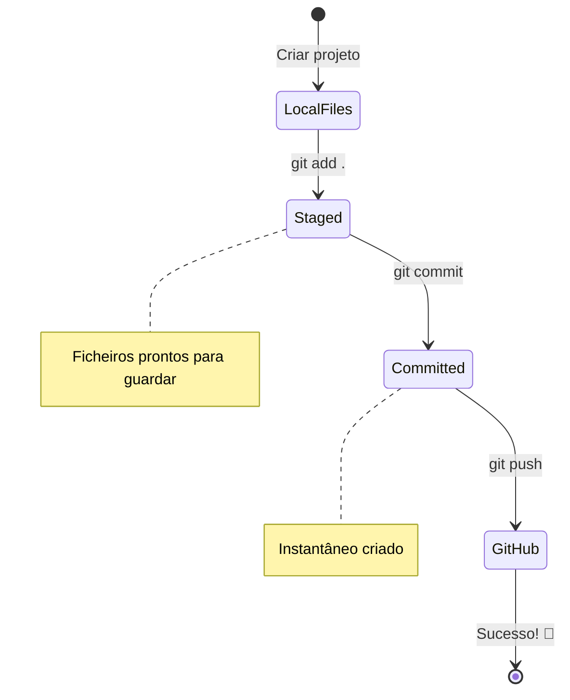
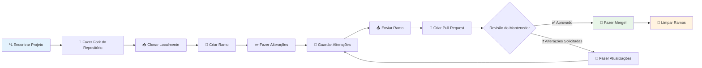
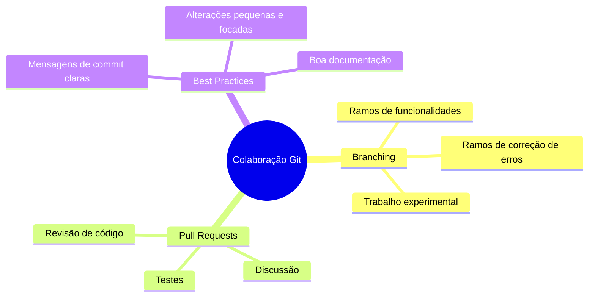
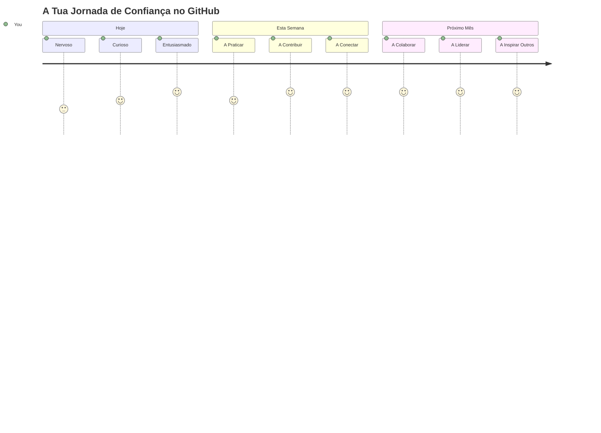

<!--
CO_OP_TRANSLATOR_METADATA:
{
  "original_hash": "5c383cc2cc23bb164b06417d1c107a44",
  "translation_date": "2026-01-06T18:34:59+00:00",
  "source_file": "1-getting-started-lessons/2-github-basics/README.md",
  "language_code": "pt"
}
-->
# Introdução ao GitHub

Olá, futuro programador! 👋 Pronto para juntar-te a milhões de codificadores por todo o mundo? Estou genuinamente entusiasmado por te apresentar o GitHub – pensa nele como a rede social para programadores, exceto que em vez de partilhar fotos do teu almoço, partilhamos código e construímos coisas incríveis juntos!

Isto é algo que realmente me impressiona: todas as apps no teu telemóvel, todos os websites que visitas, e a maior parte das ferramentas que irás aprender a usar foram construídas por equipas de programadores que colaboram em plataformas como o GitHub. Aquela app de música que adoras? Alguém como tu contribuiu para ela. Aquele jogo que não consegues largar? Sim, provavelmente foi criado com colaboração no GitHub. E agora TU vais aprender a fazer parte dessa comunidade incrível!

Sei que isto pode parecer muito no início – até eu me lembro de olhar para a minha primeira página no GitHub e pensar "Que raio significa isto tudo?" Mas aqui está: todos os programadores começaram exatamente onde tu estás agora. No final desta lição, vais ter o teu próprio repositório GitHub (pensa nele como a tua vitrine pessoal de projetos na nuvem), e vais saber como guardar o teu trabalho, partilhá-lo com outros e até como contribuir para projetos que milhões de pessoas usam.

Vamos fazer esta viagem juntos, passo a passo. Sem pressas, sem pressão – só tu, eu, e algumas ferramentas realmente fixes que vão passar a ser os teus novos melhores amigos!


> Sketchnote por [Tomomi Imura](https://twitter.com/girlie_mac)


## Questionário Pré-Aula
[Questionário pré-aula](https://ff-quizzes.netlify.app)

## Introdução

Antes de mergulharmos nas coisas realmente empolgantes, vamos preparar o teu computador para alguma magia GitHub! Pensa nisto como organizar os teus materiais de arte antes de criar uma obra-prima – ter as ferramentas certas prontas faz tudo correr muito melhor e torna tudo muito mais divertido.

Vou guiar-te pessoalmente por cada passo da configuração, e prometo que não é nada tão intimidante quanto pode parecer à primeira vista. Se algo não fizer sentido logo à primeira, é completamente normal! Lembro-me de configurar o meu primeiro ambiente de desenvolvimento e sentir que estava a tentar ler hieróglifos antigos. Todo o programador já esteve exatamente onde tu estás agora, perguntando-se se está a fazer tudo certo. Spoiler: se estás aqui a aprender, já estás a fazer tudo certo! 🌟

Nesta lição vamos cobrir:

- como acompanhar o trabalho que fazes na tua máquina
- como trabalhar em projetos com outras pessoas
- como contribuir para software de código aberto

### Pré-requisitos

Vamos preparar o teu computador para alguma magia GitHub! Não te preocupes – esta configuração é algo que só precisas de fazer uma vez, e depois estarás pronto para toda a tua jornada de programação.

Ok, vamos começar pela base! Primeiro, precisamos de verificar se o Git já está no teu computador. O Git é basicamente como ter um assistente super inteligente que se lembra de cada alteração que fazes ao teu código – bem melhor do que andar a carregar freneticamente em Ctrl+S a cada dois segundos (todos já passámos por isso!).

Vamos ver se o Git está instalado escrevendo este comando mágico no terminal:  
`git --version`

Se o Git ainda não estiver instalado, não te preocupes! Só tens de ir a [transferir o Git](https://git-scm.com/downloads) e instalá-lo. Depois de instalado, precisamos de apresentar-te bem o Git:

> 💡 **Configuração Inicial**: Estes comandos dizem ao Git quem és. Esta informação será associada a cada commit que fizeres, por isso escolhe um nome e e-mail que queiras partilhar publicamente.

```bash
git config --global user.name "your-name"
git config --global user.email "your-email"
```

Para verificar se o Git já está configurado podes escrever:
```bash
git config --list
```

Também vais precisar de uma conta no GitHub, um editor de código (como o Visual Studio Code), e terás de abrir o teu terminal (ou: prompt de comando).

Vê em [github.com](https://github.com/) e cria uma conta se ainda não tens, ou faz login e preenche o teu perfil.

💡 **Dica moderna**: Considera configurar [chaves SSH](https://docs.github.com/en/authentication/connecting-to-github-with-ssh) ou usar o [GitHub CLI](https://cli.github.com/) para uma autenticação mais fácil sem palavras-passe.

✅ O GitHub não é o único repositório de código no mundo; há outros, mas o GitHub é o mais conhecido.

### Preparação

Vais precisar de uma pasta com um projeto de código na tua máquina local (portátil ou PC), e de um repositório público no GitHub, que servirá de exemplo para como contribuir para projetos de outros.

### Mantendo o Teu Código Seguro

Vamos falar de segurança por um momento – mas não te preocupes, não vamos sobrecarregar-te com coisas assustadoras! Pensa nestas práticas de segurança como trancar o carro ou a casa. São hábitos simples que se tornam naturais e mantêm o teu trabalho protegido.

Vamos mostrar-te as maneiras modernas e seguras de trabalhar com o GitHub desde o início. Assim, vais criar bons hábitos que te serão úteis ao longo da tua carreira como programador.

Ao trabalhar com o GitHub, é importante seguir as melhores práticas de segurança:

| Área de Segurança | Melhor Prática | Porquê Importa |
|-------------------|---------------|---------------|
| **Autenticação** | Usa chaves SSH ou Tokens de Acesso Pessoal | Palavras-passe são menos seguras e estão a ser eliminadas |
| **Autenticação em Dois Fatores** | Ativa 2FA na tua conta GitHub | Adiciona uma camada extra de proteção à conta |
| **Segurança do Repositório** | Nunca faças commit de informação sensível | Chaves API e palavras-passe nunca devem estar em repositórios públicos |
| **Gestão de Dependências** | Ativa Dependabot para atualizações | Mantém as tuas dependências seguras e atualizadas |

> ⚠️ **Lembrete Crítico de Segurança**: Nunca faças commit de chaves API, palavras-passe ou outra informação sensível em qualquer repositório. Usa variáveis de ambiente e ficheiros `.gitignore` para proteger dados sensíveis.

**Configuração Moderna de Autenticação:**

```bash
# Gerar chave SSH (algoritmo moderno ed25519)
ssh-keygen -t ed25519 -C "your_email@example.com"

# Configurar Git para usar SSH
git remote set-url origin git@github.com:username/repository.git
```

> 💡 **Dica Profissional**: As chaves SSH eliminam a necessidade de inserir palavras-passe repetidamente e são mais seguras do que os métodos tradicionais de autenticação.

---

## Gerir o Teu Código Como um Profissional

Ok, AQUI é que a coisa fica realmente emocionante! 🎉 Vamos aprender a acompanhar e gerir o teu código como os profissionais, e honestamente, esta é uma das minhas partes favoritas de ensinar porque faz toda a diferença.

Imagina isto: estás a escrever uma história incrível e queres guardar cada rascunho, cada edição brilhante, e cada momento de "espera, isto é genial!" pelo caminho. É exatamente isso que o Git faz pelo teu código! É como ter o caderno mais incrível de viagem no tempo que se lembra de TUDO – cada tecla, cada alteração, cada momento de "ups, estraguei tudo" que podes desfazer instantaneamente.

Vou ser sincero – isto pode parecer esmagador no início. Quando comecei, pensei "Porque é que não posso simplesmente guardar os meus ficheiros como de costume?" Mas acredita em mim: quando o Git fizer sentido para ti (e irá!), vais ter aquele momento de "luz" em que pensas "Como é que eu alguma vez programei sem isto?" É como descobrir que consegues voar quando andaste a pé a vida toda!

Suponhamos que tens uma pasta local com algum projeto de código e queres começar a acompanhar o progresso usando git – o sistema de controlo de versões. Algumas pessoas comparam usar git a escrever uma carta de amor para o teu eu futuro. Ao ler as mensagens dos teus commits dias, semanas ou meses depois, vais conseguir lembrar porque é que tomaste uma decisão, ou "reverter" uma alteração – isto é, quando escreves boas mensagens de commit.


### Tarefa: Cria o Teu Primeiro Repositório!

> 🎯 **A Tua Missão (e estou tão entusiasmado por ti!)**: Vamos criar juntos o teu primeiro repositório GitHub! Quando acabarmos aqui, vais ter o teu próprio cantinho na internet onde o teu código vive, e vais ter feito o teu primeiro "commit" (é assim que os programadores dizem quando guardam o trabalho de uma forma inteligente).  
>  
> Este é, honestamente, um momento muito especial – estás prestes a juntar-te oficialmente à comunidade global de programadores! Ainda me lembro da emoção de criar o meu primeiro repositório e pensar "Uau, estou mesmo a fazer isto!"

Vamos percorrer esta aventura juntos, passo a passo. Toma o tempo que precisares em cada parte – não há prémio para correr, e prometo que cada passo vai fazer sentido. Lembra-te, todas as estrelas da programação que admiras já estiveram sentadas exatamente onde tu estás, prestes a criar o primeiro repositório. Quão fixe é isso?

> Vê o vídeo  
>  
> [](https://www.youtube.com/watch?v=9R31OUPpxU4)

**Vamos Fazer Isto Juntos:**

1. **Cria o teu repositório no GitHub**. Vai a GitHub.com e procura o botão verde brilhante **New** (ou o sinal **+** no canto superior direito). Clica nele e seleciona **New repository**.

   Aqui está o que fazer:
   1. Dá um nome ao teu repositório – escolhe algo que faça sentido para ti!
   1. Adiciona uma descrição se quiseres (isto ajuda os outros a perceber do que trata o teu projeto)
   1. Decide se queres que seja público (todos podem ver) ou privado (só tu)
   1. Recomendo que assinales a caixa para adicionar um ficheiro README – é como a capa do teu projeto
   1. Clica em **Create repository** e celebra – acabaste de criar o teu primeiro repositório! 🎉

2. **Navega até à tua pasta de projeto**. Agora vamos abrir o terminal (não te preocupes, não é tão assustador quanto parece!). Precisamos de dizer ao teu computador onde é que estão os ficheiros do projeto. Escreve este comando:

   ```bash
   cd [name of your folder]
   ```

   **O que estamos a fazer aqui:**  
   - Basicamente estamos a dizer "Ei computador, leva-me à minha pasta de projeto"  
   - Isto é como abrir uma pasta específica no teu ambiente de trabalho, mas fazemos isto com comandos de texto  
   - Troca `[name of your folder]` pelo nome real da tua pasta de projeto

3. **Transforma a tua pasta num repositório Git**. Aqui é onde a magia acontece! Escreve:

   ```bash
   git init
   ```

   **Isto é o que acabou de acontecer (coisas muito fixes!):**  
   - O Git acabou de criar uma pasta escondida `.git` no teu projeto – não a vais ver, mas ela está lá!  
   - A tua pasta normal é agora um "repositório" que pode acompanhar cada alteração que fazes  
   - Pensa nisto como dar superpoderes à tua pasta para ela se lembrar de tudo

4. **Verifica o que está a acontecer**. Vamos ver o que o Git pensa do teu projeto agora:

   ```bash
   git status
   ```

   **Entender o que o Git te está a dizer:**  
   
   Podes ver algo assim:

   ```output
   Changes not staged for commit:
   (use "git add <file>..." to update what will be committed)
   (use "git restore <file>..." to discard changes in working directory)

        modified:   file.txt
        modified:   file2.txt
   ```

   **Não peças pânico! Isto é o que isto significa:**  
   - Ficheiros em **vermelho** são ficheiros que têm alterações mas ainda não estão prontos para serem guardados  
   - Ficheiros em **verde** (quando os vês) estão prontos para serem guardados  
   - O Git está a ser prestável a dizer exatamente o que podes fazer a seguir

   > 💡 **Dica profissional**: O comando `git status` é o teu melhor amigo! Usa-o sempre que estiveres confuso sobre o que se passa. É como perguntar ao Git "Ei, qual é a situação agora?"

5. **Prepara os teus ficheiros para guardar** (isto chama-se "staging"):

   ```bash
   git add .
   ```

   **O que acabámos de fazer:**  
   - Dissemos ao Git "Quero incluir TODOS os meus ficheiros na próxima gravação"  
   - O `.` é como dizer "tudo nesta pasta"  
   - Agora os teus ficheiros estão "preparados" e prontos para o próximo passo

   **Queres ser mais seletivo?** Podes adicionar apenas ficheiros específicos:

   ```bash
   git add [file or folder name]
   ```

   **Porque é que podes querer fazer isso?**  
   - Às vezes queres guardar alterações relacionadas juntas  
   - Ajuda-te a organizar o teu trabalho em blocos lógicos  
   - Facilita perceber o que mudou e quando

   **Mudaste de ideias?** Sem problemas! Podes remover o staging dos ficheiros assim:

   ```bash
   # Remover tudo da preparação
   git reset
   
   # Remover apenas um ficheiro da preparação
   git reset [file name]
   ```

   Não te preocupes – isto não apaga o teu trabalho, só remove ficheiros do grupo "pronto para guardar".

6. **Guarda o teu trabalho permanentemente** (fazendo o primeiro commit!):

   ```bash
   git commit -m "first commit"
   ```

   **🎉 Parabéns! Acabaste de fazer o teu primeiro commit!**
   
   **Isto é o que acabou de acontecer:**  
   - O Git tirou uma "foto" de todos os ficheiros preparados exatamente neste momento  
   - A tua mensagem de commit "first commit" explica sobre este ponto de gravação  
   - O Git deu a esta "foto" um ID único para que possas encontrá-la sempre que precisares  
   - Começaste oficialmente a acompanhar a história do teu projeto!

   > 💡 **Mensagens futuras de commit**: Para os próximos commits, sê mais descritivo! Em vez de "atualizei coisas", tenta "Adiciona formulário de contacto à página inicial" ou "Corrige bug no menu de navegação". O teu eu futuro vai agradecer!

7. **Conecta o teu projeto local ao GitHub**. Neste momento, o teu projeto existe só no teu computador. Vamos ligá-lo ao teu repositório GitHub para poderes partilhá-lo com o mundo!

   Primeiro, vai à página do teu repositório no GitHub e copia o URL. Depois volta aqui e escreve:

   ```bash
   git remote add origin https://github.com/username/repository_name.git
   ```
   
   (Substitui esse URL pelo URL real do teu repositório!)

   **O que acabámos de fazer:**
   - Criámos uma ligação entre o seu projeto local e o seu repositório GitHub
   - "Origin" é apenas um apelido para o seu repositório GitHub – é como adicionar um contacto ao seu telefone
   - Agora o seu Git local sabe para onde enviar o seu código quando estiver pronto para partilhá-lo

   💡 **Forma mais fácil**: Se tiver o GitHub CLI instalado, pode fazer isto num único comando:
   ```bash
   gh repo create my-repo --public --push --source=.
   ```

8. **Envie o seu código para o GitHub** (o grande momento!):

   ```bash
   git push -u origin main
   ```

   **🚀 É isto mesmo! Está a enviar o seu código para o GitHub!**
   
   **O que está a acontecer:**
   - Os seus commits estão a viajar do seu computador para o GitHub
   - A flag `-u` estabelece uma ligação permanente para que os futuros pushs sejam mais fáceis
   - "main" é o nome da sua branch principal (como a pasta principal)
   - Depois disto, pode simplesmente escrever `git push` para os envios futuros!

   💡 **Nota rápida**: Se a sua branch tiver outro nome (como "master"), use esse nome em vez disso. Pode verificar com `git branch --show-current`.

9. **O seu novo ritmo diário de codificação** (é aqui que fica viciante!):

   A partir de agora, sempre que fizer alterações ao seu projeto, tem esta dança simples de três passos:

   ```bash
   git add .
   git commit -m "describe what you changed"
   git push
   ```

   **Este torna-se o seu ritmo de codificação:**
   - Faça algumas alterações fantásticas ao seu código ✨
   - Prepare-as com `git add` ("Ei Git, repara nestas alterações!")
   - Guarde-as com `git commit` e uma mensagem descritiva (o eu do futuro vai agradecer!)
   - Partilhe-as com o mundo usando `git push` 🚀
   - Repita – a sério, isto torna-se tão natural como respirar!

   Adoro este fluxo de trabalho porque é como ter múltiplos pontos de salvamento num videojogo. Fez uma alteração de que gosta? Faça commit! Quer experimentar algo arriscado? Sem problema – pode sempre voltar ao seu último commit se algo correr mal!

   > 💡 **Dica**: Também poderá querer usar um ficheiro `.gitignore` para evitar que ficheiros que não quer rastrear apareçam no GitHub – como aquele ficheiro de notas que guarda na mesma pasta mas que não deve estar num repositório público. Pode encontrar modelos para ficheiros `.gitignore` em [.gitignore templates](https://github.com/github/gitignore) ou criar um usando [gitignore.io](https://www.toptal.com/developers/gitignore).

### 🧠 **Primeiro Check-in no Repositório: Como se Sentiu?**

**Tire um momento para celebrar e refletir:**
- Como se sentiu ao ver o seu código aparecer no GitHub pela primeira vez?
- Qual passo lhe pareceu mais confuso e qual lhe pareceu surpreendentemente fácil?
- Consegue explicar a diferença entre `git add`, `git commit` e `git push` com as suas próprias palavras?


> **Lembre-se**: Até os programadores experientes às vezes esquecem os comandos exatos. Transformar este fluxo de trabalho em memória muscular exige prática – está a ir muito bem!

#### Fluxos de trabalho Git modernos

Considere adoptar estas práticas modernas:

- **Conventional Commits**: Use um formato padronizado para mensagens de commit como `feat:`, `fix:`, `docs:`, etc. Saiba mais em [conventionalcommits.org](https://www.conventionalcommits.org/)
- **Commits atómicos**: Faça com que cada commit represente uma única alteração lógica
- **Commits frequentes**: Faça commits frequentemente com mensagens descritivas em vez de commits grandes e esporádicos

#### Mensagens de commit

Uma excelente linha de assunto para um commit Git completa a seguinte frase:
Se aplicado, este commit vai <aqui a sua linha de assunto>

Para o assunto use o imperativo no presente: "change" e não "changed" nem "changes". 
Tal como no assunto, no corpo (opcional) use também o imperativo no presente. O corpo deve incluir a motivação da mudança e contrastar isto com o comportamento anterior. Está a explicar o `porquê`, não o `como`.

✅ Tire alguns minutos para navegar pelo GitHub. Consegue encontrar uma mensagem de commit realmente boa? Consegue encontrar uma realmente minimalista? Que informação acha que é a mais importante e útil para transmitir numa mensagem de commit?

## Trabalhar com Outros (A Parte Divertida!)

Agarre o seu chapéu porque AQUI é onde o GitHub fica absolutamente mágico! 🪄 Já dominou a gestão do seu próprio código, mas agora vamos entrar na minha parte favorita – colaborar com pessoas incríveis de todo o mundo.

Imagine isto: acorda amanhã e vê que alguém em Tóquio melhorou o seu código enquanto dormia. Depois, alguém em Berlim corrige um bug que o deixava preso. Já de tarde, um programador em São Paulo adiciona uma funcionalidade que nunca tinha pensado. Isto não é ficção científica – é só terça-feira no universo GitHub!

O que me entusiasma mesmo é que as competências de colaboração que vai aprender? São exatamente os mesmos fluxos de trabalho que equipas da Google, Microsoft e das suas startups favoritas usam todos os dias. Não está só a aprender uma ferramenta fixe – está a aprender a linguagem secreta que faz o mundo do software trabalhar em conjunto.

A sério, quando sentir a emoção de alguém aceitar o seu primeiro pull request, vai perceber porque é que os programadores se apaixonam pelo open source. É como fazer parte do maior e mais criativo projeto de equipa do mundo!

> Veja o vídeo
>
> [](https://www.youtube.com/watch?v=bFCM-PC3cu8)

A principal razão para colocar coisas no GitHub foi tornar possível colaborar com outros programadores.


No seu repositório, navegue até `Insights > Community` para ver como o seu projeto se compara aos padrões recomendados pela comunidade.

Quer que o seu repositório pareça profissional e acolhedor? Vá ao seu repositório e clique em `Insights > Community`. Esta funcionalidade fixa mostra como o seu projeto se compara ao que a comunidade GitHub considera "boas práticas de repositórios".

> 🎯 **Fazendo o seu projeto brilhar**: Um repositório bem organizado com boa documentação é como uma montra limpa e acolhedora. Diz às pessoas que se importa com o seu trabalho e faz com que outros queiram contribuir!

**Isto é o que torna um repositório espetacular:**

| O que adicionar | Porque é importante | O que isso lhe traz |
|-------------|-------------------|---------------------|
| **Descrição** | A primeira impressão conta! | As pessoas sabem instantaneamente do que se trata o seu projeto |
| **README** | A página inicial do seu projeto | Como um guia amigável para novos visitantes |
| **Diretrizes de Contribuição** | Mostra que aceita ajuda | As pessoas sabem exatamente como podem ajudar |
| **Código de Conduta** | Cria um espaço amigável | Todos se sentem bem-vindos a participar |
| **Licença** | Clareza legal | Outros sabem como podem usar o seu código |
| **Política de Segurança** | Mostra que é responsável | Demonstra práticas profissionais |

> 💡 **Dica profissional**: O GitHub fornece modelos para todos estes ficheiros. Ao criar um repositório novo, marque as caixas para gerar automaticamente estes ficheiros.

**Funcionalidades Modernas do GitHub para Explorar:**

🤖 **Automação & CI/CD:**
- **GitHub Actions** para testes e deploy automatizados
- **Dependabot** para atualizações automáticas das dependências

💬 **Comunidade & Gestão de Projetos:**
- **GitHub Discussions** para conversas na comunidade além dos issues
- **GitHub Projects** para gestão de projetos em estilo kanban
- **Regras de proteção de branches** para impor padrões de qualidade de código


Todos estes recursos beneficiam a integração de novos membros na equipa. E normalmente são estas as coisas que novos colaboradores olham antes de sequer ver o seu código, para perceber se o seu projeto é o sítio certo para investirem o seu tempo.

✅ Os ficheiros README, embora tomem tempo para preparar, são frequentemente negligenciados por responsáveis ocupados. Consegue encontrar um exemplo particularmente descritivo? Nota: há algumas [ferramentas para ajudar a criar bons READMEs](https://www.makeareadme.com/) que pode querer experimentar.

### Tarefa: Fazer merge de algum código

Os documentos de contribuição ajudam as pessoas a contribuir para o projeto. Explicam que tipos de contribuições está à procura e como é o processo. Os colaboradores terão de passar por vários passos para poder contribuir para o seu repositório no GitHub:

1. **Fazer fork do seu repo** Provavelmente vai querer que as pessoas _forkem_ o seu projeto. Fazer fork significa criar uma réplica do seu repositório no perfil delas do GitHub.
1. **Clonar**. A partir daí, elas vão clonar o projeto para a máquina local delas.
1. **Criar uma branch**. Vai querer pedir que criem uma _branch_ para o trabalho delas.
1. **Focar a alteração numa área só**. Peça aos colaboradores para concentrarem as contribuições numa coisa de cada vez – assim as hipóteses de conseguir _fazer merge_ do trabalho delas aumentam. Imagine que escrevem uma correção de bug, adicionam uma nova funcionalidade, e atualizam vários testes – e se quiser, ou só puder implementar 2 em 3 alterações, ou 1 em 3?

✅ Imagine uma situação em que as branches são particularmente críticas para escrever e entregar bom código. Que casos de uso consegue imaginar?

> Nota, seja a mudança que quer ver no mundo, e crie branches para o seu próprio trabalho também. Todos os commits que fizer são feitos na branch em que está atualmente “checked out”. Use `git status` para ver qual é essa branch.

Vamos seguir um fluxo de trabalho de contribuinte. Assuma que o contribuinte já fez _fork_ e _clone_ do repositório assim tem um repositório Git pronto para trabalhar localmente:

1. **Criar uma branch**. Use o comando `git branch` para criar uma branch que vai conter as alterações que pretende contribuir:

   ```bash
   git branch [branch-name]
   ```

   > 💡 **Abordagem Moderna**: Também pode criar e mudar para a nova branch num único comando:
   ```bash
   git switch -c [branch-name]
   ```

1. **Mudar para a branch de trabalho**. Mude para a branch especificada e atualize o diretório de trabalho com `git switch`:

   ```bash
   git switch [branch-name]
   ```

   > 💡 **Nota Moderna**: `git switch` é o substituto moderno de `git checkout` para mudar de branch. É mais claro e seguro para iniciantes.

1. **Fazer o trabalho**. Neste ponto quer adicionar as suas alterações. Não se esqueça de informar o Git com os seguintes comandos:

   ```bash
   git add .
   git commit -m "my changes"
   ```

   > ⚠️ **Qualidade da Mensagem de Commit**: Assegure-se de dar um bom nome ao seu commit, tanto para si como para o responsável pelo repositório onde está a ajudar. Seja específico sobre o que mudou!

1. **Combinar o seu trabalho com a branch `main`**. A certa altura está pronto e quer combinar o seu trabalho com o da branch `main`. A branch `main` pode ter mudado entretanto, por isso assegure-se de a atualizar para a última versão com os seguintes comandos:

   ```bash
   git switch main
   git pull
   ```

   Neste ponto quer certificar-se de que quaisquer _conflitos_, situações onde o Git não consegue facilmente _combinar_ as alterações, acontecem na sua branch de trabalho. Por isso execute os seguintes comandos:

   ```bash
   git switch [branch_name]
   git merge main
   ```

   O comando `git merge main` vai trazer todas as alterações da branch `main` para a sua branch. Esperemos que consiga continuar sem problemas. Se não, o VS Code vai indicar onde o Git está _confuso_ e basta alterar os ficheiros afetados para dizer qual o conteúdo mais correto.

   💡 **Alternativa moderna**: Considere usar `git rebase` para um histórico mais limpo:
   ```bash
   git rebase main
   ```
   Isto repete os seus commits em cima da última branch main, criando um histórico linear.

1. **Enviar o seu trabalho para o GitHub**. Enviar o seu trabalho para o GitHub significa duas coisas. Fazer push da sua branch para o seu repositório e depois abrir um PR, Pull Request.

   ```bash
   git push --set-upstream origin [branch-name]
   ```

   O comando acima cria a branch no seu repositório forkado.

### 🤝 **Teste de Competências de Colaboração: Pronto para Trabalhar com Outros?**

**Vamos ver como se sente em relação à colaboração:**
- A ideia de forkar e pull requests faz sentido para si agora?
- Qual é uma coisa sobre trabalhar com branches que quer praticar mais?
- Sente-se confortável em contribuir para o projeto de outra pessoa?


> **Reforço de confiança**: Todos os programadores que admira ficaram nervosos com o primeiro pull request. A comunidade GitHub é incrivelmente acolhedora para quem está a começar!

1. **Abrir um PR**. A seguir, quer abrir um PR. Faz isso navegando para o repositório forkado no GitHub. Vai ver uma indicação onde o GitHub pergunta se quer criar um novo PR, clica aí e fica numa interface onde pode mudar o título da mensagem do commit, dar-lhe uma descrição mais adequada. Agora o responsável do repositório que forkou vai ver esse PR e _cruzem os dedos_ vai apreciar e _fazer merge_ ao seu PR. Você agora é um colaborador, yay :)

   💡 **Dica moderna**: Também pode criar PRs usando o GitHub CLI:
   ```bash
   gh pr create --title "Your PR title" --body "Description of changes"
   ```

   🔧 **Boas práticas para PRs**:
   - Faça ligação a issues relacionadas usando palavras-chave como "Fixes #123"
   - Adicione capturas de ecrã para mudanças na interface
   - Peça revisores específicos
   - Use PRs de rascunho para trabalhos em progresso
   - Assegure que todos os testes CI passam antes de pedir revisão
1. **Limpeza**. É considerado uma boa prática _limpar_ depois de fundir com sucesso um PR. Quer limpar tanto a sua branch local como a branch que enviou para o GitHub. Primeiro vamos apagá-la localmente com o seguinte comando:

   ```bash
   git branch -d [branch-name]
   ```

   Certifique-se de ir à página do GitHub do repositório forkado a seguir e remover a branch remota que acabou de enviar para lá.

`Pull request` parece um termo estranho porque na verdade quer enviar as suas alterações para o projeto. Mas o mantenedor (proprietário do projeto) ou a equipa principal precisa de considerar as suas alterações antes de as fundir com a "main" branch do projeto, por isso está realmente a pedir uma decisão de alteração a um mantenedor.

Um pull request é o local para comparar e discutir as diferenças introduzidas numa branch com revisões, comentários, testes integrados e mais. Um bom pull request segue aproximadamente as mesmas regras que uma mensagem de commit. Pode adicionar uma referência a um issue no rastreador de issues, quando o seu trabalho, por exemplo, corrige um problema. Isto é feito usando um `#` seguido do número do seu issue. Por exemplo `#97`.

🤞Dedos cruzados para que todas as verificações passem e o(s) proprietário(s) do projeto mescle(m) as suas alterações no projeto🤞

Atualize a sua branch local atual com todos os novos commits da branch remota correspondente no GitHub:

`git pull`

## Contribuir para Open Source (A Sua Oportunidade de Fazer a Diferença!)

Está pronto para algo que vai explodir a sua mente? 🤯 Vamos falar sobre contribuir para projetos open source – e fico com arrepios só de pensar em partilhar isto consigo!

Esta é a sua oportunidade de fazer parte de algo verdadeiramente extraordinário. Imagine melhorar as ferramentas que milhões de programadores usam todos os dias, ou corrigir um bug numa aplicação que os seus amigos adoram. Isto não é só um sonho – é isso mesmo que significa contribuir para open source!

Isto é o que me dá arrepios cada vez que penso nisso: todas as ferramentas que tem aprendido a usar – o seu editor de código, os frameworks que vamos explorar, até o navegador onde está a ler isto – começaram com alguém exatamente como você a fazer a sua primeira contribuição. Aquele programador brilhante que criou a sua extensão favorita do VS Code? Eles também foram iniciantes que clicaram em "create pull request" com as mãos trémulas, tal como você está prestes a fazer.

E aqui está a parte mais bonita: a comunidade open source é como o maior abraço coletivo da internet. A maioria dos projetos procura ativamente por novatos e tem issues marcados como "good first issue" especificamente para pessoas como você! Os mantenedores ficam genuinamente entusiasmados quando veem novos contribuidores porque eles lembram-se dos seus próprios primeiros passos.

```mermaid
flowchart TD
    A[🔍 Explorar GitHub] --> B[🏷️ Encontrar "boa primeira questão"]
    B --> C[📖 Ler Diretrizes de Contribuição]
    C --> D[🍴 Fazer Fork do Repositório]
    D --> E[💻 Configurar Ambiente Local]
    E --> F[🌿 Criar Branch de Funcionalidade]
    F --> G[✨ Fazer a Sua Contribuição]
    G --> H[🧪 Testar as Suas Alterações]
    H --> I[📝 Escrever Commit Claro]
    I --> J[📤 Fazer Push & Criar PR]
    J --> K[💬 Interagir com Feedback]
    K --> L[🎉 Fundido! É um Contribuidor!]
    L --> M[🌟 Encontrar Próxima Questão]
    
    style A fill:#e1f5fe
    style L fill:#c8e6c9
    style M fill:#fff59d
```
Você não está apenas a aprender a programar aqui – está a preparar-se para juntar-se a uma família global de construtores que acordam todos os dias a pensar "Como podemos fazer o mundo digital um pouco melhor?" Bem-vindo ao clube! 🌟

Primeiro, vamos encontrar um repositório (ou **repo**) no GitHub que seja do seu interesse e ao qual queira contribuir com uma alteração. Vai querer copiar o seu conteúdo para a sua máquina.

✅ Uma boa forma de encontrar repositórios 'amigáveis para iniciantes' é [pesquisar pela tag 'good-first-issue'](https://github.blog/2020-01-22-browse-good-first-issues-to-start-contributing-to-open-source/).


Existem várias formas de copiar código. Uma forma é "clonar" o conteúdo do repositório, usando HTTPS, SSH, ou usando o GitHub CLI (Interface de Linha de Comandos do GitHub).

Abra o seu terminal e clone o repositório assim:
```bash
# A usar HTTPS
git clone https://github.com/ProjectURL

# A usar SSH (requer configuração da chave SSH)
git clone git@github.com:username/repository.git

# A usar GitHub CLI
gh repo clone username/repository
```

Para trabalhar no projeto, mude para a pasta correta:
`cd ProjectURL`

Também pode abrir o projeto todo usando:
- **[GitHub Codespaces](https://github.com/features/codespaces)** - O ambiente de desenvolvimento em nuvem do GitHub com VS Code no navegador
- **[GitHub Desktop](https://desktop.github.com/)** - Uma aplicação GUI para operações Git  
- **[GitHub.dev](https://github.dev)** - Pressione a tecla `.` em qualquer repositório GitHub para abrir o VS Code no navegador
- **VS Code** com a extensão GitHub Pull Requests

Por fim, pode descarregar o código numa pasta compactada.

### Mais algumas coisas interessantes sobre o GitHub

Pode favoritar, seguir e/ou "forkar" qualquer repositório público no GitHub. Pode encontrar os seus repositórios favoritados no menu suspenso no canto superior direito. É como fazer bookmark, mas para código.

Os projetos têm um rastreador de issues, maioritariamente no GitHub na aba "Issues" a menos que indicado de outra forma, onde as pessoas discutem questões relacionadas com o projeto. E a aba Pull Requests é onde se discutem e revêm alterações em progresso.

Os projetos podem também ter discussões em fóruns, listas de correio ou canais de chat como Slack, Discord ou IRC.

🔧 **Funcionalidades modernas do GitHub**:
- **GitHub Discussions** - Fórum incorporado para conversas comunitárias
- **GitHub Sponsors** - Apoio financeiro aos mantenedores  
- **Aba Security** - Relatos de vulnerabilidades e avisos de segurança
- **Aba Actions** - Veja workflows automáticos e pipelines CI/CD
- **Aba Insights** - Análises sobre contribuidores, commits e saúde do projeto
- **Aba Projects** - Ferramentas de gestão de projetos integradas do GitHub

✅ Explore o seu novo repositório GitHub e experimente algumas funcionalidades, como editar definições, adicionar informações ao repositório, criar um projeto (como um quadro Kanban) e configurar GitHub Actions para automação. Há muito para fazer!

---

## 🚀 Desafio

Está na hora de pôr os seus novos superpoderes do GitHub à prova! 🚀 Eis um desafio que vai fazer tudo fazer sentido da forma mais satisfatória:

Arranje um amigo (ou aquele familiar que está sempre a perguntar o que está a fazer com toda esta "coisa de computadores") e embarquem juntos numa aventura colaborativa de programação! É aqui que a verdadeira magia acontece – criem um projeto, deixem que ele faça um fork, criem algumas branches e fundam alterações como os profissionais que estão a tornar-se.

Não vou mentir – provavelmente vão rir-se nalgum momento (especialmente quando ambos tentarem alterar a mesma linha), ficar confusos, mas com certeza terão aqueles incríveis momentos "aha!" que fazem toda a aprendizagem valer a pena. Além disso, há algo especial em partilhar a primeira fusão bem-sucedida com outra pessoa – é como uma pequena celebração de quanto já avançaram!

Ainda não tem um parceiro de programação? Não se preocupe! A comunidade GitHub está cheia de pessoas incrivelmente acolhedoras que se lembram como foi ser novo. Procure por repositórios com labels "good first issue" – eles basicamente dizem "Ei iniciantes, venham aprender connosco!" Quão incrível é isso?

## Questionário Pós-Aula
[Questionário pós-aula](https://ff-quizzes.netlify.app/web/en/)

## Revisão & Continue a Aprender

Ufa! 🎉 Olhe para você – acabou de conquistar os básicos do GitHub como um verdadeiro campeão! Se o seu cérebro se sente um pouco cheio agora, isso é completamente normal e honestamente um bom sinal. Acabou de aprender ferramentas que me levaram semanas a dominar quando comecei.

O Git e o GitHub são incrivelmente poderosos (sério, poderosíssimos), e todo programador que conheço – incluindo aqueles que agora parecem magos – teve que praticar e tropeçar um pouco até tudo fazer sentido. O facto de ter passado esta lição significa que já está no caminho para dominar algumas das ferramentas mais importantes no kit de ferramentas de um programador.

Aqui estão alguns recursos fantásticos para o ajudar a praticar e tornar-se ainda mais incrível:

- [Guia para contribuir para software open source](https://opensource.guide/how-to-contribute/#how-to-submit-a-contribution) – O seu roteiro para fazer a diferença
- [Folha de referências rápida do Git](https://training.github.com/downloads/github-git-cheat-sheet/) – Tenha à mão para consulta rápida!

E lembre-se: a prática leva ao progresso, não à perfeição! Quanto mais usar Git e GitHub, mais natural se torna. O GitHub criou cursos interativos fantásticos que lhe permitem praticar num ambiente seguro:

- [Introdução ao GitHub](https://github.com/skills/introduction-to-github)
- [Comunicar usando Markdown](https://github.com/skills/communicate-using-markdown)  
- [GitHub Pages](https://github.com/skills/github-pages)
- [Gerir conflitos de merge](https://github.com/skills/resolve-merge-conflicts)

**A sentir-se aventureiro? Veja estas ferramentas modernas:**
- [Documentação do GitHub CLI](https://cli.github.com/manual/) – Para quando quiser sentir-se um mago da linha de comandos
- [Documentação do GitHub Codespaces](https://docs.github.com/en/codespaces) – Programar na nuvem!
- [Documentação do GitHub Actions](https://docs.github.com/en/actions) – Automatize tudo
- [Boas práticas Git](https://www.atlassian.com/git/tutorials/comparing-workflows) – Eleve a sua estratégia de trabalho

## Desafio GitHub Copilot Agent 🚀

Use o modo Agent para completar o seguinte desafio:

**Descrição:** Crie um projeto colaborativo de desenvolvimento web que demonstre o workflow completo do GitHub que aprendeu nesta lição. Este desafio vai ajudá-lo a praticar a criação de repositórios, funcionalidades de colaboração e workflows modernos do Git num cenário real.

**Instrução:** Crie um novo repositório público no GitHub para um projeto simples chamado "Recursos de Desenvolvimento Web". O repositório deve incluir um ficheiro README.md bem estruturado listando ferramentas e recursos úteis para desenvolvimento web, organizados por categorias (HTML, CSS, JavaScript, etc.). Configure o repositório com padrões comunitários adequados, incluindo licença, diretrizes para contribuições e um código de conduta. Crie pelo menos duas branches de funcionalidades: uma para adicionar recursos CSS e outra para recursos JavaScript. Faça commits a cada branch com mensagens descritivas e depois crie pull requests para fundir as alterações de volta para main. Ative funcionalidades do GitHub como Issues, Discussions, e configure um workflow básico do GitHub Actions para verificações automáticas.

## Tarefa

A sua missão, caso decida aceitá-la: Complete o curso [Introdução ao GitHub](https://github.com/skills/introduction-to-github) no GitHub Skills. Este curso interativo vai permitir que pratique tudo o que aprendeu num ambiente seguro e guiado. Além disso, vai receber um distintivo fixe quando terminar! 🏅

**A sentir-se pronto para mais desafios?**
- Configure a autenticação SSH para a sua conta GitHub (esqueça as passwords!)
- Experimente usar o GitHub CLI para as suas operações diárias com Git
- Crie um repositório com um workflow GitHub Actions
- Explore o GitHub Codespaces abrindo este mesmo repositório num editor baseado na nuvem

---

## 🚀 A sua Linha do Tempo para Dominar o GitHub

### ⚡ **O que pode fazer nos próximos 5 minutos**
- [ ] Favoritar este repositório e mais 3 outros projetos que lhe interessem
- [ ] Configurar autenticação de dois fatores na sua conta GitHub
- [ ] Criar um README simples para o seu primeiro repositório
- [ ] Seguir 5 programadores cujo trabalho o inspira

### 🎯 **O que pode alcançar nesta hora**
- [ ] Completar o questionário pós-aula e refletir sobre a sua jornada no GitHub
- [ ] Configurar chaves SSH para autenticação sem password no GitHub
- [ ] Criar o seu primeiro commit significativo com uma ótima mensagem
- [ ] Explorar a aba "Explore" do GitHub para descobrir projetos em destaque
- [ ] Praticar forking de um repositório e fazer uma pequena alteração

### 📅 **A sua aventura GitHub durante a semana**
- [ ] Completar os cursos GitHub Skills (Introdução ao GitHub, Markdown)
- [ ] Fazer o seu primeiro pull request num projeto open source
- [ ] Configurar um site GitHub Pages para mostrar o seu trabalho
- [ ] Participar em discussões GitHub sobre projetos do seu interesse
- [ ] Criar um repositório com padrões comunitários adequados (README, Licença, etc.)
- [ ] Experimentar o GitHub Codespaces para desenvolvimento na nuvem

### 🌟 **A sua transformação GitHub durante o mês**
- [ ] Contribuir para 3 projetos open source diferentes
- [ ] Ser mentor de alguém novo no GitHub (pague para a frente!)
- [ ] Configurar workflows automáticos com GitHub Actions
- [ ] Construir um portfólio que mostre as suas contribuições no GitHub
- [ ] Participar no Hacktoberfest ou eventos comunitários similares
- [ ] Tornar-se mantenedor do seu próprio projeto para que outros contribuam

### 🎓 **Check-in Final de Domínio do GitHub**

**Celebre o quanto já avançou:**
- Qual a sua funcionalidade favorita de usar no GitHub?
- Qual funcionalidade de colaboração o entusiasma mais?
- Quão confiante se sente para contribuir para open source agora?
- Qual o primeiro projeto ao qual quer contribuir?


> 🌍 **Bem-vindo à comunidade global de programadores!** Agora tem as ferramentas para colaborar com milhões de desenvolvedores em todo o mundo. A sua primeira contribuição pode parecer pequena, mas lembre-se – todo grande projeto open source começou com alguém a fazer o seu primeiro commit. A questão não é se vai fazer a diferença, mas que projeto incrível beneficiará primeiro da sua perspetiva única! 🚀

Lembre-se: todo especialista foi uma vez um principiante. Você consegue! 💪

---

<!-- CO-OP TRANSLATOR DISCLAIMER START -->
**Aviso Legal**:  
Este documento foi traduzido utilizando o serviço de tradução automática [Co-op Translator](https://github.com/Azure/co-op-translator). Embora nos esforcemos para garantir a precisão, esteja ciente de que traduções automáticas podem conter erros ou imprecisões. O documento original no seu idioma nativo deve ser considerado a fonte autorizada. Para informações críticas, recomenda-se a tradução profissional humana. Não nos responsabilizamos por quaisquer mal-entendidos ou interpretações incorretas decorrentes da utilização desta tradução.
<!-- CO-OP TRANSLATOR DISCLAIMER END -->