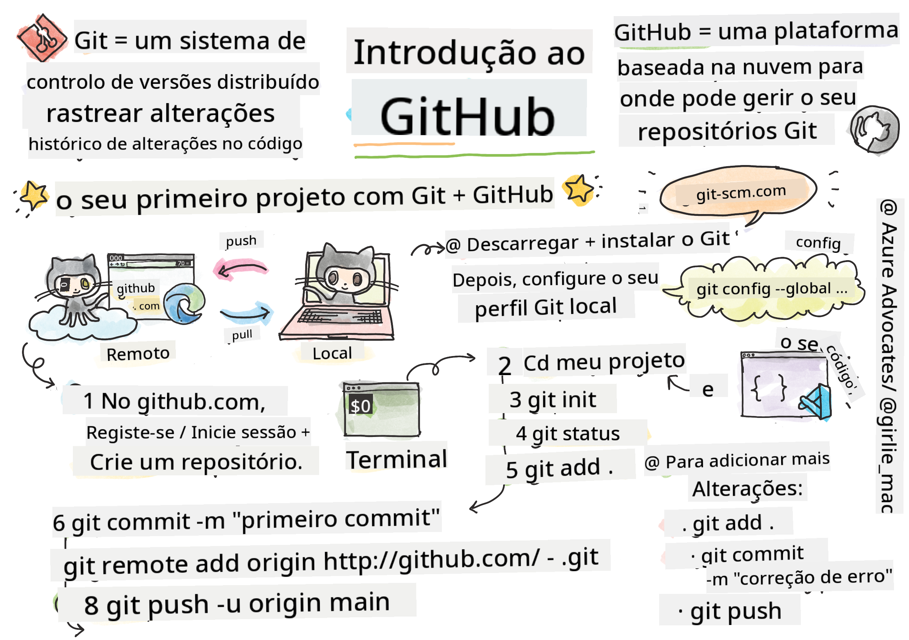
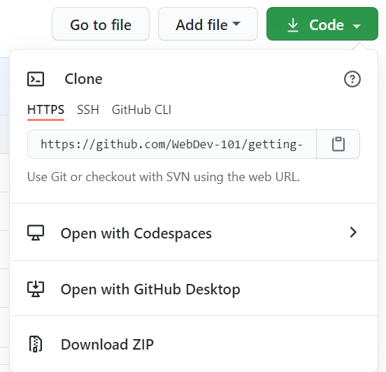

<!--
CO_OP_TRANSLATOR_METADATA:
{
  "original_hash": "361249da70432ddfd4741c917d1a6f50",
  "translation_date": "2025-08-29T16:20:09+00:00",
  "source_file": "1-getting-started-lessons/2-github-basics/README.md",
  "language_code": "pt"
}
-->
# Introdução ao GitHub

Esta lição aborda os conceitos básicos do GitHub, uma plataforma para hospedar e gerir alterações no seu código.


> Sketchnote por [Tomomi Imura](https://twitter.com/girlie_mac)

## Questionário Pré-Aula
[Questionário pré-aula](https://ff-quizzes.netlify.app)

## Introdução

Nesta lição, vamos abordar:

- como acompanhar o trabalho que faz na sua máquina
- como trabalhar em projetos com outras pessoas
- como contribuir para software de código aberto

### Pré-requisitos

Antes de começar, verifique se o Git está instalado. No terminal, escreva: 
`git --version`

Se o Git não estiver instalado, [faça o download do Git](https://git-scm.com/downloads). Depois, configure o seu perfil local do Git no terminal:
* `git config --global user.name "seu-nome"`
* `git config --global user.email "seu-email"`

Para verificar se o Git já está configurado, pode escrever:
`git config --list`

Também precisará de uma conta no GitHub, um editor de código (como o Visual Studio Code) e de abrir o seu terminal (ou: prompt de comando).

Aceda a [github.com](https://github.com/) e crie uma conta, se ainda não tiver uma, ou inicie sessão e preencha o seu perfil.

✅ O GitHub não é o único repositório de código no mundo; existem outros, mas o GitHub é o mais conhecido.

### Preparação

Vai precisar de uma pasta com um projeto de código na sua máquina local (portátil ou PC) e de um repositório público no GitHub, que servirá como exemplo de como contribuir para os projetos de outras pessoas.

---

## Gestão de Código

Vamos supor que tem uma pasta localmente com um projeto de código e quer começar a acompanhar o seu progresso usando o Git - o sistema de controlo de versões. Algumas pessoas comparam o uso do Git a escrever uma carta de amor para o seu "eu" do futuro. Ao ler as mensagens de commit dias, semanas ou meses depois, será capaz de recordar por que tomou uma decisão ou "reverter" uma alteração - isto é, quando escreve boas mensagens de commit.

### Tarefa: Criar um repositório e fazer commit do código  

> Veja o vídeo
> 
> [](https://www.youtube.com/watch?v=9R31OUPpxU4)

1. **Criar um repositório no GitHub**. No GitHub.com, no separador de repositórios ou na barra de navegação no canto superior direito, encontre o botão **novo repositório**.

   1. Dê um nome ao seu repositório (pasta).
   1. Selecione **criar repositório**.

1. **Navegar até à sua pasta de trabalho**. No terminal, mude para a pasta (também conhecida como diretório) que deseja começar a acompanhar. Escreva:

   ```bash
   cd [name of your folder]
   ```

1. **Inicializar um repositório Git**. No seu projeto, escreva:

   ```bash
   git init
   ```

1. **Verificar o estado**. Para verificar o estado do seu repositório, escreva:

   ```bash
   git status
   ```

   A saída pode ser algo como isto:

   ```output
   Changes not staged for commit:
   (use "git add <file>..." to update what will be committed)
   (use "git checkout -- <file>..." to discard changes in working directory)

        modified:   file.txt
        modified:   file2.txt
   ```

   Normalmente, o comando `git status` informa sobre quais ficheiros estão prontos para serem _guardados_ no repositório ou têm alterações que talvez queira persistir.

1. **Adicionar todos os ficheiros para acompanhamento**  
   Isto também é chamado de preparar ficheiros/adicionar ficheiros à área de staging.

   ```bash
   git add .
   ```

   O comando `git add` com o argumento `.` indica que todos os seus ficheiros e alterações serão acompanhados.

1. **Adicionar ficheiros selecionados para acompanhamento**

   ```bash
   git add [file or folder name]
   ```

   Isto permite adicionar apenas ficheiros selecionados à área de staging quando não quer fazer commit de todos os ficheiros de uma vez.

1. **Remover todos os ficheiros da área de staging**

   ```bash
   git reset
   ```

   Este comando permite remover todos os ficheiros da área de staging de uma vez.

1. **Remover um ficheiro específico da área de staging**

   ```bash
   git reset [file or folder name]
   ```

   Este comando permite remover apenas um ficheiro específico da área de staging que não quer incluir no próximo commit.

1. **Persistir o seu trabalho**. Neste ponto, adicionou os ficheiros a uma chamada _área de staging_. Um local onde o Git acompanha os seus ficheiros. Para tornar a alteração permanente, precisa de fazer um _commit_ dos ficheiros. Para isso, crie um _commit_ com o comando `git commit`. Um _commit_ representa um ponto de salvaguarda na história do seu repositório. Escreva o seguinte para criar um _commit_:

   ```bash
   git commit -m "first commit"
   ```

   Isto faz o commit de todos os seus ficheiros, adicionando a mensagem "primeiro commit". Para mensagens de commit futuras, será mais útil ser mais descritivo na sua descrição para transmitir o tipo de alteração que fez.

1. **Conectar o seu repositório Git local ao GitHub**. Um repositório Git é útil na sua máquina, mas em algum momento vai querer ter um backup dos seus ficheiros em algum lugar e também convidar outras pessoas a trabalhar consigo no repositório. Um ótimo lugar para isso é o GitHub. Lembre-se de que já criámos um repositório no GitHub, então só precisamos de conectar o repositório Git local ao GitHub. O comando `git remote add` faz exatamente isso. Escreva o seguinte comando:

   > Nota: antes de escrever o comando, vá à página do repositório no GitHub para encontrar o URL do repositório. Vai usá-lo no comando abaixo. Substitua ```https://github.com/username/repository_name.git``` pelo URL do seu GitHub.

   ```bash
   git remote add origin https://github.com/username/repository_name.git
   ```

   Isto cria uma _remota_, ou conexão, chamada "origin", apontando para o repositório GitHub que criou anteriormente.

1. **Enviar ficheiros locais para o GitHub**. Até agora, criou uma _conexão_ entre o repositório local e o repositório GitHub. Vamos enviar estes ficheiros para o GitHub com o seguinte comando `git push`, assim:

   > Nota: o nome da sua branch pode ser diferente por padrão de ```main```.

   ```bash
   git push -u origin main
   ```

   Isto envia os seus commits na branch "main" para o GitHub.

2. **Para adicionar mais alterações**. Se quiser continuar a fazer alterações e enviá-las para o GitHub, só precisará de usar os seguintes três comandos:

   ```bash
   git add .
   git commit -m "type your commit message here"
   git push
   ```

   > Dica: também pode querer adotar um ficheiro `.gitignore` para evitar que ficheiros que não quer acompanhar apareçam no GitHub - como aquele ficheiro de notas que guarda na mesma pasta, mas que não tem lugar num repositório público. Pode encontrar modelos para ficheiros `.gitignore` em [.gitignore templates](https://github.com/github/gitignore).

#### Mensagens de Commit

Uma ótima linha de assunto para um commit Git completa a seguinte frase:
Se aplicada, esta alteração irá <aqui a sua linha de assunto>

Para o assunto, use o imperativo no presente: "alterar" em vez de "alterado" ou "altera". 
Tal como no assunto, no corpo (opcional) também use o imperativo no presente. O corpo deve incluir a motivação para a alteração e contrastar isso com o comportamento anterior. Está a explicar o `porquê`, não o `como`.

✅ Dedique alguns minutos a explorar o GitHub. Consegue encontrar uma mensagem de commit realmente boa? E uma muito minimalista? Que informações acha que são mais importantes e úteis de transmitir numa mensagem de commit?

### Tarefa: Colaborar

A principal razão para colocar coisas no GitHub foi tornar possível colaborar com outros programadores.

## Trabalhar em Projetos com Outros

> Veja o vídeo
>
> [](https://www.youtube.com/watch?v=bFCM-PC3cu8)

No seu repositório, navegue até `Insights > Community` para ver como o seu projeto se compara aos padrões recomendados da comunidade.

Aqui estão algumas coisas que podem melhorar o seu repositório GitHub:
- **Descrição**. Adicionou uma descrição ao seu projeto?
- **README**. Adicionou um README? O GitHub fornece orientações para escrever um [README](https://docs.github.com/articles/about-readmes/?WT.mc_id=academic-77807-sagibbon).
- **Diretrizes de Contribuição**. O seu projeto tem [diretrizes de contribuição](https://docs.github.com/articles/setting-guidelines-for-repository-contributors/?WT.mc_id=academic-77807-sagibbon)?
- **Código de Conduta**. Um [Código de Conduta](https://docs.github.com/articles/adding-a-code-of-conduct-to-your-project/).
- **Licença**. Talvez o mais importante, uma [licença](https://docs.github.com/articles/adding-a-license-to-a-repository/).

Todos estes recursos beneficiarão a integração de novos membros na equipa. E são tipicamente o tipo de coisas que novos contribuidores analisam antes mesmo de olhar para o seu código, para descobrir se o seu projeto é o lugar certo para eles investirem o seu tempo.

✅ Ficheiros README, embora levem tempo a preparar, são frequentemente negligenciados por mantenedores ocupados. Consegue encontrar um exemplo de um particularmente descritivo? Nota: existem algumas [ferramentas para ajudar a criar bons READMEs](https://www.makeareadme.com/) que pode querer experimentar.

### Tarefa: Fazer Merge de Código

Documentos de contribuição ajudam as pessoas a contribuir para o projeto. Explicam que tipos de contribuições está a procurar e como funciona o processo. Os contribuidores precisarão de passar por uma série de passos para poderem contribuir para o seu repositório no GitHub:

1. **Fazer fork do seu repositório**. Provavelmente vai querer que as pessoas façam _fork_ do seu projeto. Fazer fork significa criar uma réplica do seu repositório no perfil GitHub delas.
1. **Clonar**. A partir daí, elas irão clonar o projeto para a máquina local.
1. **Criar uma branch**. Vai querer pedir-lhes que criem uma _branch_ para o trabalho delas.
1. **Focar a alteração numa área**. Peça aos contribuidores para concentrarem as contribuições numa coisa de cada vez - assim, as hipóteses de conseguir fazer _merge_ do trabalho deles são maiores. Imagine que escrevem uma correção de bug, adicionam uma nova funcionalidade e atualizam vários testes - e se quiser ou puder implementar apenas 2 de 3, ou 1 de 3 alterações?

✅ Imagine uma situação em que as branches são particularmente críticas para escrever e enviar bom código. Que casos de uso consegue imaginar?

> Nota: seja a mudança que quer ver no mundo e crie branches para o seu próprio trabalho também. Quaisquer commits que fizer serão feitos na branch em que está atualmente "checkout". Use `git status` para ver em que branch está.

Vamos passar por um fluxo de trabalho de contribuidor. Suponha que o contribuidor já fez _fork_ e _clone_ do repositório, então tem um repositório Git pronto para trabalhar na máquina local:

1. **Criar uma branch**. Use o comando `git branch` para criar uma branch que conterá as alterações que pretende contribuir:

   ```bash
   git branch [branch-name]
   ```

1. **Mudar para a branch de trabalho**. Mude para a branch especificada e atualize o diretório de trabalho com `git switch`:

   ```bash
   git switch [branch-name]
   ```

1. **Fazer o trabalho**. Neste ponto, adicione as suas alterações. Não se esqueça de informar o Git com os seguintes comandos:

   ```bash
   git add .
   git commit -m "my changes"
   ```

   Certifique-se de dar um bom nome ao commit, tanto para si como para o mantenedor do repositório que está a ajudar.

1. **Combinar o seu trabalho com a branch `main`**. Em algum momento, termina o trabalho e quer combiná-lo com o da branch `main`. A branch `main` pode ter mudado entretanto, então certifique-se de primeiro atualizá-la para a versão mais recente com os seguintes comandos:

   ```bash
   git switch main
   git pull
   ```

   Neste ponto, certifique-se de que quaisquer _conflitos_, situações em que o Git não consegue facilmente _combinar_ as alterações, acontecem na sua branch de trabalho. Portanto, execute os seguintes comandos:

   ```bash
   git switch [branch_name]
   git merge main
   ```

   Isto trará todas as alterações da `main` para a sua branch e, com sorte, poderá continuar. Se não, o VS Code indicará onde o Git está _confuso_ e só precisa de alterar os ficheiros afetados para indicar qual conteúdo é mais preciso.

1. **Enviar o seu trabalho para o GitHub**. Enviar o seu trabalho para o GitHub significa duas coisas: enviar a sua branch para o seu repositório e depois abrir um PR (Pull Request).

   ```bash
   git push --set-upstream origin [branch-name]
   ```

   O comando acima cria a branch no seu repositório de fork.

1. **Abrir um PR**. De seguida, quer abrir um PR. Faça isso navegando até ao repositório de fork no GitHub. Verá uma indicação no GitHub a perguntar se quer criar um novo PR; clique nisso e será levado para uma interface onde pode alterar o título da mensagem de commit e dar-lhe uma descrição mais adequada. Agora, o mantenedor do repositório que fez fork verá este PR e, _dedos cruzados_, apreciará e fará _merge_ do seu PR. Agora é um contribuidor, yay :)

1. **Limpar**. É considerado boa prática _limpar_ depois de um PR ser fundido com sucesso. Quer limpar tanto a sua branch local como a branch que enviou para o GitHub. Primeiro, elimine-a localmente com o seguinte comando:

   ```bash
   git branch -d [branch-name]
   ```

   Certifique-se de ir à página do repositório de fork no GitHub e remover a branch remota que acabou de enviar.
`Pull request` parece um termo estranho porque, na verdade, o que você quer é enviar as suas alterações para o projeto. No entanto, o responsável pelo projeto (o proprietário) ou a equipa principal precisa avaliar as suas alterações antes de as integrar na branch "main" do projeto. Portanto, você está, na verdade, a solicitar uma decisão de alteração ao responsável.

Um pull request é o local onde se comparam e discutem as diferenças introduzidas numa branch, com revisões, comentários, testes integrados e mais. Um bom pull request segue aproximadamente as mesmas regras de uma mensagem de commit. Pode adicionar uma referência a um problema no rastreador de problemas, por exemplo, quando o seu trabalho resolve um problema. Isto é feito utilizando um `#` seguido do número do problema. Por exemplo, `#97`.

🤞Dedos cruzados para que todos os testes sejam aprovados e o(s) proprietário(s) do projeto integrem as suas alterações no projeto🤞

Atualize a sua branch local de trabalho com todos os novos commits da branch remota correspondente no GitHub:

`git pull`

## Como contribuir para open source

Primeiro, vamos encontrar um repositório (ou **repo**) no GitHub que seja do seu interesse e ao qual gostaria de contribuir com uma alteração. Vai querer copiar o conteúdo para a sua máquina.

✅ Uma boa forma de encontrar repositórios 'amigáveis para iniciantes' é [procurar pela tag 'good-first-issue'](https://github.blog/2020-01-22-browse-good-first-issues-to-start-contributing-to-open-source/).



Existem várias formas de copiar código. Uma delas é "clonar" o conteúdo do repositório, utilizando HTTPS, SSH ou a CLI (Interface de Linha de Comando) do GitHub.

Abra o seu terminal e clone o repositório desta forma:
`git clone https://github.com/ProjectURL`

Para trabalhar no projeto, mude para a pasta correta:
`cd ProjectURL`

Também pode abrir o projeto inteiro utilizando [Codespaces](https://github.com/features/codespaces), o editor de código integrado / ambiente de desenvolvimento na nuvem do GitHub, ou [GitHub Desktop](https://desktop.github.com/).

Por fim, pode descarregar o código numa pasta comprimida.

### Algumas coisas interessantes sobre o GitHub

Pode marcar com estrela, seguir e/ou "forkar" qualquer repositório público no GitHub. Pode encontrar os seus repositórios marcados com estrela no menu suspenso no canto superior direito. É como guardar nos favoritos, mas para código.

Os projetos têm um rastreador de problemas, geralmente no GitHub na aba "Issues", salvo indicação em contrário, onde as pessoas discutem problemas relacionados ao projeto. E a aba Pull Requests é onde as pessoas discutem e revisam alterações que estão em progresso.

Os projetos também podem ter discussões em fóruns, listas de e-mails ou canais de chat como Slack, Discord ou IRC.

✅ Explore o seu novo repositório no GitHub e experimente algumas coisas, como editar configurações, adicionar informações ao repositório e criar um projeto (como um quadro Kanban). Há muito que pode fazer!

---

## 🚀 Desafio

Trabalhe em parceria com um amigo para colaborar no código um do outro. Crie um projeto colaborativo, faça fork do código, crie branches e integre alterações.

## Questionário Pós-Aula
[Questionário pós-aula](https://ff-quizzes.netlify.app/web/en/)

## Revisão & Estudo Individual

Leia mais sobre [como contribuir para software open source](https://opensource.guide/how-to-contribute/#how-to-submit-a-contribution).

[Guia rápido de Git](https://training.github.com/downloads/github-git-cheat-sheet/).

Pratique, pratique, pratique. O GitHub tem ótimos percursos de aprendizagem disponíveis em [skills.github.com](https://skills.github.com):

- [Primeira Semana no GitHub](https://skills.github.com/#first-week-on-github)

Também encontrará cursos mais avançados.

## Tarefa

Complete [o curso Primeira Semana no GitHub](https://skills.github.com/#first-week-on-github)

---

**Aviso Legal**:  
Este documento foi traduzido utilizando o serviço de tradução por IA [Co-op Translator](https://github.com/Azure/co-op-translator). Embora nos esforcemos para garantir a precisão, é importante notar que traduções automáticas podem conter erros ou imprecisões. O documento original na sua língua nativa deve ser considerado a fonte autoritária. Para informações críticas, recomenda-se a tradução profissional realizada por humanos. Não nos responsabilizamos por quaisquer mal-entendidos ou interpretações incorretas decorrentes da utilização desta tradução.