<!--
CO_OP_TRANSLATOR_METADATA:
{
  "original_hash": "7f2c48e04754724123ea100a822765e5",
  "translation_date": "2026-01-06T18:27:42+00:00",
  "source_file": "1-getting-started-lessons/3-accessibility/README.md",
  "language_code": "pt"
}
-->
# Criar Páginas Web Acessíveis


> Sketchnote por [Tomomi Imura](https://twitter.com/girlie_mac)

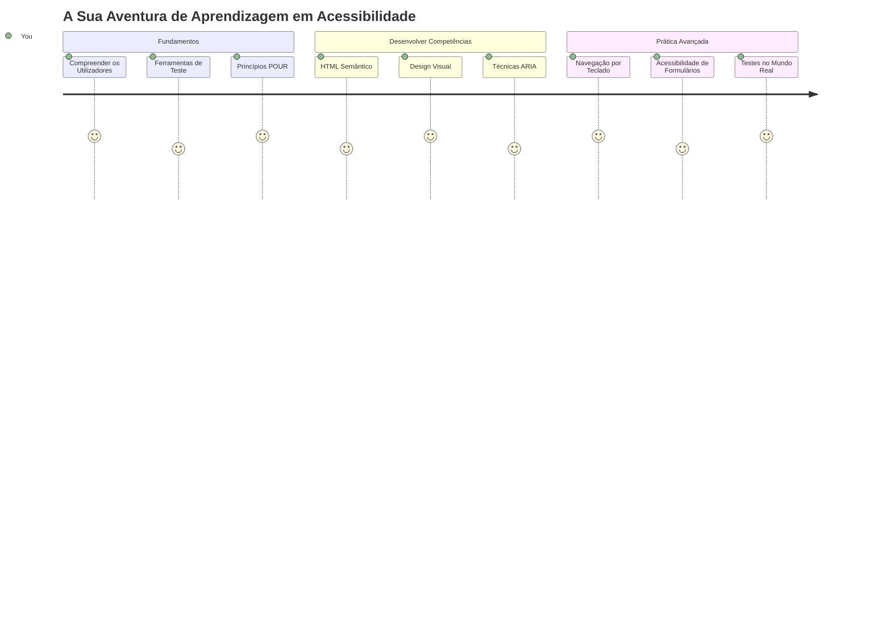
## Quiz Pré-Aula
[Quiz pré-aula](https://ff-quizzes.netlify.app/web/)

> O poder da Web está na sua universalidade. O acesso por todos, independentemente da deficiência, é um aspeto essencial.
>
> \- Sir Timothy Berners-Lee, Diretor do W3C e inventor da World Wide Web

Aqui está algo que pode surpreender-te: quando crias websites acessíveis, não estás apenas a ajudar pessoas com deficiências—estás na verdade a tornar a web melhor para todos!

Alguma vez reparaste naqueles rebaixos nos passeios? Eles foram originalmente desenhados para cadeiras de rodas, mas agora ajudam pessoas com carrinhos de bebé, trabalhadores de entregas com carrinhos, viajantes com bagagem com rodas e também ciclistas. É exatamente assim que o design web acessível funciona—soluções que ajudam um grupo acabam muitas vezes por beneficiar todos. Porreiro, não é?

Nesta lição, vamos explorar como criar websites que realmente funcionam para toda a gente, independentemente da forma como navegam na web. Vais descobrir técnicas práticas que já estão integradas nos standards web, experimentar ferramentas de teste e ver como a acessibilidade torna os teus sites mais utilizáveis para todos os utilizadores.

No final desta lição, vais ter a confiança para fazer da acessibilidade uma parte natural do teu fluxo de trabalho de desenvolvimento. Pronto para explorar como escolhas cuidadosas de design podem abrir a web a biliões de utilizadores? Vamos a isso!

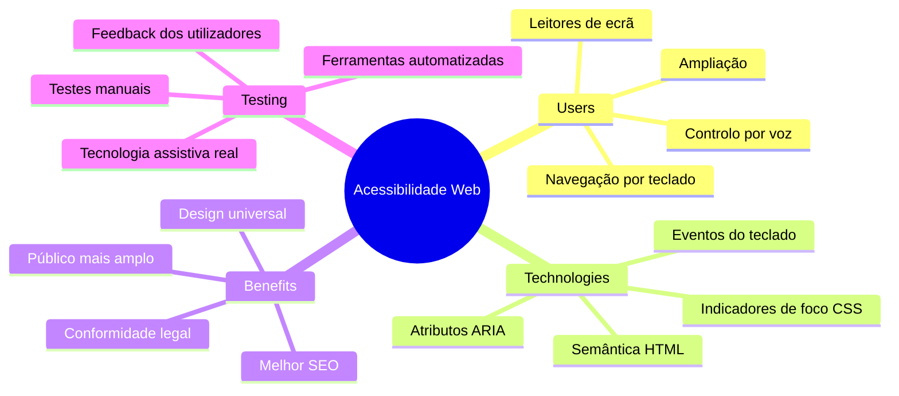
> Podes fazer esta lição no [Microsoft Learn](https://docs.microsoft.com/learn/modules/web-development-101/accessibility/?WT.mc_id=academic-77807-sagibbon)!

## Compreender Tecnologias Assistivas

Antes de começarmos a codificar, vamos tirar um momento para entender como as pessoas com diferentes capacidades realmente experienciam a web. Isto não é só teoria—compreender estes padrões de navegação do mundo real vai fazer de ti um desenvolvedor muito melhor!

Tecnologias assistivas são ferramentas bastante incríveis que ajudam pessoas com deficiências a interagir com websites de formas que podem surpreender-te. Assim que percebes como estas tecnologias funcionam, criar experiências web acessíveis torna-se muito mais intuitivo. É como aprender a ver o teu código pelos olhos de outra pessoa.

### Leitores de ecrã

[Leitores de ecrã](https://en.wikipedia.org/wiki/Screen_reader) são tecnologias bastante sofisticadas que convertem texto digital em fala ou saída braille. Embora sejam principalmente usados por pessoas com deficiências visuais, são também extremamente úteis para utilizadores com dificuldades de aprendizagem como a dislexia.

Gosto de pensar num leitor de ecrã como ter um narrador realmente inteligente a ler um livro para ti. Ele lê o conteúdo em voz alta numa ordem lógica, anuncia elementos interativos como "botão" ou "link" e fornece atalhos de teclado para saltar pela página. Mas aqui está a questão—os leitores de ecrã só funcionam completamente se construirmos websites com estrutura correta e conteúdo significativo. É aqui que entras como desenvolvedor!

**Leitores de ecrã populares em diferentes plataformas:**
- **Windows**: [NVDA](https://www.nvaccess.org/about-nvda/) (grátis e mais popular), [JAWS](https://webaim.org/articles/jaws/), [Narrator](https://support.microsoft.com/windows/complete-guide-to-narrator-e4397a0d-ef4f-b386-d8ae-c172f109bdb1/?WT.mc_id=academic-77807-sagibbon) (integrado)
- **macOS/iOS**: [VoiceOver](https://support.apple.com/guide/voiceover/welcome/10) (integrado e muito capaz)
- **Android**: [TalkBack](https://support.google.com/accessibility/android/answer/6283677) (integrado)
- **Linux**: [Orca](https://wiki.gnome.org/Projects/Orca) (grátis e open-source)

**Como os leitores de ecrã navegam pelo conteúdo web:**

Os leitores de ecrã oferecem múltiplos métodos de navegação que tornam a navegação eficiente para utilizadores experientes:
- **Leitura sequencial**: Lê o conteúdo de cima para baixo, como seguir um livro
- **Navegação por marcos (landmarks)**: Salta entre secções da página (header, nav, main, footer)
- **Navegação por títulos**: Passa entre cabeçalhos para compreender a estrutura da página
- **Listas de links**: Gera uma lista de todos os links para acesso rápido
- **Controlo de formulários**: Navega diretamente entre campos de entrada e botões

> 💡 **Isto surpreendeu-me mesmo**: 68% dos utilizadores de leitores de ecrã navegam principalmente por cabeçalhos ([WebAIM Survey](https://webaim.org/projects/screenreadersurvey9/#finding)). Isto significa que a tua estrutura de cabeçalhos é como um mapa para os utilizadores—quando a fazes bem, estás literalmente a ajudar as pessoas a encontrarem-se mais depressa no teu conteúdo!

### Construir o teu fluxo de trabalho de testes

Aqui vai uma boa notícia—testar acessibilidade de forma eficaz não tem de ser esmagador! Vais querer combinar ferramentas automáticas (são fantásticas para apanhar problemas óbvios) com algum teste prático. Aqui está uma abordagem sistemática que encontrei, que apanha a maioria dos problemas sem te roubar o dia todo:

**Fluxo de trabalho essencial para testes manuais:**

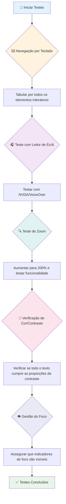
**Checklist passo-a-passo para testes:**
1. **Navegação por teclado**: Usa apenas Tab, Shift+Tab, Enter, Espaço e teclas de seta
2. **Teste com leitor de ecrã**: Ativa NVDA, VoiceOver ou Narrator e navega de olhos fechados
3. **Teste de zoom**: Testa nos níveis de zoom 200% e 400%
4. **Verificação do contraste de cores**: Confere todo o texto e componentes da interface
5. **Teste de indicadores de foco**: Assegura que todos os elementos interativos têm estados de foco visíveis

✅ **Começa com o Lighthouse**: Abre as ferramentas de desenvolvedor do teu browser, executa uma auditoria de acessibilidade com o Lighthouse e depois usa os resultados para guiar as tuas áreas de foco em testes manuais.

### Zoom e ferramentas de ampliação

Sabes quando às vezes fazes um gesto de pinça para dar zoom no telemóvel porque o texto está pequeno, ou semicerras os olhos para ver melhor o ecrã do portátil ao sol? Muitos utilizadores contam com ferramentas de ampliação para tornar o conteúdo legível todos os dias. Isto inclui pessoas com baixa visão, adultos mais idosos e quem alguma vez tentou ler um website ao ar livre.

Tecnologias modernas de zoom evoluíram para além de apenas tornar tudo maior. Compreender como estas ferramentas funcionam vai ajudar-te a criar designs responsivos que continuam funcionais e atraentes em qualquer nível de ampliação.

**Capacidades modernas de zoom nos browsers:**
- **Zoom da página**: Escala todo o conteúdo proporcionalmente (texto, imagens, layout) - este é o método preferido
- **Zoom só do texto**: Aumenta o tamanho da fonte mantendo o layout original
- **Pinch-to-zoom**: Suporte móvel para ampliação temporária
- **Suporte dos browsers**: Todos os browsers modernos suportam zoom até 500% sem comprometer funcionalidade

**Software especializado de ampliação:**
- **Windows**: [Ampliador](https://support.microsoft.com/windows/use-magnifier-to-make-things-on-the-screen-easier-to-see-414948ba-8b1c-d3bd-8615-0e5e32204198) (integrado), [ZoomText](https://www.freedomscientific.com/training/zoomtext/getting-started/)
- **macOS/iOS**: [Zoom](https://www.apple.com/accessibility/mac/vision/) (integrado com funcionalidades avançadas)

> ⚠️ **Consideração de design**: O WCAG exige que o conteúdo permaneça funcional quando ampliado a 200%. Neste nível, a rolagem horizontal deve ser mínima e todos os elementos interativos devem continuar acessíveis.

✅ **Testa o teu design responsivo**: Dá zoom ao browser a 200% e 400%. O teu layout adapta-se graciosamente? Consegues aceder a toda a funcionalidade sem necessidade de rolagem excessiva?

## Ferramentas modernas de teste de acessibilidade

Agora que percebes como as pessoas navegam na web com tecnologias assistivas, vamos explorar as ferramentas que te ajudam a construir e testar websites acessíveis.

Pensa assim: ferramentas automáticas são ótimas para apanhar problemas evidentes (como texto alt em falta), enquanto testes práticos ajudam a garantir que o teu site é agradável de usar na vida real. Juntas, dão-te a confiança que os teus sites funcionam para toda a gente.

### Teste de contraste de cores

Aqui vai uma boa notícia: contraste de cores é um dos problemas de acessibilidade mais comuns, mas também um dos mais fáceis de corrigir. Um bom contraste beneficia toda a gente—desde utilizadores com deficiência visual a pessoas a tentar ler os seus telemóveis na praia.

**Requisitos de contraste segundo WCAG:**

| Tipo de Texto | WCAG AA (Mínimo) | WCAG AAA (Aumentado) |
|---------------|------------------|---------------------|
| **Texto normal** (menos de 18pt) | Razão de contraste 4.5:1 | Razão de contraste 7:1 |
| **Texto grande** (18pt+ ou 14pt+ a negrito) | Razão de contraste 3:1 | Razão de contraste 4.5:1 |
| **Componentes da UI** (botões, bordas de formulário) | Razão de contraste 3:1 | Razão de contraste 3:1 |

**Ferramentas essenciais para teste:**
- [Colour Contrast Analyser](https://www.tpgi.com/color-contrast-checker/) - Aplicação desktop com seletor de cor
- [WebAIM Contrast Checker](https://webaim.org/resources/contrastchecker/) - Online com feedback instantâneo
- [Stark](https://www.getstark.co/) - Plugin de design para Figma, Sketch, Adobe XD
- [Accessible Colors](https://accessible-colors.com/) - Encontra paletas de cores acessíveis

✅ **Constrói melhores paletas de cores**: Começa com as cores da tua marca e usa verificadores de contraste para criar variações acessíveis. Documenta-as como tokens de cor acessíveis do teu sistema de design.

### Auditoria abrangente de acessibilidade

O teste de acessibilidade mais eficaz combina múltiplas abordagens. Nenhuma ferramenta única apanha tudo, por isso construir uma rotina de testes com vários métodos garante cobertura completa.

**Testes no browser (integrados nas DevTools):**
- **Chrome/Edge**: Auditoria de acessibilidade Lighthouse + Painel de acessibilidade
- **Firefox**: Inspector de acessibilidade com vista detalhada da árvore
- **Safari**: Separador de auditoria no Web Inspector com simulação VoiceOver

**Extensões profissionais de teste:**
- [axe DevTools](https://www.deque.com/axe/devtools/) - Testes automáticos padrão da indústria
- [WAVE](https://wave.webaim.org/extension/) - Feedback visual com destaque de erros
- [Accessibility Insights](https://accessibilityinsights.io/) - Conjunto abrangente de testes da Microsoft

**Linha de comando e integração CI/CD:**
- [axe-core](https://github.com/dequelabs/axe-core) - Biblioteca JavaScript para testes automáticos
- [Pa11y](https://pa11y.org/) - Ferramenta CLI para teste de acessibilidade
- [Lighthouse CI](https://github.com/GoogleChrome/lighthouse-ci) - Avaliação automática de acessibilidade

> 🎯 **Objetivo de teste**: Aponta a uma pontuação de acessibilidade do Lighthouse de 95+ como baseline. Lembra-te, ferramentas automáticas apanham apenas cerca de 30-40% dos problemas de acessibilidade—testes manuais continuam essenciais!

### 🧠 **Teste das tuas competências: Pronto para encontrar problemas?**

**Vamos ver como te sentes sobre testes de acessibilidade:**
- Qual método de teste te parece mais acessível neste momento?
- Consegues imaginar usar apenas navegação por teclado durante todo um dia?
- Qual é uma barreira de acessibilidade que já experimentaste pessoalmente online?

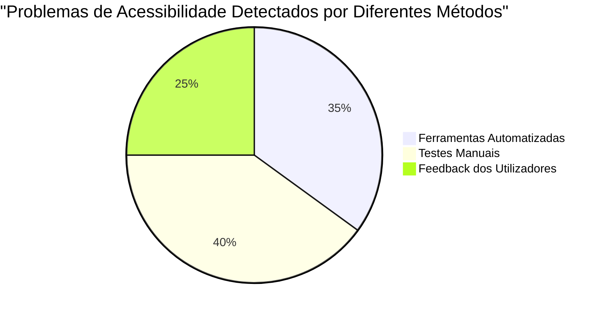
> **Impulsionador de confiança**: Testadores profissionais de acessibilidade usam exatamente esta combinação de métodos. Estás a aprender práticas padrão da indústria!

## Construir Acessibilidade desde a Base

A chave para o sucesso na acessibilidade é incorporá-la desde o início. Sei que é tentador pensar "vou adicionar acessibilidade mais tarde", mas isso é como tentar adicionar uma rampa a uma casa depois desta já estar construída. É possível? Sim. Fácil? Nem por isso.

Pensa na acessibilidade como planear uma casa—é muito mais fácil incluir acessibilidade para cadeiras de rodas nos planos arquitetónicos iniciais do que depois remodelar tudo.

### Os princípios POUR: A tua base para acessibilidade

As Diretrizes de Acessibilidade para Conteúdo Web (WCAG) baseiam-se em quatro princípios fundamentais que formam o POUR. Não te preocupes—isto não são conceitos académicos enfadonhos! São na verdade diretrizes práticas para criar conteúdos que funcionem para toda a gente.

Quando dominares o POUR, tomar decisões sobre acessibilidade torna-se muito mais intuitivo. É como ter um checklist mental que guia as tuas escolhas de design. Vamos analisar:

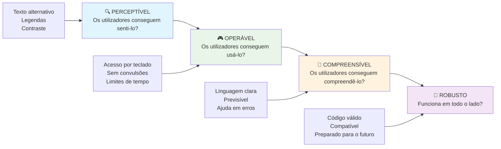
**🔍 Perceptível**: A informação deve ser apresentável de formas que os utilizadores possam perceber através dos seus sentidos disponíveis

- Fornece alternativas textuais para conteúdo não textual (imagens, vídeos, áudio)
- Garante contraste de cor suficiente para todo o texto e componentes da interface
- Oferece legendas e transcrições para conteúdos multimédia
- Desenha conteúdo que permaneça funcional ao ser redimensionado até 200%
- Usa múltiplas características sensoriais (não apenas cor) para transmitir informação

**🎮 Operável**: Todos os componentes da interface devem ser operáveis através dos métodos de entrada disponíveis

- Torna toda a funcionalidade acessível via navegação por teclado
- Dá aos utilizadores tempo suficiente para ler e interagir com o conteúdo
- Evita conteúdos que provoquem convulsões ou distúrbios vestibulares
- Ajuda os utilizadores a navegar eficientemente com estrutura clara e marcos
- Assegura que os elementos interativos têm tamanhos de alvo adequados (mínimo 44px)

**📖 Compreensível**: A informação e a operação da interface devem ser claras e compreensíveis

- Usa uma linguagem clara e simples, apropriada ao público
- Assegura que o conteúdo aparece e funciona de forma previsível e consistente
- Fornece instruções claras e mensagens de erro para entrada do utilizador
- Ajuda os utilizadores a compreender e corrigir erros nos formulários
- Organiza o conteúdo com ordem lógica de leitura e hierarquia de informação

**💪 Robusto**: O conteúdo deve funcionar de forma fiável em diferentes tecnologias e dispositivos assistivos

- **Usa HTML válido e semântico como tua base**
- **Garante compatibilidade com tecnologias assistivas atuais e futuras**
- **Segue standards web e boas práticas para marcação**
- **Testar em diferentes navegadores, dispositivos e ferramentas assistivas**
- **Estruturar o conteúdo para que degrade de forma elegante quando funcionalidades avançadas não forem suportadas**

### 🎯 **Verificação dos Princípios POUR: Fixando o Conhecimento**

**Reflexão rápida sobre os fundamentos:**
- Consegue pensar numa funcionalidade de um website que falhe em cada princípio POUR?
- Qual princípio lhe parece mais natural enquanto desenvolvedor?
- Como podem estes princípios melhorar o design para todos, e não apenas para pessoas com deficiência?

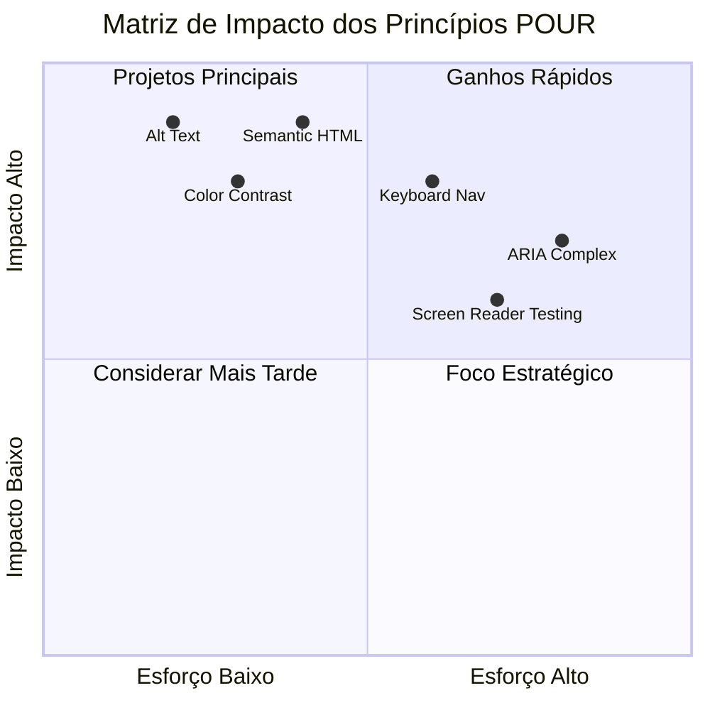
> **Lembrete**: Comece por melhorias de alto impacto e baixo esforço. HTML semântico e texto alternativo oferecem o maior aumento em acessibilidade com o menor esforço!

## Criar Design Visual Acessível

Um bom design visual e a acessibilidade andam de mãos dadas. Quando projeta com acessibilidade em mente, frequentemente descobre que estas restrições levam a soluções mais simples e elegantes que beneficiam todos os utilizadores.

Vamos explorar como criar designs visualmente apelativos que funcionem para todos, independentemente das suas capacidades visuais ou das condições nas quais estão a visualizar o seu conteúdo.

### Estratégias de cor e acessibilidade visual

A cor é poderosa para comunicação, mas nunca deve ser o único meio para transmitir informação importante. Projetar além da cor cria experiências mais robustas e inclusivas que funcionam em mais situações.

**Projetar para diferenças na visão das cores:**

Aproximadamente 8% dos homens e 0,5% das mulheres têm algum tipo de diferença na perceção das cores (frequentemente chamada "daltonismo"). Os tipos mais comuns são:
- **Deuteranopia**: Dificuldade em distinguir vermelho e verde
- **Protanopia**: O vermelho aparece mais escuro
- **Tritanopia**: Dificuldade com azul e amarelo (raro)

**Estratégias inclusivas de cor:**

```css
/* ❌ Bad: Using only color to indicate status */
.error { color: red; }
.success { color: green; }

/* ✅ Good: Color plus icons and context */
.error {
  color: #d32f2f;
  border-left: 4px solid #d32f2f;
}
.error::before {
  content: "⚠️";
  margin-right: 8px;
}

.success {
  color: #2e7d32;
  border-left: 4px solid #2e7d32;
}
.success::before {
  content: "✅";
  margin-right: 8px;
}
```

**Para além dos requisitos básicos de contraste:**
- Teste as suas escolhas de cores com simuladores de daltonismo
- Use padrões, texturas ou formas em conjunto com a codificação de cor
- Garanta que estados interativos permanecem distinguíveis sem cor
- Considere como o seu design se apresenta em modo de alto contraste

✅ **Teste a acessibilidade da cor**: Use ferramentas como [Coblis](https://www.color-blindness.com/coblis-color-blindness-simulator/) para ver como o seu site aparece para utilizadores com diferentes tipos de visão das cores.

### Indicadores de foco e design de interação

Indicadores de foco são o equivalente digital de um cursor — mostram aos utilizadores de teclado onde eles estão na página. Indicadores de foco bem desenhados melhoram a experiência para todos, tornando as interações claras e previsíveis.

**Melhores práticas modernas para indicadores de foco:**

```css
/* Enhanced focus styles that work across browsers */
button:focus-visible {
  outline: 2px solid #0066cc;
  outline-offset: 2px;
  box-shadow: 0 0 0 4px rgba(0, 102, 204, 0.25);
}

/* Remove focus outline for mouse users, preserve for keyboard users */
button:focus:not(:focus-visible) {
  outline: none;
}

/* Focus-within for complex components */
.card:focus-within {
  box-shadow: 0 0 0 3px rgba(74, 144, 164, 0.5);
  border-color: #4A90A4;
}

/* Ensure focus indicators meet contrast requirements */
.custom-focus:focus-visible {
  outline: 3px solid #ffffff;
  outline-offset: 2px;
  box-shadow: 0 0 0 6px #000000;
}
```

**Requisitos dos indicadores de foco:**
- **Visibilidade**: Deve ter pelo menos uma relação de contraste de 3:1 com os elementos envolventes
- **Largura**: Espessura mínima de 2px em redor de todo o elemento
- **Persistência**: Deve permanecer visível até o foco mudar para outro local
- **Distinção**: Deve ser visualmente diferente dos outros estados da UI

> 💡 **Dica de Design**: Bons indicadores de foco usam frequentemente uma combinação de contorno, sombra e mudanças de cor para garantir visibilidade em diferentes fundos e contextos.

✅ **Auditagem dos indicadores de foco**: Navegue por tabulação no seu website e verifique quais elementos apresentam indicadores de foco claros. Existem alguns difíceis de ver ou completamente ausentes?

### HTML Semântico: A base da acessibilidade

HTML semântico é como dar às tecnologias assistivas um sistema GPS para o seu website. Quando usa os elementos HTML corretos para o seu propósito, está a fornecer aos leitores de ecrã, teclados e outras ferramentas um mapa detalhado para ajudar os utilizadores a navegar eficazmente.

Aqui está uma analogia que me fez sentido: HTML semântico é a diferença entre uma biblioteca bem organizada com categorias claras e sinais úteis versus um armazém onde os livros estão espalhados aleatoriamente. Ambos os locais têm os mesmos livros, mas onde preferiria procurar algo? Exatamente!

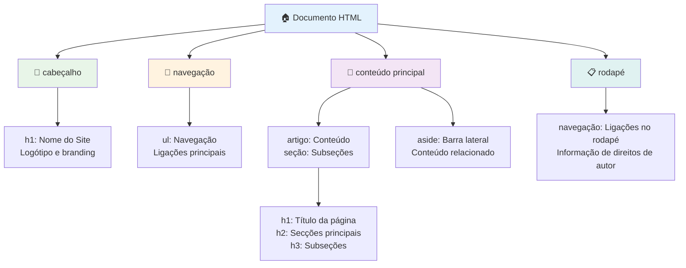
**Blocos de construção da estrutura acessível da página:**

```html
<!-- Landmark elements provide page navigation structure -->
<header>
  <h1>Your Site Name</h1>
  <nav aria-label="Main navigation">
    <ul>
      <li><a href="/home">Home</a></li>
      <li><a href="/about">About</a></li>
      <li><a href="/services">Services</a></li>
    </ul>
  </nav>
</header>

<main>
  <article>
    <header>
      <h1>Article Title</h1>
      <p>Published on <time datetime="2024-10-14">October 14, 2024</time></p>
    </header>
    
    <section>
      <h2>First Section</h2>
      <p>Content that relates to this section...</p>
    </section>
    
    <section>
      <h2>Second Section</h2>
      <p>More related content...</p>
    </section>
  </article>
  
  <aside>
    <h2>Related Links</h2>
    <nav aria-label="Related articles">
      <ul>
        <li><a href="/related-1">First related article</a></li>
        <li><a href="/related-2">Second related article</a></li>
      </ul>
    </nav>
  </aside>
</main>

<footer>
  <p>&copy; 2024 Your Site Name. All rights reserved.</p>
  <nav aria-label="Footer links">
    <ul>
      <li><a href="/privacy">Privacy Policy</a></li>
      <li><a href="/contact">Contact Us</a></li>
    </ul>
  </nav>
</footer>
```

**Porque é que o HTML semântico transforma a acessibilidade:**

| Elemento Semântico | Propósito | Benefício para Leitores de Ecrã |
|-------------------|-----------|---------------------------------|
| `<header>`        | Cabeçalho da página ou secção | "Ponto de referência Banner" - navegação rápida ao topo |
| `<nav>`          | Ligações de navegação         | "Ponto de referência Navegação" - lista de secções de navegação |
| `<main>`         | Conteúdo principal da página  | "Ponto de referência Principal" - saltar diretamente para o conteúdo |
| `<article>`      | Conteúdo autónomo             | Anuncia os limites do artigo |
| `<section>`      | Grupos temáticos de conteúdo  | Fornece estrutura ao conteúdo |
| `<aside>`        | Conteúdo relacionado na barra lateral | "Ponto de referência Complementar" |
| `<footer>`       | Rodapé da página ou secção    | "Ponto de referência Informação de conteúdo" |

**Poderes extra dos leitores de ecrã com HTML semântico:**
- **Navegação por pontos de referência**: Saltar rapidamente entre as principais secções da página
- **Esboços de cabeçalhos**: Gerar uma tabela de conteúdos a partir da estrutura de cabeçalhos
- **Listas de elementos**: Criar listas de todos os links, botões ou controlos de formulário
- **Consciência de contexto**: Compreender as relações entre secções de conteúdo

> 🎯 **Teste rápido**: Experimente navegar no seu site com um leitor de ecrã usando atalhos para pontos de referência (D para landmark, H para heading, K para link no NVDA/JAWS). A navegação faz sentido?

### 🏗️ **Verificação de Domínio do HTML Semântico: Construir Bases Fortes**

**Vamos avaliar o seu entendimento semântico:**
- Consegue identificar os pontos de referência numa página apenas olhando para o HTML?
- Como explicaria a diferença entre `<section>` e `<div>` a um amigo?
- O que é que veria primeiro se um utilizador de leitor de ecrã relatasse problemas de navegação?

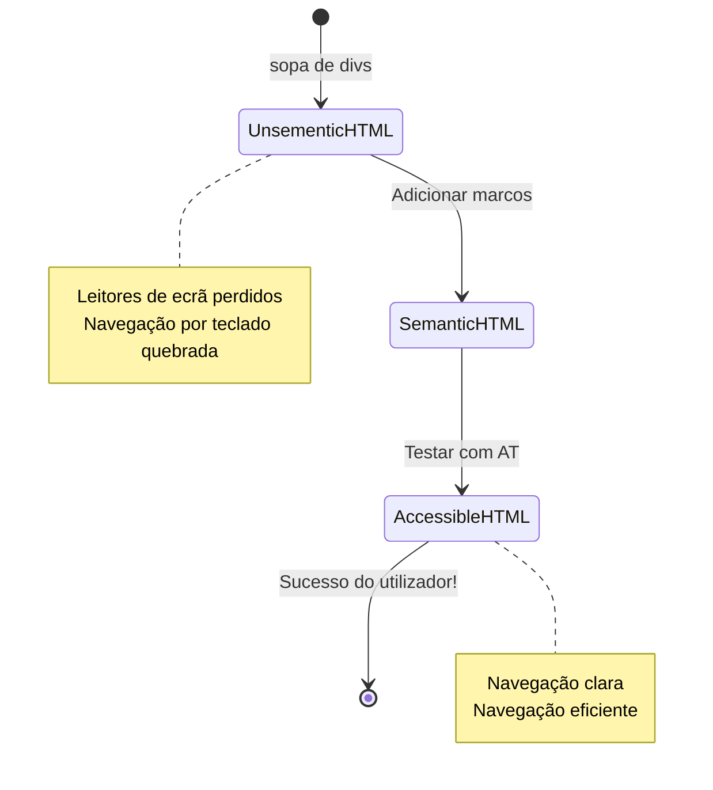
> **Dica profissional**: HTML semântico bem feito resolve cerca de 70% dos problemas de acessibilidade automaticamente. Domine esta base e está no bom caminho!

✅ **Audite a sua estrutura semântica**: Use o painel de Acessibilidade nas Ferramentas de Desenvolvimento do seu navegador para visualizar a árvore de acessibilidade e garantir que a sua marcação cria uma estrutura lógica.

### Hierarquia de cabeçalhos: Criar um esquema lógico de conteúdo

Os cabeçalhos são absolutamente cruciais para conteúdos acessíveis — são como a espinha dorsal que mantém tudo unido. Utilizadores de leitores de ecrã dependem fortemente dos cabeçalhos para compreender e navegar no seu conteúdo. Pense nisto como fornecer uma tabela de conteúdos para a sua página.

**A regra de ouro para os cabeçalhos:**
Nunca salte níveis. Progrida sempre logicamente de `<h1>` para `<h2>`, depois para `<h3>`, e assim sucessivamente. Lembra-se de fazer esquemas na escola? É exatamente o mesmo princípio — não saltaria de "I. Ponto Principal" diretamente para "C. Sub-subponto" sem antes passar por "A. Subponto", certo?

**Exemplo perfeito de estrutura de cabeçalhos:**

```html
<!-- ✅ Excellent: Logical, hierarchical progression -->
<main>
  <h1>Complete Guide to Web Accessibility</h1>
  
  <section>
    <h2>Understanding Screen Readers</h2>
    <p>Introduction to screen reader technology...</p>
    
    <h3>Popular Screen Reader Software</h3>
    <p>NVDA, JAWS, and VoiceOver comparison...</p>
    
    <h3>Testing with Screen Readers</h3>
    <p>Step-by-step testing instructions...</p>
  </section>
  
  <section>
    <h2>Color and Contrast Guidelines</h2>
    <p>Designing with sufficient contrast...</p>
    
    <h3>WCAG Contrast Requirements</h3>
    <p>Understanding the different contrast levels...</p>
    
    <h3>Testing Tools and Techniques</h3>
    <p>Tools for verifying contrast ratios...</p>
  </section>
</main>
```

```html
<!-- ❌ Problematic: Skipping levels, inconsistent structure -->
<h1>Page Title</h1>
<h3>Subsection</h3> <!-- Skipped h2 -->
<h2>This should come before h3</h2>
<h1>Another main heading?</h1> <!-- Multiple h1s -->
```

**Melhores práticas para cabeçalhos:**
- **Um `<h1>` por página**: Tipicamente o título principal da página ou do conteúdo
- **Progressão lógica**: Nunca salte níveis (h1 → h2 → h3, não h1 → h3)
- **Conteúdo descritivo**: Faça cabeçalhos que façam sentido mesmo lidos fora de contexto
- **Estilização visual com CSS**: Use CSS para a aparência, níveis HTML para a estrutura

**Estatísticas de navegação em leitores de ecrã:**
- 68% dos utilizadores de leitores de ecrã navegam por cabeçalhos ([WebAIM Survey](https://webaim.org/projects/screenreadersurvey9/#finding))
- Os utilizadores esperam encontrar um esquema lógico de cabeçalhos
- Os cabeçalhos proporcionam a forma mais rápida de compreender a estrutura da página

> 💡 **Dica profissional**: Use extensões do navegador como "HeadingsMap" para visualizar a sua estrutura de cabeçalhos. Deve ler-se como uma tabela de conteúdos bem organizada.

✅ **Teste a sua estrutura de cabeçalhos**: Use a navegação por cabeçalhos de um leitor de ecrã (tecla H no NVDA) para saltar entre os seus cabeçalhos. A progressão conta a história do seu conteúdo de forma lógica?

### Técnicas avançadas de acessibilidade visual

Além do básico do contraste e cor, existem técnicas sofisticadas que ajudam a criar experiências visuais verdadeiramente inclusivas. Estes métodos asseguram que o seu conteúdo funciona sob diferentes condições de visualização e tecnologias assistivas.

**Estratégias essenciais de comunicação visual:**

- **Feedback multimodal**: Combine sinais visuais, textuais e por vezes auditivos
- **Divulgação progressiva**: Apresente a informação em partes digeríveis
- **Padrões consistentes de interação**: Use convenções de UI familiares
- **Tipografia responsiva**: Escale o texto adequadamente em diferentes dispositivos
- **Estados de carregamento e erro**: Forneça feedback claro para todas as ações do utilizador

**Utilitários CSS para melhor acessibilidade:**

```css
/* Screen reader only text - visually hidden but accessible */
.sr-only {
  position: absolute;
  width: 1px;
  height: 1px;
  padding: 0;
  margin: -1px;
  overflow: hidden;
  clip: rect(0, 0, 0, 0);
  white-space: nowrap;
  border: 0;
}

/* Skip link for keyboard navigation */
.skip-link {
  position: absolute;
  top: -40px;
  left: 6px;
  background: #000000;
  color: #ffffff;
  padding: 8px 16px;
  text-decoration: none;
  border-radius: 4px;
  font-weight: bold;
  transition: top 0.3s ease;
  z-index: 1000;
}

.skip-link:focus {
  top: 6px;
}

/* Reduced motion respect */
@media (prefers-reduced-motion: reduce) {
  .skip-link {
    transition: none;
  }
  
  * {
    animation-duration: 0.01ms !important;
    animation-iteration-count: 1 !important;
    transition-duration: 0.01ms !important;
  }
}

/* High contrast mode support */
@media (prefers-contrast: high) {
  .button {
    border: 2px solid;
  }
}
```

> 🎯 **Padrão de acessibilidade**: O "link de salto" é essencial para utilizadores de teclado. Deve ser o primeiro elemento focável na sua página e saltar diretamente para a área de conteúdo principal.

✅ **Implemente a navegação de salto**: Adicione links de salto às suas páginas e teste-os pressionando Tab assim que a página carregar. Devem aparecer e permitir saltar para o conteúdo principal.

## Criar Texto de Link Significativo

Os links são basicamente as autoestradas da web, mas texto de link mal escrito é como ter sinais rodoviários que apenas dizem "Lugar" em vez de "Centro da Cidade de Chicago". Pouco útil, certo?

Aqui está algo que me espantou quando aprendi: os leitores de ecrã podem extrair todos os links de uma página e mostrá-los como uma lista enorme. Imagine se alguém lhe desse um diretório com todos os links da sua página. Cada um faria sentido sozinho? Esse é o teste que o texto do seu link precisa passar!

### Compreender padrões de navegação por links

Os leitores de ecrã oferecem poderosas funcionalidades de navegação por links que dependem de texto de link bem escrito:

**Métodos de navegação por link:**
- **Leitura sequencial**: Os links são lidos no contexto como parte do fluxo de conteúdo
- **Geração de lista de links**: Todos os links da página compilados numa lista pesquisável
- **Navegação rápida**: Saltar entre links usando atalhos de teclado (K no NVDA)
- **Funcionalidade de pesquisa**: Encontrar links específicos digitando parte do texto

**Porque o contexto importa:**
Quando utilizadores de leitores de ecrã geram uma lista de links, vêem algo assim:
- "Descarregar relatório"
- "Saiba mais"
- "Clique aqui"
- "Política de privacidade"
- "Clique aqui"

Apenas dois destes links fornecem informação útil quando lidos fora de contexto!

> 📊 **Impacto no utilizador**: Utilizadores de leitores de ecrã vasculham listas de links para compreender rapidamente o conteúdo da página. Texto de link genérico obriga-os a regressar ao contexto de cada link, atrasando significativamente a navegação.

### Erros comuns em texto de link a evitar

Compreender o que não funciona ajuda a reconhecer e corrigir problemas de acessibilidade em conteúdos existentes.

**❌ Texto de link genérico que não fornece contexto:**

```html
<!-- Meaningless when read from a link list -->
<p>Our sustainability efforts are detailed in our recent report. 
   <a href="/sustainability-2024.pdf">Click here</a> to view it.</p>

<!-- Repeated generic text throughout the page -->
<div class="article-card">
  <h3>Web Accessibility Guide</h3>
  <p>Learn the fundamentals...</p>
  <a href="/accessibility-guide">Read more</a>
</div>
<div class="article-card">
  <h3>Color Contrast Tips</h3>
  <p>Improve your design...</p>
  <a href="/color-contrast">Read more</a>
</div>

<!-- URLs as link text (difficult for screen readers to announce) -->
<p>Visit https://www.w3.org/WAI/WCAG21/quickref/ for WCAG guidelines.</p>

<!-- Vague action words -->
<a href="/contact">Go</a> | <a href="/about">See</a> | <a href="/help">View</a>
```

**Porque estes padrões falham:**
- **"Clique aqui"** não informa os utilizadores sobre o destino
- **"Leia mais"** repetido várias vezes cria confusão
- **URLs em bruto** são difíceis de pronunciar claramente para leitores de ecrã
- **Palavras únicas** como "Ir" ou "Ver" carecem de contexto descritivo

### Escrever texto de link excelente

Texto de link descritivo beneficia todos — utilizadores videntes podem rapidamente verificar os links, e utilizadores de leitores de ecrã percebem os destinos imediatamente.

**✅ Exemplos claros e descritivos de texto de link:**

```html
<!-- Descriptive text that explains the destination -->
<p>Our comprehensive <a href="/sustainability-2024.pdf">2024 sustainability report (PDF, 2.1MB)</a> details our environmental initiatives.</p>

<!-- Specific, unique link text for each card -->
<div class="article-card">
  <h3>Web Accessibility Guide</h3>
  <p>Learn the fundamentals of inclusive design...</p>
  <a href="/accessibility-guide">Read our complete web accessibility guide</a>
</div>
<div class="article-card">
  <h3>Color Contrast Tips</h3>
  <p>Improve your design with better color choices...</p>
  <a href="/color-contrast">Explore color contrast best practices</a>
</div>

<!-- Meaningful text instead of raw URLs -->
<p>The <a href="https://www.w3.org/WAI/WCAG21/quickref/">WCAG 2.1 Quick Reference guide</a> provides comprehensive accessibility guidelines.</p>

<!-- Descriptive action links -->
<a href="/contact">Contact our support team</a> | 
<a href="/about">About our company</a> | 
<a href="/help">Get help with your account</a>
```

**Melhores práticas para texto de links:**
- **Seja específico**: "Descarregar o relatório financeiro trimestral" em vez de "Descarregar"
- **Inclua tipo e tamanho do ficheiro**: "(PDF, 1,2MB)" para ficheiros descarregáveis
- **Indique se os links abrem em nova janela**: "(abre numa nova janela)" quando apropriado
- **Use linguagem ativa**: "Contacte-nos" em vez de "Página de contacto"
- **Seja conciso**: Procure 2-8 palavras quando possível

### Padrões avançados de acessibilidade para links

Por vezes restrições de design visual ou requisitos técnicos exigem soluções especiais. Aqui estão técnicas sofisticadas para cenários comuns desafiadores:

**Usar ARIA para contexto reforçado:**

```html
<!-- When button text must be short but needs more context -->
<a href="/report.pdf" 
   aria-label="Download 2024 annual financial report, PDF format, 2.3MB">
  Download Report
</a>

<!-- When the full context comes from surrounding content -->
<h3 id="sustainability-heading">Sustainability Initiative</h3>
<p>Our efforts to reduce environmental impact...</p>
<a href="/sustainability-details" 
   aria-labelledby="sustainability-heading"
   aria-describedby="sustainability-summary">
  Learn more
</a>
<p id="sustainability-summary">Detailed breakdown of our 2024 environmental goals and achievements</p>
```

**Indicar tipos de ficheiros e destinos externos:**

```html
<!-- Method 1: Include information in visible link text -->
<a href="/annual-report.pdf">
  Download our 2024 annual report (PDF, 2.3MB)
</a>

<!-- Method 2: Use screen reader-only text for file details -->
<a href="/annual-report.pdf">
  Download our 2024 annual report
  <span class="sr-only">(PDF format, 2.3MB)</span>
</a>

<!-- Method 3: External link indication -->
<a href="https://example.com" 
   target="_blank" 
   aria-describedby="external-link-warning">
  Visit external resource
</a>
<span id="external-link-warning" class="sr-only">
  (opens in new window)
</span>

<!-- Method 4: Using CSS for visual indicators -->
<a href="https://example.com" class="external-link">
  External resource
</a>
```

```css
/* Visual indicator for external links */
.external-link::after {
  content: " ↗";
  font-size: 0.8em;
  color: #666;
}

/* Screen reader announcement for external links */
.external-link::before {
  content: "External link: ";
  position: absolute;
  left: -10000px;
  width: 1px;
  height: 1px;
  overflow: hidden;
}
```

> ⚠️ **Importante**: Ao usar `target="_blank"`, informe sempre os utilizadores que o link abre numa nova janela ou separador. Mudanças inesperadas de navegação podem ser desorientadoras.

✅ **Teste o contexto do seu link**: Use as ferramentas de desenvolvimento do seu navegador para gerar uma lista de todos os links na sua página. Consegue entender o propósito de cada link sem qualquer contexto adicional?

## ARIA: Potenciando a Acessibilidade HTML

[Aplicações Ricas na Internet Acessíveis (ARIA)](https://developer.mozilla.org/docs/Web/Accessibility/ARIA) é como ter um tradutor universal entre as suas aplicações web complexas e as tecnologias assistivas. Quando o HTML sozinho não consegue expressar tudo o que os seus componentes interativos fazem, o ARIA vem preencher essas lacunas.

Gosto de pensar no ARIA como anotação útil no seu HTML — como indicações de palco num guião teatral que ajudam os atores a compreender os seus papéis e relações.

**Aqui está a regra mais importante sobre ARIA**: Use SEMPRE primeiro HTML semântico, depois adicione ARIA para melhorar. Pense no ARIA como tempero, não o prato principal. Deve clarificar e melhorar a estrutura do seu HTML, nunca substituí-la. Domine primeiro a base correta!

### Implementação estratégica de ARIA

ARIA é poderoso, mas com poder vem responsabilidade. ARIA incorreta pode tornar a acessibilidade pior do que a sua ausência. Eis quando e como usar eficazmente:

**✅ Use ARIA quando:**
- Criar widgets interativos personalizados (acordions, separadores, carrosséis)
- Construir conteúdos dinâmicos que mudam sem recarregar a página
- Fornecer contexto adicional para relações complexas da UI
- Indicar estados de carregamento ou atualizações de conteúdo em direto
- Criar interfaces tipo aplicação com controlos personalizados

**❌ Evite ARIA quando:**
- Elementos HTML padrão já oferecem a semântica necessária
- Não souber como implementar corretamente
- Duplicar informação já provida pelo HTML semântico
- Não tiver testado com tecnologia assistiva real

> 🎯 **Regra de ouro do ARIA**: "Não altere a semântica a não ser que seja absolutamente necessário, assegure acessibilidade por teclado sempre, e teste com tecnologia assistiva real."
**As cinco categorias de ARIA:**

1. **Funções**: O que é este elemento? (`button`, `tab`, `dialog`)
2. **Propriedades**: Quais são as suas funcionalidades? (`aria-required`, `aria-haspopup`)
3. **Estados**: Qual é a sua condição atual? (`aria-expanded`, `aria-checked`)
4. **Marcos**: Onde está na estrutura da página? (`banner`, `navigation`, `main`)
5. **Regiões dinâmicas**: Como devem ser anunciadas as mudanças? (`aria-live`, `aria-atomic`)

### Padrões essenciais ARIA para aplicações web modernas

Estes padrões resolvem os desafios de acessibilidade mais comuns em aplicações web interativas:

**Nomear e descrever elementos:**

```html
<!-- aria-label: Provides accessible name when visible text isn't sufficient -->
<button aria-label="Close newsletter subscription dialog">×</button>

<!-- aria-labelledby: References existing text as the accessible name -->
<section aria-labelledby="news-heading">
  <h2 id="news-heading">Latest News</h2>
  <!-- news content -->
</section>

<!-- aria-describedby: Links to additional descriptive text -->
<input type="password" 
       aria-describedby="pwd-requirements pwd-strength"
       required>
<div id="pwd-requirements">
  Password must contain at least 8 characters, including uppercase, lowercase, and numbers.
</div>
<div id="pwd-strength" aria-live="polite">
  <!-- Dynamic password strength indicator -->
</div>
```

**Regiões dinâmicas para conteúdo dinâmico:**

```html
<!-- Polite announcements (don't interrupt current speech) -->
<div aria-live="polite" id="status-updates">
  <!-- Status messages appear here -->
</div>

<!-- Assertive announcements (interrupt and announce immediately) -->
<div aria-live="assertive" id="urgent-alerts">
  <!-- Error messages and critical alerts -->
</div>

<!-- Loading states with live regions -->
<button id="submit-btn" aria-describedby="loading-status">
  Submit Application
</button>
<div id="loading-status" aria-live="polite" aria-atomic="true">
  <!-- "Processing your application..." appears here -->
</div>
```

**Exemplo de componente interativo (acordeão):**

```html
<div class="accordion">
  <h3>
    <button aria-expanded="false" 
            aria-controls="panel-1" 
            id="accordion-trigger-1"
            class="accordion-trigger">
      Accessibility Guidelines
    </button>
  </h3>
  <div id="panel-1" 
       role="region"
       aria-labelledby="accordion-trigger-1" 
       hidden>
    <p>WCAG 2.1 provides comprehensive guidelines...</p>
  </div>
</div>
```

```javascript
// JavaScript para gerir o estado do acordeão
function toggleAccordion(trigger) {
  const panel = document.getElementById(trigger.getAttribute('aria-controls'));
  const isExpanded = trigger.getAttribute('aria-expanded') === 'true';
  
  // Alternar estados
  trigger.setAttribute('aria-expanded', !isExpanded);
  panel.hidden = isExpanded;
  
  // Anunciar mudança para leitores de ecrã
  const status = document.getElementById('status-updates');
  status.textContent = isExpanded ? 'Section collapsed' : 'Section expanded';
}
```

### Melhores práticas na implementação de ARIA

ARIA é poderosa, mas requer uma implementação cuidadosa. Seguir estas diretrizes ajuda a garantir que a sua ARIA realce e não prejudique a acessibilidade:

**🛡️ Princípios básicos:**

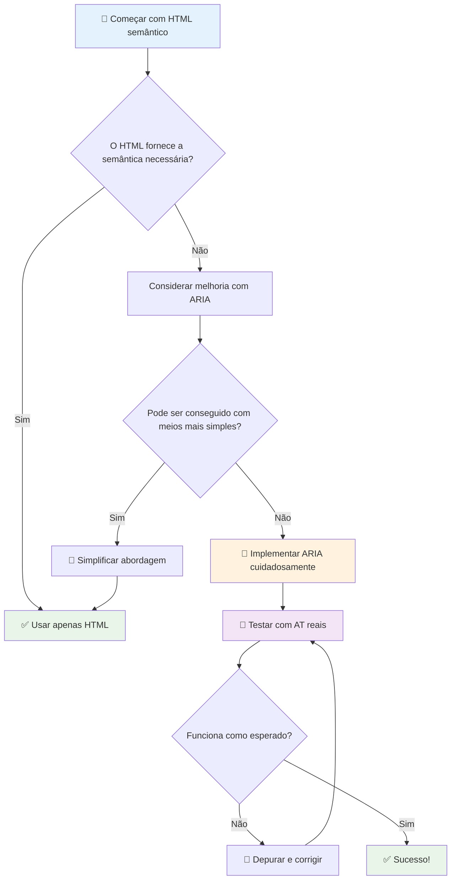
1. **HTML semântico primeiro**: Prefira sempre `<button>` a `<div role="button">`
2. **Não quebre a semântica**: Nunca sobreponha o significado existente do HTML (evite `<h1 role="button">`)
3. **Mantenha a acessibilidade por teclado**: Todos os elementos ARIA interativos devem ser totalmente acessíveis por teclado
4. **Teste com utilizadores reais**: O suporte ARIA varia bastante entre tecnologias assistivas
5. **Comece simples**: Implementações ARIA complexas têm maior probabilidade de erros

**🔍 Fluxo de trabalho de testes:**

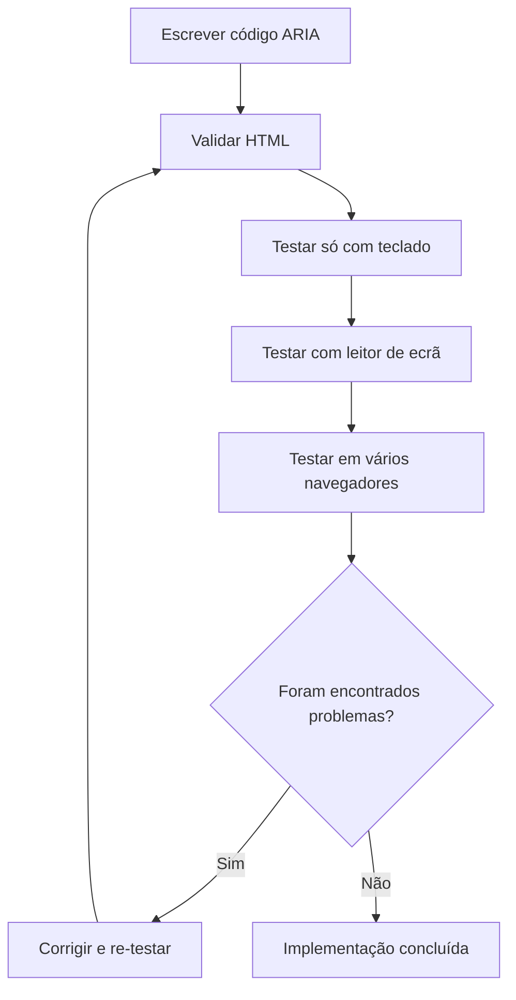
**🚫 Erros comuns de ARIA a evitar:**

- **Informação contraditória**: Não contradiga a semântica do HTML
- **Excesso de rotulagem**: Informação ARIA em demasia sobrecarrega os utilizadores
- **ARIA estática**: Esquecer de atualizar os estados ARIA quando o conteúdo muda
- **Implementações não testadas**: ARIA que funciona em teoria mas falha na prática
- **Falta de suporte ao teclado**: Funções ARIA sem interações correspondentes por teclado

> 💡 **Recursos para Testes**: Use ferramentas como [accessibility-checker](https://www.npmjs.com/package/accessibility-checker) para validação automática de ARIA, mas teste sempre com leitores de ecrã reais para a experiência completa.

### 🎭 **Verificação de Competências ARIA: Preparado para Interações Complexas?**

**Avalie a sua confiança com ARIA:**
- Quando escolheria ARIA em vez de HTML semântico? (Dica: quase nunca!)
- Consegue explicar por que `<div role="button">` é geralmente pior que `<button>`?
- Qual é a coisa mais importante a lembrar sobre testes ARIA?

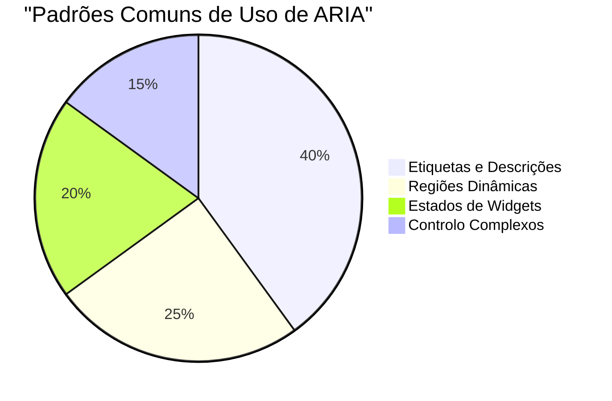
> **Insight chave**: A maior parte do uso de ARIA serve para rotular e descrever elementos. Padrões complexos de widgets são muito menos comuns do que se imagina!

✅ **Aprenda com especialistas**: Estude o [Guia de Práticas de Autoria ARIA](https://w3c.github.io/aria-practices/) para padrões validados e implementações de widgets interativos complexos.

## Tornar Imagens e Media Acessíveis

Conteúdos visuais e áudio são partes essenciais das experiências web modernas, mas podem criar barreiras se não forem implementados com cuidado. O objetivo é garantir que a informação e o impacto emocional do seu media cheguem a todos os utilizadores. Uma vez habituado, torna-se algo natural.

Diferentes tipos de media exigem abordagens diferentes de acessibilidade. É como cozinhar — não trataria um peixe delicado da mesma forma que um bife robusto. Compreender essas diferenças ajuda a escolher a solução certa para cada situação.

### Estratégia para acessibilidade de imagens

Cada imagem no seu site tem um propósito. Perceber esse propósito ajuda a escrever melhor texto alternativo e a criar experiências mais inclusivas.

**Os quatro tipos de imagens e as suas estratégias de texto alternativo:**

**Imagens informativas** – transmitem informação importante:
```html

```

**Imagens decorativas** – apenas visuais, sem valor informacional:
```html

```

**Imagens funcionais** – usadas como botões ou controlos:
```html
<button>
  
</button>
```

**Imagens complexas** – gráficos, diagramas, infografias:
```html

<div id="chart-description">
  <p>Detailed description: Sales data shows a steady increase across all quarters...</p>
</div>
```

### Acessibilidade de vídeo e áudio

**Requisitos para vídeo:**
- **Legendas**: Versão em texto do conteúdo falado e efeitos sonoros
- **Descrições áudio**: Narração dos elementos visuais para utilizadores cegos
- **Transcrições**: Versão completa em texto de todo o conteúdo áudio e visual

```html
<video controls>
  <source src="video.mp4" type="video/mp4">
  <track kind="captions" src="captions.vtt" srclang="en" label="English">
  <track kind="descriptions" src="descriptions.vtt" srclang="en" label="Audio descriptions">
</video>
```

**Requisitos para áudio:**
- **Transcrições**: Versão em texto de todo o conteúdo falado
- **Indicadores visuais**: Para conteúdos só áudio, forneça sinais visuais

### Técnicas modernas para imagens

**Usar CSS para imagens decorativas:**
```css
.hero-section {
  background-image: url('decorative-hero.jpg');
  /* Decorative images in CSS don't need alt text */
}
```

**Imagens responsivas com acessibilidade:**
```html
<picture>
  <source media="(min-width: 800px)" srcset="large-chart.png">
  <source media="(min-width: 400px)" srcset="medium-chart.png">
  
</picture>
```

✅ **Teste a acessibilidade das imagens**: Use um leitor de ecrã para navegar numa página com imagens. Está a obter informação suficiente para compreender o conteúdo?

## Navegação por teclado e gestão de foco

Muitos utilizadores navegam na web exclusivamente com o teclado. Inclui pessoas com deficiências motoras, utilizadores avançados que acham o teclado mais rápido que o rato, e qualquer pessoa cujo rato tenha deixado de funcionar. Garantir que o seu site funciona bem com entrada por teclado é essencial e muitas vezes torna o site mais eficiente para todos.

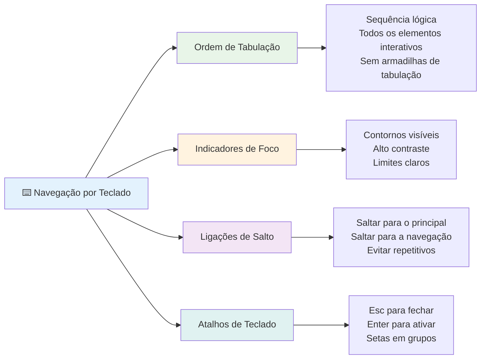
### Padrões essenciais para navegação por teclado

**Interações padrão do teclado:**
- **Tab**: Mover o foco em frente através dos elementos interativos
- **Shift + Tab**: Mover o foco para trás
- **Enter**: Ativar botões e links
- **Espaço**: Ativar botões, marcar caixas de verificação
- **Teclas de seta**: Navegar dentro de grupos de componentes (botões rádio, menus)
- **Escape**: Fechar modais, menus dropdown ou cancelar operações

### Melhores práticas na gestão do foco

**Indicadores de foco visíveis:**
```css
/* Ensure focus is always visible */
button:focus-visible {
  outline: 2px solid #4A90A4;
  outline-offset: 2px;
}

/* Custom focus styles for different components */
.card:focus-within {
  box-shadow: 0 0 0 3px rgba(74, 144, 164, 0.5);
}
```

**Links para saltar para navegação eficiente:**
```html
<a href="#main-content" class="skip-link">Skip to main content</a>
<a href="#navigation" class="skip-link">Skip to navigation</a>

<nav id="navigation">
  <!-- navigation content -->
</nav>
<main id="main-content">
  <!-- main content -->
</main>
```

**Ordem correta de tabulação:**
```html
<!-- Use semantic HTML for natural tab order -->
<form>
  <label for="name">Name:</label>
  <input type="text" id="name" tabindex="0">
  
  <label for="email">Email:</label>
  <input type="email" id="email" tabindex="0">
  
  <button type="submit" tabindex="0">Submit</button>
</form>
```

### Aprisionamento do foco em modais

Ao abrir diálogos modais, o foco deve ficar aprisionado dentro do modal:

```javascript
// Implementação moderna de armadilha de foco
function trapFocus(element) {
  const focusableElements = element.querySelectorAll(
    'button, [href], input, select, textarea, [tabindex]:not([tabindex="-1"])'
  );
  
  const firstElement = focusableElements[0];
  const lastElement = focusableElements[focusableElements.length - 1];

  element.addEventListener('keydown', (e) => {
    if (e.key === 'Tab') {
      if (e.shiftKey && document.activeElement === firstElement) {
        e.preventDefault();
        lastElement.focus();
      } else if (!e.shiftKey && document.activeElement === lastElement) {
        e.preventDefault();
        firstElement.focus();
      }
    }
    
    if (e.key === 'Escape') {
      closeModal();
    }
  });
  
  // Focar no primeiro elemento quando o modal abre
  firstElement.focus();
}
```

✅ **Teste a navegação por teclado**: Tente navegar no seu site usando apenas a tecla Tab. Consegue alcançar todos os elementos interativos? A ordem do foco é lógica? Os indicadores de foco são claramente visíveis?

## Acessibilidade em formulários

Os formulários são críticos para a interação do utilizador e requerem uma atenção especial à acessibilidade.

### Associação entre rótulo e controlo de formulário

**Cada controlo de formulário precisa de um rótulo:**
```html
<!-- Explicit labeling (preferred) -->
<label for="username">Username:</label>
<input type="text" id="username" name="username" required>

<!-- Implicit labeling -->
<label>
  Password:
  <input type="password" name="password" required>
</label>

<!-- Using aria-label when visual label isn't desired -->
<input type="search" aria-label="Search products" placeholder="Search...">
```

### Tratamento e validação de erros

**Mensagens de erro acessíveis:**
```html
<label for="email">Email Address:</label>
<input type="email" id="email" name="email" 
       aria-describedby="email-error" 
       aria-invalid="true" required>
<div id="email-error" role="alert">
  Please enter a valid email address
</div>
```

**Melhores práticas para validação de formulários:**
- Use `aria-invalid` para indicar campos inválidos
- Forneça mensagens de erro claras e específicas
- Use `role="alert"` para anúncios importantes de erro
- Mostre erros imediatamente e no envio do formulário

### Fieldsets e agrupamentos

**Agrupe controlos de formulário relacionados:**
```html
<fieldset>
  <legend>Shipping Address</legend>
  <label for="street">Street Address:</label>
  <input type="text" id="street" name="street">
  
  <label for="city">City:</label>
  <input type="text" id="city" name="city">
</fieldset>

<fieldset>
  <legend>Preferred Contact Method</legend>
  <input type="radio" id="contact-email" name="contact" value="email">
  <label for="contact-email">Email</label>
  
  <input type="radio" id="contact-phone" name="contact" value="phone">
  <label for="contact-phone">Phone</label>
</fieldset>
```

## A sua Jornada de Acessibilidade: Principais Conclusões

Parabéns! Acabou de adquirir os conhecimentos fundamentais para criar experiências web verdadeiramente inclusivas. Isto é algo bastante empolgante! A acessibilidade web não se trata só de cumprir requisitos — é reconhecer as diversas formas como as pessoas interagem com o conteúdo digital e desenhar para essa complexidade incrível.

Agora faz parte de uma comunidade crescente de developers que compreendem que um bom design funciona para todos. Bem-vindo ao clube!

**🎯 O seu kit de ferramentas de acessibilidade agora inclui:**

| Princípio Fundamental | Implementação | Impacto |
|----------------|----------------|---------|
| **Fundação em HTML semântico** | Use elementos HTML corretos para a sua finalidade | Leitores de ecrã navegam eficientemente, teclados funcionam automaticamente |
| **Design visual inclusivo** | Contraste suficiente, uso significativo da cor, indicadores visíveis de foco | Claro para todos em qualquer condição de iluminação |
| **Conteúdo descritivo** | Texto de links significativos, texto alt, cabeçalhos | Os utilizadores compreendem o conteúdo sem contexto visual |
| **Acessibilidade no teclado** | Ordem de tabulação, atalhos, gestão do foco | Acessibilidade motora e maior eficiência para utilizadores avançados |
| **Aprimoramento ARIA** | Uso estratégico para preencher lacunas semânticas | Aplicações complexas funcionam com tecnologias assistivas |
| **Testes abrangentes** | Ferramentas automáticas + verificação manual + testes com utilizadores reais | Deteta problemas antes que afetem os utilizadores |

**🚀 Os seus próximos passos:**

1. **Inclua acessibilidade no seu fluxo de trabalho**: Faça do teste uma parte natural do seu processo de desenvolvimento
2. **Aprenda com utilizadores reais**: Procure feedback de pessoas que usam tecnologias assistivas
3. **Mantenha-se atualizado**: As técnicas de acessibilidade evoluem com novas tecnologias e standards
4. **Defenda a inclusão**: Partilhe o seu conhecimento e faça da acessibilidade uma prioridade de equipa

> 💡 **Lembre-se**: Restrições de acessibilidade muitas vezes levam a soluções inovadoras e elegantes que beneficiam todos. Rampas acessíveis, legendas e controlos de voz começaram como funcionalidades de acessibilidade e tornaram-se melhorias generalizadas.

**O argumento comercial é cristalino**: Websites acessíveis alcançam mais utilizadores, têm melhor ranking nos motores de busca, custos de manutenção menores e evitam riscos legais. Mas, honestamente? A verdadeira razão para se preocupar com acessibilidade vai muito mais além. Websites acessíveis incorporam os melhores valores da web — abertura, inclusão e a ideia de que todos merecem acesso igual à informação.

Está agora preparado para construir a web inclusiva do futuro. Cada site acessível que criar torna a internet um lugar mais acolhedor para todos. Isso é incrível quando se pensa nisso!

## Recursos Adicionais

Continue a sua aprendizagem em acessibilidade com estes recursos essenciais:

**📚 Standards e Guias Oficiais:**
- [Diretrizes WCAG 2.1](https://www.w3.org/WAI/WCAG21/quickref/) - O standard oficial de acessibilidade com referência rápida
- [Guia de Práticas de Autoria ARIA](https://w3c.github.io/aria-practices/) - Padrões abrangentes para widgets interativos
- [Diretrizes WebAIM](https://webaim.org/) - Orientação prática e acessível para iniciantes

**🛠️ Ferramentas e Recursos de Teste:**
- [axe DevTools](https://www.deque.com/axe/devtools/) - Testes de acessibilidade de referência
- [Lista de Verificação do Projeto A11y](https://www.a11yproject.com/checklist/) - Verificação passo a passo de acessibilidade
- [Accessibility Insights](https://accessibilityinsights.io/) - Suite completa de testes da Microsoft
- [Color Oracle](https://colororacle.org/) - Simulador de daltonismo para testes de design

**🎓 Aprendizagem e Comunidade:**
- [Inquérito a Leitores de Ecrã WebAIM](https://webaim.org/projects/screenreadersurvey9/) - Preferências e comportamentos de utilizadores reais
- [Componentes Inclusivos](https://inclusive-components.design/) - Padrões modernos de componentes acessíveis
- [A11y Coffee](https://a11y.coffee/) - Dicas e insights rápidos sobre acessibilidade
- [Iniciativa para Acessibilidade Web (WAI)](https://www.w3.org/WAI/) - Recursos abrangentes do W3C sobre acessibilidade

**🎥 Aprendizagem Prática:**
- [Guia do Developer em Acessibilidade](https://www.accessibility-developer-guide.com/) - Orientação prática para implementação
- [Deque University](https://dequeuniversity.com/) - Cursos profissionais de formação em acessibilidade

## Desafio GitHub Copilot Agent 🚀

Use o modo Agent para completar o seguinte desafio:

**Descrição:** Crie um componente modal acessível que demonstre gestão apropriada do foco, atributos ARIA e padrões de navegação por teclado.

**Pedido:** Construa um componente modal completo em HTML, CSS e JavaScript que inclua: aprisionamento correto do foco, tecla ESC para fechar, clique fora para fechar, atributos ARIA para leitores de ecrã, e indicadores visíveis de foco. O modal deve conter um formulário com rótulos apropriados e tratamento de erros. Garanta que o componente cumpre os standards WCAG 2.1 AA.


## 🚀 Desafio

Pegue neste HTML e reescreva-o para ser o mais acessível possível, dadas as estratégias que aprendeu.

```html
<!DOCTYPE html>
<html lang="en">
  <head>
    <meta charset="UTF-8">
    <meta name="viewport" content="width=device-width, initial-scale=1.0">
    <title>Turtle Ipsum - The World's Premier Turtle Fan Club</title>
    <link href='../assets/style.css' rel='stylesheet' type='text/css'>
  </head>
  <body>
    <header class="site-header">
      <h1 class="site-title">Turtle Ipsum</h1>
      <p class="site-subtitle">The World's Premier Turtle Fan Club</p>
    </header>
    
    <nav class="main-nav" aria-label="Main navigation">
      <h2 class="nav-header">Resources</h2>
      <ul class="nav-list">
        <li><a href="https://www.youtube.com/watch?v=CMNry4PE93Y">"I like turtles" video</a></li>
        <li><a href="https://en.wikipedia.org/wiki/Turtle">Basic turtle information</a></li>
        <li><a href="https://en.wikipedia.org/wiki/Turtles_(chocolate)">Chocolate turtles candy</a></li>
      </ul>
    </nav>
    
    <main class="main-content">
      <article>
        <h1>Welcome to Turtle Ipsum</h1>
        <p class="intro">
          <a href="/about">Learn more about our turtle community</a> and discover fascinating facts about these amazing creatures.
        </p>
        <p class="article-text">
          Turtle ipsum dolor sit amet, consectetur adipiscing elit, sed do eiusmod tempor incididunt ut labore et dolore magna aliqua. Ut enim ad minim veniam, quis nostrud exercitation ullamco laboris nisi ut aliquip ex ea commodo consequat. Duis aute irure dolor in reprehenderit in voluptate velit esse cillum dolore eu fugiat nulla pariatur. Excepteur sint occaecat cupidatat non proident, sunt in culpa qui officia deserunt mollit anim id est laborum.
        </p>
      </article>
    </main>
    
    <footer class="footer">
      <section class="newsletter-signup">
        <h2>Stay Updated</h2>
        <button type="button" onclick="showNewsletterForm()">Sign up for turtle news</button>
      </section>
      
      <nav class="footer-nav" aria-label="Footer navigation">
        <h2>Site Pages</h2>
        <ul>
          <li><a href="../">Home</a></li>
          <li><a href="../semantic">Semantic HTML example</a></li>
        </ul>
      </nav>
      
      <p class="footer-copyright">&copy; 2024 Instrument. All rights reserved.</p>
    </footer>
  </body>
</html>
```

**Principais melhorias feitas:**
- Adicionada estrutura HTML semântica adequada
- Corrigida hierarquia de títulos (h1 único, progressão lógica)
- Adicionado texto de link significativo em vez de "click here"
- Incluídos rótulos ARIA adequados para navegação
- Adicionado atributo lang e meta tags adequadas
- Usado elemento button para elementos interativos
- Conteúdo do rodapé estruturado com marcos apropriados

## Quiz Pós-Aula
[Quiz pós-aula](https://ff-quizzes.netlify.app/web/en/)

## Revisão & Autoestudo

Muitos governos têm leis sobre requisitos de acessibilidade. Informe-se sobre as leis de acessibilidade do seu país. O que é abrangido e o que não é? Um exemplo é [este site governamental](https://accessibility.blog.gov.uk/).

## Trabalho de Casa
 
[Analise um site não acessível](assignment.md)

Créditos: [Turtle Ipsum](https://github.com/Instrument/semantic-html-sample) por Instrument

---

## 🚀 O seu Cronograma de Domínio em Acessibilidade

### ⚡ **O que Pode Fazer nos Próximos 5 Minutos**
- [ ] Instalar a extensão axe DevTools no seu navegador
- [ ] Executar uma auditoria de acessibilidade Lighthouse no seu site favorito
- [ ] Tentar navegar em qualquer site usando apenas a tecla Tab
- [ ] Testar o leitor de ecrã incorporado do seu navegador (Narrator/VoiceOver)

### 🎯 **O que Pode Realizar Nesta Hora**
- [ ] Completar o quiz pós-licção e refletir sobre as percepções de acessibilidade
- [ ] Praticar a escrita de texto alt significativo para 10 imagens diferentes
- [ ] Auditoriar a estrutura dos títulos de um site usando a extensão HeadingsMap
- [ ] Corrigir problemas de acessibilidade encontrados no HTML do desafio
- [ ] Testar o contraste de cor no seu projeto atual com a ferramenta do WebAIM

### 📅 **A sua Jornada de Acessibilidade de Uma Semana**
- [ ] Completar o trabalho de casa analisando um site não acessível
- [ ] Configurar o seu ambiente de desenvolvimento com ferramentas de teste de acessibilidade
- [ ] Praticar a navegação por teclado em 5 sites complexos diferentes
- [ ] Construir um formulário simples com etiquetas apropriadas, tratamento de erros e ARIA
- [ ] Juntar-se a uma comunidade de acessibilidade (A11y Slack, fórum WebAIM)
- [ ] Observar utilizadores reais com deficiências a navegar em websites (YouTube tem ótimos exemplos)

### 🌟 **A sua transformação ao longo do mês**
- [ ] Integrar testes de acessibilidade no seu fluxo de trabalho de desenvolvimento
- [ ] Contribuir para um projeto open source corrigindo problemas de acessibilidade
- [ ] Realizar testes de usabilidade com alguém que utiliza tecnologia assistiva
- [ ] Construir uma biblioteca de componentes acessíveis para a sua equipa
- [ ] Defender a acessibilidade no seu local de trabalho ou comunidade
- [ ] Orientar alguém que está a aprender conceitos de acessibilidade

### 🏆 **Check-in final do campeão da acessibilidade**

**Celebre a sua jornada de acessibilidade:**
- Qual foi a coisa mais surpreendente que aprendeu sobre como as pessoas usam a web?
- Qual princípio de acessibilidade mais ressoa com o seu estilo de desenvolvimento?
- Como é que aprender sobre acessibilidade mudou a sua perspetiva sobre design?
- Qual é a primeira melhoria de acessibilidade que quer fazer num projeto real?

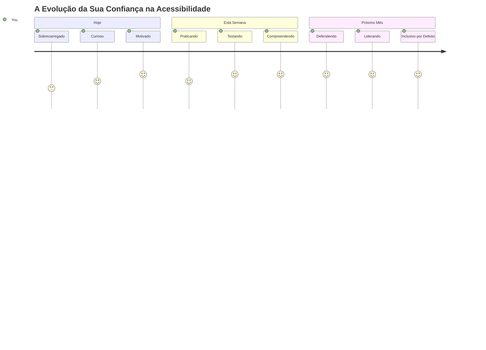
> 🌍 **Agora é um campeão da acessibilidade!** Compreende que grandes experiências na web funcionam para todos, independentemente da forma como acedem à web. Cada funcionalidade acessível que constrói torna a internet mais inclusiva. A web precisa de desenvolvedores como você que veem a acessibilidade não como uma limitação, mas como uma oportunidade para criar experiências melhores para todos os utilizadores. Bem-vindo ao movimento! 🎉

---

<!-- CO-OP TRANSLATOR DISCLAIMER START -->
**Aviso Legal**:
Este documento foi traduzido utilizando o serviço de tradução automática [Co-op Translator](https://github.com/Azure/co-op-translator). Embora nos esforcemos por garantir a precisão, por favor tenha em atenção que as traduções automáticas podem conter erros ou imprecisões. O documento original, na sua língua nativa, deve ser considerado a fonte autoritária. Para informações críticas, recomenda-se a tradução profissional humana. Não nos responsabilizamos por quaisquer mal-entendidos ou interpretações erradas decorrentes da utilização desta tradução.
<!-- CO-OP TRANSLATOR DISCLAIMER END -->