<!--
CO_OP_TRANSLATOR_METADATA:
{
  "original_hash": "71f7d7dafa1c7194d79ddac87f669ff9",
  "translation_date": "2026-01-06T17:38:13+00:00",
  "source_file": "2-js-basics/2-functions-methods/README.md",
  "language_code": "pt"
}
-->
# Fundamentos do JavaScript: Métodos e Funções


> Sketchnote por [Tomomi Imura](https://twitter.com/girlie_mac)

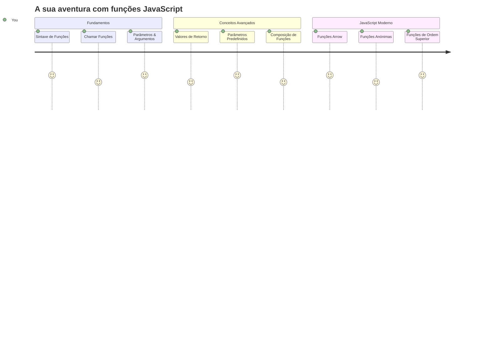
## Questionário Pré-Aula
[Questionário pré-aula](https://ff-quizzes.netlify.app)

Escrever o mesmo código repetidamente é uma das frustrações mais comuns da programação. As funções resolvem este problema permitindo que empacotes o código em blocos reutilizáveis. Pensa nas funções como as peças padronizadas que tornaram revolucionária a linha de montagem de Henry Ford – uma vez que crias um componente fiável, podes usá-lo onde for necessário sem reconstruir do zero.

As funções permitem-te agrupar pedaços de código para os reutilizares ao longo do teu programa. Em vez de copiares e colares a mesma lógica em todos os lados, podes criar uma função uma vez e chamá-la sempre que for necessário. Esta abordagem mantém o teu código organizado e torna as atualizações muito mais fáceis.

Nesta lição, irás aprender como criar as tuas próprias funções, passar-lhes informação e obter resultados úteis. Irás descobrir a diferença entre funções e métodos, aprender abordagens de sintaxe modernas e ver como as funções podem trabalhar com outras funções. Vamos construir estes conceitos passo a passo.

[](https://youtube.com/watch?v=XgKsD6Zwvlc "Métodos e Funções")

> 🎥 Clica na imagem acima para um vídeo sobre métodos e funções.

> Podes fazer esta lição em [Microsoft Learn](https://docs.microsoft.com/learn/modules/web-development-101-functions/?WT.mc_id=academic-77807-sagibbon)!

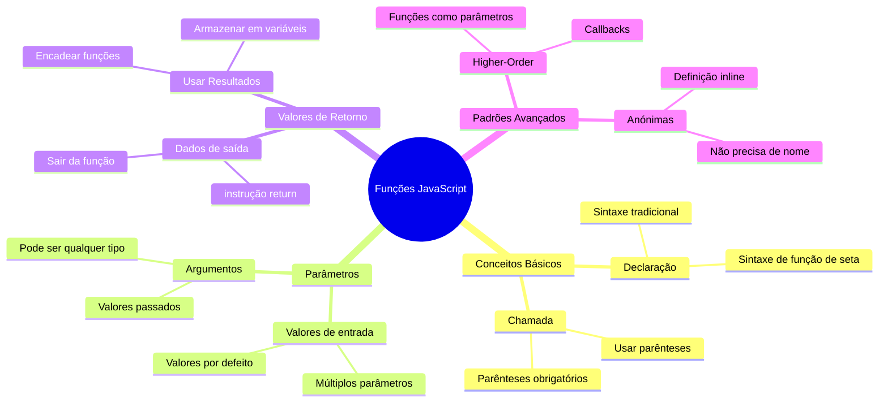
## Funções

Uma função é um bloco de código autónomo que executa uma tarefa específica. Ela encapsula a lógica que podes executar sempre que for necessário.

Em vez de escreveres o mesmo código várias vezes ao longo do teu programa, podes empacotá-lo numa função e chamar essa função sempre que precisares. Esta abordagem mantém o teu código limpo e torna as atualizações muito mais fáceis. Imagina o desafio de manutenção caso precisasses de alterar uma lógica dispersa por 20 locais diferentes no teu código.

Dar nomes descritivos às tuas funções é essencial. Uma função bem nomeada comunica claramente o seu propósito – quando vês `cancelTimer()`, entendes imediatamente o que ela faz, assim como um botão claramente rotulado indica exatamente o que vai acontecer quando clicas nele.

## Criar e chamar uma função

Vamos examinar como criar uma função. A sintaxe segue um padrão consistente:

```javascript
function nameOfFunction() { // definição da função
 // definição/corpo da função
}
```

Vamos decompor isto:
- A palavra-chave `function` diz ao JavaScript "Ei, estou a criar uma função!"
- `nameOfFunction` é onde dás à tua função um nome descritivo
- Os parênteses `()` são onde podes adicionar parâmetros (vamos abordar isso em breve)
- As chavetas `{}` contêm o código que realmente é executado quando chamas a função

Vamos criar uma função simples de saudação para ver isto em ação:

```javascript
function displayGreeting() {
  console.log('Hello, world!');
}
```

Esta função imprime "Hello, world!" na consola. Depois de a definires, podes usá-la todas as vezes que precisares.

Para executar (ou "chamar") a tua função, escreve o seu nome seguido de parênteses. O JavaScript permite que definas a tua função antes ou depois da chamares – o motor do JavaScript trata da ordem de execução.

```javascript
// a chamar a nossa função
displayGreeting();
```

Quando executas esta linha, ela executa todo o código dentro da tua função `displayGreeting`, mostrando "Hello, world!" na consola do navegador. Podes chamar esta função repetidamente.

### 🧠 **Verificação dos Fundamentos das Funções: Construindo as Tuas Primeiras Funções**

**Vamos ver como estás a sentir-te em relação às funções básicas:**
- Consegues explicar porque usamos chavetas `{}` nas definições de funções?
- O que acontece se escreveres `displayGreeting` sem os parênteses?
- Porque podes querer chamar a mesma função várias vezes?

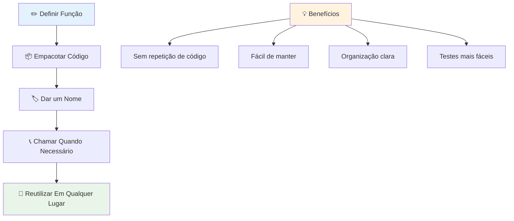
> **Nota:** Tens usado **métodos** ao longo destas lições. `console.log()` é um método – essencialmente uma função que pertence ao objeto `console`. A principal diferença é que métodos estão ligados a objetos, enquanto funções são independentes. Muitos programadores usam estes termos de forma intercambiável na conversa informal.

### Boas práticas para funções

Aqui ficam algumas dicas para te ajudar a escrever ótimas funções:

- Dá às tuas funções nomes claros e descritivos – o teu eu no futuro agradecerá!
- Usa **camelCase** para nomes compostos (como `calculateTotal` em vez de `calculate_total`)
- Mantém cada função focada em fazer bem uma tarefa

## Passar informação para uma função

A nossa função `displayGreeting` é limitada – só pode mostrar "Hello, world!" para todos. Os parâmetros permitem que tornemos as funções mais flexíveis e úteis.

**Parâmetros** funcionam como espaços reservados onde podes inserir diferentes valores cada vez que usas a função. Assim, a mesma função pode trabalhar com informação diferente em cada chamada.

Listas os parâmetros dentro dos parênteses ao definires a tua função, separando múltiplos parâmetros com vírgulas:

```javascript
function name(param, param2, param3) {

}
```

Cada parâmetro funciona como um espaço reservado – quando alguém chama a tua função, fornece valores reais que são colocados nesses espaços.

Vamos atualizar a nossa função de saudação para aceitar o nome de alguém:

```javascript
function displayGreeting(name) {
  const message = `Hello, ${name}!`;
  console.log(message);
}
```

Repara como usamos aspas invertidas (`` ` ``) e `${}` para inserir o nome diretamente na mensagem – isto chama-se template literal, e é uma forma muito útil de construir strings com variáveis embutidas.

Agora, quando chamamos a nossa função, podemos passar qualquer nome:

```javascript
displayGreeting('Christopher');
// exibe "Olá, Christopher!" quando executado
```

O JavaScript pega na string `'Christopher'`, atribui-a ao parâmetro `name` e cria a mensagem personalizada "Hello, Christopher!"

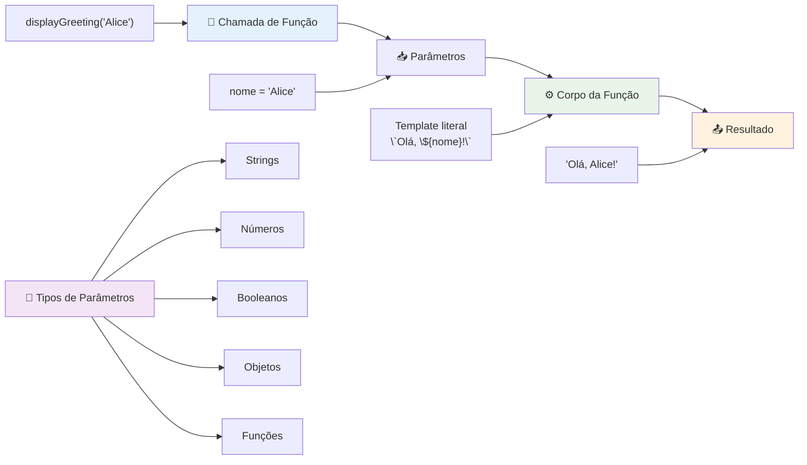
## Valores predefinidos

E se quisermos tornar alguns parâmetros opcionais? É aqui que os valores predefinidos são muito úteis!

Digamos que queremos que as pessoas possam personalizar a palavra de saudação, mas se não especificarem nenhuma, usaremos "Hello" como padrão. Podes definir valores predefinidos usando o sinal de igual, tal como definiste uma variável:

```javascript
function displayGreeting(name, salutation='Hello') {
  console.log(`${salutation}, ${name}`);
}
```

Aqui, `name` ainda é obrigatório, mas `salutation` tem um valor de reserva `'Hello'` caso ninguém forneça uma saudação diferente.

Agora podemos chamar esta função de duas formas diferentes:

```javascript
displayGreeting('Christopher');
// exibe "Hello, Christopher"

displayGreeting('Christopher', 'Hi');
// exibe "Hi, Christopher"
```

Na primeira chamada, o JavaScript usa o padrão "Hello" porque não especificámos uma saudação. Na segunda chamada, usa o nosso "Hi" personalizado em vez disso. Esta flexibilidade torna as funções adaptáveis a diferentes cenários.

### 🎛️ **Verificação de Domínio em Parâmetros: Tornar Funções Flexíveis**

**Testa a tua compreensão dos parâmetros:**
- Qual é a diferença entre um parâmetro e um argumento?
- Porque são os valores predefinidos úteis na programação prática?
- Consegues prever o que acontece se passares mais argumentos do que parâmetros?

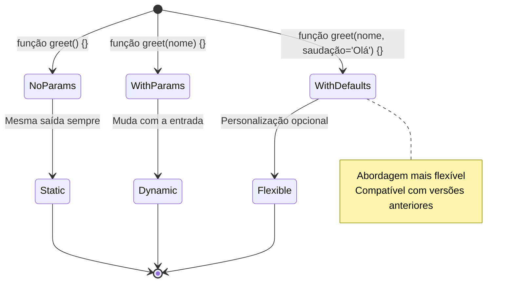
> **Dica profissional**: Parâmetros predefinidos tornam as tuas funções mais fáceis de usar. Os utilizadores podem começar rapidamente com valores sensatos e ainda personalizar quando precisarem!

## Valores de retorno

Até agora, as nossas funções apenas imprimiram mensagens na consola, mas e se quiseres que uma função calcule algo e te devolva o resultado?

É aqui que os **valores de retorno** entram. Em vez de apenas mostrar algo, uma função pode devolver um valor que podes armazenar numa variável ou usar noutras partes do teu código.

Para devolver um valor, usas a palavra-chave `return` seguida do que quiseres devolver:

```javascript
return myVariable;
```

Aqui está algo importante: quando uma função alcança uma instrução `return`, ela imediatamente para a execução e devolve esse valor a quem a chamou.

Vamos modificar a nossa função de saudação para devolver a mensagem em vez de a imprimir:

```javascript
function createGreetingMessage(name) {
  const message = `Hello, ${name}`;
  return message;
}
```

Agora, em vez de imprimir a saudação, esta função cria a mensagem e devolve-a para nós.

Para usar o valor retornado, podemos armazená-lo numa variável tal como qualquer outro valor:

```javascript
const greetingMessage = createGreetingMessage('Christopher');
```

Agora `greetingMessage` contém "Hello, Christopher" e podemos usá-la em qualquer parte do nosso código – para mostrar numa página web, incluir num email ou passar para outra função.

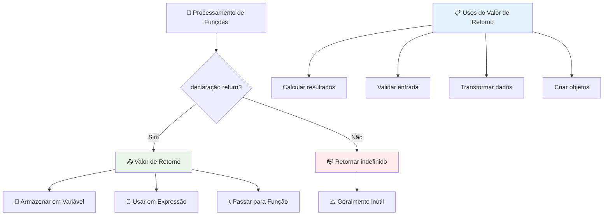
### 🔄 **Verificação de Valores de Retorno: Obter Resultados**

**Avalia a tua compreensão de valores de retorno:**
- O que acontece ao código após uma instrução `return` numa função?
- Porque é que devolver valores é geralmente melhor do que apenas imprimir na consola?
- Uma função pode devolver diferentes tipos de valores (string, número, booleano)?

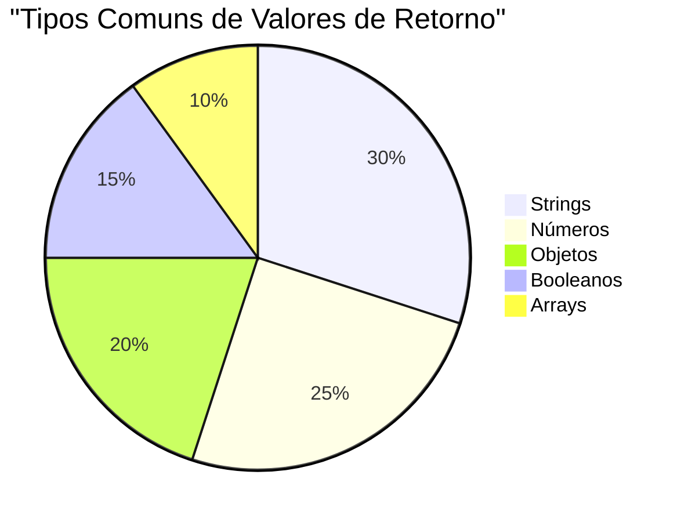
> **Perspetiva importante**: Funções que devolvem valores são mais versáteis porque quem as chama decide o que fazer com o resultado. Isto torna o teu código mais modular e reutilizável!

## Funções como parâmetros para funções

Funções podem ser passadas como parâmetros para outras funções. Embora este conceito possa parecer complexo inicialmente, é uma funcionalidade poderosa que permite padrões de programação flexíveis.

Este padrão é muito comum quando queres dizer "quando algo acontecer, faz isto outro". Por exemplo, "quando o temporizador acabar, executa este código" ou "quando o utilizador clicar no botão, chama esta função".

Vamos ver `setTimeout`, que é uma função incorporada que espera um certo tempo e depois executa algum código. Precisamos de lhe dizer que código executar – caso perfeito para passar uma função!

Experimenta este código – depois de 3 segundos vais ver uma mensagem:

```javascript
function displayDone() {
  console.log('3 seconds has elapsed');
}
// o valor do temporizador está em milissegundos
setTimeout(displayDone, 3000);
```

Repara como passamos `displayDone` (sem parênteses) para `setTimeout`. Não estamos a chamar a função nós próprios – estamos a entregá-la ao `setTimeout` e a dizer "chama isto daqui a 3 segundos."

### Funções anónimas

Por vezes precisas de uma função para uma coisa só e não queres dar-lhe um nome. Pensa nisso – se só vais usar uma função uma vez, porque entupir o teu código com um nome extra?

O JavaScript permite criar **funções anónimas** – funções sem nome que podes definir exatamente onde precisas delas.

Aqui está como podemos reescrever o nosso exemplo do temporizador usando uma função anónima:

```javascript
setTimeout(function() {
  console.log('3 seconds has elapsed');
}, 3000);
```

Isto obtém o mesmo resultado, mas a função está definida diretamente dentro da chamada `setTimeout`, eliminando a necessidade de uma declaração de função separada.

### Funções arrow (flecha)

O JavaScript moderno tem uma forma ainda mais curta de escrever funções chamadas **funções arrow**. Usam `=>` (que parece uma flecha – percebes?) e são super populares entre os programadores.

Funções arrow permitem dispensar a palavra-chave `function` e escrever código mais conciso.

Aqui está o nosso exemplo do temporizador usando uma função arrow:

```javascript
setTimeout(() => {
  console.log('3 seconds has elapsed');
}, 3000);
```

Os `()` são onde iriam os parâmetros (vazio neste caso), depois vem a seta `=>`, e finalmente o corpo da função dentro das chavetas. Isto proporciona a mesma funcionalidade com uma sintaxe mais curta.

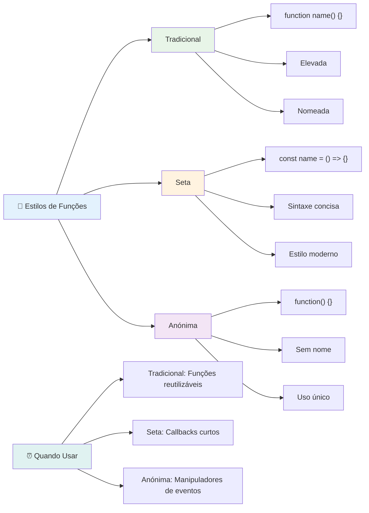
### Quando usar cada estratégia

Quando deves usar cada abordagem? Uma regra prática: se vais usar a função várias vezes, dá-lhe um nome e define-a separadamente. Se for para um uso específico, considera uma função anónima. Tanto funções arrow como a sintaxe tradicional são escolhas válidas, embora funções arrow sejam predominantes em código moderno JavaScript.

### 🎨 **Verificação de Estilos de Função: Escolhendo a Sintaxe Certa**

**Testa a tua compreensão da sintaxe:**
- Quando poderás preferir funções arrow em vez da sintaxe tradicional de função?
- Qual é a principal vantagem das funções anónimas?
- Consegues pensar numa situação em que uma função nomeada seja melhor que uma anónima?

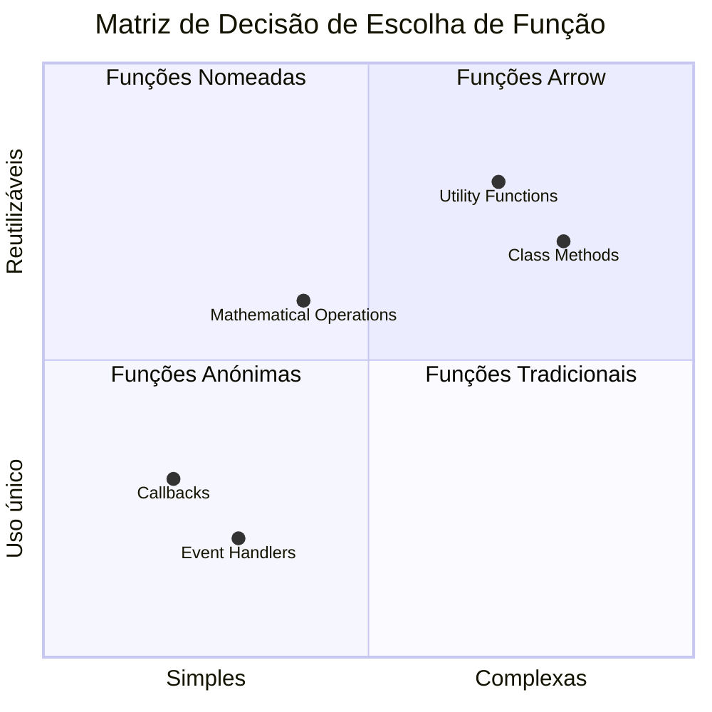
> **Tendência moderna**: Funções arrow estão a tornar-se a escolha padrão para muitos programadores devido à sua sintaxe concisa, mas funções tradicionais ainda têm o seu lugar!

---


## 🚀 Desafio

Consegues articular numa frase a diferença entre funções e métodos? Experimenta!

## Desafio do Agente GitHub Copilot 🚀

Usa o modo Agente para completar o desafio seguinte:

**Descrição:** Cria uma biblioteca utilitária de funções matemáticas que demonstre diferentes conceitos de funções abordados nesta lição, incluindo parâmetros, valores predefinidos, valores de retorno e funções arrow.

**Prompt:** Cria um ficheiro JavaScript chamado `mathUtils.js` que contenha as seguintes funções:
1. Uma função `add` que aceita dois parâmetros e devolve a sua soma
2. Uma função `multiply` com valores predefinidos para os parâmetros (o segundo parámetro tem como padrão 1)
3. Uma função arrow `square` que aceita um número e devolve o seu quadrado
4. Uma função `calculate` que aceita outra função como parâmetro e dois números, e depois aplica essa função a esses números
5. Demonstra a chamada de cada função com casos de teste apropriados

Sabe mais sobre [modo agente](https://code.visualstudio.com/blogs/2025/02/24/introducing-copilot-agent-mode) aqui.

## Questionário Pós-Aula
[Questionário pós-aula](https://ff-quizzes.netlify.app)

## Revisão e Estudo Autónomo

Vale a pena [ler um pouco mais sobre funções arrow](https://developer.mozilla.org/docs/Web/JavaScript/Reference/Functions/Arrow_functions), pois são cada vez mais usadas em bases de código. Pratica a escrita de uma função, e depois reescrevê-la com esta sintaxe.

## Trabalho de Casa

[Divertir-se com Funções](assignment.md)

---

## 🧰 **Resumo da Tua Caixa de Ferramentas de Funções JavaScript**

```mermaid
graph TD
    A["🎯 Funções JavaScript"] --> B["📋 Declaração de Função"]
    A --> C["📥 Parâmetros"]
    A --> D["📤 Valores de Retorno"]
    A --> E["🎨 Sintaxe Moderna"]
    
    B --> B1["function name() {}"]
    B --> B2["Nomeação descritiva"]
    B --> B3["Blocos de código reutilizáveis"]
    
    C --> C1["Dados de entrada"]
    C --> C2["Valores por defeito"]
    C --> C3["Múltiplos parâmetros"]
    
    D --> D1["instrução return"]
    D --> D2["Sair da função"]
    D --> D3["Passar dados de volta"]
    
    E --> E1["Funções arrow: () =>"]
    E --> E2["Funções anónimas"]
    E --> E3["Funções de ordem superior"]
    
    F["⚡ Benefícios Chave"] --> F1["Reutilização de código"]
    F --> F2["Melhor organização"]
    F --> F3["Testes facilitados"]
    F --> F4["Design modular"]
    
    style A fill:#e3f2fd
    style B fill:#e8f5e8
    style C fill:#fff3e0
    style D fill:#f3e5f5
    style E fill:#e0f2f1
    style F fill:#fce4ec
```
---

## 🚀 A Tua Linha Temporal de Domínio em Funções JavaScript

### ⚡ **O que Podes Fazer Nos Próximos 5 Minutos**
- [ ] Escrever uma função simples que devolva o teu número favorito
- [ ] Criar uma função com dois parâmetros que os some juntos
- [ ] Tenta converter uma função tradicional para a sintaxe de arrow function
- [ ] Pratica o desafio: explica a diferença entre funções e métodos

### 🎯 **O Que Podes Conquistar Nesta Hora**
- [ ] Completa o quiz pós-aula e revisa quaisquer conceitos confusos
- [ ] Constrói a biblioteca de utilitários matemáticos do desafio GitHub Copilot
- [ ] Cria uma função que use outra função como parâmetro
- [ ] Pratica a escrita de funções com parâmetros por defeito
- [ ] Experimenta com template literals nos valores de retorno das funções

### 📅 **A Tua Semana de Domínio das Funções**
- [ ] Completa a tarefa "Diversão com Funções" com criatividade
- [ ] Refatora algum código repetitivo que tenhas escrito em funções reutilizáveis
- [ ] Constrói uma calculadora pequena usando apenas funções (sem variáveis globais)
- [ ] Pratica arrow functions com métodos de arrays como `map()` e `filter()`
- [ ] Cria uma coleção de funções utilitárias para tarefas comuns
- [ ] Estuda funções de ordem superior e conceitos de programação funcional

### 🌟 **A Tua Transformação Mensal**
- [ ] Domina conceitos avançados de funções como closures e scope
- [ ] Constrói um projeto que faça uso intenso de composição de funções
- [ ] Contribui para o open source melhorando a documentação das funções
- [ ] Ensina a outra pessoa sobre funções e diferentes estilos de sintaxe
- [ ] Explora paradigmas de programação funcional em JavaScript
- [ ] Cria uma biblioteca pessoal de funções reutilizáveis para projetos futuros

### 🏆 **Check-in Final do Campeão das Funções**

**Celebra o teu domínio das funções:**
- Qual é a função mais útil que criaste até agora?
- Como é que aprender sobre funções mudou a tua forma de pensar sobre organização de código?
- Que sintaxe de funções preferes e porquê?
- Que problema do mundo real resolverias escrevendo uma função?

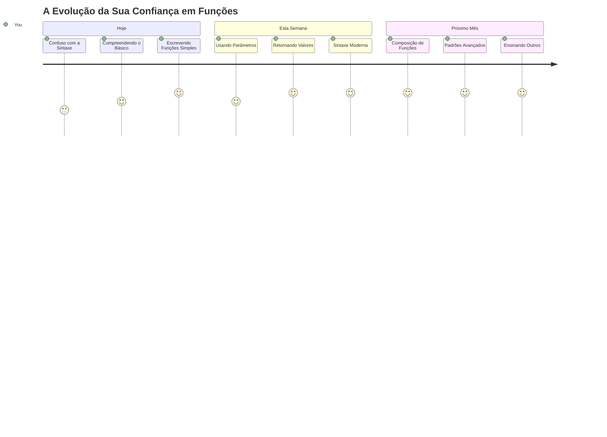
> 🎉 **Dominaste um dos conceitos mais poderosos da programação!** As funções são os blocos de construção dos programas mais complexos. Todas as aplicações que alguma vez vais construir irão usar funções para organizar, reutilizar e estruturar código. Agora compreendes como encapsular a lógica em componentes reutilizáveis, tornando-te um programador mais eficiente e eficaz. Bem-vindo ao mundo da programação modular! 🚀

---

<!-- CO-OP TRANSLATOR DISCLAIMER START -->
**Aviso Legal**:  
Este documento foi traduzido utilizando o serviço de tradução por IA [Co-op Translator](https://github.com/Azure/co-op-translator). Embora nos esforcemos pela precisão, por favor, tenha em atenção que traduções automáticas podem conter erros ou imprecisões. O documento original na sua língua nativa deve ser considerado a fonte autorizada. Para informações críticas, é recomendada a tradução profissional humana. Não nos responsabilizamos por quaisquer mal-entendidos ou interpretações erradas resultantes do uso desta tradução.
<!-- CO-OP TRANSLATOR DISCLAIMER END -->