<!--
CO_OP_TRANSLATOR_METADATA:
{
  "original_hash": "c688385d15dd3645e924ea0ffee8967f",
  "translation_date": "2026-01-06T17:41:52+00:00",
  "source_file": "2-js-basics/3-making-decisions/README.md",
  "language_code": "pt"
}
-->
# Conceitos Básicos de JavaScript: Tomando Decisões


> Sketchnote por [Tomomi Imura](https://twitter.com/girlie_mac)

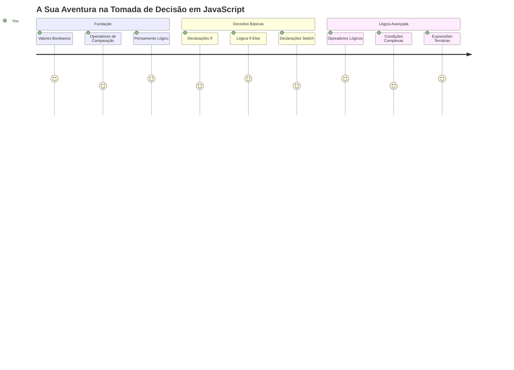
Alguma vez se perguntou como as aplicações tomam decisões inteligentes? Como é que um sistema de navegação escolhe a rota mais rápida, ou como é que um termóstato decide quando ligar o aquecimento? Este é o conceito fundamental da tomada de decisões em programação.

Assim como a Máquina Analítica de Charles Babbage foi concebida para seguir diferentes sequências de operações com base em condições, os programas modernos em JavaScript precisam fazer escolhas baseadas em circunstâncias variadas. Esta capacidade de ramificar e tomar decisões é o que transforma código estático em aplicações responsivas e inteligentes.

Nesta lição, vai aprender como implementar lógica condicional nos seus programas. Vamos explorar declarações condicionais, operadores de comparação e expressões lógicas que permitem ao seu código avaliar situações e responder de forma apropriada.

## Questionário Pré-Aula

[Questionário pré-aula](https://ff-quizzes.netlify.app/web/quiz/11)

A capacidade de tomar decisões e controlar o fluxo do programa é um aspeto fundamental da programação. Esta secção cobre como controlar o caminho de execução dos seus programas JavaScript usando valores Booleanos e lógica condicional.

[](https://youtube.com/watch?v=SxTp8j-fMMY "Making Decisions")

> 🎥 Clique na imagem acima para um vídeo sobre tomar decisões.

> Pode fazer esta lição na [Microsoft Learn](https://docs.microsoft.com/learn/modules/web-development-101-if-else/?WT.mc_id=academic-77807-sagibbon)!

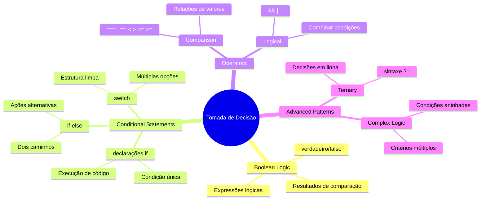
## Um Breve Recapitular dos Booleanos

Antes de explorar a tomada de decisões, vamos revisitar os valores Booleanos da nossa lição anterior. Nomeados em homenagem ao matemático George Boole, estes valores representam estados binários – ou `true` ou `false`. Não há ambiguidade, nem meio-termo.

Estes valores binários formam a base de toda a lógica computacional. Cada decisão que o seu programa toma reduz-se, em última análise, a uma avaliação Booleana.

Criar variáveis Booleanas é simples:

```javascript
let myTrueBool = true;
let myFalseBool = false;
```

Isto cria duas variáveis com valores Booleanos explícitos.

✅ Os Booleanos são nomeados em homenagem ao matemático, filósofo e lógico inglês George Boole (1815–1864).

## Operadores de Comparação e Booleanos

Na prática, raramente define valores Booleanos manualmente. Em vez disso, gera-os ao avaliar condições: "Será que este número é maior do que aquele?" ou "Estes valores são iguais?"

Os operadores de comparação permitem essas avaliações. Comparam valores e retornam resultados Booleanos com base na relação entre os operandos.

| Símbolo | Descrição                                                                                                                                                     | Exemplo            |
| ------ | ------------------------------------------------------------------------------------------------------------------------------------------------------------- | ------------------ |
| `<`    | **Menor que**: Compara dois valores e retorna o tipo de dado Boolean `true` se o valor do lado esquerdo for menor que o do lado direito                      | `5 < 6 // true`    |
| `<=`   | **Menor ou igual a**: Compara dois valores e retorna o tipo de dado Boolean `true` se o valor do lado esquerdo for menor ou igual ao do lado direito         | `5 <= 6 // true`   |
| `>`    | **Maior que**: Compara dois valores e retorna o tipo de dado Boolean `true` se o valor do lado esquerdo for maior que o do lado direito                      | `5 > 6 // false`   |
| `>=`   | **Maior ou igual a**: Compara dois valores e retorna o tipo de dado Boolean `true` se o valor do lado esquerdo for maior ou igual ao do lado direito         | `5 >= 6 // false`  |
| `===`  | **Igualdade estrita**: Compara dois valores e retorna o tipo de dado Boolean `true` se os valores à direita e à esquerda forem iguais E do mesmo tipo de dado | `5 === 6 // false` |
| `!==`  | **Desigualdade**: Compara dois valores e retorna o valor Boolean oposto ao que o operador de igualdade estrita retornaria                                   | `5 !== 6 // true`  |

✅ Teste os seus conhecimentos escrevendo algumas comparações na consola do navegador. Algum dado retornado o surpreende?

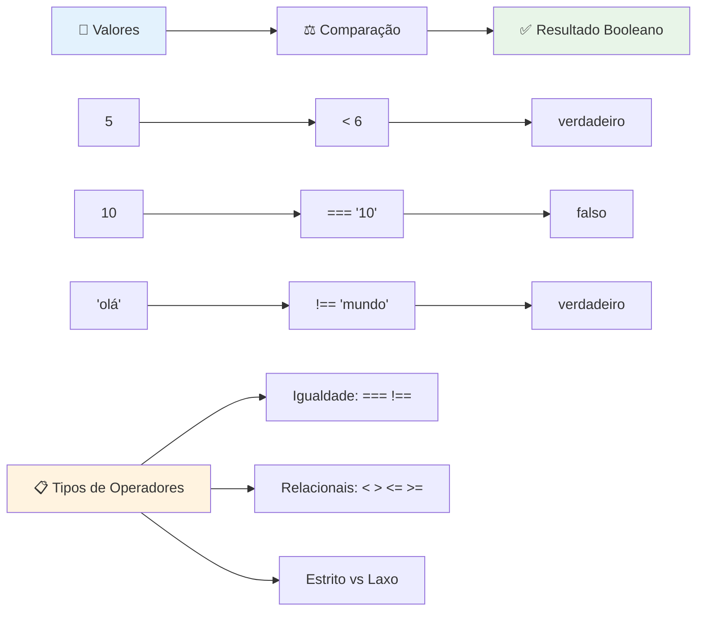
### 🧠 **Teste de Domínio em Comparações: Entendendo a Lógica Booleana**

**Teste o seu entendimento das comparações:**
- Por que acha que `===` (igualdade estrita) é geralmente preferido em vez de `==` (igualdade frouxa)?
- Consegue prever o que `5 === '5'` retorna? E `5 == '5'`?
- Qual é a diferença entre `!==` e `!=`?

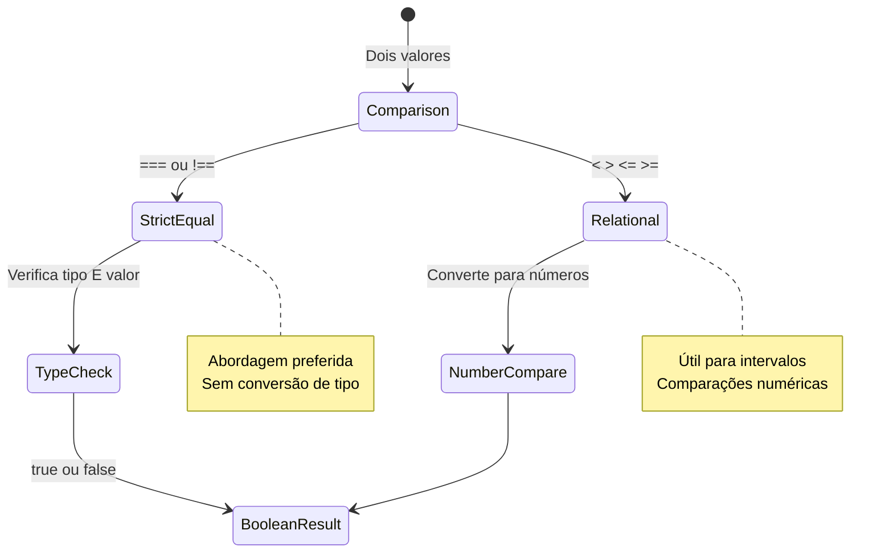
> **Dica profissional**: Use sempre `===` e `!==` para verificações de igualdade a menos que precise especificamente de conversão de tipo. Isto previne comportamentos inesperados!

## Declaração If

A declaração `if` é como fazer uma pergunta no seu código. "Se esta condição for verdadeira, então faça isto." Provavelmente é a ferramenta mais importante que vai usar para tomar decisões em JavaScript.

Aqui está como funciona:

```javascript
if (condition) {
  // A condição é verdadeira. O código neste bloco será executado.
}
```

A condição vai dentro dos parênteses e, se for `true`, o JavaScript executa o código dentro das chaves. Se for `false`, o JavaScript simplesmente ignora todo esse bloco.

Vai frequentemente usar operadores de comparação para criar estas condições. Vamos ver um exemplo prático:

```javascript
let currentMoney = 1000;
let laptopPrice = 800;

if (currentMoney >= laptopPrice) {
  // A condição é verdadeira. O código neste bloco vai ser executado.
  console.log("Getting a new laptop!");
}
```

Como `1000 >= 800` avalia para `true`, o código dentro do bloco é executado, exibindo "A comprar um portátil novo!" na consola.

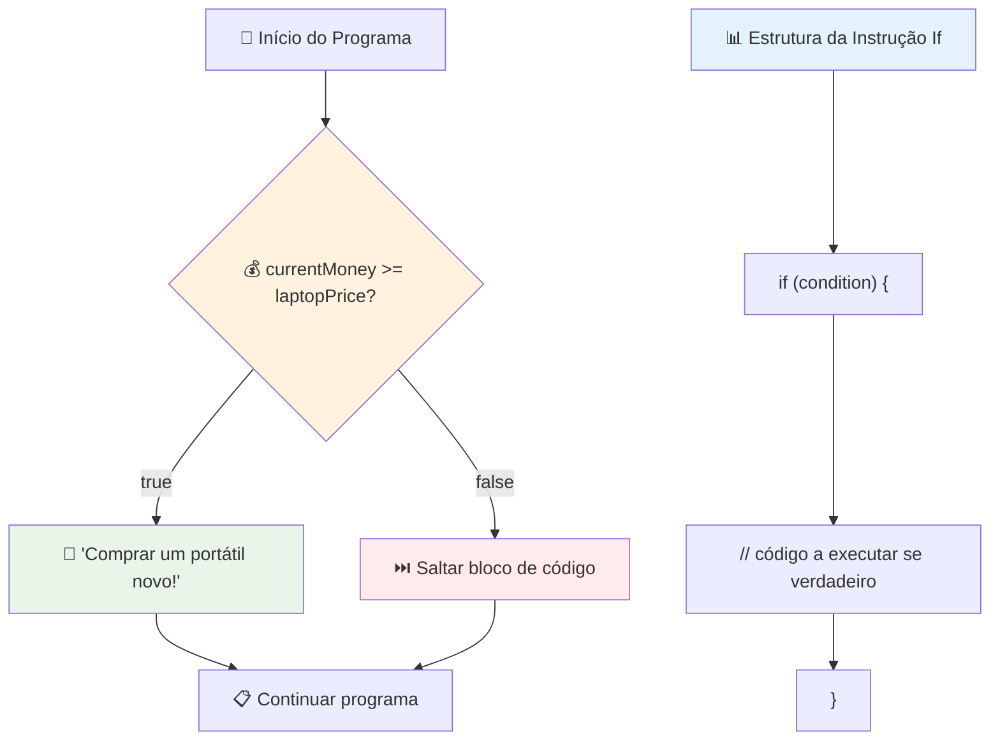
## Declaração If..Else

Mas e se quiser que o seu programa faça algo diferente quando a condição for falsa? É aí que entra o `else` – é como ter um plano B.

A declaração `else` dá-lhe uma forma de dizer "se esta condição não for verdadeira, faz esta outra coisa em vez disso."

```javascript
let currentMoney = 500;
let laptopPrice = 800;

if (currentMoney >= laptopPrice) {
  // A condição é verdadeira. O código neste bloco será executado.
  console.log("Getting a new laptop!");
} else {
  // A condição é falsa. O código neste bloco será executado.
  console.log("Can't afford a new laptop, yet!");
}
```

Agora, como `500 >= 800` é `false`, o JavaScript ignora o primeiro bloco e executa o bloco `else` em vez disso. Vai ver "Ainda não consigo pagar um portátil novo!" na consola.

✅ Teste o seu entendimento deste código e do seguinte ao executar na consola do navegador. Altere os valores das variáveis currentMoney e laptopPrice para alterar o retorno do `console.log()`.

### 🎯 **Teste Lógico If-Else: Caminhos Condicionais**

**Avalie o seu entendimento da lógica condicional:**
- O que acontece se `currentMoney` for exatamente igual a `laptopPrice`?
- Consegue pensar num cenário do mundo real onde a lógica if-else seria útil?
- Como poderia expandir isto para lidar com múltiplos intervalos de preço?

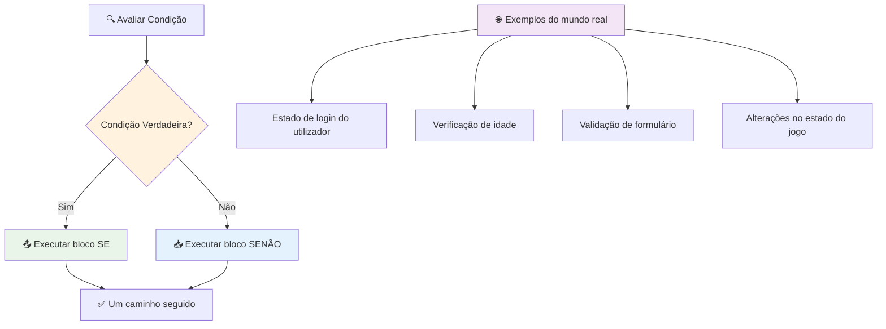
> **Percepção chave**: If-else garante que exatamente um caminho é tomado. Isto assegura que o seu programa tem sempre uma resposta para qualquer condição!

## Declaração Switch

Por vezes, precisa comparar um valor com múltiplas opções. Embora pudesse encadear várias declarações `if..else`, esta abordagem torna-se difícil de gerir. A declaração `switch` fornece uma estrutura mais limpa para lidar com múltiplos valores discretos.

O conceito assemelha-se aos sistemas mecânicos de comutação usados em centrais telefónicas antigas – um valor de entrada determina qual caminho específico é seguido pela execução.

```javascript
switch (expression) {
  case x:
    // bloco de código
    break;
  case y:
    // bloco de código
    break;
  default:
    // bloco de código
}
```

Aqui está como está estruturado:
- O JavaScript avalia a expressão uma vez
- Procura cada `case` para encontrar uma correspondência
- Quando encontra uma correspondência, executa esse bloco de código
- O `break` diz ao JavaScript para parar e sair do switch
- Se nenhum caso combinar, executa o bloco `default` (se existir)

```javascript
// Programa usando a instrução switch para o dia da semana
let dayNumber = 2;
let dayName;

switch (dayNumber) {
  case 1:
    dayName = "Monday";
    break;
  case 2:
    dayName = "Tuesday";
    break;
  case 3:
    dayName = "Wednesday";
    break;
  default:
    dayName = "Unknown day";
    break;
}
console.log(`Today is ${dayName}`);
```

Neste exemplo, o JavaScript vê que `dayNumber` é `2`, encontra o `case 2` correspondente, define `dayName` para "Terça-feira" e depois sai do switch. O resultado? "Hoje é Terça-feira" é exibido na consola.

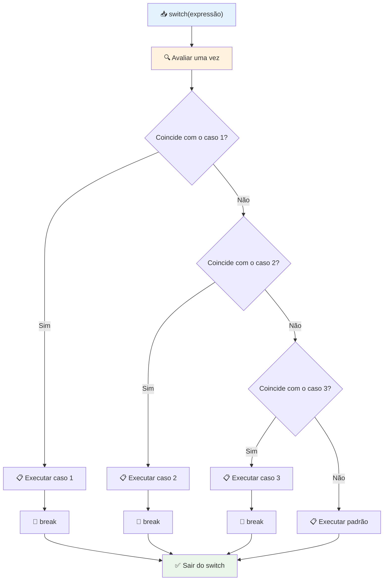
✅ Teste o seu entendimento deste código e do seguinte ao executar na consola do navegador. Altere os valores da variável a para alterar o retorno do `console.log()`.

### 🔄 **Domínio de Declaração Switch: Múltiplas Opções**

**Teste o seu entendimento do switch:**
- O que acontece se esquecer um `break`?
- Quando usaria `switch` em vez de múltiplas declarações `if-else`?
- Porque é que o caso `default` é útil mesmo que pense ter coberto todas as possibilidades?

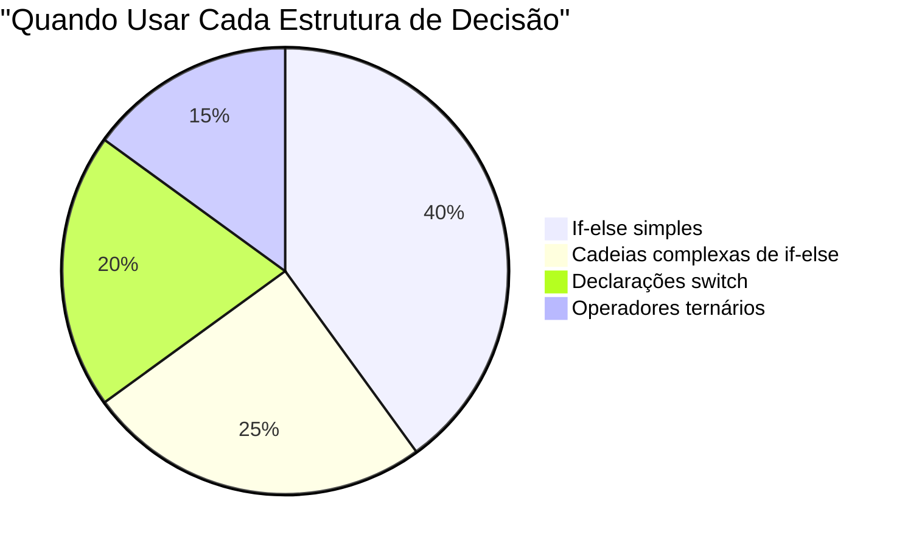
> **Boa prática**: Use `switch` quando comparar uma variável contra múltiplos valores específicos. Use `if-else` para verificações de intervalos ou condições complexas!

## Operadores Lógicos e Booleanos

Decisões complexas frequentemente requerem avaliar múltiplas condições simultaneamente. Assim como a álgebra Booleana permite a matemáticos combinar expressões lógicas, a programação oferece operadores lógicos para conectar múltiplas condições Booleanas.

Estes operadores permitem lógica condicional sofisticada combinando avaliações simples de verdadeiro/falso.

| Símbolo | Descrição                                                                                        | Exemplo                                                                 |
| ------ | ------------------------------------------------------------------------------------------------ | ----------------------------------------------------------------------- |
| `&&`   | **E lógico**: Compara duas expressões Booleanas. Retorna verdadeiro **somente** se ambos os lados forem verdadeiros | `(5 > 3) && (5 < 10) // Ambos os lados são verdadeiros. Retorna true` |
| `\|\|` | **OU lógico**: Compara duas expressões Booleanas. Retorna verdadeiro se pelo menos um dos lados for verdadeiro | `(5 > 10) \|\| (5 < 10) // Um lado é falso, o outro é verdadeiro. Retorna true` |
| `!`    | **NÃO lógico**: Retorna o valor oposto de uma expressão Booleana                               | `!(5 > 10) // 5 não é maior que 10, então "!" torna-o verdadeiro`     |

Estes operadores permitem combinar condições de formas úteis:
- E (`&&`) significa que ambas as condições devem ser verdadeiras
- OU (`||`) significa que pelo menos uma condição deve ser verdadeira  
- NÃO (`!`) inverte verdadeiro para falso (e vice-versa)

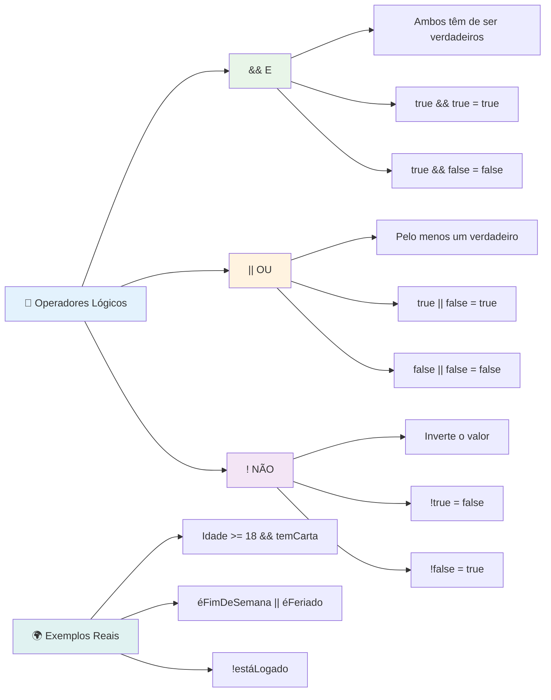
## Condições e Decisões com Operadores Lógicos

Vamos ver estes operadores lógicos em ação com um exemplo mais realista:

```javascript
let currentMoney = 600;
let laptopPrice = 800;
let laptopDiscountPrice = laptopPrice - (laptopPrice * 0.2); // Preço do portátil com 20 por cento de desconto

if (currentMoney >= laptopPrice || currentMoney >= laptopDiscountPrice) {
  // A condição é verdadeira. O código neste bloco será executado.
  console.log("Getting a new laptop!");
} else {
  // A condição é falsa. O código neste bloco será executado.
  console.log("Can't afford a new laptop, yet!");
}
```

Neste exemplo: calculamos um preço com 20% de desconto (640), depois avaliamos se os nossos fundos disponíveis cobrem ou o preço total OU o preço com desconto. Como 600 não atinge o limiar do preço com desconto de 640, a condição avalia para falso.

### 🧮 **Verificação de Operadores Lógicos: Combinando Condições**

**Teste o seu entendimento dos operadores lógicos:**
- Na expressão `A && B`, o que acontece se A for falso? Será que B sequer é avaliado?
- Consegue pensar numa situação onde precisaria dos três operadores (&&, ||, !) juntos?
- Qual é a diferença entre `!user.isActive` e `user.isActive !== true`?

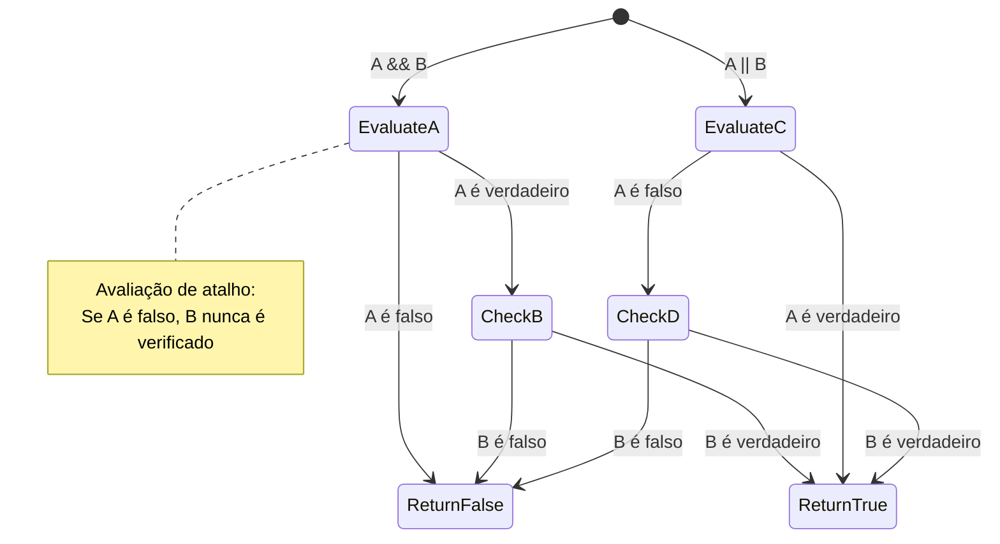
> **Dica de desempenho**: JavaScript usa "avaliação de curto-circuito" - em `A && B`, se A for falso, B nem é avaliado. Aproveite isso a seu favor!

### Operador de Negação

Por vezes é mais fácil pensar quando algo NÃO é verdade. Por exemplo, em vez de perguntar "o utilizador está autenticado?", pode querer perguntar "o utilizador NÃO está autenticado?" O operador de exclamação (`!`) inverte a lógica para si.

```javascript
if (!condition) {
  // é executado se a condição for falsa
} else {
  // é executado se a condição for verdadeira
}
```

O operador `!` é como dizer "o oposto de..." – se algo é `true`, `!` torna-o `false`, e vice-versa.

### Expressões Ternárias

Para atribuições condicionais simples, o JavaScript fornece o **operador ternário**. Esta sintaxe concisa permite escrever uma expressão condicional numa única linha, útil quando precisa atribuir um de dois valores com base numa condição.

```javascript
let variable = condition ? returnThisIfTrue : returnThisIfFalse;
```

Lê-se como uma pergunta: "Esta condição é verdadeira? Se sim, usa este valor. Se não, usa aquele valor."

Abaixo está um exemplo mais concreto:

```javascript
let firstNumber = 20;
let secondNumber = 10;
let biggestNumber = firstNumber > secondNumber ? firstNumber : secondNumber;
```

✅ Reserve um minuto para ler este código algumas vezes. Compreende como estes operadores funcionam?

Isto é o que esta linha está a dizer: "Será que `firstNumber` é maior que `secondNumber`? Se sim, guarda `firstNumber` em `biggestNumber`. Se não, guarda `secondNumber` em `biggestNumber`."

O operador ternário é apenas uma forma mais curta de escrever esta declaração tradicional `if..else`:

```javascript
let biggestNumber;
if (firstNumber > secondNumber) {
  biggestNumber = firstNumber;
} else {
  biggestNumber = secondNumber;
}
```

Ambas as abordagens produzem resultados idênticos. O operador ternário oferece concisão, enquanto a estrutura tradicional if-else pode ser mais legível para condições complexas.

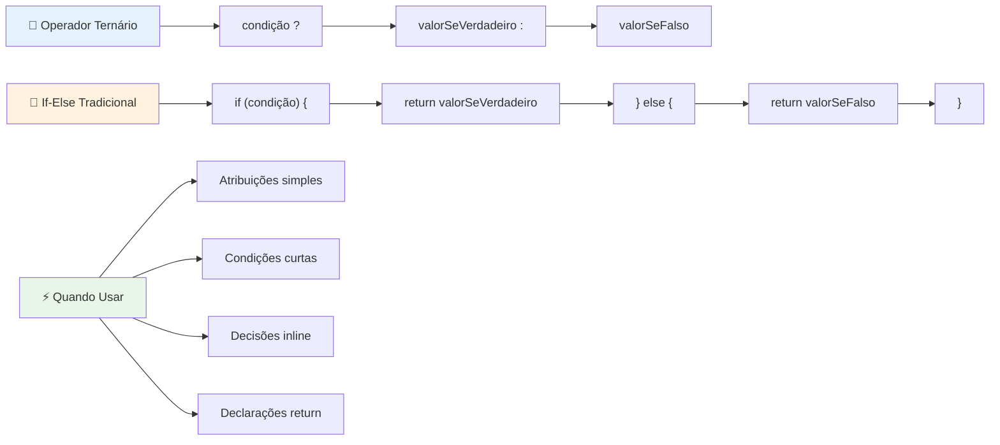
---


## 🚀 Desafio

Crie um programa que seja escrito primeiro com operadores lógicos e depois reescreva-o usando uma expressão ternária. Qual sintaxe prefere?

---

## Desafio GitHub Copilot Agent 🚀

Use o modo Agente para completar o seguinte desafio:

**Descrição:** Crie um calculador de notas completo que demonstre múltiplos conceitos de tomada de decisão desta lição, incluindo declarações if-else, declarações switch, operadores lógicos e expressões ternárias.

**Prompt:** Escreva um programa JavaScript que recebe a nota numérica de um aluno (0-100) e determina a sua nota em letras usando os seguintes critérios:
- A: 90-100
- B: 80-89  
- C: 70-79
- D: 60-69
- F: Abaixo de 60

Requisitos:
1. Use uma declaração if-else para determinar a nota em letras
2. Use operadores lógicos para verificar se o estudante passa (nota >= 60) E tem distinção (nota >= 90)  
3. Use uma instrução switch para fornecer feedback específico para cada letra de nota  
4. Use um operador ternário para determinar se o estudante é elegível para o próximo curso (nota >= 70)  
5. Inclua validação de entrada para garantir que a pontuação esteja entre 0 e 100  

Teste o seu programa com várias pontuações, incluindo casos limite como 59, 60, 89, 90 e entradas inválidas.  

Saiba mais sobre [modo agente](https://code.visualstudio.com/blogs/2025/02/24/introducing-copilot-agent-mode) aqui.  


## Questionário Pós-Aula

[Questionário pós-aula](https://ff-quizzes.netlify.app/web/quiz/12)

## Revisão & Autoestudo

Leia mais sobre os muitos operadores disponíveis para o utilizador [na MDN](https://developer.mozilla.org/docs/Web/JavaScript/Reference/Operators).  

Explore o maravilhoso [consultor de operadores](https://joshwcomeau.com/operator-lookup/) do Josh Comeau!

## Tarefa

[Operadores](assignment.md)

---

## 🧠 **Resumo do Seu Kit de Ferramentas de Tomada de Decisão**

```mermaid
graph TD
    A["🎯 Decisões JavaScript"] --> B["🔍 Lógica Booleana"]
    A --> C["📊 Declarações Condicionais"]
    A --> D["🔗 Operadores Lógicos"]
    A --> E["⚡ Padrões Avançados"]
    
    B --> B1["valores true/false"]
    B --> B2["Operadores de comparação"]
    B --> B3["Conceitos de veracidade"]
    
    C --> C1["declarações if"]
    C --> C2["cadeias if-else"]
    C --> C3["declarações switch"]
    
    D --> D1["&& (E)"]
    D --> D2["|| (OU)"]
    D --> D3["! (NÃO)"]
    
    E --> E1["Operador ternário"]
    E --> E2["Avaliação de curta-circuito"]
    E --> E3["Condições complexas"]
    
    F["💡 Princípios Chave"] --> F1["Condições claras e legíveis"]
    F --> F2["Estilo de comparação consistente"]
    F --> F3["Precedência correta de operadores"]
    F --> F4["Ordem de avaliação eficiente"]
    
    style A fill:#e3f2fd
    style B fill:#e8f5e8
    style C fill:#fff3e0
    style D fill:#f3e5f5
    style E fill:#e0f2f1
    style F fill:#fce4ec
```
---

## 🚀 A Sua Linha Temporal para Dominar a Tomada de Decisão em JavaScript

### ⚡ **O Que Pode Fazer nos Próximos 5 Minutos**
- [ ] Praticar operadores de comparação na consola do navegador  
- [ ] Escrever uma simples instrução if-else que verifica a sua idade  
- [ ] Tentar o desafio: reescrever um if-else usando um operador ternário  
- [ ] Testar o que acontece com diferentes valores "truthy" e "falsy"  

### 🎯 **O Que Pode Concluir Nesta Hora**
- [ ] Completar o questionário pós-aula e rever quaisquer conceitos que tenham gerado dúvidas  
- [ ] Construir a calculadora de notas abrangente do desafio GitHub Copilot  
- [ ] Criar uma árvore de decisão simples para um cenário do mundo real (como escolher o que vestir)  
- [ ] Praticar combinar múltiplas condições com operadores lógicos  
- [ ] Experimentar instruções switch para diferentes usos  

### 📅 **Domínio da Lógica ao Longo da Semana**
- [ ] Completar a tarefa de operadores com exemplos criativos  
- [ ] Construir uma aplicação de mini quiz usando várias estruturas condicionais  
- [ ] Criar um validador de formulário que verifica múltiplas condições de entrada  
- [ ] Praticar os exercícios do [consultor de operadores](https://joshwcomeau.com/operator-lookup/) do Josh Comeau  
- [ ] Refatorar código existente para usar estruturas condicionais mais adequadas  
- [ ] Estudar avaliação de curto-circuito e implicações de desempenho  

### 🌟 **A Sua Transformação ao Longo do Mês**
- [ ] Dominar condições complexas aninhadas mantendo a legibilidade do código  
- [ ] Construir uma aplicação com lógica sofisticada de tomada de decisão  
- [ ] Contribuir para open source melhorando a lógica condicional em projetos existentes  
- [ ] Ensinar outra pessoa sobre diferentes estruturas condicionais e quando usar cada uma  
- [ ] Explorar abordagens de programação funcional para lógica condicional  
- [ ] Criar um guia de referência pessoal para boas práticas condicionais  

### 🏆 **Verificação Final do Campeão da Tomada de Decisão**

**Celebre a sua maestria no pensamento lógico:**  
- Qual foi a lógica de decisão mais complexa que implementou com sucesso?  
- Qual estrutura condicional lhe parece mais natural e porquê?  
- Como o aprender sobre operadores lógicos mudou a sua abordagem à resolução de problemas?  
- Que aplicação real beneficiaria de uma lógica sofisticada de tomada de decisão?  

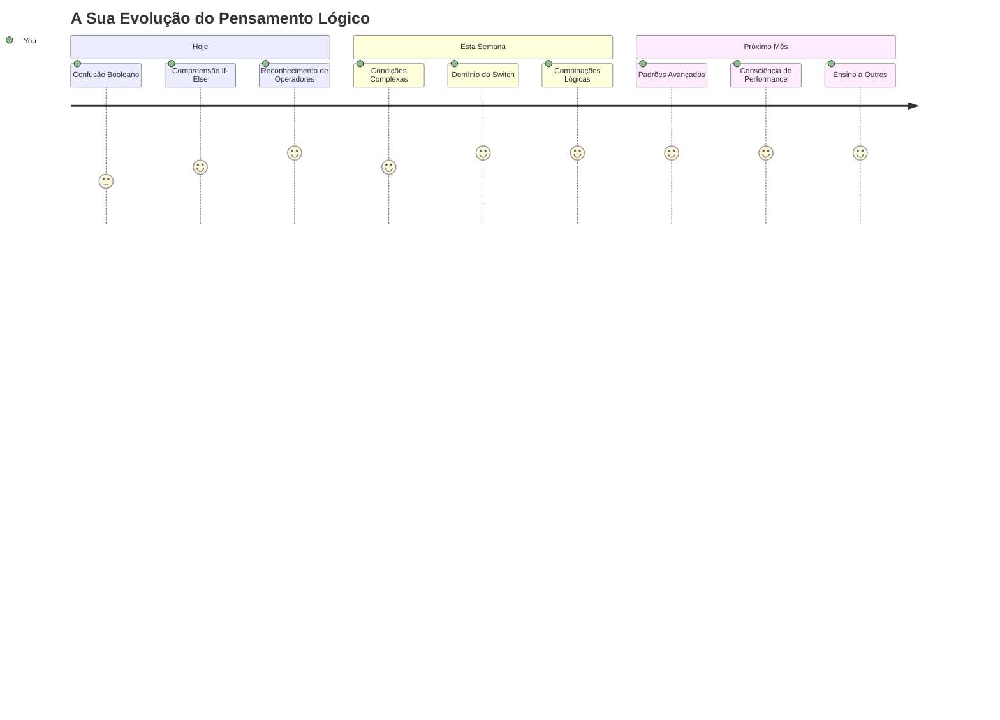
> 🧠 **Você dominou a arte da tomada de decisão digital!** Cada aplicação interativa depende da lógica condicional para responder inteligentemente às ações do utilizador e às condições mutantes. Agora compreende como fazer seus programas pensar, avaliar e escolher respostas apropriadas. Esta base lógica irá potenciar todas as aplicações dinâmicas que construir! 🎉

---

<!-- CO-OP TRANSLATOR DISCLAIMER START -->
**Aviso Legal**:  
Este documento foi traduzido utilizando o serviço de tradução por IA [Co-op Translator](https://github.com/Azure/co-op-translator). Embora nos esforcemos por garantir a precisão, por favor tenha em atenção que traduções automáticas podem conter erros ou imprecisões. O documento original no seu idioma nativo deve ser considerado a fonte oficial. Para informações críticas, recomenda-se a tradução profissional humana. Não nos responsabilizamos por quaisquer mal-entendidos ou interpretações erradas decorrentes do uso desta tradução.
<!-- CO-OP TRANSLATOR DISCLAIMER END -->